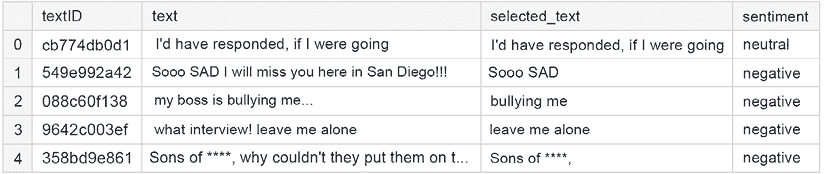
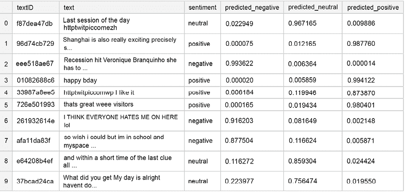
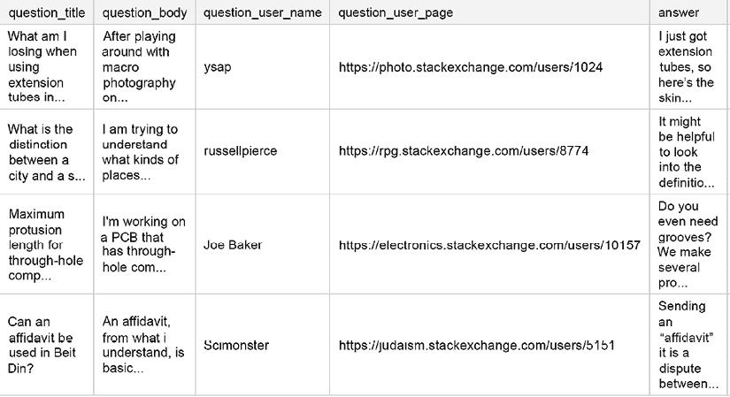

# 第十一章：NLP 建模

**自然语言处理**（**NLP**）是一个在语言学、计算机科学和人工智能交叉领域的学科。其主要关注点是算法，用于处理和分析大量自然语言数据。在过去的几年里，它已经成为 Kaggle 竞赛中越来越受欢迎的话题。虽然该领域本身非常广泛，包括非常受欢迎的话题，如聊天机器人和机器翻译，但在本章中，我们将专注于 Kaggle 竞赛经常涉及的具体子集。

将情感分析视为一个简单的分类问题非常受欢迎，并且被广泛讨论，因此我们将从对问题的某种更有趣的变体开始：在推文中识别情感支持短语。我们将继续描述一个开放域问答问题的示例解决方案，并以一个关于 NLP 问题增强的章节结束，这是一个比其计算机视觉对应物受到更多关注的主题。

总结来说，我们将涵盖：

+   情感分析

+   开放域问答

+   文本增强策略

# 情感分析

Twitter 是最受欢迎的社会媒体平台之一，也是许多个人和公司的重要沟通工具。

在后一种情况下，在语言中捕捉情感尤为重要：一条积极的推文可以迅速传播，而一条特别消极的推文可能会造成伤害。由于人类语言很复杂，因此不仅需要决定情感，而且还需要能够调查“如何”：哪些单词实际上导致了情感描述？

我们将通过使用来自*推文情感提取*竞赛（[`www.kaggle.com/c/tweet-sentiment-extraction`](https://www.kaggle.com/c/tweet-sentiment-extraction)）的数据来展示解决这个问题的一种方法。为了简洁起见，我们省略了以下代码中的导入，但您可以在 GitHub 上本章相应笔记本中找到它们。

为了更好地了解这个问题，让我们先看看数据：

```py
df = pd.read_csv('/kaggle/input/tweet-sentiment-extraction/train.csv')
df.head() 
```

这里是前几行：



图 11.1：训练数据中的样本行

实际的推文存储在`text`列中。每个推文都有一个相关的`sentiment`，以及存储在`selected_text`列中的**支持短语**（基于情感分配决策的推文部分）。

我们首先定义基本的清理函数。首先，我们想要去除网站 URL 和非字符，并将人们用来代替脏话的星号替换为单个标记，`"swear"`。我们使用一些正则表达式来帮助我们完成这项工作：

```py
def basic_cleaning(text):
    text=re.sub(r'https?://www\.\S+\.com','',text)
    text=re.sub(r'[^A-Za-z|\s]','',text)
    text=re.sub(r'\*+','swear',text) # Capture swear words that are **** out
    return text 
```

接下来，我们将从推文的正文中移除 HTML 以及表情符号：

```py
def remove_html(text):
    html=re.compile(r'<.*?>')
    return html.sub(r'',text)
def remove_emoji(text):
    emoji_pattern = re.compile("["
                           u"\U0001F600-\U0001F64F" #emoticons
                           u"\U0001F300-\U0001F5FF" #symbols & pictographs
                           u"\U0001F680-\U0001F6FF" #transport & map symbols
                           u"\U0001F1E0-\U0001F1FF" #flags (iOS)
                           u"\U00002702-\U000027B0"
                           u"\U000024C2-\U0001F251"
                           "]+", flags=re.UNICODE)
    return emoji_pattern.sub(r'', text) 
```

最后，我们希望能够移除重复的字符（例如，这样我们就有“way”而不是“waaaayyyyy”）：

```py
def remove_multiplechars(text):
    text = re.sub(r'(.)\1{3,}',r'\1', text)
    return text 
```

为了方便，我们将四个函数组合成一个单一的清理函数：

```py
def clean(df):
    for col in ['text']:#,'selected_text']:
        df[col]=df[col].astype(str).apply(lambda x:basic_cleaning(x))
        df[col]=df[col].astype(str).apply(lambda x:remove_emoji(x))
        df[col]=df[col].astype(str).apply(lambda x:remove_html(x))
        df[col]=df[col].astype(str).apply(lambda x:remove_multiplechars(x))
    return df 
```

最后的准备涉及编写基于预训练模型（`tokenizer`参数）创建嵌入的函数：

```py
def fast_encode(texts, tokenizer, chunk_size=256, maxlen=128):
    tokenizer.enable_truncation(max_length=maxlen)
    tokenizer.enable_padding(max_length=maxlen)
    all_ids = []

    for i in range(0, len(texts), chunk_size):
        text_chunk = texts[i:i+chunk_size].tolist()
        encs = tokenizer.encode_batch(text_chunk)
        all_ids.extend([enc.ids for enc in encs])

    return np.array(all_ids) 
```

接下来，我们创建一个预处理函数，使我们能够处理整个语料库：

```py
def preprocess_news(df,stop=stop,n=1,col='text'):
    '''Function to preprocess and create corpus'''
    new_corpus=[]
    stem=PorterStemmer()
    lem=WordNetLemmatizer()
    for text in df[col]:
        words=[w for w in word_tokenize(text) if (w not in stop)]

        words=[lem.lemmatize(w) for w in words if(len(w)>n)]

        new_corpus.append(words)

    new_corpus=[word for l in new_corpus for word in l]
    return new_corpus 
```

使用我们之前准备好的函数，我们可以清理和准备训练数据。`sentiment`列是我们的目标，我们将其转换为虚拟变量（独热编码）以提高性能：

```py
df.dropna(inplace=True)
df_clean = clean(df)
df_clean_selection = df_clean.sample(frac=1)
X = df_clean_selection.text.values
y = pd.get_dummies(df_clean_selection.sentiment) 
```

下一个必要的步骤是对输入文本进行**分词**，以及将它们转换为序列（包括填充，以确保数据集跨数据集的长度相等）：

```py
tokenizer = text.Tokenizer(num_words=20000)
tokenizer.fit_on_texts(list(X))
list_tokenized_train = tokenizer.texts_to_sequences(X)
X_t = sequence.pad_sequences(list_tokenized_train, maxlen=128) 
```

我们将使用**DistilBERT**为我们的模型创建嵌入，并直接使用它们。DistilBERT 是 BERT 的一个轻量级版本：权衡是参数减少 40%时的性能损失 3%。我们可以训练嵌入层并提高性能——但代价是大幅增加的训练时间。

```py
tokenizer = transformers.AutoTokenizer.from_pretrained("distilbert-base-uncased")  
# Save the loaded tokenizer locally
save_path = '/kaggle/working/distilbert_base_uncased/'
if not os.path.exists(save_path):
    os.makedirs(save_path)
tokenizer.save_pretrained(save_path)
# Reload it with the huggingface tokenizers library
fast_tokenizer = BertWordPieceTokenizer(
                 'distilbert_base_uncased/vocab.txt', lowercase=True)
fast_tokenizer 
```

我们可以使用之前定义的`fast_encode`函数，以及上面定义的`fast_tokenizer`，来编码推文：

```py
X = fast_encode(df_clean_selection.text.astype(str),
                fast_tokenizer,
                maxlen=128) 
```

数据准备就绪后，我们可以构建模型。为了这次演示，我们将采用这些应用中相当标准的架构：结合 LSTM 层、通过全局池化和 dropout 归一化，以及顶部的密集层。为了实现真正有竞争力的解决方案，需要对架构进行一些调整：一个“更重”的模型，更大的嵌入，LSTM 层中的更多单元，等等。

```py
transformer_layer = transformers.TFDistilBertModel.from_pretrained('distilbert-base-uncased')
embedding_size = 128
input_ = Input(shape=(100,))
inp = Input(shape=(128, ))
embedding_matrix=transformer_layer.weights[0].numpy()
x = Embedding(embedding_matrix.shape[0],
              embedding_matrix.shape[1],
              embeddings_initializer=Constant(embedding_matrix),
              trainable=False)(inp)
x = Bidirectional(LSTM(50, return_sequences=True))(x)
x = Bidirectional(LSTM(25, return_sequences=True))(x)
x = GlobalMaxPool1D()(x)
x = Dropout(0.5)(x)
x = Dense(50, activation='relu', kernel_regularizer='L1L2')(x)
x = Dropout(0.5)(x)
x = Dense(3, activation='softmax')(x)
model_DistilBert = Model(inputs=[inp], outputs=x)
model_DistilBert.compile(loss='categorical_crossentropy',
                              optimizer='adam',
                              metrics=['accuracy']) 
```

对于数据的时序维度没有特殊需要关注，所以我们满足于将数据随机分为训练集和验证集，这可以在调用`fit`方法内部实现：

```py
model_DistilBert.fit(X,y,batch_size=32,epochs=10,validation_split=0.1) 
```

以下是一些示例输出：

```py
Epoch 1/10
27480/27480 [==============================] - 480s 17ms/step - loss: 0.5100 - accuracy: 0.7994
Epoch 2/10
27480/27480 [==============================] - 479s 17ms/step - loss: 0.4956 - accuracy: 0.8100
Epoch 3/10
27480/27480 [==============================] - 475s 17ms/step - loss: 0.4740 - accuracy: 0.8158
Epoch 4/10
27480/27480 [==============================] - 475s 17ms/step - loss: 0.4528 - accuracy: 0.8275
Epoch 5/10
27480/27480 [==============================] - 475s 17ms/step - loss: 0.4318 - accuracy: 0.8364
Epoch 6/10
27480/27480 [==============================] - 475s 17ms/step - loss: 0.4069 - accuracy: 0.8441
Epoch 7/10
27480/27480 [==============================] - 477s 17ms/step - loss: 0.3839 - accuracy: 0.8572 
```

从拟合的模型生成预测的过程是直接的。为了利用所有可用数据，我们首先在所有可用数据上重新训练我们的模型（因此没有验证）：

```py
df_clean_final = df_clean.sample(frac=1)
X_train = fast_encode(df_clean_selection.text.astype(str),
                      fast_tokenizer,
                      maxlen=128)
y_train = y 
```

在生成预测之前，我们在整个数据集上重新拟合了模型：

```py
Adam_name = adam(lr=0.001)
model_DistilBert.compile(loss='categorical_crossentropy',optimizer=Adam_name,metrics=['accuracy'])
history = model_DistilBert.fit(X_train,y_train,batch_size=32,epochs=10) 
```

我们下一步是将测试数据处理成与用于模型训练数据相同的格式：

```py
df_test = pd.read_csv('/kaggle/input/tweet-sentiment-extraction/test.csv')
df_test.dropna(inplace=True)
df_clean_test = clean(df_test)
X_test = fast_encode(df_clean_test.text.values.astype(str),
                     fast_tokenizer,
                     maxlen=128)
y_test = df_clean_test.sentiment 
```

最后，我们生成预测：

```py
y_preds = model_DistilBert.predict(X_test)
y_predictions = pd.DataFrame(y_preds,
                             columns=['negative','neutral','positive'])
y_predictions_final = y_predictions.idxmax(axis=1)
accuracy = accuracy_score(y_test,y_predictions_final)
print(f"The final model shows {accuracy:.2f} accuracy on the test set.") 
```

最终模型在测试集上的准确率为**0.74**。以下我们展示了一些输出样例；正如您从这些几行中已经可以看到的，有些情况下情感对人类读者来说很明显，但模型未能捕捉到：



图 11.2：预测结果中的示例行

我们现在已经演示了一个用于解决情感归属问题的样本管道（识别导致标注者在情感分类决策中做出决定的文本部分）。如果您想实现有竞争力的性能，以下是一些可以进行的改进，按可能的影响顺序排列：

+   **更大的嵌入**：这使我们能够在（处理过的）输入数据级别上捕获更多信息

+   **更大的模型**：LSTM 层中的单元更多

+   **更长的训练**：换句话说，更多的 epoch

虽然上述改进无疑会提高模型的性能，但我们管道的核心元素是可重用的：

+   数据清洗和预处理

+   创建文本嵌入

+   在目标模型架构中结合循环层和正则化

我们现在将讨论开放域问答，这是在 NLP 竞赛中经常遇到的问题。


Abhishek Thakur

[`www.kaggle.com/abhishek`](https://www.kaggle.com/abhishek)

我们采访了 Abhishek Thakur，他是世界上第一位四重 Kaggle 大师。他目前在 Hugging Face 工作，在那里他正在构建 AutoNLP；他还写了几乎唯一一本关于 Kaggle 的英文书籍（除了这本书之外！）*接近（几乎）任何机器学习问题*。

你在 Kaggle 上的专长是什么？

*没有。每个竞赛都不同，从每个竞赛中都可以学到很多东西。如果我要有一个专长，我会在那个领域的所有竞赛中获胜。*

你是如何处理 Kaggle 竞赛的？这种处理方式与你在日常工作中所做的是否不同？

*我首先会查看数据，并试图理解它。如果我在竞赛中落后了，我会寻求公共 EDA 核的帮助。*

*当我接近 Kaggle（或非 Kaggle）上的问题时，我首先会建立一个基准。建立基准非常重要，因为它为你提供了一个可以比较未来模型的基准。如果我在建立基准方面落后了，我会尽量避免使用公共 Notebooks。如果我们那样做，我们只会朝一个方向思考。至少，我感觉是这样的。*

*当我完成一个基准测试后，我会尽量在不做任何复杂操作，比如堆叠或混合的情况下，尽可能多地提取信息。然后我会再次检查数据和模型，并尝试逐步改进基准。*

*日常工作中有时有很多相似之处。大多数时候都有一个基准，然后你必须提出技术、特征、模型来击败基准。*

你参加的最有趣的竞赛是什么？你有什么特别的见解吗？

*每个竞赛都很吸引人。*

Kaggle 是否帮助你在职业生涯中取得进展？

*当然，它有帮助。在过去的几年里，Kaggle 在招聘数据科学家和机器学习工程师方面赢得了非常好的声誉。Kaggle 排名和与许多数据集的经验无疑在行业中以某种方式有所帮助。你越熟悉处理不同类型的问题，你迭代的速度就越快。这在行业中是非常有用的。没有人愿意花几个月的时间做对业务没有任何价值的事情。*

在您的经验中，不经验丰富的 Kagglers 通常忽略什么？您现在知道什么，而您希望自己在最初开始时就知道？

*大多数初学者很容易放弃。加入 Kaggle 竞赛并受到顶尖选手的威胁是非常容易的。如果初学者想在 Kaggle 上成功，他们必须要有毅力。在我看来，毅力是关键。许多初学者也未能独立开始，而是一直坚持使用公共内核。这使得他们像公共内核的作者一样思考。我的建议是先从自己的竞赛开始，查看数据，构建特征，构建模型，然后深入内核和讨论，看看其他人可能有什么不同的做法。然后，将您所学到的知识融入到自己的解决方案中。*

# 开放域问答

在本节中，我们将探讨*Google QUEST Q&A Labeling*竞赛([`www.kaggle.com/c/google-quest-challenge/overview/description`](https://www.kaggle.com/c/google-quest-challenge/overview/description))。在这个竞赛中，问题-答案对由人类评分员根据一系列标准进行评估，例如“问题对话性”、“问题求证事实”或“答案有帮助”。任务是预测每个目标列（对应于标准）的数值；由于标签是跨多个评分员汇总的，因此目标列实际上是一个多元回归输出，目标列被归一化到单位范围。

在使用高级技术（如基于 transformer 的 NLP 模型）进行建模之前，通常使用更简单的方法建立一个基线是一个好主意。与上一节一样，为了简洁，我们将省略导入部分，但您可以在 GitHub 仓库中的笔记本中找到它们。

我们首先定义几个辅助函数，这些函数可以帮助我们提取文本的不同方面。首先，一个函数将输出给定字符串的词数：

```py
def word_count(xstring):
    return xstring.split().str.len() 
```

竞赛中使用的指标是**斯皮尔曼相关系数**（在排名上计算的线性相关系数：[`en.wikipedia.org/wiki/Spearman%27s_rank_correlation_coefficient`](https://en.wikipedia.org/wiki/Spearman%27s_rank_correlation_coefficient))。

由于我们打算构建一个 Scikit-learn 管道，定义一个指标作为评分器是有用的（`make_scorer`方法是一个 Scikit-learn 的包装器，它接受一个评分函数——如准确度或 MSE——并返回一个可调用的对象，该对象对估计器的输出进行评分）：

```py
def spearman_corr(y_true, y_pred):
        if np.ndim(y_pred) == 2:
            corr = np.mean([stats.spearmanr(y_true[:, i],
                                            y_pred[:, i])[0]
for i in range(y_true.shape[1])])
        else:
            corr = stats.spearmanr(y_true, y_pred)[0]
        return corr

custom_scorer = make_scorer(spearman_corr, greater_is_better=True) 
```

接下来，一个小型的辅助函数，用于从`l`中提取大小为`n`的连续块。这将帮助我们稍后在不遇到内存问题时为我们的文本生成嵌入：

```py
def chunks(l, n):
    for i in range(0, len(l), n):
        yield l[i:i + n] 
```

我们将使用的特征集的一部分是来自预训练模型的嵌入。回想一下，本节的想法是构建一个不训练复杂模型的基线，但这并不妨碍我们使用现有的模型。

我们首先导入分词器和模型，然后以块的形式处理语料库，将每个问题/答案编码为固定大小的嵌入：

```py
def fetch_vectors(string_list, batch_size=64):
    # Inspired by https://jalammar.github.io/a-visual-guide-to-using-bert-    for-the-first-time/
    DEVICE = torch.device("cuda")
    tokenizer = transformers.DistilBertTokenizer.from_pretrained
                    ("../input/distilbertbaseuncased/")
    model = transformers.DistilBertModel.from_pretrained
                ("../input/distilbertbaseuncased/")
    model.to(DEVICE)
    fin_features = []
    for data in chunks(string_list, batch_size):
        tokenized = []
        for x in data:
            x = " ".join(x.strip().split()[:300])
            tok = tokenizer.encode(x, add_special_tokens=True)
            tokenized.append(tok[:512])
        max_len = 512
        padded = np.array([i + [0] * (max_len - len(i)) for i in tokenized])
        attention_mask = np.where(padded != 0, 1, 0)
        input_ids = torch.tensor(padded).to(DEVICE)
        attention_mask = torch.tensor(attention_mask).to(DEVICE)
        with torch.no_grad():
            last_hidden_states = model(input_ids,
                                       attention_mask=attention_mask)
        features = last_hidden_states[0][:, 0, :].cpu().numpy()
        fin_features.append(features)
    fin_features = np.vstack(fin_features)
    return fin_features 
```

我们现在可以继续加载数据：

```py
xtrain = pd.read_csv(data_dir + 'train.csv')
xtest = pd.read_csv(data_dir + 'test.csv')
xtrain.head(4) 
```

这里是前几行：



图 11.3：训练数据中的样本行

我们指定了我们感兴趣的 30 个目标列：

```py
target_cols = ['question_asker_intent_understanding',
               'question_body_critical', 
               'question_conversational', 'question_expect_short_answer', 
               'question_fact_seeking',
               'question_has_commonly_accepted_answer', 
               'question_interestingness_others',
               'question_interestingness_self', 
               'question_multi_intent', 'question_not_really_a_question', 
               'question_opinion_seeking', 'question_type_choice', 
               'question_type_compare', 'question_type_consequence', 
               'question_type_definition', 'question_type_entity', 
               'question_type_instructions', 'question_type_procedure', 
               'question_type_reason_explanation',
               'question_type_spelling', 
               'question_well_written', 'answer_helpful', 
               'answer_level_of_information', 'answer_plausible', 
               'answer_relevance', 'answer_satisfaction', 
               'answer_type_instructions', 'answer_type_procedure', 
               'answer_type_reason_explanation', 'answer_well_written'] 
```

关于它们的意义和解释的讨论，读者可以参考竞赛的**数据**页面，在[`www.kaggle.com/c/google-quest-challenge/data`](https://www.kaggle.com/c/google-quest-challenge/data)。

接下来，我们进行**特征工程**。我们首先计算问题标题和正文以及答案中的单词数量。这是一个简单但出人意料的有用特征，在许多应用中都很受欢迎：

```py
for colname in ['question_title', 'question_body', 'answer']:
    newname = colname + '_word_len'

    xtrain[newname] = xtrain[colname].str.split().str.len()
    xtest[newname] = xtest[colname].str.split().str.len() 
```

我们创建的下一个特征是**词汇多样性**，计算文本块中独特单词的比例：

```py
colname = 'answer'
xtrain[colname+'_div'] = xtrain[colname].apply
                         (lambda s: len(set(s.split())) / len(s.split()) )
xtest[colname+'_div'] = xtest[colname].apply
                        (lambda s: len(set(s.split())) / len(s.split()) ) 
```

当处理来自在线的信息时，我们可以通过检查网站地址的组成部分（我们将组成部分定义为由点分隔的地址元素）来提取可能的信息性特征；我们计算组成部分的数量，并将单个组成部分作为特征存储：

```py
for df in [xtrain, xtest]:
    df['domcom'] = df['question_user_page'].apply
                   (lambda s: s.split('://')[1].split('/')[0].split('.'))
    # Count components
    df['dom_cnt'] = df['domcom'].apply(lambda s: len(s))
    # Pad the length in case some domains have fewer components in the name
    df['domcom'] = df['domcom'].apply(lambda s: s + ['none', 'none'])
    # Components
    for ii in range(0,4):
        df['dom_'+str(ii)] = df['domcom'].apply(lambda s: s[ii]) 
```

许多目标列处理的是答案对于给定问题的相关性。一种量化这种关系的方法是评估字符串对中的**共享单词**：

```py
# Shared elements
for df in [xtrain, xtest]:
    df['q_words'] = df['question_body'].apply(lambda s: [f for f in s.split() if f not in eng_stopwords] )
    df['a_words'] = df['answer'].apply(lambda s: [f for f in s.split() if f not in eng_stopwords] )
    df['qa_word_overlap'] = df.apply(lambda s: len(np.intersect1d(s['q_words'], s['a_words'])), axis = 1)
    df['qa_word_overlap_norm1'] = df.apply(lambda s: s['qa_word_overlap']/(1 + len(s['a_words'])), axis = 1)
    df['qa_word_overlap_norm2'] = df.apply(lambda s: s['qa_word_overlap']/(1 + len(s['q_words'])), axis = 1)
    df.drop(['q_words', 'a_words'], axis = 1, inplace = True) 
```

停用词和标点符号的出现模式可以告诉我们一些关于风格和意图的信息：

```py
for df in [xtrain, xtest]:

    ## Number of characters in the text ##
    df["question_title_num_chars"] = df["question_title"].apply(lambda x: len(str(x)))
    df["question_body_num_chars"] = df["question_body"].apply(lambda x: len(str(x)))
    df["answer_num_chars"] = df["answer"].apply(lambda x: len(str(x)))
    ## Number of stopwords in the text ##
    df["question_title_num_stopwords"] = df["question_title"].apply(lambda x: len([w for w in str(x).lower().split() if w in eng_stopwords]))
    df["question_body_num_stopwords"] = df["question_body"].apply(lambda x: len([w for w in str(x).lower().split() if w in eng_stopwords]))
    df["answer_num_stopwords"] = df["answer"].apply(lambda x: len([w for w in str(x).lower().split() if w in eng_stopwords]))
    ## Number of punctuations in the text ##
    df["question_title_num_punctuations"] =df['question_title'].apply(lambda x: len([c for c in str(x) if c in string.punctuation]) )
    df["question_body_num_punctuations"] =df['question_body'].apply(lambda x: len([c for c in str(x) if c in string.punctuation]) )
    df["answer_num_punctuations"] =df['answer'].apply(lambda x: len([c for c in str(x) if c in string.punctuation]) )
    ## Number of title case words in the text ##
    df["question_title_num_words_upper"] = df["question_title"].apply(lambda x: len([w for w in str(x).split() if w.isupper()]))
    df["question_body_num_words_upper"] = df["question_body"].apply(lambda x: len([w for w in str(x).split() if w.isupper()]))
    df["answer_num_words_upper"] = df["answer"].apply(lambda x: len([w for w in str(x).split() if w.isupper()])) 
```

在准备“复古”特征时——我们的重点是文本的简单汇总统计，而不关注语义结构——我们可以继续为问题和答案创建**嵌入**。理论上，我们可以在我们的数据上训练一个单独的 word2vec 类型的模型（或者微调现有的一个），但为了这次演示，我们将直接使用预训练的模型。一个有用的选择是来自 Google 的**通用句子编码器**([`tfhub.dev/google/universal-sentence-encoder/4`](https://tfhub.dev/google/universal-sentence-encoder/4))。这个模型在多种数据源上进行了训练。它接受一段英文文本作为输入，并输出一个 512 维度的向量。

```py
module_url = "../input/universalsentenceencoderlarge4/"
embed = hub.load(module_url) 
```

将文本字段转换为嵌入的代码如下：我们按批处理遍历训练/测试集中的条目，为每个批次嵌入（出于内存效率的考虑），然后将它们附加到原始列表中。

最终的数据框是通过垂直堆叠每个批次级别的嵌入列表构建的：

```py
embeddings_train = {}
embeddings_test = {}
for text in ['question_title', 'question_body', 'answer']:
    train_text = xtrain[text].str.replace('?', '.').str.replace('!', '.').tolist()
    test_text = xtest[text].str.replace('?', '.').str.replace('!', '.').tolist()

    curr_train_emb = []
    curr_test_emb = []
    batch_size = 4
    ind = 0
    while ind*batch_size < len(train_text):
        curr_train_emb.append(embed(train_text[ind*batch_size: (ind + 1)*batch_size])["outputs"].numpy())
        ind += 1

    ind = 0
    while ind*batch_size < len(test_text):
        curr_test_emb.append(embed(test_text[ind*batch_size: (ind + 1)*batch_size])["outputs"].numpy())
        ind += 1    

    embeddings_train[text + '_embedding'] = np.vstack(curr_train_emb)
    embeddings_test[text + '_embedding'] = np.vstack(curr_test_emb)
    print(text) 
```

给定问题和答案的向量表示，我们可以通过在向量对上使用不同的距离度量来计算字段之间的语义相似度。尝试不同度量的背后的想法是希望捕捉到各种类型的特征；在分类的背景下，这可以类比为使用准确性和熵来全面了解情况：

```py
l2_dist = lambda x, y: np.power(x - y, 2).sum(axis=1)
cos_dist = lambda x, y: (x*y).sum(axis=1)
dist_features_train = np.array([
    l2_dist(embeddings_train['question_title_embedding'], embeddings_train['answer_embedding']),
    l2_dist(embeddings_train['question_body_embedding'], embeddings_train['answer_embedding']),
    l2_dist(embeddings_train['question_body_embedding'], embeddings_train['question_title_embedding']),
    cos_dist(embeddings_train['question_title_embedding'], embeddings_train['answer_embedding']),
    cos_dist(embeddings_train['question_body_embedding'], embeddings_train['answer_embedding']),
    cos_dist(embeddings_train['question_body_embedding'], embeddings_train['question_title_embedding'])
]).T
dist_features_test = np.array([
    l2_dist(embeddings_test['question_title_embedding'], embeddings_test['answer_embedding']),
    l2_dist(embeddings_test['question_body_embedding'], embeddings_test['answer_embedding']),
    l2_dist(embeddings_test['question_body_embedding'], embeddings_test['question_title_embedding']),
    cos_dist(embeddings_test['question_title_embedding'], embeddings_test['answer_embedding']),
    cos_dist(embeddings_test['question_body_embedding'], embeddings_test['answer_embedding']),
    cos_dist(embeddings_test['question_body_embedding'], embeddings_test['question_title_embedding'])
]).T 
```

让我们分别收集距离特征到不同的列中：

```py
for ii in range(0,6):
    xtrain['dist'+str(ii)] = dist_features_train[:,ii]
    xtest['dist'+str(ii)] = dist_features_test[:,ii] 
```

最后，我们还可以创建文本字段的**TF-IDF**表示；一般想法是创建基于输入文本多种变换的多个特征，然后将它们输入到一个相对简单的模型中。

这样，我们可以在不拟合复杂深度学习模型的情况下捕获数据的特征。

我们可以通过分析文本的词和字符级别来实现这一点。为了限制内存消耗，我们对这两种类型的特征的最大数量设置上限（你的里程可能会有所不同；如果有更多的内存，这些限制可以增加）：

```py
limit_char = 5000
limit_word = 25000 
```

我们实例化了字符级和词级向量器。我们问题的设置使得 Scikit-learn 的`Pipeline`功能的使用变得方便，允许在模型拟合过程中组合多个步骤。我们首先为标题列创建两个单独的转换器（词级和字符级）：

```py
title_col = 'question_title'
title_transformer = Pipeline([
    ('tfidf', TfidfVectorizer(lowercase = False, max_df = 0.3, min_df = 1,
                             binary = False, use_idf = True, smooth_idf = False,
                             ngram_range = (1,2), stop_words = 'english', 
                             token_pattern = '(?u)\\b\\w+\\b' , max_features = limit_word ))
])
title_transformer2 = Pipeline([
 ('tfidf2',  TfidfVectorizer(sublinear_tf=True,
    strip_accents='unicode', analyzer='char',
    stop_words='english', ngram_range=(1, 4), max_features= limit_char))   
]) 
```

我们对正文使用相同的逻辑（两个不同的管道转换器）：

```py
body_col = 'question_body'
body_transformer = Pipeline([
    ('tfidf',TfidfVectorizer(lowercase = False, max_df = 0.3, min_df = 1,
                             binary = False, use_idf = True, smooth_idf = False,
                             ngram_range = (1,2), stop_words = 'english', 
                             token_pattern = '(?u)\\b\\w+\\b' , max_features = limit_word ))
])
body_transformer2 = Pipeline([
 ('tfidf2',  TfidfVectorizer( sublinear_tf=True,
    strip_accents='unicode', analyzer='char',
    stop_words='english', ngram_range=(1, 4), max_features= limit_char))   
]) 
```

最后，对于答案列：

```py
answer_col = 'answer'
answer_transformer = Pipeline([
    ('tfidf', TfidfVectorizer(lowercase = False, max_df = 0.3, min_df = 1,
                             binary = False, use_idf = True, smooth_idf = False,
                             ngram_range = (1,2), stop_words = 'english', 
                             token_pattern = '(?u)\\b\\w+\\b' , max_features = limit_word ))
])
answer_transformer2 = Pipeline([
 ('tfidf2',  TfidfVectorizer( sublinear_tf=True,
    strip_accents='unicode', analyzer='char',
    stop_words='english', ngram_range=(1, 4), max_features= limit_char))   
]) 
```

我们通过处理数值特征来结束特征工程部分。我们只使用简单的方法：用缺失值插补处理 N/A 值，并使用幂转换器来稳定分布并使其更接近高斯分布（如果你在神经网络中使用数值特征，这通常很有帮助）：

```py
num_cols = [
    'question_title_word_len', 'question_body_word_len',
    'answer_word_len', 'answer_div',
    'question_title_num_chars','question_body_num_chars',
    'answer_num_chars',
    'question_title_num_stopwords','question_body_num_stopwords',
    'answer_num_stopwords',
    'question_title_num_punctuations',
    'question_body_num_punctuations','answer_num_punctuations',
    'question_title_num_words_upper',
    'question_body_num_words_upper','answer_num_words_upper',
    'dist0', 'dist1', 'dist2', 'dist3', 'dist4',       'dist5'
]
num_transformer = Pipeline([
    ('impute', SimpleImputer(strategy='constant', fill_value=0)),
    ('scale', PowerTransformer(method='yeo-johnson'))
]) 
```

Pipelines 的一个有用特性是它们可以被组合和嵌套。接下来，我们添加处理分类变量的功能，然后将所有这些整合到一个`ColumnTransformer`对象中，以简化数据预处理和特征工程逻辑。输入的每个部分都可以以适当的方式处理：

```py
cat_cols = [ 'dom_0',  'dom_1', 'dom_2', 
    'dom_3', 'category','is_question_no_name_user',
    'is_answer_no_name_user','dom_cnt'
]
cat_transformer = Pipeline([
    ('impute', SimpleImputer(strategy='constant', fill_value='')),
    ('encode', OneHotEncoder(handle_unknown='ignore'))
])
preprocessor = ColumnTransformer(
    transformers = [
        ('title', title_transformer, title_col),
        ('title2', title_transformer2, title_col),
        ('body', body_transformer, body_col),
        ('body2', body_transformer2, body_col),
        ('answer', answer_transformer, answer_col),
        ('answer2', answer_transformer2, answer_col),
        ('num', num_transformer, num_cols),
        ('cat', cat_transformer, cat_cols)
    ]
) 
```

最后，我们准备好使用一个结合预处理和模型拟合的`Pipeline`对象：

```py
pipeline = Pipeline([
    ('preprocessor', preprocessor),
    ('estimator',Ridge(random_state=RANDOM_STATE))
]) 
```

总是评估你的模型在样本外的性能是一个好主意：一个方便的做法是创建**折叠外预测**，这在第六章中已经讨论过。该过程涉及以下步骤：

1.  将数据分成折叠。在我们的案例中，我们使用`GroupKFold`，因为一个问题可以有多个答案（在数据框的单独行中）。为了防止信息泄露，我们想要确保每个问题只出现在一个折叠中。

1.  对于每个折叠，使用其他折叠中的数据训练模型，并为选择的折叠以及测试集生成预测。

1.  对测试集上的预测进行平均。

我们开始准备“存储”矩阵，我们将在这里存储预测。`mvalid`将包含折叠外的预测，而`mfull`是整个测试集预测的占位符，这些预测在折叠间平均。由于几个问题包含多个候选答案，我们在`question_body`上对`KFold`分割进行分层：

```py
nfolds = 5
mvalid = np.zeros((xtrain.shape[0], len(target_cols)))
mfull = np.zeros((xtest.shape[0], len(target_cols)))
kf = GroupKFold(n_splits= nfolds).split(X=xtrain.question_body, groups=xtrain.question_body) 
```

我们遍历折叠并构建单独的模型：

```py
for ind, (train_index, test_index) in enumerate(kf):

    # Split the data into training and validation
    x0, x1 = xtrain.loc[train_index], xtrain.loc[test_index]
    y0, y1 = ytrain.loc[train_index], ytrain.loc[test_index]
    for ii in range(0, ytrain.shape[1]):
        # Fit model
        be = clone(pipeline)
        be.fit(x0, np.array(y0)[:,ii])
        filename = 'ridge_f' + str(ind) + '_c' + str(ii) + '.pkl'
        pickle.dump(be, open(filename, 'wb'))

        # Storage matrices for the OOF and test predictions, respectively
        mvalid[test_index, ii] = be.predict(x1)
        mfull[:,ii] += be.predict(xtest)/nfolds

    print('---') 
```

一旦拟合部分完成，我们就可以根据竞赛中指定的指标来评估性能：

```py
corvec = np.zeros((ytrain.shape[1],1))
for ii in range(0, ytrain.shape[1]):
    mvalid[:,ii] = rankdata(mvalid[:,ii])/mvalid.shape[0]
    mfull[:,ii] = rankdata(mfull[:,ii])/mfull.shape[0]

    corvec[ii] = stats.spearmanr(ytrain[ytrain.columns[ii]], mvalid[:,ii])[0]

print(corvec.mean()) 
```

最终得分是 **0.34**，作为一个起点来说相当可以接受。

在本节中，我们展示了如何在文本体上构建描述性特征。虽然这并不是 NLP 竞赛的获胜公式（得分尚可，但并不能保证进入奖牌区），但它是一个值得保留在工具箱中的有用工具。我们以一个概述文本增强技术的章节来结束这一章。


Shotaro Ishihara

[`www.kaggle.com/sishihara`](https://www.kaggle.com/sishihara)

我们这一章节的第二位访谈对象是 Shotaro Ishihara，别名 u++，他是*PetFinder.my Adoption Prediction*竞赛获胜团队的成员，同时也是一位竞赛和笔记大师。他目前是一家日本新闻媒体公司的数据科学家和研究员，并在日本出版了关于 Kaggle 的书籍，包括 Abhishek Thakur 书籍的翻译。他还维护着一个关于 Kaggle 活动的每周日文通讯 ([`www.getrevue.co/profile/upura`](https://www.getrevue.co/profile/upura))).

我们在哪里可以找到你写的/翻译的 Kaggle 书籍？

[`www.kspub.co.jp/book/detail/5190067.html`](https://www.kspub.co.jp/book/detail/5190067.html) 是基于*Titanic GettingStarted*竞赛的 Kaggle 入门指南。

[`book.mynavi.jp/ec/products/detail/id=123641`](https://book.mynavi.jp/ec/products/detail/id=123641) 是 Abhishek Thakur 的《Approaching (Almost) Any Machine Learning Problem》的日文翻译。

你最喜欢的竞赛类型是什么？为什么？在技术和解决方法方面，你在 Kaggle 上的专长是什么？

*在 Kaggle，我喜欢参加那些包含表格或文本数据集的竞赛。这类数据集对我来说很熟悉，因为它们在新闻媒体公司中广泛使用。我对处理这些数据集的方法有很好的了解。*

你是如何参加 Kaggle 竞赛的？这种方法和你在日常工作中所做的方法有何不同？

*第一个过程是相同的：通过探索性数据分析来思考如何解决这个问题。Kaggle 假设会使用高级机器学习，但在商业中并非如此。在实践中，我试图找到避免使用机器学习的方法。即使我确实使用了它，我也更愿意使用 TF-IDF 和线性回归等经典方法，而不是 BERT 等高级方法。*

我们对了解如何避免在现实世界问题中使用机器学习感兴趣。你能给我们举一些例子吗？

*在工作上处理自动文章摘要时，我们采用了一种更直接的提取方法（[`www.jstage.jst.go.jp/article/pjsai/JSAI2021/0/JSAI2021_1D2OS3a03/_article/-char/en`](https://www.jstage.jst.go.jp/article/pjsai/JSAI2021/0/JSAI2021_1D2OS3a03/_article/-char/en)），而不是基于神经网络的方法（[`www.jstage.jst.go.jp/article/pjsai/JSAI2021/0/JSAI2021_1D4OS3c02/_article/-char/en`](https://www.jstage.jst.go.jp/article/pjsai/JSAI2021/0/JSAI2021_1D4OS3c02/_article/-char/en)）。*

*使用机器学习很难保证 100%的性能，有时人们更倾向于选择简单的方法，这些方法易于人类理解和参与。*

请告诉我们你参加的一个特别具有挑战性的竞赛，以及你用来解决这个任务的见解。

*在*PetFinder.my Adoption Prediction*竞赛中，提供了一个多模态数据集。许多参赛者试图探索和使用所有类型的数据，主要方法是从图像和文本中提取特征，将它们连接起来，并训练 LightGBM。我也采用了同样的方法。令人惊讶的是，我的一个队友 takuoko（[`www.kaggle.com/takuok`](https://www.kaggle.com/takuok)）开发了一个处理所有数据集端到端的大神经网络。设计良好的神经网络有可能在多模态竞赛中优于 LightGBM。这是我在 2019 年学到的一课。*

这个教训今天仍然有效吗？

*我认为答案是肯定的。与 2019 年相比，神经网络在处理多模态数据方面越来越好。*

Kaggle 是否对你的职业生涯有所帮助？如果是的话，是如何帮助的？

*是的。Kaggle 给了我很多数据分析的经验。我从 Kaggle 获得的人工智能知识极大地帮助我更成功地工作。我在 Kaggle 和商业工作中的成就是我获得 2020 年国际新闻媒体协会颁发的 30 Under 30 奖项和大奖的主要原因之一。Kaggle 还让我结识了许多人。这些关系无疑对我的职业发展做出了贡献。*

你是如何通过 Kaggle 建立起你的作品集的？

*学习到的技能、取得的竞赛结果以及发布的 Notebooks、书籍、通讯等。*

你是如何推广你的发布的？

*我拥有多种沟通渠道，并使用适当的工具进行推广。例如，Twitter、个人博客和 YouTube。*

在你的经验中，没有经验的 Kagglers 通常忽略了什么？你现在知道什么，而你在最初开始时希望知道的？

*探索性数据分析的重要性。在机器学习领域，有一个无免费午餐定理的概念。我们不仅应该学习算法，还应该学习如何应对挑战。无免费午餐定理是一个声明，即没有一种通用的模型能够在所有问题上都表现良好。*

*在机器学习竞赛中，找到适合数据集和任务特性的模型对于提高你的分数至关重要。*

你在过去比赛中犯过哪些错误？

*过度拟合到公共排行榜。在* LANL 地震预测 *竞赛中，我在公共排行榜上得分很高，最终以第五名的成绩完成了比赛。然而，我的最终排名是 211*^(th)*，这意味着我过于相信了一个有限的数据集。过度拟合是机器学习中一个非常流行的概念，我在 Kaggle 的痛苦经历中意识到了这一点的重要性。*

你建议采取什么特定的方法来避免过度拟合？

*仔细观察训练集和评估集是如何划分的非常重要。我试图构建一个验证集，使其能够重现这种划分。*

你会推荐使用哪些特定的工具或库来进行数据分析或机器学习？

*我喜欢 Pandas，这是一个处理表格数据集的必备库。我通过提取、聚合和可视化来使用它进行数据探索性分析。*

你建议读者如何掌握 Pandas？

*你可以查看一些社区教程。Kaggle 还提供了一些关于 Pandas 和特征工程的教程课程。*

你使用其他竞赛平台吗？它们与 Kaggle 相比如何？

*我有时会使用像 Signate、Nishika 等日本平台（[`upura.github.io/projects/data_science_competitions/`](https://upura.github.io/projects/data_science_competitions/)）。这些平台在功能和 UX/UX 方面显然不如 Kaggle，但看到熟悉的主题，如日语，还是很有趣的。*

# 文本增强策略

我们在前一章中广泛讨论了计算机视觉问题的增强策略。相比之下，针对文本数据的类似方法是一个不太被探索的领域（正如没有像`albumentations`这样的单一包所证明的那样）。在本节中，我们展示了处理该问题的可能方法之一。

## 基本技术

通常，首先检查基本方法是有益的，重点关注随机变化和同义词处理。Wei 和 Zou（2019）在[`arxiv.org/abs/1901.11196`](https://arxiv.org/abs/1901.11196)提供了对基本方法的有系统研究。

我们从**同义词替换**开始。用同义词替换某些单词会产生与原文意思相近但略有扰动的文本（如果你对同义词的来源等更多细节感兴趣，可以查看[`wordnet.princeton.edu/`](https://wordnet.princeton.edu/)上的项目页面）。

```py
def get_synonyms(word):

    synonyms = set()

    for syn in wordnet.synsets(word):
        for l in syn.lemmas():
            synonym = l.name().replace("_", " ").replace("-", " ").lower()
            synonym = "".join([char for char in synonym if char in ' qwertyuiopasdfghjklzxcvbnm'])
            synonyms.add(synonym) 
    if word in synonyms:
        synonyms.remove(word)

    return list(synonyms) 
```

我们在上述定义的工作函数周围创建了一个简单的包装器，指定一段文本（包含多个单词的字符串），并最多替换其中的*n*个单词：

```py
def synonym_replacement(words, n):    
    words = words.split()    
    new_words = words.copy()
    random_word_list = list(set([word for word in words if word not in stop_words]))
    random.shuffle(random_word_list)
    num_replaced = 0

    for random_word in random_word_list:
        synonyms = get_synonyms(random_word)

        if len(synonyms) >= 1:
            synonym = random.choice(list(synonyms))
            new_words = [synonym if word == random_word else word for word in new_words]
            num_replaced += 1

        if num_replaced >= n: # Only replace up to n words
            break
    sentence = ' '.join(new_words)
    return sentence 
```

让我们看看这个函数在实际中的应用：

```py
print(f" Example of Synonym Replacement: {synonym_replacement('The quick brown fox jumps over the lazy dog',4)}") 
```

```py
Example of Synonym Replacement: The spry brown university fox jumpstart over the lazy detent 
```

这并不完全符合莎士比亚的风格，但它确实传达了相同的信息，同时显著改变了风格。我们可以通过为每条推文创建多个新句子来扩展这种方法：

```py
trial_sent = data['text'][25]
print(trial_sent)
the free fillin' app on my ipod is fun, im addicted
for n in range(3):
    print(f" Example of Synonym Replacement: {synonym_replacement(trial_sent,n)}") 
```

```py
Example of Synonym Replacement: the free fillin' app on my ipod is fun, im addict
Example of Synonym Replacement: the innocent fillin' app on my ipod is fun, im addicted
Example of Synonym Replacement: the relinquish fillin' app on my ipod is fun, im addict 
```

如您所见，使用同义词生成文本片段的变体相当直接。

接下来，**交换**是一种简单而有效的方法；我们通过随机交换文本中单词的顺序来创建一个修改后的句子。

仔细应用，这可以被视为一种可能有用的**正则化**形式，因为它干扰了像 LSTM 这样的模型所依赖的数据的顺序性。第一步是定义一个交换单词的函数：

```py
def swap_word(new_words):    
    random_idx_1 = random.randint(0, len(new_words)-1)
    random_idx_2 = random_idx_1
    counter = 0    
    while random_idx_2 == random_idx_1:
        random_idx_2 = random.randint(0, len(new_words)-1)
        counter += 1        
        if counter > 3:
            return new_words

    new_words[random_idx_1], new_words[random_idx_2] = new_words[random_idx_2], new_words[random_idx_1] 
    return new_words 
```

然后，我们围绕这个函数编写一个包装器：

```py
# n is the number of words to be swapped
def random_swap(words, n):    
    words = words.split()
    new_words = words.copy()

    for _ in range(n):
        new_words = swap_word(new_words)

    sentence = ' '.join(new_words)    
    return sentence 
```

同义词和交换不会影响我们修改的句子的长度。如果在一个特定的应用中修改该属性是有用的，我们可以在句子中删除或添加单词。

实现前者的最常见方法是随机删除单词：

```py
def random_deletion(words, p):
    words = words.split()

    # Obviously, if there's only one word, don't delete it
    if len(words) == 1:
        return words
    # Randomly delete words with probability p
    new_words = []
    for word in words:
        r = random.uniform(0, 1)
        if r > p:
            new_words.append(word)
    # If you end up deleting all words, just return a random word
    if len(new_words) == 0:
        rand_int = random.randint(0, len(words)-1)
        return [words[rand_int]]
    sentence = ' '.join(new_words)

    return sentence 
```

让我们看看一些例子：

```py
print(random_deletion(trial_sent,0.2))
print(random_deletion(trial_sent,0.3))
print(random_deletion(trial_sent,0.4)) 
```

```py
the free fillin' app on my is fun, addicted
free fillin' app on my ipod is im addicted
the free on my ipod is fun, im 
```

如果我们可以删除，当然也可以添加。在句子中随机插入单词可以被视为 NLP 中向图像添加噪声或模糊的等效操作：

```py
def random_insertion(words, n):    
    words = words.split()
    new_words = words.copy()    
    for _ in range(n):
        add_word(new_words)        
    sentence = ' '.join(new_words)
    return sentence
def add_word(new_words):    
    synonyms = []
    counter = 0

    while len(synonyms) < 1:
        random_word = new_words[random.randint(0, len(new_words)-1)]
        synonyms = get_synonyms(random_word)
        counter += 1
        if counter >= 10:
            return        
    random_synonym = synonyms[0]
    random_idx = random.randint(0, len(new_words)-1)
    new_words.insert(random_idx, random_synonym) 
```

这是函数在行动中的样子：

```py
print(random_insertion(trial_sent,1))
print(random_insertion(trial_sent,2))
print(random_insertion(trial_sent,3)) 
```

```py
the free fillin' app on my addict ipod is fun, im addicted
the complimentary free fillin' app on my ipod along is fun, im addicted
the free along fillin' app addict on my ipod along is fun, im addicted 
```

我们可以将上述讨论的所有变换组合成一个单一的功能，生成相同句子的四个变体：

```py
def aug(sent,n,p):
    print(f" Original Sentence : {sent}")
    print(f" SR Augmented Sentence : {synonym_replacement(sent,n)}")
    print(f" RD Augmented Sentence : {random_deletion(sent,p)}")
    print(f" RS Augmented Sentence : {random_swap(sent,n)}")
    print(f" RI Augmented Sentence : {random_insertion(sent,n)}")
aug(trial_sent,4,0.3) 
```

```py
Original Sentence : the free fillin' app on my ipod is fun, im addicted
SR Augmented Sentence : the disembarrass fillin' app on my ipod is fun, im hook
RD Augmented Sentence : the free app on my ipod fun, im addicted
RS Augmented Sentence : on free fillin' ipod is my the app fun, im addicted
RI Augmented Sentence : the free fillin' app on gratis addict my ipod is complimentary make up fun, im addicted 
```

上文讨论的增强方法没有利用文本数据的结构——以一个例子来说，分析像“词性”这样的简单特征可以帮助我们构建更有用的原始文本变换。这是我们接下来要关注的方法。

## nlpaug

我们通过展示`nlpaug`包（[`github.com/makcedward/nlpaug`](https://github.com/makcedward/nlpaug)）提供的功能来结束本节。它聚合了文本增强的不同方法，并设计得轻量级且易于集成到工作流程中。以下是一些包含其中的功能示例。

```py
! pip install nlpaug 
```

我们导入字符级和词级增强器，我们将使用它们来插入特定方法：

```py
import nlpaug.augmenter.char as nac
import nlpaug.augmenter.word as naw
test_sentence = "I genuinely have no idea what the output of this sequence of words will be - it will be interesting to find out what nlpaug can do with this!" 
```

当我们将**模拟的打字错误**应用于测试句子时会发生什么？这种转换可以用多种方式参数化；有关参数及其解释的完整列表，鼓励读者查阅官方文档：[`nlpaug.readthedocs.io/en/latest/augmenter/char/keyboard.html`](https://nlpaug.readthedocs.io/en/latest/augmenter/char/keyboard.html)。

```py
aug = nac.KeyboardAug(name='Keyboard_Aug', aug_char_min=1,
                      aug_char_max=10, aug_char_p=0.3, aug_word_p=0.3,
                      aug_word_min=1, aug_word_max=10, stopwords=None,
                      tokenizer=None, reverse_tokenizer=None,
                      include_special_char=True, include_numeric=True,
                      include_upper_case=True, lang='en', verbose=0,
                      stopwords_regex=None, model_path=None, min_char=4)
test_sentence_aug = aug.augment(test_sentence)
print(test_sentence)
print(test_sentence_aug) 
```

这是输出结果：

```py
I genuinely have no idea what the output of this sequence of words will be - it will be interesting to find out what nlpaug can do with this!
I geb&ine:y have no kdeZ qhQt the 8uYput of tTid sequsnDr of aorVs will be - it wi,k be jnterewtlHg to find out what nlpaug can do with this! 
```

我们可以模拟一个**OCR 错误**逐渐渗透到我们的输入中：

```py
aug = nac.OcrAug(name='OCR_Aug', aug_char_min=1, aug_char_max=10,
                 aug_char_p=0.3, aug_word_p=0.3, aug_word_min=1,
                 aug_word_max=10, stopwords=None, tokenizer=None,
                 reverse_tokenizer=None, verbose=0,
                 stopwords_regex=None, min_char=1)
test_sentence_aug = aug.augment(test_sentence)
print(test_sentence)
print(test_sentence_aug) 
```

我们得到：

```py
I genuinely have no idea what the output of this sequence of words will be - it will be interesting to find out what nlpaug can do with this!
I 9enoine1y have no idea what the ootpot of this sequence of wokd8 will be - it will be inteke8tin9 to find out what nlpaug can du with this! 
```

虽然有用，但在对数据进行创造性更改时，字符级变换的适用范围有限。让我们看看`nlpaug`在词级修改方面提供了哪些可能性。我们的第一个例子是用反义词替换固定百分比的单词：

```py
aug = naw.AntonymAug(name='Antonym_Aug', aug_min=1, aug_max=10, aug_p=0.3,
                     lang='eng', stopwords=None, tokenizer=None,
                     reverse_tokenizer=None, stopwords_regex=None,
                     verbose=0)
test_sentence_aug = aug.augment(test_sentence)
print(test_sentence)
print(test_sentence_aug) 
```

我们得到：

```py
I genuinely have no idea what the output of this sequence of words will be - it will be interesting to find out what nlpaug can do with this!
I genuinely lack no idea what the output of this sequence of words will differ - it will differ uninteresting to lose out what nlpaug can unmake with this! 
```

`nlpaug` 还为我们提供了例如替换同义词的可能性；这些转换也可以使用上面讨论的更基本的技术来实现。为了完整性，我们下面展示了一个小样本，它使用了一个底层的 BERT 架构：

```py
aug = naw.ContextualWordEmbsAug(model_path='bert-base-uncased',
                                model_type='', action='substitute',
                                # temperature=1.0,
                                top_k=100,
                                # top_p=None,
                                name='ContextualWordEmbs_Aug', aug_min=1,
                                aug_max=10, aug_p=0.3, 
                                stopwords=None, device='cpu',
                                force_reload=False,
                                # optimize=None,
                                stopwords_regex=None,
                                verbose=0, silence=True)
test_sentence_aug = aug.augment(test_sentence)
print(test_sentence)
print(test_sentence_aug) 
```

这里是结果：

```py
I genuinely have no idea what the output of this sequence of words will be - it will be interesting to find out what nlpaug can do with this!
i genuinely have no clue what his rest of this series of words will say - its will seemed impossible to find just what we can do with this! 
```

如您所见，`nlpaug` 为修改您的文本输入以生成增强提供了广泛的选择。实际上应该选择哪一些很大程度上取决于上下文，并且这个决定需要一点领域知识，适合特定的应用。

一些可供进一步探索的地方包括入门级比赛，例如 *使用灾难推文的自然语言处理* ([`www.kaggle.com/c/nlp-getting-started`](https://www.kaggle.com/c/nlp-getting-started))，以及更中级或高级的比赛，如 *Jigsaw 毒性评论严重程度评级* ([`www.kaggle.com/c/jigsaw-toxic-severity-rating`](https://www.kaggle.com/c/jigsaw-toxic-severity-rating)) 或 *Google QUEST Q&A 标注* ([`www.kaggle.com/c/google-quest-challenge`](https://www.kaggle.com/c/google-quest-challenge))。在这些所有情况下，`nlpaug` 都已被广泛使用——包括在获奖方案中。

# 摘要

在本章中，我们讨论了 NLP 竞赛的建模。我们展示了适用于 Kaggle 竞赛中出现的各种问题的传统和最先进的方法。此外，我们还触及了经常被忽视的主题——文本增强。

在下一章中，我们将讨论模拟比赛，这是一种近年来逐渐流行起来的新型竞赛类别。

# 加入我们本书的 Discord 空间

加入本书的 Discord 工作空间，参加每月一次的作者 *问我任何问题* 活动：

[`packt.link/KaggleDiscord`](https://packt.link/KaggleDiscord)


