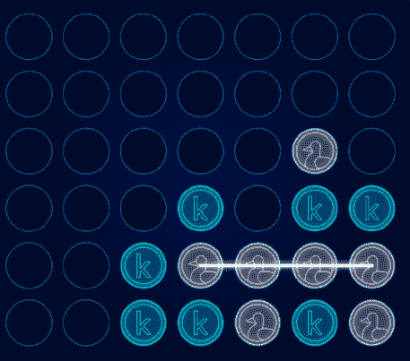
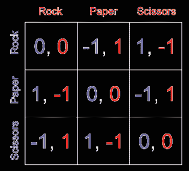
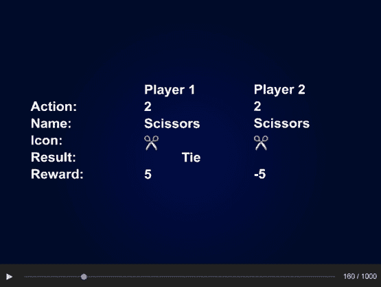
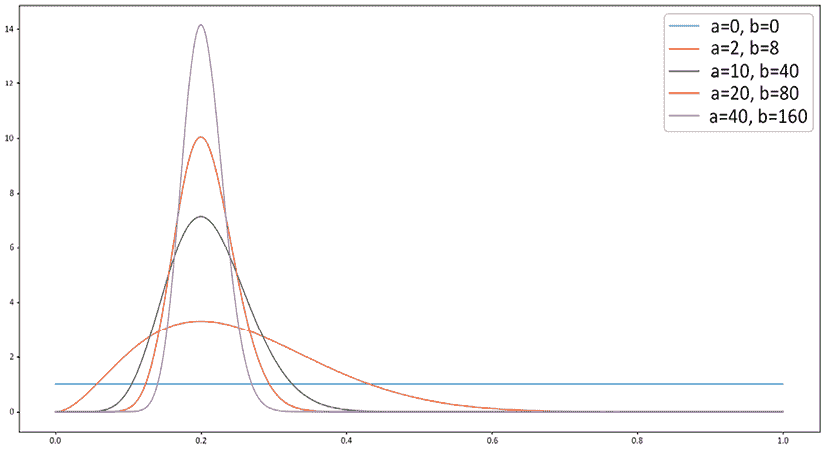
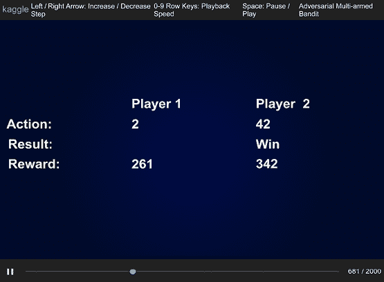
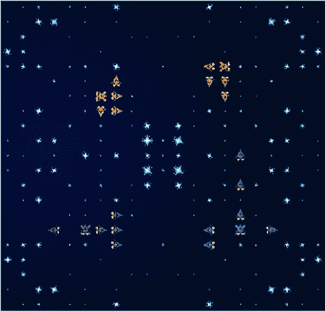

# 第十二章：模拟和优化竞赛

**强化学习**（**RL**）在机器学习的不同分支中是一个有趣的案例。一方面，它在技术层面上要求很高：来自监督学习的各种直觉并不适用，相关的数学工具也更为复杂；另一方面，它对于外行或非专业人士来说最容易解释。一个简单的类比是教你的宠物（我非常有意地避免狗与猫的争论）表演特技：你为做得好的特技提供奖励，否则拒绝。

强化学习在 Kaggle 的竞赛派对中是一个后来者，但近年来，随着模拟竞赛的引入，情况发生了变化。在本章中，我们将描述 Kaggle 宇宙中这个新而令人兴奋的部分。到目前为止——在撰写本文时——已经举办了四个**特色**竞赛和两个**游乐场**竞赛；虽然这个列表并不广泛，但它允许我们给出一个广泛的概述。

在本章中，我们将展示在几个模拟竞赛中提出的问题的解决方案：

+   我们从*Connect X*开始。

+   我们接着展示*剪刀石头布*，其中展示了构建竞争性代理的双重方法。

+   接下来，我们展示了一个基于多臂老虎机的解决方案，用于*Santa*竞赛。

+   我们以对剩余竞赛的概述结束，这些竞赛略超出了本章的范围。

如果强化学习对你来说是一个全新的概念，那么首先获得一些基本理解可能是个好主意。开始 RL 冒险的一个非常好的方式是 Kaggle 学习课程，该课程专门针对游戏 AI 背景下的这个主题([`www.kaggle.com/learn/intro-to-game-ai-and-reinforcement-learning`](https://www.kaggle.com/learn/intro-to-game-ai-and-reinforcement-learning))。该课程介绍了诸如代理和策略等基本概念，同时也提供了一个（快速）介绍深度强化学习。课程中的所有示例都使用了来自游乐场竞赛*Connect X*的数据，其目标是训练一个能够在线连接跳棋的代理([`www.kaggle.com/c/connectx/overview`](https://www.kaggle.com/c/connectx/overview))。

在更广泛的意义上，值得指出的是，模拟和优化竞赛的一个重要方面是**环境**：由于问题的本质，你的解决方案需要表现出比仅仅提交一组数字（如“常规”监督学习竞赛的情况）更动态的特性。关于模拟竞赛中使用的环境的非常详尽和有信息量的描述可以在[`github.com/Kaggle/kaggle-environments/blob/master/README.md`](https://github.com/Kaggle/kaggle-environments/blob/master/README.md)找到。

# Connect X

在本节中，我们展示如何使用启发式方法解决玩跳棋的简单问题。虽然这不是深度学习解决方案，但我们认为这种概念的基本展示对那些没有显著先前接触 RL 的人来说更有用。

如果你刚开始接触使用 AI 玩棋类游戏的概念，*汤姆·范·德·维勒*（[`www.kaggle.com/tvdwiele`](https://www.kaggle.com/tvdwiele)）的演示是一个值得探索的资源：[`tinyurl.com/36rdv5sa`](https://tinyurl.com/36rdv5sa)。

*Connect X*的目标是在游戏棋盘上先于对手将你的棋子排成一行（水平、垂直或对角线）的*数量*（*X*）。玩家轮流将棋子放入棋盘顶部的某一列。这意味着每一步的目的可能是为了赢得比赛，或者是为了阻止对手赢得比赛。



图 12.1：Connect X 棋盘

*Connect X*是第一个引入**代理**的比赛：参与者必须提交能够与其他人玩游戏的游戏代理，而不是静态的提交（或与未见数据集评估的笔记本）。评估按步骤进行：

1.  上传后，提交将自行对弈以确保其正常工作。

1.  如果这个验证片段成功，就会分配一个技能评分，并且提交将加入所有竞争者的行列。

1.  每个提交都会播放几个片段，随后进行排名调整。

考虑到这个设置，让我们继续展示如何为*Connect X*比赛构建一个提交。我们提供的代码适用于*X=4*，但可以轻松地适应其他值或变量*X*。

首先，我们安装 Kaggle 环境包：

```py
!pip install kaggle-environments --upgrade 
```

我们定义了一个环境，我们的代理将在其中被评估：

```py
from kaggle_environments import evaluate, make
env = make("connectx", debug=True)
env.render() 
```

虽然你可能有一个尝试复杂方法的冲动，但开始简单是有用的——正如我们在这里所做的那样，通过使用简单的启发式方法。这些方法在伴随的代码中组合成一个单独的函数，但为了展示，我们一次描述一个。

第一条规则是检查是否有任何玩家有机会垂直连接四个棋子，如果有，就返回可能的位置。我们可以通过使用一个简单的变量作为我们的输入参数来实现这一点，它可以取两个可能的值，表示正在分析哪个玩家的机会：

```py
def my_agent(observation, configuration):
    from random import choice
    # me:me_or_enemy=1, enemy:me_or_enemy=2
    def check_vertical_chance(me_or_enemy):
        for i in range(0, 7):
            if observation.board[i+7*5] == me_or_enemy \
            and observation.board[i+7*4] == me_or_enemy \
            and observation.board[i+7*3] == me_or_enemy \
            and observation.board[i+7*2] == 0:
                return i
            elif observation.board[i+7*4] == me_or_enemy \
            and observation.board[i+7*3] == me_or_enemy \
            and observation.board[i+7*2] == me_or_enemy \
            and observation.board[i+7*1] == 0:
                return i
            elif observation.board[i+7*3] == me_or_enemy \
            and observation.board[i+7*2] == me_or_enemy \
            and observation.board[i+7*1] == me_or_enemy \
            and observation.board[i+7*0] == 0:
                return i
        # no chance
        return -99 
```

我们可以定义一个类似的方法来处理横向机会：

```py
 def check_horizontal_chance(me_or_enemy):
        chance_cell_num = -99
        for i in [0,7,14,21,28,35]:
            for j in range(0, 4):
                val_1 = i+j+0
                val_2 = i+j+1
                val_3 = i+j+2
                val_4 = i+j+3
                if sum([observation.board[val_1] == me_or_enemy, \
                        observation.board[val_2] == me_or_enemy, \
                        observation.board[val_3] == me_or_enemy, \
                        observation.board[val_4] == me_or_enemy]) == 3:
                    for k in [val_1,val_2,val_3,val_4]:
                        if observation.board[k] == 0:
                            chance_cell_num = k
                            # bottom line
                            for l in range(35, 42):
                                if chance_cell_num == l:
                                    return l - 35
                            # others
                            if observation.board[chance_cell_num+7] != 0:
                                return chance_cell_num % 7
        # no chance
        return -99 
```

我们对对角线组合重复相同的做法：

```py
# me:me_or_enemy=1, enemy:me_or_enemy=2
def check_slanting_chance(me_or_enemy, lag, cell_list):
        chance_cell_num = -99
        for i in cell_list:
            val_1 = i+lag*0
            val_2 = i+lag*1
            val_3 = i+lag*2
            val_4 = i+lag*3
            if sum([observation.board[val_1] == me_or_enemy, \
                    observation.board[val_2] == me_or_enemy, \
                    observation.board[val_3] == me_or_enemy, \
                    observation.board[val_4] == me_or_enemy]) == 3:
                for j in [val_1,val_2,val_3,val_4]:
                    if observation.board[j] == 0:
                        chance_cell_num = j
                        # bottom line
                        for k in range(35, 42):
                            if chance_cell_num == k:
                                return k - 35
                        # others
                        if chance_cell_num != -99 \
                        and observation.board[chance_cell_num+7] != 0:
                            return chance_cell_num % 7
        # no chance
        return -99 
```

我们可以将逻辑组合成一个单独的函数，检查机会（与对手玩游戏）：

```py
 def check_my_chances():
        # check my vertical chance
        result = check_vertical_chance(my_num)
        if result != -99:
            return result
        # check my horizontal chance
        result = check_horizontal_chance(my_num)
        if result != -99:
            return result
        # check my slanting chance 1 (up-right to down-left)
        result = check_slanting_chance(my_num, 6, [3,4,5,6,10,11,12,13,17,18,19,20])
        if result != -99:
            return result
        # check my slanting chance 2 (up-left to down-right)
        result = check_slanting_chance(my_num, 8, [0,1,2,3,7,8,9,10,14,15,16,17])
        if result != -99:
            return result
        # no chance
        return -99 
```

这些块构成了逻辑的基础。虽然制定起来有点繁琐，但它们是将直觉转化为可用于在游戏中竞争的代理的启发式策略的有用练习。

请参阅存储库中的相关代码，以获取本例中代理的完整定义。

我们新定义的代理的性能可以与预定义的代理（例如，随机代理）进行比较：

```py
env.reset()
env.run([my_agent, "random"])
env.render(mode="ipython", width=500, height=450) 
```

上述代码展示了如何从头开始设置一个相对简单问题的解决方案（这就是为什么*连接 X*是一个游乐场而不是一个特色竞赛的原因）。有趣的是，这个简单的问题可以用（几乎）最先进的方法（如 AlphaZero）来处理：[`www.kaggle.com/connect4alphazero/alphazero-baseline-connectx`](https://www.kaggle.com/connect4alphazero/alphazero-baseline-connectx)。

在介绍性例子之后，你应该准备好深入更复杂（或者至少不是基于玩具示例）的竞赛。

# 剪刀石头布

模拟竞赛中提到的几个问题涉及玩游戏并非巧合：在各个复杂程度下，游戏提供了一个规则明确的环境，自然适合代理-行动-奖励框架。除了井字棋之外，连接棋盘是竞争性游戏中最简单的例子之一。随着游戏难度等级的提升（即游戏难度），让我们来看看**剪刀石头布**以及围绕这个游戏展开的 Kaggle 竞赛应该如何进行。

*剪刀石头布*竞赛的构想([`www.kaggle.com/c/rock-paper-scissors/code`](https://www.kaggle.com/c/rock-paper-scissors/code))是对基本的剪刀石头布游戏（在一些地区被称为*roshambo*）的扩展：而不是通常的“三局两胜”的得分，我们使用“一千局一胜”。

我们将描述两种可能的解决问题的方法：一种基于博弈论方法，另一种更侧重于算法方面。

我们从**纳什均衡**开始。维基百科将这个定义为一个涉及两个或更多玩家的非合作博弈的解，假设每个玩家都知道其他玩家的均衡策略，并且没有玩家可以通过仅改变自己的策略来获得优势。

在博弈论框架下对剪刀石头布的出色介绍可以在[`www.youtube.com/watch?v=-1GDMXoMdaY`](https://www.youtube.com/watch?v=-1GDMXoMdaY)找到。

用红色和蓝色表示我们的玩家，矩阵中的每个单元格都显示了给定移动组合的结果：



图 12.2：剪刀石头布的收益矩阵

以一个例子来说明，如果双方都出石头（左上角的单元格），双方都得到 0 分；如果蓝色方出石头而红色方出布（第一行的第二列的单元格），红色方获胜——因此红色方得到+1 分，而蓝色方得到-1 分。

如果我们以 1/3 的等概率玩每个动作，那么对手也必须这样做；否则，如果他们总是出石头，他们将和石头平局，输给布，赢剪刀——每种情况发生的概率都是 1/3（或三分之一的概率）。在这种情况下，期望奖励是 0，这时我们可以改变策略为布，并一直获胜。同样的推理也可以用于布对剪刀和剪刀对石头的策略，由于冗余，我们不会展示结果的矩阵。

为了达到均衡，剩余的选项是两个玩家都需要采取随机策略——这就是纳什均衡。我们可以围绕这个想法构建一个简单的智能体：

```py
%%writefile submission.py
import random
def nash_equilibrium_agent(observation, configuration):
    return random.randint(0, 2) 
```

在开始时（从笔记本直接写入文件）的魔法是满足这个特定竞赛提交约束的必要条件。

我们的纳什智能体与其他智能体相比表现如何？我们可以通过评估性能来了解：

```py
!pip install -q -U kaggle_environments
from kaggle_environments import make 
```

在撰写本文时，导入后出现了一个错误（**无法加载名为‘gfootball’的模块**）；Kaggle 的官方建议是忽略它。实际上，它似乎对执行代码没有影响。

我们首先创建石头剪刀布环境，并将模拟的每个模拟的 episodes 限制为 1,000 个：

```py
env = make(
    "rps", 
    configuration={"episodeSteps": 1000}
) 
```

我们将利用在这个竞赛中创建的笔记本，该笔记本实现了基于确定性启发式算法的多个智能体（[`www.kaggle.com/ilialar/multi-armed-bandit-vs-deterministic-agents`](https://www.kaggle.com/ilialar/multi-armed-bandit-vs-deterministic-agents)），并从那里导入我们竞争的智能体的代码：

```py
%%writefile submission_copy_opponent.py
def copy_opponent_agent(observation, configuration):
    if observation.step > 0:
        return observation.lastOpponentAction
    else:
        return 0
# nash_equilibrium_agent vs copy_opponent_agent
env.run(
    ["submission.py", "submission_copy_opponent.py"]
)
env.render(mode="ipython", width=500, height=400) 
```

当我们执行前面的代码块并运行环境时，我们可以观察 1,000 个 epoch 的动画板。一个快照看起来像这样：



图 12.3：评估智能体性能的渲染环境快照

在监督学习——无论是分类还是回归——中，通常有用简单基准来开始处理任何问题，通常是线性模型。尽管它不是最先进的，但它可以提供一个有用的期望值和性能度量。在强化学习中，一个类似的想法也成立；在这个能力中值得尝试的方法是多臂老虎机，这是我们能够诚实地称之为 RL 的最简单算法。在下一节中，我们将展示这种方法如何在模拟竞赛中使用。

# 圣诞竞赛 2020

在过去几年里，Kaggle 上形成了一种传统：在每年的 12 月初，会有一个以圣诞为主题的竞赛。实际的算法方面每年都有所不同，但就我们的目的而言，2020 年的竞赛是一个有趣的案例：[`www.kaggle.com/c/santa-2020`](https://www.kaggle.com/c/santa-2020)。

设置是一个经典的**多臂老虎机**（**MAB**）算法，通过在自动售货机上重复操作来最大化奖励，但有两个额外特点：

+   **奖励衰减**：在每一步，从机器获得奖励的概率会降低 3%。

+   **竞赛**：您不仅受时间的限制（有限次数的尝试），还受另一个试图实现相同目标的玩家的限制。我们主要提到这个限制是为了完整性，因为它不是将我们的解决方案明确包含在内的关键因素。

对于如何解决通用多臂老虎机问题的方法的好解释，读者可以参考[`lilianweng.github.io/lil-log/2018/01/23/the-multi-armed-bandit-problem-and-its-solutions.html`](https://lilianweng.github.io/lil-log/2018/01/23/the-multi-armed-bandit-problem-and-its-solutions.html)。

我们展示的解决方案是从[`www.kaggle.com/ilialar/simple-multi-armed-bandit`](https://www.kaggle.com/ilialar/simple-multi-armed-bandit)改编的，代码来自*Ilia Larchenko* ([`www.kaggle.com/ilialar`](https://www.kaggle.com/ilialar))。我们的方法基于对奖励分布的连续更新：在每一步，我们从具有参数(*a+1*, *b+1*)的 Beta 分布中生成一个随机数，其中：

+   *a* 是从这个臂获得的总奖励（胜利次数）

+   *b* 是历史损失的数量

当我们需要决定拉哪个臂时，我们选择产生最高数字的臂并使用它来生成下一步；我们的后验分布成为下一步的先验。

下面的图表显示了不同(*a*, *b*)值对的 Beta 分布形状：



图 12.4：不同(a,b)参数组合的 Beta 分布密度形状

如您所见，最初，分布是平坦的（Beta(0,0)是均匀的），但随着我们收集更多信息，概率质量会集中在峰值周围，这意味着不确定性更少，我们对判断更有信心。我们可以通过每次使用一个臂来减少*a*参数来整合特定于比赛的奖励衰减。

我们通过编写一个提交文件来开始创建我们的代理。首先，必要的导入和变量初始化：

```py
%%writefile submission.py
import json
import numpy as np
import pandas as pd
bandit_state = None
total_reward = 0
last_step = None 
```

我们定义了一个指定 MAB 代理的类。为了阅读的连贯性，我们重新生成了整个代码，并在其中包含注释说明：

```py
def multi_armed_bandit_agent (observation, configuration):
    global history, history_bandit
    step = 1.0         # balance exploration / exploitation
    decay_rate = 0.97  # how much do we decay the win count after each call

    global bandit_state,total_reward,last_step

    if observation.step == 0:
        # initial bandit state
        bandit_state = [[1,1] for i in range(configuration["banditCount"])]
    else:       
        # updating bandit_state using the result of the previous step
        last_reward = observation["reward"] - total_reward
        total_reward = observation["reward"]

        # we need to understand who we are Player 1 or 2
        player = int(last_step == observation.lastActions[1])

        if last_reward > 0:
            bandit_state[observation.lastActions[player]][0] += last_reward * step
        else:
            bandit_state[observation.lastActions[player]][1] += step

        bandit_state[observation.lastActions[0]][0] = (bandit_state[observation.lastActions[0]][0] - 1) * decay_rate + 1
        bandit_state[observation.lastActions[1]][0] = (bandit_state[observation.lastActions[1]][0] - 1) * decay_rate + 1
    # generate random number from Beta distribution for each agent and select the most lucky one
    best_proba = -1
    best_agent = None
    for k in range(configuration["banditCount"]):
        proba = np.random.beta(bandit_state[k][0],bandit_state[k][1])
        if proba > best_proba:
            best_proba = proba
            best_agent = k

    last_step = best_agent
    return best_agent 
```

如您所见，函数的核心逻辑是对 MAB 算法的直接实现。在`bandit_state`变量中，我们应用衰减乘数，这是针对我们竞赛的特定调整。

与前一个案例类似，我们现在已经准备好评估我们的代理在竞赛环境中的性能。下面的代码片段展示了如何实现这一点：

```py
%%writefile random_agent.py
import random
def random_agent(observation, configuration):
    return random.randrange(configuration.banditCount)
from kaggle_environments import make
env = make("mab", debug=True)
env.reset()
env.run(["random_agent.py", "submission.py"])
env.render(mode="ipython", width=800, height=700) 
```

我们看到类似这样的情况：



图 12.5：评估代理性能的渲染环境快照

在本节中，我们展示了如何在 Kaggle 的模拟竞赛中利用经典的多臂老虎机算法。虽然作为一个起点很有用，但这并不足以获得奖牌区，在那里深度强化学习方法更为流行。

我们将接着讨论基于其他方法的策略，在多样化的竞赛中。

# 游戏的名称

除了上述相对简单的游戏之外，模拟竞赛涉及更复杂的设置。在本节中，我们将简要讨论这些。第一个例子是 *Halite*，在竞赛页面上（[`www.kaggle.com/c/halite`](https://www.kaggle.com/c/halite)）定义为以下方式：

> Halite [...] 是一款资源管理游戏，你在这里建造并控制一支小型舰队。你的算法决定它们的移动以收集卤素，这是一种发光的能量来源。比赛结束时收集到的卤素最多的一方获胜，但如何制定有效且高效的策略取决于你。你控制你的舰队，建造新的船只，创建造船厂，并在游戏板上开采再生的卤素。

游戏的界面如下：



图 12.6：Halite 游戏板

Kaggle 围绕这款游戏组织了两场比赛：一个游乐场版（[`www.kaggle.com/c/halite-iv-playground-edition`](https://www.kaggle.com/c/halite-iv-playground-edition)）以及一个常规的特色版（[`www.kaggle.com/c/halite`](https://www.kaggle.com/c/halite)）。在这种情况下，经典的强化学习方法不太有用，因为，由于有任意数量的单位（船只/基地）和动态的对手池，信用分配问题对于拥有“正常”计算资源的人来说变得难以解决。

在完全普遍的意义上解释信用分配问题超出了本书的范围，但感兴趣的读者可以从维基百科条目（[`en.wikipedia.org/wiki/Assignment_problem`](https://en.wikipedia.org/wiki/Assignment_problem)）开始，并阅读 Mesnard 等人撰写的这篇出色的介绍性文章：[`proceedings.mlr.press/v139/mesnard21a.html`](https://proceedings.mlr.press/v139/mesnard21a.html)。

*Tom van de Wiele*（[`www.kaggle.com/c/halite/discussion/183543`](https://www.kaggle.com/c/halite/discussion/183543)）对获胜解决方案的描述提供了对在此情况下证明成功的修改方法的优秀概述（深度强化学习，每个单位独立分配信用）。

另一个涉及相对复杂游戏的竞赛是*Lux AI* ([`www.kaggle.com/c/lux-ai-2021`](https://www.kaggle.com/c/lux-ai-2021))。在这个竞赛中，参与者被要求设计智能体来解决一个结合资源收集和分配的多变量优化问题，与其他玩家竞争。此外，成功的智能体还必须分析对手的移动并做出相应的反应。这个竞赛的一个有趣特点是“元”方法的流行：**模仿学习** ([`paperswithcode.com/task/imitation-learning`](https://paperswithcode.com/task/imitation-learning))。这是一种在强化学习中相当新颖的方法，专注于从演示中学习行为策略——而不需要特定的模型来描述状态-动作对的生成。这种想法的一个具有竞争力的实现（在撰写本文时）是由 Kaggle 用户 Ironbar 提供的 ([`www.kaggle.com/c/lux-ai-2021/discussion/293911`](https://www.kaggle.com/c/lux-ai-2021/discussion/293911))。

最后，没有对 Kaggle 模拟竞赛的讨论是不完整的，没有提及*Google Research Football with Manchester City F.C.*竞赛 ([`www.kaggle.com/c/google-football/overview`](https://www.kaggle.com/c/google-football/overview))。这个竞赛背后的动机是让研究人员探索 AI 智能体在复杂环境如足球中的能力。竞赛**概述**部分将问题表述如下：

> 体育运动需要短期控制、学习概念如传球和高级策略之间的平衡，这很难教会智能体。目前存在一个环境和测试智能体的当前环境，但其他解决方案可能提供更好的结果。

与上述一些例子不同，这个竞赛主要由强化学习方法主导：

+   团队原始野兽（第 3 名）遵循了受*AlphaStar*启发的方法论：[`www.kaggle.com/c/google-football/discussion/200709`](https://www.kaggle.com/c/google-football/discussion/200709)

+   盐水鱼（第 2 版）使用了一种自我对弈的形式：[`www.kaggle.com/c/google-football/discussion/202977`](https://www.kaggle.com/c/google-football/discussion/202977)

+   获胜者 WeKick 使用基于深度学习的解决方案，结合了创造性的特征工程和奖励结构调整：[`www.kaggle.com/c/google-football/discussion/202232`](https://www.kaggle.com/c/google-football/discussion/202232)

研究上述解决方案是学习如何利用强化学习解决这类问题的绝佳起点。


Firat Gonen

[`www.kaggle.com/frtgnn`](https://www.kaggle.com/frtgnn)

对于本章的访谈，我们采访了 Firat Gonen，他是数据集、笔记本和讨论的三位大师，同时也是 HP 数据科学全球大使。他向我们分享了他对 Kaggle 方法的看法，以及他的态度是如何随着时间的推移而演变的。

你最喜欢的比赛类型是什么？为什么？在技术和解决方法方面，你在 Kaggle 上的专长是什么？

我最喜欢的比赛类型随着时间的推移而演变。我曾经更喜欢非常通用的表格比赛，只要有一台好笔记本电脑和一些耐心，就能掌握趋势。我觉得我以前能够很好地看到训练集和测试集之间的异常趋势。随着时间的推移，由于 Z by HP 授予我大使称号以及我的工作站设备，我逐渐转向了更多的计算机视觉比赛，尽管我还有很多东西要学。

你是如何应对 Kaggle 比赛的？这种方法与你在日常工作中所做的方法有何不同？

我通常喜欢尽可能推迟建模部分。我喜欢利用这段时间进行探索性数据分析（EDA）、处理异常值、阅读论坛等，尽量保持耐心。在我感觉特征工程完成之后，我尝试只构建基准模型，以掌握不同架构的结果。我的技术在与专业工作相关时也非常相似。我认为在大量时间内试图做到最好是没有用的；时间和成功之间必须有一个平衡。

告诉我们你参加的一个特别具有挑战性的比赛，以及你用来解决任务的见解。

弗朗索瓦·肖莱特举办的比赛极具挑战性；这是第一个迫使我们进入通用人工智能（AGI）的比赛。我记得在那个比赛中，我感到非常无力，我在那里学到了几种新技术。我认为每个人在记住数据科学不仅仅是机器学习的同时，都这样做过。在 Kaggle 上，其他一些技术，如混合整数规划，也重新浮出水面。

Kaggle 是否帮助你在你的职业生涯中？如果是的话，是如何帮助的？

当然：多亏了 Kaggle，我学到了很多新技术，并保持了知识的更新。在我的职业生涯中，我的主要责任大多在于管理。这就是为什么 Kaggle 对我保持对多件事情的更新非常重要。

你是如何利用 Kaggle 建立起你的作品集的？

我认为优势在于一种更间接的方式，人们看到了我的更传统教育资格中的实际技能（多亏了 Kaggle）和更多的理论技能。

在你的经验中，没有经验的 Kagglers 通常忽略了什么？你现在知道的事情，你希望在你最初开始时就知道？

我认为新来者犯的两个错误。第一个是进入新比赛时的恐惧，认为他们会得到很差的分数，并且会被记录下来。这是胡说八道。每个人都有不好的分数；这完全取决于你投入新比赛的程度。第二个是他们想尽快进入模型构建阶段，这是非常错误的；他们想看到他们的基准分数，然后他们会感到沮丧。我建议他们在特征生成和选择，以及在 EDA 阶段花时间。

在过去的比赛中，你犯过哪些错误？

*我的错误，不幸的是，与新手非常相似。在几场竞赛中，我没有足够关注早期阶段，变得不耐烦，过了一段时间后，你会觉得自己没有足够的时间回头。*

对于数据分析或机器学习，有没有你特别推荐使用的工具或库？

*我推荐使用 PyCaret 进行基准测试以获得速度，以及 PyTorch 作为模型构建框架。*

当人们参加竞赛时，他们应该记住或做最重要的事情是什么？

*探索性数据分析以及之前的类似竞赛讨论。*

你是否使用其他竞赛平台？它们与 Kaggle 相比如何？

*说实话，我还没有在 Kaggle 之外尝试过，但从游客的角度来看，我已经体验过一些了。适应其他平台需要时间。*

# 摘要

在本章中，我们讨论了模拟竞赛，这是一种越来越受欢迎的新竞赛类型。与以视觉或 NLP 为中心的竞赛相比，模拟竞赛涉及更广泛的方法（带有一定程度的数学内容），这反映了监督学习和强化学习之间的差异。

本章总结了本书的技术部分。在接下来的内容中，我们将讨论如何将你的 Kaggle 笔记本转化为项目组合，并利用它寻找新的职业机会。

# 加入我们书的 Discord 空间

加入我们书的 Discord 工作空间，每月与作者进行一次“问我任何问题”的会议：

[`packt.link/KaggleDiscord`](https://packt.link/KaggleDiscord)


