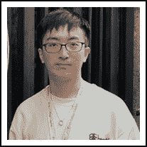
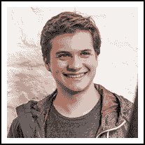
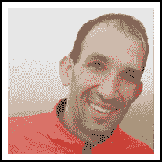
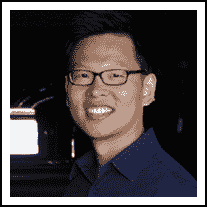

# 寻找新的职业机会

在上一章介绍了如何在竞赛中更好地突出你的工作和成就之后，我们现在将总结 Kaggle 如何积极影响你的职业生涯。最后一章讨论了利用所有努力寻找新的职业机会的最佳方式。我们期望你现在已经拥有了之前描述的所有工具（你的 Kaggle 讨论、笔记本、数据集，以及一个展示了许多来自 Kaggle 项目的 GitHub 账户），因此这一章将转向更软性的方面：如何建立人脉以及如何向招聘人员和公司展示你的 Kaggle 经验。

众所周知，建立人脉可以开启许多可能性，从被联系关于那些不在公开板上出现的新工作机会，到有可以依赖的人来解决你并非专家的数据科学问题。在 Kaggle 上建立人脉主要与竞赛期间的团队协作以及 Kagglers 组织的聚会和其他活动中的联系有关。

当谈到工作机会时，正如我们之前经常重复的，Kaggle 并不是人力资源和招聘经理广泛认可的选择候选人的来源。一些公司确实会认真考虑你的 Kaggle 排名和成就，但这只是一个特殊情况，而不是普遍规则。通常，你应该预期你的 Kaggle 经验会被忽视，有时甚至会被批评。然而，我们的经验告诉我们，你在 Kaggle 上学到的和实践的东西非常有价值，你可以通过展示你的编码和建模努力来推广它，并且能够谈论你独自或团队合作工作的经验。

在这里，我们将涵盖：

+   与其他竞赛数据科学家建立联系

+   参加 Kaggle Days 和其他 Kaggle 聚会

+   被发现和其他工作机会

# 与其他竞赛数据科学家建立联系

人脉对于找工作至关重要，因为它们帮助你接触到可能知道机会在公开之前和开始寻找潜在候选人之前的人。近年来，Kaggle 越来越成为一个你可以与其他数据科学家建立联系、合作和交朋友的地方。在过去，竞赛并没有在论坛上引起很多交流，团队因为竞赛积分在团队成员之间平均分配而受到严重惩罚。排名的改进（见[`www.kaggle.com/general/14196`](https://www.kaggle.com/general/14196)）帮助许多 Kagglers 对组队有了更积极的看法。

如果你已经知道其他团队成员并且已经建立了分配任务和远程协作的方法，那么在 Kaggle 竞赛中组队是可行的。在这些情况下，每个团队成员都已经知道如何协作，通过：

+   承担团队成员同意的实验部分

+   与另一位团队成员合作构建解决方案

+   基于他们的技能和经验探索新的解决方案

+   准备模型和提交，以便它们可以轻松堆叠或混合

然而，如果你是第一次组队，你会发现要么进入一个团队，要么自己组织一个团队都很困难。除非你有联系，否则很难接触到排行榜上的其他人。首先，并不是所有人都会想组队，因为他们更喜欢独自竞争。此外，一些其他竞争者可能对组队感兴趣，但会过于谨慎而拒绝你的提议。在与你不太熟悉的 Kagglers 组建团队时，有一些担忧：

+   加入团队的人不会为团队带来任何价值

+   加入团队的人实际上不会进行合作，而只是成为免费搭车者

+   加入团队的人违反（或将要违反）Kaggle 规则，这将导致整个团队的取消资格

+   加入团队的人实际上对间谍活动和向其他团队泄露信息感兴趣

这些情况在比赛中通常是病态的，你应该意识到这些是许多人在评估是否第一次与另一位 Kaggler 组队时常见的考虑因素。只有通过展示你在 Kaggle 上拥有强大的背景，即一个人曾经独立参加过一些比赛，特别是发布了 Notebooks 并参与了讨论，你才能消除这些感知到的潜在问题。这将极大地增加你的提议的可信度，并更有可能使你被团队接受。

当你最终加入一个团队时，建立团队成员之间**高效且专注的沟通方式**非常重要（例如，在 Slack 或 Discord 上创建一个频道）。同时，达成关于日常操作的共识也是必不可少的，这些操作涉及以下两方面：

+   决定如何分配你的实验努力。

+   决定如何使用有限的每日提交（这往往是团队冲突的原因）。最终，只有团队领导选择最后的两个提交，但到达那里的过程自然涉及讨论和分歧。准备好向你的队友展示你为什么决定某些提交为最终版本，通过向他们展示你的本地交叉验证策略和结果。

在以积极的方式与团队一起工作后，你无疑会赢得其他团队成员的尊重和信任。在未来比赛中，你可能会发现与相同的人再次组队或加入他们帮助的另一个团队更容易。

你将在 Kaggle 上遇到并与之合作的人包括数据科学家、数据爱好者、学生、领域专家等等。下面，我们将与一群多样化的 Kagglers 进行交谈，他们描述了自己的日常工作以及 Kaggle 如何融入他们的生活。

Yirun Zhang

[`www.kaggle.com/gogo827jz`](https://www.kaggle.com/gogo827jz)

张一润是伦敦国王学院的**最后一年博士生**。他是笔记本和讨论的大师，曾是*Jane Street Market Prediction*竞赛（[`www.kaggle.com/c/jane-street-market-prediction`](https://www.kaggle.com/c/jane-street-market-prediction)）获胜团队的一员。

你能告诉我们一些关于你自己的情况吗？

*我的研究领域在于将机器学习算法应用于解决现代无线通信网络中的挑战性问题，如时间序列预测、资源分配和优化。我还参与了研究 AI 隐私、联邦学习和数据压缩与传输的项目。*

*除了日常的博士生研究，我在 Kaggle 上活跃了将近两年，自从我的博士生第二年。我第一次参加的 Kaggle 竞赛是*Instant Gratification*，在这个竞赛中，我使用了来自*`sklearn`*库的多种机器学习和统计方法。这次竞赛帮助我形成了对 Kaggle 竞赛中机器学习建模流程的一般认识。*

*我在 Kaggle 社区中积极分享我的知识，包括笔记本和讨论帖子，现在已成为 Kaggle 笔记本和讨论的大师。通过在论坛上与其他人分享和讨论，我获得了宝贵的反馈和新知识，这也帮助我最近最终赢得了 Kaggle 竞赛。*

请告诉我们你赢得的竞赛的一些情况。

Jane Street Market Prediction *确实非常艰难。原因是很难构建一个稳健的交叉验证（CV）策略，很多人只是将公共排行榜作为* *验证集。他们训练神经网络数百个 epoch，而没有使用验证策略来过度拟合公共排行榜。我们的团队努力维持自己的 CV 策略，并在动荡中幸存下来。*

你在 Kaggle 上的方法与你在日常工作中所做的方法有何不同？

*Kaggle 竞赛与我的日常博士生研究非常不同。前者非常紧张，包含即时反馈，而后者是一个长期的过程。然而，我发现我从 Kaggle 竞赛中学到的新知识和方法论对我的博士生研究也非常有用。*

大槻大辅

[`www.kaggle.com/osciiart`](https://www.kaggle.com/osciiart)

大槻大辅，又名 OsciiArt，是一位 Kaggler，他的日常工作并不涉及数据科学。他是大阪大学医院的**医生**，也是竞赛大师。

你能告诉我们一些关于你自己的情况吗？

*我是一名在京都大学医院工作的二年级住院医生。我在京都大学获得了生命科学硕士学位。在我为一家制药公司从事研发工作后，我转到了大阪大学医学院，并获得了日本行医执照。*

*我开始自学数据科学和 AI，因为我被 AlphaGo 震惊了。我开始在 Kaggle 上参与比赛，以便学习和测试我在数据科学和 AI 方面的技能。我的第一个比赛是 2017 年的 NOAA 渔业 Steller 海狮种群计数*。我一直在 Kaggle 竞赛中参与，并且获得了三枚金牌。*

Kaggle 是否帮助你在职业生涯中取得进展？

*因为我没有* *受过信息科学的教育，所以我使用我在 Kaggle 上的结果在申请 AI 公司实习和申请成为 AI 实验室的短期学生时展示我的技能。作为一个医生，我从未在我的主要工作中使用过我的数据科学技能。然而，多亏了我在 Kaggle 上的结果，我有时有机会参与医学数据研究。*

你最喜欢的比赛类型是什么，为什么？

*我最喜欢的比赛类型是* *医学数据竞赛。我喜欢尝试利用我的医学知识从医学数据中找到一些洞察。*

你如何处理 Kaggle 竞赛？

*我喜欢寻找* *竞赛数据中大多数其他竞争者没有意识到的一个秘密特征，或者尝试针对竞赛数据特征定制的独特方法。实际上，这种方法在大多数情况下并不成功，但仍然很有趣去尝试。*

告诉我们你参加的一个特别具有挑战性的比赛，以及你用来解决任务的洞察。

*我想* *提及* Freesound Audio Tagging 2019*，这是一个针对声音数据的多标签分类任务。训练数据由少量可靠标记的数据（干净数据）和大量不可靠标签的数据（噪声数据）组成。此外，精心整理的数据和噪声数据的数据分布存在差异。为了应对这一困难，我们采用了两种策略。第一种是多任务学习，其中在噪声数据上的训练被视为与干净数据不同的任务。第二种是伪标签（一种半监督学习），其中噪声数据被用从使用干净数据训练的模型中预测的标签重新标记。*

你是否使用其他竞赛平台？它们与 Kaggle 相比如何？

*我使用 Signate (*[`signate.jp/`](https://signate.jp/)**) 和 guruguru (*[`www.guruguru.science/`](https://www.guruguru.science/)**)。这些是日本的数据科学竞赛平台。它们不像 Kaggle 那样规模大；这些平台上的比赛通常使用的数据集比 Kaggle 小，因此更容易参与。此外，有时还有一些与 Kaggle 上不同的有趣比赛。*

米克尔·博伯-伊拉扎尔

[`www.kaggle.com/anokas`](https://www.kaggle.com/anokas)

米克尔·博伯-伊拉扎尔，又名 Anokas，是一位比赛大师、笔记本和讨论大师，同时也是 ForecomAI 的**机器学习科学家**。他还是剑桥大学**计算机科学**的学生，也是 Kaggle 上最年轻的比赛大师。

你能告诉我们一些关于你的信息吗？

*我是在 2016 年加入 Kaggle 的，当时我 14 岁，对我在做什么一无所知 – 我只是在网上读到了机器学习，感觉很有趣。我开始参加我的第一场比赛，通过复制论坛上其他人的公开代码并进行一些小的调整。在几场比赛中，我逐渐了解了事物是如何运作的，这激励我试图攀登排行榜 – 直到我开始取得良好的进展，最终在当年的 Avito Duplicate Ads 竞赛中获得了第二名。*

*从那时起，我参加了 75 场比赛，2018 年成为最年轻的比赛大师，也是第一位三冠大师。我后来在萨里大学担任访问研究员，现在我在剑桥大学学习计算机科学，在那里我也在机器学习和安全领域进行研究。*

你最喜欢哪种类型的比赛？为什么？在技术和解决方法方面，你在 Kaggle 上的专长是什么？

*我真的很喜欢那些有很多特征工程机会的比赛，以及那些有很多不同类型数据的比赛，这让你在解决问题的方法上可以非常具有创造性 – 这比那种每个人都要采取相同方法，你只是在争夺最后一位小数点的比赛有趣得多。*

*我并不认为我在方法上有特别的专长，但我喜欢尝试不同的事情。*

请告诉我们你参加的一个特别具有挑战性的比赛，以及你使用了哪些见解来应对这项任务。

*几年前，谷歌举办了一场竞赛，用于检测图像中的对象及其之间的关系（例如，“桌子上的椅子”）。其他团队花费了大量时间采用传统方法，训练大型神经网络来处理这些任务，而我没有这方面的知识或计算能力来竞争。我选择从不同的角度来解决这个问题，使用一些巧妙的启发式方法和树模型，最终在仅用几个小时的工作后获得了第七名。*

Kaggle 是否帮助你在职业生涯中取得进步？

*Kaggle 为我带来了很多机会，并且是一个真正优秀的社区，让我有机会了解它。我在参加的所有比赛中遇到了很多人，学到了很多东西。但 Kaggle 也是我最初进入机器学习领域的原因 – 我相信如果不是因为 Kaggle，我就不会在这个领域。所以，是的，它帮助了我很多。*

在过去的比赛中，你犯过哪些错误？

*很容易最终得到一个复杂的解决方案，你无法从头开始复制，因为你很可能会在最终解决方案中使用各种版本的代码和中间数据集。那么，如果你足够幸运赢得了比赛，向主办方交付可工作的代码可能会非常紧张！如果你表现良好，确定你的解决方案并清理你的代码是个好主意。*

*也很容易陷入这种情况：为不同的模型使用不同的验证集，或者不保留验证预测，这可能会使得比较它们或在进行比赛后期进行元学习变得困难。*

你会推荐使用哪些特定的工具或库来进行数据分析或机器学习？

*我真的很喜欢 XGBoost，它仍然倾向于在表格数据上击败神经网络（以及它的新近表亲 LightGBM）。SHAP 对于解释模型（即使是复杂的模型）非常好，这可以让你对下一步尝试什么有更多的洞察。*

当人们参加比赛时，他们应该记住或做哪件事是最重要的？

*我认为重要的是尽量避免陷入实现超复杂解决方案的困境，而是尝试逐步实现解决方案。*

*现在的比赛比我开始的时候难多了，所以看看别人的代码（很多人在比赛期间都会公开）并从中学习是个好主意。你可能还想考虑加入一个由其他 Kagglers 组成的团队：对我来说，团队比赛是最有趣的比赛，而且一直是一种极好的学习经历。*

*最后一点：大多数想法都不会成功——如果你想赢得比赛，你需要坚持不懈并不断实验！* 

Kaggle 无疑对前三位受访者丰富的生活和职业生涯产生了影响，他们才刚刚开始。以下我们将与两位现在在各自公司担任高级职位的 Kagglers 交谈，他们的长期而富有成效的旅程也得益于 Kaggle。

丹·贝克

[`www.kaggle.com/dansbecker`](https://www.kaggle.com/dansbecker)

首先，我们有丹·贝克，他是 DataRobot 的笔记本大师和产品、决策智能副总裁。Kaggle 在丹的职业生涯中扮演了重要的角色。

你能告诉我们关于你自己的情况吗？

*我第一次尝试使用机器学习是在 2000 年一个 3 人初创公司，我们试图使用神经网络来帮助零售商优化他们在 eBay 上设置的商品保留价格。我们根本不知道我们在做什么，我们彻底失败了。*

*到 2002 年，我确信机器学习永远不可能成功。我获得了经济学博士学位，并在美国政府担任经济学家。我想搬到科罗拉多州，但那里几乎没有寻找经济学博士的工作。所以我正在寻找一个不那么学术的资历。*

*在 2010 年，我看到了一篇关于*Heritage Health Prize*的报纸文章。这是一场早期的 Kaggle 竞赛，奖金高达 300 万美元。我仍然相信，像我作为经济学家所使用的简单模型，会比花哨的机器学习模型给出更好的预测。所以我开始参加比赛，认为在这个比赛中取得好成绩将是我在科罗拉多州找到一份有趣工作的必要凭证。我在那次比赛中的第一次提交并没有排在最后，但也很接近。当我看到我的模型被评分，然后看到其他人比我领先那么多时，我的心情沉重。我短暂地放弃了在比赛中取得好成绩的希望，但我不甘心连平均水平都达不到。*

*我花了所有的夜晚和周末时间来参加比赛，以爬升排行榜。我重新学习了机器学习，自从我第一次尝试以来，它已经进步了很多。我每天都会学习更多，上传一个新的模型。这花费了很多时间，但每天在排行榜上前进都是一种回报。当我的分数位于排行榜中间时，我认为继续工作可能会让我进入前 10%。所以我继续努力。很快我就进入了前 10%，心想我可能进入前 10 名竞争者。*

*当我处于前 10 名时，一家分析咨询公司联系我，问我是否愿意被雇佣并在他们的公司名下竞争，他们会用这个名字进行市场营销。我告诉他们，如果我能从科罗拉多州工作，我就愿意这么做。所以 Kaggle 竞赛帮助我实现了我的原始目标。*

*我们获得了第二名。第二名没有奖金，但自从那次 Kaggle 竞赛以来，我在职业生涯中所做的一切都得益于这次竞赛。这比我想象的还要成功。*

Kaggle 还以其他方式帮助你在职业生涯中取得了哪些成就？

*Kaggle 几乎完全塑造了我的职业生涯。我的第一份数据科学家工作是在有人从排行榜上招募我时开始的。在那之后，我在 Kaggle 工作。然后我在 DataRobot 工作，当时他们的招聘策略是雇佣在 Kaggle 竞赛中表现良好的人。然后我回到了 Kaggle，开始创建 Kaggle Learn，这是 Kaggle 的数据科学教育平台。这样的例子还有很多。我过去十年中每份工作都明显归因于我在 Kaggle 的最初成功。*

*当我从经济学转向数据科学时，我的 Kaggle 成就是我被雇佣的核心原因。现在我的职业生涯更深入了，我不太考虑投资组合...而且我很幸运，被招募的次数比我寻找工作的次数多。*

你最喜欢的比赛类型是什么？为什么？在技术和解决方法方面，你在 Kaggle 上的专长是什么？

*我在这个社区里已经待了很长时间，但我在过去 7 或 8 年里并没有全身心地投入到一场比赛中。我喜欢新的比赛类型。例如，我第一次接触到深度学习是在 2013 年，当时是 Kaggle 第一次举办深度学习具有竞争力的比赛。那时还没有 Keras、TensorFlow、PyTorch 或今天存在的任何深度学习框架。社区中没有人真正知道如何进行深度学习，所以每个人都在第一次学习新事物。*

*Kaggle 还举办了一场对抗性建模比赛，其中一些人构建了试图稍微操纵图像以欺骗其他模型的模型。这非常实验性，我不知道他们是否还会再次举办类似的活动。但我真的很喜欢实验性的东西，当社区中的每个人都在一起在论坛上解决问题时。*

你是如何应对 Kaggle 比赛的？这种方法与你在日常工作中所做的方法有何不同？

*在最近几次比赛中，我专注于“我能为这次比赛构建哪些工具来自动化我在各个项目中的工作”？这并不特别成功，但这是一个有趣的挑战。这与我处理其他所有专业事务的方法非常不同。*

*在比赛之外，我非常喜欢分析和查看有趣主题的数据。我有时会说，作为数据科学家，我的优势就是我只是查看数据（而不是通过机器学习模型过滤的数据）。*

*我还花了很多时间思考我们如何从机器学习模型的预测到我们做出的决策。例如，如果一个机器学习模型预测在下一批货物到来之前，一家杂货店将卖出 1,000 个芒果，那么这家杂货店应该持有多少库存？有些人认为应该是 1,000 个...正好是你预测可以卖出的数量。这是错误的。*

*你需要考虑购买过多芒果导致浪费的成本与耗尽库存的成本之间的权衡。它们的保质期是多久？你能在下一批货物到来之前携带额外的库存吗？那里有很多优化工作要做，这是我日常工作中的一部分，而这些内容在 Kaggle 比赛中并没有体现出来。*

告诉我们你参加的一个特别具有挑战性的比赛，以及你使用了哪些见解来应对这项任务。

*我尝试构建一个* *自动化的系统，用于对 Practice Fusion 糖尿病分类挑战进行连接和特征工程*。我从中学到的最主要的事情是，如果你有超过几个文件，你仍然需要一个人员来查看数据并理解哪些特征工程是有意义的。

在你的经验中，不经验丰富的 Kagglers 通常忽略了什么？你现在知道的事情，你希望在你刚开始的时候就知道？

*新参与者没有意识到* *在 Kaggle 比赛中取得好成绩的门槛有多高。他们认为他们可以跳进来，以相当通用的方法进入前 50%...但这通常不是真的。我最惊讶的是，在集成之前提交时，使用不同模型的排行榜分数来分配权重的重要性。*

在过去的比赛中，你犯过哪些错误？

*我在多阶段比赛中多次搞砸了* *最后时刻的提交细节* *（结果最终排名最后或接近最后）。*

你会推荐使用哪些特定的工具或库来进行数据分析或机器学习？

*大部分都是标准的东西。*

*在 Kaggle 比赛之外，我个人喜欢使用 Altair 进行可视化...并且我写了很多 SQL。SQL 是为查看简单的聚合或趋势而设计的，而不是构建复杂模型，但我认为这更像是一个特性而不是缺陷。*

Jeong-Yoon Lee

[`www.kaggle.com/jeongyoonlee`](https://www.kaggle.com/jeongyoonlee)

最后，我们有 Jeong-Yoon Lee，他是 Netflix 研究团队中 Rankers 和搜索算法工程团队的多次获奖比赛大师和高级研究科学家。

你能告诉我们一些关于你的信息吗？

*我叫 Jeong，是 Netflix 的高级研究科学家。我在 2011 年完成我的博士学业后，加入了一家分析咨询初创公司 Opera Solutions，并从那时起开始了 Kaggle。在那里，我遇到了热情的 Kaggle 竞争者，包括 Michael Jahrer，我们一起参加了 KDD 杯和 Kaggle 比赛。从那时起，即使离开公司后，我也继续作为竞争者和组织者参与比赛。最近，我在 Kaggle 上花的时间没有以前那么多，但仍然时不时地查看，以了解机器学习领域的最新工具和方法。*

Kaggle 是否帮助你在职业生涯中取得进步？

*极大地帮助了。首先，它提供了* *机器学习的证书。许多招聘经理（当我还是面试者时）以及候选人（当我担任面试官时）都提到我的 Kaggle 记录引起了他们的注意。其次，它提供了机器学习最先进方法的培训。通过在不同领域超过 100 场比赛中的工作，我对几乎所有机器学习问题都比我同行更熟悉。第三，它提供了一个全球顶级数据科学家的网络。我在 Kaggle 遇到了许多有才华的数据科学家，并享受与他们一起工作。我翻译了 Abhishek Thakur 的书，与 Mario、Giba 和 Abhishek 一起在 KDD 上组织了一个讨论小组，现在正在面试 Luca 的书。；)*

*2012 年，我使用了由 Steffen Rendle 在 KDD Cup 2012 中引入的因子机，在我加入一家新公司一个月后，将预测性能提高了 30%，超过了现有的 SVM 模型。在我共同创立的一家初创公司中，我们的主要卖点是通过集成算法来* *击败市场标准的线性回归。在 Uber，我引入了对抗性验证来解决机器学习管道中特征中的协变量偏移。*

你最喜欢的竞赛类型是什么？为什么？在技术和解决方法方面，你在 Kaggle 上的专长是什么？

*我喜欢小型到* *中型数据集的竞赛，这些竞赛大多是表格数据竞赛，因为我可以在任何时间任何地点快速迭代不同的方法。在我 2015 年在 Kaggle 的巅峰时期，我经常在飞机上或在照看孩子的间隙构建我的解决方案。我的三胞胎在 2014 年底出生，我当时在一家我共同创立的新公司工作。*

*我认为我没有任何特殊的建模技术，但我的专长更多在于竞赛管理，这包括招募团队成员、建立协作框架（例如，Git、S3、Messenger、Wiki、内部排行榜、交叉验证分割）、在整个竞赛中帮助团队有效工作等。所以，我并不是竞赛大师，但能够进入前十，是因为其他大师喜欢与我合作。*

你是如何应对 Kaggle 竞赛的？这种应对方式与你在日常工作中所做的是否有所不同？

*我试图建立一个管道，使其能够快速迭代和逐步改进。你尝试的方案越多，你在竞赛中取得好成绩的机会就越大。这个原则也适用于我的日常工作。虽然范围不同。在工作时，我们首先定义问题并确定数据，而在 Kaggle，这两者都是既定的，我们从 EDA 开始。*

在你的经验中，没有经验的 Kagglers 通常忽略了什么？你现在知道的事情，你希望在你最初开始时就知道？

*最近，我发现许多* *用户只是简单地复制其他用户分享的 Notebook，并对其进行微调以获得更好的分数。最终重要的是学习，而非 Kaggle 排名或积分。我建议新的 Kagglers 花更多时间构建自己的解决方案。*

当人们参加竞赛时，他们应该记住或做什么是最重要的？

*这关乎学习，而非胜利。*

你是否使用其他竞赛平台？它们与 Kaggle 相比如何？

*我正在担任 Dacon AI 的顾问，这是一家* *韩国机器学习竞赛平台公司。它始于 2018 年，至今已举办了 96 场竞赛。与 Kaggle 相比，它还处于早期阶段，但为韩国用户提供了类似的经验。*

# 参加 Kaggle Days 和其他 Kaggle 聚会

与其他 Kagglers 建立联系（以及更容易被团队接受）的一个好方法就是简单地见面。聚会和会议一直是这样做的好方法，即使它们并不专门涉及 Kaggle 竞赛，因为演讲者会谈论他们在 Kaggle 上的经验，或者因为话题已经在 Kaggle 竞赛中处理过。例如，许多研究竞赛要求成功竞争者撰写关于他们经验的论文，这些论文可以在会议演讲中被展示或引用。

直到 2018 年之前，没有与 Kaggle 直接相关的特殊活动，当时由*Maria Parysz*和*Paweł Jankiewicz*创立的公司 LogicAI 与 Kaggle 合作，在波兰华沙举办了首届 Kaggle Days 活动。他们聚集了超过 100 名参与者以及 8 位 Kaggle 大师级演讲者。

随后还举办了更多的 Kaggle Days 活动。以下是安排的活动，以及相关材料和演讲的链接：

+   华沙，2018 年 5 月 ([`kaggledays.com/events/warsaw2018`](https://kaggledays.com/events/warsaw2018))

+   巴黎，2019 年 1 月 ([`kaggledays.com/events/paris2019`](https://kaggledays.com/events/paris2019))

+   旧金山，2019 年 4 月 ([`kaggledays.com/event/sanfrancisco2019`](https://kaggledays.com/event/sanfrancisco2019))

+   迪拜，2019 年 4 月 ([`kaggledays.com/events/dubai2019`](https://kaggledays.com/events/dubai2019))

+   北京，2019 年 10 月 ([`kaggledays.com/events/beijing2019`](https://kaggledays.com/events/beijing2019))

+   东京，2019 年 12 月 ([`kaggledays.com/events/tokyo2019`](https://kaggledays.com/events/tokyo2019))

从巴黎的第二场活动开始，各种城市举办了形式为聚会的较小规模活动（在 30 个不同地点举办了超过 50 场聚会）。参加大型活动或聚会是结识其他 Kagglers 和交朋友的好机会，这对职业发展或未来 Kaggle 竞赛的团队合作都有帮助。

实际上，其中一位作者就是通过这种方式找到了他们的下一份工作。

# 被发现和其他工作机会

在一段时间内，Kaggle 是一个雇主可以找到数据分析与机器学习建模罕见技能的热点。Kaggle 本身就在讨论论坛中提供了一个职位板，许多招聘人员四处游走，在排行榜上寻找可以联系的个人资料。公司本身也举办比赛以明确寻找候选人（例如，Facebook、英特尔和 Yelp 都为此目的安排了招聘竞赛）或者在他们看到在某些类型的问题上表现出色后方便地挑选出最佳竞争者（例如，在电信竞赛之后，保险公司 AXA 就是这样做的）。这一切的顶峰由《Wired》杂志对 *Gilberto Titericz* 的采访所标记，其中提到“*排名靠前的解算者收到了大量的工作邀请*” ([`www.wired.com/story/solve-these-tough-data-problems-and-watch-job-offers-roll-in/`](https://www.wired.com/story/solve-these-tough-data-problems-and-watch-job-offers-roll-in/))。

最近，事情有所变化，许多 Kagglers 报告说，当你赢得比赛或取得好成绩时，你能期望的最好的结果是招聘人员几个月内的联系。让我们看看事情是如何变化的，以及为什么会这样。

现在，你很少会找到要求 Kaggle 经验的工作机会，因为公司通常要求在该领域（甚至更好的，在同一行业或知识领域）有先前经验，在数学学科方面有学术背景，或者来自谷歌、亚马逊或微软的认证。你的 Kaggle 存在仍然会有些影响，因为它将允许你：

+   被监控 Kaggle 排名和比赛的招聘人员发现。

+   被公司本身发现，因为许多经理和人力资源部门都会关注 Kaggle 个人资料。

+   有一些证明你编码和机器学习能力的证据，这可能有助于公司选择你，可能不需要你进行任何进一步的测试。

+   有一些与特定公司高度相关的特定经验，这些经验你无法通过其他方式获得，因为数据并不容易对每个人开放（例如，电信、欺诈检测或深度伪造，这些都是 Kaggle 竞赛的主题）。

尽管如此，你的结果和排名很少会被简单地考虑，因为很难区分那些实际上是由于你的技能而产生的部分，以及那些对公司招聘你不太感兴趣的、影响结果的其他因素（例如，你可以用于比赛的时间、硬件可用性或一些运气）。

你的 Kaggle 排名和结果在以下情况下更有可能被注意到：

+   你在一场对公司特别重要的比赛中取得了好成绩。

+   你在多个与公司感兴趣的主题相关的比赛中系统性地取得了好成绩，这是一个真正的能力的标志，意味着你并不是没有坚实基础就简单地给自己贴上“数据科学家”或“机器学习工程师”的标签。

+   通过你在 Kaggle 的参与，你展示了你对数据分析的真正热情，以至于你愿意在空闲时间免费投入。这是一个积极的方面，但也可能成为双刃剑，除非你表明你认识到自己的价值，否则可能会带来较低的货币报价。

虽然它们可能单独不起作用，但你的 Kaggle 排名和结果可以作为**区分因素**。招聘人员和公司可能会使用 Kaggle 排名来制作潜在候选人的名单。最引人注目的是竞赛和笔记本排名（因此，它们在四个排名领域中也有更激烈的竞争和更多的特级大师），但有时他们也会关注特定竞赛的排名。当寻找某些罕见的专业技能（例如，在自然语言处理或计算机视觉中）时，更容易在需要你巧妙使用它们才能成功的竞赛中找到它们。

另一个在面试时的显著区别是。你可以引用你的竞争对手来展示你如何解决问题，如何编码解决方案，以及你如何与队友互动和协作。在这些场合，除了你在 Kaggle 获得的名次或奖牌，更重要的是谈论 Kaggle 竞赛的具体情况，例如它所指的行业，你必须处理的数据类型以及为什么它对你有吸引力，还要展示你在竞赛中的行动，通常使用在面试中常用的**STAR 方法**。

## STAR 方法

在 STAR 方法中，你应该根据**情境**、**任务**、**行动**和**结果**的框架来组织你在竞赛中所做的事情。这种方法旨在让你更多地谈论行为而不是技术，从而更注重你的能力而不是你选择的算法的能力；任何人都可以使用相同的算法，但只有你能够成功地使用它。

这种方法主要适用于处理成功故事，但你也可以将其应用于不成功的故事，特别是对于你从失败中获得了重要见解的情况，这些见解阻止你以同样的方式再次失败。

要应用这种方法，你需要将你的故事分解为四个部分：

+   **情境**：描述情境的背景和细节，以便面试官可以一目了然地了解问题和机会

+   **任务**：描述你在该情境中的具体角色和责任，帮助界定你在技能和行为方面的个人贡献

+   **行动**：解释你为了处理任务采取了哪些行动

+   **结果**：展示你行动的结果以及整体结果

一些公司明确要求使用 STAR 方法（或其相关方法**目标-影响-挑战-发现**，其中更注重结果）；而另一些公司虽然没有明确要求，但期望类似的方法。

最好的回答是那些符合你面试的公司价值观和目标。

由于仅仅报告你在比赛中获得的排名和奖牌可能不足以给面试官留下深刻印象，因此重新表述你在 Kaggle 比赛中的成功经验至关重要。这种方法无论是单独竞争还是团队竞争都适用；在后一种情况下，一个重要的描述方面是如何与其他队友互动并积极影响他们。让我们讨论一些你可以这样做的方法。

首先，你描述在比赛中出现的情况。这可能是初始阶段、实验阶段或最终总结阶段。为了使听众能够评估你的行为是否适合该情况，提供清晰的背景信息非常重要。请非常详细地解释情况以及为什么它需要你的注意和行动。

然后，你应该解释你承担的任务。例如，这可能包括清理数据、进行探索性分析、创建基准模型或持续改进你的解决方案。

接下来，你描述你是如何执行任务的。在这里，如果你能展示一篇 Medium 文章或一个 GitHub 项目来支持你的描述（正如我们在上一章中讨论的那样），将会非常有帮助。通过精心编写的文档和良好的编码系统地展示你的经验和能力，将加强你在面试官面前的价值主张。

最后，你必须解释获得的结果，这可能是有形的（例如，你如何协调在 Kaggle 上竞争的团队的工作）或量化的（例如，你的贡献对最终结果的影响有多大）。

# 摘要（以及一些告别的话）

在本章中，我们讨论了如何在 Kaggle 上竞争如何有助于提高你的职业前景。我们谈到了通过在比赛中组队以及参与与过去比赛相关的事件来建立联系，以及如何利用你在 Kaggle 上的经验来寻找一份新工作。我们讨论了基于我们的经验和其他 Kagglers 的经验，仅凭 Kaggle 上的成绩并不能保证你获得一个职位。然而，它们可以帮助你吸引招聘人员和人力资源部门的注意，并加强你在数据科学领域展示能力的方式（如果它们得到了我们在上一章中描述的精心构建的简历的支持）。

本章也标志着本书的结束。通过十四章，我们讨论了 Kaggle 比赛、数据集、笔记本和讨论。我们涵盖了机器学习和深度学习的技术主题（从评估指标到模拟比赛），目的是帮助你不仅在 Kaggle 上，而且在 Kaggle 之后都能取得更大的成就。

在 Kaggle 竞赛中参与十年，我们非常清楚，你可以在 Kaggle 上找到你可能需要知道的一切——但所有这些内容都分散在数百个竞赛和数千个笔记本、讨论和数据集中。在你需要的时候找到你需要的东西，对于任何刚开始在 Kaggle 上的人来说可能会是一项艰巨的任务。我们汇编了我们认为至关重要的、不可或缺的知识，以指导你通过你可能想要参加的所有竞赛。这就是为什么这本书不仅仅是一本严格意义上的数据科学书籍，而是一本专门关于 Kaggle 数据科学的书籍。

除了技术和实用提示之外，我们还希望传达，在过去的十年里，我们始终找到了将我们在 Kaggle 上的经验转化为积极经验的方法。你可以将这份作品当作一本描述我们穿越数据科学竞赛世界的无尽旅程的书来重新阅读。在获得所有大师头衔并排名世界第一时，你的 Kaggle 之旅并没有结束。实际上，它永远不会结束，因为你可以用无数种方式重新发明你参与竞赛和利用竞赛经验的方式。随着这本书的结束，你在 Kaggle 上的旅程才刚刚开始，我们祝愿你有一个漫长、丰富且硕果累累的经历——就像我们一样。祝您旅途愉快！

# 加入我们书籍的 Discord 空间

加入书籍的 Discord 工作空间，每月与作者进行一次“问我任何问题”的会议：

[`packt.link/KaggleDiscord`](https://packt.link/KaggleDiscord)

