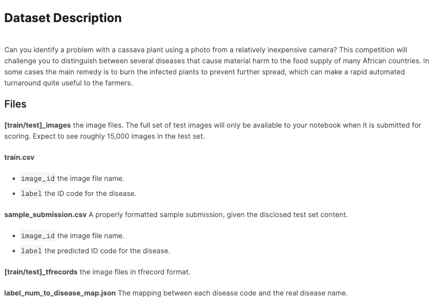
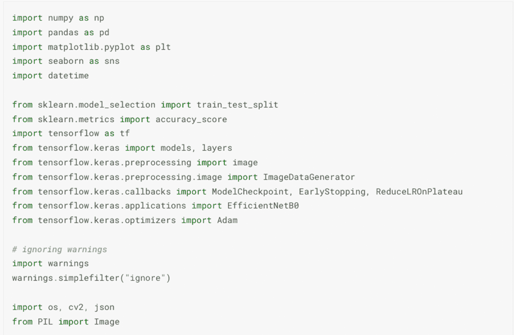
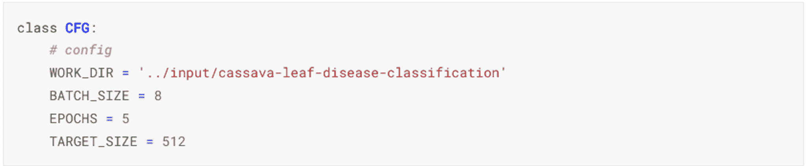
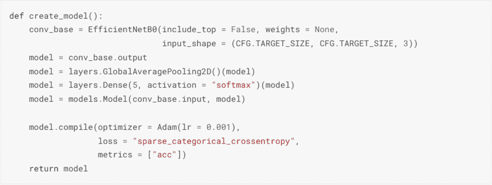
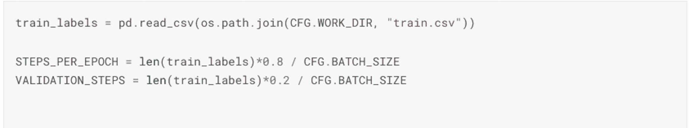
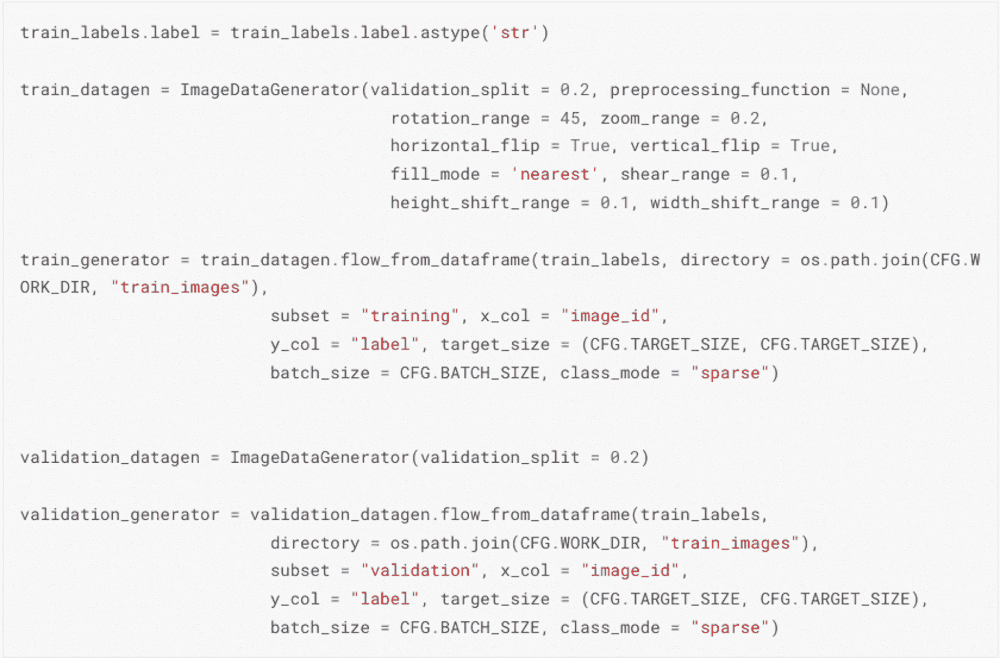
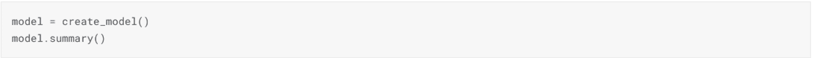
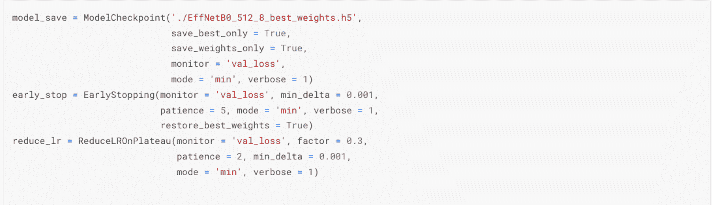
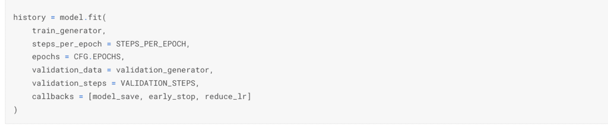
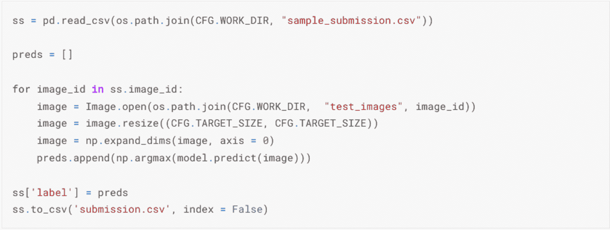

# 第四章：03 木薯叶病竞赛

## 加入我们的 Discord 书籍社区

[`packt.link/EarlyAccessCommunity`](https://packt.link/EarlyAccessCommunity)

在本章中，我们将离开表格数据的领域，专注于图像处理。为了演示在分类竞赛中取得好成绩所需的步骤，我们将使用木薯叶病竞赛的数据：

[`www.kaggle.com/competitions/cassava-leaf-disease-classification`](https://www.kaggle.com/competitions/cassava-leaf-disease-classification)

开始参加 Kaggle 竞赛的第一件事是正确阅读描述：

> *“作为非洲第二大碳水化合物供应商，木薯是小型农户种植的关键粮食安全作物，因为它能够承受恶劣条件。至少 80%的撒哈拉以南非洲的家庭农场种植这种淀粉根，但病毒性疾病是产量低下的主要原因。借助数据科学，可能能够识别常见疾病，以便进行治疗。”*

因此，这个竞赛与一个实际重要的现实生活问题相关——你的里程可能会有所不同，但一般来说，了解这一点是有用的。

> *“现有的疾病检测方法要求农民寻求政府资助的农业专家的帮助，进行视觉检查和诊断植物。这既费时费力，供应不足，又昂贵。作为一个额外的挑战，有效的解决方案必须在重大限制下表现良好，因为非洲农民可能只能使用移动质量的相机和低带宽。”*

这段话——特别是最后一句话——设定了期望：由于数据来自不同的来源，我们可能会遇到一些与图像质量和（可能）分布偏移相关的挑战。

> *“你的任务是将每个木薯图像分类到四个疾病类别或第五个表示健康叶片的类别。在你的帮助下，农民可能能够快速识别患病植物，从而在它们造成不可修复的损害之前挽救他们的作物。”*

这部分相当重要：它指定这是一个分类竞赛，类别数量较少（5 个）。

在完成介绍性的准备工作后，让我们来看看数据。

## 理解数据和指标

进入这个竞赛的“数据”标签页，我们看到提供的数据摘要：

图 3.1：木薯竞赛数据集描述

我们能从中得到什么？

+   数据格式相当直接，组织者甚至提供了疾病名称和数值代码之间的映射

+   我们有 tfrecord 格式的数据，这对于任何有兴趣使用 TPU 的人来说是个好消息

+   提供的测试集只是一个小的子集，在评估时需要用完整的数据集替换。**这表明，在评估时加载先前训练的模型并使用它进行推理是一种更受欢迎的策略**。

评估指标被选为分类准确率：[`developers.google.com/machine-learning/crash-course/classification/accuracy`](https://developers.google.com/machine-learning/crash-course/classification/accuracy)。这个指标接受离散值作为输入，这意味着潜在的集成策略变得稍微复杂一些。损失函数在训练期间实现，以优化学习函数，只要我们想使用基于梯度下降的方法，这个函数就需要是连续的；另一方面，评估指标在训练后用于衡量整体性能，因此可以是离散的。

**练习**：不构建模型，编写代码进行基本的 EDA

+   比较我们的分类问题中类的基数

通常，这也是检查分布偏移的时刻：如果训练集和测试集中的图像非常不同，这肯定是需要考虑的事情。然而，由于在这种情况下我们没有访问完整的数据集，这一步被省略了——请参阅第一章，其中讨论了对抗性验证，这是一种检测数据集之间概念漂移的流行技术。

## 构建基线模型

我们从构建基线解决方案开始。运行端到端解决方案的笔记本可在以下位置找到：

虽然希望作为您可能想要尝试的其他比赛的起点是有用的，但遵循本节中描述的流程进行学习更有教育意义，即逐个复制代码单元格，这样您可以更好地理解它（当然，您也可以改进它——它之所以被称为基线解决方案，是有原因的）。

图 3.2：基线解决方案所需的导入

我们首先导入必要的包——虽然个人风格差异是自然的事情，但我们的观点是，将导入集中在一个地方会使代码在比赛进展和向更复杂的解决方案过渡时更容易维护。此外，我们创建了一个配置类：所有定义我们学习过程参数的占位符：

图 3.3：基线解决方案的配置类

组件包括：

+   数据文件夹在您有时在 Kaggle 之外训练模型时非常有用（例如，在 Google Colab 或本地机器上）

+   BATCH_SIZE 是一个参数，如果您想优化您的训练过程（或在受限制的内存环境中处理大图像时使其成为可能），有时需要调整

+   修改 EPOCHS 对于调试很有用：从少量 EPOCHS 开始，以验证你的解决方案是否可以顺畅地从头到尾运行，并在你接近正确解决方案时增加

+   TARGET_SIZE 定义了我们想要将图像重新缩放的尺寸

+   NCLASSES 对应于我们的分类问题中的可能类别数量

编码解决方案的一个好习惯是将重要的部分封装在函数中 - 而创建我们的可训练模型当然符合重要性的标准：

Figure 3.4: 创建我们的模型函数

关于此步骤的一些简要说明：

+   虽然有更多表达性的选项可用，但开始使用一个可以快速迭代的快速模型是实用的；EfficientNet [`paperswithcode.com/method/efficientnet`](https://paperswithcode.com/method/efficientnet) 架构非常适合这个要求

+   我们添加一个池化层用于正则化目的

+   添加一个分类头 - 一个 Dense 层，其中 CFG.NCLASSES 表示分类器的可能结果数量

+   最后，我们使用与此次比赛要求相对应的损失和指标来编译模型。

**练习**：检查损失和指标的可能选择 - 一个有用的指南是 [`keras.io/api/losses/`](https://keras.io/api/losses/) 其他合理的选项是什么？

下一步是数据：

Figure 3.5: 设置数据生成器

接下来我们设置模型 - 由于我们定义了上述函数，所以非常直接：

Figure 3.6: 实例化模型

在我们开始训练模型之前，我们应该关注回调：

Figure 3.7: 模型回调

值得注意的一些点：

+   ModelCheckpoint 用于确保我们只保留最佳模型的权重，其中最优性是基于要监控的指标（在本例中为验证损失）来决定的

+   EarlyStopping 通过确保在给定数量的 EPOCHS 内验证损失没有改善（下降）时停止训练，帮助我们控制过拟合的风险

+   ReduceLROnPlateau 是一个学习率方案

**练习**：在上面的设置中，哪些参数值得修改，哪些可以保留为默认值？

使用此设置，我们可以拟合模型：

Figure 3.8: 拟合模型

一旦训练完成，我们可以使用该模型为测试集中的每个图像构建图像类别的预测。回想一下，在这个比赛中，公开（可见）的测试集仅包含一个图像，完整测试集的大小是未知的 - 因此需要稍微复杂的方式来构建提交数据框

Figure 3.9: 生成提交

在本节中，我们展示了如何开始参加一个专注于图像分类的竞赛——你可以使用这种方法快速从基本的 EDA（探索性数据分析）过渡到功能性的提交。然而，像这样的基础方法不太可能产生非常具有竞争力的结果。因此，在下一节中，我们将讨论在顶级得分解决方案中使用的更多专业技术。

## 顶级解决方案的启示

在本节中，我们汇集了顶级解决方案的各个方面，这些方面可能使我们超越基线解决方案的水平。请注意，在这个竞赛中，排行榜（无论是公开的还是私人的）都非常紧密；这是几个因素的组合：

+   噪声数据——通过正确识别大部分训练数据，很容易达到 0.89 的准确率，然后每个新的正确识别都允许进行微小的提升

+   指标——准确率在集成中可能很棘手

+   数据量有限

### 预训练

解决数据量有限问题的第一个也是最明显的补救措施是预训练：使用更多数据。木薯竞赛一年前也举行过：

[`www.kaggle.com/competitions/cassava-disease/overview`](https://www.kaggle.com/competitions/cassava-disease/overview)

通过最小的调整，2019 版的数据可以在当前版本中发挥作用。几位竞争者讨论了这个问题：

+   在论坛上发布了 2019 + 2020 数据集的 TFRecords 格式：[`www.kaggle.com/competitions/cassava-leaf-disease-classification/discussion/199131`](https://www.kaggle.com/competitions/cassava-leaf-disease-classification/discussion/199131)

+   2019 版竞赛的获胜方案作为一个有用的起点：[`www.kaggle.com/competitions/cassava-leaf-disease-classification/discussion/216985`](https://www.kaggle.com/competitions/cassava-leaf-disease-classification/discussion/216985)

+   在 2019 年的数据上生成预测并使用伪标签来扩充数据集据报道可以带来一些（轻微的）改进 [`www.kaggle.com/competitions/cassava-leaf-disease-classification/discussion/203594`](https://www.kaggle.com/competitions/cassava-leaf-disease-classification/discussion/203594)

### TTA（测试时间增强）

测试时间增强（TTA）背后的想法是对测试图像应用不同的变换：旋转、翻转和平移。这创建了几个不同的测试图像版本，并为每个版本生成一个预测。然后将结果类概率平均，以获得更自信的答案。Andrew Khael 在笔记本中提供了一个关于此技术的优秀演示：[`www.kaggle.com/code/andrewkh/test-time-augmentation-tta-worth-it`](https://www.kaggle.com/code/andrewkh/test-time-augmentation-tta-worth-it)

在 Cassava 竞赛中，顶级解决方案广泛使用了 TTA，一个优秀的例子是顶级 3 的私人 LB 结果：[`www.kaggle.com/competitions/cassava-leaf-disease-classification/discussion/221150`](https://www.kaggle.com/competitions/cassava-leaf-disease-classification/discussion/221150)

### Transformer

虽然在竞赛过程中使用了更多的已知架构，如 ResNext 和 EfficientNet，但正是添加了更多新颖的架构，为许多渴望在拥挤的排行榜上取得进步的竞争者提供了额外的优势。Transformer 在 2017 年作为 NLP（自然语言处理）的一次革命性架构出现（如果你错过了启动这一切的论文，这里就是：[`arxiv.org/abs/1706.03762`](https://arxiv.org/abs/1706.03762)），并且取得了如此巨大的成功，以至于不可避免地许多人开始思考它们是否也可以应用于其他模态——视觉显然是一个明显的候选者。名为 Vision Transformer 的架构在 Cassava 竞赛中首次亮相。已经公开了一个关于 ViT 的优秀教程：

[`www.kaggle.com/code/abhinand05/vision-transformer-vit-tutorial-baseline`](https://www.kaggle.com/code/abhinand05/vision-transformer-vit-tutorial-baseline)

Vision Transformer 是获胜解决方案的一个重要组成部分：

[`www.kaggle.com/competitions/cassava-leaf-disease-classification/discussion/221150`](https://www.kaggle.com/competitions/cassava-leaf-disease-classification/discussion/221150)

### 集成学习

集成学习的核心思想在 Kaggle 上非常流行（参见 Kaggle 书籍的第九章，以获取更详细的描述），Cassava 竞赛也不例外。事实证明，结合不同的架构非常有益（通过平均类别概率）：EfficientNet、ResNext 和 ViT 彼此之间足够不同，以至于它们的预测可以相互补充。另一个重要的角度是堆叠，即使用模型分两个阶段：第 3 名解决方案结合了多个模型的预测，然后应用 LightGBM 作为混合器

[`www.kaggle.com/competitions/cassava-leaf-disease-classification/discussion/220751`](https://www.kaggle.com/competitions/cassava-leaf-disease-classification/discussion/220751)

获胜解决方案采用了不同的方法（在最终混合中使用的模型较少），但依赖于相同的核心逻辑：

[`www.kaggle.com/competitions/cassava-leaf-disease-classification/discussion/221957`](https://www.kaggle.com/competitions/cassava-leaf-disease-classification/discussion/221957)

## 摘要

在本章中，我们描述了如何开始使用基线解决方案参加图像分类竞赛，并讨论了多种可能的扩展方法，以进入竞争（获奖）区域。
