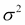
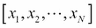
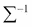
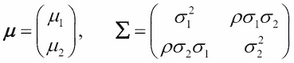

# 第一章 介绍概率论

贝叶斯推理是一种在现实世界问题中，在存在不确定性的情况下，从数据中学习变量之间关系的方法。它是概率理论的一个框架。任何对贝叶斯推理感兴趣的读者都应该对概率理论有很好的了解，以便理解和使用贝叶斯推理。本章概述了概率论，这将足以理解本书中其余章节的内容。

是皮埃尔-西蒙·拉普拉斯首先提出了一个具有数学严谨性的概率的正式定义。这个定义被称为*古典定义*，它陈述如下：

|    | *偶然性的理论在于将同一类事件减少到一定数量的可能情况，也就是说，这些情况在存在方面我们可能同样不确定，并确定有利于所求概率的事件的可能情况的数量。这个数量与所有可能情况数量的比是这种概率的度量，因此它只是一个分子是有利情况数量，分母是所有可能情况数量的分数。* |    |
| --- | --- | --- |
|    | --*皮埃尔-西蒙·拉普拉斯，《关于概率的哲学论文》* |

这个定义的含义是，如果一个随机实验可以导致相互排斥且等可能的结果，那么事件的概率由以下公式给出：

这里，是事件发生的次数。

为了说明这个概念，让我们以掷骰子的简单例子来说明。如果一个骰子是公平的，那么当掷骰子时，所有面出现的概率都是相等的。那么，每个面出现的概率是 1/6。然而，当掷骰子 100 次时，由于随机波动，所有面不会以 1/6 的比例出现。每个面出现概率的估计是出现次数除以掷骰子的次数。由于分母非常大，这个比率将接近 1/6。

从长远来看，这个经典定义将不确定事件的概率视为其发生的相对频率。这也被称为概率的**频率主义**方法。尽管这种方法适用于大量问题，但在某些情况下，这种方法不能被使用。例如，考虑以下问题：*帕塔利普特拉是古代城市的名字还是国王的名字？*在这种情况下，我们对各种可能的答案有一定的信念，但这并不是基于实验结果的计数（在梵文中*Putra*意为儿子，因此有些人可能认为帕塔利普特拉是印度一位古代国王的名字，但它是一个城市）。

另一个例子是，*2016 年美国民主党赢得选举的机会有多大？*有些人可能认为是一半，有些人可能认为是三分之二。在这种情况下，概率被定义为一个人对不确定事件结果的**信念程度**。这被称为概率的**主观**定义。

经典或频率主义概率定义的一个局限性是它不能处理主观概率。正如我们将在本书后面看到的那样，贝叶斯推理是处理频率主义和主观概率解释的自然框架。

# 概率分布

在经典和贝叶斯方法中，概率分布函数是核心量，它捕捉了在不确定性存在时变量之间关系的所有信息。概率分布将概率值分配给随机实验结果的可测子集。涉及的变量可以是离散的或连续的，单变量的或多变量的。尽管人们使用略有不同的术语，但不同类型随机变量常用的概率分布如下：

+   **概率质量函数**（**pmf**）用于离散数值随机变量

+   **分类分布**用于分类随机变量

+   **概率密度函数**（**pdf**）用于连续随机变量

其中一个著名的分布函数是正态分布或高斯分布，它以德国著名数学家和物理学家卡尔·弗里德里希·高斯的名字命名。由于其形状，它也被称为*钟形曲线*。这种分布的数学形式如下：

这里，是均值或位置参数，是标准差或尺度参数（称为方差）。以下图表显示了不同位置和尺度参数值下的分布情况：

可以看到，随着均值的改变，分布峰值的定位也会改变。同样，当标准差改变时，分布的宽度也会改变。

许多自然数据集遵循正态分布，因为根据**中心极限定理**，任何可以表示为独立随机变量均值的随机变量都将具有正态分布。这不受该随机变量分布形式的影响，只要它们具有有限的均值和方差，并且都来自相同的原始分布。正态分布也在数据科学家中非常受欢迎，因为在许多统计推断中，如果基础分布是正态的，就可以推导出理论结果。

现在，让我们来看看正态分布的多维版本。如果随机变量是一个 N 维向量，*x*表示为：

然后，相应的正态分布由以下公式给出：

在这里，对应均值（也称为位置），而是一个 *N x N* 协方差矩阵（也称为尺度）。

为了更好地理解多维正态分布，让我们考虑二维的情况。在这种情况下，和协方差矩阵由以下给出：

在这里，和分别是沿和方向的方差，而是和之间的相关系数。以下图像展示了、和的二维正态分布图：

如果，那么二维正态分布将简化为两个一维正态分布的乘积，因为在这种情况下将变为对角线。以下和相同值但带有和的 2D 正态分布投影说明了这种情况：

在第一种情况下，*x* 和 *y* 之间的高度相关性迫使大多数数据点沿着 45 度线分布，使得分布更加各向异性；而在第二种情况下，当相关性为零时，分布更加各向同性。

在这里，我们将简要回顾一些在贝叶斯推理中使用的其他著名分布。

# 条件概率

通常，人们会对在问题中其他随机变量保持固定的情况下，寻找一组随机变量发生概率感兴趣。作为一个人口健康研究的例子，人们可能会感兴趣地了解在 40-50 岁年龄范围内，患有高血压和糖尿病的人患心脏病的概率是多少。这些问题可以使用条件概率来建模，条件概率定义为在另一个事件已经发生的情况下，某个事件发生的概率。更正式地说，如果我们取变量 *A* 和 *B*，这个定义可以重写如下：

同样：

下面的维恩图更清楚地解释了这个概念：

在贝叶斯推理中，我们感兴趣的是对应于多元分布的条件概率。如果表示整个随机变量集，那么在固定在某个值的情况下，的条件概率由的联合概率与的联合概率的比值给出：

在二维正态分布的情况下，感兴趣的条件概率如下：

可以证明（本章“练习”部分的第 2 题）右侧可以简化，从而得到的表达式，再次以正态分布的形式出现，均值为，方差为。

# 贝叶斯定理

从条件概率和的定义中，可以很容易地证明以下内容：

托马斯·贝叶斯牧师（1701–1761）使用了这个规则，并提出了他著名的贝叶斯定理，如果代表在观察*B*之前对随机变量*A*的值的初始信念（或先验概率），那么在考虑到*B*之后，其后验概率或信念将根据前面的方程更新。因此，贝叶斯推理本质上是在对系统进行一些观察后更新关于不确定系统的信念。从这个意义上说，这也是我们人类了解世界的方式。例如，在我们访问一个新城市之前，我们将在阅读书籍或网络后对该地有一定的先验知识。

然而，在我们到达那里不久之后，这种信念将根据我们对该地的初始经验进行更新。随着我们越来越多地探索这个新城市，我们不断地更新信念。我们将在第三章介绍贝叶斯推理中更详细地描述贝叶斯推理。

# 边际分布

在许多情况下，我们只对随机变量子集的概率分布感兴趣。例如，在前一节提到的冠心病问题中，如果我们想根据年龄推断人群中患有冠心病的人的概率，我们需要积分掉其他随机变量的影响，如血压和糖尿病。这被称为**边际化**：

或者：

注意，边际分布与条件分布非常不同。在条件概率中，我们是在寻找其他随机变量的值固定（条件）在给定值的情况下，随机变量子集的概率。在边际分布的情况下，我们通过从联合分布中积分它们（在某种意义上是平均它们的影响）来消除随机变量子集的影响。例如，在二维正态分布的情况下，关于一个变量的边际化将导致另一个变量的一维正态分布，如下所示：

这个积分的详细情况作为练习给出（本章节的*练习*部分中的练习 3）。

# 期望和协方差

已知一组随机变量的分布，在现实应用中，人们通常感兴趣的通常是估计这些随机变量的平均值以及它们之间的相关性。这些是通过以下表达式正式计算的：

例如，在二维正态分布的情况下，如果我们对寻找变量和之间的相关性感兴趣，它可以通过以下公式从联合分布中形式化计算得出：

## 二项分布

二项分布是一种离散分布，它给出了在*n*个独立试验中发生正面的概率，其中每个试验有两种可能的结果，正面或反面，正面的概率为*p*。每个试验被称为伯努利试验。二项分布的函数形式由以下公式给出：

在这里，表示在*n*次试验中发生*k*次正面的概率。二项分布的均值由*np*给出，方差由*np(1-p)*给出。请查看以下图表：

前面的图表显示了*n*的两个值；100 和 1000，对于*p = 0.7*的二项分布。正如你所看到的，当*n*变得很大时，二项分布变得尖锐峰值。可以证明，在大的*n*极限下，二项分布可以用具有均值*np*和方差*np(1-p)*的正态分布来近似。这是许多离散分布的一个特征，在大的*n*极限下，它们可以被某些连续分布近似。

## Beta 分布

由表示的 Beta 分布是的幂的函数，其反射由以下公式给出：

在这里，是确定分布函数形状的参数，而是给定的 Beta 函数，它是伽玛函数比值的函数：。

Beta 分布是贝叶斯推理中一个非常重要的分布。它是二项分布、伯努利分布、负二项分布和几何分布的共轭先验概率分布（将在下一章中更精确地定义）。它用于模拟百分比和比例的随机行为。例如，Beta 分布已被用于模拟群体遗传学中的**等位基因**频率、项目管理中的时间分配、岩石中的矿物比例以及 HIV 传播概率的不均匀性。

## 伽玛分布

由表示的伽马分布是贝叶斯推断中常用的另一种常见分布。它用于模拟等待时间，如生存率。伽马分布的特殊情况是众所周知的指数分布和卡方分布。

在贝叶斯推断中，伽马分布被用作一维正态分布或如指数分布或泊松分布的速率（）的方差的共轭先验分布。

伽马分布的数学形式如下：

这里，和分别是形状和速率参数（两者都取大于零的值）。还有一种以尺度参数表示的形式，这在计量经济学中很常见。另一个相关的分布是逆伽马分布，它是根据伽马分布分布的变量的倒数分布。它主要在贝叶斯推断中用作一维正态分布方差的共轭先验分布。

## 狄利克雷分布

狄利克雷分布是贝塔分布的多变量类似物。它在贝叶斯推断中常用作多项分布和分类分布的共轭先验分布。主要原因在于，在狄利克雷-多项分布上实施推断技术，如吉布斯抽样，相对容易。

阶数为的狄利克雷分布定义在开维简单形上，如下所示：

这里，、和。

## 威沙特分布

威沙特分布是伽马分布的多变量推广。它定义在对称非负矩阵值随机变量上。在贝叶斯推断中，它被用作正态分布协方差矩阵的逆（或精度矩阵）的共轭先验分布。当我们讨论伽马分布时，我们说它被用作一维正态分布方差的共轭分布。

威沙特分布的数学定义如下：

在这里，表示维度为的矩阵的行列式，而是自由度。

Wishart 分布的一个特例是当对应于具有自由度的著名卡方分布函数时。

维基百科给出了超过 100 种常用的分布列表，这些分布通常被统计学家使用（本章*参考文献*部分的参考 1）。感兴趣的读者应参考这篇文章。

# 练习

1.  通过使用条件概率的定义，证明任何 N 个随机变量的多元联合分布具有以下平凡的分解：

1.  双变量正态分布由以下公式给出：

    这里：

    

    通过使用条件概率的定义，证明条件分布可以写成形式的正态分布，其中和。

1.  通过对练习 2 中的表达式进行显式积分，证明二项正态分布的边缘化将导致单变量正态分布。

1.  在以下表中，展示了 15 种不同鸢尾花花瓣和萼片尺寸的测量数据集（来自鸢尾花数据集，UCI 机器学习数据集仓库）。所有单位均为厘米：

    | 萼片长度 | 萼片宽度 | 花瓣长度 | 花瓣宽度 | 花朵类别 |
    | --- | --- | --- | --- | --- |
    | 5.1 | 3.5 | 1.4 | 0.2 | 爱丽丝·塞托萨 |
    | 4.9 | 3 | 1.4 | 0.2 | 爱丽丝·塞托萨 |
    | 4.7 | 3.2 | 1.3 | 0.2 | 爱丽丝·塞托萨 |
    | 4.6 | 3.1 | 1.5 | 0.2 | 爱丽丝·塞托萨 |
    | 5 | 3.6 | 1.4 | 0.2 | 爱丽丝·塞托萨 |
    | 7 | 3.2 | 4.7 | 1.4 | 爱丽丝·弗洛里斯卡 |
    | 6.4 | 3.2 | 4.5 | 1.5 | 爱丽丝·弗洛里斯卡 |
    | 6.9 | 3.1 | 4.9 | 1.5 | 爱丽丝·弗洛里斯卡 |
    | 5.5 | 2.3 | 4 | 1.3 | 爱丽丝·弗洛里斯卡 |
    | 6.5 | 2.8 | 4.6 | 1.5 | 爱丽丝·弗洛里斯卡 |
    | 6.3 | 3.3 | 6 | 2.5 | 爱丽丝·维吉妮卡 |
    | 5.8 | 2.7 | 5.1 | 1.9 | 爱丽丝·维吉妮卡 |
    | 7.1 | 3 | 5.9 | 2.1 | 爱丽丝·维吉妮卡 |
    | 6.3 | 2.9 | 5.6 | 1.8 | 爱丽丝·维吉妮卡 |
    | 6.5 | 3 | 5.8 | 2.2 | 爱丽丝·维吉妮卡 |

    回答以下问题：

    1.  找到花瓣长度超过 5 厘米且花瓣宽度小于 3 厘米的花朵的概率是多少？

    1.  在花瓣宽度等于 0.2 厘米的条件下，找到花瓣长度小于 1.5 厘米的花朵的概率是多少？

    1.  在花朵类别为爱丽丝·弗洛里斯卡的条件下，找到萼片长度小于 6 厘米且花瓣宽度小于 1.5 厘米的花朵的概率是多少？

# 参考文献

1.  [概率分布列表](http://en.wikipedia.org/wiki/List_of_probability_distributions)

1.  Feller W. 《概率论及其应用导论》。第 1 卷。威利概率与数学统计系列。1968 年。ISBN-10: 0471257087

1.  Jayes E.T. 《概率论：科学的逻辑》。剑桥大学出版社。2003 年。ISBN-10: 0521592712

1.  Radziwill N.M. 《使用 R 的统计学（更简单的方式）：应用统计学非正式文本》。Lapis Lucera。2015 年。ISBN-10: 0692339426

# 摘要

总结本章内容，我们讨论了概率论的基本要素；特别是那些对学习贝叶斯推断所必需的方面。由于篇幅限制，我们没有涵盖该主题的许多基本方面。关于这个主题有一些优秀的书籍，例如，威廉·费勒（参考 2，本章“参考文献”部分），E. T. 杰恩斯（参考 3，本章“参考文献”部分），以及 M. Radziwill（参考 4，本章“参考文献”部分）的书籍。鼓励读者阅读这些书籍，以获得对概率论更深入的理解以及它在现实生活中的应用。

在下一章中，我们将介绍 R 编程语言，这是数据分析中最受欢迎的开源框架，尤其是在贝叶斯推断方面。
