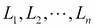
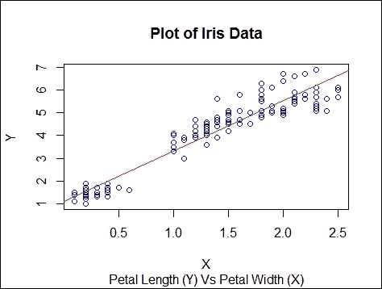

# 第二章：R 环境

R 目前是统计计算中最受欢迎的编程环境之一。它是从贝尔实验室开发的 S 编程语言演变而来的开源语言。R 的主要创造者是新西兰奥克兰大学的两位学者，罗伯特·甘特曼和罗斯·伊哈卡。

R 流行的主要原因，除了在 GNU 通用公共许可证下的免费软件之外，还有以下几点：

+   R 非常易于使用。它是一种解释型语言，同时也可以用于过程式编程。

+   R 支持函数式和面向对象范式。它具有非常强大的图形和数据可视化能力。

+   通过其类似 LaTeX 的文档支持，R 可以用来制作高质量的文档。

+   作为开源软件，R 拥有大量贡献的包，使得几乎所有的统计建模都可以在这个环境中实现。

本章旨在提供一个基本的 R 介绍，以便任何不熟悉该语言的读者可以通过阅读本章来跟随本书的其余部分。不可能在一章中详细描述 R 语言，感兴趣的读者应参考专门为 R 编程编写的书籍。我推荐对那些主要对使用 R 进行数据分析和建模感兴趣的用户的*《R 编程艺术》*（本章*参考文献*部分的第 1 条参考文献）和*《R 食谱》*（本章*参考文献*部分的第 2 条参考文献）。对于那些对学习 R 的高级功能感兴趣的读者，例如编写复杂程序或 R 包，*《高级 R》*（本章*参考文献*部分的第 3 条参考文献）是一本优秀的书籍。

# 设置 R 环境和包

R 是在 GNU 开源许可证下的免费软件。R 附带一个基本包，并且还有大量用户贡献的高级分析和建模包。它还有一个名为 RStudio 的基于图形用户界面的编辑器。在本节中，我们将学习如何下载 R，在您的计算机上设置 R 环境，并编写一个简单的 R 程序。

## 安装 R 和 RStudio

**综合 R 档案网络**（**CRAN**）托管了 R 的所有版本和贡献的包。R for Windows 可以通过从[`cran.r-project.org`](http://cran.r-project.org)下载基础包的二进制文件来安装；标准安装应该足够。对于 Linux 和 Mac OS X，网页提供了下载和安装软件的说明。在撰写本书时，最新版本是 3.1.2。需要安装的各种包可以从包页面单独安装。用户可以使用以下命令从 R 命令提示符安装任何包：

```py
install.packages("package name")

```

安装包后，需要使用以下命令加载包才能使用：

```py
library("package name")

```

一个非常实用的 R 的**集成开发环境**（**IDE**）是 RStudio。它可以从[`www.rstudio.com/`](http://www.rstudio.com/)免费下载。RStudio 在 Windows、Linux 和 Mac 平台上运行。它既有桌面版本，也有服务器版本，可以通过远程服务器上的浏览器界面编写 R 程序。安装 R 和 RStudio 后，将默认工作目录设置为所选目录很有用。RStudio 将包含 R 代码的文件读入和写入工作目录。要找出当前目录，请使用 R 命令`getwd()`。要将工作目录更改为你偏好的目录，请使用以下命令：

```py
setwd("directory path")

```

你也可以通过点击 RStudio 菜单栏的**会话** | **设置工作目录**来设置此选项。

## 你的第一个 R 程序

让我们编写一个简单的程序来添加两个整数`x`和`y`，得到它们的和`z`。在 RStudio 的命令提示符中，输入以下命令并按*Enter*键：

```py
>x <-2
>y <-3
>z <-x+y
>print(z)
[1]  5
```

现在，你可以为`x`和`y`分配不同的值，并打印`z`以查看`z`如何变化。除了`print(z)`，你也可以简单地输入`z`来打印其值。

# R 中的数据管理

在我们开始使用 R 进行任何严肃的编程之前，我们需要学习如何将数据导入 R 环境以及 R 支持哪些数据类型。通常，对于特定的分析，我们可能不会使用整个数据集。因此，我们还需要学习如何为任何分析选择数据子集。本节将涵盖这些方面。

## R 中的数据类型

R 有五种基本数据类型，如下所示：

+   整数型

+   数值型（实数）

+   复数型

+   字符型

+   逻辑型（True/False）

R 中数字的默认表示形式是双精度实数（数值型）。如果你想要显式地表示整型，需要添加后缀`L`。例如，在命令提示符中简单地输入`1`将存储为数值对象。要存储`1`为整型，需要输入`1L`。命令`class(x)`将给出对象`x`的类别（类型）。因此，在命令提示符中输入`class(1)`将得到答案`numeric`，而输入`class(1L)`将得到答案`integer`。

R 还有一个特殊的数字`Inf`，表示无穷大。数字`NaN`（非数字）用于表示未定义的值，例如 0/0。缺失值使用符号`NA`表示。

## R 中的数据结构

R 中的数据结构可以分为同质型（所有元素包含相同的数据类型）或异质型（元素包含不同的数据类型）。此外，这些数据结构根据维数的不同而具有不同的结构：

+   同质型：

    +   **原子向量**：一维

    +   **矩阵**：二维

    +   **数组**：N 维

+   异质型：

    +   **列表**：一维

    +   **数据框**：二维

R 中最基本的对象是向量。要在 R 提示符中创建一个大小为 10 的空整型向量，请输入以下命令：

```py
>v <-vector("integer",10)
>v
[1]  0000000000
```

您可以使用以下命令将值 *m* 赋给向量的 *n* 个组件：

```py
> v[5] <-1
> v
[1]  0000100000
```

读者应注意，与许多编程语言不同，R 中的数组索引从 1 开始，而不是从 0 开始。

与向量只能包含相同类型的对象不同，列表虽然与向量相似，但可以包含不同类型的对象。以下命令将创建一个包含整数、实数和字符的列表：

```py
> l <-list(1L, 2L, 3, 4, "a", "b")
> str(l)
List of 6
$: int 1
$: int 2
$: num 3
$: num 4
$: chr "a"
$: chr "b"
```

在这里，我们使用了 R 中的 `str()` 函数，该函数显示了任何 R 对象的结构。

R 有一个特殊的函数 `c()`，用于将多个基本数据组合成一个向量或列表。例如，`c(1,3,6,2,-1)` 将生成一个包含数字 1,2,3,6,-1 的向量：

```py
> c(1, 3, 6, 2, -1)
[1]  1 3 6 2 -1
```

矩阵是向量在二维上的推广。考虑以下命令：

```py
>m <-matrix(c(1:9),nrow=3,ncol=3)
```

此命令将生成一个 3 x 3 大小的矩阵 `m`，包含从 1 到 9 的数字。

R 中用于存储数据的常见数据结构是数据框。数据框，就像列表一样，可以包含不同类型的数据（数值、整数、布尔或字符）。它本质上是一个长度相等的向量的列表。因此，它具有与矩阵相同的二维结构。数据框的长度（使用 `length( )` 查找）是底层列表的长度，即数据框中的列数。有简单的命令 `nrow( )` 和 `ncol( )` 用于查找数据框的行数和列数。数据框的其他两个属性是 `rownames( )` 和 `colnames( )`，可以用来设置或查找行或列的名称。

## 将数据导入 R

以表格形式存在的数据可以很容易地使用 `read.table(…)` 函数加载到 R 中。它有几个参数使导入非常灵活。其中一些有用的参数如下：

+   `file`: 文件名或完整的 URL

+   `header`: 一个逻辑值，指示文件是否包含包含变量名称的标题行

+   `sep`: 表示列分隔符的字符

+   `row.names`: 行名称的向量

+   `col.names`: 变量名称的向量

+   `skip`: 在读取数据之前要跳过的数据文件中的行数

+   `nrows`: 数据集中的行数

+   `stringsASFactors`: 一个逻辑值，指示字符变量是否可以编码为因子

对于小型数据集，可以使用 `read.table("filename.txt")` 而不指定其他参数；其余的 R 会自动处理。另一个有用的函数是 `read.csv()`，用于仅读取 CSV 文件。

除了从文本文件加载数据外，还可以通过连接外部数据库通过各种接口将数据导入 R。其中一种流行的接口是**开放数据库连接**（**ODBC**）。R 中的**RODBC**包通过 ODBC 接口提供对不同数据库的访问。此包包含用于与数据库连接和执行各种操作的不同函数。RODBC 包中的一些重要函数如下：

+   `odbcConnect(dsn, uid="user_name", pwd="password")`: 用于打开一个连接到已注册数据源名称 `dsn` 的 ODBC 数据库。

+   `sqlFetch(channel, sqtable)`: 用于从 ODBC 数据库读取表到数据框。

+   `sqlQuery(channel, query)`: 用于向 ODBC 数据库提交查询并返回结果。

+   `sqlSave(channel, mydf, tablename = sqtable, append = FALSE)`: 用于将数据框写入或更新到 ODBC 数据库中的表（`append = TRUE`）。

+   `close(channel)`: 用于关闭连接。在这里，`channel`是`odbcConnect`返回的连接句柄。

## 切割和切块数据集

在数据分析中，通常需要切割整个数据框以选择一些变量或观测值。这被称为子集化。R 有一些强大且快速的方法来完成这项工作。

要提取 R 对象的子集，可以使用以下三个运算符：

+   **单方括号 [ ]**: 返回与原始对象相同类的对象。单方括号运算符可以用于选择对象的一个或多个元素。以下是一些示例：

    ```py
    >x <-c(10,20,30,40,50)
    >x[1:3]
    [1]  10 20 30

    >x[x >25]
    [1]  30 40 50

    >f <-x >30
    >x[f]
    [1]  40 50

    >m <-matrix(c(1:9),nrow=3,ncol=3)
    >m[1 ,] #select the entire first row
    [1]  1 4 7

    >m[  ,2] #select the entire second column
    [1]  4 5 6
    ```

+   **双方括号 [[ ]]**: 用于从列表或数据框中提取单个元素。返回的对象不必与初始对象类型相同。以下是一些示例：

    ```py
    >y <-list("a", "b", "c", "d", "e")

    >y[1]
    [[1]]
    [1]  "a"

    >class(y[1])
    [1]  "list"

    >y[[1]]
    [1]  "a"

    >class(y[[1]])
    [1]  "character"
    ```

+   **美元符号 $**: 用于通过名称提取列表或数据框的元素。以下是一些示例：

    ```py
    >z <-list(John = 12 ,Mary = 18,Alice = 24 ,Bob = 17 ,Tom = 21)

    >z$Bob
    [1] 17
    ```

+   **使用负索引值**: 这用于删除特定的索引或列——对应索引有一个带负号的子集。例如，要从前面的列表中删除 Mary 和 Bob，请使用以下代码：

    ```py
    > y <-z[c(-2, -4)]
    > y
    ```

## 向量化操作

在 R 中，许多操作，如涉及向量和矩阵的算术运算，可以使用向量化操作非常高效地完成。例如，如果你正在添加两个向量`x`和`y`，它们的元素是并行添加的。这也使得代码更加简洁，更容易理解。例如，在代码中添加两个向量不需要`for( )`循环：

```py
>x <-c(1,2,3,4,5)

>y <-c(10,20,30,40,50)

>z <-x+y

>z
[1]  11 22 33 44 55

>w <-x*y

>w
[1]  10 40 90 160 250
```

向量化操作的另一个非常有用的例子是在矩阵的情况下。如果`X`和`Y`是两个矩阵，则可以在 R 中以向量化的形式执行以下操作：

```py
>X*Y  ## Element-wise multiplication
>X/Y  ## Element-wise division
>X  %*%  Y  ## Standard matrix multiplication
```

# 编写 R 程序

尽管在 R 中，许多数据分析可以通过命令提示符以交互式方式进行，但通常对于更复杂的任务，需要编写 R 脚本。如介绍中所述，R 具有函数式和面向对象编程语言的视角。在本节中，将描述 R 编程的一些标准语法。

## 控制结构

控制结构用于控制程序执行的流程。标准控制结构如下：

+   `if` 和 `else`: 测试条件

+   `for`: 循环一组语句固定次数

+   `while`: 当条件为真时循环一组语句

+   `repeat`: 执行无限循环

+   `break`: 用于中断循环的执行

+   `next`: 跳过循环的一次迭代

+   `return`: 退出函数

## 函数

如果想用 R 进行更严肃的编程，了解如何编写函数是至关重要的。它们使语言更加强大和优雅。R 有许多内置函数，例如 `mean()`、`sort()`、`sin()`、`plot()` 等，这些函数都是使用 R 命令编写的。

函数的定义如下：

```py
>fname<-function(arg1,arg2,   ){
        R Expressions
   }
```

这里，`fname` 是函数的名称；`arg1`、`arg2` 等是传递给函数的参数。请注意，与在其他语言中不同，R 中的函数不需要以返回语句结束。默认情况下，函数体内执行的最后一个语句由函数返回。

一旦定义了函数，只需通过输入函数名并传递参数值来执行它：

```py
>fname(arg1,arg2,…)
```

R 中函数的重要特性如下：

+   函数是一等公民

+   函数可以作为参数传递给其他函数

+   可以在另一个函数内部定义一个函数（嵌套）

+   函数的参数可以通过位置或名称进行匹配

让我们考虑一个函数的简单示例，给定一个输入向量 `x`，计算其平均值。要编写此函数，请通过菜单栏中的 **文件** | **新建文件** | **R 脚本** 在 RStudio 中打开一个新的 R 脚本窗口。在此 R 脚本中，输入以下代码行：

```py
myMean <-function(x){
    s <-sum(x)
    l <-length(x)
    mean <-s/l
    mean
}
```

选择整个代码，然后使用 *Ctrl* + *Enter* 键来执行脚本。这完成了 `myMean` 函数的定义。要在命令提示符中使用此函数，请输入以下内容：

```py
>x <-c(10,20,30,40,50)
>myMean(x)
```

这将生成以下结果：

```py
>myMean(x)
[1]  30
```

## 作用域规则

在编程语言中，理解所有变量的作用域非常重要，以避免执行过程中的错误。在函数中，变量的作用域有两种类型：词法作用域和动态作用域。在词法作用域的情况下，函数中的变量值是在函数定义的环境中进行查找的。通常，这是全局环境。在动态作用域的情况下，变量的值是在函数被调用的环境中查找的（调用环境）。

R 使用词汇作用域，这使得在函数内部编写函数成为可能。以下示例说明了这一点：

```py
>x <-0.1
>f <-function(y){
          x*y
    }
>g <-function(y){
          x<-5
          x-f(y)
    }
>g(10)
[1]  4
```

答案是`4`，因为在评估函数`f`时，`x`的值是从全局环境中获取的，即`0.1`，而在评估函数`g`时，`x`的值是从`g`的局部环境中获取的，即`5`。

词汇作用域有一些缺点。由于变量的值是从定义函数的环境中进行查找的，因此所有函数都必须携带指向它们各自定义环境的指针。此外，所有对象都必须在程序执行期间存储在内存中。

## 循环函数

通常，我们有一个包含一些对象的列表，并且想要将函数应用于列表的每个元素。例如，我们有一个包含来自*n*个参与者的*m*个问题的调查结果列表。我们希望找到每个问题的平均响应（假设所有问题都有作为数值的响应）。可以使用 R 中的`mean()`函数通过一个`for`循环遍历问题集并找到*n*个用户的平均值。在这种情况下，循环函数很有用，可以更紧凑地进行此类计算。这些在其他语言（如 Java）中类似于迭代器。

以下是在 R 中的标准循环函数：

+   `lapply`: 遍历列表并对每个元素评估函数

+   `sapply`: 与`lapply`相同，但输出形式更简单

+   `mapply`: `sapply`的多变量版本

+   `apply`: 在数组边缘应用函数

+   `tapply`: 将函数应用于锯齿形数组的每个单元格

### lapply

`lapply()`函数的使用方式如下：

```py
>lapply(X,FUN,   )
```

在这里，`X`是一个包含数据的列表或向量。`FUN`是需要应用于列表或向量每个元素的函数的名称。最后一个参数表示可选参数。使用`lapply`的结果始终是一个列表，无论输入类型如何。

例如，考虑四家公司的季度收入（以十亿美元计，非真实数据）。我们希望计算四家公司的年收入平均值，如下所示：

```py
>X<-list(HP=c(12.5,14.3,16.1,15.4),IBM=c(22,24.5,23.7,26.2),Dell=c(8.9,9.7,10.8,11.5),Oracle=c(20.5,22.7,21.8,24.4)  )
>lapply(X,mean)
$HP
[1]  14.575

$IBM
[1]  24.1

$Dell
[1]  10.225

$Oracle
[1]  22.35
```

### sapply

`sapply()`函数与`lapply()`类似，但增加了将输出简化为所需形式的选择。例如，`sapply()`可以在之前的数据集中如下使用：

```py
> sapply(X,mean,simplify="array")
     HP       IBM       Dell      Oracle
   14.575    24.100    10.225     22.350
```

### mapply

`lapply()`和`sapply()`函数只能有一个参数。如果您想要使用多个变量参数应用函数，则`mapply()`很有用。以下是它的用法：

```py
>mapply(FUN,L1,L2,   ,Ln,SIMPLIFY=TRUE)
```

在这里，是需要应用函数`FUN`的列表。例如，考虑以下列表生成命令：

```py
>rep(x=10,times=5)
[1] 10 10 10 10 10
```

在这里，`rep`函数重复`x`的值五次。假设我们想要创建一个列表，其中数字 10 出现 1 次，数字 20 出现 2 次，依此类推，我们可以使用`mapply`如下所示：

```py
>mapply(rep,x=c(10,20,30,40,50),times=1:5)
```

### apply

`apply()` 函数用于将函数应用于数组或矩阵的边缘。函数的形式如下：

```py
>apply(X,MARGIN,FUN,   )
```

在这里，`MARGIN` 是一个向量，它给出了函数将被应用到的子索引。例如，在矩阵的情况下，`1` 表示行，`2` 表示列，而 `c(1,2)` 表示行和列。以下是一个示例来说明：

```py
>Y <-matrix(1:9,nrow=3,ncol=3)
>Y
          [,1]        [,2]          [,3]
[1,]        1           4             7
[2,]        2           5             8
[1,]        3           6             9
>apply(Y,1,sum) #sum along the row
[1]  12 15 18
>apply(Y,2,sum) #sum along the column
[1]  6 15 24
```

### tapply

`tapply()` 函数用于在向量的子集中应用函数。函数描述如下：

```py
>tapply(X,INDEX,FUN,SIMPLIFY=TRUE)
```

让我们考虑之前提到的五家公司的季度营收示例：

```py
>X<-X(HP=c(12.5,14.3,16.1,15.4),IBM=c(22,24.5,23.7,26.2),Dell=c(8.9,9.7,10.8,11.5),Oracle=c(20.5,22.7,21.8,24.4)  )
```

使用 `lapply()`，我们找到了每家公司的平均年营收。假设我们想找到所有四家公司按季度平均的营收，我们可以使用 `tapply()` 如下；这里我们使用函数 `c` 而不是列表来创建 `X`：

```py
>X<-c(HP=c(12.5,14.3,16.1,15.4),IBM=c(22,24.5,23.7,26.2),Dell=c(8.9,9.7,10.8,11.5),Oracle=c(20.5,22.7,21.8,24.4)  )

>f<-factor(rep(c("Q1","Q2","Q3","Q4"),times=4) ) 
>f
[1]  Q1 Q2 Q3 Q4 Q1 Q2 Q3 Q4 Q1 Q2 Q3 Q4 Q1 Q2 Q3 Q4
Levels Q1 Q2 Q3 Q4

>tapply(X,f,mean,simplify=TRUE)
Q1           Q2         Q3        Q4
15.97      17.80      18.10     19.37
```

通过使用以季度值作为级别的因子列表，我们可以使用 `tapply()` 对每个季度应用 `mean()` 函数。

# 数据可视化

R 的一个强大功能是其生成高质量绘图和可视化数据的函数。R 中的绘图函数可以分为三组：

+   高级绘图函数用于创建新绘图、添加坐标轴、标签和标题。

+   低级绘图函数用于向现有绘图添加更多信息。这包括添加额外的点、线和标签。

+   交互式绘图函数用于交互式地向现有绘图添加信息或从现有绘图中提取信息。

R 的基础包本身包含几个绘图函数。对于更高级的图形应用，可以使用如 **ggplot2**、**grid** 或 **lattice** 等包。特别是，ggplot2 对于生成视觉上吸引人的、多层图形非常有用。它基于 *图形语法* 的概念。由于篇幅限制，我们在这本书中不涵盖这些包。感兴趣的读者应参考本章 *参考文献* 部分的第 4 个参考文献 Hadley Wickham 的书籍。

## 高级绘图函数

让我们从 R 中最基本的绘图函数开始，如下所示：

+   `plot( )`：这是 R 中最常见的绘图函数。它是一个泛型函数，其输出取决于第一个参数的类型。

+   `plot(x, y)`：这会产生 `y` 与 `x` 的散点图。

+   `plot(x)`：如果 `x` 是实值向量，输出将是 `x` 的值与其在 *X* 轴上的索引的绘图。如果 `x` 是复数，则将实部与虚部进行绘图。

+   `plot(f, y)`：在这里，`f` 是因子对象，`y` 是数值向量。该函数为 `f` 的每个级别生成 `y` 的箱线图。

+   `plot(y ~ expr)`：在这里，`y` 是任何对象，`expr` 是由 *+* 分隔的对象名称列表。该函数将 `y` 与 `expr` 中命名的每个对象进行绘图。

R 中有两个用于可视化多元数据的实用函数：

+   `pairs(X)`: 如果`X`是一个包含数值数据的 data frame，那么这个函数将生成由`X`的列定义的变量的成对散点图矩阵。

+   `coplot(y ~ x | z)`: 如果`y`和`x`是数值向量，而`z`是一个因子对象，那么这个函数将为`z`的每个水平绘制`y`与`x`的关系图。

对于绘制数据的分布，可以使用以下函数：

+   `hist(x)`: 这条命令生成数值向量`x`的直方图。

+   `qqplot(x, y)`: 这条命令将`x`的量数与`y`的量数进行比较，以比较它们的相应分布。

+   `qqnorm(x)`: 这条命令将数值向量`x`与预期的正态顺序得分进行比较。

## 低级绘图命令

要向图表添加点和线，可以使用以下命令：

+   `points(x, y)`: 这条命令将点(x, y)添加到当前图表。

+   `lines(x, y)`: 这条命令向当前图表添加连接线。

+   `abline(a, b)`: 这条命令向当前图表添加斜率为`b`、截距为`a`的直线。

+   `polygon(x, y, …)`: 这条命令用于绘制由有序顶点(x, y, …)定义的多边形。

要向图表添加文本，请使用以下函数：

+   `text(x, y, labels)`: 这条命令在当前图表的点(x, y)处添加文本。

+   `legend(x, y, legend)`: 这条命令在当前图表的点(x, y)处添加图例。

+   `title(main, sub)`: 这条命令在当前图表的顶部添加一个标题`main`，使用大字体，并在底部添加一个副标题`sub`，使用小字体。

+   `axis(side, …)`: 这条命令在由第一个参数给出的侧边添加一个轴到当前图表。`side`可以取从 1 到 4 的值，从底部开始按顺时针方向计数。

以下示例展示了如何绘制散点图并添加趋势线。为此，我们将使用由 R.A. Fisher 创建的著名 Iris 数据集，该数据集在 R 中本身可用：

```py
data(iris)
str(iris)
plot(iris$Petal.Width, iris$Petal.Length, col = "blue", xlab = "X", ylab = "Y")
title(main = "Plot of Iris Data", sub = "Petal Length (Y) Vs Petal Width (X)")
fitlm <- lm(iris$Petal.Length ~ iris$Petal.Width)
abline(fitlm[1], fitlm[2], col = "red")
```



## 交互式图形函数

R 中有函数允许用户以交互方式使用鼠标从图表中添加或提取信息：

+   `locator (n , type)`: 该命令等待用户使用左键在当前图表上选择`n`个位置。在这里，`type`可以是`n`、`p`、`l`或`o`，用于在这些位置绘制点或线。例如，要将图例*Outlier*放置在异常点附近，可以使用以下代码：

    ```py
    >text(locator(1),"Outlier" ,adj=0")
    ```

+   `identify(x, y, label)`: 这允许用户通过在附近放置标签来突出显示使用左键选择的任何点`x`和`y`。

# 抽样

通常，我们会对从总体中抽取的代表性数据集感兴趣，用于某些分析或实验设计。这在贝叶斯推断中尤其如此，正如我们将在后面的章节中看到的那样，样本是从后验分布中抽取的。因此，在本章中学习如何从某些已知分布中抽取*N*个点将是有用的。

在我们使用任何特定的抽样方法之前，读者应该注意，R，像任何其他计算机程序一样，使用伪随机数生成器进行抽样。提供起始种子数以获得可重复的结果是有用的。这可以通过使用 `set.seed(n)` 命令并使用整数 `n` 作为种子来完成。

## 从区间进行随机均匀抽样

要生成在区间 *[a, b]* 内均匀分布的 *n* 个随机数（数值），可以使用 `runif()` 函数：

```py
>runif(5,1,10)  #generates 5 random numbers between 1 and 10
[1]  7.416    9.846    3.093   2.656   1.561
```

如果没有提供任何参数，`runif()` 将生成介于 0 和 1 之间的均匀随机数。

如果我们想要生成在区间内均匀分布的随机整数，可以使用 `sample()` 函数：

```py
>sample(1:100,10,replace=T)   #generates 10 random integers between 1 and 100
[1]  24 51 46 87 30 86 50 45 53 62
```

选项 `replace=T` 表示允许重复。

## 从正态分布中进行抽样

通常，我们可能想要生成符合特定分布的数据，例如正态分布。在单变量分布的情况下，R 有几个内置函数用于此目的。对于从正态分布中抽样数据，要使用的函数是 `rnorm()`。例如，考虑以下代码：

```py
>rnorm(5,mean=0,sd=1)
[1]  0.759  -1.676   0.569  0.928 -0.609
```

这将生成五个随机数，这些数遵循均值为 0、标准差为 1 的正态分布。

类似地，可以使用 `rbinom()` 函数从二项分布中进行抽样，`rpois()` 用于从泊松分布中进行抽样，`rbeta()` 用于从 Beta 分布中进行抽样，以及 `rgamma()` 用于从 Gamma 分布中进行抽样，以提及其他一些分布。

# 练习

对于本章的以下练习，我们使用来自 UCI 机器学习存储库的 Auto MPG 数据集（本章参考文献部分的第 5 和 6 条）。数据集可以从 [`archive.ics.uci.edu/ml/datasets.html`](https://archive.ics.uci.edu/ml/datasets.html) 下载。该数据集包含 1970-1982 年间在美国测量的汽车油耗。除了消耗值外，还有属性变量，如气缸数、排量、马力、重量、加速度、年份、产地和汽车名称：

+   使用 `read.table()` 函数将数据集加载到 R 中。

+   为每个汽车名称生成 mpg 值的箱线图。

+   编写一个函数，该函数将计算给定列名的缩放值（减去平均值并除以标准差）。

+   使用 `lapply()` 函数计算所有变量的缩放值。

+   使用 `coplot()` 函数为每个汽车名称生成 mpg 与加速度的散点图。使用图例注释图形。

# 参考文献

1.  Matloff N. *R 编程艺术 – 统计软件设计之旅*. No Starch Press. 2011\. ISBN-10: 1593273843

1.  Teetor P. *R 烹饪书*. O'Reilly Media. 2011\. ISBN-10: 0596809158

1.  Wickham H. *高级 R*. Chapman & Hall/CRC The R Series. 2015\. ISBN-10: 1466586966

1.  Wickham H. *ggplot2: 数据分析的优雅图形（使用 R!）*. Springer. 2010\. ISBN-10: 0387981403

1.  Auto MPG 数据集，UCI 机器学习仓库，[`archive.ics.uci.edu/ml/datasets/Auto+MPG`](https://archive.ics.uci.edu/ml/datasets/Auto+MPG)

1.  Quinlan R. "Combining Instance-Based and Model-Based Learning". In: Tenth International Conference of Machine Learning. 236-243\. University of Massachusetts, Amherst. Morgan Kaufmann. 1993

### 小贴士

**下载示例代码**

您可以从[`www.packtpub.com`](http://www.packtpub.com)下载您购买的所有 Packt Publishing 书籍的示例代码文件。如果您在其他地方购买了这本书，您可以访问[`www.packtpub.com/support`](http://www.packtpub.com/support)并注册，以便将文件直接通过电子邮件发送给您。

# 摘要

在本章中，您被介绍了 R 环境。阅读完本章后，您学习了如何将数据导入 R，选择数据子集进行分析，以及使用函数和控制结构编写简单的 R 程序。此外，您现在应该熟悉 R 的图形功能以及一些高级功能，例如循环函数。在下一章中，我们将开始介绍本书的核心主题，贝叶斯推理。
