# 第三章。介绍贝叶斯推理

在第一章中，*介绍概率论*，我们学习了贝叶斯定理作为两个随机变量，如 *A* 和 *B* 的条件概率之间的关系。这个定理是贝叶斯推理中根据观察更新信念或模型参数值的基础。在本章中，将给出贝叶斯推理的更正式处理。首先，让我们尝试理解在贝叶斯方法中如何处理现实世界问题中的不确定性。

# 贝叶斯不确定性视图

经典的或频率派统计学通常认为，任何产生含噪声数据的物理过程都可以用具有固定参数值的随机模型来建模。参数值通过如**最大似然估计**等程序从观察数据中学习。基本思想是在参数空间中搜索以找到最大化观察到的数据概率的参数值。既没有以正式方式处理从数据中估计模型参数的不确定性，也没有处理解释研究现象的模型本身的不确定性。*另一方面，贝叶斯方法使用概率来处理所有不确定性的来源*。因此，解释观察数据集的模型及其参数都不是固定的，而是被视为不确定变量。贝叶斯推理提供了一个框架来学习模型参数的整个分布，而不仅仅是最大化观察数据概率的值。学习可以来自观察数据提供的证据和专家的领域知识。还有一个框架来选择最适合解释给定数据集的模型家族中的最佳模型。

一旦我们有了模型参数的分布，我们就可以通过联合概率分布的边缘化来消除使用学习模型预测的随机变量的未来值中参数估计不确定性的影响。这正如在第一章中解释的，*介绍概率论*。

再次考虑 *N* 个随机变量的联合概率分布，正如在第一章中讨论的，*介绍概率论*：

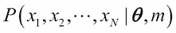

这次，我们在概率分布的参数中添加了一个额外的项 *m*，以明确表示参数 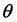 是由模型 *m* 生成的。然后，根据贝叶斯定理，给定观察数据 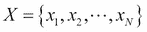 和模型 *m* 的条件下，模型参数的概率分布如下：

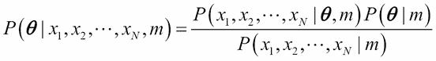

正式来说，方程 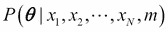 的左侧的项被称为**后验概率分布**。右侧分子中出现的第二个项 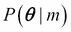 被称为**先验概率分布**。它代表了在观察任何数据之前，例如从领域知识中得到的对模型参数的先验信念。先验分布也可以有参数，这些参数被称为超参数。项  是模型 *m* 解释观察数据的似然。由于 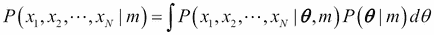，它可以被视为一个归一化常数 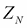。前面的方程可以重写为以下迭代形式：

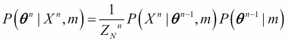

这里，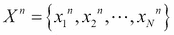 代表在时间步 *n* 获得的观测值，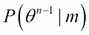 是直到时间步 *n - 1* 更新的边缘参数分布，而  是在时间步 *n* 观察到观测值 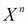 后更新的模型参数分布。

将贝叶斯定理以这种迭代形式表述对于在线学习是有用的，并且它暗示以下内容：

+   模型参数可以在获得更多数据和证据的迭代过程中学习。

+   使用迄今为止看到的数据估计的后验分布，在获得下一组观测值时可以被视为先验模型。

+   即使没有数据可用，也可以仅基于领域知识创建的先验分布进行预测。

为了使这些观点更加清晰，让我们通过一个简单的说明性例子来说明。考虑这样一个案例，即一个人试图估计某个地区男性身高的分布。用于此例的数据是从人口中随机抽取的 *M* 个志愿者的身高测量值（以厘米为单位）。我们假设身高服从均值为 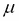 和方差  的正态分布：

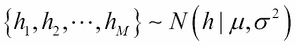

如前所述，在经典统计学中，人们试图从观测数据中估计和的值。除了每个参数的最佳估计值外，还可以确定估计的误差项。另一方面，在贝叶斯方法中，和也被视为随机变量。为了简化，我们假设是一个已知的常数。此外，我们假设的先验分布是一个具有(超)参数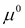和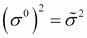的正态分布。在这种情况下，的后验分布的表达式如下：

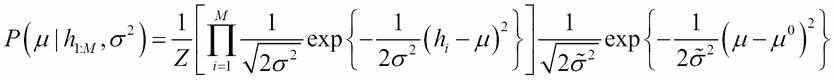

为了方便起见，我们在这里使用符号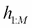来表示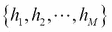。将乘积中的项展开并完成指数中的平方是一个简单的练习。这作为本章末尾的练习给出。后验分布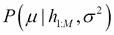的结果表达式如下：


在这里，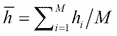代表样本均值。尽管前面的表达式看起来很复杂，但它有一个非常简单的解释。后验分布也是一个正态分布，具有以下均值：


方差如下：

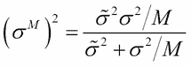

*后验均值是先验均值*  *和样本均值* 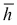 *的加权平均值。随着样本大小 *M* 的增加，样本均值的权重增加，而先验的权重减少。同样，后验精度（方差的倒数）是先验精度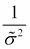和样本均值精度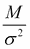的和：

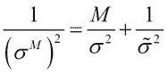

随着 *M* 的增加，来自观测（证据）的精度贡献超过了来自先验知识的贡献。

让我们举一个具体的例子，其中我们考虑具有人口均值 5.5 和人口标准差 0.5 的年龄分布。我们使用以下 R 脚本来从这个总体中抽取 100 人：

```py
>set.seed(100)
>age_samples <- rnorm(10000,mean = 5.5,sd=0.5)
```

我们可以使用以下 R 函数来计算后验分布：

```py
>age_mean <- function(n){
  mu0 <- 5
  sd0 <- 1
  mus <- mean(age_samples[1:n])
  sds <- sd(age_samples[1:n])
  mu_n <- (sd0²/(sd0² + sds²/n)) * mus + (sds²/n/(sd0² + sds²/n)) * mu0
  mu_n
}
>samp <- c(25,50,100,200,400,500,1000,2000,5000,10000)
>mu <- sapply(samp,age_mean,simplify = "array")
>plot(samp,mu,type="b",col="blue",ylim=c(5.3,5.7),xlab="no of samples",ylab="estimate of mean")
>abline(5.5,0)
```


可以看到，随着样本数量的增加，估计的均值渐近地接近总体均值。初始的低值是由于先验的影响，在这种情况下，先验是 5.0。

这个关于先验知识和观察证据如何贡献于整体模型参数估计的简单直观图景在任何贝叶斯推理中都成立。它们如何结合的精确数学表达式会有所不同。因此，一个人可以仅使用先验信息，无论是来自领域知识还是过去收集的数据，就开始使用模型进行预测。此外，随着新观察数据的到来，模型可以使用贝叶斯方案进行更新。

## 选择合适的先验分布

在前面的简单例子中，我们看到了如果似然函数具有正态分布的形式，并且当先验分布被选为正态分布时，后验分布也变成了正态分布。此外，我们还可以得到后验均值的封闭形式解析表达式。由于后验是通过将先验和似然函数相乘，并通过在参数变量上的积分进行归一化得到的，因此先验分布的形式对后验有显著影响。本节将给出有关不同类型先验分布的更多细节，以及在某些特定情境下如何选择先验分布的指导方针。

有不同的方式以正式的方式对先验分布进行分类。其中一种方法是基于先验提供的信息量。在这个方案中，先验分布被分类为 *信息性先验*、*弱信息性先验*、*最少信息性先验* 和 *非信息性先验*。对每个这些类别的详细讨论超出了本书的范围，感兴趣的读者应参考相关书籍（本章“参考文献”部分的参考 1 和 2）。在这里，我们采取更多实践者的方法，并说明了在实践中最常用的先验分布的一些重要类别。

### 非信息先验

让我们从我们没有关于模型参数的任何先验知识的情况开始。在这种情况下，我们希望通过数学表达式表达对模型参数的完全无知。这是通过所谓的非信息先验实现的。例如，在单个随机变量 *x* 可以取  和 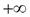 之间任何值的情形下，其均值  的非信息先验如下：

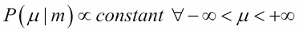

在这里，参数值的完全无知通过参数空间中的均匀分布函数来捕捉。请注意，均匀分布不是一个合适的分布函数，因为其在域上的积分不等于 1；因此，它不是可归一化的。然而，只要乘以似然函数，就可以使用不适当的先验分布函数；结果的后验可以归一化。

如果感兴趣的参数是方差，那么根据定义，它只能取非负值。在这种情况下，我们变换变量，使得变换后的变量在到的范围内具有均匀概率：

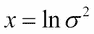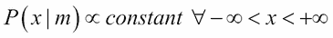

使用简单的微分微积分很容易证明，在原始变量中对应的非信息分布函数如下：

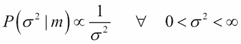

在实际应用中另一个著名的非信息先验是杰弗里斯先验，它是以英国统计学家哈罗德·杰弗里斯的名字命名的。这个先验在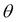的重参数化下是不变的，并且定义为与费舍尔信息矩阵的行列式的平方根成比例：

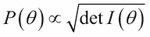

在这里，讨论一下费舍尔信息矩阵是值得的。如果*X*是一个按照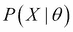分布的随机变量，我们可能想知道观察*X*携带了多少关于未知参数的信息。这正是费舍尔信息矩阵提供的内容。它定义为得分（似然函数对数的一阶导数）的第二矩：

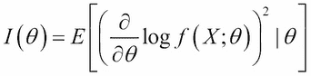

让我们通过一个简单的二维问题来理解费舍尔信息矩阵和杰弗里斯先验。这个例子是由加州大学的 D. Wittman 教授给出的（本章“参考文献”部分的第 3 个参考文献）。让我们考虑两种食品：面包和热狗。

假设它们通常成对产生（热狗和面包对），但偶尔热狗也会在单独的过程中独立生产。有两个可观测量，如热狗的数量 (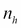) 和面包的数量 (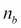)，以及两个模型参数，如成对的产量 () 和单独热狗的产量 ()。我们假设这两种食品产品数量的测量不确定性分别按照正态分布分布，方差分别为 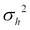 和 。在这种情况下，该问题的费舍尔信息矩阵如下：

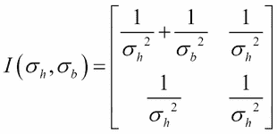

在这种情况下，费舍尔信息矩阵的逆对应于协方差矩阵：


我们在本章的 *练习* 部分包含了一个问题，用于计算费舍尔信息矩阵和杰弗里先验。请读者尝试解决这个问题，以了解如何从观察结果中计算杰弗里先验。

### 主观先验

与经典（频率主义）统计学相比，贝叶斯统计学的关键优势之一是框架允许人们捕捉关于任何随机变量的主观信念。通常，人们会对随机变量的最小值、最大值、平均值以及最可能或峰值有直观的感觉。例如，如果一个人对热带国家冬季每小时温度的分布感兴趣，那么熟悉热带气候或气候学专家将相信，在冬季，温度可以低至 15°C，高至 27°C，最可能的温度值是 23°C。这可以通过三角分布作为先验分布来捕捉，如图所示。

三角分布有三个参数，分别对应最小值 (*a*)、最可能值 (*b*) 和最大值 (*c*)。该分布的均值和方差如下给出：

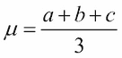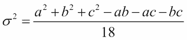

一个人还可以使用 PERT 分布来表示对随机变量的最小值、最大值和最可能值的信念。PERT 分布是一个重新参数化的 Beta 分布，如下所示：

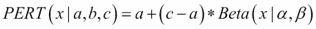

在这里：

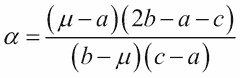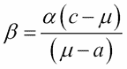

PERT 分布常用于项目完成时间分析，其名称来源于项目评估和审查技术。另一个经常使用三角形和 PERT 分布的领域是**风险管理**。

通常，人们也会对随机变量值的相对概率有所信念。例如，当研究日本或某些欧洲国家等人口中老年人比年轻人多的年龄分布时，专家可以为不同年龄在人口中的概率给出相对权重。这可以通过包含以下详细信息的相对分布来捕捉：

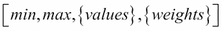

在这里，*min* 和 *max* 分别代表最小值和最大值，*{values}* 代表可能观察到的值的集合，而 *{weights}* 代表它们的相对权重。例如，在人口年龄分布问题中，这些可能如下所示：

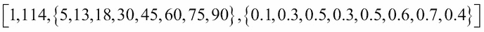

权重不需要总和为 1。

### 共轭先验

如果先验分布和后验分布属于同一分布族，那么它们被称为**共轭分布**，相应的先验被称为**似然函数的共轭先验**。共轭先验对于获取后验分布的解析封闭形式表达式非常有帮助。在我们考虑的简单例子中，我们看到了当噪声按照正态分布分布时，选择均值正态先验会导致后验正态分布。以下表格给出了我们将在这本书的后续章节中使用的某些著名共轭对的例子：

| 似然函数 | 模型参数 | 共轭先验 | 超参数 |
| --- | --- | --- | --- |
| 二项分布 | 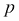(概率) | Beta 分布 | 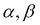 |
| 泊松分布 | 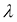(速率) | 伽马分布 | 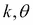 |
| 分类变量 | (概率，类别数量) | Dirichlet 分布 |  |
| 单变量正态分布（已知方差 ） | (均值) | 正态分布 |  |
| 单变量正态分布（已知均值 ） | (方差) | 逆伽马分布 |  |

### 层次先验

有时，为超参数本身定义先验分布是有用的。这与贝叶斯观点一致，即所有参数都应通过使用概率被视为不确定。这些分布被称为超先验分布。在理论上，人们可以将此扩展到许多层次，作为一个层次模型。这是获取最优先验分布的一种方式。例如：


是具有超参数的先验分布。我们可以通过第二组方程定义的先验分布，如下所示：


在这里，是超参数的超先验分布，由超超参数参数化。人们可以用相同的方式为定义一个先验分布，并永远继续这个过程。将此类模型形式化的实际原因是，在某个层次级别上，人们可以为超参数定义一个均匀先验，反映对参数分布的完全无知，并有效地截断层次结构。在实际情况下，通常在第二级进行此操作。这对应于前一个示例中使用的均匀分布。

我想通过强调一个重要观点来结束本节。尽管先验分布在贝叶斯推理中起着重要作用，但只要选择的先验是合理的，并与迄今为止看到的领域知识和证据一致，就无需过分担心。原因如下：首先，随着我们获得更多证据，先验的重要性会减弱。其次，当我们使用贝叶斯模型进行预测时，我们将使用后验分布对参数估计的不确定性进行平均。*这种平均是贝叶斯推理的关键成分，它消除了选择正确先验时许多的模糊性*。

## 后验分布的估计

到目前为止，我们讨论了贝叶斯推理背后的基本概念以及如何选择先验分布。由于在使用模型进行预测之前，需要计算模型参数的后验分布，因此我们在这节中讨论这个任务。尽管贝叶斯规则看起来非常简单，但在实际可用的方式下计算后验分布通常非常具有挑战性。这主要是因为当有 *N* 个参数时，计算归一化常数  涉及到 *N*-维积分。即使使用共轭先验，这种计算也可能非常难以分析或数值跟踪。这就是为什么直到最近几十年，人们不使用贝叶斯推理进行多元建模的主要原因之一。在本节中，我们将探讨在实践中使用的各种计算后验分布的近似方法。

### 最大后验概率估计

**最大后验概率**（**MAP**）估计是一种点估计，对应于取后验分布的最大值或众数。尽管取点估计不能捕捉参数估计中的变异性，但与最大似然估计相比，它在一定程度上考虑了先验分布的影响。MAP 估计也被称为穷人的贝叶斯推理。

从贝叶斯规则，我们有：


这里，为了方便起见，我们使用了 *X* 表示 *N*-维向量 。最后一个关系成立是因为贝叶斯规则右侧分母与  无关。将此与以下最大似然估计进行比较：


MAP 估计和 ML 估计之间的区别在于，ML 找到似然函数的众数，而 MAP 找到似然函数与先验的乘积的众数。

### 拉普拉斯近似

我们看到，最大后验概率估计（MAP）只是找到后验分布的最大值。拉普拉斯近似更进一步，并计算最大值周围的局部曲率，直到二次项。这相当于假设后验分布在大数据量相对于参数数量时近似为高斯（正态）分布：*M >> N*。


这里，*A* 是通过取后验分布对数的导数得到的 *N x N* 赫 essian 矩阵：


使用以下条件概率的定义，可以简单地评估前面的表达式在 ：


我们可以从拉普拉斯近似中得到一个关于 *P(X|m)* 的表达式，其形式如下：


在大量样本的极限情况下，可以证明这个表达式可以简化为以下形式：


术语  被称为**贝叶斯信息准则**（**BIC**），可用于模型选择或模型比较。这是统计模型的一个**拟合优度**术语。另一个常用的类似标准是**赤池信息准则**（**AIC**），其定义为 。

现在我们将讨论如何使用 BIC 来比较不同的模型以进行模型选择。在贝叶斯框架中，使用贝叶斯因子比较两个模型，如  和 。贝叶斯因子的定义  是后验优势与先验优势之比，由以下给出：


在这里，后验优势是给定数据的两个模型的后验概率之比，先验优势是两个模型的先验概率之比，如前一个方程所示。如果 ，数据更倾向于模型 ；如果 ，数据更倾向于模型 。

在现实中，计算贝叶斯因子是困难的，因为很难得到精确的先验概率。可以证明，在大的 *N* 极限下， 可以被视为  的粗略近似。

### 蒙特卡洛模拟

我们迄今为止讨论的两个近似，即最大似然估计（MAP）和拉普拉斯近似，当后验概率在最大值附近有一个非常尖锐的峰值时是有用的。在现实生活中的许多情况下，后验概率通常会有长尾。例如，在电子商务中，用户购买产品的概率在所有产品空间中具有长尾。因此，在许多实际情况下，MAP 和拉普拉斯近似都无法给出良好的结果。另一种方法是直接从后验分布中进行采样。蒙特卡洛模拟是一种用于从后验分布中采样的技术，是实际应用中贝叶斯推理的得力工具。在本节中，我们将向读者介绍**马尔可夫链蒙特卡洛**（**MCMC**）模拟，并讨论实践中常用的两种 MCMC 方法。

如前所述，让是我们通过后验分布从数据中感兴趣估计的参数集。考虑参数是离散的情况，其中每个参数有*K*个可能的值，即。设置一个具有状态和转移概率矩阵的马尔可夫过程。MCMC 模拟背后的基本思想是，可以选择转移概率，使得马尔可夫链的稳态分布将对应于我们感兴趣的后续分布。一旦这样做，在马尔可夫链达到稳态后，从马尔可夫链输出中采样将给出的样本，这些样本遵循后验分布。

现在，问题是如何设置马尔可夫过程，使其稳态分布对应于感兴趣的后续分布。为此有两种众所周知的方法。一种是 Metropolis-Hastings 算法，另一种是 Gibbs 抽样。我们将在下面详细讨论这两种方法。

#### Metropolis-Hasting 算法

Metropolis-Hasting 算法是第一个被提出的用于 MCMC（本章“参考文献”部分的第 4 个参考文献）的主要算法之一。它有一个非常简单的概念——类似于优化中的爬山算法：

1.  让表示时间步长*t*时系统的状态。

1.  要在时间步长*t + 1*时将系统移动到另一个状态，通过从提议分布中采样生成一个候选状态。提议分布被选择得易于从中采样。

1.  以以下概率接受提议的移动：

1.  如果被接受， = ；如果不接受，。

1.  继续这个过程，直到分布收敛到稳态。

在这里，是我们想要模拟的后验分布。在特定条件下，前面的更新规则将保证，在长时间极限下，马尔可夫过程将趋近于的稳态分布。

Metropolis-Hasting 算法背后的直觉很简单。提议分布给出了从当前状态在下一个时间步过渡到状态的条件概率。因此，是系统当前处于状态并且会在下一个时间步过渡到状态的概率。同样，是系统当前处于状态并且会在下一个时间步过渡到状态的概率。如果这两个概率的比率大于 1，则接受移动。或者，仅以比率给出的概率接受移动。因此，Metropolis-Hasting 算法类似于一种爬山算法，其中接受所有向上的移动，并且偶尔以较小的概率接受向下的移动。向下的移动有助于系统不陷入局部最小值。

让我们重新回顾一下在引言部分讨论的估计人群中身高均值和方差后验分布的例子。这次我们将使用 Metropolis-Hasting 算法来估计后验分布。以下 R 代码行完成这项工作：

```py
>set.seed(100)
>mu_t <- 5.5
>sd_t <- 0.5
>age_samples <- rnorm(10000,mean = mu_t,sd = sd_t)

>#function to compute log likelihood
>loglikelihood <- function(x,mu,sigma){
    singlell <- dnorm(x,mean = mu,sd = sigma,log = T)
    sumll <- sum(singlell)
    sumll
    }

>#function to compute prior distribution for mean on log scale
>d_prior_mu <- function(mu){
  dnorm(mu,0,10,log=T)
  }

>#function to compute prior distribution for std dev on log scale
>d_prior_sigma <- function(sigma){
  dunif(sigma,0,5,log=T)
  }

>#function to compute posterior distribution on log scale
>d_posterior <- function(x,mu,sigma){
  loglikelihood(x,mu,sigma) + d_prior_mu(mu) + d_prior_sigma(sigma)
   }

>#function to make transition moves
  tran_move <- function(x,dist = .1){
  x + rnorm(1,0,dist)
  }

>num_iter <- 10000
>posterior <- array(dim = c(2,num_iter))
>accepted <- array(dim=num_iter - 1)
>theta_posterior <-array(dim=c(2,num_iter))

>values_initial <- list(mu = runif(1,4,8),sigma = runif(1,1,5))
>theta_posterior[1,1] <- values_initial$mu
>theta_posterior[2,1] <- values_initial$sigma

>for (t in 2:num_iter){
   #proposed next values for parameters
    theta_proposed <- c(tran_move(theta_posterior[1,t-1]),tran_move(theta_posterior[2,t-1]))
    p_proposed <- d_posterior(age_samples,mu = theta_proposed[1],sigma = theta_proposed[2])
    p_prev <-d_posterior(age_samples,mu = theta_posterior[1,t-1],sigma = theta_posterior[2,t-1])
    eps <- exp(p_proposed - p_prev)

    # proposal is accepted if posterior density is higher w/ theta_proposed
    # if posterior density is not higher, it is accepted with probability eps
    accept <- rbinom(1,1,prob = min(eps,1))
    accepted[t - 1] <- accept
    if (accept == 1){
      theta_posterior[,t] <- theta_proposed
    } else {
      theta_posterior[,t] <- theta_posterior[,t-1]
    }
}
```

要绘制得到的后验分布，我们使用 R 中的 sm 包：

```py
>library(sm)
x <- cbind(c(theta_posterior[1,1:num_iter]),c(theta_posterior[2,1:num_iter]))
xlim <- c(min(x[,1]),max(x[,1]))
ylim <- c(min(x[,2]),max(x[,2]))
zlim <- c(0,max(1))

sm.density(x,
           xlab = "mu",ylab="sigma",
           zlab = " ",zlim = zlim,
           xlim = xlim ,ylim = ylim,col="white")
title("Posterior density")
```

得到的后验分布将类似于以下图示：


虽然 Metropolis-Hasting 算法对于任何贝叶斯推断问题来说实现起来都很简单，但在实践中，它在许多情况下可能并不非常高效。主要原因在于，除非一个人仔细选择一个提议分布，否则会有太多的拒绝，并且需要大量的更新才能达到稳态。当参数数量较高时，这种情况尤为明显。有各种基本 Metropolis-Hasting 算法的修改版本，试图克服这些困难。在下一节讨论各种 R 包的 Metropolis-Hasting 算法时，我们将简要介绍这些修改。

##### Metropolis-Hasting 算法的 R 包

R 中存在多个用于 Metropolis-Hasting 算法的 MCMC 模拟的贡献包，在此我们将介绍一些流行的包。

由 Charles J. Geyer 和 Leif T. Johnson 贡献的 **mcmc** 包是 R 中用于 MCMC 模拟的流行包之一。它包含一个名为 `metrop` 的函数，用于运行基本的 Metropolis-Hasting 算法。`metrop` 函数使用多元正态分布作为提议分布。

有时，进行变量变换以改善 MCMC 收敛速度是有用的。mcmc 包有一个名为 `morph` 的函数用于此目的。结合这两个函数，`morph.metrop` 函数首先对变量进行变换，然后在变换后的密度上进行 Metropolis 采样，并将结果转换回原始变量。

除了 mcmc 包之外，R 中还有两个有用的包：由 Corey Chivers 贡献的 **MHadaptive** 包和 Gopi Goswami 的 **进化蒙特卡洛**（**EMC**）**算法**包。由于篇幅限制，我们不会在本书中讨论这两个包。有兴趣的读者请从 C-RAN 项目网站下载这些包并尝试使用它们。

#### 吉布斯采样

如前所述，Metropolis-Hasting 算法由于过多的拒绝而存在收敛性差的缺点，如果不选择一个好的提议分布。为了避免这个问题，两位物理学家 Stuart Geman 和 Donald Geman 提出了一种新的算法（本章“参考文献”部分的第 5 个参考文献）。这个算法被称为吉布斯采样，并以著名的物理学家 J W Gibbs 命名。目前，吉布斯采样是贝叶斯推理中 MCMC 的主要工具。

设  为我们希望估计的模型参数集合：

1.  从一个初始状态  开始。

1.  在每个时间步，逐个更新组件，通过从基于其他组件最近值的分布中进行抽样：

1.  经过 *N* 步后，参数的所有组件都将被更新。

1.  继续进行步骤 2，直到马尔可夫过程收敛到稳态。

吉布斯采样是一个非常有效的算法，因为没有拒绝。然而，要使用吉布斯采样，必须知道后验分布的条件分布形式。

##### 吉布斯采样的 R 包

不幸的是，在 R 中，贡献的通用吉布斯采样包并不多。**gibbs.met** 包提供了两个通用函数，用于以朴素的方式为用户定义的目标分布执行 MCMC。第一个函数是 `gibbs_met`。该函数使用 Metropolis 算法对每个一维分布进行采样，提议分布为正态分布。第二个函数 `met_gaussian` 使用独立正态分布更新整个状态，其中心位于前一个状态。gibbs.met 包对于通用 MCMC 在中等维度问题上是很有用的。

在本章的*练习*部分，我们将讨论一个涉及通过使用 Metropolis-Hasting 算法和 Gibbs 抽样从二维正态分布中采样的问题，以使这些概念更加清晰。读者可以使用这些提到的包来解决这个练习。

除了通用的 MCMC 包之外，R 中还有几个包专门用于解决特定类型的机器学习问题。**GibbsACOV**包可用于单因素混合效应方差分析（ANOVA）和方差分析协方差（ANCOVA）模型。**lda**包执行主题（LDA）模型的折叠 Gibbs 抽样方法。**stocc**包通过 Gibbs 抽样拟合空间占用模型。**binomlogit**包实现了二项 Logit 模型的效率 MCMC。**Bmk**是一个用于进行 MCMC 输出的诊断的包。**Bayesian Output Analysis Program**（**BOA**）是另一个类似的包。**RBugs**是知名**OpenBUGS** MCMC 包的接口。**ggmcmc**包是分析 MCMC 模拟的图形工具。**MCMCglm**是一个用于广义线性混合模型的包，**BoomSpikeSlab**是一个用于进行 Spike 和 Slab 回归的 MCMC 的包。最后，**SamplerCompare**是一个用于比较各种 MCMC 包性能的包（更多是一个框架）。

### 变分近似

在变分近似方案中，假设后验分布可以被近似为因式分解形式：


注意，因式分解形式也是一种条件分布，因此每个都可以通过条件变量*X*依赖于其他。换句话说，这不是一个简单的因式分解，使得每个参数相互独立。这种因式分解的优势在于可以选择更易于分析的分布函数形式。实际上，可以通过调整函数，使其尽可能接近真实的后验。这在数学上被表述为一个**变分法**问题，如这里所述。

让我们使用一些度量来计算两个概率分布之间的距离，例如和，其中。概率分布之间距离的一个标准度量是 Kullback-Leibler 散度，或简称 KL 散度。它被定义为以下：


它被称为散度而不是距离的原因是在*Q*和*P*上不对称。可以使用关系并将前面的表达式重写为*log P(X)*的方程：


这里：


注意，在*ln P(X)*的方程中，左侧对*Q*没有依赖。因此，相对于*Q*最大化将最小化，因为它们的和是一个与*Q*无关的项。通过选择对*Q*进行解析处理的函数，可以在实践中进行这种最大化。这将导致后验分布的一个近似以及*ln P(X)*的下界，即证据的对数或边缘似然，因为。

因此，变分近似一次给出了两个量。后验分布可以用来对未来观测进行预测（如下一节所述），而证据的下界可以用于模型选择。

如何在实际中实现 KL 散度的最小化？不深入数学细节，我们在这里给出解的最终表达式：


在这里，意味着对联合分布的对数期望是在所有参数上取的，除了。因此，KL 散度的最小化导致了一组耦合方程；每个都需要自洽地求解以获得最终解。尽管变分近似在数学上看起来非常复杂，但它有一个非常简单、直观的解释。每个参数的后验分布是通过对所有其他变量的联合分布的对数进行平均得到的。这在物理学中类似于平均场理论，其中，如果有*N*个相互作用的带电粒子，系统可以通过说每个粒子处于一个由所有其他粒子产生的场的平均值所构成的恒定外部场来近似。

我们将通过提及一些用于变分近似的 R 包来结束本节。**VBmix**包可用于贝叶斯混合模型中的变分近似。一个类似的包是**vbdm**，用于贝叶斯离散混合模型。**vbsr**包用于 Spike 回归正则化线性模型中的变分推理。

## 未来观测的预测

一旦我们使用已经描述的一些方法从数据中推断出后验分布，就可以用它来预测未来的观测值。给定观察到的数据*X*和参数的后验分布，观察到值*Y*的概率由以下公式给出：


注意，在这个表达式中，似然函数是通过后验给出的参数分布进行平均的。这实际上是贝叶斯推理的核心优势。这种贝叶斯平均消除了估计参数值的不确定性，并使预测更加稳健。

# 练习

1.  通过展开指数中的平方，对每个*i*收集所有类似的幂次项，并再次使其成为完全平方，推导出后验均值的方程。注意，指数的乘积可以写成求和项的指数。

1.  对于这个练习，我们使用的是来自 UCI 机器学习仓库（[`archive.ics.uci.edu/ml/datasets/Smartphone-Based+Recognition+of+Human+Activities+and+Postural+Transitions`](https://archive.ics.uci.edu/ml/datasets/Smartphone-Based+Recognition+of+Human+Activities+and+Postural+Transitions)）对应的智能手机基于人类活动和姿势转换识别的数据集。它包含从智能手机加速度计获取的加速度值。原始数据集包含加速度的*x*、*y*和*z*分量以及相应的时间戳值。在这个练习中，我们只使用了加速度的两个水平分量*x*和*y*。在这个练习中，我们假设加速度遵循正态分布。我们还假设加速度均值具有正态先验分布，均值的超参数在区间(-0.5, 0.5)内均匀分布，且已知方差等于 1。通过方程给出的表达式找到后验均值。

1.  编写一个 R 函数来计算 Fisher 信息矩阵。使用本节练习 1 中提到的数据集，获取这个问题的 Fisher 信息矩阵。

1.  使用 R 中的**mcmc**包设置这个问题的 MCMC 模拟。绘制模拟数据的直方图。

1.  使用 Gibbs 抽样设置 MCMC 模拟。将结果与 Metropolis 算法的结果进行比较。

# 参考文献

1.  Berger J.O. 《统计决策理论及贝叶斯分析》。Springer 统计学系列。1993 年。ISBN-10: 0387960988

1.  Jayes E.T. 《概率论：科学的逻辑》。剑桥大学出版社。2003 年。ISBN-10: 052159271

1.  Wittman D. "Fisher 矩阵入门". 加州大学戴维斯分校物理系 ([`www.physics.ucdavis.edu/~dwittman/Fisher-matrix-guide.pdf`](http://www.physics.ucdavis.edu/~dwittman/Fisher-matrix-guide.pdf))

1.  Metropolis N, Rosenbluth A.W., Rosenbluth M.N., Teller A.H., Teller E. "快速计算机器的物态方程计算". 化学物理杂志 21 (6): 1087–1092\. 1953

1.  Geman S., Geman D. "随机松弛、吉布斯分布以及图像的贝叶斯恢复". IEEE 交易杂志：模式分析与机器智能 6 (6): 721-741\. 1984

# 摘要

在本章中，我们介绍了贝叶斯推理的基本原理。从贝叶斯统计与经典统计在处理不确定性方面的不同之处开始，我们深入讨论了贝叶斯定理的各个组成部分。首先，我们学习了不同类型的先验分布以及如何为你的问题选择正确的分布。然后，我们学习了使用如 MAP 估计、拉普拉斯近似和 MCMC 模拟等技术来估计后验分布。一旦读者理解了本章内容，他们就能将贝叶斯原理应用于他们的数据分析问题。在我们开始讨论具体的贝叶斯机器学习问题之前，下一章我们将回顾机器学习的一般知识。
