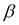

# 第四章：使用贝叶斯推理的机器学习

既然我们已经了解了贝叶斯推理和 R，现在是时候将两者都用于机器学习了。在本章中，我们将概述不同的机器学习技术，并在随后的章节中详细讨论每一个。机器学习是计算机科学和统计学交叉的领域，也是人工智能或 AI 的一个子分支。这个名字本质上来源于 AI 早期的工作，当时研究人员试图开发学习机器，这些机器能够仅从数据中自动学习输入和输出变量之间的关系。一旦机器在一个给定问题的数据集上进行了训练，它就可以作为一个黑盒来预测新输入变量的输出变量的值。

将机器的这个学习过程设置在数学框架中是有用的。设*X*和*Y*是两个随机变量，我们寻求一个学习机器，它能从数据中学习这两个变量之间的关系，并预测给定*X*值的*Y*值。系统完全由联合概率分布*P(X,Y)*来表征，然而，这个分布的形式是未知的。学习的目标是找到一个函数*f(X)*，它将*X*映射到*Y*，使得预测包含尽可能小的误差。为了实现这一点，选择一个损失函数*L(Y, f(X))*，并找到一个*f(X)*，它最小化给定*X*和*Y*的联合分布的期望或平均损失，如下所示：

在统计决策理论中，这被称为**经验风险最小化**。典型的损失函数是**平方损失函数**(使用贝叶斯推理的机器学习)，如果*Y*是一个连续变量，以及**Hinge 损失函数**(使用贝叶斯推理的机器学习)，如果*Y*是一个具有值的二进制离散变量。第一种情况通常被称为**回归**，第二种情况称为**二元分类**，正如我们将在本章后面看到的。

这里描述的数学框架被称为**监督学习**，其中机器被呈现一个包含对应于对(Y, X)对的地面真实值的训练数据集。让我们再次考虑平方损失函数的情况。在这里，学习任务是要找到一个*f(X)*，它最小化以下内容：

由于目标是预测给定*X*值的*Y*值，我们在积分内使用了*P(X, Y)*的分解来使用条件分布*P(Y|X)*。可以证明，先前损失函数的最小化导致以下解：

前述方程的意义是，对于任何输入值*X*，*Y*的最佳预测是条件概率分布*P(Y|X)*在*X*处的均值或期望，用*E*表示。

在第三章《介绍贝叶斯推理》中，我们提到了**最大似然估计**（**MLE**）作为学习任何分布*P(X)*参数的方法。一般来说，如果基础分布是正态分布，MLE 与平方损失函数的最小化相同。

注意，在经验风险最小化中，我们正在学习参数，*E[(Y|X)]*，给定*X*值的条件分布的均值。我们将使用一个特定的机器学习任务，线性回归，来解释贝叶斯推理相对于经典学习方法的优势。然而，在这之前，我们将简要解释一些机器学习的更一般方面。

监督机器学习模型有两种类型，即生成模型和判别模型。在生成模型的情况下，算法试图从数据中学习*X*和*Y*的联合概率，即*P(X,Y)*，并使用它来估计均值*P(Y|X)*。在判别模型的情况下，算法试图直接学习期望的函数，即*P(Y|X)*的均值，并且不尝试对*X*变量进行建模。

在训练数据中对目标变量的值进行标记是手动完成的。这使得当需要使用非常大的数据集，如文本分析中的情况时，监督学习变得非常昂贵。然而，非常常见的是，监督学习方法产生最准确的结果。

如果没有足够的训练数据可供学习，一个人仍然可以通过**无监督学习**来使用机器学习。在这里，学习主要是通过发现数据集中变量之间关联模式的过程。聚类具有相似特征的点是一个经典的例子。

**强化学习**是机器学习的第三种类型，学习发生在动态环境中，机器需要根据其当前状态执行某些动作。与每个动作相关联的是奖励。机器需要学习在每个状态下需要采取什么动作，以便最大化总奖励。这通常是机器人学习在现实生活环境中执行任务，如驾驶车辆的方式。

# 为什么机器学习要使用贝叶斯推理？

我们已经在上一章讨论了贝叶斯统计相对于经典统计的优势。在本章中，我们将更详细地探讨我们上一章学到的贝叶斯推理的一些概念在机器学习中的应用。为此，我们选取一个简单的机器学习任务，即线性回归。让我们考虑一个学习任务，其中我们有一个包含 *N* 对点的数据集 *D* ，目标是使用线性回归构建一个机器学习模型，该模型可以用来预测  的值，给定新的  值。

在线性回归中，首先，我们假设 *Y* 的形式如下：

在这里，*F(X)* 是一个函数，它捕捉了 *X* 和 *Y* 之间真实关系的函数， 是一个误差项，它捕捉了数据中固有的噪声。假设这种噪声由均值为 0、方差为  的正态分布来表征。这意味着，如果我们有一个无限大的训练数据集，我们可以从数据中学习到 *F(X)* 的形式，即使在这种情况下，我们也只能预测到加上一个噪声项  的 *Y*。在实践中，我们只有有限大小的训练数据集 *D*；因此，我们只能学习到 *F(X)* 的一个近似形式，用  表示。

注意，我们在这里讨论了两种类型的误差。一种是误差项 ，这是由于数据中固有的噪声造成的，我们对此无能为力。第二种误差是在学习 *F(X)* 时，通过函数  从数据集 *D* 中近似地学习。

通常，，它是输入变量*X*和输出变量*Y*之间近似映射的函数，是一个包含一组参数的*X*的函数。当是参数的线性函数时，我们说学习模型是线性的。一个普遍的误解是，只有当是*X*的线性函数时，线性回归才对应这种情况。参数线性而不是*X*的原因是，在最小化损失函数的过程中，实际上是通过最小化参数值来寻找最佳的。因此，在上是线性的函数会导致一个可以更容易地解析和数值解决的线性优化问题。因此，线性回归对应以下：

这是一个在*M*个基函数上的扩展。在这里，每个基函数是*X*的函数，没有任何未知参数。在机器学习中，这些被称为特征函数或模型特征。对于线性回归问题，因此损失函数可以写成以下形式：

这里，是参数向量的转置，*B(X)*是由基函数组成的向量。从数据集中学习意味着通过一些优化方案（如梯度下降）最小化损失函数来估计的值。

选择尽可能多的基函数来捕捉数据中的有趣模式是很重要的。然而，选择更多的基函数或特征会导致模型过拟合，即它甚至开始拟合数据中包含的噪声。过拟合会导致对新输入数据的预测效果变差。因此，选择最佳特征的最佳数量以最大化任何机器学习模型的预测准确性是很重要的。在基于经典统计学的机器学习中，这通过所谓的**偏差-方差权衡**和**模型正则化**来实现。而在基于贝叶斯推理的机器学习中，可以通过贝叶斯模型平均来最大化预测模型的准确性，无需施加模型正则化或偏差-方差权衡。我们将在以下各节中学习这些概念。

# 模型过拟合与偏差-方差权衡

在上一节中提到的预期损失，在采用平方损失函数的线性回归情况下，可以写成三个项的和，如下所示：

在这里，*偏差*是真实模型 *F(X)* 与对数据集集合取平均值的差异 。*偏差*是衡量集合中所有数据集的平均预测与真实回归函数 *F(X)* 差异的程度。*方差*由  给出。它是衡量给定数据集的解在所有数据集的平均值周围变化的程度的度量。因此，*方差*是衡量函数  对特定数据集 *D* 选择敏感性的度量。第三项 *噪声*，如前所述，是观察值与真实回归函数之间的差异  的期望，在所有 *X* 和 *Y* 的值上。将这些放在一起，我们可以写出以下公式：

机器学习的目标是学习从数据中学习函数，以最小化预期的损失 *E[L]*。可以通过在模型中保持更多的基函数来不断减少偏差，从而增加模型复杂度。然而，由于每个模型参数都是从给定的数据集中学习得到的，因此模型越复杂，其参数估计对数据集的敏感性就越高。这导致复杂模型具有更大的方差。因此，在任何监督机器学习任务中，模型偏差和模型复杂度之间存在权衡。必须选择一个最优复杂度的模型，以最小化未见数据集上的预测误差。在经典或频率论方法中，这是通过将标记数据分为三组来实现的。第一组是训练集，第二组是验证集，第三组是测试集。使用训练集训练的不同复杂度的模型将使用验证数据集进行评估，以选择最优复杂度的模型。然后，最终使用测试集来估计预测误差。

# 选择最优复杂度的模型

有不同的方法来选择具有适当复杂性的模型，以便在未见数据上的预测误差更小。让我们在线性回归模型的背景下讨论这些方法中的每一个。

## 子集选择

在子集选择方法中，只选择整个变量集中对模型显著的那部分变量。这不仅通过减少模型方差来提高模型的预测精度，而且从解释的角度来看也是有益的。有几种不同的子集选择方法，但以下两种是最常用的方法：

+   **向前选择法**：在向前选择法中，从一个没有变量（仅包含截距）的模型开始，通过使用贪婪算法，逐个添加其他变量。在每一步中，选择最能改善拟合的变量添加到模型中。

+   **向后选择法**：在向后选择法中，从一个完整的模型开始，依次删除对拟合影响最小的变量。在每一步中，选择 Z 分数最小的变量进行删除。在统计学中，随机变量的 Z 分数是衡量一个元素与其均值之间标准差的一个度量。Z 分数的值较小（通常小于 2）表明变量的影响更有可能是偶然的，并且不具有统计学意义。

## 模型正则化

在这种方法中，向损失函数中添加一个惩罚项，该惩罚项不允许参数的大小在最小化过程中变得非常大。主要有两种实现方式：

+   **岭回归**：这种简单的正则化类型是，额外的项与由给出的参数向量的幅度成正比。具有正则化项的线性回归的损失函数可以写成以下形式：具有较大幅度的参数将对损失做出更大的贡献。因此，前面损失函数的最小化通常会产生具有较小值的参数并减少过拟合。的最优值是从验证集中找到的。

+   **Lasso**：在 Lasso 中，也添加了一个类似于岭回归的惩罚项，但这个项是每个参数模的加权和，而不是其平方：

    虽然这看起来是一个简单的变化，但 Lasso 与岭回归有一些非常重要的区别。首先，项的存在使得损失函数在参数上是非线性的。与岭回归中的线性规划问题相比，相应的最小化问题称为二次规划问题，对于后者，存在闭式解。由于惩罚项的特殊形式，当系数在最小化过程中缩小，其中一些最终会变成零。因此，从某种意义上说，Lasso 也是一个子集选择问题。

关于各种子集选择和模型正则化方法的详细讨论，可以在 Trevor Hastie 等人所著的书籍中找到（本章“参考文献”部分的第 1 条参考文献）。

# 贝叶斯平均

到目前为止，我们已经了解到，仅仅最小化损失函数（或等价地，在正态分布的情况下最大化对数似然函数）对于开发给定问题的机器学习模型是不够的。我们必须担心模型过度拟合训练数据，这将在新的数据集上导致更大的预测误差。贝叶斯方法的主要优势在于，原则上可以摆脱这个问题，而无需使用显式的正则化和为训练和验证使用不同的数据集。这被称为贝叶斯模型平均，将在下面进行讨论。这是本章主要问题之一，“为什么机器学习的贝叶斯推理？”的答案之一。

对于这个问题，我们将对线性回归问题进行完整的贝叶斯处理。由于我们只想解释贝叶斯推理如何避免过拟合问题，我们将跳过所有的数学推导，只在此处陈述重要的结果。更多细节，感兴趣的读者可以参考 Christopher M. Bishop 的书籍（本章“参考文献”部分的第 2 条参考文献）。

线性回归方程，其中具有零均值和方差（等价于精度），可以转换为具有*Y*具有均值*f(X)*和精度的概率分布形式。因此，线性回归等价于估计正态分布的均值：

由于，其中基础函数集*B(X)*是已知的，并且我们假设这里的噪声参数也是一个已知的常数，因此只需要将作为一个不确定变量来完全贝叶斯处理。

贝叶斯推理的第一步是计算参数向量的后验分布。为此，我们假设的先验分布是一个*M*维正态分布（因为有*M*个分量），均值为，协方差矩阵为。正如我们在第三章中看到的，*介绍贝叶斯推理*，这对应于对先验取共轭分布：

相应的后验分布由以下给出：

这里，和。

这里，*B*是一个由基础向量*B*在不同*X*值上堆叠而成的*N x M*矩阵，如图所示：

现在我们已经得到了的后验分布作为一个封闭形式的解析表达式，我们可以用它来预测*Y*的新值。为了得到*Y*预测分布的解析封闭形式，我们假设和。这对应于一个具有零均值和各向同性协方差矩阵的先验，其特征是一个精度参数。预测分布或预测新值*X = x*为*y*的概率由以下给出：

这个等式是本节的核心主题。在经典或频率派方法中，一个人从训练数据集中估计参数的特定值，并通过简单地使用来预测 *y* 的概率。除非使用正则化，否则这不会解决模型的过拟合问题。在贝叶斯推理中，我们通过使用从数据中学习到的参数变量的后验概率分布来积分出参数变量。这种平均将消除使用正则化或通过偏差-方差权衡将参数保持在最佳水平的必要性。这可以从线性回归问题的封闭形式表达式 *P(y|x)* 中看出，在我们将和的表达式代入并进行积分后。由于两者都是正态分布，积分可以解析地进行，从而得到以下简单的 *P(y|x)* 表达式：

这里，。

这个等式表明预测分布的方差由两个项组成。一个项是来自数据固有的噪声和第二个项来自与从数据估计模型参数的不确定性。可以证明，随着训练数据大小 *N* 变得非常大，第二个项会减小，并在极限时变为零。

这里展示的例子说明了贝叶斯推理的力量。由于可以通过贝叶斯平均处理参数估计中的不确定性，因此不需要保留单独的验证数据，所有数据都可以用于训练。因此，对问题的全面贝叶斯处理可以避免过拟合问题。贝叶斯推理的另一个主要优点，我们将在本节中不深入探讨，是处理机器学习模型中的潜在变量。在下一节中，我们将对各种常见的机器学习任务进行高层次概述。

# 常见机器学习任务的概述

本节是以下章节的序言，我们将详细讨论不同的机器学习技术。从高层次来看，机器学习试图解决的任务只有少数几个。然而，对于每个这样的任务，都有几种方法和算法可供选择。

任何机器学习中的典型任务通常是以下之一：

+   分类

+   回归

+   聚类

+   关联规则

+   预测

+   维度降低

+   密度估计

在分类中，目标是把新的数据点分配到预定的类别之一。通常，这是一个监督学习或半监督学习问题。用于分类的著名机器学习算法包括逻辑回归、**支持向量机**（**SVM**）、决策树、朴素贝叶斯、神经网络、Adaboost 和随机森林。在这里，朴素贝叶斯是基于贝叶斯推理的方法。其他算法，如逻辑回归和神经网络，也已在贝叶斯框架中实现。

回归可能是最常见的机器学习问题。它用于确定一组输入变量（通常是连续变量）与一个连续的输出（因变量）之间的关系。我们在上一节中详细讨论了线性回归的最简单例子。更复杂的回归例子包括广义线性回归、样条回归、使用神经网络的非线性回归、支持向量回归和贝叶斯网络。回归的贝叶斯表述包括贝叶斯网络和贝叶斯线性回归。

聚类是无监督学习的经典例子。在这里，目标是根据数据的某些特征将数据集中的相似项分组。簇的数量事先并不知道。因此，聚类更像是模式检测问题。著名的聚类算法包括 K 均值聚类、层次聚类和**潜在狄利克雷分配**（**LDA**）。在这里，LDA 被表述为一个贝叶斯推理问题。其他使用贝叶斯推理的聚类方法包括贝叶斯混合模型。

关联规则挖掘是一种无监督方法，它在大规模数据交易中寻找共同出现的项。基于关联规则挖掘的市场篮子分析，是寻找在超市中一起销售的物品。Apriori 算法和频繁模式匹配算法是用于关联规则挖掘的两种主要方法。

预测与回归类似，不同之处在于数据是时间序列，其中存在具有不同时间戳值的观测值，目标是基于当前和过去值预测未来的值。为此，可以使用 ARIMA、神经网络和动态贝叶斯网络等方法。

机器学习中的一个基本问题被称为**维度诅咒**。由于机器学习模型中可能存在大量特征，为了估计模型参数，通常需要进行大量维度的搜索和优化。在更高维度的空间中，数据通常非常稀疏。这可能会使寻找最佳参数变得非常低效。为了避免这个问题，人们试图将这个高维空间投影到一个包含少数重要变量的低维空间中。然后可以使用这些低维变量作为特征。降维的两个著名例子是主成分分析和自组织映射。

通常，从少量观察数据中直接估计总体概率分布，而不使用任何参数模型，以进行推断。这被称为**密度估计**。密度估计的最简单形式是直方图，尽管它对于许多实际应用来说并不充分。更复杂的密度估计包括**核密度估计（KDE**）和矢量量化。

# 参考文献

1.  Friedman J., Hastie T., and Tibshirani R. *《统计学习的要素 – 数据挖掘、推理和预测》*. Springer Series in Statistics. 2009

1.  Bishop C.M. *《模式识别与机器学习（信息科学和统计学）》*. Springer. 2006\. ISBN-10: 0387310738

# 摘要

在本章中，我们概述了机器学习是什么以及它的一些高级任务。我们还讨论了贝叶斯推理在机器学习中的重要性，特别是在它如何帮助避免重要问题，例如模型过拟合以及如何选择最佳模型。在接下来的章节中，我们将详细了解一些贝叶斯机器学习方法。
