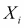

# 第六章。贝叶斯分类模型

我们在第四章，*使用贝叶斯推理进行机器学习*中介绍了分类机器学习任务，并指出分类的目标是将数据记录分配到预定的类别之一。分类是机器学习中最被研究的任务之一，并且有几种已建立的先进方法。这些包括逻辑回归模型、支持向量机、随机森林模型和神经网络模型。在有足够标记训练数据的情况下，这些模型可以在许多实际问题中实现超过 95% 的准确率。

那么，显然的问题是，为什么你需要使用贝叶斯方法进行分类？对此有两个答案。一是，通常很难获得大量标记数据用于训练。当给定问题中有数百或数千个特征时，通常需要大量训练数据来避免过拟合。贝叶斯方法可以通过贝叶斯平均来克服这个问题，因此只需要少量到中等大小的训练数据。其次，大多数方法，如 SVM 或 NN，就像黑盒机器。它们会给出非常准确的结果，但很少能洞察到哪些变量对例子很重要。在许多实际问题上，例如疾病的诊断，识别主要原因非常重要。因此，黑盒方法是不够的。贝叶斯方法有一个固有的特性，称为**自动相关性确定（ARD**），可以通过它来识别问题中的重要变量。

在本章中，我们将讨论两种贝叶斯分类模型。第一个是流行的朴素贝叶斯文本分类方法。第二个是贝叶斯逻辑回归模型。在我们讨论这些模型之前，让我们回顾一下在分类任务中常用的一些性能指标。

# 分类性能指标

为了更容易理解这些概念，让我们以二元分类为例，这里的任务是判断一个输入特征向量属于两种状态之一：-1 或 1。假设 1 是正类，-1 是负类。预测输出只包含 -1 或 1，但可能存在两种类型的错误。测试集中的某些 -1 可能被预测为 1。这被称为**假阳性或第一类错误**。同样，测试集中的某些 1 可能被预测为 -1。这被称为**假阴性或第二类错误**。在二元分类的情况下，这两种类型的错误可以用下面的混淆矩阵来表示。

| 混淆矩阵 | 预测类别 |
| --- | --- |
| 正类 | 负类 |
| --- | --- |
| 实际类别 | 正类 | TP | FN |
| 负类 | FP | TN |

从混淆矩阵中，我们可以推导出以下性能指标：

+   **精确度**： 这给出了输出预测为正的准确答案的百分比

+   **召回率**： 这给出了测试数据集中正确预测的正类别的百分比

+   **F 分数**： 这是精确度和召回率的几何平均值

+   **真阳性率**： 这与召回率相同

+   **假阳性率**： 这给出了将负类别分类为正类别的百分比

此外，*Tpr* 被称为 *灵敏度*，而 *1 - Fpr* 被称为分类器的 *特异性*。Tpr 与 Fpr（灵敏度与 *1 - 特异性*）的图像称为 **ROC** 曲线（代表 **接收者操作特征** 曲线）。这用于找到决定预测输出（通常是一个分数或概率）属于类别 1 或 -1 的最佳阈值（分类器的操作点）。

通常，阈值被取为 ROC 曲线的膨胀点，该曲线给出了最佳性能且错误预测最少。ROC 曲线下方的面积或 AUC 是分类器性能的另一个衡量标准。对于纯随机模型，ROC 曲线将沿着对角线是一条直线。相应的 AUC 值将为 0.5。AUC 大于 0.8 的分类器将被认为是好的，尽管这很大程度上取决于要解决的问题。

# 朴素贝叶斯分类器

Naïve Bayes 的名字来源于模型中的基本假设，即特定特征  的概率在给定类别标签  的情况下与其他任何特征  独立。这暗示了以下内容：


使用这个假设和贝叶斯定理，可以证明，在特征  给定的情况下，类别  的概率如下：


这里， 是通过求和所有 *k* 值的分子得到的归一化项。它也被称为贝叶斯证据或配分函数 Z。分类器选择一个类别标签作为目标类别，该类别最大化后验类别概率 ：


朴素贝叶斯分类器是文档分类的基线分类器。其中一个原因是，在给定类别标签的情况下，每个特征（单词或 m-gram）与其他特征相互独立的基本假设通常适用于文本。另一个原因是，当存在大量文档时，朴素贝叶斯分类器的扩展性很好。

朴素贝叶斯有两种实现方式。在伯努利朴素贝叶斯中，特征是二进制变量，表示一个特征（m-gram）是否存在于文档中。在多项式朴素贝叶斯中，特征是文档中 m-gram 的频率。为了避免频率为零时的问题，通过对特征向量添加 1 来进行拉普拉斯平滑。让我们详细看看多项式朴素贝叶斯。

令  为特征  在训练数据中类别  中出现的次数。那么，给定类别标签  观察到特征向量  的似然函数如下：


在这里， 是在类别  中观察到特征  的概率。

使用贝叶斯规则，给定特征向量 *X* 观察到类别  的后验概率如下：


对等式两边取对数并忽略常数项 *Z*，我们得到以下结果：


因此，通过对后验分布取对数，我们将问题转化为一个线性回归模型，其中  作为需要从数据中确定的系数。这可以很容易地解决。通常，人们使用 TF-IDF（词频乘以逆频率）而不是词频，并将文档长度归一化以提高模型性能。

R 包 **e1071** (*统计学部门的各种函数*) 由 T.U. Wien 编写，其中包含了对朴素贝叶斯的 R 实现。对于本章，我们将使用来自 UCI 机器学习仓库的 SMS 炎言数据集（本章“参考文献”部分的第 1 个参考文献）。该数据集包含从英国论坛 Grumbletext 收集的 425 条短信垃圾信息，消费者可以在此提交垃圾短信。数据集还包含来自新加坡国立大学维护的 SMS 语料库的 3375 条正常（非垃圾）短信。

该数据集可以从 UCI 机器学习仓库下载（[`archive.ics.uci.edu/ml/datasets/SMS+Spam+Collection`](https://archive.ics.uci.edu/ml/datasets/SMS+Spam+Collection)）。假设我们已经将其保存为 R 的工作目录中的文件 `SMSSpamCollection.txt`（实际上，您需要将其在 Excel 中打开并保存为制表符分隔的文件，以便 R 正确读取）。

然后，将文件读入 tm（文本挖掘）包的命令如下：

```py
>spamdata <-read.table("SMSSpamCollection.txt",sep="\t",stringsAsFactors = default.stringsAsFactors())
```

我们将首先将因变量 `y` 和自变量 `x` 分离，并将数据集按 80:20 的比例分为训练集和测试集，使用以下 R 命令：

```py
>samp<-sample.int(nrow(spamdata),as.integer(nrow(spamdata)*0.2),replace=F)
>spamTest <-spamdata[samp,]
>spamTrain <-spamdata[-samp,]
>ytrain<-as.factor(spamTrain[,1])
>ytest<-as.factor(spamTest[,1])
>xtrain<-as.vector(spamTrain[,2])
>xtest<-as.vector(spamTest[,2])
```

由于我们处理的是文本文档，在我们可以使用数据为任何机器学习模型之前，我们需要进行一些标准的预处理。我们可以使用 R 中的 tm 包来完成这个目的。在下一节中，我们将对此进行详细描述。

## 使用 tm 包进行文本处理

**tm** 包提供了数据导入、语料库处理、预处理、元数据管理和创建词-文档矩阵的方法。数据可以导入到 tm 包中，无论是从目录、每个组件都是一个文档的向量，还是从数据框中。tm 的基本数据结构是一个抽象的文本文档集合，称为 Corpus。它有两种实现方式；一种是将数据存储在内存中，称为 **VCorpus**（**易失性语料库**），另一种是将数据存储在硬盘上，称为 **PCorpus**（**永久性语料库**）。

我们可以使用以下 R 命令创建我们的 SMS 垃圾邮件数据集的语料库；在此之前，您需要使用 R 中的 `install.packages("packagename")` 命令安装 tm 包和 **SnowballC** 包：

```py
>library(tm)
>library(SnowballC)
>xtrain <- VCorpus(VectorSource(xtrain))
```

首先，我们需要进行一些基本的文本处理，例如删除额外的空白字符，将所有单词转换为小写，删除停用词，以及进行词干提取。这可以通过使用 tm 包中的以下函数来实现：

```py
>#remove extra white space
>xtrain <- tm_map(xtrain,stripWhitespace)
>#remove punctuation
>xtrain <- tm_map(xtrain,removePunctuation)
>#remove numbers
>xtrain <- tm_map(xtrain,removeNumbers)
>#changing to lower case
>xtrain <- tm_map(xtrain,content_transformer(tolower))
>#removing stop words
>xtrain <- tm_map(xtrain,removeWords,stopwords("english"))
>#stemming the document
>xtrain <- tm_map(xtrain,stemDocument)
```

最后，数据被转换成机器学习模型可以消费的形式。这就是所谓的文档-词矩阵形式，其中每个文档（在这种情况下为 SMS）是一行，所有文档中出现的术语是列，每个单元格中的条目表示每个单词在一个文档中出现的次数：

```py
>#creating Document-Term Matrix
>xtrain <- as.data.frame.matrix(DocumentTermMatrix(xtrain))
```

同样的处理过程也应用于 `xtest` 数据集。我们将 *y* 转换为因子，将 *xtrain* 转换为数据框的原因是为了匹配 e1071 包中朴素贝叶斯分类器的输入格式。

## 模型训练和预测

您需要首先从 CRAN 安装 e1071 包。可以使用 `naiveBayes()` 函数来训练朴素贝叶斯模型。该函数可以通过两种方法调用。以下为第一种方法：

```py
>naiveBayes(formula,data,laplace=0,…,subset,na.action=na.pass)
```

其中 `formula` 代表独立变量的线性组合，用于预测以下类别：

```py
>class ~ x1+x2+…   
```

此外，`data`代表一个数据框或由分类和数值变量组成的列联表。

如果我们有一个向量*y*作为类别标签和依赖变量作为数据框*x*，那么我们可以使用调用函数的第二种方法，如下所示：

```py
>naiveBayes(x,y,laplace=0,…)
```

在我们的示例中，我们将使用调用方法的第二种方法。一旦我们有一个训练好的模型，它是一个名为`naiveBayes`的 R 对象，我们就可以预测新实例的类别，如下所示：

```py
>predict(object,newdata,type=c(class,raw),threshold=0.001,eps=0,…)
```

因此，我们可以在我们的训练数据集上训练朴素贝叶斯模型，并使用以下命令在测试数据集上进行评分：

```py
>#Training the Naive Bayes Model
>nbmodel <- naiveBayes(xtrain,ytrain,laplace=3)
>#Prediction using trained model
>ypred.nb <- predict(nbmodel,xtest,type = "class",threshold = 0.075)
>#Converting classes to 0 and 1 for plotting ROC
>fconvert <- function(x){
     if(x == "spam"){ y <- 1}
   else {y <- 0}
   y
}

>ytest1 <- sapply(ytest,fconvert,simplify = "array")
>ypred1 <- sapply(ypred.nb,fconvert,simplify = "array")
>roc(ytest1,ypred1,plot = T)
```

在这里，展示了该模型和数据的 ROC 曲线。这是使用 CRAN 中的 pROC 包生成的：


```py
>#Confusion matrix
>confmat <- table(ytest,ypred.nb)
>confmat
pred.nb
ytest  ham spam
  ham  143  139
  spam   9   35
```

从 ROC 曲线和混淆矩阵中，可以选择分类器最佳阈值和精确度、召回率指标。请注意，这里所示示例仅用于说明目的。模型需要进一步调整以提高准确性。

我们还可以打印出两个类别中最频繁出现的单词（模型特征）及其由模型生成的后验概率。这将使我们对模型练习有更直观的感觉。以下 R 代码完成这项工作：

```py
>tab <- nbmodel$tables
>fham <- function(x){
  y <- x[1,1]
  y
}
>hamvec <- sapply(tab,fham,simplify = "array")
>hamvec <- sort(hamvec,decreasing = T)

>fspam <- function(x){
  y <- x[2,1]
  y
}
>spamvec <- sapply(tab,fspam,simplify = "array")
>spamvec <- sort(spamvec,decreasing = T)
>prb <- cbind(spamvec,hamvec)
>print.table(prb)
```

输出表格如下：

| word | Prob(word | spam) | Prob(word | ham) |
| --- | --- | --- |
| call | 0.6994 | 0.4084 |
| free | 0.4294 | 0.3996 |
| now | 0.3865 | 0.3120 |
| repli | 0.2761 | 0.3094 |
| text | 0.2638 | 0.2840 |
| spam | 0.2270 | 0.2726 |
| txt | 0.2270 | 0.2594 |
| get | 0.2209 | 0.2182 |
| stop | 0.2086 | 0.2025 |

表格显示，例如，给定一个文档是垃圾邮件，该文档中出现单词*call*的概率为 0.6994，而该单词出现在正常文档中的概率仅为 0.4084。

# 贝叶斯逻辑回归模型

逻辑回归的名称来源于回归的依赖变量是逻辑函数。它是响应变量为二元变量（例如，欺诈或非欺诈、点击或未点击等）的问题中广泛使用的模型之一。

逻辑函数由以下方程定义：


它具有特定的特征，即当*y*从变化到时，函数值从 0 变化到 1。因此，逻辑函数非常适合模拟任何二元响应，因为输入信号的变化。

逻辑函数的逆称为*logit*。它定义如下：


在逻辑回归中，*y*被视为解释变量*X*的线性函数。因此，逻辑回归模型可以定义为以下：


在这里，是基函数集合，是模型参数，如第四章中所述，*使用贝叶斯推理进行机器学习*。从第五章中广义线性模型（GLM）的定义，*贝叶斯回归模型*，可以立即识别出逻辑回归是具有**logit**函数作为连接函数的 GLM 的特殊情况。

与线性回归相比，贝叶斯处理逻辑回归更为复杂。在这里，似然函数由逻辑函数的乘积组成；每个数据点对应一个。为了计算后验概率，必须将这个函数与先验概率相乘（以得到贝叶斯公式的分母）。一种方法是使用拉普拉斯近似，如第三章中所述，*介绍贝叶斯推理*。读者可能还记得，在拉普拉斯近似中，后验概率被近似为关于后验概率最大值的正态（高斯）分布。这是通过首先找到**最大后验概率**（**MAP**）解，然后计算 MAP 解周围负对数似然函数的二阶导数来实现的。感兴趣的读者可以在 D.J.C. MacKay 的论文中找到逻辑回归拉普拉斯近似的详细内容（本章*参考文献*部分的第 2 条参考文献）。

除了使用解析近似，Polson 和 Scott 最近提出了一种使用数据增强策略的完全贝叶斯处理方法（本章*参考文献*部分的第 3 条参考文献）。作者们将他们的方法实现在了 R 包：BayesLogit 中。我们将使用这个包在本章中展示贝叶斯逻辑回归。 

## BayesLogit R 包

该包可以从 CRAN 网站[`cran.r-project.org/web/packages/BayesLogit/index.html`](http://cran.r-project.org/web/packages/BayesLogit/index.html)下载。该包包含一个`logit`函数，可用于执行贝叶斯逻辑回归。调用此函数的语法如下：

```py
>logit(Y,X,n=rep(1,length(Y) ),m0=rep(0,ncol(X) ),P0=matrix(0,nrow=ncol(X),ncol=ncol(X) ),samp=1000,burn=500)
```

在这里，*Y* 是一个包含响应值的 *N*-维向量；*X* 是一个包含独立变量值的 *N x P* 维矩阵；*n* 是一个 *N*-维向量， 是一个 *P*-维先验均值， 是一个 *P x P* 维先验精度。其他两个参数与 MCMC 模拟参数相关。保存的 MCMC 模拟次数用 `samp` 表示，运行开始前丢弃的 MCMC 模拟次数用 `burn` 表示。

## 数据集

为了说明贝叶斯逻辑回归，我们使用了 UCI 机器学习仓库中的 Parkinsons 数据集([`archive.ics.uci.edu/ml/datasets/Parkinsons`](https://archive.ics.uci.edu/ml/datasets/Parkinsons))。Little 等人使用该数据集通过分析声音障碍来检测帕金森病（本章“参考文献”部分的第 4 条参考文献）。数据集包含 31 个人的声音测量数据，其中 23 人患有帕金森病。有 195 行对应于单个个体的多次测量。测量可以分组为以下集合：

+   声音基频

+   震动

+   Shimmer

+   噪声与音调成分的比率

+   非线性动力学复杂性度量

+   信号分形尺度指数

+   基频变化的非线性度量

总共有 22 个数值属性。

## 准备训练和测试数据集

在我们能够训练贝叶斯逻辑模型之前，我们需要对数据进行一些预处理。数据集包含来自同一个体的多次测量。在这里，我们取所有观察值，每个来自一组被采样个体的集合，以创建训练和测试集。此外，我们需要将因变量（类别标签 *Y*）从自变量（*X*）中分离出来。以下 R 代码完成这项工作：

```py
>#install.packages("BayesLogit") #One time installation of package
>library(BayesLogit)
>PDdata <- read.table("parkinsons.csv",sep=",",header=TRUE,row.names = 1)
>rnames <- row.names(PDdata)
>cnames <- colnames(PDdata,do.NULL = TRUE,prefix = "col")
>colnames(PDdata)[17] <- "y"
>PDdata$y <- as.factor(PDdata$y)

>rnames.strip <- substr(rnames,10,12)
>PDdata1 <- cbind(PDdata,rnames.strip)
>rnames.unique <- unique(rnames.strip)
>set.seed(123)
>samp <- sample(rnames.unique,as.integer(length(rnames.unique)*0.2),replace=F)
>PDtest <- PDdata1[PDdata1$rnames.strip %in% samp,-24]  # -24 to remove last column
>PDtrain <- PDdata1[!(PDdata1$rnames.strip %in% samp),-24] # -24 to remove last column
>xtrain <- PDtrain[,-17]
>ytrain <- PDtrain[,17]
>xtest <- PDtest[,-17]
>ytest<- PDtest[,17]
```

## 使用贝叶斯逻辑模型

我们可以使用 *xtrain* 和 *ytrain* 通过 `logit( )` 函数训练贝叶斯逻辑回归模型：

```py
>blmodel <- logit(ytrain,xtrain,n=rep(1,length(ytrain)),m0 = rep(0,ncol(xtrain)),P0 = matrix(0,nrow=ncol(xtrain),ncol=ncol(xtrain)),samp = 1000,burn = 500)
```

`summary( )` 函数将给出拟合模型的概述：

```py
>summary(blmodel)
```

为了预测新数据集的 *Y* 值，我们需要编写一个自定义脚本，如下所示：

```py
>psi <- blmodel$beta %*% t(xtrain)  # samp x n
>p   <- exp(psi) / (1 + exp(psi) )  # samp x n
>ypred.bayes <- colMeans(p)
```

预测误差可以通过与 *ytest* 中存在的实际 *Y* 值进行比较来计算：

```py
>table(ypred.bayes,ytest)
```

可以使用 pROC 包绘制 ROC 曲线，如下所示：

```py
>roc(ytrain,ypred.bayes,plot = T)
```


ROC 曲线的 AUC 为 0.942，表明分类精度良好。再次强调，这里展示的模型是为了说明目的，并未调整以获得最佳性能。

# 练习

1.  在这个练习中，我们将使用来自 UCI 机器学习仓库的 DBWorld 电子邮件数据集来比较朴素贝叶斯和 BayesLogit 方法的相对性能。该数据集包含 64 封来自 DBWorld 通讯的电子邮件，任务是将电子邮件分类为*会议公告*或*其他一切*。该数据集的参考是 Michele Filannino 教授的课程（本章*参考文献*部分的第 5 条）。数据集可以从 UCI 网站下载，网址为[`archive.ics.uci.edu/ml/datasets/DBWorld+e-mails#`](https://archive.ics.uci.edu/ml/datasets/DBWorld+e-mails#)。

    使用这两种方法都需要对数据集进行一些预处理。数据集采用 ARFF 格式。您需要下载**外国**的 R 包([`cran.r-project.org/web/packages/foreign/index.html`](http://cran.r-project.org/web/packages/foreign/index.html))，并使用其中的`read.arff()`方法将文件读入 R 数据框。

# 参考文献

1.  Almeida T.A., Gómez Hidalgo J.M. 和 Yamakami A. "对短信垃圾邮件过滤研究的新贡献：新的收集和结果". 在：2011 年 ACM 文档工程研讨会（DOCENG'11）. 加利福尼亚州山景城，美国. 2011

1.  MacKay D.J.C. "将证据框架应用于分类网络". 神经计算 4(5)

1.  "使用 Pólya-Gamma 潜在变量进行逻辑模型的贝叶斯推理". 美国统计学会杂志. 第 108 卷，第 504 期，第 1339 页. 2013

1.  Costello D.A.E., Little M.A., McSharry P.E., Moroz I.M. 和 Roberts S.J. "利用非线性回溯和分形尺度特性进行语音障碍检测". 生物医学工程在线. 2007

1.  Filannino M. "使用非常小语料库的 DBWorld 电子邮件分类". 机器学习课程项目. 曼彻斯特大学. 2011

# 摘要

在本章中，我们讨论了使用贝叶斯推理进行分类任务的多种优点。我们回顾了一些用于分类任务的常见性能指标。我们还学习了两种基本且流行的分类方法，即朴素贝叶斯和逻辑回归，这两种方法都采用了贝叶斯方法实现。在了解了某些重要的贝叶斯监督机器学习技术之后，在下一章中，我们将讨论一些无监督的贝叶斯模型。
