# 第七章。无监督学习的贝叶斯模型

我们在前两章中讨论的机器学习模型具有一个共同特征：它们需要包含真实值的训练数据。这意味着包含谓词或因变量的真实值的数据集通常需要手动标记。这种使用标记数据训练算法的机器学习被称为**监督学习**。这种类型的机器学习在预测准确性方面表现出色。实际上，这是大多数使用机器学习的工业系统中事实上的方法。然而，这种方法的一个缺点是，当人们想要用大数据集训练模型时，获取标记数据会变得困难。这在大数据时代尤为重要，因为组织从各种日志、交易和与消费者的互动中获得了大量数据；组织希望从这些数据中获得洞察力，并对消费者的兴趣做出预测。

在无监督学习方法中，学习过程中不需要标记数据。学习过程是通过识别数据集中存在的占主导地位的模式和相关性来进行的。无监督学习的常见例子包括聚类、关联规则挖掘、密度估计和降维。在聚类中，使用一种合适的算法识别数据中的自然分组，该算法利用数据点之间的某种距离度量。在关联规则挖掘中，从事务数据集中识别出在事务中经常一起出现的项目。在降维技术，如主成分分析中，包含大量变量（维度）的原始数据集被投影到一个较低维度的空间，其中数据中包含最大信息。尽管无监督学习不需要标记的训练数据，但人们需要大量的数据来学习所有感兴趣的模式，而且通常学习过程计算量更大。

在许多实际情况下，创建少量标记数据是可行的。第三种学习方法，即半监督学习，是一种利用这个小规模标记数据集，并通过合适的算法将标签传播到其余未标记的训练数据的方法。在本章中，我们将介绍无监督学习的贝叶斯方法。我们将详细讨论两个重要模型：用于聚类的高斯混合模型和用于主题模型的潜在狄利克雷分配。

# 贝叶斯混合模型

通常，混合模型对应于使用概率分布的混合来表示数据。最常见的混合模型如下所示：

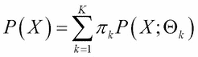

在这里，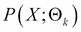是*X*的概率分布，其参数为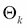，而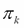代表混合中第*k*个成分的权重，使得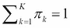。如果潜在的概率分布是正态（高斯）分布，那么混合模型被称为**高斯混合模型**（**GMM**）。因此，GMM 的数学表示如下：


在这里，我们使用了与前面章节相同的符号，其中*X*代表一个*N*-维数据向量，它表示每个观测值，数据集中有*M*个这样的观测值。

当簇之间存在重叠时，这种混合模型适合于聚类。GMM 的一个应用领域是计算机视觉。如果想在视频中跟踪移动对象，减去背景图像是有用的。这被称为背景减法或前景检测。GMM 用于此目的，其中每个像素的强度使用高斯分布的混合来建模（本章“参考文献”部分的参考 1）。

学习 GMM 的任务对应于学习所有成分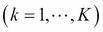的模型参数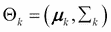和混合权重。学习 GMM 的标准方法是通过使用**最大似然**方法。对于一个由*M*个观测值组成的数据集，似然函数的对数由以下给出：

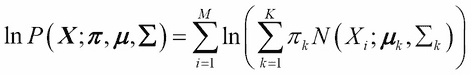

与单个高斯模型不同，在 GMM 中，无法以直接的方式对参数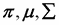进行对数似然函数的最大化。这是因为在这种情况下，由于难以计算和的对数，没有该导数的闭式表达式。因此，使用所谓的**期望最大化**（**EM**）算法来最大化对数似然函数。EM 算法是一个迭代算法，其中每个迭代包括两个计算：期望和最大化。EM 算法的步骤如下：

1.  初始化参数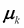、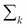和，并评估对数似然函数的初始值。

1.  在期望步骤中，使用当前参数值和从对数似然函数评估混合成分。

1.  在最大化步骤中，使用步骤 2 中计算的的值，通过最大化对数似然来估计新的参数值和。

1.  使用步骤 2 和 3 中估计的、和的值，计算对数似然函数的新值。

1.  重复步骤 2-4，直到对数似然函数收敛。

在贝叶斯处理 GMM 中，通过引入一个潜在变量*Z*，简化了对对数似然函数的最大化。设*Z*为一个具有一个元素*1*和其余*K – 1*个元素为*0*的*K*-维二元随机变量。使用*Z*，可以写出*X*和*Z*的联合分布如下：

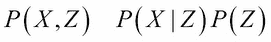

这里：

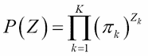

然后：

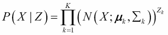

因此：

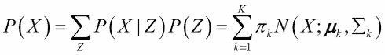

然后：

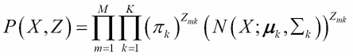

在这个问题中引入潜在变量*Z*的优势在于，对数似然的表达式被简化，其中对数直接作用于正态分布，就像单个高斯模型的情况一样。因此，最大化*P(X, Z)*是直接的。然而，仍然存在的问题是我们不知道*Z!*的值。所以，技巧是使用类似于 EM 的迭代算法，在 E 步骤中估计*Z*的期望值，在 M 步骤中，使用上一步估计的*Z*的最后一个值，找到高斯分布的参数值。贝叶斯版本的 EM 算法对于 GMM 的步骤如下：

1.  初始化参数、和，并评估对数似然函数的初始值。

1.  在期望步骤中，使用这些值来计算期望值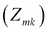。

1.  在最大化步骤中，固定，通过最大化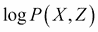来估计和。

1.  计算新的似然函数。

1.  重复步骤 2-4，直到收敛。

在 Christopher M. Bishop 所著的书中（本章“参考文献”部分的第 2 条参考文献）可以找到对贝叶斯版本的 EM 算法和 GMM 的更详细处理。在这里，我们省略了贝叶斯 GMM 的理论处理，转而查看其在**bgmm**包中的 R 实现。

## 贝叶斯混合模型的 bgmm 包

bgmm 包是由 Przemyslaw Biecek 和 Ewa Szczurek 开发的，用于建模基因表达数据（本章“参考文献”部分的第 3 个参考文献）。可以从 CRAN 网站下载：[`cran.r-project.org/web/packages/bgmm/index.html`](http://cran.r-project.org/web/packages/bgmm/index.html)。该包不仅包含 GMM 的无监督版本，还包含完全监督和半监督的实现。bgmm 包中包含以下不同的模型：

+   **完全监督的 GMM**: 这是指训练集中所有记录都有的标记数据。这包括以下内容：

    +   `supervised( )` 函数

+   **半监督的 GMM**: 这是指训练集中所有记录的小子集可用的标记数据。这包括以下内容

    +   `semisupervised( )` 函数

+   **部分监督的 GMM**: 这是指所有记录的小子集可用的标记数据，但这些标签是不确定的。标签的值以某种概率给出。包中包含两个用于部分监督 GMM 的函数。这包括以下内容::

    +   `belief( )` 函数：标签的不确定性以对其组件的概率分布来表示。对于前 *m* 个观测值，输入一个维度为 *m x k* 的信念矩阵 *B*，其中矩阵条目 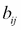 表示 *i*^(th) 条记录具有 *j*^(th) 标签的概率。

    +   `soft( )` 函数：在此方法中，定义了一个维度为 *M x k* 的可信度矩阵，跨越了大小为 *M* 的训练集中的所有记录。矩阵元素 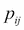 被解释为 *i*^(th) 条记录具有 *j*^(th) 标签的先验概率的权重。如果没有关于任何记录标签的特定信息，它们可以被赋予相等的权重。为了实施目的，对矩阵元素施加了一个约束：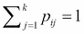。

+   **无监督的 GMM**: 这是指任何记录都没有标记数据。这包括以下内容：

    +   `unsupervised( )` 函数

传递给这些函数的典型参数如下：

+   *X*: 这是一个包含未标记 *X* 数据的数据框。

+   *knowns*: 这是一个包含标记 *X* 数据的数据框。

+   *B*: 这是一个信念矩阵，指定了标记记录的信念分布。*B* 的行数应与 *knowns* 相同。

+   *P*: 这是一个先验概率（可信度）的权重矩阵。

+   *class*: 这是一个包含标记记录的类别或标签的向量。

+   *k*: 这是矩阵 *B* 的组成部分或列数。

+   *init.params*: 这些是模型参数估计的初始值。

`belief( )`和`soft( )`函数之间的区别在于，在前一种情况下，输入是一个包含每个可能标签的先验概率值的矩阵，而在第二种情况下，输入是一个包含每个先验的权重而不是先验概率本身的矩阵。更多细节，读者请参阅 Przemyslaw Biecek 等人撰写的论文（本章“参考文献”部分的第 3 条参考文献）。

现在，让我们通过一个小示例来展示如何使用 bgmm。我们将使用来自 UCI 机器学习仓库的 ADL 数据集。这个数据集包含了 16 个志愿者佩戴在手腕上的加速度计的加速度数据。数据集和元数据详情可以在[`archive.ics.uci.edu/ml/datasets/Dataset+for+ADL+Recognition+with+Wrist-worn+Accelerometer`](https://archive.ics.uci.edu/ml/datasets/Dataset+for+ADL+Recognition+with+Wrist-worn+Accelerometer)找到。关于生成此数据集的 ADL 监控系统的研究工作发表在 Bruno B.等人撰写的两篇论文中（本章“参考文献”部分的第 4 和第 5 条参考文献）。

对于 bgmm 的示例，我们将在数据集目录中仅使用一个文件夹，即`Brush_teeth`。首先，我们将进行少量预处理，将来自不同志愿者的数据合并到一个文件中。下面的 R 脚本完成这项工作：

```py
>#Set working directory to folder containing files (provide the correct path)
>setwd("C:/…/ADL_Dataset/HMP_Dataset/Brush_teeth")
>flist <- list.files(path = "C:/../ADL_Dataset/HMP_Dataset/Brush_teeth",pattern = "*.txt")
>all.data <- lapply(flist,read.table,sep = " ",header = FALSE)
>combined.data <- as.data.frame(do.call(rbind,all.data))
>combined.data.XZ <- combined.data[,c(1,3)]
```

最后一步是从加速度中选择*X*和*Z*分量来创建一个二维数据集。

以下 R 脚本调用`bgmm`函数并执行聚类。数据的一个简单散点图表明数据集中可能有四个聚类，选择*k = 4*就足够了：

```py
>modelbgmm <- unsupervised(combined.data.XZ,k=4)
>summary(modelbgmm)
>plot.mModel(modelbgmm)
```

bgmm 生成的聚类可以在以下图中看到；有四个聚类，其中心由四个彩色点表示，其各自的高斯密度由椭圆表示：

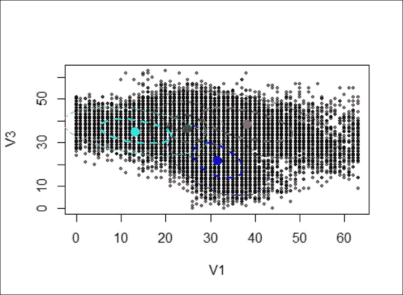

# 使用贝叶斯推理进行主题建模

我们在第六章中看到了文本文档的监督学习（分类），即使用朴素贝叶斯模型。通常，一篇大型的文本文档，如新闻文章或短篇小说，可以包含不同的主题作为子章节。对于分类、摘要、压缩等目的，对这种文档内部统计相关性进行建模是有用的。在前一节中学习的高斯混合模型更适合数值数据，如图像，而不是文档。这是因为文档中的单词很少遵循正态分布。一个更合适的选择是多项式分布。

混合模型向文档的强大扩展是 T. Hofmann 关于概率语义索引的工作（本章“参考文献”部分的第 6 条参考文献）以及 David Blei 等人关于潜在狄利克雷分配的工作（本章“参考文献”部分的第 7 条参考文献）。在这些工作中，文档被描述为主题混合，每个主题由单词分布描述。LDA 是一个用于文本文档的生成无监督模型。LDA 的任务是从数据中学习主题分布、单词分布和混合系数的参数。下一节将简要介绍 LDA。强烈建议读者阅读 David Blei 等人的论文，以理解他们的方法。

## Latent Dirichlet allocation

在 LDA 中，假设单词是文档的基本单元。一个单词是称为词汇表的一个集合中的一个元素，由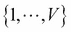索引。在这里，*V*表示词汇表的大小。一个单词可以通过一个单位基向量来表示，其所有分量都是零，除了对应于单词的那个分量，其值为 1。例如，词汇表中的第*n*个单词由一个大小为*V*的向量描述，其第*n*个分量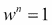和所有其他分量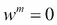对于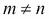。同样，一个文档是由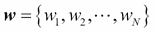表示的*N*个单词的集合，一个语料库是由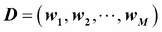表示的*M*个文档的集合（注意，在这里文档用粗体**w**表示，而单词则没有粗体 w）。

如前所述，LDA 是一个语料库的生成概率模型，其中文档被表示为潜在主题上的随机混合，每个主题由单词分布表征。在 LDA 模型中生成语料库中的每个文档**w**时，执行以下步骤：

1.  根据参数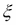定义的泊松分布选择与文档大小相对应的*N*值：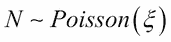

1.  选择参数的值，该参数表征了由参数定义的狄利克雷分布的主题分布：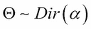

1.  对于每个*N*个单词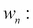

    1.  根据步骤 2 中绘制的参数定义的多项式分布选择一个主题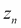：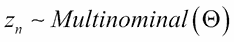

    1.  从由  描述并由  条件化的多项式概率分布中选择一个单词 ：

    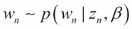

给定 *N*、 和 ，主题混合 、主题集合 **z** 和单词集合 **w** 的联合分布如下：

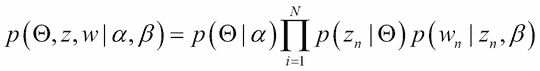

注意，在这种情况下，只有 *w* 是可观察的（文档），而  和 **z** 都被视为潜在（隐藏）变量。

LDA 中的贝叶斯推断问题是给定一个文档，估计潜在变量  和 **z** 的后验密度：

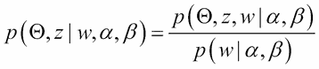

如同许多贝叶斯模型一样，这种情况在分析上难以处理，因此必须使用近似技术，如 MCMC 或变分贝叶斯，来估计后验。

# LDA 的 R 包

R 中有两个主要包可以用于在文档上执行 LDA。一个是 Bettina Grün 和 Kurt Hornik 开发的**topicmodels**包，另一个是 Jonathan Chang 开发的**lda**包。在这里，我们将描述这两个包。

## 主题模型包

主题模型包是 LDA 和**相关主题模型**（**CTM**）论文作者开发的 C 和 C++代码的接口（本章参考文献部分的 7、8 和 9）。该包中的主要函数 `LDA` 用于拟合 LDA 模型。可以通过以下方式调用：

```py
>LDA(X,K,method = "Gibbs",control = NULL,model = NULL,...)
```

在这里，*X* 是一个文档-词矩阵，可以使用 **tm** 包生成，而 *K* 是主题的数量。`method` 是用于拟合的方法。支持两种方法：`Gibbs` 和 `VEM`。

让我们通过这个包构建 LDA 模型的小例子。所使用的数据集是来自 UCI 机器学习仓库的**Reuter_50_50**数据集（本章参考文献部分的 10 和 11）。数据集可以从[`archive.ics.uci.edu/ml/datasets/Reuter_50_50`](https://archive.ics.uci.edu/ml/datasets/Reuter_50_50)下载。对于这个练习，我们只将使用一个目录中的文档，即在`C50train`目录下的`AlanCrosby`。所需的预处理可以使用以下 R 脚本来完成；在尝试此练习之前，读者应已安装 tm 和 topicmodels 包：

```py
>library(topicmodels)
>library(tm)
>#creation of training corpus from reuters dataset
>dirsourcetrain <- DirSource(directory = "C:/…/C50/C50train/AaronPressman")
>xtrain <- VCorpus(dirsourcetrain)
>#remove extra white space
>xtrain <- tm_map(xtrain,stripWhitespace)
>#changing to lower case
>xtrain <- tm_map(xtrain,content_transformer(tolower))
>#removing stop words
>xtrain <- tm_map(xtrain,removeWords,stopwords("english"))
>#stemming the document
>xtrain <- tm_map(xtrain,stemDocument)
>#creating Document-Term Matrix
>xtrain <-  as.data.frame.matrix(DocumentTermMatrix(xtrain))
```

可以使用相同的步骤从 `/…/C50/C50test/` 目录创建测试数据集。

一旦我们有了文档-词矩阵 `xtrain` 和 `xtest`，可以使用以下 R 脚本来构建和测试 LDA 模型：

```py
>#training lda model
>ldamodel <- LDA(xtrain,10,method = "VEM")
>#computation of perplexity, on training data (only with VEM method)
>perp <- perplexity(ldamodel)
>perp
[1] 407.3006
```

大约 100 的困惑度值表示拟合良好。在这种情况下，我们需要添加更多训练数据或更改*K*的值以提高困惑度。

现在让我们使用训练好的 LDA 模型来预测测试数据集上的主题：

```py
>#extracting topics from test data)
>postprob <- posterior(ldamodel,xtest)
>postprob$topics
```

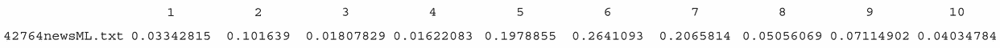

在这里，测试集只包含一个文件，即 `42764newsML.txt`。它在其由 LDA 模型产生的 10 个主题中的分布情况如下所示。

## lda 包

lda 包是由 Jonathan Chang 开发的，他为后验估计实现了折叠吉布斯抽样方法。该包可以从 CRAN 网站下载，网址为 [`cran.r-project.org/web/packages/lda/index.html`](http://cran.r-project.org/web/packages/lda/index.html)。

包中的主要函数 `lda.collapsed.gibbs.sampler` 使用折叠吉布斯抽样的方法来拟合三个不同的模型。这些是**潜在狄利克雷分配**（**LDA**）、**监督 LDA**（**sLDA**）和**混合成员随机块模型**（**MMSB**）。这些函数接受输入文档并返回潜在参数的点估计。这些函数可以在 R 中使用如下：

```py
>lda.collapsed.gibbs.sampler(documents,K,vocab,num.iterations,alpha,eta,initial = NULL,burnin = NULL,compute.log.likelihood = FALSE,trace = 0L,freeze.topics = FALSE)
```

在这里，`documents` 代表一个包含文档的列表，列表的长度等于 `D`，而 `K` 是主题的数量；`vocab` 是一个指定词汇的字符向量；`alpha` 和 `eta` 是超参数的值。

# 练习

1.  对于 Reuter_50_50 数据集，使用 lda 包中的 `lda.collapsed.gibbs.sampler` 函数拟合 LDA 模型，并与 topicmodels 包的性能进行比较。请注意，您需要使用 topicmodels 包中的 `dtm2ldaformat( )` 函数将文档-词矩阵转换为 lda 格式，以便使用 lda 包。

# 参考文献

1.  Bouwmans, T., El Baf F. 和 "Vachon B. 使用高斯混合模型进行背景建模以检测前景 – 一篇综述" (PDF). 近期计算机科学专利 1: 219-237. 2008

1.  Bishop C.M. *模式识别与机器学习*. Springer. 2006

1.  Biecek P., Szczurek E., Tiuryn J., 和 Vingron M. "R 包 bgmm：不确定知识混合建模". 统计软件杂志. 第 47 卷，第 3 期. 2012

1.  Bruno B., Mastrogiovanni F., Sgorbissa A., Vernazza T. 和 Zaccaria R. "基于加速度数据的人行行为识别算法分析". 在：IEEE 国际机器人与自动化会议（ICRA），第 1602-1607 页. 2013

1.  Bruno B., Mastrogiovanni F., Sgorbissa A., Vernazza T. 和 Zaccaria R. "人体运动建模与识别：一种计算方法". 在：IEEE 国际自动化科学和工程会议（CASE），第 156-161 页. 2012

1.  Hofmann T. "概率潜在语义索引". 在：第二十二届国际 SIGIR 会议. 1999

1.  Blei D.M., Jordan M.I., 和 Ng A.Y. "潜在狄利克雷分配". 机器学习研究杂志 3. 993-1022. 2003

1.  Blei D.M. 和 Lafferty J.D. "科学相关主题模型"。应用统计学年鉴。1(1)，17-35。2007

1.  Phan X.H.，Nguyen L.M. 和 Horguchi S. "从大规模数据集中学习对短文本和网页进行分类，并使用隐藏主题"。在第 17 届国际万维网会议（WWW 2008）中。第 91-100 页。北京，中国。2008

# 摘要

在本章中，我们讨论了无监督和半监督机器学习背后的概念及其贝叶斯处理方法。我们学习了两个重要的贝叶斯无监督模型：贝叶斯混合模型和 LDA。我们详细讨论了贝叶斯混合模型的 bgmm 包，以及用于主题建模的 topicmodels 和 lda 包。由于无监督学习的主题非常广泛，我们只能在本章中涵盖一些贝叶斯方法，仅为了给读者一个对该主题的初步了解。我们没有涵盖使用项目标注和特征标注的半监督方法。对此感兴趣的读者应参考该主题的更专业书籍。在下一章中，我们将学习另一类重要的模型，即神经网络。
