# 第八章. 贝叶斯神经网络

正如其名所示，人工神经网络是受生物大脑的架构和认知能力启发的统计模型。神经网络模型通常具有分层架构，每一层包含大量神经元，不同层之间的神经元是相互连接的。第一层被称为输入层，最后一层被称为输出层，中间的其他层被称为隐藏层。每个神经元的状态由与其相连的所有神经元状态的非线性函数确定。每个连接都有一个权重，该权重由包含一组输入和输出对的训练数据确定。这种神经元及其连接的分层架构存在于人脑的**新皮层**区域，并被认为是负责诸如感官感知和语言理解等高级功能的原因。

神经网络的第一种计算模型是由沃伦·麦克洛克和沃尔特·皮茨在 1943 年提出的。大约在同一时间，心理学家唐纳德·赫布基于神经元的兴奋和适应机制提出了一个学习假设，即**赫布规则**。这个假设可以总结为“一起放电的神经元，一起连接”。尽管有几位研究人员试图实现神经网络计算模型，但直到 1958 年，弗兰克·罗森布拉特才首次使用一个两层神经网络**感知器**创建了一个用于模式识别的算法。

1970-2010 年间，神经网络的研究和应用经历了停滞和快速发展的时期。神经网络历史上的里程碑包括 1975 年保罗·沃伯斯发明的**反向传播**算法，这是一种用于学习多层神经网络（也称为**深度学习网络**）的快速学习算法，由杰弗里·辛顿在 2006 年提出，以及在上个十年后半期使用 GPGPUs 实现处理神经网络所需的更大计算能力。

现在，神经网络模型及其应用再次在人工智能领域占据中心舞台，应用于计算机视觉、语音识别和自然语言理解。这就是本书专门用一章来探讨这个主题的原因。当我们深入了解后续章节时，贝叶斯推理在神经网络模型中的重要性将变得清晰。

# 两层神经网络

让我们看看双层神经网络的正式定义。我们遵循 David MacKay（本章“参考文献”部分的第 1、2 和 3 条参考文献）使用的符号和描述。NN 的输入由 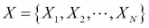 给出。输入值首先乘以一组权重，以产生加权线性组合，然后使用非线性函数转换，以产生隐藏层神经元的状态值：

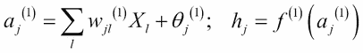

在第二层执行类似的操作以产生最终的输出值 ：

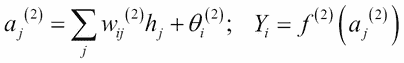

函数 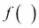 通常取为**sigmoid**函数 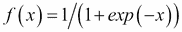 或 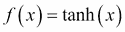。用于多类分类的另一个常见函数是**softmax**，其定义如下：

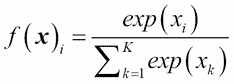

这是一个归一化的指数函数。

所有这些都是高度非线性的函数，具有输出值随着输入值急剧增加的性质。这种非线性特性使得神经网络比标准的线性或广义线性模型具有更多的计算灵活性。在这里，被称为偏置参数。权重 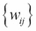 与偏置  一起形成权重向量**w**。

双层神经网络的示意图结构如下所示：

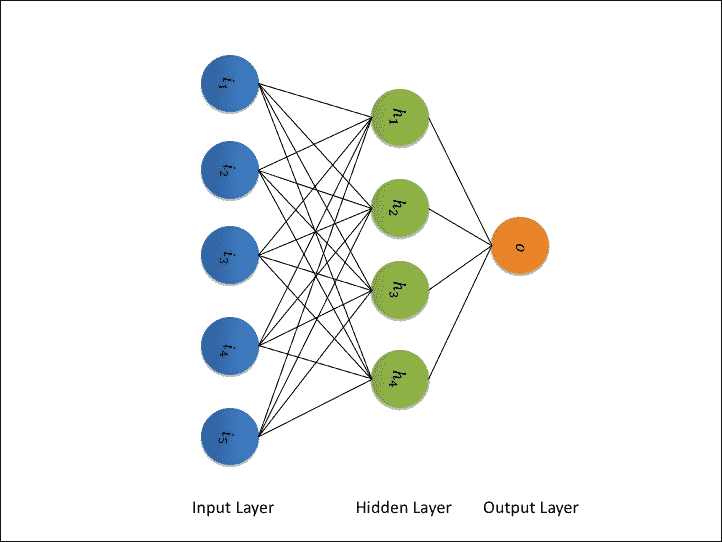

神经网络中的学习对应于寻找权重向量如**w**的值，使得对于给定的由真实值输入和目标（输出）组成的训练数据集 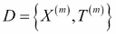，网络预测目标值的误差最小。对于回归问题，这是通过最小化误差函数来实现的：

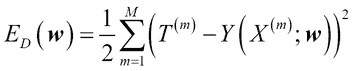

对于分类任务，在神经网络训练中，人们使用交叉熵而不是平方误差，其定义如下：

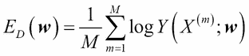

为了避免过拟合，通常也在目标函数中包含一个正则化项。正则化函数的形式通常是 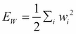，它对大的**w**值给予惩罚，从而降低过拟合的可能性。结果的目标函数如下：


在这里，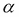 和  是自由参数，其最佳值可以通过交叉验证实验找到。

要最小化关于 **w** 的 *M(***w***)*，可以使用 Rumelhart、Hinton 和 Williams 的经典论文中描述的逆传播算法（本章“参考文献”部分的第 3 个参考文献）。在逆传播的每个输入/输出对中，预测输出的值通过从输入层的前向传递来计算。误差，即预测输出和实际输出之间的差异，被反向传播，并且在每个节点，权重都被重新调整，以便误差最小。

# 贝叶斯神经网络处理

为了将神经网络学习置于贝叶斯框架中，考虑回归案例中的误差函数 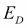。它可以被视为观察给定数据集的条件权重 **w** 的高斯噪声项。这正是可以写成以下形式的似然函数：

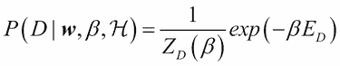

这里， 是由 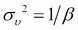 给出的噪声项的方差，而  代表一个概率模型。正则化项可以被认为是参数先验概率分布的对数：

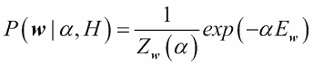

这里，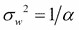 是权重先验分布的方差。可以使用贝叶斯定理轻松证明，目标函数 *M(***w***)* 然后对应于参数 **w** 的后验分布：

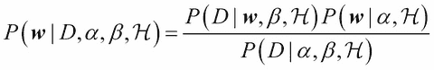

在神经网络的情况下，我们感兴趣的是 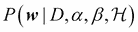 的局部极大值。然后，后验被近似为围绕每个极大值 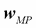 的高斯分布，如下所示：

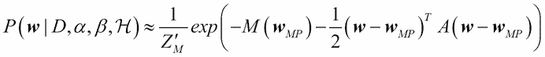

在这里，*A* 是 *M(***w***)* 关于 **w** 的二阶导数的矩阵，它代表协方差矩阵的逆。它也被称为**海森矩阵**。

超参数  和  的值是通过**证据框架**找到的。在这里，概率 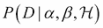 被用作证据，以从数据 *D* 中找到  和  的最佳值。这是通过以下贝叶斯规则完成的：

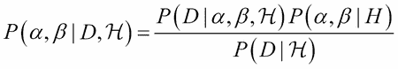

通过使用证据框架和后验的高斯近似（本章“参考文献”部分的第 2 和第 5 条参考文献），可以证明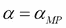的最佳值满足以下条件：

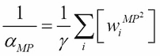

此外，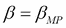的最佳值也满足以下条件：

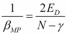

在这些方程中，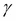是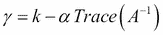给出的确定参数的数量，其中*k*是**w**的长度。

# brnn R 包

**brnn**包是由 Paulino Perez Rodriguez 和 Daniel Gianola 开发的，它实现了上一节中描述的两层贝叶斯正则化神经网络。包中的主要函数是`brnn( )`，可以通过以下命令调用：

```py
>brnn(x,y,neurons,normalize,epochs,…,Monte_Carlo,…)
```

在这里，*x*是一个*n x p*矩阵，其中*n*是数据点的数量，*p*是变量的数量；*y*是一个包含目标值的*n*维向量。网络隐藏层中的神经元数量可以通过变量`neurons`指定。如果指示函数`normalize`为`TRUE`，则将归一化输入和输出，这是默认选项。模型训练期间的最大迭代次数由`epochs`指定。如果指示二进制变量`Monte_Carlo`为真，则使用 MCMC 方法估计 Hessian 矩阵逆的迹。

让我们尝试一个例子，使用我们在第五章中使用的 Auto MPG 数据集，*贝叶斯回归模型*。下面的 R 代码将导入数据，创建训练集和测试集，使用训练数据训练神经网络模型，并对测试集进行预测：

```py
>install.packages("brnn")  #one time installation
>library(brnn)
>mpgdataall <- read.csv("C:/…/auto-mpg.csv")#give the correct full path
>mpgdata <- mpgdataall[,c(1,3,5,6)]
>#Fitting Bayesian NN Model
>ytrain <- mpgdata[1:100,1]
>xtrain <- as.matrix(mpgdata[1:100,2:4])
>mpg_brnn <- brnn(xtrain,ytrain,neurons=2,normalize = TRUE,epochs = 1000,Monte_Carlo = TRUE)
>summary(mpg_brnn)
A Bayesian regularized neural network
3 - 2 - 1 with 10 weights,biases and connection strengths
Inputs and output were normalized
Training finished because Changes in F= beta*SCE + alpha*Ew in last 3 iterations less than 0.001

>#Prediction using trained model
>ytest <- mpgdata[101:150,1]
>xtest <- as.matrix(mpgdata[101:150,2:4])
>ypred_brnn <- predict.brnn(mpg_brnn,xtest)
>plot(ytest,ypred_brnn)
>err <-ytest-ypred
>summary(err)
```

# 深度信念网络和深度学习

在过去十年中，神经网络研究的一些开创性进展为机器学习开辟了一个新的前沿，通常被称为**深度学习**（本章“参考文献”部分的第 5 和第 7 条参考文献）。深度学习的一般定义是，*一类机器学习技术，其中在层次监督架构中利用许多信息处理阶段，用于无监督特征学习和模式分析/分类。深度学习的本质是计算观测数据的层次特征或表示，其中高级特征或因素由低级特征定义*（本章“参考文献”部分的第 8 条参考文献）。尽管深度学习有许多类似定义和架构，但所有这些定义中都包含两个共同元素：*多层非线性信息处理*和*在每个层次上从上一层次学习到的特征中进行监督或无监督学习特征表示*。深度学习的最初工作基于多层神经网络模型。最近，还使用了许多其他形式的模型，例如深度核机和深度 Q 网络。

即使在几十年前，研究人员也尝试过多层神经网络。然而，有两个原因限制了使用这种架构进行学习的任何进展。第一个原因是网络参数的学习是一个非凸优化问题。从随机初始条件开始，在最小化误差的过程中会陷入局部最小值。第二个原因是相关的计算需求巨大。对于第一个问题的突破发生在 Geoffrey Hinton 开发了一种快速算法来学习一种称为**深度信念网络**（**DBN**）的特殊类别的神经网络时。我们将在后面的章节中更详细地描述 DBN。通过使用**通用图形处理单元**（**GPGPU**）的计算能力的提升，满足了高计算能力需求。深度学习之所以在实用应用中如此受欢迎，是因为在自动语音识别和计算机视觉中实现了显著的准确性提升。例如，自动语音识别的**词错误率**在经过多年的研究后，达到了大约 40%的饱和状态。

然而，使用深度学习，词错误率在短短几年内大幅降低，接近 10%。另一个众所周知的例子是**深度卷积神经网络**在 2012 年 ImageNet 大规模视觉识别挑战赛中的表现，其最低错误率为 15.3%，而当时最先进的方法的最低错误率为 26.2%（本章“参考文献”部分的第 7 条参考文献）。

在本章中，我们将描述一类深度学习模型，称为深度信念网络。感兴趣的读者可能希望阅读李登和董宇所著的书籍（本章“参考文献”部分的第 9 条参考文献），以详细了解深度学习的各种方法和应用。我们将在本章的其余部分遵循他们的符号。我们还将使用 R 包**darch**来展示 DBN 的使用。

## 受限玻尔兹曼机

**受限玻尔兹曼机**（**RBM**）是一个两层网络（二部图），其中一层是可见层（*v*），另一层是隐藏层（*h*）。可见层中的所有节点和隐藏层中的所有节点通过无向边连接，同一层中的节点之间没有连接：

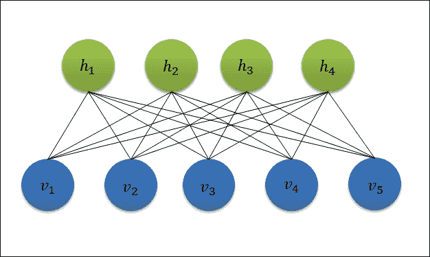

RBM 的特征是所有可见单元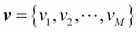和所有隐藏单元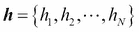的状态的联合分布。

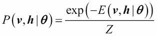

在这里，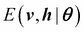被称为**能量函数**，而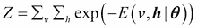是名为**配分函数**的归一化常数，来自统计物理学的术语。

RBM 主要有两种类型。在第一种类型中，*v*和*h*都是伯努利随机变量。在第二种类型中，*h*是伯努利随机变量，而*v*是高斯随机变量。对于伯努利 RBM，能量函数如下所示：

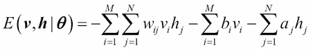

在这里，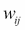代表节点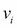和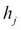之间边的权重；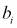和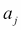分别是可见层和隐藏层的偏置参数。对于这个能量函数，条件概率的精确表达式可以推导如下：

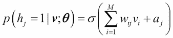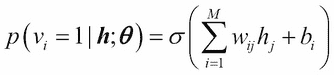

在这里，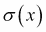是逻辑函数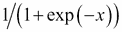。

如果输入变量是连续的，可以使用高斯 RBM；其能量函数如下所示：

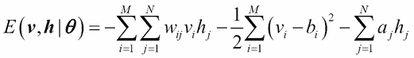

此外，在这种情况下，和的条件概率将变为以下形式：

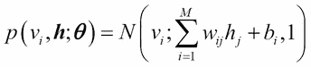

这是一个均值为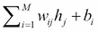和方差为 1 的正态分布。

现在我们已经描述了 RBM 的基本架构，那么它是如何被训练的呢？如果我们尝试使用标准方法，即对对数似然函数求梯度，我们得到以下更新规则：


在这里，是使用数据集计算得到的的期望，而是使用模型计算得到的相同期望。然而，由于难以计算，因此不能使用这个精确的表达式来更新权重。

第一个突破是在解决这个问题的同时，训练深度神经网络时，当 Hinton 及其团队提出了一种名为**对比散度**（**CD**）的算法（本章“参考文献”部分的第 7 条）时出现的。算法的精髓将在下一段中描述。

策略是使用 Gibbs 采样从之前提到的条件分布中生成的和的值来近似。实现这一策略的一种方案如下：

1.  从数据集中初始化。

1.  通过从条件分布中采样来找到。

1.  通过从条件分布中采样来找到。

1.  通过从条件分布中采样来找到。

一旦我们找到了和的值，可以使用，即的第*i*个分量与的第*j*个分量的乘积，作为的近似。这被称为**CD-1 算法**。可以将此推广到使用 Gibbs 采样的*k*步的值，这被称为**CD-k 算法**。可以很容易地看到 RBM 与贝叶斯推理之间的联系。由于 CD 算法类似于后验密度估计，可以说 RBM 是使用贝叶斯推理方法进行训练的。

虽然对比散度算法看起来很简单，但在训练 RBMs 时需要非常小心，否则模型可能导致过拟合。对在实用应用中使用 RBMs 感兴趣的读者应参考本章*参考文献*部分的第 10 条参考文献中的技术报告，其中对此进行了详细讨论。

## 深度信念网络

可以堆叠多个 RBMs，一个叠在另一个上面，使得层中隐藏单元的值成为第*n*层中可见单元的值，依此类推。所得到的网络称为深度信念网络。它是早期深度学习网络预训练中使用的几种主要架构之一。预训练神经网络的想法如下：在标准的三层（输入-隐藏-输出）神经网络中，可以从权重的随机初始值开始，使用反向传播算法找到对数似然函数的良好最小值。然而，当层数增加时，直接应用反向传播算法不起作用，因为从输出层开始，当我们计算深层层的梯度值时，它们的幅度变得非常小。这被称为**梯度消失**问题。因此，网络将陷入某些较差的局部最小值。如果我们从良好最小值附近开始，反向传播仍然有效。为了实现这一点，DNN 通常以无监督的方式预训练，使用 DBN。不是从权重的随机值开始，而是以无监督的方式训练 DBN，并使用 DBN 的权重作为相应监督 DNN 的初始权重。观察到使用 DBN 预训练的 DNN 表现更好（本章*参考文献*部分的第 8 条参考文献）。

DBN 的逐层预训练过程如下。从第一个 RBM 开始，使用可见层中的输入数据和使用 CD 算法（或其最新的更好变体）对其进行训练。然后，在这个 RBM 的上面堆叠第二个 RBM。对于这个 RBM，使用中采样的值作为可见层的值。继续这个过程，直到达到所需的层数。顶层隐藏单元的输出也可以用作训练监督模型的输入。为此，在 DBN 的顶部添加一个具有所需类别数作为输出节点数的传统神经网络层。这个 NN 的输入将是 DBN 顶层的输出。这被称为**DBN-DNN 架构**。在这里，DBN 的作用是从输入数据自动生成高度有效的特征（DBN 顶层输出）供顶层监督 NN 使用。

用于二分类任务的五层 DBN-DNN 架构如图所示：


最后一个层使用监督方式使用反向传播算法对两个类别和进行训练。我们将使用 darch R 包通过这样的 DBN-DNN 来展示训练和分类。

## darch R 包

由 Martin Drees 编写的 darch 包是 R 包之一，使用它可以开始使用 R 进行深度学习。它实现了上一节中描述的 DBN（参考文献 5 和 7 在本章“参考文献”部分的引用）。该包可以从[`cran.r-project.org/web/packages/darch/index.html`](https://cran.r-project.org/web/packages/darch/index.html)下载。

darch 包中的主要类实现了深度架构，并提供了使用对比散度训练以及使用反向传播、弹性反向传播和共轭梯度微调进行微调的能力。该类的新的实例是通过`newDArch`构造函数创建的。它使用以下参数调用：一个包含每层节点数的向量，批量大小，一个布尔变量，用于指示是否使用**ff**包来计算权重和输出，以及生成权重矩阵的函数名称。让我们创建一个具有两个输入单元、四个隐藏单元和一个输出单元的网络：

```py
install.packages("darch") #one time
>library(darch)
>darch <- newDArch(c(2,4,1),batchSize = 2,genWeightFunc = generateWeights)
INFO [2015-07-19 18:50:29] Constructing a darch with 3 layers.
INFO [2015-07-19 18:50:29] Generating RBMs.
INFO [2015-07-19 18:50:29] Construct new RBM instance with 2 visible and 4 hidden units.
INFO [2015-07-19 18:50:29] Construct new RBM instance with 4 visible and 1 hidden units.
```

让我们使用一个玩具数据集来训练 DBN。我们之所以这样做，是因为训练任何真实示例将花费很长时间：如果不是几天，可能就是几个小时。让我们创建一个包含两列和四行的输入数据集：

```py
>inputs <- matrix(c(0,0,0,1,1,0,1,1),ncol=2,byrow=TRUE)
>outputs <- matrix(c(0,1,1,0),nrow=4)
```

现在，让我们使用输入数据对 DBN 进行预训练：

```py
>darch <- preTrainDArch(darch,inputs,maxEpoch=1000)
```

我们可以使用`getLayerWeights( )`函数查看任何层的权重。让我们看看隐藏层看起来如何：

```py
>getLayerWeights(darch,index=1)
[[1]]
          [,1]        [,2]       [,3]       [,4]
[1,]   8.167022    0.4874743  -7.563470  -6.951426
[2,]   2.024671  -10.7012389   1.313231   1.070006
[3,]  -5.391781    5.5878931   3.254914   3.000914
```

现在，让我们为监督学习进行一次反向传播。为此，我们首先需要将层函数设置为`sigmoidUnitDerivatives`：

```py
>layers <- getLayers(darch)
>for(i in length(layers):1){
     layers[[i]][[2]] <- sigmoidUnitDerivative
    }
>setLayers(darch) <- layers
>rm(layers)
```

最后，以下两行执行反向传播：

```py
>setFineTuneFunction(darch) <- backpropagation
>darch <- fineTuneDArch(darch,inputs,outputs,maxEpoch=1000)
```

我们可以通过运行`darch`来查看 DBN 在训练数据本身上的预测质量，如下所示：

```py
>darch <- getExecuteFunction(darch)(darch,inputs)
>outputs_darch <- getExecOutputs(darch)
>outputs_darch[[2]]
        [,1]
[1,] 9.998474e-01
[2,] 4.921130e-05
[3,] 9.997649e-01
[4,] 3.796699e-05
```

与实际输出相比，DBN 对第一行和第二行输入的输出预测是错误的。由于这个例子只是为了说明如何使用 darch 包，所以我们在这里并不担心 50%的准确率。

## R 中的其他深度学习包

尽管 R 语言中存在其他深度学习包，例如**deepnet**和**RcppDL**，但与 C++的**Cuda**和 Python 的**Theano**等语言的库相比，R 语言在深度学习方面还没有好的本地库。唯一可用的包是 Java 基础的深度学习开源项目 H2O 的包装器。这个 R 包，**h2o**，允许在 R 中通过其 REST API 运行 H2O。对深度学习项目和应用程序感兴趣的用户应使用 R 中的 h2o 包来使用 H2O。需要在你机器上安装 H2O 才能使用 h2o。我们将在讨论大数据和名为 Spark 的分布式计算平台时，在下一章中介绍 H2O。

# 练习

1.  对于 Auto MPG 数据集，比较使用普通回归、贝叶斯 GLM 和贝叶斯神经网络进行预测模型的性能。

# 参考文献

1.  MacKay D. J. C. *信息论、推理与学习算法*. 剑桥大学出版社. 2003\. ISBN-10: 0521642981

1.  MacKay D. J. C. "应用于分类网络的证据框架". 神经计算. 第 4 卷，第 3 期，698-714\. 1992

1.  MacKay D. J. C. "可能的网络与合理的预测——监督神经网络实用贝叶斯方法的综述". 网络：神经系统的计算

1.  Hinton G. E., Rumelhart D. E., 和 Williams R. J. "通过反向传播错误学习表示". 自然. 第 323 卷，533-536\. 1986

1.  MacKay D. J. C. "贝叶斯插值". 神经计算. 第 4 卷，第 3 期，415-447\. 1992

1.  Hinton G. E., Krizhevsky A., 和 Sutskever I. "使用深度卷积神经网络进行 ImageNet 分类". 神经信息处理系统（NIPS）的进展. 2012

1.  Hinton G., Osindero S., 和 Teh Y. "深度信念网的快速学习算法". 神经计算. 第 18 卷:1527–1554\. 2006

1.  Hinton G. 和 Salakhutdinov R. "使用神经网络降低数据维度". 科学. 第 313 卷，第 5786 期:504–507\. 2006

1.  李登辉和杜东宇. *深度学习：方法与应用（信号处理的基础与趋势）*. Now Publishers Inc. 第 7 卷，第 3-4 期\. 2014\. ISBN-13: 978-1601988140

1.  Hinton G. "训练受限玻尔兹曼机的实用指南". UTML 技术报告 2010-003\. 多伦多大学. 2010

# 摘要

在本章中，我们学习了一个重要的机器学习模型类别，即神经网络，以及它们的贝叶斯实现。这些模型受到人脑架构的启发，并且继续是活跃的研究和开发领域。我们还学习了一种最新的神经网络进展，称为深度学习。它可以用于解决许多问题，例如涉及高度认知元素的计算机视觉和自然语言处理。使用深度学习的人工智能系统能够在语音识别和图像分类等任务中达到与人类智能相当的高精度。通过本章，我们已经涵盖了贝叶斯机器学习模型的重要类别。在下一章中，我们将探讨不同的方面：大规模机器学习及其在贝叶斯模型中的某些应用。
