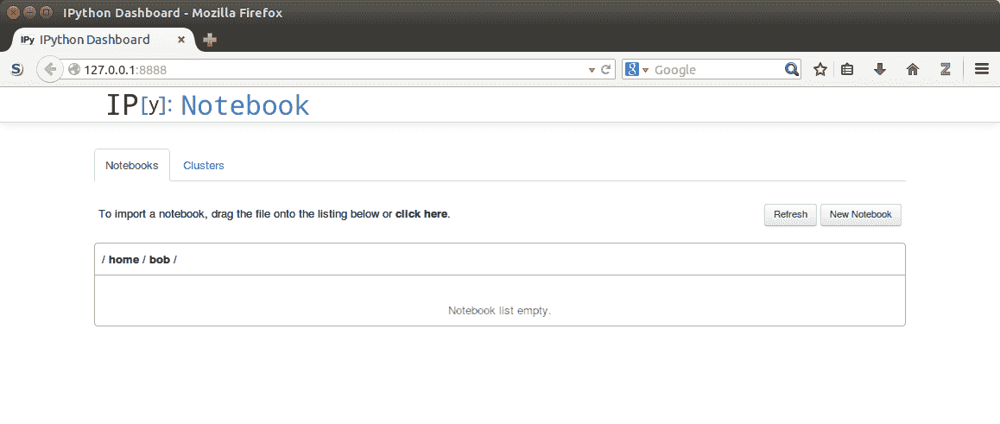
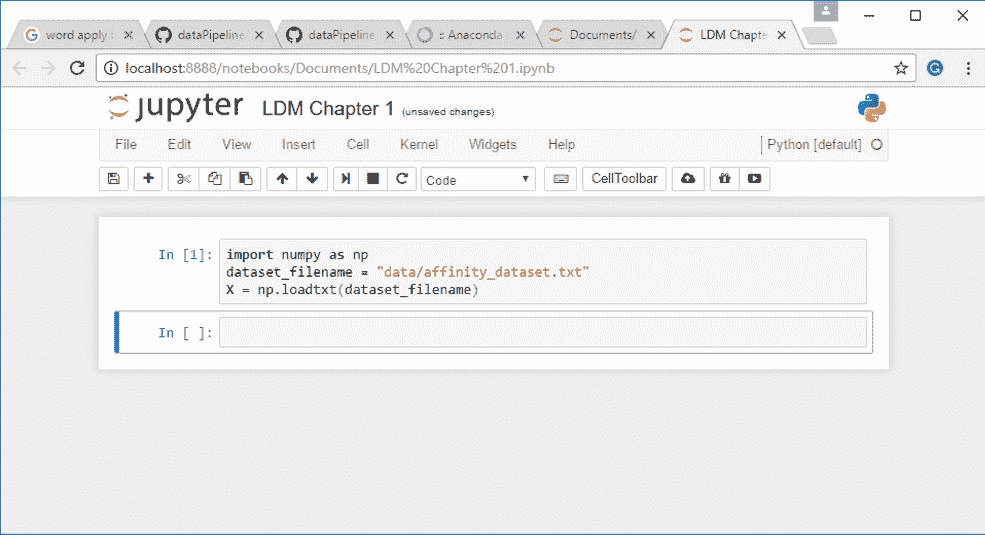
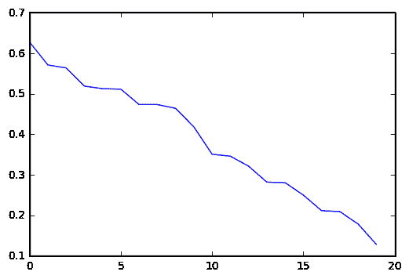

# 数据挖掘入门

我们正在以人类历史上前所未有的规模收集有关我们世界的各种信息。随着这一趋势的发展，我们现在更加重视在日常生活中的使用这些信息。我们期望我们的计算机能够将网页翻译成其他语言，以高精度预测天气，推荐我们喜欢的书籍，以及诊断我们的健康问题。这些期望将在未来不断增长，无论是在应用范围还是效果上。**数据挖掘**是一种我们可以采用的方法，用于训练计算机通过数据做出决策，并构成了今天许多高科技系统的核心。

**Python**编程语言因其良好的原因而越来越受欢迎。它为程序员提供了灵活性，拥有许多模块来执行不同的任务，而且 Python 代码通常比其他任何语言都更易于阅读和简洁。有一个庞大且活跃的研究人员、实践者和初学者社区，他们使用 Python 进行数据挖掘。

在本章中，我们将使用 Python 介绍数据挖掘。我们将涵盖以下主题

+   什么是数据挖掘，我们可以在哪里使用它？

+   设置一个基于 Python 的环境以进行数据挖掘

+   （亲和力分析的）一个例子，根据购买习惯推荐产品

+   （一个经典的）分类问题的例子，根据植物测量值预测植物种类

# 介绍数据挖掘

数据挖掘为计算机提供了一种通过数据做出决策的方法。这个决策可以是预测明天的天气，阻止垃圾邮件进入您的收件箱，检测网站的语种，或者在交友网站上找到新的恋情。数据挖掘有许多不同的应用，而且新的应用正在不断被发现。

数据挖掘部分是算法设计、统计学、工程学、优化和计算机科学的结合。然而，结合这些领域的**基础**技能，我们还需要应用我们在应用数据挖掘的领域的**领域知识（专业知识）**。领域知识对于从良好结果到卓越结果至关重要。有效地应用数据挖掘通常需要将这些特定领域的知识与算法相结合。

大多数数据挖掘应用都采用相同的**高级**视图，其中模型从某些数据中学习，并将其应用于其他数据，尽管细节往往变化很大。

数据挖掘应用涉及创建数据集和调整算法，以下步骤将进行解释

1.  我们通过创建数据集开始我们的数据挖掘过程，描述现实世界的一个方面。数据集包括以下两个方面：

+   **样本**：这些是现实世界中的对象，例如一本书、照片、动物、人或任何其他对象。样本也被称为观察、记录或行，以及其他命名约定。

+   **特征**：这些是我们数据集中样本的描述或测量。特征可以是长度、特定单词的频率、动物的腿数、创建日期等等。特征也被称为变量、列、属性或协变量，以及其他命名约定。

1.  下一步是调整数据挖掘算法。每个数据挖掘算法都有参数，这些参数要么在算法内部，要么由用户提供。这种调整使算法能够学习如何对数据进行决策。

作为简单的例子，我们可能希望计算机能够将人们分类为**矮**或**高**。我们首先收集我们的数据集，其中包括不同人的身高以及他们是否被认为是矮或高：

| **人员** | **身高** | **矮或高？** |
| --- | --- | --- |
| 1 | 155cm | 矮 |
| 2 | 165cm | 矮 |
| 3 | 175cm | 高 |
| 4 | 185cm | 高 |

如上所述，下一步涉及调整我们算法的参数。作为一个简单的算法；如果身高超过**x**，则该人被认为是高的。否则，他们被认为是矮的。然后我们的训练算法将查看数据并决定**x**的合适值。对于前面的数据，这个阈值的一个合理值是 170 厘米。算法认为身高超过 170 厘米的人是高的。其他人都被认为是矮的。这样，我们的算法就可以对新的数据进行分类，例如身高为 167 厘米的人，即使我们之前从未见过这样的人。

在前面的数据中，我们有一个明显的特征类型。我们想知道人们是矮还是高，所以我们收集了他们的身高。这个特征工程是数据挖掘中的一个关键问题。在后面的章节中，我们将讨论选择在数据集中收集的良好特征的方法。最终，这一步通常需要一些专业知识或至少一些试错。

在这本书中，我们将通过 Python 介绍数据挖掘。在某些情况下，我们选择代码和流程的清晰性，而不是执行每个任务的最优化方式。这种清晰性有时涉及到跳过一些可以提高算法速度或有效性的细节。

# 使用 Python 和 Jupyter Notebook

在本节中，我们将介绍安装 Python 以及我们将用于本书大部分内容的**Jupyter** Notebook。此外，我们还将安装**NumPy**模块，我们将使用它来进行第一组示例。

Jupyter Notebook 直到最近还被称为 IPython Notebook。你会在项目相关的网络搜索中注意到这个术语。Jupyter 是新的名称，代表着项目范围的扩大，而不仅仅是使用 Python。

# 安装 Python

Python 编程语言是一种出色、多功能且易于使用的语言。

对于这本书，我们将使用 Python 3.5，该版本可以从 Python 组织的网站[`www.python.org/downloads/`](https://www.python.org/downloads/)获取。然而，我建议你使用 Anaconda 来安装 Python，你可以从官方网站[`www.continuum.io/downloads`](https://www.continuum.io/downloads)下载。

你将有两个主要版本可供选择，Python 3.5 和 Python 2.7。请记住下载并安装 Python 3.5，这是本书中测试过的版本。按照该网站上的安装说明进行安装。如果你有强烈理由学习 Python 2 版本，那么可以通过下载 Python 2.7 版本来实现。请注意，有些代码可能不会像书中那样工作，可能需要一些解决方案。

在这本书中，我假设你对编程和 Python 本身有一些了解。你不需要成为 Python 的专家就能完成这本书，尽管良好的知识水平会有所帮助。我不会在本书中解释一般的代码结构和语法，除非它与被认为是*正常*的 Python 编码实践不同。

如果你没有编程经验，我建议你从 Packt Publishing 出版的《Learning Python》这本书开始学习，或者在线可用的《Dive Into Python》这本书，可在[www.diveintopython3.net](http://www.diveintopython3.net)找到。

Python 组织还维护了一份针对 Python 新手的两个在线教程列表：

+   对于想通过 Python 语言学习编程的非程序员：

[`wiki.python.org/moin/BeginnersGuide/NonProgrammers`](https://wiki.python.org/moin/BeginnersGuide/NonProgrammers)

+   对于已经知道如何编程但需要学习 Python 的程序员：

[`wiki.python.org/moin/BeginnersGuide/Programmers`](https://wiki.python.org/moin/BeginnersGuide/Programmers)

Windows 用户需要设置一个环境变量才能从命令行使用 Python，而其他系统通常可以立即执行。我们将在以下步骤中设置它。

1.  首先，找到你在电脑上安装 Python 3 的位置；默认位置是`C:\Python35`。

1.  接下来，将此命令输入到命令行（cmd 程序）中：设置环境为`PYTHONPATH=%PYTHONPATH%;C:\Python35`。

如果你的 Python 安装在不同的文件夹中，请记住将`C:\Python35`进行更改。

一旦你的系统上运行了 Python，你应该能够打开命令提示符，并可以运行以下代码以确保它已正确安装。

```py
    $ python
    Python 3.5.1 (default, Apr 11 2014, 13:05:11)
    [GCC 4.8.2] on Linux
    Type "help", "copyright", "credits" or "license" for more 
      information.
    >>> print("Hello, world!")
Hello, world!
    >>> exit()

```

注意，我们将使用美元符号（$）来表示你需要在终端（在 Windows 上也称为 shell 或`cmd`）中输入的命令。你不需要输入这个字符（或重新输入屏幕上已经出现的内容）。只需输入剩余的行并按 Enter 键。

在您运行了上述 `"Hello, world!"` 示例之后，退出程序，然后继续安装一个更高级的环境来运行 Python 代码，即 Jupyter Notebook。

Python 3.5 将包含一个名为 **pip** 的程序，它是一个包管理器，可以帮助您在系统上安装新的库。您可以通过运行 `$ pip freeze` 命令来验证 `pip` 是否在您的系统上工作，该命令会告诉您您在系统上安装了哪些包。Anaconda 还安装了他们的包管理器 `conda`，您可以使用它。如果不确定，请先使用 `conda`，如果失败再使用 `pip`。

# 安装 Jupyter Notebook

**Jupyter** 是一个 Python 开发平台，其中包含一些用于运行 Python 的工具和环境，它比标准解释器具有更多功能。它包含强大的 Jupyter Notebook，允许您在网页浏览器中编写程序。它还会格式化您的代码，显示输出，并允许您注释脚本。它是探索数据集的出色工具，我们将使用它作为本书代码的主要环境。

要在您的计算机上安装 Jupyter Notebook，您可以在命令行提示符中输入以下内容（不要在 Python 中输入）：

```py
    $ conda install jupyter notebook

```

您不需要管理员权限来安装它，因为 Anaconda 将包存储在用户的目录中。

安装了 Jupyter Notebook 后，您可以使用以下命令启动它：

```py
    $ jupyter notebook

```

运行此命令将执行两个操作。首先，它将在您刚刚使用的命令提示符中创建一个 Jupyter Notebook 实例（后端）。其次，它将启动您的网页浏览器并连接到此实例，允许您创建一个新的笔记本。它看起来可能像以下截图（其中您需要将 `/home/bob` 替换为您的当前工作目录）：



要停止 Jupyter Notebook 的运行，请打开运行实例的命令提示符（你之前用来运行 `jupyter notebook` 命令的那个）。然后，按 *Ctrl* + *C*，你将收到提示 `Shutdown this notebook server (y/[n])?`。输入 *y* 并按 *Enter*，Jupyter Notebook 将会关闭。

# 安装 scikit-learn

`scikit-learn` 包是一个机器学习库，用 Python 编写（但也包含其他语言的代码）。它包含许多算法、数据集、实用工具和框架，用于执行机器学习。Scikit-learn 建立在科学 Python 堆栈之上，包括 `NumPy` 和 `SciPy` 等库，以提高速度。Scikit-learn 在许多情况下都快速且可扩展，适用于从初学者到高级研究用户的所有技能水平。我们将在第二章 使用 scikit-learn 估算器进行分类中详细介绍 scikit-learn。

要安装`scikit-learn`，您可以使用随 Python 3 一起提供的`conda`实用程序，如果您还没有安装，它还会安装`NumPy`和`SciPy`库。以管理员/根权限打开一个终端，并输入以下命令：

```py
    $ conda install scikit-learn

```

主要的 Linux 发行版用户，如 Ubuntu 或 Red Hat，可能希望从他们的包管理器中安装官方包。

并非所有发行版都有 scikit-learn 的最新版本，所以在安装之前请检查版本。本书所需的最低版本是 0.14。我推荐使用 Anaconda 来为您管理这些，而不是使用系统包管理器进行安装。

想要通过编译源代码安装最新版本或查看更详细的安装说明的用户，可以访问[`scikit-learn.org/stable/install.html`](http://scikit-learn.org/stable/install.html)并参考安装 scikit-learn 的官方文档。

# 一个简单的亲和力分析示例

在本节中，我们将进入我们的第一个示例。数据挖掘的一个常见用途是通过询问购买产品的客户是否希望购买另一个类似的产品来提高销售额。您可以通过亲和力分析执行此分析，亲和力分析是研究事物共存时的情况，即相互关联。

为了重复在统计学课程中教授的臭名昭著的短语，*相关性不等于因果关系*。这个短语的意思是，亲和力分析的结果不能给出原因。在我们的下一个例子中，我们对产品购买进行亲和力分析。结果显示产品是共同购买的，但并不意味着购买一个产品会导致另一个产品的购买。这种区别很重要，尤其是在确定如何使用结果影响业务流程时，例如。

# 什么是亲和力分析？

亲和力分析是一种数据挖掘类型，它给出了样本（对象）之间的相似性。这可能是以下内容的相似性：

+   网站上的**用户**，以提供多样化的服务或定向广告

+   **商品**，以向这些用户销售，提供推荐电影或产品

+   **人类基因**，以找到有相同祖先的人

我们可以通过几种方式来衡量亲和力。例如，我们可以记录两个产品一起购买的多频繁。我们还可以记录当一个人购买对象 1 和对象 2 时陈述的准确性。衡量亲和力的其他方法包括计算样本之间的相似性，这些内容我们将在后面的章节中介绍。

# 产品推荐

将传统业务（如商业）转移到线上时遇到的一个问题是，以前由人类完成的工作需要自动化，以便在线业务可以扩展并与其他现有自动化业务竞争。其中一个例子是向上销售，即向已经购买商品的客户销售额外商品。通过数据挖掘进行自动化的产品推荐是电子商务革命背后的推动力之一，每年将数十亿美元转化为收入。

在这个示例中，我们将关注一个基本的产品推荐服务。我们基于以下想法来设计它：当两个项目历史上一起购买时，它们在未来更有可能一起购买。这种思维方式是许多在线和线下产品推荐服务背后的理念。

对于这类产品推荐算法，一个非常简单的算法是简单地找到任何历史案例，其中用户购买了一个项目，然后推荐用户历史上购买的其他项目。在实践中，像这样的简单算法可以做得很好，至少比随机推荐项目要好。然而，它们可以显著改进，这就是数据挖掘的用武之地。

为了简化编码，我们将一次只考虑两个项目。例如，人们可能在超市同时购买面包和牛奶。在这个早期示例中，我们希望找到以下形式的简单规则：

*如果一个人购买了产品 X，那么他们很可能会购买产品 Y*

不会涉及多个项目的更复杂规则，例如人们购买香肠和汉堡更有可能购买番茄酱。

# 使用 NumPy 加载数据集

数据集可以从本书提供的代码包中下载，或从官方 GitHub 仓库下载：

[`github.com/dataPipelineAU/LearningDataMiningWithPython2`](https://github.com/dataPipelineAU/LearningDataMiningWithPython2)

下载此文件并将其保存在你的电脑上，注意数据集的路径。将其放在你将运行代码的目录中是最容易的，但我们可以从电脑上的任何位置加载数据集。

对于这个示例，我建议你在电脑上创建一个新的文件夹来存储你的数据集和代码。从这里，打开你的 Jupyter Notebook，导航到这个文件夹，并创建一个新的笔记本。

我们将要用于这个示例的数据集是一个 NumPy 二维数组，这种格式是本书其余部分大多数示例的基础。这个数组看起来像一张表格，行代表不同的样本，列代表不同的特征。

单元代表特定样本特定特征的值。为了说明，我们可以用以下代码加载数据集：

```py
import numpy as np 
dataset_filename = "affinity_dataset.txt" 
X = np.loadtxt(dataset_filename)

```

将前面的代码输入到你的（Jupyter）笔记本的第一个单元格中。然后你可以通过按 Shift + Enter 来运行代码（这也会为下一部分的代码添加一个新的单元格）。代码运行后，第一个单元格左侧的方括号将被分配一个递增的数字，让你知道这个单元格已经完成。第一个单元格应该看起来像以下这样：



对于运行时间较长的代码，这里将放置一个星号来表示该代码正在运行或已安排运行。当代码运行完成时（包括如果代码因失败而完成），星号将被一个数字替换。

这个数据集有 100 个样本和五个特征，我们将在后面的代码中需要这些值。让我们使用以下代码提取这些值：

```py
n_samples, n_features = X.shape

```

如果你选择将数据集存储在 Jupyter Notebooks 所在的目录之外，你需要将`dataset_filename`的值更改为新位置。

接下来，我们可以展示数据集的一些行，以了解数据。将以下代码行输入下一个单元格并运行它，以打印数据集的前五行：

```py
print(X[:5])

```

结果将显示在列出的前五笔交易中购买了哪些商品：

```py
[[ 0\.  1\.  0\.  0\.  0.] 
 [ 1\.  1\.  0\.  0\.  0.] 
 [ 0\.  0\.  1\.  0\.  1.] 
 [ 1\.  1\.  0\.  0\.  0.] 
 [ 0\.  0\.  1\.  1\.  1.]]

```

# 下载示例代码

你可以从你购买的所有 Packt Publishing 书籍的账户中下载示例代码文件[`www.packtpub.com`](http://www.packtpub.com/)。如果你在其他地方购买了这本书，你可以访问[`www.packtpub.com/support`](http://www.packtpub.com/support)并注册，以便将文件直接通过电子邮件发送给你。我还设置了一个 GitHub 仓库，其中包含代码的实时版本，以及新的修复、更新等。你可以在以下仓库中检索代码和数据集：[`github.com/dataPipelineAU/LearningDataMiningWithPython2`](https://github.com/dataPipelineAU/LearningDataMiningWithPython2)

你可以通过一次查看每一行（水平线）来读取数据集。第一行`(0, 1, 0, 0, 0)`显示了第一笔交易中购买的商品。每一列（垂直行）代表每种商品。它们分别是面包、牛奶、奶酪、苹果和香蕉。因此，在第一笔交易中，这个人购买了奶酪、苹果和香蕉，但没有购买面包或牛奶。在新的单元格中添加以下行，以便我们将这些特征数字转换为实际单词：

```py
features = ["bread", "milk", "cheese", "apples", "bananas"]

```

这些特征中的每一个都包含二进制值，仅表示是否购买了商品，而不表示购买的数量。*1*表示至少购买了这种类型的一种商品，而*0*表示完全没有购买这种商品。对于现实世界的数据集，使用精确的数字或更大的阈值是必要的。

# 实现规则的简单排序

我们希望找到类型为*如果一个人购买产品 X，那么他们很可能会购买产品 Y*的规则。我们可以通过简单地找到两个产品一起购买的所有场合来轻松地创建我们数据集中所有规则的一个列表。然而，然后我们需要一种方法来确定好的规则和不好的规则，以便我们可以选择特定的产品进行推荐。

我们可以用许多方式评估这类规则，我们将关注其中的两种：**支持度**和**置信度**。

支持度是规则在数据集中出现的次数，这通过简单地计算规则有效的样本数量来计算。有时可以通过将总数除以规则前提有效的总次数来归一化，但在这个实现中我们将简单地计算总数。

**前提**是规则被认为是活跃的要求。**结论**是规则的输出。对于例子*如果一个人买苹果，他们也买香蕉*，只有当前提发生时——一个人买了苹果——该规则才是有效的。然后，规则的结论声明这个人会买香蕉。

虽然支持度衡量规则存在的频率，但置信度衡量当它们可以使用时它们的准确性。你可以通过确定规则在前提适用时应用的百分比来计算这个值。我们首先计算规则在我们的数据中应用的次数，然后除以前提（即`if`语句）出现的样本数量。

作为例子，我们将计算规则*如果一个人买苹果，他们也买香蕉*的支持度和置信度。

如以下示例所示，我们可以通过检查`sample[3]`的值来判断某人在交易中是否购买了苹果，其中我们将一个样本分配到矩阵的某一行：

```py
sample = X[2]

```

同样，我们可以通过查看`sample[4]`的值是否等于 1（等等）来检查交易中是否购买了香蕉。我们现在可以计算我们的规则在数据集中出现的次数，从而计算出置信度和支持度。

现在我们需要计算数据库中所有规则的这些统计数据。我们将为此创建两个字典，一个用于*有效规则*，另一个用于*无效规则*。这个字典的键将是一个元组（前提和结论）。我们将存储索引，而不是实际的特征名称。因此，我们会存储（3 和 4）来表示之前的规则*如果一个人买了苹果，他们也会买香蕉*。如果前提和结论都给出，则该规则被认为是有效的。而如果前提给出但结论没有给出，则该规则对该样本被认为是无效的。

以下步骤将帮助我们计算所有可能规则的置信度和支持度：

1.  我们首先设置一些字典来存储结果。我们将使用`defaultdict`，它会在访问一个尚不存在的键时设置一个默认值。我们记录有效规则的数目、无效规则的数目以及每个前提的出现次数：

```py
from collections import defaultdict 
valid_rules = defaultdict(int) 
invalid_rules = defaultdict(int) 
num_occurences = defaultdict(int)

```

1.  接下来，我们在一个大的循环中计算这些值。我们遍历数据集中的每个样本，然后遍历每个特征作为前提。再次遍历每个特征作为可能的结论，映射前提到结论的关系。如果样本包含一个购买了前提和结论的人，我们在`valid_rules`中记录这个信息。如果他们没有购买结论产品，我们在`invalid_rules`中记录这个信息。

1.  对于样本 X 中的每个样本：

```py
for sample in X:
    for premise in range(n_features):
    if sample[premise] == 0: continue
# Record that the premise was bought in another transaction
    num_occurences[premise] += 1
    for conclusion in range(n_features):
    if premise == conclusion: 
# It makes little sense to
    measure if X -> X.
    continue
    if sample[conclusion] == 1:
# This person also bought the conclusion item
    valid_rules[(premise, conclusion)] += 1

```

如果前提对这个样本是有效的（它有一个值为*1*），那么我们记录这个信息并检查我们规则的每个结论。我们跳过任何与前提相同的结论——这会给我们规则，如：*如果一个人买了苹果，那么他们也买了苹果*，这显然对我们帮助不大。

我们现在已经完成了必要的统计计算，现在可以计算每个规则的*支持度*和*置信度*。和之前一样，支持度只是我们的`valid_rules`值：

```py
support = valid_rules

```

我们可以用相同的方式计算置信度，但我们必须遍历每个规则来计算这个值：

```py
confidence = defaultdict(float)
for premise, conclusion in valid_rules.keys():
    rule = (premise, conclusion)
    confidence[rule] = valid_rules[rule] / num_occurences [premise]

```

我们现在有一个包含每个规则的支持度和置信度的字典。我们可以创建一个函数，以可读的格式打印出这些规则。规则的签名接受前提和结论索引、我们刚刚计算的支持度和置信度字典，以及一个告诉我们`features`含义的特征数组。然后我们打印出该规则的`Support`和`Confidence`：

```py
for premise, conclusion in confidence:
    premise_name = features[premise]
    conclusion_name = features[conclusion]
    print("Rule: If a person buys {0} they will also 
          buy{1}".format(premise_name, conclusion_name))
    print(" - Confidence: {0:.3f}".format
          (confidence[(premise,conclusion)]))
    print(" - Support: {0}".format(support
                                   [(premise, 
                                     conclusion)]))
    print("")

```

我们可以通过以下方式调用代码来测试它——请随意尝试不同的前提和结论：

```py
for premise, conclusion in confidence:
    premise_name = features[premise]
    conclusion_name = features[conclusion]
    print("Rule: If a person buys {0} they will also 
          buy{1}".format(premise_name, conclusion_name))
    print(" - Confidence: {0:.3f}".format
          (confidence[(premise,conclusion)]))
    print(" - Support: {0}".format(support
                                   [(premise, 
                                     conclusion)]))
    print("")

```

# 排序以找到最佳规则

现在我们能够计算所有规则的支持度和置信度，我们希望能够找到*最佳*的规则。为此，我们进行排名并打印出具有最高值的规则。我们可以对支持和置信度值都这样做。

要找到支持度最高的规则，我们首先对支持度字典进行排序。字典默认不支持排序；`items()`函数给我们一个包含字典中数据的列表。我们可以使用`itemgetter`类作为我们的键来对这个列表进行排序，这允许我们排序如此类似的嵌套列表。使用`itemgetter(1)`允许我们根据值进行排序。将`reverse=True`设置为真，我们可以首先得到最高的值：

```py
from operator import itemgetter 
sorted_support = sorted(support.items(), key=itemgetter(1), reverse=True)

```

然后，我们可以打印出前五条规则：

```py
sorted_confidence = sorted(confidence.items(), key=itemgetter(1),
                           reverse=True)
for index in range(5):
    print("Rule #{0}".format(index + 1))
    premise, conclusion = sorted_confidence[index][0]
    print_rule(premise, conclusion, support, confidence, features)

```

结果看起来如下：

```py
Rule #1 
Rule: If a person buys bananas they will also buy milk 
 - Support: 27 
 - Confidence: 0.474 
Rule #2 
Rule: If a person buys milk they will also buy bananas 
 - Support: 27 
 - Confidence: 0.519 
Rule #3 
Rule: If a person buys bananas they will also buy apples 
 - Support: 27 
 - Confidence: 0.474 
Rule #4 
Rule: If a person buys apples they will also buy bananas 
 - Support: 27 
 - Confidence: 0.628 
Rule #5 
Rule: If a person buys apples they will also buy cheese 
 - Support: 22 
 - Confidence: 0.512

```

同样，我们可以根据置信度打印出最佳规则。首先，计算排序后的置信度列表，然后使用之前相同的方法打印它们。

```py
sorted_confidence = sorted(confidence.items(), key=itemgetter(1),
                           reverse=True)
for index in range(5):
    print("Rule #{0}".format(index + 1))
    premise, conclusion = sorted_confidence[index][0]
    print_rule(premise, conclusion, support, confidence, features)

```

两条规则在两个列表的顶部附近。第一条是*如果一个人买了苹果，他们也会买奶酪*，第二条是*如果一个人买了奶酪，他们也会买香蕉*。商店经理可以使用这样的规则来组织他们的商店。例如，如果本周苹果打折，就在附近放置奶酪的展示。同样，将香蕉和奶酪同时打折几乎没有意义，因为近 66%买奶酪的人可能会买香蕉——我们的促销不会大幅增加香蕉的销量。

Jupyter Notebook 将在笔记本中内联显示图表。然而，有时这并不是默认配置的。要配置 Jupyter Notebook 以内联显示图表，请使用以下代码行：`%matplotlib inline`

我们可以使用名为 `matplotlib` 的库来可视化结果。

我们将从展示规则置信度的简单折线图开始，按置信度顺序排列。`matplotlib` 使得这变得简单——我们只需传入数字，它就会绘制出一个简单但有效的图表：

```py
from matplotlib import pyplot as plt 
plt.plot([confidence[rule[0]] for rule in sorted_confidence])

```



使用之前的图表，我们可以看到前五条规则有相当高的置信度，但在此之后效果迅速下降。利用这些信息，我们可能会决定只使用前五条规则来驱动商业决策。最终，使用这种探索技术，结果取决于用户。

在这样的例子中，数据挖掘具有强大的探索能力。一个人可以使用数据挖掘技术来探索其数据集中的关系，以发现新的见解。在下一节中，我们将使用数据挖掘来实现不同的目的：预测和分类。

# 一个简单的分类示例

在亲和力分析示例中，我们寻找了数据集中不同变量之间的相关性。在分类中，我们有一个我们感兴趣的单一变量，我们称之为**类别**（也称为目标）。在先前的例子中，如果我们对人们如何购买更多苹果感兴趣，我们会探索与苹果相关的规则，并使用这些规则来指导我们的决策。

# 什么是分类？

分类是数据挖掘应用最广泛的一种，无论是在实际应用还是在研究中。与之前一样，我们有一组代表我们感兴趣分类的对象或事物的样本。我们还有一个新的数组，即类别值。这些类别值为我们提供了样本的分类。以下是一些例子：

+   通过观察植物的测量值来确定其种类。这里的类别值将是：*这是哪种物种？*

+   确定图像中是否包含狗。类别将是：*这张图像中是否有狗？*

+   根据特定测试的结果来确定患者是否患有癌症。类别将是：*这位患者是否有癌症？*

虽然许多先前的例子是二元（是/否）问题，但它们不必是，就像本节中植物物种分类的例子一样。

分类应用的目的是在已知类别的样本集上训练一个模型，然后将该模型应用于具有未知类别的未见样本。例如，我们想在标记为垃圾邮件或非垃圾邮件的过去电子邮件上训练一个垃圾邮件分类器。然后我想使用这个分类器来确定我的下一封电子邮件是否是垃圾邮件，而无需我自己进行分类。

# 加载数据集和准备数据

我们将要用于此示例的数据集是著名的植物分类的鸢尾花数据库。在此数据集中，我们有 150 个植物样本，每个样本有四个测量值：**萼片长度**、**萼片宽度**、**花瓣长度**和**花瓣宽度**（所有单位均为厘米）。这个经典数据集（首次使用于 1936 年！）是数据挖掘的经典数据集之一。有三个类别：**鸢尾花塞托萨**、**鸢尾花变色**和**鸢尾花维吉尼卡**。目标是通过对样本的测量来确定样本属于哪种植物类型。

`scikit-learn` 库内置了此数据集，使得数据集的加载变得简单：

```py
from sklearn.datasets import load_iris 
dataset = load_iris() 
X = dataset.data 
y = dataset.target

```

您也可以使用 `print(dataset.DESCR)` 来查看数据集的概述，包括一些关于特征细节的信息。

本数据集中的特征是连续值，这意味着它们可以取任何范围的值。测量值是这种类型特征的很好例子，其中测量值可以是 1、1.2 或 1.25 等。连续特征的另一个方面是，彼此接近的特征值表示相似性。一个萼片长度为 1.2 厘米的植物就像一个萼片宽度为 1.25 厘米的植物。

相比之下，分类特征。这些特征虽然通常以数字表示，但不能以相同的方式进行比较。在鸢尾花数据集中，类别值是分类特征的例子。类别 0 代表鸢尾花塞托萨；类别 1 代表鸢尾花变色，类别 2 代表鸢尾花维吉尼卡。这里的编号并不意味着鸢尾花塞托萨比鸢尾花变色更相似，尽管类别值更相似。这里的数字代表类别。我们只能说类别是否相同或不同。

还有其他类型的特征，我们将在后面的章节中介绍。这些包括像素强度、词频和 n-gram 分析。

虽然此数据集中的特征是连续的，但我们将在此示例中使用的算法需要分类特征。将连续特征转换为分类特征的过程称为离散化。

一种简单的离散化算法是选择一个阈值，任何低于此阈值的值都被赋予值 0。同时，任何高于此阈值的值都被赋予值 1。对于我们的阈值，我们将计算该特征的平均值（平均值）。首先，我们计算每个特征的平均值：

```py
attribute_means = X.mean(axis=0)

```

此代码的结果将是一个长度为 4 的数组，这是我们拥有的特征数量。第一个值是第一个特征的值的平均值，依此类推。接下来，我们使用这个结果将我们的数据集从具有连续特征的集合转换为具有离散分类特征的集合：

```py
assert attribute_means.shape == (n_features,)
X_d = np.array(X >= attribute_means, dtype='int')

```

我们将使用这个新的 `X_d` 数据集（*X 离散化*）进行我们的 **训练和测试**，而不是原始数据集（*X*）。

# 实现 OneR 算法

**OneR** 是一个简单的算法，它通过找到特征值的最高频率类别来预测样本的类别。**OneR** 是 *One Rule* 的缩写，表示我们只使用一个规则进行这种分类，通过选择表现最好的特征。虽然一些后续的算法要复杂得多，但这个简单的算法在现实世界的一些数据集中已被证明有良好的性能。

算法首先遍历每个特征的每个值。对于这个值，计算具有该特征值的每个类别的样本数量。记录特征值的最高频率类别和预测的错误。

例如，如果一个特征有两个值，*0* 和 *1*，我们首先检查所有具有值 *0* 的样本。对于这个值，我们可能在类别 *A* 中有 20 个，在类别 *B* 中有 60 个，以及在类别 *C* 中有进一步的 20 个。对于这个值最频繁的类别是 *B*，并且有 40 个实例具有不同的类别。对于这个特征值的预测是 *B*，错误率为 40，因为有 40 个样本与预测的类别不同。然后，我们对这个特征的值 *1* 执行相同的程序，然后对其他所有特征值组合执行。

一旦计算了这些组合，我们就通过累加该特征的值的错误来计算每个特征的错误。具有最低总错误的特征被选为 *One Rule*，然后用于分类其他实例。

在代码中，我们首先创建一个函数，用于计算特定特征值的类别预测和错误。我们有两个必要的导入，`defaultdict` 和 `itemgetter`，我们在之前的代码中使用过：

```py
from collections import defaultdict 
from operator import itemgetter

```

接下来，我们创建一个函数定义，该函数需要数据集、类别、我们感兴趣的特征的索引以及我们正在计算的值。它遍历每个样本，并计算每个特征值对应特定类别的次数。然后，我们选择当前特征/值对的最高频率类别：

```py
def train_feature_value(X, y_true, feature, value):
# Create a simple dictionary to count how frequency they give certain
predictions
 class_counts = defaultdict(int)
# Iterate through each sample and count the frequency of each
class/value pair
 for sample, y in zip(X, y_true):
    if sample[feature] == value: 
        class_counts[y] += 1
# Now get the best one by sorting (highest first) and choosing the
first item
sorted_class_counts = sorted(class_counts.items(), key=itemgetter(1),
                             reverse=True)
most_frequent_class = sorted_class_counts[0][0]
 # The error is the number of samples that do not classify as the most
frequent class
 # *and* have the feature value.
    n_samples = X.shape[1]
    error = sum([class_count for class_value, class_count in
                 class_counts.items()
 if class_value != most_frequent_class])
    return most_frequent_class, error

```

作为最后一步，我们还计算了这个规则的错误。在 `OneR` 算法中，任何具有这个特征值的样本都会被预测为最频繁的类别。因此，我们通过累加其他类别的计数（不是最频繁的）来计算错误。这些代表导致错误或分类错误的训练样本。

使用这个函数，我们现在可以通过遍历该特征的值、汇总误差并记录每个值的预测类别来计算整个特征的误差。

该函数需要数据集、类别以及我们感兴趣的属性索引。然后它遍历不同的值，并找到用于此特定属性的、最准确的属性值，正如 `OneR` 规则：

```py
def train(X, y_true, feature): 
    # Check that variable is a valid number 
    n_samples, n_features = X.shape 
    assert 0 <= feature < n_features 
    # Get all of the unique values that this variable has 
    values = set(X[:,feature]) 
    # Stores the predictors array that is returned 
    predictors = dict() 
    errors = [] 
    for current_value in values: 
        most_frequent_class, error = train_feature_value
        (X, y_true, feature, current_value) 
        predictors[current_value] = most_frequent_class 
        errors.append(error) 
    # Compute the total error of using this feature to classify on 
    total_error = sum(errors) 
    return predictors, total_error

```

让我们更详细地看看这个函数。

在一些初步测试之后，我们找到给定属性所具有的所有唯一值。下一行的索引查看给定属性的整个列，并将其作为数组返回。然后我们使用 set 函数来找到唯一的值：

```py
    values = set(X[:,feature_index])

```

接下来，我们创建一个字典来存储预测值。这个字典将以属性值作为键，分类作为值。键为 1.5，值为 2 的条目意味着，当属性值设置为 1.5 时，将其分类为属于类别 2。我们还创建了一个列表来存储每个属性值的误差：

```py
predictors = {} 
    errors = []

```

作为这个函数的主要部分，我们遍历这个特征的唯一值，并使用之前定义的 `train_feature_value` 函数来找到给定属性值的最大频率类别和误差。我们按照前面概述的方式存储结果：

最后，我们计算这个规则的总体误差，并返回预测值以及这个值：

```py
total_error = sum(errors)
return predictors, total_error

```

# 测试算法

当我们评估前面章节中的亲和力分析算法时，我们的目标是探索当前数据集。与此分类不同，我们想要构建一个模型，通过将其与我们对该问题的了解进行比较，使我们能够对以前未见样本进行分类。

因此，我们将机器学习工作流程分为两个阶段：训练和测试。在训练阶段，我们取数据集的一部分来创建我们的模型。在测试阶段，我们应用这个模型并评估它在数据集上的有效性。由于我们的目标是创建一个可以分类以前未见样本的模型，我们不能使用测试数据来训练模型。如果我们这样做，我们就有可能发生**过度拟合**。

过度拟合是创建一个模型，该模型在训练数据集上分类得很好，但在新样本上表现不佳的问题。解决方案很简单：永远不要使用训练数据来测试你的算法。这个简单规则有一些复杂的变体，我们将在后面的章节中介绍；但，现在，我们可以通过简单地分割我们的数据集为两个小数据集：一个用于训练，一个用于测试来评估我们的 `OneR` 实现。这个工作流程在本节中给出。

`scikit-learn` 库包含一个函数可以将数据分割成训练和测试组件：

```py
from sklearn.cross_validation import train_test_split

```

此函数将数据集根据给定的比例（默认情况下使用数据集的 25% 用于测试）分成两个子数据集。它是随机进行的，这提高了算法在现实世界环境中按预期执行（我们期望数据来自随机分布）的置信度：

```py
Xd_train, Xd_test, y_train, y_test = train_test_split(X_d, y, 
    random_state=14)

```

我们现在有两个较小的数据集：`Xd_train` 包含我们的训练数据，`Xd_test` 包含我们的测试数据。`y_train` 和 `y_test` 给出了这些数据集对应的类别值。

我们还指定了一个 `random_state`。设置随机状态将在每次输入相同值时给出相同的分割。它看起来是随机的，但使用的算法是确定性的，输出将是一致的。对于这本书，我建议将随机状态设置为与我相同的值，这样你将得到与我相同的结果，允许你验证你的结果。要获得每次运行都变化的真正随机结果，请将 `random_state` 设置为 `None`。

接下来，我们计算数据集中所有特征的预测器。记住，只使用训练数据来完成这个过程。我们遍历数据集中的所有特征，并使用先前定义的函数来训练预测器和计算错误：

```py
all_predictors = {} 
errors = {} 
for feature_index in range(Xd_train.shape[1]): 
    predictors, total_error = train(Xd_train,
                                    y_train,
                                    feature_index) 
    all_predictors[feature_index] = predictors 
    errors[feature_index] = total_error

```

接下来，我们通过找到具有最低错误的特征来找到用作我们的 *One Rule* 的最佳特征：

```py
best_feature, best_error = sorted(errors.items(), key=itemgetter(1))[0]

```

然后，我们通过存储最佳特征的预测器来创建我们的 `model`：

```py
model = {'feature': best_feature,
         'predictor': all_predictors[best_feature]}

```

我们的模型是一个字典，它告诉我们应该使用哪个特征来进行我们的 *One Rule* 以及基于这些值的预测。有了这个模型，我们可以通过找到特定特征的值并使用适当的预测器来预测一个先前未见过的样本的类别。以下代码为给定样本执行此操作：

```py
variable = model['feature'] 
predictor = model['predictor'] 
prediction = predictor[int(sample[variable])]

```

经常我们希望一次预测多个新样本，我们可以使用以下函数来完成。它只是简单地使用上面的代码，但遍历数据集中的所有样本，为每个样本获取预测：

```py
def predict(X_test, model):
variable = model['feature']
predictor = model['predictor']
y_predicted = np.array([predictor
                        [int(sample[variable])] for sample
                        in X_test])
return y_predicted

```

对于我们的 `testing` 数据集，我们通过调用以下函数来获取预测：

```py
y_predicted = predict(Xd_test, model)

```

然后，我们可以通过将其与已知类别进行比较来计算这个准确率：

```py
accuracy = np.mean(y_predicted == y_test) * 100 
print("The test accuracy is {:.1f}%".format(accuracy))

```

此算法给出了 65.8% 的准确率，对于一个单一规则来说并不坏！

# 摘要

在本章中，我们介绍了使用 Python 进行数据挖掘。如果你能运行本节中的代码（注意，完整的代码包含在提供的代码包中），那么你的计算机已经为本书的大部分内容做好了设置。其他 Python 库将在后面的章节中介绍，以执行更专业的任务。

我们使用 Jupyter Notebook 运行我们的代码，这使得我们可以立即查看代码小段的结果。Jupyter Notebook 是一个有用的工具，将在整本书中使用。

我们介绍了一种简单的亲和分析，寻找一起购买的产品。这种类型的探索性分析可以深入了解业务流程、环境或场景。这些类型分析的信息可以帮助业务流程，找到下一个重大的医学突破，或者创造下一个人工智能。

此外，在本章中，我们使用`OneR`算法提供了一个简单的分类示例。这个简单的算法只是找到最佳特征，并预测在训练数据集中最频繁出现此值的类别。

为了扩展本章的成果，思考一下你将如何实现一个可以同时考虑多个特征/值对的`OneR`算法变体。尝试实现你的新算法并对其进行评估。记住，要在与训练数据不同的数据集上测试你的算法。否则，你可能会面临数据过拟合的风险。

在接下来的几章中，我们将扩展分类和亲和分析的概念。我们还将介绍 scikit-learn 包中的分类器，并使用它们来进行机器学习，而不是自己编写算法。
