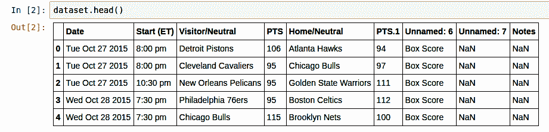
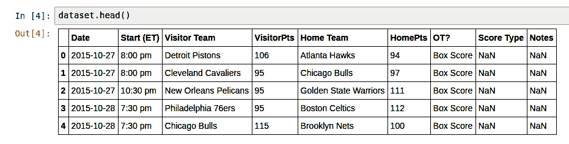
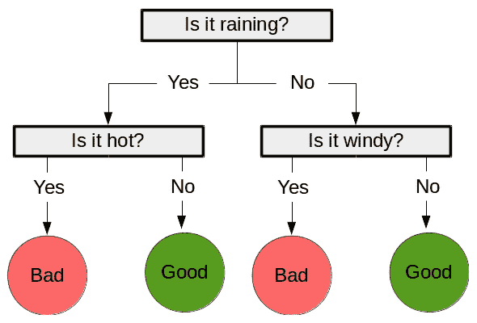
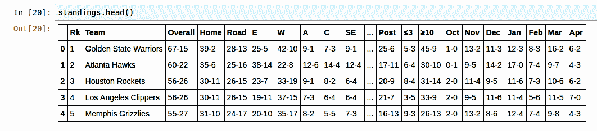

# 第三章：使用决策树预测体育比赛获胜者

在本章中，我们将探讨使用不同于我们之前所见类型的分类算法来预测体育比赛获胜者：**决策树**。这些算法相对于其他算法有许多优点。其中一个主要优点是它们可由人类阅读，这使得它们可以在人类驱动的决策中应用。通过这种方式，决策树可以用来学习一个程序，如果需要，可以将其交给人类执行。另一个优点是它们可以处理各种特征，包括分类特征，我们将在本章中看到。

本章将涵盖以下主题：

+   使用 pandas 库加载数据和操作数据

+   用于分类的决策树

+   使用随机森林来改进决策树

+   在数据挖掘中使用真实世界的数据集

+   创建新特征并在稳健的框架中测试它们

# 加载数据集

在本章中，我们将探讨预测**国家篮球协会**（**NBA**）比赛获胜者的问题。NBA 的比赛往往非常接近，有时在最后一刻才能分出胜负，这使得预测获胜者变得相当困难。许多运动都具备这种特征，即（通常）更好的队伍可能在某一天被另一支队伍击败。

对预测获胜者的各种研究表明，体育结果预测的准确性可能存在上限，这个上限取决于运动项目，通常在 70%到 80%之间。目前正在进行大量的体育预测研究，通常是通过数据挖掘或基于统计的方法进行的。

在本章中，我们将探讨一个入门级的篮球比赛预测算法，使用决策树来确定一支队伍是否会赢得某场比赛。不幸的是，它并不像体育博彩机构使用的模型那样盈利，这些模型通常更先进、更复杂，最终也更准确。

# 收集数据

我们将使用的是 2015-2016 赛季 NBA 的比赛历史数据。网站[`basketball-reference.com`](http://basketball-reference.com/)包含从 NBA 和其他联赛收集的大量资源和统计数据。要下载数据集，请执行以下步骤：

1.  在您的网络浏览器中导航到[`www.basketball-reference.com/leagues/NBA_2016_games.html`](http://www.basketball-reference.com/leagues/NBA_2016_games.html)。

1.  点击“分享和更多”。

1.  点击“获取表格为 CSV（适用于 Excel）”。

1.  将包括标题在内的数据复制到名为`basketball.csv`的文本文件中。

1.  对其他月份重复此过程，但不要复制标题。

这将为您提供包含本季 NBA 每场比赛结果的 CSV 文件。您的文件应包含 1316 场比赛和文件中的总行数 1317 行，包括标题行。

CSV 文件是文本文件，其中每行包含一个新行，每个值由逗号分隔（因此得名）。CSV 文件可以通过在文本编辑器中键入并保存为`.csv`扩展名来手动创建。它们可以在任何可以读取文本文件的程序中打开，也可以在 Excel 中以电子表格的形式打开。Excel（和其他电子表格程序）通常可以将电子表格转换为 CSV 格式。

我们将使用`pandas`库来加载文件，这是一个用于操作数据的极其有用的库。Python 还包含一个名为`csv`的内置库，它支持读取和写入 CSV 文件。然而，我们将使用 pandas，它提供了更强大的函数，我们将在本章后面创建新功能时使用。

对于本章，你需要安装 pandas。最简单的方法是使用 Anaconda 的`conda`安装程序，就像你在第一章“开始数据挖掘安装 scikit-learn”中所做的那样：

`$ conda install pandas` 如果你在安装 pandas 时遇到困难，请访问项目的网站[`pandas.pydata.org/getpandas.html`](http://pandas.pydata.org/getpandas.html)，并阅读适用于您系统的安装说明。

# 使用 pandas 加载数据集

`pandas`库是一个用于加载数据、管理和操作数据的库。它在幕后处理数据结构，并支持数据分析函数，例如计算平均值和按值分组数据。

在进行多次数据挖掘实验时，你会发现你反复编写许多相同的函数，例如读取文件和提取特征。每次这种重新实现都会带来引入错误的风险。使用像`pandas`这样的高质量库可以显著减少执行这些函数所需的工作量，并使你更有信心使用经过良好测试的代码来支撑你的程序。

在整本书中，我们将大量使用 pandas，随着内容的展开介绍用例和所需的新函数。

我们可以使用`read_csv`函数来加载数据集：

```py
import pandas as pd
data_filename = "basketball.csv"
dataset = pd.read_csv(data_filename)

```

这样做的结果是一个 pandas **DataFrame**，它有一些有用的函数，我们将在以后使用。查看生成的数据集，我们可以看到一些问题。输入以下内容并运行代码以查看数据集的前五行：

```py
dataset.head(5)

```

这是输出：



仅用参数读取数据就产生了一个相当可用的数据集，但它有一些问题，我们将在下一节中解决。

# 清理数据集

在查看输出后，我们可以看到许多问题：

+   日期只是一个字符串，而不是日期对象

+   从视觉检查结果来看，标题不完整或不正确

这些问题来自数据，我们可以通过改变数据本身来修复这些问题。然而，在这样做的时候，我们可能会忘记我们采取的步骤或错误地应用它们；也就是说，我们无法复制我们的结果。就像在前面一节中我们使用管道来跟踪我们对数据集所做的转换一样，我们将使用 pandas 对原始数据进行转换。

`pandas.read_csv`函数有参数可以修复这些问题，我们可以在加载文件时指定。我们还可以在加载文件后更改标题，如下面的代码所示：

```py
dataset = pd.read_csv(data_filename, parse_dates=["Date"]) dataset.columns
        = ["Date", "Start (ET)", "Visitor Team", "VisitorPts", 
           "Home Team", "HomePts", "OT?", "Score Type", "Notes"]

```

结果显著提高，正如我们可以从打印出的结果数据框中看到：

```py
dataset.head()

```

输出如下：



即使在像这样精心编制的数据源中，你也需要做一些调整。不同的系统有不同的细微差别，导致数据文件之间并不完全兼容。在首次加载数据集时，始终检查加载的数据（即使它是已知的格式），并检查数据的数据类型。在 pandas 中，可以使用以下代码完成：

```py
print(dataset.dtypes)

```

现在我们已经将数据集格式化为一致的形式，我们可以计算一个**基线**，这是一种在给定问题中获得良好准确率的好方法。任何合格的数据挖掘解决方案都应该击败这个基线数字。

对于产品推荐系统，一个好的基线是简单地**推荐最受欢迎的产品**。

对于分类任务，可以是**总是预测最频繁的任务**，或者应用一个非常简单的分类算法，如**OneR**。

对于我们的数据集，每场比赛有两支队伍：一支主队和一支客队。这个任务的明显基线是 50%，如果我们随机猜测获胜者，这是我们预期的准确率。换句话说，随机选择预测获胜的队伍（随着时间的推移）将导致大约 50%的准确率。然而，凭借一点领域知识，我们可以为这个任务使用更好的基线，我们将在下一节中看到。

# 提取新特征

现在，我们将通过组合和比较现有数据从该数据集中提取一些特征。首先，我们需要指定我们的类别值，这将给我们的分类算法提供一些比较的依据，以判断其预测是否正确。这可以通过多种方式编码；然而，对于这个应用，如果主队获胜，我们将指定类别为 1，如果客队获胜，则为 0。在篮球中，得分最高的队伍获胜。因此，尽管数据集没有直接指定谁获胜，我们仍然可以轻松地计算出结果。

我们可以通过以下方式指定数据集：

```py
dataset["HomeWin"] = dataset["VisitorPts"] < dataset["HomePts"]

```

然后将这些值复制到一个 NumPy 数组中，以便稍后用于我们的 scikit-learn 分类器。目前 pandas 和 scikit-learn 之间没有干净的集成，但它们可以通过使用 NumPy 数组很好地一起工作。虽然我们将使用 pandas 提取特征，但我们需要提取值来与 scikit-learn 一起使用：

```py
y_true = dataset["HomeWin"].values

```

前面的数组现在以 scikit-learn 可以读取的格式存储我们的类别值。

顺便说一句，体育预测更好的基线是预测每场比赛的主队。研究表明，主队在全球几乎所有体育项目中都有优势。这个优势有多大？让我们看看：

```py
dataset["HomeWin"].mean()

```

最终得到的值，大约为 0.59，表明主队平均赢得 59%的比赛。这比随机机会的 50%要高，并且这是一条适用于大多数体育运动的简单规则。

我们还可以开始创建一些特征，用于我们的数据挖掘输入值（`X`数组）。虽然有时我们可以直接将原始数据扔进我们的分类器，但我们通常需要从我们的数据中推导出连续的数值或分类特征。

对于我们当前的数据库，我们实际上不能使用现有的特征（以它们当前的形式）来进行预测。在我们需要预测比赛结果之前，我们不知道比赛的分数，因此我们不能将它们用作特征。虽然这听起来可能很明显，但很容易忽略。

我们想要创建的前两个特征，以帮助我们预测哪支队伍会赢，是这两个队伍中的任何一个是否赢得了上一场比赛。这大致可以近似哪支队伍目前表现良好。

我们将通过按顺序遍历行并记录哪支队伍获胜来计算这个特征。当我们到达新行时，我们查看该队伍上次我们看到他们时是否获胜。

我们首先创建一个（默认）字典来存储球队的最后一次结果：

```py
from collections import defaultdict 
won_last = defaultdict(int)

```

然后，我们在数据集上创建一个新的特征来存储我们新特征的成果：

```py
dataset["HomeLastWin"] = 0
dataset["VisitorLastWin"] = 0

```

这个字典的键将是球队，值将是他们是否赢得了上一场比赛。然后我们可以遍历所有行，并更新当前行的球队最后结果：

```py
for index, row in dataset.iterrows():
    home_team = row["Home Team"]
    visitor_team = row["Visitor Team"]
    row["HomeLastWin"] = won_last[home_team]
    dataset.set_value(index, "HomeLastWin", won_last[home_team])
    dataset.set_value(index, "VisitorLastWin", won_last[visitor_team])
    won_last[home_team] = int(row["HomeWin"])
    won_last[visitor_team] = 1 - int(row["HomeWin"])

```

注意，前面的代码依赖于我们的数据集是按时间顺序排列的。我们的数据集是有序的；然而，如果你使用的数据集不是按顺序排列的，你需要将`dataset.iterrows()`替换为`dataset.sort("Date").iterrows()`。

循环中的最后两行根据哪支队伍赢得了**当前**比赛，将 1 或 0 更新到我们的字典中。这些信息被用于下一场每支队伍所打的比赛。

在前面的代码运行之后，我们将有两个新的特征：`HomeLastWin`和`VisitorLastWin`。使用`dataset.head(6)`查看数据集，以了解一支主队和一支客队最近赢得比赛的例子。使用 pandas 的索引器查看数据集的其他部分：

```py
dataset.ix[1000:1005]

```

目前，当它们首次出现时，这会给所有团队（包括上一年的冠军！）一个错误值。我们可以使用上一年的数据来改进这个功能，但在这个章节中我们不会这么做。

# 决策树

决策树是一类监督学习算法，类似于流程图，由一系列节点组成，其中样本的值用于在下一个节点上进行决策。

以下示例很好地说明了决策树是如何成为一类监督学习算法的：



与大多数分类算法一样，使用它们有两个阶段：

+   第一个阶段是**训练**阶段，在这个阶段，使用训练数据构建一个树。虽然上一章中的最近邻算法没有训练阶段，但决策树需要这个阶段。这样，最近邻算法是一个懒惰的学习者，只有在需要做出预测时才会进行任何工作。相比之下，决策树，像大多数分类方法一样，是积极的学习者，在训练阶段进行工作，因此在预测阶段需要做的工作更少。

+   第二个阶段是**预测**阶段，在这个阶段，使用训练好的树来预测新样本的分类。使用之前的示例树，数据点`["is raining", "very windy"]`会被归类为*恶劣天气*。

存在许多创建决策树的算法。其中许多算法是迭代的。它们从基本节点开始，决定第一个决策的最佳特征，然后转到每个节点并选择下一个最佳特征，依此类推。当决定进一步扩展树无法获得更多收益时，这个过程会在某个点上停止。

`scikit-learn`包实现了**分类和回归树**（**CART**）算法，作为其默认的决策树类，它可以使用分类和连续特征。

# 决策树中的参数

对于决策树来说，最重要的参数之一是**停止标准**。当树构建接近完成时，最后的几个决策往往可能是相当随意的，并且只依赖于少量样本来做出决策。使用这样的特定节点可能导致树显著过度拟合训练数据。相反，可以使用停止标准来确保决策树不会达到这种精确度。

而不是使用停止标准，树可以完全创建，然后进行修剪。这个过程会移除对整体过程提供信息不多的节点。这被称为**剪枝**，结果是一个在新数据集上通常表现更好的模型，因为它没有过度拟合训练数据。

scikit-learn 中的决策树实现提供了一个方法，使用以下选项来停止树的构建：

+   `**min_samples_split**`：这指定了在决策树中创建新节点所需的样本数量

+   `**min_samples_leaf**`：这指定了节点必须产生的样本数量，以便它保持不变

第一个决定了是否创建决策节点，而第二个决定了是否保留决策节点。

决策树另一个参数是创建决策的标准。**基尼不纯度**和**信息增益**是这个参数的两个流行选项：

+   **基尼不纯度**：这是衡量决策节点错误预测样本类别的频率的度量

+   **信息增益**：这使用基于信息论熵来指示决策节点通过决策获得的额外信息量

这些参数值大致做相同的事情——决定使用哪个规则和值来将节点分割成子节点。这个值本身只是确定分割时使用哪个指标，然而这可能会对最终模型产生重大影响。

# 使用决策树

我们可以导入`DecisionTreeClassifier`类，并使用 scikit-learn 创建决策树：

```py
from sklearn.tree import DecisionTreeClassifier
clf = DecisionTreeClassifier(random_state=14)

```

我们再次使用了 14 作为`random_state`，并在本书的大部分内容中都会这样做。使用相同的随机种子允许实验的可重复性。然而，在你的实验中，你应该混合随机状态以确保算法的性能不依赖于特定值。

我们现在需要从我们的 pandas 数据框中提取数据集，以便与我们的`scikit-learn`分类器一起使用。我们通过指定我们希望使用的列并使用数据框视图的值参数来完成此操作。以下代码使用主队和客队最后一场胜利的值创建了一个数据集：

```py
X_previouswins = dataset[["HomeLastWin", "VisitorLastWin"]].values

```

决策树是估计量，如第二章中介绍的，*使用**scikit-learn** *估计量进行分类*，因此有`fit`和`predict`方法。我们还可以使用`cross_val_score`方法来获取平均分数（如我们之前所做的那样）：

```py
from sklearn.cross_validation import cross_val_score
import numpy as np
scores = cross_val_score(clf, X_previouswins, y_true,
scoring='accuracy')
print("Accuracy: {0:.1f}%".format(np.mean(scores) * 100))

```

这个得分是 59.4%，我们比随机选择要好！然而，我们并没有打败仅仅选择主队的基线。事实上，我们几乎完全一样。我们应该能够做得更好。**特征工程**是数据挖掘中最困难的任务之一，选择*好的***特征**是获得良好结果的关键——比选择正确的算法更重要！

# 体育结果预测

我们可以通过尝试其他特征来做得更好。我们有一种测试模型准确性的方法。`cross_val_score`方法允许我们尝试新的特征。

我们可以使用许多可能的特征，但我们将尝试以下问题：

+   通常哪个队被认为是更好的？

+   哪个队赢得了他们上次相遇？

我们还将尝试将原始队伍放入算法中，以检查算法是否可以学习一个模型，该模型检查不同队伍之间的比赛。

# 整合所有内容

对于第一个特征，我们将创建一个特征，告诉我们主队是否通常比客队更好。为此，我们将从上一个赛季的 NBA 中加载排名（在某些运动中也称为排行榜）。如果一个队在 2015 年的排名高于另一个队，则该队将被认为是更好的。

要获取排行榜数据，请执行以下步骤：

1.  在您的网络浏览器中导航到 [`www.basketball-reference.com/leagues/NBA_2015_standings.html`](http://www.basketball-reference.com/leagues/NBA_2015_standings.html)。

1.  选择扩展排名以获取整个联盟的单个列表。

1.  点击导出链接。

1.  将文本复制并保存在您数据文件夹中的名为 `standings.csv` 的文本/CSV 文件中。

回到您的 Jupyter Notebook 中，将以下行输入到新的单元格中。您需要确保文件已保存到由 data_folder 变量指向的位置。代码如下：

```py
import os
standings_filename = os.path.join(data_folder, "standings.csv")
standings = pd.read_csv(standings_filename, skiprows=1)

```

您只需在新的单元格中输入“standings”并运行，就可以查看排行榜。

代码：

```py
standings.head()

```

输出如下：



接下来，我们使用与之前特征相似的图案创建一个新的特征。我们遍历行，查找主队和客队的排名。代码如下：

```py
dataset["HomeTeamRanksHigher"] = 0
for index, row in dataset.iterrows():
    home_team = row["Home Team"]
    visitor_team = row["Visitor Team"]
    home_rank = standings[standings["Team"] == home_team]["Rk"].values[0]
    visitor_rank = standings[standings["Team"] == visitor_team]["Rk"].values[0]
    row["HomeTeamRanksHigher"] = int(home_rank > visitor_rank)
    dataset.set_value(index, "HomeTeamRanksHigher", int(home_rank < visitor_rank))

```

接下来，我们使用 `cross_val_score` 函数测试结果。首先，我们提取数据集：

```py
X_homehigher = dataset[["HomeLastWin", "VisitorLastWin", "HomeTeamRanksHigher"]].values

```

然后，我们创建一个新的 `DecisionTreeClassifier` 并运行评估：

```py
clf = DecisionTreeClassifier(random_state=14)
scores = cross_val_score(clf, X_homehigher, y_true, scoring='accuracy')
print("Accuracy: {0:.1f}%".format(np.mean(scores) * 100))

```

现在这个得分是 60.9%，甚至比我们之前的结果更好，现在比每次只选择主队更好。我们能做得更好吗？

接下来，让我们测试两支球队中哪一支在最近一场比赛中赢得了对方。虽然排名可以给出一些关于谁赢的线索（排名更高的球队更有可能赢），但有时球队对其他球队的表现更好。这有很多原因——例如，一些球队可能有针对特定球队的策略或球员表现非常好。遵循我们之前的模式，我们创建一个字典来存储过去比赛的胜者，并在我们的数据框中创建一个新的特征。代码如下：

```py
last_match_winner = defaultdict(int)
dataset["HomeTeamWonLast"] = 0

for index, row in dataset.iterrows():
    home_team = row["Home Team"]
    visitor_team = row["Visitor Team"]
    teams = tuple(sorted([home_team, visitor_team])) # Sort for a consistent ordering
    # Set in the row, who won the last encounter
    home_team_won_last = 1 if last_match_winner[teams] == row["Home Team"] else 0
    dataset.set_value(index, "HomeTeamWonLast", home_team_won_last)
    # Who won this one?
    winner = row["Home Team"] if row["HomeWin"] else row["Visitor Team"]
    last_match_winner[teams] = winner

```

这个特征与我们的上一个基于排名的特征非常相似。然而，不是查找排名，这个特征创建了一个名为 `teams` 的元组，并将之前的结果存储在字典中。当这两支球队再次比赛时，它将重新创建这个元组，并查找之前的结果。我们的代码没有区分主场比赛和客场比赛，这可能是一个有用的改进，值得考虑实施。

接下来，我们需要进行评估。这个过程与之前非常相似，只是我们添加了新的特征到提取的值中：

```py
X_lastwinner = dataset[[ "HomeTeamWonLast", "HomeTeamRanksHigher", "HomeLastWin", "VisitorLastWin",]].values
clf = DecisionTreeClassifier(random_state=14, criterion="entropy")

scores = cross_val_score(clf, X_lastwinner, y_true, scoring='accuracy')

print("Accuracy: {0:.1f}%".format(np.mean(scores) * 100))

```

这个得分是 62.2%。我们的结果越来越好。

最后，我们将检查如果我们向决策树投入大量数据会发生什么，并看看它是否仍然可以学习到一个有效的模型。我们将把球队输入到树中，并检查决策树是否可以学习到包含这些信息。

虽然决策树能够从分类特征中学习，但`scikit-learn`中的实现要求这些特征被编码为数字和特征，而不是字符串值。我们可以使用`LabelEncoder` **转换器**将基于字符串的球队名称转换为分配的整数值。代码如下：

```py
from sklearn.preprocessing import LabelEncoder
encoding = LabelEncoder()
encoding.fit(dataset["Home Team"].values)
home_teams = encoding.transform(dataset["Home Team"].values)
visitor_teams = encoding.transform(dataset["Visitor Team"].values)
X_teams = np.vstack([home_teams, visitor_teams]).T

```

我们应该使用相同的转换器来编码主队和客队。这样，同一个球队作为主队和客队都会得到相同的整数值。虽然这对这个应用程序的性能不是至关重要，但它很重要，而且不做这件事可能会降低未来模型的表现。

这些整数可以输入到决策树中，但它们仍然会被`DecisionTreeClassifier`解释为连续特征。例如，球队可能被分配从 0 到 16 的整数。算法会将 1 号和 2 号球队视为相似，而 4 号和 10 号球队则非常不同——但这在所有方面都没有意义！所有的球队都是不同的——两个球队要么相同，要么不同！

为了解决这个问题的不一致性，我们使用`OneHotEncoder` **转换器**将这些整数编码成一系列二进制特征。每个二进制特征将代表一个特征的单个值。例如，如果 NBA 球队芝加哥公牛被`LabelEncoder`分配为整数 7，那么`OneHotEncoder`返回的第七个特征将为 1，如果球队是芝加哥公牛，而对于所有其他特征/球队则为 0。这是对每个可能的值都这样做，结果得到一个更大的数据集。代码如下：

```py
from sklearn.preprocessing import OneHotEncoder
onehot = OneHotEncoder()
X_teams = onehot.fit_transform(X_teams).todense()

```

接下来，我们像以前一样在新数据集上运行决策树：

```py
clf = DecisionTreeClassifier(random_state=14)
scores = cross_val_score(clf, X_teams, y_true, scoring='accuracy')
print("Accuracy: {0:.1f}%".format(np.mean(scores) * 100))

```

这得到了 62.8%的准确率。尽管提供的信息仅仅是参赛球队，但这个分数仍然更好。可能是因为更多的特征没有被决策树正确处理。因此，我们将尝试更改算法，看看是否有所帮助。数据挖掘可能是一个尝试新算法和特征的过程。

# 随机森林

单个决策树可以学习相当复杂的函数。然而，决策树容易过拟合——学习只适用于特定训练集的规则，并且对新数据泛化不好。

我们可以调整的一种方法是限制它学习的规则数量。例如，我们可以将树的深度限制为只有三层。这样的树将在全局层面上学习分割数据集的最佳规则，但不会学习将数据集分割成高度准确组的特定规则。这种权衡导致的结果是，树可能具有良好的泛化能力，但在训练数据集上的整体性能略差。

为了补偿这一点，我们可以创建许多这些*有限*的决策树，并要求每个树预测类值。我们可以进行多数投票，并使用那个答案作为我们的整体预测。随机森林就是从这个洞察力发展而来的算法。

上述程序有两个问题。第一个问题是构建决策树在很大程度上是确定的——使用相同的输入每次都会得到相同的结果。我们只有一个训练数据集，这意味着如果我们尝试构建多个树，我们的输入（以及因此的输出）将会相同。我们可以通过选择数据集的随机子样本来解决这个问题，从而有效地创建新的训练集。这个过程被称为**袋装法**，在数据挖掘的许多情况下可以非常有效。

第二个问题是我们可能会遇到的是，从类似数据创建许多决策树时，用于树中前几个决策节点的特征往往会相似。即使我们选择训练数据的随机子样本，仍然很可能构建的决策树在很大程度上是相同的。为了补偿这一点，我们还选择一个特征的随机子集来执行我们的数据拆分。

然后，我们使用随机选择的样本和（几乎）随机选择的特征来构建随机树。这是一个随机森林，也许不太直观，但这个算法对于许多数据集来说非常有效，几乎不需要调整模型的许多参数。

# 集成是如何工作的？

随机森林固有的随机性可能会让人感觉我们是在把算法的结果留给运气。然而，我们通过将平均化的好处应用于几乎随机构建的决策树，从而得到一个减少结果方差的算法。

**方差**是指训练数据集的变化对算法引入的错误。具有高方差（如决策树）的算法会受到训练数据集变化的很大影响。这导致模型存在过度拟合的问题。相比之下，**偏差**是指算法中的假设引入的错误，而不是与数据集有关的事情，也就是说，如果我们有一个假设所有特征都呈正态分布的算法，那么如果特征不是正态分布的，我们的算法可能会有很高的错误率。

通过分析数据以查看分类器的数据模型是否与实际数据相匹配，可以减少偏差带来的负面影响。

用一个极端的例子来说，一个总是预测为真的分类器，不管输入如何，都有很高的偏差。一个总是随机预测的分类器会有很高的方差。每个分类器都有很高的错误率，但性质不同。

通过平均大量决策树，这种方差大大降低。这至少在正常情况下会导致模型具有更高的整体准确性和更好的预测能力。权衡是时间增加和算法偏差的增加。

通常，集成方法基于预测误差是有效随机的，并且这些误差在各个分类器之间相当不同。通过在许多模型之间平均结果，这些随机误差被抵消，留下真正的预测。我们将在本书的其余部分看到更多集成方法的实际应用。

# 在随机森林中设置参数

scikit-learn 中的随机森林实现称为`RandomForestClassifier`，它有许多参数。由于随机森林使用许多`DecisionTreeClassifier`的实例，它们共享许多相同的参数，例如`criterion`（基尼不纯度或熵/信息增益）、`max_features`和`min_samples_split`。

在集成过程中使用了一些新的参数：

+   `n_estimators`：这决定了应该构建多少个决策树。更高的值将运行时间更长，但（可能）会导致更高的准确性。

+   `oob_score`：如果为真，则使用不在为训练决策树选择的随机子样本中的样本进行方法测试。

+   `n_jobs`：这指定了在并行训练决策树时使用的核心数。

`scikit-learn`包使用名为**Joblib**的库来实现内置的并行化。此参数决定了要使用多少核心。默认情况下，只使用单个核心--如果你有更多核心，你可以增加这个值，或者将其设置为-1 以使用所有核心。

# 应用随机森林

scikit-learn 中的随机森林使用**Estimator**接口，允许我们使用几乎与之前完全相同的代码来进行交叉验证：

```py
from sklearn.ensemble import RandomForestClassifier
clf = RandomForestClassifier(random_state=14)
scores = cross_val_score(clf, X_teams, y_true, scoring='accuracy')
print("Accuracy: {0:.1f}%".format(np.mean(scores) * 100))

```

这通过仅仅交换分类器就带来了 65.3%的即时收益，提高了 2.5 个百分点。

随机森林，通过使用特征子集，应该能够比普通决策树更有效地学习，并且具有更多特征。我们可以通过向算法投入更多特征来测试这一点，看看效果如何：

```py
X_all = np.hstack([X_lastwinner, X_teams])
clf = RandomForestClassifier(random_state=14)
scores = cross_val_score(clf, X_all, y_true, scoring='accuracy')
print("Accuracy: {0:.1f}%".format(np.mean(scores) * 100))

```

结果是 63.3%，性能下降！一个原因是随机森林固有的随机性，它只选择了一些特征来使用，而不是其他特征。此外，`X_teams`中的特征比`X_lastwinner`中的特征要多得多，额外的特征导致使用了更不相关的信息。尽管如此，也不要对百分比的小幅变化过于兴奋，无论是上升还是下降。改变随机状态值对准确性的影响将大于我们刚刚观察到的这些特征集之间微小的差异。相反，你应该运行许多具有不同随机状态的测试，以获得准确度值的平均值和分布的良好感觉。

我们还可以尝试使用`GridSearchCV`类尝试一些其他参数，正如我们在第二章中介绍的，“使用**scikit-learn 估计器**进行分类”：

```py
from sklearn.grid_search import GridSearchCV

parameter_space = {
 "max_features": [2, 10, 'auto'],
 "n_estimators": [100, 200],
 "criterion": ["gini", "entropy"],
 "min_samples_leaf": [2, 4, 6],
}

clf = RandomForestClassifier(random_state=14)
grid = GridSearchCV(clf, parameter_space)
grid.fit(X_all, y_true)
print("Accuracy: {0:.1f}%".format(grid.best_score_ * 100))

```

这使得准确率达到了 67.4%，非常好！

如果我们想查看使用的参数，我们可以打印出网格搜索中找到的最佳模型。代码如下：

```py
print(grid.best_estimator_)

```

结果显示了最佳得分模型中使用的参数：

```py
RandomForestClassifier(bootstrap=True, class_weight=None, criterion='entropy',
            max_depth=None, max_features=2, max_leaf_nodes=None,
            min_samples_leaf=2, min_samples_split=2,
            min_weight_fraction_leaf=0.0, n_estimators=100, n_jobs=1,
            oob_score=False, random_state=14, verbose=0, warm_start=False)

```

# 新特征工程

在之前的几个例子中，我们看到改变特征可以对算法的性能产生相当大的影响。通过我们的小量测试，我们仅从特征中就获得了超过 10%的方差。

您可以通过这样做来创建来自 pandas 中简单函数的特征：

```py
dataset["New Feature"] = feature_creator()

```

`feature_creator`函数必须返回数据集中每个样本的特征值列表。一种常见的模式是使用数据集作为参数：

```py
dataset["New Feature"] = feature_creator(dataset)

```

您可以通过将所有值设置为单个默认值（如下一行中的 0）来更直接地创建这些特征：

```py
dataset["My New Feature"] = 0

```

然后，您可以遍历数据集，在遍历过程中计算特征。我们使用了

本章中我们使用这种格式创建了许多特征：

```py
for index, row in dataset.iterrows():
    home_team = row["Home Team"]
    visitor_team = row["Visitor Team"]
    # Some calculation here to alter row
    dataset.set_value(index, "FeatureName", feature_value)

```

请记住，这种模式并不非常高效。如果您要这样做，请一次尝试所有特征。

一种常见的**最佳实践**是尽可能少地触摸每个样本，最好是只触摸一次。

您可以尝试实现的一些示例特征如下：

+   每支球队上次比赛以来有多少天了？如果他们在短时间内打了很多比赛，球队可能会感到疲劳。

+   在过去五场比赛中，每支球队赢了多少场比赛？这将为我们之前提取的`HomeLastWin`和`VisitorLastWin`特征提供更稳定的形式（并且可以以非常相似的方式提取）。

+   当球队访问某些其他球队时，他们的记录好吗？例如，一支球队可能在某个特定的体育场表现良好，即使他们是客队。

如果您在提取这些类型的特征时遇到麻烦，请查阅[pandas 文档](http://pandas.pydata.org/pandas-docs/stable/)以获取帮助。或者，您也可以尝试在线论坛，如 Stack Overflow 寻求帮助。

更极端的例子可以使用球员数据来估计每支球队的实力，以预测谁会获胜。这些类型的复杂特征每天都在赌徒和体育博彩机构中使用，以预测体育比赛结果并试图从中获利。

# 摘要

在本章中，我们扩展了 scikit-learn 分类器的使用，以执行分类，并引入了`pandas`库来管理我们的数据。我们分析了 NBA 篮球比赛结果的真实世界数据，看到了即使是精心整理的数据也会引入的一些问题，并为我们的分析创建了新的特征。

我们看到了良好特征对性能的影响，并使用集成算法，随机森林，来进一步提高准确度。为了将这些概念进一步深化，尝试创建你自己的特征并对其进行测试。哪些特征表现更好？如果你在构思特征方面遇到困难，考虑一下可以包含哪些其他数据集。例如，如果关键球员受伤，这可能会影响特定比赛的结果，导致一支更强的队伍输掉比赛。

在下一章中，我们将扩展我们在第一章中进行的亲和力分析，以创建一个寻找相似书籍的程序。我们将看到如何使用排序算法，并使用近似方法来提高数据挖掘的可扩展性。
