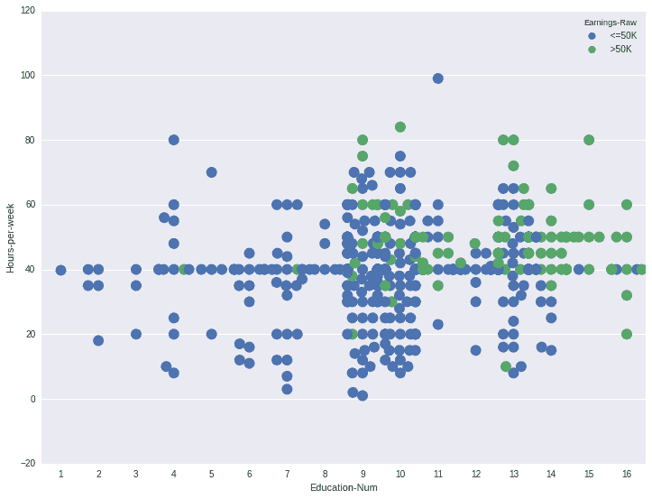
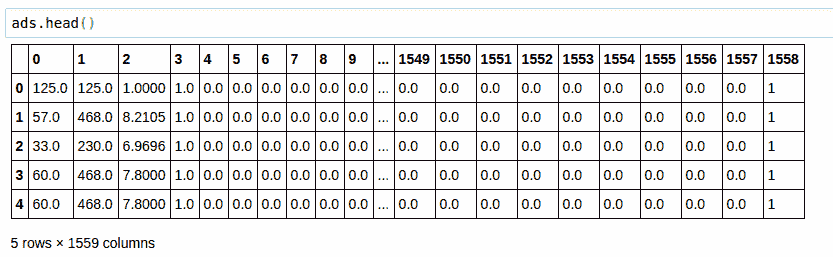

# 特征和 scikit-learn 转换器

我们迄今为止所使用的数据集都是以*特征*的形式描述的。在前一章中，我们使用了一个以事务为中心的数据集。然而，这最终只是以不同格式表示基于特征的数据的另一种方式。

还有许多其他类型的数据集，包括文本、图像、声音、电影，甚至是真实物体。大多数数据挖掘算法都依赖于具有数值或分类特征。这意味着在我们将这些类型输入数据挖掘算法之前，我们需要一种方法来表示它们。我们称这种表示为**模型**。

在本章中，我们将讨论如何提取数值和分类特征，并在我们有这些特征时选择最佳特征。我们将讨论一些常见的特征提取模式和技巧。适当地选择你的模型对于数据挖掘练习的结果至关重要，比分类算法的选择更为重要。

本章介绍的关键概念包括：

+   从数据集中提取特征

+   为你的数据创建模型

+   创建新特征

+   选择好的特征

+   为自定义数据集创建自己的转换器

# 特征提取

提取特征是数据挖掘中最关键的任务之一，它通常比数据挖掘算法的选择对最终结果的影响更大。不幸的是，没有一成不变的规则来选择能够导致高性能数据挖掘的特征。特征的选择决定了你用来表示数据的模型。

模型创建是数据挖掘科学变得更加像艺术的地方，这也是为什么执行数据挖掘的自动化方法（有几种此类方法）专注于算法选择而不是模型创建。创建好的模型依赖于直觉、领域专业知识、数据挖掘经验、试错，有时还需要一点运气。

# 在模型中呈现现实

基于我们在本书中迄今为止所做的工作，很容易忘记我们进行数据挖掘的原因是影响现实世界中的对象，而不仅仅是操作一个值矩阵。并非所有数据集都是以特征的形式呈现的。有时，一个数据集可能仅仅是由某个作者所写的所有书籍组成。有时，它可能是 1979 年发布的每部电影的影片。在其他时候，它可能是一个有趣的历史文物的图书馆收藏。

从这些数据集中，我们可能想要执行数据挖掘任务。对于书籍，我们可能想知道作者写了哪些不同的类别。在电影中，我们可能希望看到女性是如何被描绘的。在历史文物中，我们可能想知道它们是来自一个国家还是另一个国家。仅仅将这些原始数据集输入决策树并查看结果是不可能的。

为了让数据挖掘算法在这里帮助我们，我们需要将这些数据表示为**特征**。特征是创建模型的一种方式，而模型以数据挖掘算法能够理解的方式提供对现实的一种近似。因此，模型只是现实世界某个方面的简化版本。例如，象棋游戏就是历史战争的一种简化模型（以游戏形式）。

选择特征还有另一个优点：它们将现实世界的复杂性简化为更易于管理的模型。

想象一下，要向一个对物品没有任何背景知识的人准确、全面地描述一个现实世界对象需要多少信息。你需要描述其大小、重量、质地、成分、年龄、缺陷、用途、起源等等。

由于现实对象的复杂性超出了当前算法的处理能力，我们使用这些更简单的模型来代替。

这种简化也使我们在数据挖掘应用中的意图更加集中。在后面的章节中，我们将探讨聚类及其至关重要的应用。如果你输入随机特征，你将得到随机的结果。

然而，这种简化也有缺点，因为它减少了细节，或者可能移除了我们希望进行数据挖掘的某些事物的良好指标。

我们应该始终思考如何以模型的形式表示现实。而不仅仅是使用过去使用过的方法，你需要考虑数据挖掘活动的目标。你试图实现什么？在第三章《使用决策树预测体育比赛胜者》中，我们通过思考目标（预测胜者）并使用一些领域知识来提出新特征的想法来创建特征。

并非所有特征都需要是数值或分类的。已经开发出可以直接在文本、图和其他数据结构上工作的算法。不幸的是，这些算法超出了本书的范围。在本书中，以及在你的数据挖掘生涯中，我们主要使用数值或分类特征。

*Adult*数据集是使用特征来尝试对复杂现实进行建模的一个很好的例子。在这个数据集中，目标是估计某人每年是否赚超过$50,000。

要下载数据集，请导航到[`archive.ics.uci.edu/ml/datasets/Adult`](http://archive.ics.uci.edu/ml/datasets/Adult)并点击数据文件夹链接。将`adult.data`和`adult.names`下载到你的数据文件夹中名为 Adult 的目录下。

这个数据集将一个复杂任务描述为特征。这些特征描述了个人、他们的环境、他们的背景以及他们的生活状况。

为本章打开一个新的 Jupyter Notebook，设置数据文件名，并使用 pandas 加载数据：

```py
import os
import pandas as pd
data_folder = os.path.join(os.path.expanduser("~"), "Data", "Adult")
adult_filename = os.path.join(data_folder, "adult.data")

adult = pd.read_csv(adult_filename, header=None, names=["Age", "Work-Class", "fnlwgt", 
                     "Education", "Education-Num", "Marital-Status", "Occupation",
                     "Relationship", "Race", "Sex", "Capital-gain", "Capital-loss",
                     "Hours-per-week", "Native-Country", "Earnings-Raw"])

```

大部分代码与前面的章节相同。

不想输入那些标题名称？别忘了你可以从 Packt Publishing 下载代码，或者从本书作者的 GitHub 仓库下载：

[`github.com/dataPipelineAU/LearningDataMiningWithPython2`](https://github.com/dataPipelineAU/LearningDataMiningWithPython2)

成年文件本身在文件末尾包含两个空白行。默认情况下，pandas 将倒数第二个换行符解释为一个空行（但有效）。为了删除它，我们删除任何包含无效数字的行（使用 `inplace` 只确保影响相同的 Dataframe，而不是创建一个新的 Dataframe）：

```py
adult.dropna(how='all', inplace=True)

```

查看数据集，我们可以从 `adult.columns` 中看到各种特征：

```py
adult.columns

```

结果显示了存储在 pandas Index 对象内的每个特征名称：

```py
Index(['Age', 'Work-Class', 'fnlwgt', 'Education', 
'Education-Num', 'Marital-Status', 'Occupation', 'Relationship', 
'Race', 'Sex', 'Capital-gain', 'Capital-loss', 'Hours-per-week', 
'Native-Country', 'Earnings-Raw'], dtype='object')

```

# 常见的特征模式

虽然有数百万种创建模型的方法，但不同学科中都有一些常见的模式。然而，选择合适的特征是棘手的，值得考虑一个特征可能如何与最终结果相关。正如一句著名的谚语所说，*不要以貌取人*——如果你对书中的信息感兴趣，考虑书的尺寸可能并不值得。

一些常用的特征专注于研究现实世界对象的物理属性，例如：

+   物体的空间属性，如长度、宽度和高度

+   物体的重量和/或密度

+   物体或其组件的年龄

+   物体的类型

+   物体的质量

其他特征可能依赖于对象的使用或历史：

+   物体的生产者、出版商或创作者

+   制造年份

其他特征以对象的部分来描述数据集：

+   给定子组件的频率，例如一本书中的单词

+   子组件的数量和/或不同子组件的数量

+   子组件的平均大小，例如平均句子长度

有序特征使我们能够对相似值进行排序、排序和分组。正如我们在前面的章节中看到的，特征可以是数值的或分类的。

数值特征通常被描述为有序的。例如，三个人，Alice、Bob 和 Charlie，可能有 1.5 米、1.6 米和 1.7 米的身高。我们会说 Alice 和 Bob 在身高上比 Alice 和 Charlie 更相似。

我们在上一个部分加载的 Adult 数据集包含连续的有序特征的例子。例如，每周工作小时数特征跟踪人们每周工作多少小时。某些操作适用于此类特征。包括计算平均值、标准差、最小值和最大值。pandas 中有一个函数可以提供此类类型的一些基本摘要统计信息：

```py
adult["Hours-per-week"].describe()

```

结果告诉我们关于这个特征的一些信息：

```py
count 32561.000000
mean 40.437456
std 12.347429
min 1.000000
25% 40.000000
50% 40.000000
75% 45.000000
max 99.000000
dtype: float64

```

这些操作中的一些对于其他特征来说没有意义。例如，计算这些人的教育状态总和是没有意义的。相比之下，计算每个在线商店顾客的订单总数是有意义的。

还有一些特征不是数值的，但仍然是序数的。成年数据集中的教育特征就是这样一个例子。例如，学士学位比完成高中教育有更高的教育地位，而完成高中教育比没有完成高中教育有更高的地位。对这些值计算平均值并不完全合理，但我们可以通过取中位数来创建一个近似值。数据集提供了一个有用的特征，`Education-Num`，它分配一个基本上等同于完成教育年数的数字。这使得我们可以快速计算中位数：

```py
adult["Education-Num"].median()

```

结果是 10，即完成高中后的一年。如果我们没有这个，我们可以通过在教育值上创建一个排序来计算中位数。

特征也可以是分类的。例如，一个球可以是网球、板球、足球或其他任何类型的球。分类特征也被称为名义特征。对于名义特征，其值要么相同，要么不同。虽然我们可以根据大小或重量对球进行排序，但仅仅类别本身并不足以比较事物。网球不是板球，它也不是足球。我们可以争论网球在大小上可能更接近板球（比如说），但仅仅类别本身并不能区分这一点——它们要么相同，要么不同。

我们可以使用独热编码将分类特征转换为数值特征，正如我们在第三章中看到的，即*使用决策树预测体育比赛胜者*。对于上述球类的类别，我们可以创建三个新的二元特征：是否是网球、是否是板球和是否是足球。这个过程就是我们第三章中使用的独热编码，即*使用决策树预测体育比赛胜者*。对于一个网球，向量将是 `[1, 0, 0]`。板球的值是 `[0, 1, 0]`，而足球的值是 `[0, 0, 1]`。这些是二元特征，但许多算法可以将它们用作连续特征。这样做的一个关键原因是可以轻松地进行直接的数值比较（例如计算样本之间的距离）。

成年数据集包含几个分类特征，其中工作类别就是一个例子。虽然我们可以争论某些值可能比其他值有更高的等级（例如，有工作的人可能比没有工作的人有更好的收入），但对于所有值来说这并不合理。例如，为国家政府工作的人并不比在私营部门工作的人更有可能或更不可能有更高的收入。

我们可以使用`unique()`函数在数据集中查看该特征的唯一值：

```py
adult["Work-Class"].unique()

```

结果显示了该列的唯一值：

```py
array([' State-gov', ' Self-emp-not-inc', ' Private', ' Federal-gov',
' Local-gov', ' ?', ' Self-emp-inc', ' Without-pay',
' Never-worked', nan], dtype=object)

```

在前面的数据中存在一些缺失值，但它们不会影响本例中的计算。您也可以使用`adult.value_counts()`函数查看每个值出现的频率。

在使用新的数据集时，另一个非常有用的步骤是可视化它。以下代码将创建一个群组图，展示教育和工作时间与最终分类（通过颜色标识）之间的关系：

```py
%matplotlib inline
import seaborn as sns
from matplotlib import pyplot as plt
sns.swarmplot(x="Education-Num", y="Hours-per-week", hue="Earnings-Raw", data=adult[::50])

```



在上面的代码中，我们通过使用`adult[::50]`数据集索引来采样数据集，以显示每 50 行，设置此为`adult`将导致显示所有样本，但这可能会使图表难以阅读。

同样，我们可以通过称为**离散化**的过程将数值特征转换为分类特征，正如我们在第一章“数据挖掘入门”中看到的。我们可以将身高超过 1.7 米的人称为高，身高低于 1.7 米的人称为矮。这给我们一个分类特征（尽管仍然是有序的）。我们在这里会丢失一些数据。例如，两个身高分别为 1.69 米和 1.71 米的人将属于两个不同的类别，并且被我们的算法认为差异很大。相比之下，一个身高 1.2 米的人将被认为与身高 1.69 米的人大致相同！这种细节的丢失是离散化的副作用，这是我们创建模型时需要处理的问题。

在成人数据集中，我们可以创建一个`LongHours`特征，它告诉我们一个人是否每周工作超过 40 小时。这把我们的连续特征（每周小时数）转换为一个分类特征，如果小时数超过 40 则为 True，否则为 False：

`adult["LongHours"] = adult["Hours-per-week"] > 40`

# 创建良好的特征

由于建模的简化，这是我们没有可以简单应用于任何数据集的数据挖掘方法的关键原因。一个优秀的数据挖掘从业者将需要或获得他们在应用数据挖掘领域的领域知识。他们将研究问题、可用数据，并提出一个代表他们试图实现的目标的模型。

例如，一个人的身高特征可能描述一个人的一个方面，比如他们打篮球的能力，但可能无法很好地描述他们的学术表现。如果我们试图预测一个人的成绩，我们可能不会麻烦去测量每个人的身高。

这就是数据挖掘比科学更具艺术性的地方。提取良好的特征是困难的，这也是一个重要且持续的研究课题。选择更好的分类算法可以提高数据挖掘应用的表现，但选择更好的特征通常是一个更好的选择。

在所有数据挖掘应用中，你应该在开始设计寻找目标的方法之前，首先概述你正在寻找的内容。这将决定你希望达到的特征类型，你可以使用的算法类型，以及最终结果中的期望。

# 特征选择

在初步建模之后，我们通常会有一大批特征可供选择，但我们希望只选择一小部分。有许多可能的原因：

+   **降低复杂性**：当特征数量增加时，许多数据挖掘算法需要显著更多的时间和资源。减少特征数量是使算法运行更快或使用更少资源的好方法。

+   **降低噪声**：添加额外的特征并不总是导致更好的性能。额外的特征可能会使算法混淆，在训练数据中找到没有实际意义的关联和模式。这在较小的和较大的数据集中都很常见。只选择合适的特征是减少没有实际意义的随机关联的好方法。

+   **创建可读的模型**：虽然许多数据挖掘算法乐于为具有数千个特征的模型计算答案，但结果可能对人类来说难以解释。在这些情况下，使用较少的特征并创建一个人类可以理解的模式可能是有价值的。

一些分类算法可以处理前面描述的问题。确保数据正确，并确保特征能够有效地描述你正在建模的数据集，这仍然可以帮助算法。

我们可以进行一些基本的测试，例如确保特征至少是不同的。如果一个特征的所有值都相同，它就不能为我们提供额外的信息来执行我们的数据挖掘。

例如，`scikit-learn`中的`VarianceThreshold`转换器将删除任何在值中至少没有最小变异水平的特征。为了展示这是如何工作的，我们首先使用 NumPy 创建一个简单的矩阵：

```py
import numpy as np
X = np.arange(30).reshape((10, 3))

```

结果是 0 到 29 的数字，分为三列和 10 行。这代表了一个包含 10 个样本和三个特征的合成数据集：

```py
array([[ 0, 1, 2],
[ 3, 4, 5],
[ 6, 7, 8],
[ 9, 10, 11],
[12, 13, 14],
[15, 16, 17],
[18, 19, 20],
[21, 22, 23],
[24, 25, 26],
[27, 28, 29]])

```

然后，我们将整个第二列/特征设置为值 1：

```py
X[:,1] = 1

```

结果在第一行和第三行有很多变异，但在第二行没有变异：

```py
array([[ 0, 1, 2],
[ 3, 1, 5],
[ 6, 1, 8],
[ 9, 1, 11],
[12, 1, 14],
[15, 1, 17],
[18, 1, 20],
[21, 1, 23],
[24, 1, 26],
[27, 1, 29]])

```

我们现在可以创建一个`VarianceThreshold`转换器并将其应用于我们的数据集：

```py
from sklearn.feature_selection import VarianceThreshold
vt = VarianceThreshold()
Xt = vt.fit_transform(X)

```

现在，结果`Xt`没有第二列：

```py
array([[ 0, 2],
[ 3, 5],
[ 6, 8],
[ 9, 11],
[12, 14],
[15, 17],
[18, 20],
[21, 23],
[24, 26],
[27, 29]])

```

我们可以通过打印`vt.variances_`属性来观察每列的变异：

```py
print(vt.variances_)

```

结果显示，虽然第一列和第三列至少包含一些信息，但第二列没有变异：

```py
array([ 74.25, 0\. , 74.25])

```

当第一次看到数据时，运行这样一个简单明了的测试总是好的。没有变异的特征不会为数据挖掘应用增加任何价值；然而，它们可能会减慢算法的性能并降低其有效性。

# 选择最佳单个特征

如果我们有多个特征，找到最佳子集的问题是一个困难任务。它与解决数据挖掘问题本身相关，需要多次解决。正如我们在第四章中看到的，*使用亲和分析推荐电影*，随着特征数量的增加，基于子集的任务呈指数增长。这种所需时间的指数增长也适用于找到最佳特征子集。

解决这个问题的基本方法不是寻找能够良好协同工作的子集，而是仅仅找到最佳的单个特征。这种单变量特征选择根据特征单独表现的好坏给出一个分数。这通常用于分类任务，我们通常测量变量和目标类别之间的某种关联。

scikit-learn 包提供了一系列用于执行单变量特征选择的转换器。它们包括 SelectKBest，它返回性能最好的 k 个特征，以及 SelectPercentile，它返回前 R% 的特征。在这两种情况下，都有多种计算特征质量的方法。

有许多不同的方法来计算单个特征与类别值的相关性有多有效。常用的方法之一是卡方 (*χ2*) 测试。其他方法包括互信息和熵。

我们可以通过使用 Adult 数据集来观察单变量测试的实际操作。首先，我们从 pandas DataFrame 中提取数据集和类值。我们得到特征的选择：

```py
X = adult[["Age", "Education-Num", "Capital-gain", "Capital-loss", "Hours-per-week"]].values

```

我们还将通过测试 Earnings-Raw 值是否超过 $50,000 来创建一个目标类数组。如果是，则类为 True。否则，为 False。让我们看看代码：

```py
y = (adult["Earnings-Raw"] == ' >50K').values

```

接下来，我们使用 chi2 函数和 SelectKBest 转换器创建我们的转换器：

```py
from sklearn.feature_selection import SelectKBest
from sklearn.feature_selection import chi2
transformer = SelectKBest(score_func=chi2, k=3)

```

运行 `fit_transform` 将调用 fit 然后使用相同的数据集进行转换。

结果将创建一个新的数据集，只选择最好的三个特征。

让我们看看代码：

```py
Xt_chi2 = transformer.fit_transform(X, y)

```

结果矩阵现在只包含三个特征。我们还可以获取分数

对于每一列，这使我们能够找出哪些特征被使用了。让我们看看

代码如下：

```py
print(transformer.scores_)

```

打印的结果给出了这些分数：

```py
[ 8.60061182e+03 2.40142178e+03 8.21924671e+07 1.37214589e+066.47640900e+03]

```

最大的值是第一列、第三列和第四列，分别对应年龄、资本收益和资本损失特征。基于单变量特征选择，这些是最好的选择特征。

如果您想了解更多关于 Adult 数据集中的特征的信息，请查看随数据集一起提供的 adult.names 文件以及它引用的学术论文。

我们还可以实现其他相关性，例如皮尔逊相关系数。这在 SciPy 中实现，SciPy 是一个用于科学计算的库（scikit-learn 使用它作为基础）。

如果 scikit-learn 在您的计算机上运行，SciPy 也在运行。为了使这个示例工作，您不需要安装任何其他东西。

首先，我们从 SciPy 中导入 `pearsonr` 函数：

```py
from scipy.stats import pearsonr

```

上述函数几乎符合在 scikit-learn 的单变量转换器中使用的接口。该函数需要接受两个数组（在我们的例子中是 x 和 y）作为参数，并返回两个数组，每个特征的得分和相应的 p 值。我们之前使用的 chi2 函数只使用了所需的接口，这使得我们可以直接将其传递给 SelectKBest。

SciPy 中的 pearsonr 函数接受两个数组；然而，它接受的 X 数组只有一个维度。我们将编写一个包装函数，使我们能够使用这个函数处理像我们这样的多元数组。让我们看看代码：

```py
def multivariate_pearsonr(X, y):
    scores, pvalues = [], []
    for column in range(X.shape[1]):
        # Compute the Pearson correlation for this column only
        cur_score, cur_p = pearsonr(X[:,column], y)
        # Record both the score and p-value.
        scores.append(abs(cur_score))
        pvalues.append(cur_p)
    return (np.array(scores), np.array(pvalues))

```

皮尔逊值可能在-1 和 1 之间。1 的值意味着两个变量之间有完美的相关性，而-1 的值意味着完美的负相关性，即一个变量的高值对应另一个变量的低值，反之亦然。这样的特征非常有用。因此，我们在得分数组中存储了绝对值，而不是原始的有符号值。

现在，我们可以像以前一样使用 transformer 类，通过皮尔逊相关系数来对特征进行排序：

```py
transformer = SelectKBest(score_func=multivariate_pearsonr, k=3)
Xt_pearson = transformer.fit_transform(X, y)
print(transformer.scores_)

```

这会返回一组不同的特征！这样选择的特征是第一列、第二列和第五列：年龄、教育和每周工作小时数。这表明，并没有一个明确的答案来决定哪些是最好的特征——它取决于所使用的指标和所进行的过程。

我们可以通过运行它们通过分类器来查看哪个特征集更好。请注意，结果仅表明对于特定的分类器或特征组合，哪个子集更好——在数据挖掘中，很少有一种方法在所有情况下都严格优于另一种方法！让我们看看代码：

```py
from sklearn.tree import DecisionTreeClassifier
from sklearn.cross_validation import cross_val_score
clf = DecisionTreeClassifier(random_state=14)
scores_chi2 = cross_val_score(clf, Xt_chi2, y, scoring='accuracy')
scores_pearson = cross_val_score(clf, Xt_pearson, y, scoring='accuracy')

print("Chi2 score: {:.3f}".format(scores_chi2.mean()))
print("Pearson score: {:.3f}".format(scores_pearson.mean()))

```

这里的 chi2 平均值为 0.83，而皮尔逊分数较低，为 0.77。对于这个组合，chi2 返回更好的结果！

记住这个特定数据挖掘活动的目标是值得的：预测财富。通过结合良好的特征和特征选择，我们只需使用一个人的三个特征就能达到 83%的准确率！

# 特征创建

有时候，仅仅从我们所拥有的特征中选择特征是不够的。我们可以从已有的特征以不同的方式创建特征。我们之前看到的独热编码方法就是这样一个例子。而不是有选项 A、B 和 C 的类别特征，我们会创建三个新的特征：*它是 A 吗？*、*它是 B 吗？*、*它是 C 吗？*。

创建新特征可能看起来是不必要的，并且没有明显的益处——毕竟，信息已经在数据集中，我们只需要使用它。然而，一些算法在特征高度相关或存在冗余特征时可能会遇到困难。它们也可能在存在冗余特征时遇到困难。因此，有各种方法可以从我们已有的特征中创建新特征。

我们将加载一个新的数据集，因此现在是开始一个新的 Jupyter Notebook 的好时机。从 [`archive.ics.uci.edu/ml/datasets/Internet+Advertisements`](http://archive.ics.uci.edu/ml/datasets/Internet+Advertisements) 下载 Advertisements 数据集并将其保存到您的数据文件夹中。

接下来，我们需要使用 pandas 加载数据集。首先，我们设置数据的文件名，就像往常一样：

```py
import os
import numpy as np
import pandas as pd
data_folder = os.path.join(os.path.expanduser("~"), "Data")
data_filename = os.path.join(data_folder, "Ads", "ad.data")

```

这个数据集有几个问题，阻止我们轻松地加载数据。您可以通过尝试使用 `pd.read_csv` 加载数据集来查看这些问题。首先，前几个特征是数值型的，但 pandas 会将它们加载为字符串。为了解决这个问题，我们需要编写一个转换函数，该函数将尝试将字符串转换为数字。否则，我们将得到一个 **Not a Number** (NaN) - 一个无效值，它是一个特殊值，表示该值无法解释为数字。在其他编程语言中，它类似于 none 或 null。

这个数据集的另一个问题是某些值缺失。这些值在数据集中用字符串 ? 表示。幸运的是，问号不能转换为浮点数，因此我们可以使用相同的概念将它们转换为 NaN。在后续章节中，我们将探讨处理此类缺失值的其他方法。

我们将创建一个函数来完成这个转换。它尝试将数字转换为浮点数，如果失败，则返回 NumPy 的特殊 NaN 值，该值可以存储在浮点数的位置：

```py
def convert_number(x):
    try:
        return float(x)
    except ValueError:
        return np.nan

```

现在，我们创建一个字典用于转换。我们希望将所有特征转换为浮点数：

```py
converters = {}
for i in range(1558):
    converters[i] = convert_number

```

此外，我们希望将最后一列，即类别列（列索引 #1558），设置为二进制特征。在 Adult 数据集中，我们为此创建了一个新特征。在加载数据集时，我们将转换该特征：

```py
converters[1558] = lambda x: 1 if x.strip() == "ad." else 0

```

现在，我们可以使用 `read_csv` 加载数据集。我们使用 `converters` 参数将自定义转换传递给 pandas：

```py
ads = pd.read_csv(data_filename, header=None, converters=converters)

```

结果数据集相当大，有 1,559 个特征和超过 3,000 行。以下是一些特征值，前五个，通过在新的单元格中插入 `ads.head()` 打印出来：



这个数据集描述了网站上的图像，目标是确定给定的图像是否是广告。

这些数据集中的特征值没有很好地通过其标题来描述。伴随 ad.data 文件的两个文件提供了更多信息：`ad.DOCUMENTATION` 和 `ad.names`。前三个特征是图像的高度、宽度和尺寸比。最后一个特征如果是广告则为 1，如果不是则为 0。

其他特征表示 URL、alt 文本或图像标题中是否存在某些单词。这些单词，如赞助商一词，用于确定图像是否可能是广告。许多特征在很大程度上是其他特征的组合，因此这个数据集有很多冗余信息。

在我们的数据集加载到`pandas`后，我们现在将提取用于分类算法的`x`和`y`数据。`x`矩阵将是我们的 DataFrame 中的所有列，除了最后一列。相比之下，`y`数组将只有最后一列，特征`1558.`。在那之前，我们通过删除任何包含 NaN 值的行来简化我们的数据集（只是为了本章的目的）。让我们看看代码：

```py
ads.dropna(inplace=True)
X = ads.drop(1558, axis=1).values
y = ads[1558]

```

由于此命令，删除了 1000 多行，这对于我们的练习来说是可以接受的。对于实际应用，如果你能帮助避免数据丢失，你不想丢弃数据——相反，你可以使用插值或值替换来填充 NaN 值。例如，你可以用该列的平均值替换任何缺失值。

# 主成分分析

在某些数据集中，特征之间高度相关。例如，在单档的卡丁车中，速度和燃油消耗会高度相关。虽然对于某些应用来说，找到这些相关性可能是有用的，但数据挖掘算法通常不需要冗余信息。

广告数据集具有高度相关的特征，因为许多关键词在 alt 文本和标题中重复。

主成分分析（PCA）算法旨在找到描述数据集所需信息更少的特征组合。它旨在发现*主成分*，即不相互关联且解释数据信息——特别是方差——的特征。这意味着我们通常可以在更少的特征中捕捉到数据集的大部分信息。

我们应用 PCA 就像应用任何其他转换器一样。它有一个关键参数，即要找到的组件数量。默认情况下，它将产生与原始数据集中特征数量一样多的特征。然而，这些主成分是按顺序排列的——第一个特征解释了数据集中最大的方差，第二个稍微少一些，以此类推。因此，只需找到前几个特征就足以解释数据集的大部分内容。让我们看看代码：

```py
from sklearn.decomposition import PCA
pca = PCA(n_components=5)
Xd = pca.fit_transform(X)

```

结果矩阵 Xd 只有五个特征。然而，让我们看看每个特征解释的方差量：

```py
np.set_printoptions(precision=3, suppress=True)
pca.explained_variance_ratio_

```

结果，`array([ 0.854, 0.145, 0.001, 0\. , 0\. ])` 显示我们第一个特征解释了数据集中 85.4%的方差，第二个解释了 14.5%，以此类推。到第四个特征时，特征中包含的方差不到百分之一的十分之一。其他 1,553 个特征解释的方差更少（这是一个有序数组）。

使用 PCA 转换数据的缺点是这些特征通常是其他特征的复杂组合。例如，前面代码中的第一个特征以`[-0.092, -0.995, -0.024],`开始，即用-0.092 乘以原始数据集中的第一个特征，用-0.995 乘以第二个，用-0.024 乘以第三个。这种特征有 1,558 个这样的值，每个原始数据集都有一个（尽管许多是零）。这种特征对人类来说是不可区分的，并且在没有大量使用经验的情况下很难从中获取相关信息。

使用 PCA 可以导致模型不仅近似原始数据集，还可以提高分类任务中的性能：

```py
clf = DecisionTreeClassifier(random_state=14)
scores_reduced = cross_val_score(clf, Xd, y, scoring='accuracy')

```

得到的分数是 0.9356，这比我们原始模型的分数略高。PCA 并不总是能带来这样的好处，但这种情况比不常见。

我们在这里使用 PCA 来减少数据集中的特征数量。一般来说，你不应该在数据挖掘实验中用它来减少过拟合。原因在于 PCA 没有考虑类别。一个更好的解决方案是使用正则化。有关介绍和代码，请参阅[`blog.datadive.net/selecting-good-features-part-ii-linear-models-and-regularization/`](http://blog.datadive.net/selecting-good-features-part-ii-linear-models-and-regularization/)

另一个优点是 PCA 允许你绘制那些你否则难以可视化的数据集。例如，我们可以绘制 PCA 返回的前两个特征。

首先，我们告诉我们的 Notebook 显示内联图表：

```py
%matplotlib inline
from matplotlib import pyplot as plt

```

接下来，我们获取我们数据集中的所有不同类别（只有两个：是广告还是不是广告）：

```py
classes = set(y)

```

我们还为这些类别中的每一个分配了颜色：

```py
colors = ['red', 'green']

```

我们使用 zip 同时遍历两个列表，然后提取该类别的所有样本，并用适合该类别的颜色绘制它们：

```py
for cur_class, color in zip(classes, colors):
mask = (y == cur_class)
    plt.scatter(Xd[mask,0], Xd[mask,1], marker='o', color=color, label=int(cur_class))

```

最后，在循环外部，我们创建一个图例并显示图表，显示每个类别的样本出现在哪里：

```py
plt.legend()
plt.show()

```


# 创建你自己的变换器

随着数据集的复杂性和类型的改变，你可能会发现找不到一个现成的特征提取变换器来满足你的需求。我们将在第七章中看到一个例子，*使用图挖掘遵循推荐*，在那里我们从图中创建新的特征。

变换器类似于一个转换函数。它接收一种形式的数据作为输入，并返回另一种形式的数据作为输出。变换器可以使用某些训练数据集进行训练，并且这些训练好的参数可以用来转换测试数据。

变换器 API 非常简单。它接收特定格式的数据作为输入，并返回另一种格式（可以是与输入相同的格式或不同的格式）的数据作为输出。对程序员的要求不多。

# 变换器 API

变换器有两个关键功能：

+   `fit():` 这个函数接受一个训练数据集作为输入并设置内部参数。

+   `transform():` 这个函数执行实际的转换。它可以接受训练数据集，或者格式相同的新的数据集。

`fit()` 和 `transform()` 函数都应该接受相同的数据类型作为输入，但 `transform()` 可以返回不同类型的数据，而 `fit()` 总是返回 self。

我们将创建一个简单的转换器来展示 API 的实际应用。这个转换器将接受一个 NumPy 数组作为输入，并根据平均值对其进行离散化。任何高于平均值的（训练数据的平均值）将被赋予值 1，任何低于或等于平均值的将被赋予值 0。

我们使用 pandas 对 Adult 数据集进行了类似的转换：我们取每周工作小时数特征，如果每周工作小时数超过 40 小时，就创建一个 LongHours 特征。这个转换器有两个不同之处。首先，代码将符合 scikit-learn API，允许我们在管道中使用它。其次，代码将学习平均值，而不是将其作为固定值（如 LongHours 示例中的 40）。

# 实现转换器

首先，打开我们用于 Adult 数据集的 Jupyter Notebook。然后，点击 Cell 菜单项并选择 Run All。这将重新运行所有单元格，确保笔记本是最新的。

首先，我们导入 TransformerMixin，这为我们设置了 API。虽然 Python 没有严格的接口（与 Java 等语言相反），但使用这样的 mixin 允许 scikit-learn 确定该类实际上是一个转换器。我们还需要导入一个检查输入是否为有效类型的函数。我们很快就会使用它。

让我们看看代码：

```py
from sklearn.base import TransformerMixin
from sklearn.utils import as_float_array

```

让我们看一下我们的类的整体结构，然后我们将回顾一些细节：

```py
class MeanDiscrete(TransformerMixin):
    def fit(self, X, y=None):
        X = as_float_array(X)
        self.mean = X.mean(axis=0)
        return self

    def transform(self, X, y=None):
        X = as_float_array(X)
        assert X.shape[1] == self.mean.shape[0]
        return X > self.mean

```

我们将在 fit 方法中通过计算`X.mean(axis=0)`来学习每个特征的均值，然后将其存储为对象属性。之后，fit 函数返回 self，符合 API（scikit-learn 使用此功能允许链式调用函数）。

在拟合后，transform 函数接受一个具有相同数量特征的矩阵（通过`assert`语句确认），并简单地返回给定特征的哪些值高于平均值。

现在我们已经构建了类，我们可以创建这个类的实例，并使用它来转换我们的 X 数组：

```py
mean_discrete = MeanDiscrete()
X_mean = mean_discrete.fit_transform(X)

```

尝试将这个转换器实现到一个工作流程中，既使用 Pipeline 也使用不使用 Pipeline。你会发现，通过符合转换器 API，它非常简单地在内置的 scikit-learn 转换器对象中替代使用。

# 单元测试

在创建自己的函数和类时，始终进行单元测试是一个好主意。单元测试旨在测试代码的单个单元。在这种情况下，我们想要测试我们的转换器是否按预期工作。

好的测试应该是可以独立验证的。确认测试合法性的一个好方法是使用另一种计算机语言或方法来执行计算。在这种情况下，我使用了 Excel 来创建一个数据集，然后计算每个单元格的平均值。然后这些值被转移到单元测试中。

单元测试通常也应该小巧且运行速度快。因此，所使用的数据应该尽可能小。我用于创建测试的数据集存储在之前的 Xt 变量中，我们将在测试中重新创建它。这两个特征的均值分别是 13.5 和 15.5。

为了创建我们的单元测试，我们从 NumPy 的测试中导入`assert_array_equal`函数，该函数检查两个数组是否相等：

`from numpy.testing import assert_array_equal`

接下来，我们创建我们的函数。重要的是测试的名称必须以 test_ 开头，

因为这个命名约定用于自动查找和运行测试的工具。我们还设置了我们的测试数据：

```py
def test_meandiscrete():
    X_test = np.array([[ 0, 2],
                       [ 3, 5],
                       [ 6, 8],
                       [ 9, 11],
                       [12, 14],
                       [15, 17],
                       [18, 20],
                       [21, 23],
                       [24, 26],
                       [27, 29]])
    # Create an instance of our Transformer
    mean_discrete = MeanDiscrete()
    mean_discrete.fit(X_test)
    # Check that the computed mean is correct
    assert_array_equal(mean_discrete.mean, np.array([13.5, 15.5]))
    # Also test that transform works properly
    X_transformed = mean_discrete.transform(X_test)
    X_expected = np.array([[ 0, 0],
                           [ 0, 0], 
                           [ 0, 0],
                           [ 0, 0],
                           [ 0, 0],
                           [ 1, 1],
                           [ 1, 1],
                           [ 1, 1],
                           [ 1, 1],
                           [ 1, 1]])
    assert_array_equal(X_transformed, X_expected)

```

我们可以通过直接运行函数本身来执行测试：

```py
test_meandiscrete()

```

如果没有错误，那么测试就顺利运行了！你可以通过故意更改一些测试以使值不正确，并确认测试失败来验证这一点。记住要改回来，以便测试通过！

如果我们有多个测试，使用像 py.test 或 nose 这样的测试框架来运行我们的测试将是有价值的。使用这样的框架超出了本书的范围，但它们可以管理运行测试、记录失败并向程序员提供反馈，以帮助改进代码。

# 将所有这些放在一起

现在我们已经测试了一个转换器，是时候将其投入使用了。利用我们迄今为止所学的内容，我们创建了一个 Pipeline，将第一步设置为 MeanDiscrete 转换器，第二步设置为决策树分类器。然后我们运行交叉验证并打印出结果。让我们看看代码：

```py
from sklearn.pipeline import Pipeline
pipeline = Pipeline([('mean_discrete', MeanDiscrete()), ('classifier', DecisionTreeClassifier(random_state=14))])
scores_mean_discrete = cross_val_score(pipeline, X, y, scoring='accuracy')
print("Mean Discrete performance: {0:.3f}".format(scores_mean_discrete.mean()))

```

结果是 0.917，虽然没有之前好，但对于一个简单的二进制特征模型来说已经非常不错了。

# 摘要

在本章中，我们探讨了特征和转换器以及它们如何在数据挖掘流程中使用。我们讨论了什么是一个好的特征以及如何从标准集中算法性地选择好的特征。然而，创建好的特征更多的是艺术而非科学，通常需要领域知识和经验。

我们然后使用一个允许我们在 scikit-learn 的辅助函数中使用它的接口创建了自己的转换器。我们将在后面的章节中创建更多的转换器，以便我们可以使用现有函数进行有效的测试。

为了将本章学到的知识进一步深化，我建议您注册到在线数据挖掘竞赛网站 [Kaggle.com](http://Kaggle.com) 并尝试一些竞赛。他们推荐的起点是泰坦尼克号数据集，这可以让您练习本章中特征创建的方面。许多特征都不是数值型的，需要您在应用数据挖掘算法之前将它们转换为数值特征。

在下一章中，我们将在文本文档语料库上使用特征提取。文本有很多转换器和特征类型，每种都有其优缺点。
