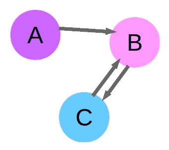
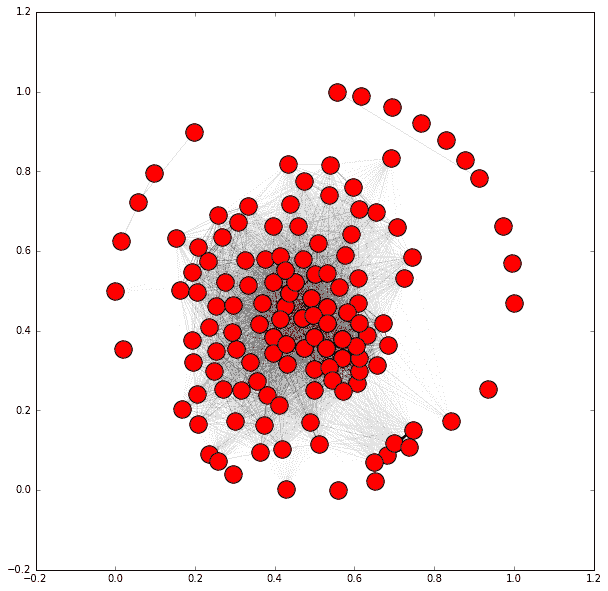
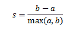

# 第七章：使用图挖掘进行推荐

图表可以用来表示各种现象。这尤其适用于在线社交网络和**物联网**（**IoT**）。图挖掘是一个大产业，例如 Facebook 这样的网站就是通过在图上进行的数据分析实验来运行的。

社交媒体网站建立在参与度之上。没有活跃的新闻源或有趣的朋友关注，用户不会参与网站。相比之下，有更多有趣朋友和**关注者**的用户参与度更高，看到更多广告。这导致网站的收入流更大。

在本章中，我们探讨如何在图上定义相似性，以及如何在数据挖掘环境中使用它们。这同样基于现象模型。我们研究了一些基本的图概念，如子图和连通分量。这导致了对聚类分析的研究，我们将在第十章中更深入地探讨，即第十章<q>，*聚类新闻文章*。</q>

本章涵盖的主题包括：

+   通过聚类数据来寻找模式

+   从之前的实验中加载数据集

+   从 Twitter 获取关注者信息

+   创建图表和网络

+   为聚类分析寻找子图

# 加载数据集

在本章中，我们的任务是推荐在线社交网络中的用户，基于共享的连接。我们的逻辑是，如果两个用户有相同的朋友，他们非常相似，值得互相推荐。我们希望我们的推荐具有高价值。我们只能推荐这么多人，否则会变得乏味，因此我们需要找到能够吸引用户的推荐。

要做到这一点，我们使用上一章中的消歧模型来找到只谈论**Python 编程语言**的用户。在这一章中，我们将一个数据挖掘实验的结果作为另一个数据挖掘实验的输入。一旦我们选定了 Python 程序员，我们就使用他们的友谊来找到高度相似的用户群。两个用户之间的相似性将由他们有多少共同朋友来定义。我们的直觉是，两个人共同的朋友越多，他们成为朋友的可能性就越大（因此应该在我们的社交媒体平台上推荐）。

我们将使用上一章中介绍过的 API，从 Twitter 创建一个小型社交图。我们寻找的数据是感兴趣于类似话题（再次强调，是 Python 编程语言）的用户子集以及他们所有朋友的列表（他们关注的人）。有了这些数据，我们将检查两个用户之间的相似性，基于他们有多少共同朋友。

除了 Twitter 之外，还有许多其他的在线社交网络。我们选择 Twitter 进行这个实验的原因是他们的 API 使得获取这类信息变得相当容易。信息也来自其他网站，如 Facebook、LinkedIn 和 Instagram 等。然而，获取这些信息要困难得多。

要开始收集数据，设置一个新的 Jupyter Notebook 和一个`twitter`连接实例，就像我们在上一章所做的那样。你可以重用上一章的应用信息或者创建一个新的：

```py
import twitter
consumer_key = "<Your Consumer Key Here>"
consumer_secret = "<Your Consumer Secret Here>"
access_token = "<Your Access Token Here>"
access_token_secret = "<Your Access Token Secret Here>"
authorization = twitter.OAuth(access_token, 
access_token_secret, consumer_key, consumer_secret)
t = twitter.Twitter(auth=authorization, retry=True)

```

此外，设置文件名。你希望为这次实验使用一个与第六章，“使用朴素贝叶斯进行社交媒体洞察”不同的文件夹，确保你不会覆盖你之前的数据集！

```py
import os 
data_folder = os.path.join(os.path.expanduser("~"), "Data", "twitter")
output_filename = os.path.join(data_folder, "python_tweets.json")

```

接下来，我们需要一个用户列表。我们将像上一章所做的那样搜索推文，并寻找提到单词`python`的推文。首先，创建两个列表来存储推文文本和相应的用户。我们稍后会需要用户 ID，所以现在创建一个映射字典。代码如下：

```py
original_users = [] 
tweets = []
user_ids = {}

```

我们现在将执行对单词 python 的搜索，就像我们在上一章所做的那样，并遍历搜索结果，只保存文本（按照上一章的要求）的推文：

```py
search_results = t.search.tweets(q="python", count=100)['statuses']
for tweet in search_results:
    if 'text' in tweet:
        original_users.append(tweet['user']['screen_name']) 
        user_ids[tweet['user']['screen_name']] = tweet['user']['id']
        tweets.append(tweet['text'])

```

运行此代码将获取大约 100 条推文，在某些情况下可能稍微少一些。尽管如此，并不是所有这些都与编程语言相关。我们将通过使用上一章中训练的模型来解决这个问题。

# 使用现有模型进行分类

正如我们在上一章所学到的，提到单词 python 的所有推文并不都会与编程语言相关。为了做到这一点，我们将使用上一章中使用的分类器来获取基于编程语言的推文。我们的分类器并不完美，但它将比仅仅进行搜索有更好的专业化。

在这种情况下，我们只对那些在推文中提到 Python 编程语言的用户感兴趣。我们将使用上一章中的分类器来确定哪些推文与编程语言相关。从那里，我们将只选择那些提到编程语言的用户。

要进行我们更广泛实验的这一部分，我们首先需要保存上一章中的模型。打开我们在上一章制作的 Jupyter Notebook，即我们构建和训练分类器的那个。

如果你已经关闭了它，那么 Jupyter Notebook 将不会记住你所做的一切，你需要再次运行这些单元格。要做到这一点，点击 Notebook 上的单元格菜单并选择运行所有。

在所有单元格都计算完毕后，选择最后的空白单元格。如果你的 Notebook 在最后没有空白单元格，选择最后一个单元格，选择插入菜单，然后选择插入单元格下方选项。

我们将使用`joblib`库来保存我们的模型并加载它。

`joblib` 是 `scikit-learn` 包内含的一个内置外部包。无需额外安装步骤！这个库有保存和加载模型以及进行简单并行处理（这在 `scikit-learn` 中被大量使用）的工具。

首先，导入库并创建我们模型的输出文件名（确保目录存在，否则它们不会被创建）。我已经把这个模型存储在我的 `Models` 目录中，但你也可以选择将它们存储在其他地方。代码如下：

```py
from sklearn.externals import joblib
output_filename = os.path.join(os.path.expanduser("~"), "Models", "twitter", "python_context.pkl")

```

接下来，我们使用 `joblib` 中的 `dump` 函数，它的工作方式与 `json` 库中同名版本类似。我们传递模型本身和输出文件名：

```py
joblib.dump(model, output_filename)

```

运行此代码将把我们的模型保存到指定的文件名。接下来，回到你上一个小节中创建的新 Jupyter Notebook，并加载此模型。

你需要在这个笔记本中再次设置模型的文件名，通过复制以下代码：

```py
model_filename = os.path.join(os.path.expanduser("~"), "Models", "twitter", "python_context.pkl")

```

确保文件名是你之前保存模型时使用的那个。接下来，我们需要重新创建我们的 BagOfWords 类，因为它是一个自定义构建的类，不能直接由 joblib 加载。只需从上一章的代码中复制整个 BagOfWords 类及其依赖项：

```py
import spacy
from sklearn.base import TransformerMixin

# Create a spaCy parser
nlp = spacy.load('en')

class BagOfWords(TransformerMixin):
    def fit(self, X, y=None):
        return self

    def transform(self, X):
        results = []
        for document in X:
            row = {}
            for word in list(nlp(document, tag=False, parse=False, entity=False)):
                if len(word.text.strip()): # Ignore words that are just whitespace
                    row[word.text] = True
                    results.append(row)
        return results

```

在生产环境中，你需要单独在集中文件中开发你的自定义转换器，并将它们导入到笔记本中。这个小技巧简化了工作流程，但你可以自由地通过创建一个通用功能库来集中化重要代码进行实验。

现在加载模型只需要调用 `joblib` 的 `load` 函数：

```py
from sklearn.externals import joblib
context_classifier = joblib.load(model_filename)

```

我们的 context_classifier 与我们在 第六章<q>，“使用朴素贝叶斯进行社交媒体洞察”中看到的笔记本中的模型对象工作方式完全一样。它是一个 Pipeline 的实例，与之前相同的三个步骤（`BagOfWords`、`DictVectorizer` 和 `BernoulliNB` 分类器）。在这个模型上调用 predict 函数会给出我们的推文是否与编程语言相关的预测。代码如下：

```py
y_pred = context_classifier.predict(tweets)

```

`y_pred` 中的第 *i* 项如果是预测为与编程语言相关的第 *i* 条推文，则将为 1，否则将为 0。从这里，我们可以获取到相关推文及其相关用户：

```py
relevant_tweets = [tweets[i] for i in range(len(tweets)) if y_pred[i] == 1]
relevant_users = [original_users[i] for i in range(len(tweets)) if y_pred[i] == 1]

```

使用我的数据，这对应着 46 个相关用户。比我们之前的 100 条推文/用户要少一些，但现在我们有了一个构建我们社交网络的基础。我们可以随时添加更多数据以获取更多用户，但 40+ 个用户足以作为第一次遍历。我建议回来，添加更多数据，再次运行代码，看看你获得了什么结果。

# 从 Twitter 获取关注者信息

在我们的初始用户集之后，我们现在需要获取每个用户的联系人。联系人是指用户正在关注的人。这个 API 叫做 friends/ids，它既有优点也有缺点。好消息是，它可以在单个 API 调用中返回多达 5,000 个联系人 ID。坏消息是，你每 15 分钟只能进行 15 次调用，这意味着你至少需要花 1 分钟每个用户来获取所有关注者——如果他们有超过 5,000 个朋友（这比你想的更常见）。

代码与之前我们使用的 API 代码（获取推文）类似。我们将将其包装成一个函数，因为我们将在接下来的两个部分中使用这段代码。我们的函数接受一个 Twitter 用户的 ID 值，并返回他们的联系人。虽然对一些人来说可能令人惊讶，但许多 Twitter 用户有超过 5,000 个朋友。因此，我们需要使用 Twitter 的分页功能，这允许 Twitter 通过单独的 API 调用返回多页数据。当你向 Twitter 请求信息时，它会给你你的信息，同时还有一个游标，这是一个 Twitter 用来跟踪你的请求的整数。如果没有更多信息，这个游标是 0；否则，你可以使用提供的游标来获取下一页的结果。传递这个游标让 Twitter 继续你的查询，返回下一组数据给你。

在函数中，我们持续循环，直到这个游标不等于 0（因为当它等于 0 时，就没有更多数据可以收集了）。然后我们向用户的关注者发起请求，并将他们添加到我们的列表中。我们这样做是在 try 块中，因为可能发生一些我们可以处理的错误。关注者的 ID 存储在结果字典的 ids 键中。在获取到这些信息后，我们更新游标。它将在下一次循环迭代中使用。最后，我们检查是否有超过 10,000 个朋友。如果是这样，我们就跳出循环。代码如下：

```py
import time

def get_friends(t, user_id):
    friends = []
    cursor = -1
    while cursor != 0: 
        try:
            results = t.friends.ids(user_id= user_id, cursor=cursor, count=5000)
            friends.extend([friend for friend in results['ids']])
            cursor = results['next_cursor'] 
            if len(friends) >= 10000:
                break
        except TypeError as e:
            if results is None:
                print("You probably reached your API limit, waiting for 5 minutes")
                sys.stdout.flush() 
                time.sleep(5*60) # 5 minute wait 
            else: 
                # Some other error happened, so raise the error as normal
                raise e
        except twitter.TwitterHTTPError as e:
            print(e)
            break
        finally:
            # Break regardless -- this stops us going over our API limit
            time.sleep(60)

```

在这里插入一个警告是值得的。我们正在处理来自互联网的数据，这意味着奇怪的事情会经常发生。我在开发这段代码时遇到的一个问题是，一些用户有很多很多很多的朋友。为了解决这个问题，我们在这里设置了一个安全措施，如果达到 10,000 个用户以上，我们将退出函数。如果你想收集完整的数据集，你可以删除这些行，但请注意，它可能在一个特定的用户上停留很长时间。

上述功能的大部分是错误处理，因为在处理外部 API 时可能会出现很多问题！

最可能发生的错误是我们意外达到 API 限制（虽然我们有一个睡眠来停止它，但在你停止并运行代码之前，它可能发生）。在这种情况下，结果为`None`，我们的代码将因`TypeError`而失败。在这种情况下，我们将等待 5 分钟并再次尝试，希望我们已经到达下一个 15 分钟的时间窗口。此时可能还会发生另一个`TypeError`。如果其中一个发生了，我们将抛出它，并需要单独处理。

可能发生的第二个错误是在 Twitter 端，例如请求一个不存在的用户或其他基于数据的错误，导致`TwitterHTTPError`（这与 HTTP 404 错误类似的概念）。在这种情况下，不要再尝试这个用户，只需返回我们确实得到的任何关注者（在这种情况下，可能为 0）。

最后，Twitter 只允许我们每 15 分钟请求 15 次关注者信息，所以我们在继续之前将等待 1 分钟。我们这样做是在一个 finally 块中，以确保即使发生错误，它也会发生。

# 构建网络

现在我们将构建我们的用户网络，其中如果两个用户相互关注，则用户之间有联系。构建这个网络的目的是给我们一个我们可以用来将用户列表分割成组的数据结构。从这些组中，我们然后可以向同一组的人推荐人。从我们的原始用户开始，我们将获取每个用户的关注者并将它们存储在字典中。使用这个概念，我们可以从一组初始用户向外扩展图。

从我们的原始用户开始，我们将获取每个用户的关注者并将它们存储在字典中（在从我们的`*user_id*`字典中获取用户的 ID 之后）：

```py
friends = {} 
for screen_name in relevant_users:
    user_id = user_ids[screen_name]
    friends[user_id] = get_friends(t, user_id)

```

接下来，我们将移除任何没有朋友的用户。对于这些用户，我们实际上无法以这种方式做出推荐。相反，我们可能需要查看他们的内容或关注他们的人。不过，我们将把这一点排除在本章的范围之外，所以让我们只移除这些用户。代码如下：

```py
friends = {user_id:friends[user_id] 
           for user_id in friends
           if len(friends[user_id]) > 0}

```

现在我们有 30 到 50 个用户，具体取决于你的初始搜索结果。我们现在将这个数量增加到 150。下面的代码将需要相当长的时间来运行——考虑到 API 的限制，我们只能每分钟获取一个用户的关注者。简单的数学告诉我们，150 个用户将需要 150 分钟，这至少是 2 小时 30 分钟。考虑到我们将花费在获取这些数据上的时间，确保我们只获取好的用户是值得的。

那么，什么样的用户才算好呢？鉴于我们将根据共享联系来寻找推荐，我们将根据共享联系来搜索用户。我们将获取现有用户的联系人，从那些与现有用户联系更紧密的用户开始。为此，我们维护一个计数，记录用户在朋友列表中出现的所有次数。在考虑采样策略时，考虑应用程序的目标是值得考虑的。为此，获取大量类似用户可以使推荐更加适用。

要做到这一点，我们只需遍历我们拥有的所有朋友列表，并计算每次朋友出现的次数。

```py
from collections import defaultdict
def count_friends(friends): 
    friend_count = defaultdict(int)
    for friend_list in friends.values(): 
        for friend in friend_list:
            friend_count[friend] += 1 
    return friend_count

```

计算我们当前的联系人计数后，我们可以从我们的样本中获得最紧密联系的人（即，从我们现有的列表中获得最多朋友的人）。代码如下：

```py
friend_count = count_friends(friends)
from operator import itemgetter
best_friends = sorted(friend_count, key=friend_count.get, reverse=True)

```

从这里，我们设置了一个循环，直到我们有了 150 个用户的联系人。然后，我们按拥有他们作为朋友的人数顺序遍历我们最好的朋友，直到找到一个我们尚未检查的用户。然后，我们获取该用户的联系人并更新`联系人`计数。最后，我们找出我们列表中尚未出现的最紧密联系的用户：

```py
while len(friends) < 150:
    for user_id, count in best_friends:
        if user_id in friends:
            # Already have this user, move to next one
            continue
        friends[user_id] = get_friends(t, user_id) 
        for friend in friends[user_id]: 
            friend_count[friend] += 1
        best_friends = sorted(friend_count.items(), key=itemgetter(1), reverse=True)
        break

```

代码将循环并继续，直到我们达到 150 个用户。

你可能想将这些值设置得更低，比如 40 或 50 个用户（或者甚至暂时跳过这段代码）。然后，完成本章的代码，感受一下结果是如何工作的。之后，将循环中的用户数量重置为 150，让代码运行几小时，然后回来重新运行后面的代码。

由于收集这些数据可能花费了近 3 个小时，因此将其保存下来是个好主意，以防我们不得不关闭电脑。使用`json`库，我们可以轻松地将我们的联系人字典保存到文件中：

```py
import json
friends_filename = os.path.join(data_folder, "python_friends.json")
with open(friends_filename, 'w') as outf: 
    json.dump(friends, outf)

```

如果你需要加载文件，请使用`json.load`函数：

```py
with open(friends_filename) as inf:
    friends = json.load(inf)

```

# 创建一个图

在我们的实验的这个阶段，我们有一个用户及其联系人的列表。这给我们提供了一个图，其中一些用户是其他用户的联系人（尽管不一定反过来）。

**图**是一组节点和边。节点通常是感兴趣的物体——在这个案例中，它们是我们的用户。这个初始图中的边表示用户 A 是用户 B 的联系人。我们称之为**有向图**，因为节点的顺序很重要。仅仅因为用户 A 是用户 B 的联系人，并不意味着用户 B 也是用户 A 的联系人。下面的示例网络展示了这一点，以及一个与用户 B 是朋友并且反过来也被用户 B 添加为联系人的用户 C：



在 Python 中，用于处理图（包括创建、可视化和计算）的最佳库之一被称为**NetworkX**。

再次强调，你可以使用 Anaconda 安装 NetworkX：`conda install networkx`

首先，我们使用 NetworkX 创建一个有向图。按照惯例，在导入 NetworkX 时，我们使用缩写 nx（尽管这并非必需）。代码如下：

```py
import networkx as nx 
G = nx.DiGraph()

```

我们将只可视化我们的关键用户，而不是所有朋友（因为有很多这样的朋友，而且很难可视化）。我们获取主要用户，然后将它们作为节点添加到我们的图中：

```py
main_users = friends.keys() 
G.add_nodes_from(main_users)

```

接下来我们设置边。如果第二个用户是第一个用户的友人，我们就从用户到另一个用户创建一条边。为此，我们遍历给定用户的全部友人。我们确保这个友人是我们主要用户之一（因为我们目前对可视化其他用户不感兴趣），如果他们是，我们就添加这条边。

```py
for user_id in friends:
    for friend in friends[user_id]:
        if str(friend) in main_users: 
            G.add_edge(user_id, friend) 

```

我们现在可以使用 NetworkX 的 draw 函数来可视化网络，该函数使用 matplotlib。为了在我们的笔记本中获得图像，我们使用 matplotlib 的 inline 函数，然后调用 draw 函数。代码如下：

```py
 %matplotlib inline 
 nx.draw(G)

```

结果有点难以理解；它们只显示了节点环，很难从数据集中得出具体的东西。根本不是一张好图：


我们可以通过使用 pyplot 来处理由 NetworkX 用于图形绘制的图像的创建，使图变得更好。导入`pyplot`，创建一个更大的图，然后调用 NetworkX 的`draw`函数来增加图像的大小：

```py
from matplotlib import pyplot as plt
plt.figure(3,figsize=(20,20))
nx.draw(G, alpha=0.1, edge_color='b')

```

通过放大图并添加透明度，现在可以清楚地看到图的轮廓：


在我的图中，有一个主要用户群体，他们彼此之间高度连接，而大多数其他用户几乎没有连接。正如你所见，它在中心部分连接得非常好！

这实际上是我们选择新用户的方法的一个特性——我们选择那些在我们图中已经与许多其他节点相连的用户，因此他们很可能只是使这个群体更大。对于社交网络来说，用户拥有的连接数通常遵循幂律。一小部分用户拥有许多连接，而其他人只有几个。这个图的形状通常被描述为具有*长尾*。

通过放大图的某些部分，你可以开始看到结构。可视化和分析这样的图很困难——我们将在下一节中看到一些使这个过程更容易的工具。

# 创建相似度图

这个实验的最后一步是根据用户共享的朋友数量推荐用户。如前所述，我们的逻辑是，如果两个用户有相同的朋友，他们非常相似。我们可以基于这个基础向另一个用户推荐一个用户。

因此，我们将从现有的图（其中包含与友谊相关的边）中提取信息，创建一个新的图。节点仍然是用户，但边将是**加权边**。加权边就是一个具有权重属性的边。逻辑是这样的：较高的权重表示两个节点之间的相似性比较低的权重更高。这取决于上下文。如果权重代表距离，那么较低的权重表示更高的相似性。

对于我们的应用，权重将是连接该边的两个用户之间的相似度（基于他们共享的朋友数量）。这个图还有一个属性，即它不是有向的。这是由于我们的相似度计算，其中用户 A 对用户 B 的相似度与用户 B 对用户 A 的相似度相同。

其他相似度测量是有向的。一个例子是相似用户的比率，即共同朋友数除以用户的总朋友数。在这种情况下，你需要一个有向图。

计算两个列表之间相似度的方法有很多。例如，我们可以计算两个共同的朋友数量。然而，这个度量对于朋友数量较多的人总是更高。相反，我们可以通过除以两个总共有的不同朋友数量来归一化它。这被称为**Jaccard 相似度**。

Jaccard 相似度，总是在 0 和 1 之间，表示两个集合的重叠百分比。正如我们在第二章“使用 scikit-learn 估计量进行分类”中看到的，归一化是数据挖掘练习的重要部分，通常也是一件好事。有些边缘情况你可能不会对数据进行归一化，但默认情况下应该先进行归一化。

要计算 Jaccard 相似度，我们将两个集合交集除以两个集合的并集。这些是集合操作，而我们是有列表，所以我们需要先将朋友列表转换为集合。代码如下：

```py
friends = {user: set(friends[user]) for user in friends}

```

然后，我们创建一个函数来计算两组朋友列表之间的相似度。代码如下：

```py
def compute_similarity(friends1, friends2):
    return len(friends1 & friends2) / (len(friends1 | friends2)  + 1e-6)

```

我们在相似度上加上 1e-6（或 0.000001），以确保在两个用户都没有朋友的情况下不会出现除以零的错误。这个值足够小，不会真正影响我们的结果，但足够大，以确保不是零。

从这里，我们可以创建用户之间相似度的加权图。我们将在本章的其余部分大量使用它，所以我们将创建一个函数来执行这个动作。让我们看看阈值参数：

```py
def create_graph(followers, threshold=0): 
    G = nx.Graph()
    for user1 in friends.keys(): 
        for user2 in friends.keys(): 
            if user1 == user2:
                continue
            weight = compute_similarity(friends[user1], friends[user2])
            if weight >= threshold:
                G.add_node(user1) 
                G.add_node(user2)
                G.add_edge(user1, user2, weight=weight)
    return G

```

现在，我们可以通过调用这个函数来创建一个图。我们从一个没有阈值开始，这意味着所有链接都被创建。代码如下：

```py
G = create_graph(friends)

```

结果是一个非常强连通的图——所有节点都有边，尽管其中许多边的权重将是 0。我们将通过绘制与边权重成比例的线宽的图来查看边的权重——较粗的线表示较高的权重。

由于节点数量众多，使图更大一些，以便更清晰地感知连接是有意义的：

```py
plt.figure(figsize=(10,10))

```

我们将要绘制带有权重的边，因此我们需要先绘制节点。NetworkX 使用布局来确定节点和边的位置，基于某些标准。可视化网络是一个非常困难的问题，尤其是随着节点数量的增加。存在各种可视化网络的技术，但它们的工作程度在很大程度上取决于你的数据集、个人偏好和可视化的目标。我发现 spring_layout 工作得相当好，但其他选项，如 circular_layout（如果没有其他选项可用，这是一个很好的默认选项）、random_layout、shell_layout 和 spectral_layout 也存在，并且在其他选项失败的地方有它们的应用。

访问[`networkx.lanl.gov/reference/drawing.html`](http://networkx.lanl.gov/reference/drawing.html)获取 NetworkX 中布局的更多详细信息。尽管它增加了一些复杂性，但`draw_graphviz`选项工作得相当好，值得调查以获得更好的可视化效果。在现实世界的应用中，这非常值得考虑。

让我们使用`spring_layout`进行可视化：

```py
pos = nx.spring_layout(G)

```

使用我们的`pos`布局，我们可以然后定位节点：

```py
nx.draw_networkx_nodes(G, pos)

```

接下来，我们绘制边。为了获取权重，我们遍历图中的边（按特定顺序）并收集权重：

```py
edgewidth = [ d['weight'] for (u,v,d) in G.edges(data=True)]

```

然后绘制边：

```py
nx.draw_networkx_edges(G, pos, width=edgewidth)

```

结果将取决于你的数据，但通常会显示一个具有大量节点且连接相当紧密的图，以及一些与其他网络部分连接较差的节点。



与前一个图相比，这个图的不同之处在于，边基于我们的相似性度量来确定节点之间的相似性，而不是基于一个人是否是另一个人的朋友（尽管两者之间有相似之处！）。我们现在可以开始从这个图中提取信息，以便做出我们的推荐。

# 寻找子图

从我们的相似性函数中，我们可以简单地为每个用户对结果进行排名，返回最相似的用户作为推荐——就像我们在产品推荐中所做的那样。这有效，并且确实是执行此类分析的一种方式。

相反，我们可能想要找到所有用户都彼此相似的集群。我们可以建议这些用户开始组建一个群组，为这个细分市场创建广告，或者甚至直接使用这些集群来进行推荐。找到这些相似用户的集群是一项称为**聚类分析**的任务。

聚类分析是一个困难的任务，它具有分类任务通常不具备的复杂性。例如，评估分类结果相对容易——我们将我们的结果与真实情况（来自我们的训练集）进行比较，看看我们正确了多少百分比。然而，在聚类分析中，通常没有真实情况。评估通常归结为根据我们对聚类应如何看起来的一些先入为主的观念，来判断聚类是否合理。

聚类分析的一个复杂之处在于，模型不能针对预期结果进行训练以学习——它必须使用基于聚类数学模型的某种近似，而不是用户希望通过分析实现的目标。

由于这些问题，聚类分析更像是探索性工具，而不是预测工具。一些研究和应用使用聚类进行分析，但作为预测模型的有用性取决于分析师选择参数并找到“看起来正确”的图，而不是特定的评估指标。

# 连接组件

聚类最简单的方法之一是在图中找到**连接组件**。连接组件是图中通过边连接的一组节点。并非所有节点都需要相互连接才能成为连接组件。然而，为了使两个节点处于同一个连接组件中，必须存在一种方法，可以通过沿着边移动从该组件中的一个节点“旅行”到另一个节点。

连接组件在计算时不会考虑边权重；它们只检查边的存在。因此，接下来的代码将移除任何权重低的边。

NetworkX 有一个用于计算连接组件的函数，我们可以调用我们的图。首先，我们使用我们的`create_graph`函数创建一个新的图，但这次我们传递一个阈值为 0.1，以只获取权重至少为 0.1 的边，这表明两个节点用户之间有 10%的共同关注者：

```py
G = create_graph(friends, 0.1)

```

然后，我们使用 NetworkX 在图中找到连接组件：

```py
sub_graphs = nx.connected_component_subgraphs(G)

```

为了获得图的大小感，我们可以遍历组并打印一些基本信息：

```py
for i, sub_graph in enumerate(sub_graphs):
    n_nodes = len(sub_graph.nodes()) 
    print("Subgraph {0} has {1} nodes".format(i, n_nodes))

```

结果将告诉你每个连接组件有多大。我的结果有一个包含 62 个用户的大子图和许多小子图，每个小子图有十几个或更少的用户。

我们可以调整**阈值**来改变连接组件。这是因为更高的阈值连接节点的边更少，因此将会有更小的连接组件，并且它们的数量会更多。我们可以通过运行前面代码中的更高阈值来看到这一点：

```py
G = create_graph(friends, 0.25) 
sub_graphs = nx.connected_component_subgraphs(G) 
for i, sub_graph in enumerate(sub_graphs): 
    n_nodes = len(sub_graph.nodes()) 
    print("Subgraph {0} has {1} nodes".format(i, n_nodes))

```

上述代码给出了许多更小的子图，数量也更多。我最大的集群至少被分成三个部分，而且没有任何集群的用户数量超过 10 个。以下是一个示例集群，以及该集群内的连接也显示出来。请注意，由于这是一个连通分量，该分量中的节点到图中其他节点的边不存在（至少，当阈值设置为 0.25 时）。

我们可以绘制整个图，用不同的颜色显示每个连通分量。由于这些连通分量之间没有连接，实际上在单个图上绘制这些分量几乎没有意义。这是因为节点和分量的位置是任意的，这可能会使可视化变得混乱。相反，我们可以在单独的子图中分别绘制每个分量。

在新单元格中，获取连通分量及其数量：

```py
sub_graphs = nx.connected_component_subgraphs(G) 
n_subgraphs = nx.number_connected_components(G)

```

`sub_graphs`是一个生成器，而不是连通分量的列表。因此，使用`nx.number_connected_components`来找出有多少连通分量；不要使用`len`，因为它不工作，因为 NetworkX 存储此信息的方式。这就是为什么我们需要在这里重新计算连通分量。

创建一个新的 pyplot 图，并留出足够的空间来显示所有我们的连通分量。因此，我们允许图的大小随着连通分量的数量增加而增加。

接下来，遍历每个连通分量并为每个分量添加一个子图。`add_subplot`的参数是子图的行数、列数以及我们感兴趣的子图的索引。我的可视化使用三列，但你可以尝试使用其他值而不是三（只需记得更改两个值）：

```py
fig = plt.figure(figsize=(20, (n_subgraphs * 3)))
for i, sub_graph in enumerate(sub_graphs): 
    ax = fig.add_subplot(int(n_subgraphs / 3) + 1, 3, i + 1)
    ax.get_xaxis().set_visible(False) 
    ax.get_yaxis().set_visible(False)
    pos = nx.spring_layout(G) 
    nx.draw_networkx_nodes(G, pos, sub_graph.nodes(), ax=ax, node_size=500) 
    nx.draw_networkx_edges(G, pos, sub_graph.edges(), ax=ax)

```

结果可视化每个连通分量，让我们对每个连通分量中的节点数量以及它们的连接程度有一个概念。


如果你没有在你的图表上看到任何东西，尝试重新运行该行：

`sub_graphs = nx.connected_component_subgraphs(G)`

`sub_graphs`对象是一个生成器，在用过后会被“消耗”。

# 优化标准

我们找到这些连通分量的算法依赖于**阈值**参数，该参数决定了是否将边添加到图中。这反过来又直接决定了我们发现的连通分量的数量和大小。从这里，我们可能想要确定一个关于哪个是*最佳*阈值的观念。这是一个非常主观的问题，没有明确的答案。这是任何聚类分析任务的主要问题。

然而，我们可以确定我们认为一个好的解决方案应该是什么样子，并基于这个想法定义一个度量标准。作为一个一般规则，我们通常希望解决方案是这样的：

+   同一集群（连通分量）中的样本彼此之间高度*相似*

+   不同集群中的样本彼此之间高度*不相似*

**轮廓系数**是一个度量这些点的指标。给定一个单独的样本，我们定义轮廓系数如下：



其中*a*是**簇内距离**或样本簇中其他样本的平均距离，而<b>是**簇间距离**或到下一个最近簇中其他样本的平均距离。

为了计算整体的轮廓系数，我们取每个样本的轮廓系数的平均值。一个提供接近最大值 1 的轮廓系数的聚类意味着簇中的样本彼此相似，并且这些簇分布得很广。接近 0 的值表明簇全部重叠，簇之间几乎没有区别。接近最小值-1 的值表明样本可能位于错误的簇中，也就是说，它们在其他簇中会更好。

使用这个指标，我们希望找到一个解决方案（即阈值的一个值），通过改变阈值参数来最大化轮廓系数。为此，我们创建一个函数，该函数接受阈值作为参数并计算轮廓系数。

然后我们将这个矩阵传递给 SciPy 的**优化**模块，其中包含用于通过改变一个参数来找到函数最小值的`minimize`函数。虽然我们感兴趣的是最大化轮廓系数，但 SciPy 没有最大化函数。相反，我们最小化轮廓系数的倒数（这基本上是同一件事）。

scikit-learn 库有一个用于计算轮廓系数的函数，`sklearn.metrics.silhouette_score`；然而，它没有修复 SciPy 最小化函数所需的函数格式。最小化函数需要将变量参数放在第一位（在我们的情况下，是阈值值），任何参数都放在其后。在我们的例子中，我们需要将朋友字典作为参数传递，以便计算图。

如果没有至少两个节点（为了计算距离），轮廓系数是没有定义的。在这种情况下，我们将问题范围定义为无效。有几种处理方法，但最简单的是返回一个非常差的分数。在我们的例子中，轮廓系数可以取的最小值是-1，我们将返回-99 来表示无效问题。任何有效解决方案的得分都将高于这个值。

下面的函数结合了所有这些问题，它接受一个阈值值和一个朋友列表，并计算轮廓系数。它是通过使用 NetworkX 的`to_scipy_sparse_matrix`函数从图中构建一个矩阵来做到这一点的。

```py
import numpy as np
from sklearn.metrics import silhouette_score

def compute_silhouette(threshold, friends):
    G = create_graph(friends, threshold=threshold) 
    if len(G.nodes()) < 2:
        return -99
    sub_graphs = nx.connected_component_subgraphs(G)

    if not (2 <= nx.number_connected_components() < len(G.nodes()) - 1): 
        return -99

    label_dict = {}
    for i, sub_graph in enumerate(sub_graphs): 
        for node in sub_graph.nodes(): 
            label_dict[node] = i

    labels = np.array([label_dict[node] for node in G.nodes()])
    X = nx.to_scipy_sparse_matrix(G).todense()
    X = 1 - X
    return silhouette_score(X, labels, metric='precomputed')

```

对于评估稀疏数据集，我建议您查看 V-Measure 或调整互信息。这两个都在 scikit-learn 中实现，但它们在执行评估时具有非常不同的参数。

在 scikit-learn 中，Silhouette Coefficient 的实现，在撰写本文时，不支持稀疏矩阵。因此，我们需要调用`todense`函数。通常来说，这并不是一个好主意——稀疏矩阵通常被用于数据通常不应该以密集格式存在的情况。在这种情况下，这将是可行的，因为我们的数据集相对较小；然而，不要尝试在更大的数据集上这么做。

这里发生了两种形式的求逆。第一种是取相似度的逆来计算距离函数；这是必需的，因为 Silhouette Coefficient 只接受距离。第二种是将 Silhouette Coefficient 分数取反，这样我们就可以使用 SciPy 的优化模块进行最小化。

最后，我们创建了一个我们将要最小化的函数。这个函数是`compute_silhouette`函数的逆，因为我们希望较低的分数更好。我们可以在`compute_silhouette`函数中这么做——我已经在这里将它们分开以阐明涉及的不同步骤。

```py
def inverted_silhouette(threshold, friends):
    return -compute_silhouette(threshold, friends)

```

此函数从一个原始函数创建一个新的函数。当调用新函数时，所有相同的参数和关键字都会传递给原始函数，并且返回值会被返回，只是在返回之前，这个返回值会被取反。

现在我们可以进行实际的优化了。我们调用我们定义的逆`compute_silhouette`函数上的最小化函数：

```py
from scipy.optimize import minimize
result = minimize(inverted_silhouette, 0.1, args=(friends,))

```

此函数运行起来会花费相当长的时间。我们的图形创建函数并不快，计算 Silhouette Coefficient 的函数也不快。减小`maxiter`参数的值会导致执行更少的迭代，但我们会面临找到次优解的风险。

运行此函数，我得到了一个阈值为 0.135，返回了 10 个组件。最小化函数返回的分数是-0.192。然而，我们必须记住我们取了它的反。这意味着我们的分数实际上是 0.192。这个值是正的，这表明簇倾向于比不分离得更好（这是好事）。我们可以运行其他模型并检查它是否会产生更好的分数，这意味着簇被更好地分离。

我们可以使用这个结果来推荐用户——如果一个用户在特定的连通组件中，那么我们可以推荐该组件中的其他用户。这个推荐遵循我们使用 Jaccard 相似度来找到用户之间良好连接的做法，我们使用连通组件将它们分成簇，以及我们使用优化技术来找到在这种设置下的最佳模型。

然而，许多用户可能根本不连通，因此我们将使用不同的算法为他们找到簇。我们将在第十章聚类新闻文章*中看到其他聚类分析方法。

# 摘要

在本章中，我们研究了社交网络中的图以及如何在它们上执行聚类分析。我们还研究了如何通过使用我们在第六章中创建的分类模型（第六章<q>，《使用朴素贝叶斯进行社交媒体洞察》<q>）来保存和加载 scikit-learn 模型。

我们创建了一个来自社交网络 Twitter 的朋友图。然后，我们根据他们的朋友来检查两个用户之间的相似性。拥有更多共同朋友的用户被认为是更相似的，尽管我们通过考虑他们拥有的总朋友数来对此进行归一化。这是一种常用的方法，根据相似用户推断知识（如年龄或一般讨论主题）。我们可以使用这种逻辑为其他人推荐用户——如果他们关注用户 X，而用户 Y 与用户 X 相似，他们可能会喜欢用户 Y。这在许多方面与之前章节中提到的基于交易的相似性相似。

本分析的目标是为用户提供建议，而我们使用聚类分析使我们能够找到相似用户的集群。为此，我们在基于这种相似性度量创建的加权图上找到了连通组件。我们使用了 NetworkX 包来创建图、使用我们的图以及找到这些连通组件。

然后，我们使用了轮廓系数，这是一个评估聚类解决方案好坏的指标。根据簇内距离和簇间距离的概念，较高的分数表示更好的聚类。SciPy 的优化模块被用来找到最大化这个值的解决方案。

在本章中，我们看到了一些对立的概念在行动中的体现。相似性是两个对象之间的度量，其中较高的值表示这些对象之间有更多的相似性。相反，距离是一个度量，其中较低的值表示有更多的相似性。我们看到的另一个对立是损失函数，其中较低的分数被认为是更好的（也就是说，我们损失更少）。它的对立面是得分函数，其中较高的分数被认为是更好的。

为了扩展本章的工作，检查 scikit-learn 中的 V-measure 和调整互信息得分。这些取代了本章中使用的轮廓系数。最大化这些指标得到的集群是否比轮廓系数的集群更好？进一步地，如何判断？通常，聚类分析的问题是你不能客观地判断，可能需要人工干预来选择最佳选项。

在下一章中，我们将看到如何从另一种新型数据——图像中提取特征。我们将讨论如何使用神经网络来识别图像中的数字，并开发一个程序来自动击败 CAPTCHA 图像。
