# 第八章：使用神经网络击败 CAPTCHA

图像对数据挖掘者提出了有趣且困难的挑战。直到最近，在分析图像以提取信息方面只取得了少量进展。然而，最近，例如在自动驾驶汽车方面的进展，在很短的时间内取得了显著的进步。最新的研究提供了可以理解图像的算法，用于商业监控、自动驾驶车辆和人员识别。

图像中包含大量的原始数据，而编码图像的标准方法——像素——本身并不具有太多信息。图像和照片也可能模糊、过于接近目标、过暗、过亮、缩放、裁剪、倾斜，或者任何其他可能导致计算机系统在提取有用信息时出现混乱的问题。神经网络可以将这些低级特征组合成更高级的模式，这些模式更有能力进行泛化和处理这些问题。

在本章中，我们通过使用神经网络预测 CAPTCHA 中的每个字母来提取图像中的文本数据。CAPTCHA 是设计得对人类来说容易解决而对计算机来说难以解决的图像，正如其首字母缩略词：**完全自动化的公开图灵测试，用于区分计算机和人类**。许多网站使用它们作为注册和评论系统，以阻止自动化程序向其网站发送虚假账户和垃圾评论。

这些测试有助于阻止程序（机器人）使用网站，例如一个旨在自动将新用户注册到网站上的机器人。我们扮演这样的垃圾邮件发送者的角色，试图绕过保护在线论坛发帖的 CAPTCHA 系统。该网站受到 CAPTCHA 的保护，这意味着除非我们通过测试，否则我们无法发帖。

本章涵盖的主题包括：

+   神经网络

+   创建我们自己的 CAPTCHA 和字母数据集

+   用于处理图像数据的 scikit-image 库

+   从图像中提取基本特征

+   使用神经网络进行更大规模的分类任务

+   通过后处理提高性能

+   人工神经网络

# 人工神经网络

神经网络是一类最初基于人类大脑工作方式设计的算法。然而，现代的进步通常基于数学而不是生物洞察。神经网络是一组相互连接的神经元。每个神经元是其输入的简单函数，这些输入通过某种函数组合起来生成输出：

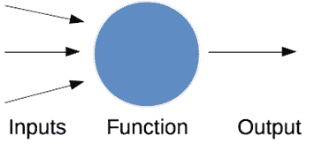

定义神经元处理功能的函数可以是任何标准函数，例如输入的线性组合，这被称为**激活函数**。为了使常用的学习算法能够工作，我们需要激活函数是**可导的**和**平滑的**。一个常用的激活函数是**逻辑函数**，其定义如下（*k*通常简单地取 1，*x*是输入到神经元的值，L 通常是 1，即函数的最大值）：

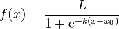

该图从-6 到+6 的值如下所示。红色线条表示当*x*为零时值为 0.5，但随着*x*的增加，函数迅速上升到 1.0，当*x*减少时，迅速下降到-1.0。

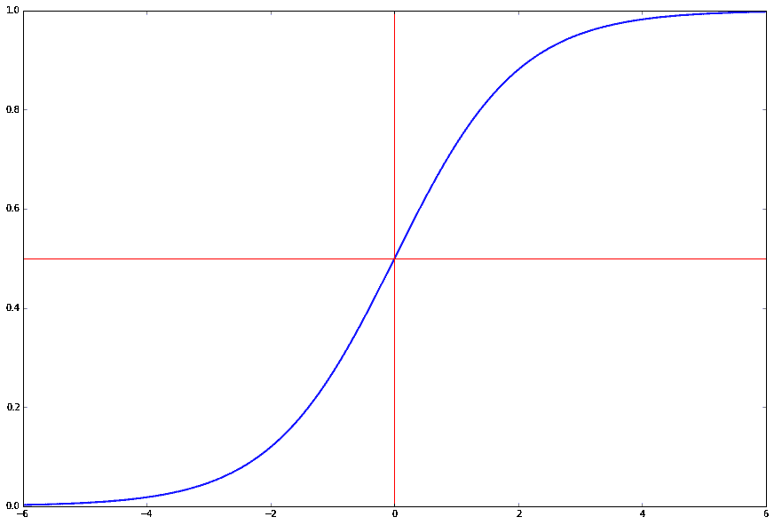

每个神经元都会接收其输入，然后根据这些值计算输出。神经网络可以被视为这些神经元相互连接的集合，它们在数据挖掘应用中可以非常强大。这些神经元的组合、它们如何相互配合以及它们如何组合来学习模型是机器学习中最强大的概念之一。

# 神经网络简介

对于数据挖掘应用，神经元的排列通常是**分层**的。第一层被称为**输入层**，它从数据样本中获取输入。这些神经元的输出被计算，然后传递到下一层的神经元。这被称为**前馈神经网络**。在本章中，我们将简单地称之为**神经网络**，因为它们是最常用的类型，也是本章唯一使用的类型。还有其他类型的神经网络，用于不同的应用。我们将在第十一章*，使用深度神经网络的图像目标检测*中看到另一种类型的网络。

一层的输出成为下一层的输入，一直持续到我们达到最后一层：**输出层**。这些输出代表了神经网络的预测，作为分类。输入层和输出层之间的任何神经元层都被称为**隐藏层**，因为它们学习的数据表示对于人类来说不是直观可解释的。大多数神经网络至少有三层，尽管大多数现代应用使用的网络比这多得多。

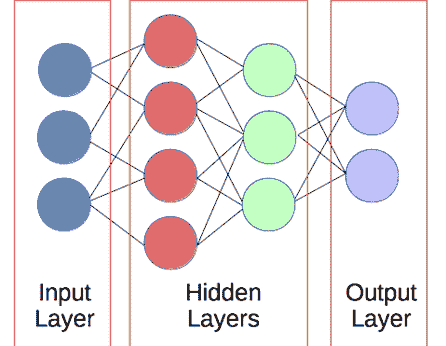

通常，我们考虑全连接层。每一层的每个神经元的输出都流向下一层的所有神经元。虽然我们定义了全连接网络，但在训练过程中，许多权重将被设置为 0，从而有效地移除了这些链接。此外，许多这些权重可能在训练后仍然保留非常小的值。

除了是神经网络概念上更简单的形式之一外，全连接神经网络在编程上比其他连接模式更简单、更高效。

请参阅第十一章，*使用深度神经网络在图像中进行目标检测*，了解不同类型神经网络的调查，包括专门用于图像处理的层。

由于神经元的函数通常是逻辑函数，并且神经元与下一层完全连接，因此构建和训练神经网络所需的参数必须是其他因素。

+   神经网络的第一个因素在构建阶段：神经网络的大小和形状。这包括神经网络有多少层以及每个隐藏层中有多少个神经元（输入和输出层的大小通常由数据集决定）。

+   神经网络的第二个参数在训练阶段确定：神经元之间连接的权重。当一个神经元连接到另一个神经元时，这个连接有一个相关的权重，该权重会乘以信号（第一个神经元的输出）。如果连接的权重为 0.8，则神经元被激活，并输出值为 1，因此传递给下一个神经元的输入是 0.8。如果第一个神经元未激活且值为 0，则该值保持在 0。

网络大小和训练良好的权重的组合决定了神经网络在分类时的准确性。前一句话中的“适当”一词也不一定意味着更大，因为过大的神经网络可能需要很长时间来训练，并且更容易过拟合训练数据。

权重可以随机设置以开始，但在训练阶段会进行更新。将权重设置为零通常不是一个好主意，因为网络中的所有神经元最初都表现得非常相似！随机设置权重给每个神经元在学习过程中提供了一个不同的*角色*，这个角色可以通过训练得到改善。

在这种配置下的神经网络是一个分类器，可以用来根据输入预测数据样本的目标，就像我们在前几章中使用过的分类算法一样。但首先，我们需要一个用于训练和测试的数据集。

神经网络是近年来数据挖掘领域最大的进步。这可能会让你想：*为什么还要学习其他类型的分类算法呢？*虽然神经网络在几乎所有领域都是最先进的（至少，现在是这样），但学习其他分类器的理由是神经网络通常需要更多的数据才能有效工作，并且学习时间较长。如果你没有**大数据**，你可能会从另一个算法中获得更好的结果。

# 创建数据集

在本章中，为了使内容更加生动，让我们扮演一下坏人的角色。我们想要创建一个能够击败 CAPTCHAs 的程序，让我们的评论垃圾邮件程序能够在某个人的网站上做广告。需要注意的是，我们的 CAPTCHAs 将比现在网络上使用的那些稍微简单一些，而且垃圾邮件并不是一件很体面的事情。

我们今天扮演坏人，但请*不要*将其用于现实世界的网站。扮演坏人的一个原因是为了帮助提高我们网站的安全性，通过寻找它的问题。

我们的实验将简化 CAPTCHA，使其仅包含四个字母的单独英语单词，如下面的图像所示：

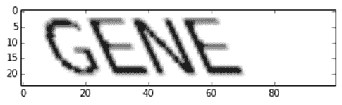

我们的目标是创建一个程序，可以从这样的图像中恢复单词。为此，我们将使用以下四个步骤：

1.  将图像分解成单个字母。

1.  对每个单独的字母进行分类。

1.  将字母重新组合成一个单词。

1.  使用词典对单词进行排序，以尝试纠正错误。

我们的 CAPTCHA 破解算法将做出以下假设。首先，单词将是一个完整的、有效的四个字符的英语单词（实际上，我们使用相同的词典来创建和破解 CAPTCHAs）。其次，单词将只包含大写字母。不会使用符号、数字或空格。

我们将使问题比仅仅识别字母稍微困难一些，通过对文本执行剪切变换，以及不同的剪切和缩放率。

# 绘制基本的 CAPTCHAs

在我们开始对 CAPTCHAs 进行分类之前，我们首先需要一个用于学习的数据集。在本节中，我们将生成自己的数据以进行数据挖掘。

在更现实的应用中，你可能想要使用现有的 CAPTCHA 服务来生成数据，但就本章的目的而言，我们自己的数据就足够了。可能出现的一个问题是，当我们自己创建数据集时，我们会在数据的工作方式上编码我们的假设，然后将这些相同的假设应用到我们的数据挖掘训练中。

我们的目标是绘制一个带有单词的图像，并对其进行剪切变换。我们将使用 PIL 库来绘制我们的 CAPTCHAs，并使用`scikit-image`库来执行剪切变换。`scikit-image`库可以以 NumPy 数组格式读取图像，而 PIL 可以导出这种格式，这使得我们可以使用这两个库。

PIL 和 scikit-image 都可以通过 Anaconda 安装。然而，我建议通过其替代品**pillow**来获取 PIL：

conda install pillow scikit-image

首先，我们导入必要的库和模块。我们按照以下方式导入 NumPy 和图像绘制函数：

```py
import numpy as np 
from PIL import Image, ImageDraw, ImageFont 
from skimage import transform as tf

```

然后我们创建生成 CAPTCHAs 的基本函数。这个函数接受一个单词和一个剪切值（通常在 0 和 0.5 之间），以返回一个 NumPy 数组格式的图像。我们允许用户设置结果的图像大小，因为我们还将使用这个函数来生成单个字母的训练样本：

```py
def create_captcha(text, shear=0, size=(100, 30), scale=1):
    im = Image.new("L", size, "black")
    draw = ImageDraw.Draw(im)
    font = ImageFont.truetype(r"bretan/Coval-Black.otf", 22) 
    draw.text((0, 0), text, fill=1, font=font)
    image = np.array(im)
    affine_tf = tf.AffineTransform(shear=shear)
    image = tf.warp(image, affine_tf)
    image = image / image.max()
    # Apply scale
    shape = image.shape
    shapex, shapey = (int(shape[0] * scale), int(shape[1] * scale))
    image = tf.resize(image, (shapex, shapey))
    return image

```

在这个函数中，我们使用 L 格式创建一个新的图像，这意味着只有黑白像素，并创建一个 `ImageDraw` 类的实例。这允许我们使用 PIL 在这个图像上绘制。然后我们加载字体，绘制文本，并对它执行 `scikit-image` 的剪切变换。

您可以从 Open Font Library 在以下链接获取我使用的 Coval 字体：

[`openfontlibrary.org/en/font/bretan`](http://openfontlibrary.org/en/font/bretan)

下载 `.zip` 文件，并将 `Coval-Black.otf` 文件提取到与您的 Notebook 相同的目录中。

从这里，我们现在可以很容易地生成图像，并使用 `pyplot` 显示它们。首先，我们使用 matplotlib 图表的内联显示并导入 `pyplot`。代码如下：

```py
%matplotlib inline
from matplotlib import pyplot as plt
image = create_captcha("GENE", shear=0.5, scale=0.6)
plt.imshow(image, cmap='Greys')

```

结果是本节开头显示的图像：我们的 CAPTCHA。这里有一些具有不同剪切和缩放值的其他示例：

```py
image = create_captcha("SEND", shear=0.1, scale=1.0)
plt.imshow(image, cmap='Greys')

```

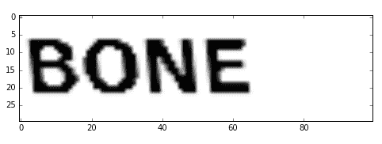

```py
image = create_captcha("BARK", shear=0.8, scale=1.0)
plt.imshow(image, cmap='Greys')

```

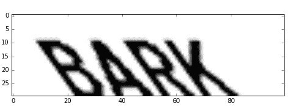

这里是一个放大到 `1.5` 倍的变体。虽然它看起来与上面的 BONE 图像相似，但请注意 *x* 轴和 *y* 轴的值更大：

```py
image = create_captcha("WOOF", shear=0.25, scale=1.5)
plt.imshow(image, cmap='Greys')

```

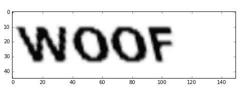

# 将图像分割成单个字母

我们的 CAPTCHA 是单词。我们不会构建一个可以识别成千上万可能单词的分类器，而是将问题分解成更小的问题：预测字母。

我们的实验使用的是英语，并且全部大写，这意味着对于每个字母，我们都有 26 个类别来预测。如果您在其他语言中尝试这些实验，请记住输出类别的数量将需要改变。

我们算法中击败这些 CAPTCHA 的第一步是分割单词以发现其中的每个字母。为此，我们将创建一个函数来找到图像中连续的黑色像素区域，并将它们作为子图像提取出来。这些就是（或者至少应该是）我们的字母。`scikit-image` 函数有执行这些操作的工具。

我们的函数将接受一个图像，并返回一个子图像列表，其中每个子图像是图像中原始单词的一个字母。首先，我们需要做的是检测每个字母的位置。为此，我们将使用 `scikit-image` 中的标签函数，该函数可以找到具有相同值的像素的连通集合。这与我们在 第七章*使用图挖掘遵循建议* 中的连通组件发现有相似之处。

```py
from skimage.measure import label, regionprops

def segment_image(image):
    # label will find subimages of connected non-black pixels
    labeled_image = label(image>0.2, connectivity=1, background=0)
    subimages = []
    # regionprops splits up the subimages
    for region in regionprops(labeled_image):
        # Extract the subimage
        start_x, start_y, end_x, end_y = region.bbox
        subimages.append(image[start_x:end_x,start_y:end_y])
        if len(subimages) == 0:
            # No subimages found, so return the entire image
            return [image,]
    return subimages

```

然后，我们可以使用此函数从示例 CAPTCHA 中获取子图像：

```py
subimages = segment_image(image)

```

我们还可以查看这些子图像：

```py
f, axes = plt.subplots(1, len(subimages), figsize=(10, 3)) 
for i in range(len(subimages)): 
    axes[i].imshow(subimages[i], cmap="gray")

```

结果看起来可能像这样：

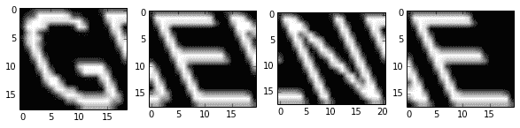

如你所见，我们的图像分割做得相当不错，但结果仍然相当杂乱，有前一个字母的碎片显示。这是可以接受的，甚至更可取。虽然在对具有常规噪声的数据进行训练时会使我们的训练变得更差，但使用具有随机噪声的数据进行训练实际上可以使其变得更好。一个原因是，底层的数据挖掘模型学会了重要的方面，即非噪声部分而不是训练数据集中固有的特定噪声。过多和过少的噪声之间的界限很微妙，这可能会很难正确建模。在验证集上进行测试是确保你的训练正在改进的好方法。

一个重要的注意事项是，此代码在查找字母方面并不一致。较低的剪切值通常会导致准确分割的图像。例如，以下是分割上面 WOOF 示例的代码：

```py
image = create_captcha("WOOF", shear=0.25, scale=1.5)
subimages = segment_image(image)
f, axes = plt.subplots(1, len(subimages), figsize=(10, 3), sharey=True) 
for i in range(len(subimages)): 
    axes[i].imshow(subimages[i], cmap="gray")

```

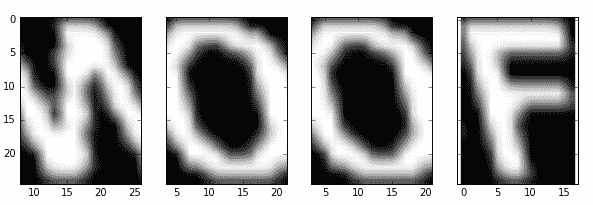

相比之下，较高的剪切值无法正确分割。例如，以下是之前提到的 BARK 示例：

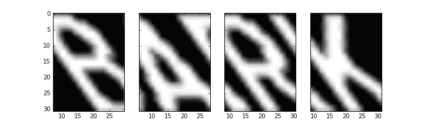

注意由方形分割引起的大面积重叠。对于本章代码的一个改进建议是，通过找到非方形分割来改进我们的分割方法。

# 创建训练数据集

使用我们已定义的函数，我们现在可以创建一个包含不同剪切值的字母数据集。从这些数据中，我们将训练一个神经网络来识别图像中的每个字母。

我们首先设置随机状态和数组，该数组包含我们将随机选择的字母、剪切值和缩放值的选项。这里没有太多惊喜，但如果你之前没有使用过 NumPy 的 `arange` 函数，它类似于 Python 的 `range` 函数——只不过这个函数可以与 NumPy 数组一起工作，并且允许步长为浮点数。代码如下：

```py
from sklearn.utils import check_random_state
random_state = check_random_state(14) 
letters = list("ABCDEFGHIJKLMNOPQRSTUVWXYZ") 
shear_values = np.arange(0, 0.5, 0.05)
scale_values = np.arange(0.5, 1.5, 0.1)

```

然后，我们创建一个函数（用于生成训练数据集中的单个样本），该函数会随机选择一个字母、一个剪切值和一个从可用选项中选择的缩放值。

```py
def generate_sample(random_state=None): 
    random_state = check_random_state(random_state) 
    letter = random_state.choice(letters) 
    shear = random_state.choice(shear_values)
    scale = random_state.choice(scale_values)
    # We use 30,30 as the image size to ensure we get all the text in the image
    return create_captcha(letter, shear=shear, size=(30, 30), scale=scale), letters.index(letter)

```

我们返回字母的图像，以及表示图像中字母的目标值。我们的类别将为 A 为 0，B 为 1，C 为 2，依此类推。

在函数块外部，我们现在可以调用此代码来生成一个新的样本，然后使用 `pyplot` 展示它：

```py
image, target = generate_sample(random_state) 
plt.imshow(image, cmap="Greys") 
print("The target for this image is: {0}".format(target))

```

生成的图像只有一个字母，具有随机的剪切和缩放值。

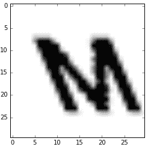

现在，我们可以通过多次调用此函数来生成所有数据。然后我们将数据放入 NumPy 数组中，因为它们比列表更容易处理。代码如下：

```py
dataset, targets = zip(*(generate_sample(random_state) for i in range(1000))) 
dataset = np.array([tf.resize(segment_image(sample)[0], (20, 20)) for sample in dataset])
dataset = np.array(dataset, dtype='float') 
targets = np.array(targets)

```

我们的目标是介于 0 和 26 之间的整数，每个代表字母表中的一个字母。神经网络通常不支持单个神经元的多值，而是更喜欢有多个输出，每个输出值为 0 或 1。我们对目标进行 one-hot 编码，为每个样本生成一个有 26 个输出的目标数组，如果该字母可能，则使用接近 1 的值，否则使用接近 0 的值。代码如下：

```py
from sklearn.preprocessing import OneHotEncoder 
onehot = OneHotEncoder() 
y = onehot.fit_transform(targets.reshape(targets.shape[0],1))

```

从这个输出中，我们知道我们的神经网络输出层将有 26 个神经元。神经网络的目标是根据给定的输入（构成图像的像素）确定要激活哪个神经元。

我们将要使用的库不支持稀疏数组，因此我们需要将我们的稀疏矩阵转换为密集的 NumPy 数组。代码如下：

```py
y = y.todense()
X = dataset.reshape((dataset.shape[0], dataset.shape[1] * dataset.shape[2]))

```

最后，我们进行训练/测试数据集的划分，以便稍后评估我们的数据：

```py
from sklearn.cross_validation import train_test_split 
X_train, X_test, y_train, y_test = train_test_split(X, y, train_size=0.9)

```

# 训练和分类

现在，我们将构建一个神经网络，它将接受图像作为输入并尝试预测图像中包含的是哪个（单个）字母。

我们将使用我们之前创建的单个字母的训练集。数据集本身相当简单。我们有一个 20x20 像素的图像，每个像素为 1（黑色）或 0（白色）。这些代表我们将用作神经网络输入的 400 个特征。输出将是介于 0 和 1 之间的 26 个值，其中较高的值表示关联字母（第一个神经元是 A，第二个是 B，以此类推）是输入图像所代表的字母的可能性更高。

在本章中，我们将使用 scikit-learn 的`MLPClassifier`作为我们的神经网络。

您需要`scikit-learn`的较新版本才能使用 MLPClassifier。如果下面的导入语句失败，请在更新 scikit-learn 后重试。您可以使用以下 Anaconda 命令来完成此操作：

`conda update scikit-learn`

对于其他`scikit-learn`分类器，我们导入模型类型并创建一个新的模型。下面的构造函数指定我们创建一个包含 100 个节点的隐藏层。输入层和输出层的大小在训练时确定：

```py
from sklearn.neural_network import MLPClassifier
clf = MLPClassifier(hidden_layer_sizes=(100,), random_state=14)

```

要查看神经网络的内部参数，我们可以使用`get_params()`函数。这个函数存在于所有的`scikit-learn`模型中。以下是上述模型的输出。许多这些参数可以提高训练或训练速度。例如，增加学习率可以使模型训练得更快，但可能会错过最佳值：

```py
{'activation': 'relu',
 'alpha': 0.0001,
 'batch_size': 'auto',
 'beta_1': 0.9,
 'beta_2': 0.999,
 'early_stopping': False,
 'epsilon': 1e-08,
 'hidden_layer_sizes': (100,),
 'learning_rate': 'constant',
 'learning_rate_init': 0.001,
 'max_iter': 200,
 'momentum': 0.9,
 'nesterovs_momentum': True,
 'power_t': 0.5,
 'random_state': 14,
 'shuffle': True,
 'solver': 'adam',
 'tol': 0.0001,
 'validation_fraction': 0.1,
 'verbose': False,
 'warm_start': False}

```

接下来，我们使用标准的 scikit-learn 接口来拟合我们的模型：

```py
clf.fit(X_train, y_train)

```

我们的网络现在已经学会了每一层之间的权重。我们可以通过检查`clf.coefs_`来查看这些权重，它是一个连接每一层的 NumPy 数组的列表。例如，从包含 400 个神经元（来自我们每个像素）的输入层到包含 100 个神经元（我们设置的参数）的隐藏层的权重可以通过`clf.coefs_[0]`获得。此外，隐藏层和输出层（包含 26 个神经元）之间的权重可以通过`clf.coefs_[1]`获得。这些权重，连同上面的参数，完全定义了我们的训练网络。

现在，我们可以使用这个训练好的网络来预测我们的测试数据集：

```py
y_pred = clf.predict(X_test)

```

最后，我们评估结果：

```py
from sklearn.metrics import f1_score
f1_score(y_pred=y_pred, y_true=y_test, average='macro')

```

结果是 0.96，这相当令人印象深刻。这个版本的 F1 分数是基于宏平均，它计算每个类的个体 F1 分数，然后不考虑每个类的大小进行平均。

为了检查这些个体类别的结果，我们可以查看分类报告：

```py
from sklearn.metrics import classification_report
print(classification_report(y_pred=y_pred, y_true=y_test))

```

我实验的结果如下所示：

```py
             precision    recall  f1-score   support

          0       1.00      1.00      1.00         5
          1       1.00      1.00      1.00         3
          2       1.00      1.00      1.00         3
          3       1.00      1.00      1.00         8
          4       1.00      1.00      1.00         2
          5       1.00      1.00      1.00         4
          6       1.00      1.00      1.00         2
          7       1.00      1.00      1.00         2
          8       1.00      1.00      1.00         7
          9       1.00      1.00      1.00         1
         10       1.00      1.00      1.00         3
         11       1.00      1.00      1.00         4
         12       1.00      0.75      0.86         4
         13       1.00      1.00      1.00         5
         14       1.00      1.00      1.00         4
         15       1.00      1.00      1.00         3
         16       1.00      1.00      1.00         3
         17       1.00      1.00      1.00         7
         18       1.00      1.00      1.00         5
         19       1.00      1.00      1.00         5
         20       1.00      1.00      1.00         3
         21       1.00      1.00      1.00         5
         22       1.00      1.00      1.00         2
         23       1.00      1.00      1.00         4
         24       1.00      1.00      1.00         2
         25       1.00      1.00      1.00         4

avg / total       1.00      0.99      0.99       100

```

本报告的最终`f1-score`显示在右下角，倒数第二个数字——0.99。这是微观平均，其中对每个样本计算`f1-score`，然后计算平均值。这种形式对于相对相似的类别大小更有意义，而宏平均对于不平衡的类别更有意义。

从 API 的角度来看，这很简单，因为`scikit-learn`隐藏了所有的复杂性。然而，在后台实际上发生了什么？我们如何训练一个神经网络？

# 反向传播

训练神经网络特别关注以下事项。

+   第一是网络的大小和形状——有多少层，层的大小以及它们使用的错误函数。虽然存在可以改变其大小和形状的神经网络类型，但最常见的类型，前馈神经网络，很少具有这种能力。相反，其大小在初始化时固定，在本章中是第一层 400 个神经元，隐藏层 100 个，最终层 26 个。通常，形状的训练是元算法的工作，它训练一组神经网络并确定哪个是最有效的，而不仅仅是训练网络本身。

+   训练神经网络的第二部分是改变神经元之间的权重。在一个标准的神经网络中，一个层的节点通过具有特定权重的边连接到下一层的节点。这些可以随机初始化（尽管存在一些更智能的方法，如自动编码器），但需要调整以允许网络*学习*训练样本和训练类别之间的关系。

这种调整权重是早期神经网络面临的一个关键问题，在开发出称为**反向传播**的算法来解决该问题之前。

**反向传播**（**backprop**）算法是一种将错误归咎于每个神经元的机制。首先，我们考虑神经网络的用法，我们将样本输入到输入层，并观察输出层的哪个神经元被激活，这被称为**正向传播**。反向传播从输出层反向到输入层，按比例分配错误给网络中的每个权重，这个权重对网络产生的任何错误的影响程度成正比。

变化的量基于两个方面：

+   神经元激活

+   激活函数的梯度

第一方面是神经元的激活程度。激活值高的（绝对值）神经元被认为对结果有重大影响，而激活值小的（绝对值）神经元对结果的影响较小。因此，激活值高的神经元周围的权重变化比激活值小的神经元周围的权重变化更大。

权重变化的第二个方面与激活函数的梯度成正比。你使用的许多神经网络将使用相同的激活函数来处理所有神经元，但在很多情况下，为不同层级的神经元（或更少的情况下，同一层级的神经元）使用不同的激活函数是有意义的。激活函数的梯度，结合神经元的激活状态以及分配给该神经元的错误，共同决定了权重变化的大小。

我跳过了反向传播中涉及的数学，因为本书的重点是实际应用。随着你对神经网络的更多使用，了解算法内部发生的事情是有益的。我建议研究反向传播算法的细节，这可以通过一些基本的梯度与导数知识来理解。

# 预测单词

现在我们已经有了预测单个字母的分类器，我们现在转向我们计划的下一步——预测单词。为此，我们想要预测这些片段中的每个字母，并将这些预测组合起来，以形成给定验证码的预测单词。

我们的功能将接受一个验证码和训练好的神经网络，然后返回预测的单词：

```py
def predict_captcha(captcha_image, neural_network):
    subimages = segment_image(captcha_image)
    # Perform the same transformations we did for our training data
    dataset = np.array([np.resize(subimage, (20, 20)) for subimage in subimages])
    X_test = dataset.reshape((dataset.shape[0], dataset.shape[1] * dataset.shape[2]))
    # Use predict_proba and argmax to get the most likely prediction
    y_pred = neural_network.predict_proba(X_test)
    predictions = np.argmax(y_pred, axis=1)

    # Convert predictions to letters
    predicted_word = str.join("", [letters[prediction] for prediction in predictions])
    return predicted_word

```

我们现在可以使用以下代码对一个单词进行测试。尝试不同的单词并查看你得到的错误类型，但请记住，我们的神经网络只知道大写字母：

```py
word = "GENE"
captcha = create_captcha(word, shear=0.2) 
print(predict_captcha(captcha, clf))
plt.imshow(captcha, cmap="Greys") 

```

我们可以将这个方法编码成一个函数，从而更方便地进行预测：

```py
def test_prediction(word, net, shear=0.2, scale=1):
    captcha = create_captcha(word, shear=shear, scale=scale, size=(len(word) * 25, 30))
    prediction = predict_captcha(captcha, net) 
    return word == prediction, word, prediction

```

返回的结果指定了预测是否正确，原始单词和预测单词。此代码正确预测了单词 GENE，但其他单词预测有误。它的准确度如何？为了测试，我们将创建一个包含大量来自 NLTK 的四字母英语单词的数据集。代码如下：

```py
from nltk.corpus import words

```

使用 Anaconda 安装 NLTK：conda install nltk

安装后，在使用代码之前，您需要使用以下命令下载语料库：

python -c "import nltk; nltk.download('words')"

这里提到的单词实例实际上是一个语料库对象，因此我们需要在它上面调用`words()`来从语料库中提取单个单词。我们还将过滤列表，只获取四个字母的单词：

```py
valid_words = set([word.upper() for word in words.words() if len(word) == 4])

```

我们可以遍历所有的单词，通过简单地计数正确的和错误的预测来查看我们能够正确预测多少：

```py
num_correct = 0 
num_incorrect = 0 
for word in valid_words:
    shear = random_state.choice(shear_values)
    scale = random_state.choice(scale_values) 
    correct, word, prediction = test_prediction(word, clf, shear=shear, scale=scale) 
    if correct: 
        num_correct += 1 
    else: 
        num_incorrect += 1
print("Number correct is {0}".format(num_correct)) 
print("Number incorrect is {0}".format(num_incorrect))

```

我得到的结果是 3,342 个正确和 2,170 个错误，准确率略高于 62%。从我们原始的每个字母 99%的准确率来看，这是一个很大的下降。发生了什么？

导致这种下降的原因列在这里：

+   影响的第一个因素是我们的准确率。在其他条件相同的情况下，如果我们有四个字母，每个字母的准确率为 99%，那么我们预计的成功率大约为 96%（在其他条件相同的情况下）连续正确预测四个字母（0.99⁴&ap;0.96）。单个字母预测中的单个错误会导致预测出错误的单词。

+   第二个影响是剪切值。我们的数据集在 0 到 0.5 的剪切值之间随机选择。之前的测试使用了 0.2 的剪切值。对于 0 的值，我得到了 75%的准确率；对于 0.5 的剪切值，结果要差得多，只有 2.5%。剪切值越高，性能越低。

+   第三个影响是单词经常被错误分割。另一个问题是，一些元音字母经常被误判，导致错误率高于上述错误率。

让我们检查这些问题中的第二个，并映射剪切值和性能之间的关系。首先，我们将评估代码转换为一个依赖于给定剪切值的函数：

```py
def evaluation_versus_shear(shear_value):
    num_correct = 0 
    num_incorrect = 0 
    for word in valid_words: 
        scale = random_state.choice(scale_values)
        correct, word, prediction = test_prediction(word, clf, shear=shear_value, scale=scale)
        if correct: 
            num_correct += 1 
        else: 
            num_incorrect += 1
    return num_correct/(num_correct+num_incorrect)

```

然后，我们取一个剪切值列表，然后使用这个函数评估每个值的准确率。请注意，这段代码将运行一段时间，大约需要 30 分钟，具体取决于您的硬件。

```py
scores = [evaluation_versus_shear(shear) for shear in shear_values]

```

最后，使用 matplotlib 绘制结果：

```py
plt.plot(shear_values, scores)

```

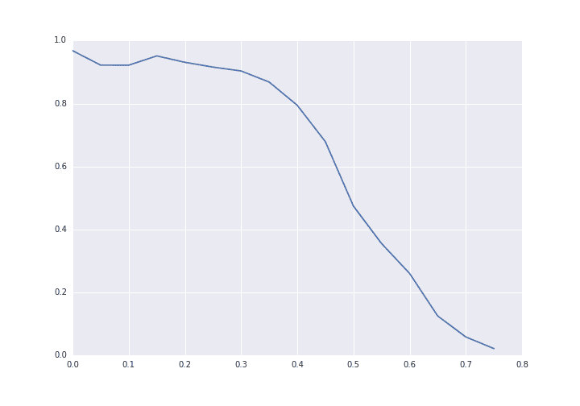

你可以看到，当剪切值超过 0.4 时，性能急剧下降。对输入进行归一化将有助于，例如图像旋转和去除输入的剪切。

解决剪切问题的一个令人惊讶的选项是增加具有高剪切值的训练数据量，这可能导致模型学习到更通用的输出。

我们将在下一节探讨使用后处理来提高准确率。

# 使用字典提高准确率

我们不仅可以返回给定的预测，还可以检查该单词是否实际上存在于我们的字典中。如果存在，那么这就是我们的预测。如果不在字典中，我们可以尝试找到一个与它相似的单词并预测它。请注意，这种策略依赖于我们的假设，即所有 CAPTCHA 单词都将是有效的英语单词，因此这种策略对于随机字符序列是不适用的。这也是为什么一些 CAPTCHA 不使用单词的原因之一。

这里有一个问题——我们如何确定最接近的单词？有许多方法可以做到这一点。例如，我们可以比较单词的长度。长度相似的单词可能被认为更相似。然而，我们通常认为如果单词在相同的位置上有相同的字母，那么它们就是相似的。这就是**编辑距离**发挥作用的地方。

# 单词相似度的排名机制

**Levenshtein 编辑距离**是一种常用的方法，用于比较两个短字符串以查看它们的相似程度。它并不非常可扩展，因此通常不用于非常长的字符串。编辑距离计算从一个单词到另一个单词所需的步骤数。这些步骤可以是以下三种操作之一：

+   在单词的任何位置插入一个新字母

+   从单词中删除任何字母

+   用一个字母替换另一个字母

将第一个单词转换为第二个单词所需的最小操作数被称为距离。较高的值表示单词之间的相似度较低。

这个距离在 NLTK 中作为`nltk.metrics.edit_distance`提供。我们可以通过仅使用两个字符串来调用它，它返回编辑距离：

```py
from nltk.metrics import edit_distance 
steps = edit_distance("STEP", "STOP") 
print("The number of steps needed is: {0}".format(steps))

```

当与不同的单词一起使用时，编辑距离相当好地近似了很多人直观上认为相似的单词。编辑距离非常适合测试拼写错误、听写错误和姓名匹配（在这种情况下，你很容易混淆 Marc 和 Mark 的拼写）。

然而，它对我们的情况并不好。我们并不期望字母会被移动，只是单个字母的比较可能会出错。因此，我们将创建一个不同的距离度量，它只是相同位置上错误字母的数量。代码如下：

```py
def compute_distance(prediction, word):
    len_word = min(len(prediction), len(word))
    return len_word - sum([prediction[i] == word[i] for i in range(len_word)])

```

我们从预测单词的长度（即四个字母）中减去该值，使其成为一个距离度量，其中较低的值表示单词之间有更高的相似度。

# 将所有内容整合在一起

我们现在可以使用与之前类似的代码来测试我们改进的预测函数。首先，我们定义一个预测函数，它也接受我们的有效单词列表：

```py
from operator import itemgetter 

def improved_prediction(word, net, dictionary, shear=0.2, scale=1.0): 
    captcha = create_captcha(word, shear=shear, scale=scale) 
    prediction = predict_captcha(captcha, net) 

    if prediction not in dictionary:
        distances = sorted([(word, compute_distance(prediction, word)) for word in dictionary],
                           key=itemgetter(1))
        best_word = distances[0] 
        prediction = best_word[0]
    return word == prediction, word, prediction

```

我们计算我们的预测单词与字典中每个单词之间的距离，并按距离排序（最短优先）。我们测试代码中的更改如下所示：

```py
num_correct = 0 
num_incorrect = 0 
for word in valid_words: 
    shear = random_state.choice(shear_values)
    scale = random_state.choice(scale_values)
    correct, word, prediction = improved_prediction(word, clf, valid_words, shear=shear, scale=scale)
    if correct: 
        num_correct += 1 
    else: 
        num_incorrect += 1
print("Number correct is {0}".format(num_correct)) 
print("Number incorrect is {0}".format(num_incorrect))

```

上述代码运行需要一段时间（计算所有距离需要一些时间），但最终结果是 3,037 个样本正确，2,476 个样本错误。这相当于提高了近 10 个百分点的准确率！

想要挑战一下吗？更新`predict_captcha`函数以返回分配给每个字母的概率。默认情况下，每个单词中的字母都选择概率最高的字母。如果这不起作用，可以选择下一个最可能的单词，通过将每个字母的概率相乘来实现。

# 概述

在本章中，我们处理图像以使用简单的像素值来预测 CAPTCHA 中描绘的字母。我们的 CAPTCHA 有些简化；我们只使用了完整的四个字母的英文单词。实际上，这个问题要困难得多——正如它应该的那样！通过一些改进，使用神经网络和与我们讨论的类似的方法，就有可能解决更难的 CAPTCHA。`scikit-image`库包含许多从图像中提取形状、改善对比度以及其他有助于图像处理的工具。

我们将预测单词的较大问题简化为一个较小且简单的问题，即预测字母。从这里，我们能够创建一个前馈神经网络来准确预测图像中的哪个字母。在这个阶段，我们的结果非常好，准确率达到 97%。

神经网络只是由神经元简单连接的集合，这些神经元是基本的计算设备，由一个函数组成。然而，当你将它们连接在一起时，它们可以解决极其复杂的问题。神经网络是深度学习的基础，目前是数据挖掘中最有效的领域之一。

尽管我们在预测单个字母时取得了很高的准确性，但在尝试预测整个单词时，性能下降到仅超过 60%。我们通过使用字典，搜索最佳匹配的单词来提高我们的准确性。为此，我们考虑了常用的编辑距离；然而，我们简化了它，因为我们只关注字母上的个别错误，而不是插入或删除。这种改进带来了一些好处，但仍有许多改进可以尝试以进一步提高准确性。

为了进一步探讨本章的概念，研究改变神经网络结构，通过添加更多隐藏层或改变这些层的形状。研究这将对结果产生什么影响。进一步地，尝试创建一个更难的 CAPTCHA——这会降低准确性吗？你能构建一个更复杂的网络来学习它吗？

如 CAPTCHA 示例所示的数据挖掘问题表明，一个初始问题陈述，如“猜这个单词”，可以被分解成可以使用数据挖掘执行的单个子任务。此外，这些子任务可以通过几种不同的方式组合，例如使用外部信息。在本章中，我们将我们的字母预测与有效单词字典相结合，以提供最终响应，比单独的字母预测提供了更好的准确性。

在下一章中，我们将继续进行字符串比较。我们将尝试确定（在一系列作者中）哪位作者撰写了特定的文档——仅使用内容，不使用其他任何信息！
