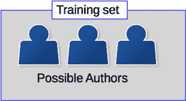
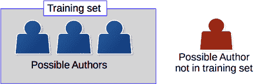
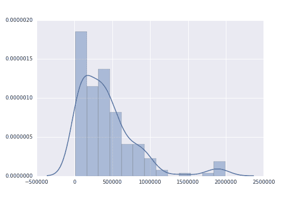
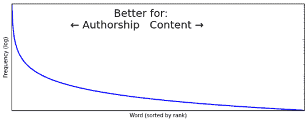
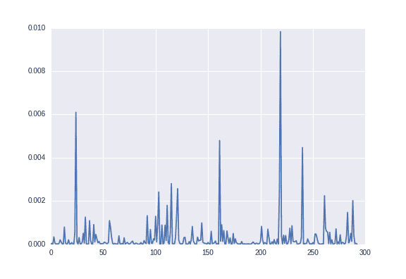
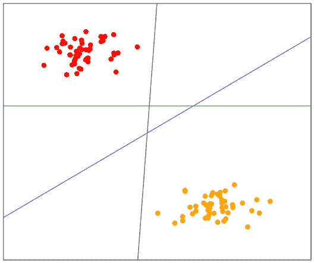
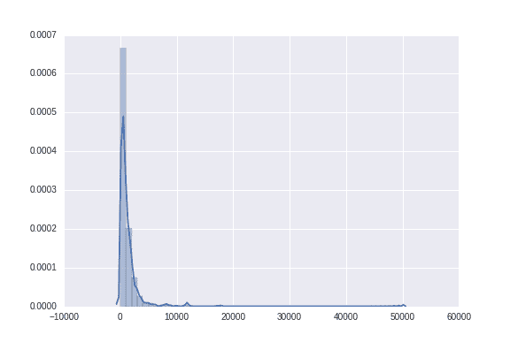
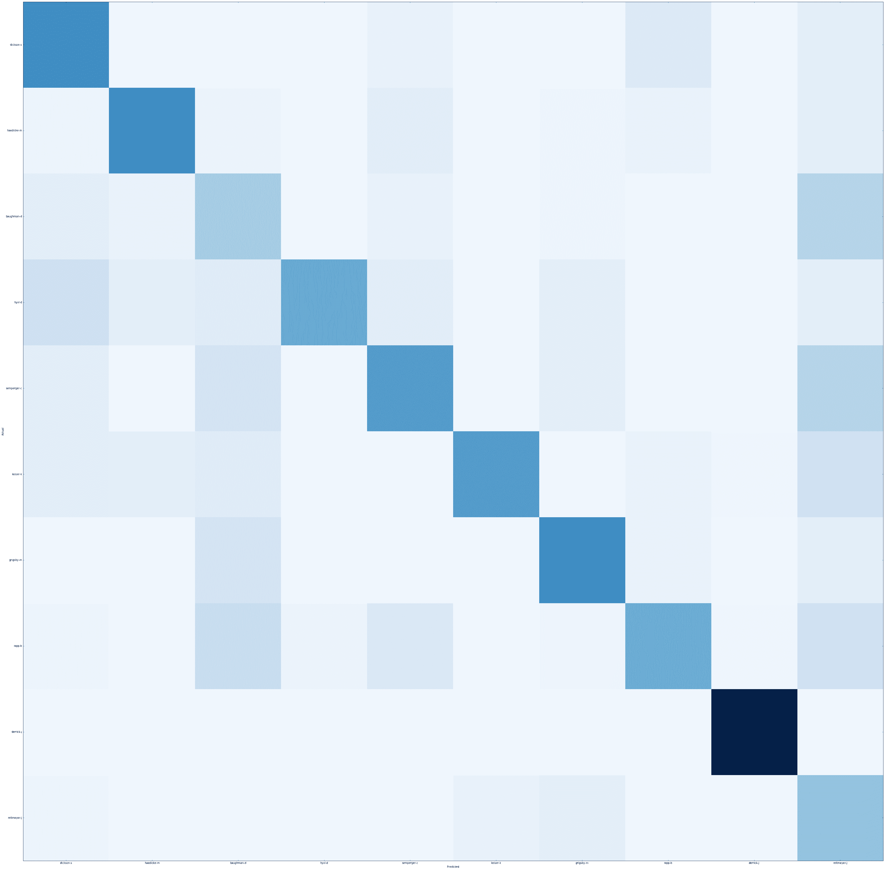

# 作者身份归属

**作者身份分析**是一种文本挖掘任务，旨在仅根据作者的写作内容来识别关于作者的一些方面。这可能包括诸如年龄、性别或背景等特征。在具体的**作者身份归属**任务中，我们的目标是确定一组作者中哪位作者撰写了特定的文档。这是一个经典的分类任务。在许多方面，作者身份分析任务都是通过标准的数据挖掘方法来执行的，例如交叉验证、特征提取和分类算法。

在本章中，我们将使用作者身份归属问题来整合我们在前几章中开发的数据挖掘方法的部分。我们确定问题并讨论问题的背景和知识。这使得我们可以选择要提取的特征，我们将为此构建一个管道。我们将测试两种不同类型的特征：功能词和字符 n-gram。最后，我们将对结果进行深入分析。我们首先将使用一组书籍数据集，然后是一个混乱的、现实世界的电子邮件语料库。

本章我们将涵盖以下主题：

+   特征工程以及特征选择如何根据应用而不同

+   带着特定目标重新审视词袋模型

+   特征类型和字符 n-gram 模型

+   支持向量机

+   清理用于数据挖掘的混乱数据集

# 将文档归因于作者

作者身份分析有**风格学**的背景，这是研究作者写作风格的研究。这个概念基于这样一个想法，即每个人学习语言的方式略有不同，通过测量人们写作中的这些细微差别，我们可以仅使用他们写作的内容来区分他们。

作者身份分析在历史上（1990 年之前）一直是通过可重复的手动分析和统计来执行的，这是一个很好的迹象，表明它可以利用数据挖掘进行自动化。现代作者身份分析研究几乎完全是基于数据挖掘的，尽管相当大一部分工作仍然是使用更多手动驱动的分析，如语言风格和风格学。今天在特征工程方面的许多进步都是由风格学的进步驱动的。换句话说，手动分析发现了新的特征，然后这些特征被编码并作为数据挖掘过程的一部分使用。

风格学的一个关键基础特征是**作者不变性**，即特定作者在其所有文档中都有的特征，但与其他作者不共享。在实践中，这些作者不变性似乎并不存在，因为作者的风格会随时间而变化，但数据挖掘的使用可以使我们接近基于这一原则工作的分类器。

作为一门学科，作者身份分析有许多子问题，其中主要问题如下：

+   **作者身份分析**：这是根据写作确定作者的年龄、性别或其他特征。例如，我们可以通过观察他们使用英语的具体方式来检测说英语的人的第一语言。

+   **作者身份验证**：这是检查这份文件的作者是否也撰写了另一份文件。这个问题是你通常在法律法庭环境中会考虑的问题。例如，嫌疑人的写作风格（从内容上分析）将被分析，以查看它是否与勒索信相符。

+   **作者身份聚类**：这是作者身份验证的扩展，我们使用聚类分析将大量文档分组到簇中，每个簇由同一作者撰写。

然而，最常见的作者身份分析研究形式是**作者身份归因**，这是一个分类任务，我们试图预测一组作者中哪位撰写了给定的文件。

# 应用案例

作者身份分析有许多**应用案例**。许多案例都与验证作者身份、证明共同作者身份/来源或关联社交媒体资料与真实用户等问题相关。

从历史的角度来看，我们可以使用作者身份分析来验证某些文件是否确实是由其声称的作者撰写的。有争议的作者身份索赔包括一些莎士比亚的戏剧、美国建国时期的《联邦党人文集》以及其他历史文献。

单独的作者身份研究不能证明作者身份，但可以为或反对某个理论提供证据，例如是否有人撰写了给定的文件。

例如，我们可以分析莎士比亚的戏剧来确定他的写作风格，然后再测试给定的十四行诗是否确实出自他之手（一些最近的研究表明他的某些作品有多位作者）。

更现代的一个用例是链接社交网络账户。例如，一个恶意在线用户可能在多个在线社交网络上建立账户。能够将它们联系起来，使当局能够追踪特定账户的用户——例如，如果有人在网上骚扰其他用户。

过去使用的一个例子是作为骨干在法庭上提供专家证词，以确定某个人是否撰写了某份文件。例如，嫌疑人可能被指控撰写了一封骚扰他人的电子邮件。使用作者身份分析可以确定那个人实际上是否真的撰写了该文件。另一种基于法庭的使用是解决被盗作者身份的索赔。例如，两位作者可能声称撰写了一本书，作者身份分析可以提供证据，证明哪位作者更有可能是真正的作者。

尽管作者归属分析并非万无一失，但最近的一项研究发现，仅仅要求那些未经训练的人隐藏他们的写作风格，就可以使将文档归因于作者变得更加困难。这项研究还考察了一个框架练习，其中人们被要求以另一个人的风格写作。这种对另一个人风格的模仿证明相当可靠，伪造的文档通常被归因于被模仿的人。

尽管存在这些问题，作者归属分析在越来越多的领域中被证明是有用的，并且是一个有趣的数据挖掘问题进行研究。

作者归属可以用于专家证词，但仅凭它本身很难被归类为硬证据。在使用它来解决正式事项，如作者归属争议之前，请务必咨询律师。

# 作者归属

**作者归属**（与作者**分析**不同）是一个分类任务，其中我们有一组候选作者，每个作者有一组文档，即所谓的**训练集**，以及一组未知作者身份的文档，通常称为测试集。如果未知作者身份的文档肯定属于候选人之一，我们称之为封闭问题，如下面的图所示：



如果我们不能确定实际作者是否是训练集的一部分，我们称之为开放问题。这种区别不仅限于作者归属——任何实际类别可能不在训练集中的数据挖掘应用都被认为是开放问题，任务就是找到候选作者或选择他们中的任何一个。这如下面的图所示：



在作者归属中，我们通常有两个任务限制。它们如下列出：

+   首先，我们只使用文档的内容信息——不是关于写作时间、交付、手写风格等方面的元数据。有方法可以结合来自这些不同类型信息的数据模型，但这通常不被认为是作者归属，而更多的是一个**数据融合**应用。

+   第二个限制是我们不关注文档的主题；相反，我们寻找更显著的特征，如词汇使用、标点符号和其他基于文本的特征。这里的推理是，一个人可以就许多不同的主题进行写作，因此担心他们写作的主题并不能模拟他们的实际写作风格。查看主题词也可能导致训练数据上的**过拟合**——我们的模型可能在同一作者的同一主题的文档上进行训练。例如，如果你通过查看这本书来模拟我的写作风格，你可能会得出结论，单词“数据挖掘”是**我的**写作风格的指示性特征，而实际上我也在其他主题上写作。

从这里，执行作者归属分析的流程与我们在第六章[ea7ae888-e2aa-46b5-ba45-b8c685cc5fe2.xhtml]*，使用朴素贝叶斯进行社交媒体洞察*中开发的流程非常相似。

1.  首先，我们从我们的文本中提取特征。

1.  然后，我们对这些特征进行一些特征选择。

1.  最后，我们训练一个分类算法来拟合模型，然后我们可以使用它来预测文档的类别（在这种情况下，作者）。

在内容分类和作者分类之间有一些区别，主要与使用哪些特征有关，我们将在本章中介绍。根据应用选择特征至关重要。

在深入研究这些问题之前，我们将定义问题的范围并收集一些数据。

# 获取数据

我们将用于本章第一部分的数据是一套来自 [www.gutenberg.org](http://www.gutenberg.org) 的 **Project Gutenberg** 的书籍，这是一个公共领域文学作品库。我用于这些实验的书籍来自各种作者：

+   布思·塔金顿（22 部作品）

+   查尔斯·狄更斯（44 部作品）

+   伊迪丝·内斯比特（10 部作品）

+   亚瑟·柯南·道尔（51 部作品）

+   马克·吐温（29 部作品）

+   理查德·弗朗西斯·伯顿爵士（11 部作品）

+   埃米尔·加博里奥（10 部作品）

总共有 177 篇来自 7 位作者的文章，提供了大量的文本供我们使用。文章的完整列表，包括下载链接和自动获取它们的脚本，可以在名为 getdata.py 的代码包中找到。如果运行代码的结果比上面少得多，镜像可能已关闭。请参阅此网站以获取更多镜像 URL 以在脚本中尝试：[`www.gutenberg.org/MIRRORS.ALL`](https://www.gutenberg.org/MIRRORS.ALL)

为了下载这些书籍，我们使用 requests 库将文件下载到我们的数据目录中。

首先，在一个新的 Jupyter Notebook 中，设置数据目录并确保以下代码链接到它：

```py
import os 
import sys 
data_folder = os.path.join(os.path.expanduser("~"), "Data", "books")

```

接下来，从 Packt 提供的代码包中下载数据包。将文件解压缩到该目录中。书籍文件夹应直接包含每个作者的文件夹。

在查看这些文件后，你会发现其中许多文件相当杂乱——至少从数据分析的角度来看。文件开头有一个很大的 Project Gutenberg 声明。在我们进行分析之前，需要将其删除。

例如，大多数书籍以以下信息开始：

*《Project Gutenberg 电子书：Mugby Junction》，作者：查尔斯·狄更斯等人，由 Jules A. **插画**

古德曼 这本电子书对任何地方的任何人都是免费的，并且可以*

*几乎没有任何限制。您可以复制它，赠送它或* 

*根据 Project Gutenberg 许可证重新使用*

*本电子书或在线于 www.gutenberg.org*

*标题：Mugby Junction*

*作者：查尔斯·狄更斯*

*发布日期：2009 年 1 月 28 日 [电子书 #27924]语言：英语*

*字符集编码：UTF-8

***《古腾堡项目》MUGBY JUNCTION 电子书开始***

在这一点之后，书籍的实际文本开始。使用以***《古腾堡项目》开始***开头的行相当一致，我们将使用这个作为文本开始的线索——任何在此行之前的都将被忽略。

我们可以更改磁盘上的单个文件来移除这些内容。然而，如果我们丢失了数据会怎样？我们会丢失我们的更改，并且可能无法复制这项研究。因此，我们将预处理作为加载文件时执行——这使我们能够确保我们的结果将是可复制的（只要数据源保持不变）。以下代码移除了书籍中的主要噪声源，即古腾堡项目添加到文件中的序言：

```py
def clean_book(document):
    lines = document.split("n")
    start= 0
    end = len(lines)
    for i in range(len(lines)):
        line = lines[i]
        if line.startswith("*** START OF THIS PROJECT GUTENBERG"):
            start = i + 1
        elif line.startswith("*** END OF THIS PROJECT GUTENBERG"):
            end = i - 1
    return "n".join(lines[start:end])

```

你可能想添加到这个函数中，以移除其他噪声源，例如不一致的格式、页脚信息等。调查文件以检查它们有什么问题。

我们现在可以使用以下函数获取我们的文档和类别，该函数会遍历这些文件夹，加载文本文档，并将分配给作者的编号作为目标类别。

```py
import numpy as np

def load_books_data(folder=data_folder):
    documents = []
    authors = []
    subfolders = [subfolder for subfolder in os.listdir(folder)
                  if os.path.isdir(os.path.join(folder, subfolder))]
    for author_number, subfolder in enumerate(subfolders):
        full_subfolder_path = os.path.join(folder, subfolder)
        for document_name in os.listdir(full_subfolder_path):
            with open(os.path.join(full_subfolder_path, document_name), errors='ignore') as inf:
                documents.append(clean_book(inf.read()))
                authors.append(author_number)
    return documents, np.array(authors, dtype='int')

```

我们接下来调用这个函数来实际加载书籍：

```py
documents, classes = load_books_data(data_folder)

```

这个数据集很容易放入内存，因此我们可以一次性加载所有文本。在整个数据集不适合的情况下，更好的解决方案是逐个（或批量）提取每个文档的特征，并将结果值保存到文件或内存矩阵中。

为了了解数据的属性，我通常首先做的事情之一是创建一个简单的文档长度直方图。如果长度相对一致，这通常比文档长度差异很大更容易学习。在这种情况下，文档长度有很大的差异。要查看这一点，首先我们将长度提取到一个列表中：

```py
document_lengths = [len(document) for document in documents]

```

接下来，我们绘制这些数据。Matplotlib 有一个`hist`函数可以做到这一点，Seaborn 也可以，它默认产生更美观的图表。

```py
import seaborn as sns
sns.distplot(document_lengths)

```

生成的图表显示了文档长度的变化：



# 使用功能词

早期类型的一种特征，并且对于作者身份分析仍然相当有效，是使用词袋模型中的功能词。功能词是本身意义不大的词，但却是创建（英语！）句子所必需的。例如，*这个*和*那个*这样的词，它们实际上只由它们在句子中的功能定义，而不是它们本身的意义。这与像*老虎*这样的内容词形成对比，内容词有明确的意义，并在句子中使用时唤起大型猫的形象。

被认为是功能词的词集并不总是显而易见的。一个好的经验法则是选择使用频率最高的词（在所有可能的文档中，而不仅仅是同一作者的文档）。

通常，一个词使用得越频繁，对作者身份分析就越好。相反，一个词使用得越少，对基于内容的文本挖掘就越好，例如在下一章中，我们将探讨不同文档的主题。

此图展示了单词与频率之间的关系：



功能词的使用更多地由作者的决策决定，而不是文档的内容。这使得它们成为区分不同用户作者特征的理想候选词。例如，虽然许多美国人特别注意句子中*that*和*which*的用法差异，但来自其他国家的人，如澳大利亚人，对此区别不太关心。这意味着一些澳大利亚人可能会几乎只使用一个词或另一个词，而其他人可能会更多地使用*which*。

这种差异，加上成千上万的细微差异，构成了作者身份模型。

# 计数功能词

我们可以使用在第六章*，使用朴素贝叶斯进行社交媒体洞察*中使用的 CountVectorizer 类来计数功能词。这个类可以传递一个词汇表，即它将查找的单词集合。如果没有传递词汇表（我们在第六章*，使用朴素贝叶斯进行社交媒体洞察*的代码中没有传递），那么它将从训练数据集中学习这个词汇表。所有单词都在文档的训练集中（当然，取决于其他参数）。

首先，我们设置我们的功能词词汇表，它只是一个包含每个单词的列表。哪些是功能词，哪些不是，这是一个有争议的问题。我发现以下列表，来自发表的研究，相当不错，是从我自己的研究中获得的，结合了其他研究者的单词列表。请记住，代码包可以从 Packt 出版社（或官方 GitHub 频道）获得，因此您不需要亲自输入：

```py
function_words = ["a", "able", "aboard", "about", "above", "absent", "according" , "accordingly", "across", "after", "against","ahead", "albeit", "all", "along", "alongside", "although", "am", "amid", "amidst", "among", "amongst", "amount", "an", "and", "another", "anti", "any", "anybody", "anyone", "anything", "are", "around", "as", "aside", "astraddle", "astride", "at", "away", "bar", "barring", "be", "because", "been", "before", "behind", "being", "below", "beneath", "beside", "besides", "better", "between", "beyond", "bit", "both", "but", "by", "can", "certain", "circa", "close", "concerning", "consequently", "considering", "could", "couple", "dare", "deal", "despite", "down", "due", "during", "each", "eight", "eighth", "either", "enough", "every", "everybody", "everyone", "everything", "except", "excepting", "excluding", "failing", "few", "fewer", "fifth", "first", "five", "following", "for", "four", "fourth", "from", "front", "given", "good", "great", "had", "half", "have", "he", "heaps", "hence", "her", "hers", "herself", "him", "himself", "his", "however", "i", "if", "in", "including", "inside", "instead", "into", "is", "it", "its", "itself", "keeping", "lack", "less", "like", "little", "loads", "lots", "majority", "many", "masses", "may", "me", "might", "mine", "minority", 
"minus", "more", "most", "much", "must", "my", "myself", "near", "need", "neither", "nevertheless", "next", "nine", "ninth", "no", "nobody", "none", "nor", "nothing", "notwithstanding", "number", "numbers", "of", "off", "on", "once", "one", "onto", "opposite", "or", "other", "ought", "our", "ours", "ourselves", "out", "outside", "over", "part", "past", "pending", "per", "pertaining", "place", "plenty", "plethora", "plus", "quantities", "quantity", "quarter", "regarding", "remainder", "respecting", "rest", "round", "save", "saving", "second", "seven", "seventh", "several","shall", "she", "should", "similar", "since", "six", "sixth", "so", "some", "somebody", "someone", "something", "spite","such", "ten", "tenth", "than", "thanks", "that", "the", "their", "theirs", "them", "themselves", "then", "thence", "therefore", "these", "they", "third", "this", "those","though", "three", "through", "throughout", "thru", "thus", "till", "time", "to", "tons", "top", "toward", "towards", "two", "under", "underneath", "unless", "unlike", "until", "unto", "up", "upon", "us", "used", "various", "versus","via", "view", "wanting", "was", "we", "were", "what", "whatever", "when", "whenever", "where", "whereas", "wherever", "whether", "which", "whichever", "while","whilst", "who", "whoever", "whole", "whom", "whomever", "whose", "will", "with", "within", "without", "would", "yet", "you", "your", "yours", "yourself", "yourselves"]

```

现在，我们可以设置一个提取器来获取这些功能词的计数。注意将功能词列表作为`vocabulary`传递给`CountVectorizer`初始化器。

```py
from sklearn.feature_extraction.text 
import CountVectorizer 
extractor = CountVectorizer(vocabulary=function_words)

```

对于这组功能词，这些文档中的频率非常高——正如预期的那样。我们可以使用提取器实例通过在数据上拟合并调用`transform`（或使用`fit_transform`的快捷方式）来获取这些计数。

```py
extractor.fit(documents)
counts = extractor.transform(documents)

```

在绘图之前，我们通过除以相关文档长度对这些计数进行了归一化。以下代码执行此操作，得到每个功能词所占的百分比：

```py
normalized_counts = counts.T / np.array(document_lengths)

```

然后，我们平均所有文档的这些百分比：

```py
averaged_counts = normalized_counts.mean(axis=1)

```

最后，我们使用 Matplotlib（Seaborn 缺乏此类基本图表的简单接口）来绘制它们。

```py
from matplotlib import pyplot as plt
plt.plot(averaged_counts)

```



# 使用功能词进行分类

这里唯一的新颖之处在于使用了**支持向量机**（**SVM**），我们将在下一节中介绍（现在，只需将其视为一个标准的分类算法）。

接下来，我们导入我们的类。我们导入 SVC 类，这是一个用于分类的 SVM，以及我们之前见过的其他标准工作流程工具：

```py
from sklearn.svm import SVC 
from sklearn.model_selection import cross_val_score
from sklearn.pipeline import Pipeline from sklearn import grid_search

```

SVMs 有多个参数。正如我所说的，在下一节详细说明之前，我们将在这里盲目地使用一个参数。然后我们使用一个字典来设置我们要搜索的参数。对于`kernel`参数，我们将尝试`linear`和`rbf`。对于 C，我们将尝试 1 和 10 的值（这些参数的描述将在下一节中介绍）。然后我们创建一个网格搜索来搜索这些参数的最佳选择：

```py
parameters = {'kernel':('linear', 'rbf'), 'C':[1, 10]}
svr = SVC()
grid = grid_search.GridSearchCV(svr, parameters)

```

高斯核（如 RBF）仅适用于合理大小的数据集，例如当特征数量少于约 10,000 时。

接下来，我们设置一个管道，使用`CountVectorizer`（仅使用功能词）进行特征提取步骤，以及使用 SVM 的网格搜索。代码如下：

```py
pipeline1 = Pipeline([('feature_extraction', extractor), ('clf', grid) ])

```

接下来，应用`cross_val_score`来获取这个管道的交叉验证分数。结果是 0.811，这意味着我们大约有 80%的预测是正确的。

# 支持向量机

SVMs 是基于简单直观的想法的分类算法，背后有一些复杂和创新数学。SVMs 通过在两个类别之间简单地画一条分隔线（或在更高维度中的超平面）来进行分类（尽管我们可以使用各种元算法将其扩展到更多类别）。直观的想法是选择最佳的分隔线，而不仅仅是任何特定的线。

假设我们的两个类别可以通过一条线分开，使得线上的任何点属于一个类别，而线下的任何点属于另一个类别。SVMs 找到这条线并使用它进行预测，这与线性回归的工作方式非常相似。然而，SVMs 会找到最佳的分隔线来分隔数据集。在下面的图中，我们有三条分隔数据集的线：蓝色、黑色和绿色。你会说哪个是最好的选择？



直观地，人们通常会选择蓝色线作为最佳选择，因为它以最干净的方式分隔数据。更正式地说，它具有从线到每个类别中任何点的最大距离。找到这条最大分隔线是一个优化问题，基于找到具有最大距离的边缘线。解决这个优化问题是 SVM 训练阶段的主要任务。

解决 SVMs 的方程式超出了本书的范围，但我建议感兴趣的读者去查阅以下推导：

[`en.wikibooks.org/wiki/Support_Vector_Machines`](http://en.wikibooks.org/wiki/Support_Vector_Machines) 了解详情。

或者，您可以访问：

[`docs.opencv.org/doc/tutorials/ml/introduction_to_svm/introduction_to_svm.html`](http://docs.opencv.org/doc/tutorials/ml/introduction_to_svm/introduction_to_svm.html)

# 使用支持向量机（SVMs）进行分类

训练模型后，我们得到一条最大边界的线。对新样本的分类简单来说就是询问：它是否位于线上方，还是下方？如果它位于线上方，它被预测为某一类。如果它位于线下方，它被预测为另一类。

对于多类分类，我们创建多个 SVMs——每个都是一个二元分类器。然后我们使用任何一种策略将它们连接起来。一种基本策略是为每个类别创建一个一对一分类器，我们使用两个类别——给定的类别和所有其他样本进行训练。我们对每个类别都这样做，并在新样本上运行每个分类器，从这些分类器中选择最佳匹配。这个过程在大多数 SVM 实现中是自动完成的。

在我们之前的代码中，我们看到了两个参数：**C** 和核。我们将在下一节中介绍核参数，但**C**参数是拟合 SVMs 的一个重要参数。**C**参数与分类器应该努力预测所有训练样本正确性的程度有关，这可能会带来过拟合的风险。选择更高的**C**值将找到具有较小边界的分离线，旨在正确分类所有训练样本。选择较低的**C**值将导致具有较大边界的分离线——即使这意味着一些训练样本被错误分类。在这种情况下，较低的**C**值提供了较低的过拟合风险，但可能会选择一个通常较差的分离线。

SVMs（在其基本形式）的一个局限性是，它们只能分离线性可分的数据。如果数据不是线性可分的会怎样？针对这个问题，我们使用核。

# 核

当数据不能线性分离时，诀窍是将它嵌入到更高维的空间中。这意味着，在许多关于细节的手势中，就是向数据集中添加新的特征，直到数据变得线性可分。如果你添加了正确的特征类型，这种线性分离最终总是会发生的。

诀窍在于，我们在寻找最佳分离数据集的直线时，通常会计算样本的内积。给定一个使用点积的函数，我们实际上制造了新的特征，而无需真正定义这些新特征。这被称为核技巧，它很方便，因为我们无论如何也不知道这些特征会是什么。我们现在定义核为一个函数，它本身是数据集中两个样本的函数的点积，而不是基于样本（和虚构的特征）本身。

我们现在可以计算这个点积（或者近似它），然后直接使用这个结果。

常用的核函数有很多。**线性核**是最直接的，它是两个样本特征向量、权重特征和偏置值的点积。还有一个**多项式核**，它将点积提升到给定的度（例如，2）。其他包括**高斯**（**rbf**）和**Sigmoidal**函数。在我们的前一个代码示例中，我们在**线性**核和**rbf**核选项之间进行了测试。

所有这些推导的最终结果是，这些核函数有效地定义了两个样本之间的距离，这个距离用于 SVMs 中新的样本的分类。理论上，可以使用任何距离，尽管它可能不具有使 SVM 训练易于优化的相同特性。

在 scikit-learn 对 SVMs 的实现中，我们可以定义核参数来改变计算中使用的核函数，正如我们在之前的代码示例中看到的。

# 字符 n-gram

我们看到了如何使用功能词作为特征来预测文档的作者。另一种特征类型是字符 n-gram。n-gram 是一系列*n*个标记的序列，其中*n*是一个值（对于文本，通常在 2 到 6 之间）。词 n-gram 已在许多研究中使用，通常与文档的主题相关——如前一章所述。然而，字符 n-gram 已被证明在作者归属方面具有高质量。

通过将文档表示为字符序列，可以在文本文档中找到字符 n-gram。然后从这个序列中提取这些 n-gram，并训练一个模型。为此有几种不同的模型，但一个标准的模型与我们之前使用的词袋模型非常相似。

对于训练语料库中的每个不同的 n-gram，我们为其创建一个特征。一个 n-gram 的例子是`<e t>`，它代表字母 e，空格，然后是字母 t（尖括号用来表示 n-gram 的开始和结束，但它们本身不是 n-gram 的一部分）。然后我们使用训练文档中每个 n-gram 的频率来训练我们的模型，并使用创建的特征矩阵来训练分类器。

字符 n-gram 的定义方式有很多种。例如，有些应用只选择单词内的字符，忽略空格和标点符号。有些使用这些信息（如本章中的我们的实现）进行分类。最终，这是模型的目的，由数据挖掘者（也就是你！）选择。

字符 n-gram 之所以有效的一个常见理论是，人们更倾向于写他们容易说出的单词，而字符 n-gram（至少当 n 在 2 到 6 之间时）是对**音素**——我们说单词时发出的声音——的良好近似。从这个意义上说，使用字符 n-gram 近似单词的声音，这近似了你的写作风格。这是创建新特征时的一个常见模式。首先，我们对哪些概念会影响最终结果（作者风格）有一个理论，然后创建特征来近似或衡量这些概念。

字符 n-gram 矩阵的一个关键特征是它是稀疏的，并且随着 n 值的增加，稀疏性会迅速增加。对于 n 值为 2 时，大约 75%的特征矩阵是零。对于 n 值为 5 时，超过 93%是零。尽管如此，这通常比相同类型的单词 n-gram 矩阵稀疏，使用用于基于单词的分类器的分类器时不应引起许多问题。

# 提取字符 n-gram

我们将使用我们的`CountVectorizer`类来提取字符 n-gram。为此，我们需要设置分析器参数并指定一个 n 值来提取 n-gram。

scikit-learn 中的实现使用 n-gram 范围，允许你同时提取多个大小的 n-gram。在这个实验中，我们不会深入研究不同的 n 值，所以我们只设置相同的值。要提取大小为 3 的 n-gram，你需要将(3, 3)指定为 n-gram 范围的值。

我们可以重用之前代码中的网格搜索。我们只需要在新的管道中指定新的特征提取器并运行它：

```py
pipeline = Pipeline([('feature_extraction', CountVectorizer(analyzer='char', ngram_range=(3,3))),
                     ('classifier', grid) ]
scores = cross_val_score(pipeline, documents, classes, scoring='f1') 
print("Score: {:.3f}".format(np.mean(scores)))

```

函数词和字符 n-gram 之间存在大量的隐含重叠，因为函数词中的字符序列更有可能出现。然而，实际特征非常不同，字符 n-gram 可以捕捉到标点符号，这是函数词所不能捕捉的。例如，一个字符 n-gram 包括句子末尾的句号，而基于函数词的方法只会使用前面的单词本身。

# Enron 数据集

安然是 20 世纪 90 年代末世界上最大的能源公司之一，报告的年收入超过 1000 亿美元。它拥有超过 20,000 名员工，截至 2000 年，似乎没有任何迹象表明出了大问题。

2001 年，发生了*安然丑闻*，当时发现安然正在进行系统性的欺诈性会计实践。这种欺诈是故意的，涉及公司广泛，涉及大量资金。在公开发现之后，其股价从 2000 年的 90 多美元降至 2001 年的不到 1 美元。安然随后在一片混乱中申请破产，最终需要超过 5 年才能最终解决。

作为对安然调查的一部分，美国联邦能源监管委员会公开了超过 60 万封电子邮件。从那时起，这个数据集被用于从社交网络分析到欺诈分析的各种研究。它也是一个很好的作者分析数据集，因为我们能够从单个用户的发送文件夹中提取电子邮件。这使得我们能够创建一个比许多先前数据集都要大的数据集。

# 访问安然数据集

全套的安然电子邮件可在[`www.cs.cmu.edu/~./enron/`](https://www.cs.cmu.edu/~./enron/)找到

整个数据集相当大，以 gzip 压缩格式提供。如果您没有基于 Linux 的机器来解压缩（解压）此文件，请获取替代程序，例如 7-zip ([`www.7-zip.org/`](http://www.7-zip.org/))

下载完整语料库并将其解压缩到您的数据文件夹中。默认情况下，这将解压缩到名为`enron_mail_20110402`的文件夹中，然后包含一个名为`maildir`的文件夹。在笔记本中，为安然数据集设置数据文件夹：

```py
enron_data_folder = os.path.join(os.path.expanduser("~"), "Data", "enron_mail_20150507", "maildir")

```

# 创建数据集加载器

在寻找作者信息时，我们只希望获取可以归因于特定作者的电子邮件。因此，我们将查看每个用户的已发送文件夹——即他们发送的电子邮件。现在我们可以创建一个函数，该函数将随机选择几位作者，并返回他们发送文件夹中的每封电子邮件。具体来说，我们寻找的是有效载荷——即内容而不是电子邮件本身。为此，我们需要一个电子邮件解析器。代码如下：

```py
from email.parser 
import Parser p = Parser()

```

我们将稍后使用它从数据文件夹中的电子邮件文件中提取有效载荷。

使用我们的数据加载函数，我们将有很多选项。其中大部分确保我们的数据集相对平衡。一些作者在他们的已发送邮件中可能有数千封电子邮件，而其他人可能只有几十封。我们通过`min_docs_author`参数限制搜索范围，只包括至少有 10 封电子邮件的作者，并使用`max_docs_author`参数从每位作者那里获取最多 100 封电子邮件。我们还指定了我们想要获取的作者数量——默认为 10 位，使用`num_authors`参数。

函数如下。其主要目的是遍历作者，为该作者检索一定数量的电子邮件，并将**文档**和**类别**信息存储在列表中。我们还存储了作者姓名与其数值类别值之间的映射，这让我们可以在以后检索该信息。

```py
from sklearn.utils import check_random_state

def get_enron_corpus(num_authors=10, data_folder=enron_data_folder, min_docs_author=10,
                     max_docs_author=100, random_state=None):
    random_state = check_random_state(random_state)
    email_addresses = sorted(os.listdir(data_folder))
    # Randomly shuffle the authors. We use random_state here to get a repeatable shuffle
    random_state.shuffle(email_addresses)
    # Setup structures for storing information, including author information
    documents = []
    classes = []
    author_num = 0
    authors = {}  # Maps author numbers to author names
    for user in email_addresses:
        users_email_folder = os.path.join(data_folder, user)
        mail_folders = [os.path.join(users_email_folder, subfolder)
                        for subfolder in os.listdir(users_email_folder)
                        if "sent" in subfolder]
        try:
            authored_emails = [open(os.path.join(mail_folder, email_filename),
                                    encoding='cp1252').read()
                               for mail_folder in mail_folders
                               for email_filename in os.listdir(mail_folder)]
        except IsADirectoryError:
            continue
        if len(authored_emails) < min_docs_author:
            continue
        if len(authored_emails) > max_docs_author:
            authored_emails = authored_emails[:max_docs_author]
        # Parse emails, store the content in documents and add to the classes list
        contents = [p.parsestr(email)._payload for email in authored_emails]
        documents.extend(contents)
        classes.extend([author_num] * len(authored_emails))
        authors[user] = author_num
        author_num += 1
        if author_num >= num_authors or author_num >= len(email_addresses):
            break
     return documents, np.array(classes), authors

```

我们可能觉得我们排序电子邮件地址，然后又打乱它们，这似乎有些奇怪。`os.listdir`函数并不总是返回相同的结果，所以我们首先对其进行排序以获得一些稳定性。然后我们使用随机状态进行洗牌，这意味着如果需要，我们的洗牌可以重现过去的结果。

在这个函数外部，我们现在可以通过以下函数调用获取数据集。我们将在这里使用一个随机状态 14（就像在这本书中一样），但你也可以尝试其他值或将它设置为 none，以便每次调用函数时都得到一个随机集：

```py
documents, classes, authors = get_enron_corpus(data_folder=enron_data_folder, random_state=14)

```

如果你查看数据集，我们还需要进行进一步的前处理。我们的电子邮件相当混乱，但最糟糕的部分（从作者分析的角度来看）是这些电子邮件包含其他作者的文字，以附件回复的形式存在。以下电子邮件，即`documents[100]`为例：

*我想加入这个小组，但我有会议冲突*

*日期。请记住我明年。*

*马克·海迪克*

电子邮件是一个臭名昭著的混乱格式。例如，回复引用有时（但不总是）以一个>字符开头。其他时候，回复被嵌入到原始消息中。如果你在进行更大规模的数据挖掘，请确保花更多时间清理数据以获得更好的结果。

与书籍数据集一样，我们可以绘制文档长度的直方图，以了解文档长度分布：

```py
document_lengths = [len(document) for document in documents]
sns.distplot(document_lengths)

```

结果似乎显示出围绕较短文档的强烈分组。虽然这是真的，但它也显示出一些文档非常非常长。这可能会扭曲结果，尤其是如果一些作者倾向于撰写长文档的话。为了补偿这一点，这项工作的一个扩展可能是在训练之前将文档长度标准化到前 500 个字符。



# 把所有这些都放在一起

我们可以使用现有的参数空间和之前实验中现有的分类器——我们只需要在新数据上重新拟合它。默认情况下，scikit-learn 中的训练是从头开始的——随后的`fit()`调用将丢弃任何先前信息。

有一种称为*在线学习*的算法类别，它会用新样本更新训练，而不是每次都重新启动训练。

如前所述，我们可以通过使用`cross_val_score`来计算我们的分数，并打印结果。代码如下：

```py
scores = cross_val_score(pipeline, documents, classes, scoring='f1') 

print("Score: {:.3f}".format(np.mean(scores)))

```

结果是 0.683，对于这样一个混乱的数据集来说，这是一个合理的结果。增加更多数据（例如在数据集加载中增加`max_docs_author`）可以改善这些结果，同样，通过额外的清理提高数据质量也会有所帮助。

# 评估

通常来说，基于单一数字进行评估从来不是一个好主意。在 f-score 的情况下，通常更稳健的是那些尽管不实用但能给出好分数的技巧。一个例子是准确性。正如我们在上一章所说，一个垃圾邮件分类器可以预测所有内容都是垃圾邮件，并得到超过 80%的准确性，尽管这种解决方案完全无用。因此，通常值得更深入地研究结果。

首先，我们将查看混淆矩阵，就像我们在第八章*，使用神经网络战胜 CAPTCHAs*中所做的那样。在我们能够这样做之前，我们需要预测一个测试集。之前的代码使用了`cross_val_score`，它实际上并没有给我们一个可以使用的训练模型。因此，我们需要重新拟合一个。为此，我们需要训练和测试子集：

```py
from sklearn.cross_validation import train_test_split training_documents, 

testing_documents, y_train, y_test = train_test_split(documents, classes, random_state=14)

```

接下来，我们将管道拟合到我们的训练文档上，并为测试集创建预测：

```py
pipeline.fit(training_documents, y_train) 
y_pred = pipeline.predict(testing_documents)

```

在这个阶段，你可能想知道最佳参数组合实际上是什么。我们可以很容易地从我们的网格搜索对象（这是我们管道中的分类步骤）中提取出来：

```py
print(pipeline.named_steps['classifier'].best_params_)

```

结果给出了分类器的所有参数。然而，大多数参数都是我们未更改的默认值。我们确实搜索过的参数是 C 和内核，分别设置为 1 和线性。

现在我们可以创建一个混淆矩阵：

```py
from sklearn.metrics import confusion_matrix
cm = confusion_matrix(y_pred, y_test)
cm = cm / cm.astype(np.float).sum(axis=1)

```

接下来，我们获取作者的名字，这样我们就可以正确地标记轴。为此，我们使用我们的 Enron 数据集加载的作者字典。代码如下：

```py
sorted_authors = sorted(authors.keys(), key=lambda x:authors[x])

```

最后，我们使用 matplotlib 展示混淆矩阵。与上一章相比，以下仅突出显示的变化；只需将字母标签替换为本章实验的作者即可：

```py
%matplotlib inline 
from matplotlib import pyplot as plt 
plt.figure(figsize=(10,10))
plt.imshow(cm, cmap='Blues', interpolation='nearest')
tick_marks = np.arange(len(sorted_authors))
plt.xticks(tick_marks, sorted_authors) 
plt.yticks(tick_marks, sorted_authors) 
plt.ylabel('Actual') 
plt.xlabel('Predicted') 
plt.show()

```

结果如下图所示：



我们可以看到，在大多数情况下，作者被正确预测——存在一条清晰的带有高值的对角线。尽管如此，还有一些大的错误来源（较暗的值较大）：例如，用户 rapp-b 的电子邮件通常被预测为来自 reitmeyer-j。

# 摘要

在本章中，我们探讨了基于文本挖掘的作者归属问题。为了执行此操作，我们分析了两种类型的特征：功能词和字符 n-gram。对于功能词，我们能够使用词袋模型——仅限于我们事先选择的一组词。这给了我们仅那些词的频率。对于字符 n-gram，我们使用了一个非常相似的流程，使用相同的类。然而，我们将分析器更改为查看字符而不是单词。此外，我们使用了 n-gram，它是 n 个连续标记的序列——在我们的情况下是字符。在某些应用中，词 n-gram 也值得测试，因为它们可以提供一种廉价的方式来获取单词使用上下文的信息。

对于分类，我们使用了基于最大边缘优化类之间分离线的 SVMs。线上方的属于一个类别，线下方的属于另一个类别。与其他我们考虑过的分类任务一样，我们有一组样本（在这种情况下，我们的文档）。

我们随后使用了一个非常杂乱的数据库，即安然电子邮件。这个数据库包含了许多人工制品和其他问题。这导致其准确率低于书籍数据库，后者要干净得多。然而，在 10 个可能的作者中，我们能够超过一半的时间选择正确的作者。

为了进一步探讨本章的概念，寻找包含作者信息的新数据库。例如，你能预测博客文章的作者吗？关于推文的作者（你可能能够重复使用第六章，*使用朴素贝叶斯进行社交媒体洞察*)的数据呢？

在下一章中，我们考虑如果我们没有目标类别时我们能做什么。这被称为无监督学习，这是一个探索性问题而不是预测性问题。我们还将继续处理基于文本的杂乱数据集。
