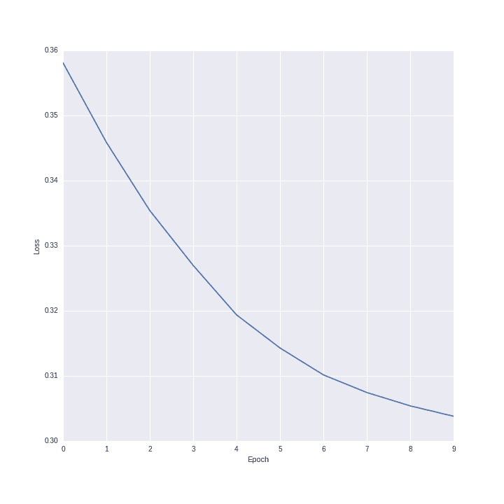
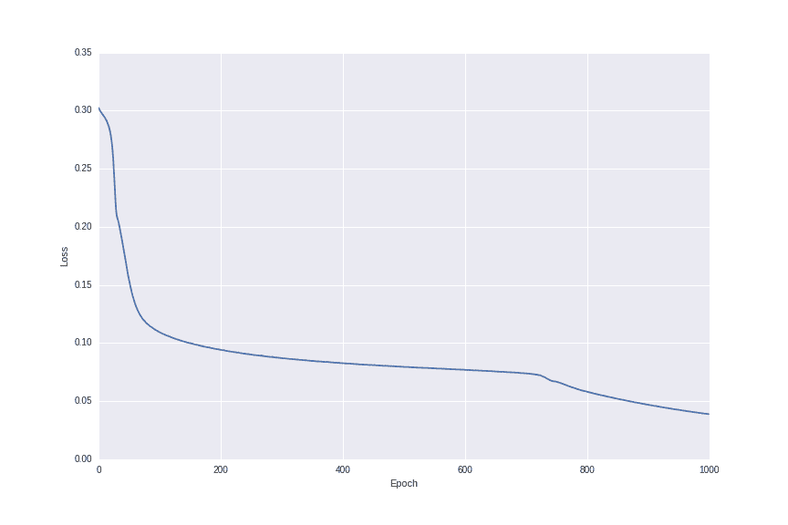

# 第十一章：使用深度神经网络在图像中进行对象检测

我们在第八章*，使用神经网络战胜 CAPTCHA*中使用了基本的神经网络。神经网络的研究正在创造许多领域中最先进和最精确的分类算法。本章介绍的概念与第八章*，使用神经网络战胜 CAPTCHA*中介绍的概念之间的区别在于*复杂性*。在本章中，我们将探讨深度神经网络，那些具有许多隐藏层的网络，以及用于处理特定类型信息（如图像）的更复杂的层类型。

这些进步是在计算能力提高的基础上实现的，使我们能够训练更大、更复杂的网络。然而，这些进步远不止于简单地投入更多的计算能力。新的算法和层类型极大地提高了性能，而不仅仅是计算能力。代价是这些新的分类器需要比其他数据挖掘分类器更多的数据来学习。

在本章中，我们将探讨确定图像中代表的是什么对象。像素值将被用作输入，然后神经网络将自动找到有用的像素组合来形成高级特征。这些特征将被用于实际的分类。

总体而言，在本章中，我们将探讨以下内容：

+   在图像中分类对象

+   不同的深度神经网络

+   使用 TensorFlow 和 Keras 库构建和训练神经网络

+   使用 GPU 提高算法的速度

+   使用基于云的服务为数据挖掘提供额外的计算能力

# 图像中的对象分类

计算机视觉正成为未来技术的重要组成部分。例如，我们将在不久的将来能够使用自动驾驶汽车 - 汽车制造商计划在 2017 年发布自动驾驶车型，并且已经部分实现自动驾驶。为了实现这一点，汽车的电脑需要能够看到周围的环境；识别障碍物、其他交通和天气状况；然后利用这些信息规划安全的行程。

虽然我们可以轻松地检测是否有障碍物，例如使用雷达，但了解那个物体是什么也同样重要。如果它是路上的动物，我们可以停车让它离开；如果它是一座建筑，这种策略效果不会很好！

# 用例

计算机视觉在许多场景中被使用。以下是一些它们的应用非常重要的例子。

+   在线地图网站，如谷歌地图，出于多种原因使用计算机视觉。其中一个原因是自动模糊他们发现的任何面孔，以给作为其街景功能一部分被拍摄的人提供一些隐私。

+   面部检测也被广泛应用于许多行业。现代相机自动检测面部，作为提高拍摄照片质量的一种手段（用户最常希望聚焦于可见的面部）。面部检测还可以用于识别。例如，Facebook 自动识别照片中的人，使得轻松标记朋友变得容易。

+   正如我们之前所述，自动驾驶汽车高度依赖于计算机视觉来识别它们的路径并避开障碍物。计算机视觉是正在解决的关键问题之一，这不仅是在自动驾驶汽车的研究中，不仅是为了消费使用，还包括采矿和其他行业。

+   其他行业也在使用计算机视觉，包括仓库自动检查货物缺陷。

+   太空产业也在使用计算机视觉，帮助自动化数据的收集。这对于有效使用航天器至关重要，因为从地球向火星上的漫游车发送信号可能需要很长时间，而且在某些时候（例如，当两颗行星不面对彼此时）是不可能的。随着我们开始更频繁地处理基于太空的车辆，并且从更远的距离处理，提高这些航天器的自主性是绝对必要的，而计算机视觉是这一过程中的关键部分。以下图片展示了 NASA 设计和使用的火星漫游车；它在识别一个陌生、不适宜居住的星球周围环境时，显著地使用了计算机视觉。


# 应用场景

在本章中，我们将构建一个系统，它将接受图像作为输入，并预测图像中的物体是什么。我们将扮演汽车视觉系统的角色，观察道路上的任何障碍物。图像的形式如下：


这个数据集来自一个流行的数据集，称为 CIFAR-10。它包含 60,000 张宽度为 32 像素、高度为 32 像素的图像，每个像素都有一个红绿蓝（RGB）值。数据集已经被分为训练集和测试集，尽管我们将在完成训练后才会使用测试数据集。

CIFAR-10 数据集可在[`www.cs.toronto.edu/~kriz/cifar.html`](http://www.cs.toronto.edu/~kriz/cifar.html)下载。

下载 Python 版本，它已经被转换成 NumPy 数组。

打开一个新的 Jupyter Notebook，我们可以看到数据的样子。首先，我们设置数据文件名。我们最初只关注第一批数据，并在最后扩大到整个数据集的大小；

```py
import os
data_folder = os.path.join(os.path.expanduser("~"), "Data", "cifar-10-batches-py") 
batch1_filename = os.path.join(data_folder, "data_batch_1")

```

接下来，我们创建一个函数来读取存储在批次中的数据。这些批次是使用 pickle 保存的，pickle 是一个用于保存对象的 Python 库。通常，我们只需在文件上调用`pickle.load(file)`来获取对象。然而，这个数据存在一个小问题：它是在 Python 2 中保存的，但我们需要在 Python 3 中打开它。为了解决这个问题，我们将编码设置为`latin`（即使我们是以字节模式打开的）：

```py
import pickle
# Bugfix thanks to: http://stackoverflow.com/questions/11305790/pickle-incompatability-of-numpy-arrays-between-python-2-and-3 
def unpickle(filename): 
    with open(filename, 'rb') as fo: 
        return pickle.load(fo, encoding='latin1')

```

使用这个函数，我们现在可以加载批数据集：

```py
batch1 = unpickle(batch1_filename)

```

这个批次是一个字典，包含实际数据（NumPy 数组）、相应的标签和文件名，以及一个说明它是哪个批次的注释（例如，这是 5 个训练批次中的第 1 个）。

我们可以通过使用批次的索引来提取图片：

```py
image_index = 100 
image = batch1['data'][image_index]

```

图片数组是一个包含 3072 个条目的 NumPy 数组，范围从 0 到 255。每个值是图像中特定位置的红色、绿色或蓝色强度。

这些图片的格式与 matplotlib 通常使用的格式不同（用于显示图片），因此为了显示图片，我们首先需要重塑数组并旋转矩阵。这对训练我们的神经网络来说并不重要（我们将以适合数据的方式定义我们的网络），但我们确实需要将其转换为 matplotlib 的原因：

```py
image = image.reshape((32,32, 3), order='F') 
import numpy as np 
image = np.rot90(image, -1)

```

现在我们可以使用 matplotlib 显示图片：

```py
%matplotlib inline

from matplotlib import pyplot as plt 
plt.imshow(image)

```

结果图像，一艘船，被显示出来：


这张图片的分辨率相当低——它只有 32 像素宽和 32 像素高。尽管如此，大多数人看到这张图片时都会看到一个船。我们能否让计算机做到同样的事情？

你可以更改图片索引来显示不同的图片，从而了解数据集的特性。

本章我们的项目目标是构建一个分类系统，它可以接受这样的图片并预测其中的物体是什么。但在我们这样做之前，我们将绕道学习我们将要使用的分类器：**深度神经网络**。

# 深度神经网络

我们在第八章*，使用神经网络战胜 CAPTCHA*中使用的神经网络具有一些出色的*理论*特性。例如，学习任何映射只需要一个隐藏层（尽管中间层的大小可能需要非常大）。由于这种理论上的完美，神经网络在 20 世纪 70 年代和 80 年代是一个非常活跃的研究领域。然而，一些问题导致它们不再受欢迎，尤其是与其他分类算法（如支持向量机）相比。以下是一些主要问题：

+   主要问题之一是运行许多神经网络所需的计算能力超过了其他算法，也超过了许多人能够访问的能力。

+   另一个问题是在训练网络。虽然反向传播算法已经为人所知有一段时间了，但它在大网络中存在问题，需要大量的训练才能使权重稳定。

这些问题在最近得到了解决，导致神经网络再次受到欢迎。计算能力现在比 30 年前更容易获得，算法训练的进步意味着我们现在可以轻松地使用这种能力。

# 直觉

区分**深度神经网络**和我们在第八章*，使用神经网络击败 CAPTCHA*中看到的基本神经网络的方面是尺寸。

当神经网络有两个或更多隐藏层时，它被认为是深度神经网络。在实践中，深度神经网络通常更大，不仅每层的节点数量更多，而且层数也更多。虽然 2005 年中期的某些研究关注了非常大的层数，但更智能的算法正在减少实际所需的层数。

尺寸是一个区分因素，但新的层类型和神经网络结构正帮助创建特定领域的深度神经网络。我们已经看到了由**密集层**组成的正向神经网络。这意味着我们有一系列按顺序排列的层，其中每一层的每个神经元都与另一层的每个神经元相连。其他类型包括：

+   **卷积神经网络**（**CNN**）用于图像分析。在这种情况下，图像的一个小段被作为一个单独的输入，然后这个输入被传递到池化层以组合这些输出。这有助于处理图像的旋转和平移等问题。我们将在这章中使用这些网络。

+   **循环神经网络**（**RNN**）用于文本和时间序列分析。在这种情况下，神经网络的前一个状态被记住并用于改变当前输出。想想句子中的前一个词如何修改短语中当前词的输出：*美国*。最受欢迎的类型之一是 LSTM 循环网络，代表**长短期记忆**。

+   **自编码器**，它学习从输入通过一个隐藏层（通常节点较少）回到输入的映射。这找到了输入数据的压缩，并且这个层可以在其他神经网络中重用，从而减少所需的标记训练数据量。

神经网络有更多更多类型。对深度神经网络的应用和理论研究每个月都在发现越来越多的神经网络形式。有些是为通用学习设计的，有些是为特定任务设计的。此外，还有多种方法可以组合层、调整参数以及改变学习策略。例如，**dropout 层**在训练过程中随机将一些权重减少到零，迫使神经网络的所有部分学习良好的权重。

尽管有所有这些差异，神经网络通常被设计为接受非常基本的特征作为输入——在计算机视觉的情况下，是简单的像素值。随着这些数据在网络上结合并传递，这些基本特征组合成更复杂的特征。有时，这些特征对人类来说意义不大，但它们代表了计算机寻找以进行分类的样本的方面。

# 深度神经网络的实现

由于这些深度神经网络的大小，实现它们可能相当具有挑战性。一个糟糕的实现将比一个好的实现运行时间更长，并且可能由于内存使用而根本无法运行。

一个神经网络的基本实现可能从创建一个节点类并将这些节点集合到一个层类开始。然后，每个节点通过一个*Edge*类的实例连接到下一层的节点。这种基于类的实现对于展示网络如何操作是好的，但对于更大的网络来说效率太低。神经网络有太多的动态部分，这种策略效率不高。

相反，大多数神经网络操作都可以表示为矩阵上的数学表达式。一个网络层与下一个网络层之间连接的权重可以表示为一个值矩阵，其中行代表第一层的节点，列代表第二层的节点（有时也使用这个矩阵的转置）。这个值是层与层之间边的权重。一个网络可以定义为这些权重矩阵的集合。除了节点外，我们还在每一层添加一个偏差项，这基本上是一个始终开启并连接到下一层每个神经元的节点。

这种洞察力使我们能够使用矩阵运算来构建、训练和使用神经网络，而不是创建基于类的实现。这些数学运算非常出色，因为已经编写了许多高度优化的代码库，我们可以使用它们以尽可能高效的方式执行这些计算。

我们在第八章*，使用神经网络战胜 CAPTCHA*中使用的 scikit-learn 实现确实包含了一些构建神经网络的特性，但缺乏该领域的一些最新进展。然而，对于更大和更定制的网络，我们需要一个能给我们更多权力的库。我们将使用**Keras**库来创建我们的深度神经网络。

在本章中，我们将首先使用 Keras 实现一个基本的神经网络，然后（几乎）复制第八章*，使用神经网络战胜 CAPTCHA*中的实验，在预测图像中的哪个字母。最后，我们将使用一个更复杂的卷积神经网络在 CIFAR 数据集上执行图像分类，这还将包括在 GPU 上而不是 CPU 上运行以提高性能。

Keras 是用于实现深度神经网络的图计算库的高级接口。图计算库概述了一系列操作，然后稍后计算这些值。这些非常适合矩阵操作，因为它们可以用来表示数据流，将这些数据流分配到多个系统，并执行其他优化。Keras 可以在底层使用两种图计算库中的任意一种。第一种称为**Theano**，它稍微老一些，但拥有强大的支持（并在本书的第一版中使用过），第二种是 Google 最近发布的**TensorFlow**，它是许多深度学习背后的库。最终，您可以在本章中使用这两个库中的任意一个。

# TensorFlow 简介

TensorFlow 是由 Google 工程师设计的图计算库，并且开始为 Google 在**深度学习**和**人工智能**方面的许多最新进展提供动力。

图计算库有两个步骤。它们如下列出：

1.  定义一系列操作序列（或更复杂的图），这些操作接受输入数据，对其进行操作，并将其转换为输出。

1.  使用步骤 1 中获得的图和给定的输入进行计算。

许多程序员在日常工作中不使用这种类型的编程，但他们中的大多数人与一个相关的系统交互。关系数据库，特别是基于 SQL 的数据库，使用一个类似的概念，称为声明性范式。虽然程序员可能在数据库上定义一个带有`WHERE`子句的`SELECT`查询，但数据库会解释它并根据多个因素创建一个优化的查询，例如`WHERE`子句是否应用于主键，数据存储的格式，以及其他因素。程序员定义他们想要的，系统确定如何实现。

您可以使用 Anaconda 安装 TensorFlow：conda install tensorflow

对于更多选项，Google 有一个详细的安装页面[`www.tensorflow.org/get_started/os_setup`](https://www.tensorflow.org/get_started/os_setup)

使用 TensorFlow，我们可以定义许多在标量、数组、矩阵以及其他数学表达式上工作的函数类型。例如，我们可以创建一个计算给定二次方程值的图：

```py
import tensorflow as tf

# Define the parameters of the equation as constant values
a = tf.constant(5.0)
b = tf.constant(4.5)
c = tf.constant(3.0)

# Define the variable x, which lets its value be changed
x = tf.Variable(0., name='x')  # Default of 0.0

# Define the output y, which is an operation on a, b, c and x
y = (a * x ** 2) + (b * x) + c

```

这个*y*对象是一个张量对象。它还没有值，因为这还没有被计算。我们所做的只是创建了一个声明如下图的图：

*当我们计算 y 时，首先取 x 的平方值并乘以 a，然后加上 b 倍的 x，最后再加上 c 得到结果。*

图本身可以通过 TensorFlow 查看。以下是一些在 Jupyter Notebook 中可视化此图的代码，由 StackOverflow 用户 Yaroslav Bulatov 提供（参见此答案：[`stackoverflow.com/a/38192374/307363`](http://stackoverflow.com/a/38192374/307363))：

```py
from IPython.display import clear_output, Image, display, HTML

def strip_consts(graph_def, max_const_size=32):
    """Strip large constant values from graph_def."""
    strip_def = tf.GraphDef()
    for n0 in graph_def.node:
        n = strip_def.node.add() 
        n.MergeFrom(n0)
        if n.op == 'Const':
            tensor = n.attr['value'].tensor
            size = len(tensor.tensor_content)
            if size > max_const_size:
                tensor.tensor_content = "<stripped %d bytes>"%size
    return strip_def

def show_graph(graph_def, max_const_size=32):
    """Visualize TensorFlow graph."""
    if hasattr(graph_def, 'as_graph_def'):
        graph_def = graph_def.as_graph_def()
    strip_def = strip_consts(graph_def, max_const_size=max_const_size)
    code = """
        <script>
          function load() {{
            document.getElementById("{id}").pbtxt = {data};
          }}
        </script>
        <link rel="import" href="https://tensorboard.appspot.com/tf-graph-basic.build.html" onload=load()>
        <div style="height:600px">
          <tf-graph-basic id="{id}"></tf-graph-basic>
        </div>
    """.format(data=repr(str(strip_def)), id='graph'+str(np.random.rand()))

    iframe = """
        <iframe seamless style="width:1200px;height:620px;border:0" srcdoc="{}"></iframe>
    """.format(code.replace('"', '&quot;'))
    display(HTML(iframe))

```

然后，我们可以在新的单元格中使用此代码进行实际的可视化：

```py
show_graph(tf.get_default_graph().as_graph_def())

```

结果显示了这些操作如何在有向图中链接。可视化平台称为 **TensorBoard**，它是 TensorFlow 的一部分：


当我们想要计算 y 的值时，我们需要通过图中的其他节点传递 x 的值，这些节点在上图中被称为 OpNodes，简称 *操作节点*。

到目前为止，我们已经定义了图本身。下一步是计算值。我们可以用多种方式来做这件事，特别是考虑到 x 是一个变量。要使用当前 x 的值来计算 y，我们创建一个 TensorFlow Session 对象，然后让它运行 y：

```py
model = tf.global_variables_initializer()
with tf.Session() as session:
    session.run(model)
    result = session.run(y)
print(result)

```

第一行初始化变量。TensorFlow 允许你指定操作范围和命名空间。在此阶段，我们只是使用全局命名空间，这个函数是一个方便的快捷方式来正确初始化这个范围，这可以被视为 TensorFlow 编译图所需的步骤。

第二步创建一个新的会话，该会话将运行模型本身。`tf.global_variables_initializer()` 的结果本身是图上的一个操作，必须执行才能发生。下一行实际上运行变量 y，它计算计算 y 值所需的必要 OpNodes。在我们的例子中，那就是所有节点，但可能更大的图可能不需要计算所有节点 - TensorFlow 将只做足够的工作来得到答案，而不会更多。

如果你收到一个错误，说 `global_variables_initializer` 未定义，请将其替换为 `initialize_all_variables` - 接口最近已更改。

打印结果给出了我们的值为 3。

我们还可以执行其他操作，例如更改 x 的值。例如，我们可以创建一个赋值操作，将新值赋给现有的变量。在这个例子中，我们将 x 的值改为 10，然后计算 y，结果为 548。

```py
model = tf.global_variables_initializer()
with tf.Session() as session:
    session.run(model)
    session.run(x.assign(10))
    result = session.run(y)
print(result)

```

虽然这个简单的例子可能看起来并不比我们用 Python 能做的更强大，但 TensorFlow（和 Theano）提供了大量的分布式选项，用于在多台计算机上计算更大的网络，并为此进行了优化。这两个库还包含额外的工具，用于保存和加载网络，包括值，这使得我们可以保存在这些库中创建的模型。

# 使用 Keras

TensorFlow 不是一个直接构建神经网络的库。以类似的方式，NumPy 不是一个执行数据挖掘的库；它只是做繁重的工作，通常用于其他库。TensorFlow 包含一个内置库，称为 TensorFlow Learn，用于构建网络和执行数据挖掘。其他库，如 Keras，也是出于这个目的而构建的，并在后端使用 TensorFlow。

Keras 实现了许多现代类型的神经网络层及其构建块。在本章中，我们将使用卷积层，这些层旨在模仿人类视觉的工作方式。它们使用连接的神经元的小集合，只分析输入值的一部分——在这种情况下，是图像。这使得网络能够处理标准的改变，例如处理图像的平移。在基于视觉的实验中，卷积层处理的一个改变示例是图像的平移。

相比之下，传统的神经网络通常连接非常紧密——一个层的所有神经元都连接到下一层的所有神经元。这被称为密集层。

Keras 中神经网络的标准模型是**Sequential**模型，它通过传递一个层列表来创建。输入（X_train）被提供给第一层，其输出被提供给下一层，依此类推，在一个标准的正向传播配置中。

在 Keras 中构建神经网络比仅使用 TensorFlow 构建要容易得多。除非你对神经网络结构进行高度定制的修改，我强烈建议使用 Keras。

为了展示使用 Keras 进行神经网络的基本方法，我们将实现一个基本网络，基于我们在第一章*，数据挖掘入门*中看到的 Iris 数据集。Iris 数据集非常适合测试新的算法，即使是复杂的算法，如深度神经网络。

首先，打开一个新的 Jupyter Notebook。我们将在本章的后面回到包含 CIFAR 数据的 Notebook。

接下来，我们加载数据集：

```py
import numpy as np
from sklearn.datasets import load_iris 
iris = load_iris() 
X = iris.data.astype(np.float32) 
y_true = iris.target.astype(np.int32)

```

当处理像 TensorFlow 这样的库时，最好对数据类型非常明确。虽然 Python 乐于隐式地将一种数值数据类型转换为另一种，但像 TensorFlow 这样的库是围绕底层代码（在这种情况下，是 C++）的包装器。这些库并不能总是转换数值数据类型。

我们当前的输出是一个单维度的分类值数组（0、1 或 2，取决于类别）。神经网络*可以*以这种格式输出数据，但*常规做法*是神经网络有*n*个输出，其中*n*是类别的数量。因此，我们使用 one-hot 编码将我们的分类 y 转换为 one-hot 编码的`y_onehot`：

```py
from sklearn.preprocessing import OneHotEncoder

y_onehot = OneHotEncoder().fit_transform(y_true.reshape(-1, 1))
y_onehot = y_onehot.astype(np.int64).todense()

```

然后，我们将数据集分为训练集和测试集：

```py
from sklearn.model_selection import train_test_split
X_train, X_test, y_train, y_test = train_test_split(X, y_onehot, random_state=14)

```

接下来，我们通过创建不同的层来构建我们的网络。我们的数据集包含四个输入变量和三个输出类别。这给出了第一层和最后一层的大小，但不是中间层的大小。对这个数字进行尝试将给出不同的结果，尝试不同的值以查看会发生什么是有价值的。我们将从一个具有以下维度的小型网络开始：

```py
input_layer_size, hidden_layer_size, output_layer_size = 4, 6, 3

```

接下来，我们创建我们的隐藏层和输出层（输入层是隐式的）。在这个例子中，我们将使用 Dense 层：

```py
from keras.layers import Dense
hidden_layer = Dense(output_dim=hidden_layer_size, input_dim=input_layer_size, activation='relu')
output_layer = Dense(output_layer_size, activation='sigmoid')

```

我鼓励你尝试调整激活值，看看它如何影响结果。这里的值如果你对问题没有更多信息的话是很好的默认值。也就是说，对于隐藏层使用`relu`，对于输出层使用`sigmoid`。

然后，我们将层组合成一个 Sequential 模型：

```py
from keras.models import Sequential
model = Sequential(layers=[hidden_layer, output_layer])

```

从这里开始的一个必要步骤是编译网络，这会创建图。在编译步骤中，我们得到了有关网络如何训练和评估的信息。这里的值定义了神经网络试图训练以减少什么，在下面的例子中，它是输出神经元和它们的期望值之间的均方误差。优化器的选择在很大程度上影响了它执行此操作的效率，通常需要在速度和内存使用之间进行权衡。

```py
model.compile(loss='mean_squared_error',
              optimizer='adam',
              metrics=['accuracy'])

```

我们随后使用`fit`函数来训练我们的模型。Keras 模型从`fit()`函数返回一个历史对象，这使我们能够以细粒度级别查看数据。

```py
history = model.fit(X_train, y_train)

```

你将得到相当多的输出。神经网络将训练 10 个 epoch，这些是训练周期，包括取训练数据，通过神经网络运行它，更新权重并评估结果。如果你调查历史对象（尝试`print(history.history)`），你将看到在每个 epoch 之后损失函数的分数（越低越好）。还包括准确度，越高越好。你可能还会注意到它并没有真正改善多少。

我们可以使用`matplotlib`绘制历史对象：

```py
import seaborn as sns
from matplotlib import pyplot as plt

plt.plot(history.epoch, history.history['loss'])
plt.xlabel("Epoch")
plt.ylabel("Loss")

```



当训练损失在下降时，下降得并不快。这是神经网络的一个问题——它们训练得很慢。默认情况下，fit 函数只会执行 10 个 epoch，这对于几乎所有应用来说都远远不够。为了看到这一点，使用神经网络预测测试集并运行分类报告：

```py
from sklearn.metrics import classification_report
y_pred = model.predict_classes(X_test)
print(classification_report(y_true=y_test.argmax(axis=1), y_pred=y_pred))

```

结果相当糟糕，整体 f1 分数为 0.07，分类器仅对所有实例预测类别 2。起初，可能会觉得神经网络并不那么出色，但让我们看看当我们训练 1000 个 epoch 时会发生什么：

```py
history = model.fit(X_train, y_train, nb_epoch=1000, verbose=False)

```

再次可视化每个 epoch 的损失，当运行像神经网络这样的迭代算法时，这是一个非常有用的可视化，使用上述代码显示了一个非常不同的故事：



最后，我们再次执行分类报告以查看结果：

```py
y_pred = model.predict_classes(X_test)
print(classification_report(y_true=y_test.argmax(axis=1), y_pred=y_pred))

```

完美。

# 卷积神经网络

要开始使用 Keras 进行图像分析，我们将重新实现第八章*，使用神经网络击败 CAPTCHAs*中使用的示例，以预测图像中代表的是哪个字母。我们将重新创建第八章*，使用神经网络击败 CAPTCHAs*中使用的密集神经网络。首先，我们需要再次在我们的笔记本中输入我们的数据集构建代码。关于此代码的描述，请参阅第八章*，使用神经网络击败 CAPTCHAs*（请记住更新 Coval 字体的文件位置）：

```py
import numpy as np 
from PIL import Image, ImageDraw, ImageFont 
from skimage import transform as tf

def create_captcha(text, shear=0, size=(100, 30), scale=1):
    im = Image.new("L", size, "black")
    draw = ImageDraw.Draw(im)
    font = ImageFont.truetype(r"bretan/Coval-Black.otf", 22) 
    draw.text((0, 0), text, fill=1, font=font)
    image = np.array(im)
    affine_tf = tf.AffineTransform(shear=shear)
    image = tf.warp(image, affine_tf)
    image = image / image.max()
    shape = image.shape
    # Apply scale
    shapex, shapey = (shape[0] * scale, shape[1] * scale)
    image = tf.resize(image, (shapex, shapey))
    return image

from skimage.measure import label, regionprops
from skimage.filters import threshold_otsu
from skimage.morphology import closing, square

def segment_image(image):
    # label will find subimages of connected non-black pixels
    labeled_image = label(image>0.2, connectivity=1, background=0)
    subimages = []
    # regionprops splits up the subimages
    for region in regionprops(labeled_image):
        # Extract the subimage
        start_x, start_y, end_x, end_y = region.bbox
        subimages.append(image[start_x:end_x,start_y:end_y])
    if len(subimages) == 0:
        # No subimages found, so return the entire image
        return [image,]
    return subimages

from sklearn.utils import check_random_state
random_state = check_random_state(14) 
letters = list("ABCDEFGHIJKLMNOPQRSTUVWXYZ")
assert len(letters) == 26
shear_values = np.arange(0, 0.8, 0.05)
scale_values = np.arange(0.9, 1.1, 0.1)

def generate_sample(random_state=None): 
    random_state = check_random_state(random_state) 
    letter = random_state.choice(letters) 
    shear = random_state.choice(shear_values)
    scale = random_state.choice(scale_values)
    return create_captcha(letter, shear=shear, size=(30, 30), scale=scale), letters.index(letter)

dataset, targets = zip(*(generate_sample(random_state) for i in range(1000)))
dataset = np.array([tf.resize(segment_image(sample)[0], (20, 20)) for sample in dataset])
dataset = np.array(dataset, dtype='float') 
targets = np.array(targets)

from sklearn.preprocessing import OneHotEncoder 
onehot = OneHotEncoder() 
y = onehot.fit_transform(targets.reshape(targets.shape[0],1))
y = y.todense()

X = dataset.reshape((dataset.shape[0], dataset.shape[1] * dataset.shape[2]))

from sklearn.model_selection import train_test_split 
X_train, X_test, y_train, y_test = train_test_split(X, y, train_size=0.9)

```

在重新运行所有这些代码之后，你将得到一个类似于第八章*，使用神经网络击败 CAPTCHAs*实验的数据集。接下来，我们不再使用 scikit-learn 来构建我们的神经网络，而是将使用 Keras。

首先，我们创建了两个**密集**层，并将它们组合在一个**顺序**模型中。我选择在隐藏层中放置 100 个神经元。

```py
from keras.layers import Dense
from keras.models import Sequential
hidden_layer = Dense(100, input_dim=X_train.shape[1])
output_layer = Dense(y_train.shape[1])
# Create the model
model = Sequential(layers=[hidden_layer, output_layer])
model.compile(loss='mean_squared_error', optimizer='adam', metrics=['accuracy'])

```

然后，我们拟合模型。和之前一样，你将希望有相当多的周期数。我再次使用了 1000，如果你想得到更好的结果，你可以增加这个数字。

```py
model.fit(X_train, y_train, nb_epoch=1000, verbose=False)
y_pred = model.predict(X_test)

```

你还可以收集结果的历史对象，就像我们在 Iris 示例中所做的那样，以进一步调查训练情况。

```py
from sklearn.metrics import classification_report
print(classification_report(y_pred=y_pred.argmax(axis=1),
y_true=y_test.argmax(axis=1)))

```

再次，完美。

至少，在我的机器上是这样的，但你的结果可能会有所不同。

# GPU 优化

神经网络可以变得相当大。这对内存使用有一些影响；然而，像稀疏矩阵这样的高效结构意味着我们通常不会遇到在内存中拟合神经网络的问题。

当神经网络变得很大时，主要问题在于它们计算所需的时间非常长。此外，一些数据集和神经网络可能需要运行许多个训练周期才能得到对数据集的良好拟合。

我们在本章中将要训练的神经网络在我的性能相当强大的计算机上每个周期需要超过 8 分钟，我们预计要运行数十个，甚至数百个周期。一些更大的网络可能需要数小时来训练单个周期。为了获得最佳性能，你可能需要考虑数千个训练周期。

神经网络规模的增长会导致训练时间变长。

一个积极因素是，神经网络在其核心中充满了浮点运算。此外，还有大量可以并行执行的操作，因为神经网络训练主要由矩阵运算组成。这些因素意味着在 GPU 上进行计算是一个吸引人的选项，可以加快这一训练过程。

# 何时使用 GPU 进行计算

GPU 最初是为了渲染显示图形而设计的。这些图形使用矩阵和那些矩阵上的数学方程来表示，然后被转换成我们在屏幕上看到的像素。这个过程涉及到大量的并行计算。虽然现代 CPU 可能有多个核心（你的电脑可能有 2 个、4 个，甚至 16 个或更多！），但 GPU 有数千个专为图形设计的小核心。

CPU 更适合顺序任务，因为核心通常单独运行得更快，像访问计算机内存这样的任务也更有效率。实际上，让 CPU 做重活更容易。几乎每个机器学习库默认都使用 CPU，在使用 GPU 进行计算之前，你需要做额外的工作。好处可能非常显著。

因此，GPU 更适合那些有很多小操作可以在同一时间进行的任务。许多机器学习任务都是这样的，通过使用 GPU 可以带来效率的提升。

让你的代码在 GPU 上运行可能是一个令人沮丧的经历。这很大程度上取决于你有什么类型的 GPU，它的配置如何，你的操作系统，以及你是否准备对你的电脑做一些低级更改。

幸运的是，Keras 会自动使用 GPU 进行操作，如果操作适合，并且可以找到 GPU（如果你使用 TensorFlow 作为后端）。然而，你仍然需要设置你的电脑，以便 Keras 和 TensorFlow 可以找到 GPU。

有三条主要途径可以选择：

+   第一条途径是查看你的电脑，搜索你的 GPU 和操作系统的工具和驱动程序，探索许多教程中的几个，找到一个适合你情况的教程。这能否成功取决于你的系统是什么样的。尽管如此，这个场景比几年前容易得多，因为现在有更好的工具和驱动程序可以执行 GPU 启用计算。

+   第二条途径是选择一个系统，找到设置它的良好文档，然后购买一个与之匹配的系统。这样做效果会更好，但可能相当昂贵——在大多数现代计算机中，GPU 是成本最高的部件之一。如果你想要从系统中获得出色的性能，你需要一个非常好的 GPU，这可能会非常昂贵。如果你是一家企业（或者有更多的资金可以花费），你可以购买专门用于深度学习的高端 GPU，并与供应商直接交谈以确保你获得正确的硬件。

+   第三条途径是使用已经配置好用于此目的的虚拟机。例如，Altoros Systems 已经创建了一个在亚马逊云服务上运行的系统。运行这个系统需要花费一定的费用，但价格远低于新电脑的价格。根据您的位置、您获得的精确系统和您使用的频率，您可能每小时只需花费不到 1 美元，通常还要低得多。如果您在亚马逊云服务中使用 spot 实例，您只需每小时几分钱就可以运行它们（尽管，您需要单独开发可以在 spot 实例上运行的代码）。

如果您无法承担虚拟机的运行成本，我建议您考虑第一条途径，即使用您当前的系统。您也可能能够从经常更新电脑的家庭成员或朋友那里购买到一台不错的二手 GPU（游戏玩家朋友在这方面很棒！）。

# 在 GPU 上运行我们的代码

我们在本章中将选择第三条途径，基于 Altoros Systems 的基础系统创建一个虚拟机。这个虚拟机将在亚马逊的 EC2 服务上运行。还有许多其他 Web 服务可以使用，每种服务的流程都会略有不同。在本节中，我将概述亚马逊的流程。

如果您想使用自己的计算机并且已经配置好以运行 GPU 启用计算，请自由跳过本节。

您可以了解更多关于如何设置的信息，请参阅[`aws.amazon.com/marketplace/pp/B01H1VWUOY?qid=1485755720051&sr=0-1&ref_=srh_res_product_title`](https://aws.amazon.com/marketplace/pp/B01H1VWUOY?qid=1485755720051&sr=0-1&ref_=srh_res_product_title)

1.  首先，请访问 AWS 控制台：[`console.aws.amazon.com/console/home?region=us-east-1`](https://console.aws.amazon.com/console/home?region=us-east-1)

1.  使用您的亚马逊账户登录。如果您没有账户，系统将提示您创建一个，您需要创建一个账户才能继续。

1.  接下来，请访问以下 EC2 服务控制台：[`console.aws.amazon.com/ec2/v2/home?region=us-east-1.`](https://console.aws.amazon.com/ec2/v2/home?region=us-east-1.)

1.  点击“启动实例”，并在右上角的下拉菜单中选择 N. California 作为您的位置。

1.  点击“社区 AMI”，搜索由 Altoros Systems 创建的带有 TensorFlow（GPU）的 Ubuntu x64 AMI。然后，点击“选择”。在下一屏幕上，选择 g2.2xlarge 作为机器类型，然后点击“审查和启动”。在下一屏幕上，点击“启动”。

1.  在此阶段，您将开始收费，所以请记住，当您完成使用机器时请关闭它们。您可以去 EC2 服务，选择机器，然后停止它。对于未运行的机器，您将不会产生费用。

1.  您将收到一些有关如何连接到您实例的信息。如果您之前没有使用过 AWS，您可能需要创建一个新的密钥对以安全地连接到您的实例。在这种情况下，给您的密钥对起一个名字，下载 pem 文件，并将其存储在安全的地方——如果丢失，您将无法再次连接到您的实例！

1.  点击“连接”以获取有关如何使用 pem 文件连接到您的实例的信息。最可能的情况是您将使用以下命令使用 ssh：

```py
ssh -i <certificante_name>.pem ubuntu@<server_ip_address>

```

# 设置环境

接下来，我们需要将我们的代码放到机器上。有许多方法可以将此文件放到您的计算机上，但其中一种最简单的方法就是直接复制粘贴内容。

首先，打开我们之前使用的 Jupyter Notebook（在您的计算机上，而不是在亚马逊虚拟机上）。在笔记本本身有一个菜单。点击文件，然后选择下载为。选择 Python 并将其保存到您的计算机。此过程将 Jupyter Notebook 中的代码下载为可以在命令行中运行的 Python 脚本。

打开此文件（在某些系统上，您可能需要右键单击并使用文本编辑器打开）。选择所有内容并将它们复制到您的剪贴板。

在亚马逊虚拟机上，移动到主目录并使用新文件名打开 nano：

```py
$ cd~/

$ nano chapter11script.py

```

nano 程序将打开，这是一个命令行文本编辑器。

打开此程序，将剪贴板的内容粘贴到该文件中。在某些系统上，您可能需要使用 ssh 程序的文件选项，而不是按 Ctrl+V 粘贴。

在 nano 中，按 Ctrl+O 保存文件到磁盘，然后按 Ctrl+X 退出程序。

您还需要字体文件。最简单的方法是从原始位置重新下载它。为此，请输入以下内容：

```py
$ wget http://openfontlibrary.org/assets/downloads/bretan/680bc56bbeeca95353ede363a3744fdf/bretan.zip

$ sudo apt-get install unzip

$ unzip -p bretan.zip

```

在虚拟机中，您可以使用以下命令运行程序：

```py
$ python chapter11script.py

```

程序将像在 Jupyter Notebook 中一样运行，并将结果打印到命令行。

结果应该与之前相同，但实际训练和测试神经网络的速度将快得多。请注意，在其他程序方面，它不会快那么多——我们没有编写 CAPTCHA 数据集创建以使用 GPU，因此我们不会在那里获得加速。

您可能希望关闭亚马逊虚拟机以节省一些费用；我们将在本章末尾使用它来运行我们的主要实验，但首先将在您的计算机上开发代码。

# 应用

现在，回到您的计算机上，打开我们本章创建的第一个 Jupyter Notebook——我们加载 CIFAR 数据集的那个。在这个主要实验中，我们将使用 CIFAR 数据集，创建一个深度卷积神经网络，然后在我们的基于 GPU 的虚拟机上运行它。

# 获取数据

首先，我们将我们的 CIFAR 图像和它们一起创建一个数据集。与之前不同，我们将保留像素结构——即在行和列中。首先，将所有批次加载到一个列表中：

```py
import os
import numpy as np 

data_folder = os.path.join(os.path.expanduser("~"), "Data", "cifar-10-batches-py")

batches = [] 
for i in range(1, 6):
    batch_filename = os.path.join(data_folder, "data_batch_{}".format(i))
    batches.append(unpickle(batch_filename)) 
    break

```

最后的行，即 break，是为了测试代码——这将大大减少训练示例的数量，让你可以快速看到代码是否工作。我会在你测试代码工作后提示你删除这一行。

接下来，通过将这些批次堆叠在一起来创建一个数据集。我们使用 NumPy 的 vstack，这可以想象为向数组的末尾添加行：

```py
X = np.vstack([batch['data'] for batch in batches])

```

然后，我们将数据集归一化到 0 到 1 的范围，并强制类型为 32 位浮点数（这是 GPU 启用虚拟机可以运行的唯一数据类型）：

```py
X = np.array(X) / X.max() 
X = X.astype(np.float32)

```

然后，我们对类别做同样的处理，除了我们执行一个 hstack，这类似于向数组的末尾添加列。然后我们可以使用 OneHotEncoder 将其转换为 one-hot 数组。这里我将展示一个使用 Keras 中提供的实用函数的替代方法，但结果是一样的：

```py
from keras.utils import np_utils
y = np.hstack(batch['labels'] for batch in batches).flatten()
nb_classes = len(np.unique(y))
y = np_utils.to_categorical(y, nb_classes)

```

接下来，我们将数据集分为训练集和测试集：

```py
from sklearn.model_selection import train_test_split
X_train, X_test, y_train, y_test = train_test_split(X, y, test_size=0.2)

```

接下来，我们将数组重塑以保留原始数据结构。原始数据是 32x32 像素的图像，每个像素有 3 个值（红色、绿色和蓝色值）。虽然标准的正向传播神经网络只接受单个输入数据数组（参见 CAPTCHA 示例），但卷积神经网络是为图像设计的，并接受三维图像数据（2-D 图像，以及包含颜色深度的另一个维度）。

```py
X_train = X_train.reshape(-1, 3, 32, 32)
X_test = X_test.reshape(-1, 3, 32, 32)
n_samples, d, h, w = X_train.shape  # Obtain dataset dimensions
# Convert to floats and ensure data is normalised.
X_train = X_train.astype('float32')
X_test = X_test.astype('float32')

```

现在，我们有一个熟悉的训练和测试数据集，以及每个目标类。我们现在可以构建分类器。

# 创建神经网络

现在，我们将构建卷积神经网络。我已经进行了一些调整，发现了一个效果很好的布局，但你可以自由地尝试更多层（或更少层）、不同类型和不同大小的层。较小的网络训练更快，但较大的网络可以实现更好的结果。

首先，我们创建神经网络中的层：

```py
from keras.layers import Dense, Flatten, Convolution2D, MaxPooling2D
conv1 = Convolution2D(32, 3, 3, input_shape=(d, h, w), activation='relu')
pool1 = MaxPooling2D()
conv2 = Convolution2D(64, 2, 2, activation='relu')
pool2 = MaxPooling2D()
conv3 = Convolution2D(128, 2, 2, activation='relu')
pool3 = MaxPooling2D()
flatten = Flatten()
hidden4 = Dense(500, activation='relu')
hidden5 = Dense(500, activation='relu')
output = Dense(nb_classes, activation='softmax')
layers = [conv1, pool1,
          conv2, pool2,
          conv3, pool3,
          flatten, hidden4, hidden5,
          output]

```

我们使用密集层作为最后三层，按照正常的正向传播神经网络，但在那之前，我们使用结合了池化层的卷积层。我们有三组这样的层。

对于每一对 Convolution2D 和 MaxPooling2D 层，发生以下情况：

1.  Convolution2D 网络从输入数据中获取补丁。这些通过一个过滤器传递，这是一个类似于支持向量机使用的核操作符的矩阵变换。过滤器是一个较小的矩阵，大小为 k 乘以 n（在上面的 Convolution2D 初始化器中指定为 3x3），它应用于图像中找到的每个 k 乘以 n 模式。结果是卷积特征。

1.  MaxPooling2D 层从 Convolution2D 层获取结果，并为每个卷积特征找到最大值。

虽然这确实丢弃了很多信息，但这实际上有助于图像检测。如果一个图像中的对象只是向右偏移了几像素，标准的神经网络会认为它是一个全新的图像。相比之下，卷积层会找到它，并报告几乎相同的输出（当然，这取决于广泛的其它因素）。

经过这些层对后，进入网络密集部分的特性是元特性，它们代表了图像的抽象概念，而不是具体特性。通常这些特性是可以可视化的，例如像*一条略微向上的线*这样的特性。

接下来，我们将这些层组合起来构建我们的神经网络并对其进行训练。这次训练将比之前的训练花费更长的时间。我建议从 10 个 epochs 开始，确保代码能够完全运行，然后再用 100 个 epochs 重新运行。此外，一旦你确认代码可以运行并且得到了预测结果，返回并移除我们在创建数据集时放入的`break`行（它在批次循环中）。这将允许代码在所有样本上训练，而不仅仅是第一个批次。

```py
model = Sequential(layers=layers)
model.compile(loss='mean_squared_error', optimizer='adam', metrics=['accuracy'])
import tensorflow as tf
history = model.fit(X_train, y_train, nb_epoch=25, verbose=True,
validation_data=(X_test, y_test),batch_size=1000))

```

最后，我们可以用网络进行预测并评估。

```py
y_pred = model.predict(X_test)
from sklearn.metrics import classification_report
print(classification_report(y_pred=y_pred.argmax(axis=1),
 y_true=y_test.argmax(axis=1)))

```

运行 100 个 epochs 后，在这个案例中它仍然不是完美的，但仍然是一个非常好的结果。如果你有时间（比如一整夜），尝试运行 1000 个 epochs 的代码。准确率有所提高，但投入的时间回报却在减少。一个（不是那么）好的经验法则是，要减半错误，你需要将训练时间加倍。

# 将所有这些组合起来

现在我们已经让网络代码运行正常，我们可以在远程机器上用我们的训练数据集来训练它。如果你使用本地机器运行神经网络，你可以跳过这一部分。

我们需要将脚本上传到我们的虚拟机。和之前一样，点击文件|另存为，Python，并将脚本保存在你的电脑上的某个位置。启动并连接到虚拟机，然后像之前一样上传脚本（我给我的脚本命名为`chapter11cifar.py`——如果你命名不同，只需更新以下代码）。

接下来，我们需要将数据集放在虚拟机上。最简单的方法是进入虚拟机并输入以下命令：

```py
$ wget http://www.cs.toronto.edu/~kriz/cifar-10-python.tar.gz

```

这将下载数据集。一旦下载完成，你可以通过首先创建该文件夹然后在该文件夹中解压缩数据来将数据提取到数据文件夹中：

```py
$ mkdir Data

$ tar -zxf cifar-10-python.tar.gz -C Data

```

最后，我们可以用以下方式运行我们的示例：

```py
$ python3 chapter11cifar.py

```

你首先会注意到速度上的显著提升。在我的家用电脑上，每个 epoch 需要超过 100 秒来运行。在启用 GPU 的虚拟机上，每个 epoch 只需 16 秒！如果我们尝试在我的电脑上运行 100 个 epochs，将近需要三个小时，而在虚拟机上只需 26 分钟。

这种显著的速度提升使得尝试不同的模型变得更快。通常在尝试机器学习算法时，单个算法的计算复杂度并不太重要。一个算法可能只需要几秒钟、几分钟或几小时来运行。如果你只运行一个模型，这个训练时间不太可能很重要——特别是预测，因为大多数机器学习算法的预测都非常快，这也是机器学习模型主要被使用的地方。

然而，当你有很多参数要运行时，你突然需要训练成千上万个具有略微不同参数的模型——突然，这些速度提升变得非常重要。

经过 100 个训练轮次，总共花费了 26 分钟，你将得到最终结果的打印输出：

```py
0.8497

```

还不错！我们可以增加训练的轮数来进一步提高这个结果，或者我们可以尝试改变参数；也许，更多的隐藏节点、更多的卷积层，或者一个额外的密集层。Keras 还有其他类型的层可以尝试；尽管通常来说，卷积层更适合视觉。

# 摘要

在本章中，我们探讨了使用深度神经网络，特别是卷积网络，来进行计算机视觉。我们通过 Keras 包来实现，它使用 Tensorflow 或 Theano 作为其计算后端。使用 Keras 的辅助函数构建网络相对简单。

卷积网络是为计算机视觉设计的，所以结果相当准确并不令人惊讶。最终结果显示，计算机视觉确实是使用今天算法和计算能力的一个有效应用。

我们还使用了一个启用 GPU 的虚拟机来极大地加快了过程，我的机器速度提高了近 10 倍。如果你需要额外的计算能力来运行这些算法，云服务提供商的虚拟机可以是一个有效的方法（通常每小时不到一美元）——只是记得用完之后关掉它们！

为了扩展本章的工作，尝试调整网络结构，以进一步提高我们在这里获得的准确性。另一种提高准确性的方法是创建更多数据，无论是通过拍摄自己的照片（较慢）还是通过修改现有的照片（更快）。为了进行修改，你可以翻转图像上下颠倒、旋转、剪切等等。Keras 有一个做这个的函数，非常实用。请参阅[`keras.io/preprocessing/image/`](https://keras.io/preprocessing/image/)的文档。

值得调查的另一个领域是神经网络结构的变体，包括更多节点、更少节点、更多层等等。还可以尝试不同的激活类型、不同的层类型和不同的组合。

本章的重点是讨论一个非常复杂的算法。卷积网络训练时间较长，并且需要训练许多参数。最终，与数据集的大小相比，数据量较小；尽管这是一个大型数据集，但我们甚至无需使用稀疏矩阵就能将其全部加载到内存中。在下一章中，我们将转向一个更加简单的算法，但数据集规模大得多，无法全部装入内存。这是大数据的基础，也是支撑数据挖掘在许多大型行业（如采矿和社交网络）中应用的基础。
