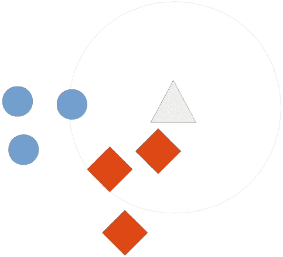
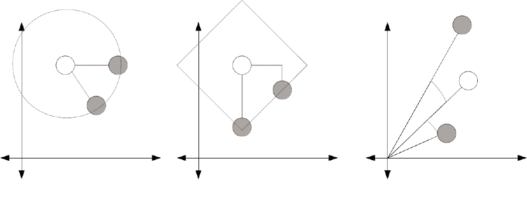
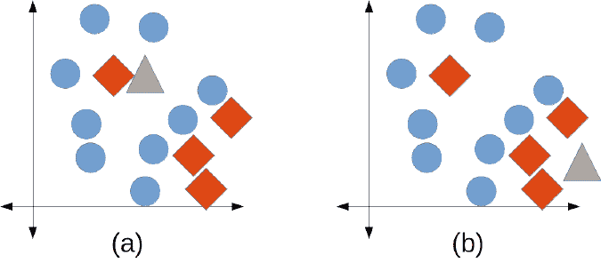
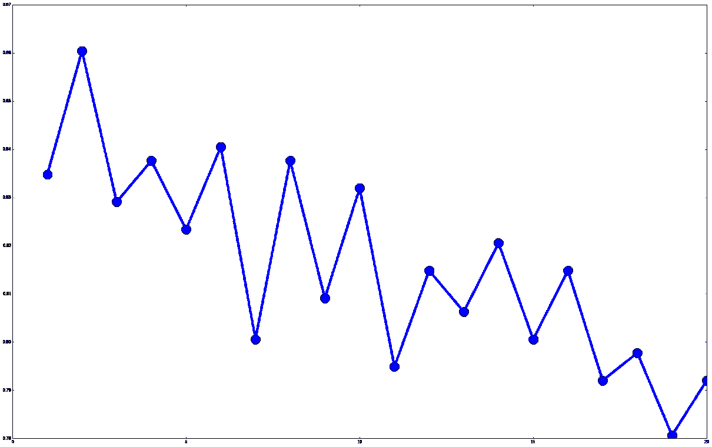

# 第二章：使用 scikit-learn 估计器进行分类

scikit-learn 库是一组数据挖掘算法，用 Python 编写并使用。这个库允许用户轻松尝试不同的算法，以及利用标准工具进行有效的测试和参数搜索。scikit-learn 中包含许多算法和实用工具，包括现代机器学习中常用的许多算法。

在本章中，我们专注于设置一个良好的框架来运行数据挖掘过程。我们将在后续章节中使用这个框架，这些章节将专注于应用和在这些情况下使用的技术。

本章介绍的关键概念如下：

+   **估计器**：这是执行分类、聚类和回归

+   **转换器**：这是执行预处理和数据修改

+   **管道**：这是将你的工作流程组合成一个可复制的格式

# scikit-learn 估计器

**估计器**允许标准化实现和测试算法，为分类器提供一个共同的、轻量级的接口。通过使用这个接口，我们可以将这些工具应用于任意分类器，而无需担心算法的工作方式。

估计器必须有两个重要的功能：

+   `fit()`：这个函数执行算法的训练 - 设置内部参数的值。`fit()`函数接受两个输入，即训练样本数据集和这些样本的对应类别。

+   `predict()`：这是测试样本的类别，我们将其作为唯一的输入提供。这个函数返回一个包含每个输入测试样本预测的`NumPy`数组。

大多数 scikit-learn 估计器使用`NumPy`数组或相关格式作为输入和输出。然而，这只是一个惯例，并不是必须使用该接口。

scikit-learn 中实现了许多估计器，在其他使用相同界面的开源项目中还有更多。这些（SVM）、随机森林。我们将使用许多

在后续章节中介绍这些算法。在本章中，我们将使用最近邻

算法。

对于本章，你需要安装一个名为`matplotlib`的新库。最简单的方法是使用`pip3`，就像你在第一章，“数据挖掘入门”，安装 scikit-learn 时做的那样：

`**$pip3 install matplotlib**`

如果你已经有了`matplotlib`，请查找官方安装说明：

[`matplotlib.org/users/installing.html`](http://matplotlib.org/users/installing.html)

# 最近邻

**最近邻**算法是我们新的样本。我们选取最相似的样本

并预测这些附近样本中大多数样本的相同类别。这种投票通常只是一个简单的计数，尽管存在更复杂的方法，如加权投票。

以下图为例，我们希望根据三角形更接近哪个类别（在这里用相似物体靠得更近来表示）来预测三角形的类别。我们寻找最近的三个邻居，即画圈内的两个钻石和一个正方形。钻石比圆多，因此预测的三角形类别是钻石：



邻域最近算法几乎适用于任何数据集——然而，计算所有样本对之间的距离可能会非常耗时。例如，如果数据集中有十个样本，需要计算 45 个独特的距离。但是，如果有 1000 个样本，那么几乎有 500,000 个！存在各种方法来提高这种速度，例如使用树结构进行距离计算。其中一些算法可能相当复杂，但幸运的是，scikit-learn 已经实现了这些算法的版本，使我们能够在更大的数据集上进行分类。由于这些树结构是 scikit-learn 的默认设置，我们不需要进行任何配置即可使用它。

邻域最近算法在**基于类别的数据集**、具有类别特征的情况下表现不佳，对于这些数据集应使用其他算法。邻域最近算法的问题在于比较类别值差异的困难，这最好留给一个考虑每个特征重要性的算法。可以使用一些距离度量或预处理步骤（如我们在后续章节中使用的独热编码）来比较类别特征。选择正确的算法来完成任务是数据挖掘中的一个难题，通常最简单的方法是测试一组算法，并查看哪个算法在您的任务上表现最佳。

# 距离度量

数据挖掘中的一个关键概念是**距离**。如果我们有两个样本，我们需要回答诸如“这两个样本是否比另外两个样本更相似？”等问题。回答这些问题对于数据挖掘的结果至关重要。

最常见的使用是**欧几里得**距离，它是两个物体在现实世界中的距离。如果你在图上绘制这些点并使用尺子测量距离，结果将是欧几里得距离。

更正式地说，点 a 和点 b 之间的欧几里得距离是每个特征平方距离之和的平方根。

欧几里得距离直观易懂，但如果某些特征值大于 0，即所谓的稀疏矩阵，其准确性会较差。

还有其他距离度量在应用中；常用的两种是曼哈顿距离和余弦距离。

**曼哈顿**距离是每个特征绝对差异的总和（不使用平方距离）。

直观地，我们可以将曼哈顿距离想象成车象棋子移动的步数

（也称为城堡）如果它限制于每次移动一个方格。虽然曼哈顿距离确实会受到一些特征值大于其他特征的影响，但如果限制于每次移动一个方格，其影响并不像欧几里得点那样戏剧性。虽然曼哈顿距离确实会受到一些特征值大于其他特征的影响，但其影响并不像欧几里得那样显著。

**余弦**距离更适合某些特征值大于其他特征，并且数据集中有很多零的情况。

直观地，我们从原点向每个样本画一条线，并测量这些线之间的角度。我们可以在以下图中观察到算法之间的差异：



在这个例子中，每个灰色圆圈与白色圆圈的距离完全相同。在(a)中，距离是欧几里得距离，因此，相似的距离适合围绕一个圆圈。这种距离可以用尺子来测量。在(b)中，距离是曼哈顿距离，也称为城市街区距离。我们通过跨越行和列来计算距离，就像国际象棋中的车（城堡）移动一样。最后，在(c)中，我们有余弦距离，它是通过计算从样本到向量的线之间的角度来测量的，并忽略线的实际长度。

所选的距离度量可以极大地影响最终性能。

例如，如果你有很多特征，随机样本之间的欧几里得距离会收敛（由于著名的*维度诅咒*）。在高维空间中，欧几里得距离很难比较样本，因为距离总是几乎相同！

在这种情况下，曼哈顿距离可能更稳定，但如果某些特征值非常大，这可能会*掩盖*其他特征中的许多相似性。例如，如果特征 A 的值在 1 到 2 之间，而另一个特征 B 的值在 1000 到 2000 之间，在这种情况下，特征 A 不太可能对结果有任何影响。这个问题可以通过归一化来解决，这使得曼哈顿（和欧几里得）距离在不同特征上更可靠，我们将在本章后面看到。

最后，余弦距离是用于比较具有许多特征的项目的良好度量标准，但它丢弃了关于向量长度的某些信息，这在某些应用中是有用的。我们通常会由于文本挖掘中固有的大量特征而使用余弦距离（参见第六章，*使用朴素贝叶斯进行社交媒体洞察*)。

最终，需要一种理论方法来确定需要哪种距离方法，或者需要进行经验评估以查看哪种方法更有效。我更喜欢经验方法，但任何一种方法都可以产生良好的结果。

在本章中，我们将使用欧几里得距离，在后面的章节中使用其他度量标准。如果您想进行实验，可以尝试将度量标准设置为曼哈顿距离，看看这对结果有何影响。

# 加载数据集

`Ionosphere`数据集，用于高频天线。天线的目的是确定电离层中是否存在结构以及上层大气中的区域。我们将有结构的读数视为好的，而没有结构的读数被视为坏的。这个应用的目标是构建一个数据挖掘分类器，可以确定图像是好是坏。


（图片来源：https://www.flickr.com/photos/geckzilla/16149273389/）

您可以下载这个数据集用于不同的数据挖掘应用。访问[`archive.ics.uci.edu/ml/datasets/Ionosphere`](http://archive.ics.uci.edu/ml/datasets/Ionosphere)，点击“数据文件夹”。将`ionosphere.data`和`ionosphere.names`文件下载到您的计算机上的一个文件夹中。对于这个例子，我将假设您已经将数据集放在了`home`文件夹下的`Data`目录中。您可以将数据放在另一个文件夹中，只需确保更新您的数据文件夹（在这里，以及所有其他章节）。

您的主文件夹位置取决于您的操作系统。对于 Windows，它通常位于`C:Documents and Settingsusername`。对于 Mac 或 Linux 机器，它通常位于`/home/username`。您可以通过在 Jupyter Notebook 中运行以下 Python 代码来获取您的主文件夹：

```py
import os print(os.path.expanduser("~"))

```

数据集中的每一行都有 35 个值。前 34 个是从 17 个天线（每个天线两个值）测量的。最后一个值是`g`或`b`；分别代表好和坏。

启动 Jupyter Notebook 服务器并创建一个名为“Ionosphere Nearest Neighbors”的新笔记本。首先，我们加载所需的`NumPy`和`csv`库，并设置我们代码中需要的数据文件名。

```py
import numpy as np 
import csv 
data_filename = "data/ionosphere.data"

```

然后，我们创建`X`和`y`的`NumPy`数组来存储数据集。这些数组的大小从数据集中已知。如果您不知道未来数据集的大小，请不要担心——我们将在后面的章节中使用其他方法来加载数据集，您不需要事先知道这个大小：

```py
X = np.zeros((351, 34), dtype='float') 
y = np.zeros((351,), dtype='bool')

```

数据集采用**逗号分隔值**（**CSV**）格式，这是数据集常用的格式。我们将使用`csv`模块来加载这个文件。导入它并设置一个`csv`读取对象，然后遍历文件，为数据集中的每一行设置适当的`X`中的行和`y`中的类别值：

```py
with open(data_filename, 'r') as input_file: 
    reader = csv.reader(input_file) 
    for i, row in enumerate(reader): 
        # Get the data, converting each item to a float 
        data = [float(datum) for datum in row[:-1]] 
        # Set the appropriate row in our dataset 
        X[i] = data 
        # 1 if the class is 'g', 0 otherwise 
        y[i] = row[-1] == 'g'

```

现在，我们有了在`X`中的样本和特征以及相应的`y`中的类别，就像在第一章“数据挖掘入门”中的分类示例中做的那样。

首先，尝试将第一章中介绍的 OneR 算法应用于此数据集。它不会很好用，因为此数据集中的信息分布在某些特征的关联中。OneR 只对单个特征的值感兴趣，并且不能很好地捕捉更复杂数据集中的信息。其他算法，包括最近邻，合并多个特征的信息，使它们适用于更多场景。缺点是它们通常计算起来更昂贵。

# 向标准化工作流程迈进

scikit-learn 中的估计器有两个方法和`predict()`。我们使用训练集来训练算法。

在我们的测试集上使用`predict()`方法。我们使用测试集上的`predict()`方法对其进行评估。

1.  首先，我们需要创建这些训练和测试集。像以前一样，导入并运行`train_test_split`函数：

```py
from sklearn.cross_validation import train_test_split 
X_train, X_test, y_train, y_test = train_test_split(X, y, random_state=14)

```

1.  然后，我们导入`最近邻`类并为其创建一个实例。现在我们将参数保留为默认值，将在本章后面测试其他值。默认情况下，算法将选择五个最近邻来预测测试样本的类别：

```py
from sklearn.neighbors import KNeighborsClassifier estimator = KNeighborsClassifier()

```

1.  在创建我们的`estimator`之后，我们必须将其拟合到我们的训练数据集上。对于`最近邻`类别，这个训练步骤只是记录我们的数据集，使我们能够通过将新数据点与训练数据集进行比较来找到最近邻：

```py
estimator.fit(X_train, y_train)

```

1.  然后，我们使用测试集训练算法，并使用测试集进行评估：

```py
y_predicted = estimator.predict(X_test) 
accuracy = np.mean(y_test == y_predicted) * 100     
print("The accuracy is {0:.1f}%".format(accuracy))

```

此模型得分 86.4%的准确率，对于一个默认算法来说相当令人印象深刻，而且只需几行代码！大多数 scikit-learn 默认参数都是经过精心选择的，以便与各种数据集很好地工作。然而，你应该始终根据对应用实验的了解来选择参数。我们将在后面的章节中介绍进行这种**参数搜索**的策略。

# 运行算法

根据我们的测试数据集，前述结果相当不错。然而，如果我们运气好，选择了一个容易的测试集会怎样？或者，如果它特别棘手呢？我们可能会因为数据分割的不幸而丢弃一个好的模型。

**交叉验证**框架是一种解决选择单个测试集问题的方法，并且在数据挖掘中是一种标准的*最佳实践*方法论。这个过程通过进行许多实验，使用不同的训练和测试分割，但每个测试集中的每个样本只使用一次。步骤如下：

1.  将整个数据集分成几个称为折的部分。

1.  对于数据中的每个折，执行以下步骤：

    1.  将该折保留为当前测试集

    1.  在剩余的折上训练算法

    1.  在当前测试集上进行评估

1.  报告所有评估分数，包括平均分数。

在这个过程中，每个样本只在测试集中使用一次，这减少了（但并未消除）选择幸运测试集的可能性。

在整本书中，代码示例在章节内相互构建。除非文本中另有说明，每个章节的代码都应该输入到同一个 Jupyter Notebook 中。

scikit-learn 库包含一些交叉验证方法。提供了一个`helper`函数来执行前面的过程。我们现在可以在我们的 Jupyter Notebook 中导入它：

```py
from sklearn.cross_validation import cross_val_score

```

通过`cross_val_score`使用一种称为**分层 K 折**的特定方法来创建每个折叠中类比例大致相同的折叠，再次减少了选择较差折叠的可能性。分层 K 折是一个很好的默认选项——我们现在不会去修改它。

接下来，我们使用这个新功能通过交叉验证来评估我们的模型：

```py
scores = cross_val_score(estimator, X, y, scoring='accuracy') 
average_accuracy = np.mean(scores) * 100 
print("The average accuracy is {0:.1f}%".format(average_accuracy))

```

我们的新代码返回的结果是 82.3%，虽然考虑到我们还没有尝试设置更好的参数，这个结果仍然相当不错。在下一节中，我们将看到如何改变参数以实现更好的结果。

在进行数据挖掘和尝试重复实验时，结果的变化是很自然的。这是由于折叠创建方式的不同以及某些分类算法中固有的随机性。我们可以故意选择精确复制一个实验，通过设置随机状态（我们将在后面的章节中这样做）。在实践中，多次重新运行实验以获得平均结果和所有实验结果（均值和标准差）的分布（范围）是一个好主意。

# 设置参数

几乎所有用户可以设置的参数，让算法更多地关注特定的数据集，而不是只适用于一小部分特定的问题。设置这些参数可能相当困难，因为选择好的参数值通常高度依赖于数据集的特征。

最近邻算法有几个参数，但最重要的一个是在预测未见属性类别时使用的最近邻数量。在`-learn`中，这个参数被称为`n_neighbors`。在下面的图中，我们展示了当这个数字太低时，随机标记的样本可能会引起错误。相反，当它太高时，实际最近邻对结果的影响会降低：



在图(a)的左侧，我们通常会期望将测试样本（三角形）分类为圆形。然而，如果`n_neighbors`为 1，该区域中的单个红色菱形（可能是噪声样本）会导致样本被预测为菱形。在图(b)的右侧，我们通常会期望将测试样本分类为菱形。然而，如果`n_neighbors`为 7，三个最近的邻居（都是菱形）被大量圆形样本所覆盖。最近邻是一个难以解决的问题，因为参数可以产生巨大的差异。幸运的是，大多数情况下，特定的参数值不会对最终结果产生重大影响，标准值（通常是 5 或 10）通常*足够接近*。

考虑到这一点，我们可以测试一系列的值，并调查这个参数对性能的影响。如果我们想测试`n_neighbors`参数的多个值，例如，从 1 到 20 的每个值，我们可以通过设置`n_neighbors`并观察结果来多次重新运行实验。下面的代码就是这样做的，将值存储在`avg_scores`和`all_scores`变量中。

```py
avg_scores = [] 
all_scores = [] 
parameter_values = list(range(1, 21))  # Include 20 
for n_neighbors in parameter_values: 
    estimator = KNeighborsClassifier(n_neighbors=n_neighbors) 
    scores = cross_val_score(estimator, X, y, scoring='accuracy')     avg_scores.append(np.mean(scores))     
all_scores.append(scores)

```

然后，我们可以绘制`n_neighbors`值与准确率之间的关系。首先，我们告诉 Jupyter Notebook 我们希望在笔记本本身中显示`inline`的图表：

```py
%matplotlib inline

```

我们接着从`matplotlib`库中导入`pyplot`并绘制参数值与平均分数的关系：

```py
from matplotlib import pyplot as plt plt.plot(parameter_values,  avg_scores, '-o')

```



虽然存在很多变异性，但随着邻居数量的增加，图表显示了一个下降趋势。关于变异性，你可以在进行此类评估时预期大量变异性。为了补偿，更新代码以针对每个`n_neighbors`值运行 100 次测试。

# 预处理

当对现实世界对象进行测量时，我们通常可以得到不同范围的特征。例如，如果我们测量动物的特性，我们可能有几个特征，如下所示：

+   **腿的数量**：对于大多数动物来说，这介于 0-8 之间，而有些动物则更多！更多！更多！

+   **重量**：这仅在几个微克到一只重达 190,000 千克的蓝鲸之间变化！

+   **心形数量**：这可以是 0 到 5，以蚯蚓为例。

对于一个基于数学的算法来比较这些特征，尺度、范围和单位之间的差异可能难以解释。如果我们使用上述特征在许多算法中，权重可能由于只有较大的数字而不是与特征的实际有效性有关，因此可能是最具影响力的特征。

一种可能的策略*标准化*特征，使它们都具有相同的范围，或者将值转换为如*小*、*中*和*大*这样的类别。突然之间，特征类型之间的巨大差异对算法的影响较小，并可能导致准确率的大幅提高。

预处理还可以用来选择更有效的特征，创建新特征等。scikit-learn 中的预处理是通过 `Transformer` 对象完成的，这些对象将数据集转换成另一种形式，并在数据变换后返回修改后的数据集。这些不需要是数值型的，因为转换器也用于提取特征——然而，在本节中，我们将坚持使用预处理。

我们可以通过 *破坏* `Ionosphere` 数据集来展示这个问题的一个例子。虽然这只是一个例子，但许多现实世界的数据集都存在这种形式的问题。

1.  首先，我们创建数组的副本，以确保我们不改变原始数据集：

```py
X_broken = np.array(X)

```

1.  接下来，我们通过将每个第二个特征除以 `10` 来 *破坏* 数据集：

```py
X_broken[:,::2] /= 10

```

理论上，这不应该对结果有太大影响。毕竟，这些特征值的相对大小仍然是相同的。主要问题是尺度发生了变化，奇数特征现在比偶数特征 *更大*。我们可以通过计算准确率来看到这种影响：

```py
estimator = KNeighborsClassifier() 
original_scores = cross_val_score(estimator, X, y,scoring='accuracy') 
print("The original average accuracy for is {0:.1f}%".format(np.mean(original_scores) * 100)) 
broken_scores = cross_val_score(estimator, X_broken, y,   scoring='accuracy') 
print("The 'broken' average accuracy for is   {0:.1f}%".format(np.mean(broken_scores) * 100))

```

这种测试方法对原始数据集给出了 82.3% 的分数，而在破坏的数据集上分数下降到 71.5%。我们可以通过将所有特征缩放到 `0` 到 `1` 的范围来解决这个问题。

# 标准预处理

我们将为这次实验执行的预处理称为基于特征的归一化，我们使用 scikit-learn 的 `MinMaxScaler` 类来完成。继续使用本章剩余部分的 Jupyter Notebook，首先，我们导入这个类：

```py
fromsklearn.preprocessing import MinMaxScaler

```

这个类将每个特征缩放到 `0` 到 `1` 的范围。这个预处理程序将最小值替换为 `0`，最大值替换为 `1`，其他值根据线性映射位于两者之间。

要应用我们的预处理程序，我们在其上运行 `transform` 函数。与分类器一样，转换器通常需要先进行训练。我们可以通过运行 `fit_transform` 函数来合并这些步骤：

```py
X_transformed = MinMaxScaler().fit_transform(X)

```

在这里，`X_transformed` 将与 `*X*` 具有相同的形状。然而，每一列的最大值将是 `1`，最小值是 `0`。

以这种方式有各种其他形式的归一化，这对于其他应用和特征类型是有效的：

+   使用 `sklearn.preprocessing.Normalizer` 确保每个样本的值之和等于 1

+   使用 `sklearn.preprocessing.StandardScaler` 将每个特征缩放到 `0` 到 `1` 的范围，使其具有零均值和单位方差，这是归一化的常用起点

+   使用 `sklearn.preprocessing.Binarizer` 将数值特征转换为二进制特征，其中高于阈值的值为 1，低于阈值的值为 0

我们将在后续章节中使用这些预处理器的组合，以及其他类型的 `Transformers` 对象。

预处理是数据挖掘流程中的关键步骤，它可能意味着结果的好坏之分。

# 将所有内容整合在一起

现在我们可以通过结合前几节中的代码，使用之前计算出的损坏数据集来创建一个工作流程：

```py
X_transformed = MinMaxScaler().fit_transform(X_broken) 
estimator = KNeighborsClassifier() 
transformed_scores = cross_val_score(estimator, X_transformed, y,    scoring='accuracy') 
print("The average accuracy for is {0:.1f}%".format(np.mean(transformed_scores) * 100))

```

我们现在恢复了原始的准确率得分，达到了 82.3%。`MinMaxScaler`使得特征具有相同的尺度，这意味着没有特征仅仅因为数值较大而压倒其他特征。虽然最近邻算法可能会被较大的特征所迷惑，但某些算法更好地处理尺度差异。相比之下，有些算法则要差得多！

# 管道

随着实验的增长，操作的复杂性也在增加。我们可能需要分割我们的数据集，二值化特征，执行基于特征的缩放，执行基于样本的缩放，以及许多其他操作。

跟踪这些操作可能会变得相当混乱，并可能导致无法复制结果。问题包括忘记一个步骤，错误地应用转换，或者添加不必要的转换。

另一个问题是对代码的顺序。在上一节中，我们创建了`X_transformed`数据集，然后为交叉验证创建了一个新的估计器。如果我们有多个步骤，我们就需要在代码中跟踪这些对数据集的改变。

管道（Pipelines）是一种解决这些问题的结构（以及我们将在下一章中看到的其他问题）。管道存储了数据挖掘工作流程中的步骤。它们可以接收原始数据，执行所有必要的转换，然后创建预测。这使得我们可以在`cross_val_score`等函数中使用管道，这些函数期望一个估计器。首先，导入`Pipeline`对象：

```py
fromsklearn.pipeline import Pipeline

```

管道接受一个步骤列表作为输入，表示数据挖掘应用的链。最后一个步骤需要是一个估计器，而所有之前的步骤都是转换器。输入数据集被每个转换器所改变，一个步骤的输出成为下一个步骤的输入。最后，我们通过最后一个步骤的估计器对样本进行分类。在我们的管道中，我们有两个步骤：

1.  使用`MinMaxScaler`将特征值缩放到 0 到 1

1.  使用`KNeighborsClassifier`作为分类算法

我们然后使用一个元组`('name', `step)`来表示每个步骤。然后我们可以创建我们的管道：

```py
scaling_pipeline = Pipeline([('scale', MinMaxScaler()), 
                             ('predict', KNeighborsClassifier())])

```

关键在于元组的列表。第一个元组是我们的缩放步骤，第二个元组是预测步骤。我们给每个步骤起一个名字：第一个我们称之为`scale`，第二个我们称之为`predict`，但你可以选择自己的名字。元组的第二部分是实际的`Transformer`或`estimator`对象。

运行这个管道现在非常简单，使用之前交叉验证的代码：

```py
scores = cross_val_score(scaling_pipeline, X_broken, y, scoring='accuracy') 
print("The pipeline scored an average accuracy for is {0:.1f}%".format(np.mean(transformed_scores) * 100))

```

这给我们带来了与之前相同的得分（82.3%），这是预期的，因为我们正在运行完全相同的步骤，只是界面得到了改进。

在后面的章节中，我们将使用更高级的测试方法，设置管道是确保代码复杂度不会无序增长的好方法。

# 摘要

在本章中，我们使用了 scikit-learn 的几种方法来构建一个标准的流程来运行和评估数据挖掘模型。我们介绍了最近邻算法，该算法在 scikit-learn 中作为估计器实现。使用这个类相当简单；首先，我们在训练数据上调用`fit`函数，然后，我们使用`predict`函数来预测测试样本的类别。

然后，我们探讨了通过调整特征缩放来预处理。这是通过一个`Transformer`对象和`MinMaxScaler`类来完成的。这些函数也有一个`fit`方法，然后是一个转换，它将一种形式的数据作为输入，并返回一个转换后的数据集作为输出。

为了进一步研究这些转换，尝试用提到的其他转换器替换`MinMaxScaler`。哪个最有效，为什么会这样？

scikit-learn 中还存在其他转换器，我们将在本书的后面部分使用，例如 PCA。尝试一些这些方法，并参考 scikit-learn 优秀的文档[`scikit-learn.org/stable/modules/preprocessing.html`](https://scikit-learn.org/stable/modules/preprocessing.html)。

在下一章中，我们将使用这些概念在一个更大的例子中，使用现实世界的数据来预测体育比赛的结果。
