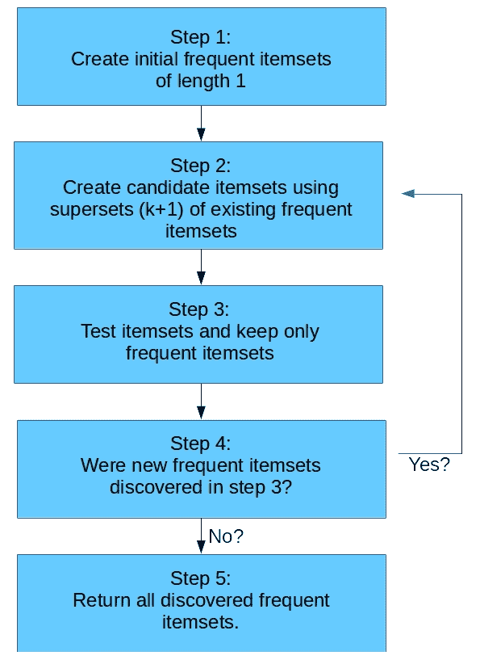

# 使用关联分析推荐电影

在本章中，我们将探讨**关联分析**，它确定物体何时频繁地一起出现。这也俗称为市场篮子分析，这是其中一个常见用例——确定在商店中频繁一起购买的商品。

在第三章*，使用决策树预测体育比赛赢家*中，我们将对象作为焦点，并使用特征来描述该对象。在本章中，数据具有不同的形式。我们有交易，其中感兴趣的物体（在本章中为电影）以某种方式在交易中使用。目标是发现物体何时同时出现。在我们希望确定两部电影是否由同一评论者推荐的情况下，我们可以使用关联分析。

本章的关键概念如下：

+   用于产品推荐的关联分析

+   使用 Apriori 算法进行特征关联挖掘

+   推荐系统和固有的挑战

+   稀疏数据格式及其使用方法

# 关联分析

关联分析是确定物体以相似方式使用的任务。在前一章中，我们关注的是物体本身是否相似——在我们的案例中是游戏是否在本质上相似。关联分析的数据通常以交易的形式描述。直观地说，这来自商店的交易——确定物体何时一起购买，作为向用户推荐他们可能购买的产品的方式。

然而，关联分析可以应用于许多不涉及此类交易的流程：

+   欺诈检测

+   客户细分

+   软件优化

+   产品推荐

关联分析通常比分类更具探索性。至少，我们通常只是对结果进行排名，并选择前五项推荐（或某个其他数字），而不是期望算法给出一个特定的答案。

此外，我们通常没有我们期望的完整数据集来完成许多分类任务。例如，在电影推荐中，我们有来自不同人对不同电影的评论。然而，我们几乎不可能让每位评论者都评论我们数据集中的所有电影。这给关联分析留下了一个重要且困难的问题。如果一个评论者没有评论一部电影，这是否意味着他们不感兴趣（因此不会推荐）或者只是他们还没有评论？

思考数据集中的差距可能会引发类似的问题。反过来，这可能会导致有助于提高你方法有效性的答案。作为一名初露头角的数据挖掘者，了解你的模型和方法需要改进的地方是创造出色结果的关键。

# 关联分析算法

我们在第一章*，入门数据挖掘*中介绍了一种基本的亲和度分析方法，它测试了所有可能的规则组合。我们计算了每个规则的置信度和支持度，这反过来又允许我们根据规则进行排序，以找到最佳规则。

然而，这种方法并不高效。我们在第一章*，入门数据挖掘*中的数据集只有五种销售商品。我们预计即使是小型商店也会有数百种销售商品，而许多在线商店会有数千（甚至数百万！）商品。使用我们之前在第一章*，入门数据挖掘*中使用的简单规则创建方法，计算这些规则所需的时间呈指数增长。随着我们添加更多商品，计算所有规则所需的时间增长得更快。具体来说，可能的总规则数是*2n - 1*。对于五个商品的数据集，有 31 种可能的规则。对于十个商品，这个数字是 1023。对于仅仅 100 个商品，这个数字有 30 位。即使计算能力的急剧增加也无法跟上在线存储的商品数量的增长。因此，我们需要更智能的算法，而不是更努力工作的计算机。

亲和度分析的经典算法被称为**Apriori 算法**。它解决了在数据库中创建频繁项集（即频繁出现的项目集合）的指数级问题。一旦发现这些频繁项集，创建关联规则就变得简单，我们将在本章后面看到这一点。

Apriori 背后的直觉既简单又巧妙。首先，我们确保规则在数据集中有足够的支持度。定义最小支持度是 Apriori 的关键参数。为了构建频繁项集，我们结合较小的频繁项集。对于项集(A, B)要有至少 30%的支持度，A 和 B 必须在数据库中至少出现 30 次。这一属性也适用于更大的集合。对于一个项集(A, B, C, D)要被认为是频繁的，集合(A, B, C)也必须是频繁的（同样，D 也必须是频繁的）。

这些频繁项集可以构建，而不频繁的项集（其中有很多）将永远不会被测试。这大大节省了测试新规则的时间，因为预计频繁项集的数量将远少于可能项集的总数。

其他用于亲和度分析的示例算法建立在这一点或类似概念之上，包括**Eclat**和**FP-growth**算法。数据挖掘文献中对这些算法有许多改进，进一步提高了该方法的有效性。在本章中，我们将重点关注基本的 Apriori 算法。

# 总体方法

为了进行关联规则挖掘以进行亲和度分析，我们首先使用 Apriori 算法生成频繁项集。接下来，我们通过测试那些频繁项集中前提和结论的组合来创建关联规则（例如，*如果某人推荐电影 X，他们也会推荐电影 Y*）。

1.  在第一阶段，Apriori 算法需要一个值来表示项集需要达到的最小支持度，以便被认为是频繁的。任何支持度低于此值的项集将不予考虑。

将最小支持度设置得太低会导致 Apriori 测试更多的项集，从而减慢算法的速度。设置得太高会导致考虑的频繁项集更少。

1.  在第二阶段，在发现频繁项集之后，根据它们的置信度来测试关联规则。我们可以选择一个最小的置信度水平，返回的规则数量，或者简单地返回所有规则，让用户决定如何处理它们。

在本章中，我们只返回高于给定置信度水平的规则。因此，我们需要设置我们的最小置信度水平。设置得太低会导致具有高支持度但不太准确的规则。设置得更高会导致返回的规则更准确，但发现的规则总数更少。

# 处理电影推荐问题

产品推荐是一个大生意。在线商店通过推荐其他可能购买的产品来向客户进行促销。更好的推荐可以带来更好的销售。当在线购物每年向数百万客户销售时，通过向这些客户销售更多商品，可以赚取大量潜在利润。

产品推荐，包括电影和书籍，已经研究了许多年；然而，该领域在 2007 年至 2009 年 Netflix 举办 Netflix Prize 期间得到了显著提升。这次比赛旨在确定是否有人能比 Netflix 目前所做的更好地预测用户的电影评分。奖项授予了一个团队，他们的表现比当前解决方案高出 10 多个百分点。虽然这种改进可能看起来并不大，但这样的改进将在接下来的几年中为 Netflix 带来数百万美元的收益，因为更好的电影推荐。

# 获取数据集

自从 Netflix Prize 启动以来，明尼苏达大学的 Grouplens 研究小组已经发布了几个常用于测试该领域算法的数据集。他们发布了多个电影评分数据集的版本，大小不同。有一个包含 10 万条评论的版本，一个包含 100 万条评论的版本，还有一个包含 1000 万条评论的版本。

数据集可以从[`grouplens.org/datasets/movielens/`](http://grouplens.org/datasets/movielens/)获取，我们将在本章中使用的数据集是*MovieLens 100K 数据集*（包含 10 万条评论）。下载此数据集，并将其解压到你的数据文件夹中。启动一个新的 Jupyter Notebook，并输入以下代码：

```py
import os
import pandas as pd
data_folder = os.path.join(os.path.expanduser("~"), "Data", "ml-100k")
ratings_filename = os.path.join(data_folder, "u.data")

```

确保将`ratings_filename`指向解压文件夹中的 u.data 文件。

# 使用 pandas 加载

`MovieLens`数据集状况良好；然而，与`pandas.read_csv`的默认选项相比，我们需要做一些更改。首先，数据是用制表符分隔的，而不是逗号。其次，没有标题行。这意味着文件中的第一行实际上是数据，我们需要手动设置列名。

当加载文件时，我们将分隔符参数设置为制表符，告诉 pandas 不要将第一行作为标题读取（使用`header=None`），并使用给定的值设置列名。让我们看看以下代码：

```py
all_ratings = pd.read_csv(ratings_filename, delimiter="t", header=None, names
            = ["UserID", "MovieID", "Rating", "Datetime"])

```

虽然我们在这章中不会使用它，但你可以使用以下行正确解析日期时间戳。对于推荐预测，日期对于评论来说可能是一个重要的特征，因为一起评分的电影通常比单独评分的电影有更相似的排名。考虑到这一点可以显著提高模型的效果。

```py
all_ratings["Datetime"] = pd.to_datetime(all_ratings['Datetime'], unit='s')

```

你可以通过在新的单元格中运行以下代码来查看前几条记录：

```py
all_ratings.head()

```

结果将看起来像这样：

|  | UserID | MovieID | Rating | Datetime |
| --- | --- | --- | --- | --- |
| 0 | 196 | 242 | 3 | 1997-12-04 15:55:49 |
| 1 | 186 | 302 | 3 | 1998-04-04 19:22:22 |
| 2 | 22 | 377 | 1 | 1997-11-07 07:18:36 |
| 3 | 244 | 51 | 2 | 1997-11-27 05:02:03 |
| 4 | 166 | 346 | 1 | 1998-02-02 05:33:16 |

# 稀疏数据格式

这个数据集是稀疏格式。每一行可以看作是之前章节中使用的大型特征矩阵中的一个单元格，其中行是用户，列是单个电影。第一列将是每个用户对第一部电影的评论，第二列将是每个用户对第二部电影的评论，依此类推。

这个数据集中大约有 1,000 个用户和 1,700 部电影，这意味着完整的矩阵会相当大（近 200 万个条目）。我们可能会遇到在内存中存储整个矩阵的问题，并且对其进行计算会麻烦。然而，这个矩阵具有这样一个特性，即大多数单元格都是空的，也就是说，大多数用户对大多数电影没有评论。尽管如此，用户 213 对电影 675 没有评论，以及其他大多数用户和电影的组合。

这里给出的格式表示完整的矩阵，但以更紧凑的方式。第一行表示用户 196 在 1997 年 12 月 4 日对电影 242 进行了评论，给出了 3 分（满分五分）。

任何不在数据库中的用户和电影组合都被假定为不存在。这节省了大量的空间，与在内存中存储一串零相比。这种格式称为稀疏矩阵格式。一般来说，如果你预计你的数据集中有 60%或更多的数据为空或为零，稀疏格式将占用更少的空间来存储。

在稀疏矩阵上计算时，通常不会关注我们没有的数据——比较所有的零。我们通常关注我们有的数据，并比较这些数据。

# 理解 Apriori 算法及其实现

本章的目标是生成以下形式的规则：*如果一个人推荐了这组电影，他们也会推荐这部电影*。我们还将讨论扩展，其中推荐一组电影的人可能会推荐另一部特定的电影。

要做到这一点，我们首先需要确定一个人是否推荐了一部电影。我们可以通过创建一个新的特征“Favorable”（有利）来实现，如果这个人给电影给出了好评，则该特征为 True：

```py
all_ratings["Favorable"] = all_ratings["Rating"] > 3

```

我们可以通过查看数据集来查看新特征：

```py
all_ratings[10:15]

```

|  | UserID | MovieID | Rating | Datetime | Favorable |
| --- | --- | --- | --- | --- | --- |
| 10 | 62 | 257 | 2 | 1997-11-12 22:07:14 | False |
| 11 | 286 | 1014 | 5 | 1997-11-17 15:38:45 | True |
| 12 | 200 | 222 | 5 | 1997-10-05 09:05:40 | True |
| 13 | 210 | 40 | 3 | 1998-03-27 21:59:54 | False |
| 14 | 224 | 29 | 3 | 1998-02-21 23:40:57 | False |

我们将采样我们的数据集以形成训练数据。这也帮助减少了要搜索的数据集的大小，使 Apriori 算法运行得更快。我们获取前 200 个用户的所有评论：

```py
ratings = all_ratings[all_ratings['UserID'].isin(range(200))]

```

然后，我们可以创建一个只包含样本中有利评论的数据集：

```py
favorable_ratings_mask = ratings["Favorable"]
favorable_ratings = ratings[favorable_ratings_mask]

```

我们将在用户的有利评论中搜索我们的项集。因此，接下来我们需要的是每个用户给出的好评电影。我们可以通过按`UserID`对数据集进行分组并遍历每个组中的电影来计算这一点：

```py
favorable_reviews_by_users = dict((k, frozenset(v.values)) for k, v in favorable_ratings.groupby("UserID")["MovieID"])

```

在前面的代码中，我们将值存储为`frozenset`，这样我们可以快速检查一个用户是否对电影进行了评分。

对于此类操作，集合比列表快得多，我们将在后面的代码中使用它们。

最后，我们可以创建一个`DataFrame`，它告诉我们每部电影被给予好评的频率：

```py
num_favorable_by_movie = ratings[["MovieID", "Favorable"]].groupby("MovieID").sum()

```

我们可以通过运行以下代码来查看前五部电影：

```py
num_favorable_by_movie.sort_values(by="Favorable", ascending=False).head()

```

让我们看看前五部电影列表。我们现在只有 ID，将在本章后面获取它们的标题。

| Movie ID | Favorable |
| --- | --- |
| 50 | 100 |
| 100 | 89 |
| 258 | 83 |
| 181 | 79 |
| 174 | 74 |

# 探讨 Apriori 算法的基本原理

Apriori 算法是我们亲和分析方法的组成部分，专门用于在数据中寻找频繁项集。Apriori 算法的基本步骤是从先前发现的频繁项集中构建新的候选项集。这些候选集被测试以确定它们是否频繁，然后算法按照以下解释进行迭代：

1.  通过将每个项目放入其自己的项集中来创建初始频繁项集。在此步骤中仅使用至少具有最小支持度的项目。

1.  从最近发现的频繁项集中创建新的候选项集，通过找到现有频繁项集的超集。

1.  测试所有候选项集以查看它们是否频繁。如果一个候选项不是频繁的，则将其丢弃。如果没有从这个步骤中发现新的频繁项集，则转到最后一步。

1.  存储新发现的频繁项集并转到第二步。

1.  返回所有已发现的频繁项集。

此过程在以下工作流程中概述：



# 实现 Apriori 算法

在 Apriori 算法的第一轮迭代中，新发现的项集长度将为 2，因为它们将是第一步中创建的初始项集的超集。在第二轮迭代（应用第四步并返回第二步后），新发现的项集长度将为 3。这使我们能够快速识别新发现的项集，正如第二步所需的那样。

我们可以将发现的频繁项集存储在字典中，其中键是项集的长度。这允许我们快速访问给定长度的项集，因此通过以下代码可以帮助我们快速访问最近发现的频繁项集：

```py
frequent_itemsets = {}

```

我们还需要定义一个项集被认为是频繁所需的最小支持度。此值基于数据集选择，但尝试不同的值以查看它如何影响结果。不过，我建议每次只改变 10%，因为算法运行所需的时间将显著不同！让我们设置一个最小支持度值：

```py
min_support = 50

```

为了实现 Apriori 算法的第一步，我们为每部电影创建一个项集并测试该项集是否频繁。我们使用`frozenset`，因为它们允许我们在稍后执行更快的基于集合的操作，并且它们还可以用作计数字典的键（普通集合不能）。

让我们看看以下`frozenset`代码的示例：

```py
frequent_itemsets[1] = dict((frozenset((movie_id,)), row["Favorable"])
 for movie_id, row in num_favorable_by_movie.iterrows()
 if row["Favorable"] > min_support)

```

为了提高效率，我们将第二和第三步合并在一起，通过创建一个函数来处理新发现的频繁项集、创建超集以及测试它们是否频繁。首先，我们设置函数执行以下步骤：

```py
from collections import defaultdict

def find_frequent_itemsets(favorable_reviews_by_users, k_1_itemsets, min_support):
    counts = defaultdict(int)
    for user, reviews in favorable_reviews_by_users.items():
        for itemset in k_1_itemsets:
            if itemset.issubset(reviews):
                for other_reviewed_movie in reviews - itemset:
                    current_superset = itemset | frozenset((other_reviewed_movie,))
                    counts[current_superset] += 1
    return dict([(itemset, frequency) for itemset, frequency in counts.items() if frequency >= min_support])

```

遵循我们尽可能少读取数据的经验法则，我们每次调用此函数时只遍历数据集一次。虽然在这个实现中（与平均计算机相比，我们的数据集相对较小），**单次遍历**是一个良好的实践，特别是在更大的应用中。

让我们详细看看这个函数的核心。我们遍历每个用户以及之前发现的每个项目集，然后检查它是否是当前评论集的子集，这些评论集存储在`k_1_itemsets`中（注意，这里的 k_1 表示*k-1*）。如果是的话，这意味着用户已经评论了项目集中的每部电影。这是通过`itemset.issubset(reviews)`这一行实现的。

然后，我们可以遍历用户已评论的每部电影（那些尚未在项目集中），通过将项目集与新电影结合来创建一个超集，并在我们的计数字典中记录我们看到了这个超集。这些都是这个*k*值的候选频繁项目集。

我们通过测试候选项目集中哪些有足够的支持被认为是频繁的来结束我们的函数，并只返回那些支持超过我们的`min_support`值的那些。

这个函数构成了我们 Apriori 实现的核心，我们现在创建一个循环，遍历更大算法的步骤，随着*k*从 1 增加到最大值，我们存储新的项目集。在这个循环中，k 代表即将发现的频繁项目集的长度，使我们能够通过查看我们的频繁项目集字典中的*k - 1*键来访问之前发现的那些。我们通过它们的长度创建频繁项目集并将它们存储在我们的字典中。让我们看看代码：

```py
for k in range(2, 20):
    # Generate candidates of length k, using the frequent itemsets of length k-1
    # Only store the frequent itemsets
    cur_frequent_itemsets = find_frequent_itemsets(favorable_reviews_by_users,
                                                   frequent_itemsets[k-1], min_support)
    if len(cur_frequent_itemsets) == 0:
        print("Did not find any frequent itemsets of length {}".format(k))
        sys.stdout.flush()
        break
    else:
        print("I found {} frequent itemsets of length {}".format(len(cur_frequent_itemsets), k))
        sys.stdout.flush()
        frequent_itemsets[k] = cur_frequent_itemsets

```

如果我们找到了频繁的项目集，我们会打印一条消息来告知我们循环将再次运行。如果没有找到，我们就停止迭代，因为没有频繁的项目集对于*k+1*，如果当前*k*的值没有频繁的项目集，因此我们完成算法。

我们使用`sys.stdout.flush()`来确保打印输出在代码仍在运行时发生。有时，特别是在大型循环的特定单元格中，打印输出可能不会发生，直到代码完成。以这种方式刷新输出确保打印输出在我们想要的时候发生，而不是当界面决定可以分配时间打印的时候。但是不要太频繁地刷新——刷新操作（以及正常的打印）都有计算成本，这会减慢程序的速度。

你现在可以运行上面的代码。

上述代码返回了大约 2000 个不同长度的频繁项目集。你会注意到，随着长度的增加，项目集的数量先增加后减少。它之所以增加，是因为可能规则的数目在增加。过了一段时间，大量组合不再有必要的支持被认为是频繁的。这导致数量减少。这种减少是 Apriori 算法的好处。如果我们搜索所有可能的项目集（而不仅仅是频繁项目集的超集），我们将搜索成千上万的项目集来查看它们是否是频繁的。

即使没有发生这种缩小，算法也会在发现所有电影的组合规则时达到绝对结束。因此，Apriori 算法总是会终止。

运行此代码可能需要几分钟，如果硬件较旧，则可能需要更长的时间。如果您发现运行任何代码示例有困难，请考虑使用在线云服务提供商以获得额外的速度。有关使用云进行工作的详细信息，请参阅附录，下一步。

# 提取关联规则

在 Apriori 算法完成后，我们得到一个频繁项集列表。这些并不是精确的关联规则，但它们可以很容易地转换为这些规则。频繁项集是一组具有最小支持度的项目，而关联规则有一个前提和一个结论。这两个数据是相同的。

我们可以通过从项集中取一部电影并将其作为结论来从频繁项集中创建一个关联规则。项集中的其他电影将是前提。这将形成以下形式的规则：*如果评论者推荐前提中的所有电影，他们也会推荐结论电影*。

对于每个项集，我们可以通过将每部电影设置为结论并将剩余的电影作为前提来生成多个关联规则。

在代码中，我们首先通过遍历每个长度的发现频繁项集来生成所有规则列表，然后遍历项集中的每部电影，将其作为结论。

```py
candidate_rules = []
for itemset_length, itemset_counts in frequent_itemsets.items():
    for itemset in itemset_counts.keys():
        for conclusion in itemset:
            premise = itemset - set((conclusion,))
            candidate_rules.append((premise, conclusion))

```

这返回了大量的候选规则。我们可以通过打印列表中的前几条规则来查看一些：

```py
print(candidate_rules[:5])

```

最终输出显示获得的规则：

```py
[(frozenset({79}), 258), (frozenset({258}), 79), (frozenset({50}), 64), (frozenset({64}), 50), (frozenset({127}), 181)]

```

在这些规则中，第一部分（`frozenset`）是前提中的电影列表，而其后的数字是结论。在第一种情况下，如果评论者推荐电影 79，他们也很可能推荐电影 258。](lrn-dtmn-py-2e_ch04.html)

接下来，我们计算这些规则中每个规则的置信度。这与第一章*，数据挖掘入门*中的操作非常相似，唯一的变化是那些必要的，用于使用新的数据格式进行计算。

计算置信度的过程首先是通过创建字典来存储我们看到的前提导致结论的次数（规则的正确示例）以及它没有发生的次数（错误的示例）。然后，我们遍历所有评论和规则，确定规则的前提是否适用，如果适用，结论是否准确。

```py
correct_counts = defaultdict(int)
incorrect_counts = defaultdict(int)
for user, reviews in favorable_reviews_by_users.items():
    for candidate_rule in candidate_rules:
        premise, conclusion = candidate_rule
        if premise.issubset(reviews):
            if conclusion in reviews:
                correct_counts[candidate_rule] += 1
            else:
                incorrect_counts[candidate_rule] += 1

```

然后，我们通过将正确计数除以规则被看到的总次数来计算每个规则的置信度：

```py
rule_confidence = {candidate_rule:
                    (correct_counts[candidate_rule] / float(correct_counts[candidate_rule] +  
                      incorrect_counts[candidate_rule]))
                  for candidate_rule in candidate_rules}

```

现在我们可以通过排序这个置信度字典并打印结果来打印前五个规则：

```py
from operator import itemgetter
sorted_confidence = sorted(rule_confidence.items(), key=itemgetter(1), reverse=True)
for index in range(5):
    print("Rule #{0}".format(index + 1))
    premise, conclusion = sorted_confidence[index][0]
    print("Rule: If a person recommends {0} they will also recommend {1}".format(premise, conclusion))
    print(" - Confidence: {0:.3f}".format(rule_confidence[(premise, conclusion)]))
    print("")

```

输出的结果只显示了电影 ID，没有电影的名称也不太有帮助。数据集附带了一个名为 u.items 的文件，该文件存储了电影名称及其对应的 MovieID（以及其他信息，如类型）。

我们可以使用 pandas 从这个文件中加载标题。有关文件和类别的更多信息可以在数据集附带的 README 文件中找到。文件中的数据是 CSV 格式，但数据由|符号分隔；它没有标题

并且编码设置很重要。列名可以在 README 文件中找到。

```py
movie_name_filename = os.path.join(data_folder, "u.item")
movie_name_data = pd.read_csv(movie_name_filename, delimiter="|", header=None,
                              encoding = "mac-roman")
movie_name_data.columns = ["MovieID", "Title", "Release Date", "Video Release", "IMDB", "<UNK>",
                           "Action", "Adventure", "Animation", "Children's", "Comedy", "Crime",
                           "Documentary", "Drama", "Fantasy", "Film-Noir", "Horror", "Musical",   
                           "Mystery", "Romance", "Sci-Fi", "Thriller", "War", "Western"]

```

获取电影标题是一个重要且常用的步骤，因此将其转换为函数是有意义的。我们将创建一个函数，该函数可以从电影的 MovieID 返回电影标题，这样我们就不必每次都查找它。让我们看看代码：

```py
def get_movie_name(movie_id):
    title_object = movie_name_data[movie_name_data["MovieID"] == movie_id]["Title"]
    title = title_object.values[0]
    return title

```

在一个新的 Jupyter Notebook 单元中，我们调整之前的代码，以便打印出顶级规则时也包括标题：

```py
for index in range(5):
    print("Rule #{0}".format(index + 1))
    premise, conclusion = sorted_confidence[index][0]
    premise_names = ", ".join(get_movie_name(idx) for idx in premise)
    conclusion_name = get_movie_name(conclusion)
    print("Rule: If a person recommends {0} they will also recommend {1}".format(premise_names, conclusion_name))
    print(" - Confidence: {0:.3f}".format(rule_confidence[(premise, conclusion)]))
    print("")

```

结果更加易于阅读（仍然有一些问题，但现在我们可以忽略它们）：

```py
Rule #1
Rule: If a person recommends Shawshank Redemption, The (1994), Silence of the Lambs, The (1991), Pulp Fiction (1994), Star Wars (1977), Twelve Monkeys (1995) they will also recommend Raiders of the Lost Ark (1981)
 - Confidence: 1.000

Rule #2
Rule: If a person recommends Silence of the Lambs, The (1991), Fargo (1996), Empire Strikes Back, The (1980), Fugitive, The (1993), Star Wars (1977), Pulp Fiction (1994) they will also recommend Twelve Monkeys (1995)
 - Confidence: 1.000

Rule #3
Rule: If a person recommends Silence of the Lambs, The (1991), Empire Strikes Back, The (1980), Return of the Jedi (1983), Raiders of the Lost Ark (1981), Twelve Monkeys (1995) they will also recommend Star Wars (1977)
 - Confidence: 1.000

Rule #4
Rule: If a person recommends Shawshank Redemption, The (1994), Silence of the Lambs, The (1991), Fargo (1996), Twelve Monkeys (1995), Empire Strikes Back, The (1980), Star Wars (1977) they will also recommend Raiders of the Lost Ark (1981)
 - Confidence: 1.000

Rule #5
Rule: If a person recommends Shawshank Redemption, The (1994), Toy Story (1995), Twelve Monkeys (1995), Empire Strikes Back, The (1980), Fugitive, The (1993), Star Wars (1977) they will also recommend Return of the Jedi (1983)
 - Confidence: 1.000

```

# 评估关联规则

从广义上讲，我们可以使用与分类相同的概念来评估关联规则。我们使用一个未用于训练的数据测试集，并根据它们在这个测试集中的表现来评估我们发现的规则。

要做到这一点，我们将计算测试集的置信度，即每个规则在测试集中的置信度。在这种情况下，我们不会应用正式的评估指标；我们只是检查规则并寻找好的例子。

正式评估可能包括通过确定用户是否对给定电影给予正面评价的预测准确性来确定分类精度。在这种情况下，如以下所述，我们将非正式地查看规则，以找到那些更可靠的规则：

1.  首先，我们提取测试数据集，这是我们在训练集中没有使用过的所有记录。我们使用了前 200 个用户（按 ID 值排序）作为训练集，而我们将使用剩余的所有记录作为测试数据集。与训练集一样，我们也将获取该数据集中每个用户的正面评价。让我们看看代码：

```py
test_dataset = all_ratings[~all_ratings['UserID'].isin(range(200))]
test_favorable = test_dataset[test_dataset["Favorable"]]
test_favorable_by_users = dict((k, frozenset(v.values)) for k, v in 
                               test_favorable.groupby("UserID")["MovieID"])

```

1.  然后，我们统计前提导致结论的正确实例，这与我们之前做的一样。这里唯一的区别是使用测试数据而不是训练数据。让我们看看代码：

```py
correct_counts = defaultdict(int)
incorrect_counts = defaultdict(int)
for user, reviews in test_favorable_by_users.items():
    for candidate_rule in candidate_rules:
        premise, conclusion = candidate_rule
        if premise.issubset(reviews):
            if conclusion in reviews:
                correct_counts[candidate_rule] += 1
            else:
                incorrect_counts[candidate_rule] += 1

```

1.  接下来，我们计算每个规则的置信度，并从正确计数中进行排序。让我们看看代码：

```py
test_confidence = {candidate_rule:
                             (correct_counts[candidate_rule] / float(correct_counts[candidate_rule] + incorrect_counts[candidate_rule]))
                             for candidate_rule in rule_confidence}
sorted_test_confidence = sorted(test_confidence.items(), key=itemgetter(1), reverse=True)

```

1.  最后，我们以标题而不是电影 ID 的形式打印出最佳关联规则：

```py
for index in range(10):
    print("Rule #{0}".format(index + 1))
    premise, conclusion = sorted_confidence[index][0]
    premise_names = ", ".join(get_movie_name(idx) for idx in premise)
    conclusion_name = get_movie_name(conclusion)
    print("Rule: If a person recommends {0} they will also recommend {1}".format(premise_names, conclusion_name))
    print(" - Train Confidence: {0:.3f}".format(rule_confidence.get((premise, conclusion), -1)))
    print(" - Test Confidence: {0:.3f}".format(test_confidence.get((premise, conclusion), -1)))
    print("")

```

我们现在可以看到哪些规则在新的未见数据中最为适用：

```py
Rule #1
Rule: If a person recommends Shawshank Redemption, The (1994), Silence of the Lambs, The (1991), Pulp Fiction (1994), Star Wars (1977), Twelve Monkeys (1995) they will also recommend Raiders of the Lost Ark (1981)
 - Train Confidence: 1.000
 - Test Confidence: 0.909

Rule #2
Rule: If a person recommends Silence of the Lambs, The (1991), Fargo (1996), Empire Strikes Back, The (1980), Fugitive, The (1993), Star Wars (1977), Pulp Fiction (1994) they will also recommend Twelve Monkeys (1995)
 - Train Confidence: 1.000
 - Test Confidence: 0.609

Rule #3
Rule: If a person recommends Silence of the Lambs, The (1991), Empire Strikes Back, The (1980), Return of the Jedi (1983), Raiders of the Lost Ark (1981), Twelve Monkeys (1995) they will also recommend Star Wars (1977)
 - Train Confidence: 1.000
 - Test Confidence: 0.946

Rule #4
Rule: If a person recommends Shawshank Redemption, The (1994), Silence of the Lambs, The (1991), Fargo (1996), Twelve Monkeys (1995), Empire Strikes Back, The (1980), Star Wars (1977) they will also recommend Raiders of the Lost Ark (1981)
 - Train Confidence: 1.000
 - Test Confidence: 0.971

Rule #5
Rule: If a person recommends Shawshank Redemption, The (1994), Toy Story (1995), Twelve Monkeys (1995), Empire Strikes Back, The (1980), Fugitive, The (1993), Star Wars (1977) they will also recommend Return of the Jedi (1983)
 - Train Confidence: 1.000
 - Test Confidence: 0.900

```

例如，第二个规则在训练数据中具有完美的置信度，但在测试数据中只有 60%的案例是准确的。前 10 条规则中的许多其他规则在测试数据中具有很高的置信度，这使得它们成为推荐的好规则。

你可能也会注意到，这些电影往往非常受欢迎且是优秀的电影。这为我们提供了一个基线算法，我们可以将其与之比较，即不是尝试进行个性化推荐，而是推荐最受欢迎的电影。尝试实现这个算法——Apriori 算法是否优于它，以及优势有多大？另一个基线可能是简单地从同一类型中随机推荐电影。

如果你正在查看其余的规则，其中一些将具有-1 的测试置信度。置信值总是在 0 和 1 之间。这个值表示特定的规则根本未在测试数据集中找到。

# 摘要

在本章中，我们进行了亲和力分析，以便根据大量评论者推荐电影。我们分两个阶段进行。首先，我们使用 Apriori 算法在数据中找到频繁项集。然后，我们从这些项集中创建关联规则。

由于数据集的大小，使用 Apriori 算法是必要的。在第一章*，数据挖掘入门*中，我们使用了暴力方法，这种方法在计算那些规则所需的时间上呈指数增长，这些规则对于更智能的方法是必需的。这是数据挖掘中的一种常见模式：对于小数据集，我们可以以暴力方式解决许多问题，但对于大数据集，需要更智能的算法来应用这些概念。

我们在我们的数据子集上进行了训练，以找到关联规则，然后在这些规则上测试了剩余的数据——测试集。从前面章节中讨论的内容，我们可以将这个概念扩展到使用交叉验证来更好地评估规则。这将导致对每个规则质量的更稳健评估。

为了进一步探讨本章的概念，研究哪些电影获得了很高的总体评分（即有很多推荐），但没有足够的规则来向新用户推荐它们。你将如何修改算法来推荐这些电影？

到目前为止，我们所有的数据集都是用特征来描述的。然而，并非所有数据集都是以这种方式*预先定义*的。在下一章中，我们将探讨 scikit-learn 的转换器（它们在*第三章，使用决策树预测体育比赛赢家*中介绍过）作为从数据中提取特征的方法。我们将讨论如何实现我们自己的转换器，扩展现有的转换器，以及我们可以使用它们实现的概念。
