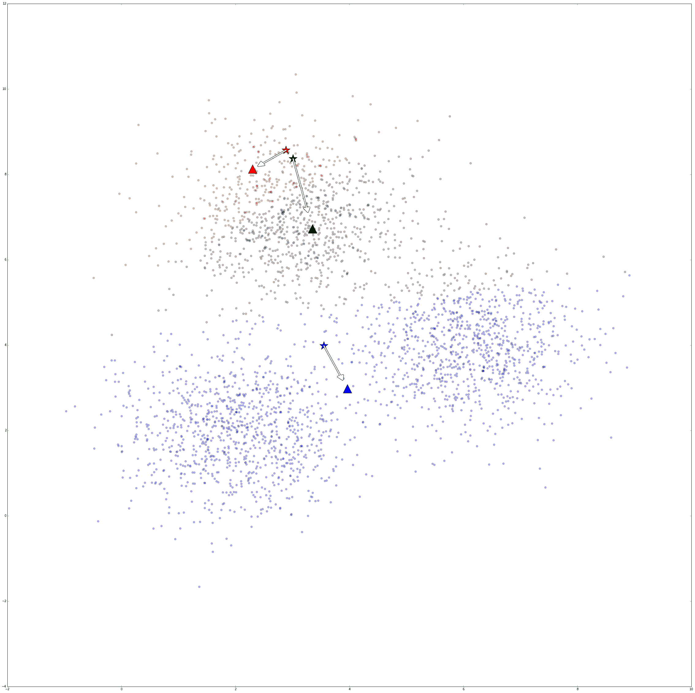
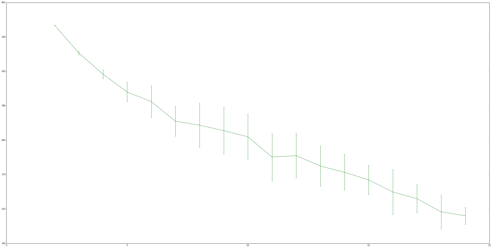
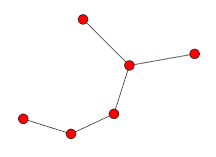
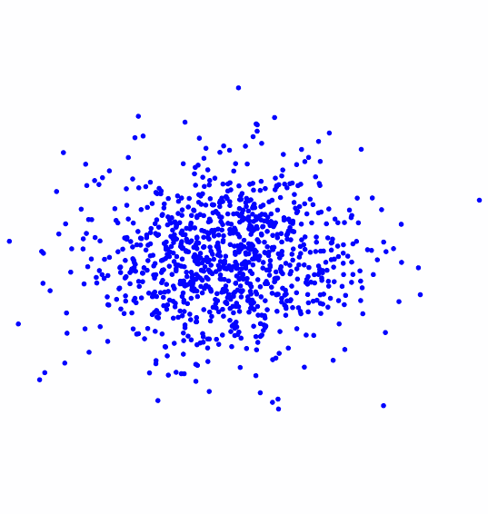
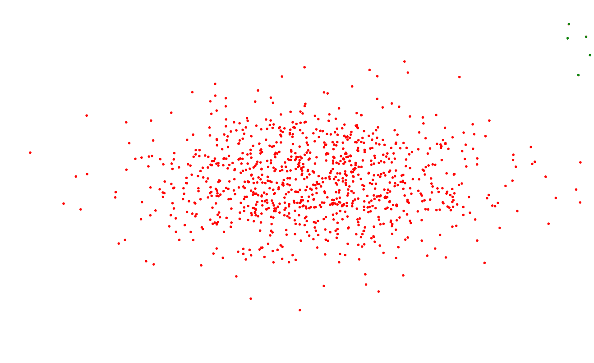
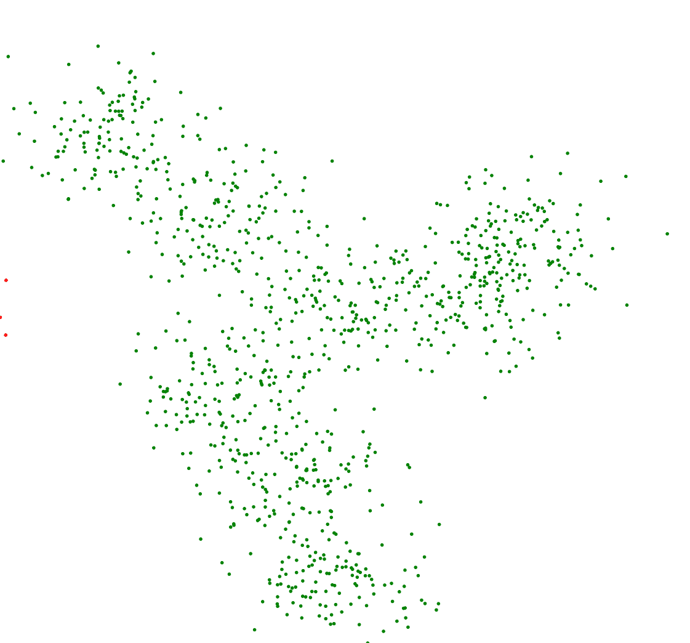

# 新闻文章聚类

在大多数早期章节中，我们在知道我们要寻找什么的情况下进行数据挖掘。我们使用*目标类别*使我们能够在训练阶段学习我们的特征模型如何模拟这些目标，这使得算法可以设置内部参数以最大化其学习。这种有目标进行训练的学习类型被称为**监督学习**。在本章中，我们将考虑在没有这些目标的情况下我们做什么。这是**无监督学习**，它更多的是一种探索性任务。在无监督学习中，我们的目标不是用我们的模型进行分类，而是探索数据以发现洞察。

在本章中，我们将探讨如何通过聚类新闻文章来发现数据中的趋势和模式。我们将研究如何使用链接聚合网站从不同的网站提取数据，以展示各种新闻故事。

本章涵盖的关键概念包括：

+   使用 Reddit API 收集有趣的新闻故事

+   从任意网站获取文本

+   无监督数据挖掘的聚类分析

+   从文档中提取主题

+   在不重新训练的情况下更新模型的在线学习

+   聚类集成以组合不同的模型

# 趋势主题发现

在本章中，我们将构建一个系统，该系统可以接收新闻文章的实时流并将其分组，使得组内的文章具有相似的主题。你可以运行该系统几周（或更长）多次，以查看趋势如何随时间变化。

我们的系统将从流行的链接聚合网站([`www.reddit.com`](https://www.reddit.com/))开始，该网站存储指向其他网站的链接列表，以及一个用于讨论的评论部分。Reddit 上的链接被分为几个链接类别，称为**subreddits**。有专门针对特定电视节目、搞笑图片和其他许多内容的 subreddits。我们感兴趣的是新闻的 subreddits。在本章中，我们将使用*/r/worldnews* subreddits，但代码应该适用于任何其他基于文本的 subreddits。

本章的目标是下载热门故事，然后对它们进行聚类，以查看任何主要主题或概念。这将使我们能够了解热门焦点，而无需手动分析数百个单独的故事。一般过程如下：

1.  从 Reddit 收集最近的热门新闻链接。

1.  从这些链接下载网页。

1.  只从下载的网站中提取新闻故事。

1.  执行聚类分析以找到故事集群。

1.  分析这些集群以发现趋势。

# 使用 Web API 获取数据

我们在之前的一些章节中使用了基于 Web 的 API 来提取数据。例如，在第七章*使用图挖掘进行推荐跟踪*中，我们使用了 Twitter 的 API 来提取数据。收集数据是数据挖掘流程中的关键部分，基于 Web 的 API 是收集各种主题数据的一种极好的方式。

当使用基于 Web 的 API 收集数据时，你需要考虑三个因素：授权方法、速率限制和 API 端点。

**授权方法**允许数据提供者知道谁在收集数据，以确保它们被适当地限制速率，并且数据访问可以被追踪。对于大多数网站，一个个人账户通常足以开始收集数据，但有些网站会要求你创建一个正式的开发者账户以获取这种访问权限。

**速率限制**应用于数据收集，尤其是免费服务。在使用 API 时了解规则很重要，因为它们可以从网站到网站发生变化。Twitter 的 API 限制为每 15 分钟 180 次请求（具体取决于特定的 API 调用）。Reddit，如我们稍后所见，允许每分钟 30 次请求。其他网站可能实施每日限制，而有些网站则按每秒限制。即使在网站内部，不同的 API 调用之间也存在巨大的差异。例如，Google Maps 有更小的限制和不同的 API 限制，每个资源都有不同的每小时请求次数限制。

如果你发现你正在创建一个需要更多请求和更快响应的应用或进行实验，大多数 API 提供者都有商业计划，允许进行更多调用。联系提供者获取更多详情。

**API 端点**是实际用于提取信息的 URL。这些在不同的网站之间各不相同。基于 Web 的 API 通常遵循 RESTful 接口（代表状态转移的缩写）。RESTful 接口通常使用 HTTP 相同的操作：`GET`、`POST`和`DELETE`是最常见的。例如，为了检索资源的信息，我们可能会使用以下（仅作示例）API 端点：

[www.dataprovider.com/api/resource_type/resource_id/](http://www.dataprovider.com/api/resource_type/resource_id/)

要获取信息，我们只需向该 URL 发送一个 HTTP `GET`请求。这将返回给定类型和 ID 的资源信息。大多数 API 都遵循这种结构，尽管在实现上可能存在一些差异。大多数拥有 API 的网站都会对其进行适当的文档说明，提供你可以检索的所有 API 的详细信息。

首先，我们设置参数以连接到服务。为此，你需要 Reddit 的开发者密钥。为了获取这个密钥，登录到[`www.reddit.com/login`](https://www.reddit.com/login)网站，然后转到[`www.reddit.com/prefs/apps`](https://www.reddit.com/prefs/apps)。从这里，点击“你是一位开发者吗？创建一个应用...”，填写表格，将类型设置为脚本。你将获得客户端 ID 和密钥，可以将它们添加到一个新的 Jupyter Notebook 中：

```py
CLIENT_ID = "<Enter your Client ID here>" 
CLIENT_SECRET = "<Enter your Client Secret here>"

```

Reddit 还要求您（当您使用他们的 API 时）设置一个包含您用户名的唯一字符串作为用户代理。创建一个唯一标识您的应用程序的用户代理字符串。我使用了书名、第十章，以及版本号 0.1 来创建我的用户代理，但可以是您喜欢的任何字符串。请注意，如果不这样做，可能会导致您的连接被严重限制速率：

```py
USER_AGENT = "python:<your unique user agent> (by /u/<your reddit username>)"

```

此外，您还需要使用您的用户名和密码登录 Reddit。如果您还没有，可以注册一个新的账户（这是免费的，而且您也不需要用个人信息进行验证）。

在完成下一步之前，您将需要密码，所以在将代码分享给他人之前请小心，以移除密码。如果您不输入密码，将其设置为 none，您将被提示输入它。

现在让我们创建用户名和密码：

```py
from getpass import getpass
USERNAME = "<your reddit username>" 
PASSWORD = getpass("Enter your reddit password:")

```

接下来，我们将创建一个函数来记录这些信息。Reddit 登录 API 将返回一个令牌，您可以使用它进行后续连接，这将是这个函数的结果。代码获取登录 Reddit、设置用户代理和获取我们可以用于未来请求的访问令牌所必需的信息：

```py
import requests
def login(username, password):
    if password is None:
        password = getpass.getpass("Enter reddit password for user {}: ".format(username))    
    headers = {"User-Agent": USER_AGENT}
    # Setup an auth object with our credentials
    client_auth = requests.auth.HTTPBasicAuth(CLIENT_ID, CLIENT_SECRET)
    # Make a post request to the access_token endpoint
    post_data = {"grant_type": "password", "username": username, "password": password}
    response = requests.post("https://www.reddit.com/api/v1/access_token", auth=client_auth,     
                             data=post_data, headers=headers) 
    return response.json()

```

现在我们可以调用我们的函数来获取访问令牌：

```py
token = login(USERNAME, PASSWORD)

```

这个令牌对象只是一个字典，但它包含我们将与未来请求一起传递的 `access_token` 字符串。它还包含其他信息，例如令牌的作用域（将是一切）和它过期的时间，例如：

```py
{'access_token': '<semi-random string>', 'expires_in': 3600, 'scope': '*', 'token_type': 'bearer'}

```

如果您正在创建一个生产级别的应用程序，请确保检查令牌的过期时间，并在其到期时刷新它。您也会知道这种情况发生了，如果您的访问令牌在尝试进行 API 调用时停止工作。

# Reddit 作为数据源

Reddit 是一个全球数百万用户使用的链接聚合网站，尽管其英文版本以美国为中心。任何用户都可以提交他们发现的有趣网站的链接，并为该链接添加标题。其他用户可以对其进行点赞，表示喜欢该链接，或者踩它，表示不喜欢该链接。得票最高的链接会被移至页面顶部，而得票较低的则不会显示。随着时间的推移，根据获得的点赞数，较旧的链接会被从首页移除。获得点赞的故事的用户会获得称为 karma 的积分，这为提交优质故事提供了激励。

Reddit 还允许非链接内容，称为自投稿。这些包含提交者输入的标题和一些文本。这些用于提问和开始讨论。在本章中，我们将只考虑基于链接的帖子，而不是基于评论的帖子。

帖子被分为网站的不同部分，称为子版块。子版块是一系列相关的帖子。当用户向 Reddit 提交链接时，他们会选择它所属的子版块。子版块有自己的管理员，并有自己的规则，关于哪些内容对该子版块是有效的。

默认情况下，帖子按 **热门** 排序，这是一个基于帖子的年龄、收到的点赞数、踩数以及内容自由度的函数。还有 **新**，它只提供最近发布的帖子（因此包含大量垃圾邮件和差评帖子），以及 **Top**，它是在特定时间段内获得最高票数的帖子。在本章中，我们将使用热门排序，这将给我们带来最近、质量较高的故事（在新中确实有很多低质量的链接）。

使用我们之前创建的令牌，我们现在可以获取子版块的链接集合。为此，我们将使用 /r/<subredditname> API 端点，默认情况下，它返回热门故事。我们将使用 /r/worldnews 子版块：

```py
subreddit = "worldnews"

```

之前端点的 URL 允许我们创建完整的 URL，我们可以使用字符串格式化来设置它：

```py
url = "https://oauth.reddit.com/r/{}".format(subreddit)

```

接下来，我们需要设置头部信息。这有两个原因：一是允许我们使用之前收到的授权令牌，二是将用户代理设置为阻止我们的请求受到过度限制。代码如下：

```py
headers = {"Authorization": "bearer {}".format(token['access_token']), 
"User-Agent": USER_AGENT}

```

然后，就像之前一样，我们使用 requests 库来发起调用，确保我们设置了头部信息：

```py
response = requests.get(url, headers=headers)

```

在这个对象上调用 `json()` 将返回一个包含 Reddit 返回信息的 Python 字典。它将包含给定子版块的前 25 个结果。我们可以通过遍历此响应中的故事来获取标题。这些故事存储在字典的 data 键下。代码如下：

```py
result = response.json()
for story in result['data']['children']: 
    print(story['data']['title'])

```

# 获取数据

我们的数据集将包括来自/r/worldnews 子版块的 Hot 列表中的帖子。在前一节中，我们看到了如何连接到 Reddit 以及如何下载链接。为了将这些步骤整合起来，我们将创建一个函数，用于提取给定子版块中每个帖子的标题、链接和评分。

我们将遍历子版块，每次获取最多 100 个故事。我们也可以进行分页以获取更多结果。在 Reddit 停止我们之前，我们可以读取大量的页面，但我们将限制为 5 页。

由于我们的代码将重复调用 API，因此记住对我们的调用进行速率限制非常重要。为此，我们需要 sleep 函数：

```py
from time import sleep

```

我们的功能将接受一个子版块名称和一个授权令牌。我们还将接受要读取的页数，尽管我们将默认设置为 5：

```py
def get_links(subreddit, token, n_pages=5):
    stories = []
    after = None
    for page_number in range(n_pages):
        # Sleep before making calls to avoid going over the API limit
        sleep(2)
        # Setup headers and make call, just like in the login function
        headers = {"Authorization": "bearer {}".format(token['access_token']), "User-Agent": USER_AGENT} 
        url = "https://oauth.reddit.com/r/{}?limit=100". format(subreddit)
        if after:
            # Append cursor for next page, if we have one
            url += "&after={}".format(after)
        response = requests.get(url, headers=headers)
        result = response.json()
        # Get the new cursor for the next loop
        after = result['data']['after']
        # Add all of the news items to our stories list
        for story in result['data']['children']:
            stories.append((story['data']['title'], story['data']['url'], story['data']['score']))
    return stories

```

我们在第七章*，使用图挖掘遵循建议*中看到，Twitter API 的翻页是如何工作的。我们通过返回的结果获得一个游标，并将其与我们的请求一起发送。Twitter 将使用这个游标来获取下一页的结果。Reddit API 几乎做了完全相同的事情，只是它调用参数的顺序不同。我们不需要它用于第一页，所以我们最初将其设置为 None。在我们的第一页结果之后，我们将将其设置为有意义的值。

调用故事功能是一个简单的案例，只需传递授权令牌和 subreddit 名称：

```py
stories = get_links("worldnews", token)

```

返回的结果应包含标题、URL 和 500 个故事，我们将使用这些结果提取实际文本。以下是我运行脚本后收到的标题样本：

*俄罗斯考虑禁止向 2015 年后出生的人出售香烟*

*瑞士穆斯林女孩必须与男孩一起游泳*

*报告：俄罗斯在瑞典散布虚假新闻和虚假信息 - 根据瑞典国际事务研究所研究人员的一份报告，俄罗斯在过去两年中协调开展了一场宣传活动，通过散布虚假信息、宣传和伪造文件来影响瑞典的决策*

*荷兰 100%的火车现在都使用风能。荷兰提前一年实现了可再生能源目标*

*对英国全面监控法律的挑战迅速获得众筹*

*大约有特拉华州大小的 1000 英尺厚的冰块正在从南极洲断裂*

*根据对全球美国打击的分析，2016 年美国平均每天投下 72 枚炸弹——相当于每小时 3 枚——2016 年美国轰炸了伊拉克、叙利亚、巴基斯坦、阿富汗、利比亚、也门、索马里*

*德国政府正在调查最近虚假新闻激增的情况，据称俄罗斯试图干预该国今年晚些时候的议会选举*

*巴西乡村几天内就有超过 1000 万只蜜蜂因农药死亡*

*欧洲伊斯兰国恐怖袭击的美国受害者家属起诉 Twitter，指控社交媒体巨头允许恐怖组织在网上传播*

*尽管气候变化，全球汽油税下降；石油和天然气行业获得 5000 亿美元补贴；美国上一次新的汽油税是在 1993 年*

*捷克政府告诉公民在“超级大屠杀”的情况下武装自己并射击穆斯林恐怖分子*

*巴勒斯坦解放组织威胁，如果美国大使馆迁至耶路撒冷，将撤销对以色列的承认*

*欧洲所有新发现的 HIV 病例中有三分之二仅记录在一个国家——俄罗斯：现在有超过一百万俄罗斯人感染了病毒，预计在下一个十年内这个数字将几乎翻倍*

*捷克政府告诉其公民如何对抗恐怖分子：自己开枪射击 | 内政部正在推动一项宪法变革，这将允许公民使用枪支对抗恐怖分子*

*摩洛哥禁止出售布卡*

*大规模杀手布雷维克在权利申诉案中行纳粹敬礼*

*索罗斯集团在特朗普获胜后面临清洗风险，匈牙利变得更加大胆*

*尼日利亚在反腐行动中清除 5 万名“幽灵员工”*

*研究发现，酒精广告具有侵略性，与青少年饮酒有关 | 社会*

*英国政府悄然发动“自由攻击”同时分散人们的注意力，法律挑战活动人士表示 - 《调查权力法案》去年年底成为法律，赋予间谍阅读每个人整个互联网历史的能力*

*俄罗斯的国家储备基金在 2016 年下跌 70%*

*在雅典发现一名俄罗斯外交官死亡*

*在喀布尔阿富汗议会的附近发生双爆炸事件，造成至少 21 人死亡（其中大多数是平民）和 45 人受伤*

*英镑贬值加剧，货币重获可疑荣誉*

世界新闻通常不是最乐观的地方，但它确实能让我们了解世界各地正在发生的事情，以及这个 subreddit 上的趋势通常能反映出全球趋势。

# 从任意网站上提取文本

我们从 reddit 获得的链接指向由许多不同组织运行的任意网站。为了使问题更加复杂，这些页面是为了让人阅读而不是让计算机程序阅读。当试图获取这些结果的实际内容/故事时，这可能会引起问题，因为现代网站在后台有很多活动。JavaScript 库被调用，样式表被应用，广告通过 AJAX 加载，侧边栏中添加了额外的内容，以及进行各种其他操作，使现代网页成为一个复杂的文档。这些功能使现代 Web 成为它现在这样，但同时也使得从现代网页中自动获取好的信息变得困难！

# 在任意网站上寻找故事

首先，我们将从每个链接下载完整的网页，并将它们存储在我们的数据文件夹中，在 raw 子文件夹下。我们将在稍后处理这些内容以提取有用的信息。这种结果的缓存确保了在我们工作时不需要持续下载网站。首先，我们设置数据文件夹路径：

```py
import os 
data_folder = os.path.join(os.path.expanduser("~"), "Data", "websites", "raw")

```

我们将使用 MD5 散列来为我们的文章创建唯一的文件名，通过散列 URL 来实现，我们将导入`hashlib`来完成这个任务。散列函数是一个将某些输入（在我们的例子中是一个包含标题的字符串）转换为看似随机的字符串的函数。相同的输入将始终返回相同的输出，但略微不同的输入将返回截然不同的输出。从散列值到原始值也是不可能的，这使得它成为一个单向函数。

```py
import hashlib

```

对于本章的实验，我们将简单地跳过任何失败的网站下载。为了确保我们不会因为这样做而丢失太多信息，我们维护一个简单的错误计数器。我们将抑制发生的任何错误，这可能导致系统性的问题，阻止下载。如果这个错误计数器太高，我们可以查看这些错误是什么，并尝试修复它们。例如，如果计算机没有互联网访问，所有 500 次下载都会失败，你应该在继续之前修复这个问题！

```py
number_errors = 0

```

接下来，我们遍历我们的每个故事，下载网站，并将结果保存到文件中：

```py
for title, url, score in stories:
    output_filename = hashlib.md5(url.encode()).hexdigest() 
    fullpath = os.path.join(data_folder, output_filename + ".txt")
    try: 
        response = requests.get(url) 
        data = response.text 
        with open(fullpath, 'w') as outf: 
            outf.write(data)
        print("Successfully completed {}".format(title))
    except Exception as e:
        number_errors += 1
        # You can use this to view the errors, if you are getting too many:
        # raise

```

如果在获取网站时出现错误，我们简单地跳过这个网站并继续。这段代码将适用于大量网站，这对我们的应用程序来说已经足够好了，因为我们寻找的是一般趋势，而不是精确性。

注意，有时你确实在乎获得 100%的响应，你应该调整你的代码以适应更多的错误。但是要警告你，要创建在互联网数据上可靠工作的代码需要付出显著的努力。获取那些最终 5%到 10%的网站代码将会显著更复杂。

在前面的代码中，我们简单地捕获发生的任何错误，记录错误然后继续。

如果你发现错误太多，将 print(e)行改为仅输入 raise。这将导致异常被调用，允许你调试问题。

完成此操作后，我们将在`raw`子文件夹中有一堆网站。在查看这些页面（在文本编辑器中打开创建的文件）后，你可以看到内容在那里，但还有 HTML、JavaScript、CSS 代码以及其他内容。因为我们只对故事本身感兴趣，所以我们现在需要一种方法来从这些不同的网站中提取这些信息。

# 提取内容

在我们获取原始数据后，我们需要在每个中找到故事。为此有几种复杂的算法，以及一些简单的算法。我们将坚持使用一种简单的方法，考虑到通常情况下，简单的算法就足够了。这是数据挖掘的一部分——知道何时使用简单的算法来完成工作，以及何时使用更复杂的算法来获得额外的性能。

首先，我们获取`raw`子文件夹中每个文件名的列表：

```py
filenames = [os.path.join(data_folder, filename) for filename in os.listdir(data_folder)]

```

接下来，我们为将要提取的纯文本版本创建一个输出文件夹：

```py
text_output_folder = os.path.join(os.path.expanduser("~"), "Data", "websites", "textonly")

```

接下来，我们开发提取文件中文本的代码。我们将使用 lxml 库来解析 HTML 文件，因为它有一个处理一些格式不良表达式的良好 HTML 解析器。代码如下：

```py
from lxml import etree

```

提取文本的实际代码基于三个步骤：

1.  我们遍历 HTML 文件中的每个节点，并从中提取文本。

1.  我们跳过任何 JavaScript、样式或注释节点，因为这些不太可能包含对我们感兴趣的信息。

1.  我们确保内容至少有 100 个字符。这是一个很好的基线，但可以通过更精确的结果来改进。

正如我们之前所说的，我们对脚本、样式或注释不感兴趣。因此，我们创建了一个列表来忽略那些类型的节点。任何具有此列表中类型的节点都不会被视为包含故事。代码如下：

```py
skip_node_types = ["script", "head", "style", etree.Comment]

```

我们现在将创建一个函数，该函数将解析一个 HTML 文件到 lxml 的`etree`中，然后我们将创建另一个函数来解析这个树，寻找其中的文本。这个第一个函数相当直接；只需打开文件并使用 lxml 库的 HTML 文件解析函数创建一个树。代码如下：

```py
parser = etree.HTMLParser()

def get_text_from_file(filename):
    with open(filename) as inf:
        html_tree = etree.parse(inf, parser) 
    return get_text_from_node(html_tree.getroot())

```

在该函数的最后一条语句中，我们调用`getroot()`函数来获取树的根节点，而不是完整的`etree`。这使得我们可以编写我们的文本提取函数以接受任何节点，因此可以编写一个递归函数。

此函数将在任何子节点上调用自身以提取其文本，然后返回任何子节点文本的连接。

如果传递给此函数的节点没有子节点，我们只需返回其文本。如果没有文本，我们只返回一个空字符串。注意，我们在这里也检查了第三个条件——文本至少有 100 个字符长。

检查文本至少有 100 个字符长的代码如下：

```py
def get_text_from_node(node):
    if len(node) == 0: 
        # No children, just return text from this item
        if node.text: 
            return node.text 
        else:
            return ""
    else:
        # This node has children, return the text from it:
        results = (get_text_from_node(child)
                   for child in node
                   if child.tag not in skip_node_types)
    result = str.join("n", (r for r in results if len(r) > 1))
    if len(result) >= 100:
        return result
    else:
        return ""

```

在这一点上，我们知道该节点有子节点，因此我们递归地调用此函数在每个子节点上，然后在它们返回时连接结果。

返回行中的最终条件阻止空白行被返回（例如，当一个节点没有子节点和文本时）。我们还使用了一个生成器，这使得代码更高效，因为它只在需要时获取文本数据，即最终的返回语句，而不是创建多个子列表。

我们现在可以通过遍历所有原始 HTML 页面来运行此代码，对每个页面调用文本提取函数，并将结果保存到纯文本子文件夹中：

```py
for filename in os.listdir(data_folder):
    text = get_text_from_file(os.path.join(data_folder, filename)) 
    with open(os.path.join(text_output_folder, filename), 'w') as outf: 
        outf.write(text)

```

您可以通过打开纯文本子文件夹中的每个文件并检查其内容来手动评估结果。如果您发现结果中有太多非故事内容，尝试增加最小 100 字符限制。如果您仍然无法获得良好的结果，或者需要为您的应用程序获得更好的结果，请尝试在*附录 A，下一步*中列出的方法。

# 分组新闻文章

本章的目的是通过聚类或分组来发现新闻文章的趋势。为此，我们将使用 k-means 算法，这是一种经典的机器学习算法，最初于 1957 年开发。

**聚类**是一种无监督学习技术，我们经常使用聚类算法来探索数据。我们的数据集包含大约 500 个故事，逐一检查这些故事将非常费力。使用聚类使我们能够将相似的故事分组在一起，并且我们可以独立地探索每个簇的主题。

当我们没有明确的数据目标类别时，我们会使用聚类技术。从这个意义上说，聚类算法在他们的学习中几乎没有方向。它们根据某个函数学习，而不考虑数据的潜在含义。

因此，选择好的特征至关重要。在监督学习中，如果你选择了不好的特征，学习算法可以选择不使用这些特征。例如，支持向量机会给在分类中无用的特征赋予很小的权重。然而，在聚类中，所有特征都会用于最终结果——即使这些特征没有为我们提供我们想要的答案。

在对现实世界数据进行聚类分析时，始终有一个对场景中哪些特征将起作用的感觉是个好主意。在本章中，我们将使用词袋模型。我们寻找基于主题的组，因此我们将使用基于主题的特征来建模文档。我们知道这些特征有效，是因为其他人已经在我们的问题的监督版本中进行了相关工作。相比之下，如果我们进行基于作者身份的聚类，我们会使用诸如第九章中提到的“作者归属”实验中发现的那些特征。

# k-means 算法

k-means 聚类算法通过迭代过程找到最能代表数据的质心。算法从一个预定义的质心集合开始，这些质心通常是来自训练数据的数据点。k-means 中的**k**表示要寻找的质心数量以及算法将找到多少个簇。例如，将 k 设置为 3 将在数据集中找到三个簇。

k-means 有两个阶段：**分配**和**更新**。它们解释如下：

+   在**分配**步骤中，我们为数据集中的每个样本设置一个标签，将其与最近的质心联系起来。对于每个最接近质心 1 的样本，我们分配标签 1。对于每个最接近质心 2 的样本，我们分配标签 2，依此类推，直到 k 个质心。这些标签形成了簇，所以我们说带有标签 1 的每个数据点都在簇 1 中（在这个时候，因为分配可以在算法运行时改变）。

+   在**更新**步骤中，我们取每个簇并计算其质心，即该簇中所有样本的平均值。

算法随后在分配步骤和更新步骤之间迭代；每次更新步骤发生时，每个质心都会移动一小段距离。这导致分配略有变化，导致质心在下一迭代中移动一小段距离。这个过程会重复，直到达到某个停止标准。

常常在迭代一定次数后停止，或者当质心的总移动量非常低时停止。在某些情况下，算法也可以完成，这意味着聚类是稳定的——分配没有变化，质心也没有变化。

在下面的图中，k-means 是在一个随机创建但包含三个聚类的数据集上进行的。星星代表质心的起始位置，这些位置是通过从数据集中随机选择一个样本来随机选择的。经过 k-means 算法的 5 次迭代，质心移动到了由三角形表示的位置。



k-means 算法因其数学特性和历史意义而令人着迷。这是一个（大致上）只有一个参数的算法，非常有效且经常使用，即使在其发现 50 多年后。

scikit-learn 中有一个 k-means 算法，我们是从 scikit-learn 的`cluster`模块中导入的：

```py
from sklearn.cluster import KMeans

```

我们还引入了`CountVectorizer`类的近亲，`TfidfVectorizer`。这个向量器为每个词项的计数应用权重，这取决于它在多少个文档中出现的次数，使用以下公式：tf / log(df)，其中 tf 是词项的频率（在当前文档中出现的次数）和 df 是词项的文档频率（在我们的语料库中出现的文档数）。在许多文档中出现的词项被赋予较低的权重（通过除以它出现的文档数的对数）。对于许多文本挖掘应用，使用这种类型的加权方案可以相当可靠地提高性能。代码如下：

```py
from sklearn.feature_extraction.text import TfidfVectorizer

```

我们然后设置我们的分析流程。这有两个步骤。第一步是应用我们的向量器，第二步是应用我们的 k-means 算法。代码如下：

```py
from sklearn.pipeline import Pipeline
n_clusters = 10 
pipeline = Pipeline([('feature_extraction', TfidfVectorizer(max_df=0.4)),
                                     ('clusterer', KMeans(n_clusters=n_clusters)) ])

```

`max_df`参数被设置为 0.4 的低值，这意味着忽略任何在超过 40%的文档中出现的单词。这个参数对于移除那些本身对主题意义贡献不大的功能词来说是无价的。

移除在超过 40%的文档中出现的任何单词将移除功能词，这使得这种类型的预处理对我们在第九章中看到的工作来说相当无用，第九章*，作者归属*。

```py
documents = [open(os.path.join(text_output_folder, filename)).read()
             for filename in os.listdir(text_output_folder)]

```

我们然后拟合并预测这个流程。到目前为止，我们已经在本书中多次遵循这个过程进行分类任务，但这里有一个区别——我们不将数据集的目标类别提供给 fit 函数。这就是使其成为无监督学习任务的原因！代码如下：

```py
pipeline.fit(documents)
labels = pipeline.predict(documents)

```

`labels`变量现在包含每个样本的簇编号。具有相同标签的样本被认为属于同一簇。需要注意的是，簇标签本身没有意义：簇 1 和 2 与簇 1 和 3 的相似度没有区别。

我们可以使用`Counter`类查看每个簇中放置了多少个样本：

```py
from collections import Counter
c = Counter(labels) 
for cluster_number in range(n_clusters): 
    print("Cluster {} contains {} samples".format(cluster_number, c[cluster_number]))

Cluster 0 contains 1 samples
Cluster 1 contains 2 samples
Cluster 2 contains 439 samples
Cluster 3 contains 1 samples
Cluster 4 contains 2 samples
Cluster 5 contains 3 samples
Cluster 6 contains 27 samples
Cluster 7 contains 2 samples
Cluster 8 contains 12 samples
Cluster 9 contains 1 samples

```

许多结果（记住你的数据集将与我的大相径庭）由一个包含大多数实例的大簇、几个中等大小的簇以及一些只有一个或两个实例的簇组成。这种不平衡在许多聚类应用中相当正常。

# 评估结果

聚类分析主要是一种探索性分析，因此很难有效地评估聚类算法的结果。一种直接的方法是根据算法试图学习的标准来评估算法。

如果你有一个测试集，你可以将其与聚类进行评估。更多详情，请访问[`nlp.standford.edu/IR-book/html/htmledition/evaluation-of-clustering-1.html`](http://nlp.standford.edu/IR-book/html/htmledition/evaluation-of-clustering-1.html)

在 k-means 算法的情况下，它在开发质心时使用的标准是最小化每个样本到其最近质心的距离。这被称为算法的惯性，可以从任何已经调用 fit 的 KMeans 实例中检索到：

```py
pipeline.named_steps['clusterer'].inertia_

```

在我的数据集上的结果是 343.94。不幸的是，这个值本身相当没有意义，但我们可以用它来确定我们应该使用多少个簇。在先前的例子中，我们将`n_clusters`设置为 10，但这真的是最佳值吗？以下代码运行 k-means 算法 10 次，每次`n_clusters`的值从 2 到 20，需要一些时间来完成大量运行。

对于每次运行，它记录结果的惯性。

你可能会注意到以下代码，我们并没有使用 Pipeline；相反，我们将步骤拆分出来。我们只从我们的文本文档中创建一次 X 矩阵，每次`n_clusters`的值变化时，以（大幅）提高此代码的速度。

```py
inertia_scores = [] 
n_cluster_values = list(range(2, 20)) 
for n_clusters in n_cluster_values: 
    cur_inertia_scores = [] 
    X = TfidfVectorizer(max_df=0.4).fit_transform(documents) 
 for i in range(10): 
        km = KMeans(n_clusters=n_clusters).fit(X) 
        cur_inertia_scores.append(km.inertia_) 
    inertia_scores.append(cur_inertia_scores)

```

`inertia_scores`变量现在包含从 2 到 20 个`n_clusters`值对应的惯性分数列表。我们可以绘制这些值以了解这个值如何与`n_clusters`相互作用：

```py
%matplotlib inline
from matplotlib import pyplot as plt
inertia_means = np.mean(inertia_scores, axis=1)
inertia_stderr = np.std(inertia_scores, axis=1)
fig = plt.figure(figsize=(40,20))
plt.errorbar(n_cluster_values, inertia_means, inertia_stderr, color='green')
plt.show()

```



总体而言，随着簇数的增加，惯性值应该随着改进的减少而降低，我们可以从这些结果中大致看出这一点。从 6 到 7 的值增加仅由于选择质心的随机性，这直接影响了最终结果的好坏。尽管如此，对于我的数据来说（你的结果可能会有所不同），大约 6 个簇是惯性发生重大改进的最后一次。

在这一点之后，惯性只有轻微的改进，尽管很难具体说明这种模糊的标准。寻找这种类型模式被称为肘部规则，因为我们正在寻找图表中的肘部弯曲。一些数据集有更明显的肘部，但这个特征并不保证出现（某些图表可能是平滑的！）

根据这种分析，我们将`n_clusters`设置为 6，然后重新运行算法：

```py
n_clusters = 6 
pipeline = Pipeline([('feature_extraction', TfidfVectorizer(max_df=0.4)),
                     ('clusterer', KMeans(n_clusters=n_clusters)) ])
pipeline.fit(documents) 
labels = pipeline.predict(documents)

```

# 从聚类中提取主题信息

现在，我们将目光投向聚类，试图发现每个聚类中的主题。

我们首先从特征提取步骤中提取术语列表：

```py
terms = pipeline.named_steps['feature_extraction'].get_feature_names()

```

我们还设置了一个计数器来统计每个类的大小：

```py
c = Counter(labels)

```

遍历每个聚类，我们像以前一样打印出聚类的大小。

在评估结果时，重要的是要记住聚类的大小——一些聚类可能只有一个样本，因此不能代表一般趋势。

接下来（仍然在循环中），我们遍历这个聚类最重要的术语。为此，我们从质心中找到具有最高值的特征，然后取这五个最大值。

```py
for cluster_number in range(n_clusters): 
    print("Cluster {} contains {} samples".format(cluster_number, c[cluster_number]))
    print(" Most important terms")
    centroid = pipeline.named_steps['clusterer'].cluster_centers_[cluster_number]
    most_important = centroid.argsort()
    for i in range(5):
        term_index = most_important[-(i+1)]
        print(" {0}) {1} (score: {2:.4f})".format(i+1, terms[term_index], centroid[term_index]))

```

结果可以相当直观地反映当前趋势。在我的结果（2017 年 1 月获得）中，聚类对应于健康问题、中东紧张局势、韩国紧张局势和俄罗斯事务。这些是当时新闻报道的主要话题——尽管这些年来几乎没有变化！

你可能会注意到一些没有提供太多价值的词出现在顶部，例如 *你*、*她* 和 *mr.* 这些功能词对于作者身份分析很有用——正如我们在第九章中看到的，*作者归属*，但通常对于主题分析并不很好。将功能词列表传递到我们管道上**TfidfVectorizer**的`stop_words`参数将忽略这些词。以下是构建此类管道的更新代码：

```py
function_words = [... list from Chapter 9 ...]

pipeline = Pipeline([('feature_extraction', TfidfVectorizer(max_df=0.4, stop_words=function_words)),
                     ('clusterer', KMeans(n_clusters=n_clusters)) ])

```

# 将聚类算法作为转换器

作为一个旁注，关于 k-means 算法（以及任何聚类算法）的一个有趣特性是，你可以用它来进行特征降维。有许多方法可以减少特征数量（或创建新特征以嵌入数据集），例如**主成分分析**、**潜在语义索引**以及许多其他方法。这些算法中许多存在的问题是它们通常需要大量的计算能力。

在前面的例子中，术语列表中有超过 14,000 个条目——这是一个相当大的数据集。我们的 k-means 算法将这些转换成仅仅六个聚类。然后我们可以通过将每个质心的距离作为特征来创建一个具有更低特征数量的数据集。

为了做到这一点，我们调用 KMeans 实例的 transform 函数。我们的管道适合这个目的，因为它在末尾有一个 k-means 实例：

```py
X = pipeline.transform(documents)

```

这在管道的最后一步调用转换方法，这是一个 k-means 的实例。这导致一个具有六个特征和样本数量与文档长度相同的矩阵。

然后，你可以对结果进行自己的二级聚类，或者如果你有目标值，可以使用它进行分类。这个工作流程的一个可能方案是使用监督数据执行一些特征选择，使用聚类将特征数量减少到更易于管理的数量，然后使用分类算法（如 SVMs）的结果。

# 聚类集成

在 第三章*，使用决策树预测体育比赛胜者* 中，我们研究了使用随机森林算法的分类集成，随机森林算法是由许多低质量的基于树的分类器组成的集成。集成也可以使用聚类算法来执行。这样做的一个关键原因是为了平滑算法多次运行的结果。正如我们之前看到的，k-means 运行的结果因初始质心的选择而异。通过多次运行算法并合并结果可以减少这种变化。

集成还可以减少选择参数对最终结果的影响。大多数聚类算法对算法选择的参数值非常敏感。选择略微不同的参数会导致不同的聚类。

# 证据累积

作为一种基本集成，我们首先多次对数据进行聚类并记录每次运行的标签。然后我们在一个新的矩阵中记录每对样本一起聚类的次数。这是 **证据累积聚类**（**EAC**）算法的本质。

EAC 有两个主要步骤。

1.  第一步是多次使用低级聚类算法（如 k-means）对数据进行聚类，并记录每个迭代中样本位于同一聚类的频率。这被存储在一个 **共关联矩阵** 中。

1.  第二步是对生成的共关联矩阵进行聚类分析，这使用另一种称为层次聚类的聚类算法来完成。它具有一个有趣的基于图论的性质，因为它在数学上等同于找到一个连接所有节点的树并移除弱连接。

我们可以通过遍历每个标签并记录两个样本具有相同标签的位置，从标签数组中创建一个共关联矩阵。我们使用 SciPy 的 `csr_matrix`，这是一种稀疏矩阵：

```py
from scipy.sparse import csr_matrix

```

我们的功能定义接受一组标签，然后记录每个匹配的行和列。我们在列表中这样做。稀疏矩阵通常只是记录非零值位置的列表集合，`csr_matrix` 就是这种稀疏矩阵的一个例子。对于具有相同标签的每对样本，我们在列表中记录这两个样本的位置：

```py
import numpy as np
def create_coassociation_matrix(labels):
    rows = [] 
    cols = []
    unique_labels = set(labels) 
    for label in unique_labels:
        indices = np.where(labels == label)[0]
        for index1 in indices:
            for index2 in indices:
                rows.append(index1)
                cols.append(index2)
    data = np.ones((len(rows),)) 
    return csr_matrix((data, (rows, cols)), dtype='float')

```

要从标签中获得共关联矩阵，我们只需调用此函数：

```py
C = create_coassociation_matrix(labels)

```

从这里，我们可以将这些矩阵的多个实例相加。这使我们能够结合 k-means 多次运行的结果。打印出 `C`（只需在 Jupyter Notebook 的新单元格中输入 C 并运行即可）将告诉你有多少单元格中有非零值。在我的情况下，大约一半的单元格中有值，因为我的聚类结果有一个大簇（簇越均匀，非零值的数量就越低）。

下一步涉及共关联矩阵的层次聚类。我们将通过在这个矩阵上找到最小生成树并移除低于给定阈值的边来完成此操作。

在图论中，生成树是连接图中所有节点的边集。**最小生成树**（MST）只是具有最低总权重的生成树。在我们的应用中，我们的图中的节点来自我们的数据集的样本，边权重是这两个样本聚集在一起的次数——即我们的共关联矩阵中的值。

在以下图中，展示了六个节点的图上的最小生成树。在 MST 中，图上的节点可以多次连接，只要所有节点都连接在一起。



为了计算 MST，我们使用 SciPy 的 `minimum_spanning_tree` 函数，该函数位于稀疏包中：

```py
from scipy.sparse.csgraph import minimum_spanning_tree

```

可以直接在我们的共关联函数返回的稀疏矩阵上调用 `mst` 函数：

```py
mst = minimum_spanning_tree(C)

```

然而，在我们的共关联矩阵 C 中，更高的值表示经常聚集在一起的样本——这是一个相似度值。相比之下，`minimum_spanning_tree` 将输入视为距离，对得分较高的进行惩罚。因此，我们在共关联矩阵的否定上计算最小生成树：

```py
mst = minimum_spanning_tree(-C)

```

前一个函数的结果是一个与共关联矩阵大小相同的矩阵（行数和列数与我们的数据集中的样本数量相同），只保留最小生成树中的边，并移除所有其他边。

我们随后移除任何权重小于预定义阈值的节点。为此，我们遍历 MST 矩阵中的边，移除任何小于特定值的边。我们无法仅通过在共关联矩阵中迭代一次来测试这一点（值将是 1 或 0，因此没有太多可以工作的）。因此，我们首先创建额外的标签，创建共关联矩阵，然后将两个矩阵相加。代码如下：

```py
pipeline.fit(documents) 
labels2 = pipeline.predict(documents) 
C2 = create_coassociation_matrix(labels2) 
C_sum = (C + C2) / 2

```

我们随后计算最小生成树（MST），并移除在这两个标签中都没有出现的任何边：

```py
mst = minimum_spanning_tree(-C_sum) 
mst.data[mst.data > -1] = 0

```

我们想要截断的阈值是任何不在两个聚类中的边——即值为 1 的边。然而，由于我们否定了共关联矩阵，我们也必须否定阈值值。

最后，我们找到所有的连通分量，这仅仅是一种找到所有在移除低权重边后仍然通过边连接的样本的方法。第一个返回值是连通分量的数量（即簇的数量），第二个是每个样本的标签。代码如下：

```py
from scipy.sparse.csgraph import connected_components 
number_of_clusters, labels = connected_components(mst)

```

在我的数据集中，我获得了八个簇，簇与之前的大致相同。这几乎不足为奇，因为我们只使用了 k-means 的两次迭代；使用更多的 k-means 迭代（如我们在下一节中做的那样）将导致更大的方差。

# 它是如何工作的

在 k-means 算法中，每个特征都是无差别地使用的。本质上，所有特征都被假定为处于相同的尺度。我们在第二章*，使用 scikit-learn 估计器的分类*中看到了不缩放特征的问题。结果是 k-means 正在寻找圆形簇，如下所示：



k-means 也可以发现椭圆形簇。分离通常并不那么平滑，但可以通过特征缩放来简化。以下是一个这种形状簇的例子：



如前一个屏幕截图所示，并非所有簇都具有这种形状。蓝色簇是圆形的，是 k-means 非常擅长识别的类型。红色簇是椭圆形。通过一些特征缩放，k-means 可以识别这种形状的簇。

下面的第三个簇甚至不是凸的——它是一个 k-means 可能会遇到困难的奇形怪状，但仍然会被认为是*簇*，至少对于大多数看图的人来说是这样的：



聚类分析是一项艰巨的任务，其中大部分困难仅仅在于试图定义问题。许多人直观地理解它的含义，但试图用精确的术语来定义它（这对于机器学习是必要的）是非常困难的。甚至人们经常对这个词有不同的看法！

EAC 算法通过将特征重新映射到新的空间中工作，本质上是将 k-means 算法的每次运行转换为一个使用我们之前章节中使用的 k-means 进行特征降维的转换器。然而，在这种情况下，我们只使用实际的标签，而不是到每个质心的距离。这是记录在共关联矩阵中的数据。

结果是，EAC 现在只关心事物之间的接近程度，而不是它们在原始特征空间中的位置。仍然存在未缩放特征的问题。特征缩放很重要，无论如何都应该进行（我们在本章中使用 tf**-**idf 进行了缩放，这导致特征值具有相同的尺度）。

我们在第九章*，作者归属*中看到了类似类型的转换，通过在 SVM 中使用核。这些转换非常强大，应该记住用于复杂的数据集。将数据重新映射到新特征空间上的算法不需要太复杂，正如你将在 EAC 算法中看到的那样。

# 实现

将所有这些放在一起，我们现在可以创建一个符合 scikit-learn 接口的聚类算法，该算法执行 EAC 中的所有步骤。首先，我们使用 scikit-learn 的*ClusterMixin*创建类的基本结构。

我们的参数是在第一步中要执行的 k-means 聚类次数（用于创建共关联矩阵）、截断的阈值以及每次 k-means 聚类中要找到的聚类数。我们设置一个 n_clusters 的范围，以便在我们的 k-means 迭代中获得大量的方差。通常，在集成术语中，方差是一个好东西；没有它，解决方案可能不如单个聚类（尽管如此，高方差并不是集成将更好的指标）。

我将首先展示完整的类，然后概述每个函数：

```py
from sklearn.base import BaseEstimator, ClusterMixin
class EAC(BaseEstimator, ClusterMixin):
    def __init__(self, n_clusterings=10, cut_threshold=0.5, n_clusters_range=(3, 10)): 
        self.n_clusterings = n_clusterings
        self.cut_threshold = cut_threshold
        self.n_clusters_range = n_clusters_range

    def fit(self, X, y=None):
        C = sum((create_coassociation_matrix(self._single_clustering(X))
                 for i in range(self.n_clusterings)))
        mst = minimum_spanning_tree(-C)
        mst.data[mst.data > -self.cut_threshold] = 0
        mst.eliminate_zeros()
        self.n_components, self.labels_ = connected_components(mst)
        return self

    def _single_clustering(self, X):
        n_clusters = np.random.randint(*self.n_clusters_range)
        km = KMeans(n_clusters=n_clusters)
        return km.fit_predict(X)

    def fit_predict(self, X):
        self.fit(X)
        return self.labels_

```

`fit`函数的目标是执行 k-means 聚类多次，合并共关联矩阵，然后通过找到最小生成树（MST）来分割，正如我们之前在 EAC 示例中看到的那样。然后我们使用 k-means 执行我们的低级聚类，并将每次迭代的共关联矩阵相加。我们这样做是为了节省内存，只在需要时创建共关联矩阵。在这个生成器的每个迭代中，我们使用我们的数据集创建一个新的单个 k-means 运行，然后为其创建共关联矩阵。我们使用`sum`将这些矩阵相加。

如前所述，我们创建最小生成树（MST），移除任何小于给定阈值的边（如前所述，正确地取反值），然后找到连通分量。与 scikit-learn 中的任何拟合函数一样，我们需要返回 self，以便类在管道中有效地工作。

`_single_clustering`函数旨在在我们的数据上执行一次 k-means 迭代，然后返回预测标签。为此，我们使用 NumPy 的`randint`函数和我们的`n_clusters_range`参数（设置可能值的范围）随机选择要找到的聚类数。然后我们使用 k-means 聚类和预测数据集。这里的返回值将是来自 k-means 的标签。

最后，`fit_predict`函数简单地调用 fit，然后返回文档的标签。

我们现在可以通过设置一个管道（与之前一样）并使用 EAC（而不是之前作为管道最终阶段的 KMeans 实例）来运行此代码。代码如下：

```py
pipeline = Pipeline([('feature_extraction', TfidfVectorizer(max_df=0.4)),
                     ('clusterer', EAC()) ])

```

# 在线学习

在某些情况下，在我们开始学习之前，我们没有所有需要的训练数据。有时，我们正在等待新数据的到来，也许我们拥有的数据太大，无法放入内存，或者在一个预测之后收到了额外的数据。在这些情况下，在线学习是随着时间训练模型的一个选项。

**在线学习**是新数据到达时模型的增量更新。支持在线学习的算法可以一次训练一个或几个样本，并在新样本到达时进行更新。相比之下，不支持在线的算法需要一次性访问所有数据。标准的 k-means 算法就是这样，本书中我们迄今为止看到的大多数算法也是如此。

算法的在线版本有一种方法，只需使用少量样本就可以部分更新其模型。神经网络是按在线方式工作的算法的标准示例。当一个新的样本被提供给神经网络时，网络中的权重会根据学习率进行更新，学习率通常是一个非常小的值，如 0.01。这意味着任何单个实例只会对模型产生小的（但希望是改进的）变化。

神经网络也可以以批处理模式进行训练，其中一次给出一个样本组，并在一步中完成训练。在批处理模式下，算法通常更快，但使用更多的内存。

在这个意义上，我们可以在单个或小批量样本之后稍微更新 k-means 中心。为此，我们在 k-means 算法的更新步骤中应用一个学习率。假设样本是从总体中随机选择的，中心应该倾向于移动到它们在标准、离线和 k-means 算法中的位置。

在线学习与基于流的学习相关；然而，有一些重要的区别。在线学习能够在样本被用于模型之后回顾旧样本，而基于流的机器学习算法通常只能进行一次遍历——也就是说，只有一个机会查看每个样本。

# 实现

scikit-learn 包包含**MiniBatchKMeans**算法，它允许在线学习。这个类实现了一个 partial_fit 函数，它接受一组样本并更新模型。相比之下，调用 fit()将删除任何以前的训练，并仅在新的数据上重新拟合模型。

MiniBatchKMeans 遵循 scikit-learn 中其他算法相同的聚类格式，因此创建和使用它与其他算法非常相似。

该算法通过计算它所看到的所有点的流平均来工作。为此，我们只需要跟踪两个值，即所有已看到点的当前总和和已看到点的数量。然后我们可以使用这些信息，结合一组新的点，在更新步骤中计算新的平均值。

因此，我们可以通过使用`TfIDFVectorizer`从我们的数据集中提取特征来创建矩阵 X，然后从这个矩阵中采样以增量更新我们的模型。代码如下：

```py
vec = TfidfVectorizer(max_df=0.4) 
X = vec.fit_transform(documents)

```

然后，我们导入 MiniBatchKMeans 并创建其实例：

```py
from sklearn.cluster import MiniBatchKMeans 
mbkm = MiniBatchKMeans(random_state=14, n_clusters=3)

```

接下来，我们将从我们的 X 矩阵中随机采样以模拟来自外部源的数据。每次我们获取一些数据时，我们都会更新模型：

```py
batch_size = 10 
for iteration in range(int(X.shape[0] / batch_size)): 
    start = batch_size * iteration 
    end = batch_size * (iteration + 1) 
    mbkm.partial_fit(X[start:end])

```

然后，我们可以通过请求实例进行预测来获取原始数据集的标签：

```py
labels = mbkm.predict(X)

```

然而，在这个阶段，我们无法在流水线中这样做，因为`TfidfVectorizer`不是一个在线算法。为了解决这个问题，我们使用`HashingVectorizer`。`HashingVectorizer`类是巧妙地使用哈希算法来极大地减少计算词袋模型所需的内存。我们不是记录特征名称，如文档中找到的单词，而是只记录这些名称的哈希值。这使得我们甚至在查看数据集之前就能知道我们的特征，因为它是所有可能的哈希值的集合。这是一个非常大的数字，通常为 2 的 18 次方。使用稀疏矩阵，我们可以非常容易地存储和计算甚至这样大小的矩阵，因为矩阵中的很大一部分将具有值 0。

目前，`Pipeline`类不允许其在在线学习中使用。不同应用中的一些细微差别意味着没有一种明显的一劳永逸的方法可以实施。相反，我们可以创建自己的`Pipeline`子类，这样我们就可以用它来进行在线学习。我们首先从`Pipeline`派生我们的类，因为我们只需要实现一个函数：

```py
class PartialFitPipeline(Pipeline):
    def partial_fit(self, X, y=None):
        Xt = X
        for name, transform in self.steps[:-1]:
            Xt = transform.transform(Xt)
        return self.steps[-1][1].partial_fit(Xt, y=y)

```

我们需要实现的功能只有一个，即`partial_fit`函数，它首先执行所有转换步骤，然后在最后一步（应该是分类器或聚类算法）上调用部分拟合。所有其他功能与正常 Pipeline 类、类相同，因此我们通过类继承来引用那些。

现在，我们可以创建一个流水线来使用我们的`MiniBatchKMeans`进行在线学习，同时使用我们的`HashingVectorizer`。除了使用我们新的类`PartialFitPipeline`和`HashingVectorizer`外，这个过程与本章其余部分使用的过程相同，只是我们一次只拟合少量文档。代码如下：

```py
from sklearn.feature_extraction.text import HashingVectorizer

pipeline = PartialFitPipeline([('feature_extraction', HashingVectorizer()),
                               ('clusterer', MiniBatchKMeans(random_state=14, n_clusters=3)) ])
batch_size = 10 
for iteration in range(int(len(documents) / batch_size)): 
    start = batch_size * iteration end = batch_size * (iteration + 1)
    pipeline.partial_fit(documents[start:end]) 
labels = pipeline.predict(documents)

```

这种方法有一些缺点。首先，我们无法轻易找出每个簇中最重要的单词。我们可以通过拟合另一个`CountVectorizer`并取每个单词的哈希值来解决这个问题。然后我们通过哈希值而不是单词来查找值。这有点繁琐，并且抵消了使用 HashingVectorizer 带来的内存节省。此外，我们无法使用之前使用的`max_df`参数，因为它需要我们知道特征的含义并随时间计数。

在进行在线训练时，我们也不能使用 tf-idf 加权。虽然可以近似这种加权并应用它，但这又是一个繁琐的方法。"HashingVectorizer"仍然是一个非常有用的算法，并且是散列算法的极好应用。

# 摘要

在本章中，我们探讨了聚类，这是一种无监督学习方法。我们使用无监督学习来探索数据，而不是用于分类和预测目的。在本实验中，我们没有为在 reddit 上找到的新闻条目指定主题，因此无法进行分类。我们使用了 k-means 聚类来将这些新闻故事分组，以找到数据中的共同主题和趋势。

在从 reddit 获取数据时，我们必须从任意网站上提取数据。这是通过寻找大文本段来完成的，而不是采用完整的机器学习方法。对于这项任务，有一些有趣的机器学习方法可能会改进这些结果。在本书的附录中，我为每一章列出了超越章节范围并改进结果的方法。这包括对其他信息来源和每章中方法的更复杂应用的参考。

我们还研究了简单的集成算法 EAC。集成通常是一种处理结果方差的好方法，尤其是如果你不知道如何选择好的参数（这在聚类中总是困难的）。

最后，我们介绍了在线学习。这是通向更大学习练习的门户，包括大数据，这些内容将在本书的最后两章中讨论。这些最终实验相当庞大，需要管理数据以及从数据中学习模型。

作为本章工作的扩展，尝试实现 EAC 作为在线学习算法。这不是一个简单任务，需要考虑当算法更新时应该发生什么。另一个扩展是收集更多来自更多数据源（如其他 subreddits 或直接从新闻网站或博客）的数据，并寻找一般趋势。

在下一章中，我们将从无监督学习转向分类。我们将探讨深度学习，这是一种建立在复杂神经网络之上的分类方法。
