# 第一章. Microsoft Cognitive Services 入门

您刚刚开始学习关于 Microsoft Cognitive Services 的道路。本章将作为对其提供的服务的一个温和的介绍。最终目标是更好地了解这些认知服务 API 能为您做什么。到本章结束时，我们将创建一个易于使用的项目模板。您将学会如何在图像中检测人脸，并且会听到人脸数量的反馈。

在本章中，我们将涵盖以下主题：

+   已经使用 Microsoft Cognitive Services 的应用程序

+   创建模板项目

+   使用 Face API 在图像中检测人脸

+   探索 Microsoft Cognitive Services 能提供什么

+   使用 Bing Speech API 进行文本到语音的转换

# 认知服务在实际中的应用，用于娱乐和改变生活

介绍 Microsoft Cognitive Services 的最佳方式是看看它如何在实际中使用。微软（以及其他公司）已经创建了许多示例应用程序来展示其功能。其中一些可能看起来很傻，比如 How-Old.net ([`how-old.net/`](http://how-old.net/)) 图像分析和“如果我变成那个人”应用程序。这些应用程序已经引起了很多关注，并以良好的方式展示了 API 的一些功能。

真正令人鼓舞的一个演示是关于一个视力受损的人。会说话的电脑激发了他创建一个应用程序，让盲人和视力受损的人能够理解周围发生的事情。该应用程序是基于 Microsoft Cognitive Services 构建的。它让我们很好地了解这些 API 如何改变世界，使之变得更好。在继续之前，请访问[`www.youtube.com/watch?v=R2mC-NUAmMk`](https://www.youtube.com/watch?v=R2mC-NUAmMk)并一窥 Microsoft Cognitive Services 的世界。

# 设置样板代码

在我们开始深入行动之前，我们将进行一些初始设置。更具体地说，我们将设置一些样板代码，我们将在整本书中利用这些代码。

要开始，您需要安装 Visual Studio 的一个版本，最好是 Visual Studio 2015 或更高版本。社区版就足够用于这个目的了。您不需要比默认安装提供的内容更多。

### 注意

您可以在[`www.microsoft.com/en-us/download/details.aspx?id=48146`](https://www.microsoft.com/en-us/download/details.aspx?id=48146)找到 Visual Studio 2017。

在整本书中，我们将利用不同的 API 构建一个智能家居应用程序。该应用程序旨在展示未来房屋可能的样子。如果您看过《钢铁侠》电影，您可以将该应用程序想象成某种形式的 Jarvis。

此外，我们还将使用认知服务 API 创建较小的示例应用程序。这样做将允许我们查看每个 API，即使是那些没有进入最终应用程序的 API。

我们将要构建的所有应用程序的共同点在于它们将是**Windows Presentation Foundation**（**WPF**）应用程序。这是相当知名的，并允许我们使用**模型-视图-视图模型**（**MVVM**）模式来构建应用程序。走这条路的一个优点是我们将能够清楚地看到 API 的使用情况。它还使代码分离，这样你可以轻松地将 API 逻辑带到其他应用程序中。

以下步骤描述了创建新的 WPF 项目的过程：

1.  打开 Visual Studio，选择**文件** | **新建** | **项目**。

1.  在对话框中，从**模板** | **Visual C#**中选择**WPF 应用程序**选项，如下所示：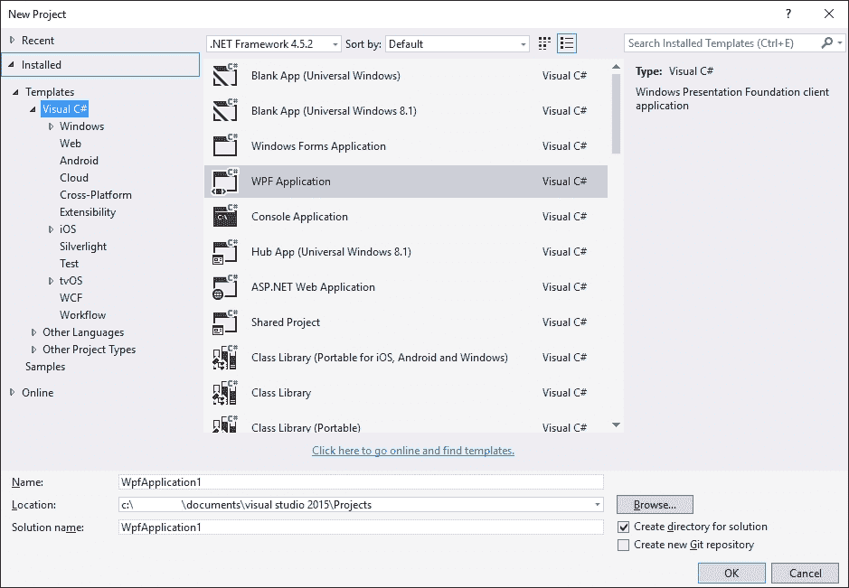

1.  删除`MainWindow.xaml`文件，并创建以下截图所示的文件和文件夹：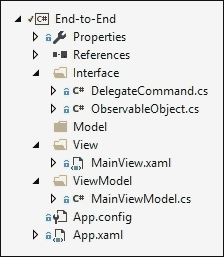

我们不会详细讲解 MVVM 模式，因为这超出了本书的范围。从截图中的关键点来看，我们已经将`View`与逻辑部分分离。然后我们依赖`ViewModel`来连接这些部分。

### 注意

如果你想了解更多关于 MVVM 的信息，我建议阅读[`www.codeproject.com/Articles/100175/Model-View-ViewModel-MVVM-Explained`](http://www.codeproject.com/Articles/100175/Model-View-ViewModel-MVVM-Explained)。

然而，为了能够运行这个程序，我们确实需要设置我们的项目。按照以下步骤进行：

1.  打开`App.xaml`文件，确保`StartupUri`设置为正确的`View`，如下所示（类名和命名空间可能根据应用程序的名称而变化）：

    ```py
        <Application x:Class="Chapter1.App"

        xmlns:x = "http://schemas.microsoft.com/winfx/2006/xaml"

        StartupUri="View/MainView.xaml">
    ```

1.  打开`MainViewModel.cs`文件，并让它继承自`ObservableObject`类。

1.  打开`MainView.xaml`文件，并将`MainViewModel`文件作为`DataContext`添加到其中，如下所示（命名空间和类名可能根据应用程序的名称而变化）：

    ```py
            <Window x:Class="Chapter1.View.MainView"

                xmlns="http://schemas.microsoft.com/
    winfx/2006/xaml/presentation"

                xmlns:d="http://schemas.microsoft.com/
    expression/blend/2008"

                 mc:Ignorable="d"
                Title="Chapter 1" Height="300" Width="300">
                <Window.DataContext>
                    <viewmodel:MainViewModel />
                </Window.DataContext>
    ```

接下来，我们需要填写`ObservableObject.cs`文件的内容。我们首先让它继承自`INotifyPropertyChanged`类，如下所示：

```py
        public class ObservableObject : INotifyPropertyChanged
```

这是一个相当小的类，应该包含以下内容：

```py
        public event PropertyChangedEventHandlerPropertyChanged;
        protected void RaisePropertyChangedEvent(string propertyName)
        {
            PropertyChanged?.Invoke(this, new PropertyChangedEventArgs(propertyName));
        }
```

我们声明一个属性更改事件并创建一个函数来触发事件。这将允许**用户界面**（**UI**）在给定属性更改时更新其值。

我们还需要能够在按钮点击时执行操作。这可以通过在`DelegateCommand.cs`文件中放入一些内容来实现。首先让这个类继承自`ICommand`类，并声明以下两个变量：

```py
        public class DelegateCommand : ICommand
        {
            private readonly Predicate<object> _canExecute;
            private readonly Action<object> _execute;
```

我们创建的两个变量将在构造函数中设置。正如你将注意到的，你不需要添加`_canExecute`参数，你很快就会明白原因：

```py
            public DelegateCommand(Action<object> execute, Predicate<object> canExecute = null)
            {
                _execute = execute;
                _canExecute = canExecute;
            }
```

要完成类，我们添加两个`public`函数和一个`public`事件，如下所示：

```py
        public bool CanExecute(object parameter)
        {
            if (_canExecute == null) return true;
            return _canExecute(parameter);
        }

        public void Execute(object parameter)
        {
            _execute(parameter);
        }

        public event EventHandlerCanExecuteChanged
        {
            add
            {
                CommandManager.RequerySuggested += value;
            }
            remove
            {
                CommandManager.RequerySuggested -= value;
            }
        }
    }
```

声明的函数将返回构造函数中声明的相应谓词或动作。这将是我们在`ViewModel`实例中声明的，反过来，这将执行动作或告诉应用程序它是否可以执行动作。如果一个按钮处于禁用状态（即当`CanExecute`函数返回`false`时），并且`CanExecute`函数的状态发生变化，声明的该事件将让按钮知道。

在设置好之后，你应该能够编译并运行应用程序，所以继续尝试吧。你会注意到应用程序实际上并没有做任何事情或展示任何数据，但我们有一个非常好的起点。

在我们对代码进行任何其他操作之前，我们将按照以下步骤将项目导出为模板。这样做是为了我们不必为每个创建的小型样本项目重复所有这些步骤：

1.  将命名空间名称替换为替代参数：

1.  在所有`.cs`文件中，将命名空间名称替换为`$safeprojectname$`

1.  在所有`.xaml`文件中，将项目名称替换为`$safeprojectname$`（通常为类名和命名空间声明）

1.  导航到**文件** | **导出模板**。这将打开**导出模板**向导，如下截图所示：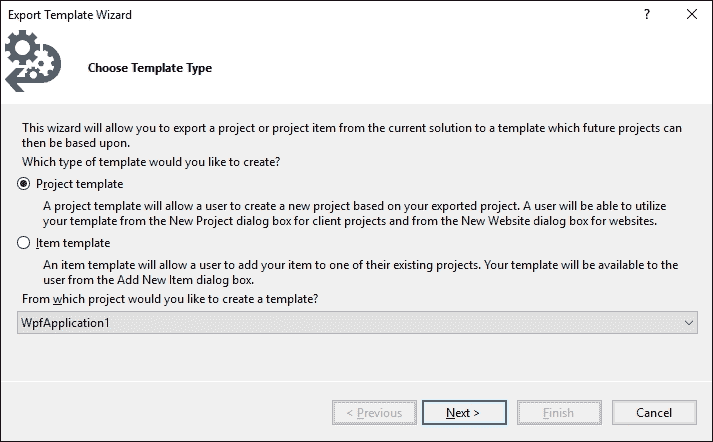

1.  点击**项目模板**按钮。选择我们刚刚创建的项目，然后点击**下一步**按钮。

1.  只需将图标和预览图像留空。输入一个可识别的名称和描述。点击**完成**按钮：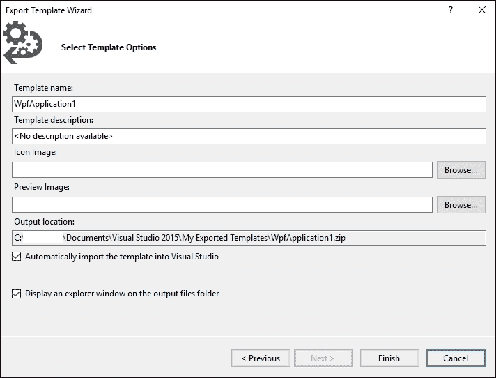

1.  模板现在已导出为`.zip`文件并存储在指定的位置。

默认情况下，模板将再次导入到 Visual Studio 中。我们将通过创建本章的项目来测试它是否立即工作。所以请继续创建一个新的项目，选择我们刚刚创建的模板。该模板应列在已安装模板列表的**Visual C#**部分中。将项目命名为`Chapter1`或你喜欢的其他名称。确保在进入下一步之前编译并能够运行它。

# 使用面部 API 检测面部

使用新创建的项目，我们现在将尝试我们的第一个 API，即面部 API。我们不会做很多，但我们仍然会看到检测图像中的面部是多么简单。

为了做到这一点，我们需要遵循以下步骤：

1.  在 Microsoft Azure 注册面部 API 预览订阅

1.  将必要的**NuGet**包添加到我们的项目中

1.  向应用程序添加 UI

1.  按命令检测面部

转到[`portal.azure.com`](https://portal.azure.com)开始注册 Face API 免费订阅的过程。您将被带到登录页面。使用您的 Microsoft 账户登录；如果您没有，则需要注册一个。

登录后，您需要通过点击右侧菜单中的**+ 新建**来添加一个新的资源。搜索**Face API**并选择第一个条目，如下截图所示：

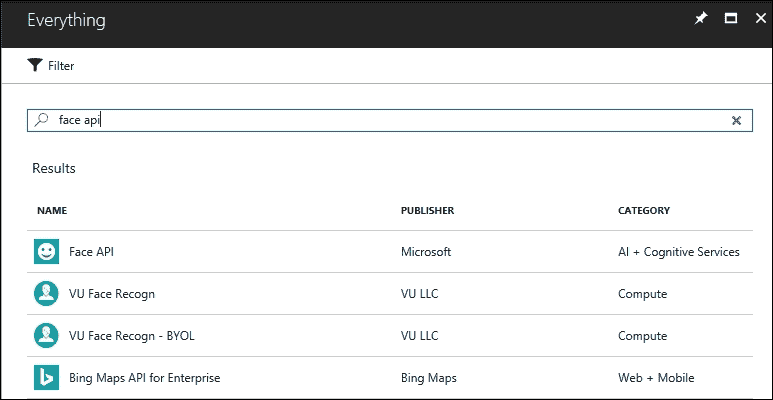

输入一个名称并选择订阅、位置和定价层。在撰写本文时，有两种定价选项，一个是免费的，一个是付费的，如下截图所示：

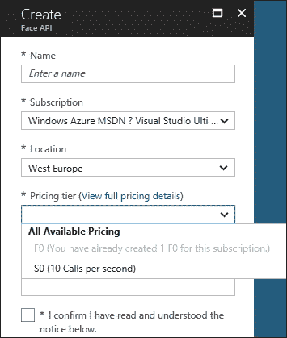

一旦创建，您就可以进入新创建的资源。您需要两个可用的 API 密钥之一。这些可以在**资源管理**菜单的**密钥**选项中找到，如下截图所示：

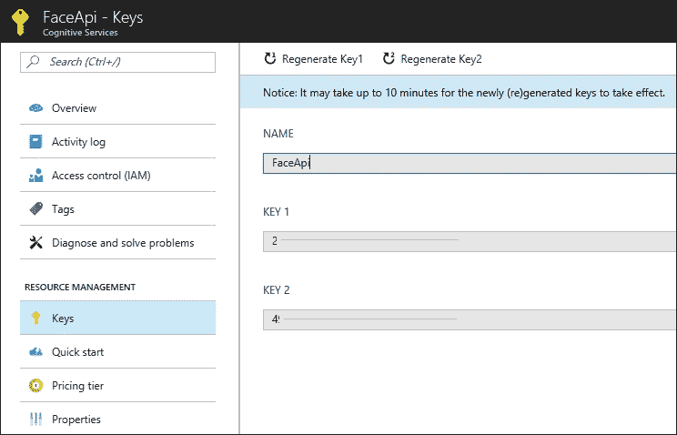

我们将要介绍的一些 API 有自己的 NuGet 包。每当这种情况发生时，我们将利用这些包来执行我们想要执行的操作。所有 API 的共同特点是它们都是 REST API，这意味着在实践中，您可以使用任何语言来使用它们。对于没有自己的 NuGet 包的 API，我们直接通过 HTTP 调用 API。

对于我们现在使用的 Face API，确实存在一个 NuGet 包，因此我们需要将其添加到我们的项目中。转到我们之前创建的项目中的**NuGet 包管理器**选项。在**浏览**选项卡中，搜索`Microsoft.ProjectOxford.Face`包，并从 Microsoft 安装该包，如下截图所示：

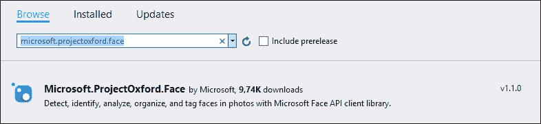

如您所注意到的，另一个包也将被安装。这是 Face API 所需的`Newtonsoft.Json`包。

下一步是向我们的应用程序添加 UI。我们将在`MainView.xaml`文件中添加这个。这意味着我们有`DataContext`，可以为我们的元素创建绑定，我们现在将定义这些元素。

首先，我们添加一个网格并定义一些网格行，如下所示：

```py
    <Grid>
        <Grid.RowDefinitions>
            <RowDefinition Height="*" />
            <RowDefinition Height="20" />
            <RowDefinition Height="30" />
        </Grid.RowDefinitions>
```

定义了三行。第一行是我们将放置图片的行，第二行是状态消息的行，最后一行我们将放置一些按钮。

接下来，我们添加我们的`image`元素，如下所示：

```py
        <Image x:Name="FaceImage" Stretch="Uniform" Source=
            "{Binding ImageSource}" Grid.Row="0" />
```

我们给它起了一个独特的名字。通过将`Stretch`参数设置为`Uniform`，我们确保图片保持其宽高比。进一步地，我们将此元素放置在第一行。最后，我们将图片源绑定到`ViewModel`中的`BitmapImage`，我们稍后会看到。

下一行将包含一个带有一些状态文本的文本块。`Text`属性将绑定到`ViewModel`中的字符串属性，如下所示：

```py
        <TextBlockx:Name="StatusTextBlock" Text=
            "{Binding StatusText}" Grid.Row="1" />
```

最后一行将包含一个用于浏览图像的按钮和一个用于检测面部的按钮。两个按钮的`command`属性将绑定到`ViewModel`中的`DelegateCommand`属性，如下所示：

```py
        <Button x:Name = "BrowseButton"
                  Content = "Browse" Height="20" Width="140" 
                  HorizontalAlignment = "Left"
                  Command="{Binding BrowseButtonCommand}"
                  Margin="5, 0, 0, 5"Grid.Row="2" />

        <Button x:Name="DetectFaceButton"
                  Content="Detect face" Height="20" Width="140"
                  HorizontalAlignment="Right"
                  Command="{Binding DetectFaceCommand}"
                  Margin="0, 0, 5, 5"Grid.Row="2"/>
```

在`View`就绪后，确保代码编译并运行它。这应该向您展示以下 UI：

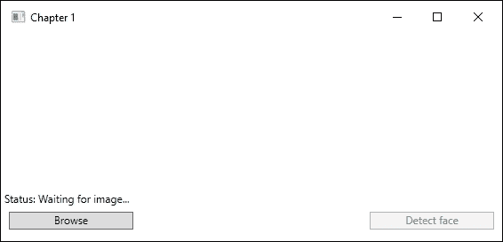

流程的最后部分是在我们的`ViewModel`中创建绑定属性，并使按钮执行某些操作。打开`MainViewModel.cs`文件。该类应该已经继承自`ObservableObject`类。首先，我们定义以下两个变量：

```py
    private string _filePath;
    private IFaceServiceClient _faceServiceClient;
```

`string`变量将保存我们图像的路径，而`IFaceServiceClient`变量用于与面部 API 接口。接下来，我们定义两个属性，如下所示：

```py
    private BitmapImage _imageSource;
    public BitmapImageImageSource
    {
        get { return _imageSource; }
        set
        {
            _imageSource = value;
            RaisePropertyChangedEvent("ImageSource");
        }
    }

    private string _statusText;
    public string StatusText
    {
        get { return _statusText; }
        set
        {
           _statusText = value;
           RaisePropertyChangedEvent("StatusText");
        }
    }
```

我们这里有一个`BitmapImage`属性，映射到`View`中的`Image`元素。我们还有一个`string`属性用于状态文本，映射到`View`中的文本块元素。您可能也注意到，当设置任一属性时，我们调用`RaisePropertyChangedEvent`事件。这将确保当任一属性有新值时，UI 会更新。

接下来，我们定义我们的两个`DelegateCommand`对象，并在构造函数中执行一些初始化，如下所示：

```py
    public ICommandBrowseButtonCommand { get; private set; }
    public ICommandDetectFaceCommand { get; private set; }

    public MainViewModel()
    {
        StatusText = "Status: Waiting for image...";

        _faceServiceClient = new FaceServiceClient("YOUR_API_KEY_HERE", "ROOT_URI);

        BrowseButtonCommand = new DelegateCommand(Browse);
        DetectFaceCommand = new DelegateCommand(DetectFace, CanDetectFace);
    }
```

命令的属性是`public`以获取，但`private`以设置。这意味着我们只能从`ViewModel`内部设置它们。在我们的构造函数中，我们首先设置状态文本。接下来，我们创建一个面部 API 的对象，该对象需要使用我们之前获得的 API 密钥创建。此外，它需要指定根 URI，指向服务位置。例如，如果服务位于西欧，可以是[`westeurope.api.cognitive.microsoft.com/face/v1.0`](https://westeurope.api.cognitive.microsoft.com/face/v1.0)。

如果服务位于西美国，您将用`westus`替换`westeurope`。根 URI 可以在 Azure 门户的以下位置找到：

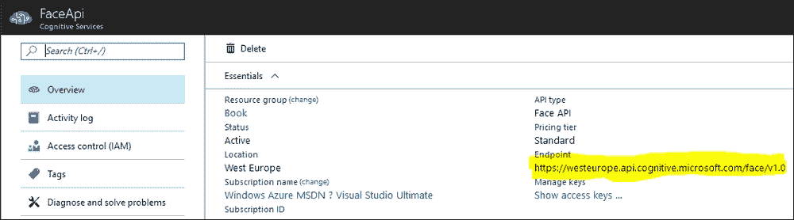

最后，我们为我们的命令属性创建`DelegateCommand`构造函数。注意`browse`命令没有指定谓词。这意味着始终可以点击相应的按钮。为了使代码编译，我们需要创建`DelegateCommand`构造函数中指定的函数：`Browse`、`DetectFace`和`CanDetectFace`函数。

我们通过创建一个`OpenFileDialog`对象来开始`Browse`函数。此对话框分配了一个 JPEG 图像过滤器，然后打开，如下面的代码所示。当对话框关闭时，我们检查结果。如果对话框被取消，我们简单地停止进一步执行：

```py
    private void Browse(object obj)
    {
        var openDialog = new Microsoft.Win32.OpenFileDialog();
        openDialog.Filter = "JPEG Image(*.jpg)|*.jpg";
        bool? result = openDialog.ShowDialog();

        if (!(bool)result) return;
```

对话框关闭后，我们获取所选文件的文件名，并从它创建一个新的 URI，如下面的代码所示：

```py
        _filePath = openDialog.FileName;
        Uri fileUri = new Uri(_filePath);
```

使用新创建的 URI，我们想要创建一个新的 `BitmapImage`。我们指定它不使用缓存，并设置我们创建的 URI 的 URI 源，如下面的代码所示：

```py
        BitmapImage image = new BitmapImage(fileUri);

        image.CacheOption = BitmapCacheOption.None;
        image.UriSource = fileUri;
```

最后一步是将位图图像分配给我们的 `BitmapImage` 属性，以便在 UI 中显示图像。我们还更新状态文本，让用户知道图像已被加载，如下面的代码所示：

```py
        ImageSource = image;
        StatusText = "Status: Image loaded...";
    }
```

`CanDetectFace` 函数检查是否应该启用 `DetectFacesButton` 按钮。在这种情况下，它检查我们的图像属性是否实际上有一个 URI。如果有，那么这意味着我们有一个图像，我们应该能够检测到人脸，如下面的代码所示：

```py
    private boolCanDetectFace(object obj)
    {
        return !string.IsNullOrEmpty(ImageSource?.UriSource.ToString());
    }
```

我们的 `DetectFace` 方法调用一个 `async` 方法来上传和检测人脸。返回值包含 `FaceRectangles` 变量的数组。这个数组包含给定图像中所有人脸位置的矩形区域。我们稍后会查看将要调用的函数。

调用完成后，我们将打印包含人脸数量的行到调试控制台窗口，如下所示：

```py
    private async void DetectFace(object obj)
    {
        FaceRectangle[] faceRects = await UploadAndDetectFacesAsync();

        string textToSpeak = "No faces detected";

        if (faceRects.Length == 1)
            textToSpeak = "1 face detected";
        else if (faceRects.Length> 1)
            textToSpeak = $"{faceRects.Length} faces detected";

        Debug.WriteLine(textToSpeak);
    }
```

在 `UploadAndDetectFacesAsync` 函数中，我们根据以下代码从图像创建一个 `Stream`。这个流将被用作调用 Face API 服务的实际输入：

```py
    private async Task<FaceRectangle[]>UploadAndDetectFacesAsync()
    {
        StatusText = "Status: Detecting faces...";

        try
        {
            using (Stream imageFileStream = File.OpenRead(_filePath))
```

以下行是调用 Face API 检测端点的实际调用：

```py
            Face[] faces = await _faceServiceClient.DetectAsync(imageFileStream, true, true, new List<FaceAttributeType>() { FaceAttributeType.Age });
```

第一个参数是我们之前创建的文件流。其余参数都是可选的。第二个参数应该为 `true`，如果您想获取人脸 ID。下一个参数指定您是否想接收人脸特征点。最后一个参数接受您可能想要接收的面部属性列表。在我们的例子中，我们希望返回 `age` 参数，因此我们需要指定它。

此函数调用的返回类型是一个包含所有您指定参数的人脸数组，如下面的代码所示：

```py
            List<double> ages = faces.Select(face =>face.FaceAttributes.Age).ToList();
            FaceRectangle[] faceRects = faces.Select(face =>face.FaceRectangle).ToArray();

            StatusText = "Status: Finished detecting faces...";

            foreach(var age in ages) {
                Console.WriteLine(age);
            }
            return faceRects;
        }
    }
```

第一行遍历所有人脸并检索所有人脸的大致年龄。这稍后将在 `foreach` 循环中打印到调试控制台窗口。

第二行遍历所有人脸并检索人脸矩形，包括所有人脸的矩形位置。这是我们返回给调用函数的数据。

添加一个 `catch` 子句来完成方法。在我们的 API 调用中抛出异常时，我们捕获它。我们想显示错误消息并返回一个空的 `FaceRectangle` 数组。

在放置了上述代码后，您现在应该能够运行完整的示例。最终结果将类似于以下截图：

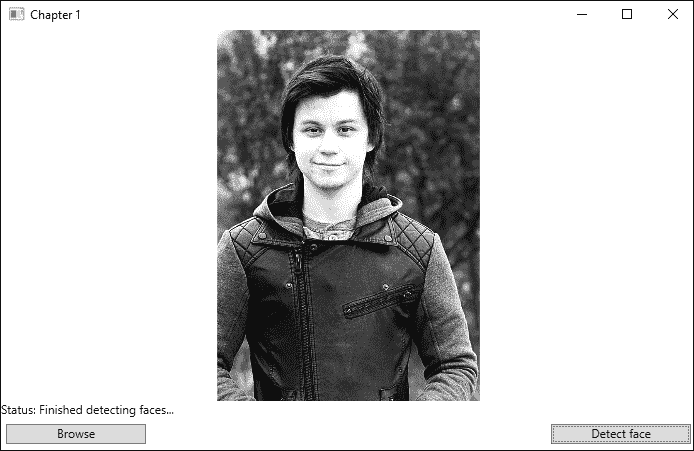

调试控制台窗口将打印以下文本：

```py
    1 face detected
    23,7
```

# 不同 API 的概述

现在您已经看到了如何检测面部的基本示例，是时候学习一下认知服务还能为您做什么了。当使用认知服务时，您有 21 个不同的 API 可供选择。这些 API 根据它们的功能被分为五个顶级领域。这些领域是视觉、语音、语言、知识和搜索。我们将在接下来的章节中了解更多关于它们的信息。

## 视觉

带有**视觉**标志的 API 允许您的应用程序理解图像和视频内容。它们允许您检索有关面部、情感和其他视觉内容的信息。您可以稳定视频并识别名人。您可以在图像中读取文本并从视频和图像中生成缩略图。

视觉领域包含四个 API，我们现在将探讨它们。

### 计算机视觉

使用**计算机视觉**API，您可以从图像中检索可操作信息。这意味着您可以识别内容（例如图像格式、图像大小、颜色、面部等）。您可以检测图像是否为成人/色情。此 API 可以识别图像中的文本并将其提取为机器可读的单词。它可以识别来自各个领域的名人。最后，它还可以生成具有智能裁剪功能的存储高效的缩略图。

我们将在第二章*分析图像以识别面部*中探讨计算机视觉。

### 面部

我们已经看到了 Face API 的一个非常基本的示例。其余的 API 主要围绕照片中面部检测、识别、组织和标记进行。除了面部检测，您还可以看到两个面部属于同一个人的可能性有多大。您可以识别面部并找到相似外观的面部。我们还可以使用 API 来识别图像中的情感。

我们将在第二章*分析图像以识别面部*中进一步探讨 Face API。

### 视频索引器

使用**视频索引器**API，您可以在上传后立即开始索引视频。这意味着您可以在不使用专家或自定义代码的情况下获取视频洞察力。利用此 API 强大的人工智能，可以提高内容发现能力。这使得您的内容更容易被发现。

视频索引器 API 将在第三章*分析视频*中进行更详细的介绍。

### 内容审核员

**内容审核员**API 利用机器学习自动审核内容。它可以检测超过 100 种语言的潜在冒犯性和不受欢迎的图像、视频和文本。此外，它还允许您审查检测到的材料以改进服务。

内容审核员将在第二章*分析图像以识别面部*中进行介绍。

### 定制视觉服务

**定制视觉服务** 允许您将您自己的标记图像上传到视觉服务。这意味着您可以将特定于您领域的图像添加到视觉服务中，以便使用计算机视觉 API 进行识别。

定制视觉服务将在 第二章 *分析图像以识别面部* 中更详细地介绍。

## 语音

添加其中一个语音 API 允许您的应用程序听到并与其用户对话。这些 API 可以过滤噪音并识别说话人。基于识别的意图，它们可以在您的应用程序中驱动进一步的行动。

语音领域包含三个 API，将在以下部分中概述。

### Bing Speech

将 **Bing Speech** API 添加到您的应用程序中，允许您将语音转换为文本，反之亦然。您可以通过利用麦克风或其他实时源或将音频文件转换为文本来实现将语音音频转换为文本。该 API 还提供语音意图识别，这是由 **语言理解智能服务**（**LUIS**）训练的，以理解意图。

### 说话人识别

**说话人** **识别** API 使您的应用程序能够知道谁在说话。通过使用此 API，您可以验证说话的人就是他们所声称的人。您还可以根据所选的说话人群体确定未知说话人。

### 翻译语音 API

**翻译语音** API 是一个基于云的自动语音翻译服务。使用此 API，您可以在 Web 应用程序、移动应用程序和桌面应用程序中添加端到端翻译。根据您的用例，它可以为您提供部分翻译、完整翻译和翻译的转录本，涵盖所有与语音相关的 API，在 第五章 *与应用程序对话* 中。

## 语言

与语言领域相关的 API 允许您的应用程序处理自然语言并学习如何识别用户的需求。您可以为您的应用程序添加文本和语言分析，以及自然语言理解。

以下五个 API 可在语言领域找到。

### Bing 拼写检查

**Bing 拼写检查** API 允许您为您的应用程序添加高级拼写检查。

此 API 将在 第六章 *理解文本* 中进行介绍。

### 语言理解智能服务 (LUIS)

LUIS 是一个可以帮助您的应用程序理解用户命令的 API。使用此 API，您可以创建理解意图的语言模型。通过使用 Bing 和 Cortana 的模型，您可以使得这些模型能够识别常见的请求和实体（如地点、时间和数字）。您可以为您的应用程序添加对话智能。

LUIS 将在 第四章 *让应用程序理解命令* 中进行介绍。

### 文本分析

**文本分析**API 将帮助您从文本中提取信息。您可以使用它来查找文本的情感（文本是正面还是负面），并且还将能够检测语言、主题、关键词和实体，这些内容将在第六章*理解文本*中涵盖文本分析 API。

### 翻译文本 API

通过添加**翻译文本**API，您可以为超过 60 种语言获得文本翻译。它可以自动检测语言，并且您可以根据需要自定义 API。此外，您可以通过创建用户组，利用众包的力量来提高翻译质量。

**翻译文本 API**在本书中不会介绍。

## 知识

当我们谈论**知识**API 时，我们指的是允许您利用丰富知识的 API。这可能来自网络或学术界，或者可能是您自己的数据。使用这些 API，您将能够探索知识的不同细微差别。

以下四个 API 包含在知识 API 领域。

### 项目学术知识

使用**项目学术知识**API，您可以探索学术论文、期刊和作者之间的关系。此 API 允许您解释自然语言用户查询字符串，这使得您的应用程序能够预测用户正在输入的内容。它将评估正在输入的内容并返回学术知识实体。

本 API 将在第八章*以自然方式查询结构化数据*中详细介绍。

### 知识探索

**知识探索**API 将允许您在项目中添加使用交互式搜索结构化数据的功能。它解释自然语言查询并提供自动完成以减少用户工作量。根据接收到的查询表达式，它将检索有关匹配对象的详细信息。

关于此 API 的详细信息将在第八章*以自然方式查询结构化数据*中介绍。

### 推荐解决方案

**推荐解决方案**API 允许您为您的客户提供个性化的产品推荐。您可以使用此 API 向您的应用程序添加经常一起购买的功能。您还可以添加另一个功能，即项目到项目的推荐，这允许客户看到其他客户喜欢的内容。此 API 还将允许您根据客户的先前活动添加推荐。

我们将在第七章*为企业构建推荐系统*中介绍此 API。

### QnA Maker

**QnA Maker** 是一个用于提炼常见问题（FAQ）信息的服务。使用现有的 FAQ，无论是在线的还是文档中的，您都可以创建问题和答案对。可以对这些对进行编辑、删除和修改，并且您可以添加几个类似的问题以匹配给定的对。

我们将在 第八章 *以自然方式查询结构化数据* 中介绍 QnA Maker。

### 项目自定义决策服务

**项目自定义决策服务** 是一个旨在使用强化学习来个性化内容的服务。该服务理解任何上下文，并能提供基于上下文的内容。

本书不涉及项目自定义决策服务。

## 搜索

**搜索** API 使您能够利用 Bing 的力量使您的应用程序更加智能。使用这些 API，您可以通过单次调用访问来自数十亿网页、图片、视频和新闻文章的数据。

搜索域包含以下 API。

### Bing 网络搜索

使用 **Bing 网络搜索**，您可以在 Bing 索引的数十亿网络文档中搜索详细信息。所有结果都可以根据您指定的布局进行排列和排序，并且结果会根据最终用户的地理位置进行定制。

Bing 网络搜索将在 第九章 *添加专业搜索* 中介绍。

### Bing 图片搜索

使用 **Bing 图片搜索** API，您可以将高级图片和元数据搜索添加到您的应用程序中。结果包括图片的 URL、缩略图和元数据。您还将能够获取机器生成的标题、相似图片等。此 API 允许您根据图片类型、布局、新鲜度（图片的新旧程度）和许可证筛选结果。Bing 图片搜索将在 第九章 *添加专业搜索* 中介绍。

### Bing 视频搜索

**Bing 视频搜索** 将允许您搜索视频并返回丰富结果。结果可能包含视频的元数据、静态或基于运动的缩略图以及视频本身。您可以根据新鲜度、视频长度、分辨率和价格对结果添加过滤器。

Bing 视频搜索将在 第九章 *添加专业搜索* 中介绍。

### Bing 新闻搜索

如果您将 **Bing 新闻搜索** 添加到您的应用程序中，您可以搜索新闻文章。结果可以包括权威图片、相关新闻和类别、提供者信息、URL 等更多信息。具体来说，您可以根据主题对新闻进行筛选。

Bing 新闻搜索将在 第九章 *添加专业搜索* 中介绍。

### Bing 自动完成

**Bing 自动完成** API 是一个小巧但功能强大的 API。它将允许您的用户通过搜索建议更快地搜索，使您能够将强大的搜索功能连接到您的应用程序中。

必应自动完成将在第九章*添加专业搜索*中介绍。

### 必应视觉搜索

使用**必应视觉搜索**API，您可以识别和分类图像。您还可以获取有关图像的知识。

必应视觉搜索将在第九章*添加专业搜索*中介绍。

### 必应自定义搜索

通过使用**必应自定义搜索**API，您可以创建一个强大、定制的搜索，满足您的需求。这个工具是一个无广告的商业工具，允许您提供您想要的搜索结果。

必应自定义搜索将在第九章*添加专业搜索*中介绍。

### 必应实体搜索

使用**必应实体搜索**API，您可以增强您的搜索。该 API 将根据您的搜索词找到最相关的实体。它将找到诸如名人、地点、电影等实体。

我们将不会在本书中介绍必应实体搜索。

# 获取检测到的面部反馈

现在我们已经看到了微软认知服务还能提供什么，我们将向我们的面部检测应用程序添加一个 API。在本节中，我们将添加必应语音 API，使应用程序能够大声说出面部数量。

此 API 功能在 NuGet 包中未提供，因此我们将使用 REST API。

为了达到我们的最终目标，我们将添加两个新的类，`TextToSpeak`和`Authentication`。第一个类将负责生成正确的头信息并调用我们的服务端点。后者类将负责生成认证令牌。这些将在我们的`ViewModel`中结合在一起，我们将使应用程序能够对我们说话。

我们首先需要获取一个 API 密钥。前往微软 Azure 门户。为必应语音创建一个新的服务。

为了能够调用必应语音 API，我们需要一个授权令牌。回到 Visual Studio，创建一个名为`Authentication.cs`的新文件。将其放在`Model`文件夹中。

我们需要向项目添加两个新的引用。在**添加引用**窗口的**组件**选项卡中找到`System.Runtime.Serialization`和`System.Web`包，并将它们添加。

在我们的`Authentication`类中，定义四个`private`变量和一个`public`属性，如下所示：

```py
    private string _requestDetails;
    private string _token;
    private Timer _tokenRenewer;

    private const int TokenRefreshInterval = 9;

    public string Token { get { return _token; } }
```

构造函数应接受一个字符串参数，`clientSecret`。`clientSecret`参数是您注册的 API 密钥。

在构造函数中，按照以下方式分配`_clientSecret`变量：

```py
    _clientSecret = clientSecret;
```

创建一个名为`Initialize`的新函数，如下所示：

```py
    public async Task Initialize()
    {
        _token = GetToken();

        _tokenRenewer = new Timer(new TimerCallback(OnTokenExpiredCallback), this,
        TimeSpan.FromMinutes(TokenRefreshInterval),
        TimeSpan.FromMilliseconds(-1));
    }
```

然后，我们在稍后创建的方法中获取访问令牌。

最后，我们创建我们的`timer`类，它将在九分钟后调用`callback`函数。`callback`函数需要再次获取访问令牌并将其分配给`_token`变量。它还需要确保我们在九分钟后再次运行计时器。

接下来，我们需要创建`GetToken`方法。此方法应返回一个`Task<string>`对象，并且应声明为`private`并标记为`async`。

在方法中，我们首先创建一个`HttpClient`对象，指向将生成令牌的端点。我们指定根端点并添加令牌发行路径，如下所示：

```py
    using(var client = new HttpClient())
    {
        client.DefaultRequestHeaders.Add ("Opc-Apim-Subscription-Key", _clientSecret);
        UriBuilder uriBuilder = new UriBuilder (https://api.cognitive.microsoft.com/sts/v1.0");
        uriBuilder.Path = "/issueToken";
```

然后，我们继续进行 POST 调用以生成令牌，如下所示：

```py
var result = await client.PostAsync(uriBuilder.Uri.AbsoluteUri, null);
```

当请求发送后，我们期望有一个响应。我们想要读取这个响应并返回响应字符串：

```py
return await result.Content.ReadAsStringAsync();
```

如果您还没有这样做，请添加一个名为`TextToSpeak.cs`的新文件。将此文件放在`Model`文件夹中。

在新创建的类（但位于命名空间内部）下方，我们想要添加两个事件参数类。这些将被用来处理音频事件，我们将在后面看到。

`AudioEventArgs`类简单地接受一个泛型`stream`，如下面的代码所示。你可以想象它被用来将音频流发送到我们的应用程序：

```py
    public class AudioEventArgs : EventArgs
    {
        public AudioEventArgs(Stream eventData)
        {
            EventData = eventData;
        }

        public StreamEventData { get; private set; }
    }
```

下一个类允许我们发送带有特定错误消息的事件：

```py
    public class AudioErrorEventArgs : EventArgs
    {
        public AudioErrorEventArgs(string message)
        {
            ErrorMessage = message;
        }

        public string ErrorMessage { get; private set; }
    }
```

我们继续开始`TextToSpeak`类的编写，首先声明一些事件和类成员，如下所示：

```py
    public class TextToSpeak
    {
        public event EventHandler<AudioEventArgs>OnAudioAvailable;
        public event EventHandler<AudioErrorEventArgs>OnError;

        private string _gender;
        private string _voiceName;
        private string _outputFormat;
        private string _authorizationToken;
        private AccessTokenInfo _token;

        private List<KeyValuePair<string, string>> _headers = new  List<KeyValuePair<string, string>>();
```

类中的前两行是使用我们之前创建的事件参数类的事件。如果 API 调用完成（返回一些音频）或发生任何错误时，这些事件将被触发。接下来的几行是字符串变量，我们将用作输入参数。我们有一行用于包含我们的访问令牌信息。最后一行创建了一个新列表，我们将用它来存储我们的请求头。

我们向我们的类中添加了两个常量字符串，如下所示：

```py
private const string RequestUri =  "https://speech.platform.bing.com/synthesize";

private const string SsmlTemplate =
    "<speak version='1.0'xml:lang='en-US'>
        <voice xml:lang='en-US'xml:gender='{0}'
        name='{1}'>{2}
        </voice>
    </speak>";
```

第一个字符串包含请求 URI。这是我们执行请求需要调用的 REST API 端点。接下来，我们有一个定义我们的**语音合成标记语言**（**SSML**）模板的字符串。这是我们指定语音服务应该说什么，以及如何说的地方。

接下来，我们创建我们的构造函数，如下所示：

```py
        public TextToSpeak()
        {
            _gender = "Female";
            _outputFormat = "riff-16khz-16bit-mono-pcm";
            _voiceName = "Microsoft Server Speech Text to Speech Voice (en-US, ZiraRUS)";
        }
```

在这里，我们只是在初始化我们之前声明的某些变量。如您所见，我们正在定义声音为女性，并定义它使用特定的声音。在性别方面，可以是女性或男性。声音名称可以是长列表中的一个选项。我们将在稍后的章节中更详细地了解该列表的细节。

最后一行指定了音频的输出格式。这将定义结果音频流的格式和编解码器。同样，这可以有多种选择，我们将在后面的章节中探讨。

在构造函数之后，我们将创建三个公共方法。这些方法将生成一个认证令牌和一些 HTTP 头信息，并最终执行我们对 API 的调用。在我们创建这些方法之前，你应该添加两个辅助方法来能够引发我们的事件。将它们命名为`RaiseOnAudioAvailable`和`RaiseOnError`方法。它们应该接受`AudioEventArgs`和`AudioErrorEventArgs`作为参数。

接下来，添加一个名为`GenerateHeaders`的新方法，如下所示：

```py
        public void GenerateHeaders()
        {
            _headers.Add(new KeyValuePair<string, string>("Content-Type", "application/ssml+xml"));
            _headers.Add(new KeyValuePair<string, string>("X-Microsoft-OutputFormat", _outputFormat));
            _headers.Add(new KeyValuePair<string, string>("Authorization", _authorizationToken));
            _headers.Add(new KeyValuePair<string, string>("X-Search-AppId", Guid.NewGuid().ToString("N")));
            _headers.Add(new KeyValuePair<string, string>("X-Search-ClientID", Guid.NewGuid().ToString("N")));
            _headers.Add(new KeyValuePair<string, string>("User-Agent", "Chapter1"));
        }
```

在这里，我们将 HTTP 头信息添加到我们之前创建的列表中。这些头信息对于服务响应是必需的，如果缺少任何，它将返回`HTTP/400`响应。我们将在稍后更详细地介绍我们使用哪些头信息。现在，只需确保它们存在即可。

在此之后，我们想要添加一个名为`GenerateAuthenticationToken`的新方法，如下所示：

```py
        public bool GenerateAuthenticationToken(string clientSecret)
        {
            Authentication auth = new Authentication(clientSecret);
```

这个方法接受一个字符串参数，即客户端密钥（你的 API 密钥）。首先，我们创建一个`Authentication`类的新对象，这是我们之前看过的，如下所示：

```py
        try
        {
            _token = auth.Token;

            if (_token != null)
            {
                _authorizationToken = $"Bearer {_token}";

                return true;
            }
            else
            {
                RaiseOnError(new AudioErrorEventArgs("Failed to generate authentication token."));
                return false;
            }
        }
```

我们使用认证对象来检索访问令牌。这个令牌用于我们的授权令牌字符串，正如我们之前看到的，它被包含在我们的头信息中。如果应用程序由于某种原因无法生成访问令牌，我们将触发一个错误事件。

通过添加相关的`catch`子句来完成这个方法。如果发生任何异常，我们希望引发一个新的错误事件。

在这个类中，我们需要创建的最后一个方法将被命名为`SpeakAsync`方法，如下面的截图所示。这个方法实际上会向语音 API 发起请求：

```py
        public Task SpeakAsync(string textToSpeak, CancellationTokencancellationToken)
        {
            varcookieContainer = new CookieContainer();
            var handler = new HttpClientHandler() {
                CookieContainer = cookieContainer
            };
            var client = new HttpClient(handler);
```

这个方法接受两个参数。一个是字符串，它将是我们要被读出的文本。下一个是`cancellationToken`；这可以用来传播给定操作应该被取消的命令。

进入方法时，我们创建了三个我们将用于执行请求的对象。这些是从.NET 库中的类。我们不会对它们进行更详细的介绍。

我们之前生成了一些头信息，我们需要将这些添加到我们的 HTTP 客户端中。我们通过在先前的`foreach`循环中添加头信息来实现，基本上是遍历整个列表，如下面的代码所示：

```py
            foreach(var header in _headers)
            {
                client.DefaultRequestHeaders.TryAddWithoutValidation (header.Key, header.Value);
            }
```

接下来，我们创建一个`HTTP 请求消息`，指定请求 URI 以及我们将通过`POST`方法发送数据的事实。我们还使用我们之前创建的 SSML 模板指定内容，添加正确的参数（性别、语音名称和要被读出的文本），如下面的代码所示：

```py
            var request = new HttpRequestMessage(HttpMethod.Post, RequestUri)
            {
                Content = new StringContent(string.Format(SsmlTemplate, _gender, _voiceName, textToSpeak))
            };
```

我们使用 HTTP 客户端异步发送 HTTP 请求，如下所示：

```py
            var httpTask = client.SendAsync(request, HttpCompletionOption.ResponseHeadersRead, cancellationToken);
```

以下代码是之前我们进行的异步发送调用的延续。这将异步运行，并检查响应的状态。如果响应成功，它将作为流读取响应消息并触发音频事件。如果一切顺利，那么该流应该包含我们用语音说的文本：

```py
    var saveTask = httpTask.ContinueWith(async (responseMessage, token) =>
    {
        try
        {
            if (responseMessage.IsCompleted &&
                responseMessage.Result != null &&  
                responseMessage.Result.IsSuccessStatusCode) {
                var httpStream = await responseMessage. Result.Content.ReadAsStreamAsync().ConfigureAwait(false);
                RaiseOnAudioAvailable(new AudioEventArgs (httpStream));
            } else {
                RaiseOnError(new AudioErrorEventArgs($"Service returned {responseMessage.Result.StatusCode}"));
            }
        }
        catch(Exception e)
        {
            RaiseOnError(new AudioErrorEventArgs (e.GetBaseException().Message));
        }
    }
```

如果响应指示的不是成功，我们将引发错误事件。

我们还希望为此添加一个`catch`子句和一个`finally`子句。如果在`finally`子句中捕获到异常，则引发错误并销毁所有使用的对象。

我们需要的最终代码指定了延续任务附加到父任务上。我们还需要向此任务添加`cancellationToken`。添加以下代码来完成方法：

```py
    }, TaskContinuationOptions.AttachedToParent, cancellationToken);
    return saveTask;
}
```

在此基础上，我们现在可以在我们的应用程序中利用这个类。打开`MainViewModel.cs`文件，并声明一个新的类变量，如下所示：

```py
        private TextToSpeak _textToSpeak;
```

在构造函数中添加以下代码以初始化新添加的对象。我们还需要调用一个函数来生成认证令牌，如下所示：

```py
            _textToSpeak = new TextToSpeak();
            _textToSpeak.OnAudioAvailable +=  _textToSpeak_OnAudioAvailable;
            _textToSpeak.OnError += _textToSpeak_OnError;

            GenerateToken();
```

在我们创建了对象之后，我们将两个事件连接到事件处理器上。然后，我们通过创建一个包含以下内容的`GenerateToken`函数来生成一个认证令牌：

```py
public async void GenerateToken()
{
    if (await _textToSpeak.GenerateAuthenticationToken("BING_SPEECH_API_KEY_HERE"))
        _textToSpeak.GenerateHeaders();
}
```

然后，我们生成一个认证令牌，指定必应语音 API 的 API 密钥。如果该调用成功，我们生成所需的 HTTP 头。

我们还需要添加事件处理器，因此首先创建`_textToSpeak_OnError`方法，如下所示：

```py
            private void _textToSpeak_OnError(object sender, AudioErrorEventArgs e)
            {
                StatusText = $"Status: Audio service failed -  {e.ErrorMessage}";
            }
```

这应该是一个相当简单的方法，只需将错误消息输出到用户的状态文本字段即可。

接下来，我们需要创建一个`_textToSpeak_OnAudioAvailable`方法，如下所示：

```py
        private void _textToSpeak_OnAudioAvailable(object sender, AudioEventArgs e)
        {
            SoundPlayer player = new SoundPlayer(e.EventData);
            player.Play();
            e.EventData.Dispose();
        }
```

在这里，我们利用.NET 框架中的`SoundPlayer`类。这允许我们直接添加流数据并简单地播放消息。

为了让一切正常工作，我们需要调用`SpeakAsync`方法。我们可以在`DetectFace`方法的末尾添加以下内容来实现这一点：

```py
    await _textToSpeak.SpeakAsync(textToSpeak, CancellationToken.None);
```

在此基础上，你现在应该能够编译并运行应用程序。通过加载一张照片并点击**检测面部**，你应该能够听到图像中面部数量的语音反馈。只需记得打开你的音频即可！

# 摘要

本章简要介绍了微软认知服务。我们首先创建了一个模板项目，以便为即将到来的章节轻松创建新项目。我们通过为本章创建一个示例项目来尝试这个模板。然后，你学习了如何通过利用面部 API 在图像中检测面部。从那里，我们快速浏览了认知服务提供的内容。最后，我们通过使用必应语音 API 为我们的应用程序添加了文本到语音的功能。

下一章将详细介绍 API 的视觉部分。在那里，你将学习如何使用计算机视觉 API 分析图像。你将更深入地了解面部 API，并学习如何通过使用情感 API 来检测面部表情。我们将利用这些知识开始构建我们的智能家居应用程序。
