# 第二章。分析图像以识别面部

> *"我们可以使用计算机视觉 API 向我们的客户证明数据的可靠性，这样他们就可以基于这些信息做出重要的商业决策，并对此充满信心。"*
> 
> - Leendert de Voogd，Vigiglobe 首席执行官

在上一章中，您简要介绍了 Microsoft Cognitive Services。在本章中，我们将深入探讨视觉 API 中的基于图像的 API。我们将学习如何执行图像分析。接下来，我们将更深入地研究 Face API，这是我们上一章简要了解的 API，我们将学习如何识别人。然后，我们将学习如何使用 Face API 在面部中识别情绪。最后，我们将了解不同的内容审核方式。

在本章中，我们将涵盖以下主题：

+   分析图像以识别内容、元数据和成人评级。

+   在图像中识别名人以及在图像中读取文本。

+   深入 Face API：

    +   学习找到两个面部属于同一个人的可能性

    +   根据视觉相似性分组面部并搜索相似面部

    +   从面部识别一个人

    +   识别情绪

+   内容审核。

# 使用计算机视觉 API 分析图像

计算机视觉 API 允许我们处理图像并检索有关它的信息。它依赖于先进的算法，根据我们的需求以不同的方式分析图像内容。

在本节中，我们将学习如何利用这个 API。我们将通过独立的示例来查看分析图像的不同方法。我们将在后面的章节中将一些我们将要介绍的功能整合到我们的端到端应用中。

调用任何 API 将返回以下响应代码之一：

| 代码 | 描述 |
| --- | --- |
| `200` | 以 JSON 格式提取的特征信息。 |
| `400` | 通常这意味着请求错误。可能是一个无效的图像 URL、过小或过大的图像、无效的图像格式或与请求体相关的任何其他错误。 |
| `415` | 不支持的媒体类型。 |
| `500` | 可能的错误包括处理图像失败、图像处理超时或内部服务器错误。 |

## 设置章节示例项目

在我们进入 API 的细节之前，我们需要为本章创建一个示例项目。该项目将包含所有示例，这些示例在此阶段不会放入端到端应用中：

### 注意

如果您还没有这样做，请访问[`portal.azure.com`](https://portal.azure.com)注册计算机视觉 API 密钥。

1.  使用我们在第一章中创建的模板在 Visual Studio 中创建一个新的项目，*使用 Microsoft Cognitive Services 入门*。

1.  右键单击项目并选择**管理 NuGet 包**。搜索`Microsoft.ProjectOxford.Vision`包并将其安装到项目中，如下面的截图所示：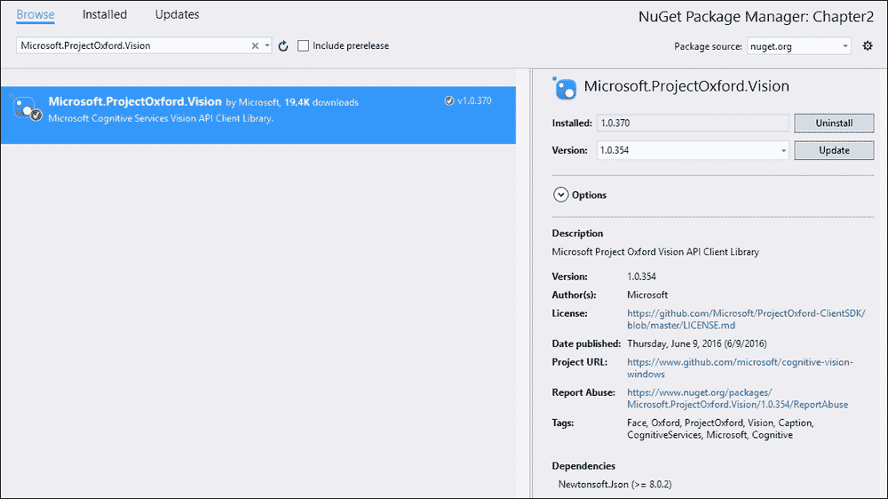

1.  创建以下`UserControls`文件，并将它们添加到`ViewModel`文件夹中：

    +   `CelebrityView.xaml`

    +   `DescriptionView.xaml`

    +   `ImageAnalysisView.xaml`

    +   `OcrView.xaml`

    +   `ThumbnailView.xaml`

1.  还要将以下列表中的相应`ViewModel`实例添加到`ViewModel`文件夹中：

    +   `CelebrityViewModel.cs`

    +   `DescriptionViewModel.cs`

    +   `ImageAnalysisViewModel.cs`

    +   `OcrViewModel.cs`

    +   `ThumbnailViewModel.cs`

检查新创建的`ViewModel`实例，确保所有类都是公开的。

我们将使用`TabControl`标签在不同的视图之间切换。打开`MainView.xaml`文件，并在预先创建的`Grid`标签中添加以下内容：

```py
    <TabControl x: Name = "tabControl"
                   HorizontalAlignment = "Left"
                   VerticalAlignment = "Top"
                   Width = "810" Height = "520">
        <TabItem Header="Analysis" Width="100">
            <controls:ImageAnalysisView />
        </TabItem>
        <TabItem Header="Description" Width="100">
            <controls:DescriptionView />
        </TabItem>
        <TabItem Header="Celebs" Width="100">
            <controls:CelebrityView />
        </TabItem>
        <TabItem Header="OCR" Width="100">
            <controls:OcrView />
        </TabItem>
        <TabItem Header="Thumbnail" Width="100">
            <controls:ThumbnailView />
        </TabItem>
    </TabControl>
```

这将在应用程序顶部添加一个标签栏，允许您在不同视图之间导航。

接下来，我们将添加`MainViewModel.cs`文件中所需的属性和成员。

以下变量用于访问计算机视觉 API：

```py
    private IVisionServiceClient _visionClient;
```

以下代码声明了一个包含`CelebrityViewModel`对象的私有变量。它还声明了`public`属性，我们使用它来在我们的`View`中访问`ViewModel`：

```py
    private CelebrityViewModel _celebrityVm;
    public CelebrityViewModel CelebrityVm
    {
        get { return _celebrityVm; }
        set
        {
            _celebrityVm = value;
            RaisePropertyChangedEvent("CelebrityVm");
        }
    }
```

按照相同的模式，为创建的其余`ViewModel`实例添加属性。

在所有属性就绪后，使用以下代码在我们的构造函数中创建`ViewModel`实例：

```py
    public MainViewModel()
    {
        _visionClient = new VisionServiceClient("VISION_API_KEY_HERE", "ROOT_URI");

        CelebrityVm = new CelebrityViewModel(_visionClient);
        DescriptionVm = new DescriptionViewModel(_visionClient);
        ImageAnalysisVm= new ImageAnalysisViewModel(_visionClient);
        OcrVm = new OcrViewModel(_visionClient);
        ThumbnailVm = new ThumbnailViewModel(_visionClient);
    }
```

注意我们首先使用之前注册的 API 密钥和根 URI 创建`VisionServiceClient`对象，如第一章中所述，*使用 Microsoft 认知服务入门*。然后将其注入到所有`ViewModel`实例中供使用。

现在应该可以编译，并显示以下截图所示的应用程序：

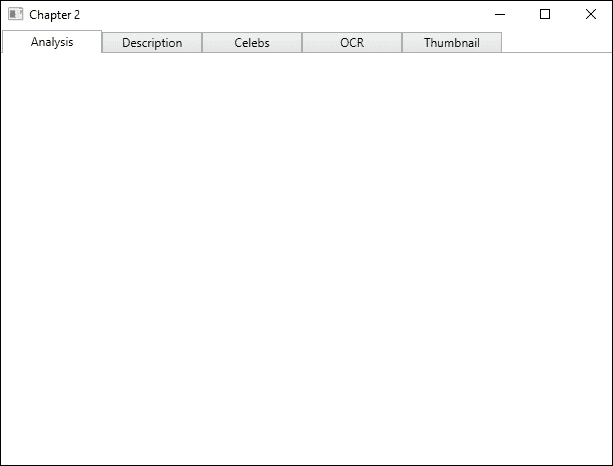

## 通用图像分析

我们通过向`ImageAnalysis.xaml`文件添加 UI 来开始启用通用图像分析。所有计算机视觉示例 UI 将以相同的方式构建。

UI 应该有两个列，如下面的代码所示：

```py
    <Grid.ColumnDefinitions>
        <ColumnDefinition Width="*" />
        <ColumnDefinition Width="*" />
    </Grid.ColumnDefinitions>
```

第一个将包含图像选择，而第二个将显示我们的结果。

在左侧列中，我们创建一个垂直方向的`StackPanel`标签。为此，我们添加一个标签和一个`ListBox`标签。列表框将显示我们可以添加到我们的分析查询中的视觉特征列表。注意以下代码中`ListBox`标签中连接的`SelectionChanged`事件。这将在代码之后添加，并将在稍后介绍：

```py
    <StackPanel Orientation="Vertical"Grid.Column="0">

    <TextBlock Text="Visual Features:"
               FontWeight="Bold"
               FontSize="15"
               Margin="5, 5" Height="20" />

    <ListBox: Name = "VisualFeatures"
          ItemsSource = "{Binding ImageAnalysisVm.Features}"
          SelectionMode = "Multiple" Height="150" Margin="5, 0, 5, 0"
          SelectionChanged = "VisualFeatures_SelectionChanged" />
```

列表框将能够选择多个项目，并将项目收集在`ViewModel`中。

在同一个堆叠面板中，我们还添加了一个按钮元素和一个图像元素。这些将允许我们浏览图像、显示它并分析它。`Button`命令和图像源都绑定到`ViewModel`中的相应属性，如下所示：

```py
    <Button Content = "Browse and analyze"
            Command = "{Binding ImageAnalysisVm.BrowseAndAnalyzeImageCommand}"
            Margin="5, 10, 5, 10" Height="20" Width="120"
            HorizontalAlignment="Right" />

    <Image Stretch = "Uniform"
           Source="{Binding ImageAnalysisVm.ImageSource}"
           Height="280" Width="395" />
    </StackPanel>
```

我们还添加了另一个垂直堆叠面板。这将放置在右侧列。它包含一个标题标签以及一个文本框，绑定到我们的`ViewModel`中的分析结果，如下所示：

```py
    <StackPanel Orientation= "Vertical"Grid.Column="1">
        <TextBlock Text="Analysis Results:"
                   FontWeight = "Bold"
                   FontSize="15" Margin="5, 5" Height="20" />
        <TextBox Text = "{Binding ImageAnalysisVm.AnalysisResult}"
                 Margin="5, 0, 5, 5" Height="485" />
    </StackPanel>
```

接下来，我们想要将我们的`SelectionChanged`事件处理程序添加到我们的代码隐藏中。打开`ImageAnalysisView.xaml.cs`文件并添加以下内容：

```py
    private void VisualFeatures_SelectionChanged(object sender, SelectionChangedEventArgs e) {
        var vm = (MainViewModel) DataContext;
        vm.ImageAnalysisVm.SelectedFeatures.Clear();
```

函数的第一行将给我们当前的`DataContext`，即`MainViewModel`类。我们访问`ImageAnalysisVm`属性，即我们的`ViewModel`，并清除选中的视觉特征列表。

从那里，我们遍历我们的列表框中的选中项。所有项都将添加到我们的`ViewModel`中的`SelectedFeatures`列表中：

```py
        foreach(VisualFeature feature in VisualFeatures.SelectedItems)
        {
            vm.ImageAnalysisVm.SelectedFeatures.Add(feature);
        }
    }
```

打开`ImageAnalysisViewModel.cs`文件。确保该类继承自`ObservableObject`类。

声明一个`private`变量，如下所示：

```py
    private IVisionServiceClient _visionClient;    
```

这将用于访问计算机视觉 API，并通过构造函数进行初始化。

接下来，我们声明一个私有变量及其对应属性，用于我们的视觉特征列表，如下所示：

```py
    private List<VisualFeature> _features=new List<VisualFeature>();
    public List<VisualFeature> Features {
        get { return _features; }
        set {
            _features = value;
            RaisePropertyChangedEvent("Features");
        }
    }
```

以类似的方式，创建一个名为`ImageSource`的`BitmapImage`变量和属性。创建一个名为`SelectedFeatures`的`VisualFeature`类型列表和一个名为`AnalysisResult`的字符串。

我们还需要声明我们的按钮属性，如下所示：

```py
    public ICommandBrowseAndAnalyzeImageCommand {get; private set;}
```

在此基础上，我们创建我们的构造函数，如下所示：

```py
    public ImageAnalysisViewModel(IVisionServiceClientvisionClient) {
        _visionClient = visionClient;
        Initialize();
    }
```

构造函数接受一个参数，即我们在`MainViewModel`文件中创建的`IVisionServiceClient`对象。它将该参数分配给之前创建的变量。然后我们调用一个`Initialize`函数，如下所示：

```py
    private void Initialize() {
        Features = Enum.GetValues(typeof(VisualFeature))
                       .Cast<VisualFeature>().ToList();

        BrowseAndAnalyzeImageCommand = new DelegateCommand(BrowseAndAnalyze);
    }
```

在`Initialize`函数中，我们从`enum`类型的`VisualFeature`变量中获取所有值。这些值被添加到特征列表中，该列表在 UI 中显示。我们还创建了我们的按钮，现在我们已经这样做，我们需要创建相应的操作，如下所示：

```py
    private async void BrowseAndAnalyze(object obj)
    {
        var openDialog = new Microsoft.Win32.OpenFileDialog();

        openDialog.Filter = "JPEG Image(*.jpg)|*.jpg";
        bool? result = openDialog.ShowDialog();

        if (!(bool)result) return;

        string filePath = openDialog.FileName;

        Uri fileUri = new Uri(filePath);
        BitmapImage image = new BitmapImage(fileUri);

        image.CacheOption = BitmapCacheOption.None;
        image.UriSource = fileUri;

        ImageSource = image;
```

上述代码的前几行与我们在第一章中做的类似，*使用 Microsoft 认知服务入门*。我们打开文件浏览器并获取选中的图像。

在选中图像后，我们按照以下方式对其进行分析：

```py
    try {
        using (StreamfileStream = File.OpenRead(filePath)) {
            AnalysisResult analysisResult = await  _visionClient.AnalyzeImageAsync(fileStream, SelectedFeatures);
```

我们调用我们的`_visionClient`的`AnalyzeImageAsync`函数。这个函数有四个重载，它们都非常相似。在我们的情况下，我们传递一个`Stream`类型的图像和包含`VisualFeatures`变量的`SelectedFeatures`列表来分析。

请求参数如下：

| 参数 | 描述 |
| --- | --- |
| **图像（必需）** |

+   可以以原始图像二进制或 URL 的形式上传。

+   可以是 JPEG、PNG、GIF 或 BMP。

+   文件大小必须小于 4 MB。

+   图像尺寸必须至少为 50 x 50 像素。

|

| **可选视觉特征** | 一个指示要返回的视觉特征类型的列表。它可以包括类别、标签、描述、面部、图像类型、颜色以及是否为成人内容。 |
| --- | --- |
| **详细信息（可选）** | 一个指示要返回的特定领域详细信息的列表。 |

对此请求的响应是`AnalysisResult`字符串。

我们随后检查结果是否为`null`。如果不是，我们调用一个函数来解析它，并将结果分配给我们的`AnalysisResult`字符串，如下所示：

```py
    if (analysisResult != null)
        AnalysisResult = PrintAnalysisResult(analysisResult);
```

记得关闭`try`子句，并用相应的`catch`子句完成方法。

`AnalysisResult`字符串包含根据 API 调用中请求的视觉特征的数据。

`AnalysisResult`变量中的数据在以下表中描述：

| 视觉特征 | 描述 |
| --- | --- |
| **类别** | 图像根据定义的分类法进行分类。这包括从动物、建筑和户外到人物的各个方面。 |
| **标签** | 图像用与内容相关的单词列表进行标记。 |
| **描述** | 这包含一个完整句子来描述图像。 |
| **面部** | 这检测图像中的面部，并包含面部坐标、性别和年龄。 |
| **图像类型** | 这检测图像是剪贴画还是线画。 |
| **颜色** | 这包含有关主导颜色、强调颜色以及图像是否为黑白的详细信息。 |
| **成人** | 这检测图像是否具有色情性质，以及是否过于露骨。 |

要检索数据，例如类别，你可以使用以下方法：

```py
    if (analysisResult.Description != null) {
        result.AppendFormat("Description: {0}\n", analysisResult.Description.Captions[0].Text);
        result.AppendFormat("Probability: {0}\n\n", analysisResult.Description.Captions[0].Confidence);
    }
```

成功的调用将显示以下结果：

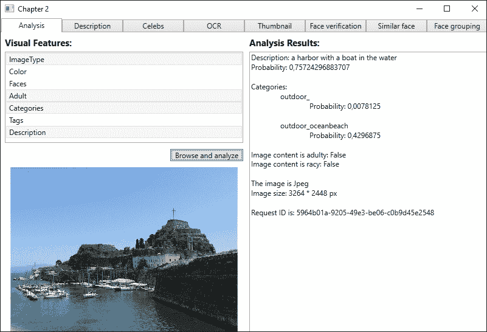

有时，你可能只对图像描述感兴趣。在这种情况下，请求我们刚刚所做的全面分析是浪费的。通过调用以下函数，你将得到一个描述数组：

```py
    AnalysisResultdescriptionResult = await _visionClient.DescribeAsync(ImageUrl, NumberOfDescriptions);
```

在这次调用中，我们指定了图像的 URL 和要返回的描述数量。第一个参数必须始终包含，但它可以是图像上传而不是 URL。第二个参数是可选的，如果没有提供，则默认为 1。

成功的查询将导致一个`AnalysisResult`对象，这与前面代码中描述的是同一个。在这种情况下，它将只包含请求 ID、图像元数据和标题数组。每个标题包含一个图像描述和该描述正确性的置信度。

我们将在后面的章节中将这种图像分析方法添加到我们的智能家居应用程序中。

## 使用领域模型识别名人

计算机视觉 API 的一个特点是能够识别特定领域的内容。在撰写本文时，该 API 仅支持名人识别，能够识别大约 20 万名名人。

对于这个示例，我们选择使用互联网上的图片。然后 UI 需要一个文本框来输入 URL。它需要一个按钮来加载图片并执行领域分析。应该有一个图片元素来查看图片，以及一个文本框来输出结果。

相应的`ViewModel`应该有两个`string`属性，用于 URL 和分析结果。它应该有一个`BitmapImage`属性用于图片，以及一个`ICommand`属性用于我们的按钮。

在`ViewModel`的开始处添加一个`private`变量用于`IVisionServiceClient`类型，如下所示：

```py
    private IVisionServiceClient _visionClient;
```

这应该在构造函数中分配，该构造函数将接受`IVisionServiceClient`类型的参数。

由于我们需要一个 URL 从互联网上获取图片，我们需要使用动作和谓词初始化`Icommand`属性。后者检查 URL 属性是否已设置，如下面的代码所示：

```py
    public CelebrityViewModel(IVisionServiceClient visionClient) {
        _visionClient = visionClient;
        LoadAndFindCelebrityCommand = new DelegateCommand(LoadAndFindCelebrity, CanFindCelebrity);
    }
```

`LoadAndFindCelebrity`加载操作使用给定的 URL 创建一个`Uri`。使用这个 URL，它创建一个`BitmapImage`并将其分配给`ImageSource`属性，如下面的代码所示。图片应该在 UI 中可见：

```py
    private async void LoadAndFindCelebrity(object obj) {
        UrifileUri = new Uri(ImageUrl);
        BitmapImage image = new BitmapImage(fileUri);

        image.CacheOption = BitmapCacheOption.None;
        image.UriSource = fileUri;

        ImageSource = image;
```

我们使用给定的 URL 调用`AnalyzeImageInDomainAsync`类型，如下面的代码所示。我们传递的第一个参数是图片 URL。或者，这也可以是一个已作为`Stream`类型打开的图片：

```py
    try {
        AnalysisInDomainResultcelebrityResult = await _visionClient.AnalyzeImageInDomainAsync(ImageUrl, "celebrities");

        if (celebrityResult != null)
            Celebrity = celebrityResult.Result.ToString();
    }
```

第二个参数是领域模型名称，它以`string`格式存在。作为替代，我们本可以使用特定的`Model`对象，这可以通过调用以下代码来检索：

```py
    VisionClient.ListModelsAsync();
```

这将返回一个`Models`数组，我们可以从中显示和选择。由于目前只有一个可用，这样做没有意义。

`AnalyzeImageInDomainAsync`的结果是`AnalysisInDomainResult`类型的对象。该对象将包含请求 ID、图片元数据以及包含名人数组的结果。在我们的例子中，我们简单地输出整个结果数组。数组中的每个项目将包含名人的名字、匹配的置信度以及图像中的脸矩形。请尝试在提供的示例代码中尝试。

## 利用光学字符识别

对于某些任务，**光学字符识别**（**OCR**）可能非常有用。比如说，你拍了一张收据的照片。使用 OCR，你可以从照片本身读取金额，并自动添加到会计中。

OCR 将检测图片中的文本并提取可读字符。它将自动检测语言。可选地，API 将检测图片方向并在读取文本之前进行校正。

要指定语言，您需要使用**BCP-47**语言代码。在撰写本文时，以下语言受到支持：简体中文、繁体中文、捷克语、丹麦语、荷兰语、英语、芬兰语、法语、德语、希腊语、匈牙利语、意大利语、日语、韩语、挪威语、波兰语、葡萄牙语、俄语、西班牙语、瑞典语、土耳其语、阿拉伯语、罗马尼亚语、西里尔塞尔维亚语、拉丁塞尔维亚语和斯洛伐克语。

在代码示例中，UI 将有一个图像元素。它还将有一个按钮来加载图像并检测文本。结果将打印到文本框元素中。

`ViewModel`需要一个用于结果的`string`属性，一个用于图像的`BitmapImage`属性，以及一个用于按钮的`ICommand`属性。

为计算机视觉 API 在`ViewModel`中添加一个`private`变量，如下所示：

```py
    private IVisionServiceClient _visionClient;
```

构造函数应有一个`IVisionServiceClient`类型的参数，该参数应分配给前面的变量。

为我们的按钮创建一个作为命令的函数。命名为`BrowseAndAnalyze`，并接受`object`作为参数。然后打开文件浏览器并找到一个要分析的图像。选择图像后，我们运行 OCR 分析，如下所示：

```py
    using (StreamfileStream = File.OpenRead(filePath)) {
        OcrResultsanalysisResult = await _visionClient.RecognizeTextAsync (fileStream);

        if(analysisResult != null)
            OcrResult = PrintOcrResult(analysisResult);
    }
```

将图像以`Stream`类型打开，我们调用`RecognizeTextAsync`方法。在这种情况下，我们传递图像作为`Stream`类型，但我们也可以简单地传递图像的 URL。

在此调用中可以指定两个更多参数。首先，您可以指定文本的语言。默认为未知，这意味着 API 将尝试自动检测语言。其次，您可以指定 API 是否应检测图像的方向。默认设置为`false`。

如果调用成功，它将以`OcrResults`对象的形式返回数据。我们将此结果发送到`PrintOcrResult`函数，我们将解析它并打印文本，如下所示：

```py
    private string PrintOcrResult(OcrResultsocrResult)
    {
        StringBuilder result = new StringBuilder();

        result.AppendFormat("Language is {0}\n", ocrResult.Language);
        result.Append("The words are:\n\n");
```

首先，我们创建一个`StringBuilder`对象，它将保存所有文本。我们首先添加到其中的内容是图像中文本的语言，如下所示：

```py
        foreach(var region in ocrResult.Regions) { 
            foreach(var line in region.Lines) { 
                foreach(var text in line.Words) { 
                    result.AppendFormat("{0} ", text.Text);
                }
                result.Append("\n");
            }
            result.Append("\n\n");
        }
```

结果包含一个数组，该数组包含`Regions`属性。每个项目代表识别出的文本，每个区域包含多行。`line`变量是数组，其中每个项目代表识别出的文本。每一行包含`Words`属性的数组。该数组中的每个项目代表一个识别出的单词。

将所有单词附加到`StringBuilder`函数后，我们将其作为字符串返回。然后，它将在 UI 中打印出来，如下面的截图所示：

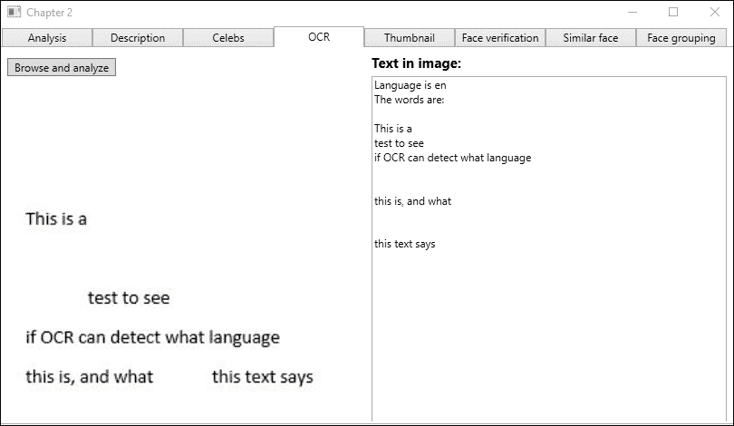

结果还包含文本的方向和角度。结合也包括的边界框，你可以在原始图像中标记每个单词。

## 生成图像缩略图

在当今世界，作为开发者，我们在显示图片时必须考虑不同的屏幕尺寸。计算机视觉 API 通过提供生成缩略图的能力来提供一些帮助。

缩略图生成本身并不是什么大事。使 API 变得聪明的是，它会分析图像并确定感兴趣的区域。

它还将生成智能裁剪坐标。这意味着如果指定的宽高比与原始图像不同，它将裁剪图像，重点在感兴趣的区域。

在示例代码中，UI 由两个图像元素和一个按钮组成。第一个图像是原始大小的图像。第二个是生成的缩略图，我们指定其大小为 250 x 250 像素。

`View`模型将需要相应的属性，两个`BitmapImages`方法作为图像源，以及一个`ICommand`属性用于我们的按钮命令。

在`ViewModel`中定义一个私有变量，如下所示：

```py
    private IVisionServiceClient _visionClient;
```

这将是我们的 API 访问点。构造函数应该接受一个`IVisionServiceClient`对象，该对象应分配给前面的变量。

对于`ICommand`属性，我们创建一个函数`BrowseAndAnalyze`，接受一个`object`参数。我们不需要检查我们是否可以执行该命令。我们将每次都浏览一个图像。

在`BrowseAndAnalyze`函数中，我们打开文件对话框并选择一个图像。当我们有了图像文件路径，我们可以生成我们的缩略图，如下所示：

```py
    using (StreamfileStream = File.OpenRead(filePath))
    {
        byte[] thumbnailResult = await _visionClient.GetThumbnailAsync(fileStream, 250, 250);

        if(thumbnailResult != null &&thumbnailResult.Length != 0)
            CreateThumbnail(thumbnailResult);
    }
```

我们打开图像文件，以便我们有一个`Stream`类型。这个流是我们调用`GetThumbnailAsync`方法的第一个参数。接下来的两个参数表示我们想要的缩略图的宽度和高度。

默认情况下，API 调用将使用智能裁剪，因此我们无需指定。如果我们有不需要智能裁剪的情况，我们可以添加一个`bool`变量作为第四个参数。

如果调用成功，我们将返回一个`byte`数组。这是图像数据。如果它包含数据，我们将将其传递给一个新的函数`CreateThumbnail`，从中创建一个`BitmapImage`对象，如下所示：

```py
    private void CreateThumbnail(byte[] thumbnailResult)
    {
        try {
            MemoryStreamms = new MemoryStream(thumbnailResult);
            ms.Seek(0, SeekOrigin.Begin);
```

要从`byte`数组创建图像，我们从这个数组创建一个`MemoryStream`对象。我们确保从数组的开始处开始。

接下来，我们创建一个`BitmapImage`对象并开始初始化它。我们指定`CacheOption`并将`StreamSource`设置为之前创建的`MemoryStream`变量。最后，我们停止`BitmapImage`的初始化并将图像分配给我们的`Thumbnail`属性，如下所示：

```py
        BitmapImage image = new BitmapImage();
        image.BeginInit();
        image.CacheOption = BitmapCacheOption.None;
        image.StreamSource = ms;
        image.EndInit();

        Thumbnail = image;   
```

收尾`try`块并添加相应的`catch`块。你现在应该能够生成缩略图。

# 深入了解 Face API

Face API 有两个主要功能。第一个是面部检测，另一个是面部识别。

面部检测使我们能够在一张图像中检测多达 64 个面部。我们已经看到了基本用法。面部识别的特点隐含在其名称中：使用它，我们可以检测两个面部是否属于同一个人。我们可以找到相似的面部，或者特定的一个，并且我们可以将相似的面部分组。我们将在以下章节中学习如何做到这一切。

当调用任何 API 时，它将响应以下之一：

| 代码 | 描述 |
| --- | --- |
| `200` | 调用成功。它返回一个包含与 API 调用相关的数据的数组。 |
| `400` | 请求体无效。这可能是 API 调用中的多种错误，通常请求代码无效。 |
| `401` | 访问被拒绝，因为订阅密钥无效。密钥可能错误，或者账户/订阅计划可能已被阻止。 |
| `403` | 超出调用量数据。您已使用本月的所有可用 API 调用。 |
| `415` | 无效的媒体类型。 |
| `429` | 超出速率限制。您需要等待一段时间（免费预览中少于一分钟）后再尝试。 |

## 从检测到的面部获取更多信息

在 第一章 *使用 Microsoft Cognitive Services 入门* 中，我们学习了面部检测的基本形式。在示例中，我们检索了一个 `Face` 数组。它包含了图像中找到的所有面部信息。在特定示例中，我们获得了关于面部矩形、面部 ID、面部特征点和年龄的信息。

在调用 API 时，有四个请求参数，如下表所示：

| 参数 | 描述 |
| --- | --- |
| `image` |

+   在其中搜索面部的图像。它可以是 URL 或二进制数据的形式。

+   支持的格式为 JPEG、PNG、GIF 和 BMP。

+   最大文件大小为 4 MB。

+   可检测到的面部大小介于 36 x 36 像素和 4096 x 4096 像素之间。

|

| `return FaceId` (optional) | 布尔值。此值指定响应是否应包含面部 ID。 |
| --- | --- |
| `return FaceLandmarks` (optional) | 布尔值。此值指定响应是否应包含检测到的面部 `FaceLandmarks`。 |
| `return FaceAttributes` (optional) |

+   字符串值。这是一个逗号分隔的字符串，包含要分析的所有面部属性。

+   支持的属性包括年龄、性别、头部姿态、微笑、面部毛发、情绪和眼镜。

+   这些属性仍然是实验性的，应如此对待。

|

如果成功发现面部，它将在 24 小时后过期。在调用 Face API 的其他部分时，通常需要面部 ID 作为输入。在这些情况下，我们需要首先检测面部，然后使用检测到的面部作为参数调用我们希望使用的 API。

使用这些知识，我挑战你尝试在 第一章 *使用 Microsoft Cognitive Services 入门* 中的示例。在面部周围画一个矩形。在图像中标记眼睛。

## 判断两个面部是否属于同一个人

为了决定两个面部是否属于同一个人，我们将调用 API 的`Verify`函数。API 允许我们检测两个面部是否属于同一个人，这被称为**面对面验证**。检测一个面部是否属于特定的人被称为**人脸对人物验证**。

UI 将包括三个按钮元素、两个图像元素和一个文本块元素。其中两个按钮将用于浏览图像，然后显示在每个图像元素中。最后一个按钮将执行验证。文本块将输出结果。

按照你想要的布局来布局 UI，并将不同的元素绑定到`ViewModel`中的属性，就像我们之前做的那样。在`ViewModel`中，应该有两个`BitmapImage`属性用于图像元素。应该有一个`string`属性，包含验证结果。最后，应该有三个`ICommand`属性，每个按钮一个。

请记住将 UI 添加到`MainView.xaml`文件中作为一个新的`TabItem`。此外，将`ViewModel`添加到`MainViewModel.cs`文件中，在那里你还需要为`FaceServiceClient`变量添加一个新的变量。这个变量应该使用我们在第一章中注册的 Face API 密钥创建，即*使用 Microsoft 认知服务入门*。

在`ViewModel`中，我们需要声明以下三个`private`变量：

```py
    private FaceServiceClient _faceServiceClient;
    private Guid _faceId1 = Guid.Empty;
    private Guid _faceId2 = Guid.Empty;
```

我们之前已经看到过第一个；它将访问 Face API。当进行人脸检测时，将分配两个`Guid`变量。

构造函数接受一个参数，即我们的`FaceServiceClient`对象。这个对象被分配给之前创建的变量，如下面的代码所示：

```py
    public FaceVerificationViewModel (FaceServiceClientfaceServiceClient)
    {    
        _faceServiceClient = faceServiceClient;
        Initialize();
    }
```

从构造函数中，我们调用`Initialize`函数来创建`DelegateCommand`属性，如下所示：

```py
    private void Initialize()
    {
        BrowseImage1Command = new DelegateCommand(BrowseImage1);
        BrowseImage2Command = new DelegateCommand(BrowseImage2);
        VerifyImageCommand = new DelegateCommand(VerifyFace, CanVerifyFace);
    }
```

浏览命令在任何时候都不需要被禁用，所以我们只需传递命令函数，如下所示：

```py
    private async void BrowseImage1(object obj) {
        Image1Source = await BrowseImageAsync(1);
    }
```

两个函数看起来很相似。我们调用另一个函数来浏览图像并检测人脸。为了分隔每个图像，我们传递图像编号。

`BrowseImageAsync`函数将接受一个`int`类型的参数。它返回一个`BitmapImage`对象，我们将它分配给绑定到我们 UI 的`BitmapImage`属性。第一部分打开浏览对话框并返回选定的图像。当我们有了图像及其路径时，我们将跳入。

我们将图像作为`Stream`对象打开。`Stream`对象用于 API 调用以检测人脸。当我们调用 API 时，我们可以使用默认调用，因为它将返回我们感兴趣的价值，如下面的代码所示：

```py
    try {
        using (Stream fileStream = File.OpenRead(filePath)) {
            Face[] detectedFaces = await  _faceServiceClient.DetectAsync(fileStream);
```

当检测过程完成后，我们检查这是哪个图像，并使用以下代码将`FaceId`参数分配给正确的`Guid`变量。对于这个例子，我们假设每个图像中只有一个面部：

```py
            if (imagenumber == 1)
                _faceId1 = detectedFaces[0].FaceId;
            else
                _faceId2 = detectedFaces[0].FaceId;
        }
    }
```

通过添加适当的捕获子句来完成函数。您还需要从所选图像创建并返回一个`BitmapImage`参数。

在启用人脸验证按钮之前，我们使用以下代码进行检查，以查看是否已设置两个人脸 ID：

```py
    private bool CanVerifyFace(object obj)
    {
        return !_faceId1.Equals(Guid.Empty) &&! _faceId2.Equals(Guid.Empty);
    }
```

`VerifyFace`函数并不复杂，如下所示代码所示：

```py
    private async void VerifyFace(object obj) {
        try {
            VerifyResultverificationResult = await  _faceServiceClient.VerifyAsync(_faceId1, _faceId2);
```

设置好人脸 ID 后，我们可以调用 API 的`VerifyAsync`函数。我们将人脸 ID 作为参数传递，并返回一个`VerifyResult`对象。我们使用此对象提供输出，如下所示：

```py
            FaceVerificationResult = $"The two provided faces is identical: {verificationResult.IsIdentical}, with confidence: {verificationResult.Confidence}";
        }
```

成功调用将返回代码`200`响应。响应数据是一个`bool`类型的变量`isIdentical`和一个数字`confidence`：

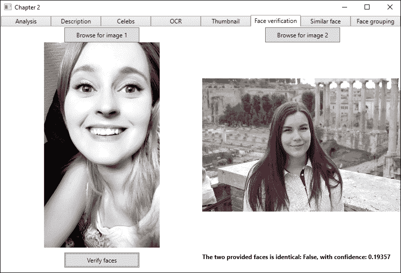

在编写本文时，人脸 API 的`NuGet`包仅允许进行人脸对人脸验证。如果我们直接调用 REST API，我们还可以利用人脸对人员验证。

要使用人脸对人员验证，只需要一张图像。您需要传递该图像的人脸 ID。您还需要传递人员组 ID 和人员 ID。这些是为了指定要搜索的特定人员组以及该组中的特定人员。我们将在本章后面介绍人员组和人员。

## 寻找相似人脸

使用人脸 API，您可以找到与提供的脸相似的人脸。API 允许两种搜索模式。匹配人员模式是默认模式。这将根据内部相同人员的阈值将人脸与同一人匹配。另一种是匹配人脸模式，它将忽略相同人员的阈值。这返回相似度匹配，但相似度可能较低。

在提供的示例代码中，我们的 UI 中有三个按钮：一个用于生成人脸列表，另一个用于将人脸添加到列表中，最后一个是用于查找相似人脸。我们需要一个文本框来指定人脸列表的名称。为了方便，我们添加了一个列表框，输出从人脸列表中持久化的脸 ID。我们还添加了一个图像元素来显示我们正在检查的图像，以及一个输出结果的文本框。

在相应的`ViewModel`中，我们需要为图像元素添加一个`BitmapImage`属性。我们需要两个`string`属性：一个用于我们的脸列表名称，另一个用于 API 调用结果。为了将数据传递到我们的列表框，我们需要一个包含`Guids`的`ObservableCollection`属性。按钮需要连接到单个`ICommand`属性。

在`ViewModel`的开始处，我们声明了两个`private`变量，如下所示代码所示。第一个是一个`bool`变量，用于指示人脸列表是否已存在。另一个用于访问人脸 API：

```py
    private bool _faceListExists = false;
    private FaceServiceClient _faceServiceClient;
```

构造函数应接受`FaceServiceClient`参数，并将其分配给前面的变量。然后，它将调用一个`Initialize`函数，如下所示：

```py
    private async void Initialize()
    {
        FaceListName = "Chapter2";

        CreateFaceListCommand = new DelegateCommand(CreateFaceListAsync, CanCreateFaceList);
        FindSimilarFaceCommand = new DelegateCommand(FindSimilarFace);
        AddExampleFacesToListCommand = new DelegateCommand(AddExampleFacesToList, CanAddExampleFaces);
```

首先，我们将`FaceListName`属性初始化为`Chapter2`。然后，我们创建命令对象，指定动作和谓词。

我们通过调用两个函数来完成`Initialize`函数，如下所示。一个检查人脸列表是否存在，而另一个更新人脸 ID 列表：

```py
        await DoesFaceListExistAsync();
        UpdateFaceGuidsAsync();
    }
```

要检查给定的人脸列表是否存在，我们首先需要获取所有人脸列表的列表。我们通过调用`ListFaceListsAsync`方法来完成此操作，它将返回一个`FaceListMetadata`数组。在遍历数组之前，我们确保结果有数据，如下所示：

```py
    private async Task DoesFaceListExistAsync()
    {
        FaceListMetadata[] faceLists = await _faceServiceClient.ListFaceListsAsync();
```

从结果数组中，每个`FaceListMetadata`数组都包含一个人脸列表 ID、人脸列表名称和用户提供的资料。对于本例，我们只对名称感兴趣。如果指定的人脸列表名称是返回的任何人脸列表的名称，我们将`_faceListExists`参数设置为`true`，如下所示：

```py
    foreach (FaceListMetadatafaceList in faceLists) {
        if (faceList.Name.Equals(FaceListName)) {
            _faceListExists = true;
            break;
        }
    }
```

如果人脸列表存在，我们可以更新人脸 ID 列表。

要获取人脸列表中的面孔，我们首先需要获取人脸列表。这通过调用人脸 API 的`GetFaceListAsync`方法来完成。这需要将人脸列表 ID 作为参数传递。人脸列表 ID 需要是小写字母或数字，且最多可包含 64 个字符。为了简化，我们使用人脸列表名称作为人脸 ID，如下所示：

```py
    private async void UpdateFaceGuidsAsync() {
        if (!_faceListExists) return;

        try { 
            FaceListfaceList = await _faceServiceClient.GetFaceListAsync(FaceListName.ToLower());
```

此 API 调用的结果是包含人脸列表 ID 和人脸列表名称的`FaceList`对象。它还包含用户提供的资料和持久化面孔的数组。

我们检查是否有数据，然后获取持久化面孔的数组。通过遍历这个数组，我们能够获取每个项目的`PersistedFaceId`参数（作为一个`guid`变量）和用户提供的资料。持久化的人脸 ID 被添加到`FaceIds ObservableCollection`中，如下所示：

```py
        if (faceList == null) return;

        PersonFace[] faces = faceList.PersistedFaces;

        foreach (PersonFace face in faces) {
            FaceIds.Add(face.PersistedFaceId);
        }
```

通过添加相应的`catch`子句来完成函数。

如果人脸列表不存在且我们指定了人脸列表名称，则可以创建一个新的人脸列表，如下所示：

```py
    private async void CreateFaceListAsync(object obj) {
        try {
            if (!_faceListExists) {
                await _faceServiceClient.CreateFaceListAsync (
FaceListName.ToLower(), FaceListName, string.Empty);
                await DoesFaceListExistAsync();
            }
        }
```

首先，我们检查人脸列表是否存在。使用`_faceServiceClient`参数，您需要传递人脸列表 ID、人脸列表名称和用户数据。如前所述，人脸列表 ID 需要是小写字母或数字。

使用 REST API 时，用户参数是可选的，因此您不必提供它。

在我们创建人脸列表后，我们想要确保它存在。我们通过调用之前创建的`DoesFaceListExistAsync`函数来完成此操作。添加`catch`子句以完成函数。

如果命名的人脸列表存在，我们可以向此列表添加面孔。添加`AddExampleFacesToList`函数。它应该接受`object`作为参数。我将把添加图像的细节留给你。在提供的示例中，我们从给定的目录中获取图像列表并遍历它。

使用给定图像的文件路径，我们将图像作为`Stream`打开。为了优化我们的相似性操作，我们在图像中找到`FaceRectangle`参数。由于人脸列表中每张图像应该只有一个面部，我们在`Face`数组中选择第一个元素，如下所示：

```py
    using (StreamfileStream = File.OpenRead(image))
    {
        Face[] faces = await _faceServiceClient.DetectAsync(fileStream);
        FaceRectanglefaceRectangle = faces[0].FaceRectangle;
```

将人脸添加到人脸列表就像调用`AddFaceToFaceListAsync`函数一样简单。我们需要指定人脸列表 ID 和图像。图像可能来自`Stream`（如我们的情况）或 URL。可选地，我们可以添加用户数据和图像的人脸矩形，如下所示：

```py
AddPersistedFaceResult addFacesResult = await _faceServiceClient.AddFaceToFaceListAsync(FaceListName.ToLower(), fileStream, null, faceRectangle);
UpdateFaceGuidsAsync();
```

API 调用的结果是`AddPersistedFaceResult`变量。它包含持久化的人脸 ID，这与`DetectAsync`调用中的人脸 ID 不同。添加到人脸列表中的人脸不会过期，直到被删除。

我们通过调用`UpdateFaceGuidsAsync`方法来完成函数。

最后，我们创建我们的`FindSimilarFace`函数，也接受`object`作为参数。为了能够搜索相似的人脸，我们需要从`DetectAsync`方法中获取人脸 ID（`Guid`变量）。这可以通过本地图像或从 URL 调用。示例代码打开文件浏览器，允许用户浏览图像。

使用人脸 ID，我们可以搜索相似的人脸，如下面的代码所示：

```py
    try {
        SimilarPersistedFace[] similarFaces = await _faceServiceClient.FindSimilarAsync (findFaceGuid, FaceListName.ToLower(), 3);
```

我们调用`FindSimilarAsync`函数。第一个参数是我们指定的面部 ID。下一个参数是面部列表 ID，最后一个参数是返回的候选面部数量。默认值为 20，因此通常最好指定一个数字。

与使用人脸列表查找相似人脸相比，您可以使用`Guid`变量的数组。该数组应包含从`DetectAsync`方法检索到的人脸 ID。

在编写本文时，NuGet API 包仅支持匹配人员模式。如果您直接使用 REST API，您可以指定模式作为参数。

根据选择的模式，结果将包含相似人脸的 ID 或持久化人脸 ID。它还将包含给定人脸相似度的置信度。

要从人脸列表中删除人脸，请在 Face API 中调用以下函数：

```py
    DeleteFaceFromFaceListAsync(FACELISTID, PERSISTEDFACEID)
```

要删除人脸列表，请在 Face API 中调用以下函数：

```py
    DeleteFaceListAsync(FACELISTID)
```

要更新人脸列表，请在 Face API 中调用以下函数：

```py
    UpdateFaceListAsync(FACELISTID, FACELISTNAME, USERDATA)
```

## 对相似人脸进行分组

如果您有多个人脸图像，您可能想对人脸进行分组。通常，您将希望根据相似性对人脸进行分组，这是 Face API 提供的一项功能。

通过向 API 提供人脸 ID 列表，它将响应一个或多个组。一个组由外观相似的人脸组成。通常，这意味着这些人脸属于同一个人。找不到任何相似对应物的人脸将被放置在我们称之为`MessyGroup`的组中。

创建一个新的`View`，名为`FaceGroupingView.xaml`。该`View`应该有六个图像元素，以及对应的面部 ID 的标题和文本框。它还应该有一个用于分组命令的按钮和一个用于输出分组结果的文本框。

在相应的`FaceGroupingViewModel.xaml` `View`模型中，你应该为所有图像添加`BitmapImage`属性。你还应该添加面部 ID 的`string`属性和一个用于结果的属性。还需要一个`ICommand`属性。

在`ViewModel`的开始处，我们声明了一些`private`变量，如下所示：

```py
    private FaceServiceClient _faceServiceClient;
    private List<string> _imageFiles = new List<string>();
    private List<Guid> _faceIds = new List<Guid>();
```

第一个用于访问面部 API。第二个包含一个字符串列表，该列表包含我们图像的位置。最后一个列表包含检测到的面部 ID。

构造函数接受一个`FaceServiceClient`类型的参数。它将其分配给相应的变量并调用`Initialize`函数。这创建我们的`ICommand`对象并调用一个函数将我们的图像添加到应用程序中。

在添加图像的函数中，我们将硬编码的图像路径添加到我们的`_imageFiles`列表中。在这个例子中，我们添加了六个。使用`for`循环，我们生成每个`BitmapImage`属性。当我们有一个图像时，我们想要检测其中的面部：

```py
    try {
        using (Stream fileStream = File.OpenRead(_imageFiles[i])) {
            Face[] faces = await
            _faceServiceClient.DetectAsync(fileStream);
```

我们不需要比生成的面部 ID 更多的数据，我们知道该 ID 在检测后存储 24 小时：

```py
            _faceIds.Add(faces[0].FaceId);
            CreateImageSources(image, i, faces[0].FaceId);
        }
    }
```

假设每张图像中只有一个面部，我们将该面部 ID 添加到我们的`_faceIds`列表中。然后将图像、面部 ID 和循环中的当前迭代次数传递给一个新的函数`CreateImageSources`。这个函数包含一个基于迭代号的`switch`案例。根据数字，我们将图像和面部 ID 分配给相应的图像和图像 ID 属性。然后在 UI 中显示。

我们有一个按钮来分组图像。要分组图像，我们调用面部 API 的`GroupAsync`方法，传递一个包含面部 ID 的数组，如下所示。面部 ID 数组必须至少包含两个元素，并且不能包含超过 1,000 个元素：

```py
    private async void GroupFaces(object obj) {
        try {
            GroupResultfaceGroups = await _faceServiceClient.GroupAsync(_faceIds.ToArray());
```

响应是`GroupResult`类型，可能包含一个或多个组，以及混乱的组。我们检查是否有响应，然后解析它，如下所示：

```py
            if (faceGroups != null)
                FaceGroupingResult = ParseGroupResult(faceGroups);
        }
```

在查看`ParseGroupResult`方法之前，添加相应的`catch`子句并关闭`GroupFaces`函数。

在解析结果时，我们首先创建一个`StringBuilder`类来保存我们的文本。然后我们从结果中获取`groups`。一个组是该组中图像的面部 ID 数组。所有组都存储在一个列表中，我们将组的数量追加到`StringBuilder`类中，如下所示：

```py
private string ParseGroupResult(GroupResultfaceGroups) {
   StringBuilder result = new StringBuilder();
   List<Guid[]>groups = faceGroups.Groups;
   result.AppendFormat("There are {0} group(s)\n", groups.Count);
```

我们遍历组列表。在这个循环内部，我们遍历组中的每个项目。为了提高可读性，我们有一个辅助函数来从 ID 中找到图像名称。它找到我们 `_faceIds` 列表中的索引。然后用于图像名称，所以如果索引是 `2`，图像名称将是 `Image 3`。为了达到预期的效果，你必须按照以下逻辑顺序放置图像：

```py
            result.Append("Groups:\t");

            foreach(Guid[] guid in groups)
            {
                foreach(Guid id in guid)
                {
                    result.AppendFormat("{0} - ", GetImageName(id));
                }
                result.Append("\n");
            }
```

`GroupResult` 方法也可能包含一个 `MessyGroup` 数组。这是一个包含该组中面部 ID 的 `Guid` 变量的数组。我们遍历这个数组，以与常规组相同的方式追加图像名称，如下所示代码所示：

```py
            result.Append("Messy group:\t");

            Guid[] messyGroup = faceGroups.MessyGroup;
            foreach(Guidguid in messyGroup)
            {
                result.AppendFormat("{0} - ", GetImageName(guid));
            }
```

我们通过返回 `StringBuilder` 函数的文本来结束函数，这将输出到屏幕上，如下所示：

```py
            return result.ToString();
        }
```

确保在 `MainViewModel.cs` 文件中创建了 `ViewModel` 实例。同时，确保 `View` 已添加到 `MainView.xaml` 文件中的 `TabItem` 属性。编译并测试应用程序。

如果你使用提供的示例图像，你可能会得到以下结果：

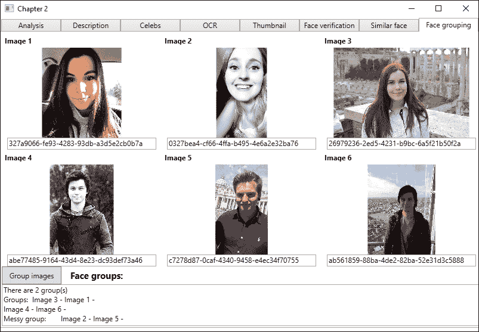

# 为我们的智能家居应用程序添加标识

作为我们智能家居应用程序的一部分，我们希望应用程序能够识别我们是谁。这样做为我们提供了从应用程序获取针对您的响应和操作的机会。

## 创建我们的智能家居应用程序

根据我们之前创建的 MVVM 模板创建智能家居应用程序的新项目。

在创建新项目后，添加 `Microsoft.ProjectOxford.Face` NuGet 包。

由于我们将在这本书中构建这个应用程序，我们将从小处开始。在 `MainView.xaml` 文件中，添加一个包含两个项目的 `TabControl` 属性。这两个项目应该是两个用户控件，一个称为 `AdministrationView.xaml` 文件，另一个称为 `HomeView.xaml` 文件。

管理控制将是我们管理应用程序不同部分的地方。主页控制将是起点和主要控制。

将相应的 `ViewModel` 实例添加到 `Views` 中。确保它们在 `MainViewModel.cs` 中声明和创建，正如我们在这章中看到的。在继续之前，请确保应用程序可以编译并运行。

## 添加要识别的人员

在我们能够继续识别一个人之前，我们需要有一些东西来识别他们。为了识别一个人，我们需要一个 `PersonGroup` 属性。这是一个包含几个 `Persons` 属性的组。

### 创建视图

在管理控制中，我们将执行这方面的几个操作。UI 应包含两个文本框元素、两个列表框元素和六个按钮。两个文本框元素将允许我们输入人员组名称和人员名称。一个列表框将列出我们可用的所有人员组。另一个将列出任何给定组中的所有人员。

我们为每个要执行的操作都设置了按钮，具体如下：

+   添加人员组

+   删除人员组

+   训练人员组

+   添加人员

+   删除人员

+   添加人员面部

`View`模型应该有两个`ObservableCollection`属性：一个为`PersonGroup`类型，另一个为`Person`类型。我们还应该添加三个`string`属性。一个将用于我们的人员组名称，另一个用于我们的人员名称。最后一个将保存一些状态文本。我们还想添加一个`PersonGroup`属性来选择人员组。最后，我们还想添加一个`Person`属性来保存所选人员。

在我们的`View`模型中，我们希望为`FaceServiceClient`方法添加一个`private`变量，如下面的代码所示：

```py
    private FaceServiceClient _faceServiceClient;
```

这应该在构造函数中分配，构造函数应接受一个`FaceServiceClient`类型的参数。它还应调用一个初始化函数，该函数将初始化六个`ICommand`属性。这些属性对应于之前创建的按钮。初始化函数应调用`GetPersonGroups`函数来列出所有可用的人员组，如下面的代码所示：

```py
    private async void GetPersonGroups() {
        try {
            PersonGroup[] personGroups = await
            _faceServiceClient.ListPersonGroupsAsync();
```

`ListPersonGroupsAsync`函数不接受任何参数，如果成功执行，则返回一个`PersonGroup`数组，如下面的代码所示：

```py
            if(personGroups == null || personGroups.Length == 0)
            {
                StatusText = "No person groups found.";
                return;
            }

            PersonGroups.Clear();

            foreach (PersonGrouppersonGroup in personGroups)
            {
                PersonGroups.Add(personGroup); 
            }
        }
```

然后，我们检查数组是否包含任何元素。如果包含，我们将清除现有的`PersonGroups`列表。然后我们遍历`PersonGroup`数组中的每个项目，并将它们添加到`PersonGroups`列表中。

如果没有人员组存在，我们可以通过填写一个名称来添加一个新的组。你在这里填写的名称也将用作人员组 ID。这意味着它可以包含数字和英文小写字母，"-"字符（连字符）和"_"字符（下划线）。最大长度为 64 个字符。当它被填写后，我们可以添加一个人员组。

### 添加人员组

首先，我们调用`DoesPersonGroupExistAsync`函数，指定`PersonGroupName`作为参数，如下面的代码所示。如果这是`true`，那么我们给出的名字已经存在，因此我们不允许添加它。注意我们如何在名字上调用`ToLower`函数。这样做是为了确保 ID 是小写的：

```py
    private async void AddPersonGroup(object obj) {
        try {
            if(await DoesPersonGroupExistAsync(PersonGroupName.ToLower())) {
                StatusText = $"Person group {PersonGroupName} already exist";
                return;
            }
```

如果人员组不存在，我们将调用`CreatePersonGroupAsync`函数，如下面的代码所示。同样，我们在第一个参数中将`PersonGroupName`指定为小写。这代表组的 ID。第二个参数表示我们想要的名字。我们通过再次调用`GetPersonGroups`函数来结束函数，这样我们就可以在我们的列表中获得新添加的组：

```py
            await _faceServiceClient.CreatePersonGroupAsync (PersonGroupName.ToLower(), PersonGroupName);
            StatusText = $"Person group {PersonGroupName} added";
            GetPersonGroups();
        }
```

`DoesPersonGroupExistAsync`函数执行一个 API 调用。它尝试调用`GetPersonGroupAsync`函数，将人员组 ID 指定为参数。如果结果`PersonGroup`列表不是`null`，则返回`true`。

要删除人员组，必须按照以下方式选择一个组：

```py
    private async void DeletePersonGroup(object obj)
    {
        try
        {
            await _faceServiceClient.DeletePersonGroupAsync (SelectedPersonGroup.PersonGroupId);
            StatusText = $"Deleted person group {SelectedPersonGroup.Name}";

            GetPersonGroups();
        }
```

调用`DeletePersonGroupAsync`函数的 API 需要将人员组 ID 作为参数。我们从所选人员组中获取这个 ID。如果没有捕获到异常，那么调用已经成功完成，然后我们调用`GetPersonGroups`函数来更新我们的列表。

当从列表中选择人员组时，我们确保调用`GetPersons`函数。这将更新人员列表，如下所示：

```py
    private async void GetPersons()
    {
        if (SelectedPersonGroup == null)
            return;

        Persons.Clear();

        try
        {
            Person[] persons = await _faceServiceClient.GetPersonsAsync(SelectedPersonGroup.PersonGroupId);
```

我们确保所选的人员组不是`null`。如果不是，我们清空我们的`persons`列表。调用`GetPersonsAsync`函数的 API 需要人员组 ID 作为参数。成功的调用将导致一个`Person`数组。

如果结果数组包含任何元素，我们将遍历它。每个`Person`对象都将添加到我们的`persons`列表中，如下面的代码所示：

```py
            if (persons == null || persons.Length == 0)
            {
                StatusText = $"No persons found in {SelectedPersonGroup.Name}.";
                return;
            }

            foreach (Person person in persons)
            {
                Persons.Add(person);
            }
        }
```

### 添加新人员

如果没有人员存在，我们可以添加新的。要添加一个新的人员，必须选择一个人员组，并填写该人员的姓名。完成这些步骤后，我们可以点击**添加**按钮：

```py
    private async void AddPerson(object obj)
    {
        try
        {
            CreatePersonResultpersonId = await _faceServiceClient.CreatePersonAsync(SelectedPersonGroup.PersonGroupId, PersonName);
            StatusText = $"Added person {PersonName} got ID: {personId.PersonId.ToString()}";

            GetPersons();
        }
```

调用`CreatePersonAsync`函数的 API 需要人员组 ID 作为第一个参数。下一个参数是人员的姓名。可选地，我们可以添加用户数据作为第三个参数。在这种情况下，它应该是一个字符串。当创建了一个新人员后，我们通过再次调用`GetPersons`函数来更新`persons`列表。

如果我们已选择一个人员组和一个人，那么我们将能够删除那个人，如下面的代码所示：

```py
    private async void DeletePerson(object obj)
    {
        try
        {
            await _faceServiceClient.DeletePersonAsync (SelectedPersonGroup.PersonGroupId, SelectedPerson.PersonId);

            StatusText = $"Deleted {SelectedPerson.Name} from {SelectedPersonGroup.Name}";

            GetPersons();
        }
```

要删除一个人，我们调用`DeletePersonAsync`函数。这需要该人员所在人员组的 ID 以及我们想要删除的人员的 ID。如果没有捕获到异常，那么调用成功，然后我们调用`GetPersons`函数来更新我们的人员列表。

我们的管理控制界面现在看起来类似于以下截图：

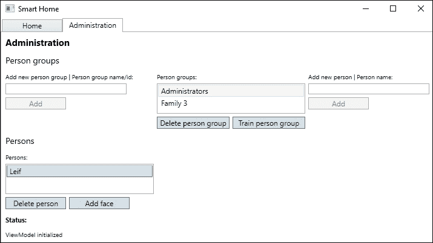

### 将面部与人员关联

在我们能够识别一个人之前，我们需要将面部与那个人关联起来。在给定的人员组和人员被选中后，我们可以添加面部。为此，我们打开一个文件对话框。当我们有一个图像文件时，我们可以按照以下方式将该面部添加到人员中：

```py
        using (StreamimageFile = File.OpenRead(filePath))
        {
            AddPersistedFaceResultaddFaceResult = await _faceServiceClient.AddPersonFaceAsync(
            SelectedPersonGroup.PersonGroupId,
            SelectedPerson.PersonId, imageFile);

            if (addFaceResult != null)
            {
                StatusText = $"Face added for {SelectedPerson.Name}. Remember to train the person group!";
            }
        }
```

我们将图像文件作为`Stream`打开。这个文件作为我们调用`AddPersonFaceAsync`函数的第三个参数传递。我们也可以传递一个指向图像的 URL 而不是流。

调用的第一个参数是人员所在组的人员组 ID。下一个参数是人员 ID。

可以包含的一些可选参数包括以字符串形式提供用户数据和用于图像的`FaceRectangle`参数。如果图像中有多于一个面部，则`FaceRectangle`参数是必需的。

成功的调用将导致一个`AddPersistedFaceResult`对象。它包含该人员的持久化面部 ID。

每个人可以与其关联最多 248 个面部。您可以添加的面部越多，您在以后收到稳定识别的可能性就越大。您添加的面部应从略微不同的角度。

### 训练模型

当与人员关联足够多的面部后，我们需要训练人员组。这是一个在人员或人员组发生任何更改后必须执行的任务。

当已选择一个人员组时，我们可以训练人员组，如下面的代码所示：

```py
    private async void TrainPersonGroup(object obj)
    {
        try
        {
            await _faceServiceClient.TrainPersonGroupAsync(
SelectedPersonGroup.PersonGroupId);
```

调用`TrainPersonGroupAsync`函数需要一个人员组 ID 作为参数，如下面的代码所示。它不返回任何内容，并且可能需要一段时间才能执行：

```py
            while(true)
            {
                TrainingStatustrainingStatus = await _faceServiceClient.GetPersonGroupTrainingStatusAsync (SelectedPersonGroup.PersonGroupId);
```

我们想确保训练成功完成。为此，我们在`while`循环中调用`GetPersonGroupTrainingStatusAsync`函数。此调用需要一个人员组 ID，成功的调用将返回一个`TrainingStatus`对象，如下面的代码所示：

```py
                if(trainingStatus.Status != Status.Running)
                {
                    StatusText = $"Person group finished with status: {trainingStatus.Status}";
                    break;
                }

                StatusText = "Training person group...";
                await Task.Delay(1000);
            }
        }
```

我们检查状态，如果它没有运行，则显示结果。如果训练仍在运行，我们等待一秒钟，然后再次运行检查。

当训练成功后，我们就可以识别人员了。

### 其他功能

有一些我们尚未查看的 API 调用，将在以下项目符号列表中简要提及：

+   要更新人员组，请调用以下操作；此函数不返回任何内容：

    ```py
            UpdatePersonGroupAsync(PERSONGROUPID, NEWNAME, USERDATA)
    ```

+   要获取一个人的面部，请调用以下操作：

    ```py
            GetPersonFaceAsync(PERSONGROUPID, PERSONID, PERSISTEDFACEID)
    ```

    成功的调用返回持久化的面部 ID 和用户提供的资料。

+   要删除一个人的面部，请调用以下操作；此调用不返回任何内容：

    ```py
            DeletePersonFaceAsync(PERSONGROUPID, PERSONID, PERSISTEDFACeID)
    ```

+   要更新一个人，请调用以下操作；此调用不返回任何内容：

    ```py
            UpdatePersonAsync(PERSONGROUPID, PERSONID, NEWNAME, USERDATA)
    ```

+   要更新一个人的面部，请调用以下操作；此调用不返回任何内容：

    ```py
            UpdatePersonFaceAsync(PERSONGROUID, PERSONID, PERSISTEDFACEID, USERDATA)
    ```

## 识别一个人

要识别一个人，我们首先将上传一个图像。打开`HomeView.xaml`文件，并向 UI 添加一个`ListBox`元素。这将包含在识别人员时可以选择的人员组。我们需要添加一个按钮元素来查找图像、上传它并识别人员。添加一个`TextBox`元素以显示工作响应。为了方便起见，我们还添加了一个图像元素来显示我们正在使用的图像。

在`View`模型中，添加一个`ObservableCollection`属性，其类型为`PersonGroup`。我们需要为选定的`PersonGroup`类型添加一个属性。还要添加一个用于我们的图像的`BitmapImage`属性和一个用于响应的字符串属性。我们还需要一个按钮的`ICommand`属性。

为`FaceServiceClient`类型添加一个`private`变量，如下所示：

```py
    private FaceServiceClient _faceServiceClient;
```

这将在我们的构造函数中分配，该构造函数应接受一个`FaceServiceClient`类型的参数。从构造函数中，调用`Initialize`函数以初始化一切，如下面的代码所示：

```py
    private void Initialize()
    {
        GetPersonGroups();
        UploadOwnerImageCommand = new DelegateCommand(UploadOwnerImage,CanUploadOwnerImage);
    }
```

首先，我们调用`GetPersonGroups`函数来检索所有的人组。此函数调用我们之前看到的`ListPersonGroupsAsync` API。结果被添加到我们的`PersonGroup`列表的`ObservableCollection`参数中。

接下来，我们创建我们的`ICommand`对象。如果从`PersonGroup`列表中选择了项目，`CanUploadOwnerImage`函数将返回`true`。如果没有选择，它将返回`false`，我们将无法识别任何人。

在`UploadOwnerImage`函数中，我们首先浏览到一个图像并加载它。加载图像并获取文件路径后，我们可以开始识别图像中的人，如下面的代码所示：

```py
    using (StreamimageFile = File.OpenRead(filePath))
    {
        Face[] faces = await _faceServiceClient.DetectAsync(imageFile);
        Guid[] faceIds = faces.Select(face =>face.FaceId).ToArray();
```

我们以`Stream`类型打开图像，如下面的代码所示。使用此方法，我们在图像中检测面部。从检测到的面部中，我们得到一个数组中的所有面部 ID：

```py
        IdentifyResult[] personsIdentified = await _faceServiceClient.IdentifyAsync (SelectedPersonGroup.PersonGroupId,
faceIds, 1);
```

面部 ID 数组将作为`IdentifyAsync` API 调用的第二个参数发送。记住，当我们检测到面部时，它将被存储 24 小时。继续使用相应的面部 ID 将确保服务知道使用哪个面部进行识别。

使用的第一个参数是我们选择的人组的 ID。调用中的最后一个参数是返回的候选人数量。由于我们不想一次识别多个人，我们指定一个。因此，我们应该确保我们上传的图像中只有一个面部。

成功的 API 调用将导致`IdentifyResult`参数的数组，如下面的代码所示。此数组中的每个项目都将包含候选人：

```py
    foreach(IdentifyResultpersonIdentified in personsIdentified) { 
        if(personIdentified.Candidates.Length == 0) {
            SystemResponse = "Failed to identify you.";
            break;
        }
        GuidpersonId = personIdentified.Candidates[0].PersonId;
```

我们遍历结果数组，如下面的代码所示。如果没有候选人，我们只需退出循环。然而，如果我们有候选人，我们将获取第一个候选人的`PersonId`参数（我们之前要求只获取一个候选人，所以这是可以的）：

```py
        Person person = await faceServiceClient.GetPersonAsync(
SelectedPersonGroup.PersonGroupId, personId);

        if(person != null) {
            SystemResponse = $"Welcome home, {person.Name}";
            break;
        }
    }
}
```

使用`personId`参数，我们通过 API 调用`GetPersonAsync`函数获取单个`Person`对象。如果调用成功，我们将打印一条欢迎信息给正确的人（如下面的截图所示）并退出循环：

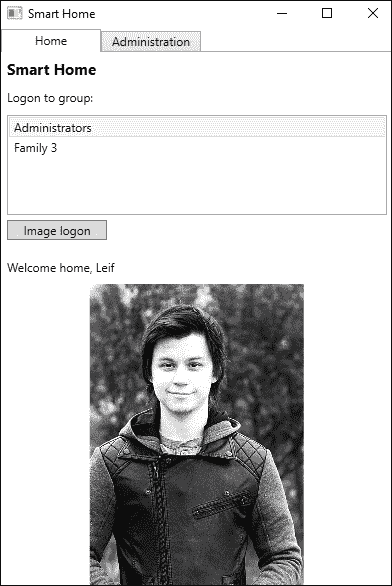

# 使用人脸 API 了解你的情绪

人脸 API 允许你从面部识别情绪。

研究表明，有一些关键情绪可以归类为跨文化。这些是快乐、悲伤、惊讶、愤怒、恐惧、轻蔑、厌恶和中立。所有这些情绪都被 API 检测到，这使得您的应用程序能够通过了解用户的情绪以更个性化的方式做出响应。

我们将学习如何从图像中识别情绪，以便我们的智能家居应用程序可以了解我们的情绪。

## 从网络摄像头获取图像

想象一下，你的房子周围有几个摄像头。智能家居应用程序可以随时了解你的情绪。通过了解这一点，它可以利用情绪来更好地预测你的需求。

我们将向我们的应用程序添加网络摄像头功能。如果您没有网络摄像头，您可以跟随操作，但使用我们之前看到的技术加载图像。

首先，我们需要向我们的智能家居应用程序添加一个 NuGet 包。搜索`OpenCvSharp3-AnyCPU`并使用**shimat**安装包。这是一个允许处理图像的包，并且将被我们即将添加的下一个依赖项所使用。

在提供的示例代码中，有一个名为`VideoFrameAnalyzer`的项目。这是一个由 Microsoft 编写的项目，允许我们从网络摄像头逐帧抓取图像。使用它，我们能够在我们的应用程序中分析情感。我们将执行的使用案例如下：

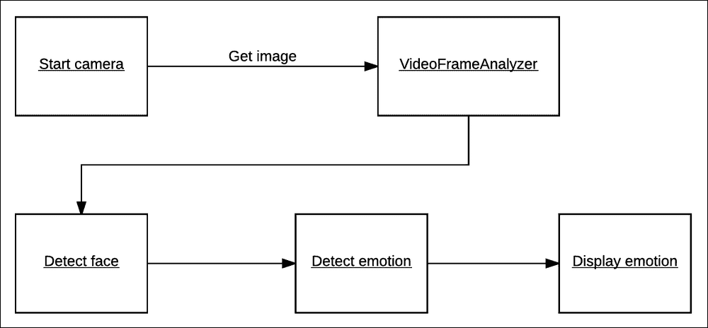

在我们的`HomeView.xaml`文件中，添加两个新按钮。一个用于启动网络摄像头，另一个用于停止它。

在相应的`View`模型中，为每个按钮添加两个`ICommand`属性。还要添加以下`private`成员：

```py
    private FrameGrabber<CameraResult> _frameGrabber;
    private static readonly ImageEncodingParam[] s_jpegParams = {
        new ImageEncodingParam(ImwriteFlags.JpegQuality, 60)
    };
```

第一个是一个`FrameGrabber`对象，它来自`VideoFrameAnalyzer`项目。`static`成员是一个图像参数数组，用于获取网络摄像头图像时使用。此外，我们还需要添加一个`CameraResult`类，它应该位于`ViewModel`文件中。

我们将`EmotionScores`初始化为`null`，如下所示代码所示。这样做是为了确保新的情感分数总是从最新的分析结果中分配：

```py
    internal class CameraResult {
        public EmotionScores EmotionScores { get; set; } = null;
    }
```

在构造函数中添加`_frameGrabber`成员的初始化，并在`Initialization`函数中添加以下内容：

```py
    _frameGrabber.NewFrameProvided += OnNewFrameProvided;
```

每次从摄像头提供新的帧时，都会引发一个事件。

当我们收到新的帧时，我们希望从它创建一个`BitmapImage`以在 UI 中显示。为此，我们需要从当前调度器调用操作，因为事件是从后台线程触发的，如下所示代码：

```py
    private void OnNewFrameProvided(object sender, FrameGrabber<CameraResult>.NewFrameEventArgs e) {          
        Application.Current.Dispatcher.Invoke(() => {
            BitmapSource bitmapSource = e.Frame.Image.ToBitmapSource();

            JpegBitmapEncoder encoder = new JpegBitmapEncoder();
            MemoryStream memoryStream = new MemoryStream();
            BitmapImage image = new BitmapImage();
```

我们获取`Frame`的`BitmapSource`并创建一些所需的变量。

使用我们创建的`encoder`，我们添加`bitmapSource`并将其保存到`memoryStream`中，如下所示：

```py
    encoder.Frames.Add(BitmapFrame.Create(bitmapSource));
    encoder.Save(memoryStream);
```

然后，将此`memoryStream`分配给我们在以下代码中创建的`BitmapImage`。这反过来又分配给`ImageSource`，它将在 UI 中显示帧：

```py
    memoryStream.Position = 0;
    image.BeginInit(); 
    image.CacheOption = BitmapCacheOption.OnLoad;
    image.StreamSource = memoryStream;
    image.EndInit();

    memoryStream.Close(); 
    ImageSource = image;
```

由于此事件将被触发很多次，我们将在 UI 中获得一个流畅的流，并且它看起来就像是一个直接的视频流。

在我们的`Initialization`函数中，我们还需要为按钮创建我们的`ICommand`，如下所示：

```py
    StopCameraCommand = new DelegateCommand(StopCamera);
    StartCameraCommand = new DelegateCommand(StartCamera, CanStartCamera);
```

要能够启动摄像头，我们需要选择一个人员组，并且至少有一个摄像头可用：

```py
    private bool CanStartCamera(object obj) {
        return _frameGrabber.GetNumCameras() > 0 && SelectedPersonGroup != null;
    }
```

要启动摄像头，我们需要指定要使用哪个摄像头以及我们希望多久触发一次分析，如下所示代码：

```py
    private async void StartCamera(object obj) {
        _frameGrabber.TriggerAnalysisOnInterval(TimeSpan.FromSeconds(5));
        await _frameGrabber.StartProcessingCameraAsync();
    }
```

如果在`StartProcessingCameraAsync`中没有指定摄像头，则默认选择第一个可用的摄像头。

我们将很快回到这个过程的分析部分。

要停止摄像头，我们运行以下命令：

```py
    private async void StopCamera(object obj) {
        await _frameGrabber.StopProcessingAsync();
    }
```

## 让智能屋了解你的情绪

我们现在有了网络摄像头提供的视频可供我们使用。

在`FrameGrabber`类中，有一个`Func`，它将被用于分析函数。我们需要创建一个函数，该函数将被传递到这个函数中，以使情感能够被识别。

创建一个新的函数，`EmotionAnalysisAsync`，它接受一个`VideoFrame`作为参数。返回类型应该是`Task<CameraResult>`，并且该函数应该被标记为`async`。

我们作为参数获得的`frame`用于创建一个包含当前帧的`MemoryStream`。这将是以 JPG 文件格式。我们将在这张图片中找到一个脸，我们想要确保我们指定我们想要使用以下代码来指定情感属性：

```py
private async Task<CameraResult> EmotionAnalysisAsync (VideoFrame frame) {
   MemoryStream jpg = frame.Image.ToMemoryStream(".jpg", s_jpegParams); 
   try {
      Face[] face = await _faceServiceClient.DetectAsync(jpg, true, false, new List<FaceAttributeType>
         { FaceAttributeType.Emotion });
      EmotionScores emotions = face.First()?.FaceAttributes?.Emotion;
```

成功调用将返回一个包含所有情感分数的对象，如下面的代码所示。这些分数就是我们想要返回的内容：

```py
    return new CameraResult {
        EmotionScores = emotions
    };
```

捕获可能抛出的任何异常，当它们发生时返回`null`。

我们需要将`Initialize`函数分配给`Func`。我们还需要在每次有新的结果时添加一个事件处理程序。

当获得新的结果时，我们抓取接收到的`EmotionScore`，如下面的代码所示。如果它是`null`或不包含任何元素，那么我们不想做任何其他事情：

```py
    _frameGrabber.NewResultAvailable += OnResultAvailable;
    _frameGrabber.AnalysisFunction = EmotionAnalysisAsync;
    private void OnResultAvailable(object sender, FrameGrabber<CameraResult>.NewResultEventArgs e)
    {
        var analysisResult = e.Analysis.EmotionScores; 
        if (analysisResult == null)
            return;
```

在以下代码中，我们解析`AnalyseEmotions`中的情感分数，我们稍后会看到：

```py
        string emotion = AnalyseEmotions(analysisResult);

        Application.Current.Dispatcher.Invoke(() => {
            SystemResponse = $"You seem to be {emotion} today.";
        });
    }
```

使用`AnalyseEmotions`的结果，我们向结果打印一个字符串来指示当前情绪。这需要从当前的分发器中调用，因为事件是在另一个线程中触发的。

为了以可读的格式获取当前情绪，我们在`AnalyseEmotions`中解析情感分数如下：

```py
    private string AnalyseEmotions(Scores analysisResult) {
        string emotion = string.Empty;
        var sortedEmotions = analysisResult.ToRankedList();
        string currentEmotion = sortedEmotions.First().Key;
```

使用我们得到的`Scores`，我们调用一个`ToRankedList`函数。这将返回一个包含每个情感及其对应置信度的`KeyValuePair`列表。第一个将是可能性最高的，第二个将是第二可能性最高的，依此类推。我们只关心可能性最高的那个，所以我们选择它。

在选择了最高的情感分数后，我们使用一个`switch`语句来找到正确的情感。这将返回并打印到结果中，如下所示：

```py
        switch(currentEmotion)
        { 
            case "Anger":
                emotion = "angry";
                break;
            case "Contempt":
                emotion = "contempt";
                break;
            case "Disgust":
                emotion = "disgusted";
                break;
            case "Fear":
                emotion = "scared";
                break;
            case "Happiness":
                emotion = "happy";
                break;
            case "Neutral":
                default:
                emotion = "neutral";
                break;
            case "Sadness":
                emotion = "sad";
                break;
            case "Suprise":
                emotion = "suprised";
                break;
            }
            return emotion;
        }
```

最后一个拼图是要确保分析在指定的时间间隔内执行。在`StartCamera`函数中，在调用`StartProcessingCamera`之前添加以下行：

```py
    _frameGrabber.TriggerAnalysisOnInterval(TimeSpan.FromSeconds(5));
```

这将触发每五秒调用一次情感分析。

当我脸上带着微笑时，应用程序现在知道我是快乐的，并且可以相应地提供进一步的交互。如果我们编译并运行示例，我们应该得到如下截图所示的结果：

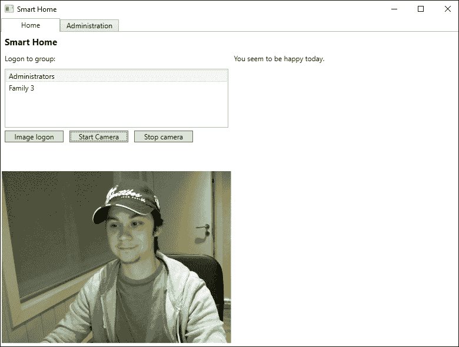

当我的情绪变为中性时，应用程序也会检测到这一点：

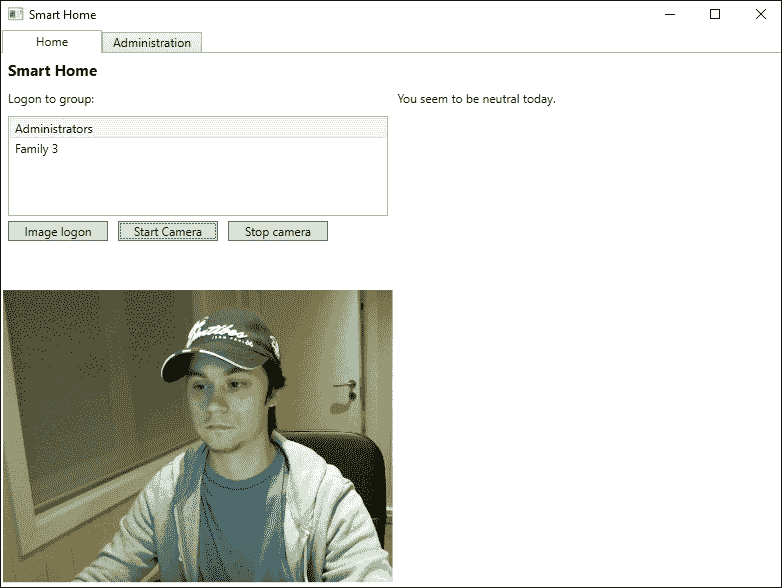

# 自动调节用户内容

使用内容审核 API，我们可以对用户生成的内容进行监控。该 API 旨在协助标记和评估及过滤冒犯性和不受欢迎的内容。

## 内容审核 API 的类型

我们将在本节中快速介绍审核 API 的关键特性。

### 注意

所有 API 的文档参考可以在[`docs.microsoft.com/nb-no/azure/cognitive-services/content-moderator/api-reference`](https://docs.microsoft.com/nb-no/azure/cognitive-services/content-moderator/api-reference)找到。

### 图像审核

图像审核 API 允许您对成人和不适当的内容进行审核。它还可以提取图像中的文本内容并检测图像中的面部。

当使用 API 评估不适当的内容时，API 将接受一个图像作为输入。根据图像，它将返回一个布尔值，指示图像是否适当。它还将包含一个介于 0 和 1 之间的对应置信度分数。布尔值是基于一组默认阈值设置的。

如果图像包含任何文本，API 将使用 OCR 提取文本。然后，它将寻找与文本审核相同的成人或低俗内容，我们将在稍后讨论。

一些基于内容的应用程序可能不想显示任何可识别个人信息，在这种情况下，检测图像中的面部可能很明智。基于面部检测评估中检索到的信息，您可以确保用户内容中不包含任何人的图像。

### 文本审核

使用文本审核 API，您可以对自定义和共享的文本列表进行筛选。它能够检测文本中的可识别个人信息和粗俗语言。在这种情况下，可识别个人信息是指电子邮件地址、电话号码和邮寄地址等信息的存在。

当您提交要审核的文本时，如果未声明，API 可以检测使用的语言。筛选文本将自动纠正任何拼写错误（以捕捉故意拼错的单词）。结果将包含文本中亵渎和可识别个人信息的位置，以及原始文本、自动更正后的文本和语言。使用这些结果，您可以适当地审核内容。

## 审核工具

有三种方式可以通过内容审核员来审核内容：

+   **人工审核**: 使用团队和社区手动审核所有内容

+   **自动审核**: 利用机器学习和人工智能进行大规模审核，无需人工交互

+   **混合审核**: 前两种方法的结合，其中人们通常偶尔进行审查

常用的场景是最后一个。这是使用机器学习来自动化审查过程，并且团队可以审查。微软创建了一个审查工具来简化此过程。这允许您在网页浏览器中查看所有待审查的项目，同时在使用您应用程序中的 API。我们将在下一节中探讨这个工具。

### 使用

l，前往[`contentmoderator.cognitive.microsoft.com/`](https://contentmoderator.cognitive.microsoft.com/)。从这里，您可以使用您的 Microsoft 账户登录。在首次登录时，您需要通过添加您的姓名到账户进行注册。然后，您将创建一个*审查团队*，如下面的截图所示：

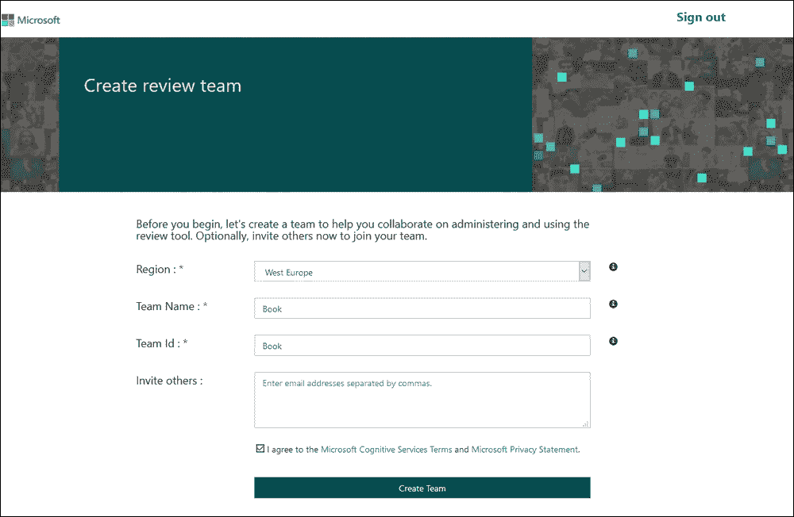

您可以通过选择区域并输入团队名称来完成此操作。您可以可选地输入其他应成为团队一部分的人的电子邮件地址。点击**创建团队**。

进入后，您将看到以下仪表板：

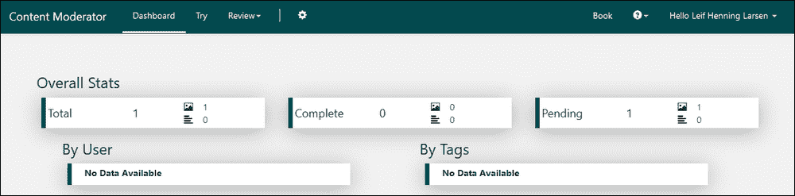

您将看到需要审查的图像和文本内容的总数。您还将看到已完成和待审查的审查总数。仪表板还会列出已完成审查的用户以及用于内容的任何标签。

通过在菜单中选择**尝试**选项，您可以选择上传图像或文本以在线执行审查。通过上传图像或在文本框中输入示例文本来完成此操作。完成后，您可以选择**审查**选项，您将看到以下屏幕：

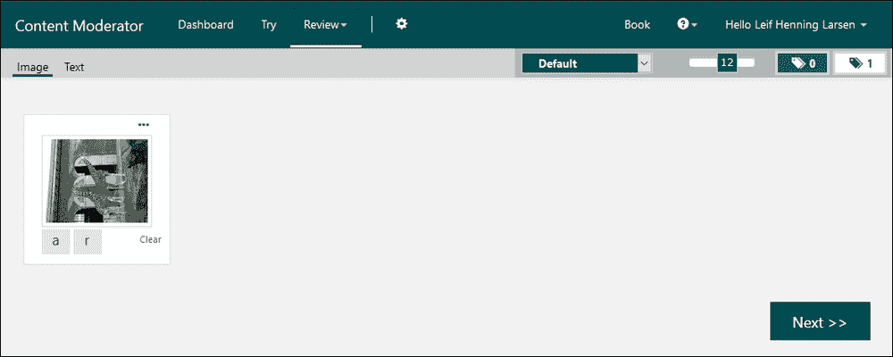

如果给定内容是成人内容或种族主义内容，您可以分别点击**a**或**r**按钮。对于文本，任何亵渎性语言都会显示出来。一旦完成标记审查，点击**下一步**。这将通过审查给定内容的过程。

### 其他工具

除了 API 和审查工具之外，还有两个其他工具您可以使用，如下所示：

+   **列表管理 API**：使用自定义的图像和文本列表来审查您不希望重复扫描的已识别内容

+   **工作流 API**：使用此 API，您可以定义条件逻辑和操作来指定您特定内容使用的策略

要使用任何这些 API 或使用审查 API，您可以对特定的 REST API 进行调用。为此，您需要使用 API 密钥和基本 URL。这些设置可以在审查工具网站的**设置 | 凭据**下找到，如下面的截图所示：

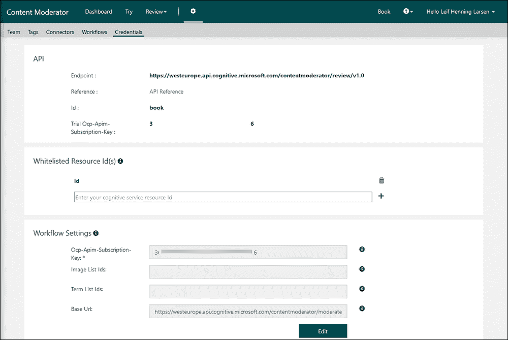

# 构建您自己的图像分类器

**自定义视觉**服务允许您构建自己的图像分类器。可能存在需要特殊图像来使用图像 API 的情况。这些情况可能来自工厂，您需要识别的设备不太可用。您可以从构建原型开始，使用尽可能少的

## 构建分类器

要构建一个分类器，你需要创建一个新的项目。这样做将允许你指定图像将属于哪个类别。你还将选择分类类型和项目类型。

继续前进，你需要上传图像。这可以通过网页或通过 REST API 完成。所有图像都必须标记，以便分类器以后能够识别相似图像。

一旦所有图像（至少 50 张）上传完毕，你必须训练你的模型。一旦训练完成，你将看到每个标签的精确百分比。这是对模型准确度的测量。

## 改进模型

在网站上，你可以测试你的模型。这样做将允许你上传图像，这些图像将被模型分类。如果模型表现不佳，你可以改进模型。

改进模型涉及上传更多图像。以下是一些改进模型的通用指南：

+   有足够的图像

+   确保标签之间的平衡良好（以便每个标签都有相同数量的图像）

+   使用多样化的图像进行训练

+   使用用于预测的图像

+   检查预测结果

## 使用训练好的模型

一旦你对模型满意，你可以用它来进行预测。模型可以通过以下两种方式之一使用：

+   使用 REST API

+   导出为模型文件

第一种选择涉及上传一个图像。调用为你模型生成的端点，以及图像数据，将导致一个预测。结果将包含按概率排序的预测标签。

第二种选择允许你在离线状态下运行预测。这意味着你可以利用不同的框架，如 TensorFlow、CoreML 和 ONNX，在不同的平台上。如何使用这些框架与模型结合使用超出了本书的范围。使用离线模型的缺点是，与在线版本相比，准确度可能略有下降。

# 摘要

在本章中，我们深入研究了视觉 API 的一部分。你首先学习了如何获取图像的良好描述。接下来，你学习了如何在图像中识别名人和文本，以及如何生成缩略图。随后，我们转向了面部 API，在那里我们获得了更多关于检测到的面部信息。我们了解到如何验证两个面部是否相同。之后，你学习了如何找到相似的面部并将相似的面部分组。然后我们在智能屋应用中添加了识别功能，使其能够知道我们是谁。我们还添加了识别面部情绪的能力。我们快速浏览了内容审核器，看看你如何为用户生成的内容添加自动审核。最后，我们简要介绍了自定义视觉服务，以及如何使用它来生成特定的预测模型。

下一章将继续介绍最终视觉 API。我们将关注视频，了解视频索引器 API 能提供什么。
