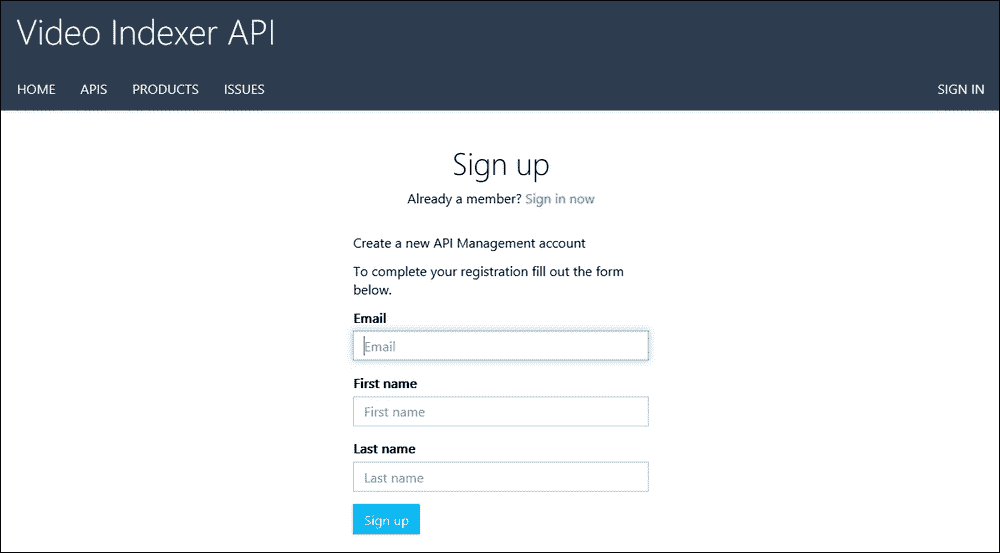
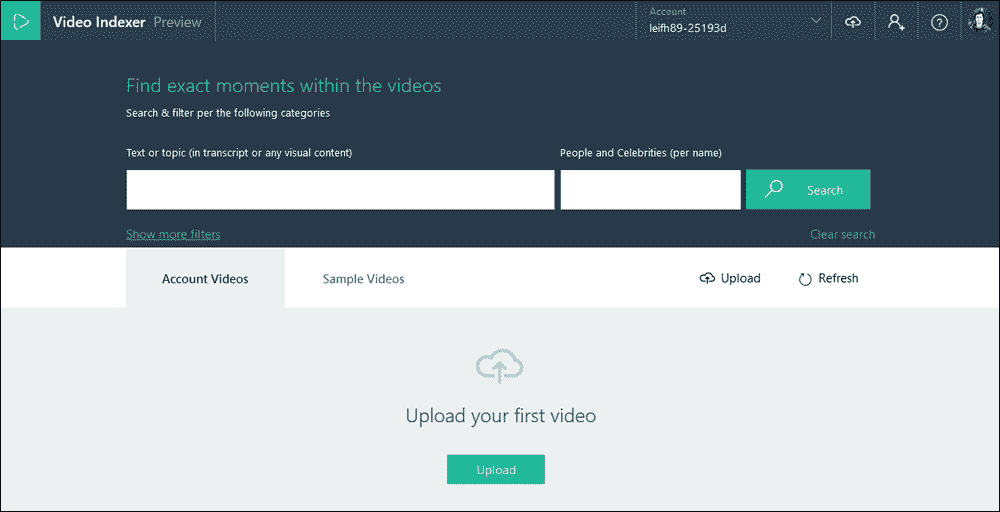
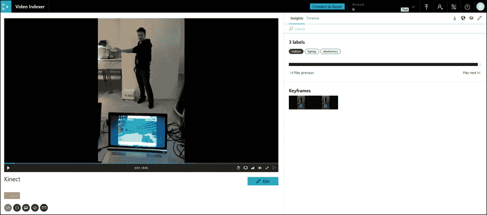
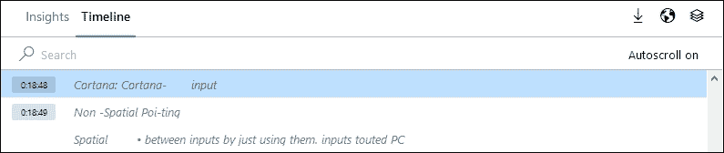
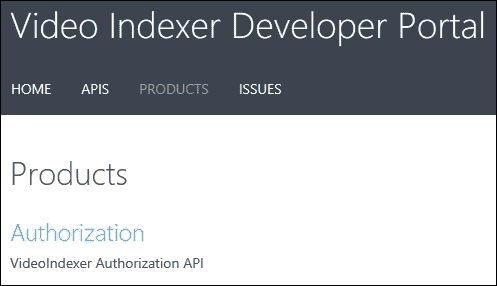
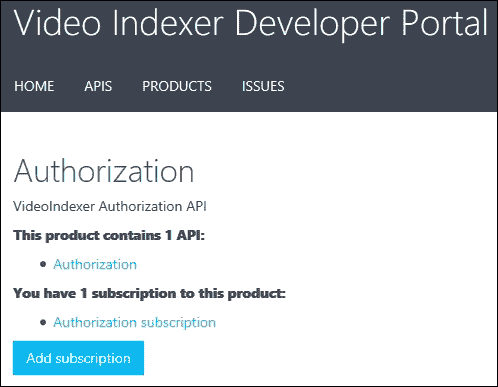
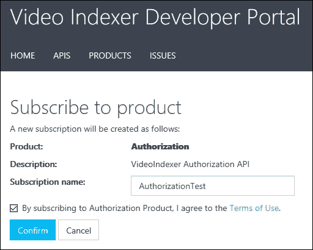
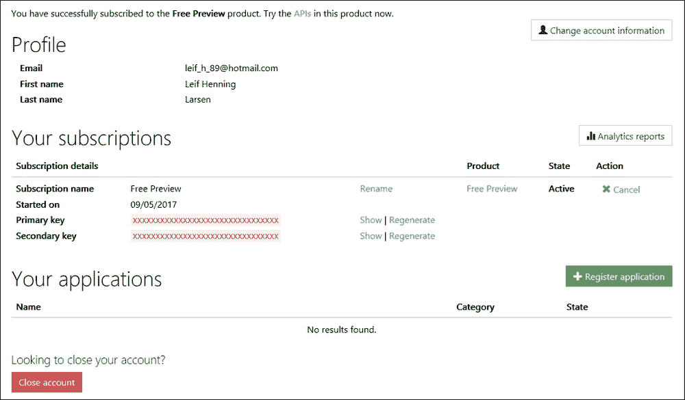

# 第三章：分析视频

在上一章中，我们探讨了用于处理图像的不同 API。我们将介绍一个新的 API：Video Indexer API。

在本章中，我们将涵盖以下主题：

+   Video Indexer 的一般概述

+   使用预构建 UI 的 Video Indexer 指南

# 深入了解 Video Indexer

Video Indexer 是一种服务，允许您上传视频并从您上传的视频中获得洞察。这些洞察可用于使视频（以及由此扩展的内容）更容易被发现。它们还可以用于提高用户参与度。

## 一般概述

通过使用人工智能技术，Video Indexer 使您能够提取大量信息。它可以从以下列表中的功能中获得洞察：

+   带语言检测的音频字幕

+   创建字幕

+   噪音降低

+   人脸跟踪和识别

+   说话人索引

+   视觉文本识别

+   语音活动检测

+   场景检测

+   关键帧提取

+   情感分析

+   翻译

+   视觉内容审核

+   关键词提取

+   注释

+   品牌检测

+   物体和动作标注

+   文本内容审核

+   情感检测

### 典型场景

以下列表显示了一些可能希望使用 Video Indexer 的典型场景：

+   **搜索**：如果您有一个视频库，您可以使用 Video Indexer 获得的洞察来索引每个视频。通过（例如）语音或两个特定人物同时出现的位置进行索引可以提供更好的搜索体验。

+   **货币化**：通过使用 Video Indexer 获得的洞察，可以提高每个视频的价值。例如，您可以通过使用视频洞察来展示上下文正确的广告，从而提供更相关的广告。例如，通过使用洞察，您可以在足球比赛中而不是游泳比赛中展示运动鞋广告。

+   **用户参与度**：通过使用 Video Indexer 获得的洞察，您可以通过显示视频的相关元素来提高用户参与度。如果您有一个涵盖 60 分钟不同材料的视频，在该时间段内放置视频时刻允许用户直接跳转到相关部分。

### 关键概念

以下部分描述了在讨论 Video Indexer 时重要的关键概念。

#### 拆解

拆解是一个包含所有洞察详细信息的完整列表。这是完整视频字幕的来源；然而，拆解通常过于详细，不适合用户。相反，您通常希望使用总结性洞察来仅获取最相关的知识。如果需要更详细的洞察，您将从一个总结性洞察转到完整的拆解。

#### 总结性洞察

而不是检查数千个时间范围并查找给定数据，可以使用总结性洞察。这将为您提供数据的聚合视图，例如面孔、关键词和情感，以及它们出现的时间范围。

#### 关键词

从视频中的任何转录音频中，视频索引器将提取可能与视频相关的关键词和主题列表。

#### 情感

当视频被转录时，它也会进行情感分析。这意味着您可以判断视频是更积极还是更消极。

#### 块

块用于轻松地通过数据。如果有说话者更改或音频之间的长暂停，这些可能被索引为单独的块。

# 使用视频索引器解锁视频洞察

在本节中，我们将探讨如何使用视频索引器。

## 如何使用视频索引器

我们将快速查看您如何利用视频索引器。

### 通过网页门户

要使用微软提供的预构建视频索引器工具，请访问[`vi.microsoft.com/`](https://vi.microsoft.com/)。使用您的微软账户注册或登录。登录后，您将需要填写一些信息以注册账户，如下面的截图所示：

一旦您登录，您将发现自己在一个仪表板上，如下面的截图所示：

要开始，您可以通过点击**上传**来上传您的视频。这将打开一个弹出窗口，您可以使用它上传视频或输入视频的 URL。或者，您可以通过在菜单中点击**示例视频**来快速选择一个示例视频。

当您选择了一个视频，或者您上传的视频已完成索引时，您将被带到一页来查看洞察。此页面将显示视频的全部内容，以及找到的任何洞察，如下面的截图所示：

除了在视频中发现的任何关键词和人之外，您还将获得视频中的语音注释和情感列表。这些洞察将提供以下信息列表（如果检测到此类信息）：

+   视频中出现的人物

+   关于视频内容的关键词

+   与视频相关的标签

+   检测到的品牌

+   情感

+   关键帧列表

视频索引器还将创建视频中每个关键事件的时序表。您可以通过在**洞察**框架顶部选择**时序**来跟踪此时序表，如下面的截图所示：

此时序表将随着视频的播放自动向前移动。

时间线将显示视频中的任何音频的文本。此外，它还将显示检测到的任何对象和识别到的人物。

### 视频索引器 API

除了预制的视频索引器网站外，还有一个视频索引器 API 存在。这允许您从自己的应用程序中获得与网络工具完全相同的洞察力。

要开始使用 API，请访问[`api-portal.videoindexer.ai/`](https://api-portal.videoindexer.ai/)。到达此处后，使用你的 Microsoft 账户登录。第一步是订阅 API 产品。你可以通过点击**产品**标签来完成此操作。这将显示以下内容：

点击**授权**，你将被带到另一个页面，如下面的截图所示：

点击**添加订阅**。这将显示以下内容：

填写**订阅名称**并确保你已阅读并同意使用条款。点击**确认**。

一旦你订阅了产品，你将被带到查看 API 密钥的页面，如下面的截图所示。这可以通过转到**产品**标签并选择你订阅的产品来始终访问：

一旦你获得了密钥，选择**APIs**标签并选择你的订阅产品。这将显示所有可供你使用的 API 调用。整个 API 都是基于 REST 的，因此只要你提供正确的请求参数和 API 密钥，你就可以从任何应用程序中使用它。

# 摘要

在本章中，我们介绍了视频索引器。我们从概述开始，了解什么是视频索引器。然后我们学习了如何在视频索引器 Web 应用程序中分析视频。我们通过查看如何注册 REST API 来结束本章，使我们能够在我们自己的应用程序中利用视频索引器的力量。

在下一章中，我们将从视觉 API 转向第一语言 API。你将学习如何利用 LUIS 的力量配置 API 以理解句子中的意图。
