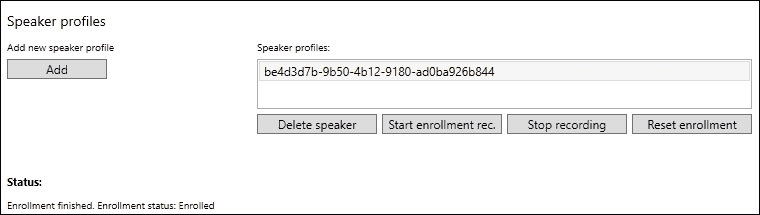
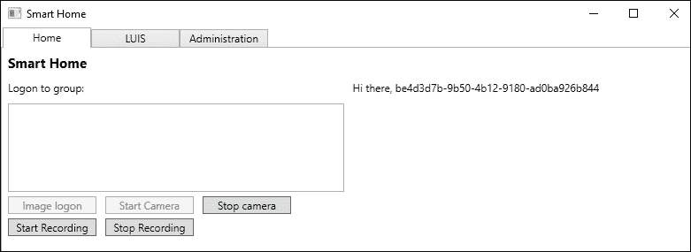
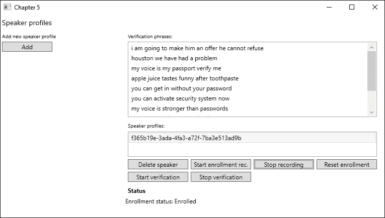
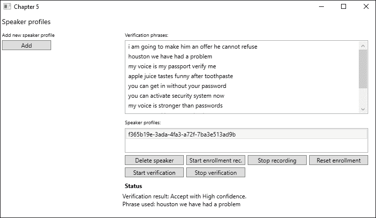

# 第五章. 与应用程序对话

在上一章中，我们学习了如何根据话语发现和理解用户的意图。在本章中，我们将学习如何为我们的应用程序添加音频功能，将文本转换为语音和语音转换为文本，以及如何识别说话者。在本章中，我们将学习如何利用语音音频来验证一个人。最后，我们将简要介绍如何自定义语音识别，使其适用于您的应用程序的使用。

到本章结束时，我们将涵盖以下主题：

+   将语音音频转换为文本和文本转换为语音音频

+   通过利用 LUIS 识别语音音频中的意图

+   验证说话者是否为其声称的身份

+   识别说话者

+   定制说话者识别 API 以识别自定义说话风格和环境

# 文本到音频和音频到文本的转换

在第一章 *使用 Microsoft 认知服务入门* 中，我们使用了 Bing Speech API 的一部分。我们给了示例应用程序说句子的能力。现在我们将使用在那个示例中创建的代码，但我们将更深入地探讨细节。

我们还将介绍 Bing Speech API 的另一个功能，即将语音音频转换为文本。想法是我们可以对智能屋应用程序说话，该应用程序将识别我们在说什么。使用文本输出，应用程序将使用 LUIS 来收集我们句子的意图。如果 LUIS 需要更多信息，应用程序将通过音频礼貌地要求我们提供更多信息。

要开始，我们希望修改智能屋应用程序的构建定义。我们需要指定我们是在 32 位还是 64 位操作系统上运行它。为了利用语音到文本转换，我们希望安装 Bing Speech NuGet 客户端包。搜索 `Microsoft.ProjectOxford.SpeechRecognition` 并根据您的系统安装 32 位版本或 64 位版本。

进一步，我们需要添加对 `System.Runtime.Serialization` 和 `System.Web` 的引用。这些引用是必要的，以便我们能够进行网络请求并反序列化来自 API 的响应数据。

## 与应用程序对话

在 `Model` 文件夹中添加一个新文件，命名为 `SpeechToText.cs`。在自动创建的 `SpeechToText` 类下面，我们希望添加一个名为 `SttStatus` 的 `enum` 类型变量。它应该有两个值，`Success` 和 `Error`。

此外，我们希望定义一个用于我们在执行期间将引发的事件的 `EventArgs` 类。在文件底部添加以下类：

```py
    public class SpeechToTextEventArgs : EventArgs
    {
        public SttStatus Status { get; private set; }
        public string Message { get; private set; }
        public List<string> Results { get; private set; }

        public SpeechToTextEventArgs(SttStatus status, 
        string message, List<string> results = null)
        {
            Status = status;
            Message = message;
            Results = results;
        }
    }
```

如您所见，`event` 参数将包含操作状态、任何类型的消息以及一个字符串列表。这将是一个包含潜在语音到文本转换的列表。

`SpeechToText` 类需要实现 `IDisposable`。这样做是为了我们可以清理用于记录语音音频的资源并正确关闭应用程序。我们将在稍后添加详细信息，所以现在只需确保添加 `Dispose` 函数。

现在，我们需要在类中定义一些私有成员，以及一个事件：

```py
    public event EventHandler<SpeechToTextEventArgs> OnSttStatusUpdated;

    private DataRecognitionClient _dataRecClient;
    private MicrophoneRecognitionClient _micRecClient;
    private SpeechRecognitionMode _speechMode = SpeechRecognitionMode.ShortPhrase;

    private string _language = "en-US";
    private bool _isMicRecording = false;
```

当我们有新的操作状态时，`OnSttStatusUpdated` 事件将被触发。`DataRecognitionClient` 和 `MicrophoneRecognitionClient` 是我们可以用来调用 Bing 语音 API 的两个对象。我们将现在看看它们是如何创建的。

我们将 `SpeechRecognitionMode` 定义为 `ShortPhrase`。这意味着我们不会期望任何超过 15 秒的语音句子。另一种选择是 `LongDictation`，这意味着我们可以将语音句子转换成长达 2 分钟的长度。

最后，我们指定语言为英语，并定义一个 `bool` 类型的变量，该变量表示我们是否正在记录任何内容。

在我们的构造函数中，我们接受 Bing 语音 API 密钥作为参数。我们将在创建我们的 API 客户端时使用它：

```py
    public SpeechToText(string bingApiKey)
    {
        _dataRecClient = SpeechRecognitionServiceFactory.CreateDataClientWithIntentUsingEndpointUrl(_language, bingApiKey, "LUIS_ROOT_URI");

        _micRecClient = SpeechRecognitionServiceFactory.CreateMicrophoneClient(_speechMode, _language, bingApiKey);

        Initialize();
    }
```

如您所见，我们通过调用 `SpeechRecognitionServiceFactory` 创建了 `_dataRecClient` 和 `_micRecClient`。对于第一个客户端，我们声明我们想要使用意图识别。所需的参数包括语言、Bing API 密钥、LUIS 应用 ID 和 LUIS API 密钥。通过使用 `DataRecognitionClient` 对象，我们可以上传带有语音的音频文件。

通过使用 `MicrophoneRecognitionClient`，我们可以使用麦克风进行实时转换。为此，我们不想进行意图检测，因此调用 `CreateMicrophoneClient`。在这种情况下，我们只需要指定语音模式、语言和 Bing 语音 API 密钥。

在离开构造函数之前，我们调用 `Initialize` 函数。在这个函数中，我们为每个客户端订阅某些事件：

```py
    private void Initialize()
    {
        _micRecClient.OnMicrophoneStatus += OnMicrophoneStatus;
        _micRecClient.OnPartialResponseReceived += OnPartialResponseReceived;
        _micRecClient.OnResponseReceived += OnResponseReceived;
        _micRecClient.OnConversationError += OnConversationErrorReceived;

        _dataRecClient.OnIntent += OnIntentReceived;
        _dataRecClient.OnPartialResponseReceived +=
        OnPartialResponseReceived;
        _dataRecClient.OnConversationError += OnConversationErrorReceived;
        _dataRecClient.OnResponseReceived += OnResponseReceived;
    }
```

如您所见，这两个客户端之间有很多相似之处。两个不同之处在于 `_dataRecClient` 将通过 `OnIntent` 事件获取意图，而 `_micRecClient` 将通过 `OnMicrophoneStatus` 事件获取麦克风状态。

我们并不真正关心部分响应。然而，在某些情况下，它们可能很有用，因为它们将连续给出当前完成的转换：

```py
    private void OnPartialResponseReceived(object sender, PartialSpeechResponseEventArgs e)
    {
        Debug.WriteLine($"Partial response received:{e.PartialResult}");
    } 
```

对于我们的应用，我们将选择将其输出到调试控制台窗口。在这种情况下，`PartialResult` 是一个包含部分转换文本的字符串：

```py
private void OnMicrophoneStatus(object sender, MicrophoneEventArgs e)
{
    Debug.WriteLine($"Microphone status changed to recording: {e.Recording}");
}
```

我们也不关心当前的麦克风状态。同样，我们将状态输出到调试控制台窗口。

在继续之前，添加一个名为 `RaiseSttStatusUpdated` 的辅助函数。当被调用时，它应该引发 `OnSttStatusUpdated`。

当我们调用 `_dataRecClient` 时，我们可能会从 LUIS 识别意图。在这些情况下，我们想要引发一个事件，其中输出识别到的意图。这是通过以下代码完成的：

```py
private void OnIntentReceived(object sender, SpeechIntentEventArgs e)
{
    SpeechToTextEventArgs args = new SpeechToTextEventArgs(SttStatus.Success, $"Intent received: {e.Intent.ToString()}.\n Payload: {e.Payload}");
    RaiseSttStatusUpdated(args);
}
```

我们选择打印出意图信息和`Payload`。这是一个包含从 LUIS 触发的识别实体、意图和动作的字符串。

如果转换过程中发生任何错误，我们将想要做几件事情。首先，我们想要停止可能正在运行的任何麦克风录音。如果当前操作失败，尝试转换更多内容实际上是没有意义的：

```py
    private void OnConversationErrorReceived(object sender, SpeechErrorEventArgs e)
    {
        if (_isMicRecording) StopMicRecording();
```

我们将立即创建`StopMicRecording`。

此外，我们想要通知任何订阅者转换失败。在这种情况下，我们想要提供有关错误代码和错误消息的详细信息：

```py
        string message = $"Speech to text failed with status code:{e.SpeechErrorCode.ToString()}, and error message: {e.SpeechErrorText}";

        SpeechToTextEventArgs args = new SpeechToTextEventArgs(SttStatus.Error, message);

        RaiseSttStatusUpdated(args);
    }
```

幸运的是，`OnConversationError`事件为我们提供了关于任何错误的详细信息。

现在，让我们看看`StopMicRecording`方法：

```py
    private void StopMicRecording()
    {
        _micRecClient.EndMicAndRecognition();
        _isMicRecording = false;
    }
```

这是一个简单的函数，它会在`_micRecClient MicrophoneRecognitionClient`对象上调用`EndMicAndRecognition`。当这个函数被调用时，我们将停止客户端的录音。

我们需要创建的最后一个事件处理程序是`OnResponseReceived`处理程序。这将在我们从服务接收到完整、转换后的响应时被触发。

再次强调，如果我们正在录音，我们想要确保不再记录任何内容：

```py
    private void OnResponseReceived(object sender, SpeechResponseEventArgs e)
    {
        if (_isMicRecording) StopMicRecording();
```

`SpeechResponseEventArgs`参数包含一个`PhraseResponse`对象。它包含一个`RecognizedPhrase`数组，我们想要访问。数组中的每个项目都包含正确转换的置信度。它还包含作为`DisplayText`的转换后的短语。这使用逆文本归一化、正确的首字母大小写和标点符号，并用星号屏蔽亵渎性词汇：

```py
    RecognizedPhrase[] recognizedPhrases = e.PhraseResponse.Results;
    List<string> phrasesToDisplay = new List<string>();

    foreach(RecognizedPhrase phrase in recognizedPhrases)
    {
        phrasesToDisplay.Add(phrase.DisplayText);
    }
```

我们可能还会以以下表格中描述的其他格式获得转换后的短语：

| 格式 | 描述 |
| --- | --- |
| `LexicalForm` | 这是原始的、未经处理的识别结果。 |
| `InverseTextNormalizationResult` | 这将短语如*one two three four*显示为*1234*，因此它非常适合像*go to second street*这样的用途。 |
| `MaskedInverseTextNormalizationResult` | 逆文本归一化和亵渎性屏蔽。不应用首字母大小写或标点符号。 |

对于我们的使用，我们只对`DisplayText`感兴趣。有了识别短语列表，我们将引发状态更新事件：

```py
        SpeechToTextEventArgs args = new SpeechToTextEventArgs(SttStatus.Success, $"STT completed with status: {e.PhraseResponse.RecognitionStatus.ToString()}", phrasesToDisplay);

        RaiseSttStatusUpdated(args);
    }
```

为了能够使用这个类，我们需要几个公共函数，这样我们就可以开始语音识别：

```py
    public void StartMicToText()
    {
        _micRecClient.StartMicAndRecognition();
        _isMicRecording = true;
    }
```

`StartMicToText`方法将在`_micRecClient`对象上调用`StartMicAndRecognition`方法。这将允许我们使用麦克风将语音音频转换。这个函数将成为我们访问此 API 的主要方式：

```py
    public void StartAudioFileToText(string audioFileName) {
        using (FileStream fileStream = new FileStream(audioFileName, FileMode.Open, FileAccess.Read))
        {
            int bytesRead = 0;
            byte[] buffer = new byte[1024];
```

第二个函数将需要一个音频文件的文件名，这是我们想要转换的音频。我们以读取权限打开文件，并准备好读取它：

```py
    try {
        do {
            bytesRead = fileStream.Read(buffer, 0, buffer.Length);
            _dataRecClient.SendAudio(buffer, bytesRead);
        } while (bytesRead > 0);
    }
```

只要我们有可用数据，我们就从文件中读取。我们将填充`buffer`，并调用`SendAudio`方法。这将触发服务中的识别操作。

如果发生任何异常，我们确保将异常消息输出到调试窗口。最后，我们需要调用`EndAudio`方法，以便服务不等待任何更多数据：

```py
    catch(Exception ex) {
        Debug.WriteLine($"Exception caught: {ex.Message}");
    }
    finally {
        _dataRecClient.EndAudio();
    }
```

在离开这个班级之前，我们需要处理我们的 API 客户端。在`Dispose`函数中添加以下内容：

```py
    if (_micRecClient != null) {
        _micRecClient.EndMicAndRecognition();
        _micRecClient.OnMicrophoneStatus -= OnMicrophoneStatus;
        _micRecClient.OnPartialResponseReceived -= OnPartialResponseReceived;
        _micRecClient.OnResponseReceived -= OnResponseReceived;
        _micRecClient.OnConversationError -= OnConversationErrorReceived;

       _micRecClient.Dispose();
       _micRecClient = null;
    }

    if(_dataRecClient != null) {
        _dataRecClient.OnIntent -= OnIntentReceived;
        _dataRecClient.OnPartialResponseReceived -= OnPartialResponseReceived;
        _dataRecClient.OnConversationError -= OnConversationErrorReceived;
        _dataRecClient.OnResponseReceived -= OnResponseReceived;

        _dataRecClient.Dispose();
        _dataRecClient = null;
    }
```

我们停止麦克风录音，取消订阅所有事件，并销毁和清除客户端对象。

确保在继续之前应用程序已经编译。我们现在将探讨如何使用这个类。

## 允许应用程序进行语音反馈

我们已经看到了如何使应用程序对我们说话。我们将使用我们在第一章中创建的相同类，*使用 Microsoft 认知服务入门*。从第一章的示例项目中复制`Authentication.cs`和`TextToSpeech.cs`到`Model`文件夹中。确保相应地更改命名空间。

由于我们已经通过了代码，我们不会再次进行审查。相反，我们将查看第一章中省略的一些细节，*使用 Microsoft 认知服务入门*。

### 音频输出格式

音频输出格式可以是以下格式之一：

+   `raw-8khz-8bit-mono-mulaw`

+   `raw-16khz-16bit-mono-pcm`

+   `riff-8khz-8bit-mono-mulaw`

+   `riff-16khz-16bit-mono-pcm`

### 错误代码

在调用 API 时可能会出现四种可能的错误代码。这些代码在以下表格中描述：

| 代码 | 描述 |
| --- | --- |
| `400 / BadRequest` | 缺少必需的参数，为空或为 null。或者，参数无效。一个例子可能是一个超过允许长度的字符串。 |
| `401 / Unauthorized` | 请求未授权。 |
| `413 / RequestEntityTooLarge` | SSML 输入大于支持的大小。 |
| `502 / BadGateway` | 与网络或服务器相关的问题。 |

### 支持的语言

支持以下语言：

英语（澳大利亚），英语（英国），英语（美国），英语（加拿大），英语（印度），西班牙语，墨西哥西班牙语，德语，阿拉伯语（埃及），法语，加拿大法语，意大利语，日语，葡萄牙语，俄语，中文（简体），中文（香港），中文（繁体）。

## 基于语音命令利用 LUIS

为了利用我们刚刚添加的功能，我们将修改`LuisView`和`LuisViewModel`。在视图中添加一个新的`Button`，这将确保我们记录命令。在视图模型中添加相应的`ICommand`。

我们还需要向类中添加一些其他成员：

```py
    private SpeechToText _sttClient;
    private TextToSpeech _ttsClient;
    private string _bingApiKey = "BING_SPEECH_API_KEY";
```

前两个将用于将语音音频和文本之间进行转换。第三个是 Bing 语音 API 的 API 密钥。

让视图模型实现`IDisposable`，并显式销毁`SpeechToText`对象。

通过在构造函数中添加以下内容来创建对象：

```py
_sttClient = new SpeechToText(_bingApiKey);
_sttClient.OnSttStatusUpdated += OnSttStatusUpdated;

_ttsClient = new TextToSpeech();
_ttsClient.OnAudioAvailable += OnTtsAudioAvailable;
_ttsClient.OnError += OnTtsError;
GenerateHeaders();
```

这将创建客户端对象并订阅所需的事件。最后，它将调用一个函数来生成用于 REST API 调用的身份验证令牌。此函数应如下所示：

```py
private async void GenerateHeaders()
{
   if (await _ttsClient.GenerateAuthenticationToken(_bingApiKey))
   _ttsClient.GenerateHeaders();
}
```

如果我们从 `_ttsClient` 收到任何错误，我们希望将其输出到调试控制台：

```py
    private void OnTtsError(object sender, AudioErrorEventArgs e)
    {
        Debug.WriteLine($"Status: Audio service failed - {e.ErrorMessage}");
    }
```

我们不需要将此输出到 UI，因为这只是一个可选功能。

如果我们有音频可用，我们想确保播放它。我们通过创建一个 `SoundPlayer` 对象来实现这一点：

```py
    private void OnTtsAudioAvailable(object sender, AudioEventArgs e)
    {
        SoundPlayer player = new SoundPlayer(e.EventData);
        player.Play();
        e.EventData.Dispose();
    }
```

使用从事件参数中获得的音频流，我们可以播放音频给用户。

如果我们收到 `_sttClient` 的状态更新，我们想在文本框中显示此信息。

如果我们成功识别了语音音频，我们希望显示可用的 `Message` 字符串：

```py
    private void OnSttStatusUpdated(object sender, SpeechToTextEventArgs e) {
        Application.Current.Dispatcher.Invoke(() =>  {
            StringBuilder sb = new StringBuilder();

            if(e.Status == SttStatus.Success) {
               if(!string.IsNullOrEmpty(e.Message)) {
                   sb.AppendFormat("Result message: {0}\n\n", e.Message);
                }
```

我们还希望显示所有识别出的短语。使用第一个可用的短语，我们调用 LUIS：

```py
        if(e.Results != null && e.Results.Count != 0) {
            sb.Append("Retrieved the following results:\n");
                foreach(string sentence in e.Results) {
                    sb.AppendFormat("{0}\n\n", sentence);
                }
                sb.Append("Calling LUIS with the top result\n");
                CallLuis(e.Results.FirstOrDefault());
            }
        }
```

如果识别失败，我们打印出可能有的任何错误消息。最后，我们确保 `ResultText` 被更新为新的数据：

```py
            else {
                sb.AppendFormat("Could not convert speech to text:{0}\n", e.Message);
            }

            sb.Append("\n");
            ResultText = sb.ToString();
        });
    }
```

新创建的 `ICommand` 需要一个启动识别过程的功能：

```py
    private void RecordUtterance(object obj) {
        _sttClient.StartMicToText();
    }
```

函数开始麦克风录音。

最后，我们需要对 `OnLuisUtteranceResultUpdated` 进行一些修改。进行以下修改，其中我们输出任何 `DialogResponse`：

```py
    if (e.RequiresReply && !string.IsNullOrEmpty(e.DialogResponse))
    {
        await _ttsClient.SpeakAsync(e.DialogResponse, CancellationToken.None);
        sb.AppendFormat("Response: {0}\n", e.DialogResponse);
        sb.Append("Reply in the left textfield");

        RecordUtterance(sender);
    }
    else
    {
        await _ttsClient.SpeakAsync($"Summary: {e.Message}", CancellationToken.None);
    }
```

如果存在 `DialogResponse`，这将播放它。如果需要，应用程序将要求您提供更多信息。然后它将开始录音，这样我们就可以在不点击任何按钮的情况下回答。

如果不存在 `DialogResponse`，我们只需让应用程序向我们说出摘要。这将包含来自 LUIS 的意图、实体和动作数据。

# 知道谁在说话

使用 **说话人识别** API，我们可以识别正在说话的人。通过定义一个或多个带有相应样本的说话人配置文件，我们可以识别在任何时候是否有任何人在说话。

为了能够利用此功能，我们需要进行几个步骤：

1.  我们需要向服务添加一个或多个说话人配置文件。

1.  每个说话人配置文件注册了几个语音样本。

1.  我们调用服务以根据音频输入识别说话人。

如果您还没有这样做，请在 [`portal.azure.com`](https://portal.azure.com) 为说话人识别 API 注册一个 API 密钥。

首先，向您的智能屋应用程序添加一个新的 NuGet 包。搜索并添加 `Microsoft.ProjectOxford.SpeakerRecognition`。

在您的项目 `Model` 文件夹中添加一个名为 `SpeakerIdentification` 的新类。此类将包含与说话人识别相关的所有功能。

在类别下方，我们将添加另一个类别，包含用于状态更新的 `EventArgs`：

```py
    public class SpeakerIdentificationStatusUpdateEventArgs : EventArgs
    {
        public string Status { get; private set; }
        public string Message { get; private set; }
        public Identification IdentifiedProfile { get; set; }

        public SpeakerIdentificationStatusUpdateEventArgs (string status, string message)
       { 
           Status = status;
           Message = message;
       }
    }
```

前两个属性应该是显而易见的。最后一个，`IdentificationProfile`，将包含成功识别过程的结果。我们将现在查看它包含哪些信息。

我们还希望发送错误事件，因此让我们添加一个`EventArgs`类来存储所需的信息：

```py
    public class SpeakerIdentificationErrorEventArgs : EventArgs {
        public string ErrorMessage { get; private set; }

        public SpeakerIdentificationErrorEventArgs(string errorMessage)
        {
            ErrorMessage = errorMessage;
        }
    }
```

再次强调，属性应该是自解释的。

在`SpeakerIdentification`类中，在类顶部添加两个事件和一个私有成员：

```py
    public event EventHandler <SpeakerIdentificationStatusUpdateEventArgs>
        OnSpeakerIdentificationStatusUpdated;
    public event EventHandler <SpeakerIdentificationErrorEventArgs>
        OnSpeakerIdentificationError;

    private ISpeakerIdentificationServiceClient _speakerIdentificationClient;
```

如果我们有任何状态更新、成功识别或错误，事件将被触发。`ISpeakerIdentificationServiceClient`对象是访问演讲者识别 API 的入口点。通过构造函数注入此对象。

为了更容易触发事件，添加两个辅助函数，每个事件一个。将这些函数命名为`RaiseOnIdentificationStatusUpdated`和`RaiseOnIdentificationError`。它们应该接受相应的`EventArgs`对象作为参数并触发相应的事件。

## 添加演讲者配置文件

为了能够识别演讲者，我们需要添加配置文件。每个配置文件可以看作是一个独特的人，我们可以在以后识别。

在撰写本文时，每个订阅允许创建 1,000 个演讲者配置文件。这还包括为验证创建的配置文件，我们将在下面查看。

为了便于创建配置文件，我们需要向我们的`AdministrationView`和`AdministrationViewModel`属性中添加一些元素，因此请打开这些文件。

在视图中，添加一个用于添加演讲者配置文件的新按钮。还要添加一个列表框，它将显示所有我们的配置文件。如何布局 UI 取决于你。

ViewModel 需要一个新`ICommand`属性用于按钮。它还需要一个`ObservableObject`属性用于我们的配置文件列表；确保它是`Guid`类型。我们还需要能够选择一个配置文件，因此添加一个用于所选配置文件的`Guid`属性。

此外，我们还需要向 ViewModel 添加一个新成员：

```py
    private SpeakerIdentification _speakerIdentification;
```

这是我们之前创建的类的引用。在构造函数中创建此对象，传递一个`ISpeakerIdentificationServiceClient`对象，该对象通过 ViewModel 的构造函数注入。在构造函数中，你还应该订阅我们创建的事件：

```py
    _speakerIdentification.OnSpeakerIdentificationError += OnSpeakerIdentificationError;
    _speakerIdentification.OnSpeakerIdentificationStatusUpdated += OnSpeakerIdentificationStatusUpdated;
```

基本上，我们希望两个事件处理程序都更新状态文本，以包含它们携带的消息：

```py
    Application.Current.Dispatcher.Invoke(() => 
    {
        StatusText = e.Message;
    });
```

上述代码是用于`OnSpeakerIdentificationStatusUpdated`的。对于`OnSpeakerIdentificationError`也应使用相同的代码，但将`StatusText`设置为`e.ErrorMessage`。

在为我们的`ICommand`属性创建的函数中，我们执行以下操作以创建一个新的配置文件：

```py
    private async void AddSpeaker(object obj)
    {
        Guid speakerId = await _speakerIdentification.CreateSpeakerProfile();
```

我们调用我们的`_speakerIdentification`对象的`CreateSpeakerProfile`函数。此函数将返回一个`Guid`，这是该演讲者的唯一 ID。在我们的示例中，我们不做任何进一步的操作。在实际应用中，我建议以某种方式将此 ID 映射到名称。正如你将看到的，通过 GUID 识别人是为机器，而不是人：

```py
        GetSpeakerProfiles();
    }
```

我们通过调用我们将在下面创建的`GetSpeakerProfile`函数来完成此函数。这将获取我们创建的所有配置文件的列表，以便我们可以在后续过程中使用这些信息：

```py
    private async void GetSpeakerProfiles()
    {
        List<Guid> profiles = await _speakerIdentification.ListSpeakerProfiles();

        if (profiles == null) return;
```

在我们的 `GetSpeakerProfiles` 函数中，我们在 `_speakerIdentification` 对象上调用 `ListSpeakerProfiles`。这将，正如我们目前所看到的，获取一个包含资料 ID 的 GUID 列表。如果这个列表为空，就没有继续的必要：

```py
        foreach(Guid profile in profiles)
        {
            SpeakerProfiles.Add(profile);
        }
    }
```

如果列表中包含任何内容，我们将这些 ID 添加到我们的 `SpeakerProfiles` 中，这是一个 `ObservableCollection` 属性。这将显示我们所有的资料在 UI 中。

此函数也应从 `Initialize` 函数中调用，因此我们在启动应用程序时填充列表。

在 `SpeakerIdentification` 类中，创建一个名为 `CreateSpeakerProfile` 的新函数。这个函数应该有 `Task<Guid>` 返回类型，并标记为 `async`：

```py
    public async Task<Guid> CreateSpeakerProfile()
    {
        try
        {
            CreateProfileResponse response = await _speakerIdentificationClient.CreateProfileAsync("en-US");
```

然后，我们将对 API 对象调用 `CreateProfileAsync`。我们需要指定用于演讲者资料的区域设置。在编写本文时，`en-US` 是唯一有效的选项。

如果调用成功，我们将收到一个 `CreateProfileResponse` 对象作为响应。这个对象包含新创建的演讲者资料的 ID：

```py
       if (response == null)
      {
         RaiseOnIdentificationError(
            new SpeakerIdentificationErrorEventArgs
               ("Failed to create speaker profile."));
         return Guid.Empty;
      }

      return response.ProfileId;
   }
```

如果 `response` 为空，我们引发一个错误事件。如果它包含数据，我们将返回 `ProfileId` 给调用者。

添加相应的 `catch` 子句以完成函数。

创建一个名为 `ListSpeakerProfile` 的新函数。这个函数应该返回 `Task<List<Guid>>` 并标记为 `async`：

```py
    public async Task<List<Guid>> ListSpeakerProfiles()
    {
        try
        {
            List<Guid> speakerProfiles = new List<Guid>();

            Profile[] profiles = await _speakerIdentificationClient.GetProfilesAsync();
```

然后，我们将创建一个类型为 `Guid` 的列表，这是我们将要返回的演讲者资料列表。然后，我们在 `_speakerIdentificationClient` 对象上调用 `GetProfilesAsync` 方法。这将给我们一个类型为 `Profile` 的数组，其中包含每个资料的信息。这些信息包括创建时间、注册状态、最后修改等。我们感兴趣的是每个资料的 ID：

```py
            if (profiles == null || profiles.Length == 0)
            {
                RaiseOnIdentificationError(new SpeakerIdentificationErrorEventArgs("No profiles exist"));
                return null;
            }

            foreach (Profile profile in profiles)
            {
                speakerProfiles.Add(profile.ProfileId);
            }

            return speakerProfiles;
        }
```

如果返回任何资料，我们将遍历数组，并将每个 `profileId` 添加到之前创建的列表中。然后，将此列表返回给调用者，在我们的例子中将是 ViewModel。

使用相应的 `catch` 子句结束函数。在继续之前，确保代码能够编译并按预期执行。这意味着你现在应该能够将演讲者资料添加到服务中，并在 UI 中显示创建的资料。

要删除演讲者资料，我们需要在 `SpeakerIdentification` 中添加一个新函数。将此函数命名为 `DeleteSpeakerProfile`，并让它接受一个 `Guid` 作为其参数。这将是我们想要删除的给定资料的 ID。将函数标记为 `async`。函数看起来应该如下所示：

```py
public async void DeleteSpeakerProfile(Guid profileId)
{
   try
   {
      await _speakerIdentificationClient.DeleteProfileAsync(profileId);
   }
   catch (IdentificationException ex)
   {
      RaiseOnIdentificationError(new SpeakerIdentificationErrorEventArgs($"Failed to
      delete speaker profile: {ex.Message}"));
   }
   catch (Exception ex)
   {
      RaiseOnIdentificationError(new SpeakerIdentificationErrorEventArgs($"Failed to
      delete speaker profile: {ex.Message}"));
   }
}
```

如您所见，调用 `DeleteProfileAsync` 方法期望一个 `Guid` 类型的 `profileId`。没有返回值，因此当我们调用此函数时，我们需要在我们的 ViewModel 中调用 `GetSpeakerProfile` 方法。

为了便于删除演讲者资料，向 UI 添加一个新按钮，并在 ViewModel 中添加相应的 `ICommand` 属性。

## 注册个人资料

在设置好扬声器配置文件后，我们需要将语音音频与配置文件关联起来。我们通过一个称为**注册**的过程来完成这个任务。对于扬声器识别，注册是文本无关的。这意味着你可以使用任何句子进行注册。一旦录音完成，将提取一系列特征来形成一个独特的声纹。

在注册时，你使用的音频文件必须至少 5 秒，最多 5 分钟。最佳实践建议你至少积累 30 秒的语音。这是在移除静音后的 30 秒，因此可能需要多个音频文件。我们可以通过指定一个额外的参数来避免这个建议，正如我们接下来将要看到的。

你选择如何上传音频文件取决于你。在智能家居应用程序中，我们将使用麦克风来录制实时音频。为此，我们需要添加一个新的 NuGet 包，名为**NAudio**。这是一个.NET 的音频库，它简化了音频工作。

我们还需要一个处理录音的类，这超出了本书的范围。因此，我建议你复制`Recording.cs`文件，该文件可以在示例项目的`Model`文件夹中找到。

在`AdministrationViewModel` ViewModel 中，添加一个新复制的类的私有成员。创建这个类并订阅在`Initialize`函数中定义的事件：

```py
    _recorder = new Recording();
    _recorder.OnAudioStreamAvailable += OnRecordingAudioStreamAvailable;
    _recorder.OnRecordingError += OnRecordingError;
```

我们有一个错误事件和一个可用音频流事件。让`OnRecordingError`将`ErrorMessage`打印到状态文本字段。

在`OnAudioStreamAvailable`中添加以下内容：

```py
    Application.Current.Dispatcher.Invoke(() => 
    {               
        _speakerIdentification.CreateSpeakerEnrollment(e.AudioStream, SelectedSpeakerProfile);
    });
```

在这里，我们在`_speakerIdentification`对象上调用`CreateSpeakerEnrollment`。我们将在后面介绍这个函数。我们传递的参数包括从录音中获取的`AudioStream`以及所选配置文件的 ID。

为了能够获取用于注册的音频文件，我们需要开始和停止录音。这可以通过简单地添加两个新按钮来完成，一个用于开始，一个用于停止。然后它们需要执行以下操作：

```py
    _recorder.StartRecording();
    _recorder.StopRecording();
```

在`SpeakerIdentification.cs`文件中，我们需要创建一个新的函数`CreateSpeakerEnrollment`。这个函数应该接受`Stream`和`Guid`作为参数，并标记为`async`：

```py
    public async void CreateSpeakerEnrollment(Stream audioStream, Guid profileId) {
        try {
            OperationLocation location = await _speakerIdentificationClient.EnrollAsync(audioStream, profileId);
```

在这个函数中，我们在`_speakerIdentificationClient`上调用`EnrollAsync`函数。这个函数需要`audioStream`和`profileId`作为参数。一个可选的第三个参数是一个`bool`类型的变量，它让你决定是否使用推荐的语音长度。默认值是`false`，这意味着你使用至少 30 秒的语音推荐设置。

如果调用成功，我们将返回一个`OperationLocation`对象。这个对象包含一个 URL，我们可以通过它查询注册状态，这正是我们接下来要做的：

```py
        if (location == null) {
            RaiseOnIdentificationError(new SpeakerIdentificationErrorEventArgs("Failed to start enrollment process."));
            return;
        }

        GetEnrollmentOperationStatus(location);
    }
```

首先，我们确保我们有了 `location` 数据。如果没有它，就没有继续下去的意义。如果我们确实有 `location` 数据，我们调用一个函数，`GetEnrollmentOperationStatus`，指定 `location` 作为参数。

为完成函数，添加相应的 `catch` 子句。

`GetEnrollmentOperationStatus` 方法接受 `OperationLocation` 作为参数。当我们进入函数时，我们进入一个 `while` 循环，该循环将一直运行，直到操作完成。我们调用 `CheckEnrollmentStatusAsync`，指定 `location` 作为参数。如果这个调用成功，它将返回一个 `EnrollmentOperation` 对象，其中包含状态、注册语音时间和剩余注册时间的估计：

```py
    private async void GetEnrollmentOperationStatus(OperationLocation location) {
        try {
            while(true) { 
                EnrollmentOperation result = await _speakerIdentificationClient.CheckEnrollmentStatusAsync(location);
```

当我们检索到结果后，我们检查状态是否正在运行。如果不是，操作可能已失败、成功或尚未开始。在任何情况下，我们都不想进一步检查，因此我们发送一个包含状态的更新，并跳出循环：

```py
                if(result.Status != Status.Running)
                {
                    RaiseOnIdentificationStatusUpdated(new SpeakerIdentificationStatusUpdateEventArgs(result.Status.ToString(),
                    $"Enrollment finished. Enrollment status: {result.ProcessingResult.EnrollmentStatus.ToString()}"));
                    break;
                }

                RaiseOnIdentificationStatusUpdated(new SpeakerIdentificationStatusUpdateEventArgs(result.Status.ToString(), "Enrolling..."));
                await Task.Delay(1000);
            }
        }
```

如果状态仍然是正在运行，我们更新状态，并在再次尝试之前等待 1 秒。

注册完成后，可能会有需要重置给定个人资料注册的情况。我们可以在 `SpeakerIdentification` 中创建一个新函数。命名为 `ResetEnrollments`，并让它接受一个 `Guid` 作为参数。这应该是要重置的说话者个人资料的 ID。在 `try` 子句中执行以下操作：

```py
        await _speakerIdentificationClient .ResetEnrollmentsAsync(profileId);
```

这将删除与给定个人资料关联的所有音频文件，并重置注册状态。要调用此函数，请向 UI 添加一个新按钮，并在 ViewModel 中添加相应的 `ICommand` 属性。

如果您编译并运行应用程序，您可能会得到以下截图类似的结果：



## 识别说话者

最后一步是识别说话者，我们将在 `HomeView` 和相应的 `HomeViewModel` 中完成这项工作。我们不需要修改 UI 很多，但我们需要添加两个按钮来开始和停止录音。或者，如果您不使用麦克风，您可以使用一个按钮来浏览音频文件。无论如何，在 ViewModel 中添加相应的 `ICommand` 属性。

我们还需要为 `Recording` 和 `SpeakerIdentification` 类添加私有成员。这两个成员都应该在构造函数中创建，在那里我们应该注入 `ISpeakerIdentificationServiceClient`。

在 `Initialize` 函数中，订阅所需的事件：

```py
    _speakerIdentification.OnSpeakerIdentificationError += OnSpeakerIdentificationError;          
    _speakerIdentification.OnSpeakerIdentificationStatusUpdated += OnSpeakerIdentificationStatusReceived; 

    _recording.OnAudioStreamAvailable += OnSpeakerRecordingAvailable;
    _recording.OnRecordingError += OnSpeakerRecordingError;
```

对于两个错误事件处理器，`OnSpeakerRecordingError` 和 `OnSpeakerIdentificationError`，我们不想在这里打印错误信息。为了简单起见，我们只需将其输出到调试控制台窗口。

当我们录制了一些音频时，`OnSpeakerRecordingAvailable` 事件将被触发。这是将触发尝试识别说话者的事件处理器。

我们需要做的第一件事是获取说话者配置文件 ID 的列表。我们通过调用前面提到的`ListSpeakerProfiles`来实现这一点：

```py
    private async void OnSpeakerRecordingAvailable(object sender, RecordingAudioAvailableEventArgs e)
    {
        try
        {
            List<Guid> profiles = await _speakerIdentification.ListSpeakerProfiles();
```

使用说话者配置文件列表，我们在`_speakerIdentification`对象上调用`IdentifySpeaker`方法。我们将记录的音频流和配置文件列表作为参数传递给函数：

```py
            _speakerIdentification.IdentifySpeaker(e.AudioStream, profiles.ToArray());
        }
```

通过添加相应的`catch`子句来完成事件处理程序。

在`SpeakerIdentification.cs`文件中，我们添加新的函数`IdentifySpeaker`：

```py
    public async void IdentifySpeaker(Stream audioStream, Guid[] speakerIds)
    {
        try
        {
            OperationLocation location = await _speakerIdentificationClient.IdentifyAsync(audioStream, speakerIds);
```

函数应标记为`async`并接受一个`Stream`和一个`Guid`数组作为参数。为了识别说话者，我们在`_speakerIdentificationClient`对象上调用`IdentifyAsync`函数。这需要一个音频文件，以`Stream`的形式，以及一个配置文件 ID 数组。可选的第三个参数是一个`bool`，你可以用它来指示你是否想偏离推荐的语音长度。

如果调用成功，我们将返回一个`OperationLocation`对象。它包含一个我们可以用来检索当前识别过程状态的 URL：

```py
        if (location == null)
        { 
            RaiseOnIdentificationError(new SpeakerIdentificationErrorEventArgs ("Failed to identify speaker."));
            return;
        }
        GetIdentificationOperationStatus(location);                
    }
```

如果结果数据中没有内容，我们不想做任何其他事情。如果它包含数据，我们将它作为参数传递给`GetIdentificationOperationStatus`方法：

```py
     private async void GetIdentificationOperationStatus (OperationLocation location)
     {
         try
         { 
             while (true)
             {
                 IdentificationOperation result = await _speakerIdentificationClient.CheckIdentificationStatusAsync(location);
```

这个函数与`GetEnrollmentOperationStatus`非常相似。我们进入一个`while`循环，它将一直运行，直到操作完成。我们调用`CheckIdentificationStatusAsync`，传递`location`作为参数，得到`IdentificationOperation`作为结果。这将包含数据，如状态、已识别的配置文件 ID 和正确结果的置信度。

如果操作未运行，我们以状态消息和`ProcessingResult`引发事件。如果操作仍在运行，我们更新状态，并在 1 秒后再次尝试：

```py
            if (result.Status != Status.Running)
            {
                RaiseOnIdentificationStatusUpdated(new SpeakerIdentificationStatusUpdateEventArgs(result.Status.ToString(), $"Enrollment finished with message:{result.Message}.") { IdentifiedProfile = result.ProcessingResult });
                break;
            } 

            RaiseOnIdentificationStatusUpdated(new SpeakerIdentificationStatusUpdateEventArgs(result.Status.ToString(), "Identifying..."));

            await Task.Delay(1000);
        }
    }
```

在返回到`HomeViewModel`之前，添加相应的`catch`子句。

最后一个拼图是创建`OnSpeakerIdentificationStatusReceived`。在`HomeViewModel`中添加以下代码：

```py
    Application.Current.Dispatcher.Invoke(() => 
    {
        if (e.IdentifiedProfile == null) return;

        SystemResponse = $"Hi there,{e.IdentifiedProfile.IdentifiedProfileId}";
    });
```

我们需要检查是否有一个已识别的配置文件。如果没有，我们离开函数。如果有已识别的配置文件，我们向屏幕给出响应，说明是谁。

就像应用的管理端一样，这是一个方便的地方，可以有一个名称到配置文件 ID 的映射。正如以下结果截图所示，在众多`GUID`中识别一个并不容易：



# 通过语音验证一个人

验证一个人是否是他们所声称的是一个非常类似的过程。为了展示如何进行，我们将创建一个新的示例项目，因为我们不需要在智能屋应用中实现这个功能。

将 `Microsoft.ProjectOxford.SpeakerRecognition` 和 `NAudio` NuGet 包添加到项目中。我们需要之前使用的 `Recording` 类，因此从智能家居应用的 `Model` 文件夹中复制此内容。

打开 `MainView.xaml` 文件。为了示例能够工作，我们需要在 UI 中添加一些元素。添加一个 `Button` 元素以添加演讲者配置文件。添加两个 `Listbox` 元素。一个将保存可用的验证短语，而另一个将列出我们的演讲者配置文件。

添加用于删除配置文件、开始和停止注册录音、重置注册以及开始/停止验证录音的 `Button` 元素。

在 ViewModel 中，你需要添加两个 `ObservableCollection` 属性：一个类型为 `string`，另一个类型为 `Guid`。一个将包含可用的验证短语，而另一个将包含演讲者配置文件列表。你还需要一个属性用于选择演讲者配置文件，我们还想添加一个字符串属性以显示状态。

ViewModel 还需要七个 `ICommand` 属性，每个按钮一个。

在 `Model` 文件夹中创建一个新的类，命名为 `SpeakerVerification`。在此类下创建两个新类，在同一文件中。

第一个是当我们抛出状态更新事件时将传递的事件参数。如果设置，`Verification` 属性将保存验证结果，我们将在下面看到：

```py
    public class SpeakerVerificationStatusUpdateEventArgs : EventArgs
    {
        public string Status { get; private set; }
        public string Message { get; private set; }
        public Verification VerifiedProfile { get; set; }

       public SpeakerVerificationStatusUpdateEventArgs(string status,string message)
       {
           Status = status;
           Message = message;
       }
    }
```

下一个类是一个泛型事件参数，当抛出错误事件时使用。在 `SpeakerVerification` 本身中，添加以下事件：

```py
    public class SpeakerVerificationErrorEventArgs : EventArgs
    {
        public string ErrorMessage { get; private set; }

        public SpeakerVerificationErrorEventArgs(string errorMessage)
        {
            ErrorMessage = errorMessage;
        }
    }
```

为了方便起见，添加辅助函数来引发这些事件。将它们命名为 `RaiseOnVerificationStatusUpdated` 和 `RaiseOnVerificationError`。在每个函数中引发正确的事件：

```py
    public event EventHandler <SpeakerVerificationStatusUpdateEventArgs> OnSpeakerVerificationStatusUpdated;

    public event EventHandler<SpeakerVerificationErrorEventArgs> OnSpeakerVerificationError;
```

我们还需要添加一个名为 `ISpeakerVerificationServiceClient` 的私有成员。它将负责调用 API。我们通过构造函数注入它。

向类中添加以下函数：

+   `CreateSpeakerProfile`：无参数，异步函数，返回类型 `Task<Guid>`

+   `ListSpeakerProfile`：无参数，异步函数，返回类型 `Task<List<Guid>>`

+   `DeleteSpeakerProfile`：必需参数为 `Guid`，异步函数，无返回值

+   `ResetEnrollments`：必需参数为 `Guid`，异步函数，无返回值

这些函数的内容可以从智能家居应用中的相应函数复制，因为它们完全相同。唯一的区别是，你需要将 API 调用从 `_speakerIdentificationClient` 更改为 `_speakerVerificationClient`。此外，引发事件将需要新创建的事件参数。

接下来，我们需要一个函数来列出验证短语。这些是支持用于验证的短语。在注册配置文件时，你必须说出列表中的句子之一。

创建一个名为 `GetVerificationPhrase` 的函数。让它返回 `Task<List<string>>`，并标记为 `async`：

```py
    public async Task<List<string>> GetVerificationPhrase()
    {
        try
        {
            List<string> phrases = new List<string>();

            VerificationPhrase[] results = await _speakerVerificationClient.GetPhrasesAsync("en-US");
```

我们将调用`GetPhrasesAsync`，指定我们想要的短语语言。在撰写本文时，英语是唯一的选择。

如果这个调用成功，我们将返回一个包含`VerificationPhrases`数组的数组。该数组中的每个元素都包含以下短语的字符串：

```py
            foreach(VerificationPhrase phrase in results) {
                phrases.Add(phrase.Phrase);
            }
            return phrases;
        }
```

我们遍历数组并将短语添加到我们的列表中，我们将将其返回给调用者。

因此，我们已经创建了一个配置文件，并且我们有可能的验证短语列表。现在，我们需要进行注册。为了注册，服务要求每个说话者至少有三次注册。这意味着您选择一个短语并至少注册三次。

在进行注册时，强烈建议使用您将用于验证的相同录音设备。

创建一个名为`CreateSpeakerEnrollment`的新函数。这应该需要一个`Stream`和一个`Guid`。第一个参数是用于注册的音频。后者是我们注册的配置文件 ID。该函数应标记为`async`，并且没有返回值：

```py
    public async void CreateSpeakerEnrollment(Stream audioStream, Guid profileId) {
        try {
            Enrollment enrollmentStatus = await _speakerVerificationClient.EnrollAsync(audioStream, profileId);
```

当我们调用`EnrollAsync`时，我们传递`audioStream`和`profileId`参数。如果调用成功，我们将返回一个`Enrollment`对象。它包含注册的当前状态，并指定在完成过程之前需要添加的注册次数。

如果`enrollmentStatus`为 null，我们退出函数并通知任何订阅者。如果我们确实有状态数据，我们将引发事件以通知它有状态更新，并指定当前状态：

```py
            if (enrollmentStatus == null) {
                RaiseOnVerificationError(new SpeakerVerificationErrorEventArgs("Failed to start enrollment process."));
                return;
            }

           RaiseOnVerificationStatusUpdate(new SpeakerVerificationStatusUpdateEventArgs("Succeeded", $"Enrollment status:{enrollmentStatus.EnrollmentStatus}"));
       }
```

添加相应的`catch`子句以完成函数。

在这个类中，我们还需要一个用于验证的函数。要验证说话者，您需要发送一个音频文件。此文件必须至少 1 秒长，最多 15 秒长。您需要录制与注册时相同的短语。

调用`VerifySpeaker`函数，并使其需要`Stream`和`Guid`。流是我们将用于验证的音频文件。`Guid`是我们希望验证的配置文件 ID。该函数应该是`async`类型且没有返回类型：

```py
    public async void VerifySpeaker(Stream audioStream, Guid speakerProfile) {
        try {
            Verification verification = await _speakerVerificationClient.VerifyAsync(audioStream, speakerProfile);
```

我们将从`_speakerVerificationClient`调用`VerifyAsync`。所需的参数是`audioStream`和`speakerProfile`。

成功的 API 调用将导致响应中返回一个`Verification`对象。这将包含验证结果，以及结果正确性的置信度：

```py
            if (verification == null) {
                RaiseOnVerificationError(new SpeakerVerificationErrorEventArgs("Failed to verify speaker."));
                return;
            }

            RaiseOnVerificationStatusUpdate(new SpeakerVerificationStatusUpdateEventArgs("Verified", "Verified speaker") { VerifiedProfile = verification });             
        }
```

如果我们有验证结果，我们将引发状态更新事件。添加相应的`catch`子句以完成函数。

在 ViewModel 中，我们需要连接命令和事件处理器。这与说话者识别的方式类似，因此我们不会详细说明代码。

当代码编译并运行时，结果可能看起来类似于以下截图：



在这里，我们可以看到我们已经创建了一个说话人配置文件。我们已完成注册，并准备好验证说话人。

验证说话人配置文件可能会导致以下结果：



如您所见，验证被高度信任地接受。

如果我们尝试使用不同的短语或让其他人尝试作为特定的说话人配置文件进行验证，我们可能会得到以下结果：


在这里，我们可以看到验证已被拒绝。

# 自定义语音识别

当我们使用语音识别系统时，有几个组件正在协同工作。其中两个更重要的组件是声学模型和语言模型。第一个将音频的短片段标记为声音单元。第二个帮助系统根据给定单词在特定序列中出现的可能性来决定单词。

尽管微软在创建全面的声学模型和语言模型方面做得很好，但仍然可能存在需要自定义这些模型的情况。

想象一下，您有一个应该在工厂环境中使用的应用程序。使用语音识别将需要对该环境的声学训练，以便识别可以将其与通常的工厂噪音区分开来。

另一个例子是，如果您的应用程序被特定群体的人使用，比如一个以编程为主要主题的搜索应用程序。您通常会使用诸如*面向对象*、*dot net*或*调试*之类的词语。这可以通过自定义语言模型来识别。

## 创建自定义声学模型

要创建自定义声学模型，您需要音频文件和文本记录。每个音频文件必须存储为 WAV 格式，长度在 100 毫秒到 1 分钟之间。建议文件开头和结尾至少有 100 毫秒的静音。通常，这将在 500 毫秒到 1 秒之间。在背景噪音很多的情况下，建议在内容之间有静音。

每个文件应包含一个句子或话语。文件应具有唯一名称，整个文件集可达到 2 GB。这相当于大约 17 到 34 小时的音频，具体取决于采样率。一个集合中的所有文件应放在一个压缩文件夹中，然后可以上传。

随音频文件附带的还有一个包含文本记录的单独文件。该文件应命名，并在名称旁边有句子。文件名和句子应由制表符分隔。

上传音频文件和文本记录将使 CRIS 进行处理。当此过程完成后，您将获得一份报告，说明哪些句子失败或成功。如果任何内容失败，您将获得失败的原因。

当数据集已上传后，您可以创建声学模型。这将与您选择的数据库相关联。当模型创建完成后，您可以开始训练过程。一旦训练完成，您可以部署该模型。

## 创建自定义语言模型

创建自定义语言模型也需要一个数据集。这个集合是一个包含您模型独特句子或话语的单个纯文本文件。每行新标记一个新话语。最大文件大小为 2 GB。

上传文件后，CRIS 将对其进行处理。一旦处理完成，您将获得一份报告，其中将打印出任何错误及其失败原因。

处理完成后，您可以创建一个自定义语言模型。每个模型都将与您选择的给定数据集相关联。一旦创建，您就可以训练模型，训练完成后，您可以部署它。

## 部署应用程序

要部署和使用自定义模型，您需要创建一个部署。在这里，您将命名并描述应用程序。您可以选择声学模型和语言模型。请注意，您可以为每个部署的应用程序选择每个模型的一个。

创建部署后，部署过程将开始。这个过程可能需要长达 30 分钟才能完成，所以请耐心等待。部署完成后，您可以通过单击应用程序名称来获取所需信息。您将获得可使用的 URL 以及用于订阅的密钥。

要使用 Bing 语音 API 与自定义模型一起使用，您可以重载`CreateDataClientWithIntent`和`CreateMicrophoneClient`。您想要使用的重载将指定主 API 密钥和辅助 API 密钥。您需要使用 CRIS 提供的密钥。此外，您需要指定提供的 URL 作为最后一个参数。

完成此操作后，您可以使用定制的识别模型。

# 即时翻译语音

使用**翻译语音**API，您可以添加语音的自动端到端翻译。利用此 API，可以提交语音音频流并检索翻译文本的文本和音频版本。它使用静音检测来检测语音何时结束。一旦检测到暂停，结果将流回。

要获取支持语言的完整列表，请访问以下网站：[`www.microsoft.com/en-us/translator/business/languages/`](https://www.microsoft.com/en-us/translator/business/languages/)。

从 API 收到的结果将包含基于音频和文本的结果流。结果包含源语言中的源文本和目标语言中的翻译。

关于如何使用**翻译语音**API 的详细示例，请访问以下 GitHub 上的示例：[`github.com/MicrosoftTranslator/SpeechTranslator`](https://github.com/MicrosoftTranslator/SpeechTranslator)。

# 摘要

在本章的整个过程中，我们一直专注于语音。我们首先探讨了如何将语音音频转换为文本，以及将文本转换为语音音频。利用这一点，我们修改了 LUIS 的实现，以便我们可以对智能家居应用程序下达命令并进行对话。从那里，我们继续探讨如何使用语音识别 API 来识别正在说话的人。使用相同的 API，我们还学习了如何验证一个人是否是他们所声称的那个人。我们简要地了解了自定义语音服务的核心功能。最后，我们简要地介绍了翻译语音 API 的入门知识。

在接下来的章节中，我们将回到文本 API，我们将学习如何以不同的方式探索和分析文本。
