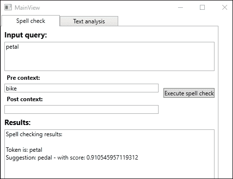
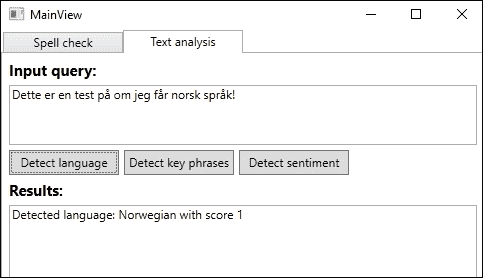
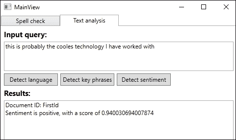

# 第六章。理解文本

上一章介绍了语音 API。在本章中，我们将更深入地探讨更多的语言 API。我们将学习如何使用拼写检查功能。然后，我们将发现如何检测文本中的语言、关键词和情感。最后，我们将查看翻译文本 API，看看我们如何检测语言并翻译文本。

到本章结束时，我们将涵盖以下主题：

+   检查拼写和识别俚语和非正式语言、常见名称、同音异义词和品牌

+   在文本中检测语言、关键词和情感

+   在线翻译文本

# 设置公共核心

在我们深入了解细节之前，我们希望为自己设定成功的基础。在撰写本文时，我们将要涵盖的所有语言 API 都没有 NuGet 客户端包。因此，我们需要直接调用 REST 端点。正因为如此，我们将在事先做一些工作，以确保我们能够通过编写更少的代码来完成。

## 新项目

我们不会将 API 添加到我们的智能家居应用程序中。按照以下步骤，使用我们在第一章中创建的 MVVM 模板创建一个新项目，*使用 Microsoft 认知服务入门*：

1.  进入 NuGet 包管理器并安装`Newtonsoft.Json`。这将帮助我们反序列化 API 响应并序列化请求体。

1.  右键单击**引用**。

1.  在**程序集**选项卡中，选择**System.Web**和**System.Runtime.Serialization**。

1.  点击**确定**。

1.  在`MainView.xaml`文件中，添加一个`TabControl`元素。我们所有的附加视图都将作为`TabItems`添加到`MainView`中。

## 网络请求

所有 API 都遵循相同的模式。它们使用`POST`或`GET`请求调用各自的端点。进一步来说，它们将参数作为查询字符串传递，并将一些作为请求体。由于它们有这些相似之处，我们可以创建一个类来处理所有 API 请求。

在`Model`文件夹中，添加一个新类，并将其命名为`WebRequest`。

我们还需要一些`private`变量，如下所示：

```py
    private const string JsonContentTypeHeader = "application/json";

    private static readonly JsonSerializerSettings _settings = new JsonSerializerSettings
    {
        DateFormatHandling = DateFormatHandling.IsoDateFormat,
        NullValueHandling = NullValueHandling.Ignore,
        ContractResolver = new CamelCasePropertyNamesContractResolver()
    };

    private HttpClient _httpClient;
    private string _endpoint;
```

常量`JsonContentTypeHeader`定义了我们想要用于所有 API 调用的内容类型。`_settings`短语是一个`JsonSerializerSettings`对象，它指定了我们想要如何（反）序列化 JSON 数据。

`_httpClient`是我们将用于发出 API 请求的对象。最后一个成员`_endpoint`将保存 API 端点。

如以下代码所示，我们的构造函数将接受两个参数：一个用于 URI 的字符串和一个用于 API 密钥的字符串：

```py
    public WebRequest(string uri, string apiKey)
    {
        _endpoint = uri;

        _httpClient = new HttpClient();
        _httpClient.DefaultRequestHeaders.Add("Ocp-Apim-Subscription-Key", apiKey);
    }
```

我们将`uri`分配给相应的成员。接下来，我们创建一个新的`HttpClient`类型的对象并添加一个请求头。这是包含给定`apiKey`的头。

该类将包含一个函数，`MakeRequest`。这个函数应该有`Task<TResponse>`的返回类型，这意味着我们在调用函数时指定的类型。正如你在以下代码中所看到的，它应该接受三个参数：一个`HttpMethod`，一个查询`string`，以及一个`TRequest`（这是我们调用时指定的请求体）。该函数应该是异步的：

```py
public async Task <TResponse> MakeRequest <TRequest, TResponse (HttpMethod method, string queryString, TRequest requestBody = default(TRequest))
```

前面的行显示了完整的函数签名。注意我们不需要指定请求体，因为在某些情况下它可能是空的。我们将在稍后讨论`TRequest`和`TResponse`可能是什么。

我们进入一个`try`子句，如下所示：

```py
    try {
        string url = $"{_endpoint}{queryString}";
        var request = new HttpRequestMessage(method, url);

        if (requestBody != null)
            request.Content = new StringContent (JsonConvert.SerializeObject(requestBody, _settings), Encoding.UTF8, JsonContentTypeHeader);

        HttpResponseMessage response = await _httpClient.SendAsync(request);
```

首先，我们创建一个`url`，由我们的`_endpoint`和`queryString`组成。使用这个和指定的`method`，我们创建一个`HttpRequestMessage`对象。

如果我们有`requestBody`，我们通过序列化`requestBody`将`Content`添加到`request`对象中。

在请求就绪后，我们向`_httpClient`对象上的`SendAsync`进行异步调用。这将调用 API 端点，返回一个包含响应的`HttpResponseMessage`。

如果`response`成功，我们希望将`Content`作为字符串获取。这可以通过以下方式完成：

1.  进行异步调用到`ReadAsStringAsync`。这将返回一个字符串。

1.  将字符串反序列化为`TResponse`对象。

1.  将反序列化的对象返回给调用者。

如果`responseContent`中没有数据，我们返回一个默认的`TResponse`。这将包含所有属性的所有默认值，如下所示：

```py
    if (response.IsSuccessStatusCode)
    {
        string responseContent = null;

        if (response.Content != null)
            responseContent = await response.Content.ReadAsStringAsync();
        if (!string.IsNullOrWhiteSpace(responseContent))
            return JsonConvert.DeserializeObject<TResponse>(responseContent,_settings);

        return default(TResponse);
    }
```

如果 API 响应包含任何错误代码，那么我们尝试将错误消息作为字符串（`errorObjectString`）获取。在典型应用程序中，你可能会想要反序列化它并将其传播给用户。然而，由于这是一个简单的示例应用程序，我们将选择将其输出到以下代码所示的`Debug`控制台窗口：

```py
    else
    {
        if (response.Content != null && response.Content.Headers.ContentType.MediaType.Contains (JsonContentTypeHeader))
        {
            var errorObjectString = await response.Content.ReadAsStringAsync();
            Debug.WriteLine(errorObjectString);
        }
    }
```

确保你添加相应的`catch`子句，并将任何异常输出到`Debug`控制台窗口。同时，确保在发生任何异常时返回默认的`TResponse`。

## 数据契约

由于我们需要将 JSON 数据序列化和反序列化作为 API 请求和响应的一部分，我们需要创建数据契约。这些将作为`TResponse`和`TRequest`对象，用于`WebRequest`类。

在项目中添加一个名为`Contracts`的新文件夹。一个典型的数据契约可能看起来像以下这样：

```py
    [DataContract]
    public class TextErrors {
       [DataMember]
       public string id { get; set; }

       [DataMember]
       public string message { get; set; }
    }
```

这与文本分析 API 中的错误相对应。正如你所看到的，它有两个字符串属性`id`和`message`。两者都可能出现在 API 响应中。

当讨论每个 API 时，我们将以表格形式或 JSON 格式显示所有请求和响应参数。我们不会查看这些如何转换为数据契约，但它们将采用与之前所示类似的形式。然后取决于你创建所需的契约。

需要注意的最重要的一点是属性名称必须与相应的 JSON 属性完全相同。

在继续之前，请确保代码可以编译并且你可以运行应用程序。

# 纠正拼写错误

Bing 拼写检查 API 利用机器学习和统计机器翻译的力量来训练和进化一个高度上下文化的拼写检查算法。这样做允许我们利用上下文来进行拼写检查。

一个典型的拼写检查器将遵循基于字典的规则集。正如你可以想象的那样，这将需要不断的更新和扩展。

使用 Bing 拼写检查 API，我们可以识别和纠正俚语和非正式语言。它可以识别常见的命名错误并纠正单词拆分问题。它可以检测并纠正发音相同但意义和拼写不同的单词（同音异义词）。它还可以检测并纠正品牌和流行表达。

在`View`文件夹中创建一个新的`View`；调用文件`SpellCheckView.xaml`。添加一个`TextBox`元素用于输入查询。我们还需要两个`TextBox`元素用于前文和后文。添加一个`TextBox`元素来显示结果和一个`Button`元素来执行拼写检查。

在名为`ViewModel`的文件夹中添加一个新的`ViewModel`；调用文件`SpellCheckViewModel.cs`。将类设置为`public`，并让它继承自`ObservableObject`类。添加以下`private`成员：

```py
    private WebRequest _webRequest;
```

这是我们在之前创建的`WebRequest`类。

我们需要与我们的`View`对应的属性。这意味着我们需要四个`string`属性和一个`ICommand`属性。

如果你还没有这样做，请前往[`portal.azure.com`](https://portal.azure.com)注册一个免费的 API 密钥。

构造函数应如下所示：

```py
    public SpellCheckViewModel()
    {
        _webRequest = new WebRequest ("https://api.cognitive.microsoft.com/bing/v7.0/spellcheck/?", "API_KEY_HERE");
        ExecuteOperationCommand = new DelegateCommand(
        ExecuteOperation, CanExecuteOperation);
    }
```

我们创建一个新的`WebRequest`类型的对象，指定 Bing 拼写检查 API 端点和 API 密钥。我们还需要为我们的`ExecuteOperationCommand`属性创建一个新的`DelegateCommand`。

`CanExecuteOperation`属性应该在输入查询填写时返回`true`，否则返回`false`。

要执行对 API 的调用，我们执行以下操作：

```py
    private async void ExecuteOperation(object obj)
    {
        var queryString = HttpUtility.ParseQueryString(string.Empty);

        queryString["text"] = InputQuery;
        queryString["mkt"] = "en-us";
        //queryString["mode"] = "proof";

        if (!string.IsNullOrEmpty(PreContext)) queryString["preContextText"] = PreContext;

        if(!string.IsNullOrEmpty(PostContext))
      queryString["postContextText"] = PostContext;
```

首先，我们使用`HttpUtility`创建一个`queryString`。这将格式化字符串，使其可以在 URI 中使用。

由于我们将使用`GET`方法调用 API，我们需要在字符串中指定所有参数。所需的参数是`text`和`mkt`，分别是输入查询和语言。如果我们已经输入了`PreContext`和/或`PostContext`，那么我们也添加这些参数。我们将在稍后更详细地查看不同的参数。

要发出请求，我们需要进行以下调用：

```py
        SpellCheckResponse response = await _webRequest.MakeRequest <object, SpellCheckResponse>(HttpMethod.Get, queryString.ToString());
        ParseResults(response);
    }
```

我们在`_webRequest`对象上调用`MakeRequest`。由于我们正在执行`GET`请求，我们不需要任何请求体，并将`object`作为`TRequest`传递。我们期望返回一个`SpellCheckResponse`合约。这将包含结果数据，我们将在稍后更详细地查看参数。

当我们得到响应时，我们将它传递给一个函数来解析，如下面的代码所示：

```py
    private void ParseResults(SpellCheckResponse response)
    {
        if(response == null || response.flaggedTokens == null || response.flaggedTokens.Count == 0)
        {
            Result = "No suggestions found";
            return;
        }

        StringBuilder sb = new StringBuilder();
        sb.Append("Spell checking results:nn");
```

如果我们没有收到任何响应，我们将退出函数。否则，我们将创建一个`StringBuilder`来格式化结果，如下面的代码所示：

```py
    foreach (FlaggedTokens tokens in response.flaggedTokens)
    {
        if (!string.IsNullOrEmpty(tokens.token))
            sb.AppendFormat("Token is: {0}n", tokens.token);

        if(tokens.suggestions != null || tokens.suggestions.Count != 0)
        {
            foreach (Suggestions suggestion in tokens.suggestions)
            {
                sb.AppendFormat("Suggestion: {0} - with score: {1}n", suggestion.suggestion, suggestion.score);
            }
            sb.Append("n");
        }
    }
    Result = sb.ToString();
```

如果我们有任何更正的拼写，我们将遍历它们。我们将所有建议添加到`StringBuilder`中，确保我们添加了建议正确性的可能性。最后，我们确保将结果输出到 UI。

以下表格描述了我们可以添加到 API 调用中的所有参数：

| 参数 | 描述 |
| --- | --- |
| `text` | 我们想要检查拼写和语法错误的文本。 |

| `mode` | 当前拼写检查的模式。可以是以下之一：

+   **校对**：用于长查询的拼写更正，通常用于 MS Word。

+   **拼写**：用于搜索引擎更正。可用于长度最多九个单词（标记）的查询。

|

| `preContextText` | 为文本提供上下文的字符串。petal 参数是有效的，但如果在此参数中指定 bike，它将被更正为 pedal。 |
| --- | --- |
| `postContextText` | 为文本提供上下文的字符串。read 参数是有效的，但如果在此参数中指定 carpet，它可能被更正为 red。 |
| `mkt` | 对于校对模式，必须指定语言。目前可以是 en-us、es-es 或 pt-br。对于拼写模式，支持所有语言代码。 |

成功的响应将是一个包含以下内容的 JSON 响应：

```py
    {
        "_type": "SpellCheck",
        "flaggedTokens": [
        {
            "offset": 5,
            "token": "Gatas",
            "type": "UnknownToken",
            "suggestions": [
            {
                "suggestion": "Gates",
                "score": 1
            }]
        }]
    }
```

`offset`是单词在文本中的位置，`token`是包含错误的单词，而`type`描述了错误的类型。`suggestions`短语包含一个包含建议更正及其正确性的概率的数组。

当`View`和`ViewModel`已经正确初始化，如前几章所示，我们应该能够编译并运行示例。

运行拼写检查的示例输出可能给出以下结果：



# 通过文本分析提取信息

使用**文本分析**API，我们能够分析文本。我们将涵盖语言检测、关键短语分析和情感分析。此外，还有一个新功能是检测主题的能力。然而，这确实需要大量的样本文本，因此我们不会详细介绍这个最后的功能。

对于我们所有的文本分析任务，我们将使用一个新的`View`。在`View`文件夹中添加一个新的`View`，命名为`TextAnalysisView.xaml`。这应该包含一个用于输入查询的`TextBox`元素。它还应该有一个用于结果的`TextBox`元素。我们需要三个`Button`元素，每个用于我们将执行的一种检测分析。

我们还需要一个新的`ViewModel`，因此将`TextAnalysisViewModel.cs`添加到`ViewModel`文件夹。在这里，我们需要两个`string`属性，每个`TextBox`一个。还要添加三个`ICommand`属性，每个按钮一个。

如果您还没有这样做，请前往[`portal.azure.com`](https://portal.azure.com)注册 API 密钥。

为`WebRequest`类型添加一个名为`_webRequest`的`private`成员。有了这个，我们就可以创建构造函数，如下面的代码所示：

```py
    public TextAnalysisViewModel()
    {
        _webRequest = new WebRequest("ROOT_URI","API_KEY_HERE");
        DetectLanguageCommand = new DelegateCommand(DetectLanguage, CanExecuteOperation);
        DetectKeyPhrasesCommand = new DelegateCommand(DetectKeyPhrases, CanExecuteOperation);
        DetectSentimentCommand = new DelegateCommand(DetectSentiment, CanExecuteOperation);
    }
```

构造函数创建一个新的`WebRequest`对象，指定 API 端点和 API 密钥。然后我们继续为我们的`ICommand`属性创建`DelegateCommand`对象。`CanExecuteOperation`函数应该在我们输入查询时返回`true`，否则返回`false`。

## 检测语言

该 API 可以检测超过 120 种不同语言中的文本所使用的语言。

这是一个`POST`调用，因此我们需要发送请求体。请求体应包含`documents`。这基本上是一个包含每个`text`的唯一`id`的数组。它还需要包含文本本身，如下面的代码所示：

```py
    private async void DetectLanguage(object obj)
    {
        var queryString = HttpUtility.ParseQueryString("languages");
        TextRequests request = new TextRequests
        {
            documents = new List<TextDocumentRequest>
            {
                new TextDocumentRequest {id="FirstId", text=InputQuery}                            
            }
        };

        TextResponse response = await _webRequest.MakeRequest<TextRequests, TextResponse>(HttpMethod.Post, queryString.ToString(), request);
```

我们创建一个`queryString`，指定我们想要到达的 REST 端点。然后我们继续创建一个包含文档的`TextRequest`合约。因为我们只想检查一段文本，所以我们添加一个`TextDocumentRequest`合约，指定一个`id`和文本。

当请求被创建时，我们调用`MakeRequest`。我们期望响应为`TextResponse`类型，请求体为`TextRequests`类型。我们传递`POST`作为调用方法、`queryString`和请求体。

如果响应成功，那么我们将遍历`detectedLanguages`。我们将语言添加到`StringBuilder`中，同时也输出该语言正确性的概率。然后这将在 UI 中显示，如下面的代码所示：

```py
    if(response.documents == null || response.documents.Count == 0)
    {
        Result = "No languages was detected.";
        return;
    }

    StringBuilder sb = new StringBuilder();

    foreach (TextLanguageDocuments document in response.documents)
    {
        foreach (TextDetectedLanguages detectedLanguage in document.detectedLanguages)
        {
            sb.AppendFormat("Detected language: {0} with score {1}n", detectedLanguage.name, detectedLanguage.score);
        }
    }

    Result = sb.ToString();
```

成功的响应将包含以下 JSON：

```py
    {
        "documents": [
        {
            "id": "string",
            "detectedLanguages": [
            {
                "name": "string",
                "iso6391Name": "string",
                "score": 0.0
            }]
        }],
        "errors": [
        {
            "id": "string",
            "message": "string"
        }]
    }
```

这包含一个`documents`数组`-`，与请求中提供的数量一样。每个文档将标记一个唯一的`id`并包含一个`detectedLanguage`实例的数组。这些语言将具有`name`、`iso6391Name`和正确性的概率（`score`）。

如果任何文档发生错误，我们将得到一个包含`errors`的数组。每个错误将包含发生错误的文档的`id`和作为字符串的`message`。

成功的调用将创建一个类似于以下截图的结果：



## 从文本中提取关键短语

从文本中提取关键短语可能对我们想要让我们的应用程序知道关键谈话点很有用。使用这个，我们可以了解人们在文章、讨论或其他此类文本来源中讨论的内容。

这个调用也使用`POST`方法，这需要一个请求体。与语言检测一样，我们需要指定文档。每个文档都需要一个唯一的 ID、文本和使用的语言。在撰写本文时，仅支持英语、德语、西班牙语和日语。

要提取关键短语，我们使用以下代码：

```py
    private async void DetectKeyPhrases(object obj)
    {
        var queryString = HttpUtility.ParseQueryString("keyPhrases");
        TextRequests request = new TextRequests
        {
            documents = new List<TextDocumentRequest>
            {
                new TextDocumentRequest { id = "FirstId", text = InputQuery, language = "en" }
            }
        };

        TextKeyPhrasesResponse response = await _webRequest.MakeRequest<TextRequests, TextKeyPhrasesResponse>(HttpMethod.Post, queryString.ToString(), request);
```

如您所见，它与检测语言非常相似。我们使用`keyPhrases`作为 REST 端点创建一个`queryString`。我们创建一个`TextRequests`类型的请求对象。我们添加文档列表，创建一个新的`TextDocumentRequest`。我们再次需要`id`和`text`，但我们还添加了一个`language`标签，如下面的代码所示：

```py
    if (response.documents == null || response.documents?.Count == 0)
    {
        Result = "No key phrases found.";
        return;
    }

    StringBuilder sb = new StringBuilder();

    foreach (TextKeyPhrasesDocuments document in response.documents)
    {
        sb.Append("Key phrases found:n");
        foreach (string phrase in document.keyPhrases)
        { 
            sb.AppendFormat("{0}n", phrase);
        }
    }

    Result = sb.ToString();
```

如果响应包含任何关键短语，我们将遍历它们并将它们输出到 UI。一个成功的响应将提供以下 JSON：

```py
    {
        "documents": [{
            "keyPhrases": [
            "string" ],
            "id": "string"
        }],
        "errors": [
        {
            "id": "string",
            "message": "string"
        } ]
    }
```

这里有一个`documents`数组。每个文档都有一个唯一的`id`，对应于请求中的 ID。每个文档还包含一个字符串数组，包含`keyPhrases`。

与语言检测一样，任何错误都会被返回。

## 学习判断文本是正面还是负面

使用情感分析，我们可以检测文本是否为正面。如果你有一个用户可以提交反馈的商品网站，这个功能可以自动分析反馈是否通常是正面或负面。

情感分数以 0 到 1 之间的数字返回，高数值表示正面情感。

与前两次分析一样，这是一个`POST`调用，需要请求体。同样，我们需要指定文档，每个文档都需要一个唯一的 ID、文本和语言，如下面的代码所示：

```py
    private async void DetectSentiment(object obj)
    {
        var queryString = HttpUtility.ParseQueryString("sentiment");
        TextRequests request = new TextRequests
        {
            documents = new List<TextDocumentRequest>
            {
                new TextDocumentRequest { id = "FirstId", text = InputQuery, language = "en" }
            } 
        };

        TextSentimentResponse response = await _webRequest.MakeRequest <TextRequests, TextSentimentResponse>(HttpMethod.Post, queryString.ToString(), request);
```

我们创建一个指向`sentiment`作为 REST 端点的`queryString`。数据合约是`TextRequests`，包含`documents`。我们传递的文档有一个唯一的`id`，文本和语言：

调用`MakeRequest`将需要一个`TextSentimentRequests`类型的请求体，我们期望结果为`TextSentimentResponse`类型。

如果响应包含任何`documents`，我们将遍历它们。对于每个文档，我们检查`score`，并输出文本是正面还是负面。然后这将在 UI 中显示，如下所示：

```py
    if(response.documents == null || response.documents?.Count == 0)
    {
        Result = "No sentiments detected";
        return;
    }

    StringBuilder sb = new StringBuilder();

    foreach (TextSentimentDocuments document in response.documents)
    {
        sb.AppendFormat("Document ID: {0}n", document.id);

        if (document.score >= 0.5)
            sb.AppendFormat("Sentiment is positive, with a score of{0}n", document.score);
        else
            sb.AppendFormat("Sentiment is negative with a score of {0}n", document.score);
    }

    Result = sb.ToString();
```

一个成功的响应将导致以下 JSON：

```py
    {
        "documents": [
        {
            "score": 0.0,
            "id": "string"
        }],
        "errors": [
        {
            "id": "string",
            "message": "string"
        }]
    }
```

这是一个`documents`数组。每个文档将有一个与请求中 ID 相对应的`id`，以及情感`score`。如果发生了任何`errors`，它们将像我们在语言和关键短语检测部分看到的那样被记录。

一个成功的测试可能看起来像以下这样：



# 即时翻译文本

使用翻译文本 API，你可以轻松地将翻译添加到你的应用程序中。该 API 允许你自动检测语言。这可以用来提供本地化内容，或快速翻译内容。它还允许我们查找可以用于在不同上下文中翻译单词的替代翻译。

此外，翻译文本 API 可以用来构建定制的翻译系统。这意味着你可以改进现有的模型。这可以通过添加与你的行业中的表达和词汇相关的人类翻译来实现。

翻译文本 API 作为 REST API 提供。我们将介绍你可以到达的四个端点。要使用该 API，应使用以下根 URL：

```py
https://api.cognitive.microsofttranslator.com
```

在 Microsoft Azure 门户上注册 API 密钥。

## 翻译文本

要将文本从一种语言翻译成另一种语言，你应该调用以下 URL 路径：

```py
/translate
```

必须指定以下参数：

```py
To - Language to translate to. Must be specified as two-letter language code.
```

此参数可以指定多次。

请求体必须包含要翻译的文本。

成功的调用将产生以下 JSON 输出：

```py
[
   {
      "detectedLanguage": {
         "language": "en",
         "score": 1.0
      },
      "translations": [
         "text": "Translated text",
         "to": "en"
      ]
   }
]
```

## 转换文本脚本

要将一种语言脚本（如阿拉伯语）翻译成另一种语言脚本（如拉丁语），你应该调用以下 URL 路径：

```py
/transliterate
```

必须指定以下参数：

```py
language - two-letter language code of language used in the language script.
fromScript - four-letter code for script language you are translating from.
toScript - four-letter code for script language you are translating to.
```

请求体必须包含要翻译的文本。

成功的调用将产生以下 JSON 输出：

```py
[
   {
      "text": "translated text"
      "script": "latin"
   }
]
```

## 与语言一起工作

在处理语言时，你可以使用两个路径。第一个路径用于检测特定文本中的语言。第二个路径用于获取其他 API 支持的语言列表。

### 识别语言

要检测特定文本使用的语言，你应该调用以下 URL 路径：

```py
/detect
```

请求体必须包含要翻译的文本。不需要任何参数。

成功的调用将产生以下 JSON 输出：

```py
[
   {
      "language": "en",
      "score": 1.0,
      "isTranslationSupported": true,
      "isTransliterationSupported": false,
      "alternatives": [
         {
            "language": "pt",
            "score": 0.8,
            "isTranslationSupported": false
            "isTransliterationSupported": false
         },
         {
            "language": "latn",
            "score": 0.7,
            "isTranslationSupported": true
            "isTransliterationSupported": true
         }
      ]
   }
]
```

### 获取支持的语言

要获取支持的语言列表，你应该调用以下 URL 路径：

```py
/languages
```

此调用不需要任何参数或请求体。

成功的调用将产生以下 JSON 输出：

```py
[
   "translation": {
      ...
      "en": {
         "name": "English",
         "nativeName": "English",
         "dir": "ltr"
      },
      ...
   },
   "transliteration": {
      "ar": {
         "name": "Latin",
         "nativeName": "",
         "scripts": [
            {
               "code": "Arab",
               "name": "Arabic",
               "nativeName": "",
               "dir": "rtl",
               "toScripts": [
                  {
                     "code:" "Latn",
                     "name": "Latin",
                     "nativeName": "",
                     "dir": "ltr"
                  }
               ]
            },
            {
               "code": "Latn",
               "name": "Latin",
               "nativeName": "",
               "dir": "ltr",
               "toScripts": [
                  {
                     "code:" "Arab",
                     "name": "Arabic",
                     "nativeName": "",
                     "dir": "rtl"
                  }
               ]
            }
         ]
      },
      ...
   },
   "dictionary": {
      "af": {
         "name": "Afrikaans",
         "nativeName": "Afrikaans",
         "dir": "ltr",
         "translations": [
            {
               "name": "English",
               "nativeName": "English",
               "dir": "ltr",
               "code": "en"
            }
            ...
         ]
      }
      ...
   }
]
```

如你所见，两字母国家代码是每个条目的关键。你还可以找到每个转写语言的四字母代码。此 API 路径可以用作其他 API 路径的基础。

# 摘要

在本章中，我们专注于语言 API。我们首先创建了执行对不同服务 API 调用的所需部分。随后，我们查看了 Bing 拼写检查 API。然后，我们转向更分析的 API，学习了如何检测语言、关键词和情感。最后，我们探讨了如何使用翻译文本 API。

下一章将带我们从语言 API 到知识 API。在接下来的章节中，我们将学习如何根据上下文识别和识别实体。此外，我们还将学习如何使用推荐 API。
