# 第八章. 以自然方式查询结构化数据

在上一章中，我们学习了如何利用当前上下文来扩展我们对某个主题的知识。在本章中，我们将继续讨论关于知识 API 的内容。更具体地说，我们将学习如何探索学术论文和期刊之间的关系。我们将看到如何解释自然语言查询，并检索查询表达式。使用这些表达式，我们将学习如何找到学术实体。然后，我们将更多地关注如何在个人设置中建立此类服务。在本章结束时，我们将探讨 QnA Maker，看看如何从现有内容中创建 FAQ 服务。

本章将涵盖以下主题：

+   使用项目学术知识解释自然语言用户查询

+   使用自动完成功能协助用户进行查询

+   使用自动完成查询检索学术实体

+   从查询中计算学术实体的分布

+   使用自己的模式托管项目知识探索服务

+   使用 QnA Maker 从现有内容创建 FAQ 服务

# 使用学术 API 获取学术内容

**Microsoft Academic Graph** (**MAG**) 是一个用于网络规模、异构实体图的数据库。实体模型了学术活动，并包含诸如研究领域、作者、机构等信息。

MAG 中的数据是从 Bing 网络索引中索引的。由于这些数据持续被索引，因此数据始终是最新的。

通过使用项目学术知识 API，我们可以访问这个知识库。此 API 允许我们结合搜索建议、研究论文图搜索结果和直方图分布。该 API 支持知识驱动和交互式对话。

当用户搜索研究论文时，API 可以提供查询补全。它可能会根据输入建议查询。使用完整的查询，我们可以评估查询表达式。这将从知识库中检索一组匹配的论文实体。

## 设置示例项目

为了测试项目学术知识，我们首先需要创建一个新的示例项目。我们将从第一章中创建的 MVVM 模板开始，即*使用 Microsoft 认知服务入门*。

项目学术知识没有提供任何客户端包。这意味着我们需要自己调用 API。从智能家居应用程序的`Model`文件夹中复制`WebRequest.cs`文件，并将其粘贴到新创建的项目中的`Model`文件夹中。确保您已正确修改命名空间。

为了能够编译此内容，我们需要添加对`System.Web`和`System.Runtime.Serializable`的引用。我们还将处理 JSON，因此请通过 NuGet 包管理器添加`Newtonsoft.Json`包。

由于这将是本示例项目中唯一测试的 API，我们可以在 `MainView.xaml` 文件中添加 UI 元素。现在打开此文件。

我们的 `View` 应该有一个 `TextBox` 元素用于我们的输入查询。它应该有一个 `ComboBox` 元素来列出建议的查询表达式。我们需要三个 `Button` 元素，一个用于 `Interpret`，一个用于 `Evaluate`，一个用于 `Histogram`，这些都是我们将要执行的功能。最后但同样重要的是，我们需要一个 `TextBox` 元素来显示我们的结果。

在 `MainViewModel.cs` 文件中，我们需要添加相应的属性。添加三个 `string` 类型的属性，一个用于输入查询，一个用于结果，一个用于选定的查询表达式。添加一个 `ObservableCollection` 属性，类型为 `string`，用于我们的可用查询表达式。我们还需要三个 `ICommand` 属性，分别对应我们的按钮。

为我们的 `WebRequest` 对象添加一个私有成员。使构造函数看起来如下：

```py
    public MainViewModel()
    {
        _webRequest = new WebRequest("https://api.labs.cognitive.microsoft.com/academic/v1.0/", 
        "API_KEY_HERE");

        InterpretCommand = new DelegateCommand(Interpret, CanInterpret);
        EvaluateCommand = new DelegateCommand(Evaluate, CanExecuteCommands);
        CalculateHistogramCommand = new DelegateCommand (CalculateHistogram,  
        CanExecuteCommands);
    }
```

### 注意

如果你还没有这样做，请在 [`labs.cognitive.microsoft.com/en-us/project-academic-knowledge`](https://labs.cognitive.microsoft.com/en-us/project-academic-knowledge) 上注册 API 密钥并点击 **Subscribe** 按钮。

当我们在查询文本框中输入任何文本时，`CanInterpret` 参数应返回 `true`。如果已选择查询表达式，则 `CanExecuteCommands` 参数应返回 `true`。我们将在接下来的章节中介绍 `Interpret`、`Evaluate` 和 `CalculateHistogram` 参数。

在继续之前，请确保应用程序可以编译并运行。

# 解释自然语言查询

API 用来评估查询的查询表达式不是自然语言格式。为了确保用户可以以自然的方式提出查询，我们需要解释他们的输入。

当调用 API 的 `Interpret` 功能时，它接受一个查询字符串。这将返回并格式化以反映用户意图，使用学术语法。此外，此功能可以在用户编写时调用，以提供交互式体验。

请求是一个 `GET` 请求，如下面的代码所示：

```py
    private async void Interpret(object obj)
    {
        var queryString = HttpUtility.ParseQueryString(string.Empty);

        queryString["query"] = InputQuery;
        queryString["complete"] = "1";
        //queryString["count"] = "10";
        //queryString["offset"] = "0";
        //queryString["timeout"] = "1000";
        //queryString["model"] = "latest";
```

我们通过创建一个 `queryString` 变量来开始调用。我们可以输入的参数如下表所示：

| 参数 | 描述 |
| --- | --- |
| `query` (必需) | 用户的查询。 |
| `complete` (可选) | 如果设置为 `1`，则服务将使用查询作为前缀返回建议。值为 `0` 表示将没有自动完成。 |
| `count` (可选) | 返回的最大解释数量。 |
| `offset` (可选) | 首个解释的索引。如果预期有很多结果并且需要添加分页，这很有用。 |
| `timeout` (可选) | 指定的超时时间（毫秒）。只有在此限制之前找到的结果将被返回。 |
| `model` (可选) | 你想要查询的模型名称。默认为最新模型。 |

我们调用 API 获取解释，如下面的代码所示：

```py
    InterpretResponse response = await _webRequest.MakeRequest<object, 
    InterpretResponse>(HttpMethod.Get, $"interpret?{queryString.ToString()}");

    if (response == null || response.interpretations.Length == 0)
        return;
```

由于这是一个 `GET` 请求，我们不需要指定任何请求体。然而，我们期望结果被序列化为一个 `InterpretResponse` 对象。这是一个数据合约，包含来自结果属性。

成功调用 API 将导致 JSON 响应，如下所示：

```py
    {
        "query": "papers by jaime", "interpretations": [
        {
            "prob": 2.429e-006,
            "parse": "<rule id="#GetPapers"> papers by <attr name="academic#AA.AuN">
            jaime teevan </attr></rule>",
            "rules": [
            {
                "name": "#GetPapers",
                "output": {
                    "type": "query",
                    "value": "Composite(AA.AuN=='jaime teevan')"
                }
            }]
        }]
    }
```

结果包含原始 `query`。它还包含一个包含 `interpretations` 的数组。该数组中的每个项目都由以下表格中的数据组成：

| 数据字段 | 描述 |
| --- | --- |
| `prob` | 这是当前解释正确的概率。范围从 `0` 到 `1`，其中 `1` 是最高的。 |
| `parse` | 这是一个 XML 字符串，显示了字符串每个部分的解释。 |
| `rules` | 这是一个包含一个或多个定义的规则的数组。对于学术 API，始终有一个规则。 |
| `rules[x].name` | 这是当前规则的名称。 |
| `rules[x].output` | 这是当前规则的输出。 |
| `rules[x].output.type` | 这是规则输出的类型。对于学术 API，这始终是 `query`。 |
| `rules[x].output.value` | 这是规则的输出值。这将是查询表达式字符串。 |

根据前面的 JSON 输出创建 `InterpretResponse` 数据合约。我们感兴趣的是最后的数据字段，`rules[x].output.value`。这是查询表达式字符串，我们将用它来评估查询。

当 API 调用成功时，我们想要使用以下代码更新 `ObservableCollection` 类以反映可用的查询表达式：

```py
    ObservableCollection<string> tempList = new ObservableCollection<string>();

    foreach (Interpretation interpretation in response.interpretations)
    {
        foreach (Rule rule in interpretation.rules) {
            tempList.Add(rule.output.value);
        }
    }

    AvailableQueryExpressions = tempList;
    QueryExpression = AvailableQueryExpressions.FirstOrDefault();
```

我们遍历所有 `interpretations`，将规则中的 `outputvalue` 添加到我们的 `AvailableQueryExpressions` 中。

最后，我们将选定的 `QueryExpression` 设置为第一个可用的。这只是为了我们自己的方便。

成功的测试运行可以生成以下结果：

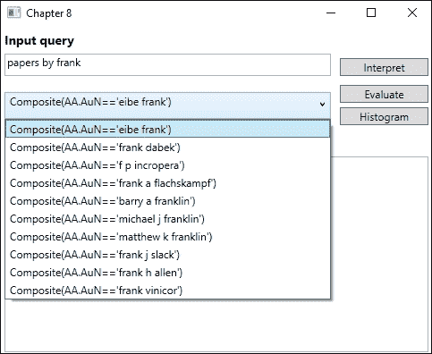

不成功的调用将产生错误响应代码。可以生成的响应代码如下：

| 响应代码 | 描述 |
| --- | --- |
| `400` | 错误的参数；请求参数缺失 |
| `401` | 无效的订阅密钥 |
| `403` | 调用量配额已超过 |
| `404` | 请求的资源未找到 |
| `500` | 内部服务器错误 |

# 在查询表达式中查找学术实体

现在我们有一个可用的查询表达式，我们可以使用 `Evaluate` 端点检索一组学术实体。这是一个 `GET` 请求，我们需要指定我们想要为每个实体返回的属性。我们将在稍后介绍可用的属性。

我们首先创建一个查询字符串，如下面的代码所示：

```py
    private async void Evaluate(object obj)
    {
        string queryString = $"expr={QueryExpression} &
        attributes=Id,Ti,Y,D,CC,AA.AuN";

        //queryString += "&model=latest";
        //queryString += "&count=10";
        //queryString += "&offset=0";5
        //queryString += "&orderby=name:asc";
```

我们可以添加的参数如下表所述：

| 参数 | 描述 |
| --- | --- |
| `expr` (必需) | 这是 `Interpret` 调用中找到的查询表达式。 |
| `attributes` (可选) | 这是要包含在响应中的属性逗号分隔列表。每个属性都是大小写敏感的。 |
| `model` (可选) | 这是要用于查询的模型。默认为最新模型。 |
| `count` (可选) | 这是要返回的实体数量。 |
| `offset` (可选) | 这是要返回的第一个结果的索引；它可以用于分页目的。 |
| `orderby` (可选) | 这指定了排序实体的顺序。 |

注意，虽然 `attributes` 参数是可选的，但您应该指定您想要的属性。如果没有指定任何属性，则只返回实体 ID。

我们按照以下方式调用 API：

```py
      EvaluateResponse response = await _webRequest.MakeRequest<object,
      EvaluateResponse>(HttpMethod.Get, $"evaluate?{queryString}");

    if (response == null || response.entities.Length == 0)
        return;
```

由于这是一个 `GET` 请求，我们不需要任何请求体。成功的调用将返回一个 `EvaluateResponse` 对象。这是一个数据合约，它将从 JSON 响应反序列化。

成功的响应将给出如下代码所示的 JSON 响应（取决于指定的属性）：

```py
    {
        "expr": "Composite(AA.AuN=='jaime teevan')",
        "entities": [
        {
            "prob": 2.266e-007,
            "Ti": "personalizing search via automated analysis of interests and 
            activities",
            "Y": 2005,
            "CC": 372,
            "AA": [
            {
                "AuN": "jaime teevan",
                "AuId": 1968481722
            },
            {
                "AuN": "susan t dumais",
                "AuId": 676500258
            },
            {
                "AuN": "eric horvitz",
                "AuId": 1470530979
            }]
        }]
    }
```

响应包含我们使用的查询表达式。它还包含一个实体数组。数组中的每个项目将包含它正确的概率。它还将包含我们指定的所有属性，以字符串或数值形式呈现。它也可以是对象的形式，我们需要为这些对象提供数据合约。

对于我们的请求，我们指定了一些属性。这些是实体 ID、标题、出版年份和日期、引用次数和作者姓名。了解这些属性后，我们可以使用以下代码来输出结果：

```py
    StringBuilder sb = new StringBuilder(); 
    sb.AppendFormat("Expression {0} returned {1} entities\n\n", response.expr,    
    response.entities.Length);

    foreach (Entity entity in response.entities)
    {
        sb.AppendFormat("Paper title: {0}\n\tDate: {1}\n", entity.Ti, entity.D);

        sb.Append("Authors:\n");
        foreach (AA author in entity.AA)
        {
            sb.AppendFormat("\t{0}\n", author.AuN);
        }

        sb.Append("\n");
    } 
    Results = sb.ToString();
```

成功的调用可以给出以下输出：

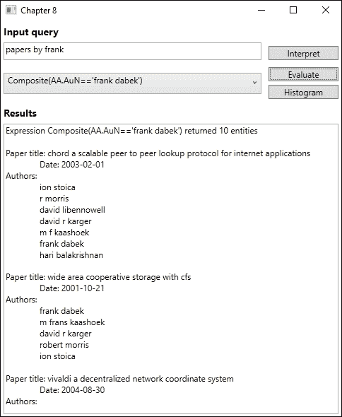

任何错误响应都将产生响应代码，如前所述。

# 计算学术实体的属性分布

学术 API 的另一个功能是能够计算一组论文实体的属性值分布。这可以通过调用 `calchistogram` API 端点来完成。

这是一个 `GET` 请求，因此我们首先创建一个查询字符串，如下所示：

```py
    string queryString = $"expr={QueryExpression}&attributes=Y,F.FN";

    //queryString += "&model=latest";
    //queryString += "&count=10";
    //queryString += "&offset=0";
```

我们可以指定的参数与 `Evaluate` 相同，除了我们没有 `orderby` 参数。对于这个调用，我们想要获取出版年份（`Y`）和研究领域的名称（`F.FN`）。

我们调用 API 时不指定任何请求体，如下面的代码所示：

```py
    HistogramResponse response = await _webRequest.MakeRequest<object, 
    HistogramResponse>(HttpMethod.Get, $"calchistogram?{queryString}");

    if (response == null || response.histograms.Length == 0)
        return;
```

如果调用成功，我们期望返回一个 `HistogramResponse` 对象。这是一个数据合约，它应该包含来自 JSON 响应的数据。

成功的请求应给出以下 JSON 响应（取决于请求的属性）：

```py
    {
        "expr": "And(Composite(AA.AuN=='jaime teevan'),Y>2012)",
        "num_entities": 37,
        "histograms": [
        {
            "attribute": "Y",
            "distinct_values": 3,
            "total_count": 37,
            "histogram": [
            {
                "value": 2014,
                "prob": 1.275e-07,
                "count": 15
            },
            {   
                "value": 2013,
                "prob": 1.184e-07,
                "count": 12
            },
            {  
                "value": 2015,
                "prob": 8.279e-08,
                "count": 10
            }]
        },
        {
            "attribute": "F.FN",
            "distinct_values": 34,
            "total_count": 53,
            "histogram": [
            {
                "value": "crowdsourcing",
                "prob": 7.218e-08,
            "count": 9
        },
        {
            "value": "information retrieval",
            "prob": 4.082e-08,
            "count": 4
        },
        {
            "value": "personalization",
            "prob": 2.384e-08,
            "count": 3
        },
        {
            "value": "mobile search",
            "prob": 2.119e-08,
            "count": 2
        }]
    }] 
}
```

响应包含我们使用的原始查询表达式。它将给出匹配实体的数量。还将出现一个直方图数组。这将包含我们请求的每个属性的项。每个项的数据在以下表格中描述：

| 数据字段 | 描述 |
| --- | --- |
| `attribute` | 这是属性名称。 |
| `distinct_values` | 这是匹配此属性实体的不同值的数量。 |
| `total_count` | 这是匹配实体中此属性的所有值实例的总数。 |
| `histogram` | 这是一个包含此属性直方图数据的数组。 |
| `histogram[x].value` | 这是当前直方图的值。 |
| `histogram[x].prob` | 这是匹配实体具有此属性值的概率。 |
| `histogram[x].count` | 这是具有此值的匹配实体的数量。 |

成功响应后，我们遍历数据，使用以下代码在 UI 中展示：

```py
    StringBuilder sb = new StringBuilder();

    sb.AppendFormat("Totalt number of matching entities: {0}\n",
    response.num_entities);

    foreach (Histogram histogram in response.histograms)
    {
        sb.AppendFormat("Attribute: {0}\n", histogram.attribute);
        foreach (HistogramY histogramY in histogram.histogram)
        {
            sb.AppendFormat("\tValue '{0}' was found {1} times\n", histogramY.value,
            histogramY.count);
        }

        sb.Append("\n");
    } 
    Results = sb.ToString();
```

成功的调用将返回以下结果：

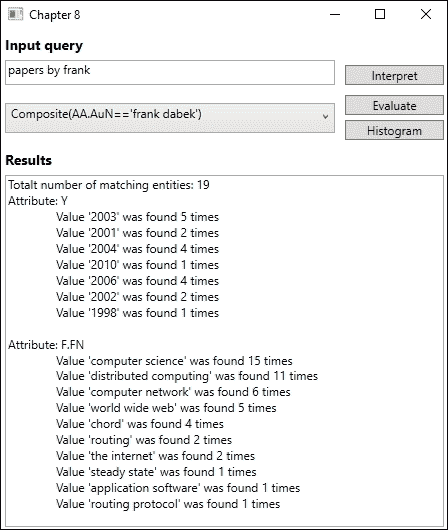

不成功的 API 调用将返回一个错误，包含一个响应代码。可能的响应代码与之前关于`Interpret`功能的章节中描述的相同。

# 实体属性

API 的一个重要元素是属性的用法。你肯定希望从查询中获取一些数据，但不是全部数据。

我们之前已经看到如何在每个请求中指定属性。以下表格描述了所有可用的属性。请确保请求中指定的所有属性都正确无误：

| 属性 | 描述 |
| --- | --- |
| `Id` | 实体 ID |
| `Ti` | 论文标题 |
| `Y` | 论文年份 |
| `D` | 论文日期 |
| `CC` | 引用计数 |
| `ECC` | 估计引用计数 |
| `AA.AuN` | 作者姓名 |
| `AA.AuId` | 作者 ID |
| `AA.AfN` | 作者所属机构名称 |
| `AA.AfId` | 作者所属机构 ID |
| `F.FN` | 研究领域名称 |
| `F.Fid` | 研究领域 ID |
| `J.JN` | 期刊名称 |
| `J.JId` | 期刊 ID |
| `C.CN` | 会议系列名称 |
| `C.Cid` | 会议系列 ID |
| `Rid` | 参考 ID |
| `W` | 论文标题/摘要中的单词，用于全文搜索 |
| `E` | 扩展元数据 |

扩展元数据在以下表格中描述：

| 属性 | 描述 |
| --- | --- |
| `DN` | 论文显示名称 |
| `D` | 描述 |
| `S` | 来源（论文的网页来源，按静态排名排序） |
| `S.Ty` | 来源类型（HTML/文本/PDF/DOC/PPT/XLS/PS） |
| `S.U` | 来源 URL |
| `VFN` | 场地全名 - 期刊或会议的全名 |
| `VSN` | 场地简称 - 期刊或会议的简称 |
| `V` | 期刊卷号 |
| `I` | 期刊期号 |
| `FP` | 论文第一页 |
| `LP` | 论文最后一页 |
| `DOI` | 数字对象标识符 |

# 使用知识探索服务创建后端

**知识探索服务**（**KES**）在某种程度上是学术 API 的后端。它允许我们从一个结构化数据中构建一个压缩索引，编写语法来解释自然语言。

要开始使用 KES，我们需要在本地安装服务。

### 注意

要下载 KES 安装程序，请访问 [`www.microsoft.com/en-us/download/details.aspx?id=51488`](https://www.microsoft.com/en-us/download/details.aspx?id=51488)。

安装过程中会附带一些示例数据，我们将使用这些数据。

要有一个工作的服务，所需的步骤如下：

1.  定义一个 schema

1.  生成数据

1.  构建索引

1.  编写语法

1.  编译语法

1.  托管服务

# 定义属性

`schema` 文件定义了我们领域中的属性结构。当我们之前讨论学术 API 时，我们看到了一系列不同的实体属性，我们可以通过查询检索这些属性。这些在 schema 中定义。

如果你打开 KES 安装的 `Example` 文件夹中的 `Academic.schema` 文件，你会看到定义的属性。我们有一个标题、年份和关键词，这些都是基本属性类型。此外，我们还有一个 `Composite` 属性用于作者。这个属性包含与作者相关的更多属性。

每个属性都将支持所有属性操作。可能存在不需要这种情况。为特定属性显式定义操作可能会减小索引大小。在作者 ID 的情况下，我们只想能够检查它是否等于某个值，这可以通过添加以下内容来实现：

```py
    {"name":"Author.Id", "type":"Int32", "operations":["equals"]}
```

# 添加数据

定义了 schema 之后，我们可以添加一些数据。示例中包含一个名为 `Academic.data` 的文件，它包含了所有示例数据。打开文件以了解数据可能的样子。

数据文件中的每一行指定了一个对象的属性值。它也可以包含一个 `logprob` 值，这将指示匹配对象的返回顺序。

# 构建索引

在有了属性 schema 和数据文件之后，我们可以构建压缩的二进制索引。这将包含我们所有的数据对象。

使用我们的示例文件，我们可以通过运行以下命令来构建索引：

```py
kes.exe build_index Academic.schema Academic.data Academic.index
```

成功执行应生成 `Academic.index` 文件，我们将用它来托管服务。

当运行命令时，应用程序将连续输出状态，可能看起来如下：

```py
    00:00:00 Input Schema: \Programs\KES\Example\Academic.schema
    00:00:00 Input Data: \Programs\KES\Example\Academic.data
    00:00:00 Output Index: \Programs\KES\Example\Academic.index
    00:00:00 Loading synonym file: Keyword.syn
    00:00:00 Loaded 3700 synonyms (9.4 ms)
    00:00:00 Pass 1 started
    00:00:00 Total number of entities: 1000
    00:00:00 Sorting entities
    00:00:00 Pass 1 finished (14.5 ms)
    00:00:00 Pass 2 started
    00:00:00 Pass 2 finished (13.3 ms)
    00:00:00 Processed attribute Title (20.0 ms)
    00:00:00 Processed attribute Year (0.3 ms)
    00:00:00 Processed attribute Author.Id (0.5 ms)
    00:00:00 Processed attribute Author.Name (10.7 ms)
    00:00:00 Processed attribute Author.Affiliation (2.3 ms)
    00:00:00 Processed attribute Keyword (20.6 ms)
    00:00:00 Pass 3 started
    00:00:00 Pass 3 finished (15.5 ms, 73 page faults)
    00:00:00 Post-processing started
    00:00:00 Optimized attribute Title (0.1 ms)
    00:00:00 Optimized attribute Year (0.0 ms)
    00:00:00 Optimized attribute Author.Id (0.0 ms)
    00:00:00 Optimized attribute Author.Name (0.5 ms)
    00:00:00 Optimized attribute Author.Affiliation (0.2 ms)
    00:00:00 Optimized attribute Keyword (0.6 ms)
    00:00:00 Global optimization
    00:00:00 Post-processing finished (17.2 ms)
    00:00:00 Finalizing index
    00:00:00 Total time: 157.6 ms
    00:00:00 Peak memory usage: 23 MB (commit) + 0 MB (data file) = 23 MB
```

# 理解自然语言

在我们构建索引之后，我们可以开始创建我们的语法文件。这指定了服务可以理解的自然语言，以及它如何将其翻译成语义查询表达式。打开 `academic.xml` 文件，看看语法文件可以看起来像什么。

语法基于一个名为**SRGS**的**W3C**语音识别标准。顶级元素是语法元素。这需要一个`root`属性来指定根规则，它是语法的起点。

要允许属性引用，我们添加`import`元素。这需要是`grammar`元素的子元素，并且应该在其他任何内容之前。它包含两个必需的属性：要导入的方案文件名称，以及元素可以用来引用方案的名字。请注意，方案文件必须与语法文件在同一个文件夹中。

接下来是`rule`元素。这定义了一个结构单元，它指定了服务可以解释的查询表达式。`rule`元素需要一个`id`属性。可选地，你可以添加一个`example`元素，它用于描述可能被`rule`元素接受的短语。在这种情况下，这将是规则的子元素。

`rule`元素还包含一个`item`元素。这组成了一个语法构造的序列，可以用来指示序列的重复。或者，它可以用来指定替代方案，与 one-of 元素一起使用。

One-of 元素指定了项目元素之间的扩展。项目可以定义为 one-of 元素，其中“written by”和“authored by”作为扩展。

使用`ruleref`元素，我们可以通过使用更简单的规则来创建更复杂的表达式。它只是通过添加 URI 属性来引用其他规则。

`attrref`元素引用了`index`属性，这允许我们与索引中的属性进行匹配。属性 URI 是必需的，它必须指定要引用的索引模式和属性名称。这必须匹配通过`import`元素导入的模式。

`tag`元素定义了通过语法的路径。此元素允许你分配变量或执行函数以帮助语法的流程。

一旦语法文件完成，我们可以将其编译成二进制语法。这是通过运行以下命令来完成的：

```py
kes.exe build_grammar Academic.xml Academic.grammar
```

运行此命令将生成类似以下内容的输出：

```py
Input XML: \Programs\KES\Example\Academic.xml
Output Grammar: \Programs\KES\Example\Academic.grammar
```

# 本地托管和测试

在索引和语法就绪后，我们可以继续在本地测试服务。本地测试服务允许快速原型设计，这使我们能够快速定义方案和语法。

当我们在本地测试时，KES 仅支持最多 10,000 个对象和每秒 10 个请求。在执行了总共 1,000 个请求后，它也会终止。我们将在稍后学习如何绕过这些限制。

要本地托管 KES，请运行以下命令：

```py
Kes.exe host_service Academic.grammar Academic.index -port 8080
```

这将启动在端口`8080`上运行的服务。为了验证它是否按预期工作，请打开您的浏览器并转到`http://localhost:8080`。

这样做应该会显示以下屏幕：

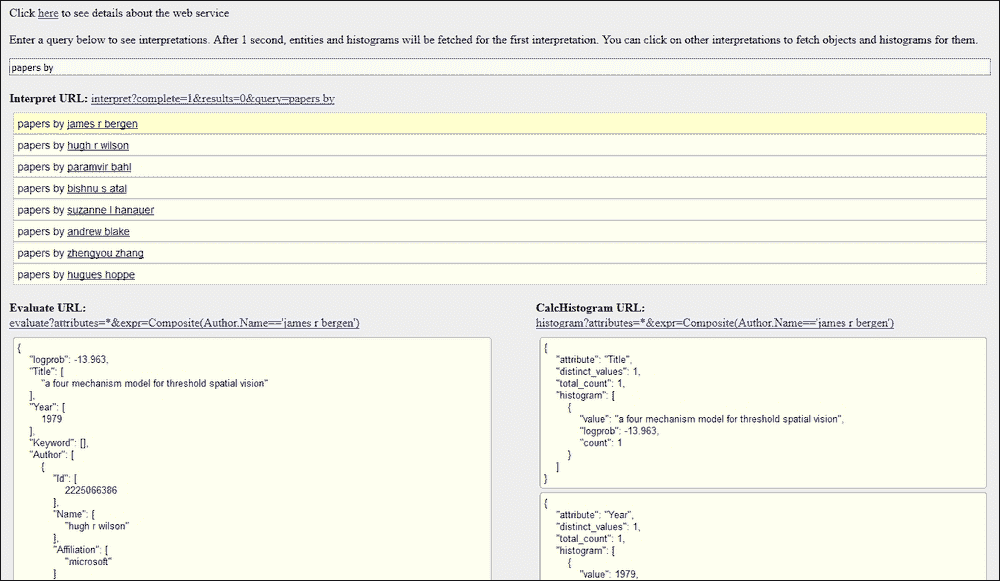

将 KES 作为本地服务运行还允许我们使用学术 API 进行测试。我们将对我们的示例应用程序进行一些修改——为学术 API 创建的——以支持这一点。

首先，我们将修改 `WebRequest.cs` 文件。我们需要确保我们可以更改端点，因此向类中添加以下函数：

```py
    public void SetEndpoint(string uri) {
        _endpoint = uri;
    }
```

接下来，我们需要向 `MainView.xaml` 文件中添加一个新的 `TextBox` 元素。这将允许我们输入一个 URL。这需要在 `MainViewModel.cs` 文件中有一个相应的字符串属性。当更改此属性时，我们需要在 `_webRequest` 对象上调用 `SetEndpoint`。这可以看起来如下所示：

```py
    private string _endpoint;
    public string Endpoint {
        get { return _endpoint; }
        set {
            _endpoint = value;
            RaisePropertyChangedEvent("Endpoint");
            _webRequest?.SetEndpoint(value);
        }
    }
```

最后，我们需要更新我们的 `ViewModel` 构造函数。将第一行更改为以下内容：

```py
    Endpoint = "https://api.projectoxford.ai/academic/v1.0/";
    _webRequest = new WebRequest(Endpoint, "API_KEY_HERE");
```

这将使默认端点成为原始 API 地址，但允许我们使用应用程序在本地测试 KES。

通过使用本地端点测试应用程序，可以产生以下结果：

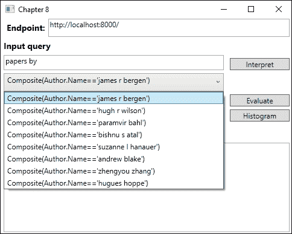

### 注意

注意，`evaluate` 和 `calchistogram` 将需要更新测试应用程序的请求中的属性，以便与本地 KES 一起工作。

# 寻求规模效应

虽然能够创建本地原型很令人高兴，但限制确保我们需要在其他地方部署服务以进行生产。在这种情况下，这意味着将 KES 部署到 Microsoft Azure。

我们现在将查看将 KES 部署到 Microsoft Azure 所需的步骤。

## 连接到 Microsoft Azure

第一步是下载 **Azure 发布设置** 文件。这个文件需要保存为 `AzurePublishSettings.xml` 并存储在 `kes.exe` 运行的目录中。

### 注意

你可以在 [`manage.windowsazure.com/publishsettings/`](https://manage.windowsazure.com/publishsettings/) 找到 Azure 发布设置文件。

有两种方式可以在没有限制的情况下构建和托管 KES。第一种方式是在 Azure 中启动一个 **Windows 虚拟机**。在这个虚拟机上，你应该遵循我们在本地采取的相同步骤。这允许快速原型设计，但没有任何限制。

第二种方式是在本地运行 `kes.exe`，但添加 `--remote` 作为参数。这将创建一个临时的 Azure VM，构建索引，并将索引上传到指定的目标 blob 存储。一个示例命令可能如下所示：

```py
kes.exe build_index
http://<account>.blob.core.windows.net/<container>/Academic.schema http://<account>.blob.core.windows.net/<container>/Academic.full.data http://<account>.blob.core.windows.net/<container>/Academic.full.index
--remote Large
```

这个过程可能需要长达 10 分钟，因此理想情况下，原型设计应在本地进行，或通过 Azure VM 进行。

## 部署服务

在语法和索引就位以及原型设计完成后，我们可以将服务部署到 Microsoft Azure 云服务。

### 注意

要了解如何创建 Microsoft Azure 云服务，请访问 [`azure.microsoft.com/en-us/documentation/articles/cloud-services-how-to-create-deploy/`](https://azure.microsoft.com/en-us/documentation/articles/cloud-services-how-to-create-deploy/)。

要将服务部署到预发布槽位，请运行以下命令：

```py
kes.exe deploy_service
http://<account>.blob.core.windows.net/<container>/Academic.grammar
http://<account>.blob.core.windows.net/<container>/Academic.index
<serviceName> large --slot Staging
```

这将允许我们在将服务部署到生产槽之前执行基本测试。测试完成后，我们可以通过再次运行相同的命令并将“生产”作为最后一个参数来将其部署到生产环境。

当服务部署后，我们可以在浏览器中访问 `http://<serviceName>.cloudapp.net` 来测试它。

# 使用 QnA Maker 回答 FAQs

QnA Maker 允许我们使用现有的**常见问题**（**FAQs**）来创建一个回答这些问题的机器人。我们可以从现有的 FAQs 中生成一个知识库，并从中训练一个模型。

要开始，请转到 [`qnamaker.ai`](https://qnamaker.ai)。在右上角点击“登录”或注册。

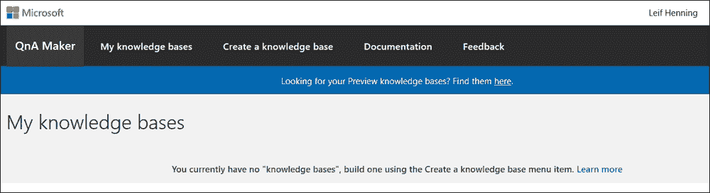

# 从常见问题创建知识库

如果尚未创建任何服务，我们可以通过点击“创建知识库”标签来创建一个。这将显示以下屏幕，如下两个截图所示：

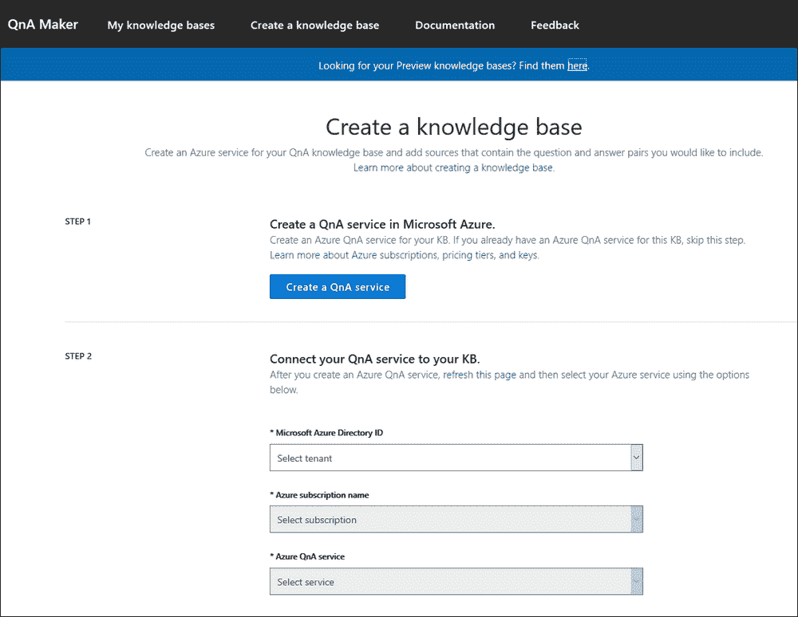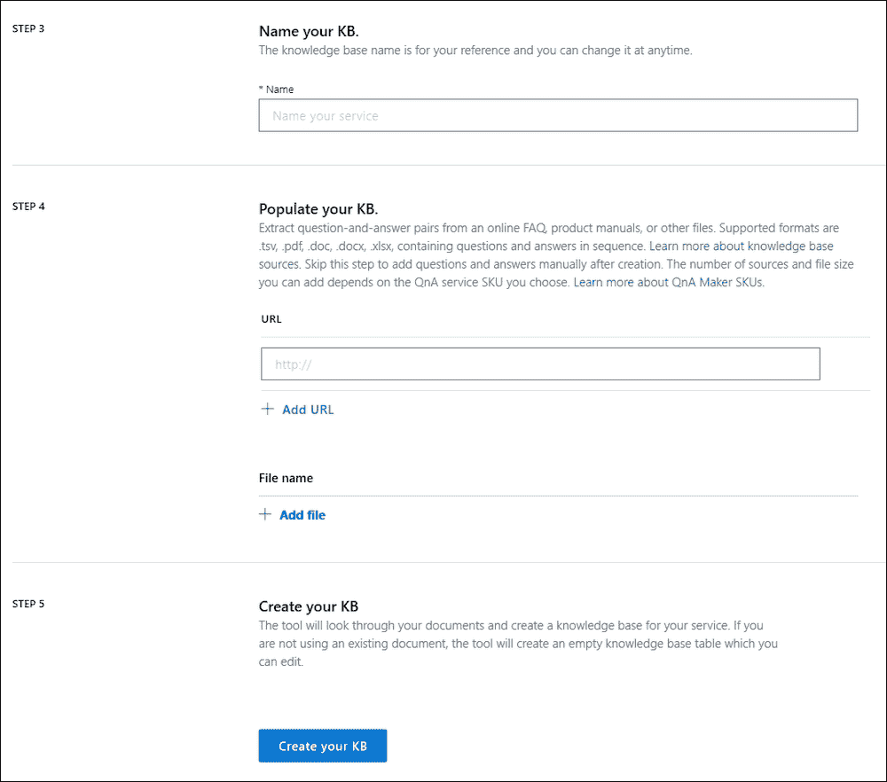

1.  通过点击截图中的**步骤 1**中的蓝色按钮在 Microsoft Azure 中创建一个 QnA 服务。

1.  将 QnA 服务连接到知识库。

1.  为服务输入一个名称。

1.  输入要使用的基线 FAQs。这可以是单个或多个 URL 的形式，或者是一个包含问答对的文件。在我们的例子中，我们将从 URL 生成知识库。

1.  让其余的设置保持默认。

1.  点击**创建您的 KB**。

### 注意

如果您没有可用的 FAQs，可以使用 [`www.microsoft.com/en-us/software-download/faq`](https://www.microsoft.com/en-us/software-download/faq) 从 Microsoft 获取。

一旦创建了知识库，您将被带到包含所有问答对的页面。如下截图所示：

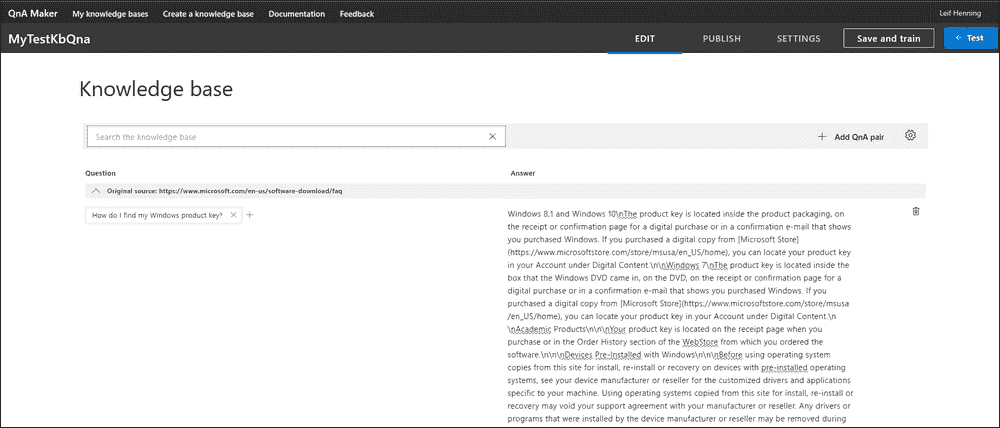

在这个页面上，我们可以查看所有来自我们 FAQ 源的问答对。我们也可以通过点击**添加 QnA 对**来添加新的问答对。

# 训练模型

每次我们对知识库进行更改时，点击**保存**和**训练**都是明智的选择。这将确保我们的模型是最新的，包含最新的问答对。

一旦我们训练了模型，我们就可以对其进行测试。这可以通过点击右侧的**测试**按钮来完成。这将显示以下聊天窗口：

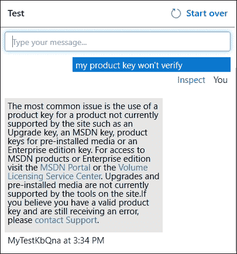

从这个聊天对话框中，我们可以测试一些或所有的问题来验证我们是否得到了正确的答案。我们也可以通过以不同的方式提问来改进模型。在某些情况下，这可能会给我们提供错误的答案。

如果我们得到了错误的答案，我们可以通过选择正确的答案来更改它。对于任何给定的问题，可能的答案将通过点击问题下方的“检查”按钮列出，按概率排序。选择正确答案并重新训练模型将确保在稍后再次提出相同问题时得到正确答案。

# 发布模型

一旦训练完成，就是时候发布服务了。我们可以在顶部菜单点击“发布”来完成这一操作。这样做会显示一个基本的 HTTP 请求，我们可以尝试，如下面的截图所示：

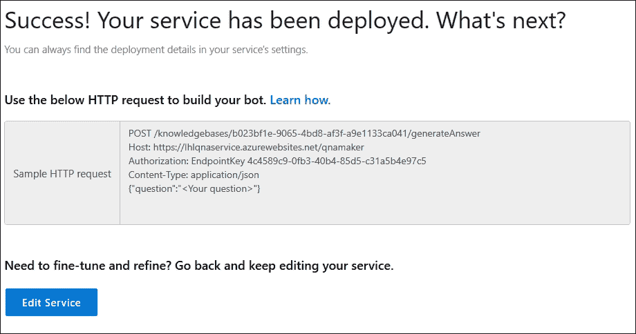

在前面的截图中，我们可以看到要使用的端点、所需的应用程序 ID、订阅密钥以及请求体中的示例问题。所有这些参数都是获取成功响应所必需的。

成功调用服务将提供以下 JSON 响应：

```py
{ "Answer": "Sample response", "Score": "0" }

```

如果我们有一个使用此服务的应用程序，我们可以决定当分数低于某个阈值时不再使用答案。

通常，我们会使用不同种类的机器人来使用此服务。例如，我们可以将其添加到 Skype 机器人或 Slackbot 中，或者简单地将其集成到客户支持网站的聊天机器人中。

# 摘要

在本章中，我们学习了关于项目学术知识 API 和项目知识探索服务的内容。我们了解了如何解释自然语言查询以获取用于评估的查询表达式。通过这次评估，我们从微软学术图知识库中检索了学术论文。从那里，我们学习了如何设置知识探索服务本身，从定义模式一直到将其部署到微软 Azure 云服务。最后，我们学习了如何设置一个简单的问答制作服务。

在下一章中，我们将继续探讨搜索 API，学习如何利用必应提供的不同搜索 API。
