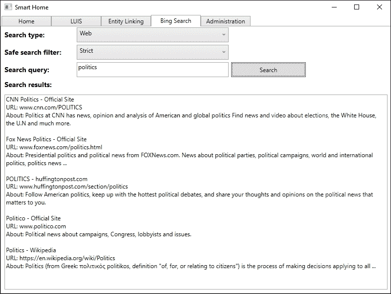
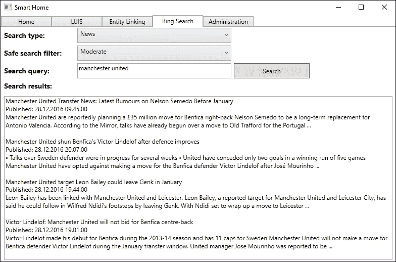
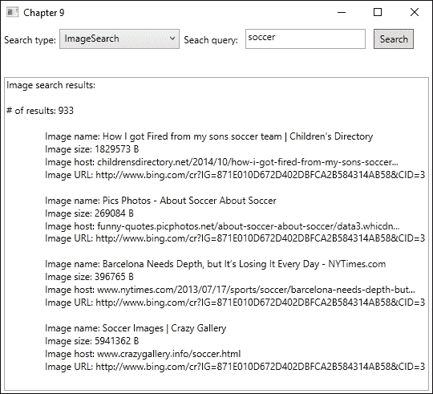
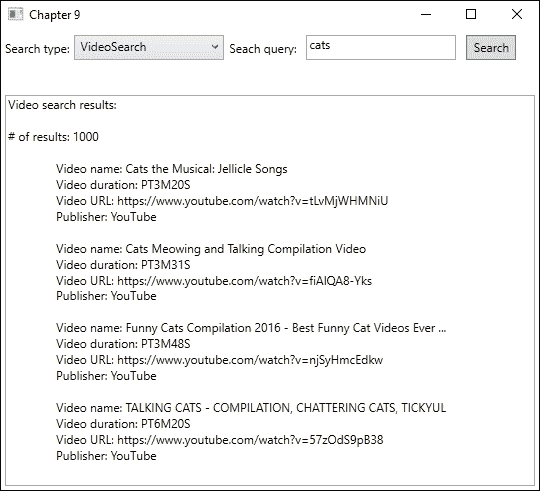

# 第九章：添加专业搜索

上一章探讨了学术论文与期刊之间的关系，我们学习了如何搜索学术论文。本章将进入顶级 API 的最后一部分，即搜索。在本章中，我们将学习如何搜索网络内容。我们将看到如何使用特定关键词或类别搜索最新新闻。进一步地，我们将搜索图片和视频，并学习如何自动为最终用户建议搜索查询。在本章结束时，我们将介绍 Bing Visual Search，并了解如何通过使用 Bing Custom Search 创建定制的搜索体验。

在本章中，我们将学习以下主题：

+   如何搜索网页和文档

+   如何搜索新闻文章

+   如何搜索图片和视频

+   如何在应用程序中添加自动建议

+   如何根据安全搜索策略过滤搜索结果

# 使用智能家居应用程序进行网络搜索

Bing Web Search API 为我们提供了与我们在 [`bing.com/search`](http://bing.com/search) 找到的类似搜索体验。它返回与任何查询相关的结果。

对此 API 的任何请求的响应将包含网页、图片、视频和新闻文章。在典型场景中，这是您用于这些搜索的 API。

注意，在实际场景中，所有请求都应该从服务器端应用程序发出，而不是从客户端，就像我们在示例中所做的那样。

### 注意

如果您还没有这样做，请前往 [`portal.azure.com`](https://portal.azure.com) 注册 Bing Web Search API。您可以在 [`azure.microsoft.com/en-us/services/cognitive-services/bing-web-search-api/`](https://azure.microsoft.com/en-us/services/cognitive-services/bing-web-search-api/) 了解更多关于 API 的信息。

## 准备应用程序进行网络搜索

在深入探讨网络搜索所需的技术细节之前，我们将准备我们的智能家居应用程序。

在 `Views` 文件夹中添加一个名为 `BingSearchView.xaml` 的新视图。至少，它应该包含两个 `Combobox` 元素，一个用于搜索类型，一个用于搜索过滤器。我们需要一个 `TextBox` 元素用于我们的搜索查询，以及一个 `Button` 元素来执行搜索。最后，我们需要一个 `TextBox` 元素来显示搜索结果。

为了配合搜索类型和搜索过滤器，我们需要在 `Model` 文件夹中添加一个名为 `BingSearchTypes.cs` 的新文件。添加以下两个 `enum`：

```py
    public enum BingSearchType {
        Web, News, NewsCategory
    }

    public enum SafeSearch {
        Strict, Moderate, Off
    }
```

添加这一功能使我们能够同时使用 Bing Web Search 和 Bing News Search API。后者将在稍后讨论。第二个 `enum`，`SafeSearch`，也将在稍后进行更详细的讨论。

我们需要一个新视图模型。在 `ViewModels` 文件夹中添加一个名为 `BingSearchViewModel.cs` 的新文件。在这里，我们需要为我们的搜索查询和搜索结果添加两个 `string` 属性。我们还需要一个 `BingSearchType` 类型的属性来表示选定的搜索类型。还需要一个 `SafeSearch` 类型的属性来表示选定的安全搜索过滤器。还需要一个 `ICommand` 属性用于我们的按钮。

此外，我们还需要能够显示之前创建的 `SafeSearch enums` 的值。这可以通过添加以下属性来实现：

```py
public IEnumerable<BingSearchType> AvailableSearchTypes  { 
    get { 
        return Enum.GetValues (typeof(BingSearchType)).Cast<BingSearchType>(); 
    } 
}

public IEnumerable<SafeSearch> SafeSearchFilter {
    get { 
        return Enum.GetValues(typeof(SafeSearch)).Cast<SafeSearch>(); 
    } 
}
```

我们从每个 `enum` 中获取所有值，并将它们作为 `IEnumerable` 返回。

在编写本文档时，没有任何搜索 API 有任何 NuGet 客户端包，因此我们需要自己进行网络请求。将我们在早期章节中使用的 `WebRequest.cs` 文件复制到 `Model` 文件夹中。将文件重命名为 `BingWebRequest.cs` 并将类重命名为 `BingWebRequest`。

由于所有 API 调用都是 `GET` 请求，我们可以稍微简化这个类。从构造函数中移除 URL 参数，并完全移除 `_endpoint` 成员。这样做可以简化 `MakeRequest` 函数，如下所示：

```py
public async Task<TResponse> MakeRequest<TResponse>(string url) {
    try {
        var request = new HttpRequestMessage(HttpMethod.Get, url);

        HttpResponseMessage response = await _httpClient.SendAsync(request);

        if (response.IsSuccessStatusCode) {
            string responseContent = null;

            if (response.Content != null)
                responseContent = await response.Content.ReadAsStringAsync();

            if (!string.IsNullOrWhiteSpace(responseContent))
                return JsonConvert.DeserializeObject<TResponse> (responseContent, _settings);

            return default(TResponse);
        }
```

我们不需要请求体，并已移除 `TRequest` 和相应的代码。我们还硬编码了 HTTP 方法，并说明在调用函数时我们将指定完整的 URL 端点。函数的其余部分应保持不变。

### 注意

记得添加对 `System.Web` 和 `System.Runtime.Serialization` 的引用。

在此基础上，我们可以继续前进。在继续之前，请确保代码可以编译并执行。

## 网络搜索

要使用 Bing Web Search，我们需要创建一个新的类。在 `Model` 文件夹中添加一个名为 `BingSearch.cs` 的新文件。

我们需要添加一个 `BingWebRequest` 类型的成员，我们将在构造函数中创建它：

```py
    private BingWebRequest _webRequest;

    public BingSearch() {
        _webRequest = new BingWebRequest("API_KEY_HERE");
    }
```

创建一个名为 `SearchWeb` 的新函数。这个函数应该接受两个参数，一个用于搜索查询的字符串和一个 `SafeSearch` 参数。该函数应标记为 `async` 并返回 `Task<WebSearchResponse>`。`WebSearchResponse` 是我们将要了解更多信息的数据合约：

```py
public async Task<WebSearchResponse> SearchWeb(string query, SafeSearch safeSearch)
{
    string endpoint = string.Format("{0}{1}&safeSearch={2} &count=5&mkt=en-US","https://api.cognitive.microsoft.com/bing/v7.0/search?q=", query, safeSearch.ToString());
```

首先，我们构建我们的端点，它指向网络搜索服务。我们确保指定查询 `q`、`safeSearch` 选择和区域 `mkt`。后两个将在本章中讨论。

唯一必需的参数是查询字符串。其长度不应超过 1,500 个字符。其他可选参数将在下表中描述：

| 参数 | 描述 |
| --- | --- |
| `responseFilter` | 要包含在响应中的结果类型的逗号分隔列表。如果未指定，结果将包含所有类型。合法值包括 `Computation`、`Images`、`News`、`RelatedSearches`、`SpellSuggestions`、`TimeZone`、`Videos` 和 `WebPages`。 |
| `setLang` | 用于指定用户界面字符串的语言的两字母代码。 |
| `textDecorations` | 指定查询词是否在结果中突出显示。默认为 false。 |
| `textFormat` | 要应用于显示字符串的格式类型。可以是原始的或 HTML，默认为原始。 |

除了这些参数之外，还有一些其他参数。然而，它们对所有搜索都是通用的，将在本章末尾讨论。

在端点就绪后，我们可以继续：

```py
    try {
        WebSearchResponse response = await _webRequest.MakeRequest<WebSearchResponse>(endpoint);

        return response;
    }
    catch (Exception ex) {
        Debug.WriteLine(ex.Message);
    }
return null;
```

使用新构建的端点，我们在`_webRequest`对象上调用`MakeRequest`。我们将 API 密钥和端点作为此调用的参数，并期望得到一个`WebSearchResponse`对象作为响应。

`WebSearchResponse`是一个数据合约，我们通过反序列化 API 服务的 JSON 响应来获取。顶层对象将包含不同结果类型的对象。请查看名为`BingSearchResponse.cs`的文件中提供的代码示例，以获取完整的数据合约。

### 注意

要获取 Bing 网络搜索的完整响应对象列表，请访问[`msdn.microsoft.com/en-us/library/dn760794.aspx#searchresponse`](https://msdn.microsoft.com/en-us/library/dn760794.aspx#searchresponse)。

返回到`BingSearchViewModel.cs`文件，我们可以添加`BingSearch`作为成员。构造函数应如下所示：

```py
    public BingSearchViewModel() {
        _bingSearch = new BingSearch(); 
        SearchCommand = new DelegateCommand(Search, CanSearch);
    }
```

`CanSearch`参数应返回 true，如果我们已经在搜索查询文本字段中输入了任何文本。`Search`目前应如下所示：

```py
    private async void Search(object obj) {
        switch (SelectedSearchType) { 
            case BingSearchType.Web:
                var webResponse = await _bingSearch.SearchWeb(SearchQuery, SelectedSafeSearchFilter);
                ParseWebSearchResponse(webResponse as WebSearchResponse);
                break;
            default:
                break;
        }
    }
```

我们在`_bingSearch`对象上调用`SearchWeb`函数，将`SearchQuery`和`SelectedSafeSearchFilter`属性作为参数传递。在成功响应后，我们将响应发送到新函数`ParseWebSearch`：

```py
private void ParseWebSearchResponse(WebSearchResponse webSearchResponse) {
    StringBuilder sb = new StringBuilder();

    Webpages webPages = webSearchResponse.webPages;

    foreach (WebValue website in webPages.value)
    {
        sb.AppendFormat("{0}\n", website.name);
        sb.AppendFormat("URL: {0}\n", website.displayUrl);
        sb.AppendFormat("About: {0}\n\n", website.snippet);
    }

    SearchResults = sb.ToString();
}
```

当我们解释网络搜索的结果时，我们对结果中的`webPages`感兴趣。对于每个网页，我们希望输出名称、显示 URL 和描述性摘要。

网络搜索的成功测试运行应向我们展示以下结果：



来自网络搜索的结果对象包含一个`RankingResponse`对象。这将标识结果通常如何在搜索网站上显示，按主线和侧边栏排序。在生产系统中，你应该始终旨在按`RankingResponse`指定的顺序显示结果。

这可以通过两种方式完成。一种是通过指定的 ID 字段对所有结果进行排名。另一种方式稍微复杂一些。它涉及根据答案类型和结果索引拆分结果。

除了我们迄今为止看到的查询之外，我们还可以查询计算（例如，2 + 2）、时区计算和相关搜索。这些查询将产生 JSON 响应，这与常规网络搜索略有不同。

# 获取新闻

使用 Bing 新闻搜索 API，我们可以以几种方式搜索新闻。我们可以使用此 API 的三个端点：

+   `/news`：根据类别获取顶级新闻文章

+   `/news/search`：根据搜索查询获取新闻文章

+   `/news/trendingtopics`：获取顶级趋势新闻主题

在我们的智能屋应用中，我们将添加前两个，而我们将只理论性地涵盖最后一个。

### 注意

如果您还没有这样做，请前往[`portal.azure.com`](https://portal.azure.com)注册 Bing 新闻搜索 API。

## 来自查询的新闻

基于查询的新闻搜索的大部分基础工作已经在网络搜索示例中完成。为了根据给定的查询搜索新闻，我们需要在`BingSearch`类中添加一个新函数。

打开`BingSearch.cs`文件并添加一个名为`SearchNews`的新函数。这个函数应该接受一个`string`和一个`SafeSearch`参数。该函数应标记为`async`，并返回一个`Task<BingNewsResponse>`对象：

```py
public async Task<BingNewsResponse> SearchNews(string query, SafeSearch safeSearch)
{
    string endpoint = string.Format("{0}{1}&safeSearch={2}&count=5&mkt=en-US","https://api.cognitive.microsoft.com/bing/v7.0/news/search?q=", query,safeSearch.ToString());
```

我们将构建一个由 URL、搜索查询和`safeSearch`参数组成的端点。注意我们如何指定市场，`mkt`，同时将`count`限制为 5。这两个参数将在本章中详细描述。

我们唯一需要的参数是查询字符串，`q`。除了为网络搜索描述的参数（`setLang`、`textDecorations`和`textFormat`）之外，我们还可以指定一个名为`originalImg`的参数。这是一个布尔值，如果设置为 true，将提供一个指向原始图片的 URL（对于文章中的任何图片）。如果设置为 false，默认值，将提供一个缩略图的 URL。

在设置好端点后，我们可以调用 API：

```py
    try {
        BingNewsResponse response = await _webRequest.MakeRequest<BingNewsResponse>(endpoint);

        return response;
    }
catch (Exception ex) {
        Debug.WriteLine(ex.Message);
    }

    return null;
```

我们在`_webRequest`对象上调用`MakeRequest`，将端点作为参数传递。

成功的调用将导致一个 JSON 响应，我们将将其反序列化为一个`BingNewsResponse`对象。这个对象需要作为一个数据合同来创建。

`BingNewsResponse`对象将包含一个新闻文章数组。这个数组中的每个项目将包含文章名称、URL、图片、描述、发布日期等。

### 注意

要了解新闻文章数组中每个项目的详细信息，请访问[`msdn.microsoft.com/en-us/library/dn760793.aspx#newsarticle`](https://msdn.microsoft.com/en-us/library/dn760793.aspx#newsarticle)。

在此基础上，我们可以回到`BingSearchViewModel.cs`文件并修改`Search`函数。我们通过在`switch`语句中添加对`BingSearchType.News`的 case 来实现这一点：

```py
    case BingSearchType.News:
        var newsResponse = await _bingSearch.SearchNews(SearchQuery, SelectedSafeSearchFilter);
        ParseNewsResponse(newsResponse as BingNewsResponse);
        break;
```

成功的响应将被解析并显示在 UI 上：

```py
private void ParseNewsResponse(BingNewsResponse bingNewsResponse) {
    StringBuilder sb = new StringBuilder();

    foreach(Value news in bingNewsResponse.value) { 
        sb.AppendFormat("{0}\n", news.name);
        sb.AppendFormat("Published: {0}\n", news.datePublished);
        sb.AppendFormat("{0}\n\n", news.description);
    }

    SearchResults = sb.ToString();
}
```

我们主要对新闻文章的名称、发布日期和描述感兴趣。

这次的良好测试运行应该给我们以下结果：



## 来自类别的新闻

当我们想要获取特定类别的顶级文章时，我们将执行与常规新闻查询类似的程序。区别在于我们构建的端点。

让我们在`BingSearch`类中创建一个新函数，名为`SearchNewsCategory`：

```py
public async Task<BingNewsResponse> SearchNewsCategory(string query)
{
    string endpoint = string.Format("{0}{1}&mkt=en-US", "https://api.cognitive.microsoft.com/bing/v5.0/news?category=", query);
```

在这里，我们有一个类别参数，包含我们希望搜索的主题。这是一个可选参数。如果它是空的，我们将获取所有类别的顶级新闻文章。

对于这次搜索，我们可以指定两个不同的市场，`en-GB` 和 `en-US`。每个市场都附带一个当前支持的预定义类别列表：

### 注意

要获取支持的类别完整列表，请访问 [`msdn.microsoft.com/en-us/library/dn760793.aspx#categoriesbymarket`](https://msdn.microsoft.com/en-us/library/dn760793.aspx#categoriesbymarket)。

```py
    try {
        BingNewsResponse response = await _webRequest.MakeRequest<BingNewsResponse>(endpoint);

        return response;
    }
catch (Exception ex) {
        Debug.WriteLine(ex.Message);
    }

    return null;
```

使用新构建的端点，我们在 `_webRequest` 对象上调用 `MakeRequest`。这应该会产生与常规新闻查询相同的响应对象。在我们的 ViewModel 中，我们在 `Search` 函数中添加了对这种搜索类型的 `case`。有了响应，我们利用已经创建的 `ParseNewsResponse` 来获取我们想要的数据。

## 趋势新闻

趋势新闻的搜索仅适用于 `en-US` 和 `zh-CN` 市场。要执行此搜索，请向以下 URL 发出请求：[`api.cognitive.microsoft.com/bing/v7.0/news/trendingtopics`](https://api.cognitive.microsoft.com/bing/v7.0/news/trendingtopics)。

此调用不需要任何参数，但您可以添加过滤器，例如我们稍后将要讨论的常用过滤器。唯一的例外是 `freshness` 过滤器，它不会适用于此请求。

成功调用此端点将返回一个包含趋势话题数组的 `TrendingTopicAnswer` 对象。数组中的每个项目将包含以下数据：

| 数据字段 | 描述 |
| --- | --- |
| `image` | 一个指向相关图片的链接 |
| `isBreakingNews` | 一个布尔值，表示此主题是否被视为突发新闻 |
| `name` | 主题的标题 |
| `query` | 一个查询字符串，将返回此主题 |
| `webSearchUrl` | 一个指向此主题 Bing 搜索结果的 URL |
| `webSearchUrlPingSuffix` | 一个用于识别 `webSearchUrl` 的查询字符串片段 |

# 搜索图片和视频

Bing 图片搜索 API 和 Bing 视频搜索 API 允许我们直接搜索图片或视频。只有在您需要图片或视频内容时才应使用这些 API。有可能调用这些 API 会对性能和相关性产生负面影响，因此，我们应该尽量使用 Bing 网络搜索 API。

### 注意

如果您尚未这样做，请在 [`portal.azure.com`](https://portal.azure.com) 为 Bing 图片搜索 API 和 Bing 视频搜索 API 注册。

## 使用常见的用户界面

由于在我们的智能屋应用程序中不需要图片或视频搜索，我们将继续创建一个新的项目。使用我们在 第一章 中创建的 MVVM 模板来创建此项目，*使用 Microsoft 认知服务入门*。

这些 API 没有提供任何客户端包。像我们之前做的那样，我们应该真正从服务器端应用程序而不是客户端应用程序中进行这些调用。在任何情况下，我们需要将智能屋应用程序中的 `BingWebRequest.cs` 文件复制到 `Model` 文件夹。确保更改命名空间。

### 注意

记得添加对`System.Web`和`System.Runtime.Serialization`的引用。

我们需要安装`Newtonsoft.Json` NuGet 包以使我们的反序列化工作。通过 NuGet 包管理器进行安装。

由于我们将输出一些结果作为文本，我们可以使用一个通用的用户界面。

打开`MainView.xaml`文件。添加两个`TextBox`元素，一个用于搜索查询，一个用于结果。我们需要一个`ComboBox`元素来选择搜索类型。最后，我们需要添加一个`Button`元素用于搜索命令。

在`MainViewModel.xaml`文件中，我们需要添加一个表示搜索类型的`enum`。在文件的底部添加以下内容，位于类下方：

```py
    public enum SearchType {
        ImageSearch,
        VideoSearch,
    }  
```

我们只对基于查询的图像和视频搜索感兴趣。除了这些搜索形式，这两个 API 还可以搜索趋势图像和视频。必应视频搜索 API 还允许我们获取任何已搜索视频的更多详细信息。

在`MainViewModel`类中，我们需要添加两个与我们的`TextBox`元素对应的`string`属性。我们还需要一个类型为`SearchType`的属性来指示选定的搜索类型。为了指示我们有哪些可用的搜索类型，我们添加一个`IEnumerable`属性，如下所示：

```py
public IEnumerable<SearchType> SearchTypes {
    get { 
        return Enum.GetValues(typeof(SearchType)).Cast<SearchType>();
    }
}
```

我们需要添加到我们的 ViewModel 中的最后一个属性是`ICommand`属性，它将被绑定到我们的`Button`元素。

现在，我们需要创建一个新的类，因此创建一个名为`BingSearch.cs`的新文件，位于`Model`文件夹中。这将负责构建正确的端点并执行两种搜索类型。

我们还需要添加一个类型为`BingWebRequest`的成员。这应该在构造函数中创建：

```py
private BingWebRequest _webRequest;

public BingSearch() {
    _webRequest = new BingWebRequest("API_KEY_HERE");
}
```

目前我们在这里需要做的就这些。

回到 ViewModel 中，我们需要添加一个类型为`BingSearch`的成员。有了这个，我们可以创建我们的构造函数：

```py
public MainViewModel() {
    _bingSearch = new BingSearch();

    SearchCommand = new DelegateCommand(Search);

    SelectedSearchType = SearchTypes.FirstOrDefault();
}
```

在 ViewModel 就绪后，我们可以进行一些搜索。

## 搜索图像

对于我们的示例，我们只将执行基于用户查询的图像搜索。为了允许这样做，我们需要在`BingSearch`类中添加一个函数。将函数命名为`SearchImages`，并让它接受一个字符串作为参数。该函数应返回`Task<ImageSearchResponse>`并标记为`async`。在这种情况下，`ImageSearchResponse`将是一个数据合同对象，数据是从我们的响应反序列化而来的：

```py
public async Task<ImageSearchResponse> SearchImages(string query)
{
    string endpoint = string.Format("{0}{1}","https://api.cognitive.microsoft.com/bing/v5.0/images/search?q=", query);
```

我们将首先构建我们的端点。在这种情况下，我们只指定查询参数，`q`。这是一个必需的参数。

除了我们即将看到的通用查询参数之外，我们还可以添加以下参数：

| 参数 | 描述 |
| --- | --- |
| `cab` | 裁剪区域的底部坐标，取值范围从 0.0 到 1.0。从左上角开始测量。 |
| `cal` | 裁剪区域的左坐标，取值范围从 0.0 到 1.0。 |
| `car` | 裁剪区域的右坐标，取值范围从 0.0 到 1.0。 |
| `cat` | 裁剪区域的顶部坐标，取值范围从 0.0 到 1.0。 |
| `ct` | 要使用的裁剪类型。目前，唯一合法的值是 0 - 矩形。 |

此外，我们可以指定以下参数作为过滤器：

| 过滤名称 | 描述 |
| --- | --- |
| `aspect` | 通过宽高比过滤图像。合法值有 `Square`、`Wide`、`Tall` 和 `All`。 |
| `color` | 通过特定颜色过滤图像。 |
| `imageContent` | 通过图像内容过滤图像。合法值有 `Face` 和 `Portrait`。 |
| `imageType` | 通过图像类型过滤图像。合法值有 `AnimatedGif`、`Clipart`、`Line`、`Photo` 和 `Shopping`。 |
| `license` | 通过适用于图像的许可证过滤图像。合法值有 `Public`、`Share`、`ShareCommercially`、`Modify`、`ModifyCommercially` 和 `All`。 |
| `size` | 通过大小过滤图像。合法值有 `Small`（< 200 x 200 像素）、`Medium`（200 x 200 到 500 x 500 像素）、`Large`（>500 x 500 像素）、`Wallpaper` 和 `All`。 |
| `height` | 仅获取具有特定高度的图像。 |
| `width` | 仅获取具有特定宽度的结果。 |

确定了端点后，我们可以执行请求：

```py
    try {
       ImageSearchResponse response = await _webRequest.MakeRequest<ImageSearchResponse>(endpoint);

        return response;
    } 
    catch (Exception ex) {
        Debug.WriteLine(ex.Message);
    }

    return null;
```

我们将在 `_webRequest` 对象上调用 `MakeRequest`，并将端点作为参数传递。成功的调用将导致 `ImageSearchResponse`，这是从 JSON 响应反序列化的数据合同对象。

结果对象将包含大量数据。其中之一是一个包含图像信息的数组。该数组中的每个项目都包含数据，例如图像名称、发布日期、URL 和图像 ID。

### 注意

要查看响应中可用的完整数据列表，请访问 [`msdn.microsoft.com/en-us/library/dn760791.aspx#images`](https://msdn.microsoft.com/en-us/library/dn760791.aspx#images)。

转到 `MainViewModel.cs`，我们现在可以创建 `Search` 函数：

```py
    private async void Search(object obj) {
        SearchResult = string.Empty;
switch(SelectedSearchType) {
            case SearchType.ImageSearch:
                var imageResponse = await _bingSearch.SearchImages(SearchQuery);
                ParseImageResponse(imageResponse);
                break;
            default:
                break;
        }
    }
```

在成功响应后，我们将解析 `imageResponse`。通常，这意味着在列表或类似的地方显示图像，但我们将选择更简单的方法，通过输出文本信息：

```py
private void ParseImageResponse(ImageSearchResponse imageResponse)
{
    StringBuilder sb = new StringBuilder();
    sb.Append("Image search results:\n\n");
    sb.AppendFormat("# of results: {0}\n\n", imageResponse.totalEstimatedMatches);

    foreach (Value image in imageResponse.value) {
        sb.AppendFormat("\tImage name: {0}\n\tImage size: {1}\n\tImage host: {2}\n\tImage URL:{3}\t\n\n", image.name, image.contentSize, image.hostPageDisplayUrl, image.contentUrl);
    }

    SearchResult = sb.ToString();
}
```

我们将打印出搜索结果的数量。然后，我们将遍历图像数组，打印出每张图像的名称、大小、主机和 URL。

成功的测试运行应显示以下屏幕：



除了基于查询的图像搜索外，我们还可以搜索趋势图像。为此，您必须调用以下端点：[`api.cognitive.microsoft.com/bing/v7.0/images/trending`](https://api.cognitive.microsoft.com/bing/v7.0/images/trending)。

目前，此功能仅适用于以下市场：`en-US`、`en-CA` 和 `en-AU`。对端点的成功调用将导致一个包含类别的数组。该数组中的每个项目将包含一个趋势图像数组以及类别的标题。

## 搜索视频

搜索视频的过程几乎与搜索图像相同。唯一的真正区别是我们如何构建端点以及我们得到的响应。

我们将在`BingSearch`类中添加一个新功能，以配合视频搜索：

```py
public async Task<VideoSearchResponse> SearchVideos(string query)
{
    string endpoint = string.Format("{0}{1}", "https://api.cognitive.microsoft.com/bing/v7.0/videos/search?q=", query);
```

如您所见，只有一个必需的参数：查询字符串，`q`。我们还可以指定一些对所有搜索 API 都通用的可选参数，这些参数将在后面进行描述。

除了常见的筛选器之外，视频还可以根据以下筛选器进行筛选：

| 筛选器 | 描述 |
| --- | --- |
| `pricing` | 通过价格筛选视频。合法值是 Free、Paid 和 All。 |
| `resolution` | 通过分辨率进行筛选。合法值是 480p、720p、1080p 和 All。 |
| `videoLength` | 通过长度筛选视频。合法值是`Short`（< 5 分钟）、`Medium`（5 到 20 分钟）、`Long`（> 20 分钟）和`All`。 |

在端点就绪后，我们调用 API：

```py
try {
   VideoSearchResponse response = await _webRequest.MakeRequest<VideoSearchResponse>(endpoint);

    return response;
}
catch (Exception ex) {
    Debug.WriteLine(ex.Message);
}

return null;
```

我们将在`_webRequest`对象上调用`MakeRequest`，并将端点作为参数传递。成功的调用将产生一个`VideoSearchResponse`对象。这是一个数据合约，从 JSON 响应反序列化而来。

除了其他数据外，它将包含一个视频数组。数组中的每个项目都包含视频名称、描述、发布者、时长、URL 等更多信息。

### 注意

要获取搜索响应中可用的完整数据列表，请访问[`msdn.microsoft.com/en-US/library/dn760795.aspx#videos`](https://msdn.microsoft.com/en-US/library/dn760795.aspx#videos)。

为了能够搜索视频，我们在`MainViewModel`的`Search`函数中添加了一个新情况：

```py
case SearchType.VideoSearch:
  var videoResponse = await _bingSearch.SearchVideos(SearchQuery);
  ParseVideoResponse(videoResponse);
  break;
```

我们调用新创建的`SearchVideos`，并将搜索查询作为参数传递。如果调用成功，我们将继续解析视频：

```py
private void ParseVideoResponse(VideoSearchResponse videoResponse)
{
    StringBuilder sb = new StringBuilder();
    sb.Append("Video search results:\n\n");
    sb.AppendFormat("# of results: {0}\n\n",
    videoResponse.totalEstimatedMatches);

    foreach (VideoValue video in videoResponse.value) {
        sb.AppendFormat("\tVideo name: {0}\n\tVideo duration: {1}\n\tVideo URL: {2}\t\n",video.name, video.duration, video.contentUrl);

        foreach(Publisher publisher in video.publisher) { 
            sb.AppendFormat("\tPublisher: {0}\n", publisher.name);
        }

        sb.Append("\n");
    }
    SearchResult = sb.ToString();
}
```

至于图像，我们只是以文本形式显示视频信息。在我们的示例中，我们选择显示视频名称、时长、URL 和视频的所有发布者。

成功的视频搜索应该给出以下结果：



除了基于查询的视频搜索之外，我们还可以搜索热门视频。为此，您需要调用以下端点：[`api.cognitive.microsoft.com/bing/v7.0/videos/trending`](https://api.cognitive.microsoft.com/bing/v7.0/videos/trending)。

目前，此功能仅适用于以下市场：`en-US`、`en-CA`和`en-AU`。成功调用此端点将产生一个包含类别和图标的数组。类别数组中的每个项目将包含一个标题和子类别的数组。每个子类别将包含图标的数组和标题。图标数组中的每个项目将包含视频缩略图和用于获取特定视频的查询。

如果我们想获取任何视频的更多信息，我们可以查询以下端点：[`api.cognitive.microsoft.com/bing/v7.0/videos/details`](https://api.cognitive.microsoft.com/bing/v7.0/videos/details)。

这需要我们指定一个`id`，以便我们可以识别视频。我们还可以指定`modulesRequested`。这是一个以逗号分隔的我们想要获取的详细信息列表。目前，合法值是`All`、`RelatedVideos`和`VideoResult`。

### 注意

要获取详细查询响应中可用的完整数据列表，请访问[`msdn.microsoft.com/en-US/library/dn760795.aspx#video`](https://msdn.microsoft.com/en-US/library/dn760795.aspx#video)。

# 使用自动建议帮助用户

自动建议是增强用户体验的绝佳方式。典型的用例是，每当用户在文本字段中输入一些文本时，都会显示一个建议词列表。

### 注意

如果您还没有这样做，请前往[`portal.azure.com`](https://portal.azure.com)注册 Bing Autosuggest API。

## 将自动建议添加到用户界面

由于 WPF 中的文本框不包含任何自动建议功能，我们需要自己添加一些。我们将使用第三方包，因此通过 NuGet 包管理器在我们的示例项目中安装`WPFTextBoxAutoComplete`包。

在`MainView.xaml`文件中，将以下属性添加到起始`Window`标签：

我们还需要确保当用户输入数据时，我们的搜索查询的`TextBox`绑定会更新。这可以通过确保`Text`属性看起来如下完成：

```py
Text="{Binding SearchQuery, UpdateSourceTrigger=PropertyChanged}"
```

在相同的`TextBox`元素中，添加以下内容：

```py
behaviors:AutoCompleteBehavior.AutoCompleteItemsSource = "{Binding Suggestions}"
```

在 ViewModel 中，在`MainViewModel.cs`文件中，我们需要相应的属性。这应该是一个`IEnumerable<string>`对象。它将使用我们即将执行的自动建议查询的结果进行更新。

## 建议查询

要获取自动建议，我们首先添加一个新的类。在`Model`文件夹中添加一个名为`BingAutoSuggest.cs`的新文件。`BingAutoSuggest`类应该有一个类型为`BingWebRequest`的成员，该成员应在构造函数中创建。

创建一个名为`Suggest`的新函数。这个函数应该接受一个`string`作为参数，返回一个`Task<List<string>>`对象。将函数标记为`async`。

我们将首先构建一个端点，其中我们指定查询字符串`q`。此字段是必需的。我们还指定市场`mkt`，尽管这不是必需的。我们不需要任何其他参数。在我们执行 API 调用之前，我们将创建一个建议列表，并将其返回给调用者：

```py
public async Task<List<string>> Suggest(string query) {
   string endpoint = string.Format("{0}{1}&mkt=en-US", "https://api.cognitive.microsoft.com/bing/v7.0/suggestions/?q=", query);

    List<string> suggestionResult = new List<string>();
```

我们将在`_webRequest`对象上调用`MakeRequest`，并将端点作为参数传递。如果调用成功，我们期望 JSON 响应反序列化为`BingAutoSuggestResponse`对象。此对象将包含一个`suggestionGroups`数组，其中每个项目包含一个`SearchSuggestions`数组。

`SearchSuggestion`的每个项目都包含一个 URL、显示文本、查询字符串和搜索类型。我们感兴趣的是显示文本，我们将其添加到`suggestionResult`列表中。此列表返回给调用者：

```py
try  {
    BingAutoSuggestResponse response = await _webRequest.MakeRequest<BingAutoSuggestResponse>(endpoint);

    if (response == null || response.suggestionGroups.Length == 0)
        return suggestionResult;
foreach(Suggestiongroup suggestionGroup in response.suggestionGroups) {
foreach(Searchsuggestion suggestion in suggestionGroup.searchSuggestions) {
suggestionResult.Add(suggestion.displayText);
        }
    }
} 
catch(Exception ex) {
    Debug.WriteLine(ex.Message);
}

return suggestionResult;
```

### 注意

要获取响应数据的完整描述，请访问[`msdn.microsoft.com/en-us/library/mt711395.aspx#suggestions`](https://msdn.microsoft.com/en-us/library/mt711395.aspx#suggestions)。

在`MainViewModel.cs`文件中，我们希望在键入时获取建议。我们将创建一个新函数，如下所示：

```py
private async void GetAutosuggestions() {
var results = await _autoSuggest.Suggest(SearchQuery);

    if (results == null || results.Count == 0) return;

    Suggestions = results;
}
```

这将调用新创建的`Suggest`函数，并使用当前的`SearchQuery`值。如果有任何结果返回，我们将它们分配给之前创建的`SuggestionsIEnumerable`。确保在设置`SearchQuery`属性值时调用此函数。

在 UI 中，这将在搜索查询字段中自动填充第一个建议。这对用户来说并不理想，但对我们测试示例来说是可以的。

# 搜索共性

对于我们已涵盖的所有 API，有一些相似之处。我们现在将介绍这些。

## 语言

强烈建议指定你想要结果的市场。搜索通常会根据用户的当前位置返回本地市场和国家/地区的语言结果。正如你所想象的那样，这并不总是用户想要的。通过指定市场，你可以为用户定制搜索结果。

你如何从技术上解决这个问题取决于你应用程序的需求。对于智能家居应用程序，你可能允许用户在设置中设置市场。对于仅针对法国法国用户的网络应用程序，你可能不会允许用户更改市场。

通过在 GET 请求中添加`mkt`参数来指定市场。然后应指定市场代码，例如，`en-US`代表美国的英语。

### 备注

虽然任何 API 都可能支持特定市场，但某些功能可能不支持给定市场。

支持的语言子集包括英语、西班牙语、德语、荷兰语、法语、葡萄牙语、繁体中文、意大利语、俄语和阿拉伯语。

此外，我们可以在 GET 请求中指定一个`cc`参数。这指定了一个国家（通常是用户所在的国家）。此参数应采用两位字母国家代码的形式，例如，GB 代表英国。

可以指定广泛的国家的列表，并且这个列表会持续变化。

## 分页

一些搜索可能会产生大量结果。在这些情况下，你可能想要执行分页。这可以通过在 GET 请求中指定`count`和`offset`参数来实现。

如果你希望每页有 10 个结果，你将首先将计数设置为 10，并将第一页的偏移量设置为 0。当用户导航到下一页时，你将保持`count`为 10，但将偏移量增加到 10。对于下一页，你将偏移量增加到 20，依此类推。

每个查询返回的结果最大数量（计数参数）因 API 而异。请参阅以下表格以获取每个 API 当前的最大计数：

| API | 最大搜索结果 | 默认搜索结果 |
| --- | --- | --- |
| 必应新闻搜索 | 100 | 10 |
| 必应网络搜索 | 50 | 10 |
| 必应图片搜索 | 150 | 35 |
| 必应视频搜索 | 105 | 35 |

## 筛选器

我们已经看到了一些针对单个 API 的筛选器。除此之外，还有一些可以应用于所有搜索的筛选器。

### 安全搜索

可以使用安全搜索过滤器来过滤搜索结果中的成人内容。此参数添加在请求 URL 中。

`safeSearch` 参数可以是以下值之一：

+   **关闭**: 返回所有结果项

+   **适度**: 结果项可以包含成人文本，但不会包含成人图像或视频

+   **严格**: 结果项中不包含任何成人文本、图像或视频

注意，如果用户的 IP 地址表明需要严格的搜索安全设置，则此设置将被忽略。在这种情况下，Bing 将默认使用严格的策略。

如果未设置参数，则默认为适度。

### Freshness

通过向请求中添加 `freshness` 参数，你可以根据结果项的年龄过滤搜索结果。可以指定的值如下：

+   **Day**: 最后 24 小时的结果

+   **Week**: 最后 7 天的结果

+   **Month**: 最后 30 天的结果

## 错误

在我们涵盖的所有 API 中，对于每个请求，你可能都会收到一些可能的响应代码。以下表格描述了所有可能的响应代码：

| 代码 | 描述 |
| --- | --- |
| `200` | 请求成功。 |
| `400` | 缺少一个或多个必需的查询参数，或者其中一个参数无效。更多详细信息请参阅 `ErrorResponse` 字段。 |
| `401` | 提供的订阅密钥无效或缺失。 |
| `403` | 通常在月度配额超出时返回。如果调用者没有权限访问请求的资源，也可以使用。 |
| `410` | 使用了 HTTP 协议而不是仅支持的 HTTPS 协议。 |
| `429` | 每秒配额已超出。 |

# 使用 Bing Visual Search 搜索视觉内容

使用 **Bing Visual Search** API，可以解析图像。此 API 使我们能够深入了解图像。这包括查找视觉上相似的图像、搜索和购物来源。它还可以识别人物、地点和物体，以及文本。

## 发送请求

你通常会上传一个图像到 API 以获取对其的洞察。此外，你还可以传递一个图像的 URL。

### 注意

应用于查询 Bing Visual Search API 的端点是 [`api.cognitive.microsoft.com/bing/v7.0/images/visualsearch`](https://api.cognitive.microsoft.com/bing/v7.0/images/visualsearch)。

在任何情况下，都可以添加以下查询参数：

+   **cc**: 应该来自的结果所在国家的两位字母语言代码。

+   **mkt**: 结果来源的市场。这应该始终指定。

+   **safeSearch**: 用于过滤成人内容的过滤器。可以是 *关闭*、*适度* 或 *严格*。

+   **setLang**: 用于用户界面字符串的语言，即两位字母的语言代码。

此外，还必须指定两个内容头。这些是`Content-Type`和`Ocp-Apim-Subscription-Key`。第一个必须设置为`multipart/form-data;boundary={BOUNDARY}`。后者必须指定 API 密钥。

### 注意

有关内容头的更多信息，请访问[`docs.microsoft.com/en-us/azure/cognitive-services/bing-visual-search/overview#content-form-types`](https://docs.microsoft.com/en-us/azure/cognitive-services/bing-visual-search/overview#content-form-types)。

## 接收响应

一旦请求通过，将返回一个 JSON 对象作为响应。

此对象将包含两个对象：一个`tags`数组和一个`image`字符串。图像字符串是图像的洞察令牌。`tags`列表包含一个`tag`名称和一系列`actions`（洞察）。在这个上下文中，标签意味着类别。例如，如果图像中识别出演员，这个标签可能是*演员*。

每个动作或洞察都描述了图像中的某些内容。它可能描述图像中的文本或图像中发现的不同的产品。每个动作都包含一系列数据。

### 注意

要查看默认洞察的完整列表，请访问[`docs.microsoft.com/en-us/azure/cognitive-services/bing-visual-search/default-insights-tag`](https://docs.microsoft.com/en-us/azure/cognitive-services/bing-visual-search/default-insight)。

# 添加自定义搜索

Bing 自定义搜索为您提供了将强大的定制搜索体验添加到您自己的应用程序的机会。它允许您针对您关心的特定主题进行搜索。

通过使用[`www.customsearch.ai/`](https://www.customsearch.ai/)上的门户，您可以创建一个定制的网络视图。

## 典型工作流程

如果您想构建一个自定义搜索网页，以下步骤描述了典型的工作流程。

1.  **创建自定义搜索实例**：这可以在上一节中链接的门户中完成。

1.  **添加活动条目**：这是一个应包含在搜索结果中的网站列表。

1.  **添加阻止条目**：这是一个应从搜索结果中排除的网站列表。

1.  **添加固定条目**：如果任何搜索词应该将网站固定在搜索结果顶部，应在固定条目部分指定。

1.  **配置托管 UI**：设置布局、颜色主题和其他托管 UI 选项。

1.  **发布搜索实例**：发布自定义搜索实例。

### 消费搜索实例

有三种方式来使用自定义搜索实例。

第一个，也是最容易的选项，是集成一个 JavaScript 代码片段。一旦您发布了搜索实例，您将获得一个预配置的 JavaScript 代码片段，渲染托管 UI。这可以粘贴到您的现有网页中。这将渲染您网站上的搜索表单。

另一个选项是直接链接到自定义 HTML 网站。这是在 JavaScript 代码片段中使用的链接，但仅用于直接链接。

最后一个选项是直接从您自己的代码中使用 REST API。在这本书中，我们不会对此进行更深入的探讨。

# 摘要

在本章中，我们探讨了不同的必应搜索 API。我们首先了解了如何使用必应网络搜索 API 来搜索各种内容。接下来，我们根据查询字符串和类别找到了最新的新闻。然后，我们转向了图片和视频搜索。此外，我们还探讨了如何通过添加自动建议来增强用户体验。我们是通过使用必应自动建议 API 来做到这一点的。最后，我们简要介绍了必应视觉搜索和必应自定义搜索。

在下一章和最后一章中，我们将总结全文。我们将通过连接各个部分来完成我们的智能家居应用程序。我们还将展望未来的道路。
