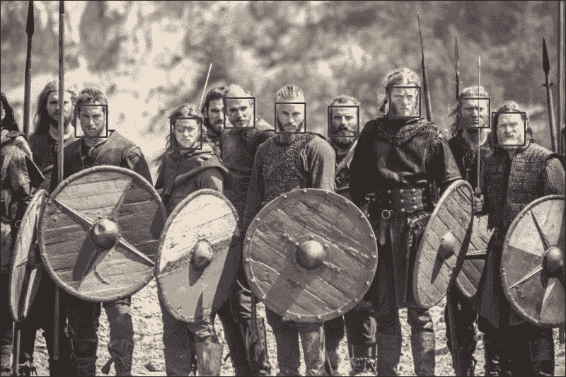
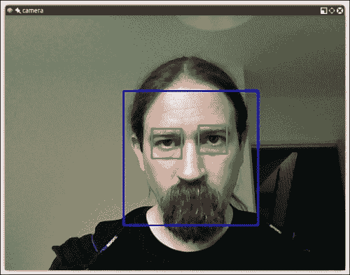
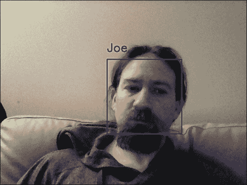

# 第五章. 识别人脸

在众多使计算机视觉成为一个迷人主题的原因中，计算机视觉使许多听起来非常**未来主义**的任务成为现实。其中一项功能就是人脸检测。OpenCV 内置了执行人脸检测的功能，这在现实世界的各种环境中几乎有无限的应用，从安全到娱乐。

本章介绍了 OpenCV 的一些人脸检测功能，以及定义特定类型可追踪对象的数据文件。具体来说，我们研究了 Haar 级联分类器，这些分类器通过分析相邻图像区域之间的对比度来确定给定的图像或子图像是否与已知类型匹配。我们考虑了如何将多个 Haar 级联分类器组合成一个层次结构，以便一个分类器识别父区域（在我们的目的中是脸部），而其他分类器识别子区域（眼睛、鼻子和嘴巴）。

我们还简要地探讨了矩形这个谦逊但重要的主题。通过绘制、复制和调整矩形图像区域的大小，我们可以对我们正在追踪的图像区域进行简单的操作。

到本章结束时，我们将把人脸追踪和矩形操作集成到 Cameo 中。最后，我们将实现一些面对面互动！

# 概念化 Haar 级联

当我们谈论分类对象和追踪它们的位置时，我们究竟希望精确到什么程度？构成物体可识别部分的是什么？

照片图像，即使是来自网络摄像头的，也可能包含大量的细节，以满足我们（人类）观看的愉悦。然而，图像细节在光照、视角、观看距离、相机抖动和数字噪声变化方面往往是不稳定的。此外，即使是物理细节的真实差异，也可能对我们进行分类的目的不感兴趣。我在学校学到的是，在显微镜下，没有两片雪花看起来是相同的。幸运的是，作为一个加拿大孩子，我已经学会了如何在没有显微镜的情况下识别雪花，因为在大批量中，它们的相似性更为明显。

因此，在产生稳定的分类和追踪结果时，抽象图像细节的一些方法是有用的。这些抽象被称为**特征**，据说它们是从图像数据中**提取**出来的。尽管任何像素都可能影响多个特征，但特征的数量应该远少于像素。两个图像之间的相似程度可以根据图像对应特征的欧几里得距离来评估。

例如，距离可以定义为空间坐标或颜色坐标。Haar 类似特征是常用于实时人脸跟踪的一种特征类型。它们首次在论文 *Robust Real-Time Face Detection* 中被用于此目的，作者为 *Paul Viola and Michael Jones*，出版于 *Kluwer Academic Publishers*，2001 年（可在 [`www.vision.caltech.edu/html-files/EE148-2005-Spring/pprs/viola04ijcv.pdf`](http://www.vision.caltech.edu/html-files/EE148-2005-Spring/pprs/viola04ijcv.pdf) 获取）。每个 Haar 类似特征描述了相邻图像区域之间的对比度模式。例如，边缘、顶点和细线各自生成独特的特征。

对于任何给定的图像，特征可能会根据区域的大小而变化；这可以称为 **窗口大小**。只有缩放不同的两个图像应该能够产生相似的特征，尽管窗口大小不同。因此，为多个窗口大小生成特征是有用的。这种特征集合被称为 **级联**。我们可以说 Haar 级联是尺度不变的，换句话说，对尺度变化具有稳健性。OpenCV 提供了一个分类器和跟踪器，用于处理期望以特定文件格式存在的尺度不变 Haar 级联。

OpenCV 中实现的 Haar 级联对旋转变化不稳健。例如，一个颠倒的脸不被认为是直立脸的相似，侧面看脸也不被认为是正面看脸的相似。一个更复杂且资源消耗更大的实现可以通过考虑图像的多个变换以及多个窗口大小来提高 Haar 级联对旋转的稳健性。然而，我们将局限于 OpenCV 中的实现。

# 获取 Haar 级联数据

一旦你有了 OpenCV 3 的源代码副本，你将找到一个名为 `data/haarcascades` 的文件夹。

这个文件夹包含 OpenCV 人脸检测引擎用于在静态图像、视频和摄像头流中检测人脸所使用的所有 XML 文件。

一旦找到 `haarcascades`，为你的项目创建一个目录；在这个文件夹中，创建一个名为 `cascades` 的子文件夹，并将以下文件从 `haarcascades` 复制到 `cascades`：

```py
haarcascade_profileface.xml
haarcascade_righteye_2splits.xml
haarcascade_russian_plate_number.xml
haarcascade_smile.xml
haarcascade_upperbody.xml
```

如其名称所示，这些级联用于跟踪人脸、眼睛、鼻子和嘴巴。它们需要被检测对象的正面、直立视角。我们将在构建人脸检测器时使用它们。如果你对如何生成这些数据集感兴趣，请参阅 *附录 B*，*为自定义目标生成 Haar 级联*，*使用 Python 的 OpenCV 计算机视觉*。有了足够的耐心和一台强大的计算机，你可以制作自己的级联并为各种类型的对象进行训练。

# 使用 OpenCV 进行人脸检测

与你一开始可能想到的不同，在静态图像或视频流上执行人脸检测是一个极其相似的操作。后者只是前者的顺序版本：在视频中的人脸检测只是将人脸检测应用到从摄像头读入程序中的每一帧。自然地，许多概念都应用于视频人脸检测，例如跟踪，这在静态图像中不适用，但了解底层理论是相同的。

让我们继续检测一些人脸。

## 在静态图像上执行人脸检测

执行人脸检测的第一种也是最基本的方法是加载一张图像并在其中检测人脸。为了使结果在视觉上具有意义，我们将在原始图像上的人脸周围绘制矩形。

现在你已经将 `haarcascades` 包含在你的项目中，让我们继续创建一个基本的脚本来执行人脸检测。

```py
import cv2

filename = '/path/to/my/pic.jpg'

def detect(filename):
  face_cascade = cv2.CascadeClassifier('./cascades/haarcascade_frontalface_default.xml')

  img = cv2.imread(filename)
  gray = cv2.cvtColor(img, cv2.COLOR_BGR2GRAY)
  faces = face_cascade.detectMultiScale(gray, 1.3, 5)
  for (x,y,w,h) in faces:
    img = cv2.rectangle(img,(x,y),(x+w,y+h),(255,0,0),2)
  cv2.namedWindow('Vikings Detected!!')
  cv2.imshow('Vikings Detected!!', img)
  cv2.imwrite('./vikings.jpg', img)
  cv2.waitKey(0)

detect(filename)
```

让我们来看一下代码。首先，我们使用必要的 `cv2` 导入（你会发现这本书中的每个脚本都会这样开始，或者几乎相似）。其次，我们声明 `detect` 函数。

```py
def detect(filename):
```

在这个函数中，我们声明一个 `face_cascade` 变量，它是一个用于人脸的 `CascadeClassifier` 对象，负责人脸检测。

```py
  face_cascade =
  cv2.CascadeClassifier('./cascades/haarcascade_frontalface_default.xml')
```

然后，我们使用 `cv2.imread` 加载我们的文件，并将其转换为灰度图，因为人脸检测是在这个颜色空间中进行的。

下一步（`face_cascade.detectMultiScale`）是我们执行实际人脸检测的地方。

```py
  img = cv2.imread(filename)
  gray = cv2.cvtColor(img, cv2.COLOR_BGR2GRAY)
  faces = face_cascade.detectMultiScale(gray, 1.3, 5)
```

传递的参数是 `scaleFactor` 和 `minNeighbors`，它们决定了在人脸检测过程的每一迭代中图像的百分比缩减，以及每个迭代中每个脸矩形保留的最小邻居数。一开始这可能看起来有点复杂，但你可以在官方文档中查看所有选项。

检测操作返回的值是一个表示脸矩形的元组数组。实用方法 `cv2.rectangle` 允许我们在指定的坐标处绘制矩形（`x` 和 `y` 代表左上坐标，`w` 和 `h` 代表脸矩形的宽度和高度）。

我们将通过遍历 `faces` 变量来绘制我们找到的所有人脸周围的蓝色矩形，确保我们使用原始图像进行绘制，而不是灰度版本。

```py
for (x,y,w,h) in faces:
    img = cv2.rectangle(img,(x,y),(x+w,y+h),(255,0,0),2)
```

最后，我们创建一个 `namedWindow` 实例，并在其中显示处理后的图像。为了防止图像窗口自动关闭，我们插入一个 `waitKey` 调用，按下任意键时关闭窗口。

```py
  cv2.namedWindow('Vikings Detected!!')
  cv2.imshow('Vikings Detected!!', img)
  cv2.waitKey(0)
```

就这样，我们已经在图像中检测到了一整队维京人，如下面的截图所示：



## 在视频上执行人脸检测

现在我们有一个很好的基础来理解如何在静态图像上执行人脸检测。如前所述，我们可以在视频的各个帧上重复此过程（无论是摄像头流还是视频）并执行人脸检测。

脚本将执行以下任务：它将打开摄像头流，读取一帧，检查该帧中的人脸，扫描检测到的人脸内的眼睛，然后将在脸部周围绘制蓝色矩形，在眼睛周围绘制绿色矩形。

1.  让我们创建一个名为 `face_detection.py` 的文件，并首先导入必要的模块：

    ```py
    import cv2
    ```

1.  在此之后，我们声明一个名为 `detect()` 的方法，它将执行人脸检测。

    ```py
         def detect():
      face_cascade = cv2.CascadeClassifier('./cascades/haarcascade_frontalface_default.xml')
      eye_cascade = cv2.CascadeClassifier('./cascades/haarcascade_eye.xml')
      camera = cv2.VideoCapture(0)
    ```

1.  在 `detect()` 方法内部，我们首先需要加载 Haar 级联文件，以便 OpenCV 可以执行人脸检测。由于我们在本地的 `cascades/` 文件夹中复制了级联文件，我们可以使用相对路径。然后，我们打开一个 `VideoCapture` 对象（摄像头流）。`VideoCapture` 构造函数接受一个参数，表示要使用的摄像头；`zero` 表示第一个可用的摄像头。

    ```py
    while (True):
        ret, frame = camera.read()
        gray = cv2.cvtColor(frame, cv2.COLOR_BGR2GRAY)
    ```

1.  接下来，我们捕获一帧。`read()` 方法返回两个值：一个布尔值表示读取帧操作的成功，以及帧本身。我们捕获帧，然后将其转换为灰度。这是一个必要的操作，因为 OpenCV 中的人脸检测是在灰度颜色空间中进行的：

    ```py
        faces = face_cascade.detectMultiScale(gray, 1.3, 5)
    ```

1.  与单个静态图像示例类似，我们在帧的灰度版本上调用 `detectMultiScale`。

    ```py
        for (x,y,w,h) in faces:
            img = cv2.rectangle(frame,(x,y),(x+w,y+h),(255,0,0),2)

            roi_gray = gray[y:y+h, x:x+w]

            eyes = eye_cascade.detectMultiScale(roi_gray, 1.03, 5, 0, (40,40))
    ```

    ### 注意

    在眼检测中还有一些额外的参数。为什么？`detectMultiScale` 方法的签名接受一些可选参数：在检测人脸的情况下，默认选项已经足够检测到人脸。然而，眼睛是人脸的一个较小特征，我胡须或鼻子的自阴影以及画面中的随机阴影都会触发**假阳性**。

    通过将眼睛搜索限制在最小尺寸 40x40 像素，我能够排除所有假阳性。继续测试这些参数，直到你的应用程序达到你期望的性能水平（例如，你可以尝试指定特征的最大尺寸，或者增加缩放因子和邻居数量）。

1.  与静态图像示例相比，这里有一个额外的步骤：我们创建一个与脸矩形对应的感兴趣区域，并在该矩形内进行“眼检测”。这很有意义，因为你不希望在人脸之外寻找眼睛（至少对于人类来说是这样！）。

    ```py
            for (ex,ey,ew,eh) in eyes:
                cv2.rectangle(img,(ex,ey),(ex+ew,ey+eh),(0,255,0),2)
    ```

1.  再次，我们遍历结果眼睛元组，并在它们周围绘制绿色矩形。

    ```py
        cv2.imshow("camera", frame)
        if cv2.waitKey(1000 / 12) & 0xff == ord("q"):
          break

      camera.release()
      cv2.destroyAllWindows()

    if __name__ == "__main__":
      detect()
    ```

1.  最后，我们在窗口中显示结果帧。如果一切顺利，如果相机视野内有任何人脸，你将在其脸部周围看到一个蓝色矩形，在每个眼睛周围看到一个绿色矩形，如图所示：

## 执行人脸识别

检测人脸是 OpenCV 的一个非常棒的功能，也是构成更高级操作（人脸识别）的基础。什么是人脸识别？它是指一个程序，在给定一个图像或视频流的情况下，能够识别一个人的能力。实现这一目标的一种方法（也是 OpenCV 采用的方法）是通过“训练”程序，给它提供一组分类图片（一个面部数据库），然后对这些图片进行识别操作。

这是 OpenCV 及其人脸识别模块遵循的过程来识别人脸。

人脸识别模块的另一个重要特性是每个识别都有一个置信度分数，这允许我们在实际应用中设置阈值以限制错误读取的数量。

让我们从一开始；要操作人脸识别，我们需要识别的面孔。你可以通过两种方式来做这件事：自己提供图像或获取免费的人脸数据库。互联网上有许多人脸数据库：

+   **耶鲁** **人脸数据库（Yalefaces）**：[`vision.ucsd.edu/content/yale-face-database`](http://vision.ucsd.edu/content/yale-face-database)

+   **AT&T**：[`www.cl.cam.ac.uk/research/dtg/attarchive/facedatabase.html`](http://www.cl.cam.ac.uk/research/dtg/attarchive/facedatabase.html)

+   **扩展耶鲁或耶鲁 B**：[`www.cl.cam.ac.uk/research/dtg/attarchive/facedatabase.html`](http://www.cl.cam.ac.uk/research/dtg/attarchive/facedatabase.html)

要在这些样本上操作人脸识别，你将不得不在一个包含样本人物面孔的图像上运行人脸识别。这可能是一个教育过程，但我发现它不如提供自己的图像那么令人满意。事实上，我可能和许多人有同样的想法：我想知道我能否编写一个程序，以一定程度的置信度识别我的面孔。

### 生成人脸识别的数据

因此，让我们编写一个脚本来生成这些图像。我们只需要一些包含不同表情的图像，但我们必须确保样本图像符合某些标准：

+   图像将以`.pgm`格式的灰度图形式存在

+   正方形形状

+   所有相同大小的图像（我使用了 200 x 200；大多数免费提供的集合都小于这个大小）

这是脚本本身：

```py
import cv2

def generate():
  face_cascade = cv2.CascadeClassifier('./cascades/haarcascade_frontalface_default.xml')
  eye_cascade = cv2.CascadeClassifier('./cascades/haarcascade_eye.xml')
  camera = cv2.VideoCapture(0)
  count = 0
  while (True):
    ret, frame = camera.read()
    gray = cv2.cvtColor(frame, cv2.COLOR_BGR2GRAY)

    faces = face_cascade.detectMultiScale(gray, 1.3, 5)

    for (x,y,w,h) in faces:
        img = cv2.rectangle(frame,(x,y),(x+w,y+h),(255,0,0),2)

        f = cv2.resize(gray[y:y+h, x:x+w], (200, 200))

        cv2.imwrite('./data/at/jm/%s.pgm' % str(count), f)
        count += 1

    cv2.imshow("camera", frame)
    if cv2.waitKey(1000 / 12) & 0xff == ord("q"):
      break

  camera.release()
  cv2.destroyAllWindows()

if __name__ == "__main__":
  generate()
```

这个练习相当有趣的地方在于，我们将基于我们新获得的知识来生成样本图像，这些知识是关于如何在视频流中检测人脸的。实际上，我们正在做的是检测人脸，裁剪灰度帧的该区域，将其调整大小为 200x200 像素，并以特定的文件夹（在我的情况下，是`jm`；你可以使用你的首字母）中的`.pgm`格式保存。

我插入了一个变量 `count`，因为我们需要为图像设置递增的名称。运行脚本几秒钟，改变几次表情，并检查脚本中指定的目标文件夹。您将找到许多您的面部图像，它们被灰度化、调整大小并以 `<count>.pgm` 格式命名。

现在我们来尝试在视频流中识别我们的面部。这应该很有趣！

### 识别面部

OpenCV 3 提供了三种主要的面部识别方法，基于三种不同的算法：**Eigenfaces**、**Fisherfaces**和**局部二值模式直方图**（**LBPH**）。本书的范围不包括深入探讨这些方法之间理论差异的细节，但我们可以提供一个概念的高级概述。

我将为您提供以下链接，以详细描述算法：

+   **主成分分析（PCA）**：Jonathon Shlens 提供了一个非常直观的介绍，可在[`arxiv.org/pdf/1404.1100v1.pdf`](http://arxiv.org/pdf/1404.1100v1.pdf)找到。该算法由 K. Pearson 在 1901 年发明，原始论文《On Lines and Planes of Closest Fit to Systems of Points in Space》可在[`stat.smmu.edu.cn/history/pearson1901.pdf`](http://stat.smmu.edu.cn/history/pearson1901.pdf)找到。

+   **Eigenfaces**：论文《Eigenfaces for Recognition》，作者 M. Turk 和 A. Pentland，1991 年，可在[`www.cs.ucsb.edu/~mturk/Papers/jcn.pdf`](http://www.cs.ucsb.edu/~mturk/Papers/jcn.pdf)找到。

+   **Fisherfaces**：开创性论文《THE USE OF MULTIPLE MEASUREMENTS IN TAXONOMIC PROBLEMS》，作者 R.A. Fisher，1936 年，可在[`onlinelibrary.wiley.com/doi/10.1111/j.1469-1809.1936.tb02137.x/pdf`](http://onlinelibrary.wiley.com/doi/10.1111/j.1469-1809.1936.tb02137.x/pdf)找到。

+   **局部二值模式**：描述此算法的第一篇论文是《Performance evaluation of texture measures with classification based on Kullback discrimination of distributions》，作者 T. Ojala、M. Pietikainen 和 D. Harwood，可在[`ieeexplore.ieee.org/xpl/articleDetails.jsp?arnumber=576366&searchWithin%5B%5D=%22Authors%22%3A.QT.Ojala%2C+T..QT.&newsearch=true`](http://ieeexplore.ieee.org/xpl/articleDetails.jsp?arnumber=576366&searchWithin%5B%5D=%22Authors%22%3A.QT.Ojala%2C+T..QT.&newsearch=true)找到。

首先，所有方法都遵循一个类似的过程；它们都从一组分类观察（我们的面部数据库，包含每个个体的多个样本）中获取，并在其上进行“训练”，对图像或视频中检测到的面部进行分析，并确定两个要素：是否识别了主题，以及主题真正被识别的置信度度量，这通常被称为置信度分数。

主成分分析（Eigenfaces）执行所谓的 PCA，在所有与计算机视觉相关的数学概念中，这可能是最描述性的。它基本上识别一组特定观察的主成分（再次，你的面部数据库），计算当前观察（在图像或帧中检测到的面部）与数据集之间的**发散度**，并产生一个值。值越小，面部数据库与检测到的面部之间的差异越小；因此，`0` 的值是一个完全匹配。

鱼脸（Fisherfaces）源自 PCA 并发展了这一概念，应用了更复杂的逻辑。虽然计算量更大，但它往往比 Eigenfaces 产生更准确的结果。

LBPH（局部二值模式直方图）大致上（再次，从非常高的层面）将检测到的面部划分为小的单元，并将每个单元与模型中的对应单元进行比较，为每个区域生成匹配值的直方图。由于这种灵活的方法，LBPH 是唯一允许模型样本面部和检测到的面部具有不同形状和大小的面部识别算法。就一般而言，我个人认为这是最准确的算法，但每种算法都有其优势和劣势。

### 准备训练数据

现在我们有了数据，我们需要将这些样本图片加载到我们的面部识别算法中。所有面部识别算法在其 `train()` 方法中接受两个参数：一个图像数组和一个标签数组。这些标签代表什么？它们是某个个体/面部的 ID，这样当执行面部识别时，我们不仅知道识别了这个人，而且知道——在我们的数据库中的许多人中——这个人是谁。

要做到这一点，我们需要创建一个**逗号分隔值**（**CSV**）文件，该文件将包含样本图片的路径，随后是那个人的 ID。以我的情况为例，我使用了之前的脚本生成了 20 张图片，它们位于文件夹 `data/at/` 的子文件夹 `jm/` 中，该文件夹包含所有个体的图片。

因此，我的 CSV 文件看起来是这样的：

```py
jm/1.pgm;0
jm/2.pgm;0
jm/3.pgm;0
...
jm/20.pgm;0
```

### 注意

这些点都是缺失的数字。`jm/` 实例表示子文件夹，而末尾的 `0` 值是我的面部 ID。

好的，在这个阶段，我们已经拥有了指导 OpenCV 识别我们面部所需的一切。

### 加载数据和识别面部

接下来，我们需要将这些两种资源（图像数组和 CSV 文件）加载到面部识别算法中，以便它可以训练以识别我们的面部。为此，我们构建一个函数，该函数读取 CSV 文件，并且对于文件的每一行——将对应路径的图像加载到图像数组中，并将 ID 加载到标签数组中。

```py
def read_images(path, sz=None):

    c = 0
    X,y = [], []
    for dirname, dirnames, filenames in os.walk(path):
        for subdirname in dirnames:
            subject_path = os.path.join(dirname, subdirname)
            for filename in os.listdir(subject_path):
                try:
                    if (filename == ".directory"):
                        continue
                    filepath = os.path.join(subject_path, filename)
                    im = cv2.imread(os.path.join(subject_path, filename), cv2.IMREAD_GRAYSCALE)

                    # resize to given size (if given)
                    if (sz is not None):
                        im = cv2.resize(im, (200, 200))

                    X.append(np.asarray(im, dtype=np.uint8))
                    y.append(c)
                except IOError, (errno, strerror):
                    print "I/O error({0}): {1}".format(errno, strerror)
                except:
                    print "Unexpected error:", sys.exc_info()[0]
                    raise
            c = c+1

    return [X,y]
```

### 执行主成分分析（Eigenfaces）识别

我们已经准备好测试面部识别算法了。以下是执行它的脚本：

```py
def face_rec():
    names = ['Joe', 'Jane', 'Jack']
    if len(sys.argv) < 2:
        print "USAGE: facerec_demo.py </path/to/images> [</path/to/store/images/at>]"
        sys.exit()

    [X,y] = read_images(sys.argv[1])
    y = np.asarray(y, dtype=np.int32)

    if len(sys.argv) == 3:
        out_dir = sys.argv[2]

    model = cv2.face.createEigenFaceRecognizer()
    model.train(np.asarray(X), np.asarray(y))
    camera = cv2.VideoCapture(0)
    face_cascade = cv2.CascadeClassifier('./cascades/haarcascade_frontalface_default.xml')
    while (True):
      read, img = camera.read()
      faces = face_cascade.detectMultiScale(img, 1.3, 5)
      for (x, y, w, h) in faces:
        img = cv2.rectangle(img,(x,y),(x+w,y+h),(255,0,0),2)
        gray = cv2.cvtColor(img, cv2.COLOR_BGR2GRAY)
        roi = gray[x:x+w, y:y+h]
        try:
            roi = cv2.resize(roi, (200, 200), interpolation=cv2.INTER_LINEAR)
            params = model.predict(roi)
            print "Label: %s, Confidence: %.2f" % (params[0], params[1])
            cv2.putText(img, names[params[0]], (x, y - 20), cv2.FONT_HERSHEY_SIMPLEX, 1, 255, 2)
        except:
            continue
      cv2.imshow("camera", img)
      if cv2.waitKey(1000 / 12) & 0xff == ord("q"):
        break
    cv2.destroyAllWindows()
```

有几行可能看起来有点神秘，所以让我们分析一下脚本。首先，有一个名字数组被声明了；这些是我存储在人脸数据库中的实际个人名字。将一个人识别为 ID `0` 是很棒的，但在正确检测和识别到的人脸上打印 `'Joe'` 要戏剧性得多。

所以每当脚本识别到一个 ID 时，我们将在`names`数组中打印相应的名字，而不是 ID。

在此之后，我们按照前一个函数中描述的方式加载图像，使用`cv2.createEigenFaceRecognizer()`创建人脸识别模型，并通过传递图像和标签（ID）数组来训练它。请注意，Eigenface 识别器接受两个重要的参数，你可以指定：第一个是你想要保留的主成分数量，第二个是一个指定置信度阈值的浮点值。

接下来，我们重复与面部检测操作类似的过程。不过，这次，我们通过在检测到的任何面部上执行人脸识别来扩展帧的处理。

这分为两个步骤：首先，我们将检测到的人脸调整到期望的大小（在我的情况下，样本是 200x200 像素），然后我们在调整大小后的区域上调用`predict()`函数。

### 注意

这是一个简化的过程，它的目的是让你能够运行一个基本的应用程序并理解 OpenCV 3 中人脸识别的过程。实际上，你将应用一些额外的优化，例如正确对齐和旋转检测到的人脸，以最大限度地提高识别的准确性。

最后，我们获得识别结果，并且为了效果，我们在帧中绘制它：



### 使用 Fisherfaces 进行人脸识别

那 Fisherfaces 呢？过程没有太大变化；我们只需要实例化一个不同的算法。所以，我们的模型变量声明将如下所示：

```py
model = cv2.face.createFisherFaceRecognizer()
```

Fisherface 与 Eigenfaces 具有相同的两个参数：要保留的 Fisherfaces 和置信度阈值。置信度高于此阈值的面孔将被丢弃。

### 使用 LBPH 进行人脸识别

最后，让我们快速看一下 LBPH 算法。同样，过程非常相似。然而，算法工厂接受的参数要复杂一些，因为它们按顺序指示：`radius`，`neighbors`，`grid_x`，`grid_y`，以及置信度阈值。如果你不指定这些值，它们将自动设置为 1，8，8，8，和 123.0。模型声明将如下所示：

```py
  model = cv2.face.createLBPHFaceRecognizer()
```

### 注意

注意，使用 LBPH，你不需要调整图像大小，因为网格的划分允许比较每个单元格中识别出的模式。

### 丢弃置信度分数的结果

`predict()`方法返回一个包含两个元素的数组：第一个元素是识别个体的标签，第二个是置信度分数。所有算法都提供了设置置信度分数阈值的选项，这衡量了识别的面与原始模型之间的距离，因此分数为 0 表示完全匹配。

可能会有这样的情况，你宁愿保留所有识别，然后进行进一步的处理，这样你可以提出自己的算法来估计识别的置信度分数；例如，如果你试图在视频中识别人，你可能想分析后续帧中的置信度分数，以确定识别是否成功。在这种情况下，你可以检查算法获得的置信度分数，并得出自己的结论。

### 注意

置信度分数在 Eigenfaces/Fisherfaces 和 LBPH 中完全不同。Eigenfaces 和 Fisherfaces 将产生（大约）在 0 到 20,000 范围内的值，任何低于 4-5,000 的分数都表示相当有信心的识别。

LBPH 的工作原理类似；然而，良好识别的参考值低于 50，任何高于 80 的值都被认为是低置信度分数。

正常的定制方法是在获得足够数量的具有令人满意的任意置信度分数的帧之前，不绘制识别面的矩形，但你完全自由地使用 OpenCV 的人脸识别模块来定制你的应用程序以满足你的需求。

# 摘要

到现在为止，你应该已经很好地理解了人脸检测和识别的工作原理，以及如何在 Python 和 OpenCV 3 中实现它们。

人脸检测和识别是计算机视觉中不断发展的分支，算法正在不断发展，并且随着对机器人和物联网的重视，它们将在不久的将来发展得更快。

目前，检测和识别的准确性高度依赖于训练数据的质量，所以请确保为你的应用程序提供高质量的面对面数据库，你将对自己的结果感到满意。
