# 第六章. 使用图像描述符检索图像和搜索

与人眼和大脑类似，OpenCV 可以检测图像的主要特征，并将这些特征提取成所谓的图像描述符。这些特征可以用作数据库，实现基于图像的搜索。此外，我们可以使用关键点将图像拼接起来，组成更大的图像（例如，将多张图片拼成 360 度全景图）。

本章将向您展示如何使用 OpenCV 检测图像特征，并利用这些特征进行图像匹配和搜索。在整个章节中，我们将使用示例图像检测其主要特征，然后尝试使用单应性找到包含在另一图像中的示例图像。

# 特征检测算法

有许多算法可以用于检测和提取特征，我们将探索其中大部分。在 OpenCV 中最常用的算法如下：

+   **Harris**：此算法用于检测角点

+   **SIFT**：此算法用于检测图像块

+   **SURF**：此算法用于检测图像块

+   **FAST**：此算法用于检测角点

+   **BRIEF**：此算法用于检测图像块

+   **ORB**：此算法代表**Oriented FAST and Rotated BRIEF**

可以使用以下方法进行特征匹配：

+   暴力匹配

+   基于 FLANN 的匹配

可以使用单应性进行空间验证。

## 定义特征

特征究竟是什么？为什么图像的某个特定区域可以被归类为特征，而其他区域则不是？广义上讲，特征是图像中一个独特或易于识别的兴趣区域。正如你可以想象的那样，角点和高密度区域是好的特征，而重复性很高的图案或低密度区域（如蓝天）则不是。边缘是好的特征，因为它们倾向于分割图像的两个区域。图像块（与周围区域差异很大的图像区域）也是一个有趣的特征。

大多数特征检测算法都围绕角点、边缘和图像块的识别，其中一些也关注**脊**的概念，你可以将其视为长形物体的对称轴（例如，考虑在图像中识别道路）。

有些算法在识别和提取特定类型的特征方面做得更好，因此了解你的输入图像很重要，这样你就可以利用 OpenCV 工具箱中的最佳工具。

### 检测特征 – 角点

让我们先通过利用`CornerHarris`识别角点，以下是一个示例。如果你继续学习 OpenCV，你会发现——出于许多原因——棋盘是计算机视觉中常见的分析对象，部分原因是因为棋盘图案适合许多类型的特征检测，也许是因为棋类游戏在极客中相当受欢迎。

这是我们的示例图像：

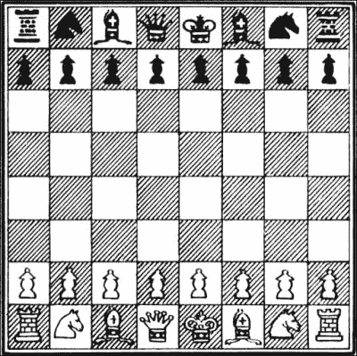

OpenCV 有一个非常方便的实用函数叫做`cornerHarris`，它可以检测图像中的角落。说明这个功能的代码非常简单：

```py
import cv2
import numpy as np

img = cv2.imread('images/chess_board.png')
gray = cv2.cvtColor(img, cv2.COLOR_BGR2GRAY)
gray = np.float32(gray)
dst = cv2.cornerHarris(gray, 2, 23, 0.04)
img[dst>0.01 * dst.max()] = [0, 0, 255] 
while (True):
  cv2.imshow('corners', img)
  if cv2.waitKey(1000 / 12) & 0xff == ord("q"):
    break
cv2.destroyAllWindows()
```

让我们分析一下代码：在常规导入之后，我们加载棋盘图像并将其转换为灰度，这样`cornerHarris`就可以计算它了。然后，我们调用`cornerHarris`函数：

```py
dst = cv2.cornerHarris(gray, 2, 23, 0.04)
```

这里最重要的参数是第三个参数，它定义了 Sobel 算子的孔径。Sobel 算子通过在图像的行和列中进行变化检测来检测边缘，它使用一个核来实现这一点。OpenCV 的`cornerHarris`函数使用一个 Sobel 算子，其孔径由这个参数定义。简单来说，它定义了角落检测的敏感性。它必须在 3 到 31 之间，并且必须是奇数。在值为 3 时，所有那些黑方块的对角线都会在接触到方块边界时被注册为角落。在值为 23 时，只有每个方块的角落会被检测为角落。

考虑以下行：

```py
img[dst>0.01 * dst.max()] = [0, 0, 255] 
```

这里，在检测到角落红色标记的地方，调整`cornerHarris`的第二个参数将改变这一点，也就是说，值越小，表示角落的标记就越小。

这里是最终的结果：

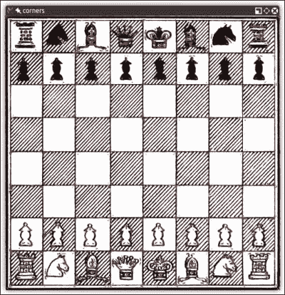

太好了，我们已经标记了角落点，并且结果一目了然；所有的角落都用红色标记。

## 使用 DoG 和 SIFT 进行特征提取和描述

前面的技术，使用`cornerHarris`，非常适合检测角落，并且具有明显的优势，因为角落就是角落；即使图像被旋转，它们也能被检测到。

然而，如果我们减小（或增加）图像的大小，图像的一些部分可能会失去或甚至获得角落的特性。

例如，看看以下 F1 意大利大奖赛赛道角落的检测：

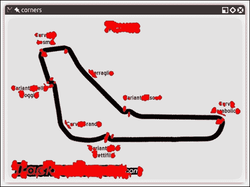

这里是同一张截图的较小版本：

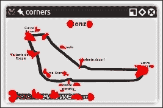

你会注意到角落变得更加紧凑；然而，我们不仅获得了角落，还失去了一些！特别是，看看位于西北/东南直道末端的**Variante Ascari**弯道。在图像的大版本中，双弯道的入口和顶点都被检测为角落。在较小的图像中，顶点没有被检测为这样的角落。我们越减少图像的大小，就越有可能失去这个弯道的入口。

这种特征丢失引发了一个问题；我们需要一个无论图像尺度如何都能工作的算法。进入**SIFT**：虽然**尺度不变特征变换**可能听起来有点神秘，但既然我们知道我们正在尝试解决的问题，它实际上是有意义的。我们需要一个函数（一个变换），它将检测特征（一个特征变换）并且不会根据图像的尺度输出不同的结果（一个尺度不变特征变换）。请注意，SIFT 不检测关键点（这是通过高斯差分完成的），而是通过特征向量描述它们周围区域。

现在对**高斯差分**（**DoG**）进行简要介绍；我们之前已经讨论了低通滤波器和模糊操作，特别是使用`cv2.GaussianBlur()`函数。DoG 是将高斯滤波器应用于同一图像的结果。在第三章，*使用 OpenCV 3 处理图像*中，我们应用了这种技术来计算非常有效的边缘检测，其思想是相同的。DoG 操作的最后结果包含感兴趣区域（关键点），然后通过 SIFT 对这些关键点进行描述。

让我们看看 SIFT 在一个充满角和特征的图像中的表现：

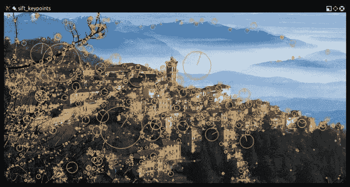

现在，瓦雷泽（意大利伦巴第）美丽的全景也获得了计算机视觉的意义。以下是获取此处理图像所使用的代码：

```py
import cv2
import sys
import numpy as np

imgpath = sys.argv[1]
img = cv2.imread(imgpath)

gray = cv2.cvtColor(img, cv2.COLOR_BGR2GRAY)

sift = cv2.xfeatures2d.SIFT_create()
keypoints, descriptor = sift.detectAndCompute(gray,None)

img = cv2.drawKeypoints(image=img, outImage=img, keypoints = keypoints, flags = cv2.DRAW_MATCHES_FLAGS_DRAW_RICH_KEYPOINT, color = (51, 163, 236))

cv2.imshow('sift_keypoints', img)
while (True):
  if cv2.waitKey(1000 / 12) & 0xff == ord("q"):
    break
cv2.destroyAllWindows()
```

在常规导入之后，我们加载我们想要处理的图像。为了使这个脚本通用，我们将使用 Python 的`sys`模块将图像路径作为命令行参数：

```py
imgpath = sys.argv[1]
img = cv2.imread(imgpath)

gray = cv2.cvtColor(img, cv2.COLOR_BGR2GRAY)
```

然后，我们将图像转换为灰度。在这个阶段，你可能已经注意到，Python 中的大多数处理算法都需要灰度输入才能工作。

下一步是创建一个 SIFT 对象并计算灰度图像：

```py
sift = cv2.xfeatures2d.SIFT_create()
keypoints, descriptor = sift.detectAndCompute(gray,None)
```

这是一个有趣且重要的过程；SIFT 对象使用 DoG 来检测关键点并为每个关键点周围区域计算特征向量。正如方法名称清楚地表明的那样，这里执行了两个主要操作：检测和计算。操作的返回值是一个包含关键点信息（关键点）和描述符的元组。

最后，我们通过在图像上绘制关键点并使用常规的`imshow`函数显示它来处理这个图像。

注意，在`drawKeypoints`函数中，我们传递一个值为 4 的标志。这实际上是`cv2`模块属性：

```py
cv2.DRAW_MATCHES_FLAGS_DRAW_RICH_KEYPOINT
```

这段代码使得绘制圆圈和每个关键点的方向成为可能。

### 关键点的解剖结构

让我们快速查看从 OpenCV 文档中获取的关键点类的定义：

```py
pt
size
angle
response
octave 
class_id
```

一些属性比其他属性更易于解释，但让我们不要想当然，而是逐一解释：

+   `pt`（点）属性表示关键点在图像中的*x*和*y*坐标。

+   `size`属性表示特征的直径。

+   `angle`属性表示特征的方向，如前述处理过的图像所示。

+   `response`属性表示关键点的强度。一些特征被 SIFT 分类为比其他特征更强，而`response`是您用来评估特征强度属性。

+   `octave`属性表示在金字塔中找到特征的层。要完全解释这个属性，我们需要写整整一章，所以这里我只介绍基本概念。SIFT 算法的操作方式类似于人脸检测算法，即它按顺序处理相同的图像，但改变计算参数。

    例如，图像的尺度以及相邻像素是算法每次迭代（`octave`）中变化的参数。因此，`octave`属性表示关键点被检测到的层。

+   最后，对象 ID 是关键点的 ID。

## 使用快速 Hessian 和 SURF 进行特征提取和检测

计算机视觉是计算机科学相对较新的一个分支，许多算法和技术都是最近发明的。实际上，SIFT 只有 16 年的历史，由 David Lowe 于 1999 年发表。

SURF 是由 Herbert Bay 于 2006 年发表的特征检测算法，比 SIFT 快几倍，并且部分受其启发。

### 注意

注意，SIFT 和 SURF 都是专利算法，因此它们被包含在 OpenCV 的`xfeatures2d`模块中。

理解 SURF 在底层是如何工作的，对我们这本书来说并不特别相关，因为我们可以在我们的应用中使用它，并充分利用它。重要的是要理解的是，SURF 是一个 OpenCV 类，使用快速 Hessian 算法进行关键点检测，使用 SURF 进行提取，就像 OpenCV 中的 SIFT 类使用 DoG 进行关键点检测，使用 SIFT 进行提取一样。

另外，好消息是作为一个特征检测算法，SURF 的 API 与 SIFT 没有区别。因此，我们可以简单地编辑之前的脚本，动态选择一个特征检测算法，而不是重写整个程序。

由于我们现在只支持两种算法，因此没有必要为评估要使用的算法寻找特别优雅的解决方案，我们将使用简单的`if`块，如下面的代码所示：

```py
import cv2
import sys
import numpy as np

imgpath = sys.argv[1]
img = cv2.imread(imgpath)
alg = sys.argv[2]

def fd(algorithm):
  if algorithm == "SIFT":
    return cv2.xfeatures2d.SIFT_create()
  if algorithm == "SURF":
    return cv2.xfeatures2d.SURF_create(float(sys.argv[3]) if len(sys.argv) == 4 else 4000)

gray = cv2.cvtColor(img, cv2.COLOR_BGR2GRAY)

fd_alg = fd(alg)
keypoints, descriptor = fd_alg.detectAndCompute(gray,None)

img = cv2.drawKeypoints(image=img, outImage=img, keypoints = keypoints, flags = 4, color = (51, 163, 236))

cv2.imshow('keypoints', img)
while (True):
  if cv2.waitKey(1000 / 12) & 0xff == ord("q"):
    break
cv2.destroyAllWindows()
```

这是使用 SURF 和阈值的结果：

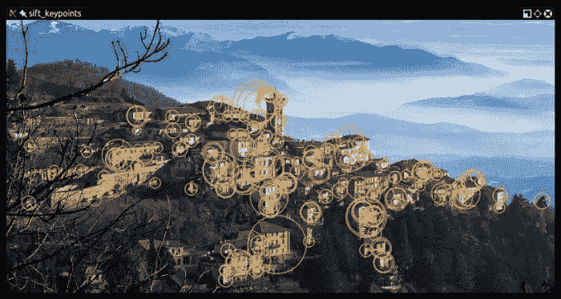

这张图像是通过使用 8000 的 Hessian 阈值对它进行 SURF 算法处理获得的。更准确地说，我运行了以下命令：

```py
> python feat_det.py images/varese.jpg SURF 8000

```

阈值越高，识别的特征越少，所以尝试调整这些值，直到达到最佳检测。在前面的例子中，你可以清楚地看到单个建筑物是如何被检测为特征的。

在与我们在第四章中采用的过程类似的过程中，当我们计算视差图时，尝试——作为一个练习——创建一个滑块来将 Hessian 阈值值输入到 SURF 实例中，并观察特征数量以相反比例增加和减少。

现在，让我们用 FAST、BRIEF 关键点描述符和 ORB（它使用了这两个）来检查角点检测，并充分利用特征检测。

## ORB 特征检测与特征匹配

如果 SIFT 是年轻的，SURF 更年轻，那么 ORB 还处于婴儿期。ORB 首次于 2011 年作为 SIFT 和 SURF 的快速替代方案发表。

该算法发表在论文中，*ORB：SIFT 或 SURF 的有效替代方案*，并以 PDF 格式在[`www.vision.cs.chubu.ac.jp/CV-R/pdf/Rublee_iccv2011.pdf`](http://www.vision.cs.chubu.ac.jp/CV-R/pdf/Rublee_iccv2011.pdf)提供。

ORB 结合了 FAST 关键点检测和 BRIEF 描述符中使用的技巧，因此确实值得先快速查看 FAST 和 BRIEF。然后我们将讨论暴力匹配——用于特征匹配的算法之一——并展示一个特征匹配的例子。

### FAST

**加速分割测试（FAST**）算法以一种巧妙的方式进行工作；它在包括 16 个像素的周围画一个圆。然后，它将每个像素标记得比圆心亮或暗，与特定的阈值进行比较。一个角点通过识别被标记为亮或暗的连续像素的数量来定义。

FAST 实现了一个高速测试，试图快速跳过整个 16 像素测试。为了理解这个测试是如何工作的，让我们看看这张截图：

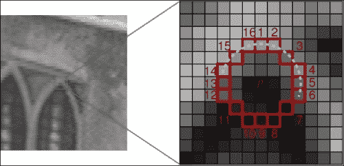

如你所见，四个测试像素中的三个（像素编号**1**、**9**、**5**和**13**）必须在阈值（因此，被标记为亮或暗）内（或超出阈值）和一侧，而另一个必须在阈值另一侧。如果所有四个都被标记为亮或暗，或者两个被标记，两个未被标记，则该像素不是候选角点。

FAST 是一个非常巧妙的算法，但并非没有弱点，为了弥补这些弱点，分析图像的开发者可以实施机器学习方法，将一组图像（与您的应用相关）输入到算法中，以便优化角点检测。

尽管如此，FAST 仍然依赖于一个阈值，因此开发者的输入总是必要的（与 SIFT 不同）。

### BRIEF

**二进制** **鲁棒独立基本特征**（**BRIEF**）另一方面，不是一个特征检测算法，而是一个描述符。我们尚未探讨这个概念，所以让我们解释一下什么是描述符，然后看看 BRIEF。

你会注意到，当我们之前使用 SIFT 和 SURF 分析图像时，整个过程的精髓是调用`detectAndCompute`函数。这个函数执行两个不同的步骤：检测和计算，如果将它们组合成一个元组，它们会返回两个不同的结果。

检测的结果是一组关键点；计算的结果是描述符。这意味着 OpenCV 的 SIFT 和 SURF 类都是检测器和描述符（尽管，记住，原始算法不是！OpenCV 的 SIFT 实际上是 DoG 加上 SIFT，OpenCV 的 SURF 实际上是快速 Hessian 加上 SURF）。

关键点描述符是图像的一种表示，它是特征匹配的门户，因为你可以比较两个图像的关键点描述符并找到共同点。

BRIEF 是目前可用的最快的描述符之一。BRIEF 背后的理论实际上相当复杂，但简单来说，BRIEF 采用了一系列优化，使其成为特征匹配的一个非常好的选择。

### 强力匹配

强力匹配器是一种描述符匹配器，它比较两个描述符并生成一个结果，即匹配列表。之所以称为强力匹配器，是因为算法中涉及到的优化很少；第一个描述符中的所有特征都与第二个描述符中的特征进行比较，每个比较都给出一个距离值，最佳结果被认为是匹配。

这就是为什么它被称为强力匹配。在计算中，术语“强力匹配”通常与一种优先考虑穷尽所有可能组合（例如，破解密码的所有可能字符组合）的方法有关，而不是一些巧妙且复杂的算法逻辑。OpenCV 提供了一个`BFMatcher`对象，它正是这样做的。

## 使用 ORB 进行特征匹配

现在我们已经对 FAST 和 BRIEF 有了大致的了解，我们可以理解为什么 ORB 背后的团队（当时由 Ethan Rublee、Vincent Rabaud、Kurt Konolige 和 Gary R. Bradski 组成）选择了这两个算法作为 ORB 的基础。

在他们的论文中，作者旨在实现以下结果：

+   将快速且精确的定向组件添加到 FAST 中

+   高效计算定向 BRIEF 特征

+   定向 BRIEF 特征的分析方差和相关性

+   一种在旋转不变性下解相关 BRIEF 特征的学习方法，从而在最近邻应用中提高性能。

除了非常专业的术语之外，主要观点相当清晰；ORB 旨在优化和加速操作，包括利用 BRIEF 的旋转感知方式，这样即使在训练图像与查询图像具有非常不同的旋转的情况下，匹配也可以得到改善。

然而，在这个阶段，我敢打赌您已经对理论感到厌倦，并想要深入一些特征匹配，所以让我们看看一些代码。

作为一位热衷的音乐听众，我首先想到的例子是获取乐队的标志并将其与该乐队的一张专辑进行匹配：

```py
import numpy as np
import cv2
from matplotlib import pyplot as plt

img1 = cv2.imread('images/manowar_logo.png',cv2.IMREAD_GRAYSCALE)
img2 = cv2.imread('images/manowar_single.jpg', cv2.IMREAD_GRAYSCALE)

orb = cv2.ORB_create()
kp1, des1 = orb.detectAndCompute(img1,None)
kp2, des2 = orb.detectAndCompute(img2,None)
bf = cv2.BFMatcher(cv2.NORM_HAMMING, crossCheck=True)
matches = bf.match(des1,des2)
matches = sorted(matches, key = lambda x:x.distance)
img3 = cv2.drawMatches(img1,kp1,img2,kp2, matches[:40], img2,flags=2)
plt.imshow(img3),plt.show()
```

现在我们一步一步地检查这段代码。

在常规导入之后，我们加载了两张图像（查询图像和训练图像）。

注意，您可能已经看到使用第二个参数（值为 0）加载图像。这是因为 `cv2.imread` 接受第二个参数，可以是以下标志之一：

```py
    IMREAD_ANYCOLOR = 4
    IMREAD_ANYDEPTH = 2
    IMREAD_COLOR = 1
    IMREAD_GRAYSCALE = 0
    IMREAD_LOAD_GDAL = 8
    IMREAD_UNCHANGED = -1
```

如您所见，`cv2.IMREAD_GRAYSCALE` 等于 `0`，因此您可以传递标志本身或其值；它们是同一件事。

这是我们加载的图像：

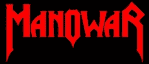

这是我们加载的另一个图像：

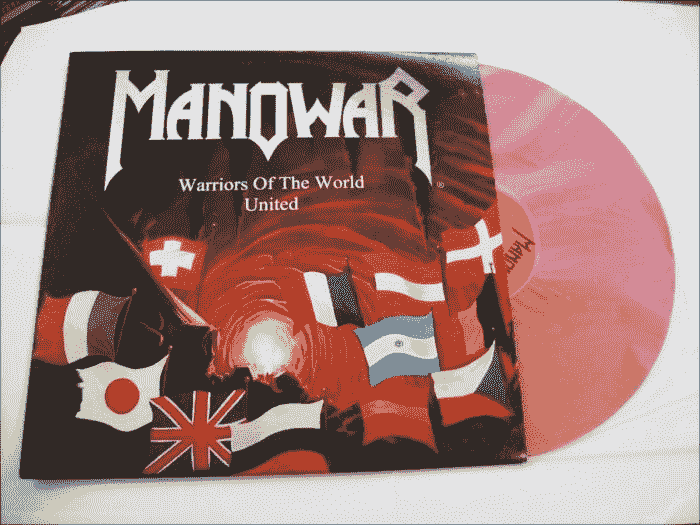

现在，我们继续创建 ORB 特征检测器和描述符：

```py
orb = cv2.ORB_create()
kp1, des1 = orb.detectAndCompute(img1,None)
kp2, des2 = orb.detectAndCompute(img2,None)
```

与我们之前对 SIFT 和 SURF 所做的方式类似，我们对两张图像都检测并计算了关键点和描述符。

到目前为止，理论相当简单；遍历描述符并确定它们是否匹配，然后计算这个匹配的质量（距离）并排序匹配，这样我们就可以以一定的置信度显示前 *n* 个匹配，这些匹配实际上是在两张图像上的匹配特征。

`BFMatcher`，如 brute-force matching 中所述，为我们做了这件事：

```py
bf = cv2.BFMatcher(cv2.NORM_HAMMING, crossCheck=True)
matches = bf.match(des1,des2)
matches = sorted(matches, key = lambda x:x.distance)
```

在这个阶段，我们已经有所有需要的信息，但作为计算机视觉爱好者，我们非常重视数据的可视化表示，所以让我们在 `matplotlib` 图表中绘制这些匹配：

```py
img3 = cv2.drawMatches(img1,kp1,img2,kp2, matches[:40], img2,flags=2)
plt.imshow(img3),plt.show()
```

结果如下：

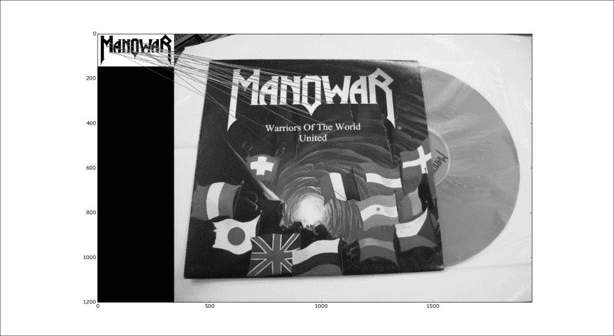

## 使用 K-最近邻匹配

有许多算法可以用来检测匹配，以便我们可以绘制它们。其中之一是**K-最近邻**（**KNN**）。对于不同的任务使用不同的算法可能非常有益，因为每种算法都有其优势和劣势。有些可能比其他更准确，有些可能更快或计算成本更低，所以您需要根据手头的任务来决定使用哪个。

例如，如果您有硬件限制，您可能选择成本较低的算法。如果您正在开发实时应用程序，您可能选择最快的算法，无论它对处理器或内存使用有多重。

在所有机器学习算法中，KNN 可能是最简单的，尽管其背后的理论很有趣，但它超出了本书的范围。相反，我们将简单地展示如何在你的应用程序中使用 KNN，这与前一个例子没有太大区别。

关键的是，将脚本切换到 KNN 的两个地方在于我们使用 Brute-Force 匹配器计算匹配的方式，以及我们绘制这些匹配的方式。经过编辑以使用 KNN 的前一个例子看起来像这样：

```py
import numpy as np
import cv2
from matplotlib import pyplot as plt

img1 = cv2.imread('images/manowar_logo.png',0)
img2 = cv2.imread('images/manowar_single.jpg',0)

orb = cv2.ORB_create()
kp1, des1 = orb.detectAndCompute(img1,None)
kp2, des2 = orb.detectAndCompute(img2,None)
bf = cv2.BFMatcher(cv2.NORM_HAMMING, crossCheck=True)
matches = bf.knnMatch(des1,des2, k=2)
img3 = cv2.drawMatchesKnn(img1,kp1,img2,kp2, matches, img2,flags=2)
plt.imshow(img3),plt.show()
```

最终结果与之前的一个相似，那么 `match` 和 `knnMatch` 之间的区别是什么？区别在于 `match` 返回最佳匹配，而 KNN 返回 *k* 个匹配，这给了开发者进一步操作使用 `knnMatch` 获得的匹配项的选项。

例如，你可以遍历匹配项并应用一个比率测试，这样你就可以过滤掉不满足用户定义条件的匹配项。

## 基于 FLANN 的匹配

最后，我们将看看**快速近似最近邻库**（**FLANN**）。FLANN 的官方互联网主页是[`www.cs.ubc.ca/research/flann/`](http://www.cs.ubc.ca/research/flann/)。

与 ORB 类似，FLANN 拥有比 SIFT 或 SURF 更宽松的许可证，因此你可以自由地在你的项目中使用它。引用 FLANN 的网站，

> *"FLANN 是一个用于在高维空间中执行快速近似最近邻搜索的库。它包含了一组我们发现对最近邻搜索效果最好的算法，以及一个根据数据集自动选择最佳算法和最佳参数的系统。"*
> 
> *FLANN 是用 C++编写的，并为以下语言提供了绑定：C、MATLAB 和 Python。"*

换句话说，FLANN 拥有内部机制，试图根据数据本身来采用最佳算法处理数据集。FLANN 已被证明比其他最近邻搜索软件快 10 倍。

FLANN 甚至可以在 GitHub 上找到，地址是[`github.com/mariusmuja/flann`](https://github.com/mariusmuja/flann)。根据我的经验，我发现基于 FLANN 的匹配非常准确、快速，并且易于使用。

让我们看看一个基于 FLANN 的特征匹配的例子：

```py
import numpy as np
import cv2
from matplotlib import pyplot as plt

queryImage = cv2.imread('images/bathory_album.jpg',0)
trainingImage = cv2.imread('images/vinyls.jpg',0)

# create SIFT and detect/compute
sift = cv2.xfeatures2d.SIFT_create()
kp1, des1 = sift.detectAndCompute(queryImage,None)
kp2, des2 = sift.detectAndCompute(trainingImage,None)

# FLANN matcher parameters
FLANN_INDEX_KDTREE = 0
indexParams = dict(algorithm = FLANN_INDEX_KDTREE, trees = 5)
searchParams = dict(checks=50)   # or pass empty dictionary

flann = cv2.FlannBasedMatcher(indexParams,searchParams)

matches = flann.knnMatch(des1,des2,k=2)

# prepare an empty mask to draw good matches
matchesMask = [[0,0] for i in xrange(len(matches))]

# David G. Lowe's ratio test, populate the mask
for i,(m,n) in enumerate(matches):
    if m.distance < 0.7*n.distance:
        matchesMask[i]=[1,0]

drawParams = dict(matchColor = (0,255,0),
                   singlePointColor = (255,0,0),
                   matchesMask = matchesMask,
                   flags = 0)

resultImage = cv2.drawMatchesKnn(queryImage,kp1,trainingImage,kp2,matches,None,**drawParams)

plt.imshow(resultImage,), plt.show()
```

在这个阶段，前一个脚本的一些部分可能对你来说很熟悉（模块导入、图像加载和创建 SIFT 对象）。

### 注意

最有趣的部分是 FLANN 匹配器的声明，它遵循了[`www.cs.ubc.ca/~mariusm/uploads/FLANN/flann_manual-1.6.pdf`](http://www.cs.ubc.ca/~mariusm/uploads/FLANN/flann_manual-1.6.pdf)上的文档。

我们发现 FLANN 匹配器接受两个参数：一个 `indexParams` 对象和一个 `searchParams` 对象。这些参数以字典形式传递给 Python（在 C++ 中为 struct），并决定了 FLANN 内部使用的索引和搜索对象的行为。

在这种情况下，我们可以选择`LinearIndex`、`KTreeIndex`、`KMeansIndex`、`CompositeIndex`和`AutotuneIndex`，我们选择了`KTreeIndex`。为什么？这是因为它足够简单以便配置（只需要用户指定要处理的核密度树的数量；一个良好的值在 1 到 16 之间）并且足够聪明（kd 树是并行处理的）。`searchParams`字典只包含一个字段（检查），它指定了索引树应该遍历的次数。值越高，匹配计算所需的时间越长，但也会更准确。

在现实中，程序的结果很大程度上取决于你输入的数据。我发现使用 5 个 kd 树和 50 次检查通常能得到相当准确的结果，同时完成时间也很短。

在创建 FLANN 匹配器和创建匹配数组之后，匹配将根据 Lowe 在其论文《Distinctive Image Features from Scale-Invariant Keypoints》中描述的测试进行过滤，该论文可在[`www.cs.ubc.ca/~lowe/papers/ijcv04.pdf`](https://www.cs.ubc.ca/~lowe/papers/ijcv04.pdf)找到。

在其章节“应用于物体识别”中，Lowe 解释说，并非所有匹配都是“好的”，并且根据任意阈值过滤并不总是能得到好的结果。相反，Lowe 博士解释说，

> *"匹配正确的概率可以通过取最近邻距离与第二近邻距离的比值来确定。"* 

在前面的例子中，丢弃任何大于 0.7 距离的值将导致只有少数几个好的匹配被过滤掉，同时去除大约 90%的误匹配。

让我们揭示 FLANN 的一个实际例子的结果。这是我提供给脚本的查询图像：

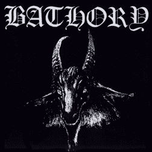

这是训练图像：

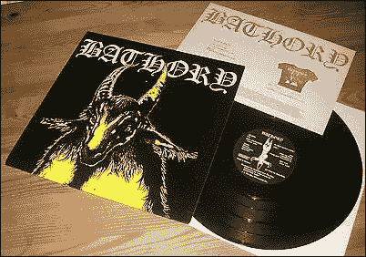

在这里，你可能注意到图像中包含查询图像位于这个网格的(5, 3)位置。

这是 FLANN 处理的结果：

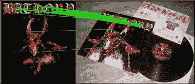

完美匹配！！

## 基于单应性的 FLANN 匹配

首先，什么是单应性？让我们从互联网上读一个定义：

> *"两个图形之间的关系，使得一个图形的任意一点对应另一个图形中的一个且仅有一个点，反之亦然。因此，在圆上滚动的切线切割圆的两个固定切线，形成两套同构点。"* 

如果你——像我一样——对前面的定义一无所知，你可能会发现这个解释更清晰：单应性是一种条件，其中两个图形在其中一个是对另一个的透视畸变时找到对方。

与所有前面的例子不同，让我们首先看看我们想要实现什么，这样我们就可以完全理解单应性是什么。然后，我们将通过代码来解释。以下是最终结果：

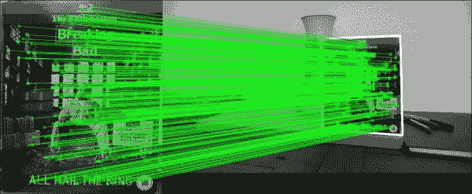

如从截图所示，我们在左侧取了一个主题，在右侧的图像中正确识别，在关键点之间绘制了匹配线，甚至绘制了一个白色边界，显示了右侧图像中种子主题的透视变形：

```py
import numpy as np
import cv2
from matplotlib import pyplot as plt

MIN_MATCH_COUNT = 10

img1 = cv2.imread('images/bb.jpg',0)
img2 = cv2.imread('images/color2_small.jpg',0)

sift = cv2.xfeatures2d.SIFT_create()
kp1, des1 = sift.detectAndCompute(img1,None)
kp2, des2 = sift.detectAndCompute(img2,None)

FLANN_INDEX_KDTREE = 0
index_params = dict(algorithm = FLANN_INDEX_KDTREE, trees = 5)
search_params = dict(checks = 50)

flann = cv2.FlannBasedMatcher(index_params, search_params)

matches = flann.knnMatch(des1,des2,k=2)

# store all the good matches as per Lowe's ratio test.
good = []
for m,n in matches:
    if m.distance < 0.7*n.distance:
        good.append(m)

if len(good)>MIN_MATCH_COUNT:
    src_pts = np.float32([ kp1[m.queryIdx].pt for m in good ]).reshape(-1,1,2)
    dst_pts = np.float32([ kp2[m.trainIdx].pt for m in good ]).reshape(-1,1,2)

    M, mask = cv2.findHomography(src_pts, dst_pts, cv2.RANSAC,5.0)
    matchesMask = mask.ravel().tolist()

    h,w = img1.shape
    pts = np.float32([ [0,0],[0,h-1],[w-1,h-1],[w-1,0] ]).reshape(-1,1,2)
    dst = cv2.perspectiveTransform(pts,M)

    img2 = cv2.polylines(img2,[np.int32(dst)],True,255,3, cv2.LINE_AA)

else:
    print "Not enough matches are found - %d/%d" % (len(good),MIN_MATCH_COUNT)
    matchesMask = None

draw_params = dict(matchColor = (0,255,0), # draw matches in green color
                   singlePointColor = None,
                   matchesMask = matchesMask, # draw only inliers
                   flags = 2)

img3 = cv2.drawMatches(img1,kp1,img2,kp2,good,None,**draw_params)

plt.imshow(img3, 'gray'),plt.show()
```

与之前的基于 FLANN 的匹配示例相比，唯一的区别（这也是所有动作发生的地方）在于 `if` 块中。

下面是这个代码步骤的逐步过程：首先，我们确保至少有足够数量的良好匹配（计算单应性所需的最小数量是四个），我们将任意设置为 10（在现实生活中，你可能使用比这更高的值）：

```py
if len(good)>MIN_MATCH_COUNT:
```

然后，我们在原始图像和训练图像中找到关键点：

```py
src_pts = np.float32([ kp1[m.queryIdx].pt for m in good ]).reshape(-1,1,2)
dst_pts = np.float32([ kp2[m.trainIdx].pt for m in good ]).reshape(-1,1,2)
```

现在，我们找到单应性：

```py
M, mask = cv2.findHomography(src_pts, dst_pts, cv2.RANSAC,5.0)
matchesMask = mask.ravel().tolist()
```

注意，我们创建了 `matchesMask`，它将在最终绘制匹配时使用，这样只有位于单应性内的点才会绘制匹配线。

在这个阶段，我们只需计算原始物体到第二张图片的透视畸变，以便我们可以绘制边界：

```py
h,w = img1.shape
pts = np.float32([ [0,0],[0,h-1],[w-1,h-1],[w-1,0] ]).reshape(-1,1,2)
dst = cv2.perspectiveTransform(pts,M)
img2 = cv2.polylines(img2,[np.int32(dst)],True,255,3, cv2.LINE_AA)
```

然后，我们继续按照所有之前的示例进行绘制。

## 一个示例应用 – 纹身法医

让我们用一个真实（或类似）的例子来结束这一章。想象一下，你正在为哥谭市法医部门工作，你需要识别一个纹身。你有一张纹身的原始图片（想象一下这是来自监控录像的），属于一个罪犯，但你不知道这个人的身份。然而，你拥有一个纹身数据库，用纹身属于的人的名字进行索引。

因此，让我们将任务分为两部分：首先将图像描述符保存到文件中，然后，扫描这些文件以匹配我们用作查询图像的图片。

### 将图像描述符保存到文件

我们首先要做的事情是将图像描述符保存到外部文件。这样我们就不必每次想要扫描两张图像以查找匹配和单应性时都重新创建描述符。

在我们的应用中，我们将扫描一个文件夹中的图像，并创建相应的描述符文件，以便我们可以在未来的搜索中随时使用。

要创建描述符并将它们保存到文件中，我们将使用在本章中多次使用的过程，即加载一个图像，创建一个特征检测器，检测，并计算：

```py
# generate_descriptors.py
import cv2
import numpy as np
from os import walk
from os.path import join
import sys

def create_descriptors(folder):
  files = []
  for (dirpath, dirnames, filenames) in walk(folder):
    files.extend(filenames)
  for f in files:
    save_descriptor(folder, f, cv2.xfeatures2d.SIFT_create())

def save_descriptor(folder, image_path, feature_detector):
  img = cv2.imread(join(folder, image_path), 0)
  keypoints, descriptors = feature_detector.detectAndCompute(img, None)
  descriptor_file = image_path.replace("jpg", "npy")
  np.save(join(folder, descriptor_file), descriptors)

dir = sys.argv[1]

create_descriptors(dir)
```

在这个脚本中，我们传递包含所有图像的文件夹名称，然后在同一文件夹中创建所有描述符文件。

NumPy 有一个非常方便的 `save()` 工具，它以优化的方式将数组数据写入文件。要在包含你的脚本的文件夹中生成描述符，请运行此命令：

```py
> python generate_descriptors.py <folder containing images>

```

注意，`cPickle/pickle` 是 Python 对象序列化的更受欢迎的库。然而，在这个特定的上下文中，我们试图将自己限制在仅使用 OpenCV 和 Python 与 NumPy 和 SciPy 的使用上。

### 扫描匹配

现在我们已经将描述符保存到文件中，我们只需要对所有描述符重复单应性过程，并找到与查询图像的潜在匹配。

这是我们将要实施的过程：

+   加载一个查询图像并为它创建一个描述符（`tattoo_seed.jpg`）

+   扫描包含描述符的文件夹

+   对于每个描述符，计算基于 FLANN 的匹配

+   如果匹配的数量超过一个任意的阈值，包括潜在的罪犯文件（记住我们正在调查犯罪）

+   在所有罪犯中，选择匹配数量最多的作为潜在嫌疑人

让我们检查代码以实现这一点：

```py
from os.path import join
from os import walk
import numpy as np
import cv2
from sys import argv

# create an array of filenames
folder = argv[1]
query = cv2.imread(join(folder, "tattoo_seed.jpg"), 0)

# create files, images, descriptors globals
files = []
images = []
descriptors = []
for (dirpath, dirnames, filenames) in walk(folder):
  files.extend(filenames)
  for f in files:
    if f.endswith("npy") and f != "tattoo_seed.npy":
      descriptors.append(f)
  print descriptors

# create the sift detector
sift = cv2.xfeatures2d.SIFT_create()
query_kp, query_ds = sift.detectAndCompute(query, None)

# create FLANN matcher
FLANN_INDEX_KDTREE = 0
index_params = dict(algorithm = FLANN_INDEX_KDTREE, trees = 5)
search_params = dict(checks = 50)
flann = cv2.FlannBasedMatcher(index_params, search_params)

# minimum number of matches
MIN_MATCH_COUNT = 10

potential_culprits = {}

print ">> Initiating picture scan..."
for d in descriptors:
  print "--------- analyzing %s for matches ------------" % d
  matches = flann.knnMatch(query_ds, np.load(join(folder, d)), k =2)
  good = []
  for m,n in matches:
      if m.distance < 0.7*n.distance:
          good.append(m)
  if len(good) > MIN_MATCH_COUNT:
    print "%s is a match! (%d)" % (d, len(good))
  else:
    print "%s is not a match" % d
  potential_culprits[d] = len(good)

max_matches = None
potential_suspect = None
for culprit, matches in potential_culprits.iteritems():
  if max_matches == None or matches > max_matches:
    max_matches = matches
    potential_suspect = culprit

print "potential suspect is %s" % potential_suspect.replace("npy", "").upper()
```

我将这个脚本保存为`scan_for_matches.py`。这个脚本中唯一的新颖之处在于使用了`numpy.load(filename)`，它将一个`npy`文件加载到`np`数组中。

运行脚本会产生以下输出：

```py
>> Initiating picture scan...
--------- analyzing posion-ivy.npy for matches ------------
posion-ivy.npy is not a match
--------- analyzing bane.npy for matches ------------
bane.npy is not a match
--------- analyzing two-face.npy for matches ------------
two-face.npy is not a match
--------- analyzing riddler.npy for matches ------------
riddler.npy is not a match
--------- analyzing penguin.npy for matches ------------
penguin.npy is not a match
--------- analyzing dr-hurt.npy for matches ------------
dr-hurt.npy is a match! (298)
--------- analyzing hush.npy for matches ------------
hush.npy is a match! (301)
potential suspect is HUSH.
```

如果我们将这个图形化表示，我们会看到如下：

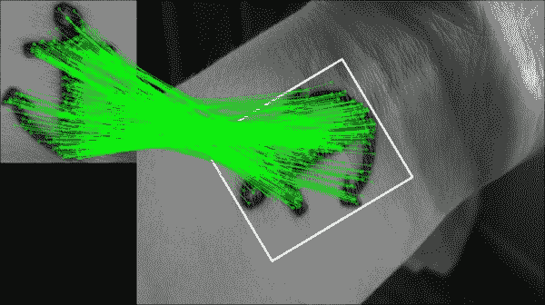

# 摘要

在本章中，我们学习了在图像中检测特征并将它们提取为描述符。我们探索了 OpenCV 中可用于完成此任务的多种算法，然后将它们应用于实际场景，以了解我们探索的概念在现实世界中的应用。

我们现在熟悉了在图像（或视频帧）中检测特征的概念，这是下一章的良好基础。
