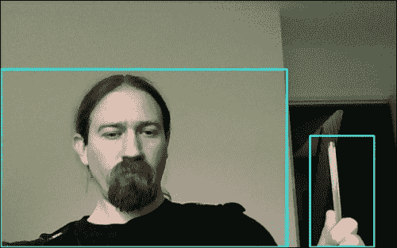
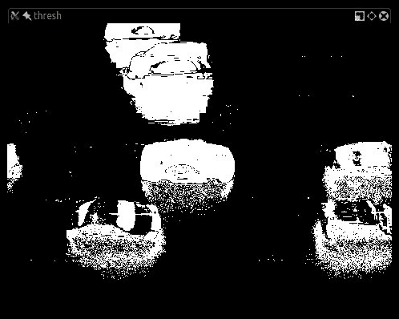
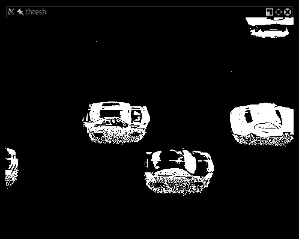
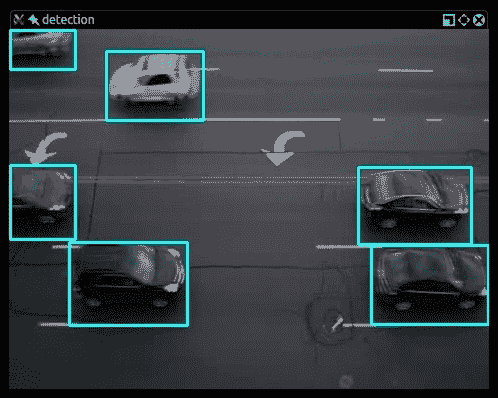
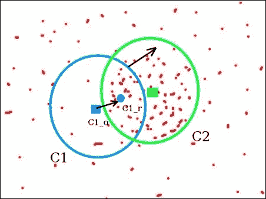
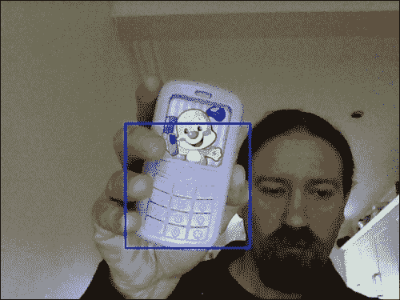
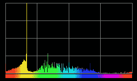
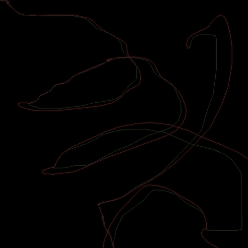
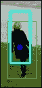

# 第八章：跟踪对象

在本章中，我们将探讨对象跟踪这一广泛的主题，它是从电影或视频输入中定位移动对象的过程。实时对象跟踪是许多计算机视觉应用（如监控、感知用户界面、增强现实、基于对象的视频压缩和驾驶员辅助）中的关键任务。

跟踪对象可以通过多种方式完成，最佳技术很大程度上取决于手头的任务。我们将学习如何识别移动对象并在帧之间跟踪它们。

# 检测移动对象

为了能够跟踪视频中的任何物体，我们需要完成的第一项任务是识别视频帧中对应于移动对象的区域。

在视频中跟踪对象有许多方法，它们都满足略微不同的目的。例如，你可能想跟踪任何移动的物体，在这种情况下，帧之间的差异将有所帮助；你可能想跟踪视频中移动的手，在这种情况下，基于皮肤颜色的 Meanshift 是最合适的解决方案；你可能想跟踪一个你知道其外观的特定对象，在这种情况下，模板匹配等技术将有所帮助。

目标跟踪技术可能相当复杂，让我们按难度递增的顺序来探讨它们，从最简单的技术开始。

## 基本运动检测

第一个也是最直观的解决方案是计算帧之间的差异，或者计算一个被认为是“背景”的帧与所有其他帧之间的差异。

让我们看看这种方法的一个例子：

```py
import cv2
import numpy as np

camera = cv2.VideoCapture(0)

es = cv2.getStructuringElement(cv2.MORPH_ELLIPSE, (9,4))
kernel = np.ones((5,5),np.uint8)
background = None

while (True):
  ret, frame = camera.read()
  if background is None:
    background = cv2.cvtColor(frame, cv2.COLOR_BGR2GRAY)
    background = cv2.GaussianBlur(background, (21, 21), 0)
    continue

  gray_frame = cv2.cvtColor(frame, cv2.COLOR_BGR2GRAY)
  gray_frame = cv2.GaussianBlur(gray_frame, (21, 21), 0)

  diff = cv2.absdiff(background, gray_frame)
  diff = cv2.threshold(diff, 25, 255, cv2.THRESH_BINARY)[1]
  diff = cv2.dilate(diff, es, iterations = 2)
  image, cnts, hierarchy = cv2.findContours(diff.copy(), cv2.RETR_EXTERNAL, cv2.CHAIN_APPROX_SIMPLE)

  for c in cnts:
    if cv2.contourArea(c) < 1500:
      continue
    (x, y, w, h) = cv2.boundingRect(c)
    cv2.rectangle(frame, (x, y), (x + w, y + h), (0, 255, 0), 2)

  cv2.imshow("contours", frame)
  cv2.imshow("dif", diff)
  if cv2.waitKey(1000 / 12) & 0xff == ord("q"):
      break

cv2.destroyAllWindows()
camera.release()
```

在完成必要的导入之后，我们打开从默认系统相机获取的视频输入，并将第一帧设置为整个输入的背景。从那时起读取的每一帧都会被处理，以计算背景与帧本身的差异。这是一个简单的操作：

```py
diff = cv2.threshold(diff, 25, 255, cv2.THRESH_BINARY)[1]
```

然而，在我们开始之前，我们需要为处理准备我们的帧。我们首先做的事情是将帧转换为灰度并稍微模糊一下：

```py
gray_frame = cv2.cvtColor(frame, cv2.COLOR_BGR2GRAY)
gray_frame = cv2.GaussianBlur(gray_frame, (21, 21), 0)
```

### 注意

你可能会对模糊处理感到好奇：我们模糊图像的原因是，在每一帧视频输入中，都存在来自自然振动、光照变化以及相机本身产生的自然噪声。我们希望平滑这些噪声，以免它们被检测为运动并随之被追踪。

现在我们已经将帧转换为灰度并平滑处理，我们可以计算与背景（背景也已被转换为灰度并平滑处理）的差异，并获得差异图。但这不是唯一的处理步骤。我们还将应用一个阈值，以获得黑白图像，并膨胀图像，以便将孔洞和不完美之处标准化，如下所示：

```py
diff = cv2.absdiff(background, gray_frame)  
diff = cv2.threshold(diff, 25, 255, cv2.THRESH_BINARY)[1]
diff = cv2.dilate(diff, es, iterations = 2)
```

注意，腐蚀和膨胀也可以作为噪声过滤器，就像我们应用的模糊一样，并且也可以通过一个函数调用使用`cv2.morphologyEx`获得，我们明确展示这两个步骤是为了透明度。此时，我们剩下的唯一任务是找到计算差异图中所有白色团块的轮廓，并将它们显示出来。可选地，我们只显示大于任意阈值的矩形轮廓，这样就不会显示微小的移动。当然，这取决于您和您的应用需求。在恒定照明和非常无噪声的摄像头下，您可能希望没有轮廓最小尺寸的阈值。这就是我们显示矩形的方式：

```py
image, cnts, hierarchy = cv2.findContours(diff.copy(), cv2.RETR_EXTERNAL, cv2.CHAIN_APPROX_SIMPLE)
for c in cnts:
    if cv2.contourArea(c) < 1500:
      continue
    (x, y, w, h) = cv2.boundingRect(c)
    cv2.rectangle(frame, (x, y), (x + w, y + h), (255, 255, 0), 2)

cv2.imshow("contours", frame)
cv2.imshow("dif", diff)
```

OpenCV 提供了两个非常实用的函数：

+   `cv2.findContours`：此函数计算图像中主体的轮廓

+   `cv2.boundinRect`：此函数计算它们的边界框

所以，这就是它了，一个带有主体周围矩形的简单运动检测器。最终结果可能像这样：



对于这样简单的技术，这相当准确。然而，有一些缺点使得这种方法不适合所有商业需求，最值得注意的是，您需要一个“默认”的第一帧来设置为背景。在例如户外摄像头等情况下，灯光变化相当频繁，这个过程导致了一种相当不灵活的方法，因此我们需要在我们的系统中加入更多的智能。这就是背景减除器发挥作用的地方。

# 背景减除器 – KNN、MOG2 和 GMG

OpenCV 提供了一个名为`BackgroundSubtractor`的类，这是一种方便操作前景和背景分割的方法。

这与我们在第三章中分析的 GrabCut 算法类似，即*使用 OpenCV 3 处理图像*，然而，`BackgroundSubtractor`是一个功能齐全的类，拥有众多方法，不仅执行背景减除，而且通过机器学习提高背景检测的速度，并允许您将分类器保存到文件中。

为了熟悉`BackgroundSubtractor`，让我们看看一个基本示例：

```py
import numpy as np
import cv2

cap = cv2.VideoCapture')

mog = cv2.createBackgroundSubtractorMOG2()

while(1):
    ret, frame = cap.read()
    fgmask = mog.apply(frame)
    cv2.imshow('frame',fgmask)
    if cv2.waitKey(30) & 0xff:
        break

cap.release()
cv2.destroyAllWindows()
```

让我们按顺序来讲解。首先，让我们谈谈背景减除对象。在 OpenCV 3 中，有三种背景减除器可供选择：**K-最近邻**（**KNN**）、**高斯混合模型**（**MOG2**）和**几何多重网格**（**GMG**），它们分别对应于计算背景减除所使用的算法。

您可能还记得，我们在第五章中已经详细讨论了前景和背景检测的主题，即*深度估计和分割*，特别是当我们谈到 GrabCut 和 Watershed 时。

那么，为什么我们需要 `BackgroundSubtractor` 类呢？背后的主要原因是 `BackgroundSubtractor` 类是专门为视频分析构建的，这意味着 OpenCV 的 `BackgroundSubtractor` 类会随着每一帧学习有关环境的一些信息。例如，使用 GMG，你可以指定用于初始化视频分析的帧数，默认为 120（大约是平均相机的 5 秒）。`BackgroundSubtractor` 类的恒定特性是它们在帧之间进行比较并存储历史记录，这使得它们随着时间的推移改进运动分析结果。

`BackgroundSubtractor` 类的另一个基本（而且坦白说，相当惊人）的特性是计算阴影的能力。这对于准确读取视频帧至关重要；通过检测阴影，你可以通过阈值化排除检测到的物体中的阴影区域，并专注于真实特征。这也大大减少了物体之间不想要的“合并”。图像比较将给你一个很好的概念，即我想说明的概念。以下是没有阴影检测的背景减除的示例：



这里是一个阴影检测（阴影已阈值化）的示例：



注意，阴影检测并不绝对完美，但它有助于将物体轮廓恢复到物体的原始形状。让我们看看使用 `BackgroundSubtractorKNN` 重新实现的运动检测示例：

```py
import cv2
import numpy as np

bs = cv2.createBackgroundSubtractorKNN(detectShadows = True)
camera = cv2.VideoCapture("/path/to/movie.flv")

while True:
  ret, frame = camera.read()
  fgmask = bs.apply(frame)
  th = cv2.threshold(fgmask.copy(), 244, 255, cv2.THRESH_BINARY)[1]
  dilated = cv2.dilate(th, cv2.getStructuringElement(cv2.MORPH_ELLIPSE, (3,3)), iterations = 2)
  image, contours, hier = cv2.findContours(dilated, cv2.RETR_EXTERNAL, cv2.CHAIN_APPROX_SIMPLE)
  for c in contours:
    if cv2.contourArea(c) > 1600:
      (x,y,w,h) = cv2.boundingRect(c)
      cv2.rectangle(frame, (x,y), (x+w, y+h), (255, 255, 0), 2)

  cv2.imshow("mog", fgmask)
  cv2.imshow("thresh", th)
  cv2.imshow("detection", frame)
  if cv2.waitKey(30) & 0xff == 27:
      break

camera.release()
cv2.destroyAllWindows()
```

由于减除器的准确性和检测阴影的能力，我们得到了非常精确的运动检测，即使相邻的物体也不会合并成一个检测，如下面的截图所示：



这是在少于 30 行代码的情况下取得的显著成果！

整个程序的核心是背景减除器的 `apply()` 方法；它计算前景掩码，这可以作为后续处理的基础：

```py
fgmask = bs.apply(frame)
th = cv2.threshold(fgmask.copy(), 244, 255, cv2.THRESH_BINARY)[1]
dilated = cv2.dilate(th, cv2.getStructuringElement(cv2.MORPH_ELLIPSE, (3,3)), iterations = 2)
image, contours, hier = cv2.findContours(dilated, cv2.RETR_EXTERNAL, cv2.CHAIN_APPROX_SIMPLE)
for c in contours:
    if cv2.contourArea(c) > 1600:
        (x,y,w,h) = cv2.boundingRect(c)
        cv2.rectangle(frame, (x,y), (x+w, y+h), (255, 255, 0), 2)
```

一旦获得前景掩码，我们可以应用一个阈值：前景掩码对前景使用白色值，对阴影使用灰色值；因此，在阈值图像中，所有几乎不是纯白色的像素（244-255）都被二值化为 0 而不是 1。

从那里，我们继续使用与基本运动检测示例相同的方法：识别物体、检测轮廓，并在原始帧上绘制它们。

## 均值漂移和 CAMShift

背景减除是一种非常有效的技术，但并不是跟踪视频中物体的唯一方法。Meanshift 是一种通过寻找概率函数（在我们的情况下，是图像中的感兴趣区域）的离散样本的最大密度并重新计算它来跟踪物体的算法，在下一帧中，这为算法提供了物体移动方向的指示。

这个计算会重复进行，直到质心与原始质心匹配，或者即使经过连续的计算迭代后保持不变。这种最终的匹配称为**收敛**。为了参考，该算法最初在论文《密度函数梯度的估计及其在模式识别中的应用》中描述，作者为 Fukunaga K.和 Hoestetler L.，发表在 IEEE，1975 年，可在[`ieeexplore.ieee.org/xpl/login.jsp?tp=&arnumber=1055330&url=http%3A%2F%2Fieeexplore.ieee.org%2Fxpls%2Fabs_all.jsp%3Farnumber%3D1055330`](http://ieeexplore.ieee.org/xpl/login.jsp?tp=&arnumber=1055330&url=http%3A%2F%2Fieeexplore.ieee.org%2Fxpls%2Fabs_all.jsp%3Farnumber%3D1055330)（请注意，这篇论文不可免费下载）。

这里是这个过程的视觉表示：



除了理论之外，Meanshift 在跟踪视频中的特定感兴趣区域时非常有用，这有一系列的影响；例如，如果你事先不知道你想要跟踪的区域是什么，你将不得不巧妙地管理它，并开发出能够根据任意标准动态开始跟踪（并停止跟踪）视频的某些区域的程序。一个例子可能是你使用训练好的 SVM 进行对象检测，然后开始使用 Meanshift 来跟踪检测到的对象。

我们不要一开始就使生活变得复杂；首先让我们熟悉一下 Meanshift，然后再在更复杂的场景中使用它。

我们将首先简单地标记一个感兴趣的区域，并跟踪它，如下所示：

```py
import numpy as np
import cv2

cap = cv2.VideoCapture(0)
ret,frame = cap.read()
r,h,c,w = 10, 200, 10, 200
track_window = (c,r,w,h)

roi = frame[r:r+h, c:c+w]
hsv_roi =  cv2.cvtColor(frame, cv2.COLOR_BGR2HSV)
mask = cv2.inRange(hsv_roi, np.array((100., 30.,32.)), np.array((180.,120.,255.)))

roi_hist = cv2.calcHist([hsv_roi],[0],mask,[180],[0,180])
cv2.normalize(roi_hist,roi_hist,0,255,cv2.NORM_MINMAX)

term_crit = ( cv2.TERM_CRITERIA_EPS | cv2.TERM_CRITERIA_COUNT, 10, 1 )

while True:
    ret ,frame = cap.read()

    if ret == True:
        hsv = cv2.cvtColor(frame, cv2.COLOR_BGR2HSV)
        dst = cv2.calcBackProject([hsv],[0],roi_hist,[0,180],1)

        # apply meanshift to get the new location
        ret, track_window = cv2.meanShift(dst, track_window, term_crit)

        # Draw it on image
        x,y,w,h = track_window
        img2 = cv2.rectangle(frame, (x,y), (x+w,y+h), 255,2)
        cv2.imshow('img2',img2)

        k = cv2.waitKey(60) & 0xff
        if k == 27:
            break

    else:
        break

cv2.destroyAllWindows()
cap.release()
```

在前面的代码中，我提供了跟踪某些紫罗兰色调的 HSV 值，这里是结果：



如果你在自己的机器上运行了这段代码，你会注意到 Meanshift 窗口实际上是如何寻找指定的颜色范围的；如果找不到，你只会看到窗口在摇摆（它实际上看起来有点不耐烦）。如果具有指定颜色范围的物体进入窗口，窗口就会开始跟踪它。

让我们检查一下代码，以便我们可以完全理解 Meanshift 是如何执行这个跟踪操作的。

## 颜色直方图

在展示前一个示例的代码之前，这里有一个关于颜色直方图和 OpenCV 的两个非常重要的内置函数`calcHist`和`calcBackProject`的简短讨论。

函数 `calcHist` 计算图像的颜色直方图，因此下一个逻辑步骤是解释颜色直方图的概念。颜色直方图是图像颜色分布的表示。在表示的 *x* 轴上，我们有颜色值，而在 *y* 轴上，我们有对应于颜色值的像素数量。

让我们看看这个概念的可视表示，希望谚语“一图胜千言”也适用于这个例子：



图片展示了颜色直方图的表示，每列代表从 0 到 180 的一个值（请注意，OpenCV 使用 H 值 0-180。其他系统可能使用 0-360 或 0-255）。 |

除了 Meanshift 之外，颜色直方图还用于许多不同且有用的图像和视频处理操作。

### calcHist 函数

OpenCV 中的 `calcHist()` 函数具有以下 Python 签名：

```py
calcHist(...)
    calcHist(images, channels, mask, histSize, ranges[, hist[, accumulate]]) -> hist
```

参数的描述（如从官方 OpenCV 文档中获取）如下：

| 参数 | 描述 |
| --- | --- |
| `images` | 此参数是源数组。它们都应该具有相同的深度，`CV_8U` 或 `CV_32F`，并且具有相同的大小。每个数组都可以有任意数量的通道。 |
| `channels` | 此参数是用于计算直方图的 `dims` 通道列表。 |
| `mask` | 此参数是可选的掩码。如果矩阵不为空，它必须是一个与 `images[i]` 相同大小的 8 位数组。非零掩码元素标记了在直方图中计数的数组元素。 |
| `histSize` | 此参数是每个维度的直方图大小的数组。 |
| `ranges` | 此参数是每个维度的直方图 `bin` 边界数组的 `dims` 数组。 |
| `hist` | 此参数是输出直方图，它是一个密集或稀疏的 `dims`（维度）数组。 |
| `accumulate` | 此参数是累积标志。如果设置此标志，则在分配时不会清除直方图。此功能使您能够从多个数组集中计算单个直方图，或者实时更新直方图。 |

在我们的例子中，我们像这样计算感兴趣区域的直方图：

```py
roi_hist = cv2.calcHist([hsv_roi],[0],mask,[180],[0,180])
```

这可以解释为计算包含仅包含 HSV 空间中感兴趣区域的图像数组的颜色直方图。在这个区域，我们仅计算对应于掩码值不等于 0 的图像值，使用 `18` 个直方图列，并且每个直方图的边界为 `0`（下限）和 `180`（上限）。

这相当复杂来描述，但一旦您熟悉了直方图的概念，拼图碎片应该就会对齐。

### calcBackProject 函数

在 Meanshift 算法（但不仅限于此）中扮演关键角色的另一个函数是`calcBackProject`，简称**直方图反向** **投影**（计算）。直方图反向投影之所以被称为如此，是因为它将直方图投影回图像上，结果是每个像素属于最初生成直方图的图像的概率。因此，`calcBackProject`给出了一个概率估计，即某个图像等于或类似于模型图像（从该图像生成了原始直方图）。

再次，如果你认为`calcHist`有点复杂，那么`calcBackProject`可能更加复杂！

### 总结来说

`calcHist`函数从一个图像中提取颜色直方图，给出图像中颜色的统计表示，而`calcBackProject`有助于计算图像中每个像素属于原始图像的概率。

## 回到代码

让我们回到我们的例子。首先是我们常用的导入，然后我们标记初始感兴趣区域：

```py
cap = cv2.VideoCapture(0)
ret,frame = cap.read()
r,h,c,w = 10, 200, 10, 200
track_window = (c,r,w,h)
```

然后，我们提取并将 ROI 转换为 HSV 颜色空间：

```py
roi = frame[r:r+h, c:c+w]
hsv_roi =  cv2.cvtColor(frame, cv2.COLOR_BGR2HSV)
```

现在，我们创建一个掩码，包括 ROI 中所有在上下限之间的 HSV 值的像素：

```py
mask = cv2.inRange(hsv_roi, np.array((100., 30.,32.)), np.array((180.,120.,255.)))
```

接下来，我们计算 ROI 的直方图：

```py
roi_hist = cv2.calcHist([hsv_roi],[0],mask,[180],[0,180])
cv2.normalize(roi_hist,roi_hist,0,255,cv2.NORM_MINMAX)
```

直方图计算完成后，值被归一化，以便包含在 0-255 的范围内。

Meanshift 在达到收敛之前会进行多次迭代；然而，这种收敛并不保证。因此，OpenCV 允许我们传递所谓的终止条件，这是一种指定 Meanshift 在终止一系列计算方面的行为的方式：

```py
term_crit = ( cv2.TERM_CRITERIA_EPS | cv2.TERM_CRITERIA_COUNT, 10, 1 )
```

在这个特定的情况下，我们指定了一个行为，指示 Meanshift 在十次迭代后停止计算质心偏移，或者如果质心至少移动了 1 个像素。第一个标志（`EPS`或`CRITERIA_COUNT`）表示我们将使用两个标准之一（计数或“epsilon”，即最小移动）。

现在我们已经计算了直方图，并且有了 Meanshift 的终止条件，我们可以开始我们通常的无穷循环，从摄像头中获取当前帧，并开始处理它。我们首先做的事情是切换到 HSV 颜色空间：

```py
if ret == True:
        hsv = cv2.cvtColor(frame, cv2.COLOR_BGR2HSV)
```

现在我们有了 HSV 数组，我们可以进行期待已久的直方图反向投影：

```py
        dst = cv2.calcBackProject([hsv],[0],roi_hist,[0,180],1)
```

`calcBackProject`的结果是一个矩阵。如果你将它打印到控制台，看起来大致如下：

```py
[[  0   0   0 ...,   0   0   0]
 [  0   0   0 ...,   0   0   0]
 [  0   0   0 ...,   0   0   0]
 ..., 
 [  0   0  20 ...,   0   0   0]
 [ 78  20   0 ...,   0   0   0]
 [255 137  20 ...,   0   0   0]]
```

每个像素都用其概率来表示。

这个矩阵最终可以传递给 Meanshift，同时还有由`cv2.meanShift`的 Python 签名概述的跟踪窗口和终止条件：

```py
meanShift(...)
    meanShift(probImage, window, criteria) -> retval, window
```

所以，这就是它：

```py
ret, track_window = cv2.meanShift(dst, track_window, term_crit)
```

最后，我们计算窗口的新坐标，画一个矩形来在帧中显示它，然后显示它：

```py
x,y,w,h = track_window
img2 = cv2.rectangle(frame, (x,y), (x+w,y+h), 255,2)
cv2.imshow('img2',img2)
```

就这样。到现在为止，你应该对颜色直方图、反向投影和 Meanshift 有了一个很好的了解。然而，前一个程序仍然存在一个问题需要解决：窗口的大小不会随着被跟踪帧中对象的大小而改变。

计算机视觉领域的权威人士，也是开创性书籍《Learning OpenCV》的作者 *Gary Bradski*，*O'Reilly*，于 1988 年发表了一篇论文，以提高 Meanshift 的准确性，并描述了一种名为 **连续自适应均值漂移**（**CAMShift**）的新算法，该算法与 Meanshift 非常相似，但在 Meanshift 达到收敛时也会自适应调整跟踪窗口的大小。

# CAMShift

虽然 CAMShift 为 Meanshift 增加了复杂性，但使用 CAMShift 实现的前一个程序与 Meanshift 示例惊人地（或不是吗？）相似，主要区别在于在调用 `CamShift` 之后，矩形以特定的旋转方式绘制，该旋转方式跟随被跟踪对象的旋转。

下面是使用 CAMShift 重新实现的代码：

```py
import numpy as np
import cv2

cap = cv2.VideoCapture(0)

# take first frame of the video
ret,frame = cap.read()

# setup initial location of window
r,h,c,w = 300,200,400,300  # simply hardcoded the values
track_window = (c,r,w,h)

roi = frame[r:r+h, c:c+w]
hsv_roi =  cv2.cvtColor(frame, cv2.COLOR_BGR2HSV)
mask = cv2.inRange(hsv_roi, np.array((100., 30.,32.)), np.array((180.,120.,255.)))
roi_hist = cv2.calcHist([hsv_roi],[0],mask,[180],[0,180])
cv2.normalize(roi_hist,roi_hist,0,255,cv2.NORM_MINMAX)
term_crit = ( cv2.TERM_CRITERIA_EPS | cv2.TERM_CRITERIA_COUNT, 10, 1 )

while(1):
    ret ,frame = cap.read()

    if ret == True:
        hsv = cv2.cvtColor(frame, cv2.COLOR_BGR2HSV)
        dst = cv2.calcBackProject([hsv],[0],roi_hist,[0,180],1)

        ret, track_window = cv2.CamShift(dst, track_window, term_crit)
        pts = cv2.boxPoints(ret)
        pts = np.int0(pts)
        img2 = cv2.polylines(frame,[pts],True, 255,2)

        cv2.imshow('img2',img2)
        k = cv2.waitKey(60) & 0xff
        if k == 27:
            break

    else:
        break

cv2.destroyAllWindows()
cap.release()
```

CAMShift 代码与 Meanshift 代码之间的区别在于这四行：

```py
ret, track_window = cv2.CamShift(dst, track_window, term_crit)
pts = cv2.boxPoints(ret)
pts = np.int0(pts)
img2 = cv2.polylines(frame,[pts],True, 255,2)
```

`CamShift` 的方法签名与 Meanshift 相同。

`boxPoints` 函数找到旋转矩形的顶点，而 `polylines` 函数在帧上绘制矩形的线条。

到现在为止，你应该熟悉我们采用的跟踪对象的三种方法：基本运动检测、Meanshift 和 CAMShift。

现在我们来探索另一种技术：卡尔曼滤波器。

# 卡尔曼滤波器

卡尔曼滤波器是一种主要（但不仅限于）由鲁道夫·卡尔曼在 1950 年代后期开发的算法，并在许多领域找到了实际应用，尤其是在从核潜艇到飞机的各种车辆的导航系统中。

卡尔曼滤波器对噪声输入数据流（在计算机视觉中通常是视频流）进行递归操作，以产生对底层系统状态（视频中的位置）的统计最优估计。

让我们快速举一个例子来概念化卡尔曼滤波器，并将前一个（故意宽泛和通用）定义翻译成更简单的英语。想象一下桌子上一个小红球，并想象你有一个指向场景的相机。你确定球是跟踪的主题，并用手指弹它。球将在桌子上滚动，遵循我们熟悉的运动定律。

如果球以每秒 1 米的速度（1 m/s）沿特定方向滚动，你不需要卡尔曼滤波器来估计 1 秒后球的位置：它将在 1 米之外。卡尔曼滤波器将这些定律应用于根据前一帧收集的观测数据来预测当前视频帧中对象的位置。自然地，卡尔曼滤波器无法知道桌子上铅笔如何改变球的轨迹，但它可以调整这种不可预见的事件。

## 预测和更新

从前面的描述中，我们了解到卡尔曼滤波器算法分为两个阶段：

+   **预测**：在第一阶段，卡尔曼滤波器使用到当前时间点计算出的协方差来估计对象的新位置

+   **更新**：在第二阶段，它记录对象的位置并调整下一次计算周期的协方差

在 OpenCV 术语中，这种调整是一种校正，因此 OpenCV Python 绑定的`KalmanFilter`类的 API 如下：

```py
 class KalmanFilter(__builtin__.object)
 |  Methods defined here:
 |  
 |  __repr__(...)
 |      x.__repr__() <==> repr(x)
 |  
 |  correct(...)
 |      correct(measurement) -> retval
 |  
 |  predict(...)
 |      predict([, control]) -> retval
```

我们可以推断，在我们的程序中，我们将调用`predict()`来估计对象的位置，并调用`correct()`来指示卡尔曼滤波器调整其计算。

## 举例说明

最终，我们将旨在将卡尔曼滤波器与 CAMShift 结合使用，以获得最高程度的准确性和性能。然而，在我们进入这种复杂程度之前，让我们分析一个简单的例子，特别是当涉及到卡尔曼滤波器和 OpenCV 时，在网络上似乎非常常见的例子：鼠标跟踪。

在以下示例中，我们将绘制一个空帧和两条线：一条对应于鼠标的实际移动，另一条对应于卡尔曼滤波器的预测。以下是代码：

```py
import cv2
import numpy as np

frame = np.zeros((800, 800, 3), np.uint8)
last_measurement = current_measurement = np.array((2,1), np.float32) 
last_prediction = current_prediction = np.zeros((2,1), np.float32)

def mousemove(event, x, y, s, p):
    global frame, current_measurement, measurements, last_measurement, current_prediction, last_prediction
    last_prediction = current_prediction
    last_measurement = current_measurement
    current_measurement = np.array([[np.float32(x)],[np.float32(y)]])
    kalman.correct(current_measurement)
    current_prediction = kalman.predict()
    lmx, lmy = last_measurement[0], last_measurement[1]
    cmx, cmy = current_measurement[0], current_measurement[1]
    lpx, lpy = last_prediction[0], last_prediction[1]
    cpx, cpy = current_prediction[0], current_prediction[1]
    cv2.line(frame, (lmx, lmy), (cmx, cmy), (0,100,0))
    cv2.line(frame, (lpx, lpy), (cpx, cpy), (0,0,200))

cv2.namedWindow("kalman_tracker")
cv2.setMouseCallback("kalman_tracker", mousemove)

kalman = cv2.KalmanFilter(4,2)
kalman.measurementMatrix = np.array([[1,0,0,0],[0,1,0,0]],np.float32)
kalman.transitionMatrix = np.array([[1,0,1,0],[0,1,0,1],[0,0,1,0],[0,0,0,1]],np.float32)
kalman.processNoiseCov = np.array([[1,0,0,0],[0,1,0,0],[0,0,1,0],[0,0,0,1]],np.float32) * 0.03

while True:
    cv2.imshow("kalman_tracker", frame)
    if (cv2.waitKey(30) & 0xFF) == 27:
        break

cv2.destroyAllWindows()
```

如同往常，让我们一步一步地分析。在包导入之后，我们创建一个 800 x 800 大小的空帧，然后初始化将存储鼠标移动测量和预测坐标的数组：

```py
frame = np.zeros((800, 800, 3), np.uint8)
last_measurement = current_measurement = np.array((2,1), np.float32) 
last_prediction = current_prediction = np.zeros((2,1), np.float32)
```

然后，我们声明鼠标移动的`Callback`函数，该函数将处理跟踪的绘制。机制相当简单；我们存储最后测量和最后预测，使用当前测量来校正卡尔曼滤波器，计算卡尔曼预测，并最终绘制两条线，一条从最后测量到当前测量，另一条从最后预测到当前：

```py
def mousemove(event, x, y, s, p):
    global frame, current_measurement, measurements, last_measurement, current_prediction, last_prediction
    last_prediction = current_prediction
    last_measurement = current_measurement
    current_measurement = np.array([[np.float32(x)],[np.float32(y)]])
    kalman.correct(current_measurement)
    current_prediction = kalman.predict()
    lmx, lmy = last_measurement[0], last_measurement[1]
    cmx, cmy = current_measurement[0], current_measurement[1]
    lpx, lpy = last_prediction[0], last_prediction[1]
    cpx, cpy = current_prediction[0], current_prediction[1]
    cv2.line(frame, (lmx, lmy), (cmx, cmy), (0,100,0))
    cv2.line(frame, (lpx, lpy), (cpx, cpy), (0,0,200))
```

下一步是初始化窗口并设置`Callback`函数。OpenCV 使用`setMouseCallback`函数处理鼠标事件；必须使用`Callback`函数的第一个参数（事件）来处理特定事件，该参数确定已触发的事件类型（点击、移动等）：

```py
cv2.namedWindow("kalman_tracker")
cv2.setMouseCallback("kalman_tracker", mousemove)
```

现在我们已经准备好创建卡尔曼滤波器：

```py
kalman = cv2.KalmanFilter(4,2)
kalman.measurementMatrix = np.array([[1,0,0,0],[0,1,0,0]],np.float32)
kalman.transitionMatrix = np.array([[1,0,1,0],[0,1,0,1],[0,0,1,0],[0,0,0,1]],np.float32)
kalman.processNoiseCov = np.array([[1,0,0,0],[0,1,0,0],[0,0,1,0],[0,0,0,1]],np.float32) * 0.03
```

卡尔曼滤波器类在其构造函数中接受可选参数（来自 OpenCV 文档）：

+   `dynamParams`: 此参数表示状态的维度

+   `MeasureParams`: 此参数表示测量的维度

+   `ControlParams`: 此参数表示控制的维度

+   `vector.type`: 此参数表示创建的矩阵的类型，应为`CV_32F`或`CV_64F`

我发现前面的参数（构造函数和卡尔曼属性）工作得非常好。

从这一点开始，程序很简单；每次鼠标移动都会触发一个 Kalman 预测，实际鼠标位置和 Kalman 预测都会在帧中绘制，并持续显示。如果你移动鼠标，你会注意到，如果你以高速突然转弯，预测线将有一个更宽的轨迹，这与当时鼠标移动的动量是一致的。以下是一个示例结果：



## 一个现实生活中的例子——跟踪行人

到目前为止，我们已经熟悉了运动检测、目标检测和目标跟踪的概念，所以我想你一定渴望将这些新获得的知识应用于现实场景。让我们通过检查监控摄像头的视频流并跟踪其中的行人来实现这一点。

首先，我们需要一个样本视频；如果你下载了 OpenCV 源代码，你将在`<opencv_dir>/samples/data/768x576.avi`中找到用于此目的的完美视频文件。

现在我们有了完美的分析资产，让我们开始构建应用。

### 应用工作流程

应用将遵循以下逻辑：

1.  检查第一帧。

1.  检查以下帧，并执行背景减法以识别场景开始时的行人。

1.  为每个行人建立一个 ROI，并使用 Kalman/CAMShift 跟踪，为每个行人分配一个 ID。

1.  检查下一帧中进入场景的新行人。

如果这是一个现实世界的应用，你可能需要存储行人信息以获取有关场景中行人平均停留时间和最可能路线等信息。然而，这些都超出了这个示例应用的范围。

在现实世界的应用中，你需要确保识别进入场景的新行人，但到目前为止，我们将专注于跟踪视频开始时场景中的对象，利用 CAMShift 和 Kalman 滤波算法。

你可以在代码仓库的`chapter8/surveillance_demo/`目录中找到这个应用的代码。

### 简短地偏离一下——函数式编程与面向对象编程

虽然大多数程序员要么熟悉（或经常工作于）**面向对象编程**（**OOP**），但我发现，随着年岁的增长，我越来越偏好**函数式编程**（**FP**）解决方案。

对于那些不熟悉术语的人来说，FP 是一种被许多语言采用的编程范式，它将程序视为数学函数的评估，允许函数返回函数，并允许函数作为函数的参数。FP 的强大之处不仅在于它能做什么，还在于它能避免什么，或者旨在避免副作用和状态改变。如果函数式编程的话题激起了你的兴趣，确保查看 Haskell、Clojure 或 ML 等语言。

### 注意

在编程术语中，副作用是什么？你可以将副作用定义为任何改变任何不依赖于函数输入值的函数。Python，以及许多其他语言，容易产生副作用，因为——就像例如 JavaScript 一样——它允许访问全局变量（有时这种访问全局变量的方式可能是意外的！）。

在非纯函数式语言中遇到的主要另一个问题是，函数的结果会随时间变化，这取决于涉及的变量的状态。如果一个函数接受一个对象作为参数——例如——并且计算依赖于该对象的内部状态，那么函数将根据对象状态的改变返回不同的结果。这在像 C 和 C++ 这样的语言中很典型，在这些语言中，一个或多个参数是对象的引用。

为什么离题？因为到目前为止，我主要使用函数来阐述概念；我没有回避在简单且最稳健的方法下访问全局变量。然而，我们将要检查的下一个程序将包含面向对象编程（OOP）。那么，为什么我选择在提倡函数式编程的同时采用 OOP？因为 OpenCV 有一种相当有偏见的做法，这使得很难用纯函数式或面向对象的方法实现程序。

例如，任何绘图函数，如 `cv2.rectangle` 和 `cv2.circle`，都会修改传入它的参数。这种方法违反了函数式编程的一条基本规则，即避免副作用和状态改变。

出于好奇，你可以在 Python 中以更符合函数式编程的方式重新声明这些绘图函数的 API。例如，你可以这样重写 `cv2.rectangle`：

```py
def drawRect(frame, topLeft, bottomRight, color, thickness, fill = cv2.LINE_AA):
    newframe = frame.copy()
    cv2.rectangle(newframe, topLeft, bottomRight, color, thickness, fill)
    return newframe
```

这种方法——由于 `copy()` 操作而计算成本更高——允许显式地重新分配一个帧，如下所示：

```py
frame = camera.read()
frame = drawRect(frame, (0,0), (10,10), (0, 255,0), 1)
```

为了结束这次离题，我将重申在所有编程论坛和资源中经常提到的一个信念：没有所谓的最佳语言或范式，只有最适合当前任务的工具。

因此，让我们回到我们的程序，并探索监控应用程序的实现，该程序在视频中跟踪移动对象。

## `Pedestrian` 类

创建 `Pedestrian` 类的主要理由是卡尔曼滤波器的性质。卡尔曼滤波器可以根据历史观察预测对象的位置，并根据实际数据纠正预测，但它只能对单个对象这样做。

因此，我们需要为每个跟踪的对象使用一个卡尔曼滤波器。

因此，`Pedestrian` 类将作为卡尔曼滤波器、颜色直方图（在对象的首次检测时计算，并用作后续帧的参考）以及感兴趣区域信息的持有者，这些信息将由 CAMShift 算法（`track_window` 参数）使用。

此外，我们存储每个行人的 ID 以获取一些花哨的实时信息。

让我们看看`Pedestrian`类：

```py
class Pedestrian():
  """Pedestrian class

  each pedestrian is composed of a ROI, an ID and a Kalman filter
  so we create a Pedestrian class to hold the object state
  """
  def __init__(self, id, frame, track_window):
    """init the pedestrian object with track window coordinates"""
    # set up the roi
    self.id = int(id)
    x,y,w,h = track_window
    self.track_window = track_window
    self.roi = cv2.cvtColor(frame[y:y+h, x:x+w], cv2.COLOR_BGR2HSV)
    roi_hist = cv2.calcHist([self.roi], [0], None, [16], [0, 180])
    self.roi_hist = cv2.normalize(roi_hist, roi_hist, 0, 255, cv2.NORM_MINMAX)

    # set up the kalman
    self.kalman = cv2.KalmanFilter(4,2)
    self.kalman.measurementMatrix = np.array([[1,0,0,0],[0,1,0,0]],np.float32)
    self.kalman.transitionMatrix = np.array([[1,0,1,0],[0,1,0,1],[0,0,1,0],[0,0,0,1]],np.float32)
    self.kalman.processNoiseCov = np.array([[1,0,0,0],[0,1,0,0],[0,0,1,0],[0,0,0,1]],np.float32) * 0.03
    self.measurement = np.array((2,1), np.float32) 
    self.prediction = np.zeros((2,1), np.float32)
    self.term_crit = ( cv2.TERM_CRITERIA_EPS | cv2.TERM_CRITERIA_COUNT, 10, 1 )
    self.center = None
    self.update(frame)

  def __del__(self):
    print "Pedestrian %d destroyed" % self.id

  def update(self, frame):
    # print "updating %d " % self.id
    hsv = cv2.cvtColor(frame, cv2.COLOR_BGR2HSV)
    back_project = cv2.calcBackProject([hsv],[0], self.roi_hist,[0,180],1)

    if args.get("algorithm") == "c":
      ret, self.track_window = cv2.CamShift(back_project, self.track_window, self.term_crit)
      pts = cv2.boxPoints(ret)
      pts = np.int0(pts)
      self.center = center(pts)
      cv2.polylines(frame,[pts],True, 255,1)

    if not args.get("algorithm") or args.get("algorithm") == "m":
      ret, self.track_window = cv2.meanShift(back_project, self.track_window, self.term_crit)
      x,y,w,h = self.track_window
      self.center = center([[x,y],[x+w, y],[x,y+h],[x+w, y+h]])  
      cv2.rectangle(frame, (x,y), (x+w, y+h), (255, 255, 0), 1)

    self.kalman.correct(self.center)
    prediction = self.kalman.predict()
    cv2.circle(frame, (int(prediction[0]), int(prediction[1])), 4, (0, 255, 0), -1)
    # fake shadow
    cv2.putText(frame, "ID: %d -> %s" % (self.id, self.center), (11, (self.id + 1) * 25 + 1),
        font, 0.6,
        (0, 0, 0),
        1,
        cv2.LINE_AA)
    # actual info
    cv2.putText(frame, "ID: %d -> %s" % (self.id, self.center), (10, (self.id + 1) * 25),
        font, 0.6,
        (0, 255, 0),
        1,
        cv2.LINE_AA)
```

程序的核心是背景减除对象，它使我们能够识别与移动对象相对应的兴趣区域。

当程序启动时，我们取这些区域中的每一个并实例化一个`Pedestrian`类，传递 ID（一个简单的计数器）和帧以及跟踪窗口坐标（这样我们可以提取**感兴趣区域**（**ROI**），以及从该 ROI 的 HSV 直方图）。

构造函数（Python 中的`__init__`）基本上是所有先前概念的聚合：给定一个 ROI，我们计算其直方图，设置卡尔曼滤波器，并将其关联到对象的属性（`self.kalman`）。

在`update`方法中，我们传递当前帧并将其转换为 HSV，这样我们就可以计算行人的 HSV 直方图的反向投影。

然后，我们使用 CAMShift 或 Meanshift（根据传递的参数；如果没有传递参数，则默认为 Meanshift）来跟踪行人的移动，并使用实际位置来校正该行人的卡尔曼滤波器。

我们还绘制了 CAMShift/Meanshift（带有周围矩形）和卡尔曼（带有点），这样你可以观察到卡尔曼和 CAMShift/Meanshift 几乎手牵手，除了突然的移动会导致卡尔曼需要重新调整。

最后，我们在图像的左上角打印一些行人信息。

## 主程序

现在我们有一个包含每个对象所有特定信息的`Pedestrian`类，让我们来看看程序中的主要函数。

首先，我们加载一个视频（可以是网络摄像头），然后初始化一个背景减除器，将 20 帧设置为影响背景模型：

```py
history = 20
bs = cv2.createBackgroundSubtractorKNN(detectShadows = True)
bs.setHistory(history)
```

我们还创建了主显示窗口，并设置了一个行人字典和一个`firstFrame`标志，我们将使用这些来允许背景减除器建立一些历史记录，以便更好地识别移动对象。为此，我们还设置了一个帧计数器：

```py
cv2.namedWindow("surveillance")
  pedestrians = {}
  firstFrame = True
  frames = 0
```

现在我们开始循环。我们逐个读取相机帧（或视频帧）：

```py
while True:
    print " -------------------- FRAME %d --------------------" % frames
    grabbed, frane = camera.read()
    if (grabbed is False):
      print "failed to grab frame."
      break

    ret, frame = camera.read()
```

我们让`BackgroundSubtractorKNN`为背景模型建立历史记录，所以我们实际上不处理前 20 帧；我们只将它们传递给减除器：

```py
    fgmask = bs.apply(frame)
    # this is just to let the background subtractor build a bit of history
    if frames < history:
      frames += 1
      continue
```

然后，我们使用本章前面解释的方法处理帧，通过在前景掩码上应用膨胀和腐蚀过程，以便获得易于识别的 blob 及其边界框。这些在帧中显然是移动对象：

```py
    th = cv2.threshold(fgmask.copy(), 127, 255, cv2.THRESH_BINARY)[1]
    th = cv2.erode(th, cv2.getStructuringElement(cv2.MORPH_ELLIPSE, (3,3)), iterations = 2)
    dilated = cv2.dilate(th, cv2.getStructuringElement(cv2.MORPH_ELLIPSE, (8,3)), iterations = 2)
    image, contours, hier = cv2.findContours(dilated, cv2.RETR_EXTERNAL, cv2.CHAIN_APPROX_SIMPLE)
```

一旦识别出轮廓，我们只为第一帧实例化每个轮廓一个行人（注意，我设置了轮廓的最小面积以进一步去噪我们的检测）：

```py
    counter = 0
    for c in contours:
      if cv2.contourArea(c) > 500:
        (x,y,w,h) = cv2.boundingRect(c)
        cv2.rectangle(frame, (x,y), (x+w, y+h), (0, 255, 0), 1)
        # only create pedestrians in the first frame, then just follow the ones you have
        if firstFrame is True:
          pedestrians[counter] = Pedestrian(counter, frame, (x,y,w,h))
        counter += 1
```

然后，对于每个检测到的行人，我们执行一个 `update` 方法，传递当前帧，这是在原始颜色空间中需要的，因为行人对象负责绘制它们自己的信息（文本和 Meanshift/CAMShift 矩形，以及卡尔曼滤波跟踪）：

```py
    for i, p in pedestrians.iteritems():
        p.update(frame)
```

我们将 `firstFrame` 标志设置为 `False`，这样我们就不创建更多的行人；我们只是跟踪我们已有的：

```py
    firstFrame = False
    frames += 1
```

最后，我们在显示窗口中展示结果。可以通过按下 *Esc* 键退出程序：

```py
    cv2.imshow("surveillance", frame)
    if cv2.waitKey(110) & 0xff == 27:
        break

if __name__ == "__main__":
  main()
```

如此，CAMShift/Meanshift 与卡尔曼滤波协同工作以跟踪移动对象。如果一切顺利，你应该得到类似的结果：



在这个屏幕截图中，蓝色矩形是 CAMShift 检测到的区域，绿色矩形是带有蓝色圆圈中心的卡尔曼滤波预测：

### 我们接下来该做什么？

这个程序构成了满足你应用领域需求的基础。可以在上述程序的基础上进行许多改进，以满足应用程序的额外要求。考虑以下示例：

+   如果卡尔曼预测行人的位置在帧外，你可以销毁行人对象

+   你可以检查每个检测到的移动对象是否对应于现有的行人实例，如果不是，为其创建一个实例

+   你可以训练一个 SVM 并对每个移动对象进行分类，以确定移动对象是否是你想要跟踪的性质（例如，一只狗可能进入场景，但你的应用程序只需要跟踪人类）

无论你的需求如何，希望这一章能为你提供构建满足你要求的应用程序所需的知识。

# 摘要

本章探讨了视频分析和跟踪对象的广泛而复杂的话题。

我们学习了使用基本运动检测技术进行视频背景减法，该技术通过计算帧差来计算，然后转向更复杂和高效的工具，如 `BackgroundSubtractor`。

我们探讨了两个非常重要的视频分析算法：Meanshift 和 CAMShift。在这个过程中，我们详细讨论了颜色直方图和反向投影。我们还熟悉了卡尔曼滤波，及其在计算机视觉环境中的有用性。最后，我们将所有知识汇总到一个示例监控应用程序中，该应用程序跟踪视频中的移动对象。

现在我们对 OpenCV 和机器学习的理解已经巩固，我们准备在下一章中处理人工神经网络，并更深入地使用 OpenCV 和 Python 探索人工智能。
