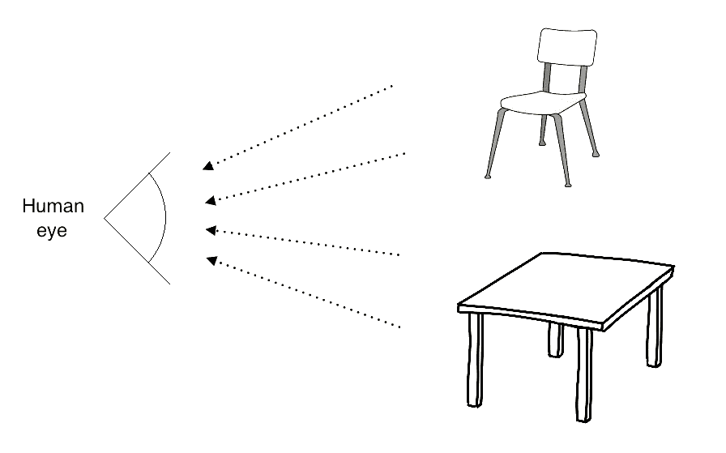
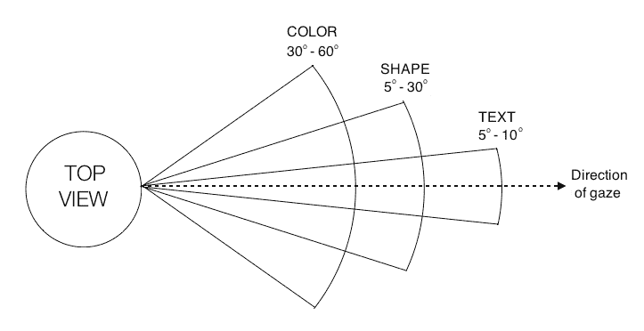
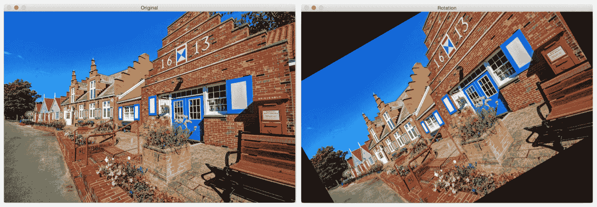
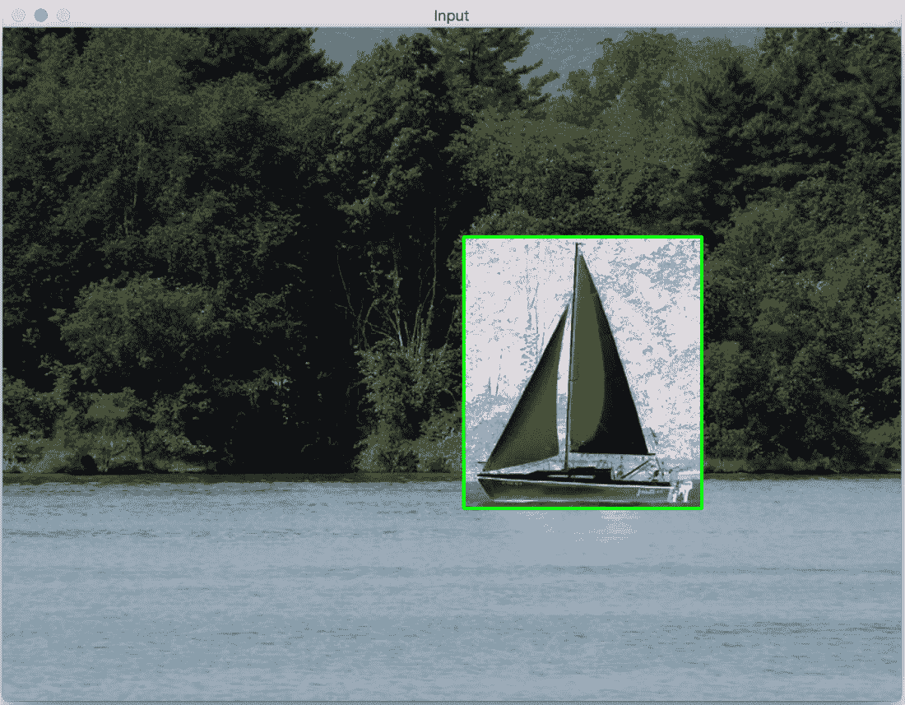
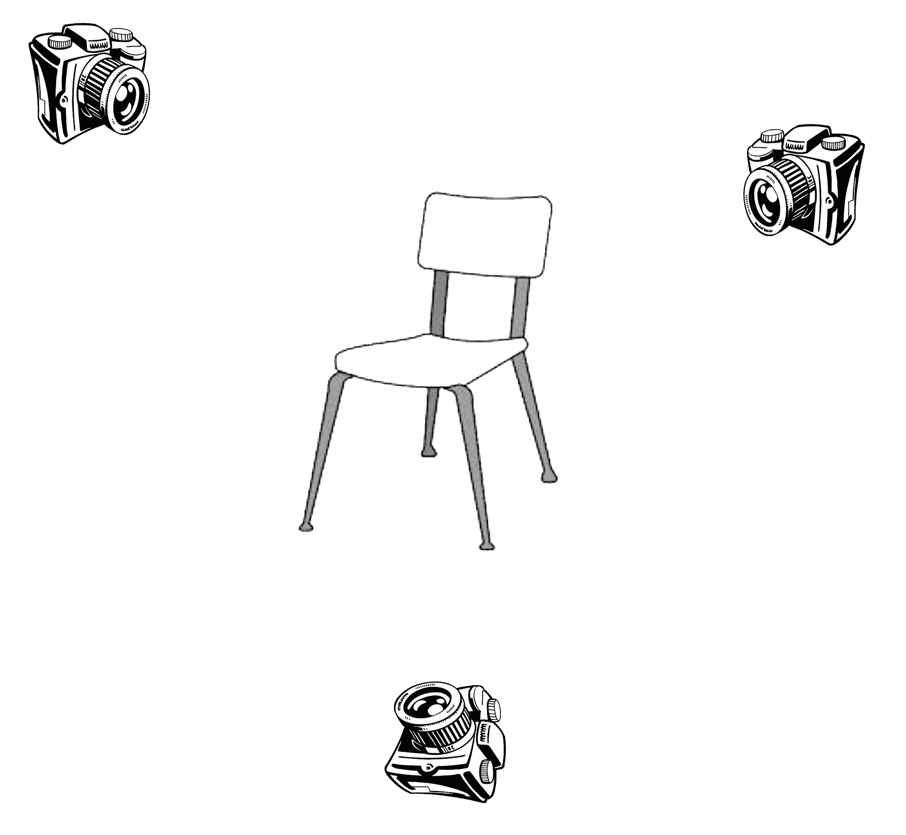
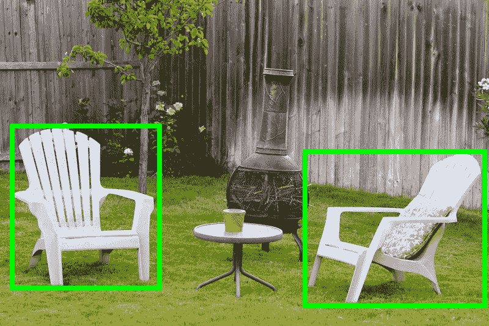

# 第一章：开始使用 OpenCV

计算机视觉应用很有趣且有用，但底层算法计算量很大。随着云计算的出现，我们获得了更多的处理能力。

OpenCV 库使我们能够高效地在实时中运行计算机视觉算法。它已经存在很多年了，并已成为该领域的标准库。OpenCV 的主要优势之一是它高度优化，几乎在所有平台上都可用。

本书将涵盖我们将要使用的各种算法，为什么我们要使用它们，以及如何在 OpenCV 中实现它们。

在本章中，我们将学习如何在各种操作系统上安装 OpenCV。我们将讨论 OpenCV 提供的功能，以及我们可以使用内置函数做些什么。

到本章结束时，你将能够回答以下问题：

+   人类是如何处理视觉数据，又是如何理解图像内容的？

+   我们可以用 OpenCV 做什么，OpenCV 中有哪些模块可以用来实现这些功能？

+   我们如何在 Windows、Linux 和 Mac OS X 上安装 OpenCV？

# 理解人类视觉系统

在我们深入探讨 OpenCV 的功能之前，我们需要了解这些功能最初为何被构建。理解人类视觉系统的工作原理非常重要，这样你才能开发出正确的算法。

计算机视觉算法的目标是理解图像和视频的内容。人类似乎能毫不费力地做到这一点！那么，我们如何让机器以同样的精度做到这一点呢？

让我们考虑以下图表：



人眼捕捉了所有沿路而来的信息，如颜色、形状、亮度等。在前面的图像中，人眼捕捉了关于两个主要物体的所有信息，并以某种方式存储。一旦我们理解了我们的系统是如何工作的，我们就可以利用它来实现我们的目标。

例如，以下是我们需要了解的一些事情：

+   我们的视觉系统对低频内容比高频内容更敏感。低频内容指的是像素值变化不快的平面区域，高频内容指的是像素值波动很大的角落和边缘区域。我们很容易在平面表面上看到污点，但在高度纹理化的表面上很难发现类似的东西。

+   人眼对亮度变化比颜色变化更敏感。

+   我们的视觉系统对运动非常敏感。即使我们没有直接看它，我们也能迅速识别出视野中是否有物体在移动。

+   我们倾向于在我们的视野中记住显著点。比如说，你看到一个白色的桌子，有四条黑色的腿，桌面的一个角落有一个红色的点。当你看这个桌子时，你会立即在脑海中记下桌面的颜色和腿的颜色是相反的，并且桌子的一个角落有一个红色的点。我们的头脑真的很聪明！我们这样做是自动的，这样我们就能立即识别出如果我们再次遇到它的话。

为了了解我们的视野，让我们看看人类的俯视图以及我们看到各种事物的角度：



我们的大脑视觉系统实际上能够做到更多，但这应该足以让我们开始。你可以通过在网上阅读有关**人类视觉系统**（HVS）模型的内容来进一步探索。

# 人类是如何理解图像内容的？

如果你四处看看，你会看到很多物体。你每天都会遇到许多不同的物体，你几乎可以瞬间识别它们，而不需要任何努力。当你看到一把椅子时，你不需要等待几分钟才意识到它实际上是一把椅子。你立刻就知道它是一把椅子。

相反，计算机发现这项任务非常困难。研究人员已经多年致力于找出为什么计算机在这方面的表现不如我们。

要回答那个问题，我们需要了解人类是如何做到的。视觉数据处理发生在腹侧视觉流中。这个腹侧视觉流指的是我们视觉系统中与物体识别相关联的路径。它基本上是我们大脑中帮助识别物体的区域层次结构。

人类可以毫不费力地识别不同的物体，并将相似物体聚集在一起。我们可以这样做，因为我们已经发展出对同一类物体的一种不变性。当我们看一个物体时，我们的大脑以某种方式提取显著点，使得方向、大小、视角和照明等因素无关紧要。

一个尺寸是正常尺寸的两倍并且旋转了 45 度的椅子仍然是一把椅子。我们之所以能轻易地识别它，是因为我们处理它的方式。机器不能那么容易做到这一点。人类倾向于根据物体的形状和重要特征来记住物体。无论物体如何放置，我们仍然可以识别它。

在我们的视觉系统中，我们建立了关于位置、比例和视点的层次不变性，这使我们非常稳健。如果你深入我们的系统，你会看到人类在他们的视觉皮层中有细胞可以响应曲线和线条等形状。

随着我们沿着腹侧流进一步前进，我们将看到更多经过训练以对更复杂的物体（如树木、大门等）做出反应的复杂细胞。沿着我们的腹侧流，神经元倾向于显示出感受野大小的增加。这与它们首选刺激的复杂性增加的事实相辅相成。

# 为什么机器理解图像内容这么困难？

我们现在理解了视觉数据是如何进入人类视觉系统的，以及我们的系统是如何处理它的。问题是，我们仍然不完全理解我们的大脑是如何识别和组织这些视觉数据的。在机器学习中，我们只是从图像中提取一些特征，并要求计算机使用算法来学习它们。我们仍然有这些变体，如形状、大小、视角、角度、光照、遮挡等。

例如，当从侧面视角看同一把椅子时，机器对它的感知与人类截然不同。人类可以轻易地识别出它是一把椅子，无论它以何种方式呈现给我们。那么，我们该如何向我们的机器解释这一点呢？

实现这一点的其中一种方法是将一个物体的所有不同变体存储起来，包括大小、角度、视角等。但这个过程既繁琐又耗时。此外，实际上也不可能收集到涵盖所有变体的数据。机器需要消耗大量的内存和时间来构建一个能够识别这些物体的模型。

即使有了所有这些，如果一个物体部分被遮挡，计算机仍然无法识别它。这是因为它们认为这是一个新物体。因此，当我们构建计算机视觉库时，我们需要构建可以以多种方式组合的基本功能模块，以形成复杂的算法。

OpenCV 提供了许多这些功能，并且它们经过了高度优化。因此，一旦我们了解 OpenCV 的能力，我们就可以有效地使用它来构建有趣的应用程序。

让我们继续在下一节中探讨这个问题。

# 你可以用 OpenCV 做什么？

使用 OpenCV，你可以几乎完成你所能想到的每一个计算机视觉任务。现实生活中的问题需要你使用许多计算机视觉算法和模块一起工作，以达到预期的结果。所以，你只需要了解哪些 OpenCV 模块和函数可以使用，以便得到你想要的结果。

让我们看看 OpenCV 开箱即用的功能。

# 内置数据结构和输入/输出

OpenCV 最好的事情之一是它提供了许多内置原语来处理与图像处理和计算机视觉相关的操作。如果你必须从头开始编写，你将不得不定义`Image`、`Point`、`Rectangle`等。这些对于几乎任何计算机视觉算法都是基本的。

OpenCV 自带所有这些基本结构，包含在核心模块中。另一个优点是这些结构已经针对速度和内存进行了优化，因此你不必担心实现细节。

`imgcodecs` 模块负责图像文件的读取和写入。当你对一个输入图像进行操作并创建一个输出图像时，你可以使用简单的命令将其保存为 `.jpg` 或 `.png` 文件。

当你与摄像头一起工作时，你会处理大量的视频文件。`videoio` 模块处理与视频文件输入和输出相关的所有事情。你可以轻松地从网络摄像头捕获视频或以许多不同的格式读取视频文件。你甚至可以通过设置每秒帧数、帧大小等属性，将一系列帧保存为视频文件。

# 图像处理操作

当你编写计算机视觉算法时，你会反复使用许多基本的图像处理操作。这些函数中的大多数都包含在 `imgproc` 模块中。你可以进行诸如图像滤波、形态学操作、几何变换、颜色转换、在图像上绘制、直方图、形状分析、运动分析、特征检测等等操作。

让我们考虑以下照片：



右侧的图像是左侧图像的旋转版本。我们可以在 OpenCV 中用一行代码完成这种变换。

另有一个名为 `ximgproc` 的模块，其中包含了一些高级图像处理算法，例如用于边缘检测的结构化森林、域变换滤波器、自适应流形滤波器等等。

# GUI

OpenCV 提供了一个名为 `highgui` 的模块，用于处理所有高级用户界面操作。假设你正在处理一个问题，并且想在继续到下一步之前检查图像的外观。此模块包含可以用于创建窗口以显示图像和/或视频的函数。

有一个等待函数，它会在继续到下一步之前等待你按下键盘上的某个键。还有一个可以检测鼠标事件的函数。这在开发交互式应用程序中非常有用。

使用此功能，你可以在这些输入窗口上绘制矩形，然后根据所选区域继续操作。考虑以下截图：



如你所见，我们在窗口顶部绘制了一个绿色矩形。一旦我们有了该矩形的坐标，我们就可以只在该区域进行操作。

# 视频分析

视频分析包括分析视频中连续帧之间的运动、跟踪视频中的不同对象、创建视频监控模型等任务。OpenCV 提供了一个名为 `video` 的模块，可以处理所有这些。

还有一个名为`videostab`的模块，用于处理视频稳定化。视频稳定化非常重要，因为当你用手持相机拍摄视频时，通常会有很多需要校正的抖动。所有现代设备都会在将视频呈现给最终用户之前使用视频稳定化来处理视频。

# 3D 重建

3D 重建是计算机视觉中的一个重要主题。给定一组二维图像，我们可以使用相关算法来重建三维场景。OpenCV 提供了算法，可以在其`calib3d`模块中找到这些二维图像中各种对象之间的关系，以计算它们的 3D 位置。

此模块还可以处理相机标定，这对于估计相机的参数至关重要。这些参数定义了相机如何观察其前面的场景。我们需要知道这些参数来设计算法，否则我们可能会得到意外的结果。

让我们考虑以下图表：



如我们所见，相同的对象从多个位置被捕捉。我们的任务是使用这些二维图像重建原始对象。

# 特征提取

如我们之前讨论的，人类的视觉系统倾向于从给定的场景中提取显著特征以便于后续检索。为了模仿这一点，人们开始设计各种特征提取器，可以从给定的图像中提取这些显著点。流行的算法包括**尺度不变特征变换**（**SIFT**）、**加速鲁棒特征**（**SURF**）和**加速段测试特征**（**FAST**）。

一个名为`features2d`的 OpenCV 模块提供了检测和提取所有这些特征的功能。另一个名为`xfeatures2d`的模块提供了一些额外的特征提取器，其中一些仍处于实验阶段。如果你有机会，可以尝试玩弄这些功能。

还有一个名为`bioinspired`的模块，提供了生物启发的计算机视觉模型算法。

# 目标检测

目标检测是指检测给定图像中对象的位置。这个过程并不关心对象的类型。如果你设计了一个椅子检测器，它不会告诉你给定图像中的椅子是高背红色还是低背蓝色——它只会告诉你椅子的位置。

在许多计算机视觉系统中，检测对象的位置是一个关键步骤。考虑以下照片：



如果你在该图像上运行一个椅子检测器，它会在所有椅子上放置一个绿色框，但它不会告诉你这是什么类型的椅子。

由于需要在各种尺度上进行检测所需的计算量，物体检测曾经是一个计算密集型任务。为了解决这个问题，Paul Viola 和 Michael Jones 在他们开创性的 2001 年论文中提出了一个伟大的算法，你可以在以下链接中阅读：[`www.cs.cmu.edu/~efros/courses/LBMV07/Papers/viola-cvpr-01.pdf`](https://www.cs.cmu.edu/~efros/courses/LBMV07/Papers/viola-cvpr-01.pdf)。他们提供了一种快速设计任何对象检测器的方法。

OpenCV 有名为 `objdetect` 和 `xobjdetect` 的模块，它们提供了设计对象检测器的框架。你可以用它来开发用于随机物品（如太阳镜、靴子等）的检测器。

# 机器学习

机器学习算法被广泛用于构建计算机视觉系统，用于物体识别、图像分类、人脸检测、视觉搜索等。

OpenCV 提供了一个名为 `ml` 的模块，其中包含了许多打包的机器学习算法，包括**贝叶斯分类器**、**k 近邻**（**KNN**）、**支持向量机**（**SVM**）、**决策树**、**神经网络**等。

它还包含一个名为**快速近似最近邻搜索库**（**FLANN**）的模块，该模块包含在大数据集中进行快速最近邻搜索的算法。

# 计算摄影学

计算摄影学指的是使用高级图像处理技术来改善相机捕捉的图像。计算摄影学不是关注光学过程和图像捕捉方法，而是使用软件来操纵视觉数据。应用包括高动态范围成像、全景图像、图像重光照和光场相机。

让我们看看以下图像：


看看那些鲜艳的颜色！这是一个高动态范围图像的例子，使用传统的图像捕捉技术是无法得到这样的效果的。为了做到这一点，我们必须在多个曝光下捕捉相同的场景，将这些图像相互注册，然后很好地融合它们以创建这张图像。

`photo` 和 `xphoto` 模块包含各种算法，提供了与计算摄影相关的算法。还有一个名为 `stitching` 的模块，它提供了创建全景图像的算法。

展示的图像可以在以下链接找到：[`pixabay.com/en/hdr-high-dynamic-range-landscape-806260/`](https://pixabay.com/en/hdr-high-dynamic-range-landscape-806260/)。

# 形状分析

形状的概念在计算机视觉中至关重要。我们通过识别图像中的各种不同形状来分析视觉数据。这实际上是许多算法中的重要步骤。

假设你正在尝试识别图像中的特定标志。你知道它可以以各种形状、方向和大小出现。一个很好的开始方法是量化物体的形状特征。

`shape` 模块提供了提取不同形状、测量它们之间的相似性、转换物体形状以及更多所需的所有算法。

# 光流算法

光流算法在视频中用于跟踪连续帧之间的特征。假设你想要在视频中跟踪一个特定的对象。在每一帧上运行特征提取器将是计算上昂贵的；因此，这个过程会变慢。所以，你只需从当前帧中提取特征，然后在后续帧中跟踪这些特征。

光流算法在计算机视觉的视频应用中被广泛使用。`optflow` 模块包含了执行光流所需的所有算法。还有一个名为 `tracking` 的模块，其中包含更多可用于跟踪特征的算法。

# 面部和物体识别

面部识别是指识别给定图像中的人。这不同于面部检测，面部检测只是简单地识别给定图像中面部位置。

如果你想要构建一个实用的生物识别系统，能够识别摄像头前的人，你首先需要运行一个面部检测器来识别面部位置，然后运行一个单独的面部识别器来识别这个人是谁。有一个名为 `face` 的 OpenCV 模块处理面部识别。

正如我们之前讨论的，计算机视觉试图根据人类感知视觉数据的方式来建模算法。因此，找到图像中突出的区域和对象对于不同的应用，如物体识别、物体检测和跟踪等，将非常有帮助。有一个名为 `saliency` 的模块就是为了这个目的而设计的。它提供了可以检测静态图像和视频中突出区域的算法。

# 表面匹配

我们越来越多地与能够捕捉周围物体 3D 结构的设备进行交互。这些设备本质上捕获深度信息，以及常规的 2D 彩色图像。因此，对我们来说，构建能够理解和处理 3D 对象的算法非常重要。

**Kinect** 是一个捕获深度信息和视觉数据的设备的良好例子。当前的任务是通过将其与数据库中的某个模型进行匹配来识别输入的 3D 对象。如果我们有一个可以识别和定位对象的系统，那么它可以用于许多不同的应用。

有一个名为 `surface_matching` 的模块，其中包含用于 3D 物体识别和基于 3D 特征的姿态估计算法的算法。

# 文本检测和识别

在给定场景中识别文本并识别其内容变得越来越重要。应用包括车牌识别、识别自动驾驶汽车的道路标志、书籍扫描以数字化内容等。

有一个名为 `text` 的模块，其中包含处理文本检测和识别的各种算法。

# 深度学习

深度学习对计算机视觉和图像识别产生了重大影响，其准确度高于其他机器学习和人工智能算法。深度学习不是一个新概念；它大约在 1986 年引入到社区中，但它在 2012 年左右引发了一场革命，当时新的 GPU 硬件被优化用于并行计算，**卷积神经网络**（**CNN**）的实现以及其他技术使得在合理的时间内训练复杂的神经网络架构成为可能。

深度学习可以应用于多个用例，如图像识别、目标检测、语音识别和自然语言处理。自 3.4 版本以来，OpenCV 一直在实现深度学习算法——在最新版本中，添加了多个重要框架的导入器，如**TensorFlow**和**Caffe**。

# 安装 OpenCV

让我们看看如何在各种操作系统上启动和运行 OpenCV。

# Windows

为了简化操作，让我们使用预构建库来安装 OpenCV。访问[opencv.org](https://opencv.org/)并下载适用于 Windows 的最新版本。当前版本是 4.0.0，您可以从 OpenCV 主页获取下载链接。在继续之前，请确保您有管理员权限。

下载的文件将是一个可执行文件，所以只需双击它即可开始安装。安装程序会将内容展开到一个文件夹中。您可以选择安装路径，并通过检查文件来验证安装。

完成上一步骤后，我们需要设置 OpenCV 环境变量并将它们添加到系统路径中，以完成安装。我们将设置一个环境变量，它将保存 OpenCV 库的构建目录。我们将在我们的项目中使用这个变量。

打开终端并输入以下命令：

```py
C:> setx -m OPENCV_DIR D:OpenCVBuildx64vc14
```

我们假设您拥有一台安装了 Visual Studio 2015 的 64 位机器。如果您使用的是 Visual Studio 2012，请在命令中将`vc14`替换为`vc11`。指定的路径是我们存放 OpenCV 二进制文件的地方，您应该在该路径下看到两个文件夹，分别命名为`lib`和`bin`。如果您使用的是 Visual Studio 2018，您应该从头开始编译 OpenCV。

让我们继续将`bin`文件夹的路径添加到我们的系统路径中。我们需要这样做的原因是我们将以**动态链接库**（**DLL**）的形式使用 OpenCV 库。本质上，所有 OpenCV 算法都存储在这里，我们的操作系统将在运行时加载它们。

为了做到这一点，我们的操作系统需要知道它们的位置。`PATH`系统变量包含了一个它可以在其中找到 DLL 的所有文件夹的列表。因此，自然地，我们需要将 OpenCV 库的路径添加到这个列表中。

为什么我们需要做所有这些？好吧，另一个选择是将所需的 DLL 文件复制到与应用程序的可执行文件（`.exe` 文件）相同的文件夹中。这会增加不必要的开销，尤其是在我们处理许多不同项目时。

我们需要编辑 `PATH` 变量以添加此文件夹。您可以使用 Path Editor 等软件来完成此操作，您可以从这里下载：[`patheditor2.codeplex.com`](https://patheditor2.codeplex.com)。安装后，启动它并添加以下新条目（您可以在路径上右键单击以插入新项目）：

```py
%OPENCV_DIR%bin
```

继续保存到注册表中。我们完成了！

# Mac OS X

在本节中，我们将了解如何在 Mac OS X 上安装 OpenCV。预编译的二进制文件对于 Mac OS X 不可用，因此我们需要从头开始编译 OpenCV。

在我们继续之前，我们需要安装 CMake。如果您还没有安装 CMake，您可以从这里下载它：[`cmake.org/files/v3.12/cmake-3.12.0-rc1-Darwin-x86_64.dmg`](https://cmake.org/files/v3.12/cmake-3.12.0-rc1-Darwin-x86_64.dmg)。它是一个 `.dmg` 文件，因此一旦下载，只需运行安装程序即可。

从 [opencv.org](https://opencv.org/) 下载 OpenCV 的最新版本。当前版本是 4.0.0，您可以从这里下载：[`github.com/opencv/opencv/archive/4.0.0.zip`](https://github.com/opencv/opencv/archive/4.0.0.zip)。将内容解压到您选择的文件夹中。

OpenCV 4.0.0 还有一个名为 `opencv_contrib` 的新软件包，其中包含尚未被认为是稳定的用户贡献和一些在所有最新的计算机视觉算法中不免费提供给商业使用的算法，这一点值得记住。安装此软件包是可选的——如果您不安装 `opencv_contrib`，OpenCV 仍然可以正常工作。

由于我们无论如何都要安装 OpenCV，因此安装此软件包以便您可以稍后进行实验（而不是再次经历整个安装过程）是个不错的选择。这是一种学习和探索新算法的好方法。您可以从以下链接下载它：[`github.com/opencv/opencv_contrib/archive/4.0.0.zip`](https://github.com/opencv/opencv_contrib/archive/4.0.0.zip)。

将 zip 文件的内容解压到您选择的文件夹中。为了方便，将其解压到之前的文件夹中，这样 `opencv-4.0.0` 和 `opencv_contrib-4.0.0` 文件夹就在同一个主文件夹中。

现在，我们已经准备好构建 OpenCV。打开您的终端，导航到您解压 OpenCV 4.0.0 内容的文件夹。在命令中替换正确的路径后，运行以下命令：

```py
$ cd /full/path/to/opencv-4.0.0/ 
$ mkdir build 
$ cd build 
$ cmake -D CMAKE_BUILD_TYPE=RELEASE -D CMAKE_INSTALL_PREFIX=/full/path/to/opencv-4.0.0/build -D INSTALL_C_EXAMPLES=ON -D BUILD_EXAMPLES=ON -D OPENCV_EXTRA_MODULES_PATH=/full/path/to/opencv_contrib-4.0.0/modules ../ 
```

是时候安装 OpenCV 4.0.0 了。前往 `/full/path/to/opencv-4.0.0/build` 目录，并在您的终端上运行以下命令：

```py
$ make -j4 
$ make install 
```

在前面的命令中，**`-j4`**标志表示应该使用四个核心来安装它。这样更快！现在，让我们设置库路径。在终端中使用`vi ~/.profile`命令打开你的`~/.profile`文件，并添加以下行：

```py
export DYLD_LIBRARY_PATH=/full/path/to/opencv-4.0.0/build/lib:$DYLD_LIBRARY_PATH
```

我们需要将`opencv.pc`中的`pkgconfig`文件复制到`/usr/local/lib/pkgconfig`，并命名为`opencv4.pc`。这样，如果你已经有一个现有的 OpenCV 3.x.x 安装，将不会有冲突。让我们继续做：

```py
$ cp /full/path/to/opencv-4.0.0/build/lib/pkgconfig/opencv.pc /usr/local/lib/pkgconfig/opencv4.pc 
```

我们还需要更新我们的`PKG_CONFIG_PATH`变量。打开你的`~/.profile`文件并添加以下行：

```py
export PKG_CONFIG_PATH=/usr/local/lib/pkgconfig/:$PKG_CONFIG_PATH 
```

使用以下命令重新加载你的`~/.profile`文件：

```py
$ source ~/.profile 
```

我们完成了！让我们看看它是否工作：

```py
$ cd /full/path/to/opencv-4.0.0/samples/cpp 
$ g++ -ggdb `pkg-config --cflags --libs opencv4` opencv_version.cpp -o /tmp/opencv_version && /tmp/opencv_version
```

如果你看到终端上打印了“Welcome to OpenCV 4.0.0”，那么你可以正常使用了。在这本书中，我们将使用 CMake 来构建我们的 OpenCV 项目。我们将在第二章《OpenCV 基础知识简介》中更详细地介绍它。

# Linux

让我们看看如何在 Ubuntu 上安装 OpenCV。在开始之前，我们需要安装一些依赖项。让我们通过在终端中运行以下命令来使用包管理器安装它们：

```py
$ sudo apt-get -y install libopencv-dev build-essential cmake libdc1394-22 libdc1394-22-dev libjpeg-dev libpng12-dev libtiff5-dev libjasper-dev libavcodec-dev libavformat-dev libswscale-dev libxine2-dev libgstreamer0.10-dev libgstreamer-plugins-base0.10-dev libv4l-dev libtbb-dev libqt4-dev libmp3lame-dev libopencore-amrnb-dev libopencore-amrwb-dev libtheora-dev libvorbis-dev libxvidcore-dev x264 v4l-utils 
```

现在你已经安装了依赖项，让我们下载、构建和安装 OpenCV：

```py
$ wget "https://github.com/opencv/opencv/archive/4.0.0.tar.gz" -O opencv.tar.gz 
$ wget "https://github.com/opencv/opencv_contrib/archive/4.0.0.tar.gz" -O opencv_contrib.tar.gz 
$ tar -zxvf opencv.tar.gz 
$ tar -zxvf opencv_contrib.tar.gz 
$ cd opencv-4.0.0 
$ mkdir build 
$ cd build 
$ cmake -D CMAKE_BUILD_TYPE=RELEASE -D CMAKE_INSTALL_PREFIX=/full/path/to/opencv-4.0.0/build -D INSTALL_C_EXAMPLES=ON -D BUILD_EXAMPLES=ON -D OPENCV_EXTRA_MODULES_PATH=/full/path/to/opencv_contrib-4.0.0/modules ../ 
$ make -j4 
$ sudo make install 
```

让我们复制`opencv.pc`中的`pkgconfig`文件到`/usr/local/lib/pkgconfig`，并命名为`opencv4.pc`：

```py
$ cp /full/path/to/opencv-4.0.0/build/lib/pkgconfig/opencv.pc /usr/local/lib/pkgconfig/opencv4.pc 
```

我们完成了！现在我们将能够使用它从命令行编译我们的 OpenCV 程序。另外，如果你已经有一个现有的 OpenCV 3.x.x 安装，将不会有冲突。

让我们检查安装是否正常工作：

```py
$ cd /full/path/to/opencv-4.0.0/samples/cpp 
$ g++ -ggdb `pkg-config --cflags --libs opencv4` opencv_version.cpp -o /tmp/opencv_version && /tmp/opencv_version 
```

如果你看到终端上打印了“Welcome to OpenCV 4.0.0”，那么你应该可以正常使用了。在接下来的章节中，我们将学习如何使用 CMake 来构建我们的 OpenCV 项目。

# 摘要

在本章中，我们讨论了人类视觉系统以及人类如何处理视觉数据。我们解释了为什么机器做同样的事情很困难，以及设计计算机视觉库时需要考虑什么。

我们学习了可以使用 OpenCV 做什么，以及可以用来完成这些任务的各个模块。最后，我们学习了如何在不同的操作系统上安装 OpenCV。

在下一章中，我们将讨论如何操作图像以及我们如何可以使用各种函数来操纵它们。我们还将学习为我们的 OpenCV 应用程序构建项目结构。
