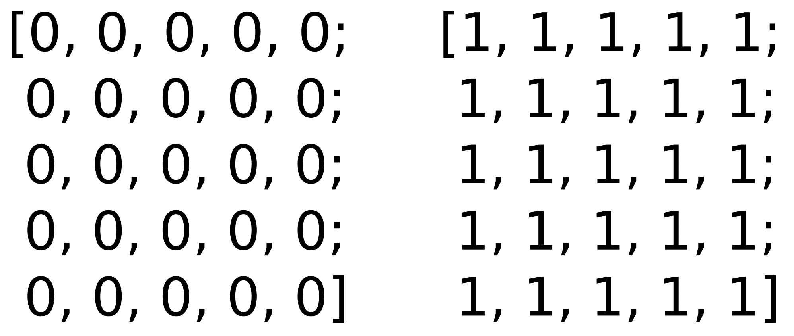

# 第二章：OpenCV 基础知识简介

在第一章“OpenCV 入门”中介绍了在不同操作系统上安装 OpenCV 之后，我们将在本章介绍 OpenCV 开发的基础。它从展示如何使用 CMake 创建我们的项目开始。我们将介绍基本图像数据结构和矩阵，以及其他在我们项目中工作所需的结构。我们将介绍如何使用 XML/YAML 持久化的 OpenCV 函数将我们的变量和数据保存到文件中。

在本章中，我们将涵盖以下主题：

+   使用 CMake 配置项目

+   从/到磁盘读取/写入图像

+   读取视频和访问相机设备

+   主要图像结构（例如，矩阵）

+   其他重要且基本的结构（例如，向量和标量）

+   基本矩阵运算简介

+   使用 XML/YAML 持久化的 OpenCV API 进行文件存储操作

# 技术要求

本章要求熟悉基本的 C++编程语言。本章中使用的所有代码都可以从以下 GitHub 链接下载：[`github.com/PacktPublishing/Learn-OpenCV-4-By-Building-Projects-Second-Edition/tree/master/Chapter_02`](https://github.com/PacktPublishing/Learn-OpenCV-4-By-Building-Projects-Second-Edition/tree/master/Chapter_02)。代码可以在任何操作系统上执行，尽管它仅在 Ubuntu 上进行了测试。

查看以下视频以查看代码的实际应用：

[`bit.ly/2QxhNBa`](http://bit.ly/2QxhNBa)

# 基本 CMake 配置文件

为了配置和检查我们项目所需的所有依赖项，我们将使用 CMake，但这不是唯一的方法；我们可以在任何其他工具或 IDE 中配置我们的项目，例如**Makefiles**或**Visual Studio**，但 CMake 是配置多平台**C++**项目的更便携方式。

CMake 使用名为`CMakeLists.txt`的配置文件，其中定义了编译和依赖关系过程。对于一个基于单个源代码文件构建的可执行文件的基本项目，所需的`CMakeLists.txt`文件仅包含三行。文件看起来如下：

```py
cmake_minimum_required (VERSION 3.0) 
project (CMakeTest) 
add_executable(${PROJECT_NAME} main.cpp) 
```

第一行定义了所需的 CMake 最低版本。这一行在我们的`CMakeLists.txt`文件中是强制性的，它允许我们使用从特定版本定义的 CMake 功能；在我们的情况下，我们需要至少 CMake 3.0。第二行定义了项目名称。这个名称保存在一个名为`PROJECT_NAME`的变量中。

最后一行从 `main.cpp` 文件创建一个可执行命令（`add_executable()`），将其命名为我们的项目（`${PROJECT_NAME}`），并将我们的源代码编译成一个名为 **CMakeTest** 的可执行文件，这是我们设置的项目名称。`${}` 表达式允许访问我们环境中定义的任何变量。然后，我们可以使用 `${PROJECT_NAME}` 变量作为可执行文件的输出名称。

# 创建库

CMake 允许我们创建由 OpenCV 构建系统使用的库。在软件开发中，将共享代码分解到多个应用程序中是一种常见且有用的实践。在大型应用程序或多个应用程序中共享的通用代码中，这种做法非常有用。在这种情况下，我们不会创建一个二进制可执行文件，而是创建一个包含所有函数、类等的编译文件。然后我们可以将这个库文件与其他应用程序共享，而无需共享我们的源代码。

CMake 包含了 `add_library` 函数来实现这一点：

```py
# Create our hello library 
    add_library(Hello hello.cpp hello.h) 

# Create our application that uses our new library 
    add_executable(executable main.cpp) 

# Link our executable with the new library 
    target_link_libraries(executable Hello) 
```

以 `#` 开头的行添加注释，并被 CMake 忽略。`add_library` (`Hello hello.cpp hello.h`) 命令定义了库的源文件及其名称，其中 `Hello` 是库名称，`hello.cpp` 和 `hello.h` 是源文件。我们还添加了头文件，以便允许像 Visual Studio 这样的 IDE 链接到头文件。这一行将根据我们是否在库名称和源文件之间添加 `SHARED` 或 `STATIC` 单词来生成共享（Mac OS X 的 `.so`、Unix 或 Windows 的 `.dll`）或静态库（Mac OS X 的 `.a`、Unix 或 Windows 的 `.lib`）文件。`target_link_libraries(executable Hello)` 是将我们的可执行文件链接到所需库的函数，在我们的例子中，是 `Hello` 库。

# 管理依赖项

CMake 有能力搜索我们的依赖项和外部库，这使我们能够构建复杂的项目，根据项目中的外部组件添加一些需求。

在这本书中，最重要的依赖项当然是 OpenCV，我们将将其添加到所有我们的项目中：

```py
    cmake_minimum_required (VERSION 3.0) 
    PROJECT(Chapter2) 
# Requires OpenCV 
    FIND_PACKAGE( OpenCV 4.0.0 REQUIRED ) 
# Show a message with the opencv version detected 
    MESSAGE("OpenCV version : ${OpenCV_VERSION}") 
# Add the paths to the include directories/to the header files
    include_directories(${OpenCV_INCLUDE_DIRS}) 
# Add the paths to the compiled libraries/objects
    link_directories(${OpenCV_LIB_DIR}) 
# Create a variable called SRC 
    SET(SRC main.cpp) 
# Create our executable 
    ADD_EXECUTABLE(${PROJECT_NAME} ${SRC}) 
# Link our library 
    TARGET_LINK_LIBRARIES(${PROJECT_NAME} ${OpenCV_LIBS})
```

现在，让我们从以下内容了解脚本的运行机制：

```py
cmake_minimum_required (VERSION 3.0) 
cmake_policy(SET CMP0012 NEW) 
PROJECT(Chapter2) 
```

第一行定义了最低的 CMake 版本，第二行告诉 CMake 使用 CMake 的新行为来简化对正确数字和布尔常量的识别，而无需解引用具有此类名称的变量；此策略是在 CMake 2.8.0 中引入的，从版本 3.0.2 开始，CMake 会警告当策略未设置时。最后，最后一行定义了项目标题。在定义项目名称后，我们必须定义需求、库和依赖项：

```py
# Requires OpenCV 
    FIND_PACKAGE( OpenCV 4.0.0 REQUIRED ) 
# Show a message with the opencv version detected 
    MESSAGE("OpenCV version : ${OpenCV_VERSION}") 
    include_directories(${OpenCV_INCLUDE_DIRS}) 
    link_directories(${OpenCV_LIB_DIR})
```

这里是我们搜索 OpenCV 依赖项的地方。`FIND_PACKAGE` 是一个函数，允许我们查找依赖项、所需的最小版本以及此依赖项是必需的还是可选的。在这个示例脚本中，我们寻找版本 4.0.0 或更高版本的 OpenCV，并声明这是一个必需的包。

`FIND_PACKAGE`命令包括所有 OpenCV 子模块，但你可以通过执行应用程序来指定你想要在项目中包含的子模块，使应用程序更小、更快。例如，如果我们只将使用基本的 OpenCV 类型和核心功能，我们可以使用以下命令：`FIND_PACKAGE(OpenCV 4.0.0 REQUIRED core)`。

如果 CMake 找不到它，它会返回一个错误，但不会阻止我们编译我们的应用程序。`MESSAGE`函数在终端或 CMake GUI 中显示消息。在我们的例子中，我们如下显示 OpenCV 版本：

```py
OpenCV version : 4.0.0
```

`${OpenCV_VERSION}`是一个变量，其中 CMake 存储 OpenCV 包的版本。`include_directories()`和`link_directories()`将指定的库的头文件和目录添加到我们的环境中。OpenCV CMake 模块将这些数据保存到`${OpenCV_INCLUDE_DIRS}`和`${OpenCV_LIB_DIR}`变量中。这些行在所有平台上都不是必需的，例如 Linux，因为这些路径通常在环境中，但建议有多个 OpenCV 版本以选择正确的链接和包含目录。现在是时候包含我们开发的源代码了：

```py
# Create a variable called SRC 
    SET(SRC main.cpp) 
# Create our executable 
    ADD_EXECUTABLE(${PROJECT_NAME} ${SRC}) 
# Link our library 
    TARGET_LINK_LIBRARIES(${PROJECT_NAME} ${OpenCV_LIBS}) 
```

这最后一行创建了可执行文件，并将其与 OpenCV 库链接起来，正如我们在上一节中看到的，*创建库*。在这段代码中有一个新函数`SET`；这个函数创建一个新变量并向其中添加任何我们需要的值。在我们的例子中，我们将`main.cpp`的值合并到`SRC`变量中。我们可以向同一个变量添加更多值，如下面的脚本所示：

```py
SET(SRC main.cpp 
        utils.cpp 
        color.cpp
)
```

# 使脚本更加复杂

在本节中，我们展示了一个更复杂的脚本，该脚本包括子文件夹、库和可执行文件；总共只有两个文件和几行，如脚本所示。创建多个`CMakeLists.txt`文件不是强制性的，因为我们可以在主`CMakeLists.txt`文件中指定所有内容。然而，更常见的是为每个项目子文件夹使用不同的`CMakeLists.txt`文件，从而使它更加灵活和便携。

此示例有一个代码结构文件夹，其中包含一个用于`utils`库的文件夹和根文件夹，其中包含主可执行文件：

```py
CMakeLists.txt 
main.cpp 
utils/ 
   CMakeLists.txt 
   computeTime.cpp 
   computeTime.h 
   logger.cpp 
   logger.h 
   plotting.cpp 
   plotting.h 
```

然后，我们必须定义两个`CMakeLists.txt`文件，一个在根文件夹中，另一个在`utils`文件夹中。根文件夹的`CMakeLists.txt`文件包含以下内容：

```py
    cmake_minimum_required (VERSION 3.0) 
    project (Chapter2) 

# Opencv Package required 
    FIND_PACKAGE( OpenCV 4.0.0 REQUIRED ) 

#Add opencv header files to project 
    include_directories(${OpenCV_INCLUDE_DIR}) 
    link_directories(${OpenCV_LIB_DIR}) 

# Add a subdirectory to the build. 
    add_subdirectory(utils)

# Add optional log with a precompiler definition 
    option(WITH_LOG "Build with output logs and images in tmp" OFF) 
    if(WITH_LOG) 
       add_definitions(-DLOG) 
    endif(WITH_LOG) 

# generate our new executable 
    add_executable(${PROJECT_NAME} main.cpp) 
# link the project with his dependencies 
    target_link_libraries(${PROJECT_NAME} ${OpenCV_LIBS} Utils) 
```

几乎所有行都在前面的章节中有所描述，除了我们将解释的一些函数。`add_subdirectory()`告诉 CMake 分析所需子文件夹的`CMakeLists.txt`。在继续解释主`CMakeLists.txt`文件之前，我们将解释`utils`中的`CMakeLists.txt`文件。

在`utils`文件夹的`CMakeLists.txt`文件中，我们将编写一个新的库并将其包含到我们的主项目文件夹中：

```py
# Add new variable for src utils lib 
    SET(UTILS_LIB_SRC 
       computeTime.cpp  
       logger.cpp  
       plotting.cpp 
    ) 
# create our new utils lib 
    add_library(Utils ${UTILS_LIB_SRC}) 
# make sure the compiler can find include files for our library 
    target_include_directories(Utils PUBLIC ${CMAKE_CURRENT_SOURCE_DIR}) 
```

此 CMake 脚本文件定义了一个变量`UTILS_LIB_SRC`，我们将所有包含在我们的库中的源文件添加到其中，使用`add_library`函数生成库，并使用`target_include_directories`函数允许我们的主项目检测所有头文件。在`utils`子文件夹中留下并继续使用根 CMake 脚本，`Option`函数创建了一个新变量，在我们的例子中是`WITH_LOG`，并附有一个简短的描述。这个变量可以通过`ccmake`命令行或 CMake GUI 界面进行更改，其中描述出现，并有一个检查框允许用户启用或禁用此选项。这个函数对于允许用户决定编译时特性非常有用，例如是否想要启用或禁用日志，是否编译带有 Java 或 Python 支持，就像 OpenCV 所做的那样，等等。

在我们的情况下，我们使用此选项来在我们的应用程序中启用日志记录器。要启用日志记录器，我们在代码中使用预编译定义，如下所示：

```py
#ifdef LOG 
    logi("Number of iteration %d", i); 
#endif 
```

此 LOG 宏可以通过对`add_definitions`函数的调用（`-DLOG`）在`CMakeLists.txt`中定义，该函数本身可以通过 CMake 变量`WITH_LOG`通过简单条件来运行或隐藏：

```py
if(WITH_LOG) 
   add_definitions(-DLOG) 
endif(WITH_LOG) 
```

现在我们已经准备好创建我们的 CMake 脚本文件，以便在任何操作系统上编译我们的计算机视觉项目。然后，我们将继续介绍 OpenCV 的基础知识，然后再开始一个示例项目。

# 图像和矩阵

在计算机视觉中，无疑最重要的是图像结构。计算机视觉中的图像是使用数字设备捕获的物理世界的表示。这幅图只是一个存储在矩阵格式中的数字序列（参见图示）。每个数字是考虑的波长的光强度测量（例如，彩色图像中的红色、绿色或蓝色）或波长范围（对于全色设备）。图像中的每个点称为一个**像素**（对于图像元素），每个像素可以存储一个或多个值，具体取决于它是否是只存储一个值（如`0`或`1`）的黑白图像（也称为二值图像），灰度级图像存储两个值，或彩色图像存储三个值。这些值通常在整数中介于`0`和`255`之间，但您可以使用其他范围，例如在浮点数中使用`0`到`1`，如在**高动态范围成像**（**HDRI**）或热图像中：


图像以矩阵格式存储，其中每个像素都有一个位置，可以通过列和行的编号来引用。OpenCV 使用`Mat`类来完成这个目的。对于灰度图像，使用单个矩阵，如下面的图示所示：


在彩色图像的情况下，例如以下图示，我们使用宽度 x 高度 x 颜色通道数的矩阵：


但`Mat`类不仅用于存储图像；它还允许您存储任何类型的矩阵和不同的大小。您可以使用它作为代数矩阵，并对其进行操作。在接下来的章节中，我们将描述最重要的矩阵操作，如加法、乘法、对角化。但在那之前，了解矩阵在计算机内存中的内部存储方式是很重要的，因为始终访问内存槽比使用 OpenCV 函数访问每个像素更有效。

在内存中，矩阵按列和行的顺序保存为一个数组或值序列。以下表格显示了**BGR**图像格式中像素的顺序：

| 行 0 | 行 1 | 行 2 |
| --- | --- | --- |
| 列 0 | 列 1 | 列 2 | 列 0 | 列 1 | 列 2 | 列 0 | 列 1 | 列 2 |
| 像素 1 | 像素 2 | 像素 3 | 像素 4 | 像素 5 | 像素 6 | 像素 7 | 像素 8 | 像素 9 |
| B | G | R | B | G | R | B | G | R | B | G | R | B | G | R | B | G | R | B | G | R | B | G | R | B | G | R |

按照这个顺序，我们可以通过观察以下公式来访问任何像素：

```py
Value= Row_i*num_cols*num_channels + Col_i + channel_i 
```

OpenCV 函数在随机访问方面进行了相当优化，但有时，直接访问内存（使用指针算术）会更高效，例如，当我们需要在循环中访问所有像素时。

# 读取/写入图像

在介绍矩阵之后，我们将从 OpenCV 代码基础开始。我们首先必须学习的是如何读取和写入图像：

```py
#include <iostream> 
#include <string> 
#include <sstream> 
using namespace std; 

// OpenCV includes 
#include "opencv2/core.hpp" 
#include "opencv2/highgui.hpp" 
using namespace cv; 

int main(int argc, const char** argv) 
{ 
   // Read images 
   Mat color= imread("../lena.jpg"); 
   Mat gray= imread("../lena.jpg",CV_LOAD_IMAGE_GRAYSCALE); 

  if(! color.data ) // Check for invalid input
 {
 cout << "Could not open or find the image" << std::endl ;
 return -1;
 }
   // Write images 
   imwrite("lenaGray.jpg", gray); 

   // Get same pixel with opencv function 
   int myRow=color.cols-1; 
   int myCol=color.rows-1; 
   Vec3b pixel= color.at<Vec3b>(myRow, myCol); 
   cout << "Pixel value (B,G,R): (" << (int)pixel[0] << "," << (int)pixel[1] << "," << (int)pixel[2] << ")" << endl; 

   // show images 
   imshow("Lena BGR", color); 
   imshow("Lena Gray", gray); 
   // wait for any key press 
   waitKey(0); 
   return 0; 
} 

```

让我们现在继续理解代码：

```py
// OpenCV includes 
#include "opencv2/core.hpp" 
#include "opencv2/highgui.hpp" 
using namespace cv; 
```

首先，我们必须包含我们样本中需要的函数的声明。这些函数来自`core`（基本图像数据处理）和`highgui`（OpenCV 提供的跨平台 I/O 函数是`core`和`highui`；第一个包含基本类，如矩阵，而第二个包含读取、写入和通过图形界面显示图像的函数）。现在是我们读取图像的时候了：

```py
// Read images 
Mat color= imread("../lena.jpg"); 
Mat gray= imread("../lena.jpg",CV_LOAD_IMAGE_GRAYSCALE); 
```

`imread`是读取图像的主要函数。此函数打开图像并将其存储为矩阵格式。`imread`接受两个参数。第一个参数是包含图像路径的字符串，而第二个参数是可选的，默认情况下，将图像加载为彩色图像。第二个参数允许以下选项：

+   `cv::IMREAD_UNCHANGED`: 如果设置，当输入具有相应的深度时，返回 16 位/32 位图像，否则将其转换为 8 位

+   `cv::IMREAD_COLOR`: 如果设置，始终将图像转换为彩色图像（BGR，8 位无符号）

+   `cv::IMREAD_GRAYSCALE`: 如果设置，始终将图像转换为灰度图像（8 位无符号）

要保存图像，我们可以使用`imwrite`函数，该函数将矩阵图像存储在我们的计算机上：

```py
// Write images 
imwrite("lenaGray.jpg", gray); 
```

第一个参数是我们想要保存图像的路径，以及我们想要的扩展格式。第二个参数是我们想要保存的矩阵图像。在我们的代码示例中，我们创建并存储图像的灰度版本，然后将其保存为`.jpg`文件。我们加载的灰度图像将被存储在`gray`变量中：

```py
// Get same pixel with opencv function 
int myRow=color.cols-1; 
int myCol=color.rows-1;
```

使用矩阵的`.cols`和`.rows`属性，我们可以获取图像中的列数和行数，换句话说，宽度和高度：

```py
Vec3b pixel= color.at<Vec3b>(myRow, myCol); 
cout << "Pixel value (B,G,R): (" << (int)pixel[0] << "," << (int)pixel[1] << "," << (int)pixel[2] << ")" << endl; 
```

要访问图像中的一个像素，我们使用`Mat` OpenCV 类的模板函数`cv::Mat::at<typename t>(row,col)`。模板参数是期望的返回类型。在 8 位彩色图像中，类型名是一个存储三个无符号字符数据的`Vec3b`类（Vec = vector，3 = component 数量，b = 1 字节）。在灰度图像的情况下，我们可以直接使用无符号字符，或者使用图像中使用的任何其他数字格式，例如`uchar pixel= color.at<uchar>(myRow, myCol)`。最后，为了显示图像，我们可以使用`imshow`函数，该函数以标题作为第一个参数，以图像矩阵作为第二个参数创建一个窗口：

```py
// show images 
imshow("Lena BGR", color); 
imshow("Lena Gray", gray); 
// wait for any key press 
waitKey(0); 
```

如果我们想要停止应用程序等待，我们可以使用 OpenCV 函数`waitKey`，该函数有一个参数，表示我们希望等待多少毫秒来等待按键。如果我们将参数设置为`0`，那么函数将一直等待直到按键被按下。

上述代码的结果在以下图像中展示。左侧图像是彩色图像，右侧图像是灰度图像：


最后，作为以下示例的示例，我们将创建`CMakeLists.txt`文件，并查看如何使用该文件编译代码。

以下代码描述了`CMakeLists.txt`文件：

```py
cmake_minimum_required (VERSION 3.0) 
cmake_policy(SET CMP0012 NEW) 
PROJECT(project) 

# Requires OpenCV 
FIND_PACKAGE( OpenCV 4.0.0 REQUIRED ) 
MESSAGE("OpenCV version : ${OpenCV_VERSION}") 

include_directories(${OpenCV_INCLUDE_DIRS}) 
link_directories(${OpenCV_LIB_DIR}) 

ADD_EXECUTABLE(sample main.cpp) 
TARGET_LINK_LIBRARIES(sample ${OpenCV_LIBS})
```

要使用此`CMakeLists.txt`文件编译我们的代码，我们必须执行以下步骤：

1.  创建一个`build`文件夹。

1.  在`build`文件夹中，在 Windows 上执行 CMake 或打开 CMake GUI 应用程序，选择`source`和`build`文件夹，然后按下“Configure”和“Generate”按钮。

1.  如果你使用 Linux 或 macOS，像往常一样生成 Makefile，然后使用`make`命令编译项目。如果你使用 Windows，使用步骤 2 中选择的编辑器打开项目，然后编译。

最后，在编译我们的应用程序后，我们将在`build`文件夹中有一个名为`app`的可执行文件，我们可以执行它。

# 读取视频和摄像头

本节通过这个简单的示例向您介绍视频和摄像头读取。在解释如何读取视频或摄像头输入之前，我们想要介绍一个新且非常有用的类，该类帮助我们管理输入命令行参数。这个新类是在 OpenCV 版本 3.0 中引入的，即`CommandLineParser`类：

```py
// OpenCV command line parser functions 
// Keys accepted by command line parser 
const char* keys = 
{ 
   "{help h usage ? | | print this message}" 
    "{@video | | Video file, if not defined try to use webcamera}" 
}; 
```

对于`CommandLineParser`，我们首先要做的是在常量`char`向量中定义我们需要的或允许的参数；每一行都有以下模式：

```py
"{name_param | default_value | description}"
```

`name_param`可以前面加上`@`，这定义了这个参数为默认输入。我们可以使用多个`name_param`：

```py
CommandLineParser parser(argc, argv, keys);
```

构造函数将获取主函数的输入和之前定义的关键常量：

```py
//If requires help show 
if (parser.has("help")) 
{ 
       parser.printMessage(); 
       return 0; 
} 
```

`.has`类方法检查参数的存在。在示例中，我们检查用户是否添加了参数`help`或`?`，然后使用类函数`printMessage`显示所有描述参数：

```py
   String videoFile= parser.get<String>(0);
```

使用`.get<typename>(parameterName)`函数，我们可以访问和读取任何输入参数：

```py
   // Check if params are correctly parsed in his variables 
   if (!parser.check()) 
   { 
       parser.printErrors(); 
       return 0; 
   } 
```

在获得所有必需的参数后，我们可以检查这些参数是否正确解析，如果其中一个参数没有被解析，例如，添加一个字符串而不是一个数字，则显示错误信息：

```py
VideoCapture cap; // open the default camera 
if(videoFile != "") 
   cap.open(videoFile); 
else 
   cap.open(0); 
if(!cap.isOpened())  // check if we succeeded 
   return -1;  
```

视频读取和摄像头读取的类是相同的：使用属于`videoio`子模块的`VideoCapture`类，而不是像 OpenCV 前一个版本中那样使用`highgui`子模块。创建对象后，我们检查输入的命令行参数`videoFile`是否包含路径文件名。如果它是空的，那么我们尝试打开一个网络摄像头；如果包含文件名，则打开视频文件。为此，我们使用`open`函数，将视频文件名或我们想要打开的摄像头索引作为参数。如果我们只有一个摄像头，我们可以使用`0`作为参数。

为了检查我们是否可以读取视频文件名或摄像头，我们使用`isOpened`函数：

```py
namedWindow("Video",1); 
for(;;) 
{ 
    Mat frame; 
    cap >> frame; // get a new frame from camera 
    if(frame) 
       imshow("Video", frame); 
    if(waitKey(30) >= 0) break; 
} 
// Release the camera or video cap 
cap.release(); 
```

最后，我们使用`namedWindow`函数创建一个窗口来显示帧，并通过无限循环使用`>>`操作符抓取每一帧，如果正确检索到帧，则使用`imshow`函数显示帧。在这种情况下，我们不希望停止应用程序，而是等待 30 毫秒以检查是否有用户想要通过按任何键来停止应用程序的执行，使用`waitKey(30)`。

使用摄像头访问等待下一帧所需的时间是从摄像头速度和我们的算法消耗时间计算得出的。例如，如果一个摄像头以 20 fps 的速度工作，而我们的算法消耗了 10 毫秒，一个很大的等待值是*30* = (*1000*/*20*) - *10*毫秒。这个值是在考虑了足够的时间等待以确保下一帧在缓冲区中的情况下计算的。如果我们的摄像头需要 40 毫秒来捕捉每一张图像，而我们算法中使用了 10 毫秒，那么我们只需要使用`waitKey`停止 30 毫秒，因为 30 毫秒的等待时间加上我们算法中的 10 毫秒，与摄像头每一帧可访问的时间相同。

当用户想要结束应用程序时，他们只需要按任何键，然后我们必须使用`release`函数释放所有视频资源。

在计算机视觉应用程序中释放我们使用的所有资源非常重要。如果不这样做，我们可能会消耗所有 RAM 内存。我们可以使用`release`函数释放矩阵。

上一段代码的结果是一个新窗口，显示 BGR 格式的视频或网络摄像头。

# 其他基本对象类型

我们已经了解了 `Mat` 和 `Vec3b` 类，但还有许多其他类我们必须学习。

在本节中，我们将学习在大多数项目中所需的最基本的对象类型：

+   `Vec`

+   `Scalar`

+   `Point`

+   `大小`

+   `Rect`

+   `RotatedRect`

# `Vec` 对象类型

`Vec` 是一个主要用于数值向量的模板类。我们可以定义任何类型的向量及其组件数量：

```py
Vec<double,19> myVector; 
```

我们也可以使用任何预定义的类型：

```py
typedef Vec<uchar, 2> Vec2b; 
typedef Vec<uchar, 3> Vec3b; 
typedef Vec<uchar, 4> Vec4b; 

typedef Vec<short, 2> Vec2s; 
typedef Vec<short, 3> Vec3s; 
typedef Vec<short, 4> Vec4s; 

typedef Vec<int, 2> Vec2i; 
typedef Vec<int, 3> Vec3i; 
typedef Vec<int, 4> Vec4i; 

typedef Vec<float, 2> Vec2f; 
typedef Vec<float, 3> Vec3f; 
typedef Vec<float, 4> Vec4f; 
typedef Vec<float, 6> Vec6f; 

typedef Vec<double, 2> Vec2d; 
typedef Vec<double, 3> Vec3d; 
typedef Vec<double, 4> Vec4d; 
typedef Vec<double, 6> Vec6d; 

```

所有的以下向量运算也都已实现：

`v1 = v2 + v3`

`v1 = v2 - v3`

`v1 = v2 * scale`

`v1 = scale * v2`

`v1 = -v2`

`v1 += v2`

实现的其他增强操作如下：

`v1 == v2, v1 != v2`

`norm(v1) (欧几里得范数)`.

# `Scalar` 对象类型

`Scalar` 对象类型是从 `Vec` 派生出的模板类，具有四个元素。`Scalar` 类型在 OpenCV 中被广泛用于传递和读取像素值。

要访问 `Vec` 和 `Scalar` 值，我们使用 `[]` 操作符，它可以从另一个标量、向量或值初始化，如下面的示例所示：

```py
Scalar s0(0);
Scalar s1(0.0, 1.0, 2.0, 3.0);
Scalar s2(s1);
```

# 点对象类型

另一个非常常见的类模板是 `Point`。这个类定义了一个由坐标 `x` 和 `y` 指定的 2D 点。

与 `Point` 类似，还有一个 `Point3` 模板类用于 3D 点支持。

与 `Vec` 类类似，OpenCV 为我们的方便定义了以下 `Point` 别名：

```py
typedef Point_<int> Point2i; 
typedef Point2i Point; 
typedef Point_<float> Point2f; 
typedef Point_<double> Point2d; 
 The following operators are defined for points:
    pt1 = pt2 + pt3; 
    pt1 = pt2 - pt3; 
    pt1 = pt2 * a; 
    pt1 = a * pt2; 
    pt1 = pt2 / a; 
    pt1 += pt2; 
    pt1 -= pt2; 
    pt1 *= a; 
    pt1 /= a; 
    double value = norm(pt); // L2 norm 
    pt1 == pt2; 
    pt1 != pt2; 
```

# `Size` 对象类型

另一个非常重要且在 OpenCV 中广泛使用的模板类是用于指定图像或矩形大小的模板类——`Size`。这个类添加了两个成员，宽度和高度，以及有用的 `area()` 函数。在下面的示例中，我们可以看到使用大小的多种方法：

```py
Size s(100,100);
Mat img=Mat::zeros(s, CV_8UC1); // 100 by 100 single channel matrix
s.width= 200;
int area= s.area(); returns 100x200
```

# `Rect` 对象类型

`Rect` 是另一个重要的模板类，用于定义由以下参数指定的 2D 矩形：

+   上角坐标

+   矩形的宽度和高度

`Rect` 模板类可以用来定义图像的 **感兴趣区域**（**ROI**），如下所示：

```py
Mat img=imread("lena.jpg");
Rect rect_roi(0,0,100,100);
Mat img_roi=img(r);
```

# `RotatedRect` 对象类型

最后一个有用的类是一个特定的矩形，称为 `RotatedRect`。这个类表示一个由中心点、矩形的宽度和高度以及旋转角度（以度为单位）指定的旋转矩形：

```py
RotatedRect(const Point2f& center, const Size2f& size, float angle); 
```

这个类的一个有趣的功能是 `boundingBox`。这个函数返回一个包含旋转矩形的 `Rect`：


# 基本矩阵运算

在本节中，我们将学习许多基本且重要的矩阵运算，这些运算可以应用于图像或任何矩阵数据。我们学习了如何加载图像并将其存储在 `Mat` 变量中，但我们也可以手动创建 `Mat`。最常见的构造函数是给矩阵指定大小和类型，如下所示：

```py
Mat a= Mat(Size(5,5), CV_32F); 
```

您可以使用此构造函数创建一个新矩阵，该矩阵通过第三方库的存储缓冲区链接，而不需要复制数据：`Mat(size, type, pointer_to_buffer)`。

支持的类型取决于您想要存储的数字类型和通道数。最常见类型如下：

```py
CV_8UC1 
CV_8UC3 
CV_8UC4 
CV_32FC1 
CV_32FC3 
CV_32FC4
```

您可以使用 `CV_number_typeC(n)` 创建任何类型的矩阵，其中 `number_type` 是 8 位无符号 (8U) 到 64 位浮点 (64F)，并且 `(n)` 是通道数；允许的通道数范围从 `1` 到 `CV_CN_MAX`。

初始化不会设置数据值，因此您可能会得到不希望的结果。为了避免不希望的结果，您可以使用各自的函数用 `0` 或 `1` 值初始化矩阵：

```py
Mat mz= Mat::zeros(5,5, CV_32F); 
Mat mo= Mat::ones(5,5, CV_32F); 
```

前面矩阵的结果如下：



特殊的矩阵初始化是 eye 函数，它使用指定的类型和大小创建一个单位矩阵：

```py
Mat m= Mat::eye(5,5, CV_32F); 
```

输出如下：


OpenCV 的 `Mat` 类允许所有矩阵操作。我们可以使用 `+` 和 `-` 运算符添加或减去相同大小的两个矩阵，如下面的代码块所示：

```py
Mat a= Mat::eye(Size(3,2), CV_32F); 
Mat b= Mat::ones(Size(3,2), CV_32F); 
Mat c= a+b; 
Mat d= a-b;
```

前面操作的结果如下：


我们可以使用 `*` 运算符乘以一个标量，或者使用 `mul` 函数按元素乘以一个矩阵，并且我们可以使用 `*` 运算符执行矩阵乘法：

```py
Mat m1= Mat::eye(2,3, CV_32F); 
Mat m2= Mat::ones(3,2, CV_32F); 
// Scalar by matrix 
cout << "nm1.*2n" << m1*2 << endl; 
// matrix per element multiplication 
cout << "n(m1+2).*(m1+3)n" << (m1+1).mul(m1+3) << endl; 
// Matrix multiplication 
cout << "nm1*m2n" << m1*m2 << endl; 
```

前面操作的结果如下：


其他常见的数学矩阵操作是 **转置** 和 **矩阵求逆**，分别由 `t()` 和 `inv()` 函数定义。OpenCV 提供的其他有趣的功能包括矩阵中的数组操作，例如计算非零元素的数量。这对于计算对象的像素或面积很有用：

```py
int countNonZero(src); 
```

OpenCV 提供了一些统计函数。可以使用 `meanStdDev` 函数计算按通道的均值和标准差：

```py
meanStdDev(src, mean, stddev); 
```

另一个有用的统计函数是 `minMaxLoc`。此函数找到矩阵或数组的最小值和最大值，并返回位置和值：

```py
minMaxLoc(src, minVal, maxVal, minLoc, maxLoc); 
```

在这里 `src` 是输入矩阵，`minVal` 和 `maxVal` 是检测到的双精度值，而 `minLoc` 和 `maxLoc` 是检测到的 `Point` 值。

其他核心和有用的函数在以下位置有详细描述：[`docs.opencv.org/modules/core/doc/core.html`](https://docs.opencv.org/master/dc/d84/group__core__basic.html)。

# 基本数据持久化和存储

在完成本章之前，我们将探索 OpenCV 中用于存储和读取数据的函数。在许多应用中，例如校准或机器学习，当我们完成一系列计算后，我们需要将这些结果保存起来，以便在后续操作中检索。为此，OpenCV 提供了一个 XML/YAML 持久化层。

# 写入到 FileStorage

要使用一些 OpenCV 或其他数值数据写入文件，我们可以使用 `FileStorage` 类，使用类似于 STL 流的流式 `<<` 运算符：

```py
#include "opencv2/opencv.hpp" 
using namespace cv; 

int main(int, char** argv) 
{ 
   // create our writer 
    FileStorage fs("test.yml", FileStorage::WRITE); 
    // Save an int 
    int fps= 5; 
    fs << "fps" << fps; 
    // Create some mat sample 
    Mat m1= Mat::eye(2,3, CV_32F); 
    Mat m2= Mat::ones(3,2, CV_32F); 
    Mat result= (m1+1).mul(m1+3); 
    // write the result 
    fs << "Result" << result; 
    // release the file 
    fs.release(); 

    FileStorage fs2("test.yml", FileStorage::READ); 

    Mat r; 
    fs2["Result"] >> r; 
    std::cout << r << std::endl; 

    fs2.release(); 

    return 0; 
} 
```

要创建一个保存数据的文件存储，我们只需要调用构造函数，提供一个带有所需扩展格式（XML 或 YAML）的路径文件名，并将第二个参数设置为写入：

```py
FileStorage fs("test.yml", FileStorage::WRITE); 
```

如果我们要保存数据，我们只需要在第一阶段提供一个标识符，然后使用流操作符来保存我们想要保存的矩阵或值。例如，要保存一个`int`变量，我们只需要写下以下几行代码：

```py
int fps= 5; 
fs << "fps" << fps; 
```

否则，我们可以像下面这样写入/保存`mat`：

```py
Mat m1= Mat::eye(2,3, CV_32F); 
Mat m2= Mat::ones(3,2, CV_32F); 
Mat result= (m1+1).mul(m1+3); 
// write the result 
fs << "Result" << result;
```

上述代码的结果是 YAML 格式：

```py
%YAML:1.0 
fps: 5 
Result: !!opencv-matrix 
   rows: 2 
   cols: 3 
   dt: f 
   data: [ 8., 3., 3., 3., 8., 3\. ] 
```

从文件存储中读取以读取先前保存的文件与`save`函数非常相似：

```py
#include "opencv2/opencv.hpp" 
using namespace cv; 

int main(int, char** argv) 
{ 
   FileStorage fs2("test.yml", FileStorage::READ); 

   Mat r; 
   fs2["Result"] >> r; 
   std::cout << r << std::endl; 

   fs2.release(); 

   return 0; 
} 
```

第一阶段是使用`FileStorage`构造函数打开一个保存的文件，使用适当的参数，路径，以及`FileStorage::READ`：

```py
FileStorage fs2("test.yml", FileStorage::READ); 
```

要读取任何已存储的变量，我们只需要使用常见的流操作符`>>`，通过我们的`FileStorage`对象和带有`[]`操作符的标识符：

```py
Mat r; 
fs2["Result"] >> r; 
```

# 摘要

在本章中，我们学习了 OpenCV 的基础知识、最重要的类型和操作，图像和视频的访问，以及它们如何在矩阵中存储。我们学习了基本的矩阵操作和其他基本的 OpenCV 类，用于存储像素、向量等。最后，我们学习了如何将我们的数据保存到文件中，以便在其他应用程序或其他执行中读取。

在下一章中，我们将学习如何创建我们的第一个应用程序，了解 OpenCV 提供的图形用户界面的基础知识。我们将创建按钮和滑块，并介绍一些图像处理的基本知识。
