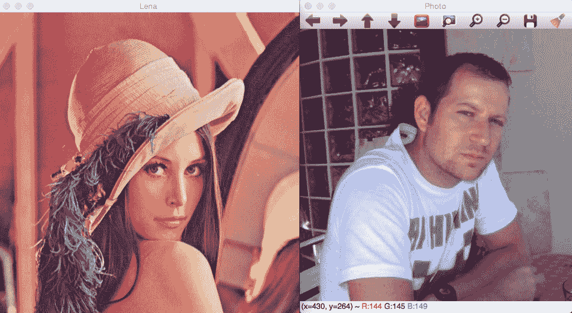
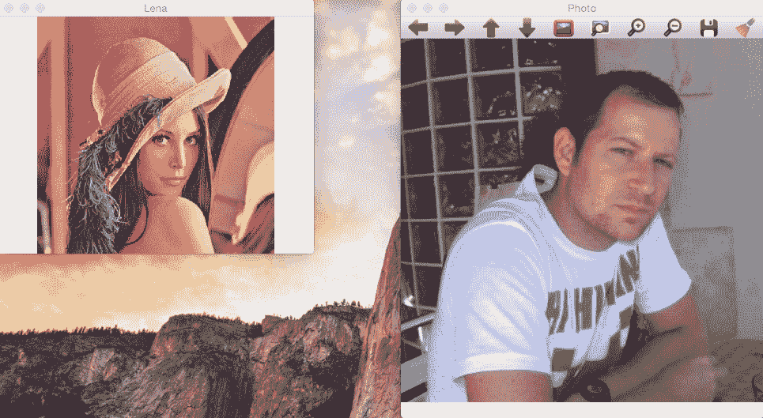
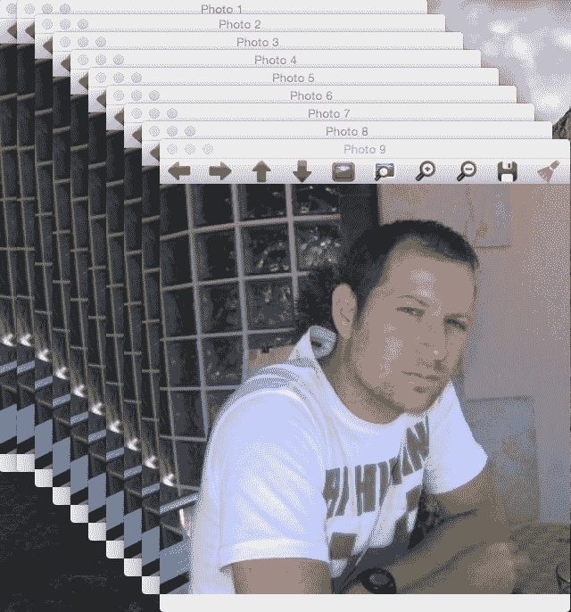
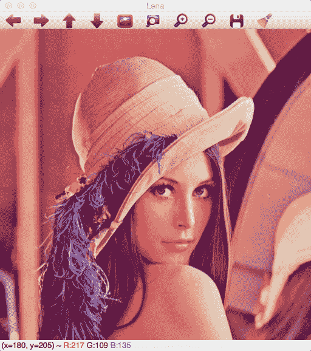
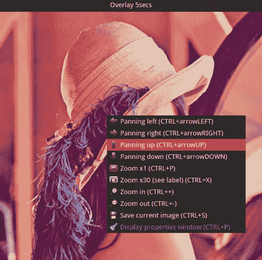
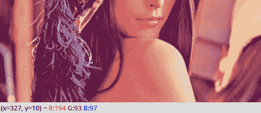
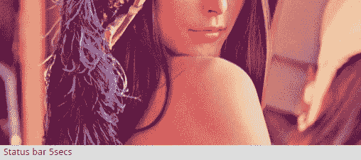
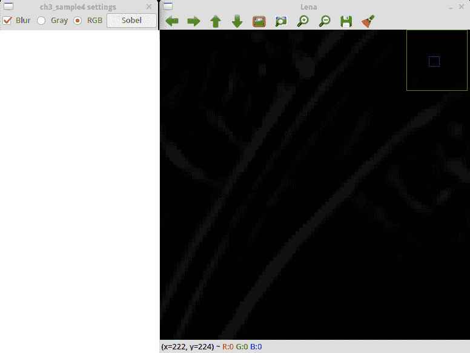
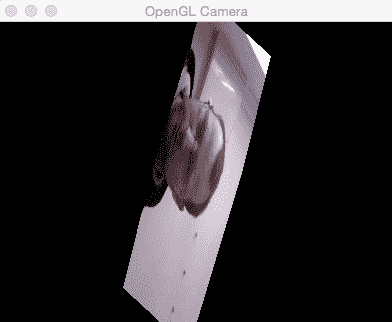

# 学习图形用户界面

在第二章，《OpenCV 基础知识简介》中，我们学习了 OpenCV 的基本类和结构以及最重要的类，称为`Mat`。我们学习了如何读取和保存图像和视频以及图像在内存中的内部结构。我们现在准备好使用 OpenCV，但在大多数情况下，我们需要通过多个用户界面来展示我们的图像结果和获取用户与图像的交互。OpenCV 为我们提供了一些基本的用户界面，以方便我们创建应用程序和原型。为了更好地理解用户界面的工作原理，我们将在本章末尾创建一个小应用程序，称为**PhotoTool**。在这个应用程序中，我们将学习如何使用过滤器进行颜色转换。

本章介绍了以下主题：

+   OpenCV 基本用户界面

+   OpenCV Qt 界面

+   滑块和按钮

+   高级用户界面 – OpenGL

+   颜色转换

+   基本过滤器

# 技术要求

本章要求熟悉基本的 C++编程语言。本章中使用的所有代码都可以从以下 GitHub 链接下载：[`github.com/PacktPublishing/Learn-OpenCV-4-By-Building-Projects-Second-Edition/tree/master/Chapter_03`](https://github.com/PacktPublishing/Learn-OpenCV-4-By-Building-Projects-Second-Edition/tree/master/Chapter_03)。代码可以在任何操作系统上执行，尽管它只在 Ubuntu 上进行了测试。

查看以下视频以查看代码的实际效果：

[`bit.ly/2KH2QXD`](http://bit.ly/2KH2QXD)

# 介绍 OpenCV 用户界面

OpenCV 拥有自己跨操作系统的用户界面，允许开发者创建自己的应用程序，无需学习复杂的用户界面库。OpenCV 的用户界面是基本的，但它为计算机视觉开发者提供了创建和管理软件开发的必要基本功能。所有这些功能都是本地的，并且针对实时使用进行了优化。

OpenCV 提供了两种用户界面选项：

+   基于本地用户界面、Mac OS X 的 cocoa 或 carbon 以及 Linux 或 Windows 用户界面的 GTK 的基本界面，默认情况下在编译 OpenCV 时选择。

+   基于 Qt 库的稍微高级一些的界面，这是一个跨平台界面。在编译 OpenCV 之前，您必须手动在 CMake 中启用 Qt 选项。

在下面的屏幕截图中，您可以在左侧看到基本用户界面窗口，在右侧看到 Qt 用户界面：



# 使用 OpenCV 的基本图形用户界面

我们将使用 OpenCV 创建一个基本的用户界面。OpenCV 用户界面允许我们创建窗口，向其中添加图像，并移动、调整大小和销毁它。用户界面位于 OpenCV 的`highui`模块中。在下面的代码中，我们将学习如何通过按下一个键来显示多个窗口，并在我们的桌面上移动窗口中的图像。

不要担心阅读完整的代码；我们将分块解释它：

```py
#include <iostream> 
#include <string> 
#include <sstream> 
using namespace std; 

// OpenCV includes 
#include <opencv2/core.hpp> 
#include <opencv2/highgui.hpp> 
using namespace cv; 

int main(int argc, const char** argv) 
{ 
   // Read images 
   Mat lena= imread("../lena.jpg"); 
   # Checking if Lena image has been loaded
   if (!lena.data) {
 cout << "Lena image missing!" << enld;
 return -1;
   }
   Mat photo= imread("../photo.jpg"); 
   # Checking if Lena image has been loaded
   if (!photo.data) {
 cout << "Lena image missing!" << enld;
 return -1;
 }

   // Create windows 
   namedWindow("Lena", WINDOW_NORMAL); 
   namedWindow("Photo", WINDOW_AUTOSIZE); 

   // Move window 
   moveWindow("Lena", 10, 10); 
   moveWindow("Photo", 520, 10); 

   // show images 
   imshow("Lena", lena); 
   imshow("Photo", photo);  

   // Resize window, only non autosize 
   resizeWindow("Lena", 512, 512);  

   // wait for any key press 
   waitKey(0); 

   // Destroy the windows 
   destroyWindow("Lena"); 
   destroyWindow("Photo"); 

   // Create 10 windows 
   for(int i =0; i< 10; i++) 
   { 
         ostringstream ss; 
         ss << "Photo" << i; 
         namedWindow(ss.str()); 
         moveWindow(ss.str(), 20*i, 20*i); 
         imshow(ss.str(), photo); 
   } 

   waitKey(0); 
   // Destroy all windows 
   destroyAllWindows(); 
   return 0; 
} 

```

让我们理解一下代码：

1.  为了便于图形用户界面，我们必须做的第一件事是导入 OpenCV 的`highui`模块：

```py
#include <opencv2/highgui.hpp> 
```

1.  现在我们准备创建新的窗口，我们必须加载一些图像：

```py
// Read images 
Mat lena= imread("../lena.jpg"); 
Mat photo= imread("../photo.jpg"); 
```

1.  为了创建窗口，我们使用`namedWindow`函数。此函数有两个参数；第一个是一个常量字符串，包含窗口的名称，第二个是我们需要的标志。第二个参数是可选的：

```py
namedWindow("Lena", WINDOW_NORMAL); 
namedWindow("Photo", WINDOW_AUTOSIZE);
```

1.  在我们的情况下，我们创建了两个窗口：第一个称为`Lena`，第二个称为`Photo`。

Qt 和原生默认有三个标志：

+   +   `WINDOW_NORMAL`: 此标志允许用户调整窗口大小

    +   `WINDOW_AUTOSIZE`: 如果设置此标志，则窗口大小将自动调整以适应显示图像，并且无法调整窗口大小

    +   `WINDOW_OPENGL`: 此标志启用 OpenGL 支持

Qt 有许多额外的标志：

+   +   `WINDOW_FREERATIO` 或 `WINDOW_KEEPRATIO`: 如果设置`WINDOW_FREERATIO`，则图像调整时不考虑其比例。如果设置`WINDOW_FREERATIO`，则图像调整时考虑其比例。

    +   `WINDOW_GUI_NORMAL` 或 `WINDOW_GUI_EXPANDED`: 第一个标志提供了一个没有状态栏和工具栏的基本界面。第二个标志提供了一个带有状态栏和工具栏的最先进图形用户界面。

如果我们使用 Qt 编译 OpenCV，我们创建的所有窗口默认情况下都在扩展界面中，但我们可以使用原生界面和更基本的界面，通过添加`CV_GUI_NORMAL`标志。默认情况下，标志是`WINDOW_AUTOSIZE`、`WINDOW_KEEPRATIO`和`WINDOW_GUI_EXPANDED`。

1.  当我们创建多个窗口时，它们是叠加的，但我们可以使用`moveWindow`函数将窗口移动到桌面上的任何区域，如下所示：

```py
// Move window 
moveWindow("Lena", 10, 10); 
moveWindow("Photo", 520, 10); 
```

1.  在我们的代码中，我们将`Lena`窗口向左移动`10`像素，向上移动`10`像素，并将`Photo`窗口向左移动`520`像素，向上移动`10`像素：

```py
// show images 
imshow("Lena", lena); 
imshow("Photo", photo);  
// Resize window, only non autosize 
resizeWindow("Lena", 512, 512);
```

1.  在使用`imshow`函数显示我们之前加载的图像之后，我们将`Lena`窗口的大小调整为`512`像素，调用`resizeWindow`函数。此函数有三个参数：`窗口名称`、`宽度`和`高度`。

具体的窗口大小是针对图像区域的。工具栏不计入。只有没有启用`WINDOW_AUTOSIZE`标志的窗口才能调整大小。

1.  在使用`waitKey`函数等待按键后，我们将使用`destroyWindow`函数删除或删除我们的窗口，其中窗口名称是唯一需要的参数：

```py
waitKey(0); 

// Destroy the windows 
destroyWindow("Lena"); 
destroyWindow("Photo"); 
```

1.  OpenCV 有一个函数可以在一个调用中删除我们创建的所有窗口。该函数名为`destroyAllWindows`。为了演示其工作原理，我们在我们的示例中创建了 10 个窗口并等待按键。当用户按下任何键时，它将销毁所有窗口：

```py
 // Create 10 windows 
for(int i =0; i< 10; i++) 
{ 
   ostringstream ss; 
   ss << "Photo" << i; 
   namedWindow(ss.str()); 
   moveWindow(ss.str(), 20*i, 20*i); 
   imshow(ss.str(), photo); 
} 

waitKey(0); 
// Destroy all windows 
destroyAllWindows(); 
```

在任何事件中，当应用程序终止时，OpenCV 会自动处理所有窗口的销毁，因此我们不需要在应用程序结束时调用此函数。

所有这些代码的结果可以在以下两个步骤中看到的图像中看到。首先，它显示了两个窗口：



在按下任何键后，应用程序继续并绘制几个窗口，改变它们的位置：



通过几行代码，我们能够创建和操作窗口以及显示图像。我们现在准备好促进用户与图像的交互并添加用户界面控件。

# 将滑块和鼠标事件添加到我们的界面中

鼠标事件和滑块控制对计算机视觉和 OpenCV 非常有用。使用这些控件，用户可以直接与界面交互并更改输入图像或变量的属性。在本节中，我们将介绍用于基本交互的鼠标事件和滑块控制。为了便于理解，我们创建了以下代码，通过该代码我们将使用鼠标事件在图像上绘制绿色圆圈，并使用滑块模糊图像：

```py
// Create a variable to save the position value in track 
int blurAmount=15; 

// Trackbar call back function 
static void onChange(int pos, void* userInput); 

//Mouse callback 
static void onMouse(int event, int x, int y, int, void* userInput); 

int main(int argc, const char** argv) 
{ 
   // Read images 
   Mat lena= imread("../lena.jpg"); 

   // Create windows 
   namedWindow("Lena"); 

   // create a trackbar 
   createTrackbar("Lena", "Lena", &blurAmount, 30, onChange, &lena); 

   setMouseCallback("Lena", onMouse, &lena); 

   // Call to onChange to init 
   onChange(blurAmount, &lena); 

   // wait app for a key to exit 
   waitKey(0); 

   // Destroy the windows 
   destroyWindow("Lena"); 

   return 0; 
} 
```

让我们理解这段代码！

首先，我们创建一个变量来保存滑块的位置。我们需要保存滑块的位置以便其他函数访问：

```py
// Create a variable to save the position value in track 
int blurAmount=15;
```

现在，我们定义我们的滑块和鼠标事件回调，这是`setMouseCallback`和`createTrackbar`OpenCV 函数所需的：

```py
// Trackbar call back function 
static void onChange(int pos, void* userInput); 

//Mouse callback 
static void onMouse(int event, int x, int y, int, void* userInput); 

```

在主函数中，我们加载一个图像并创建一个名为`Lena`的新窗口：

```py
int main(int argc, const char** argv) 
{ 
   // Read images 
   Mat lena= imread("../lena.jpg"); 

   // Create windows 
   namedWindow("Lena"); 
```

现在是创建滑块的时候了。OpenCV 有一个名为`createTrackbar`的函数，可以生成具有以下参数的滑块：

1.  滑块名称。

1.  窗口名称。

1.  整数指针用作值；此参数是可选的。如果设置了，则滑块在创建时达到此位置。

1.  滑块上的最大位置。

1.  滑块位置改变时的回调函数。

1.  发送到回调的用户数据。它可以用来在不使用全局变量的情况下将数据发送到回调。

在此代码中，我们为`Lena`窗口添加`trackbar`，并调用`Lena`的`trackbar`以模糊图像。滑块的值存储在作为指针传递的`blurAmount`整数中，并将滑块的最大值设置为`30`。我们将`onChange`设置为回调函数，并发送`lena mat`图像作为用户数据：

```py
   // create a trackbar 
   createTrackbar("Lena", "Lena", &blurAmount, 30, onChange, &lena);
```

创建滑块后，我们添加鼠标事件，当用户在鼠标上点击左键时绘制圆圈。OpenCV 有`setMouseCallback`函数。此函数有三个参数：

+   获取鼠标事件的窗口名称。

+   当有任何鼠标交互时调用的回调函数。

+   **用户数据**：这是在触发回调函数时将被发送的任何数据。在我们的例子中，我们将发送整个`Lena`图像。

使用以下代码，我们可以为`Lena`窗口添加鼠标回调，并将`onMouse`设置为回调函数，传递`lena mat`图像作为用户数据：

```py
setMouseCallback("Lena", onMouse, &lena); 
```

为了仅最终化主函数，我们需要使用与滑块相同的参数初始化图像。为了执行初始化，我们只需要调用`onChange`回调函数，并在使用`destroyWindow`关闭窗口之前等待事件，如下所示：

```py
// Call to onChange to init   
onChange(blurAmount, &lena); 

// wait app for a key to exit 
waitKey(0); 

// Destroy the windows 
destroyWindow("Lena"); 
```

滑块回调使用滑块值作为模糊量对图像应用基本模糊过滤器：

```py
// Trackbar call back function 
static void onChange(int pos, void* userData) { 
    if(pos <= 0) return; 
    // Aux variable for result 
    Mat imgBlur; 
    // Get the pointer input image     
    Mat* img= (Mat*)userInput; 
    // Apply a blur filter 
    blur(*img, imgBlur, Size(pos, pos)); 
    // Show the result 
    imshow("Lena", imgBlur); 
}
```

此函数使用变量`pos`检查滑块值是否为`0`。在这种情况下，我们不应用过滤器，因为它会产生不良的执行效果。我们也不能应用`0`像素的模糊。在检查滑块值后，我们创建一个名为`imgBlur`的空矩阵来存储模糊结果。为了在回调函数中检索通过用户数据发送的图像，我们必须将`void* userData`转换为正确的图像类型指针`Mat*`。

现在我们有了正确的变量来应用模糊过滤器。模糊函数将基本中值滤波器应用于输入图像，在我们的例子中是`*img`；输出图像，最后一个必需的参数是我们想要应用的模糊核的大小（核是一个用于计算核与图像之间卷积平均的小矩阵）。在我们的例子中，我们使用了一个大小为`pos`的平方核。最后，我们只需要使用`imshow`函数更新图像界面。

鼠标事件回调有五个输入参数：第一个参数定义事件类型；第二个和第三个定义鼠标位置；第四个参数定义鼠标滚轮移动；第五个参数定义用户输入数据。

鼠标事件类型如下：

| 事件类型 | 描述 |
| --- | --- |
| `EVENT_MOUSEMOVE` | 当用户移动鼠标时。 |
| `EVENT_LBUTTONDOWN` | 当用户点击鼠标左键时。 |
| `EVENT_RBUTTONDOWN` | 当用户点击鼠标右键时。 |
| `EVENT_MBUTTONDOWN` | 当用户点击鼠标中键时。 |
| `EVENT_LBUTTONUP` | 当用户释放鼠标左键时。 |
| `EVENT_RBUTTONUP` | 当用户释放鼠标右键时。 |
| `EVENT_MBUTTONUP` | 当用户释放鼠标中键时。 |
| `EVENT_LBUTTONDBLCLK` | 当用户双击鼠标左键时。 |
| `EVENT_RBUTTONDBLCLK` | 当用户双击鼠标右键时。 |
| `EVENT_MBUTTONDBLCLK` | 当用户双击鼠标中键时。 |
| `EVENTMOUSEWHEEL` | 当用户使用鼠标滚轮执行垂直滚动时。 |
| `EVENT_MOUSEHWHEEL` | 当用户使用鼠标滚轮执行水平滚动时。 |

在我们的示例中，我们只管理由鼠标左键点击产生的事件，任何不是`EVENT_LBUTTONDOWN`的事件都将被丢弃。在丢弃其他事件后，我们获得像滑动条回调函数那样的输入图像，并在图像中使用`circle` OpenCV 函数添加一个圆圈：

```py
//Mouse callback 
static void onMouse(int event, int x, int y, int, void* userInput) 
{ 
   if(event != EVENT_LBUTTONDOWN) 
           return; 

   // Get the pointer input image 
   Mat* img= (Mat*)userInput; 

   // Draw circle 
   circle(*img, Point(x, y), 10, Scalar(0,255,0), 3); 

   // Call on change to get blurred image 
   onChange(blurAmount, img); 

} 
```

# 基于 Qt 的图形用户界面

Qt 用户界面为我们提供了更多控制和选项来处理我们的图像。

界面分为以下三个主要区域：

+   工具栏

+   图像区域

+   状态栏

我们可以在以下图片中看到这三个区域。图像顶部是工具栏，图像是主要区域，状态栏位于图像底部：



从左到右，工具栏有以下按钮：

+   四个用于平移的按钮

+   放大 x1

+   放大 x30，显示标签

+   放大

+   缩小

+   保存当前图像

+   显示属性

这些选项在以下图像中可以清楚地看到：


当我们在图像上按下鼠标右键时，图像区域显示一个图像和一个上下文菜单。此区域可以使用`displayOverlay`函数在区域的顶部显示覆盖消息。此函数接受三个参数：窗口名称、我们想要显示的文本以及覆盖文本显示的毫秒数。如果此时间设置为`0`，则文本永远不会消失：

```py
// Display Overlay 
displayOverlay("Lena", "Overlay 5secs", 5000);
```

我们可以在以下图像中看到前面代码的结果。您可以在图像顶部看到一个带有句子“Overlay 5secs”的小黑框：



最后，状态栏显示窗口的底部部分，并显示图像中坐标的像素值和位置：



我们可以使用状态栏显示类似于覆盖的消息。可以更改状态栏消息的函数是`displayStatusBar`。此函数具有与覆盖函数相同的参数：窗口名称、要显示的文本以及显示它的持续时间：



# 向用户界面添加按钮

在前面的章节中，我们学习了如何创建普通或 Qt 界面，并使用鼠标和滑动条与之交互，但我们可以创建不同类型的按钮。

按钮仅在 Qt 窗口中受支持。

OpenCV Qt 支持的按钮类型如下：

+   按钮推压

+   复选框

+   单选框

按钮仅出现在控制面板中。控制面板是每个程序的一个独立窗口，我们可以在这里附加按钮和滑块。要显示控制面板，我们可以点击最后一个工具栏按钮，在 Qt 窗口的任何部分右键单击并选择显示属性窗口，或者使用`*Ctrl* + *P*`快捷键。让我们创建一个带有按钮的基本示例。代码量很大，我们将首先解释主函数，然后分别解释每个回调函数，以便更好地理解所有内容。以下代码显示了生成用户界面的主代码函数：

```py
Mat img; 
bool applyGray=false; 
bool applyBlur=false; 
bool applySobel=false; 
... 
int main(int argc, const char** argv) 
{ 
   // Read images 
   img= imread("../lena.jpg"); 

   // Create windows 
   namedWindow("Lena"); 

   // create Buttons 
   createButton("Blur", blurCallback, NULL, QT_CHECKBOX, 0); 

   createButton("Gray",grayCallback,NULL,QT_RADIOBOX, 0); 
   createButton("RGB",bgrCallback,NULL,QT_RADIOBOX, 1); 

   createButton("Sobel",sobelCallback,NULL,QT_PUSH_BUTTON, 0); 

   // wait app for a key to exit 
   waitKey(0); 

   // Destroy the windows 
   destroyWindow("Lena"); 

   return 0; 
} 

```

我们将应用三种类型的过滤器：模糊、Sobel 滤波器和颜色转换到灰度。所有这些都是可选的，用户可以通过我们即将创建的按钮选择每个选项。然后，为了获取每个过滤器的状态，我们创建了三个全局布尔变量：

```py
bool applyGray=false; 
bool applyBlur=false; 
bool applySobel=false;
```

在主函数中，在加载图像并创建窗口之后，我们必须使用`createButton`函数创建每个按钮。

OpenCV 中定义了三种按钮类型：

+   `QT_CHECKBOX`

+   `QT_RADIOBOX`

+   `QT_PUSH_BUTTON`

每个按钮有五个参数，顺序如下：

1.  按钮名称

1.  一个回调函数

1.  指向传递给回调的用户变量数据的指针

1.  按钮类型

1.  用于复选框和单选按钮类型的默认初始化状态

然后，我们创建一个模糊复选框按钮，两个用于颜色转换的单选按钮，以及一个用于 Sobel 滤波器的推送按钮，如下面的代码所示：

```py
   // create Buttons 
   createButton("Blur", blurCallback, NULL, QT_CHECKBOX, 0); 

   createButton("Gray",grayCallback,NULL,QT_RADIOBOX, 0); 
   createButton("RGB",bgrCallback,NULL,QT_RADIOBOX, 1); 

   createButton("Sobel",sobelCallback,NULL,QT_PUSH_BUTTON, 0); 

```

这些是主函数最重要的部分。我们将探讨`Callback`函数。每个`Callback`都会更改其状态变量，以调用另一个名为`applyFilters`的函数，以便将激活的过滤器添加到输入图像中：

```py
void grayCallback(int state, void* userData) 
{ 
   applyGray= true; 
   applyFilters(); 
} 
void bgrCallback(int state, void* userData) 
{ 
   applyGray= false; 
   applyFilters(); 
} 

void blurCallback(int state, void* userData) 
{ 
   applyBlur= (bool)state; 
   applyFilters(); 
} 

void sobelCallback(int state, void* userData) 
{ 
   applySobel= !applySobel; 
   applyFilters(); 
} 

```

`applyFilters`函数检查每个过滤器的状态变量：

```py
void applyFilters(){ 
   Mat result; 
   img.copyTo(result); 
   if(applyGray){ 
         cvtColor(result, result, COLOR_BGR2GRAY); 
   } 
   if(applyBlur){ 
         blur(result, result, Size(5,5));     
   } 
   if(applySobel){ 
         Sobel(result, result, CV_8U, 1, 1);  
   } 
   imshow("Lena", result); 
} 
```

要将颜色转换为灰度，我们使用`cvtColor`函数，该函数接受三个参数：输入图像、输出图像和颜色转换类型。

最有用的颜色空间转换如下：

+   RGB 或 BGR 到灰度（`COLOR_RGB2GRAY`，`COLOR_BGR2GRAY`）

+   RGB 或 BGR 到 YcrCb（或 YCC）（`COLOR_RGB2YCrCb`，`COLOR_BGR2YCrCb`）

+   RGB 或 BGR 到 HSV（`COLOR_RGB2HSV`，`COLOR_BGR2HSV`）

+   RGB 或 BGR 到 Luv（`COLOR_RGB2Luv`，`COLOR_BGR2Luv`）

+   灰度到 RGB 或 BGR（`COLOR_GRAY2RGB`，`COLOR_GRAY2BGR`）

我们可以看到，代码很容易记住。

OpenCV 默认使用 BGR 格式，RGB 和 BGR 的颜色转换不同，即使转换为灰度也是如此。一些开发者认为`R+G+B/3`对灰度是正确的，但最佳灰度值被称为**亮度**，其公式为*0*，*21*`R` + *0*，*72*`G` + *0*，*07*`B`。

模糊滤镜在上一节中已描述，最后，如果 `applySobel` 变量为真，我们应用 Sobel 滤镜。Sobel 滤镜是通过 Sobel 运算符获得的图像导数，通常用于检测边缘。OpenCV 允许我们使用核大小生成不同的导数，但最常见的是 3x3 核来计算 *x* 导数或 *y* 导数。

最重要的 Sobel 参数如下：

+   输入图像

+   输出图像

+   输出图像深度 (`CV_8U`, `CV_16U`, `CV_32F`, `CV_64F`)

+   导数 *x* 的顺序

+   导数 *y* 的顺序

+   核大小（默认值为 3）

要生成 3x3 核和第一个 *x* 顺序导数，我们必须使用以下参数：

```py
Sobel(input, output, CV_8U, 1, 0);
```

以下参数用于 *y* 顺序导数：

```py
Sobel(input, output, CV_8U, 0, 1);      
```

在我们的例子中，我们同时使用 *x* 和 *y* 导数，覆盖输入。以下代码片段展示了如何同时生成 *x* 和 *y* 导数，在第四和第五个参数中添加 `1`：

```py
Sobel(result, result, CV_8U, 1, 1); 
```

同时应用 *x* 和 *y* 导数的结果看起来像以下图像，应用于 Lena 图片：



# OpenGL 支持

OpenCV 包含 OpenGL 支持。OpenGL 是集成在几乎所有图形卡中的标准图形库。OpenGL 允许我们绘制 2D 到复杂的 3D 场景。OpenCV 包含 OpenGL 支持是因为在许多任务中，表示 3D 空间非常重要。为了允许 OpenGL 窗口支持，我们必须在创建窗口时使用 `namedWindow` 调用设置 `WINDOW_OPENGL` 标志。

以下代码创建了一个具有 OpenGL 支持的窗口，并绘制了一个旋转平面，我们将在此平面上显示网络摄像头帧：

```py
Mat frame; 
GLfloat angle= 0.0; 
GLuint texture;  
VideoCapture camera; 

int loadTexture() { 

    if (frame.data==NULL) return -1; 

   glBindTexture(GL_TEXTURE_2D, texture);  
   glTexParameteri(GL_TEXTURE_2D,GL_TEXTURE_MAG_FILTER,GL_LINEAR); 
   glTexParameteri(GL_TEXTURE_2D,GL_TEXTURE_MIN_FILTER,GL_LINEAR); 
   glPixelStorei(GL_UNPACK_ALIGNMENT, 1); 

   glTexImage2D(GL_TEXTURE_2D, 0, GL_RGB, frame.cols, frame.rows,0, GL_BGR, GL_UNSIGNED_BYTE, frame.data); 
   return 0; 

} 

void on_opengl(void* param) 
{ 
    glLoadIdentity();   
    // Load frame Texture 
    glBindTexture(GL_TEXTURE_2D, texture);  
    // Rotate plane before draw 
    glRotatef(angle, 1.0f, 1.0f, 1.0f); 
    // Create the plane and set the texture coordinates 
    glBegin (GL_QUADS); 
        // first point and coordinate texture 
     glTexCoord2d(0.0,0.0);  
     glVertex2d(-1.0,-1.0);  
        // second point and coordinate texture 
     glTexCoord2d(1.0,0.0);  
     glVertex2d(+1.0,-1.0);  
        // third point and coordinate texture 
     glTexCoord2d(1.0,1.0);  
     glVertex2d(+1.0,+1.0); 
        // last point and coordinate texture 
     glTexCoord2d(0.0,1.0);  
     glVertex2d(-1.0,+1.0); 
    glEnd(); 

} 

int main(int argc, const char** argv) 
{ 
    // Open WebCam 
    camera.open(0); 
    if(!camera.isOpened()) 
        return -1; 

    // Create new windows 
    namedWindow("OpenGL Camera", WINDOW_OPENGL); 

    // Enable texture 
    glEnable( GL_TEXTURE_2D );
    glGenTextures(1, &texture); 
    setOpenGlDrawCallback("OpenGL Camera", on_opengl); 
    while(waitKey(30)!='q'){ 
        camera >> frame; 
        // Create first texture 
        loadTexture();     
        updateWindow("OpenGL Camera"); 
        angle =angle+4; 
    } 
    // Destroy the windows 
    destroyWindow("OpenGL Camera"); 
    return 0; 
}
```

让我们理解一下代码！

第一个任务是创建所需的全局变量，其中我们存储视频捕获，保存帧，并控制动画角度平面和 OpenGL 纹理：

```py
Mat frame; 
GLfloat angle= 0.0; 
GLuint texture;  
VideoCapture camera; 
```

在我们的主函数中，我们必须创建视频摄像头捕获以检索摄像头帧：

```py
camera.open(0); 
    if(!camera.isOpened()) 
        return -1; 
```

如果相机正确打开，我们可以使用 `WINDOW_OPENGL` 标志创建具有 OpenGL 支持的窗口：

```py
// Create new windows 
namedWindow("OpenGL Camera", WINDOW_OPENGL);
```

在我们的例子中，我们想在平面上绘制来自网络摄像头的图像；然后，我们需要启用 OpenGL 纹理：

```py
// Enable texture 
glEnable(GL_TEXTURE_2D); 
```

现在我们已经准备好在窗口中使用 OpenGL 绘制，但我们需要设置一个类似于典型 OpenGL 应用程序的绘制 OpenGL 回调。OpenCV 给我们 `setOpenGLDrawCallback` 函数，它有两个参数——窗口名称和回调函数：

```py
setOpenGlDrawCallback("OpenGL Camera", on_opengl); 
```

在定义了 OpenCV 窗口和回调函数后，我们需要创建一个循环来加载纹理，通过调用 OpenGL 绘制回调更新窗口内容，并最终更新角度位置。为了更新窗口内容，我们使用 OpenCV 函数 `updateWindow` 并将窗口名称作为参数：

```py
while(waitKey(30)!='q'){ 
        camera >> frame; 
        // Create first texture 
        loadTexture(); 
        updateWindow("OpenGL Camera"); 
        angle =angle+4; 
    } 
```

当用户按下*Q*键时，我们处于循环中。在我们编译应用程序示例之前，我们需要定义`loadTexture`函数和我们的`on_opengl`回调绘制函数。`loadTexture`函数将我们的`Mat`帧转换为 OpenGL 纹理图像，以便在每次回调绘制中使用。在将图像作为纹理加载之前，我们必须确保我们的帧矩阵中有数据，检查数据变量对象是否为空：

```py
if (frame.data==NULL) return -1; 
```

如果我们的矩阵帧中有数据，那么我们可以创建 OpenGL 纹理绑定，并将 OpenGL 纹理参数设置为线性插值：

```py
glGenTextures(1, &texture); 

glBindTexture(GL_TEXTURE_2D, texture); 
    glTexParameteri(GL_TEXTURE_2D,GL_TEXTURE_MAG_FILTER,GL_LINEAR); 
    glTexParameteri(GL_TEXTURE_2D,GL_TEXTURE_MIN_FILTER,GL_LINEAR);
```

现在，我们必须定义像素在我们矩阵中的存储方式，并使用 OpenGL 的`glTexImage2D`函数生成像素。非常重要的一点是，OpenGL 默认使用 RGB 格式，而 OpenCV 使用 BGR 格式，我们必须在这个函数中设置正确的格式：

```py
glPixelStorei(GL_UNPACK_ALIGNMENT, 1); 
glTexImage2D(GL_TEXTURE_2D, 0, GL_RGB, frame.cols, frame.rows,0, GL_BGR, GL_UNSIGNED_BYTE, frame.data); 
    return 0; 
```

现在，我们只需要在主循环中调用`updateWindow`时，在每次回调中完成我们的平面的绘制。我们使用常见的 OpenGL 函数，然后加载单位 OpenGL 矩阵以重置我们之前的所有更改：

```py
glLoadIdentity();   
```

我们还必须将帧纹理带到内存中：

```py
    // Load Texture 
    glBindTexture(GL_TEXTURE_2D, texture);  
```

在绘制我们的平面之前，我们将应用所有变换到我们的场景中。在我们的例子中，我们将围绕`1,1,1`轴旋转我们的平面：

```py
    // Rotate plane 
    glRotatef(angle, 1.0f, 1.0f, 1.0f); 
```

现在我们已经正确设置了场景来绘制我们的平面，我们将绘制四边形面（具有四个顶点的面），并使用`glBegin (GL_QUADS)`来完成这个目的：

```py
// Create the plane and set the texture coordinates 
    glBegin (GL_QUADS); 
```

接下来，我们将绘制一个以`0,0`位置为中心的平面，大小为 2 个单位。然后，我们必须定义要使用的纹理坐标和顶点位置，使用`glTextCoord2D`和`glVertex2D`函数：

```py
    // first point and coordinate texture 
 glTexCoord2d(0.0,0.0);  
 glVertex2d(-1.0,-1.0);  
    // seccond point and coordinate texture 
 glTexCoord2d(1.0,0.0);  
 glVertex2d(+1.0,-1.0);  
    // third point and coordinate texture 
 glTexCoord2d(1.0,1.0);  
 glVertex2d(+1.0,+1.0); 
    // last point and coordinate texture 
 glTexCoord2d(0.0,1.0);  
 glVertex2d(-1.0,+1.0); 
    glEnd(); 
```

这段 OpenGL 代码已经过时，但它适合更好地理解 OpenCV 和 OpenGL 的集成，而不需要复杂的 OpenGL 代码。通过现代 OpenGL 的介绍，阅读*《现代 OpenGL 入门》*，由*Packt Publishing*出版。

我们可以在以下图像中看到结果：



# 摘要

在本章中，我们学习了如何使用 OpenGL 创建不同类型的用户界面来显示图像或 3D 界面。我们学习了如何创建滑块和按钮或在 3D 中绘制。我们还使用原生 OpenCV 学习了一些基本的图像处理过滤器，但有一些新的开源替代品允许我们添加更多功能，例如 cvui ([`dovyski.github.io/cvui/`](https://dovyski.github.io/cvui/)) 或 OpenCVGUI ([`damiles.github.io/OpenCVGUI/`](https://damiles.github.io/OpenCVGUI/))。

在下一章中，我们将构建一个完整的照片工具应用程序，我们将应用迄今为止所学的所有知识。通过图形用户界面，我们将学习如何将多个过滤器应用到输入图像上。
