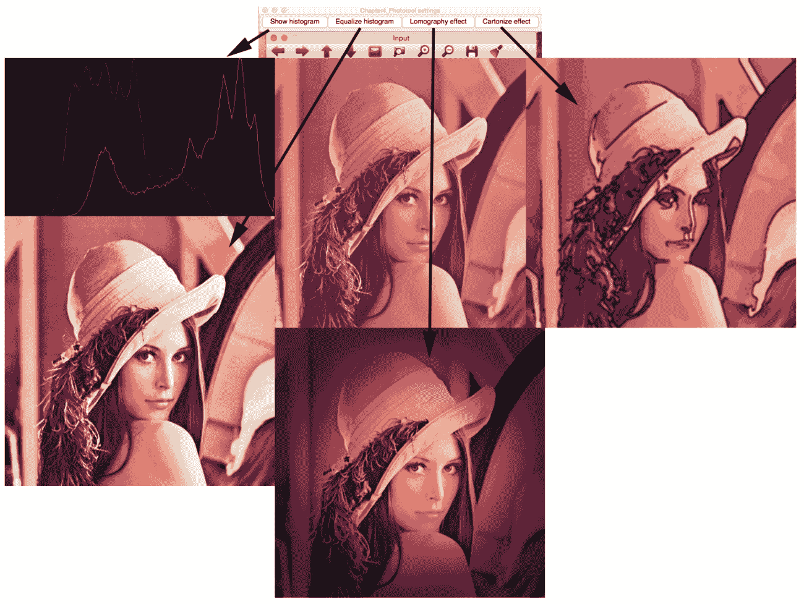
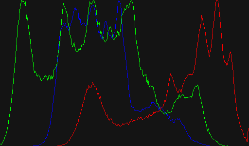
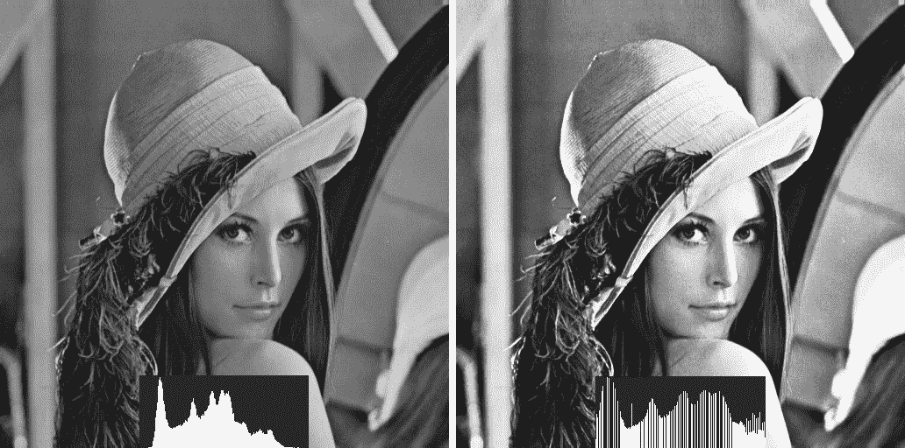
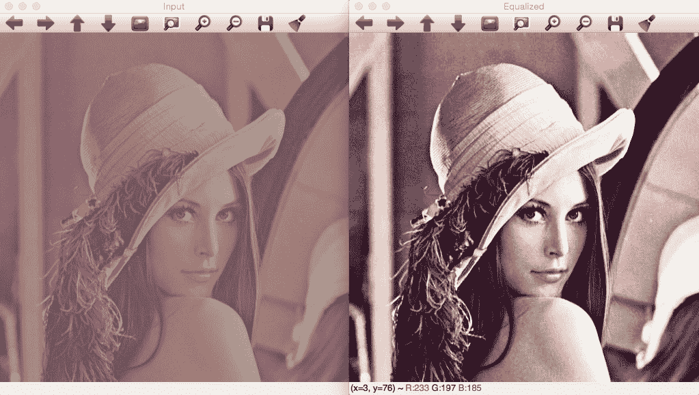
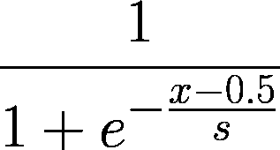
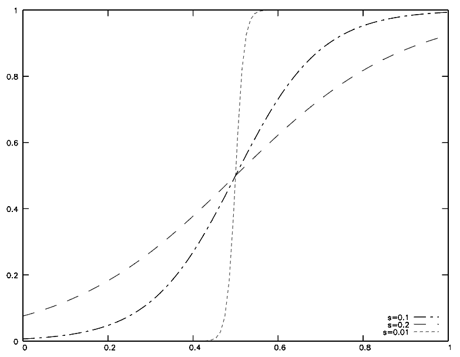
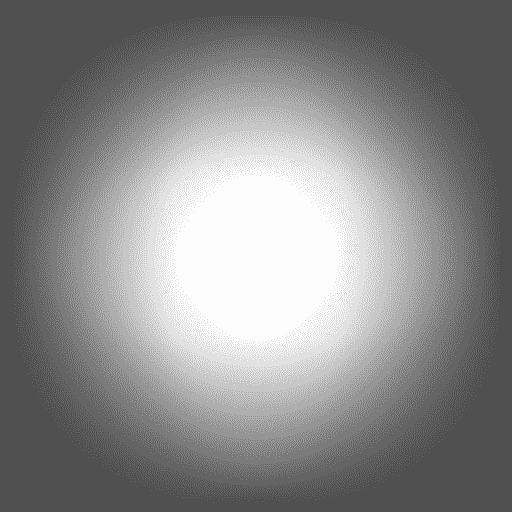
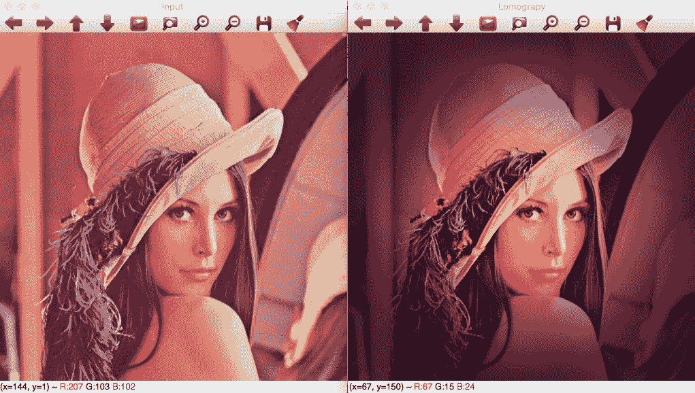
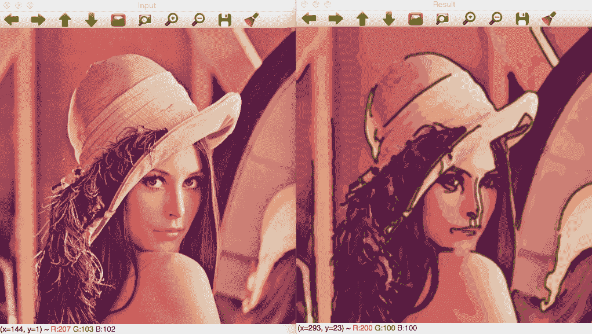

# 深入直方图和滤波器

在上一章中，我们学习了使用 Qt 库或本地库在 OpenCV 中实现用户界面的基础知识；我们还学习了如何使用高级 OpenGL 用户界面。我们学习了基本的颜色转换和允许我们创建第一个应用程序的过滤器。本章将介绍以下概念：

+   直方图和直方图均衡

+   查找表

+   模糊和中值模糊

+   Canny 滤波器

+   图像颜色均衡

+   理解图像类型之间的转换

在我们学习 OpenCV 和用户界面的基础知识之后，我们将在本章中创建我们的第一个完整应用程序，一个基本的照片工具，并涵盖以下主题：

+   生成 CMake 脚本文件

+   创建图形用户界面

+   计算和绘制直方图

+   直方图均衡

+   洛马格诺伊相机效果

+   卡通化效果

此应用程序将帮助我们了解如何从头开始创建整个项目，并理解直方图的概念。我们将看到如何均衡彩色图像的直方图，并创建两种效果，使用滤波器的组合和使用查找表。

# 技术要求

本章要求熟悉 C++编程语言的基础知识。本章中使用的所有代码都可以从以下 GitHub 链接下载：[`github.com/PacktPublishing/Learn-OpenCV-4-By-Building-Projects-Second-Edition/tree/master/Chapter_04`](https://github.com/PacktPublishing/Learn-OpenCV-4-By-Building-Projects-Second-Edition/tree/master/Chapter_04)。代码可以在任何操作系统上执行，尽管它仅在 Ubuntu 上进行了测试。

查看以下视频以查看代码的实际应用：

[`bit.ly/2Sid17y`](http://bit.ly/2Sid17y)

# 生成 CMake 脚本文件

在我们开始创建源文件之前，我们将生成`CMakeLists.txt`文件，以便我们可以编译我们的项目，对其进行结构化，并执行它。以下 CMake 脚本简单且基本，但足以编译和生成可执行文件：

```py
cmake_minimum_required (VERSION 3.0)

PROJECT(Chapter4_Phototool)

set (CMAKE_CXX_STANDARD 11)

# Requires OpenCV
FIND_PACKAGE( OpenCV 4.0.0 REQUIRED )
MESSAGE("OpenCV version : ${OpenCV_VERSION}")

include_directories(${OpenCV_INCLUDE_DIRS})
link_directories(${OpenCV_LIB_DIR})

ADD_EXECUTABLE(${PROJECT_NAME} main.cpp)
TARGET_LINK_LIBRARIES(${PROJECT_NAME} ${OpenCV_LIBS})
```

第一行指示生成我们的项目所需的最低 CMake 版本，第二行设置的项目名称可以用作`${PROJECT_NAME}`变量，第三行设置所需的 C++版本；在我们的案例中，我们需要**C++11**版本，正如我们可以在下一个片段中看到：

```py
cmake_minimum_required (VERSION 3.0)

PROJECT(Chapter4_Phototool)

set (CMAKE_CXX_STANDARD 11)
```

此外，我们还需要 OpenCV 库。首先，我们需要找到库，然后我们将使用`MESSAGE`函数显示找到的 OpenCV 库版本信息：

```py
# Requires OpenCV 
FIND_PACKAGE( OpenCV 4.0.0 REQUIRED ) 
MESSAGE("OpenCV version : ${OpenCV_VERSION}") 
```

如果找到的库版本至少为 4.0，则将头文件和库文件包含到我们的项目中：

```py
include_directories(${OpenCV_INCLUDE_DIRS}) 
link_directories(${OpenCV_LIB_DIR})
```

现在，我们只需要将源文件添加到编译中，并与 OpenCV 库链接。项目名称变量用作可执行文件名称，我们只使用一个名为`main.cpp`的单个源文件：

```py
ADD_EXECUTABLE(${PROJECT_NAME} main.cpp) 
TARGET_LINK_LIBRARIES(${PROJECT_NAME} ${OpenCV_LIBS})
```

# 创建图形用户界面

在我们开始图像处理算法之前，我们为我们的应用程序创建主用户界面。我们将使用基于 Qt 的用户界面来允许我们创建单个按钮。应用程序接收一个输入参数来加载要处理的图像，我们将创建四个按钮，如下所示：

+   显示直方图

+   直方图均衡化

+   洛马格诺效应

+   卡通化效果

我们可以在以下屏幕截图中看到四个结果：



让我们开始开发我们的项目。首先，我们将包含 OpenCV – 必需的头文件，定义一个图像矩阵来存储输入图像，并创建一个常量字符串来使用 OpenCV 3.0 已提供的新的命令行解析器；在这个常量中，我们只允许两个输入参数，`help`和必需的图像输入：

```py
// OpenCV includes 
#include "opencv2/core/utility.hpp" 
#include "opencv2/imgproc.hpp" 
#include "opencv2/highgui.hpp" 
using namespace cv; 
// OpenCV command line parser functions 
// Keys accepted by command line parser 
const char* keys = 
{ 
   "{help h usage ? | | print this message}" 
    "{@image | | Image to process}" 
}; 
```

主函数从命令行解析变量开始；接下来，我们设置关于说明并打印帮助信息。这一行设置了我们的最终可执行文件的帮助说明：

```py
int main(int argc, const char** argv) 
{ 
   CommandLineParser parser(argc, argv, keys); 
    parser.about("Chapter 4\. PhotoTool v1.0.0"); 
    //If requires help show 
    if (parser.has("help")) 
   { 
       parser.printMessage(); 
       return 0; 
   } 
```

如果用户不需要帮助，那么我们必须在`imgFile`变量字符串中获取文件路径图像，并使用`parser.check()`函数检查是否添加了所有必需的参数：

```py
String imgFile= parser.get<String>(0); 

// Check if params are correctly parsed in his variables 
if (!parser.check()) 
{ 
    parser.printErrors(); 
    return 0; 
}
```

现在，我们可以使用`imread`函数读取图像文件，然后使用`namedWindow`函数创建一个窗口，稍后将在其中显示输入图像：

```py
// Load image to process 
Mat img= imread(imgFile); 

// Create window 
namedWindow("Input"); 
```

在图像加载和窗口创建后，我们只需要创建我们的界面按钮并将它们与回调函数链接；每个回调函数都在源代码中定义，我们将在本章后面解释这些函数。我们将使用`createButton`函数和`QT_PUSH_BUTTON`常量来创建按钮，以按钮样式：

```py
// Create UI buttons 
createButton("Show histogram", showHistoCallback, NULL, QT_PUSH_BUTTON, 0); 
createButton("Equalize histogram", equalizeCallback, NULL, QT_PUSH_BUTTON, 0); 
createButton("Lomography effect", lomoCallback, NULL, QT_PUSH_BUTTON, 0); 
createButton("Cartoonize effect", cartoonCallback, NULL, QT_PUSH_BUTTON, 0); 
```

为了完成我们的主函数，我们显示输入图像并等待按键以结束我们的应用程序：

```py
// Show image 
imshow("Input", img); 

waitKey(0); 
return 0; 
```

现在，我们只需要定义每个回调函数，在接下来的章节中，我们将这样做。

# 绘制直方图

直方图是变量分布的统计图形表示，它允许我们理解数据的密度估计和概率分布。直方图是通过将变量值的整个范围划分为一个小范围值，然后计算落入每个区间的值数量来创建的。

如果我们将这个直方图概念应用到图像上，看起来很难理解，但实际上它非常简单。在灰度图像中，我们的变量值范围是每个可能的灰度值（从`0`到`255`），密度是具有此值的图像像素数。这意味着我们必须计算具有值为`0`的图像像素数，具有值为`1`的像素数，依此类推。

显示输入图像直方图的回调函数是`showHistoCallback`；这个函数计算每个通道图像的直方图，并在新图像中显示每个直方图通道的结果。

现在，检查以下代码：

```py
void showHistoCallback(int state, void* userData) 
{ 
    // Separate image in BRG 
    vector<Mat> bgr; 
    split(img, bgr); 

    // Create the histogram for 256 bins 
    // The number of possibles values [0..255] 
    int numbins= 256; 

    /// Set the ranges for B,G,R last is not included 
    float range[] = { 0, 256 } ; 
    const float* histRange = { range }; 

    Mat b_hist, g_hist, r_hist; 

    calcHist(&bgr[0], 1, 0, Mat(), b_hist, 1, &numbins, &histRange); 
    calcHist(&bgr[1], 1, 0, Mat(), g_hist, 1, &numbins, &histRange); 
    calcHist(&bgr[2], 1, 0, Mat(), r_hist, 1, &numbins, &histRange); 

    // Draw the histogram 
    // We go to draw lines for each channel 
    int width= 512; 
    int height= 300; 
    // Create image with gray base 
    Mat histImage(height, width, CV_8UC3, Scalar(20,20,20)); 

    // Normalize the histograms to height of image 
    normalize(b_hist, b_hist, 0, height, NORM_MINMAX); 
    normalize(g_hist, g_hist, 0, height, NORM_MINMAX); 
    normalize(r_hist, r_hist, 0, height, NORM_MINMAX); 

    int binStep= cvRound((float)width/(float)numbins); 
    for(int i=1; i< numbins; i++) 
    { 
        line(histImage,  
                Point( binStep*(i-1), height-cvRound(b_hist.at<float>(i-1) )), 
                Point( binStep*(i), height-cvRound(b_hist.at<float>(i) )), 
                Scalar(255,0,0) 
            ); 
        line(histImage,  
                Point(binStep*(i-1), height-cvRound(g_hist.at<float>(i-1))), 
                Point(binStep*(i), height-cvRound(g_hist.at<float>(i))), 
                Scalar(0,255,0) 
            ); 
        line(histImage,  
                Point(binStep*(i-1), height-cvRound(r_hist.at<float>(i-1))), 
                Point(binStep*(i), height-cvRound(r_hist.at<float>(i))), 
                Scalar(0,0,255) 
            ); 
    } 

    imshow("Histogram", histImage); 

} 
```

让我们了解如何提取每个通道的直方图以及如何绘制它。首先，我们需要创建三个矩阵来处理每个输入图像通道。我们使用一个向量类型的变量来存储每个矩阵，并使用`split` OpenCV 函数将这些通道分配给这三个通道：

```py
// Separate image in BRG 
    vector<Mat> bgr; 
    split(img, bgr); 
```

现在，我们将定义直方图的分箱数量，在我们的例子中，每个可能的像素值对应一个分箱：

```py
int numbins= 256; 
```

让我们定义变量的范围并创建三个矩阵来存储每个直方图：

```py
/// Set the ranges for B,G,R 
float range[] = {0, 256} ; 
const float* histRange = {range}; 

Mat b_hist, g_hist, r_hist;
```

我们可以使用`calcHist` OpenCV 函数来计算直方图。此函数有多个参数，顺序如下：

+   **输入图像**：在我们的例子中，我们使用存储在`bgr`向量中的一个图像通道

+   **计算直方图所需的输入图像数量**：在我们的例子中，我们只使用`1`个图像

+   **用于计算直方图的通道维度**：在我们的例子中，我们使用`0`

+   可选的掩码矩阵。

+   用于存储计算出的直方图的变量。

+   **直方图维度**：这是图像（在这里，是一个灰度平面）取值的空间维度，在我们的例子中是`1`

+   **计算分箱的数量**：在我们的例子中是`256`个分箱，每个分箱对应一个像素值

+   **输入变量的范围**：在我们的例子中，从`0`到`255`可能的像素值

我们为每个通道的`calcHist`函数看起来如下：

```py
calcHist(&bgr[0], 1, 0, Mat(), b_hist, 1, &numbins, &histRange ); 
calcHist(&bgr[1], 1, 0, Mat(), g_hist, 1, &numbins, &histRange ); 
calcHist(&bgr[2], 1, 0, Mat(), r_hist, 1, &numbins, &histRange ); 
```

现在我们已经计算了每个通道的直方图，我们必须绘制每个直方图并向用户显示。为此，我们将创建一个大小为`512` x `300`像素的颜色图像：

```py
// Draw the histogram 
// We go to draw lines for each channel 
int width= 512; 
int height= 300; 
// Create image with gray base 
Mat histImage(height, width, CV_8UC3, Scalar(20,20,20)); 
```

在我们将直方图值绘制到我们的图像之前，我们将直方图矩阵在最小值`0`和最大值之间进行归一化；最大值与我们的输出直方图图像的高度相同：

```py
// Normalize the histograms to height of image 
normalize(b_hist, b_hist, 0, height, NORM_MINMAX); 
normalize(g_hist, g_hist, 0, height, NORM_MINMAX); 
normalize(r_hist, r_hist, 0, height, NORM_MINMAX);
```

现在，我们必须从分箱`0`到分箱`1`画一条线，依此类推。在每个分箱之间，我们必须计算有多少像素；然后，通过除以分箱的数量来计算`binStep`变量。每条小线是从水平位置`i-1`到`i`绘制的；垂直位置是相应`i`的直方图值，并且使用颜色通道表示来绘制：

```py
int binStep= cvRound((float)width/(float)numbins); 
    for(int i=1; i< numbins; i++) 
    { 
        line(histImage,  
                Point(binStep*(i-1), height-cvRound(b_hist.at<float>(i-1))), 
                Point(binStep*(i), height-cvRound(b_hist.at<float>(i))), 
                Scalar(255,0,0) 
            ); 
        line(histImage,  
                Point(binStep*(i-1), height-cvRound(g_hist.at<float>(i-1))), 
                Point( binStep*(i), height-cvRound(g_hist.at<float>(i))), 
                Scalar(0,255,0) 
            ); 
        line(histImage,  
                Point(binStep*(i-1), height-cvRound(r_hist.at<float>(i-1))), 
                Point( binStep*(i), height-cvRound(r_hist.at<float>(i))), 
                Scalar(0,0,255) 
            ); 
    } 
```

最后，我们使用`imshow`函数显示直方图图像：

```py
    imshow("Histogram", histImage); 
```

这是`lena.png`图像的结果：



# 图像色彩均衡

在本节中，我们将学习如何均衡彩色图像。图像均衡化，或直方图均衡化，试图获得具有均匀值分布的直方图。均衡化的结果是图像对比度的增加。均衡化允许局部对比度较低的区域获得高对比度，使最频繁的强度扩散。当图像非常暗或亮，背景与前景之间差异非常小的时候，这种方法非常有用。使用直方图均衡化，我们增加对比度和过度或不足曝光的细节。这种技术在医学图像，如 X 光片中非常有用。

然而，这种方法有两个主要缺点：背景噪声的增加以及有用信号的相应减少。我们可以在以下照片中看到均衡化的效果，当增加图像对比度时，直方图发生变化并扩散：



让我们实现我们的直方图均衡化；我们将在用户界面代码中定义的 `Callback` 函数中实现它：

```py
void equalizeCallback(int state, void* userData)
{ 
    Mat result; 
    // Convert BGR image to YCbCr 
    Mat ycrcb; 
    cvtColor(img, ycrcb, COLOR_BGR2YCrCb); 

    // Split image into channels 
    vector<Mat> channels; 
    split(ycrcb, channels); 

    // Equalize the Y channel only 
    equalizeHist(channels[0], channels[0]); 

    // Merge the result channels 
    merge(channels, ycrcb); 

    // Convert color ycrcb to BGR 
    cvtColor(ycrcb, result, COLOR_YCrCb2BGR); 

    // Show image 
    imshow("Equalized", result); 
} 
```

要均衡彩色图像，我们只需要均衡亮度通道。我们可以对每个颜色通道进行此操作，但结果不可用。或者，我们可以使用任何其他颜色图像格式，例如 **HSV** 或 **YCrCb**，这些格式将亮度分量分离到单独的通道中。因此，我们选择 **YCrCb** 并使用 Y 通道（亮度）进行均衡。然后，我们遵循以下步骤：

1\. 使用 `cvtColor` 函数将 **BGR** 图像转换为 **YCrCb**：

```py
Mat result; 
// Convert BGR image to YCbCr 
Mat ycrcb; 
cvtColor(img, ycrcb, COLOR_BGR2YCrCb); 
```

2\. 将 **YCrCb** 图像拆分为不同的通道矩阵：

```py
// Split image into channels 
vector<Mat> channels; 
split(ycrcb, channels); 
```

3\. 仅在 Y 通道中使用 `equalizeHist` 函数均衡直方图，该函数只有两个参数，输入和输出矩阵：

```py
// Equalize the Y channel only 
equalizeHist(channels[0], channels[0]); 
```

4\. 合并生成的通道并将它们转换为 **BGR** 格式以向用户显示结果：

```py
// Merge the result channels 
merge(channels, ycrcb); 

// Convert color ycrcb to BGR 
cvtColor(ycrcb, result, COLOR_YCrCb2BGR); 

// Show image 
imshow("Equalized", result);
```

对低对比度的 `Lena` 图像应用此过程将得到以下结果：



# 洛马格诺伊效应

在本节中，我们将创建另一种图像效果，这是一种在 Google Camera 或 Instagram 等不同移动应用中非常常见的照片效果。我们将发现如何使用 **查找表**（**LUT**）。我们将在本节的同一部分中介绍 LUT。我们将学习如何添加一个叠加图像，在这种情况下是一个暗晕，以创建我们想要的效果。实现此效果的功能是 `lomoCallback` 回调，其代码如下：

```py
void lomoCallback(int state, void* userData) 
{ 
    Mat result; 

    const double exponential_e = std::exp(1.0); 
    // Create Look-up table for color curve effect 
    Mat lut(1, 256, CV_8UC1); 
    for (int i=0; i<256; i++) 
    { 
        float x= (float)i/256.0;  
        lut.at<uchar>(i)= cvRound( 256 * (1/(1 + pow(exponential_e, -((x-0.5)/0.1)) )) ); 
    } 

    // Split the image channels and apply curve transform only to red channel 
    vector<Mat> bgr; 
    split(img, bgr); 
    LUT(bgr[2], lut, bgr[2]); 
    // merge result 
    merge(bgr, result); 

    // Create image for halo dark 
    Mat halo(img.rows, img.cols, CV_32FC3, Scalar(0.3,0.3,0.3) ); 
    // Create circle  
    circle(halo, Point(img.cols/2, img.rows/2), img.cols/3, Scalar(1,1,1), -1);  
    blur(halo, halo, Size(img.cols/3, img.cols/3)); 

    // Convert the result to float to allow multiply by 1 factor 
    Mat resultf; 
    result.convertTo(resultf, CV_32FC3); 

    // Multiply our result with halo 
    multiply(resultf, halo, resultf); 

    // convert to 8 bits 
    resultf.convertTo(result, CV_8UC3); 

    // show result 
    imshow("Lomography", result); 
} 
```

让我们看看洛马格诺伊效应是如何工作的以及如何实现它。洛马格诺伊效应分为不同的步骤，但在我们的例子中，我们通过两个步骤实现了一个非常简单的洛马格诺伊效应：

1.  通过使用查找表（LUT）将曲线应用于红色通道来实现颜色操纵效果

1.  通过在图像上应用暗晕来实现的复古效果

第一步是通过对红色通道应用以下函数，通过曲线变换来调整红色：



这个公式生成一条曲线，使得暗值更暗，亮值更亮，其中 **x** 是可能的像素值（`0` 到 `255`），而 **s** 是一个常数，在我们的例子中设置为 `0.1`。较低的常数值会生成小于 `128` 的像素值，非常暗，而大于 `128` 的像素值非常亮。接近 `1` 的值会将曲线转换为一条直线，并且不会产生我们期望的效果：



通过应用查找表（LUT）来实现这个函数非常简单。查找表是一个向量或表，它为给定的值返回预处理的值以在内存中执行计算。查找表是一种常见的技巧，用于通过避免重复执行昂贵的计算来节省 CPU 周期。而不是对每个像素调用 `exponential`/`divide` 函数，我们只对每个可能的像素值（`256` 次）执行一次，并将结果存储在表中。因此，我们在牺牲一点内存的情况下节省了 CPU 时间。虽然这可能在标准 PC 的小图像尺寸上不会产生很大的差异，但对于 CPU 有限的硬件（如 Raspberry Pi）来说，这会产生巨大的影响。

例如，在我们的案例中，如果我们想对图像中的每个像素应用一个函数，那么我们必须进行 *width* x *height* 次操作；例如，在 100 x 100 像素的情况下，将有 10,000 次计算。如果我们能预先计算所有可能的输入的所有可能结果，我们就可以创建查找表。在图像中，像素值只有 **256** 种可能。如果我们想通过应用函数来改变颜色，我们可以预先计算这 256 个值并将它们保存到查找表向量中。在我们的示例代码中，我们定义了 `E` 变量并创建了一个 `lut` 矩阵，该矩阵有 `1` 行和 `256` 列。然后，我们通过应用我们的公式并保存到 `lut` 变量中，对所有可能的像素值进行循环：

```py
const double exponential_e = std::exp(1.0); 
// Create look-up table for color curve effect 
Mat lut(1, 256, CV_8UC1); 
Uchar* plut= lut.data; 
for (int i=0; i<256; i++) 
{ 
    double x= (double)i/256.0;  
    plut[i]= cvRound( 256.0 * (1.0/(1.0 + pow(exponential_e, -((x-0.5)/0.1)) )) ); 
} 
```

如我们在此节中前面提到的，我们不将函数应用于所有通道；因此，我们需要使用 `split` 函数按通道拆分我们的输入图像：

```py
// Split the image channels and apply curve transform only to red channel 
vector<Mat> bgr; 
split(img, bgr); 
```

然后，我们将我们的 `lut` 表变量应用于红色通道。OpenCV 为我们提供了 `LUT` 函数，它有三个参数：

+   输入图像

+   查找表矩阵

+   输出图像

然后，我们的 `LUT` 函数调用和红色通道看起来是这样的：

```py
LUT(bgr[2], lut, bgr[2]); 
```

现在，我们只需合并我们计算出的通道：

```py
// merge result 
merge(bgr, result);
```

第一步已完成，我们只需创建暗晕环来完成效果。然后，我们创建一个带有白色圆圈的内灰度图像，其大小与输入图像相同：

```py
 // Create image for halo dark 
 Mat halo(img.rows, img.cols, CV_32FC3, Scalar(0.3,0.3,0.3)); 
 // Create circle  
 circle(halo, Point(img.cols/2, img.rows/2), img.cols/3, Scalar(1,1,1), -1);  
```

查看以下截图：


如果我们将此图像应用于输入图像，我们将从暗到白产生强烈的变化；因此，我们可以使用 `blur` 滤镜函数对圆晕图像应用大模糊以获得平滑效果：

```py
blur(halo, halo, Size(img.cols/3, img.cols/3)); 
```

图像将被调整以产生以下结果：



现在，如果我们必须将这个光环应用到步骤 1 中的图像上，一个简单的方法是将两个图像相乘。然而，我们必须将我们的输入图像从 8 位图像转换为 32 位浮点数，因为我们需要将我们的模糊图像（其值在`0`到`1`范围内）与我们的输入图像相乘，而输入图像具有整数值。以下代码将为我们完成这项工作：

```py
// Convert the result to float to allow multiply by 1 factor 
Mat resultf; 
result.convertTo(resultf, CV_32FC3); 
```

在转换我们的图像后，我们只需要逐元素相乘每个矩阵：

```py
// Multiply our result with halo 
multiply(resultf, halo, resultf); 
```

最后，我们将浮点图像矩阵结果转换为 8 位图像矩阵：

```py
// convert to 8 bits 
resultf.convertTo(result, CV_8UC3); 

// show result 
imshow("Lomograpy", result); 
```

这将是结果：



# 卡通化效果

本章的最后部分致力于创建另一种效果，称为**卡通化**；这种效果的目的就是创建一个看起来像卡通的图像。为了做到这一点，我们将算法分为两个步骤：**边缘检测**和**颜色过滤**。

`cartoonCallback`函数定义了这个效果，其代码如下：

```py
void cartoonCallback(int state, void* userData) 
{ 
    /** EDGES **/ 
    // Apply median filter to remove possible noise 
    Mat imgMedian; 
    medianBlur(img, imgMedian, 7); 

    // Detect edges with canny 
    Mat imgCanny; 
    Canny(imgMedian, imgCanny, 50, 150); 

    // Dilate the edges 
    Mat kernel= getStructuringElement(MORPH_RECT, Size(2,2)); 
    dilate(imgCanny, imgCanny, kernel); 

    // Scale edges values to 1 and invert values 
    imgCanny= imgCanny/255; 
    imgCanny= 1-imgCanny; 

    // Use float values to allow multiply between 0 and 1 
    Mat imgCannyf; 
    imgCanny.convertTo(imgCannyf, CV_32FC3); 

    // Blur the edgest to do smooth effect 
    blur(imgCannyf, imgCannyf, Size(5,5)); 

    /** COLOR **/ 
    // Apply bilateral filter to homogenizes color 
    Mat imgBF; 
    bilateralFilter(img, imgBF, 9, 150.0, 150.0); 

    // truncate colors 
    Mat result= imgBF/25; 
    result= result*25; 

    /** MERGES COLOR + EDGES **/ 
    // Create a 3 channles for edges 
    Mat imgCanny3c; 
    Mat cannyChannels[]={ imgCannyf, imgCannyf, imgCannyf}; 
    merge(cannyChannels, 3, imgCanny3c); 

    // Convert color result to float  
    Mat resultf; 
    result.convertTo(resultf, CV_32FC3); 

    // Multiply color and edges matrices 
    multiply(resultf, imgCanny3c, resultf); 

    // convert to 8 bits color 
    resultf.convertTo(result, CV_8UC3); 

    // Show image 
    imshow("Result", result); 

} 
```

第一步是检测图像最重要的**边缘**。在检测边缘之前，我们需要从输入图像中去除噪声。有几种方法可以做到这一点。我们将使用中值滤波器去除所有可能的小噪声，但我们可以使用其他方法，例如高斯模糊。OpenCV 函数`medianBlur`接受三个参数：输入图像、输出图像和核大小（核是一个用于对图像应用某些数学运算的小矩阵，例如卷积运算）：

```py
Mat imgMedian; 
medianBlur(img, imgMedian, 7); 
```

在去除任何可能的噪声后，我们使用`Canny`滤波器检测强边缘：

```py
// Detect edges with canny 
Mat imgCanny; 
Canny(imgMedian, imgCanny, 50, 150); 
```

`Canny`滤波器接受以下参数：

+   输入图像

+   输出图像

+   第一个阈值

+   第二个阈值

+   Sobel 大小孔径

+   布尔值，表示是否需要使用更精确的图像梯度幅度

在第一个阈值和第二个阈值之间最小的值用于边缘链接。最大的值用于找到强边缘的初始段。Sobel 大小孔径是算法中将使用的 Sobel 滤波器的核大小。在检测到边缘后，我们将应用一个小膨胀来连接断裂的边缘：

```py
// Dilate the edges 
Mat kernel= getStructuringElement(MORPH_RECT, Size(2,2)); 
dilate(imgCanny, imgCanny, kernel); 
```

与我们在 lomography 效果中所做的一样，如果我们需要将我们的边缘结果图像与颜色图像相乘，那么我们需要像素值在`0`和`1`范围内。为此，我们将 Canny 结果除以`256`并反转边缘为黑色：

```py
// Scale edges values to 1 and invert values 
imgCanny= imgCanny/255; 
imgCanny= 1-imgCanny; 
```

我们还将 Canny 8 位无符号像素格式转换为浮点矩阵：

```py
// Use float values to allow multiply between 0 and 1 
Mat imgCannyf; 
imgCanny.convertTo(imgCannyf, CV_32FC3); 
```

为了得到一个酷炫的结果，我们可以模糊边缘，为了得到平滑的结果线条，我们可以应用一个`blur`滤镜：

```py
// Blur the edgest to do smooth effect 
blur(imgCannyf, imgCannyf, Size(5,5)); 
```

算法的第一步已经完成，现在我们将处理颜色。为了得到卡通效果，我们将使用`bilateral`滤波器：

```py
// Apply bilateral filter to homogenizes color 
Mat imgBF; 
bilateralFilter(img, imgBF, 9, 150.0, 150.0); 
```

`双边`滤波器是一种在保持边缘的同时减少图像噪声的滤波器。通过适当的参数，我们将在后面探讨，我们可以得到卡通效果。

`双边`滤波器的参数如下：

+   输入图像

+   输出图像

+   像素邻域直径；如果设置为负值，则从 sigma 空间值计算得出

+   Sigma 颜色值

+   Sigma 坐标空间

当直径大于五时，`双边`滤波器开始变得缓慢。当 sigma 值大于 150 时，会出现卡通效果。

为了创建更强的卡通效果，我们可以通过乘以和除以像素值来截断可能的颜色值到 10：

```py
// truncate colors 
Mat result= imgBF/25; 
result= result*25; 
```

最后，我们必须合并颜色和边缘的结果。然后，我们必须创建一个如下所示的三通道图像：

```py
// Create a 3 channles for edges 
Mat imgCanny3c; 
Mat cannyChannels[]={ imgCannyf, imgCannyf, imgCannyf}; 
merge(cannyChannels, 3, imgCanny3c); 
```

我们可以将我们的颜色结果图像转换为 32 位浮点图像，然后逐元素乘以两个图像：

```py
// Convert color result to float  
Mat resultf; 
result.convertTo(resultf, CV_32FC3); 

// Multiply color and edges matrices 
multiply(resultf, imgCanny3c, resultf); 
```

最后，我们只需将我们的图像转换为 8 位，然后向用户展示结果图像：

```py
// convert to 8 bits color 
resultf.convertTo(result, CV_8UC3); 

// Show image 
imshow("Result", result); 
```

在下一张截图，我们可以看到输入图像（左侧图像）和应用卡通化效果的结果（右侧图像）：



# 摘要

在本章中，我们看到了如何通过应用不同的效果来创建一个完整的处理图像的项目。我们还把彩色图像分割成多个矩阵，以便只对一个通道应用效果。我们看到了如何创建查找表，将多个矩阵合并成一个，使用`Canny`和`双边`滤波器，绘制圆形，以及通过乘法图像来获得光环效果。

在下一章中，我们将学习如何进行对象检查，以及如何将图像分割成不同的部分并检测这些部分。
