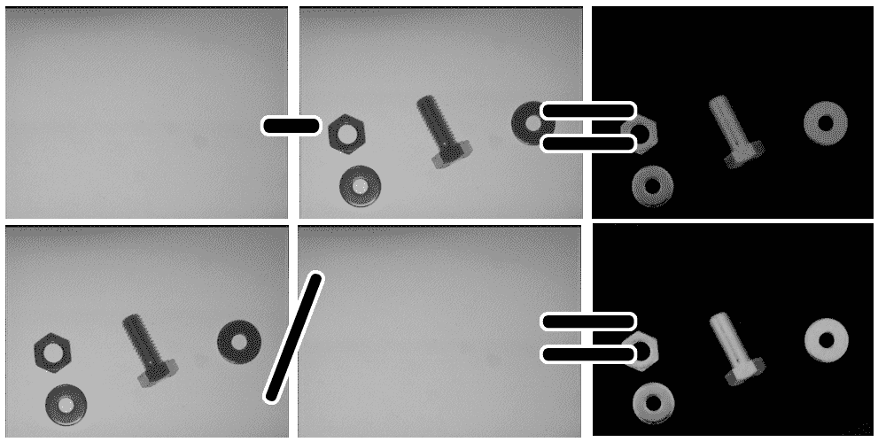

# 自动光学检测、对象分割和检测

在 第四章，*深入直方图和滤波器*，我们学习了直方图和滤波器，它们使我们能够理解图像处理并创建一个照片应用程序。

在本章中，我们将介绍对象分割和检测的基本概念。这意味着隔离图像中出现的对象，以便进行未来的处理和分析。

本章介绍了以下主题：

+   噪声去除

+   光/背景去除基础

+   阈值化

+   对象分割的连通组件

+   寻找对象分割的轮廓

许多行业使用复杂的计算机视觉系统和硬件。计算机视觉试图检测生产过程中产生的问题并最小化错误，从而提高最终产品的质量。

在这个领域，这个计算机视觉任务的名称是 **自动光学检测**（**AOI**）。这个名称出现在印刷电路板制造商的检测中，其中一台或多台相机扫描每个电路以检测关键故障和质量缺陷。这种命名法在其他制造业中也得到了应用，以便它们可以使用光学相机系统和计算机视觉算法来提高产品质量。如今，根据需求使用不同类型的相机（红外或 3D 相机）进行光学检测，并结合复杂的算法，在成千上万的行业中用于不同的目的，如缺陷检测、分类等。

# 技术要求

本章需要熟悉基本的 C++ 编程语言。本章中使用的所有代码都可以从以下 GitHub 链接下载：[`github.com/PacktPublishing/Learn-OpenCV-4-By-Building-Projects-Second-Edition/tree/master/Chapter_05`](https://github.com/PacktPublishing/Learn-OpenCV-4-By-Building-Projects-Second-Edition/tree/master/Chapter_05)。代码可以在任何操作系统上执行，尽管它仅在 Ubuntu 上进行了测试。

查看以下视频，了解代码的实际应用：

[`bit.ly/2DRbMbz`](http://bit.ly/2DRbMbz)

# 场景中对象的隔离

在本章中，我们将介绍 AOI 算法的第一步，并尝试隔离场景中的不同部分或对象。我们将以三种对象类型（螺丝、包装环和螺母）的对象检测和分类为例，并在本章以及 第六章，*学习对象分类* 中进行开发。

想象我们是一家生产这三种产品的公司。所有这些都在同一载体胶带上。我们的目标是检测载体胶带上的每个对象，并对每个对象进行分类，以便机器人将每个对象放在正确的货架上：


在本章中，我们将学习如何隔离每个对象并在像素中检测其位置。在下一章中，我们将学习如何对每个隔离对象进行分类，以识别它是否是螺母、螺丝或包装环。

在以下屏幕截图中，我们展示了我们期望的结果，其中左图中有几个对象。在右图中，我们用不同的颜色标记了每个对象，以显示不同的特征，如面积、高度、宽度和轮廓大小：


为了达到这个结果，我们将遵循不同的步骤，这将使我们更好地理解和组织我们的算法。我们可以在以下图表中看到这些步骤：


我们的应用程序将分为两个章节。在本章中，我们将开发并理解预处理和分割步骤。在第六章“学习对象分类”中，我们将提取每个分割对象的特征，并在如何识别每个对象类别上训练我们的机器学习系统/算法。

我们将预处理步骤分为三个更小的子集：

+   **噪声去除**

+   **光去除**

+   **二值化**

在分割步骤中，我们将使用两种不同的算法：

+   轮廓检测

+   **连通组件**提取（标记）

我们可以在以下图表和应用流程图中看到这些步骤：


现在，是时候开始预处理步骤，以便我们可以通过去除噪声和光照效果来获得最佳的**二值化**图像。这最小化了任何可能的检测错误。

# 创建一个用于 AOI 的应用

要创建我们的新应用程序，我们需要一些输入参数。当用户运行应用程序时，所有这些参数都是可选的，除了要处理的输入图像。输入参数如下：

+   要处理的输入图像

+   光图像模式

+   光操作，用户可以在差分或除法操作之间进行选择

+   如果用户将`0`设置为值，则应用差分操作

+   如果用户将`1`设置为值，则应用除法操作

+   分割，用户可以在带有或不带有统计的连通组件和查找轮廓方法之间进行选择

+   如果用户将`1`设置为输入值，则应用分割的连通组件方法

+   如果用户将`2`设置为输入值，则应用带有统计区域的连通组件方法

+   如果用户将`3`设置为输入值，则应用查找轮廓方法进行分割

为了启用此用户选择，我们将使用具有以下键的`命令行解析器`类：

```py
// OpenCV command line parser functions 
// Keys accepted by command line parser 
const char* keys = 
{ 
  "{help h usage ? | | print this message}" 
   "{@image || Image to process}" 
   "{@lightPattern || Image light pattern to apply to image input}" 
   "{lightMethod | 1 | Method to remove background light, 0 difference, 1 div }" 
   "{segMethod | 1 | Method to segment: 1 connected Components, 2 connected components with stats, 3 find Contours }" 
}; 
```

我们将在 `main` 函数中通过检查参数来使用 `command line parser` 类。`CommandLineParser` 在 *OpenCV 基础入门* 的 *读取视频和摄像头* 部分的 第二章 中有解释：

```py
int main(int argc, const char** argv) 
{ 
  CommandLineParser parser(argc, argv, keys); 
  parser.about("Chapter 5\. PhotoTool v1.0.0"); 
  //If requires help show 
  if (parser.has("help")) 
  { 
      parser.printMessage(); 
      return 0; 
  } 

  String img_file= parser.get<String>(0); 
  String light_pattern_file= parser.get<String>(1); 
  auto method_light= parser.get<int>("lightMethod"); 
  auto method_seg= parser.get<int>("segMethod"); 

  // Check if params are correctly parsed in his variables 
  if (!parser.check()) 
  { 
      parser.printErrors(); 
      return 0; 
  } 
```

在解析我们的命令行用户数据后，我们需要检查输入图像是否已正确加载。然后我们加载图像并检查它是否有数据：

```py
// Load image to process 
  Mat img= imread(img_file, 0); 
  if(img.data==NULL){ 
    cout << "Error loading image "<< img_file << endl; 
    return 0; 
  } 
```

现在，我们准备创建我们的 AOI 分割过程。我们将从预处理任务开始。

# 预处理输入图像

本节介绍了我们可以在对象分割/检测的上下文中应用的一些最常见的预处理图像技术。预处理是在我们开始工作并从图像中提取所需信息之前对新的图像所做的第一个更改。通常，在预处理步骤中，我们试图最小化图像噪声、光照条件或由于相机镜头引起的图像变形。这些步骤在检测图像中的对象或区域时最小化错误。

# 噪声去除

如果我们不去除噪声，我们可以检测到比预期更多的对象，因为噪声通常在图像中表示为小点，并且可以作为对象进行分割。传感器和扫描仪电路通常产生这种噪声。这种亮度或颜色的变化可以表示为不同的类型，如高斯噪声、尖峰噪声和闪烁噪声。

有不同的技术可以用来去除噪声。在这里，我们将使用平滑操作，但根据噪声的类型，有些方法比其他方法更好。中值滤波器通常用于去除椒盐噪声；例如，考虑以下图像：


前面的图像是带有椒盐噪声的原始输入图像。如果我们应用中值模糊，我们会得到一个很棒的结果，但我们失去了小的细节。例如，我们失去了螺丝的边缘，但我们保持了完美的边缘。请看以下图像中的结果：


如果我们应用盒式滤波器或高斯滤波器，噪声不会被去除，而是变得平滑，对象的细节也会丢失并变得平滑。请看以下图像中的结果：


OpenCV 为我们带来了 `medianBlur` 函数，该函数需要三个参数：

+   一个具有 `1`、`3` 或 `4` 通道的输入图像。当核心大小大于 `5` 时，图像深度只能为 `CV_8U`。

+   一个输出图像，它是应用中值模糊后的结果图像，其类型和深度与输入图像相同。

+   核心大小，它是一个大于 `1` 且为奇数的孔径大小，例如，3、5、7 等等。

以下代码用于去除噪声：

```py
  Mat img_noise; 
  medianBlur(img, img_noise, 3); 
```

# 使用光模式进行分割以去除背景

在本节中，我们将开发一个基本算法，使我们能够使用光线模式去除背景。这种预处理使我们获得更好的分割。无噪声的输入图像如下：


如果我们应用一个基本的阈值，我们将获得如下图像结果：


我们可以看到，顶部图像的伪影有很多白色噪声。如果我们应用光线模式和背景去除技术，我们可以获得一个很棒的结果，其中我们可以看到图像顶部没有伪影，就像之前的阈值操作一样，并且在我们需要分割时，我们将获得更好的结果。我们可以在以下图像中看到背景去除和阈值的结果：


现在，我们如何从我们的图像中去除光线？这非常简单：我们只需要一张没有任何物体的场景图片，从与其他图像相同的精确位置和相同的照明条件下拍摄；这是 AOI 中一个非常常见的技巧，因为外部条件是受监督和已知的。我们案例的图像结果类似于以下图像：


现在，通过简单的数学运算，我们可以去除这种光线模式。去除光线模式有两种选择：

+   差值

+   除法

另一种选择是最简单的方法。如果我们有光线模式 `L` 和图像图片 `I`，结果去除 `R` 是它们之间的差值：

```py
R= L-I 
```

这种除法稍微复杂一些，但同时也很简单。如果我们有光线模式矩阵 `L` 和图像图片矩阵 `I`，结果去除 `R` 如下：

```py
R= 255*(1-(I/L)) 
```

在这种情况下，我们将图像除以光线模式，我们假设如果我们的光线模式是白色，而物体比背景载体胶带暗，那么图像像素值总是与光线像素值相同或更低。从 `I/L` 获得的结果在 `0` 和 `1` 之间。最后，我们将这个除法的结果取反，以获得相同颜色的方向范围，并将其乘以 `255` 以获得 `0-255` 范围内的值。

在我们的代码中，我们将创建一个名为 `removeLight` 的新函数，具有以下参数：

+   要去除光线/背景的输入图像

+   一个光线模式，`Mat`

+   一个方法，差值为 `0`，除法为 `1`

结果是一个新的图像矩阵，没有光线/背景。以下代码通过使用光线模式实现去除背景：

```py
Mat removeLight(Mat img, Mat pattern, int method) 
{ 
  Mat aux; 
  // if method is normalization 
  if(method==1) 
  { 
    // Require change our image to 32 float for division 
    Mat img32, pattern32; 
    img.convertTo(img32, CV_32F); 
    pattern.convertTo(pattern32, CV_32F); 
    // Divide the image by the pattern 
    aux= 1-(img32/pattern32); 
    // Convert 8 bits format and scale
    aux.convertTo(aux, CV_8U, 255); 
  }else{ 
    aux= pattern-img; 
  } 
  return aux; 
} 
```

让我们探索一下。在创建用于保存结果的 `aux` 变量后，我们选择用户选择的方法并将参数传递给函数。如果选择的方法是 `1`，则应用除法方法。

除法方法需要一个 32 位浮点图像，这样我们才能除以图像，而不会将数字截断为整数。第一步是将图像和光模式`mat`转换为 32 位浮点。为了转换这种格式的图像，我们可以使用`Mat`类的`convertTo`函数。这个函数接受四个参数；输出转换后的图像和您希望转换到的格式，但您可以定义 alpha 和 beta 参数，这些参数允许您根据以下函数缩放和移动值，其中*O*是输出图像，*I*是输入图像：

*O*(*x*,*y*)=*cast*<*Type*>(*α* * *I*(*x*,*y*)+*β*)

以下代码将图像转换为 32 位浮点：

```py
// Required to change our image to 32 float for division 
Mat img32, pattern32; 
img.convertTo(img32, CV_32F); 
pattern.convertTo(pattern32, CV_32F); 
```

现在，我们可以按照我们描述的方式在我们的矩阵上执行数学运算，通过将图像除以图案并反转结果：

```py
// Divide the image by the pattern 
aux= 1-(img32/pattern32); 
```

现在，我们已经得到了结果，但需要将其返回到 8 位深度图像，然后使用我们之前使用的转换函数，通过 alpha 参数将图像的`mat`和缩放从`0`到`255`：

```py
// Convert 8 bits format 
aux.convertTo(aux, CV_8U, 255); 
```

现在，我们可以返回带有结果的`aux`变量。对于差分方法，开发非常简单，因为我们不需要转换我们的图像；我们只需要应用图案和图像之间的差值并返回它。如果我们不假设图案等于或大于图像，那么我们将需要一些检查并截断可能小于`0`或大于`255`的值：

```py
aux= pattern-img; 
```

以下图像是应用图像光模式到我们的输入图像的结果：



在我们获得的结果中，我们可以检查光梯度以及可能的伪影是如何被移除的。但是，当我们没有光/背景图案时会发生什么？有几种不同的技术可以获取这种图案；我们在这里将要展示最基本的一种。使用过滤器，我们可以创建一个可用的图案，但还有更好的算法来学习图像背景，其中图像的各个部分出现在不同的区域。这种技术有时需要背景估计图像初始化，而我们的基本方法可以发挥很好的作用。这些高级技术将在第八章，*视频监控、背景建模和形态学操作*中进行探讨。为了估计背景图像，我们将对我们的输入图像应用一个具有大核大小的模糊。这是一种在**光学字符识别**（***OCR**）中常用的技术，其中字母相对于整个文档来说又薄又小，这使得我们能够对图像中的光模式进行近似。我们可以在左侧图像中看到光/背景图案重建，在右侧图像中看到真实情况：


我们可以看到光模式之间存在一些细微的差异，但这个结果足以移除背景。我们还可以在以下图像中看到使用不同图像时的结果。在以下图像中，展示了使用先前方法计算出的原始输入图像与估计背景图像之间的图像差的结果：


`calculateLightPattern` 函数创建此光模式或背景近似：

```py
Mat calculateLightPattern(Mat img) 
{ 
  Mat pattern; 
  // Basic and effective way to calculate the light pattern from one image 
  blur(img, pattern, Size(img.cols/3,img.cols/3)); 
  return pattern; 
} 
```

此基本函数通过使用相对于图像大小的大内核大小对输入图像应用模糊。从代码中可以看出，它是原始宽度和高度的**三分之一**。

# 阈值化

在移除背景后，我们只需要对图像进行二值化，以便进行未来的分割。我们将使用阈值来完成这项工作。`阈值`是一个简单的函数，它将每个像素的值设置为最大值（例如，255）。如果像素的值大于**阈值**值或小于**阈值**值，它将被设置为最小值（0）：


现在，我们将使用两个不同的`阈值`值应用`阈值`函数：当我们移除光/背景时，我们将使用 30 的`阈值`值，因为所有非感兴趣区域都是黑色的。这是因为我们应用了背景移除。当不使用光移除方法时，我们也将使用一个中等值`阈值`（140），因为我们有一个白色背景。这个最后的选项用于允许我们检查有和无背景移除的结果：

```py
  // Binarize image for segment 
  Mat img_thr; 
  if(method_light!=2){ 
   threshold(img_no_light, img_thr, 30, 255, THRESH_BINARY); 
  }else{ 
   threshold(img_no_light, img_thr, 140, 255, THRESH_BINARY_INV); 
  } 
```

现在，我们将继续到我们应用程序最重要的部分：分割。在这里，我们将使用两种不同的方法或算法：连接组件和查找轮廓。

# 分割我们的输入图像

现在，我们将介绍两种技术来分割我们的阈值图像：

+   连接组件

+   查找轮廓

使用这两种技术，我们可以提取图像中感兴趣的区域（**ROI**），其中我们的目标对象出现。在我们的案例中，这些是螺母、螺丝和环。

# 连接组件算法

连接组件算法是一个非常常见的算法，用于在二值图像中分割和识别部分。连接组件是一个迭代算法，其目的是使用八个或四个连通像素对图像进行标记。如果两个像素具有相同的值并且是邻居，则它们是连通的。在图像中，每个像素有八个相邻像素：


四连通性意味着如果中心像素的值与中心像素相同，则只有 **2**、**4**、**5** 和 **7** 个邻居可以连接到中心。在八连通性中，如果中心像素的值与中心像素相同，则 **1**、**2**、**3**、**4**、**5**、**6**、**7** 和 **8** 个邻居可以连接。我们可以在以下示例中看到四连通性和八连通性算法之间的差异。我们将应用每个算法到下一个二值化图像。我们使用了一个小的 **9 x 9** 图像并放大以显示连通组件的工作原理以及四连通性和八连通性之间的差异：


四连通性算法检测到两个对象；我们可以在左边的图像中看到这一点。八连通性算法只检测到一个对象（右边的图像），因为两个对角像素是连通的。八连通性考虑了对角连通性，这是与四连通性的主要区别，因为四连通性只考虑垂直和水平像素。我们可以在以下图像中看到结果，其中每个对象都有不同的灰度颜色值：


OpenCV 通过两个不同的函数为我们带来了连通组件算法：

+   `connectedComponents` (image, labels, connectivity= `8`, type= `CV_32S`)

+   `connectedComponentsWithStats` (image, labels, stats, centroids, connectivity= `8`, type= `CV_32S`)

两个函数都返回一个整数，表示检测到的标签数，其中标签 `0` 表示背景。这两个函数之间的区别基本上是返回的信息。让我们检查每个函数的参数。`connectedComponents` 函数给出了以下参数：

+   **Image**: 要标记的输入图像。

+   **Labels**: 一个输出矩阵，其大小与输入图像相同，其中每个像素的值为其标签的值，其中所有 OS 表示背景，值为 `1` 的像素表示第一个连通组件对象，依此类推。

+   **Connectivity**: 两个可能的值，`8` 或 `4`，表示我们想要使用的连通性。

+   **Type**: 我们想要使用的标签图像的类型。只允许两种类型：`CV32_S` 和 `CV16_U`。默认情况下，这是 `CV32_S`。

+   `connectedComponentsWithStats` 函数定义了两个额外的参数。这些是 stats 和 centroids：

    +   **Stats**: 这是一个输出参数，它为我们提供了每个标签（包括背景）的以下统计值：

        +   `CC_STAT_LEFT`: 连通组件对象的左侧 `x` 坐标

        +   `CC_STAT_TOP`: 连通组件对象的顶部 `y` 坐标

        +   `CC_STAT_WIDTH`: 由其边界框定义的连通组件对象的宽度

        +   `CC_STAT_HEIGHT`: 由其边界框定义的连通组件对象的高度

        +   `CC_STAT_AREA`: 连通组件对象的像素数（面积）

    +   **质心**：质心指向每个标签的浮点类型，包括被认为属于另一个连通分量的背景。

在我们的示例应用程序中，我们将创建两个函数，以便我们可以应用这两个 OpenCV 算法。然后，我们将以带有彩色对象的新的图像形式向用户展示获得的结果，在基本的连通分量算法中。如果我们选择使用 stats 方法的连通分量，我们将绘制每个对象返回的相应计算面积。

让我们定义连通分量函数的基本绘图：

```py
void ConnectedComponents(Mat img) 
{ 
  // Use connected components to divide our image in multiple connected component objects
     Mat labels; 
     auto num_objects= connectedComponents(img, labels); 
  // Check the number of objects detected 
     if(num_objects < 2 ){ 
        cout << "No objects detected" << endl; 
        return; 
      }else{ 
       cout << "Number of objects detected: " << num_objects - 1 << endl; 
      } 
  // Create output image coloring the objects 
     Mat output= Mat::zeros(img.rows,img.cols, CV_8UC3); 
     RNG rng(0xFFFFFFFF); 
     for(auto i=1; i<num_objects; i++){ 
        Mat mask= labels==i; 
        output.setTo(randomColor(rng), mask); 
      } 
     imshow("Result", output); 
} 
```

首先，我们调用 OpenCV 的`connectedComponents`函数，它返回检测到的对象数量。如果对象的数量少于两个，这意味着只检测到了背景对象，那么我们不需要绘制任何东西，可以直接结束。如果算法检测到多个对象，我们将在控制台上显示检测到的对象数量：

```py
  Mat labels; 
  auto num_objects= connectedComponents(img, labels); 
  // Check the number of objects detected 
  if(num_objects < 2){ 
    cout << "No objects detected" << endl; 
    return; 
  }else{ 
    cout << "Number of objects detected: " << num_objects - 1 << endl;
```

现在，我们将使用不同的颜色在新的图像中绘制所有检测到的对象。之后，我们需要创建一个与输入大小相同且具有三个通道的新黑色图像：

```py
Mat output= Mat::zeros(img.rows,img.cols, CV_8UC3); 
```

我们将遍历每个标签，除了`0`值，因为这是背景：

```py
for(int i=1; i<num_objects; i++){ 
```

为了从标签图像中提取每个对象，我们可以为每个`i`标签创建一个掩码，使用比较并保存到新图像中：

```py
    Mat mask= labels==i; 
```

最后，我们使用`mask`将伪随机颜色设置到输出图像上：

```py
    output.setTo(randomColor(rng), mask); 
  } 
```

在遍历所有图像之后，我们将在输出中看到不同颜色的所有检测到的对象，我们只需要在窗口中显示输出图像：

```py
imshow("Result", output); 
```

这是结果，其中每个对象都被涂上不同的颜色或灰度值：


现在，我们将解释如何使用带有`stats` OpenCV 算法的连通分量，并在结果图像中显示更多信息。以下函数实现了这个功能：

```py
void ConnectedComponentsStats(Mat img) 
{ 
  // Use connected components with stats 
  Mat labels, stats, centroids; 
  auto num_objects= connectedComponentsWithStats(img, labels, stats, centroids); 
  // Check the number of objects detected 
  if(num_objects < 2 ){ 
    cout << "No objects detected" << endl; 
    return; 
  }else{ 
    cout << "Number of objects detected: " << num_objects - 1 << endl; 
  } 
  // Create output image coloring the objects and show area 
  Mat output= Mat::zeros(img.rows,img.cols, CV_8UC3); 
  RNG rng( 0xFFFFFFFF ); 
  for(auto i=1; i<num_objects; i++){ 
    cout << "Object "<< i << " with pos: " << centroids.at<Point2d>(i) << " with area " << stats.at<int>(i, CC_STAT_AREA) << endl; 
    Mat mask= labels==i; 
    output.setTo(randomColor(rng), mask); 
    // draw text with area 
    stringstream ss; 
    ss << "area: " << stats.at<int>(i, CC_STAT_AREA); 

    putText(output,  
      ss.str(),  
      centroids.at<Point2d>(i),  
      FONT_HERSHEY_SIMPLEX,  
      0.4,  
      Scalar(255,255,255)); 
  } 
  imshow("Result", output); 
} 
```

让我们来理解这段代码。正如我们在非统计函数中所做的那样，我们调用连通分量算法，但在这里，我们使用`stats`函数来完成，检查是否检测到多个对象：

```py
Mat labels, stats, centroids; 
  auto num_objects= connectedComponentsWithStats(img, labels, stats, centroids); 
  // Check the number of objects detected 
  if(num_objects < 2){ 
    cout << "No objects detected" << endl; 
    return; 
  }else{ 
    cout << "Number of objects detected: " << num_objects - 1 << endl; 
  }
```

现在，我们有两个额外的输出结果：stats 和 centroid 变量。然后，对于每个检测到的标签，我们将通过命令行显示质心和面积：

```py
for(auto i=1; i<num_objects; i++){ 
    cout << "Object "<< i << " with pos: " << centroids.at<Point2d>(i) << " with area " << stats.at<int>(i, CC_STAT_AREA) << endl; 
```

您可以通过调用 stats 变量并使用列常量`stats.at<int>(I, CC_STAT_AREA)`来检查提取面积。现在，就像之前一样，我们在输出图像上绘制标签为`i`的对象：

```py
Mat mask= labels==i; 
output.setTo(randomColor(rng), mask); 
```

最后，在每个分割对象的质心位置，我们想在结果图像上绘制一些信息（例如面积）。为此，我们使用`putText`函数和 stats 以及 centroid 变量。首先，我们必须创建一个`stringstream`，以便我们可以添加 stats 面积信息：

```py
// draw text with area 
stringstream ss; 
ss << "area: " << stats.at<int>(i, CC_STAT_AREA); 
```

然后，我们需要使用`putText`，使用质心作为文本位置：

```py
putText(output,  
  ss.str(),  
  centroids.at<Point2d>(i),  
  FONT_HERSHEY_SIMPLEX,  
  0.4,  
  Scalar(255,255,255)); 
```

这个函数的结果如下：


# `findContours` 算法

`findContours` 算法是 OpenCV 中用于分割对象最常用的算法之一。这是因为该算法自 OpenCV 1.0 版本起就被包含在内，为开发者提供了更多信息和解描述符，包括形状、拓扑组织等：

```py
void findContours(InputOutputArray image, OutputArrayOfArrays contours, OutputArray hierarchy, int mode, int method, Point offset=Point()) 
```

让我们解释每个参数：

+   **图像**：输入二值图像。

+   **轮廓**：轮廓的输出，其中每个检测到的轮廓都是一个点的向量。

+   **层次结构**：这是一个可选的输出向量，其中保存了轮廓的层次结构。这是图像的拓扑结构，我们可以从中获取每个轮廓之间的关系。层次结构以四个索引的向量表示，分别是（下一个轮廓、前一个轮廓、第一个子轮廓、父轮廓）。如果给定的轮廓与其他轮廓没有关系，则给出负索引。更详细的解释可以在[`docs.opencv.org/3.4/d9/d8b/tutorial_py_contours_hierarchy.html`](https://docs.opencv.org/3.4/d9/d8b/tutorial_py_contours_hierarchy.html)找到。

+   **模式**：此方法用于检索轮廓：

    +   `RETR_EXTERNAL` 仅检索外部轮廓。

    +   `RETR_LIST` 检索所有轮廓而不建立层次结构。

    +   `RETR_CCOMP` 检索所有轮廓，具有两个级别的层次结构，即外部轮廓和孔洞。如果另一个对象在孔洞内部，则将其放在层次结构的顶部。

    +   `RETR_TREE` 检索所有轮廓，并在轮廓之间创建完整的层次结构。

+   **方法**：这允许我们使用近似方法来检索轮廓的形状：

    +   如果设置 `CV_CHAIN_APPROX_NONE`，则不对轮廓应用任何近似，并存储轮廓的点。

    +   `CV_CHAIN_APPROX_SIMPLE` 压缩所有水平、垂直和对角线段，仅存储起点和终点。

    +   `CV_CHAIN_APPROX_TC89_L1` 和 `CV_CHAIN_APPROX_TC89_KCOS` 应用 **Telchin** **链** **近似** 算法。

+   **偏移**：这是一个可选的点值，用于移动所有轮廓。当我们在一个 ROI 中工作并需要检索全局位置时，这非常有用。

注意：输入图像会被 `findContours` 函数修改。如果您需要它，请在发送到该函数之前创建图像的副本。

现在我们已经知道了 `findContours` 函数的参数，让我们将其应用到我们的例子中：

```py
void FindContoursBasic(Mat img) 
{ 
  vector<vector<Point> > contours; 
  findContours(img, contours, RETR_EXTERNAL, CHAIN_APPROX_SIMPLE); 
  Mat output= Mat::zeros(img.rows,img.cols, CV_8UC3); 
  // Check the number of objects detected 
  if(contours.size() == 0 ){ 
    cout << "No objects detected" << endl; 
    return; 
  }else{ 
    cout << "Number of objects detected: " << contours.size() << endl; 
  } 
  RNG rng(0xFFFFFFFF); 
  for(auto i=0; i<contours.size(); i++){ 
    drawContours(output, contours, i, randomColor(rng)); 
    imshow("Result", output); 
  }
} 

```

让我们逐行解释我们的实现。

在我们的例子中，我们不需要任何层次结构，所以我们只将检索所有可能对象的轮廓。为此，我们可以使用 `RETR_EXTERNAL` 模式和基本的轮廓编码，通过使用 `CHAIN_APPROX_SIMPLE` 方法：

```py
vector<vector<Point> > contours; 
vector<Vec4i> hierarchy; 
findContours(img, contours, RETR_EXTERNAL, CHAIN_APPROX_SIMPLE); 
```

就像我们之前查看的连通组件示例一样，首先我们检查我们检索了多少个轮廓。如果没有，则退出我们的函数：

```py
// Check the number of objects detected 
  if(contours.size() == 0){ 
    cout << "No objects detected" << endl; 
    return; 
  }else{ 
    cout << "Number of objects detected: " << contours.size() << endl; 
  }
```

最后，我们为每个检测到的对象绘制轮廓。我们用不同的颜色在我们的输出图像中绘制这些轮廓。为此，OpenCV 为我们提供了一个函数来绘制 find contours 图像的结果：

```py
for(auto i=0; i<contours.size(); i++) 
    drawContours(output, contours, i, randomColor(rng)); 
  imshow("Result", output); 
} 
```

`drawContours`函数允许以下参数：

+   **图像**：绘制轮廓的输出图像。

+   **轮廓**：轮廓的向量。

+   **轮廓索引**：一个表示要绘制的轮廓的数字。如果这是负数，则绘制所有轮廓。

+   **颜色**：绘制轮廓的颜色。

+   **厚度**：如果是负数，则轮廓用所选颜色填充。

+   **线型**：这指定了我们是否想要使用抗锯齿或其他绘图方法进行绘制。

+   **层次**：这是一个可选参数，仅在需要绘制一些轮廓时才需要。

+   **最大层级**：这是一个可选参数，仅在存在层次参数时才考虑。如果设置为`0`，则只绘制指定的轮廓。如果设置为`1`，则函数绘制当前轮廓及其嵌套轮廓。如果设置为`2`，则算法绘制所有指定的轮廓层级。

+   **偏移**：这是一个可选参数，用于移动轮廓。

我们的结果可以在以下图像中看到：


# 摘要

在本章中，我们探讨了在受控情况下进行对象分割的基本知识，其中相机拍摄不同对象的图片。在这里，我们学习了如何去除背景和光线，以便我们更好地二值化图像，从而最小化噪声。在二值化图像后，我们了解了三种不同的算法，我们可以使用这些算法来分割和分离图像中的每个对象，使我们能够隔离每个对象以进行操作或提取特征。

我们可以在以下图像中看到整个流程：


最后，我们从图像中提取了所有对象。您需要这样做才能继续下一章，在下一章中，我们将提取这些对象的特征以训练机器学习系统。

在下一章中，我们将预测图像中任何对象的类别，然后调用机器人或其他系统来挑选其中任何一个，或者检测不在正确载体带上的对象。然后我们将查看通知某人将其取走。
