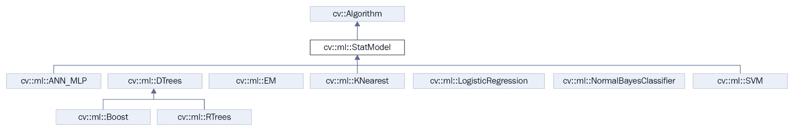
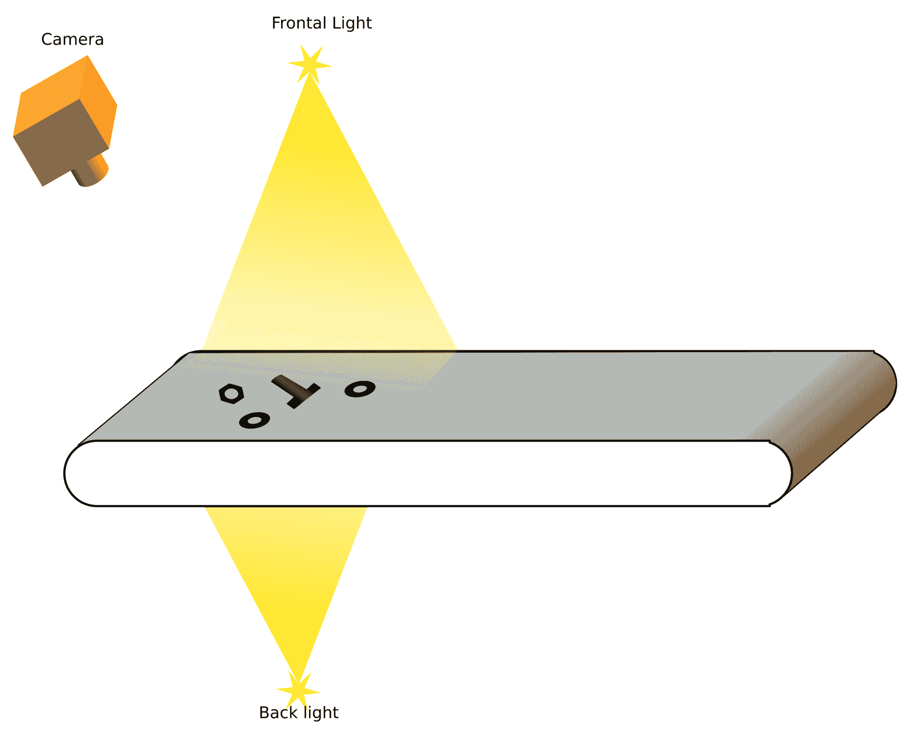

# 第六章：学习对象分类

在第五章《自动光学检测、对象分割和检测》中，我们介绍了对象分割和检测的基本概念。这指的是将图像中出现的对象隔离出来，以便进行未来的处理和分析。本章解释了如何对每个隔离的对象进行分类。为了使我们能够对每个对象进行分类，我们必须训练我们的系统，使其能够学习所需的参数，以便决定将哪个特定的标签分配给检测到的对象（取决于训练阶段考虑的不同类别）。

本章介绍了机器学习的基本概念，用于对具有不同标签的图像进行分类。为此，我们将基于第五章的分割算法创建一个基本应用程序，该算法是*自动光学检测、对象分割和检测*。这个分割算法提取包含未知对象的图像部分。对于每个检测到的对象，我们将提取不同的特征，这些特征将使用机器学习算法进行分类。最后，我们将使用我们的用户界面展示获得的结果，包括输入图像中检测到的每个对象的标签。

本章涉及不同的主题和算法，包括以下内容：

+   机器学习概念简介

+   常见的机器学习算法和流程

+   特征提取

+   支持向量机（SVM）

+   训练和预测

# 技术要求

本章需要熟悉基本的 C++编程语言。本章中使用的所有代码都可以从以下 GitHub 链接下载：[`github.com/PacktPublishing/Learn-OpenCV-4-By-Building-Projects-Second-Edition/tree/master/Chapter_06`](https://github.com/PacktPublishing/Learn-OpenCV-4-By-Building-Projects-Second-Edition/tree/master/Chapter_06)。此代码可以在任何操作系统上执行，尽管它仅在 Ubuntu 上进行了测试。

查看以下视频，了解代码的实际应用：

[`bit.ly/2KGD4CO`](http://bit.ly/2KGD4CO)

# 介绍机器学习概念

机器学习是一个概念，由*Arthur Samuel*于 1959 年定义，它是一个研究领域，使计算机能够在没有明确编程的情况下学习。*Tom M. Mitchel*为机器学习提供了一个更正式的定义，其中他将样本的概念与经验数据、标签以及算法的性能测量联系起来。

在《IBM 研究与发展杂志》的《使用国际象棋游戏进行机器学习研究》一文中，引用了*Arthur Samuel*对**机器学习**的定义，该文发表于同年《The New Yorker》和《Office Management》杂志，(*卷*：*3*，*期*：*3*，*页*：*210*)。

来自 *Tom M. Mitchel* 的更正式的定义在 *Machine Learning Book, McGray Hill 1997:* 中被引用（[`www.cs.cmu.edu/afs/cs.cmu.edu/user/mitchell/ftp/mlbook.html`](http://www.cs.cmu.edu/afs/cs.cmu.edu/user/mitchell/ftp/mlbook.html)）。

机器学习涉及人工智能中的模式识别和学习理论，与计算统计学相关。它被应用于数百个应用中，例如**光学字符识别**（**OCR**）、垃圾邮件过滤、搜索引擎，以及数千个计算机视觉应用，例如我们将在本章中开发的例子，其中机器学习算法试图对输入图像中出现的对象进行分类。

根据机器学习算法从输入数据中学习的方式，我们可以将它们分为三类：

+   **监督学习**：计算机从一组标记的数据中学习。这里的目的是学习模型的参数和规则，这些规则允许计算机将数据与输出标签之间的关系映射出来。

+   **无监督学习**：没有给出标签，计算机试图发现给定数据的输入结构。

+   **强化学习**：计算机与动态环境交互，达到目标并从错误中学习。

根据我们希望从机器学习算法中获得的结果，我们可以将结果分类如下：

+   **分类**：输入空间可以划分为 **N** 个类别，给定样本的预测结果将是这些训练类别之一。这是最常用的类别之一。一个典型的例子是电子邮件垃圾邮件过滤，其中只有两个类别：垃圾邮件和非垃圾邮件。或者，我们可以使用 OCR，其中只有 N 个字符可用，每个字符是一个类别。

+   **回归**：输出是一个连续值，而不是分类结果这样的离散值。回归的一个例子可能是根据房屋的大小、建造以来的年数和位置预测房价。

+   **聚类**：输入将被划分为 **N** 个组，这通常使用无监督训练来完成。

+   **密度估计**：找到输入的（概率）分布。

在我们的例子中，我们将使用一个监督学习和分类算法，其中使用带有标签的训练数据集来训练模型，模型的预测结果将是可能的标签之一。在机器学习中，有几种方法和途径可以实现这一点。其中一些更受欢迎的方法包括以下内容：**支持向量机**（**SVM**）、**人工神经网络**（**ANN**）、聚类、k-最近邻、决策树和深度学习。几乎所有这些方法和途径都在 OpenCV 中得到支持、实现和良好记录。在本章中，我们将解释支持向量机。

# OpenCV 机器学习算法

OpenCV 实现了这八种机器学习算法。所有这些算法都是继承自`StatModel`类：

+   人工神经网络

+   随机树

+   期望最大化

+   k 最近邻

+   逻辑回归

+   正常贝叶斯分类器

+   支持向量机

+   随机梯度下降 SVMs

版本 3 在基本级别上支持深度学习，但版本 4 更稳定且更受支持。我们将在后续章节中详细探讨深度学习。

要获取有关每个算法的更多信息，请阅读 OpenCV 机器学习文档页面[`docs.opencv.org/trunk/dc/dd6/ml_intro.html`](http://docs.opencv.org/trunk/dc/dd6/ml_intro.html)。

以下图表显示了机器学习类层次结构：



`StatModel`类是所有机器学习算法的基类。这提供了预测以及所有非常重要的读写函数，用于保存和读取我们的机器学习参数和训练数据。

在机器学习中，最耗时和计算资源消耗的部分是训练方法。对于大型数据集和复杂的机器学习结构，训练可能需要从几秒到几周或几个月。例如，在深度学习中，包含超过 10 万个图像数据集的大型神经网络结构可能需要很长时间来训练。使用深度学习算法时，通常使用并行硬件处理，如具有 CUDA 技术的 GPU，或大多数新的芯片设备，如 Intel Movidius，以减少训练过程中的计算时间。这意味着我们每次运行应用程序时都不能训练我们的算法，因此建议保存我们已训练的模型，包括所有已学习的参数。在未来的执行中，我们只需要从保存的模型中加载/读取，除非我们需要用更多的样本数据更新我们的模型。

`StatModel`是所有机器学习类（如 SVM 或 ANN）的基类，但不包括深度学习方法。`StatModel`基本上是一个虚拟类，它定义了两个最重要的函数——`train`和`predict`。`train`方法是负责使用训练数据集学习模型参数的主要方法。它有以下三种可能的调用方式：

```py
bool train(const Ptr<TrainData>& trainData, int flags=0 ); 
bool train(InputArray samples, int layout, InputArray responses); 
Ptr<_Tp> train(const Ptr<TrainData>& data, int flags=0 ); 
```

训练函数有以下参数：

+   `TrainData`：可以从`TrainData`类加载或创建的训练数据。这个类是 OpenCV 3 中的新功能，帮助开发者创建训练数据并从机器学习算法中抽象出来。这样做是因为不同的算法需要不同类型的数组结构进行训练和预测，例如 ANN 算法。

+   `samples`：一个训练样本数组，例如机器学习算法所需的格式要求的训练数据。

+   `layout`: `ROW_SAMPLE`（训练样本是矩阵行）或`COL_SAMPLE`（训练样本是矩阵列）。

+   `responses`：与样本数据关联的响应向量。

+   `flags`：由每个方法定义的可选标志。

最后的训练方法创建并训练了一个`_TP`类类型的模型。唯一接受的类是实现了无参数或有所有默认参数值的静态创建方法的类。

`predict`方法更简单，只有一个可能的调用：

```py
float StatModel::predict(InputArray samples, OutputArray results=noArray(), int flags=0) 
```

预测函数有以下参数：

+   `samples`：用于从模型预测结果的输入样本可以由任何数量的数据组成，无论是单个还是多个。

+   `results`：每个输入行样本的结果（由算法从前一个训练模型计算得出）。

+   `flags`：这些可选标志与模型相关。一些模型，如 Boost，通过 SVM 的`StatModel::RAW_OUTPUT`标志识别，这使得方法返回原始结果（总和），而不是类标签。

`StatModel`类为其他非常有用的方法提供了一个接口：

+   +   `isTrained()` 如果模型已训练则返回 true

    +   `isClassifier()` 如果模型是分类器则返回 true，如果是回归则返回 false

    +   `getVarCount()` 返回训练样本中的变量数量

    +   `save(const string& filename)` 将模型保存到文件名

    +   `Ptr<_Tp> load(const string& filename)` 从文件名加载模型，例如——`Ptr<SVM> svm = StatModel::load<SVM>("my_svm_model.xml")`

    +   `calcError(const Ptr<TrainData>& data, bool test, OutputArray resp)` 从测试数据计算错误，其中数据是训练数据。如果测试参数为 true，则该方法从数据的测试子集计算错误；如果为 false，则该方法从所有训练数据计算错误。`resp`是可选的输出结果。

现在，我们将介绍如何构建一个基本的计算机视觉应用，该应用使用机器学习。

# 计算机视觉和机器学习工作流程

带有机器学习的计算机视觉应用有一个共同的基本结构。这个结构被分为不同的步骤：

1.  **预处理**

1.  **分割**

1.  **特征提取**

1.  **分类结果**

1.  **后处理**

这些在几乎所有的计算机视觉应用中都很常见，而其他一些则被省略了。在下面的图中，你可以看到涉及的不同步骤：


几乎所有计算机视觉应用程序都以对输入图像应用的**预处理**开始，这包括去除光线和噪声、过滤、模糊等。在将所有必要的预处理应用于输入图像之后，第二步是**分割**。在这一步中，我们必须从图像中提取感兴趣的区域，并将每个区域隔离为独特的感兴趣对象。例如，在人脸检测系统中，我们必须将人脸与场景中的其他部分分开。在检测到图像内的对象之后，我们继续下一步。在这里，我们必须提取每个对象的特征；特征通常是对象特征的向量。特征描述我们的对象，可以是对象的面积、轮廓、纹理图案、像素等。

现在，我们有了我们对象的描述符，也称为特征向量或特征集。描述符是描述对象的特征，我们使用这些特征来训练或预测模型。为此，我们必须创建一个包含数千张图像的大特征数据集。然后，我们在选择的**训练**模型函数中使用提取的特征（图像/对象特征），如面积、大小和宽高比。在以下图中，我们可以看到数据集是如何被输入到**机器学习算法**中以进行训练和**生成**模型的：


当我们使用数据集进行**训练**时，**模型**学习所有必要的参数，以便能够在将未知标签的新特征向量作为输入提供给我们的算法时进行预测。在以下图中，我们可以看到如何使用生成的**模型**使用未知特征向量进行**预测**，从而返回**分类结果**或回归：


在预测结果之后，有时需要对输出数据进行后处理，例如，合并多个分类以减少预测误差或合并多个标签。在光学字符识别的一个示例中，**分类结果**是根据每个预测字符的，通过结合字符识别的结果，我们构建一个单词。这意味着我们可以创建一个后处理方法来纠正检测到的单词中的错误。通过这个对计算机视觉机器学习的简要介绍，我们将实现自己的应用程序，该程序使用机器学习来对幻灯片胶片中的对象进行分类。我们将使用支持向量机作为我们的分类方法，并解释如何使用它们。其他机器学习算法以非常相似的方式使用。OpenCV 文档在以下链接中提供了有关所有机器学习算法的详细信息：[`docs.opencv.org/master/dd/ded/group__ml.html`](https://docs.opencv.org/master/dd/ded/group__ml.html)。

# 自动对象检测分类示例

在第五章，*自动化光学检测、目标分割和检测*中，我们查看了一个自动对象检测分割的例子，其中载体胶带包含三种不同类型的对象：螺母、螺丝和环。通过计算机视觉，我们将能够识别这些对象中的每一个，以便我们可以向机器人发送通知或将每个对象放入不同的盒子中。以下是载体胶带的基本示意图：



在第五章，*自动化光学检测、目标分割和检测*中，我们预处理了输入图像并提取了感兴趣区域，使用不同的技术将每个对象隔离出来。现在，我们将应用在前几节中解释的所有概念，在这个例子中提取特征并对每个对象进行分类，使机器人能够将每个对象放入不同的盒子中。在我们的应用中，我们只将展示每个图像的标签，但我们可以将图像中的位置和标签发送到其他设备，例如机器人。在这个阶段，我们的目标是提供一个包含不同对象的输入图像，使计算机能够检测对象并在每个图像上显示对象的名称，如下面的图像所示。然而，为了学习整个过程的步骤，我们将通过创建一个展示我们将要使用的特征分布的图表来训练我们的系统，并用不同的颜色可视化它。我们还将展示预处理后的输入图像和获得的输出分类结果。最终结果如下：


我们将遵循以下步骤进行我们的示例应用：

1.  对于每个输入图像：

    +   预处理图像

    +   分割图像

1.  对于图像中的每个对象：

    +   提取特征

    +   将特征添加到训练特征向量中，并赋予相应的标签（螺母、螺丝、环）

1.  创建 SVM 模型。

1.  使用训练特征向量训练我们的 SVM 模型。

1.  预处理输入图像以对每个分割的对象进行分类。

1.  分割输入图像。

1.  对于检测到的每个对象：

    +   提取特征

    +   使用 SVM 进行预测

    +   模型

    +   在输出图像上绘制结果

对于预处理和分割，我们将使用第五章，*自动化光学检测、目标分割和检测*中找到的代码。然后我们将解释如何提取特征并创建训练和预测我们模型所需的向量。

# 特征提取

下一步，我们需要为每个对象提取特征。为了理解特征向量概念，在我们的示例中我们将提取非常简单的特征，因为这已经足够获得良好的结果。在其他解决方案中，我们可以获得更复杂的特征，如纹理描述符、轮廓描述符等。在我们的示例中，我们只有螺母、环和螺丝在图像中的不同位置和方向。相同的对象可以位于图像的任何位置和方向，例如，螺丝或螺母。我们可以在以下图像中看到不同的方向：


我们将要探索一些可能提高我们机器学习算法准确性的特征或特性。我们不同对象（如螺母、螺丝和环）的这些可能特性如下：

+   对象的面积

+   长宽比，即边界矩形的宽度除以高度

+   孔洞的数量

+   轮廓边的数量

这些特性可以很好地描述我们的对象，如果我们使用所有这些特性，分类错误将会非常小。然而，在我们的实现示例中，我们只打算使用前两个特性，即面积和长宽比，用于学习目的，因为我们可以将这些特性绘制在二维图形中，并展示这些值正确地描述了我们的对象。我们还可以展示我们可以在图形图中直观地区分不同类型的对象。为了提取这些特征，我们将使用黑白 ROI 图像作为输入，其中只有一个对象以白色出现，背景为黑色。这个输入是第五章，“自动光学检测”，“对象分割”和“检测”的分割结果。我们将使用`findContours`算法进行对象分割，并创建`ExtractFeatures`函数来完成这个目的，如下面的代码所示：

```py
vector< vector<float> > ExtractFeatures(Mat img, vector<int>* left=NULL, vector<int>* top=NULL) 
{ 
  vector< vector<float> > output; 
  vector<vector<Point> > contours; 
  Mat input= img.clone(); 

  vector<Vec4i> hierarchy; 
  findContours(input, contours, hierarchy, RETR_CCOMP, CHAIN_APPROX_SIMPLE); 
  // Check the number of objects detected 
  if(contours.size() == 0){ 
    return output; 
  } 
  RNG rng(0xFFFFFFFF); 
  for(auto i=0; i<contours.size(); i++){ 

    Mat mask= Mat::zeros(img.rows, img.cols, CV_8UC1); 
    drawContours(mask, contours, i, Scalar(1), FILLED, LINE_8, hierarchy, 1); 
    Scalar area_s= sum(mask); 
    float area= area_s[0]; 

    if(area>500){ //if the area is greater than min. 

      RotatedRect r= minAreaRect(contours[i]); 
      float width= r.size.width; 
      float height= r.size.height; 
      float ar=(width<height)?height/width:width/height; 

      vector<float> row; 
      row.push_back(area); 
      row.push_back(ar); 
      output.push_back(row); 
      if(left!=NULL){ 
          left->push_back((int)r.center.x); 
      } 
      if(top!=NULL){ 
          top->push_back((int)r.center.y); 
      } 

      // Add image to the multiple image window class, See the class on full github code   
      miw->addImage("Extract Features", mask*255); 
      miw->render(); 
      waitKey(10); 
    } 
  } 
  return output; 
} 
```

让我们解释我们用来提取特征的代码。我们将创建一个函数，它以一个图像作为输入，并返回一个参数，其中包含图像中检测到的每个对象的左和顶部位置的向量。这些数据将用于在每个对象上绘制相应的标签。函数的输出是一个浮点向量向量。换句话说，它是一个矩阵，其中每一行包含检测到的每个对象的特征。

首先，我们必须创建输出向量变量和轮廓变量，这些变量将用于我们的`findContours`算法分割。我们还需要创建输入图像的副本，因为`findContours` OpenCV 函数会修改输入图像：

```py
  vector< vector<float> > output; 
  vector<vector<Point> > contours; 
  Mat input= img.clone(); 
  vector<Vec4i> hierarchy; 
  findContours(input, contours, hierarchy, RETR_CCOMP, CHAIN_APPROX_SIMPLE); 
```

现在，我们可以使用`findContours`函数来检索图像中的每个对象。如果我们没有检测到任何轮廓，我们将返回一个空输出矩阵，如下面的代码片段所示：

```py
if(contours.size() == 0){ 
    return output; 
  } 
```

如果检测到对象，对于每个轮廓，我们将在黑色图像（零值）上用白色绘制对象。这将使用 `1` 值完成，就像一个掩码图像。以下代码片段生成掩码图像：

```py
for(auto i=0; i<contours.size(); i++){ 
    Mat mask= Mat::zeros(img.rows, img.cols, CV_8UC1); 
    drawContours(mask, contours, i, Scalar(1), FILLED, LINE_8, hierarchy, 1); 
```

使用 `1` 值在形状内部绘制是很重要的，因为我们可以通过计算轮廓内部所有值的总和来计算面积，如下代码所示：

```py
    Scalar area_s= sum(mask); 
    float area= area_s[0]; 
```

这个区域是我们的第一个特征。我们将使用这个值作为过滤器，以移除所有可能的小对象，这些对象是我们需要避免的。所有面积小于我们考虑的最小阈值面积的对象都将被丢弃。通过过滤器后，我们创建第二个特征和对象的纵横比。这指的是宽度或高度的极大值除以宽度或高度的极小值。这个特征可以很容易地区分螺钉和其他对象。以下代码描述了如何计算纵横比：

```py
if(area>MIN_AREA){ //if the area is greater than min. 
      RotatedRect r= minAreaRect(contours[i]); 
      float width= r.size.width; 
      float height= r.size.height; 
      float ar=(width<height)?height/width:width/height; 
```

现在我们有了特征，我们只需将它们添加到输出向量中。为此，我们将创建一个浮点行向量并添加值，然后将其添加到输出向量中，如下代码所示：

```py
vector<float> row; 
row.push_back(area); 
row.push_back(ar); 
output.push_back(row);
```

如果传递了左和上参数，则将左上角值添加到输出参数：

```py
  if(left!=NULL){ 
      left->push_back((int)r.center.x); 
  }
  if(top!=NULL){ 
      top->push_back((int)r.center.y); 
  } 
```

最后，我们将在一个窗口中显示检测到的对象，以便用户反馈。当我们处理完图像中的所有对象后，我们将返回输出特征向量，如下代码片段所示：

```py
      miw->addImage("Extract Features", mask*255); 
      miw->render(); 
      waitKey(10); 
    } 
  } 
  return output; 
```

现在我们已经提取了每个输入图像的特征，我们可以继续下一步。

# 训练 SVM 模型

我们现在将使用监督学习，并为每个对象及其相应的标签获取一组图像。数据集中没有图像的最小数量；如果我们为训练过程提供更多图像，我们将得到更好的分类模型（在大多数情况下）。然而，对于简单的分类器，训练简单的模型可能就足够了。为此，我们创建了三个文件夹（`screw`、`nut` 和 `ring`），其中每个类型的所有图像都放在一起。对于文件夹中的每张图像，我们必须提取特征，将它们添加到 `train` 特征矩阵中，同时创建一个新向量，其中每行对应于每个训练矩阵的标签。为了评估我们的系统，我们将根据测试和训练将每个文件夹分成一定数量的图像。我们将保留大约 20 张图像用于测试，其余的用于训练。然后我们将创建两个标签向量和两个用于训练和测试的矩阵。

让我们进入代码内部。首先，我们需要创建我们的模型。我们将把模型声明在所有函数之外，以便能够将其作为全局变量访问。OpenCV 使用 `Ptr` 模板类来管理指针：

```py
Ptr<SVM> svm;
```

在声明新的 SVM 模型指针之后，我们将创建它并进行训练。为此，我们创建了 `trainAndTest` 函数。完整的函数代码如下：

```py
void trainAndTest() 
{ 
  vector< float > trainingData; 
  vector< int > responsesData; 
  vector< float > testData; 
  vector< float > testResponsesData; 

  int num_for_test= 20; 

  // Get the nut images 
  readFolderAndExtractFeatures("../data/nut/nut_%04d.pgm", 0, num_for_test, trainingData, responsesData, testData, testResponsesData); 
  // Get and process the ring images 
  readFolderAndExtractFeatures("../data/ring/ring_%04d.pgm", 1, num_for_test, trainingData, responsesData, testData, testResponsesData); 
  // get and process the screw images 
  readFolderAndExtractFeatures("../data/screw/screw_%04d.pgm", 2, num_for_test, trainingData, responsesData, testData, testResponsesData); 

  cout << "Num of train samples: " << responsesData.size() << endl; 

  cout << "Num of test samples: " << testResponsesData.size() << endl; 

  // Merge all data  
  Mat trainingDataMat(trainingData.size()/2, 2, CV_32FC1, &trainingData[0]); 
  Mat responses(responsesData.size(), 1, CV_32SC1, &responsesData[0]); 

  Mat testDataMat(testData.size()/2, 2, CV_32FC1, &testData[0]); 
  Mat testResponses(testResponsesData.size(), 1, CV_32FC1, &testResponsesData[0]); 

  Ptr<TrainData> tdata= TrainData::create(trainingDataMat, ROW_SAMPLE, responses);

  svm = cv::ml::SVM::create();
  svm->setType(cv::ml::SVM::C_SVC);
  svm->setNu(0.05); 
  svm->setKernel(cv::ml::SVM::CHI2);
  svm->setDegree(1.0);
  svm->setGamma(2.0);
  svm->setTermCriteria(TermCriteria(TermCriteria::MAX_ITER, 100, 1e-6));
  svm->train(tdata); 

  if(testResponsesData.size()>0){ 
    cout << "Evaluation" << endl; 
    cout << "==========" << endl; 
    // Test the ML Model 
    Mat testPredict; 
    svm->predict(testDataMat, testPredict); 
    cout << "Prediction Done" << endl; 
    // Error calculation 
    Mat errorMat= testPredict!=testResponses; 
    float error= 100.0f * countNonZero(errorMat) / testResponsesData.size(); 
    cout << "Error: " << error << "%" << endl; 
    // Plot training data with error label 
    plotTrainData(trainingDataMat, responses, &error); 

  }else{ 
    plotTrainData(trainingDataMat, responses); 
  } 
} 
```

现在，让我们解释一下代码。首先，我们必须创建所需的变量来存储训练和测试数据：

```py
  vector< float > trainingData; 
  vector< int > responsesData; 
  vector< float > testData; 
  vector< float > testResponsesData; 
```

正如我们之前提到的，我们必须从每个文件夹中读取所有图像，提取特征，并将它们保存到我们的训练和测试数据中。为此，我们将使用 `readFolderAndExtractFeatures` 函数，如下所示：

```py
  int num_for_test= 20; 
  // Get the nut images 
  readFolderAndExtractFeatures("../data/nut/tuerca_%04d.pgm", 0, num_for_test, trainingData, responsesData, testData, testResponsesData); 
  // Get and process the ring images 
  readFolderAndExtractFeatures("../data/ring/arandela_%04d.pgm", 1, num_for_test, trainingData, responsesData, testData, testResponsesData); 
  // get and process the screw images 
  readFolderAndExtractFeatures("../data/screw/tornillo_%04d.pgm", 2, num_for_test, trainingData, responsesData, testData, testResponsesData); 
```

`readFolderAndExtractFeatures` 函数使用 OpenCV 的 `VideoCapture` 函数读取文件夹中的所有图像，包括视频和相机帧。对于读取的每个图像，我们提取特征并将它们添加到相应的输出向量中：

```py
bool readFolderAndExtractFeatures(string folder, int label, int num_for_test,  
  vector<float> &trainingData, vector<int> &responsesData,   
  vector<float> &testData, vector<float> &testResponsesData) 
{ 
  VideoCapture images; 
  if(images.open(folder)==false){ 
    cout << "Can not open the folder images" << endl; 
    return false; 
  } 
  Mat frame; 
  int img_index=0; 
  while(images.read(frame)){ 
    //// Preprocess image 
    Mat pre= preprocessImage(frame); 
    // Extract features 
    vector< vector<float> > features= ExtractFeatures(pre); 
    for(int i=0; i< features.size(); i++){ 
      if(img_index >= num_for_test){ 
        trainingData.push_back(features[i][0]); 
        trainingData.push_back(features[i][1]); 
        responsesData.push_back(label);     
      }else{ 
        testData.push_back(features[i][0]); 
        testData.push_back(features[i][1]); 
        testResponsesData.push_back((float)label);     
      } 
    } 
    img_index++; 
  } 
  return true;   
} 
```

在将所有向量填充好特征和标签之后，我们必须将它们从向量转换为 OpenCV `Mat` 格式，以便我们可以将其发送到训练函数：

```py
// Merge all data  
Mat trainingDataMat(trainingData.size()/2, 2, CV_32FC1, &trainingData[0]); 
Mat responses(responsesData.size(), 1, CV_32SC1, &responsesData[0]); 
Mat testDataMat(testData.size()/2, 2, CV_32FC1, &testData[0]); 
Mat testResponses(testResponsesData.size(), 1, CV_32FC1, &testResponsesData[0]); 
```

现在，我们准备创建和训练我们的机器学习模型。正如我们之前所述，我们将使用支持向量机来完成这项工作。首先，我们将设置基本模型参数，如下所示：

```py
// Set up SVM's parameters 
svm = cv::ml::SVM::create();
svm->setType(cv::ml::SVM::C_SVC);
svm->setNu(0.05);
svm->setKernel(cv::ml::SVM::CHI2);
svm->setDegree(1.0);
svm->setGamma(2.0);
svm->setTermCriteria(TermCriteria(TermCriteria::MAX_ITER, 100, 1e-6));
```

我们现在将定义要使用的 SVM 类型、核函数以及停止学习过程的准则。在我们的案例中，我们将使用最大迭代次数，并在 100 次迭代后停止。有关每个参数及其功能的更多信息，请查看以下链接中的 OpenCV 文档：[`docs.opencv.org/master/d1/d2d/classcv_1_1ml_1_1SVM.html`](https://docs.opencv.org/master/d1/d2d/classcv_1_1ml_1_1SVM.html)。在创建设置参数后，我们将通过调用 `train` 方法并使用 `trainingDataMat` 和响应矩阵作为 `TrainData` 对象来创建模型：

```py
  // Train the SVM 
  svm->train(tdata); 
```

我们使用测试向量（将 `num_for_test` 变量设置为大于 `0`）来获得模型的大致误差。为了获得误差估计，我们将预测所有测试向量特征以获得 SVM 预测结果，并将这些结果与原始标签进行比较：

```py
if(testResponsesData.size()>0){ 
    cout << "Evaluation" << endl; 
    cout << "==========" << endl; 
    // Test the ML Model 
    Mat testPredict; 
    svm->predict(testDataMat, testPredict); 
    cout << "Prediction Done" << endl; 
    // Error calculation 
    Mat errorMat= testPredict!=testResponses; 
    float error= 100.0f * countNonZero(errorMat) / testResponsesData.size(); 
    cout << "Error: " << error << "%" << endl; 
    // Plot training data with error label 
    plotTrainData(trainingDataMat, responses, &error); 

  }else{ 
    plotTrainData(trainingDataMat, responses); 
  } 
```

我们使用 `predict` 函数，通过使用 `testDataMat` 特征和一个新的 `Mat` 来预测结果。`predict` 函数使得同时进行多个预测成为可能，结果是一个矩阵而不是只有一行或向量。预测后，我们只需要计算 `testPredict` 与我们的 `testResponses`（原始标签）之间的差异。如果有差异，我们只需要计算有多少个差异，并将其除以测试的总数来计算误差。

我们可以使用新的 `TrainData` 类来生成特征向量、样本，并将训练数据在测试和训练向量之间分割。

最后，我们将训练数据展示在二维图中，其中*Y*轴是长宽比特征，*X*轴是对象面积。每个点都有不同的颜色和形状（十字、正方形和圆形），表示不同的对象类型，我们可以清楚地看到以下图像中的对象组：


现在，我们非常接近完成我们的应用程序示例。在这个阶段，我们已经训练了 SVM 模型；现在我们可以用它来进行分类，以检测新到达的未知特征向量类型。下一步是预测包含未知对象的输入图像。

# 输入图像预测

现在，我们将解释主要功能，该功能加载输入图像并预测其中出现的对象。我们将使用以下图片作为输入图像。在这里，图像中出现了多个不同的对象。我们没有这些对象的标签或名称，但计算机必须能够识别它们：


与所有训练图像一样，我们必须加载并预处理输入图像，如下所示：

1.  首先，我们加载并将图像转换为灰度值。

1.  然后，我们使用`preprocessImage`函数应用预处理任务（如我们在第五章，*自动光学检测*、*对象分割*和*检测)*：

```py
    Mat pre= preprocessImage(img); 
```

1.  现在，我们将使用之前描述的`ExtractFeatures`函数提取图像中所有出现的对象的特征以及每个对象的最左上角位置：

```py
    // Extract features 
    vector<int> pos_top, pos_left; 
    vector< vector<float> >
    features=ExtractFeatures(pre, &pos_left,     &pos_top); 
```

1.  我们将检测到的每个对象存储为一个特征行，然后将每一行转换为包含一行和两个特征的`Mat`矩阵：

```py
     for(int i=0; i< features.size(); i++){ 
         Mat trainingDataMat(1, 2, CV_32FC1, &features[i][0]);
```

1.  然后，我们可以使用我们的`StatModel` SVM 的`predict`函数预测单个对象。预测的浮点结果是检测到的对象的标签。然后，为了完成应用程序，我们必须在输出图像上绘制每个检测和分类的对象的标签：

```py
     float result= svm->predict(trainingDataMat); 
```

1.  我们将使用`stringstream`来存储文本，并使用`Scalar`来存储每个不同标签的颜色：

```py
     stringstream ss; 
     Scalar color; 
     if(result==0){ 
       color= green; // NUT 
       ss << "NUT"; 
     }else if(result==1){ 
       color= blue; // RING 
       ss << "RING" ; 
     }else if(result==2){ 
       color= red; // SCREW 
       ss << "SCREW"; 
     } 
```

1.  我们还将使用`ExtractFeatures`函数中检测到的位置在每个对象上绘制标签文本：

```py
     putText(img_output,  
           ss.str(),  
           Point2d(pos_left[i], pos_top[i]),  
           FONT_HERSHEY_SIMPLEX,  
           0.4,  
           color); 
```

1.  最后，我们将在输出窗口中绘制我们的结果：

```py
       miw->addImage("Binary image", pre); 
       miw->addImage("Result", img_output); 
       miw->render(); 
       waitKey(0); 
```

我们应用程序的最终结果显示了一个由四个屏幕组成的窗口。在这里，左上角的图像是输入训练图像，右上角是绘图训练图像，左下角是分析预处理图像的输入图像，右下角是预测的最终结果：


# 摘要

在本章中，我们学习了机器学习的基础知识，并将其应用于一个小型示例应用。这使得我们能够理解我们可以用来创建自己的机器学习应用的基本技术。机器学习是复杂的，涉及针对每个用例的不同技术（监督学习、无监督学习、聚类等）。我们还学习了如何使用 SVM 创建最典型的机器学习应用，即监督学习应用。监督机器学习中最重要的概念如下：你必须有适当数量的样本或数据集，你必须准确地选择描述我们的对象的特征（有关图像特征的更多信息，请参阅第八章，*视频监控*，*背景建模*，*和形态学操作*)，你必须选择一个给出最佳预测的模型。

如果我们没有得到正确的预测，我们必须检查这些概念中的每一个来找到问题所在。

在下一章中，我们将介绍背景减法方法，这对于视频监控应用非常有用，在这些应用中，背景不提供任何有趣的信息，必须被丢弃，以便我们可以分割图像以检测和分析图像对象。
