# 视频监控、背景建模和形态学操作

在本章中，我们将学习如何检测从静态摄像机拍摄的视频中的移动对象。这在视频监控系统中被广泛使用。我们将讨论可以用来构建此系统的不同特性。我们将了解背景建模，并了解我们如何使用它来构建实时视频中的背景模型。一旦我们这样做，我们将结合所有模块来检测视频中的感兴趣对象。

到本章结束时，你应该能够回答以下问题：

+   什么是朴素背景减法？

+   什么是帧差分？

+   我们如何构建背景模型？

+   我们如何识别静态视频中的新对象？

+   形态学图像处理是什么，它与背景建模有何关系？

+   我们如何使用形态学算子实现不同的效果？

# 技术要求

本章需要熟悉 C++编程语言的基础知识。本章中使用的所有代码都可以从以下 GitHub 链接下载：[`github.com/PacktPublishing/Learn-OpenCV-4-By-Building-Projects-Second-Edition/tree/master/Chapter_08`](https://github.com/PacktPublishing/Learn-OpenCV-4-By-Building-Projects-Second-Edition/tree/master/Chapter_08)。代码可以在任何操作系统上执行，尽管它只在 Ubuntu 上进行了测试。

查看以下视频，了解代码的实际应用：

[`bit.ly/2SfqzRo`](http://bit.ly/2SfqzRo)

# 理解背景减法

背景减法在视频监控中非常有用。基本上，背景减法技术在需要检测静态场景中移动对象的情况下表现得很出色。这对视频监控有什么用？视频监控的过程涉及处理持续的数据流。数据流不断涌入，我们需要分析它以识别任何可疑活动。让我们以酒店大堂为例。所有墙壁和家具都有固定的位置。如果我们构建一个背景模型，我们可以用它来识别大堂中的可疑活动。我们正在利用背景场景保持静态的事实（在这个例子中恰好是真实的）。这有助于我们避免任何不必要的计算开销。正如其名称所示，该算法通过检测和将图像的每个像素分配到两个类别之一，即背景（假设为静态和稳定）或前景，并将其从当前帧中减去以获得前景图像部分，包括移动对象，如人、汽车等。在静态假设下，前景对象将自然对应于在背景前移动的对象或人。

为了检测移动的物体，我们需要建立一个背景模型。这不同于直接帧差分，因为我们实际上是在建模背景并使用这个模型来检测移动的物体。当我们说我们在建模背景时，我们基本上是在构建一个可以用来表示背景的数学公式。这比简单的帧差分技术要好得多。这种技术试图检测场景中的静态部分，然后在背景模型的构建统计公式中包含小的更新。这个背景模型随后用于检测背景像素。因此，它是一种自适应技术，可以根据场景进行调整。

# 天真背景减法

让我们从开始讨论。背景减法过程是什么样的？考虑以下图片：


上一张图片表示的是背景场景。现在，让我们向这个场景中引入一个新的物体：

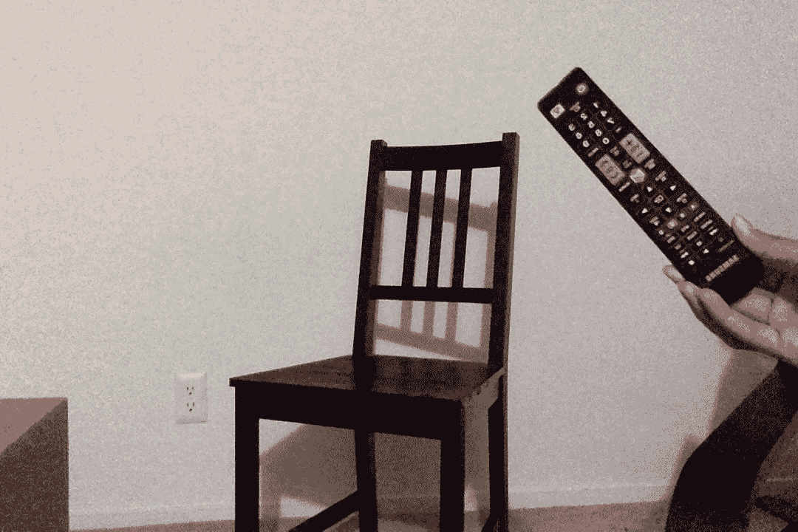

正如我们所见，场景中有一个新的物体。因此，如果我们计算这张图片和我们的背景模型之间的差异，你应该能够识别电视遥控器的位置：

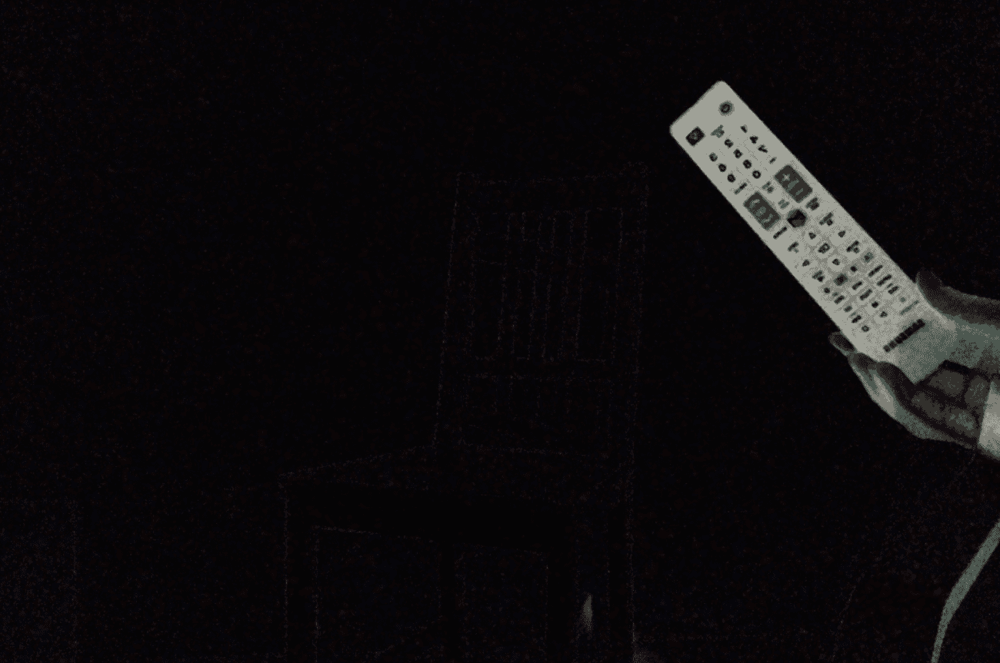

整个过程看起来像这样：

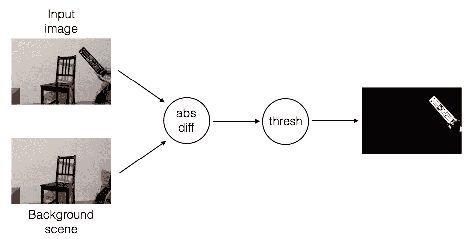

# 它工作得怎么样？

我们之所以称之为**天真**的方法，是有原因的！它在理想条件下工作得很好，而且正如我们所知，现实世界中没有什么是理想的。它对计算给定物体的形状做得相当不错，但它在某些约束条件下这样做。这种方法的主要要求之一是物体的颜色和强度应该与背景有足够的差异。影响这类算法的一些因素包括图像噪声、光照条件和相机的自动对焦。

一旦一个新的物体进入我们的场景并停留下来，就很难检测到它前面的新物体。这是因为我们没有更新我们的背景模型，而新的物体现在已经成为我们背景的一部分。考虑以下图片：

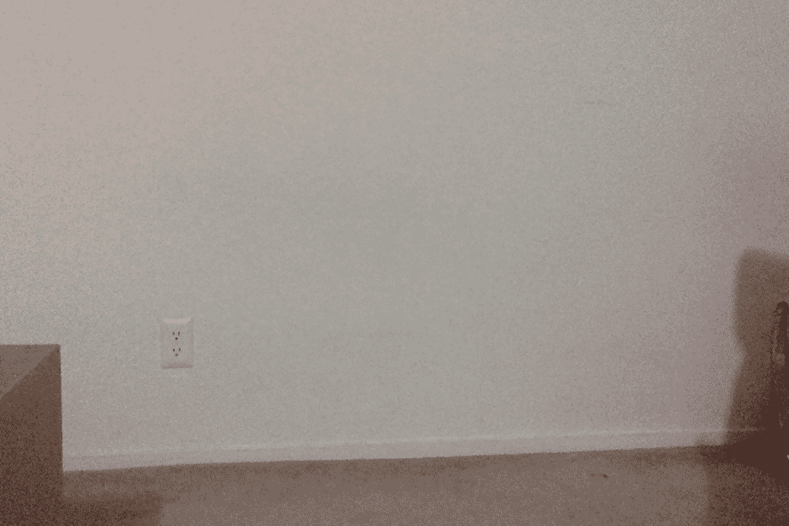

现在，假设一个新的物体进入我们的场景：

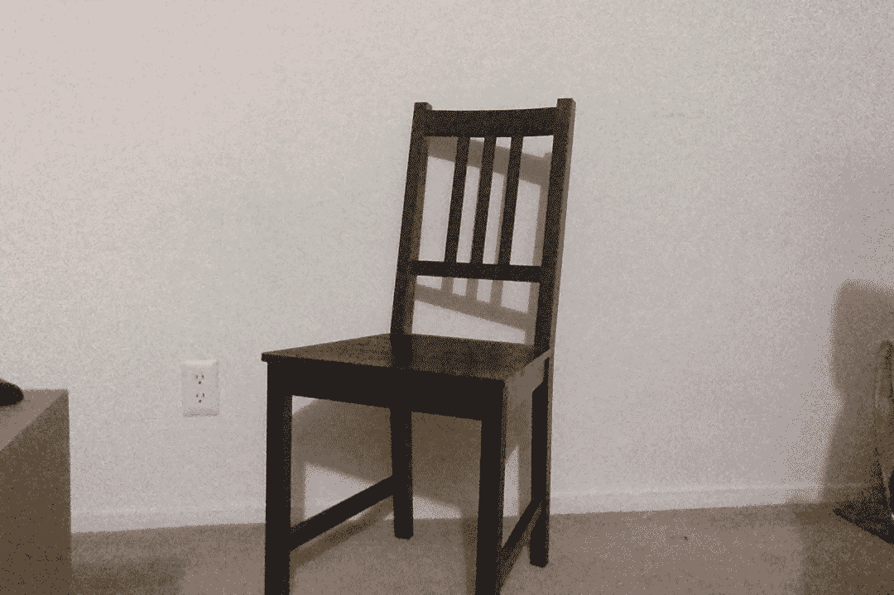

我们将其检测为一个新的物体，这是可以的！假设另一个物体进入场景：

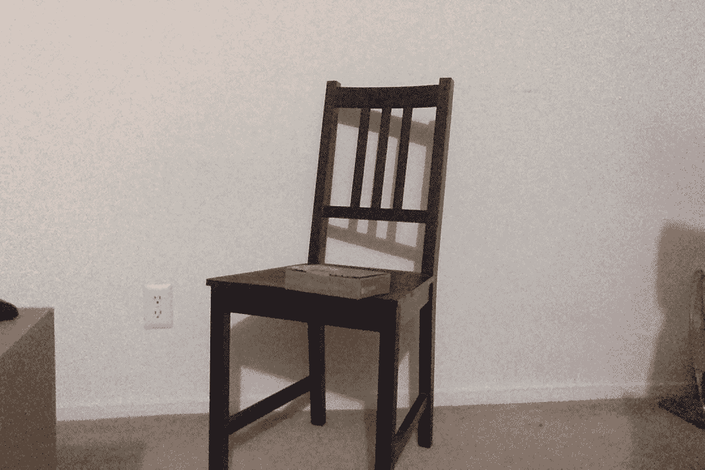

由于这两个不同物体的位置重叠，将很难识别它们的位置。以下是减去背景并应用阈值后得到的结果：

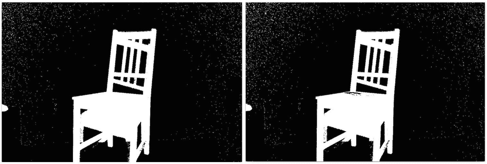

在这种方法中，我们假设背景是静态的。如果背景的某些部分开始移动，这些部分将开始被检测为新物体。因此，即使是微小的移动，比如挥动的旗帜，也会在我们的检测算法中引起问题。这种方法对光照变化也很敏感，并且无法处理任何相机移动。不用说，这是一个很微妙的方法！我们需要能够在现实世界中处理所有这些事情的东西。

# 帧差分

我们知道，我们不能保持一个静态的背景图像模式，这种模式可以用来检测物体。解决这个问题的一种方法是通过使用帧差分。这是我们能够使用的最简单技术之一，用来查看视频中的哪些部分在移动。当我们考虑实时视频流时，连续帧之间的差异提供了大量信息。这个概念相当直接！我们只需计算连续帧之间的差异，并显示它们之间的差异。

如果我快速移动我的笔记本电脑，我们可以看到类似这样的情况：

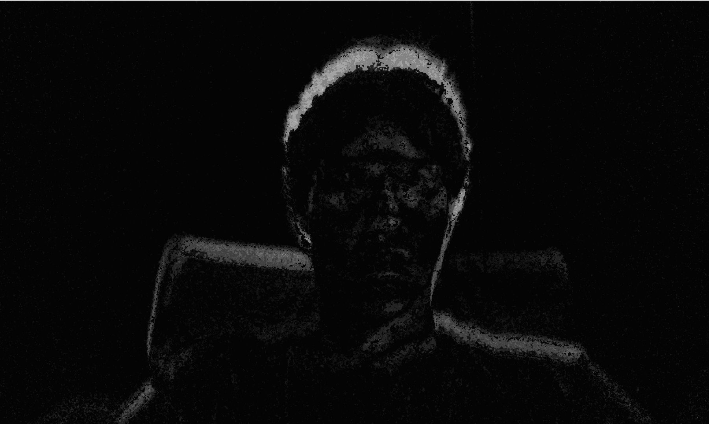

我们不是移动笔记本电脑，而是移动物体，看看会发生什么。如果我快速摇头，它看起来会是这样：

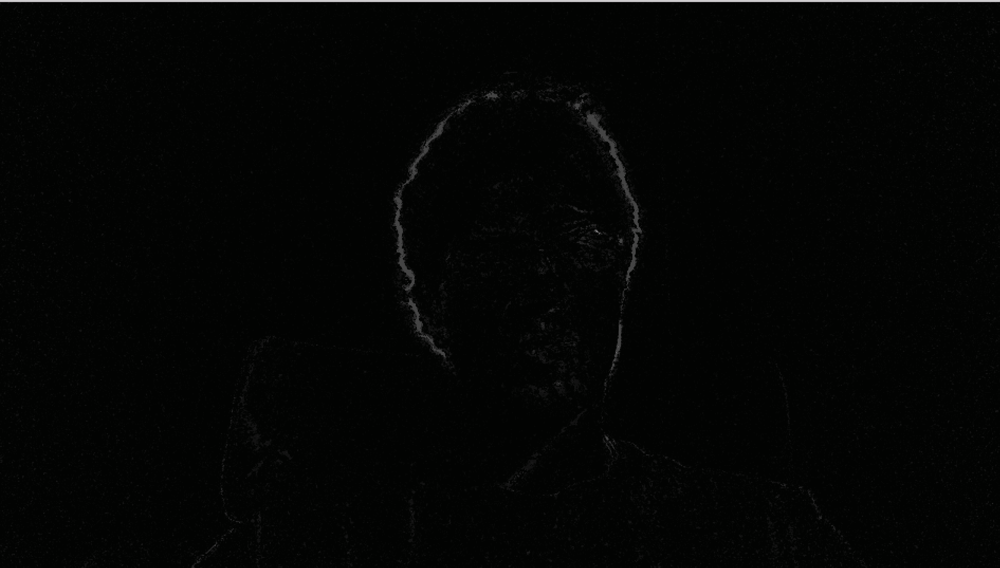

正如你从之前的图像中可以看到，只有视频中的移动部分被突出显示。这为我们提供了一个很好的起点，可以看到视频中的哪些区域在移动。让我们看看计算帧差异的函数：

```py
Mat frameDiff(Mat prevFrame, Mat curFrame, Mat nextFrame)
{
    Mat diffFrames1, diffFrames2, output;

    // Compute absolute difference between current frame and the next
    absdiff(nextFrame, curFrame, diffFrames1);

    // Compute absolute difference between current frame and the previous 
    absdiff(curFrame, prevFrame, diffFrames2);

    // Bitwise "AND" operation between the previous two diff images
    bitwise_and(diffFrames1, diffFrames2, output);

    return output;
}
```

帧差分相当直接！你计算当前帧和前一帧，以及当前帧和下一帧之间的绝对差异。然后我们应用这些帧差异的位运算**AND**操作符。这将突出显示图像中的移动部分。如果你只是计算当前帧和前一帧之间的差异，它往往会很嘈杂。因此，我们需要在连续帧差异之间使用位运算 AND 操作符，以便在看到移动物体时获得一些稳定性。

让我们看看可以从网络摄像头中提取并返回一帧的函数：

```py
Mat getFrame(VideoCapture cap, float scalingFactor)
{
    Mat frame, output;

    // Capture the current frame
    cap >> frame;

    // Resize the frame
    resize(frame, frame, Size(), scalingFactor, scalingFactor, INTER_AREA);

    // Convert to grayscale
    cvtColor(frame, output, COLOR_BGR2GRAY);

    return output;
}
```

正如我们所见，这相当直接。我们只需要调整帧的大小并将其转换为灰度图。现在我们有了辅助函数，让我们看看主函数，看看它是如何整合在一起的：

```py
int main(int argc, char* argv[])
{
    Mat frame, prevFrame, curFrame, nextFrame;
    char ch;

    // Create the capture object
    // 0 -> input arg that specifies it should take the input from the webcam
    VideoCapture cap(0);

    // If you cannot open the webcam, stop the execution!
    if(!cap.isOpened())
        return -1;

    //create GUI windows
    namedWindow("Frame");

    // Scaling factor to resize the input frames from the webcam
    float scalingFactor = 0.75;

    prevFrame = getFrame(cap, scalingFactor);
    curFrame = getFrame(cap, scalingFactor);
    nextFrame = getFrame(cap, scalingFactor);

    // Iterate until the user presses the Esc key
    while(true)
    {
        // Show the object movement
        imshow("Object Movement", frameDiff(prevFrame, curFrame, nextFrame));

        // Update the variables and grab the next frame
        prevFrame = curFrame;
        curFrame = nextFrame;
        nextFrame = getFrame(cap, scalingFactor);

        // Get the keyboard input and check if it's 'Esc'
        // 27 -> ASCII value of 'Esc' key
        ch = waitKey( 30 );
        if (ch == 27) {
            break;
        }
    }
    // Release the video capture object
    cap.release();

    // Close all windows
    destroyAllWindows();

    return 1;
}
```

# 它的效果如何？

正如我们所见，帧差分解决了我们之前遇到的一些重要问题。它可以快速适应光照变化或相机移动。如果一个物体进入画面并停留在那里，它将不会在未来的帧中被检测到。这种方法的主要担忧之一是检测均匀着色的物体。它只能检测均匀着色物体的边缘。原因是这个物体的很大一部分会导致非常低的像素差异：

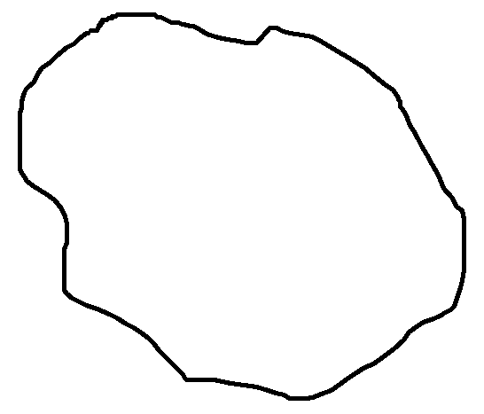

假设这个物体稍微移动了一下。如果我们将其与前一帧进行比较，它将看起来像这样：

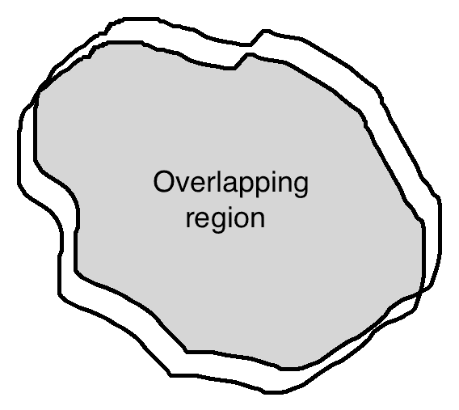

因此，我们在这个物体上标记的像素非常少。另一个问题是，很难检测物体是朝向相机移动还是远离相机。

# 高斯混合方法

在我们讨论**高斯混合**（**MOG**）之前，让我们看看什么是**混合模型**。混合模型只是一个可以用来表示数据中存在子群体的统计模型。我们并不真正关心每个数据点属于哪个类别。我们只需要识别数据内部存在多个组。如果我们用高斯函数来表示每个子群体，那么它就被称为高斯混合。让我们考虑以下照片：

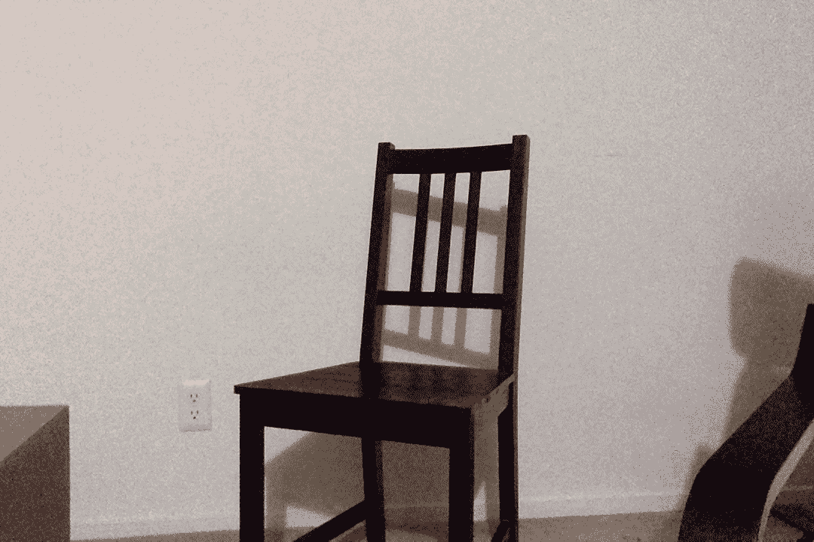

现在，随着我们在这个场景中收集更多的帧，图像的每一部分都将逐渐成为背景模型的一部分。这就是我们在*帧差分*部分之前讨论的内容。如果场景是静态的，模型会自动调整以确保背景模型得到更新。前景掩码，本应代表前景物体，此时看起来像一张黑图，因为每个像素都是背景模型的一部分。

OpenCV 实现了多种高斯混合方法算法。其中之一被称为**MOG**，另一个被称为**MOG2**：有关详细解释，请参阅此链接：[`docs.opencv.org/master/db/d5c/tutorial_py_bg_subtraction.html#gsc.tab=0`](http://docs.opencv.org/master/db/d5c/tutorial_py_bg_subtraction.html#gsc.tab=0)。您还可以查看用于实现这些算法的原始研究论文。

让我们等待一段时间，然后向场景中引入一个新物体。让我们看看使用 MOG2 方法的新前景掩码是什么样的：

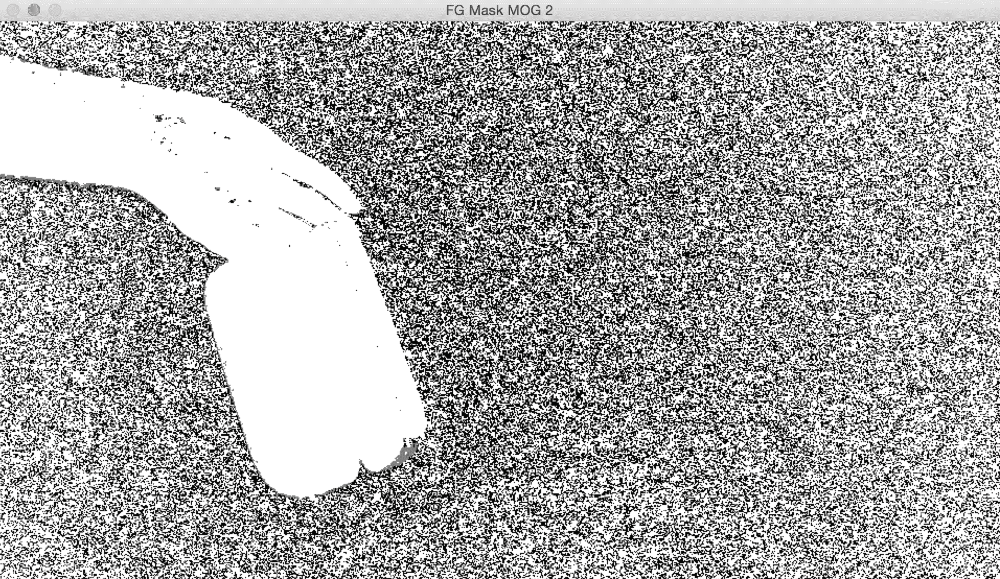

如您所见，新物体被正确识别。让我们看看代码的有趣部分（您可以在`.cpp`文件中获取完整代码）：

```py
int main(int argc, char* argv[])
{

    // Variable declaration and initialization
    ....
    // Iterate until the user presses the Esc key
    while(true)
    {
        // Capture the current frame
        cap >> frame;

        // Resize the frame
        resize(frame, frame, Size(), scalingFactor, scalingFactor, INTER_AREA);

        // Update the MOG2 background model based on the current frame
        pMOG2->apply(frame, fgMaskMOG2);

        // Show the MOG2 foreground mask
        imshow("FG Mask MOG 2", fgMaskMOG2);

        // Get the keyboard input and check if it's 'Esc'
        // 27 -> ASCII value of 'Esc' key
        ch = waitKey( 30 );
        if (ch == 27) {
            break;
        }
    }

    // Release the video capture object
    cap.release();

    // Close all windows
    destroyAllWindows();

    return 1;
}
```

# 代码中发生了什么？

让我们快速浏览一下代码，看看那里发生了什么。我们使用高斯混合模型来创建一个背景减法对象。这个对象代表了一个模型，当我们遇到来自网络摄像头的新的帧时，它将随时更新。我们初始化了两个背景减法模型——`BackgroundSubtractorMOG`和`BackgroundSubtractorMOG2`。它们代表了用于背景减法的两种不同算法。第一个指的是 P. *KadewTraKuPong*和 R. *Bowden*的论文，标题为《用于带有阴影检测的实时跟踪的改进自适应背景混合模型》。您可以在[`personal.ee.surrey.ac.uk/Personal/R.Bowden/publications/avbs01/avbs01.pdf`](http://personal.ee.surrey.ac.uk/Personal/R.Bowden/publications/avbs01/avbs01.pdf)查看。第二个指的是 Z. *Zivkovic*的论文，标题为《用于背景减法的改进自适应高斯混合模型》。您可以在[`www.zoranz.net/Publications/zivkovic2004ICPR.pdf`](http://www.zoranz.net/Publications/zivkovic2004ICPR.pdf)查看。

我们启动一个无限`while`循环，并持续从网络摄像头读取输入帧。随着每个帧，我们更新背景模型，如下所示：

```py
pMOG2->apply(frame, fgMaskMOG2);
```

背景模型在这些步骤中会得到更新。现在，如果一个新物体进入场景并停留，它将成为背景模型的一部分。这有助于我们克服**朴素**背景减法模型的最大缺点之一。

# 形态学图像处理

正如我们之前讨论的，背景减法方法受许多因素影响。它们的准确性取决于我们如何捕获数据以及如何处理数据。影响这些算法的最大因素之一是噪声水平。当我们说**噪声**时，我们指的是图像中的颗粒状和孤立的黑/白像素等问题。这些问题往往会影响我们算法的质量。这就是形态学图像处理发挥作用的地方。形态学图像处理在许多实时系统中被广泛使用，以确保输出质量。形态学图像处理是指处理图像中特征形状的过程；例如，你可以使形状变厚或变薄。形态学算子不依赖于图像中像素的顺序，而是依赖于它们的值。这就是为什么它们非常适合在二值图像中操作形状。形态学图像处理也可以应用于灰度图像，但像素值不会很重要。

# 基本原理是什么？

形态学算子使用结构元素来修改图像。什么是结构元素？结构元素基本上是一个可以用来检查图像中小区域的形状。它被放置在图像的所有像素位置，以便它可以检查该邻域。我们基本上取一个小窗口并将其叠加在像素上。根据响应，我们在该像素位置采取适当的行动。

让我们考虑以下输入图像：

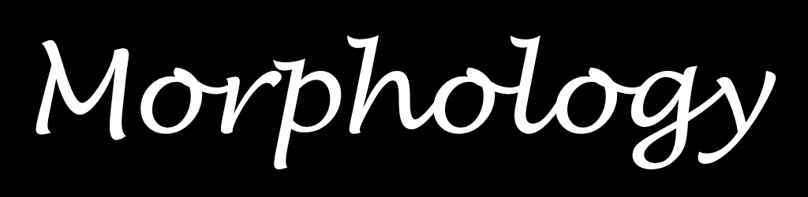

我们将对这张图像应用一系列形态学运算，以观察形状的变化。

# 精简形状

我们使用一个称为**腐蚀**的操作来实现这种效果。这是通过剥离图像中所有形状的边界层来使形状变薄的运算：

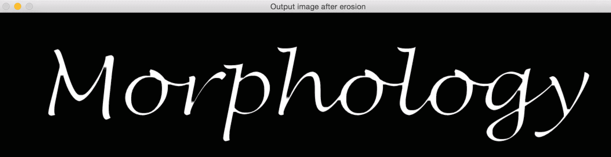

让我们看看执行形态学腐蚀的函数：

```py
Mat performErosion(Mat inputImage, int erosionElement, int erosionSize)
{

    Mat outputImage;
    int erosionType;

    if(erosionElement == 0)
        erosionType = MORPH_RECT;
    else if(erosionElement == 1)
        erosionType = MORPH_CROSS;
    else if(erosionElement == 2)
        erosionType = MORPH_ELLIPSE;

    // Create the structuring element for erosion
    Mat element = getStructuringElement(erosionType, Size(2*erosionSize + 1, 2*erosionSize + 1), Point(erosionSize, erosionSize));

    // Erode the image using the structuring element
    erode(inputImage, outputImage, element);

    // Return the output image
    return outputImage;
}
```

你可以在`.cpp`文件中查看完整的代码，以了解如何使用此函数。我们基本上使用一个内置的 OpenCV 函数构建一个结构元素。此对象用作探针，根据某些条件修改每个像素。这些条件指的是图像中特定像素周围发生的事情。例如，它是被白色像素包围的吗？或者它是被黑色像素包围的吗？一旦我们得到答案，我们就采取适当的行动。

# 加厚形状

我们使用一个称为**膨胀**的操作来实现加厚。这是通过向图像中的所有形状添加边界层来使形状变厚的操作：


这里是执行此操作的代码：

```py
Mat performDilation(Mat inputImage, int dilationElement, int dilationSize)
{
    Mat outputImage;
    int dilationType;

    if(dilationElement == 0)
        dilationType = MORPH_RECT;
    else if(dilationElement == 1)
        dilationType = MORPH_CROSS;
    else if(dilationElement == 2)
        dilationType = MORPH_ELLIPSE;

    // Create the structuring element for dilation
    Mat element = getStructuringElement(dilationType, Size(2*dilationSize + 1, 2*dilationSize + 1), Point(dilationSize, dilationSize));

    // Dilate the image using the structuring element
    dilate(inputImage, outputImage, element);

    // Return the output image
    return outputImage;
}
```

# 其他形态学算子

这里有一些其他有趣的形态学算子。让我们先看看输出图像。我们可以在本节末尾查看代码。

# 形态学开运算

这是**打开**形状的操作。这个算子常用于图像中的噪声去除。它基本上是腐蚀后跟膨胀。形态学开运算通过将小物体放置在背景中来从图像前景中移除它们：

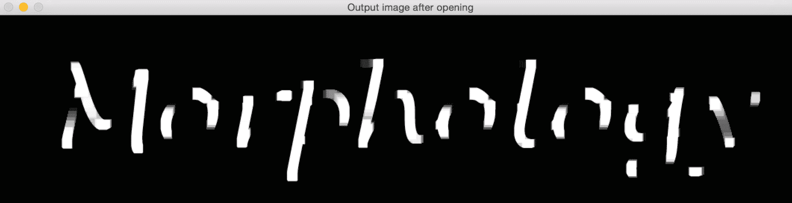

这里是执行形态学开运算的函数：

```py
Mat performOpening(Mat inputImage, int morphologyElement, int morphologySize)
{

    Mat outputImage, tempImage;
    int morphologyType;

    if(morphologyElement == 0)
        morphologyType = MORPH_RECT;
    else if(morphologyElement == 1)
        morphologyType = MORPH_CROSS;
    else if(morphologyElement == 2)
        morphologyType = MORPH_ELLIPSE;

    // Create the structuring element for erosion
    Mat element = getStructuringElement(morphologyType, Size(2*morphologySize + 1, 2*morphologySize + 1), Point(morphologySize, morphologySize));

    // Apply morphological opening to the image using the structuring element
    erode(inputImage, tempImage, element);
    dilate(tempImage, outputImage, element);

    // Return the output image
    return outputImage;
}
```

正如我们所见，我们通过对图像进行**腐蚀**和**膨胀**来执行形态学开运算。

# 形态学闭合

这是通过填充间隙来**闭合**形状的操作，如下面的截图所示。这个操作也用于噪声去除。它基本上是膨胀后跟腐蚀。这个操作通过将背景中的小物体变成前景来移除前景中的微小孔洞：

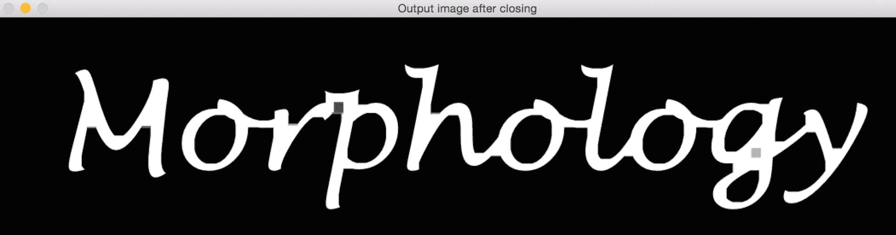

让我们快速看看执行形态学闭合的函数：

```py
Mat performClosing(Mat inputImage, int morphologyElement, int morphologySize)
{

    Mat outputImage, tempImage;
    int morphologyType;

    if(morphologyElement == 0)
        morphologyType = MORPH_RECT;
    else if(morphologyElement == 1)
        morphologyType = MORPH_CROSS;
    else if(morphologyElement == 2)
        morphologyType = MORPH_ELLIPSE;

    // Create the structuring element for erosion
    Mat element = getStructuringElement(morphologyType, Size(2*morphologySize + 1, 2*morphologySize + 1), Point(morphologySize, morphologySize));

    // Apply morphological opening to the image using the structuring element
    dilate(inputImage, tempImage, element);
    erode(tempImage, outputImage, element);

    // Return the output image
    return outputImage;
}
```

# 绘制边界

我们通过使用形态学梯度来实现这一点。这是通过取图像膨胀和腐蚀之间的差值来绘制形状边界的操作：

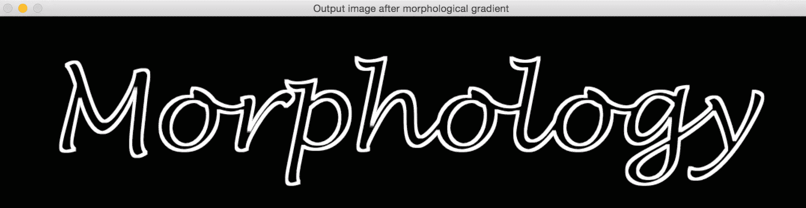

让我们看看执行形态学梯度的函数：

```py
Mat performMorphologicalGradient(Mat inputImage, int morphologyElement, int morphologySize)
{
    Mat outputImage, tempImage1, tempImage2;
    int morphologyType;

    if(morphologyElement == 0)
        morphologyType = MORPH_RECT;
    else if(morphologyElement == 1)
        morphologyType = MORPH_CROSS;
    else if(morphologyElement == 2)
        morphologyType = MORPH_ELLIPSE;

    // Create the structuring element for erosion
    Mat element = getStructuringElement(morphologyType, Size(2*morphologySize + 1, 2*morphologySize + 1), Point(morphologySize, morphologySize));

    // Apply morphological gradient to the image using the structuring element
    dilate(inputImage, tempImage1, element);
    erode(inputImage, tempImage2, element);

    // Return the output image
    return tempImage1 - tempImage2;
}
```

# 顶帽变换

这个变换从图像中提取更细的细节。这是输入图像与其形态学开运算之间的差异。这使我们能够识别出图像中比结构元素小且比周围环境亮的物体。根据结构元素的大小，我们可以从给定图像中提取各种物体：

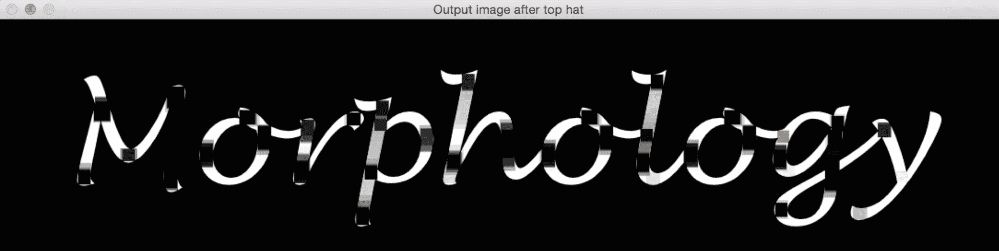

如果你仔细观察输出图像，你可以看到那些黑色矩形。这意味着结构元素能够适应那里，因此这些区域被涂成了黑色。以下是该函数：

```py
Mat performTopHat(Mat inputImage, int morphologyElement, int morphologySize)
{

    Mat outputImage;
    int morphologyType;

    if(morphologyElement == 0)
        morphologyType = MORPH_RECT;
    else if(morphologyElement == 1)
        morphologyType = MORPH_CROSS;
    else if(morphologyElement == 2)
        morphologyType = MORPH_ELLIPSE;

    // Create the structuring element for erosion
    Mat element = getStructuringElement(morphologyType, Size(2*morphologySize + 1, 2*morphologySize + 1), Point(morphologySize, morphologySize));

    // Apply top hat operation to the image using the structuring element
    outputImage = inputImage - performOpening(inputImage, morphologyElement, morphologySize);

    // Return the output image
    return outputImage;
}
```

# 黑帽变换

这个变换同样从图像中提取更细的细节。这是图像的形态学闭运算与图像本身的差异。这使我们能够识别出图像中比结构元素小且比周围环境暗的物体：

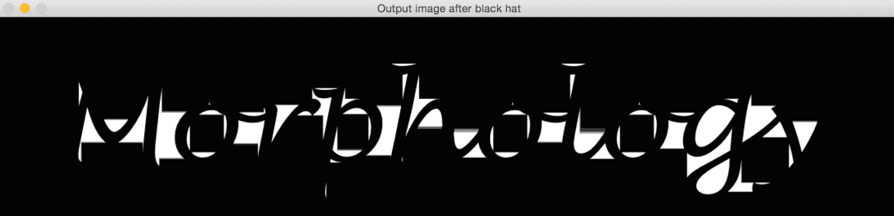

让我们看看执行黑帽变换的函数：

```py
Mat performBlackHat(Mat inputImage, int morphologyElement, int morphologySize)
{
    Mat outputImage;
    int morphologyType;

    if(morphologyElement == 0)
        morphologyType = MORPH_RECT;
    else if(morphologyElement == 1)
        morphologyType = MORPH_CROSS;
    else if(morphologyElement == 2)
        morphologyType = MORPH_ELLIPSE;

    // Create the structuring element for erosion
    Mat element = getStructuringElement(morphologyType, Size(2*morphologySize + 1, 2*morphologySize + 1), Point(morphologySize, morphologySize));

    // Apply black hat operation to the image using the structuring element
    outputImage = performClosing(inputImage, morphologyElement, morphologySize) - inputImage;

    // Return the output image
    return outputImage;
}
```

# 摘要

在本章中，我们学习了用于背景建模和形态学图像处理的算法。我们讨论了简单的背景减法和其局限性。我们探讨了如何使用帧差分来获取运动信息，以及当我们想要跟踪不同类型的物体时，它可能存在的局限性。这导致了我们对高斯混合模型的讨论。我们讨论了公式以及如何实现它。然后我们讨论了形态学图像处理，它可以用于各种目的，并介绍了不同的操作以展示用例。

在下一章中，我们将讨论目标跟踪以及可以用来实现这一目标的多种技术。
