# 学习物体跟踪

在上一章中，我们学习了视频监控、背景建模和形态学图像处理。我们讨论了如何使用不同的形态学算子将酷炫的视觉效果应用到输入图像上。在本章中，我们将学习如何在实时视频中跟踪一个物体。我们将讨论可用于跟踪物体的不同物体特性。我们还将了解不同的物体跟踪方法和技巧。物体跟踪在机器人学、自动驾驶汽车、车辆跟踪、体育中的运动员跟踪和视频压缩等领域得到了广泛的应用。

到本章结束时，你将了解以下内容：

+   如何跟踪特定颜色的物体

+   如何构建一个交互式物体跟踪器

+   角点检测器是什么

+   如何检测用于跟踪的良好特征

+   如何构建基于光流的特征跟踪器

# 技术要求

本章需要熟悉 C++编程语言的基础知识。本章中使用的所有代码都可以从以下 GitHub 链接下载：[`github.com/PacktPublishing/Learn-OpenCV-4-By-Building-Projects-Second-Edition/tree/master/Chapter_09`](https://github.com/PacktPublishing/Learn-OpenCV-4-By-Building-Projects-Second-Edition/tree/master/Chapter_09)。代码可以在任何操作系统上执行，尽管它仅在 Ubuntu 上进行了测试。

查看以下视频，了解代码的实际应用：

[`bit.ly/2SidbMc`](http://bit.ly/2SidbMc)

# 跟踪特定颜色的物体

为了构建一个好的物体跟踪器，我们需要了解哪些特性可以用来使我们的跟踪既稳健又准确。因此，让我们迈出第一步，看看我们是否可以使用颜色空间信息来提出一个好的视觉跟踪器。需要注意的是，颜色信息对光照条件敏感。在实际应用中，你将不得不进行一些预处理来处理这个问题。但就目前而言，让我们假设有人正在做这件事，而我们正在获得干净的彩色图像。

存在许多不同的色彩空间，选择一个合适的色彩空间将取决于用户所使用的不同应用。虽然 RGB 是计算机屏幕上的原生表示，但它对于人类来说并不一定是理想的。对于人类来说，我们更自然地根据它们的色调来命名颜色，这就是为什么**色调饱和度值**（**HSV**）可能是最具有信息量的色彩空间之一。它与我们的颜色感知非常接近。色调指的是颜色光谱，饱和度指的是特定颜色的强度，而亮度指的是该像素的亮度。这实际上是以圆柱格式表示的。你可以在[`infohost.nmt.edu/tcc/help/pubs/colortheory/web/hsv.html`](http://infohost.nmt.edu/tcc/help/pubs/colortheory/web/hsv.html)找到简单的解释。我们可以将图像的像素转换到 HSV 色彩空间，然后使用这个色彩空间来测量这个空间中的距离和阈值，以跟踪特定的对象。

考虑视频中的以下框架：

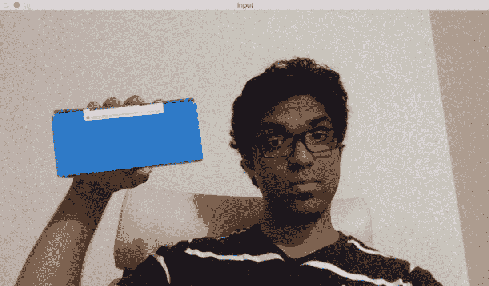

如果你通过色彩空间过滤器运行它并跟踪对象，你会看到类似这样的结果：

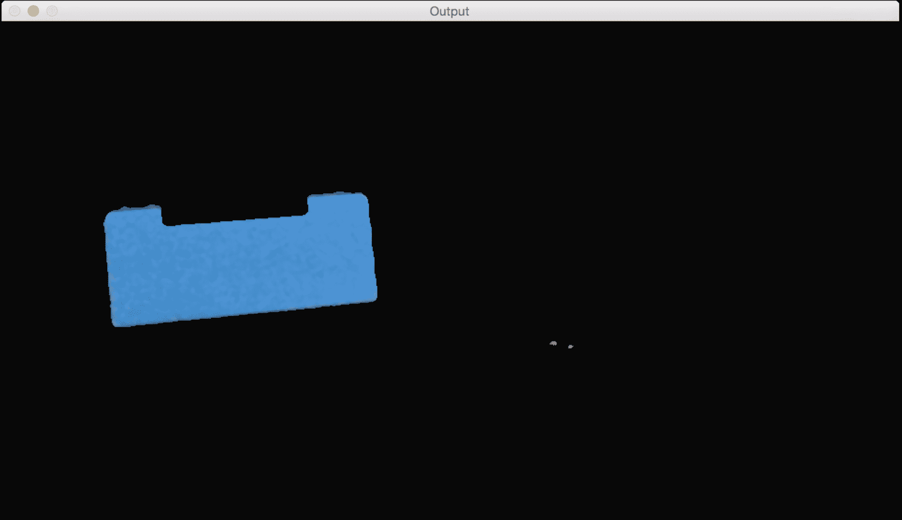

正如我们所看到的，我们的跟踪器根据颜色特征在视频中识别出特定的对象。为了使用这个跟踪器，我们需要知道目标对象的颜色分布。以下是跟踪彩色对象的代码，它只选择具有特定给定色调的像素。代码有很好的注释，所以阅读每个术语的解释，以了解发生了什么：

```py
int main(int argc, char* argv[]) 
{ 
   // Variable declarations and initializations 

    // Iterate until the user presses the Esc key 
    while(true) 
    { 
        // Initialize the output image before each iteration 
        outputImage = Scalar(0,0,0); 

        // Capture the current frame 
        cap >> frame; 

        // Check if 'frame' is empty 
        if(frame.empty()) 
            break; 

        // Resize the frame 
        resize(frame, frame, Size(), scalingFactor, scalingFactor, INTER_AREA); 

        // Convert to HSV colorspace 
        cvtColor(frame, hsvImage, COLOR_BGR2HSV); 

        // Define the range of "blue" color in HSV colorspace 
        Scalar lowerLimit = Scalar(60,100,100); 
        Scalar upperLimit = Scalar(180,255,255); 

        // Threshold the HSV image to get only blue color 
        inRange(hsvImage, lowerLimit, upperLimit, mask); 

        // Compute bitwise-AND of input image and mask 
        bitwise_and(frame, frame, outputImage, mask=mask); 

        // Run median filter on the output to smoothen it 
        medianBlur(outputImage, outputImage, 5); 

        // Display the input and output image 
        imshow("Input", frame); 
        imshow("Output", outputImage); 

        // Get the keyboard input and check if it's 'Esc' 
        // 30 -> wait for 30 ms 
        // 27 -> ASCII value of 'ESC' key 
        ch = waitKey(30); 
        if (ch == 27) { 
            break; 
        } 
    } 

    return 1; 
} 
```

# 构建交互式对象跟踪器

基于色彩空间的跟踪器为我们提供了跟踪彩色对象的自由，但我们也被限制在预定义的色彩上。如果我们只想随机选择一个对象怎么办？我们如何构建一个可以学习所选对象特征并自动跟踪它的对象跟踪器？这就是**连续自适应均值漂移**（**CAMShift**）算法出现的地方。它基本上是均值漂移算法的改进版本。

MeanShift 的概念实际上很棒且简单。假设我们选择一个感兴趣的区域，并希望我们的物体追踪器追踪该物体。在这个区域中，我们根据颜色直方图选择一些点，并计算空间点的质心。如果质心位于这个区域的中心，我们知道物体没有移动。但如果质心不在这个区域的中心，那么我们知道物体正在某个方向上移动。质心的移动控制着物体移动的方向。因此，我们将物体的边界框移动到新的位置，使新的质心成为这个边界框的中心。因此，这个算法被称为 mean shift，因为均值（质心）在移动。这样，我们就能保持对物体当前位置的更新。

但 mean shift 的问题在于边界框的大小不允许改变。当你将物体移离相机时，物体在人的眼中会显得更小，但 mean shift 不会考虑这一点。边界框的大小在整个追踪过程中保持不变。因此，我们需要使用 CAMShift。CAMShift 的优势在于它可以调整边界框的大小以适应物体的大小。除此之外，它还可以追踪物体的方向。

让我们考虑以下帧，其中物体被突出显示：

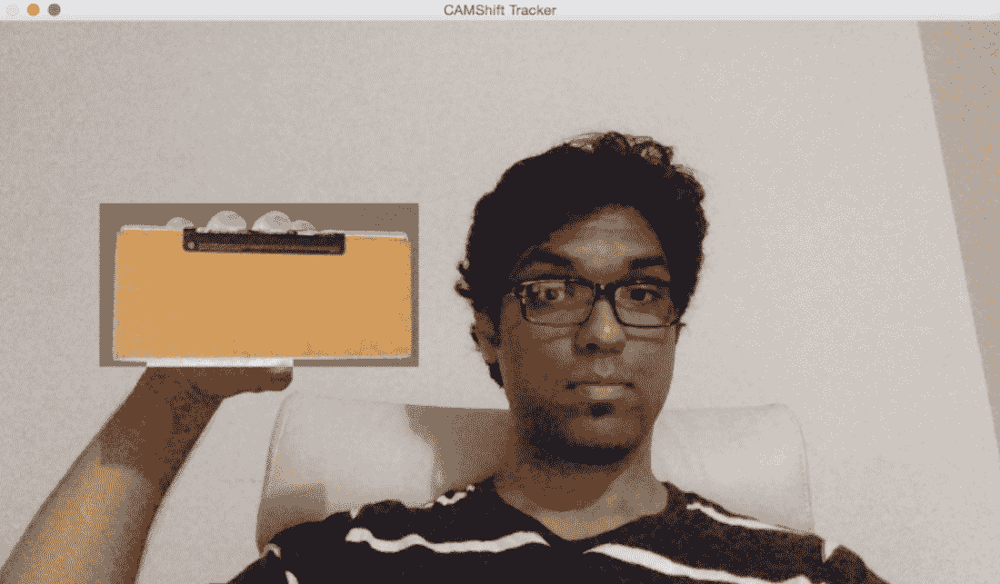

现在我们已经选择了物体，算法计算直方图反向投影并提取所有信息。什么是直方图反向投影？它只是识别图像如何适合我们的直方图模型的一种方法。我们计算特定事物的直方图模型，然后使用这个模型在图像中找到该事物。让我们移动物体，看看它是如何被追踪的：

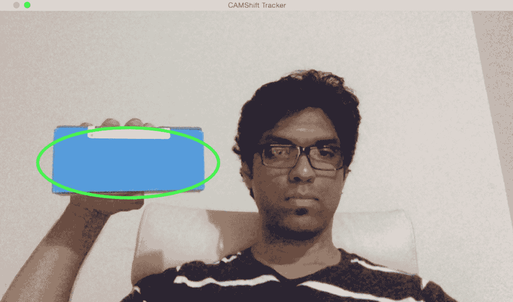

看起来物体被追踪得相当好。让我们改变物体的方向，看看追踪是否还能维持：

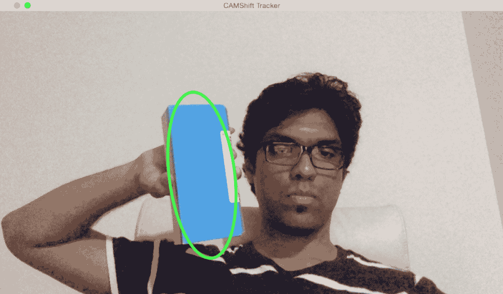

如我们所见，边界椭圆已经改变了其位置和方向。让我们改变物体的透视，看看它是否还能追踪到它：

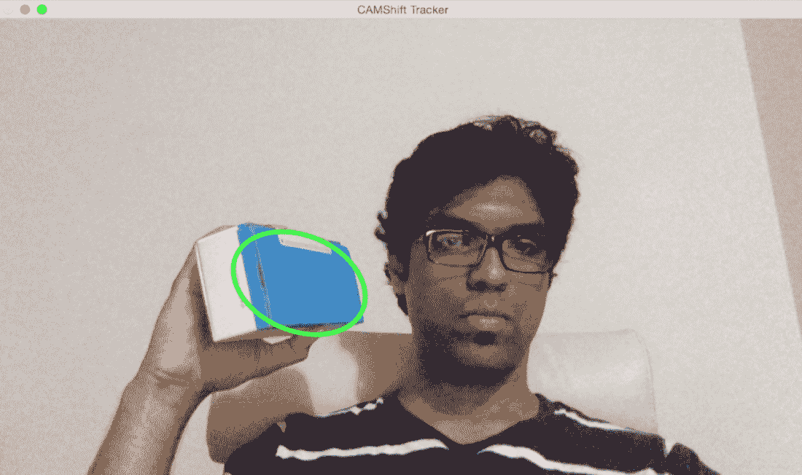

我们仍然做得很好！边界椭圆已经改变了长宽比，以反映物体现在看起来是倾斜的（因为透视变换）。让我们看看代码中的用户界面功能：

```py
Mat image; 
Point originPoint; 
Rect selectedRect; 
bool selectRegion = false; 
int trackingFlag = 0; 

// Function to track the mouse events 
void onMouse(int event, int x, int y, int, void*) 
{ 
    if(selectRegion) 
    { 
        selectedRect.x = MIN(x, originPoint.x); 
        selectedRect.y = MIN(y, originPoint.y); 
        selectedRect.width = std::abs(x - originPoint.x); 
        selectedRect.height = std::abs(y - originPoint.y); 

        selectedRect &= Rect(0, 0, image.cols, image.rows); 
    } 

    switch(event) 
    { 
        case EVENT_LBUTTONDOWN: 
            originPoint = Point(x,y); 
            selectedRect = Rect(x,y,0,0); 
            selectRegion = true; 
            break; 

        case EVENT_LBUTTONUP: 
            selectRegion = false; 
            if( selectedRect.width > 0 && selectedRect.height > 0 ) 
            { 
                trackingFlag = -1; 
            } 
            break; 
    } 
} 
```

这个函数基本上捕获了在窗口中选择的矩形的坐标。用户只需要用鼠标点击并拖动。OpenCV 中有一系列内置函数帮助我们检测这些不同的鼠标事件。

这里是基于 CAMShift 进行物体追踪的代码：

```py
int main(int argc, char* argv[]) 
{ 
    // Variable declaration and initialization 
    ....
    // Iterate until the user presses the Esc key 
    while(true) 
    { 
        // Capture the current frame 
        cap >> frame; 

        // Check if 'frame' is empty 
        if(frame.empty()) 
            break; 

        // Resize the frame 
        resize(frame, frame, Size(), scalingFactor, scalingFactor, INTER_AREA); 

        // Clone the input frame 
        frame.copyTo(image); 

        // Convert to HSV colorspace 
        cvtColor(image, hsvImage, COLOR_BGR2HSV);
```

我们现在有一个等待处理的 HSV 图像。让我们看看我们如何使用我们的阈值来处理这个图像：

```py
        if(trackingFlag) 
        { 
            // Check for all the values in 'hsvimage' that are within the specified range 
            // and put the result in 'mask' 
            inRange(hsvImage, Scalar(0, minSaturation, minValue), Scalar(180, 256, maxValue), mask); 

            // Mix the specified channels 
            int channels[] = {0, 0}; 
            hueImage.create(hsvImage.size(), hsvImage.depth()); 
            mixChannels(&hsvImage, 1, &hueImage, 1, channels, 1); 

            if(trackingFlag < 0) 
            { 
                // Create images based on selected regions of interest 
                Mat roi(hueImage, selectedRect), maskroi(mask, selectedRect); 

                // Compute the histogram and normalize it 
                calcHist(&roi, 1, 0, maskroi, hist, 1, &histSize, &histRanges); 
                normalize(hist, hist, 0, 255, NORM_MINMAX); 

                trackingRect = selectedRect; 
                trackingFlag = 1; 
            } 
```

如我们所见，我们使用 HSV 图像来计算该区域的直方图。我们使用我们的阈值在 HSV 光谱中定位所需颜色，然后根据该颜色过滤图像。让我们看看我们如何计算直方图反向投影：

```py
            // Compute the histogram backprojection 
            calcBackProject(&hueImage, 1, 0, hist, backproj, &histRanges); 
            backproj &= mask; 
            RotatedRect rotatedTrackingRect = CamShift(backproj, trackingRect, TermCriteria(TermCriteria::EPS | TermCriteria::COUNT, 10, 1)); 

            // Check if the area of trackingRect is too small 
            if(trackingRect.area() <= 1) 
            { 
                // Use an offset value to make sure the trackingRect has a minimum size 
                int cols = backproj.cols, rows = backproj.rows; 
                int offset = MIN(rows, cols) + 1; 
                trackingRect = Rect(trackingRect.x - offset, trackingRect.y - offset, trackingRect.x + offset, trackingRect.y + offset) & Rect(0, 0, cols, rows); 
            } 
```

我们现在准备显示结果。使用旋转矩形，让我们在我们的感兴趣区域周围画一个椭圆：

```py
            // Draw the ellipse on top of the image 
            ellipse(image, rotatedTrackingRect, Scalar(0,255,0), 3, LINE_AA); 
        } 

        // Apply the 'negative' effect on the selected region of interest 
        if(selectRegion && selectedRect.width > 0 && selectedRect.height > 0) 
        { 
            Mat roi(image, selectedRect); 
            bitwise_not(roi, roi); 
        } 

        // Display the output image 
        imshow(windowName, image); 

        // Get the keyboard input and check if it's 'Esc' 
        // 27 -> ASCII value of 'Esc' key 
        ch = waitKey(30); 
        if (ch == 27) { 
            break; 
        } 
    } 

    return 1; 
} 
```

# 使用 Harris 角点检测器检测点

角点检测是一种用于检测图像中感兴趣点的技术。这些感兴趣点在计算机视觉术语中也被称作特征点，或者简单地称为特征。一个角基本上是两条边的交点。一个感兴趣点基本上是在图像中可以唯一检测到的东西。一个角是感兴趣点的特例。这些感兴趣点帮助我们描述图像。这些点在诸如目标跟踪、图像分类和视觉搜索等应用中被广泛使用。既然我们知道角是有趣的，让我们看看如何检测它们。

在计算机视觉中，有一个流行的角点检测技术叫做 Harris 角点检测器。我们基本上基于灰度图像的偏导数构建一个 2x2 矩阵，然后分析特征值。这到底是什么意思呢？好吧，让我们剖析一下，以便我们更好地理解它。让我们考虑图像中的一个小的区域。我们的目标是确定这个区域中是否有角点。因此，我们考虑所有相邻的区域，并计算我们的区域与所有这些相邻区域之间的强度差异。如果在所有方向上差异都很大，那么我们知道我们的区域中有一个角点。这是实际算法的过度简化，但它涵盖了要点。如果你想要了解背后的数学细节，你可以查看 *Harris* 和 *Stephens* 在 [`www.bmva.org/bmvc/1988/avc-88-023.pdf`](http://www.bmva.org/bmvc/1988/avc-88-023.pdf) 发表的原始论文。一个角是沿两个方向具有强烈强度差异的点。

如果我们运行 Harris 角点检测器，它看起来会是这样：

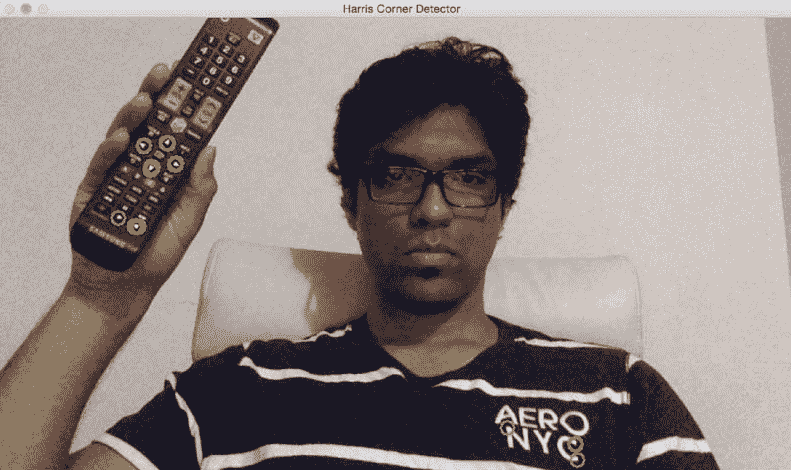

如我们所见，电视遥控器上的绿色圆圈是检测到的角点。这会根据你为检测器选择的参数而改变。如果你修改参数，你可能会看到更多点被检测到。如果你让它更严格，你可能无法检测到软角。让我们看看检测 Harris 角点的代码：

```py
int main(int argc, char* argv[])
{
// Variable declaration and initialization

// Iterate until the user presses the Esc key
while(true)
{
    // Capture the current frame
    cap >> frame;

    // Resize the frame
    resize(frame, frame, Size(), scalingFactor, scalingFactor, INTER_AREA);

    dst = Mat::zeros(frame.size(), CV_32FC1);

    // Convert to grayscale
    cvtColor(frame, frameGray, COLOR_BGR2GRAY );

    // Detecting corners
    cornerHarris(frameGray, dst, blockSize, apertureSize, k, BORDER_DEFAULT);

    // Normalizing
    normalize(dst, dst_norm, 0, 255, NORM_MINMAX, CV_32FC1, Mat());
    convertScaleAbs(dst_norm, dst_norm_scaled);
```

我们将图像转换为灰度，并使用我们的参数检测角。您可以在`.cpp`文件中找到完整的代码。这些参数在检测到的点数中起着重要作用。您可以在[`docs.opencv.org/master/dd/d1a/group__imgproc__feature.html#gac1fc3598018010880e370e2f709b4345`](https://docs.opencv.org/master/dd/d1a/group__imgproc__feature.html#gac1fc3598018010880e370e2f709b4345)查看`cornerHarris()`的 OpenCV 文档。

我们现在有了所有需要的信息。让我们继续在角周围画圆圈以显示结果：

```py
        // Drawing a circle around each corner
        for(int j = 0; j < dst_norm.rows ; j++)
        {
            for(int i = 0; i < dst_norm.cols; i++)
            {
                if((int)dst_norm.at<float>(j,i) > thresh)
                {
                    circle(frame, Point(i, j), 8, Scalar(0,255,0), 2, 8, 0);
                }
            }
        }

        // Showing the result
        imshow(windowName, frame);

        // Get the keyboard input and check if it's 'Esc'
        // 27 -> ASCII value of 'Esc' key
        ch = waitKey(10);
        if (ch == 27) {
            break;
        }
    }

    // Release the video capture object
    cap.release();

    // Close all windows
    destroyAllWindows();

    return 1;
}
```

如我们所见，此代码接受一个输入参数：`blockSize`。根据您选择的大小，性能会有所不同。从四个开始，并尝试不同的值以查看会发生什么。

# **Good features to track**

哈里斯角检测器在许多情况下表现良好，但仍有改进空间。在哈里斯和斯蒂芬斯发表原始论文后的六年左右，石和托马西提出了更好的方法，并将其命名为**Good Features to Track**。您可以在以下链接中阅读原始论文：[`www.ai.mit.edu/courses/6.891/handouts/shi94good.pdf`](http://www.ai.mit.edu/courses/6.891/handouts/shi94good.pdf)。他们使用不同的评分函数来提高整体质量。使用这种方法，我们可以在给定的图像中找到 N 个最强的角。当我们不想使用图像中的每一个角来提取信息时，这非常有用。正如我们讨论的那样，一个好的兴趣点检测器在目标跟踪、目标识别和图像搜索等应用中非常有用。

如果您将石-托马西角检测器应用于图像，您将看到类似这样的结果：

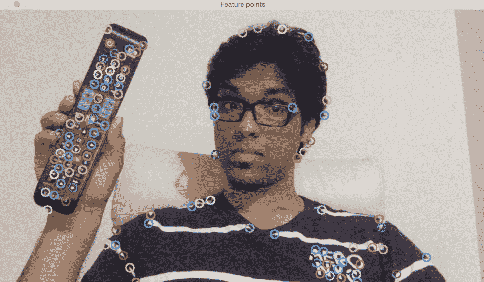

如我们所见，框架中的所有重要点都被捕捉到了。让我们看看代码来跟踪这些特征：

```py
int main(int argc, char* argv[]) 
{ 
    // Variable declaration and initialization 

    // Iterate until the user presses the Esc key 
    while(true) 
    { 
        // Capture the current frame 
        cap >> frame; 

        // Resize the frame 
        resize(frame, frame, Size(), scalingFactor, scalingFactor, INTER_AREA); 

        // Convert to grayscale 
        cvtColor(frame, frameGray, COLOR_BGR2GRAY ); 

        // Initialize the parameters for Shi-Tomasi algorithm 
        vector<Point2f> corners; 
        double qualityThreshold = 0.02; 
        double minDist = 15; 
        int blockSize = 5; 
        bool useHarrisDetector = false; 
        double k = 0.07; 

        // Clone the input frame 
        Mat frameCopy; 
        frameCopy = frame.clone(); 

        // Apply corner detection 
        goodFeaturesToTrack(frameGray, corners, numCorners, qualityThreshold, minDist, Mat(), blockSize, useHarrisDetector, k); 
```

如我们所见，我们提取了帧，并使用`goodFeaturesToTrack`来检测角。重要的是要理解检测到的角的数量将取决于我们的参数选择。您可以在[`docs.opencv.org/2.4/modules/imgproc/doc/feature_detection.html?highlight=goodfeaturestotrack#goodfeaturestotrack`](http://docs.opencv.org/2.4/modules/imgproc/doc/feature_detection.html?highlight=goodfeaturestotrack#goodfeaturestotrack)找到详细的解释。让我们继续在这些点上画圆圈以显示输出图像：

```py
        // Parameters for the circles to display the corners 
        int radius = 8;      // radius of the circles 
        int thickness = 2;   // thickness of the circles 
        int lineType = 8; 

        // Draw the detected corners using circles 
        for(size_t i = 0; i < corners.size(); i++) 
        { 
            Scalar color = Scalar(rng.uniform(0,255), rng.uniform(0,255), rng.uniform(0,255)); 
            circle(frameCopy, corners[i], radius, color, thickness, lineType, 0); 
        } 

        /// Show what you got 
        imshow(windowName, frameCopy); 

        // Get the keyboard input and check if it's 'Esc' 
        // 27 -> ASCII value of 'Esc' key 
        ch = waitKey(30); 
        if (ch == 27) { 
            break; 
        } 
    } 

    // Release the video capture object 
    cap.release(); 

    // Close all windows 
    destroyAllWindows(); 

    return 1; 
}
```

此程序接受一个输入参数：`numCorners`。此值表示您想要跟踪的最大角数。从`100`开始，并尝试不同的值以查看会发生什么。如果您增加此值，您将看到更多特征点被检测到。

# 基于特征的跟踪

基于特征点的跟踪是指在视频的连续帧之间跟踪单个特征点。这里的优势是我们不必在每一帧中检测特征点。我们只需检测一次，然后继续跟踪。这比在每一帧上运行检测器更有效。我们使用一种称为光流的技术来跟踪这些特征。光流是计算机视觉中最流行的技术之一。我们选择一些特征点，并通过视频流跟踪它们。当我们检测到特征点时，我们计算位移矢量，并显示这些关键点在连续帧之间的运动。这些矢量被称为运动矢量。特定点的运动矢量基本上就是一个指示该点相对于前一帧移动方向的直线。不同的方法被用来检测这些运动矢量。最流行的两种算法是**Lucas-Kanade**方法和**Farneback**算法。

# Lucas-Kanade 方法

Lucas-Kanade 方法用于稀疏光流跟踪。这里的稀疏意味着特征点的数量相对较低。你可以在这里参考他们的原始论文：[`cseweb.ucsd.edu/classes/sp02/cse252/lucaskanade81.pdf`](http://cseweb.ucsd.edu/classes/sp02/cse252/lucaskanade81.pdf)。我们通过提取特征点开始这个过程。对于每个特征点，我们以特征点为中心创建 3 x 3 的块。这里的假设是每个块内的所有点将具有相似的运动。我们可以根据问题调整这个窗口的大小。

对于当前帧中的每个特征点，我们将其周围的 3 x 3 区域作为参考点。对于这个区域，我们在前一帧的邻域中寻找最佳匹配。这个邻域通常比 3 x 3 大，因为我们想要找到与当前考虑的块最接近的块。现在，从前一帧匹配块的中心像素到当前帧考虑的块的中心的路径将成为运动矢量。我们对所有特征点都这样做，并提取所有运动矢量。

让我们考虑以下框架：

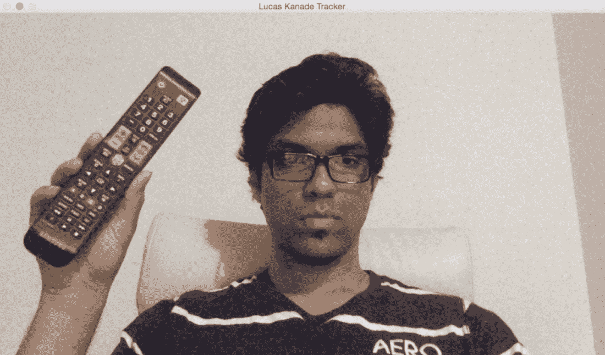

我们需要添加一些我们想要跟踪的点。只需用鼠标点击这个窗口上的多个点即可：

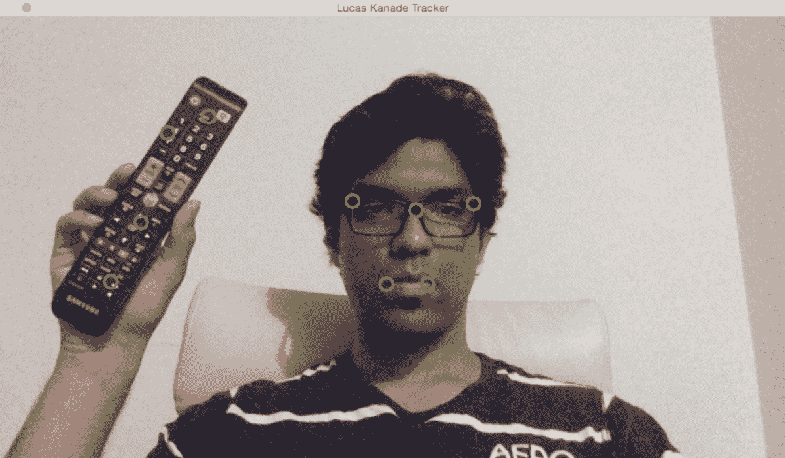

如果我移动到不同的位置，你将看到点仍然在很小的误差范围内被正确跟踪：

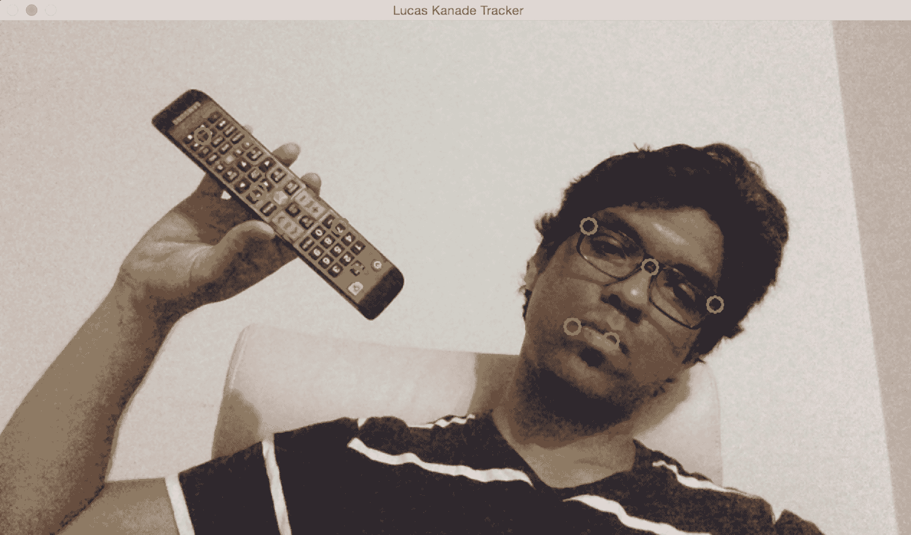

让我们添加很多点，看看会发生什么：

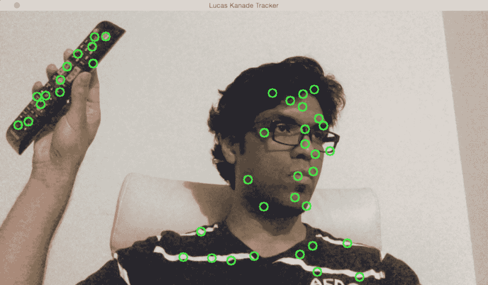

如我们所见，它将一直跟踪这些点。但，你会注意到由于突出度或移动速度等因素，一些点将会被丢弃。如果你想玩转它，你只需继续添加更多点即可。你也可以让用户在输入视频中选择感兴趣的区域。然后你可以从这个感兴趣的区域提取特征点，并通过绘制边界框来跟踪对象。这将是一个有趣的练习！

下面是使用 Lucas-Kanade 进行跟踪的代码：

```py
int main(int argc, char* argv[]) 
{ 
    // Variable declaration and initialization 

    // Iterate until the user hits the Esc key 
    while(true) 
    { 
        // Capture the current frame 
        cap >> frame; 

        // Check if the frame is empty 
        if(frame.empty()) 
            break; 

        // Resize the frame 
        resize(frame, frame, Size(), scalingFactor, scalingFactor, INTER_AREA); 

        // Copy the input frame 
        frame.copyTo(image); 

        // Convert the image to grayscale 
        cvtColor(image, curGrayImage, COLOR_BGR2GRAY); 

        // Check if there are points to track 
        if(!trackingPoints[0].empty()) 
        { 
            // Status vector to indicate whether the flow for the corresponding features has been found 
            vector<uchar> statusVector; 

            // Error vector to indicate the error for the corresponding feature 
            vector<float> errorVector; 

            // Check if previous image is empty 
            if(prevGrayImage.empty()) 
            { 
                curGrayImage.copyTo(prevGrayImage); 
            } 

            // Calculate the optical flow using Lucas-Kanade algorithm 
            calcOpticalFlowPyrLK(prevGrayImage, curGrayImage, trackingPoints[0], trackingPoints[1], statusVector, errorVector, windowSize, 3, terminationCriteria, 0, 0.001); 
```

我们使用当前图像和前一个图像来计算光流信息。不用说，输出的质量将取决于所选择的参数。你可以在[`docs.opencv.org/2.4/modules/video/doc/motion_analysis_and_object_tracking.html#calcopticalflowpyrlk`](http://docs.opencv.org/2.4/modules/video/doc/motion_analysis_and_object_tracking.html#calcopticalflowpyrlk)找到更多关于参数的详细信息。为了提高质量和鲁棒性，我们需要过滤掉彼此非常接近的点，因为它们并没有增加新的信息。让我们继续这样做：

```py

            int count = 0; 

            // Minimum distance between any two tracking points 
            int minDist = 7; 

            for(int i=0; i < trackingPoints[1].size(); i++) 
            { 
                if(pointTrackingFlag) 
                { 
                    // If the new point is within 'minDist' distance from an existing point, it will not be tracked 
                    if(norm(currentPoint - trackingPoints[1][i]) <= minDist) 
                    { 
                        pointTrackingFlag = false; 
                        continue; 
                    } 
                } 

                // Check if the status vector is good 
                if(!statusVector[i]) 
                    continue; 

                trackingPoints[1][count++] = trackingPoints[1][i]; 

                // Draw a filled circle for each of the tracking points 
                int radius = 8; 
                int thickness = 2; 
                int lineType = 8; 
                circle(image, trackingPoints[1][i], radius, Scalar(0,255,0), thickness, lineType); 
            } 

            trackingPoints[1].resize(count); 
        } 
```

我们现在有了跟踪点。下一步是精炼这些点的位置。在这个上下文中，“精炼”究竟是什么意思？为了提高计算速度，涉及到了一定程度的量化。用通俗易懂的话来说，你可以把它想象成四舍五入。现在我们已经有了大致的区域，我们可以在该区域内精炼点的位置，以获得更准确的结果。让我们继续这样做：

```py

        // Refining the location of the feature points 
        if(pointTrackingFlag && trackingPoints[1].size() < maxNumPoints) 
        { 
            vector<Point2f> tempPoints; 
            tempPoints.push_back(currentPoint); 

            // Function to refine the location of the corners to subpixel accuracy. 
            // Here, 'pixel' refers to the image patch of size 'windowSize' and not the actual image pixel 
            cornerSubPix(curGrayImage, tempPoints, windowSize, Size(-1,-1), terminationCriteria); 

            trackingPoints[1].push_back(tempPoints[0]); 
            pointTrackingFlag = false; 
        } 

        // Display the image with the tracking points 
        imshow(windowName, image); 

        // Check if the user pressed the Esc key 
        char ch = waitKey(10); 
        if(ch == 27) 
            break; 

        // Swap the 'points' vectors to update 'previous' to 'current' 
        std::swap(trackingPoints[1], trackingPoints[0]); 

        // Swap the images to update previous image to current image 
        cv::swap(prevGrayImage, curGrayImage); 
    } 

    return 1; 
} 
```

# Farneback 算法

Gunnar Farneback 提出了这个光流算法，并且它被用于密集跟踪。密集跟踪在机器人技术、增强现实和 3D 制图中被广泛使用。你可以在以下链接查看原始论文：[`www.diva-portal.org/smash/get/diva2:273847/FULLTEXT01.pdf`](http://www.diva-portal.org/smash/get/diva2:273847/FULLTEXT01.pdf)。Lucas-Kanade 方法是一种稀疏技术，这意味着我们只需要处理整个图像中的一些像素。而 Farneback 算法则是一种密集技术，它要求我们处理给定图像中的所有像素。因此，显然这里有一个权衡。密集技术更准确，但速度较慢。稀疏技术准确性较低，但速度较快。对于实时应用，人们往往更倾向于使用稀疏技术。对于时间和复杂度不是主要因素的场合，人们往往更倾向于使用密集技术来提取更精细的细节。

在他的论文中，Farneback 描述了一种基于多项式展开的密集光流估计方法。我们的目标是估计这两帧之间的运动，这基本上是一个三步过程。在第一步中，两个帧中的每个邻域都通过多项式进行近似。在这种情况下，我们只对二次多项式感兴趣。下一步是通过全局位移构建一个新的信号。现在，每个邻域都通过一个多项式进行近似，我们需要看看如果这个多项式经历一个理想的平移会发生什么。最后一步是通过将二次多项式的系数相等来计算全局位移。

那么，这是如何可行的呢？如果你这么想，我们假设整个信号是一个单一的多项式，并且有两个信号之间的全局平移关系。这不是一个现实的情况！那么，我们在寻找什么？好吧，我们的目标是找出这些误差是否足够小，以至于我们可以构建一个有用的算法来跟踪特征。

让我们看看一个静态图像：

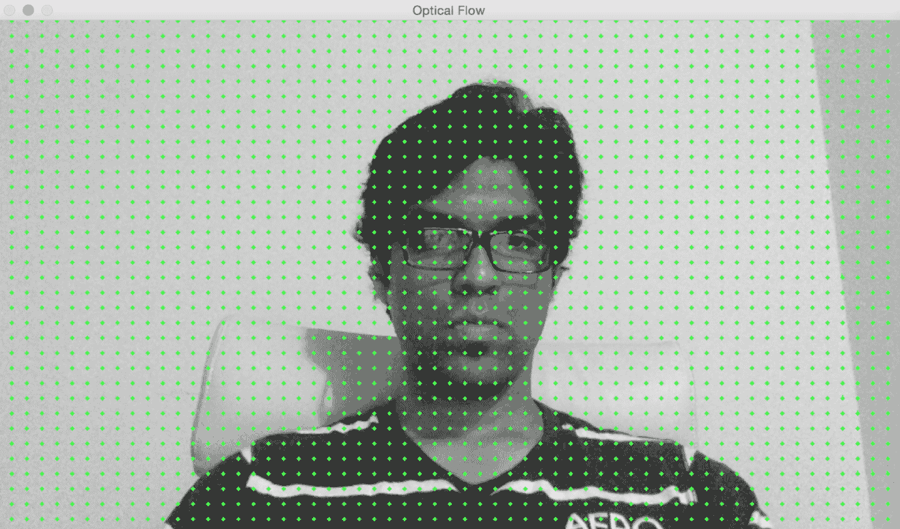

如果我向侧面移动，我们可以看到运动向量是指向水平方向的。这只是在跟踪我的头部运动：

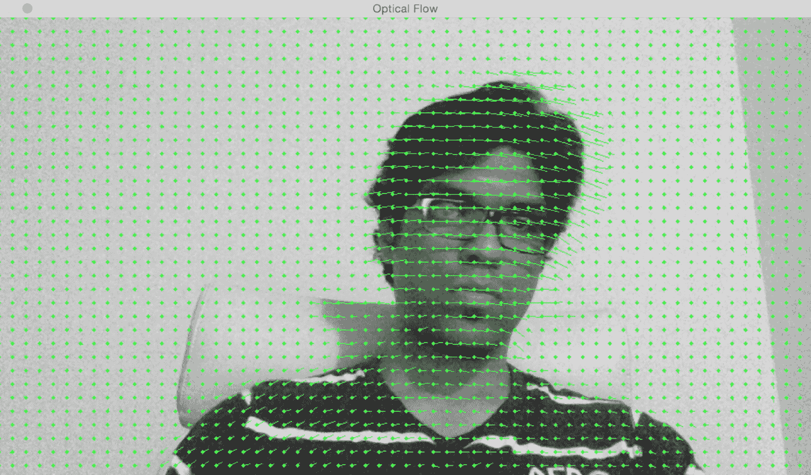

如果我远离摄像头，你可以看到运动向量是指向与图像平面垂直的方向：

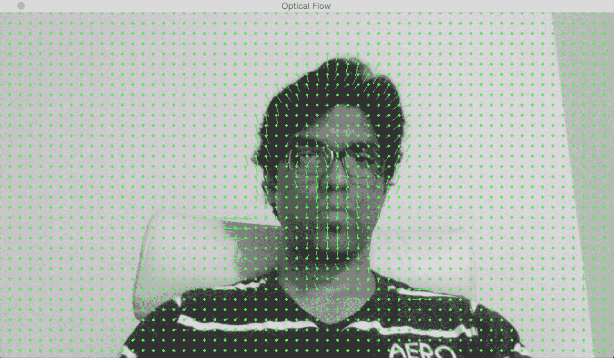

这是使用 Farneback 算法进行基于光流跟踪的代码：

```py
int main(int, char** argv) 
{ 
    // Variable declaration and initialization 

    // Iterate until the user presses the Esc key 
    while(true) 
    { 
        // Capture the current frame 
        cap >> frame; 

        if(frame.empty()) 
            break; 

        // Resize the frame 
        resize(frame, frame, Size(), scalingFactor, scalingFactor, INTER_AREA); 

        // Convert to grayscale 
        cvtColor(frame, curGray, COLOR_BGR2GRAY); 

        // Check if the image is valid 
        if(prevGray.data) 
        { 
            // Initialize parameters for the optical flow algorithm 
            float pyrScale = 0.5; 
            int numLevels = 3; 
            int windowSize = 15; 
            int numIterations = 3; 
            int neighborhoodSize = 5; 
            float stdDeviation = 1.2; 

            // Calculate optical flow map using Farneback algorithm 
            calcOpticalFlowFarneback(prevGray, curGray, flowImage, pyrScale, numLevels, windowSize, numIterations, neighborhoodSize, stdDeviation, OPTFLOW_USE_INITIAL_FLOW); 
```

如我们所见，我们使用 Farneback 算法来计算光流向量。`calcOpticalFlowFarneback`的输入参数对于跟踪质量非常重要。你可以在[`docs.opencv.org/3.0-beta/modules/video/doc/motion_analysis_and_object_tracking.html`](http://docs.opencv.org/3.0-beta/modules/video/doc/motion_analysis_and_object_tracking.html)找到有关这些参数的详细信息。让我们继续在输出图像上绘制这些向量：

```py
            // Convert to 3-channel RGB 
            cvtColor(prevGray, flowImageGray, COLOR_GRAY2BGR); 

            // Draw the optical flow map 
            drawOpticalFlow(flowImage, flowImageGray); 

            // Display the output image 
            imshow(windowName, flowImageGray); 
        } 

        // Break out of the loop if the user presses the Esc key 
        ch = waitKey(10); 
        if(ch == 27) 
            break; 

        // Swap previous image with the current image 
        std::swap(prevGray, curGray); 
    } 

    return 1; 
} 
```

我们使用了一个名为 `drawOpticalFlow` 的函数来绘制那些光流向量。这些向量指示运动的方向。让我们看看这个函数，看看我们是如何绘制这些向量的：

```py
// Function to compute the optical flow map 
void drawOpticalFlow(const Mat& flowImage, Mat& flowImageGray) 
{ 
    int stepSize = 16; 
    Scalar color = Scalar(0, 255, 0); 

    // Draw the uniform grid of points on the input image along with the motion vectors 
    for(int y = 0; y < flowImageGray.rows; y += stepSize) 
    { 
        for(int x = 0; x < flowImageGray.cols; x += stepSize) 
        { 
            // Circles to indicate the uniform grid of points 
            int radius = 2; 
            int thickness = -1; 
            circle(flowImageGray, Point(x,y), radius, color, thickness); 

            // Lines to indicate the motion vectors 
            Point2f pt = flowImage.at<Point2f>(y, x); 
            line(flowImageGray, Point(x,y), Point(cvRound(x+pt.x), cvRound(y+pt.y)), color); 
        } 
    } 
} 
```

# 摘要

在本章中，我们学习了对象跟踪。我们学习了如何使用 HSV 颜色空间跟踪特定颜色的对象。我们讨论了对象跟踪的聚类技术以及如何使用 CAMShift 算法构建一个交互式对象跟踪器。我们研究了角点检测以及如何在实时视频中跟踪角点。我们讨论了如何使用光流在视频中跟踪特征。最后，我们理解了 Lucas-Kanade 和 Farneback 算法背后的概念，然后实现了它们。

在下一章中，我们将讨论分割算法以及我们如何使用它们进行文本识别。
