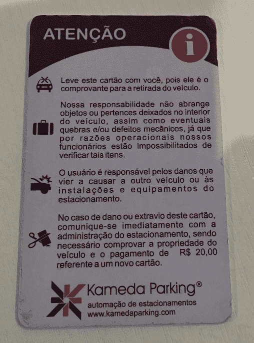
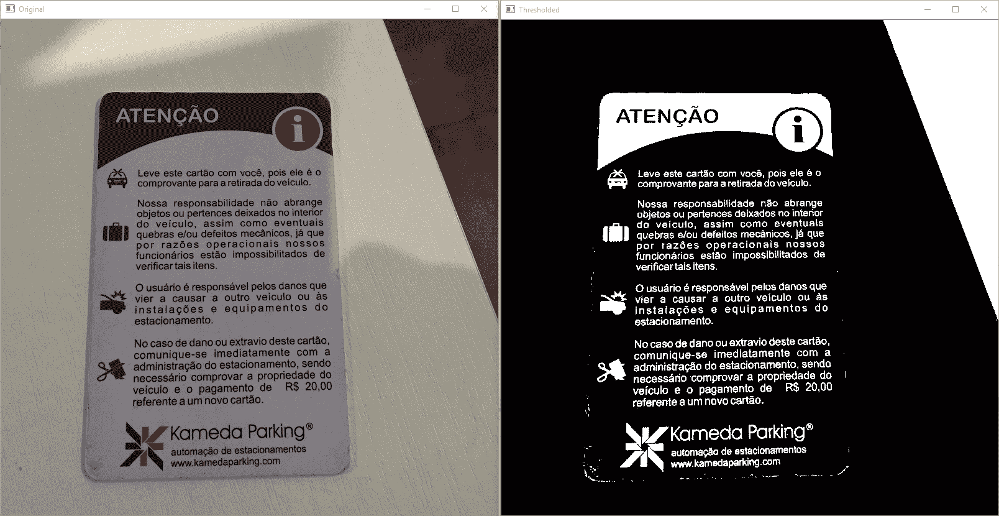
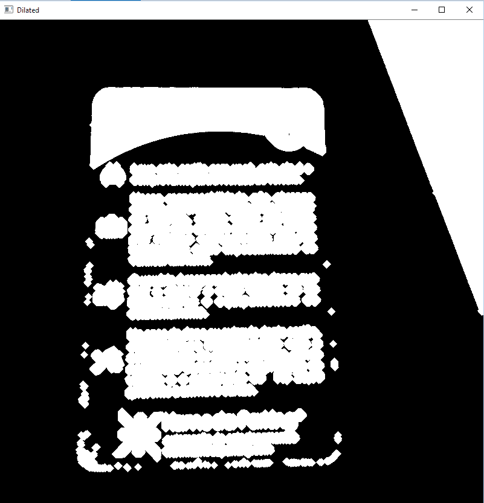
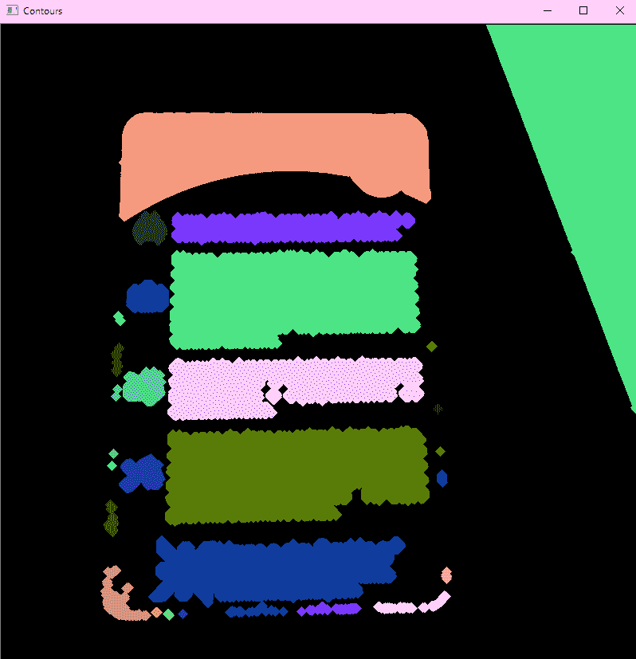
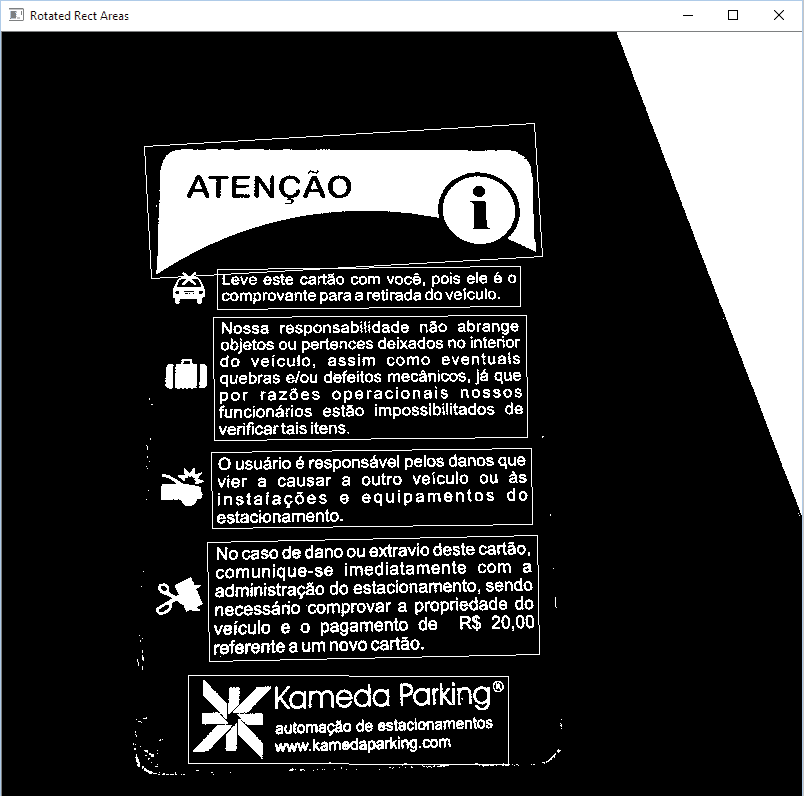
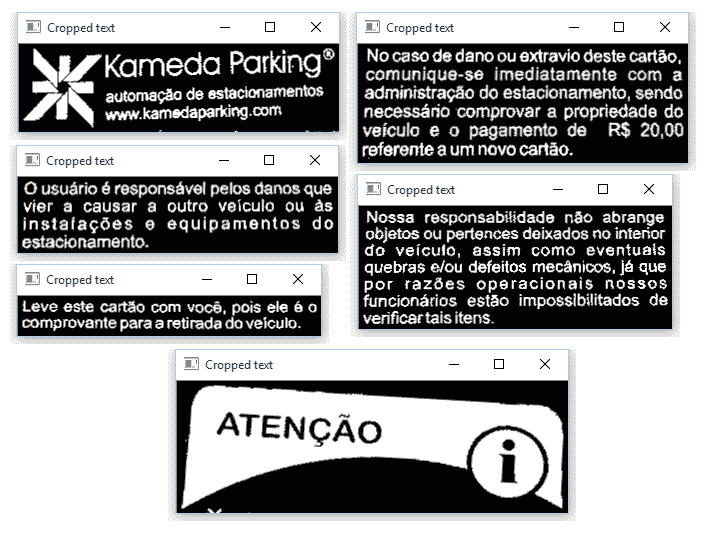

# 第十章：开发用于文本识别的分割算法

在前面的章节中，我们学习了广泛的各种图像处理技术，如阈值、轮廓描述符和数学形态学。在本章中，我们将讨论在处理扫描文档时可能遇到的一些常见问题，例如识别文本位置或调整其旋转。我们还将学习如何结合前面章节中介绍的技术来解决这些问题。到本章结束时，我们将分割出可以发送到 **光学字符识别** (**OCR**) 库的文本区域。

到本章结束时，你应该能够回答以下问题：

+   有哪些类型的 OCR 应用程序？

+   在编写 OCR 应用程序时，常见的难题有哪些？

+   我该如何识别文档的区域？

+   我该如何处理文本中的倾斜和其他中间元素等问题？

+   我该如何使用 Tesseract OCR 来识别我的文本？

# 技术要求

本章需要熟悉基本的 C++ 编程语言。本章中使用的所有代码都可以从以下 GitHub 链接下载：[`github.com/PacktPublishing/Learn-OpenCV-4-By-Building-Projects-Second-Edition/tree/master/Chapter_10`](https://github.com/PacktPublishing/Learn-OpenCV-4-By-Building-Projects-Second-Edition/tree/master/Chapter_10)。代码可以在任何操作系统上执行，尽管它只在 Ubuntu 上进行了测试。

观看以下视频，看看代码的实际应用：

[`bit.ly/2KIoJFX`](http://bit.ly/2KIoJFX)

# 介绍光学字符识别

在图像中识别文本是计算机视觉中一个非常流行的应用。这个过程通常被称为 **光学字符识别**，并分为以下几部分：

+   **文本预处理和分割**：在这个步骤中，计算机必须处理图像噪声、旋转（倾斜）并识别哪些区域是候选文本区域。

+   **文本识别**：这是识别文本中每个字母的过程。尽管这也是一个计算机视觉话题，但在这本书中，我们不会仅使用 OpenCV 展示如何做到这一点。相反，我们将向您展示如何使用 Tesseract 库来完成这一步，因为它集成在 OpenCV 3.0 中。如果您对学习如何自己完成 Tesseract 所做的工作感兴趣，请查看 Packt 的 *Mastering OpenCV* 书籍，其中有一章介绍车牌识别。

预处理和分割阶段可能会因文本来源而大相径庭。让我们看看预处理通常进行的常见情况：

+   **使用扫描仪生产 OCR 应用**: 这是一个非常可靠的文本来源。在这种情况下，图像的背景通常是白色的，文档几乎与扫描仪的边缘对齐。正在扫描的内容基本上是文本，几乎没有任何噪声。这类应用依赖于简单的预处理技术，可以快速调整文本并保持快速的扫描速度。在编写生产 OCR 软件时，通常会将重要文本区域的识别委托给用户，并创建一个用于文本验证和索引的质量管道。

+   **扫描随意拍摄的图片或视频中的文本**: 这是一个更加复杂的场景，因为没有指示文本可能的位置。这种情况被称为**场景文本识别**，OpenCV 4.0 包含一个用于处理此问题的 contrib 库。我们将在第十一章，*使用 Tesseract 进行文本识别*中介绍。通常，预处理器会使用纹理分析技术来识别文本模式。

+   **为历史文本创建生产质量的 OCR**: 历史文本也被扫描，但它们有几个额外的问题，例如由旧纸张颜色和墨水使用产生的噪声。其他常见问题包括装饰字母和特定的文本字体，以及由随着时间的推移被擦除的墨水产生的低对比度内容。为手头的文档编写特定的 OCR 软件并不罕见。

+   **扫描地图、图表和图表**: 地图、图表和图表构成了一个特别困难的场景，因为文本通常以任何方向出现在图像内容中间。例如，城市名称通常成群分布，海洋名称通常沿着国家海岸轮廓线。一些图表颜色很深，文本以清晰和暗色调出现。

OCR 应用策略也根据识别的目标而变化。它将被用于全文搜索吗？或者应该将文本分离成逻辑字段以索引包含结构化搜索信息的数据库？

在本章中，我们将专注于预处理扫描文本或由相机拍摄的文本。我们将考虑文本是图像的主要目的，例如，在一张照片或卡片上，例如，在这张停车票上：



我们将尝试移除常见的噪声，处理文本旋转（如果有），并裁剪可能的文本区域。虽然大多数 OCR API 已经自动执行这些操作——并且可能使用最先进的算法——但了解这些操作背后的原理仍然很有价值。这将使您更好地理解大多数 OCR API 参数，并为您提供有关您可能遇到的潜在 OCR 问题的更好知识。

# 预处理阶段

软件通过将文本与先前记录的数据进行比较来识别字母。如果输入文本清晰、字母处于垂直位置且没有其他元素（例如发送给分类软件的图像），则分类结果可以大大提高。在本节中，我们将学习如何通过使用**预处理**来调整文本。

# 图像阈值化

我们通常通过阈值化图像开始预处理。这消除了所有颜色信息。大多数 OpenCV 函数认为信息是以白色写入的，而背景是黑色的。因此，让我们首先创建一个阈值函数来匹配这些标准：

```py
#include opencv2/opencv.hpp; 
#include vector; 

using namespace std; 
using namespace cv; 

Mat binarize(Mat input)  
{   
   //Uses otsu to threshold the input image 
   Mat binaryImage; 
   cvtColor(input, input, COLOR_BGR2GRAY); 
   threshold(input, binaryImage, 0, 255, THRESH_OTSU); 

   //Count the number of black and white pixels 
   int white = countNonZero(binaryImage); 
   int black = binaryImage.size().area() - white; 

   //If the image is mostly white (white background), invert it 
   return white black ? binaryImage : ~binaryImage; 
}
```

`binarize`函数应用一个阈值，类似于我们在第四章“深入直方图和滤波器”中所做的。但在这里，我们将通过在函数的第四个参数中传递`THRESH_OTSU`来使用 Otsu 方法。Otsu 方法最大化类间方差。由于阈值只创建两个类别（黑色和白色像素），这等同于最小化类内方差。这种方法使用图像直方图。然后，它遍历所有可能的阈值值，并计算阈值两侧像素值的扩散，即图像的背景或前景中的像素。这个过程的目的在于找到使两个扩散之和达到最小值的阈值值。

阈值化完成后，该函数会计算图像中白色像素的数量。黑色像素只是图像中像素的总数，由图像面积给出，减去白色像素计数。由于文本通常是在纯背景上书写的，我们将验证白色像素是否多于黑色像素。在这种情况下，我们处理的是黑色文字在白色背景上，因此我们将图像反转以进行进一步处理。

使用停车票图像进行阈值化处理的结果如下：



# 文本分割

下一步是找到文本的位置并提取它。为此有两种常见的策略：

+   **使用连通分量分析**：在图像中搜索连接像素的组。这将是本章中使用的技巧。

+   **使用分类器搜索先前训练的字母纹理模式**：使用如**Haralick**特征这样的纹理特征，通常使用小波变换。另一种选择是在此任务中识别**最大稳定极值区域**（**MSER**）。这种方法对于复杂背景中的文本更稳健，将在第十一章“使用 Tesseract 进行文本识别”中研究。您可以在 Haralick 特征的官方网站上了解更多信息，网址为[`haralick.org/journals/TexturalFeatures.pdf`](http://haralick.org/journals/TexturalFeatures.pdf)。

# 创建连通区域

如果你仔细观察图像，你会注意到字母总是成块地在一起，由文本段落形成。这让我们提出了一个问题，我们如何检测和移除这些块？

第一步是使这些块更加明显。我们可以通过使用膨胀形态学算子来实现这一点。回想一下第八章，*视频监控*，*背景建模*，*和形态学操作*，膨胀会使图像元素变厚。让我们看看一个小代码片段，它完成了这个任务：

```py
auto kernel = getStructuringElement(MORPH_CROSS, Size(3,3)); 
Mat dilated; 
dilate(input, dilated, kernel, cv::Point(-1, -1), 5); 
imshow("Dilated", dilated); 
```

在前面的代码中，我们首先创建了一个 3 x 3 的十字形核，它将在形态学操作中使用。然后，我们以这个核为中心进行五次膨胀。确切的核大小和次数根据情况而变化。只需确保这些值将同一行上的所有字母粘合在一起即可。

此操作的成果如下截图所示：



注意，我们现在有了巨大的白色块。它们与每段文本完全匹配，也与其他非文本元素匹配，如图像或边缘噪声。

代码附带的票据图像是低分辨率图像。OCR 引擎通常与高分辨率图像（200 或 300 DPI）一起工作，因此可能需要将膨胀应用超过五次。

# 识别段落块

下一步是执行连通组件分析以找到与段落对应的块。OpenCV 有一个用于此目的的函数，我们之前在第五章，*自动光学检测*，*对象分割*，*和检测*中已经使用过。这是`findContours`函数：

```py
vector;vector;Point;contours; 
findContours(dilated, contours, RETR_EXTERNAL, CHAIN_APPROX_SIMPLE);  
```

在第一个参数中，我们传递我们的膨胀图像。第二个参数是检测到的轮廓的向量。然后，我们使用选项仅检索外部轮廓并使用简单近似。图像轮廓如下所示。每种灰度色调代表不同的轮廓：



最后一步是识别每个轮廓的最小旋转边界矩形。OpenCV 提供了一个方便的函数来完成这个操作，称为`minAreaRect`。这个函数接收一个任意点的向量，并返回一个包含边界框的`RoundedRect`。这也是丢弃不需要的矩形的良好机会，即显然不是文本的矩形。由于我们正在为 OCR 制作软件，我们将假设文本包含一组字母。基于这个假设，我们将以下情况中的文本丢弃：

+   矩形宽度或大小太小，即小于 20 像素。这将有助于丢弃边缘噪声和其他小瑕疵。

+   图像的矩形宽度/高度比例小于 2。也就是说，类似于正方形的矩形，如图像图标，或者非常高的矩形，也将被丢弃。

第二个条件中有一个小问题。由于我们处理的是旋转的边界框，我们必须测试边界框的角度是否小于 -45 度。如果是，文本是垂直旋转的，因此我们必须考虑的高度/宽度比例。

让我们通过以下代码来查看一下：

```py
//For each contour 

vector;RotatedRect; areas; 
for (const auto& contour : contours)  
{   
   //Find it's rotated rect 
   auto box = minAreaRect(contour); 

   //Discard very small boxes 
   if (box.size.width 20 || box.size.height 20) 
         continue; 

   //Discard squares shaped boxes and boxes  
   //higher than larger 
   double proportion = box.angle -45.0 ? 
         box.size.height / box.size.width :  
         box.size.width / box.size.height; 

   if (proportion 2)  
         continue; 

   //Add the box 
   areas.push_back(box); 
}
```

让我们看看这个算法选择了哪些框：



这确实是一个很好的结果！

我们应该注意到，在前面代码的第 2 步中描述的算法也会丢弃单个字母。这不是一个大问题，因为我们正在创建一个 OCR 预处理器，并且单个符号通常在没有上下文信息的情况下没有意义；一个这样的例子是页码。由于页码通常单独出现在页面底部，并且文本的大小和比例也会受到影响，因此这个过程会将页码丢弃。但这不会成为问题，因为文本通过 OCR 后，你将得到大量没有任何分页的文本文件。

我们将把所有这些代码放在一个具有以下签名的函数中：

```py
vector RotatedRect; findTextAreas(Mat input)
```

# 文本提取和倾斜调整

现在，我们只需要提取文本并调整文本倾斜。这是通过 `deskewAndCrop` 函数完成的，如下所示：

```py
Mat deskewAndCrop(Mat input, const RotatedRect& box) 
{ 
   double angle = box.angle;      
   auto size = box.size; 

   //Adjust the box angle 
   if (angle -45.0)  
   { 
        angle += 90.0;
         std::swap(size.width, size.height);         
   } 

   //Rotate the text according to the angle 
   auto transform = getRotationMatrix2D(box.center, angle, 1.0); 
   Mat rotated; 
   warpAffine(input, rotated, transform, input.size(), INTER_CUBIC); 

   //Crop the result 
   Mat cropped; 
   getRectSubPix(rotated, size, box.center, cropped); 
   copyMakeBorder(cropped,cropped,10,10,10,10,BORDER_CONSTANT,Scalar(0)); 
   return cropped; 
}
```

首先，我们从读取所需的区域角度和大小开始。正如我们之前看到的，角度可能小于 -45 度。这意味着文本是垂直对齐的，因此我们必须将旋转角度增加 90 度，并切换宽度和高度属性。接下来，我们需要旋转文本。首先，我们创建一个描述旋转的 2D 仿射变换矩阵。我们通过使用 `getRotationMatrix2D` OpenCV 函数来实现这一点。这个函数有三个参数：

+   **CENTER**: 旋转的中心位置。旋转将围绕这个中心旋转。在我们的情况下，我们使用框的中心。

+   **ANGLE**: 旋转角度。如果角度是负数，旋转将以顺时针方向进行。

+   **SCALE**: 各向同性的缩放因子。我们将使用 `1.0`，因为我们想保持框的原始比例不变。

旋转本身是通过使用 `warpAffine` 函数实现的。这个函数有四个必选参数：

+   **SRC**: 要变换的输入 `mat` 数组。

+   **DST**: 目标 `mat` 数组。

+   **M**: 变换矩阵。这个矩阵是一个 2 x 3 的仿射变换矩阵。这可能是一个平移、缩放或旋转矩阵。在我们的情况下，我们只会使用我们最近创建的矩阵。

+   **SIZE**: 输出图像的大小。我们将生成与输入图像大小相同的图像。

以下还有另外三个可选参数：

+   **FLAGS**: 这些指示图像应该如何插值。我们使用 `BICUBIC_INTERPOLATION` 以获得更好的质量。默认为 `LINEAR_INTERPOLATION`。

+   **BORDER**: 边框模式。我们使用默认值，`BORDER_CONSTANT`。

+   **BORDER VALUE**: 边框的颜色。我们使用默认值，即黑色。然后，我们使用 `getRectSubPix` 函数。在我们旋转图像后，我们需要裁剪边界框的矩形区域。此函数接受四个强制参数和一个可选参数，并返回裁剪后的图像：

    +   **IMAGE**: 要裁剪的图像。

    +   **SIZE**: 描述要裁剪的框的宽度和高度的 `cv::Size` 对象。

    +   **CENTER**: 要裁剪区域的中心像素。请注意，由于我们围绕中心旋转，这个点很方便地是相同的。

    +   **PATCH**: 目标图像。

    +   **PATCH_TYPE**: 目标图像的深度。我们使用默认值，表示与源图像相同的深度。

最后一步由 `copyMakeBorder` 函数完成。此函数在图像周围添加边框。这很重要，因为分类阶段通常期望文本周围有边距。函数参数非常简单：输入和输出图像、顶部、底部、左侧和右侧的边框厚度、边框类型以及新边框的颜色。

对于卡片图像，将生成以下图像：



现在，是时候将每个函数组合在一起了。让我们展示以下主要方法：

+   加载票据图像

+   调用我们的二值化函数

+   查找所有文本区域

+   在窗口中显示每个区域

我们将如下展示主要方法：

```py
int main(int argc, char* argv[])  
{ 
   //Loads the ticket image and binarize it 
   auto ticket = binarize(imread("ticket.png"));     
   auto regions = findTextAreas(ticket); 

   //For each region 
   for (const auto& region : regions) { 
         //Crop  
         auto cropped = deskewAndCrop(ticket, region); 

         //Show 
         imshow("Cropped text", cropped); 
         waitKey(0);  
         destroyWindow("Border Skew"); 
   } 
} 
```

对于完整的源代码，请查看本书附带 `segment.cpp` 文件。

# 在您的操作系统上安装 Tesseract OCR

Tesseract 是一个开源的 OCR 引擎，最初由惠普实验室布里斯托尔和惠普公司开发。其所有代码均根据 Apache 许可证授权，并在 GitHub 上托管在 [`github.com/tesseract-ocr`](https://github.com/tesseract-ocr)。它被认为是可用的最准确的 OCR 引擎之一：它可以读取多种图像格式，并且可以将超过 60 种语言的文本转换为文本。在本节中，我们将向您展示如何在 Windows 或 Mac 上安装 Tesseract。由于有大量的 Linux 发行版，我们不会教您如何在操作系统上安装它。通常，Tesseract 在您的软件仓库中提供安装包，因此，在自行编译 Tesseract 之前，只需在那里搜索即可。

# 在 Windows 上安装 Tesseract

Tesseract 使用 **C++ 归档网络**（**CPPAN**）作为其依赖项管理器。要安装 Tesseract，请按照以下步骤操作。

# 构建最新库

1.  从 [`cppan.org/client/`](https://cppan.org/client/) 下载最新的 CPPAN 客户端。

1.  在命令行中运行

    `cppan --build pvt.cppan.demo.google.tesseract.tesseract-master`。

# 在 Visual Studio 中设置 Tesseract

1.  在[`github.com/Microsoft/vcpkg`](https://github.com/Microsoft/vcpkg)设置`vcpkg`，Visual C++包管理器。

1.  对于 64 位编译，使用`vcpkg install tesseract:x64-windows`。你也可以为 master 分支添加`--head`。

# 静态链接

还可以在你的项目中静态链接{Tesseract}([`github.com/tesseract-ocr/tesseract/wiki/Compiling#static-linking`](https://github.com/tesseract-ocr/tesseract/wiki/Compiling#static-linking))。这将避免`dlls`与你的可执行文件一起打包。为此，使用与之前相同的`vcpkg`，对于 32 位安装使用以下命令：

```py
vcpkg install tesseract:x86-windows-static
```

或者，你可以使用以下命令进行 64 位安装：

```py
vckpg install tesseract:x64-windows-static
```

# 在 Mac 上安装 Tesseract

在 Mac 上安装 Tesseract OCR 最简单的方法是使用**Homebrew**。如果你还没有安装 Homebrew，只需访问 Homebrew 的网站([`brew.sh/`](http://brew.sh/))，打开你的控制台，并运行首页上的**Ruby 脚本**。你可能需要输入管理员密码。

安装 Homebrew 后，只需输入以下命令：

```py
brew install tesseract
```

英语语言已经包含在这个安装中。如果你想安装其他语言包，只需运行以下命令：

```py
brew install tesseract --all-languages 
```

这将安装所有语言包。然后，只需转到 Tesseract 安装目录，删除任何不需要的语言。Homebrew 通常在`/usr/local/`目录中安装东西。

# 使用 Tesseract OCR 库

虽然{Tesseract OCR}已经与 OpenCV 3.0 集成，但仍然值得研究其 API，因为它允许对 Tesseract 参数进行更细粒度的控制。这种集成将在第十一章文本识别与 Tesseract 中进行研究。

# 创建一个 OCR 函数

我们将修改之前的示例以使用 Tesseract。首先，将`tesseract/baseapi.h`和`fstream`添加到`include`列表中：

```py
#include opencv2/opencv.hpp; 
#include tesseract/baseapi.h; 

#include vector; 
#include fstream; 
```

然后，我们将创建一个全局的`TessBaseAPI`对象，它代表我们的 Tesseract OCR 引擎：

```py
tesseract::TessBaseAPI ocr; 
```

`ocr`引擎是完全自包含的。如果你想创建一个多线程的 OCR 软件，只需在每个线程中添加一个不同的`TessBaseAPI`对象，执行将相当线程安全。你只需要确保文件写入不是在同一个文件上，否则你需要确保这个操作的安全性。

接下来，我们将创建一个名为**识别文本**(`identifyText`)的函数，该函数将运行`ocr`：

```py
const char* identifyText(Mat input, const char* language = "eng")  
{   
   ocr.Init(NULL, language, tesseract::OEM_TESSERACT_ONLY);     
   ocr.SetPageSegMode(tesseract::PSM_SINGLE_BLOCK); 
   ocr.SetImage(input.data, input.cols, input.rows, 1, input.step); 

   const char* text = ocr.GetUTF8Text(); 
   cout  "Text:"  endl; 
   cout  text  endl; 
   cout  "Confidence: "  ocr.MeanTextConf() endl; 

    // Get the text     
   return text; 
} 
```

让我们逐行解释这个函数。在第一行，我们首先初始化`tesseract`。这是通过调用`Init`函数来完成的。这个函数有以下签名：

```py
int Init(const char* datapath, const char* language, 
 OcrEngineMode oem)
```

让我们逐个解释每个参数：

+   `datapath`: 这是`tessdata`文件根目录的路径。路径必须以反斜杠`/`字符结尾。`tessdata`目录包含您安装的语言文件。将`NULL`传递给此参数将使`tesseract`搜索其安装目录，这是该文件夹通常所在的位置。在部署应用程序时，通常将此值更改为`args[0]`，并将`tessdata`文件夹包含在您的应用程序路径中。

+   `language`: 这是一个表示语言代码的三字母词（例如，eng 表示英语，por 表示葡萄牙语，或 hin 表示印地语）。Tesseract 可以通过使用`+`符号加载多个语言代码。因此，传递`eng+por`将加载英语和葡萄牙语。当然，您只能使用您之前安装的语言，否则加载过程将失败。语言配置文件可能指定必须一起加载两种或多种语言。为了防止这种情况，您可以使用波浪号`~`。例如，您可以使用`hin+~eng`来确保即使配置了这样做，也不会将英语与印地语一起加载。

+   `OcrEngineMode`: 这些是将要使用的 OCR 算法。它可以有以下值之一：

    +   `OEM_TESSERACT_ONLY`: 仅使用`tesseract`。这是最快的方法，但精度较低。

    +   `OEM_CUBE_ONLY`: 使用 Cube 引擎。它较慢，但更精确。这仅在您的语言被训练以支持此引擎模式时才会工作。要检查是否如此，请查看`tessdata`文件夹中您语言的`.cube`文件。对英语语言的支持是保证的。

    +   `OEM_TESSERACT_CUBE_COMBINED`: 这结合了 Tesseract 和 Cube 以实现最佳的 OCR 分类。此引擎具有最佳精度和最慢的执行时间。

    +   `OEM_DEFAULT`: 这基于语言配置文件、命令行配置文件推断策略，如果两者都不存在，则使用`OEM_TESSERACT_ONLY`。

需要强调的是，`Init`函数可以执行多次。如果提供了不同的语言或引擎模式，Tesseract 将清除之前的配置并重新开始。如果提供了相同的参数，Tesseract 足够智能，可以简单地忽略该命令。`init`函数在成功时返回`0`，在失败时返回`-1`。

然后我们的程序将通过设置页面分割模式继续进行：

```py
ocr.SetPageSegMode(tesseract::PSM_SINGLE_BLOCK); 
```

有几种分割模式可用：

+   `PSM_OSD_ONLY`: 使用此模式，Tesseract 将仅运行其预处理算法以检测方向和脚本检测。

+   `PSM_AUTO_OSD`: 这指示 Tesseract 进行带有方向和脚本检测的自动页面分割。

+   `PSM_AUTO_ONLY`: 这进行页面分割，但避免进行方向、脚本检测或 OCR。

+   `PSM_AUTO`: 这进行页面分割和 OCR，但避免进行方向或脚本检测。

+   `PSM_SINGLE_COLUMN`: 这假设可变大小的文本显示在单列中。

+   `PSM_SINGLE_BLOCK_VERT_TEXT`: 这将图像视为一个单一生均匀垂直对齐文本块。

+   `PSM_SINGLE_BLOCK`: 这假设有一个单独的文本块，并且是默认配置。我们将使用此标志，因为我们的预处理阶段保证了这种条件。

+   `PSM_SINGLE_LINE`: 表示图像只包含一行文本。

+   `PSM_SINGLE_WORD`: 表示图像只包含一个单词。

+   `PSM_SINGLE_WORD_CIRCLE`: 通知我们图像是一个圆形中仅有一个单词。

+   `PSM_SINGLE_CHAR`: 表示图像包含单个字符。

注意，Tesseract 已经实现了**倾斜校正**和文本分割算法，就像大多数 OCR 库一样。但了解这些算法是有趣的，因为你可以为特定需求提供自己的预处理阶段。这允许你在许多情况下提高文本检测。例如，如果你正在为旧文档创建 OCR 应用程序，Tesseract 默认使用的阈值可能会创建一个深色背景。Tesseract 也可能被边缘或严重的文本倾斜所困惑。

接下来，我们使用以下签名调用`SetImage`方法：

```py
void SetImage(const unsigned char* imagedata, int width, 
 int height, int bytes_per_pixel, int bytes_per_line);
```

参数几乎都是自我解释的，并且大多数都可以直接从我们的`Mat`对象中读取：

+   `data`: 包含图像数据的原始字节数组。OpenCV 在`Mat`类中包含一个名为`data()`的函数，它提供对数据的直接指针。

+   `width`: 图像宽度。

+   `height`: 图像高度。

+   `bytes_per_pixel`: 每个像素的字节数。由于我们处理的是二进制图像，我们使用`1`。如果你想使代码更通用，你也可以使用`Mat::elemSize()`函数，它提供相同的信息。

+   `bytes_per_line`: 单行中的字节数。我们使用`Mat::step`属性，因为某些图像添加了尾随字节。

然后，我们调用`GetUTF8Text`来运行识别本身。识别的文本返回，使用 UTF8 编码且不带 BOM。在返回之前，我们还打印了一些调试信息。

`MeanTextConf` 返回一个置信度指数，可能是一个从`0`到`100`的数字：

```py
   auto text = ocr.GetUTF8Text(); 
   cout  "Text:"  endl; 
   cout  text  endl; 
   cout  "Confidence: "  ocr.MeanTextConf()  endl; 
```

# 将输出发送到文件

让我们将主方法更改为将识别输出发送到文件。我们通过使用标准`ofstream`来完成此操作：

```py
int main(int argc, char* argv[])  
{ 
   //Loads the ticket image and binarize it 
   Mat ticket = binarize(imread("ticket.png"));     
   auto regions = findTextAreas(ticket); 

   std::ofstream file;  
   file.open("ticket.txt", std::ios::out | std::ios::binary); 

   //For each region 
   for (const auto& region : regions) { 
         //Crop  
         auto cropped = deskewAndCrop(ticket, region); 
         auto text = identifyText(cropped, "por"); 

         file.write(text, strlen(text)); 
         file endl; 
   } 

   file.close(); 
} 
```

以下行以二进制模式打开文件：

```py
file.open("ticket.txt", std::ios::out | std::ios::binary); 
```

这很重要，因为 Tesseract 返回的文本使用 UTF-8 编码，考虑到 Unicode 中可用的特殊字符。我们还将输出直接使用以下命令写入：

```py
file.write(text, strlen(text)); 
```

在这个示例中，我们使用葡萄牙语作为输入语言调用了`identify`函数（这是票证所写的语言）。如果你喜欢，可以使用另一张照片。

完整的源代码文件包含在`segmentOcr.cpp`文件中，该文件与本书一起提供。

`ticket.png` 是一个低分辨率图像，因为我们想象你在学习这段代码时可能想要显示一个包含图像的窗口。对于这个图像，Tesseract 的结果相当差。如果你想使用更高分辨率的图像进行测试，本书提供的代码为你提供了一个 `ticketHigh.png` 图像。要使用这个图像进行测试，将膨胀重复次数改为 `12`，并将最小框大小从 `20` 改为 `60`。你将获得更高的置信率（大约 87%），并且生成的文本将几乎完全可读。`segmentOcrHigh.cpp` 文件包含这些修改。

# 摘要

在本章中，我们简要介绍了 OCR 应用。我们了解到，这类系统的预处理阶段必须根据我们计划识别的文档类型进行调整。我们学习了在预处理文本文件时的常见操作，例如阈值处理、裁剪、倾斜和文本区域分割。最后，我们学习了如何安装和使用 Tesseract OCR 将我们的图像转换为文本。

在下一章中，我们将使用更高级的 OCR 技术来识别随意拍摄的图片或视频中的文本——这种情况被称为场景文本识别。这是一个更为复杂的场景，因为文本可能出现在任何位置，使用任何字体，并且具有不同的照明和方向。甚至可能完全没有文本！我们还将学习如何使用与 Tesseract 完全集成的 OpenCV 3.0 文本贡献模块。
