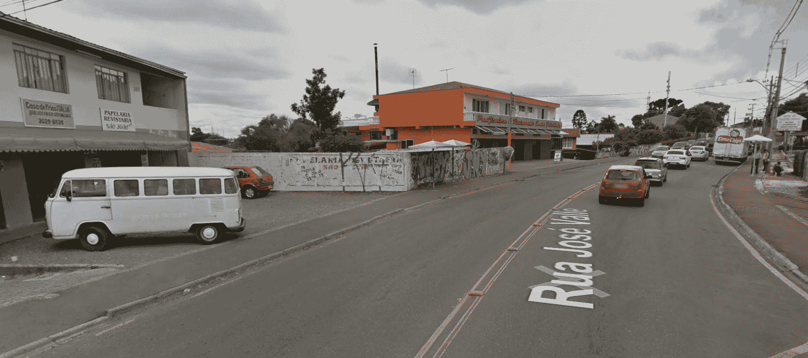
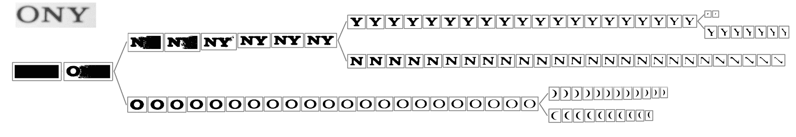
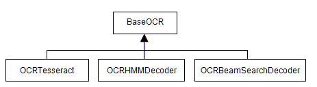
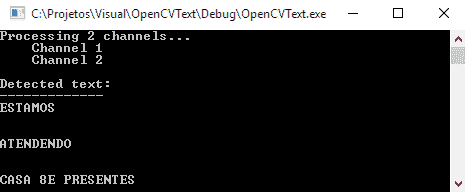

# 使用 Tesseract 进行文本识别

在第十章，*为文本识别开发分割算法*中，我们介绍了非常基础的 OCR 处理函数。虽然它们对于扫描或拍摄的文档非常有用，但当处理图片中随意出现的文本时，它们几乎毫无用处。

在本章中，我们将探讨 OpenCV 4.0 文本模块，该模块专门用于场景文本检测。使用此 API，可以检测出现在网络摄像头视频中的文本，或分析照片图像（如街景或监控摄像头拍摄的图像）以实时提取文本信息。这允许创建广泛的应用程序，从无障碍、营销甚至机器人领域。

到本章结束时，你将能够做到以下几件事情：

+   理解场景文本识别是什么

+   理解文本 API 的工作原理

+   使用 OpenCV 4.0 文本 API 检测文本

+   将检测到的文本提取到图像中

+   使用文本 API 和 Tesseract 集成来识别字母

# 技术要求

本章需要熟悉基本的 C++ 编程语言。本章中使用的所有代码都可以从以下 GitHub 链接下载：[`github.com/PacktPublishing/Learn-OpenCV-4-By-Building-Projects-Second-Edition/tree/master/Chapter_11`](https://github.com/PacktPublishing/Learn-OpenCV-4-By-Building-Projects-Second-Edition/tree/master/Chapter_11)。代码可以在任何操作系统上执行，尽管它仅在 Ubuntu 上进行了测试。

查看以下视频，看看代码的实际应用：

[`bit.ly/2Slht5A`](http://bit.ly/2Slht5A)

# 文本 API 的工作原理

文本 API 实现了在 2012 年 **计算机视觉和模式识别**（**CVPR**）会议期间由 *Lukás Neumann* 和 *Jiri Matas* 在文章 *Real*-*Time Scene Text Localization and Recognition* 中提出的算法。该算法在场景文本检测方面取得了显著进步，在 CVPR 数据库以及 Google Street View 数据库中都实现了最先进的检测。在使用 API 之前，让我们看看这个算法在幕后是如何工作的，以及它是如何解决场景文本检测问题的。

**记住**：OpenCV 4.0 文本 API 不包含在标准 OpenCV 模块中。它是一个存在于 OpenCV `contrib` 包中的附加模块。如果你使用 Windows 安装程序安装了 OpenCV，你应该回顾一下第一章，*开始使用 OpenCV；*这将指导你如何安装这些模块。

# 场景检测问题

检测场景中随机出现的文本是一个比看上去更难的问题。当你将检测到的文本与已识别的扫描文本进行比较时，需要考虑以下几个新变量：

+   **三维性**：文本可以以任何比例、方向或透视出现。此外，文本可能部分遮挡或中断。实际上有成千上万的可能性，文本可能出现在图像中的任何区域。

+   **多样性**：文本可以有多种不同的字体和颜色。字体可能有轮廓边框。背景可以是深色、浅色或复杂的图像。

+   **光照和阴影**：阳光的位置和外观颜色会随时间变化。不同的天气条件，如雾或雨，可以产生噪声。即使在封闭空间中，光照也可能成为问题，因为光线会在彩色物体上反射并击中文本。

+   **模糊**：文本可能出现在镜头自动对焦不优先考虑的区域。在移动相机、透视文本或雾的存在下，模糊也很常见。

以下图片，来自谷歌街景，说明了这些问题。注意这些情况如何在单一图像中同时发生：



对此类情况进行文本检测可能计算成本高昂，因为有 **2*^n*** 个像素子集，其中 ***n*** 是图像中的像素数量。

为了降低复杂性，通常采用两种策略：

+   **使用滑动窗口搜索图像矩形的子集**：这种策略只是将子集的数量减少到更小的数量。区域的数量根据考虑的文本复杂性而变化。仅处理文本旋转的算法可能使用较小的值，而同时处理旋转、倾斜、透视等的算法则可能使用较大的值。这种方法的优点在于其简单性，但它们通常仅限于较窄的字体范围，并且通常限于特定单词的词汇表。

+   **使用连通分量分析**：这种方法假设像素可以分组到具有相似属性的区域内。这些区域更有可能被识别为字符。这种方法的优点是它不依赖于多个文本属性（方向、缩放、字体等），并且它们还提供了一个可以用于裁剪文本到 OCR 的分割区域。这是我们第十章中使用的方法，*开发文本识别的分割算法*。光照也可能影响结果，例如，如果字母上投下阴影，会形成两个不同的区域。然而，由于场景检测通常用于移动车辆（例如，无人机或汽车）和视频中，由于这些光照条件会逐帧变化，文本最终会被检测到。

OpenCV 4.0 算法通过执行连通分量分析和搜索极端区域来使用第二种策略。

# 极端区域

极端区域是具有几乎均匀强度且被对比度背景包围的连通区域。一个区域的不变性可以通过计算该区域对阈值变化的抵抗程度来衡量。这种变化可以通过一个简单的算法来测量：

1.  应用阈值，生成一个图像，*A*。检测其连通像素区域（极端区域）。

1.  将阈值增加一个 delta 数量，生成一个图像，*B*。检测其连通像素区域（极端区域）。

1.  将图像 *B* 与 *A* 进行比较。如果图像 A 中的区域与图像 *B* 中相同的区域相似，则将其添加到树中的同一分支。相似性的标准可能因实现而异，但通常与图像面积或一般形状有关。如果图像 *A* 中的区域在图像 *B* 中看起来被分割，则在树中为新的区域创建两个新的分支，并将其与上一个分支关联。

1.  将集合 *A* 设置为 *B* 并返回步骤 2，直到应用最大阈值。

这将按照以下方式组装一个区域树：



对抗变化的能力是通过计算同一级别的节点数量来确定的。通过分析这个树，还可以确定**最大稳定极端区域**（**MSER**s），即在广泛的各种阈值下面积保持稳定的区域。在之前的图中，很明显这些区域将包含字母 ***O***、***N*** 和 ***Y***。最大极端区域的缺点是它们在模糊存在时较弱。OpenCV 在 **feature2d** 模块中提供了一个 MSER 特征检测器。极端区域很有趣，因为它们对光照、尺度和方向具有很强的不变性。它们也是文本的良好候选者，因为它们对字体类型也不敏感，即使字体有样式。每个区域也可以进行分析以确定其边界椭圆，并具有如仿射变换和面积等数值确定的属性。最后，值得一提的是，整个过程非常快，这使得它非常适合实时应用。

# 极端区域过滤

虽然 MSERs 是定义哪些极端区域值得工作的常见方法，但*Neumann*和*Matas*算法采用不同的方法，通过将所有极端区域提交给一个为字符检测而训练的顺序分类器。这个分类器在两个不同的阶段工作：

1.  第一阶段逐步计算每个区域的描述符（边界框、周长、面积和欧拉数）。这些描述符被提交给一个分类器，该分类器估计该区域成为字母表中字符的可能性。然后，只选择高概率的区域进入第二阶段。

1.  在这个阶段，计算整个区域比率、凸包比率和外部边界拐点数量。这提供了更多详细的信息，使分类器能够丢弃非文本字符，但它们的计算速度也慢得多。

在 OpenCV 中，这个过程是通过一个名为`ERFilter`的类实现的。也可以使用不同的图像单通道投影，例如*R*、*G*、*B*、亮度或灰度转换来提高字符识别率。最后，所有字符都必须被分组到文本块中（如单词或段落）。OpenCV 3.0 为此提供了两个算法：

+   **剪枝穷举搜索**：2011 年由*Mattas*提出，这个算法不需要任何先前的训练或分类，但仅限于水平对齐的文本

+   **面向文本的分层方法**：这处理任何方向的文本，但需要一个训练好的分类器

注意，由于这些操作需要分类器，因此还需要提供训练集作为输入。OpenCV 4.0 在以下示例包中提供了一些这些训练集：[`github.com/opencv/opencv_contrib/tree/master/modules/text/samples`](https://github.com/opencv/opencv_contrib/tree/master/modules/text/samples)。

这也意味着这个算法对分类器训练中使用的字体敏感。

以下视频展示了该算法的演示，由 Neumann 本人提供：[`www.youtube.com/watch?v=ejd5gGea2Fo&feature=youtu.be`](https://www.youtube.com/watch?v=ejd5gGea2Fo&feature=youtu.be)。一旦文本被分割，只需将其发送到 OCR 如 Tesseract，类似于我们在第十章，*开发用于文本识别的分割算法*中所做的那样。唯一的区别是现在我们将使用 OpenCV 文本模块类与 Tesseract 接口，因为它们提供了一种封装我们使用特定 OCR 引擎的方法。

# 使用文本 API

理论已经足够。现在是时候看看文本模块在实际中是如何工作的了。让我们研究一下我们如何使用它来进行文本检测、提取和识别。

# 文本检测

让我们首先创建一个简单的程序，这样我们就可以使用**ERFilters**进行文本分割。在这个程序中，我们将使用文本 API 示例中的训练分类器。您可以从 OpenCV 仓库中下载这些示例，但它们也包含在这本书的配套代码中。

首先，我们开始包括所有必要的`libs`和`usings`：

```py
#include  "opencv2/highgui.hpp" 
#include  "opencv2/imgproc.hpp" 
#include  "opencv2/text.hpp" 

#include  <vector> 
#include  <iostream> 

using namespace std; 
using namespace cv; 
using namespace cv::text; 
```

从*极值区域过滤*部分回忆起，`ERFilter`在每个图像通道中独立工作。因此，我们必须提供一种方法来分别在每个不同的单通道`cv::Mat`中分离每个所需的通道。这是通过`separateChannels`函数实现的：

```py
vector<Mat> separateChannels(const Mat& src)  
{ 
   vector<Mat> channels; 
   //Grayscale images 
   if (src.type() == CV_8U || src.type() == CV_8UC1) { 
         channels.push_back(src); 
         channels.push_back(255-src); 
         return channels; 
   } 

   //Colored images 
   if (src.type() == CV_8UC3) { 
         computeNMChannels(src, channels); 
         int size = static_cast<int>(channels.size())-1; 
         for (int c = 0; c < size; c++) 
               channels.push_back(255-channels[c]); 
         return channels; 
   } 

   //Other types 
   cout << "Invalid image format!" << endl; 
   exit(-1);    
}
```

首先，我们验证图像是否已经是单通道图像（灰度图像）。如果是这种情况，我们只需添加此图像——它不需要处理。否则，我们检查它是否是**RGB**图像。对于彩色图像，我们调用`computeNMChannels`函数将图像分割成几个通道。此函数定义如下：

```py
void computeNMChannels(InputArray src, OutputArrayOfArrays channels, int mode = ERFILTER_NM_RGBLGrad); 
```

以下是其参数：

+   `src`: 源输入数组。它必须是一个 8UC3 类型的彩色图像。

+   `channels`: 一个`Mats`向量，其中将填充结果通道。

+   `mode`: 定义将计算哪些通道。可以使用两个可能的值：

    +   `ERFILTER_NM_RGBLGrad`: 表示算法是否将使用 RGB 颜色、亮度和梯度幅度作为通道（默认）

    +   `ERFILTER_NM_IHSGrad`: 表示图像是否将根据其强度、色调、饱和度和梯度幅度进行分割

我们还添加了向量中所有颜色成分的负值。由于图像将具有三个不同的通道（*R*、*G*和*B*），这通常就足够了。也可以添加非反转通道，就像我们处理去灰度图像时做的那样，但最终我们会得到六个通道，这可能会很费计算机资源。当然，您可以自由地测试您的图像，看看这是否能带来更好的结果。最后，如果提供了另一种类型的图像，函数将以错误消息终止程序。

负值被添加，因此算法将覆盖暗背景中的亮文本和亮背景中的暗文本。添加梯度幅度的负值没有意义。

让我们继续主方法。我们将使用此程序来分割`easel.png`图像，该图像与源代码一起提供：


这张照片是在我走在街上时用手机摄像头拍摄的。让我们编写代码，以便您也可以通过在第一个程序参数中提供其名称来轻松地使用不同的图像：

```py
int main(int argc, const char * argv[]) 
{ 
   const char* image = argc < 2 ? "easel.png" : argv[1];     
   auto input = imread(image); 
```

接下来，我们将调用`separateChannels`函数将图像转换为灰度并分离其通道：

```py
   Mat processed; 
   cvtColor(input, processed, COLOR_RGB2GRAY); 

   auto channels = separateChannels(processed); 
```

如果你想处理彩色图像中的所有通道，只需将此代码片段的前两行替换为以下内容：

```py
Mat processed = input;
```

我们需要分析六个通道（RGB 和反转），而不是两个（灰度和反转）。实际上，处理时间将增加得比我们可以获得的改进更多。有了这些通道，我们需要为算法的两个阶段创建`ERFilters`。幸运的是，OpenCV 文本贡献模块提供了相应的函数：

```py
// Create ERFilter objects with the 1st and 2nd stage classifiers 
auto filter1 = createERFilterNM1(
     loadClassifierNM1("trained_classifierNM1.xml"),  15, 0.00015f,  
    0.13f, 0.2f,true,0.1f); 

auto filter2 = createERFilterNM2(      
     loadClassifierNM2("trained_classifierNM2.xml"),0.5); 

```

对于第一阶段，我们调用`loadClassifierNM1`函数来加载先前训练的分类模型。包含训练数据的.xml 文件是其唯一参数。然后，我们调用`createERFilterNM1`来创建一个`ERFilter`类的实例，该实例将执行分类。该函数具有以下签名：

```py
Ptr<ERFilter> createERFilterNM1(const Ptr<ERFilter::Callback>& cb, int thresholdDelta = 1, float minArea = 0.00025, float maxArea = 0.13, float minProbability = 0.4, bool nonMaxSuppression = true, float minProbabilityDiff = 0.1); 
```

此函数的参数如下：

+   `cb`：分类模型。这是与`loadCassifierNM1`函数一起加载的相同模型。

+   `thresholdDelta`：在每次算法迭代中要加到阈值上的量。默认值是`1`，但我们在示例中会使用`15`。

+   `minArea`：可能找到文本的**极端区域**（**ER**）的最小面积。这是按图像大小的百分比来衡量的。面积小于此的 ER 将被立即丢弃。

+   `maxArea`：可能找到文本的 ER 的最大面积。这也按图像大小的百分比来衡量。面积大于此的 ER 将被立即丢弃。

+   `minProbability`：一个区域必须具有的最小概率，才能作为字符保留到下一阶段。

+   `nonMaxSupression`：用于指示是否在每个分支概率中执行非最大抑制。

+   `minProbabilityDiff`：最小和最大极端区域之间的最小概率差异。

第二阶段的处理过程类似。我们调用`loadClassifierNM2`来加载第二阶段的分类器模型，并调用`createERFilterNM2`来创建第二阶段的分类器。此函数仅接受加载的分类模型的输入参数以及一个区域必须达到的最小概率，才能被认为是字符。因此，让我们在每个通道中调用这些算法来识别所有可能的文本区域：

```py
//Extract text regions using Newmann & Matas algorithm 
cout << "Processing " << channels.size() << " channels..."; 
cout << endl; 
vector<vector<ERStat> > regions(channels.size()); 
for (int c=0; c < channels.size(); c++) 
{ 
    cout << "    Channel " << (c+1) << endl; 
    filter1->run(channels[c], regions[c]); 
    filter2->run(channels[c], regions[c]);          
}     
filter1.release(); 
filter2.release(); 
```

在前面的代码中，我们使用了`ERFilter`类的`run`函数。此函数接受两个参数：

+   **输入通道**：这包括要处理的图像。

+   **区域**：在第一阶段算法中，此参数将被填充为检测到的区域。在第二阶段（由`filter2`执行），此参数必须包含第一阶段选定的区域。这些区域将在第二阶段进行处理和过滤。

最后，我们释放这两个过滤器，因为程序中不再需要它们。最终的分割步骤是将所有 ER 区域分组到可能的单词中，并定义它们的边界框。这是通过调用`erGrouping`函数来完成的：

```py
//Separate character groups from regions 
vector< vector<Vec2i> > groups; 
vector<Rect> groupRects; 
erGrouping(input, channels, regions, groups, groupRects, ERGROUPING_ORIENTATION_HORIZ); 
```

此函数具有以下签名：

```py
void erGrouping(InputArray img, InputArrayOfArrays channels, std::vector<std::vector<ERStat> > &regions, std::vector<std::vector<Vec2i> > &groups, std::vector<Rect> &groups_rects, int method = ERGROUPING_ORIENTATION_HORIZ, const std::string& filename = std::string(), float minProbablity = 0.5); 
```

让我们看看每个参数的含义：

+   `img`：输入图像，也称为原始图像。

+   `regions`：提取区域的单通道图像向量。

+   `groups`：分组区域的索引输出向量。每个组区域包含单个单词的所有极端区域。

+   `groupRects`：一个包含检测到的文本区域的矩形列表。

+   `method`：这是分组的方法。它可以是指定的以下任何一种：

    +   `ERGROUPING_ORIENTATION_HORIZ`：默认值。这仅通过穷举搜索生成具有水平方向文本的组，正如最初由*Neumann*和*Matas*提出的。

    +   `ERGROUPING_ORIENTATION_ANY`: 这会生成包含任意方向文本的组，使用单链接聚类和分类器。如果你使用这种方法，必须在下一个参数中提供分类器模型的文件名。

    +   `Filename`: 分类器模型的名称。这仅在选择了`ERGROUPING_ORIENTATION_ANY`时需要。

    +   `minProbability`: 接受一个组的最低检测概率。这也仅在选择了`ERGROUPING_ORIENTATION_ANY`时需要。

代码还提供了一个对第二个方法的调用，但已被注释掉。你可以在这两个之间切换以测试这个功能。只需注释掉上一个调用并取消注释这个调用：

```py
erGrouping(input, channels, regions,  
    groups, groupRects, ERGROUPING_ORIENTATION_ANY,  
    "trained_classifier_erGrouping.xml", 0.5); 
```

对于这个调用，我们还使用了文本模块示例包中提供的默认训练好的分类器。最后，我们绘制区域框并显示结果：

```py
// draw groups boxes  
for (const auto& rect : groupRects) 
    rectangle(input, rect, Scalar(0, 255, 0), 3); 

imshow("grouping",input); 
waitKey(0);
```

这个程序输出以下结果：


你可以在`detection.cpp`文件中查看整个源代码。

虽然大多数 OpenCV 文本模块函数都编写为支持灰度和彩色图像作为其输入参数，但在撰写本书时，存在一些错误阻止我们在`erGrouping`等函数中使用灰度图像。有关更多信息，请查看以下 GitHub 链接：[`github.com/Itseez/opencv_contrib/issues/309`](https://github.com/Itseez/opencv_contrib/issues/309)。[总是记住，OpenCV contrib 模块包不如默认的 OpenCV 包稳定。](https://github.com/Itseez/opencv_contrib/issues/309)

# 文本提取

现在我们已经检测到了区域，我们必须在提交给 OCR 之前裁剪文本。我们可以简单地使用像`getRectSubpix`或`Mat::copy`这样的函数，使用每个区域矩形作为**感兴趣区域**（**ROI**），但由于字母是倾斜的，一些不需要的文本也可能被裁剪掉。例如，如果我们只是基于给定的矩形提取 ROI，以下是一个区域的外观：


幸运的是，`ERFilter`为我们提供了一个名为`ERStat`的对象，它包含每个极值区域内的像素。有了这些像素，我们可以使用 OpenCV 的`floodFill`函数来重建每个字母。这个函数能够根据种子点绘制类似颜色的像素，就像大多数绘图应用程序中的**水桶**工具一样。这个函数的签名如下：

```py
int floodFill(InputOutputArray image, InputOutputArray mask,  Point seedPoint, Scalar newVal, 
 CV_OUT Rect* rect=0, Scalar loDiff = Scalar(), Scalar upDiff = Scalar(), int flags = 4 ); 
```

让我们了解这些参数以及它们将如何被使用：

+   `image`: 输入图像。我们将使用包含极值区域的通道图像。这是函数通常执行洪水填充的地方，除非提供了`FLOODFILL_MASK_ONLY`。在这种情况下，图像保持不变，绘制发生在遮罩中。这正是我们将要做的。

+   `mask`：掩码必须是一个比输入图像大两行两列的图像。当洪水填充绘制像素时，它会验证掩码中相应的像素是否为零。如果是这样，它将绘制并标记此像素为 1（或传递到标志中的另一个值）。如果像素不是零，则洪水填充不会绘制像素。在我们的情况下，我们将提供一个空白掩码，以便在掩码中绘制每个字母。

+   `seedPoint`：起始点。它类似于你想要使用图形应用程序的**桶**工具时点击的位置。

+   `newVal`：重新绘制像素的新值。

+   `loDiff` 和 `upDiff`：这些参数表示正在处理的像素与其邻居之间的上下差异。如果邻居落在这个范围内，它将被着色。如果使用了 `FLOODFILL_FIXED_RANGE` 标志，则将使用种子点和正在处理的像素之间的差异。

+   `rect`：这是一个可选参数，它限制了洪水填充将应用到的区域。

+   `flags`：这个值由一个位掩码表示：

    +   标志的最低 8 位包含一个连通性值。`4` 的值表示将使用所有四个边缘像素，而 `8` 的值将表示必须考虑对角像素。我们将为此参数使用 `4`。 

    +   接下来的 8 到 16 位包含一个从 `1` 到 `255` 的值，用于填充掩码。由于我们想要用白色填充掩码，我们将使用 `255 << 8` 来表示这个值。

    +   有两个额外的位可以通过添加 `FLOODFILL_FIXED_RANGE` 和 `FLOODFILL_MASK_ONLY` 标志来设置，正如我们之前描述的那样。

我们将创建一个名为 `drawER` 的函数。这个函数将接收四个参数：

+   包含所有处理通道的向量

+   `ERStat` 区域

+   必须绘制的组

+   组矩形

这个函数将返回一个包含该组表示的单词的图像。让我们从这个函数开始，创建掩码图像并定义标志：

```py
Mat out = Mat::zeros(channels[0].rows+2, channels[0].cols+2, CV_8UC1); 

int flags = 4                    //4 neighbors 
   + (255 << 8)                        //paint mask in white (255) 
   + FLOODFILL_FIXED_RANGE       //fixed range 
   + FLOODFILL_MASK_ONLY;        //Paint just the mask 
```

然后，我们将遍历每个组。找到区域索引及其状态是必要的。这个极端区域可能是根，它不包含任何点。在这种情况下，我们将忽略它：

```py
for (int g=0; g < group.size(); g++) 
{ 
   int idx = group[g][0];         
   auto er = regions[idx][group[g][1]]; 

//Ignore root region 
   if (er.parent == NULL)  
         continue; 
```

现在，我们可以从 `ERStat` 对象中读取像素坐标。它由像素编号表示，从上到下，从左到右计数。这个线性索引必须使用类似于我们在第二章中看到的公式转换为行（*y*）和列（*z*）表示法，*《OpenCV 基础知识简介》*：

```py
int px = er.pixel % channels[idx].cols; 
int py = er.pixel / channels[idx].cols; 
Point p(px, py); 
```

然后，我们可以调用 `floodFill` 函数。`ERStat` 对象为我们提供了 `loDiff` 参数中使用的值：

```py
floodFill( 
    channels[idx], out,          //Image and mask 
    p, Scalar(255),              //Seed and color 
    nullptr,                     //No rect 
    Scalar(er.level),Scalar(0),  //LoDiff and upDiff 
    flags                        //Flags 
```

在对组中的所有区域都这样做之后，我们将得到一个比原始图像略大的图像，背景为黑色，文字为白色。现在，让我们只裁剪字母的区域。由于已经给出了区域矩形，我们首先将其定义为我们的感兴趣区域：

```py
out = out(rect);
```

然后，我们将找到所有非零像素。这是我们在`minAreaRect`函数中将用于获取围绕字母的旋转矩形的值。最后，我们将借用上一章的`deskewAndCrop`函数来为我们裁剪和旋转图像：

```py
   vector<Point> points;    
   findNonZero(out, points); 
   //Use deskew and crop to crop it perfectly 
   return deskewAndCrop(out, minAreaRect(points)); 
} 
```

这是画布图像处理过程的结果：


# 文本识别

在第十章《开发文本识别的分割算法》中，我们直接使用 Tesseract API 来识别文本区域。这次，我们将使用 OpenCV 类来完成同样的目标。

在 OpenCV 中，所有 OCR 特定的类都从**BaseOCR**虚拟类派生。这个类为 OCR 执行方法本身提供了一个通用接口。具体的实现必须从这个类继承。默认情况下，文本模块提供了三种不同的实现：**OCRTesseract**、**OCRHMMDecoder**和**OCRBeamSearchDecoder**。

以下是一个类图，展示了这个层次结构：



采用这种方法，我们可以将创建 OCR 机制的部分与执行本身分开。这使得将来更改 OCR 实现变得更加容易。

因此，让我们首先创建一个方法，根据字符串决定我们将使用哪种实现。我们目前只支持 Tesseract，但您可以在本章的代码中查看，其中还提供了一个使用**HMMDecoder**的演示。此外，我们接受 OCR 引擎名称作为字符串参数，但我们可以通过从外部 JSON 或 XML 配置文件中读取它来提高我们应用程序的灵活性：

```py
cv::Ptr<BaseOCR> initOCR2(const string& ocr) { if (ocr == "tesseract") { return OCRTesseract::create(nullptr, "eng+por"); } throw string("Invalid OCR engine: ") + ocr; } 
```

如您可能已经注意到的，函数返回`Ptr<BaseOCR>`。现在，让我们看看高亮显示的代码。它调用`create`方法来初始化一个 Tesseract OCR 实例。让我们看看它的官方签名，因为它允许设置几个特定的参数：

```py
Ptr<OCRTesseract> create(const char* datapath=NULL, 
 const char* language=NULL, 
 const char* char_whitelist=NULL, 
 int oem=3, int psmode=3); 
```

让我们逐一分析这些参数：

+   `datapath`：这是根目录的`tessdata`文件的路径。路径必须以反斜杠`/`字符结尾。`tessdata`目录包含您安装的语言文件。将`nullptr`传递给此参数将使 Tesseract 在其安装目录中搜索，这是该文件夹通常所在的位置。在部署应用程序时，通常会将此值更改为`args[0]`，并将`tessdata`文件夹包含在应用程序路径中。

+   `language`: 这是一个三个字母的单词，包含语言代码（例如，eng 代表英语，por 代表葡萄牙语，或 hin 代表印地语）。Tesseract 通过使用 `+` 符号支持加载多个语言代码。因此，传递 `eng+por` 将加载英语和葡萄牙语。当然，您只能使用之前已安装的语言，否则加载将失败。语言 `config` 文件可能指定必须一起加载两个或多个语言。为了防止这种情况，您可以使用波浪号 `~`。例如，您可以使用 `hin+~eng` 来确保即使配置了这样做，也不会将英语与印地语一起加载。

+   `whitelist`: 这是设置为考虑识别的字符。如果传递 `nullptr`，则字符将是 `0123456789abcdefghijklmnopqrstuvwxyzABCDEFGHIJKLMNOPQRSTUVWXYZ`。

+   `oem`: 这些是将要使用的 OCR 算法。它可以有以下其中一个值：

    +   `OEM_TESSERACT_ONLY`: 仅使用 Tesseract。这是最快的方法，但精度较低。

    +   `OEM_CUBE_ONLY`: 使用 Cube 引擎。它较慢，但更精确。这仅在您的语言被训练以支持此引擎模式时才会工作。要检查是否如此，请查看 `tessdata` 文件夹中您语言的 `.cube` 文件。对英语语言的支持是保证的。

    +   `OEM_TESSERACT_CUBE_COMBINED`: 将 Tesseract 和 Cube 结合起来以实现最佳的 OCR 分类。此引擎具有最高的准确性和最慢的执行时间。

    +   `OEM_DEFAULT`: 根据语言配置文件、命令行配置文件推断策略，如果两者都不存在，则使用 `OEM_TESSERACT_ONLY`。

+   `psmode`: 这是分割模式。它可以有以下任何一个：

    +   `PSM_OSD_ONLY:` 使用此模式，Tesseract 将仅运行其预处理算法以检测方向和脚本检测。

    +   `PSM_AUTO_OSD`: 这告诉 Tesseract 进行自动页面分割，包括方向和脚本检测。

    +   `PSM_AUTO_ONLY`: 进行页面分割，但避免进行方向、脚本检测或 OCR。这是默认值。

    +   `PSM_AUTO`: 进行页面分割和 OCR，但避免进行方向或脚本检测。

    +   `PSM_SINGLE_COLUMN`: 假设文本以单列显示。

    +   `PSM_SINGLE_BLOCK_VERT_TEXT`: 将图像视为一个垂直对齐的单个统一文本块。

    +   `PSM_SINGLE_BLOCK`: 假设一个文本块。这是默认配置。我们将使用此标志，因为我们的预处理阶段保证了这种条件。

    +   `PSM_SINGLE_LINE`: 表示图像中只包含一行文本。

    +   `PSM_SINGLE_WORD`: 表示图像中只包含一个单词。

    +   `PSM_SINGLE_WORD_CIRCLE`: 表示图像是一个单词，以圆形排列。

    +   `PSM_SINGLE_CHAR`: 表示图像中只包含一个字符。

对于最后两个参数，建议使用`#include` Tesseract 目录来使用常量名称，而不是直接插入它们的值。最后一步是在我们的主函数中添加文本检测。为此，只需将以下代码添加到主方法的末尾：

```py
auto ocr = initOCR("tesseract"); 
for (int i = 0; i < groups.size(); i++)  
{ 
     auto wordImage = drawER(channels, regions, groups[i],  
     groupRects[i]); 

     string word; 
     ocr->run(wordImage, word); 
     cout << word << endl; 
}
```

在这段代码中，我们首先调用我们的`initOCR`方法来创建一个 Tesseract 实例。请注意，如果我们选择不同的 OCR 引擎，剩余的代码将不会改变，因为`BaseOCR`类保证了运行方法的签名。接下来，我们遍历每个检测到的`ERFilter`组。由于每个组代表不同的单词，我们将执行以下操作：

1.  调用之前创建的`drawER`函数来创建包含单词的图像。

1.  创建一个名为`word`的文本字符串，并调用`run`函数来识别单词图像。识别出的单词将被存储在字符串中。

1.  在屏幕上打印文本字符串。

让我们来看看`run`方法的签名。这个方法定义在`BaseOCR`类中，对于所有特定的 OCR 实现都将相同——即使是在未来可能实现的那一些：

```py
virtual void run(Mat& image, std::string& output_text, 
 std::vector<Rect>* component_rects=NULL, 
 std::vector<std::string>* component_texts=NULL, 
 std::vector<float>* component_confidences=NULL, int component_level=0) = 0; 
```

当然，这是一个纯虚函数，必须由每个特定的类（如我们刚刚使用的`OCRTesseract`类）实现：

+   `image`：输入图像。它必须是 RGB 或灰度图像。

+   `component_rects`：我们可以提供一个向量，用于填充由 OCR 引擎检测到的每个组件（单词或文本行）的边界框。

+   `component_texts`：如果提供，这个向量将被填充为检测到的每个组件的文本字符串。

+   `component_confidences`：如果提供，该向量将被填充为浮点数，包含每个组件的置信度值。

+   `component_level`：定义了一个组件是什么。它可能有`OCR_LEVEL_WORD`（默认值）或`OCR_LEVEL_TEXT_LINE`的值。

如果需要，你可能会更喜欢在`run()`方法中将组件级别更改为单词或行，而不是在`create()`函数的`psmode`参数中做同样的事情。这是更可取的，因为`run`方法将由任何决定实现`BaseOCR`类的 OCR 引擎支持。始终记住，`create()`方法是在设置供应商特定配置的地方。

这是程序的最终输出：



尽管与`&`符号有些小混淆，但每个单词都被完美识别。你可以检查本章代码文件中的`ocr.cpp`文件中的整个源代码。

# 摘要

在本章中，我们了解到场景文本识别比处理扫描文本的 OCR 情况要困难得多。我们研究了文本模块如何使用 *Newmann* 和 *Matas* 算法通过极值区域识别来解决这个问题。我们还看到了如何使用这个 API 和 `floodFill` 函数来从图像中提取文本并将其提交给 Tesseract OCR。最后，我们研究了 OpenCV 文本模块如何与 Tesseract 和其他 OCR 引擎集成，以及我们如何使用其类来识别图像中的文字。

在下一章中，您将了解 OpenCV 中的深度学习。您将通过使用 **你只看一次**（**YOLO**）算法来学习物体检测和分类。
