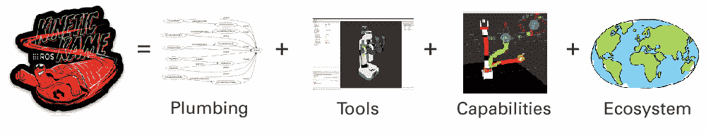
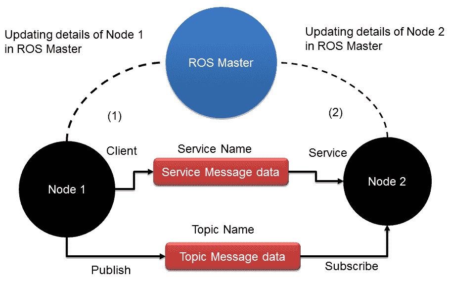
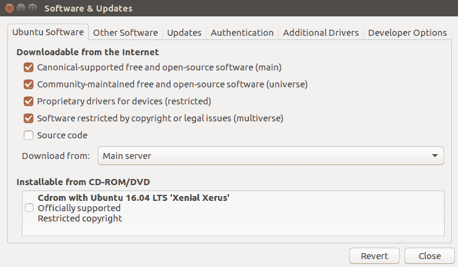
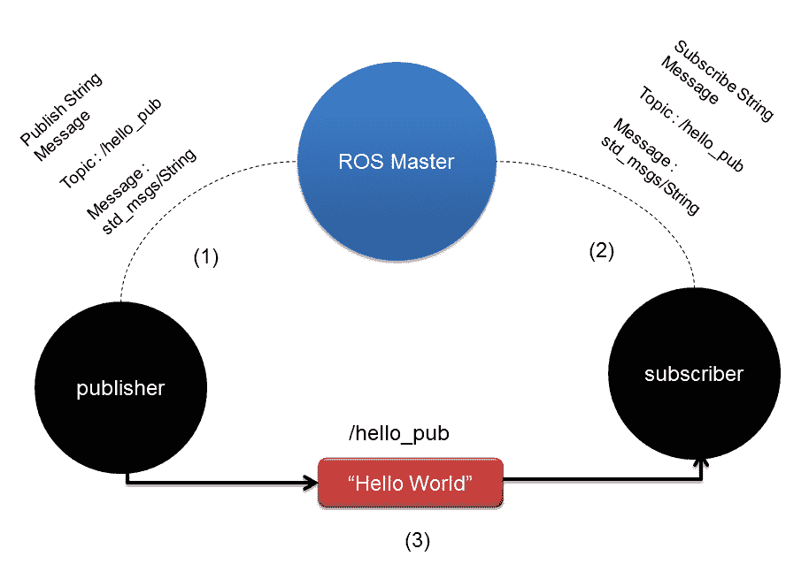
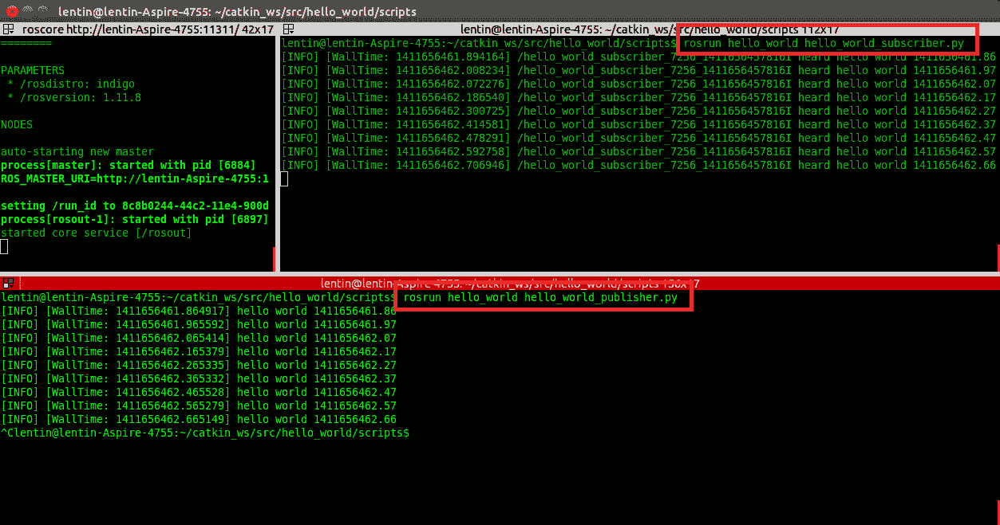
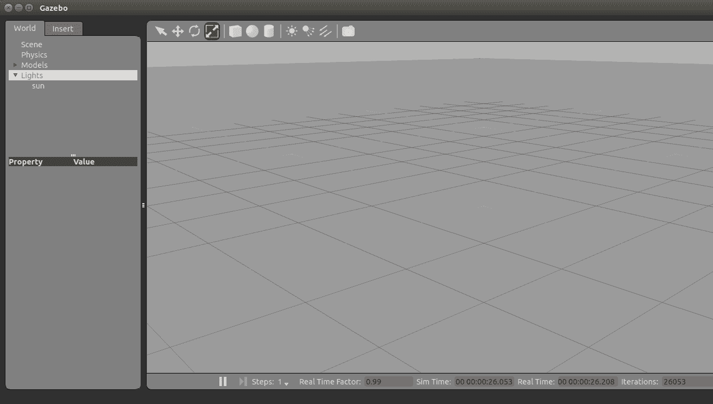

# 开始使用机器人操作系统

本书的主要目标是教会您如何从头开始构建一个自主移动机器人。机器人将使用 ROS 编程，其操作将通过一个名为 Gazebo 的模拟器进行模拟。在接下来的章节中，您还将看到机器人的机械设计、电路设计、嵌入式编程以及使用 ROS 的高级软件编程。

在本章中，我们将从 ROS 的基础知识开始，包括如何安装它、如何使用 ROS 和 Python 编写基本的应用程序，以及 Gazebo 的基础知识。本章将是您自主机器人项目的基础。如果您已经熟悉 ROS 的基础知识，并且已经在系统上安装了它，您可以跳过本章。然而，您仍然可以稍后阅读本章，以刷新您对 ROS 基础知识的记忆。

本章将涵盖以下主题：

+   ROS 简介

+   在 Ubuntu 16.04.3 上安装 ROS Kinetic

+   介绍、安装和测试 Gazebo

让我们开始使用 Python 和机器人操作系统 (ROS) 编程机器人。

# 技术要求

要获取本章中提到的完整代码，您可以克隆以下链接：

[`github.com/qboticslabs/learning_robotics_2nd_ed`](https://github.com/qboticslabs/learning_robotics_2nd_ed)

# ROS 简介

**ROS** 是一个用于创建机器人应用的软件框架。ROS 框架的主要目标是提供您可以使用的能力，以创建可重用于其他机器人的强大机器人应用。ROS 拥有一系列软件工具、库和软件包集合，使得机器人软件开发变得简单。

ROS 是一个完全开源的项目，许可协议为 BSD ([`opensource.org/licenses/BSD-3-Clause`](https://opensource.org/licenses/BSD-3-Clause)) 许可证。我们可以将其用于研究和商业应用。尽管 ROS 代表机器人操作系统，但它不是一个真正的操作系统。相反，它是一个元操作系统，提供了真实操作系统的功能。以下是 ROS 提供的主要功能：

+   **消息传递接口**：这是 ROS 的核心功能，它实现了进程间通信。利用这种消息传递能力，ROS 程序可以与其链接的系统进行通信并交换数据。在接下来的部分和章节中，我们将学习更多关于 ROS 程序/节点之间数据交换的技术术语。

+   **硬件抽象**：ROS 具有一定的抽象程度，使开发者能够创建与机器人无关的应用程序。这类应用程序可以与任何机器人一起使用；开发者只需关注底层机器人硬件即可。

+   **包管理**：ROS 节点组织在称为 ROS 包的包中。ROS 包由源代码、配置文件、构建文件等组成。我们创建包，构建包，并安装包。ROS 中有一个构建系统，有助于构建这些包。ROS 的包管理使得 ROS 开发更加系统化和有序。

+   **第三方库集成**：ROS 框架集成了许多第三方库，例如 Open-CV、PCL、OpenNI 等。这有助于开发者在 ROS 中创建各种应用。

+   **低级设备控制**：当我们与机器人一起工作时，我们可能需要与低级设备一起工作，例如控制 I/O 引脚、通过串行端口发送数据等。这也可以使用 ROS 完成。

+   **分布式计算**：处理机器人传感器数据所需的数据量非常高。使用 ROS，我们可以轻松地将计算分布到计算节点集群中。这分散了计算能力，并允许您比使用单个计算机更快地处理数据。

+   **代码重用**：ROS 的主要目标是代码重用。代码重用使得全球范围内围绕良好的研发社区得以增长。ROS 可执行文件称为节点。这些可执行文件可以组合成一个称为 ROS 包的单个实体。一组包称为元包，包和元包都可以共享和分发。

+   **语言无关性**：ROS 框架可以使用流行的语言（如 Python、C++ 和 Lisp）进行编程。节点可以用任何语言编写，并且可以通过 ROS 无任何问题地进行通信。

+   **易于测试**：ROS 有一个内置的单元/集成测试框架，称为 rostest，用于测试 ROS 包。

+   **可扩展性**：ROS 可以扩展以在机器人中执行复杂的计算。

+   **免费和开源**：ROS 的源代码是开放的，并且完全免费使用。ROS 的核心部分采用 BSD 许可证，可以在商业和封闭源产品中重用。

ROS 是管道（消息传递）、工具、能力和生态系统的结合。ROS 中有许多强大的工具用于调试和可视化机器人数据。ROS 内置了机器人能力，如机器人导航、定位、建图、操作等。它们有助于创建强大的机器人应用。

以下图像显示了 ROS 公式：



ROS 公式

请参阅 [`wiki.ros.org/ROS/Introduction`](http://wiki.ros.org/ROS/Introduction) 了解 ROS 的更多信息。

# ROS 概念

ROS 中有三个主要组织级别：

+   ROS 文件系统

+   ROS 计算图

+   ROS 社区

# ROS 文件系统

ROS 文件系统主要涵盖 ROS 文件在磁盘上的组织方式。以下是我们与 ROS 文件系统工作时必须理解的主要术语：

+   **包**：ROS 包是 ROS 软件框架的独立单元。一个 ROS 包可能包含源代码、第三方库、配置文件等。ROS 包可以重用和共享。

+   **包清单**：清单文件（`package.xml`）将包含所有包的详细信息，包括名称、描述、许可协议，更重要的是，包的依赖关系。

+   **消息（msg）类型**：消息描述存储在包中的`msg`文件夹中。ROS 消息是通过 ROS 的消息传递系统发送数据的结构。消息定义存储在具有`.msg`扩展名的文件中。

+   **服务（srv）类型**：服务描述存储在具有`.srv`扩展名的`srv`文件夹中。`srv`文件定义了 ROS 中服务的请求和响应数据结构。

# ROS 计算图

ROS 计算图是 ROS 系统处理数据的对等网络。ROS 计算图的基本特性包括节点、ROS Master、参数服务器、消息和服务：

+   **节点**：ROS 节点是使用 ROS 功能处理数据的进程。节点基本上是进行计算。例如，一个节点可以处理激光扫描数据以检查是否存在碰撞。ROS 节点是用 ROS 客户端库（如`roscpp`和`rospy`*）编写的，*这些将在下一节中讨论*。

+   **ROS Master**：ROS 节点可以使用名为 ROS Master 的程序相互连接。这为计算图的其余部分提供了名称、注册和查找功能。如果没有启动主服务器，节点将无法找到彼此并发送消息。

+   **参数服务器**：ROS 参数是存储在称为参数服务器的全局位置中的静态值。从参数服务器，所有节点都可以访问这些值。我们甚至可以将参数服务器的范围设置为私有或公共，以便它可以访问一个节点或访问所有节点。

+   **ROS 主题**：ROS 节点使用名为 ROS 主题的命名总线进行通信。数据以消息的形式通过主题流动。在主题上发送消息称为发布，通过主题接收数据称为订阅。

+   **消息**：ROS 消息是一种可以由原始数据类型（如整数、浮点数和布尔值）组成的数据类型。ROS 消息通过 ROS 主题流动。一个主题一次只能发送/接收一种类型的消息。我们可以创建自己的消息定义并通过主题发送。

+   **服务**: 我们已经看到，使用 ROS 主题的发布/订阅模型是一种非常容易的通信方式。这种通信方法是一种一对多的通信模式，意味着任何数量的节点都可以订阅一个主题。在某些情况下，我们可能还需要请求/回复类型的交互，这种交互通常用于分布式系统中。这种交互可以使用 ROS 服务来完成。ROS 服务的工作方式与 ROS 主题类似，因为它们都有一个消息类型定义。使用该消息定义，我们可以将服务请求发送到提供服务的另一个节点。服务的结果将以回复的形式发送。节点必须等待从另一个节点接收到结果。

+   **数据包**: 这些是保存和回放 ROS 主题的格式。ROS 数据包是记录传感器数据和处理数据的重要工具。这些数据包可以用于稍后离线测试我们的算法。

下面的图显示了节点和 Master 之间主题和服务的工作方式：



ROS 节点与 ROS Master 之间的通信

在前面的图中，你可以看到两个 ROS 节点，它们之间有 ROS Master。我们必须记住的一件事是，在 ROS 中启动任何节点之前，你应该先启动 ROS Master。ROS Master 充当节点之间的调解人，以交换有关其他 ROS 节点信息，以便建立通信。比如说，节点 1 想要发布一个名为`/xyz`的主题，消息类型为`abc`。它首先会接近 ROS Master，并说：“我将发布一个名为/xyz 的主题，消息类型为 abc，并分享其详细信息。”当另一个节点，比如说节点 2，想要订阅与`/xyz`相同的主题，消息类型为`abc`时，Master 将共享关于节点 1 的信息，并分配一个端口以直接在这两个节点之间启动通信，而不与 ROS Master 通信。

ROS 服务的工作方式相同。ROS Master 类似于 DNS 服务器，当第二个节点从第一个节点请求主题或服务时，它可以共享节点详细信息。ROS 使用的通信协议是 TCPROS ([`wiki.ros.org/ROS/TCPROS`](http://wiki.ros.org/ROS/TCPROS))，它基本上使用 TCP/IP 套接字进行通信。

# ROS 社区级别

ROS 社区由 ROS 开发者和研究人员组成，他们可以创建和维护软件包，并交换与现有软件包、新发布的软件包以及其他与 ROS 框架相关的新闻信息。ROS 社区提供以下服务：

+   **发行版**：ROS 发行版包含一系列带有特定版本的软件包。本书中使用的发行版是 ROS Kinetic。还有其他版本可供选择，例如 ROS Lunar 和 Indigo，它们都有特定的版本可以安装。维护每个发行版中的软件包更容易。在大多数情况下，发行版内部的软件包将相对稳定。

+   **仓库**：在线仓库是我们存放软件包的位置。通常，开发者在一个仓库中保持一组称为元软件包的类似软件包。我们也可以在单个仓库中保留单个软件包。我们可以简单地克隆这些仓库并构建或重用软件包。

+   **ROS wiki**：ROS wiki 是几乎所有 ROS 文档都可以找到的地方。你可以通过 ROS wiki 学习 ROS，从其最基本的概念到最先进的编程，([`wiki.ros.org`](http://wiki.ros.org))。

+   **邮件列表**：如果你想获取有关 ROS 的更新，你可以订阅 ROS 邮件列表([`lists.ros.org/mailman/listinfo/ros-users`](http://lists.ros.org/mailman/listinfo/ros-users))。你还可以从 ROS Discourse([`discourse.ros.org`](https://discourse.ros.org))获取最新的 ROS 新闻。

+   **ROS 问答**：这与 Stack Overflow 网站非常相似。你可以在该门户中提出与 ROS 相关的问题，并可能从世界各地的开发者那里获得支持([`answers.ros.org/questions/`](https://answers.ros.org/questions/))。

ROS 中还有许多其他功能；你可以通过访问 ROS 官方网站 www.ros.org 获取更多信息。现在，我们将继续进行 ROS 的安装过程。

# 在 Ubuntu 上安装 ROS

根据我们之前的讨论，我们知道 ROS 是一个安装在宿主系统上的元操作系统。ROS 在 Ubuntu/Linux 上完全受支持，在 Windows 和 OS X 上处于实验阶段。以下是一些最新的 ROS 发行版：

| 发行版 | 发布日期 |
| --- | --- |
| ROS Melodic Morenia | 2018 年 5 月 23 日 |
| ROS Lunar Loggerhead | 2017 年 5 月 23 日 |
| ROS Kinetic Kame | 2016 年 5 月 23 日 |
| ROS Indigo Igloo | 2014 年 7 月 22 日 |

我们现在将查看在 Ubuntu 16.04.3 LTS 上安装 ROS 的稳定、长期支持(LTS)发行版，称为 Kinetic 的安装过程。ROS Kinetic Kame 将主要针对 Ubuntu 16.04 LTS。在查看以下说明后，你还可以找到在最新的 LTS Melodic Morenia 上设置 ROS 的说明。如果你是 Windows 或 OS X 用户，在安装 ROS 之前，你可以在 VirtualBox 应用程序中安装 Ubuntu。下载 VirtualBox 的链接是[`www.virtualbox.org/wiki/Downloads`](https://www.virtualbox.org/wiki/Downloads)。

你可以在[`wiki.ros.org/kinetic/Installation/Ubuntu`](http://wiki.ros.org/kinetic/Installation/Ubuntu)找到完成此操作的完整说明。

步骤如下：

1.  配置您的 Ubuntu 仓库以允许下载受限制的、宇宙的和多宇宙的可下载文件。我们可以使用 Ubuntu 的软件和更新工具来配置它。我们可以在 Ubuntu Unity 搜索菜单中简单搜索并勾选以下截图所示：



Ubuntu 的软件和更新工具

1.  设置您的系统以接受来自`packages.ros.org`的 ROS 包。ROS Kinetic 仅支持 Ubuntu 15.10 和 16.04。以下命令将`packages.ros.org`存储在 Ubuntu 的`apt`仓库列表中：

```py
    $ sudo sh -c 'echo "deb http://packages.ros.org/ros/ubuntu $(lsb_release -sc) main" > /etc/apt/sources.list.d/ros-latest.list'
```

1.  接下来，我们必须添加 apt-keys。`apt-key`用于管理 apt 用于验证包的密钥列表。使用这些密钥验证过的包将被视为可信的。以下命令将为 ROS 包添加 apt-keys：

```py
    sudo apt-key adv --keyserver hkp://ha.pool.sks-keyservers.net:80 --recv-key 421C365BD9FF1F717815A3895523BAEEB01FA116  
```

1.  在添加 apt-keys 之后，我们必须更新 Ubuntu 包列表。以下命令将添加和更新 ROS 包，以及 Ubuntu 包：

```py
    $ sudo apt-get update
```

1.  在更新 ROS 包之后，我们可以安装包。以下命令将安装所有必要的 ROS 包、工具和库：

```py
 $ sudo apt-get install ros-kinetic-desktop-full 
```

1.  即使在桌面完全安装之后，我们可能还需要安装额外的包。每个额外的安装将在适当的部分中提及。桌面完全安装将花费一些时间。在安装 ROS 之后，您几乎就完成了。下一步是初始化`rosdep`，这将使您能够轻松安装 ROS 源包的系统依赖项：

```py
$ sudo rosdep init 
$ rosdep update 
```

1.  要在当前的 bash shell 中访问 ROS 的工具和命令，我们可以将 ROS 环境变量添加到`.bashrc`文件中。这将在每个 bash 会话开始时执行。以下是将 ROS 变量添加到`.bashrc`的命令：

```py
    echo "source /opt/ros/kinetic/setup.bash" >> ~/.bashrc   
```

以下命令将在当前 shell 中执行`.bashrc`脚本，以生成当前 shell 中的更改：

```py
    source ~/.bashrc  
```

1.  安装包依赖项的有用工具是`rosinstall`。这个工具需要单独安装。它使您能够通过一条命令轻松下载许多 ROS 包的源树：

```py
    $ sudo apt-get install python-rosinstall python-rosinstall-generator python-wstool build-essential  
```

最新 LTS Melodic 的安装与前面的说明类似。您可以将 Melodic 与 Ubuntu 18.04 LTS 一起安装。您可以在[`wiki.ros.org/melodic/Installation/Ubuntu`](http://wiki.ros.org/melodic/Installation/Ubuntu)找到完整的说明。

在安装 ROS 之后，我们将讨论如何在 ROS 中创建一个示例包。在创建包之前，我们必须创建一个 ROS 工作空间。包是在 ROS 工作空间中创建的。我们将使用 catkin 构建系统，这是一个用于在 ROS 中构建包的工具集。catkin 构建系统从源代码生成可执行文件或共享库。ROS Kinetic 使用 catkin 构建系统来构建包。让我们看看 catkin 是什么。

# 介绍 catkin

**Catkin**是 ROS 的官方构建系统。在 catkin 之前，ROS 使用**rosbuild**系统来构建包。在最新版本的 ROS 中，它的替代者是 catkin。Catkin 结合了 CMake 宏和 Python 脚本，以提供与 CMake 产生的相同的标准工作流程。Catkin 比 rosbuild 系统提供了更好的包分发、更好的交叉编译和更好的可移植性。有关更多信息，请参阅 wiki.ros.org/catkin。

Catkin 工作空间是一个文件夹，你可以在这里修改、构建和安装 catkin 包。

让我们看看如何创建一个 ROS catkin 工作空间。

以下命令将创建一个名为`catkin_ws`的父目录和一个名为`src`的子目录：

```py
    $ mkdir -p ~/catkin_ws/src  
```

使用以下命令切换目录到`src`文件夹。我们将在`src`文件夹中创建我们的包：

```py
    $ cd ~/catkin_ws/src  
```

使用以下命令初始化 catkin 工作空间：

```py
    $ catkin_init_workspace  
```

初始化 catkin 工作空间后，你可以简单地使用以下命令构建包（即使没有源文件）：

```py
    $ cd ~/catkin_ws/
    $ catkin_make  
```

`catkin_make`命令用于构建`src`目录内的包。构建包后，我们将在`catkin_ws`中看到`build`和`devel`文件夹。可执行文件存储在`build`文件夹中。在`devel`文件夹中，有 shell 脚本文件用于在 ROS 环境中添加工作空间。

# 创建 ROS 包

在本节中，我们将探讨如何创建一个包含两个 Python 节点的示例包。其中一个节点用于在名为`/hello_pub`的主题上发布一个 Hello World 字符串消息，另一个节点将订阅此主题。

可以使用 ROS 中的`catkin_create_pkg`命令创建 catkin ROS 包。

包是在我们创建工作空间时创建的`src`文件夹内创建的。在创建包之前，使用以下命令切换到`src`文件夹：

```py
    $ cd ~/catkin_ws/src  
```

以下命令将创建一个包含`std_msgs`依赖项的`hello_world`包，其中包含标准消息定义。`rospy`是 ROS 的 Python 客户端库：

```py
    $ catkin_create_pkg hello_world std_msgs rospy  
```

这是成功创建后我们得到的消息：

```py
    Created file hello_world/package.xml 
    Created file hello_world/CMakeLists.txt 
    Created folder hello_world/src 
    Successfully created files in /home/lentin/catkin_ws/src/hello_world. 
 Please adjust the values in package.xml.  
```

在成功创建`hello_world`包之后，我们需要添加两个 Python 节点或脚本以演示主题的订阅和发布。

首先，使用以下命令在`hello_world`包中创建一个名为`scripts`的文件夹：

```py
    $ mkdir scripts  
```

切换到`scripts`文件夹，创建一个名为`hello_world_publisher.py`的脚本和另一个名为`hello_world_subscriber.py`的脚本，用于发布和订阅 hello world 消息。以下部分将涵盖这些脚本或节点的代码和功能：

# Hello_world_publisher.py

`hello_world_publisher.py`节点基本上将一个名为 hello world 的问候消息发布到名为`/hello_pub`的主题。问候消息以 10 Hz 的速率发布到主题。

下面是一个图表，展示了两个 ROS 节点之间的交互方式：



发布者和订阅者节点之间的通信

本书完整代码可在 [`github.com/qboticslabs/learning_robotics_2nd_ed`](https://github.com/qboticslabs/learning_robotics_2nd_ed) 获取。

以下是对此代码如何工作的逐步解释：

1.  如果我们正在编写 ROS Python 节点，则需要导入 `rospy`。它包含用于与 ROS 主题、服务等交互的 Python API。

1.  要发送“Hello World”消息，我们必须从 `std_msgs` 包中导入 `String` 消息数据类型。`std_msgs` 包包含标准数据类型的消息定义。我们可以使用以下代码行导入：

```py
    #!/usr/bin/env python 
    import rospy 
    from std_msgs.msg import String 
```

1.  以下代码行创建了一个名为 `hello_pub` 的主题的发布者对象。消息类型是 `String`，`queue_size` 的值是 `10`。如果订阅者接收数据不够快，我们可以使用 `queue_size` 选项来缓冲它：

```py
    def talker():
        pub = rospy.Publisher('hello_pub', String, queue_size=10)   
```

1.  以下代码行初始化一个 ROS 节点。它还将为节点分配一个名称。如果有两个节点以相同的节点名运行，其中一个将关闭。如果我们想同时运行它们，可以使用以下代码中的匿名 `=True` 标志：

```py
    rospy.init_node('hello_world_publisher', anonymous=True)  
```

1.  以下行创建了一个名为 `r` 的速率对象。使用 `Rate` 对象中的 `sleep()` 方法，我们可以以期望的速率更新循环。这里，我们给速率赋值为 `10`：

```py
    r = rospy.Rate(10) # 10hz   
```

1.  以下循环将检查 `rospy` 是否构建了 `rospy.is_shutdown()` 标志。然后执行循环。如果我们点击 *Ctrl* + *C*，此循环将退出。

在循环内部，以 10 Hz 的速率在终端打印并发布“Hello World”消息到 `hello_pub` 主题：

```py
    while not rospy.is_shutdown():  
        str = "hello world %s"%rospy.get_time()  
        rospy.loginfo(str)  
        pub.publish(str)  
        r.sleep() 
```

1.  以下代码具有 Python `_` `main__` 检查并调用 `talker()` 函数。代码将持续执行 `talker()`，当按下 Ctrl + C 时，节点将关闭：

```py
if __name__ == '__main__':  
    try:  
        talker()  
    except rospy.ROSInterruptException: pass 
```

在发布主题后，我们将了解如何订阅它。以下部分涵盖了订阅 `hello_pub` 主题所需的代码。

# Hello_world_subscriber.py

订阅者代码如下：

```py
#!/usr/bin/env python 
import rospy 
from std_msgs.msg import String 
```

以下是一个回调函数，当消息到达 `hello_pub` 主题时执行。`data` 变量包含来自主题的消息，它将使用 `rospy.loginfo()` 打印：

```py
def callback(data): 
    rospy.loginfo(rospy.get_caller_id()+"I heard %s",data.data) 

```

以下步骤将以 `hello_world_subscriber` 名称启动节点并开始订阅 `/hello_pub` 主题：

1.  消息的数据类型是 `String`，当消息到达此主题时，将调用名为 callback 的方法：

```py
    def listener(): 
       rospy.init_node('hello_world_subscriber', 
          anonymous=True) 
       rospy.Subscriber("hello_pub", String, callback) 
```

1.  以下代码将防止节点退出，直到节点被关闭：

```py
       rospy.spin() 
```

1.  以下为 Python 代码的主要部分。主部分将调用 `listener()` 方法，该方法将订阅 `/hello_pub` 主题：

```py
if __name__ == '__main__': 
    listener() 
```

1.  在保存两个 Python 节点后，您需要使用 `chmod` 命令更改权限为可执行：

```py
    chmod +x hello_world_publisher.py
    chmod +x hello_world_subscriber.py
```

1.  在更改文件权限后，使用 `catkin_make` 命令构建包：

```py
    cd ~/catkin_ws
    catkin_make
```

1.  以下命令将当前 ROS 工作空间路径添加到所有终端中，以便我们可以访问此工作空间内的 ROS 软件包：

```py
    echo "source ~/catkin_ws/devel/setup.bash" >> ~/.bashrc
    source ~/.bashrc  
```

以下为订阅者和发布者节点的输出：



Hello World 节点的输出

1.  首先，在启动节点之前，我们需要运行 `roscore`。`roscore` 命令或 ROS 主节点用于节点之间的通信。因此，第一个命令如下：

```py
    $ roscore
```

1.  执行 `roscore` 后，使用以下命令运行每个节点：

+   +   以下命令将运行发布者：

```py
    $ rosrun hello_world hello_world_publisher.py  
```

+   +   以下命令将运行订阅者节点。此节点订阅 `hello_pub` 主题，如下面的代码所示：

```py
    $ rosrun hello_world hello_world_subscriber.py  
```

我们已经涵盖了 ROS 的一些基础知识。现在，我们将了解 Gazebo 是什么以及我们如何使用 ROS 与 Gazebo 合作。

# 介绍 Gazebo

**Gazebo** 是一个免费的开源机器人模拟器，在其中我们可以测试自己的算法、设计机器人以及在不同的模拟环境中测试机器人。Gazebo 可以在室内和室外环境中准确高效地模拟复杂的机器人。Gazebo 使用物理引擎构建，我们可以用它创建高质量的图形和渲染。

Gazebo 的功能如下：

+   **动态模拟**：Gazebo 可以使用物理引擎（如 **Open Dynamics Engine** （**ODE**））模拟机器人的动力学。([`opende.sourceforge.net/`](http://opende.sourceforge.net/))，Bullet ([`bulletphysics.org/wordpress/`](http://bulletphysics.org/wordpress/))，Simbody ([`simtk.org/home/simbody/`](https://simtk.org/home/simbody/))，和 DART ([`dartsim.github.io/`](http://dartsim.github.io/)))。

+   **高级 3D 图形**：Gazebo 使用 OGRE 框架提供高质量的渲染、照明、阴影和纹理（[`www.ogre3d.org/`](http://www.ogre3d.org/)）。

+   **传感器支持**：Gazebo 支持广泛的传感器，包括激光测距仪、Kinect 风格的传感器、2D/3D 摄像头等。我们还可以用它来模拟噪声以测试音频传感器。

+   **插件**：我们可以为机器人、传感器和环境控制开发自定义插件。插件可以访问 Gazebo 的 API。

+   **机器人模型**：Gazebo 为流行的机器人提供模型，例如 PR2、Pioneer 2 DX、iRobot Create 和 TurtleBot。我们还可以构建机器人的自定义模型。

+   **TCP/IP 传输**：我们可以通过基于套接字的消息传递服务在远程机器和 Gazebo 界面运行模拟。

+   **云模拟**：我们可以使用 CloudSim 框架在云服务器上运行模拟（[`cloudsim.io/`](http://cloudsim.io/)）。

+   **命令行工具**：广泛使用的命令行工具用于检查和记录模拟。

# 安装 Gazebo

Gazebo 可以作为独立应用程序或与 ROS 集成应用程序安装。在本章中，我们将使用 Gazebo 与 ROS 一起模拟机器人的行为，并使用 ROS 框架测试我们编写的代码。

如果你想亲自尝试最新的 Gazebo 模拟器，可以按照[`gazebosim.org/download`](http://gazebosim.org/download)提供的步骤进行。

要与 Gazebo 和 ROS 一起工作，我们不需要分别安装它们，因为 Gazebo 随 ROS 桌面完整安装提供。

将 Gazebo 与 ROS 集成的 ROS 软件包称为 `gazebo_ros_pkgs`。该软件包围绕独立的 Gazebo 提供了包装器。此软件包提供了使用 ROS 消息服务在 Gazebo 中模拟机器人的必要接口。

可以使用以下命令在 ROS Indigo 中安装完整的 `gazebo_ros_pkgs`：

```py
    $ sudo apt-get install ros-kinetic-gazebo-ros-pkgs ros-kinetic-
   ros-control  
```

# 使用 ROS 接口测试 Gazebo

假设 ROS 环境已正确设置，我们可以在启动 Gazebo 之前使用以下命令启动 `roscore`：

```py
    $ roscore  
```

以下命令将使用 ROS 运行 Gazebo：

```py
    $ rosrun gazebo_ros gazebo  
```

Gazebo 运行两个可执行文件——Gazebo 服务器和 Gazebo 客户端。Gazebo 服务器将执行仿真过程，而 Gazebo 客户端可以是 Gazebo GUI。使用前面的命令，Gazebo 客户端和服务器将并行运行。

以下截图显示了 Gazebo GUI：



Gazebo 模拟器

启动 Gazebo 后，将生成以下主题：

```py
$ rostopic list  
/gazebo/link_states  
/gazebo/model_states  
/gazebo/parameter_descriptions  
/gazebo/parameter_updates  
/gazebo/set_link_state  
/gazebo/set_model_state  
```

我们可以使用以下命令分别运行服务器和客户端：

+   使用以下命令运行 Gazebo 服务器：

```py
    $ rosrun gazebo_ros gzserver  
```

+   使用以下命令运行 Gazebo 客户端：

```py
    $ rosrun gazebo_ros gzclient  
```

# 摘要

本章是关于机器人操作系统的介绍。本章的主要目标是向您概述 ROS，其功能，如何安装它，ROS 的基本概念，以及如何使用 Python 编程。此外，我们还探讨了可以与 ROS 一起工作的机器人模拟器 Gazebo，我们看到了如何安装和运行 Gazebo。在下一章中，我们将探讨差速驱动机器人的基本概念。

# 问题

1.  ROS 的重要特性有哪些？

1.  ROS 中概念的不同级别是什么？

1.  ROS catkin 构建系统是什么？

1.  ROS 主题和消息是什么？

1.  ROS 计算图的不同概念是什么？

1.  ROS Master 的主要功能是什么？

1.  Gazebo 的重要特性有哪些？
