# 第四章：使用 ROS 模拟差速驱动机器人

在上一章中，我们探讨了如何对 Chefbot 进行建模。在本章中，我们将学习如何使用 ROS 中的 Gazebo 模拟器来模拟机器人。我们将学习如何创建 Chefbot 的模拟模型，并在 Gazebo 中创建一个类似酒店的环境来测试我们的应用程序，该应用程序被编程为自动向客户送餐。我们将详细解释每个步骤以测试我们的应用程序。以下是我们将在本章中涉及的重要主题：

+   开始使用 Gazebo 模拟器

+   与 TurtleBot 2 模拟器一起工作

+   创建 Chefbot 的模拟

+   用于模拟的 URDF 标签和插件

+   开始使用同时定位与建图

+   在 Gazebo 环境中实现 SLAM

+   使用 SLAM 创建地图

+   开始使用自适应蒙特卡洛定位

+   在 Gazebo 环境中实现 AMCL

+   使用 Gazebo 在酒店中自主导航 Chefbot

# 技术要求

要测试本章中的应用程序和代码，您需要一个安装了 ROS Kinetic 的 Ubuntu 16.04 LTS PC/笔记本电脑。

# 开始使用 Gazebo 模拟器

在第一章中，我们探讨了 Gazebo 模拟器的基本概念及其安装过程。在本章中，我们将更深入地了解 Gazebo 的使用方法以及如何在 Gazebo 模拟器中模拟差速驱动机器人。第一步是理解 GUI 界面及其各种控制。正如我们在第一章中讨论的那样，Gazebo 有两个主要部分。第一部分是 Gazebo 服务器，第二部分是 Gazebo 客户端。模拟是在 Gazebo 服务器上进行的，它充当后端。GUI 是前端，充当 Gazebo 客户端。我们还将探讨 Rviz（ROS 可视化器），这是一个 ROS 中的 GUI 工具，用于从机器人硬件或模拟器（如 Gazebo）可视化不同类型的机器人传感器数据。

我们可以将 Gazebo 作为独立的模拟器来模拟机器人，或者我们可以使用与 ROS 和 Python 的接口，这些接口可以用来在 Gazebo 模拟器中编程机器人。如果我们使用 Gazebo 作为独立的模拟器，模拟机器人的默认选项是通过编写基于 C++ 的插件（[`gazebosim.org/tutorials/?tut=plugins_hello_world`](http://gazebosim.org/tutorials/?tut=plugins_hello_world)）。我们可以编写 C++ 插件来模拟机器人的行为，创建新的传感器，创建新的世界等等。默认情况下，Gazebo 中机器人和环境的建模是通过 SDF ([`sdformat.org/`](http://sdformat.org/)) 文件完成的。如果我们使用 ROS 接口来使用 Gazebo，我们必须创建一个包含所有机器人参数并具有 Gazebo 特定标签来提及机器人模拟属性的 URDF 文件。当我们使用 URDF 启动模拟时，它将使用一些工具转换为 SDF 文件，并在 Gazebo 中显示机器人。Gazebo 的 ROS 接口称为 gazebo-ros-pkgs。它是一组包装器和插件，具有在 Gazebo 中建模传感器、机器人控制器和其他模拟以及通过 ROS 主题进行通信的能力。在本章中，我们将主要关注 ROS-Gazebo 接口，用于模拟 Chefbot。ROS-Gazebo 接口的优势在于我们可以通过利用 ROS 框架来编程机器人。我们可以使用 ROS 使用流行的编程语言，如 C++ 和 Python 来编程机器人。

如果您不感兴趣使用 ROS，并想使用 Python 编程机器人，您应该查看一个名为 pygazebo ([`github.com/jpieper/pygazebo`](https://github.com/jpieper/pygazebo)) 的接口。它是 Gazebo 的 Python 绑定。在下一节中，我们将看到 Gazebo 的 GUI，以及其中的一些重要控件。

# Gazebo 的图形用户界面

我们可以通过几种方式启动 Gazebo。您已经在 *第一章，开始使用机器人操作系统* 中看到了这一点。在本章中，我们使用以下命令启动一个空世界，这意味着没有机器人和环境：

```py
$ roslaunch gazebo_ros empty_world.launch 
```

上述命令将启动 Gazebo 服务器和客户端，并将一个空世界加载到 Gazebo 中。以下是 Gazebo 中空世界的视图：

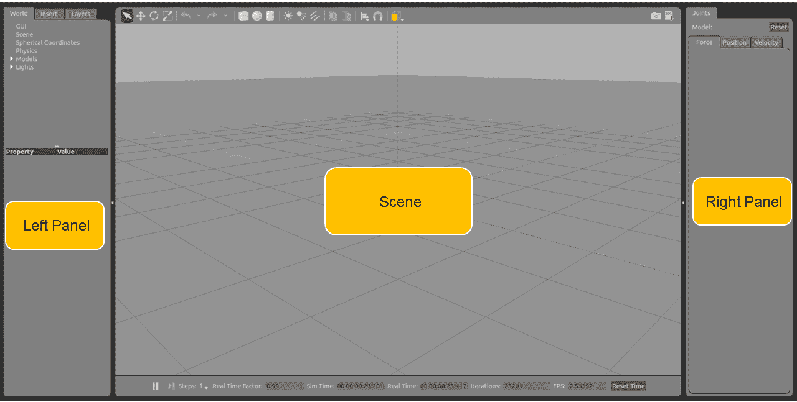

Gazebo 用户界面

Gazebo 用户界面可以分为三个部分：**场景**、**左侧面板**和**右侧面板**。

# 场景

场景是机器人模拟发生的地方。我们可以向场景添加各种对象，并可以使用鼠标和键盘与场景中的机器人进行交互。

# 左侧面板

当我们启动 Gazebo 时，您可以看到左侧面板。左侧面板有三个主要选项卡：

+   **世界**：**世界**选项卡包含当前 Gazebo 场景中的模型列表。在这里，我们可以修改模型参数，例如姿态，也可以更改摄像机的姿态。

+   **插入**：**插入**选项卡允许您向场景添加新的仿真模型。这些模型可在本地系统以及远程服务器中找到。`/home/<用户名>/.gazebo/model`文件夹将保存本地模型文件和远程服务器中的模型，如下面的截图所示：

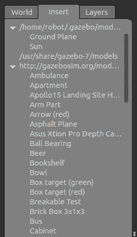

Gazebo 左侧面板中的插入选项卡

您可以在前面截图所示的**插入**选项卡中看到本地文件和远程文件。

当您第一次启动 Gazebo 或启动包含来自远程服务器模型的场景时，您可能在 Gazebo 上看到黑色屏幕或在终端上看到警告。这是因为远程服务器中的模型正在下载，Gazebo 必须等待一段时间。等待时间会根据您的互联网连接速度而变化。一旦模型下载完成，它将被保存在本地模型文件夹中，因此下次将不会有任何延迟。

+   **图层**：大多数时候，我们不会使用此选项卡。此选项卡用于组织模拟中可用的不同可视化。我们可以通过切换每个图层来隐藏/显示模拟中的模型。在模拟的大多数情况下，此选项卡将是空的。

# 右侧面板

默认情况下，右侧面板是隐藏的。我们必须将其拖动才能查看。此面板使我们能够与模型的移动部分交互。如果我们选择场景中的模型，我们可以看到模型的关节。

# Gazebo 工具栏

Gazebo 有两个工具栏。一个位于场景上方，另一个位于场景下方。

# 上工具栏

上工具栏对于与 Gazebo 场景交互非常有用。此工具栏主要用于操作 Gazebo 场景。它具有选择模型、缩放、平移和旋转模型以及向场景添加新形状的功能：

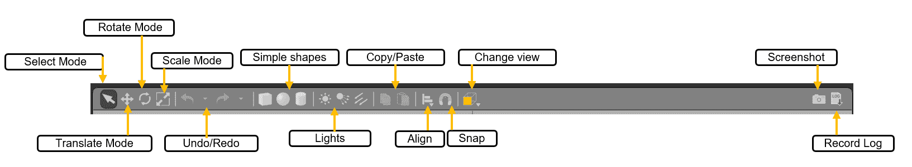

Gazebo 的上工具栏

以下列表显示了每个选项的详细描述：

+   **选择模式**：如果我们处于选择模式，我们可以选择场景中的模型并设置其属性，以及导航场景内部。

+   **平移模式**：在平移模式下，我们可以选择一个模型并通过点击左键将其平移。

+   **旋转模式**：在旋转模式下，我们可以选择模型并改变其方向。

+   **缩放模式**：在缩放模式下，我们可以选择模型并对其进行缩放。

+   **撤销/重做**：这使我们能够在场景中撤销或重做操作。

+   **简单形状**：使用此选项，我们可以将原始形状插入场景，例如圆柱体、立方体或球体。

+   **灯光**：灯光选项使我们能够向场景添加不同类型的灯光源。

+   **复制/粘贴**：复制和粘贴选项使我们能够复制和粘贴不同的模型和场景的部分。

+   **对齐**：这使我们能够将模型对齐。

+   **捕捉**：这会将一个模型捕捉并移动到场景内部。

+   **更改视图**：这会更改场景的视图。它主要使用透视视图和正交视图。

+   **截图**：这会截取当前场景的截图。

+   **记录日志**：这会保存 Gazebo 的日志。

# 底部工具栏

底部工具栏主要给我们一个关于模拟的概览。它显示模拟时间，这指的是在模拟器内流逝的时间。模拟可以加速或减速。这取决于当前模拟所需的计算量。

实时显示指的是当模拟器运行时在现实生活中流逝的实际时间。**实时因子（RTF**）是模拟时间和真实时间速度的比率。如果 RTF 为 1，则表示模拟以与现实中时间速度相同的速率进行。

Gazebo 中的世界状态会随着每次迭代而改变。每次迭代可以在 Gazebo 中进行固定时间内的更改。这个固定时间被称为步长。默认情况下，步长为 1 毫秒。步长和迭代在工具栏中显示，如下面的截图所示：

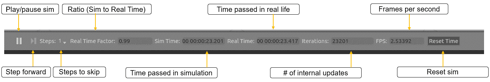

Gazebo 的下工具栏

我们可以使用**步进**按钮暂停模拟并查看每个步骤。

您可以从 [`gazebosim.org/tutorials?cat=guided_b&tut=guided_b2`](http://gazebosim.org/tutorials?cat=guided_b&tut=guided_b2) 获取更多关于 Gazebo GUI 的信息。

在进入下一节之前，您可以尝试使用 Gazebo 并了解更多关于其工作原理的信息。

# 使用 TurtleBot 2 模拟

在使用 Gazebo 的工作之后，现在是我们运行模拟并处理一些机器人的时候了。在教育和研究领域，TurtleBot 是一种流行的机器人。TurtleBot 软件是在 ROS 框架内开发的，Gazebo 中有它操作的很好模拟。TurtleBot 的流行版本有 2 和 3。我们将在本节中学习 TurtleBot 2，因为 Chefbot 的开发受到了其设计的启发。

在 Ubuntu 16.04 中安装 TurtleBot 2 模拟包非常简单。您可以使用以下命令安装 TurtleBot 2 模拟包用于 Gazebo：

```py
    $ sudo apt-get install ros-kinetic-turtlebot-gazebo  
```

安装完包后，我们可以开始运行模拟。turtlebot-gazebo 包内包含几个不同的启动文件，它们具有不同的世界文件。Gazebo 世界文件（`*.world`）是一个 SDF 文件，包含环境中模型的属性。当世界文件更改时，Gazebo 将加载不同的环境。

以下命令将启动一个包含特定组件集的世界：

```py
    $ roslaunch turtlebot_gazebo turtlebot_world.launch  
```

模拟加载需要一些时间，加载完成后，您将在 Gazebo 场景中看到以下模型：

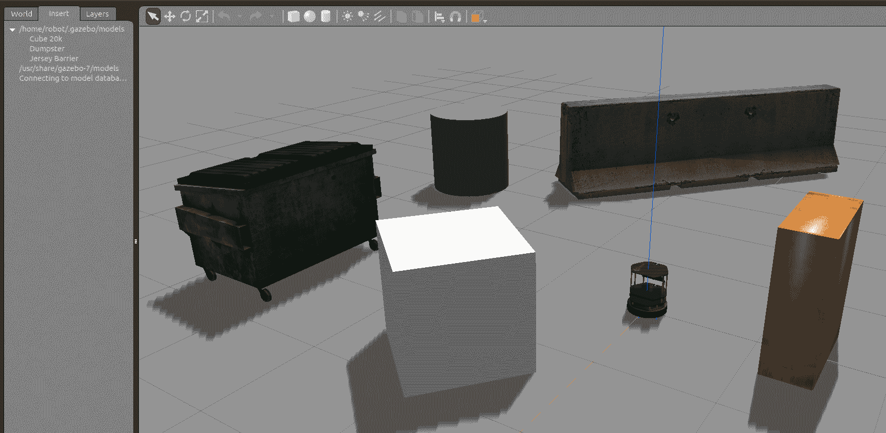

Gazebo 中的 TurtleBot 2 模拟

当我们在 Gazebo 中加载模拟时，它也会加载与 ROS 交互所需的插件。TurtleBot 2 有以下重要组件：

+   带有差速驱动的移动底盘

+   用于创建地图的深度传感器

+   用于检测碰撞的碰撞开关

当模拟加载时，它将加载 ROS-Gazebo 插件来模拟差速驱动移动底盘、深度传感器（Kinect 或 Astra）和碰撞开关插件。因此，在加载模拟后，如果我们输入终端中的`$ rostopic list`命令，将出现一系列主题，如下面的截图所示。

如我们之前所见，我们可以从差速驱动插件、深度传感器和碰撞开关中看到主题。除此之外，我们还可以看到来自 ROS-Gazebo 插件的主题，这些主题主要包含机器人在模拟中的当前状态和其他模型。

Kinect/Astra 传感器可以提供 RGB 图像和深度图像。差速驱动插件可以将机器人的里程计数据发送到`/odom`（`nav_msgs/Odometry`）主题，并在`/tf`（`tf2_msgs/TFMessage`）主题中发布机器人的变换，如下面的截图所示：

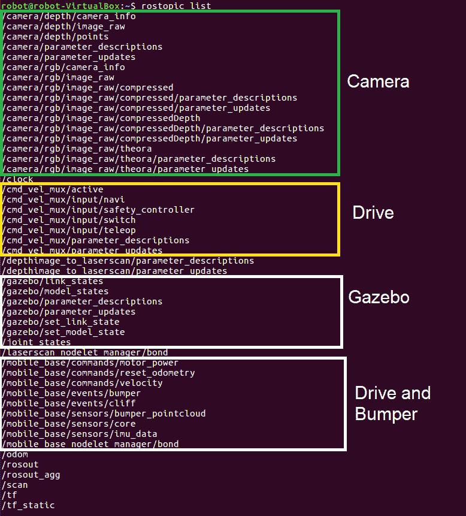

TurtleBot 2 模拟的 ROS 主题

我们可以在 Rviz 中可视化机器人模型和传感器数据。有一个专门用于可视化的 TurtleBot 包。您可以通过安装以下包来可视化机器人数据：

```py
    $ sudo apt-get install ros-kinetic-turtlebot-rviz-launchers  
```

安装此包后，我们可以使用以下启动文件来可视化机器人和其传感器数据：

```py
    $ roslaunch turtlebot-rviz-launchers view_robot.launch  
```

我们将得到以下带有显示机器人模型的 Rviz 窗口。然后我们可以启用传感器显示来可视化这些特定数据，如下面的截图所示：

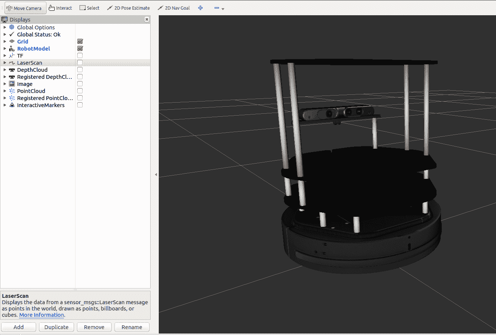

TurtleBot 2 在 Rviz 中的可视化

在下一节中，我们将学习如何移动这个机器人。

# 移动机器人

机器人的差速驱动插件能够接收 ROS Twist 消息（`geometry_msgs/Twist`），这些消息包含机器人的当前线性和角速度。机器人的遥控意味着通过使用 ROS Twist 消息手动使用操纵杆或键盘来移动机器人。我们现在将看看如何使用键盘遥控来移动 Turtlebot 2 机器人。

我们必须安装一个包来遥控 TurtleBot 2 机器人。以下命令将安装 TurtleBot 遥控包：

```py
    $ sudo apt-get install ros-kinetic-turtlebot-teleop  
```

要开始遥控操作，我们首先需要启动 Gazebo 模拟器，然后使用以下命令启动遥控节点：

```py
    $ roslaunch turtlebot_teleop keyboard_teleop.launch 

```

在终端中，我们可以看到移动机器人的快捷键组合。您可以使用这些键来移动它，您将看到机器人在 Gazebo 和 Rviz 中的移动，如下面的截图所示：

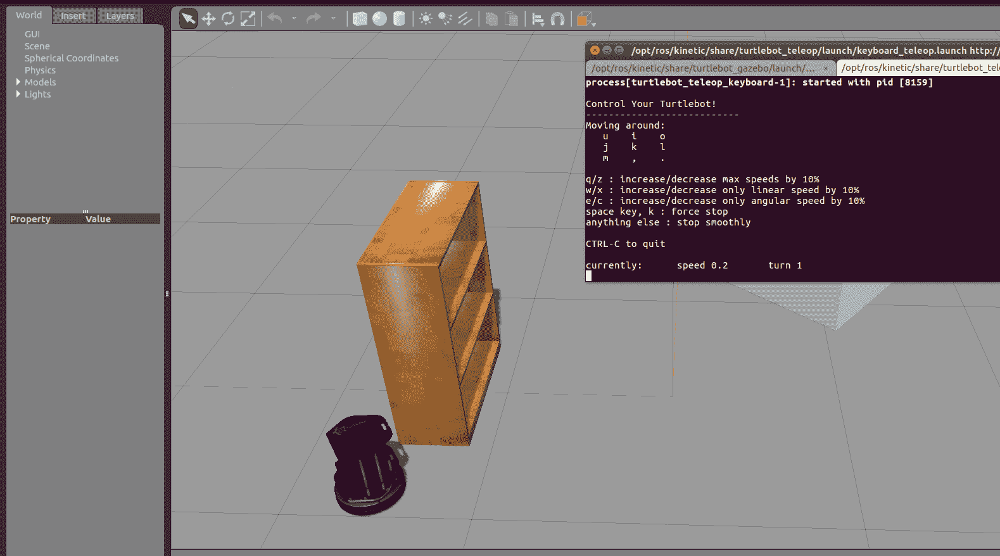

TurtleBot 2 键盘遥控

当我们按下键盘上的按钮时，它将向差速驱动控制器发送 Twist 消息，控制器将在模拟中移动机器人。teleop 节点发送一个名为`/cmd_vel_mux/input/teleop`（`geometry_msgs/Twist`）的主题，如下图所示：

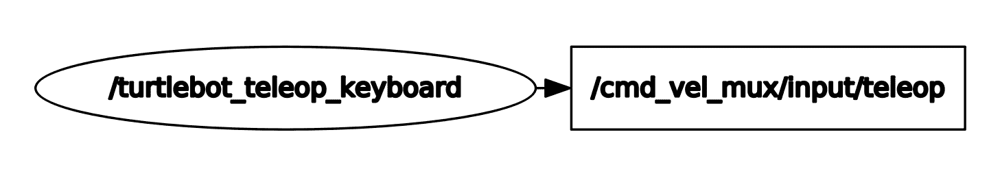

TurtleBot 键盘遥控节点

# 创建 Chefbot 的模拟

我们已经看到了 turtlebot 模拟的工作原理。在本节中，我们将探讨如何使用 Gazebo 创建自己的机器人模拟。

在我们开始讨论这个主题之前，你应该将`chefbot_gazebo`包复制到你的 catkin 工作区，并执行`catkin_make`来构建包。确保你的工作区中有两个包，一个叫做`chefbot_description`，另一个叫做`chefbot_gazebo`。`chefbot_gazebo`包包含与模拟相关的 launch 文件和参数，而`chefbot_description`包含机器人的 URDF 模型，以及其模拟参数和用于在 Rviz 和 Gazebo 中查看机器人的 launch 文件。

让我们在 Gazebo 中开始创建我们的 Chefbot 模型，这样你就可以熟悉这个过程。之后，我们将深入探讨 xacro 文件，并查看模拟参数。

以下 launch 文件将在 Gazebo 中显示带有空世界的机器人模型，并启动所有用于机器人的 Gazebo 插件：

```py
    $ roslaunch chefbot_description view_robot_gazebo.launch  
```

以下图显示了 Gazebo 中的 Chefbot 截图：

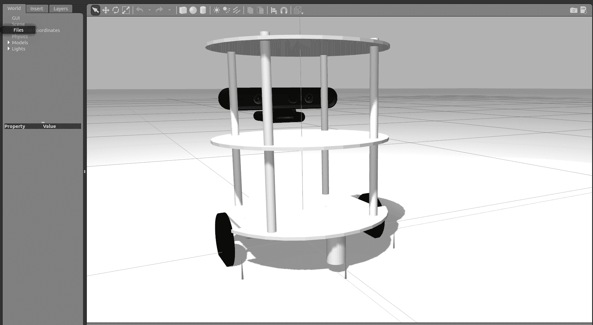

Gazebo 中的 Chefbot

让我们看看如何在 Gazebo 中添加 URDF 机器人模型。你可以在`chefbot_description/launch/view_robot_gazebo.launch`中找到 URDF 机器人模型的定义。

代码的第一部分调用了`upload_model.launch`文件来创建`robot_description`参数。如果成功，它将在 Gazebo 中启动一个空的世界：

```py
<launch> 
  <include file="$(find chefbot_description)/launch/upload_model.launch" /> 

  <include file="$(find gazebo_ros)/launch/empty_world.launch"> 
    <arg name="paused" value="false"/> 
    <arg name="use_sim_time" value="true"/> 
    <arg name="gui" value="true"/> 
    <arg name="recording" value="false"/> 
    <arg name="debug" value="false"/> 
  </include> 
```

那么，在 Gazebo 中如何显示`robot_description`参数中的机器人模型？以下 launch 文件中的代码片段完成了这项工作：

```py
  <node name="spawn_urdf" pkg="gazebo_ros" type="spawn_model" args="-param robot_description -urdf -z 0.1 -model chefbot" /> 
```

`gazebo_ros`包内的`spawn_model`节点将读取`robot_description`并在 Gazebo 中生成模型。`-z 0.1`参数表示要在 Gazebo 中放置的模型的高度。如果高度为 0.1，则模型将在 0.1 的高度生成。如果启用了重力，则模型将落到地面上。我们可以根据需要更改此参数。`-model`参数是 Gazebo 中机器人模型的名字。此节点将解析`robot_description`中的所有 Gazebo 参数，并在 Gazebo 中启动模拟。

在模型生成后，我们可以使用以下代码行发布机器人变换（tf）：

```py
  <node pkg="robot_state_publisher" type="robot_state_publisher" name="robot_state_publisher"> 
    <param name="publish_frequency" type="double" value="30.0" /> 
  </node> 
```

我们正在以 30Hz 的频率发布 ROS tf。

# 深度图像到激光扫描转换

机器人上的深度传感器提供了环境的 3D 坐标。为了实现自主导航，我们可以使用这些数据创建 3D 地图。创建环境地图的技术有很多种。我们为这个机器人使用的算法之一叫做 gmapping ([`wiki.ros.org/gmapping`](http://wiki.ros.org/gmapping))。gmapping 算法主要使用激光扫描来创建地图，但在这个案例中，我们从传感器获取整个 3D 点云。我们可以通过截取深度数据来将激光扫描的 3D 深度数据转换。以下 launch 文件中的节点（[`wiki.ros.org/nodelet`](http://wiki.ros.org/nodelet)）能够接收深度数据并将其转换为激光扫描数据：

```py
  <node pkg="nodelet" type="nodelet" name="laserscan_nodelet_manager" args="manager"/> 
  <node pkg="nodelet" type="nodelet" name="depthimage_to_laserscan" 
        args="load depthimage_to_laserscan/DepthImageToLaserScanNodelet laserscan_nodelet_manager"> 
    <param name="scan_height" value="10"/> 
    <param name="output_frame_id" value="/camera_depth_frame"/> 
    <param name="range_min" value="0.45"/> 
    <remap from="image" to="/camera/depth/image_raw"/> 
    <remap from="scan" to="/scan"/> 
  </node> 
</launch> 
```

节点是一个特殊的 ROS 节点，它有一个名为零拷贝传输的属性，这意味着它不需要网络带宽来订阅主题。这将使深度图像（`sensor_msgs/Image`）到激光扫描（`sensor_msgs/LaserScan`）的转换更快、更高效。节点的一个其他属性是它可以作为插件动态加载。我们可以设置此节点的各种属性，例如 `range_min`、图像主题的名称和输出激光主题。

# URDF 标签和 Gazebo 模拟插件

我们已经在 Gazebo 中看到了模拟的机器人。现在，我们将更详细地查看 URDF 中的与模拟相关的标签以及我们在 URDF 模型中包含的各种插件。

大多数 Gazebo 特定标签位于 `chefbot_description/gazebo/chefbot.gazebo.xacro` 文件中。此外，`chefbot_description/urdf/chefbot.xacro` 文件中的一些标签也用于模拟。在 chefbot.xacro 中定义 `<collision>` 和 `<inertial>` 标签对于我们的模拟非常重要。URDF 中的 `<collision>` 标签定义了机器人连杆周围的边界，主要用于检测该特定连杆的碰撞，而 `<inertial>` 标签则包含了连杆的质量和转动惯量。以下是 `<inertial>` 标签定义的示例：

```py
      <inertial> 
        <mass value="0.564" /> 
        <origin xyz="0 0 0" /> 
        <inertia ixx="0.003881243" ixy="0.0" ixz="0.0" 
                 iyy="0.000498940" iyz="0.0" 
                 izz="0.003879257" /> 
      </inertial> 
```

这些参数是机器人动力学的一部分，因此在模拟中，这些值将对机器人模型产生影响。此外，在模拟中，它将处理所有连杆和关节，以及它们的属性。

接下来，我们将查看 `gazebo/chefbot.gazebo.xacro` 文件内的标签。我们使用的最重要的 Gazebo 特定标签是 `<gazebo>`，它用于定义机器人中元素的模拟属性。我们可以定义一个适用于所有连杆的属性，或者一个特定于某个连杆的属性。以下是 xacro 文件中定义连杆摩擦系数的代码片段：

```py
     <gazebo reference="chefbot_wheel_left_link"> 
       <mu1>1.0</mu1> 
       <mu2>1.0</mu2> 
       <kp>1000000.0</kp> 
       <kd>100.0</kd> 
       <minDepth>0.001</minDepth> 
       <maxVel>1.0</maxVel> 

     </gazebo>  
```

`reference` 属性用于指定机器人中的连杆。因此，前面的属性将仅适用于 `chefbot_wheel_left_link`。

以下代码片段展示了如何设置机器人连接的颜色。我们可以创建自定义颜色，定义自定义颜色，或在 Gazebo 中使用默认颜色。您可以看到，对于`base_link`，我们正在使用 Gazebo 默认属性中的`Gazebo/White`颜色：

```py
   <material name="blue"> 
       <color rgba="0 0 0.8 1"/> 
   </material> 

   <gazebo reference="base_link"> 
     <material>Gazebo/White</material> 
   </gazebo> 
```

请参阅[`gazebosim.org/tutorials/?tut=ros_urdf`](http://gazebosim.org/tutorials/?tut=ros_urdf)以查看模拟中使用的所有标签。

这涵盖了模拟的主要标签。现在我们将查看在这个模拟中使用的 Gazebo-ROS 插件。

# 悬崖传感器插件

悬崖传感器是一组红外传感器，用于检测悬崖，有助于避免台阶并防止机器人跌落。这是 Turtlebot 2 移动基座中的传感器之一，称为 Kobuki ([`kobuki.yujinrobot.com/`](http://kobuki.yujinrobot.com/))。我们在 Turtlebot 2 模拟中使用此插件。

我们可以设置传感器的参数，例如红外光束的最小和最大角度、分辨率以及每秒的样本数。我们还可以限制传感器的检测范围。在我们的模拟模型中有三个悬崖传感器，如下面的代码所示：

```py
     <gazebo reference="cliff_sensor_front_link"> 
       <sensor type="ray" name="cliff_sensor_front"> 
         <always_on>true</always_on> 
         <update_rate>50</update_rate> 
         <visualize>true</visualize> 
         <ray> 
           <scan> 
             <horizontal> 
               <samples>50</samples> 
               <resolution>1.0</resolution> 
               <min_angle>-0.0436</min_angle>  <!-- -2.5 degree --> 
               <max_angle>0.0436</max_angle> <!-- 2.5 degree --> 
             </horizontal> 

           </scan> 
           <range> 
             <min>0.01</min> 
             <max>0.15</max> 
             <resolution>1.0</resolution> 
           </range> 
         </ray> 
       </sensor> 
     </gazebo> 
```

# 接触传感器插件

这是我们的机器人上接触传感器的代码片段。如果机器人的底部与任何物体发生碰撞，此插件将被触发。它通常连接到机器人的`base_link`，因此每当保险杠撞击任何物体时，此传感器将被触发：

```py
     <gazebo reference="base_link"> 
       <mu1>0.3</mu1> 
       <mu2>0.3</mu2> 
       <sensor type="contact" name="bumpers"> 
         <always_on>1</always_on> 
         <update_rate>50.0</update_rate> 
         <visualize>true</visualize> 
         <contact> 
           <collision>base_footprint_collision_base_link</collision> 
         </contact> 
       </sensor> 
     </gazebo> 
```

# 陀螺仪插件

陀螺仪插件用于测量机器人的角速度。使用角速度，我们可以计算机器人的方向。机器人的方向用于机器人驱动控制器中计算机器人的姿态，如下面的代码所示：

```py
     <gazebo reference="gyro_link"> 
      <sensor type="imu" name="imu"> 
        <always_on>true</always_on> 
        <update_rate>50</update_rate> 
        <visualize>false</visualize> 
        <imu> 
          <noise> 
            <type>gaussian</type> 
             <rate> 
               <mean>0.0</mean> 
               <stddev>${0.0014*0.0014}</stddev> <!-- 0.25 x 0.25 (deg/s) --> 
               <bias_mean>0.0</bias_mean> 
               <bias_stddev>0.0</bias_stddev> 
             </rate> 
                  <accel> <!-- not used in the plugin and real robot, hence using tutorial values --> 
                         <mean>0.0</mean> 
                         <stddev>1.7e-2</stddev> 
                         <bias_mean>0.1</bias_mean> 
                         <bias_stddev>0.001</bias_stddev> 
                  </accel> 
          </noise> 
         </imu> 
                 </sensor> 
     </gazebo> 
```

# 差动驱动插件

差动驱动插件是模拟中最重要的插件。此插件模拟机器人的差动驱动行为。当它接收到命令速度（线性速度和角速度）的 ROS Twist 消息（`geometry_msgs/Twist`）时，将移动机器人模型。此插件还计算机器人的里程计，给出机器人的局部位置，如下面的代码所示：

```py
  <gazebo> 
       <plugin name="kobuki_controller" filename="libgazebo_ros_kobuki.so"> 
         <publish_tf>1</publish_tf> 

         <left_wheel_joint_name>wheel_left_joint</left_wheel_joint_name> 
         <right_wheel_joint_name>wheel_right_joint</right_wheel_joint_name> 
         <wheel_separation>.30</wheel_separation> 
         <wheel_diameter>0.09</wheel_diameter> 
         <torque>18.0</torque> 
         <velocity_command_timeout>0.6</velocity_command_timeout> 
         <cliff_detection_threshold>0.04</cliff_detection_threshold> 
         <cliff_sensor_left_name>cliff_sensor_left</cliff_sensor_left_name> 
         <cliff_sensor_center_name>cliff_sensor_front</cliff_sensor_center_name> 
         <cliff_sensor_right_name>cliff_sensor_right</cliff_sensor_right_name> 
         <cliff_detection_threshold>0.04</cliff_detection_threshold> 
         <bumper_name>bumpers</bumper_name> 

          <imu_name>imu</imu_name> 
       </plugin> 
     </gazebo> 
```

为了计算机器人的里程计，我们必须提供机器人的参数，例如车轮之间的距离、车轮直径和电机的扭矩。根据我们的设计，车轮间距为 30 厘米，车轮直径为 9 厘米，扭矩为 18 N。如果我们想发布机器人的变换，可以将`publish_tf`设置为 1。插件内的每个标签都是相应插件的参数。如您所见，它从接触传感器、IMU 和悬崖传感器获取所有输入。

`libgazebo_ros_kobuki`.so 插件与 Turtlebot 2 仿真包一起安装。我们在我们的机器人上使用相同的插件。我们必须确保在运行此仿真之前，Turtlebot 2 仿真已安装在你的系统上。

# 深度相机插件

深度相机插件模拟了深度相机的特性，例如 Kinect 或 Astra。该插件名称为`libgazebo_ros_openni_kinect.so`，它帮助我们模拟具有不同特性的不同类型的深度传感器。该插件在以下代码中显示：

```py
     <plugin name="kinect_camera_controller" filename="libgazebo_ros_openni_kinect.so"> 
          <cameraName>camera</cameraName> 
          <alwaysOn>true</alwaysOn> 
          <updateRate>10</updateRate> 
          <imageTopicName>rgb/image_raw</imageTopicName> 
          <depthImageTopicName>depth/image_raw</depthImageTopicName> 
          <pointCloudTopicName>depth/points</pointCloudTopicName> 
          <cameraInfoTopicName>rgb/camera_info</cameraInfoTopicName> 
          <depthImageCameraInfoTopicName>depth/camera_info</depthImageCameraInfoTopicName> 
          <frameName>camera_depth_optical_frame</frameName> 
          <baseline>0.1</baseline> 
          <distortion_k1>0.0</distortion_k1> 
          <distortion_k2>0.0</distortion_k2> 
          <distortion_k3>0.0</distortion_k3> 
          <distortion_t1>0.0</distortion_t1> 
          <distortion_t2>0.0</distortion_t2> 
          <pointCloudCutoff>0.4</pointCloudCutoff> 
        </plugin> 
```

插件的发布者，RGB 图像、深度图像和点云数据。我们可以在插件中设置相机矩阵，以及自定义其他参数。

你可以参考[`gazebosim.org/tutorials?tut=ros_depth_camera&cat=connect_ros`](http://gazebosim.org/tutorials?tut=ros_depth_camera&cat=connect_ros)来了解 Gazebo 中深度相机插件的更多信息。

# 可视化机器人传感器数据

在本节中，我们学习如何从模拟机器人中可视化传感器数据。在`chefbot_gazebo`包中，有启动文件可以在空世界或类似酒店的环境中启动机器人。可以使用 Gazebo 本身构建自定义环境。只需使用原始网格创建环境，并保存为`*.world`文件，这可以作为启动文件中`gazebo_ros`节点的输入。要启动 Gazebo 中的酒店环境，可以使用以下命令：

```py
    $ roslaunch chefbot_gazebo chefbot_hotel_world.launch      
```

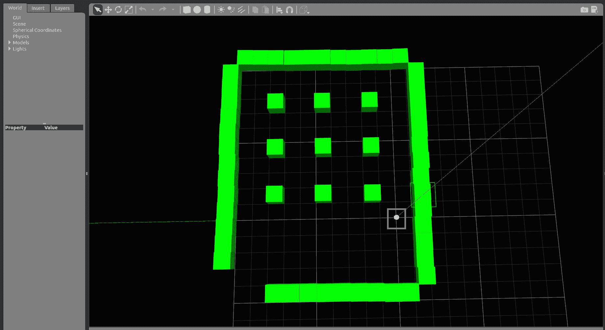

酒店环境中的 Gazebo 中的 Chefbot

空间内部的九个立方体代表九张桌子。机器人可以导航到任何一张桌子去送餐。我们将学习如何做到这一点，但在那之前，我们将学习如何从机器人模型中可视化不同类型的传感器数据。

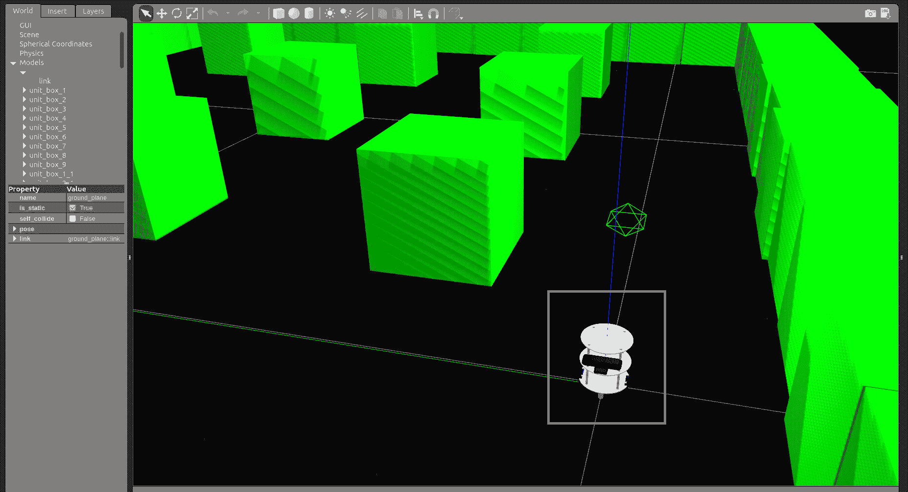

酒店环境中的 Gazebo 中的 Chefbot

以下命令将启动 Rviz，显示来自机器人的传感器数据：

```py
    $ roslaunch chefbot_description view_robot.launch  
```

这将生成传感器数据的可视化，如下面的截图所示：

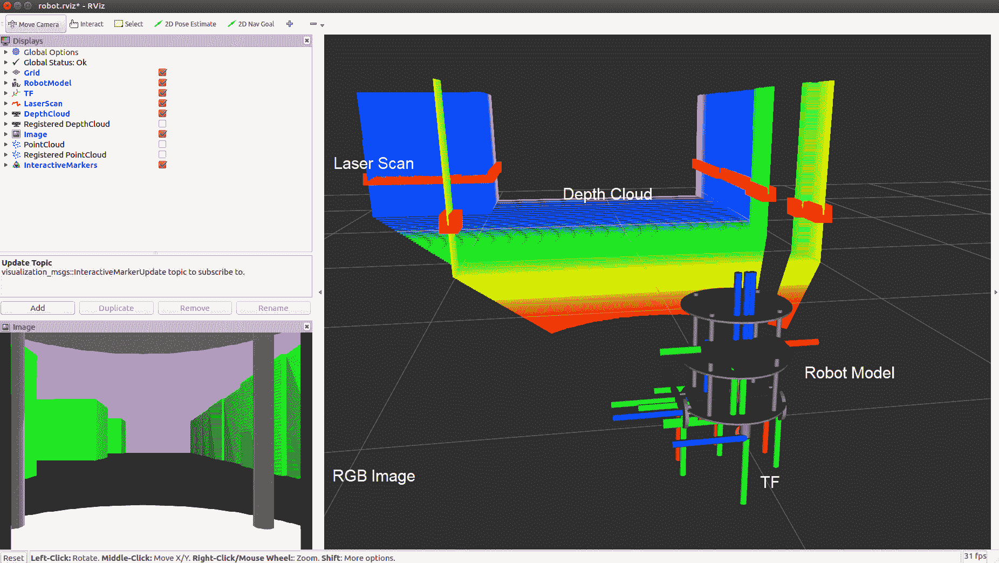

Rviz 中的 Chefbot 传感器可视化

我们可以启用 Rviz 显示类型来查看不同类型的传感器数据。在先前的图中，你可以看到深度云、激光扫描、TF、机器人模型和 RGB 相机图像。

# 开始使用同时定位与建图

Chefbot 的一个要求是它应该能够自主导航环境并递送食物。为了满足这一要求，我们必须使用几个算法，例如 SLAM（同时定位与建图）和 AMCL（自适应蒙特卡洛定位）。解决自主导航问题有不同方法。在本书中，我们主要坚持使用这些算法。SLAM 算法用于在相同地图上同时进行环境建图和定位机器人。这似乎是一个鸡生蛋的问题，但现在有不同算法可以解决它。AMCL 算法用于在现有地图上定位机器人。本书中使用的算法称为 Gmapping ([`www.openslam.org/gmapping.html`](http://www.openslam.org/gmapping.html))，它实现了 Fast SLAM 2.0 ([`robots.stanford.edu/papers/Montemerlo03a.html`](http://robots.stanford.edu/papers/Montemerlo03a.html))。标准的 gmapping 库被封装在一个名为 ROS Gmapping ([`wiki.ros.org/gmapping`](http://wiki.ros.org/gmapping)) 的 ROS 软件包中，可以在我们的应用中使用。

SLAM 节点的想法是，当我们移动机器人绕环境移动时，它将使用激光扫描数据和里程计数据创建环境的地图。

请参阅 ROS Gmapping 维基页 [`wiki.ros.org/gmapping`](http://wiki.ros.org/gmapping) 以获取更多详细信息。

# 在 Gazebo 环境中实现 SLAM

在本节中，我们将学习如何实现 SLAM 并将其应用于我们构建的仿真。您可以在 `chefbot_gazebo/launch/gmapping_demo.launch` 和 `launch/includes/gmapping.launch.xml` 中查看代码。基本上，我们正在使用 gmapping 软件包中的一个节点，并使用适当的参数进行配置。`gmapping.launch.xml` 代码片段包含了该节点的完整定义。以下是该节点的代码片段：

```py
<launch>  
 <arg name="scan_topic" default="scan" /> 

  <node pkg="gmapping" type="slam_gmapping" name="slam_gmapping" output="screen"> 
    <param name="base_frame" value="base_footprint"/> 
    <param name="odom_frame" value="odom"/> 
    <param name="map_update_interval" value="5.0"/> 
    <param name="maxUrange" value="6.0"/> 
    <param name="maxRange" value="8.0"/> 
```

我们所使用的节点名称是 `slam_gmapping`，而软件包名为 `gmapping`。我们必须为此节点提供一些参数，这些参数可以在 Gmapping 维基页面上找到。

# 使用 SLAM 创建地图

在本节中，我们将学习如何使用 SLAM 创建我们环境的地图。然而，首先我们必须使用一些命令来启动建图。您应该在每个 Linux 终端中执行每个命令。

首先，我们必须使用以下命令启动我们的仿真：

```py
    $ roslaunch chefbot_gazebo chefbot_hotel_world.launch  
```

接下来，我们必须在新的终端中启动键盘遥控节点。这将帮助我们使用键盘手动移动机器人：

```py
    $ roslaunch chefbot_gazebo keyboard_teleop.launch  
```

下一个命令将在新的终端中启动 SLAM：

```py
    $ roslaunch chefbot_gazebo gmapping_demo.launch  
```

现在，建图过程将开始。为了可视化建图过程，我们可以使用 **导航** 设置启动 Rviz：

```py
    $ roslaunch chefbot_description view_navigation.launch  
```

现在，我们可以看到在 Rviz 中创建的地图，如下面的截图所示：

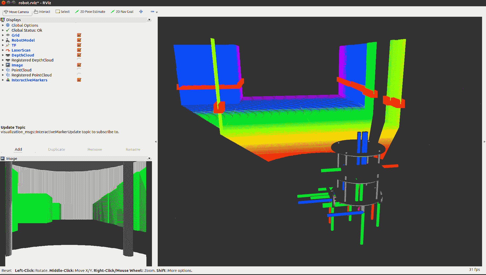

使用 Gmapping 在 Rviz 中创建地图。

现在，我们可以使用 teleop 节点来移动机器人，您会看到在 Rviz 中正在创建地图。为了创建一个良好的环境地图，您必须缓慢移动机器人，并且通常需要旋转机器人。当我们移动机器人在环境中并构建地图时，您可以使用以下命令保存当前地图：

```py
    $ rosrun map_server map_saver -f ~/Desktop/hotel  
```

地图将被保存为`*.pgm`和`*.yaml`，其中`pgm`文件是地图，`yaml`文件是地图的配置。您可以在您的桌面上看到保存的地图。

在机器人周围移动后，您可能会得到一个完整的地图，如图下所示：

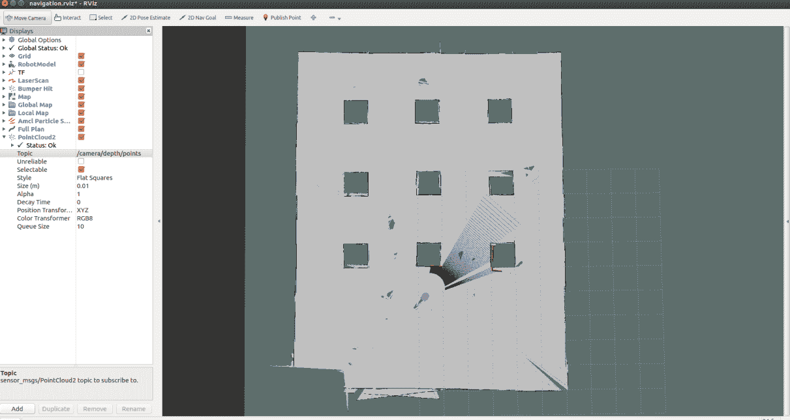

使用 Gmapping 生成的最终地图。

地图可以随时保存，但请确保机器人覆盖了环境的整个区域并已绘制了其所有空间，如图中所示*.* 一旦我们确信地图已完全构建，再次输入`map_saver`命令并关闭终端。如果您无法绘制环境，可以从`chefbot_gazebo/maps/hotel`检查现有地图。

# 开始使用自适应蒙特卡洛定位

我们已成功构建了环境的地图。现在我们必须从当前机器人位置自主导航到目标位置。在开始自主导航之前的第一步是在当前地图中定位机器人。我们在地图上定位所使用的算法称为 AMCL。AMCL 使用粒子滤波器跟踪机器人相对于地图的位置。我们使用 ROS 包在我们的机器人中实现 AMCL（[`wiki.ros.org/amcl`](http://wiki.ros.org/amcl)）。与 Gmapping 类似，`amcl`节点有很多参数需要配置，该节点位于`amcl`包内。您可以在 ROS wiki 页面上找到所有 amcl 参数。

那么，我们如何为我们的机器人启动 AMCL 呢？有一个启动文件可以做到这一点，它位于`chefbot_gazebo/amcl_demo.launch`和`chefbot_gazebo/includes/amcl.launch.xml`。

我们可以看到`amcl_demo.launch`的定义。以下代码显示了此启动文件的定义：

```py
<launch> 
  <!-- Map server --> 
  <arg name="map_file" default="$(find chefbot_gazebo)/maps/hotel.yaml"/> 

  <node name="map_server" pkg="map_server" type="map_server" args="$(arg map_file)" /> 
```

在这个启动文件中的第一个节点是从`map_server`包中启动`map_server`。`map_server`节点加载我们已保存的静态地图并将其发布到名为`map`（`nav_msgs/OccupancyGrid`）的主题中。我们可以将地图文件作为`amcl_demo.launch`文件的参数提及，如果有地图文件，`map_server`节点将加载该文件；否则，它将加载默认地图，该地图位于`chefbot_gazeob/maps/hotel.yaml`文件中。

在加载地图后，我们启动`amcl`节点并移动基础节点。`amcl`节点有助于在当前`map`上定位机器人，以及 ROS 导航堆栈中的`move_base`节点，它有助于将机器人从起点导航到目标位置。我们将在接下来的章节中了解更多关于`move_base`节点的内容。`move_base`节点也需要配置参数。参数文件保存在`chefbot_gazebo/param`文件夹中，如下所示：

```py
  <!-- Localization --> 
  <arg name="initial_pose_x" default="0.0"/> 
  <arg name="initial_pose_y" default="0.0"/> 
  <arg name="initial_pose_a" default="0.0"/> 
  <include file="$(find chefbot_gazebo)/launch/includes/amcl.launch.xml"> 
    <arg name="initial_pose_x" value="$(arg initial_pose_x)"/> 
    <arg name="initial_pose_y" value="$(arg initial_pose_y)"/> 
    <arg name="initial_pose_a" value="$(arg initial_pose_a)"/> 
  </include> 

  <!-- Move base --> 
  <include file="$(find chefbot_gazebo)/launch/includes/move_base.launch.xml"/> 
</launch> 

```

您可以从以下链接了解更多关于 ROS 导航堆栈的信息。

[`wiki.ros.org/navigation/Tutorials/RobotSetup`](http://wiki.ros.org/navigation/Tutorials/RobotSetup)

# 在 Gazebo 环境中实现 AMCL

在本节中，我们将学习如何在 Chefbot 中实现 AMCL。我们将使用以下步骤在模拟中集成 AMCL。每个命令应在每个终端中执行。

第一个命令启动 Gazebo 模拟器：

```py
    $ roslaunch chefbot_gazebo chefbot_hotel_world.launch  
```

现在我们可以启动 AMCL 启动文件，带或不带地图文件作为参数。如果您想使用您自己构建的自定义地图，请使用以下命令：

```py
    $ roslaunch chefbot_gazebo amcl_demo.launch map_file:=/home/<your_user_name>/Desktop/hotel  
```

如果您想使用默认地图，可以使用以下命令：

```py
    $ roslaunch chefbot_gazebo amcl_demo.launch  
```

在启动 AMCL 之后，我们可以启动 Rviz 来可视化地图和机器人。您将在以下屏幕截图中看到 Rviz 中的视图。您可以看到一个地图和一个被绿色粒子包围的机器人。这些绿色粒子被称为`amcl`粒子，它们表示机器人位置的不确定性。如果机器人周围有更多的粒子，这意味着机器人位置的不确定性更高。当它开始移动时，粒子计数将减少，其位置将更加确定。如果机器人无法定位地图的位置，我们可以在 Rviz（在工具栏上）使用`2D Pose Estimate`按钮手动设置机器人在地图上的初始位置。您可以在以下屏幕截图中看到该按钮：

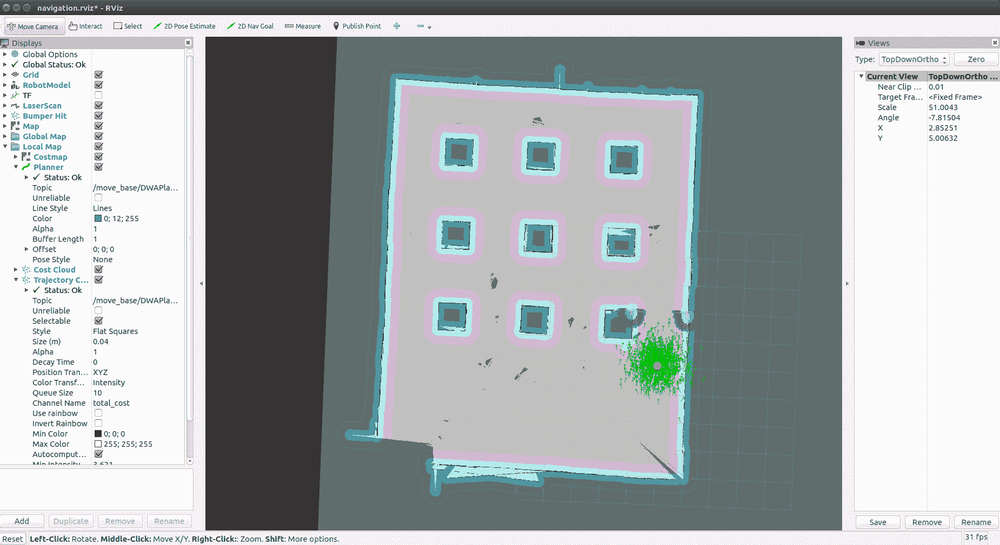

在酒店地图上启动 AMCL。

如果您在 Rviz 中放大机器人的位置，您可以看到粒子，如前述屏幕截图所示。我们还可以看到机器人周围的不同颜色的障碍物：

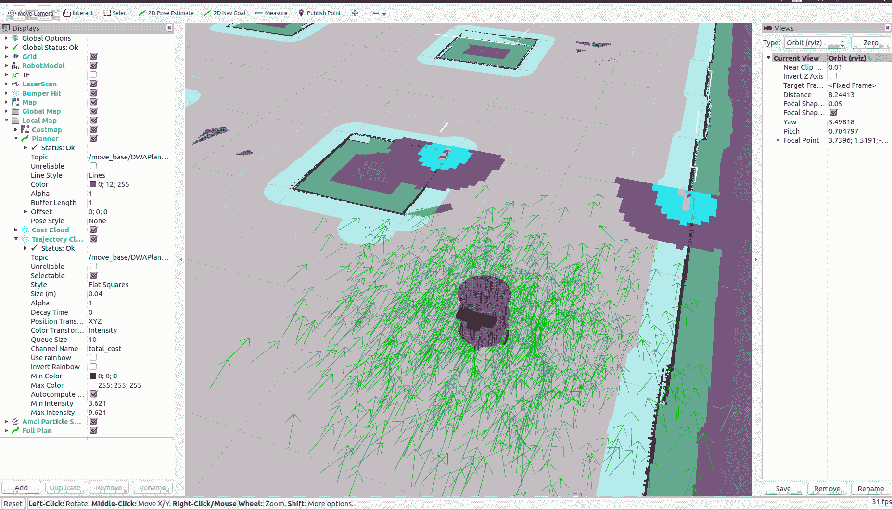

机器人周围的 AMCL 云。

在下一节中，我们将学习如何编程 Chefbot 以自主导航此地图。您不需要关闭当前终端；我们可以在 Rviz 本身中自主导航机器人。

# 使用 Gazebo 在酒店中自主导航 Chefbot

要启动机器人的自主导航，我们只需在地图上指定目标机器人的位置。在 Rviz 中有一个名为 2D Nav Goal 的按钮。我们可以点击该按钮并在地图上点击一个点。你现在可以看到一个箭头指示机器人的位置。当你给出地图上的目标位置时，你可以看到机器人正在从当前位置到目标位置规划路径。它将缓慢地从当前位置移动到目标位置，避开所有障碍。以下截图显示了机器人到目标位置的路径规划和导航。机器人周围的彩色网格显示了机器人的局部成本图，以及局部规划路径和机器人周围的障碍物：

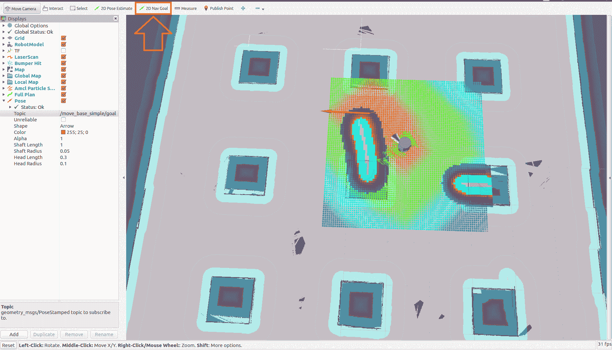

机器人的自主导航。

这样，如果我们命令地图内部靠近桌子位置，机器人可以前往那个桌子，提供食物，然后返回到其起始位置。我们不必从 Rviz 中命令它，我们可以编写一个 ROS 节点来完成同样的任务。这将在本书的最后几章中解释。

# 摘要

在本章中，我们学习了如何模拟自己的机器人，称为 Chefbot。我们在上一章中探讨了 Chefbot 的设计。我们以学习 Gazebo 模拟器和它的不同特性和功能开始本章。之后，我们探讨了如何使用 ROS 框架和 Gazebo 模拟器进行机器人模拟。我们安装了 TurtleBot 2 包并在 Gazebo 中测试了 Turtlebot 2 模拟。之后，我们创建了 Chefbot 模拟，并在酒店环境中使用了 Gmapping、AMCL 和自主导航。我们了解到，模拟的准确性取决于地图，如果生成的地图完美，机器人在模拟中会工作得更好。

在下一章中，我们将学习如何设计机器人的硬件和电子电路。

# 问题

1.  我们如何在 Gazebo 中建模传感器？

1.  ROS 如何与 Gazebo 接口？

1.  模拟中重要的 URDF 标签有哪些？

1.  Gmapping 是什么，我们如何在 ROS 中实现它？

1.  ROS 中的`move_base`节点有什么功能？

1.  AMCL 是什么，我们如何在 ROS 中实现它？

# 进一步阅读

要了解更多关于 URDF、Xacro 和 Gazebo 的信息，您可以参考书籍《Mastering ROS for Robotics Programming - Second Edition》([`www.packtpub.com/hardware-and-creative/mastering-ros-robotics-programming-second-edition`](https://www.packtpub.com/hardware-and-creative/mastering-ros-robotics-programming-second-edition))。
