# 设计 ChefBot 硬件和电路

在本章中，我们将讨论 ChefBot 硬件的设计和工作原理，并查看其硬件组件的选择。在前一章中，我们使用 Gazebo 和 ROS 在酒店环境中设计和模拟了基本的机器人框架，并测试了一些变量，如机器人本体质量、电机扭矩、轮径等。我们还测试了 ChefBot 在酒店环境中的自主导航能力。

要使用硬件实现这一点，我们需要选择所有硬件组件，并找出如何连接所有这些组件。我们知道这个机器人的主要功能是导航：这个机器人将能够从起始位置导航到终点位置，而不会与周围环境发生碰撞。我们将讨论实现这一目标所需的不同传感器和硬件组件。我们将查看这些组件的方块图表示及其解释，并讨论机器人的主要功能和物理操作。最后，我们需要选择构建机器人所需的组件。我们还将熟悉可以购买这些组件的在线商店。

如果你有一个 TurtleBot，你可以跳过这一章，因为这一章仅针对需要创建自己机器人硬件的人。让我们看看在设计硬件时我们必须满足的规格。机器人硬件主要包括机器人底盘、传感器、执行器、控制板和 PC。

本章将涵盖以下主题：

+   Chefbot 机器人的方块图和描述

+   机器人组件选择和描述

+   Chefbot 硬件的工作原理

# 技术要求

本章描述了构建机器人所需的组件。你必须购买这些组件或类似组件才能构建 ChefBot。

# ChefBot 硬件的规格

在本节中，我们将讨论第三章“建模差动驱动机器人”中提到的某些重要规格。最终的机器人原型将满足以下规格：

+   **简单且经济实惠的机器人底盘设计**：与现有机器人相比，机器人底盘设计应简单且经济实惠。

+   **自主导航功能**：机器人应能够自主导航，并且应包含执行此操作所需的传感器。

+   **长电池寿命**：机器人应具有较长的电池寿命，以便能够连续工作。它的工作时间应超过一小时。

+   **障碍物避让**：机器人应能够避开其周围的环境中的静态和动态物体。

机器人硬件设计应满足这些规格。让我们看看连接这个机器人组件的一种可能方式。在下一节中，我们将查看机器人的方块图，并使用它来检查其工作原理。

# 机器人方块图

机器人的运动由两个直流齿轮电机控制，使用编码器。这两个电机由电机驱动器驱动。电机驱动器与嵌入式控制器板相连，控制器板将发送命令给电机驱动器以控制电机的运动。电机的编码器与控制器板相连，以计算电机轴的旋转次数。这些数据用于计算机器人的里程数据。还有超声波传感器与控制器板相连，用于检测障碍物并测量与障碍物的距离。还有一个 IMU 传感器以改进里程计算。嵌入式控制器板与 PC 相连，进行机器人中的所有高端处理。视觉和声音传感器与 PC 相连，并连接 Wi-Fi 以进行远程操作。机器人的每个组件在下图中均有说明：

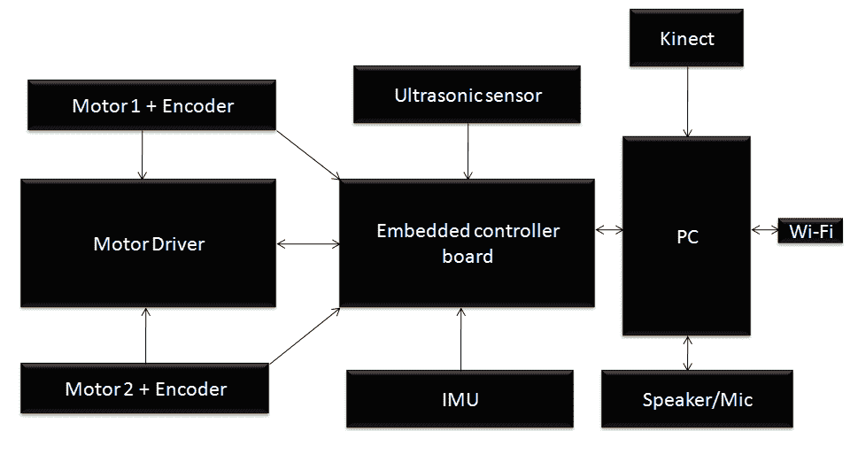

机器人硬件框图

# 电机和编码器

我们将要设计的机器人是一个双轮差速驱动机器人，因此我们需要两个电机来驱动它。每个电机都包含四象限编码器（[`www.creative-robotics.com/quadrature-intro`](http://www.creative-robotics.com/quadrature-intro)），这样我们就可以获取电机的旋转反馈数据。

四象限编码器将发送有关电机旋转的方波脉冲数据；我们可以解码这些脉冲以获取编码器的脉冲数，这些脉冲数可以用于反馈。如果我们知道车轮的直径和电机的脉冲数，我们可以计算出移动机器人的位移和角度。这种计算对我们尝试导航机器人非常有用。

# 为机器人选择电机、编码器和车轮

从模拟中，我们得到了关于机器人参数的初步想法。在实验模拟参数时，我们提到驱动机器人的电机扭矩需要为 18 N，但计算出的扭矩略高于这个值；我们选择了一个标准扭矩电机，其扭矩非常接近实际扭矩，以便使电机选择更容易。我们可能考虑的标准电机之一来自 Pololu。根据我们的设计规范，我们可以选择一个高扭矩直流齿轮电机，该电机在 12 V 直流电压下工作，速度为 80 RPM。

以下图像显示了为该机器人选择的电机。该电机带有集成的四象限编码器，每转电机轴有 64 个计数，对应于变速箱输出轴每转 8,400 个计数。

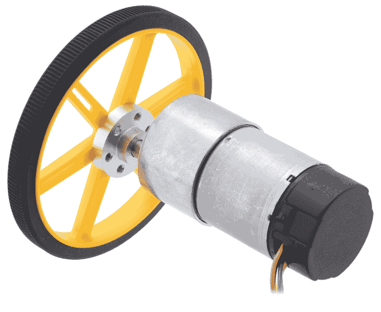

带编码器和轮子的直流齿轮电机（见 https://www.pololu.com/product/2827）

这款电机有六个不同颜色的引脚。该电机引脚的描述如下表所示：

| **颜色** | **功能** |
| --- | --- |
| 红色 | 电机电源（连接到一个电机端子） |
| 黑色 | 电机电源（连接到另一个电机端子） |
| 绿色 | 编码器 GND |
| 蓝色 | 编码器 Vcc（3.5 V-20 V） |
| 黄色 | 编码器 A 输出 |
| 白色 | 编码器 B 输出 |

根据我们的设计规范，我们将选择 90 毫米的轮子直径。Pololu 提供 90 毫米的轮子，可在[`www.pololu.com/product/1439`](http://www.pololu.com/product/1439)找到。前面的图像显示了安装了该轮子的电机。

连接电机和轮子所需的其它连接器如下所示：

+   将轮子安装到电机轴上所需的安装座可在[`www.pololu.com/product/1083`](http://www.pololu.com/product/1083)找到。

+   电机安装到机器人底盘上的 L 型支架可在[`www.pololu.com/product/1084`](http://www.pololu.com/product/1084)找到。

# 电机驱动器

**电机驱动器**或**电机控制器**是一种可以控制电机速度的电路。通过控制电机，我们指的是我们可以控制电机两端的电压，也可以控制电机的方向和速度。如果我们改变电机端子的极性，电机可以顺时针或逆时针旋转。

**H-bridge**电路在电机控制器中常用。**H-bridge**是一种电子电路，可以施加负载的任一方向的电压。它具有高电流处理能力，可以改变电流流动的方向。

下图显示了一个使用开关的基本 H-bridge 电路：

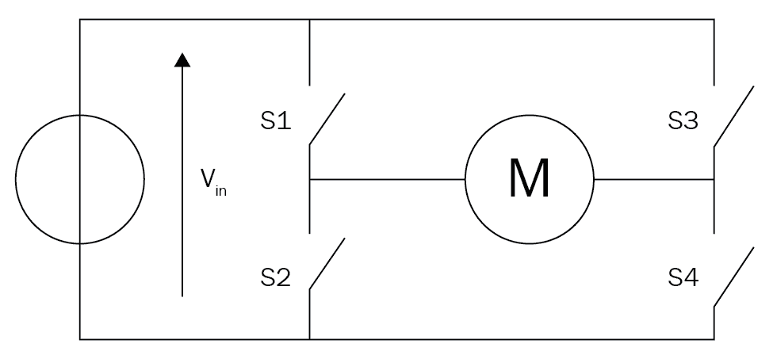

H-bridge 电路

根据四个开关的状态，电机方向如下所示：

| **S1** | **S2** | **S3** | **S4** | **结果** |
| --- | --- | --- | --- | --- |
| 1 | 0 | 0 | 1 | 电机向右移动 |
| 0 | 1 | 1 | 0 | 电机向左移动 |
| 0 | 0 | 0 | 0 | 电机自由运行 |
| 0 | 1 | 0 | 1 | 电机刹车 |
| 1 | 0 | 1 | 0 | 电机刹车 |
| 1 | 1 | 0 | 0 | 电机向前冲 |
| 0 | 0 | 1 | 1 | 电机向前冲 |
| 1 | 1 | 1 | 1 | 电机向前冲 |

我们在前面的电机驱动器电路图中看到了 H-bridge 电路的基本原理。现在，我们将为我们的应用选择一个电机驱动器，并讨论其工作原理。

# 选择电机驱动器/控制器

Pololu 有一些与所选电机兼容的电机驱动器。以下图像显示了我们将用于我们的机器人的其中一个电机驱动器：

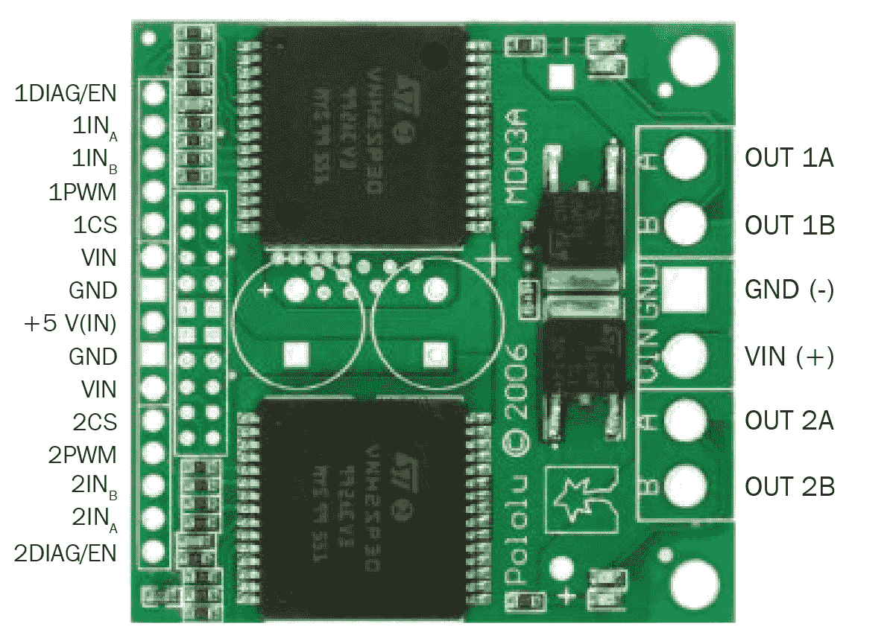

双 VNH2SP30 电机驱动器载体 MD03A

此电机驱动器可在[`www.pololu.com/product/708`](http://www.pololu.com/product/708)找到。

此驱动器可以驱动两个电机，最大电流额定值为 30 A，并为每个电机包含两个集成的 IC 进行驱动。此驱动器的引脚描述将在后续章节中给出。

# 输入引脚

以下引脚是电机驱动器的输入引脚，通过这些引脚我们可以主要控制电机的速度和方向：

| **引脚名称** | **功能** |
| --- | --- |
| 1DIAG/EN, 2DIAG/EN | 这些监控电机驱动器 1 和 2 的故障条件。在正常操作中，它们将保持断开。 |

| 1INa, 1INb, 2INa, 2INb | 这些引脚将以下方式控制电机 1 和 2 的方向：

+   如果 INA = INB = 0，电机将停止

+   如果 INA = 1，INB = 0，电机将顺时针旋转

+   如果 INA = 0，INB = 1，电机将逆时针旋转

+   * 如果 INA = INB = 1，电机将停止

|

| 1PWM, 2PWM | 这将通过以非常高的速度开启和关闭来控制电机 1 和 2 的速度。 |
| --- | --- |
| 1CS, 2CS | 这是每个电机的电流检测引脚。 |

# 输出引脚

电机驱动器的输出引脚将驱动两个电机。以下为输出引脚：

| **引脚名称** | **功能** |
| --- | --- |
| OUT 1A, OUT 1B | 这些引脚可以连接到电机 1 的电源端子。 |
| OUT 2A, OUT 2B | 这些引脚可以连接到电机 2 的电源端子。 |

# 电源引脚

以下为电源引脚：

| **引脚名称** | **功能** |
| --- | --- |
| VIN (+), GND (-) | 这些是两个电机的供电引脚。电压范围从 5.5 V 到 16 V。 |
| +5 VIN, GND (-) | 这是电机驱动器的电源。电压应为 5 V。 |

# 嵌入式控制器板

**控制器板**通常是 I/O 板，可以以数字脉冲的形式发送控制信号到 H-桥/电机驱动器板，并且可以接收来自传感器的输入，例如超声波和红外传感器。我们还可以将电机编码器与控制板连接，以便发送来自电机的数据。

本机器人控制器板的主要用途如下：

+   接口电机驱动器和编码器

+   接口超声波声音传感器

+   向 PC 发送和接收传感器值

我们将在接下来的章节中处理 I/O 板和与不同组件的接口。一些更受欢迎的 I/O 板是 Arduino (arduino.cc) 和德州仪器的 Tiva-C LaunchPad ([`www.ti.com/tool/EK-TM4C123GXL`](http://www.ti.com/tool/EK-TM4C123GXL))。我们选择 Tiva-C LaunchPad 而不是 Arduino，原因如下：

+   Tiva-C LaunchPad 基于 32 位 ARM Cortex-M4 微控制器，具有 256 KB 闪存，32 KB SRAM 和 80 MHz 数据传输频率；大多数 Arduino 板运行在这些规格以下。

+   优异的处理性能与快速的中断处理相结合。

+   12 个定时器。

+   16 个 PWM 输出。

+   2 个正交编码器输入。

+   8 个**通用异步收发器**（**UART**）。

+   5 V 容错的**通用输入/输出**（**GPIO**）。

+   与 Arduino 板相比，成本低且体积小。

+   易于编程的接口 IDE 称为 Energia (http://energia.nu/)。在 Energia 中编写的代码与 Arduino 板兼容。

以下图片显示了德州仪器的 Tiva-C LaunchPad：

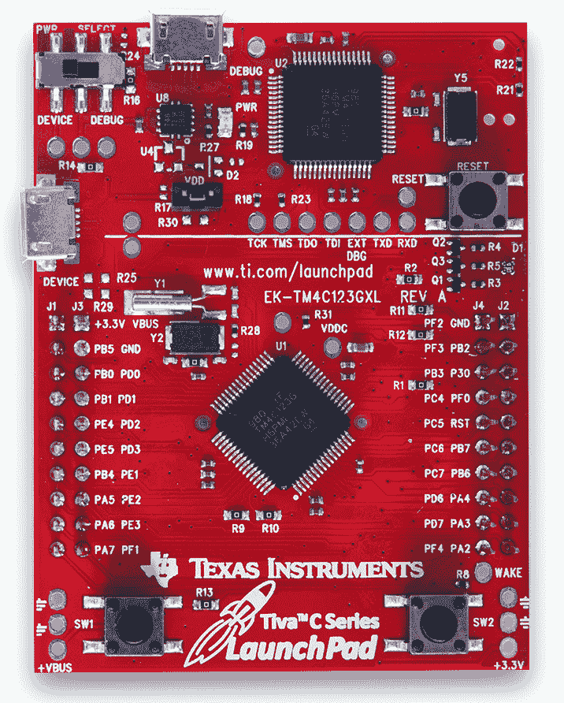

Tiva-C LaunchPad 123（http://www.ti.com/tool/EK-TM4C123GXL）

德州仪器的 LaunchPad 系列引脚图可以在[`energia.nu/pin-maps/guide_stellarislaunchpad/`](http://energia.nu/pin-maps/guide_stellarislaunchpad/)找到。此引脚图与所有 LaunchPad 系列版本兼容。在 Energia IDE 编程时也可以使用此图。

# 超声波传感器

**超声波传感器**，也称为 ping 传感器，主要用于测量物体距离。ping 传感器的主要应用是避免障碍物。超声波传感器发出高频声波并评估从物体接收到的回声。传感器将计算发送和接收回声之间的延迟并确定其与物体的距离。

在我们的机器人中，无碰撞导航是设计规范的重要组成部分，否则机器人可能会受损。您将在下一节中看到超声波传感器的图像。此传感器可以安装在机器人的侧面，以检测机器人的侧面和后部的碰撞。Kinect 在机器人应用中主要用于障碍物检测和避障。Kinect 只能在 0.8 m 的范围内期望准确，因此可以使用超声波传感器检测 0.8 m 范围限制之外的剩余距离。在这种情况下，超声波传感器实际上是我们机器人的附加组件，以提高其避障和检测能力。

# 选择超声波传感器

可用的更受欢迎且价格低廉的超声波传感器之一是**HC-SR04**。我们选择此传感器用于我们的机器人，原因如下：

+   检测范围从 2 cm 到 4 m

+   工作电压为 5 V

+   工作电流非常低，通常为 15 mA

我们可以使用这个传感器来准确检测障碍物。它也工作在 5 V。以下是 HC-SR04 及其引脚图的照片：

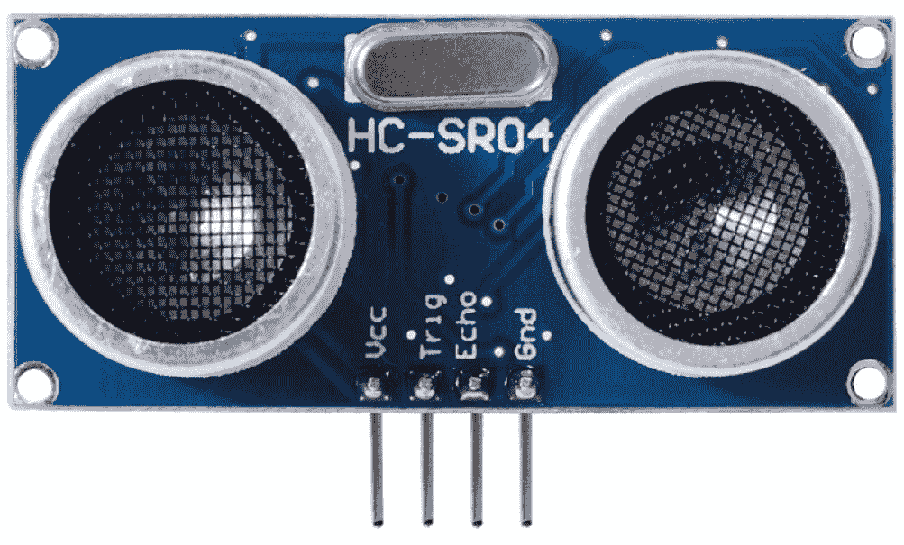

超声波声音传感器（https://www.makerfabs.com/index.php?route=product/product&product_id=72）

引脚及其功能如下所示：

| **引脚** | **功能** |
| --- | --- |
| Vcc, GND | 这些是超声波传感器的供电引脚。通常，我们需要施加 5 V 才能使其正常工作。 |
| Trig | 这是传感器的输入引脚。我们需要向此引脚施加特定持续时间的脉冲来发送超声波。 |
| Echo | 这是传感器的输出引脚。它将在根据接收触发脉冲的延迟生成脉冲的持续时间。 |

# 惯性测量单元

我们将在机器人中使用**惯性测量单元**（IMU）来获取里程值和机器人姿态的良好估计。仅从编码器计算出的里程值可能不足以进行有效的导航，因为它们可能包含错误。为了补偿机器人运动过程中的误差，特别是旋转，我们将在此机器人中使用 IMU。我们选择 MPU 6050 作为 IMU 的原因如下：

+   在 MPU 6050 中，加速度计和陀螺仪集成在单个芯片上

+   它提供高精度和高灵敏度

+   我们能够与磁力计接口，以获得更好的 IMU 性能

+   MPU 6050 的扩展板非常便宜

+   MPU 6050 可以直接与 LaunchPad 接口

+   MPU 6050 和 LaunchPad 都与 3.3 V 兼容

+   还提供了软件库，以便更容易地在 MPU 6050 和 LaunchPad 之间进行接口

以下图像显示了 MPU 6050 的扩展板：

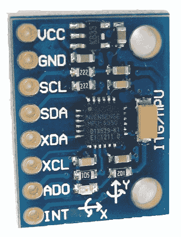

MPU 6050 设备

引脚及其功能如下所示：

| **引脚** | **功能** |
| --- | --- |
| VDD, GND | 供电电压 2.3 V-3.4 V |
| INT | 当数据到达设备缓冲区时，此引脚将生成中断 |
| SCL, SDA | **串行数据线**（SDA）和**串行时钟线**（SCL）用于 I2C 通信 |
| ASCL, ASDA | 用于与磁力计通信的辅助 I2C |

我们可以从 Amazon 购买扩展板，链接为 [`a.co/9EBIquO`](http://a.co/9EBIquO)。

# Kinect/Orbbec Astra

**Kinect** 是一个 3D 视觉传感器，主要用于 3D 视觉应用和基于运动的游戏。我们使用 Kinect 进行 3D 视觉。使用 Kinect，机器人将获得周围环境的 3D 图像。3D 图像被转换为更细的点，这些点被收集形成点云。点云数据将包含构成周围环境的所有 3D 参数。

在机器人上，Kinect 的主要用途是模拟激光扫描仪的功能。激光扫描仪数据对于 SLAM 算法构建环境地图至关重要。激光扫描仪是一种非常昂贵的设备，因此，我们不必购买昂贵的激光扫描仪，可以将 Kinect 转换为虚拟激光扫描仪。Kinect 已正式停产，但一些供应商仍然有售。Kinect 的一个替代品是 Orbbec Astra ([`orbbec3d.com/product-astra/`](https://orbbec3d.com/product-astra/))。它将支持为 Kinect 编写的相同软件。点云到激光数据的转换是通过此软件完成的，因此如果您使用 Astra，我们只需要更改设备驱动程序；软件的重置方式相同。在生成环境地图后，机器人可以导航周围环境。以下图像显示了 Kinect 传感器（A）和 Orbbec Astra（B）：

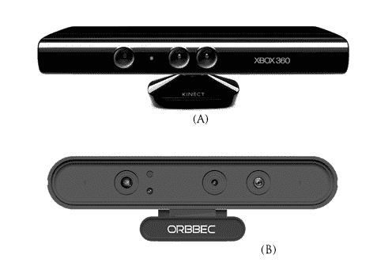

Kinect 和 Orbbec Astra

Kinect 主要有一个红外摄像头和投影仪，以及一个 RGB 摄像头。红外摄像头和投影仪生成周围区域的 3D 点云。它还配备了麦克风阵列和可电动倾斜的机构，用于上下移动 Kinect。Astra 与 Kinect 非常相似。

我们可以从[`www.amazon.co.uk/Xbox-360-Kinect-Sensor-Adventures/dp/B0036DDW2G`](http://www.amazon.co.uk/Xbox-360-Kinect-Sensor-Adventures/dp/B0036DDW2G)购买 Kinect。

我们可以从[`orbbec3d.com/product-astra/`](https://orbbec3d.com/product-astra/)购买 Astra。

# 中央处理器

机器人主要是由运行在其 PC 上的导航算法控制的。我们可以选择笔记本电脑、迷你 PC 或上网本来用于机器人的处理功能。最近，英特尔推出了一款名为英特尔**下一代计算单元**（**NUC**）的迷你 PC。它具有超小尺寸（体积），轻便，并配备英特尔赛扬、Core i3 或 Core i5 处理器。它可以支持高达 16 GB 的 RAM，并集成 Wi-Fi/蓝牙。我们选择英特尔 NUC 是因为其性能、超小尺寸和轻便。我们不打算选择流行的板卡，如树莓派([`www.raspberrypi.org/`](http://www.raspberrypi.org/))或贝格尔骨([`beagleboard.org/`](http://beagleboard.org/))，因为我们需要高性能，而这些板卡无法提供。

我们使用的 NUC 是**英特尔 DN2820FYKH**。以下是该计算机的规格：

+   英特尔赛扬双核处理器，主频 2.39 GHz

+   4 GB RAM

+   500 GB 硬盘

+   英特尔集成显卡

+   耳机/麦克风插孔

+   12 V 供电

以下图像显示了英特尔 NUC 迷你计算机：

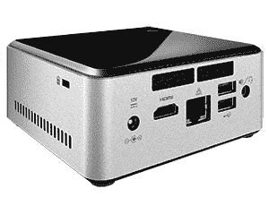

英特尔 NUC DN2820FYKH

我们可以从 Amazon 购买 NUC，链接为[`a.co/2F2flYl`](http://a.co/2F2flYl)。

这种型号的 NUC 是旧型号；如果不可用，您可以使用以下链接检查低成本 NUC：

+   英特尔 NUC BOXNUC6CAYH ([`www.intel.com/content/www/us/en/products/boards-kits/nuc/kits/nuc6cayh.html`](https://www.intel.com/content/www/us/en/products/boards-kits/nuc/kits/nuc6cayh.html))

+   **英特尔 NUC 套件 NUC7CJYH** ([`www.intel.com/content/www/us/en/products/boards-kits/nuc/kits/nuc7cjyh.html`](https://www.intel.com/content/www/us/en/products/boards-kits/nuc/kits/nuc7cjyh.html))

+   **英特尔 NUC 套件 NUC5CPYH** ([`www.intel.com/content/www/us/en/products/boards-kits/nuc/kits/nuc5cpyh.html`](https://www.intel.com/content/www/us/en/products/boards-kits/nuc/kits/nuc5cpyh.html))

+   **英特尔 NUC 套件 NUC7PJYH** ([`www.intel.com/content/www/us/en/products/boards-kits/nuc/kits/nuc7pjyh.html`](https://www.intel.com/content/www/us/en/products/boards-kits/nuc/kits/nuc7pjyh.html))

# 扬声器/麦克风

机器人的主要功能是自主导航。我们将添加一个附加功能，使机器人能够通过语音与用户交互。机器人可以通过语音输入接收命令，并使用**文本到语音**（**TTS**）引擎与用户交谈，该引擎可以将文本转换为语音格式。麦克风和扬声器对于此应用是必不可少的。对于此硬件，我们不会推荐特定的选择。如果扬声器麦克风是 USB 兼容的，那就太好了。另一个选择是蓝牙耳机。

# 电源/电池

最重要的硬件组件之一是电源。我们在规格中看到，机器人需要工作超过一小时。如果电池的供电电压与组件所需的电压兼容，那就很好。此外，如果电池的尺寸和重量小于我们预期的，它将不会影响机器人的有效载荷。

另一个关注点是整个电路所需的最高电流不会超过电池可以提供的最大电流。电路各部分的最高电压和电流分配如下：

| **组件** | **最大电流（安培）** |
| --- | --- |
| 英特尔 NUC PC | 12 V, 5 A |
| Kinect | 12 V, 1 A |
| 电机 | 12 V, 0.7 A |
| 电机驱动器，超声波传感器，IMU，扬声器 | 5 V, < 0.5 A |

为了满足这些规格，我们正在选择一个 12 V，10 AH 的锂聚合物电池或密封铅酸（SLA）电池用于我们的机器人。以下是我们可用于此目的的典型低成本 SLA 电池：

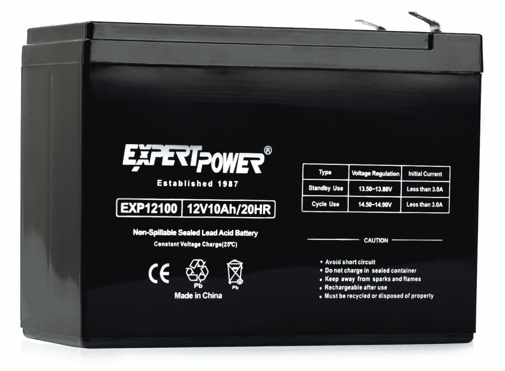

密封铅酸电池

我们可以从[`a.co/iOaMuZe`](http://a.co/iOaMuZe)购买这个电池。你可以根据对你来说有多方便来选择电池，但它应该满足机器人的电力需求。

# ChefBot 硬件工作原理？

我们可以使用以下框图来解释 ChefBot 硬件的工作原理。这是我们的第一个框图的改进版本，因为它提到了每个组件的电压及其互连：

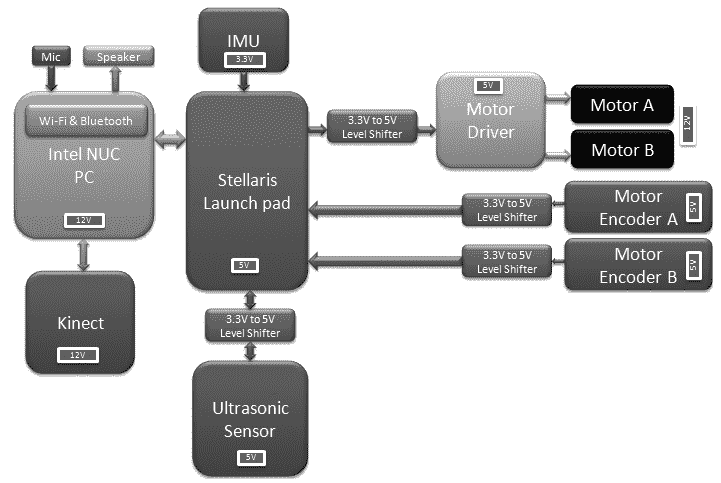

Chefbot 硬件的详细框图

本章的主要目的是设计 ChefBot 的硬件，包括寻找合适的硬件组件以及了解各部分之间的互连。这个机器人的主要功能是执行自主导航。机器人的硬件设计是为了优化自主导航。

机器人驱动基于差动驱动系统，该系统由两个电机和两个轮子组成。有导向轮来支撑主轮。这两个电机可以通过调整它们的旋转方向和速度，使机器人能够在二维平面上朝任何方向移动。

为了控制车轮的速度和方向，我们必须连接一个电机控制器，它可以执行这些功能。我们选择的电机驱动器应该能够同时控制两个电机，并且还应该能够改变它们的方向和速度。

电机驱动引脚与名为 Tiva-C LaunchPad 的微控制器板相连，该板可以发送命令来改变电机的方向和速度。电机驱动器通过电平转换器与 LaunchPad 相连。**电平转换器**是一种可以将电压从 3.3 V 转换为 5 V，反之亦然的电路。我们使用电平转换器是因为电机驱动器在 5 V 的电压下工作，而 LaunchPad 板在 3.3 V 的电压下工作。

每个电机都有一个称为编码器的旋转反馈传感器，可以用来估计机器人的位置。编码器通过电平转换器与 LaunchPad 相连。

与 LaunchPad 相连的其他传感器包括超声波传感器和 IMU。超声波传感器可以检测到靠近的物体，而这些物体无法被 Kinect 传感器检测到。IMU 与编码器一起使用，以获得机器人姿态的良好估计。

所有传感器值都在 LaunchPad 上接收，并通过 USB 发送到 PC。LaunchPad 板运行一个固件代码，可以接收所有传感器值并将它们发送到 PC。

PC 与 Kinect、LaunchPad 板、扬声器和麦克风相连。PC 上运行着 ROS，它将接收 Kinect 数据并将其转换为等效的激光扫描数据。这些数据可以用于使用 SLAM 构建环境地图。扬声器和麦克风用于用户与机器人之间的通信。在 ROS 节点中生成的速度命令被发送到 LaunchPad。LaunchPad 将处理速度命令，并将适当的 PWM 值发送到电机驱动器电路。

在设计和讨论了机器人的硬件工作原理之后，我们可以在下一章中讨论每个组件的详细接口以及为此接口所需的固件编码。

# 摘要

在本章中，我们研究了我们将要设计的机器人的特性。这个机器人的主要特性是其自主导航。机器人可以通过分析传感器读数来导航其周围环境。我们研究了机器人的框图，并讨论了每个模块的作用，选择了满足我们要求的适当组件。我们还建议了一些经济实惠的组件来构建这个机器人。在下一章中，我们将更详细地研究执行器和我们将在这个机器人中使用的它们之间的接口。

# 问题

1.  机器人硬件设计究竟是什么？

1.  H-桥电路是什么？它的功能有哪些？

1.  机器人导航算法的基本组件有哪些？

1.  在选择机器人组件时，需要考虑哪些标准？

1.  关于这个机器人，Kinect 的主要应用是什么？

# 进一步阅读

您可以从以下链接了解更多关于 Tiva-C 启动板的信息：

[TIVA™ C 系列 TM4C123G 启动板入门](http://processors.wiki.ti.com/index.php/Getting_Started_with_the_TIVA%E2%84%A2_C_Series_TM4C123G_LaunchPad)
