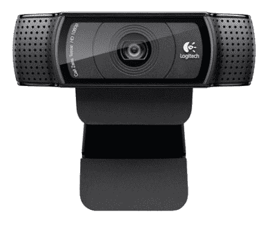
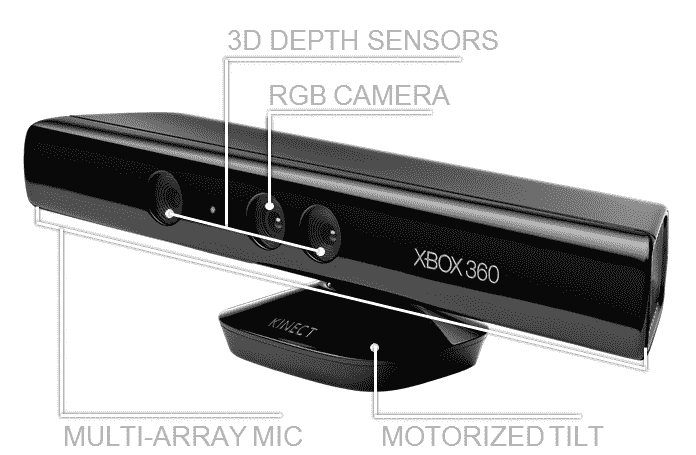

# 使用 ROS 与视觉传感器接口

在上一章中，我们探讨了执行器和如何使用 Tiva-C LaunchPad 板将机器人的传感器接口。在本章中，我们将主要探讨视觉传感器以及它们与我们的机器人使用的接口。

我们正在设计的机器人将配备三维视觉传感器，我们将能够将其与如**开源计算机视觉**（OpenCV）、**开放自然交互（OpenNI**）和**点云库**（PCL）等视觉库接口。三维视觉传感器在我们机器人中的主要应用是自主导航。

我们还将探讨如何将视觉传感器与 ROS 接口，并使用如 OpenCV 等视觉库处理其感知到的图像。在本章的最后部分，我们将探讨我们将用于机器人的映射和定位算法，称为**SLAM**（**同时定位与建图**），以及使用三维视觉传感器、ROS 和图像处理库的实现。

在本章中，我们将涵盖以下主题：

+   机器人视觉传感器和图像库列表

+   OpenCV、OpenNI 和 PCL 简介

+   ROS-OpenCV 接口

+   使用 PCL-ROS 接口进行点云处理

+   将点云数据转换为激光扫描数据

+   SLAM 简介

# 技术要求

为了尝试本章中的示例，您需要一个安装了 ROS Kinetic 的 Ubuntu 16.04 系统，以及一个网络摄像头和一个深度摄像头。

在第一部分，我们将探讨市场上可用的二维和三维视觉传感器，这些传感器可以用于不同的机器人。

# 机器人视觉传感器和图像库列表

二维视觉传感器或普通摄像头提供周围环境的二维图像帧，而三维视觉传感器提供二维图像帧以及一个额外的参数，即每个图像点的深度。我们可以找到每个点相对于传感器轴的*x*、*y*和*z*距离。

市场上有很多视觉传感器。本章中提到了一些可用于我们机器人的二维和三维视觉传感器。

# Pixy2/CMUcam5

以下图片展示了最新的二维视觉传感器，称为 Pixy2/CMUcam5 ([`pixycam.com/pixy-cmucam5/`](https://pixycam.com/pixy-cmucam5/))，它能够以高速和精度检测颜色物体，并且可以与 Arduino 板接口。Pixy 可用于快速目标检测，用户可以教会它需要跟踪的物体。Pixy 模块具有基于 Arm Cortex M4/M0 核心的 CMOS 传感器和 NXP LPC4330 ([`www.nxp.com/`](http://www.nxp.com/))，用于图像处理。以下图片展示了 Pixy/CMUcam5：


Pixy/CMUcam5 ([`a.co/fZtPqck`](http://a.co/1t91hn6))

最常见的 2D 视觉传感器是网络摄像头。它们包含一个 CMOS 传感器和 USB 接口，但它们没有像 Pixy 那样的内置视觉处理能力。

# Logitech C920 网络摄像头

以下图片展示了一款来自 Logitech 的网络摄像头，可以捕捉高达 500 万像素的图片和高清视频：



Logitech HD C920 网络摄像头 (http://a.co/02DUUYd)

# Kinect 360

我们现在将查看市场上的一些 3D 视觉传感器。其中一些更受欢迎的传感器包括 Kinect、英特尔 RealSense D400 系列和 Orbbec Astra。



Kinect 传感器

Kinect 是一种最初为微软 Xbox 360 游戏机开发的 3D 视觉传感器。它主要包含一个 RGB 摄像头、一个红外投影仪、一个红外深度摄像头、一个麦克风阵列和一个用于改变其倾斜角度的电机。RGB 摄像头和深度摄像头以 640 x 480 的分辨率在 30 Hz 的频率下捕捉图像。RGB 摄像头捕捉 2D 彩色图像，而深度摄像头捕捉单色深度图像。Kinect 的深度感应范围在 0.8 米到 4 米之间。

Kinect 的一些应用包括 3D 动作捕捉、骨骼追踪、面部识别和语音识别。

Kinect 可以通过 USB 2.0 接口与 PC 连接，并使用 Kinect SDK、OpenNI 和 OpenCV 进行编程。Kinect SDK 仅适用于 Windows 平台，由微软开发和提供。其他两个库是开源的，适用于所有平台。我们这里使用的 Kinect 是第一代产品；Kinect 的最新版本仅在 Windows 上运行时支持 Kinect SDK（更多详情请见[`www.microsoft.com/en-us/download/details.aspx?id=40278`](https://www.microsoft.com/en-us/download/details.aspx?id=40278)）。

Kinect 系列传感器的生产已经停止，但您仍然可以在亚马逊和 eBay 上找到该传感器。

# Intel RealSense D400 系列


Intel RealSense D400 系列 (https://realsense.intel.com/)

英特尔 RealSense D400 深度传感器是带有红外投影仪的立体摄像头，用于增强深度数据（更多详情请见[`software.intel.com/en-us/realsense/d400`](https://software.intel.com/en-us/realsense/d400)），如图 4 所示。D400 系列中更受欢迎的传感器型号是 D415 和 D435。在图 4 中，左侧的传感器是 D415，右侧的传感器是 D435。每个都由一个立体摄像头对、一个 RGB 摄像头和一个红外投影仪组成。立体摄像头对在红外投影仪的帮助下计算环境的深度。

这款深度相机的特点是可以室内外环境工作。它可以在 90 fps 的帧率下提供 1280 x 720 分辨率的深度图像流，RGB 相机可以提供高达 1920 x 1080 的分辨率。它具有 USB-C 接口，可以实现传感器和计算机之间快速的数据传输。它体积小，重量轻，非常适合机器人视觉应用。

Kinect 和 Intel RealSense 的应用相同，除了语音识别。它们将在 Windows、Linux 和 Mac 上工作。我们可以通过使用 ROS、OpenNI 和 OpenCV 来开发应用程序。以下图显示了 D400 系列相机的框图：

 您可以在以下链接找到关于英特尔 RealSense 深度传感器的论文：

[英特尔 RealSense SDK](https://arxiv.org/abs/1705.05548) 您可以在以下链接找到：

[英特尔 RealSense 开源库](https://github.com/IntelRealSense/librealsense)

# Orbbec Astra 深度传感器

新的 Orbbec Astra 传感器是市场上可用的 Kinect 替代品之一。它与 Kinect 具有相似的规格，并使用类似的技术获取深度信息。与 Kinect 类似，它具有红外投影仪、RGB 相机和红外传感器。它还配备了麦克风，有助于语音识别应用。以下图像显示了 Orbbec Astra 深度传感器的所有部分：


Orbbec Astra 深度传感器（https://orbbec3d.com/product-astra/）

Astra 传感器有两种型号：Astra 和 Astra S。这两种型号之间的主要区别是深度范围。Astra 的深度范围为 0.6-8 米，而 Astra S 的范围为 0.4-2 米。Astra S 非常适合 3D 扫描，而 Astra 可用于机器人应用。Astra 的大小和重量远低于 Kinect。这两种型号都可以在 30 fps 的帧率下提供 640 x 480 分辨率的深度数据和 RGB 图像。您可以使用更高分辨率，如 1280 x 960，但这可能会降低帧率。它们还具有跟踪骨骼的能力，就像 Kinect 一样。

该传感器符合 OpenNI 框架，因此使用 OpenNI 构建的应用程序也可以使用此传感器。我们打算在我们的机器人中使用这个传感器。

SDK 兼容 Windows、Linux 和 Mac OS X。更多信息，您可以访问传感器的开发网站[`orbbec3d.com/develop/`](https://orbbec3d.com/develop/)。

您还可以参考的传感器之一是 ZED 相机（https://www.stereolabs.com/zed/）。这是一个立体视觉相机系统，能够提供高分辨率和良好的帧率。价格大约 450 美元，高于上述传感器。这可以用于需要传感器有良好精度的高端机器人应用。

我们将在下一节中看到这个传感器的 ROS 接口。

# OpenCV、OpenNI 和 PCL 简介

让我们看看我们将在机器人中使用的软件框架和库。首先，让我们看看 OpenCV。这是我们将在机器人中用于目标检测和其他图像处理功能的库之一。

# OpenCV 是什么？

**OpenCV**是一个开源的 BSD 许可的计算机视觉库，包括数百个计算机视觉算法的实现。这个库主要针对实时计算机视觉，由英特尔俄罗斯研究开发，现在由 Itseez（[`github.com/Itseez`](https://github.com/Itseez)）积极支持。2016 年，英特尔收购了 Itseez。

OpenCV 主要用 C 和 C++编写，其主接口是 C++。它也有很好的 Python、Java 和 MATLAB/Octave 接口，并且还有其他语言的包装器（如 C#和 Ruby）。

在 OpenCV 的最新版本中，支持 CUDA 和 OpenCL 以实现 GPU 加速（[`www.nvidia.com/object/cuda_home_new.html`](http://www.nvidia.com/object/cuda_home_new.html)）。

OpenCV 可以在大多数操作系统平台上运行（如 Windows、Linux、Mac OS X、Android、FreeBSD、OpenBSD、iOS 和 BlackBerry）。

在 Ubuntu 上，当我们安装`ros-kinetic-desktop-full`或`ros-melodic-desktop-full`包时，OpenCV、Python 包装器和 ROS 包装器已经安装好了。以下命令将单独安装 OpenCV-ROS 包。

在 Kinetic 中：

```py
    $ sudo apt-get install ros-kinetic-vision-opencv  
```

在 Melodic 中：

```py
    $ sudo apt-get install ros-melodic-vision-opencv
```

如果您想验证 OpenCV-Python 模块是否已安装到您的系统上，请打开 Linux 终端，并输入*python*命令。然后您应该会看到 Python 解释器。尝试在 Python 终端中执行以下命令以验证 OpenCV 的安装：

```py
    >>> import cv2
    >>> cv2.__version__
```

如果这个命令成功执行，OpenCV 的这个版本将会安装到您的系统上。版本可能是 3.3.x 或 3.2.x。

如果您想在 Windows 上尝试 OpenCV，您可以尝试以下链接：

[`docs.opencv.org/3.3.1/d5/de5/tutorial_py_setup_in_windows.html`](https://docs.opencv.org/3.3.1/d5/de5/tutorial_py_setup_in_windows.html) 以下链接将指导您完成在 Mac OS X 上安装 OpenCV 的过程：

[`www.learnopencv.com/install-opencv3-on-macos/`](https://www.learnopencv.com/install-opencv3-on-macos/)

OpenCV 的主要应用领域如下：

+   目标检测

+   手势识别

+   人机交互

+   移动机器人

+   运动跟踪

+   面部识别系统

# 在 Ubuntu 上从源代码安装 OpenCV

OpenCV 的安装可以自定义。如果你想自定义 OpenCV 的安装，你可以尝试从源代码安装它。你可以在 [`docs.opencv.org/trunk/d7/d9f/tutorial_linux_install.html`](https://docs.opencv.org/trunk/d7/d9f/tutorial_linux_install.html) 找到如何进行此安装的说明。

要与本章中的示例一起工作，最好是安装了 OpenCV 并与 ROS 一起使用。

# 使用 Python-OpenCV 接口读取和显示图像

第一个示例将加载一个灰度图像并在屏幕上显示。

在以下代码部分，我们将导入 `numpy` 模块来处理图像数组。`cv2` 模块是 OpenCV 的 Python 封装，我们可以使用它来访问 OpenCV 的 Python API。NumPy 是 Python 编程语言的扩展，增加了对大型多维数组和矩阵的支持，以及一个用于操作这些数组的高级数学函数库（更多信息请见 [`pypi.python.org/pypi/numpy`](https://pypi.python.org/pypi/numpy)）：

```py
#!/usr/bin/env python 
import numpy as np 
import cv2 
```

以下函数将读取 `robot.jpg` 图像并将其以灰度形式加载。`cv2.imread()` 函数的第一个参数是图像的名称，下一个参数是一个标志，用于指定加载图像的颜色类型。如果标志大于 0，则图像返回一个三通道 RGB 颜色图像；如果标志为 0，则加载的图像将是灰度图像；如果标志小于 0，则它将返回与加载的相同图像：

```py
img = cv2.imread('robot.jpg',0) 
```

以下代码部分将使用 `imshow()` 函数显示读取的图像。`cv2.waitKey(0)` 函数是一个键盘绑定函数。它的参数是毫秒数。如果它是 0，它将无限期地等待按键：

```py
cv2.imshow('image', img) 
cv2.waitKey(0) 
```

`cv2.destroyAllWindows()` 函数简单地销毁我们创建的所有窗口：

```py
cv2.destroyAllWindows() 
```

将前面的代码保存为 `image_read.py`，并复制一个 JPG 文件，命名为 `robot.jpg`。使用以下命令执行代码：

```py
    $python image_read.py
```

输出将加载一个灰度图像，因为我们使用了 `imread()` 函数中的 `0` 值：


读取图像代码的输出

以下示例将尝试使用一个打开的摄像头。当用户按下任何按钮时，程序将退出。

# 从网络摄像头捕获

以下代码将使用设备名称 `/dev/video0` 或 `/dev/video1` 的摄像头捕获图像。

我们需要导入 *numpy* 和 *cv2* 模块来从摄像头捕获图像：

```py
#!/usr/bin/env python 
import numpy as np 
import cv2
```

以下函数将创建一个 `VideoCapture` 对象。`VideoCapture` 类用于从视频文件或摄像头捕获视频。`VideoCapture` 类的初始化参数是摄像头的索引或视频文件的名称。设备索引只是一个用于指定摄像头的数字。第一个摄像头索引是 0，设备名称为 `/dev/video0`，这就是为什么我们在以下代码中会使用 `0`：

```py
cap = cv2.VideoCapture(0) 
```

以下代码段是循环读取 `VideoCapture` 对象中的图像帧并显示每个帧。按下任何键时将退出：

```py
while(True): 
    # Capture frame-by-frame 
    ret, frame = cap.read() 
    # Display the resulting frame 
    cv2.imshow('frame', frame) 
    k = cv2.waitKey(30) 
    if k > 0: 
        break 
```

以下是一个程序输出的截图：


视频捕获输出

你可以在以下位置探索更多 OpenCV-Python 教程：

[`opencv-python-tutroals.readthedocs.org/en/latest/py_tutorials/py_tutorials.html`](http://opencv-python-tutroals.readthedocs.org/en/latest/py_tutorials/py_tutorials.html)。

在下一节中，我们将探讨 OpenNI 库及其应用。

# OpenNI 是什么？

OpenNI 是一个多语言、跨平台框架，它定义了 API 以便使用 **自然交互**（**NI**）编写应用程序（更多信息请参阅 [`structure.io/openni`](https://structure.io/openni)）。自然交互指的是人们通过手势、表情和动作自然地交流，通过四处张望和操作物理对象和材料来发现世界的方式。

OpenNI API 由一组接口组成，用于编写 NI 应用程序。以下图显示了 OpenNI 库的三层视图：


OpenNI 框架软件架构

顶层代表实现基于自然交互的应用程序的应用层。中间层是 OpenNI 层，它将提供与传感器和中间件组件交互的通信接口，这些组件分析来自传感器的数据。中间件可用于全身分析、手势点分析、手势检测等。中间层组件的一个例子是 NITE ([`www.openni.ru/files/nite/index.html`](http://www.openni.ru/files/nite/index.html))，它可以检测手势和骨骼。

底层包含捕获场景视觉和音频元素的硬件设备。它可以包括 3D 传感器、RGB 摄像头、红外摄像头和麦克风。

OpenNI 的最新版本是 OpenNI 2，它支持 Asus Xtion Pro 和 Primesense Carmine 等传感器。OpenNI 的第一个版本主要支持 Kinect 360 传感器。

OpenNI 是跨平台的，并且已经在 Linux、Mac OS X 和 Windows 上成功编译和部署。

在下一节中，我们将看到如何在 Ubuntu 中安装 OpenNI。

# 在 Ubuntu 中安装 OpenNI

我们可以安装 OpenNI 库以及 ROS 软件包。ROS 已经与 OpenNI 接口，但 ROS 桌面完整安装可能不会安装 OpenNI 软件包；如果是这样，我们需要从软件包管理器中安装它。

以下命令将在 Kinetic 和 Melodic 中安装 ROS-OpenNI 库（主要支持 Kinect Xbox 360 传感器）：

```py
$ sudo apt-get install ros-<version>-openni-launch
```

以下命令将安装 ROS-OpenNI 2 库（主要支持 Asus Xtion Pro 和 Primesense Carmine）：

```py
    $ sudo apt-get install ros-<version>-openni2-launch   
```

OpenNI 的源代码和最新构建版本可在[`structure.io/openni`](http://structure.io/openni)获取。

在下一节中，我们将探讨如何安装 PCL。

# PCL 是什么？

**点云**是一组空间中的数据点，代表一个 3D 对象或环境。通常，点云是由深度传感器生成的，例如 Kinect 和 LIDAR。PCL（点云库）是一个大规模、开源的项目，用于 2D/3D 图像和点云处理。PCL 框架包含许多算法，执行过滤、特征估计、表面重建、配准、模型拟合和分割。使用这些方法，我们可以处理点云，提取关键描述符以根据其几何外观识别世界中的对象，从点云中创建表面，并可视化它们。

PCL 是在 BSD 许可下发布的。它是开源的，可用于商业用途，也可用于研究。PCL 是跨平台的，并且已经在 Linux、macOS X、Windows、Android/iOS 上成功编译和部署。

您可以从[`pointclouds.org/downloads/`](http://pointclouds.org/downloads/)下载 PCL。

PCL 已经集成到 ROS 中。PCL 库及其 ROS 接口包含在 ROS 完整桌面安装中。PCL 是 ROS 的 3D 处理骨干。有关 ROS-PCL 包的详细信息，请参阅 http://wiki.ros.org/pcl。

# 使用 ROS、OpenCV 和 OpenNI 用 Python 编程 Kinect

让我们看看我们如何与 ROS 中的 Kinect 传感器接口和工作。ROS 捆绑了 OpenNI 驱动程序，可以获取 Kinect 的 RGB 和深度图像。ROS 中的 OpenNI 和 OpenNI 2 包可用于与 Microsoft Kinect、Primesense Carmine、Asus Xtion Pro 和 Pro Live 接口。

当我们安装 ROS 的`openni_launch`包时，它也会安装其依赖包，例如`openni_camera`。`openni_camera`包是 Kinect 驱动程序，发布原始数据和传感器信息，而`openni_launch`包包含 ROS 启动文件。这些启动文件一次启动多个节点，并发布原始深度、RGB 和 IR 图像以及点云。

# 如何启动 OpenNI 驱动程序

您可以使用 USB 接口将 Kinect 传感器连接到您的计算机，并确保在 PC 上使用终端中的`dmesg`命令检测到它。设置好 Kinect 后，我们可以启动 ROS 的 OpenNI 驱动程序以从设备获取数据。

以下命令将打开 OpenNI 设备并加载所有节点（有关更多信息，请参阅[`wiki.ros.org/nodelet`](http://wiki.ros.org/nodelet)）以将原始深度/RGB/IR 流转换为深度图像、视差图像和点云。ROS `nodelet`包旨在提供一种方式，在同一个进程中运行多个算法，并在算法之间实现零拷贝传输：

```py
    $ roslaunch openni_launch openni.launch  
```

启动驱动程序后，您可以使用以下命令列出驱动程序发布的各种主题：

```py
    $ rostopic list  
```

您可以使用名为 `image_view` 的 ROS 工具查看 RGB 图像：

```py
    $ rosrun image_view image_view image:=/camera/rgb/image_color  
```

在下一节中，我们将学习如何将这些图像与 OpenCV 进行接口连接以进行图像处理。

# ROS 与 OpenCV 的接口

OpenCV 也集成到 ROS 中，主要用于图像处理。`vision_opencv` ROS 栈包括完整的 OpenCV 库以及与 ROS 的接口。

`vision_opencv` 元包由单个包组成：

+   `cv_bridge`：这包含 `CvBridge` 类。此类可以将 ROS 图像消息转换为 OpenCV 图像数据类型，反之亦然。

+   `image_geometry`：这包含了一组处理图像和像素几何的方法。

以下图表显示了 OpenCV 与 ROS 的接口：


OpenCV-ROS 接口

OpenCV 的图像数据类型为 `IplImage` 和 `Mat`。如果我们想在 ROS 中使用 OpenCV，我们必须将 `IplImage` 或 `Mat` 转换为 ROS 图像消息。ROS 包 `vision_opencv` 包含 `CvBridge` 类；此类可以将 `IplImage` 转换为 ROS 图像，反之亦然。一旦我们从任何类型的视觉传感器获取 ROS 图像主题，我们就可以使用 ROS CvBridge 将其从 ROS 主题转换为 Mat 或 IplImage 格式。

以下部分将向您展示如何创建 ROS 包；此包包含一个节点，用于订阅 RGB 和深度图像，处理 RGB 图像以检测边缘，并在将它们转换为与 OpenCV 相当的图像类型后显示所有图像。

# 使用 OpenCV 支持创建 ROS 包

我们可以使用以下依赖项创建一个名为 `sample_opencv_pkg` 的包：`sensor_msgs`、`cv_bridge`、`rospy` 和 `std_msgs`。`sensor_msgs` 依赖项定义了用于常用传感器的 ROS 消息，包括摄像头和扫描激光测距仪。`cv_bridge` 依赖项是 ROS 的 OpenCV 接口。

以下命令将创建具有上述依赖项的 ROS 包：

```py
    $ catkin-create-pkg sample_opencv_pkg sensor_msgs cv_bridge 
 rospy std_msgs  
```

创建包后，在包内创建一个 `scripts` 文件夹；我们将将其用作保存下一节中提到的代码的位置。

# 使用 Python、ROS 和 cv_bridge 显示 Kinect 图像

Python 代码的第一部分在以下代码片段中给出。它主要涉及导入 `rospy`、`sys`、`cv2`、`sensor_msgs`、`cv_bridge` 和 `numpy` 模块。`sensor_msgs` 依赖项导入了图像和相机信息类型的 ROS 数据类型。`cv_bridge` 模块导入了 `CvBridge` 类，用于将 ROS 图像数据类型转换为 OpenCV 数据类型，反之亦然：

```py
import rospy
import sys
import cv2
from sensor_msgs.msg import Image, CameraInfo
from cv_bridge import CvBridge, CvBridgeError
from std_msgs.msg import String
import numpy as np
```

以下代码段是 Python 中的一个类定义，我们将使用它来演示 `CvBridge` 函数。该类名为 `cvBridgeDemo`：

```py
class cvBridgeDemo(): 
    def __init__(self): 
        self.node_name = "cv_bridge_demo" 
        #Initialize the ros node 
        rospy.init_node(self.node_name) 

        # What we do during shutdown 
        rospy.on_shutdown(self.cleanup) 

        # Create the cv_bridge object 
        self.bridge = CvBridge() 

        # Subscribe to the camera image and depth topics and set 
        # the appropriate callbacks 
        self.image_sub = 
 rospy.Subscriber("/camera/rgb/image_raw", Image, 
 self.image_callback)        self.depth_sub = 
 rospy.Subscriber("/camera/depth/image_raw", Image, 
 self.depth_callback) 

 #Callback executed when the timer timeout 
      rospy.Timer(rospy.Duration(0.03), self.show_img_cb) 

      rospy.loginfo("Waiting for image topics...")
```

这里是用于可视化实际 RGB 图像、处理后的 RGB 图像和深度图像的回调函数：

```py
    def show_img_cb(self,event): 
         try:  

             cv2.namedWindow("RGB_Image", cv2.WINDOW_NORMAL) 
             cv2.moveWindow("RGB_Image", 25, 75) 

             cv2.namedWindow("Processed_Image", cv2.WINDOW_NORMAL) 
             cv2.moveWindow("Processed_Image", 500, 75) 

             # And one for the depth image 
             cv2.moveWindow("Depth_Image", 950, 75) 
             cv2.namedWindow("Depth_Image", cv2.WINDOW_NORMAL) 

             cv2.imshow("RGB_Image",self.frame) 
             cv2.imshow("Processed_Image",self.display_image) 
             cv2.imshow("Depth_Image",self.depth_display_image) 
             cv2.waitKey(3) 
         except: 
             pass 
```

以下代码给出了从 Kinect 获取彩色图像的回调函数。当在 `/camera/rgb/image_raw` 主题上接收到彩色图像时，它将调用此函数。此函数将处理彩色帧以进行边缘检测，并显示检测到的边缘和原始彩色图像：

```py
    def image_callback(self, ros_image): 
        # Use cv_bridge() to convert the ROS image to OpenCV format 
        try: 
            self.frame = self.bridge.imgmsg_to_cv2(ros_image, "bgr8") 
        except CvBridgeError, e: 
            print e 
       pass 

        # Convert the image to a Numpy array since most cv2 functions 
        # require Numpy arrays. 
        frame = np.array(self.frame, dtype=np.uint8) 

        # Process the frame using the process_image() function 
        self.display_image = self.process_image(frame) 

```

以下代码给出了从 Kinect 获取深度图像的回调函数。当在 `/camera/depth/raw_image` 主题上接收到深度图像时，它将调用此函数。此函数将显示原始深度图像：

```py
       def depth_callback(self, ros_image): 
        # Use cv_bridge() to convert the ROS image to OpenCV format 
        try: 
            # The depth image is a single-channel float32 image 
            depth_image = self.bridge.imgmsg_to_cv2(ros_image, "32FC1") 
        except CvBridgeError, e: 
            print e 
       pass 
        # Convert the depth image to a Numpy array since most cv2 functions 
        # require Numpy arrays. 
        depth_array = np.array(depth_image, dtype=np.float32) 

        # Normalize the depth image to fall between 0 (black) and 1 (white) 
        cv2.normalize(depth_array, depth_array, 0, 1, cv2.NORM_MINMAX) 

        # Process the depth image 
        self.depth_display_image = self.process_depth_image(depth_array) 
```

以下函数被命名为 `process_image()`，它将彩色图像转换为灰度图像，然后使用 Canny 边缘滤波器对图像进行模糊处理，并找到边缘：

```py
    def process_image(self, frame): 
        # Convert to grayscale 
        grey = cv2.cvtColor(frame, cv.CV_BGR2GRAY) 

        # Blur the image 
        grey = cv2.blur(grey, (7, 7)) 

        # Compute edges using the Canny edge filter 
        edges = cv2.Canny(grey, 15.0, 30.0) 

        return edges 
```

以下函数被命名为 `process_depth_image()`。它简单地返回深度帧：

```py
    def process_depth_image(self, frame): 
        # Just return the raw image for this demo 
        return frame 
```

以下函数会在节点关闭时关闭图像窗口：

```py
    def cleanup(self): 
        print "Shutting down vision node." 
        cv2.destroyAllWindows()
```

以下代码是 `main()` 函数。它将初始化 `cvBridgeDemo()` 类并调用 `rospy.spin()` 函数：

```py
def main(args): 
    try: 
        cvBridgeDemo() 
        rospy.spin() 
    except KeyboardInterrupt: 
        print "Shutting down vision node." 
        cv.DestroyAllWindows() 

if __name__ == '__main__': 
    main(sys.argv) 
```

将前面的代码保存为 `cv_bridge_demo.py`，并使用以下命令更改节点的权限。只有当我们给予可执行权限时，节点才对 `rosrun` 命令可见：

```py
    $ chmod +X cv_bridge_demo.py  
```

以下是要启动驱动器和节点的命令。使用以下命令启动 Kinect 驱动器：

```py
    $ roslaunch openni_launch openni.launch  
```

使用以下命令运行节点：

```py
    $ rosrun sample_opencv_pkg cv_bridge_demo.py  
```

以下是一个输出截图：


RGB、深度和边缘图像

# 将 Orbbec Astra 与 ROS 接口

Kinect 的替代方案之一是 Orbbec Astra。Astra 有可用的 ROS 驱动器，我们可以看到如何设置该驱动器并从该传感器获取图像、深度和点云。

# 安装 Astra–ROS 驱动器

在 Ubuntu 中设置 Astra-ROS 驱动器的完整说明可以在[`github.com/orbbec/ros_astra_camera`](https://github.com/orbbec/ros_astra_camera)和[`wiki.ros.org/Sensors/OrbbecAstra`](http://wiki.ros.org/Sensors/OrbbecAstra)找到。安装驱动器后，可以使用以下命令启动它：

```py
    $ roslaunch astra_launch astra.launch  
```

您也可以从 ROS 软件包仓库安装 Astra 驱动器。以下命令用于安装这些软件包：

```py
    $ sudo apt-get install ros-kinetic-astra-camera
    $ sudo apt-get install ros-kinetic-astra-launch  
```

安装这些软件包后，您必须设置设备的权限才能与设备一起工作，具体说明请参阅[`wiki.ros.org/astra_camera`](http://wiki.ros.org/astra_camera)。您可以使用终端中的 `rostopic list` 命令检查由此驱动器生成的 ROS 主题。此外，我们可以使用与上一节中提到的相同 Python 代码进行图像处理。

# 使用 Kinect、ROS、OpenNI 和 PCL 处理点云

3D 点云是将 3D 环境和 3D 对象作为沿 x、y 和 z 轴的点集合来表示的一种方式。我们可以从各种来源获取点云：要么通过编写程序创建我们的点云，要么从深度传感器或激光扫描仪生成它。

PCL 原生支持 OpenNI 3D 接口；因此，它可以从设备（如 Prime Sensor 的 3D 摄像头、Microsoft Kinect 或 Asus Xtion Pro）获取和处理数据。

PCL 将包含在 ROS 完整桌面安装中。让我们看看我们如何在 RViz 中生成和可视化点云，RViz 是 ROS 中的数据可视化工具。

# 打开设备并生成点云

打开一个新的终端并使用以下命令启动 ROS-OpenNI 驱动程序，以及点云生成节点：

```py
    $ roslaunch openni_launch openni.launch  
```

此命令将激活 Kinect 驱动程序并将原始数据处理成方便的输出，例如点云。

如果你使用 Orbbec Astra，可以使用以下命令：

```py
    $ roslaunch astra_launch astra.launch  
```

我们将使用 RViz 3D 可视化工具来查看我们的点云。

以下命令将启动 RViz 工具：

```py
    $ rosrun rviz rviz  
```

将 RViz 的固定帧选项（在全局选项下的显示面板顶部）设置为 camera_link。

从 RViz 面板的左侧面板中，点击添加按钮并选择 PointCloud2 显示选项。将其主题设置为 /camera/depth/points（这是 Kinect 的主题；对于其他传感器将不同）

将 PointCloud2 的颜色转换器更改为 AxisColor。

以下截图显示了 RViz 点云数据的截图。你可以看到最近的对象用红色标记，最远的对象用紫色和蓝色标记。Kinect 前面的对象表示为圆柱体和立方体：


在 Rviz 中可视化点云数据

# 将点云数据转换为激光扫描数据

在这个机器人中，我们使用 Astra 来复制昂贵激光测距扫描仪的功能。深度图像通过 ROS 的 `depthimage_to_laserscan` 软件包（更多信息请参阅 [`wiki.ros.org/depthimage_to_laserscan`](http://wiki.ros.org/depthimage_to_laserscan)）进行处理和转换为激光扫描器的数据等效。

你可以从源代码安装此软件包，或者使用 Ubuntu 软件包管理器。以下是使用 Ubuntu 软件包管理器安装此软件包的命令

```py
    $ sudo apt-get install ros-<version>-depthimage-to-laserscan
```

此软件包的主要功能是切割深度图像的一部分并将其转换为等效的激光扫描数据类型。使用 ROS 的 `sensor_msgs/LaserScan` 消息类型发布激光扫描数据。此 `depthimage_to_laserscan` 软件包将执行此转换并伪造激光扫描器数据。激光扫描器输出可以使用 RViz 查看。为了运行转换，我们必须启动执行此操作的转换器节点。我们必须在启动文件中指定此操作。以下是在启动文件中启动 `depthimage_to_laserscan` 转换所需的代码：

```py
  <!-- Fake laser --> 
  <node pkg="nodelet" type="nodelet" 
 name="laserscan_nodelet_manager" args="manager"/>  <node pkg="nodelet" type="nodelet" 
 name="depthimage_to_laserscan"        args="load depthimage_to_laserscan/DepthImageToLaserScanNodelet 
 laserscan_nodelet_manager"> 
    <param name="scan_height" value="10"/> 
    <param name="output_frame_id" value="/camera_depth_frame"/> 
    <param name="range_min" value="0.45"/> 
    <remap from="image" to="/camera/depth/image_raw"/> 
    <remap from="scan" to="/scan"/> 
  </node> 
```

深度图像的主题可以在每个传感器中更改；你必须根据你的深度图像主题更改主题名称。

除了启动节点外，我们还需要设置节点的一些参数以实现更好的转换。请参阅[`wiki.ros.org/depthimage_to_laserscan`](http://wiki.ros.org/depthimage_to_laserscan)以获取每个参数的详细说明。

前视的激光扫描在以下屏幕截图中给出。要查看激光扫描，请添加 LaserScan 选项。这与我们添加 PointCloud2 选项并更改 LaserSan 的主题值为/scan 的方式相似：


在 Rviz 中可视化激光扫描数据

# 使用 ROS 和 Kinect 进行 SLAM 工作

在我们的机器人中部署视觉传感器的目的是检测物体并通过环境导航机器人。SLAM 是一种在移动机器人中使用的算法，通过跟踪机器人的当前位置来构建未知环境的地图或更新已知环境中的地图。

地图用于规划机器人的轨迹并导航通过此路径。使用地图，机器人将获得对环境的了解。移动机器人导航中的两个主要挑战是制图和定位。

制图涉及生成机器人周围障碍物的轮廓。通过制图，机器人将了解世界是什么样的。定位是估计机器人相对于我们构建的地图的位置的过程。

SLAM 从不同的传感器获取数据，并使用这些数据构建地图。2D/3D 视觉传感器可以用于将数据输入到 SLAM 中。2D 视觉传感器，如网络摄像头，和 3D 传感器，如 Kinect，主要用于 SLAM 算法的输入。

一个名为 OpenSlam 的 SLAM 库（[`openslam.org/gmapping.html`](http://openslam.org/gmapping.html)）与 ROS 集成作为一个名为 gmapping 的包。`gmapping`包提供了一个执行基于激光的 SLAM 处理的节点，称为`slam_gmapping`。这可以从移动机器人收集的激光和位置数据中创建一个 2D 地图。

`gmapping`包可在[`wiki.ros.org/gmapping`](http://wiki.ros.org/gmapping)找到。

要使用`slam_gmapping`节点，我们必须输入机器人的里程计数据和激光测距仪从机器人上水平安装的激光扫描输出。

`slam_gmapping`节点订阅`sensor_msgs/LaserScan`消息和`nav_msgs/Odometry`消息以构建地图（`nav_msgs/OccupancyGrid`）。生成的地图可以通过 ROS 主题或服务检索。

我们使用了以下启动文件在我们的 Chefbot 中使用 SLAM。此启动文件启动了`slam_gmapping`节点，并包含启动制图机器人环境的必要参数：

```py
    $ roslaunch chefbot_gazebo gmapping_demo.launch  
```

# 摘要

在本章中，我们探讨了可用于 Chefbot 的各种视觉传感器。我们在机器人上使用了 Kinect 和 Astra，并学习了 OpenCV、OpenNI、PCL 及其应用。我们还讨论了视觉传感器在机器人导航中的作用、流行的 SLAM 技术及其在 ROS 中的应用。在下一章中，我们将看到机器人的完整接口，并学习如何使用 Chefbot 进行自主导航。

# 问题

1.  什么是 3D 传感器，它们与普通相机有何不同？

1.  ROS 的主要特性有哪些？

1.  OpenCV、OpenNI 和 PCL 的应用有哪些？

1.  什么是 SLAM？

1.  什么是 RGB-D SLAM 以及它是如何工作的？

# 进一步阅读

你可以在以下链接中了解更多关于 ROS 中的机器人视觉包的信息：

+   [`wiki.ros.org/vision_opencv`](http://wiki.ros.org/vision_opencv)

+   [`wiki.ros.org/pcl`](http://wiki.ros.org/pcl)
