# 构建 ChefBot 硬件和软件集成

在 第三章 中，*使用 ROS 和 URDF 建模差速机器人*，我们研究了 ChefBot 底盘设计。在本章中，我们将学习如何使用这些部件组装这个机器人。我们还将研究将此机器人的传感器和其他电子组件与 Tiva-C LaunchPad 最终连接的方法。连接后，我们将学习如何将机器人与 PC 连接，并使用 SLAM 和 AMCL 在真实机器人上实现自主导航。

本章将涵盖以下主题：

+   构建 ChefBot 硬件

+   配置 ChefBot PC 和软件包

+   将 ChefBot 传感器与 Tiva-C Launchpad 连接

+   ChefBot 的嵌入式代码

+   理解 ChefBot ROS 软件包

+   在 ChefBot 上实现 SLAM

+   ChefBot 的自主导航

# 技术要求

要测试本章中的应用程序和代码，您需要一个安装了 ROS Kinetic 的 Ubuntu 16.04 LTS PC/笔记本电脑。

您还需要为组装机器人而制造的机器人底盘部件。

您应该拥有所有可以集成到机器人中的传感器和其他硬件组件。

我们已经讨论了如何将单个机器人组件和传感器与 Launchpad 连接。在本章中，我们将尝试连接 ChefBot 所需的机器人组件和传感器，并编程使其能够接收所有传感器的值并控制来自 PC 的信息。Launchpad 将通过串行端口将所有传感器值发送到 PC，并从 PC 接收控制信息（如重置命令、速度数据等）。

在从 Tiva C Launchpad 接收到串行端口数据后，一个 ROS Python 节点将接收串行值并将它们转换为 ROS 主题。PC 上还有其他 ROS 节点订阅这些传感器主题并计算机器人里程计。轮编码器和 IMU 值的数据结合计算机器人的里程计。机器人通过订阅超声波传感器主题和激光扫描来检测障碍物，并使用 PID 节点控制电机速度。此节点将线性速度命令转换为差速轮速度命令。运行这些节点后，我们可以运行 SLAM 来绘制区域地图，运行 SLAM 后，我们可以运行 AMCL 节点进行定位和自主导航。

在本章的第一部分 *构建 ChefBot 硬件* 中，我们将学习如何使用机器人的身体部件和电子组件组装 ChefBot 硬件。

# 构建 ChefBot 硬件

需要配置的第一个机器人部分是底板。底板由两个电机及其连接的轮子、万向轮和底板支架组成。以下图像显示了底板的上视图和下视图：


带有电机、轮子和万向轮的底板

底板半径为 15 厘米，电机及其连接的轮子通过从底板切割两个部分安装到板的对面。在底板的对面安装了两个橡胶万向轮，以实现良好的平衡和对机器人的支撑。对于这个机器人，我们可以选择球型万向轮或橡胶万向轮。两个电机的线通过底板中心的孔拉到顶部的底板上。为了扩展机器人的层，我们将放置底板支架以连接以下层。现在，让我们看看带有中板和连接管的下一层。有空心管连接底板和中板。空心管可以连接到底板支架。

以下图像显示了中板和连接管：

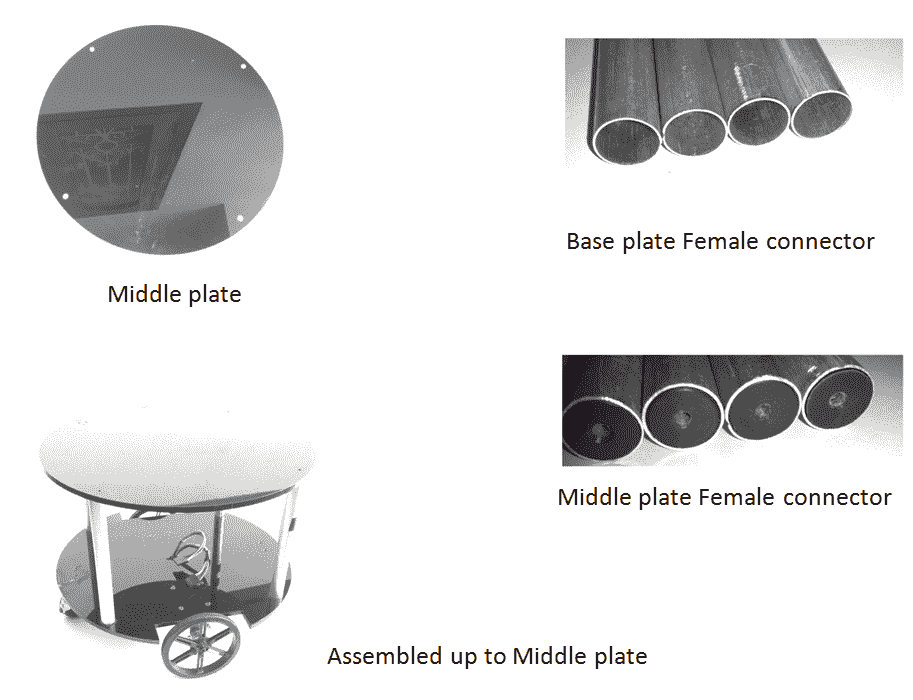

带有连接管的中板

连接管将连接底板和中板。有四个空心管将底板连接到中板。这些管子的一端是空心的，可以与底板支架相匹配，另一端有一个带有螺丝孔的硬塑料接头。中板没有支架，除了四个用于连接管的孔：

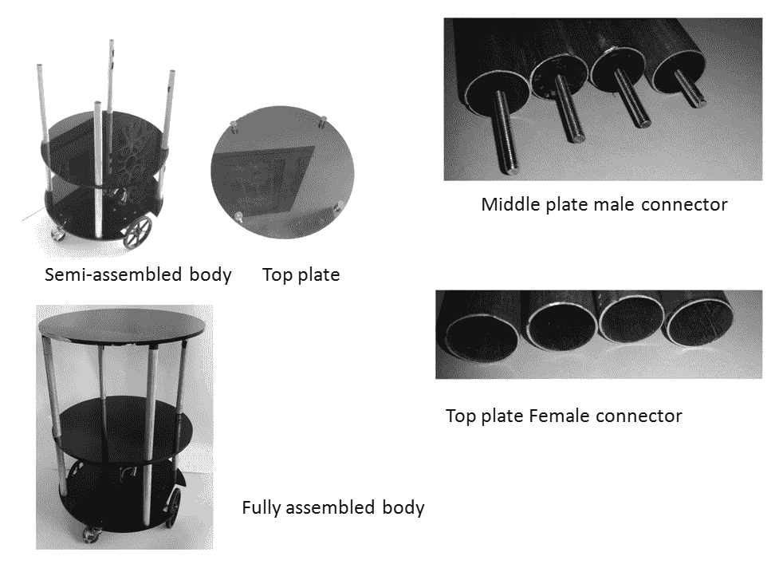

完全组装好的机器人本体

中板公接头有助于连接中板和底板顶部的管子。我们可以使用顶板背面的四个支架将顶板安装在中板管子的顶部。我们可以将顶板的女接头插入顶板支架。现在我们有了完全组装好的机器人本体。

机器人的底层可以用来放置**印刷电路板**（**PCB**）和电池。在中层，我们可以放置 Kinect/Orbecc 和 Intel NUC。如果需要，我们可以放置一个扬声器和麦克风。我们可以使用顶板来携带食物。以下图像显示了机器人的 PCB 原型；它由 Tiva-C LaunchPad、电机驱动器、电平转换器和连接两个电机、超声波传感器和 IMU 的接口组成：

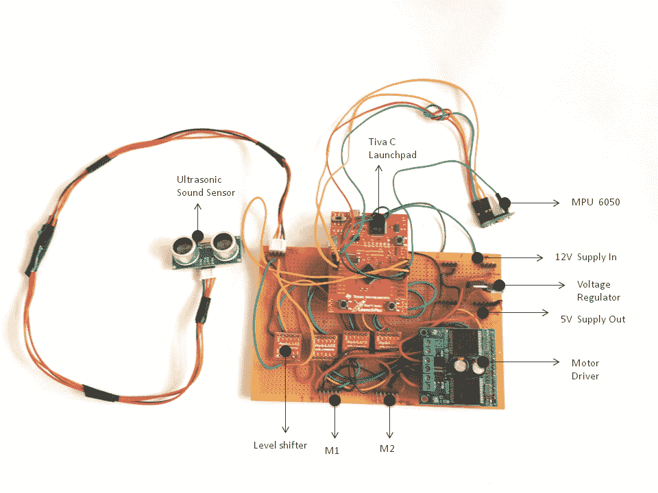

ChefBot PCB 原型

板子由放置在底板上的 12 伏电池供电。两个电机可以直接连接到 M1 和 M2 公接头。NUC PC 和 Kinect 放置在中板上。LaunchPad 板和 Kinect 应通过 USB 连接到 NUC PC。PC 和 Kinect 使用相同的 12 伏电池供电。我们可以使用铅酸电池或锂聚合物电池。在这里，我们使用铅酸电池进行测试。稍后，我们将迁移到锂聚合物电池，以获得更好的性能和更长的备用时间。以下图像显示了完全组装好的 ChefBot 的示意图：

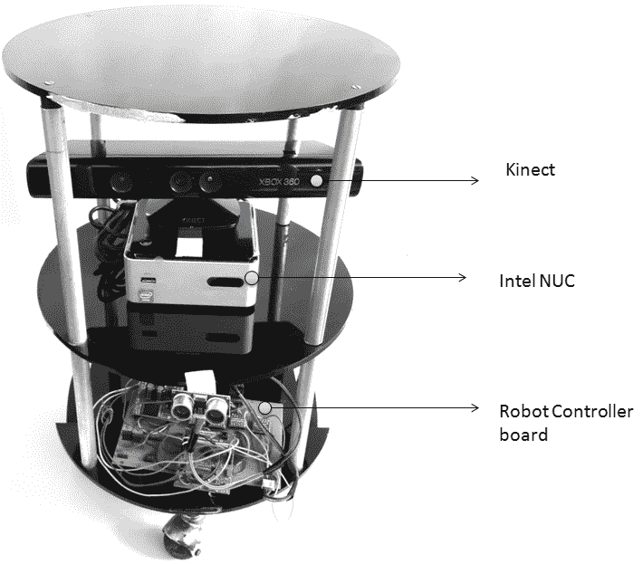

完全组装好的机器人本体

在组装好机器人的所有部件后，我们将开始与机器人软件一起工作。ChefBot 的嵌入式代码和 ROS 软件包可以在 `chapter_8` 下的代码中找到。让我们获取这些代码并开始与软件一起工作。

# 配置 ChefBot PC 和设置 ChefBot ROS 软件包

在 ChefBot 中，我们使用英特尔 NUC PC 来处理机器人传感器数据以及数据处理。在采购 NUC PC 后，我们必须安装 Ubuntu 16.04 LTS。在安装 Ubuntu 之后，安装我们在前几章中提到的完整 ROS 及其软件包。我们可以单独配置这台 PC，并在所有设置配置完成后，将其放入机器人中。以下是在 NUC PC 上安装 ChefBot 软件包的步骤。

使用以下命令从 GitHub 克隆 ChefBot 的软件包：

```py
    $ git clone https://github.com/qboticslabs/learning_robotics_2nd_ed  
```

我们可以在我们的笔记本电脑上克隆此代码，并将 `ChefBot` 文件夹复制到英特尔 NUC PC 上。`ChefBot` 文件夹包含 ChefBot 硬件的 ROS 软件包。在 NUC PC 上创建 ROS catkin 工作空间，复制 `ChefBot` 文件夹，并将其移动到 catkin 工作空间的 `src` 目录中。

通过以下简单命令构建和安装 ChefBot 的源代码。这应该在创建的 `catkin` 工作空间内执行：

```py
    $ catkin_make  
```

如果在 NUC 中正确安装了所有依赖项，那么 ChefBot 软件包将在这个系统中构建和安装。在 NUC PC 上设置 ChefBot 软件包后，我们可以切换到 ChefBot 的嵌入式代码。现在，我们可以连接 LaunchPad 上的所有传感器。在 LaunchPad 上上传代码后，我们再次查看 ROS 软件包以及如何运行它们。从 GitHub 克隆的代码包含 Tiva-C LaunchPad 代码，将在下一节中解释。

# 将 ChefBot 传感器连接到 Tiva-C LaunchPad

我们已经查看了我们将在 ChefBot 中使用的单个传感器的接口。在本节中，我们将学习如何将传感器集成到 LaunchPad 板上。用于编程 Tiva-C LaunchPad 的 Energia 代码可在 GitHub 克隆的文件中找到。显示 Tiva-C LaunchPad 与传感器连接的连接图如下。从这张图中，我们了解传感器是如何与 LaunchPad 相互连接的：

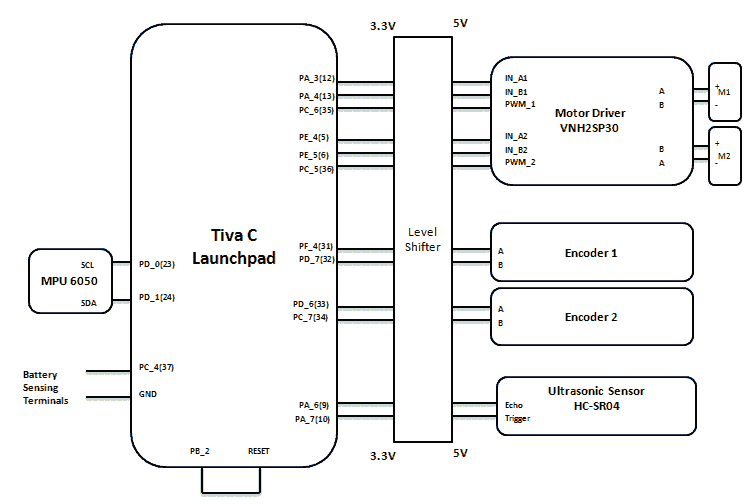

ChefBot 传感器接口图

M1 和 M2 是我们在该机器人中使用的两个差动驱动电机。我们在这里将要使用的是一款来自 Pololu 的直流齿轮电机，并配备编码器。电机端子连接到 Pololu 的双通道 **VNH2SP30** 电机驱动器。其中一个电机连接时极性相反，因为在差动转向中，一个电机旋转的方向与另一个相反。如果我们向两个电机发送相同的控制信号，每个电机都会向相反方向旋转。为了避免这种情况，我们将交换一个电机的电缆。电机驱动器通过一个 3.3 V-5 V 双向电平转换器连接到 Tiva-C LaunchPad。我们在这里将要使用的一个电平转换器可在 [`www.sparkfun.com/products/12009`](https://www.sparkfun.com/products/12009) 购得。

每个编码器的两个通道通过电平转换器连接到 LaunchPad。目前，我们使用一个超声波距离传感器进行障碍物检测。在将来，如果需要，我们可以增加传感器的数量。为了获得良好的里程计估计，我们将通过 I2C 接口将 IMU 传感器 MPU 6050 连接起来。引脚直接连接到 LaunchPad，因为 MPU6050 与 3.3 V 兼容。为了从 ROS 节点重置 LaunchPad，我们分配一个引脚作为输出，并将其连接到 LaunchPad 的复位引脚。当向 LaunchPad 发送特定字符时，它将输出引脚设置为高电平并重置设备。在某些情况下，计算错误可能会累积并影响机器人的导航。我们将重置 LaunchPad 以清除此错误。为了监控电池电量，我们分配另一个引脚来读取电池值。此功能目前在 Energia 代码中尚未实现。

您从 GitHub 下载的代码包括嵌入式代码和编译此代码所需的依赖库。我们在这里可以看到代码的主要部分，没有必要解释所有部分，因为我们已经查看过了。

# ChefBot 的嵌入式代码

本节讨论了 LaunchPad 代码的主要部分。以下是在代码中使用的头文件：

```py
//Library to communicate with I2C devices 
#include "Wire.h" 
//I2C communication library for MPU6050 
#include "I2Cdev.h" 
//MPU6050 interfacing library 
#include "MPU6050_6Axis_MotionApps20.h" 
//Processing incoming serial data 
#include <Messenger.h> 
//Contain definition of maximum limits of various data type 
#include <limits.h>
```

在此代码中使用的库主要用于与 MPU 6050 通信以及处理传入的串行数据到 LaunchPad。MPU 6050 可以使用内置的 **数字运动处理器**（**DMP**）提供四元数或欧拉值来表示方向。访问 DMP 的函数在 `MPU6050_6Axis_MotionApps20.h` 中编写。这个库有依赖项，如 `I2Cdev.h` 和 `Wire.h`；这就是为什么我们也要包含这个头文件。这两个库用于 I2C 通信。`Messenger.h` 库允许您处理来自任何来源的文本数据流，并有助于从其中提取数据。`limits.h` 头文件包含了各种数据类型最大限制的定义。

在包含头文件之后，我们需要创建一个对象来处理 MPU6050 并使用 `Messenger` 类处理传入的串行数据：

```py
//Creating MPU6050 Object 
MPU6050 accelgyro(0x68); 
//Messenger object 
Messenger Messenger_Handler = Messenger(); 
```

在声明了信使对象之后，主部分处理为电机驱动器、编码器、超声波传感器、MPU 6050、复位和电池引脚分配引脚。一旦我们分配了引脚，我们就可以查看代码的 `setup()` 函数。`setup()` 函数的定义如下代码所示：

```py
//Setup serial, encoders, ultrasonic, MPU6050 and Reset functions 
void setup() 
{ 
  //Init Serial port with 115200 baud rate 
  Serial.begin(115200); 
  //Setup Encoders 
  SetupEncoders(); 
  //Setup Motors 
  SetupMotors(); 
  //Setup Ultrasonic 
  SetupUltrasonic(); 
  //Setup MPU 6050 
  Setup_MPU6050(); 
  //Setup Reset pins 
  SetupReset(); 
  //Set up Messenger object handler 
  Messenger_Handler.attach(OnMssageCompleted); 
}
```

前面的函数包含一个自定义例程来配置和分配所有传感器的引脚。此函数将以 115,200 波特率初始化串行通信，并为编码器、电机驱动器、超声波传感器和 MPU6050 设置引脚。`SetupReset()` 函数将为设备分配一个引脚以进行复位，如前面的连接图所示。我们已经在前面章节中看到了每个传感器的设置例程，因此没有必要解释这些函数的定义。`Messenger` 类处理器连接到名为 `OnMssageCompleted()` 的函数，当数据输入到 `Messenger_Handler` 时将调用此函数。

以下是该代码的主要 `loop()` 函数。此函数的主要目的是读取和处理串行数据，以及发送可用的传感器值：

```py
void loop() 
{ 
    //Read from Serial port 
    Read_From_Serial(); 
    //Send time information through serial port 
    Update_Time(); 
    //Send encoders values through serial port 
    Update_Encoders(); 
    //Send ultrasonic values through serial port 
    Update_Ultra_Sonic(); 
    //Update motor speed values with corresponding speed received from PC and send speed values through serial port 
    Update_Motors(); 
    //Send MPU 6050 values through serial port 
    Update_MPU6050(); 
    //Send battery values through serial port 
    Update_Battery(); 
} 
```

`Read_From_Serial()` 函数将从 PC 读取串行数据，并将数据提供给 `Messenger_Handler` 处理器进行处理。`Update_Time()` 函数将在嵌入式板上的每次操作后更新时间。我们可以使用这个时间值在 PC 上进行处理，或者使用 PC 的时间。

我们可以在 Energia 的 IDE 中编译代码，并在 LaunchPad 上烧录代码。上传代码后，我们可以查看处理 LaunchPad 传感器值的 ROS 节点。

# 为 ChefBot 编写 ROS Python 驱动程序

在将嵌入式代码上传到 LaunchPad 之后，下一步是处理来自 LaunchPad 的串行数据，并将其转换为 ROS 主题以进行进一步处理。`launchpad_node.py` ROS Python 驱动节点将 Tiva-C LaunchPad 与 ROS 进行接口连接。`launchpad_node.py` 文件位于 `script` 文件夹中，该文件夹位于 `ChefBot_bringup` 包内。以下是 `launchpad_node.py` 中的重要代码段解释：

```py
#ROS Python client 
import rospy 
import sys 
import time 
import math 

#This python module helps to receive values from serial port which execute in a thread 
from SerialDataGateway import SerialDataGateway 
#Importing required ROS data types for the code 
from std_msgs.msg import Int16,Int32, Int64, Float32, 
 String, Header, UInt64 
#Importing ROS data type for IMU 
from sensor_msgs.msg import Imu 
```

`launchpad_node.py` 文件导入了前面的模块。我们可以看到的主要模块是 `SerialDataGateway`。这是一个自定义模块，用于在线程中接收来自 LaunchPad 板的串行数据。我们还需要一些 ROS 的数据类型来处理传感器数据。节点的主体功能如下代码片段所示：

```py
if __name__ =='__main__': 
  rospy.init_node('launchpad_ros',anonymous=True) 
  launchpad = Launchpad_Class() 
  try: 

    launchpad.Start() 
    rospy.spin() 
  except rospy.ROSInterruptException: 
    rospy.logwarn("Error in main function") 

  launchpad.Reset_Launchpad() 
  launchpad.Stop()
```

该节点的主体类被命名为 `Launchpad_Class()`。这个类包含了启动、停止以及将串行数据转换为 ROS 主题的所有方法。在主函数中，我们将创建一个 `Launchpad_Class()` 的对象。创建对象后，我们将调用 `Start()` 方法，这将启动 Tiva-C LaunchPad 和 PC 之间的串行通信。如果我们通过输入 *Ctrl* + *C* 中断驱动节点，它将重置 LaunchPad 并停止 PC 和 LaunchPad 之间的串行通信。

以下代码片段来自 `Launchpad_Class()` 构造函数。在以下片段中，我们将从 ROS 参数中检索 LaunchPad 板的端口和波特率，并使用这些参数初始化 `SerialDataGateway` 对象。当任何串行数据到达串行端口时，`SerialDataGateway` 对象将在这个类内部调用 `_HandleReceivedLine()` 函数。这个函数将处理每一行串行数据，并从中提取、转换并插入到每个 ROS 主题数据类型的适当头部：

```py
#Get serial port and baud rate of Tiva C Launchpad 
port = rospy.get_param("~port", "/dev/ttyACM0") 
baudRate = int(rospy.get_param("~baudRate", 115200)) 

################################################################# 
rospy.loginfo("Starting with serial port: 
 " + port + ", baud rate: " + str(baudRate))#Initializing SerialDataGateway object with serial port, baud
  rate and callback function to handle incoming serial dataself._SerialDataGateway = SerialDataGateway(port, 
 baudRate, self._HandleReceivedLine) 
rospy.loginfo("Started serial communication") 

###################################################################Subscribers and Publishers 

#Publisher for left and right wheel encoder values 
self._Left_Encoder = rospy.Publisher('lwheel',Int64,queue_size 
 = 10)self._Right_Encoder = rospy.Publisher('rwheel',Int64,queue_size 
 = 10)
#Publisher for Battery level(for upgrade purpose) 
self._Battery_Level = 
 rospy.Publisher('battery_level',Float32,queue_size = 10) 
#Publisher for Ultrasonic distance sensor 
self._Ultrasonic_Value = 
 rospy.Publisher('ultrasonic_distance',Float32,queue_size = 10) 

#Publisher for IMU rotation quaternion values 
self._qx_ = rospy.Publisher('qx',Float32,queue_size = 10) 
self._qy_ = rospy.Publisher('qy',Float32,queue_size = 10) 
self._qz_ = rospy.Publisher('qz',Float32,queue_size = 10) 
self._qw_ = rospy.Publisher('qw',Float32,queue_size = 10) 

#Publisher for entire serial data 
self._SerialPublisher = rospy.Publisher('serial', 
 String,queue_size=10)
```

我们将为编码器、IMU 和超声波传感器等传感器创建 ROS 发布者对象，以及为调试目的的串行数据的全部。我们还将订阅机器人左侧和右侧车轮的速度命令。当速度命令到达主题时，它将调用相应的回调函数，向机器人的 LaunchPad 发送速度命令：

```py
self._left_motor_speed = rospy.Subscriber('left_wheel_speed',Float32,self._Update_Left_Speed) 
self._right_motor_speed = rospy.Subscriber('right_wheel_speed',Float32,self._Update_Right_Speed) 
```

在设置 ChefBot 驱动节点后，我们需要将机器人与 ROS 导航堆栈接口，以便执行自主导航。进行自主导航的基本要求是机器人驱动节点从 ROS 导航堆栈接收速度命令。机器人可以通过遥操作进行控制。除了这些功能外，机器人必须能够计算其位置或里程数据，并生成要发送到导航堆栈的 tf 数据。必须有一个 PID 控制器来控制机器人的电机速度。以下 ROS 软件包帮助我们执行这些功能。`differential_drive` 软件包包含执行上述操作的节点。我们在我们的软件包中重用这些节点来实现这些功能。您可以在 ROS 中找到 `differential_drive` 软件包，网址为 [`wiki.ros.org/differential_drive`](http://wiki.ros.org/differential_drive)。

以下图显示了这些节点之间的通信方式：

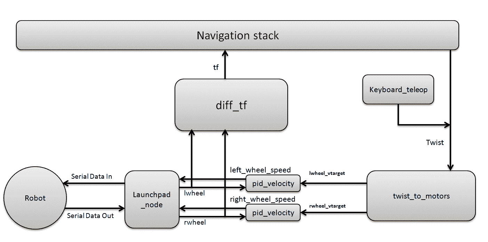

机器人方块图，展示了 ROS 节点

`ChefBot_bringup` 软件包中每个节点的目的是如下：

`twist_to_motors.py`: 此节点将 ROS `Twist`命令或线性速度和角速度转换为单个电机速度目标。目标速度以`~rate`（赫兹为单位）的速度发布，并在`Twist`消息停止后发布`timeout_ticks`时间的速度。以下是由此节点发布和订阅的主题和参数：

**发布主题：**

`lwheel_vtarget(std_msgs/Float32)`: 这是左轮的目标速度（以 m/s 为单位）。

`rwheel_vtarget` (`std_msgs`/`Float32`): 这是右轮的目标速度（以 m/s 为单位）。

**订阅主题：**

`Twist` (`geometry_msgs`/`Twist`): 这是机器人的目标`Twist`命令。在此机器人中，使用 Twist 消息中的 x 方向线性速度和角速度 theta。

**重要的 ROS 参数：**

`~base_width` (`float, default: 0.1`): 这是机器人两个轮子之间的距离，单位为米。

`~rate` (`int, default: 50`): 这是发布速度目标的速度（赫兹）。

`~timeout_ticks` (`int, default:2`): 这是停止 Twist 消息后发布的速度目标消息的数量。

`pid_velocity.py`: 这是一个简单的 PID 控制器，通过从轮编码器获取反馈来控制每个电机的速度。在差速驱动系统中，我们需要为每个轮子配置一个 PID 控制器。它将读取每个轮子的编码器数据并控制每个轮子的速度。

**发布主题：**

`motor_cmd` (`Float32`): 这是 PID 控制器的最终输出，用于电机。我们可以通过`out_min`和`out_max` ROS 参数来改变 PID 输出的范围。

`wheel_vel` (`Float32`): 这是机器人轮子的当前速度（以 m/s 为单位）。

**订阅主题：**

`wheel` (`Int16`): 这个主题是旋转编码器的输出。每个编码器都有自己的主题。

`wheel_vtarget` (`Float32`): 这是目标速度，单位为 m/s。

**重要参数：**

`~Kp` (`float`, default: 10`): 这个参数是 PID 控制器的比例增益。

`~Ki` (`float, default: 10`): 这个参数是 PID 控制器的积分增益。

`~Kd` (`float, default: 0.001`): 这个参数是 PID 控制器的微分增益。

`~out_min` (`float, default: 255`): 这是速度值到电机的最小限制。此参数限制了速度值到名为`wheel_vel`主题的电机。

`~out_max` (`float, default: 255`): 这是`wheel_vel`主题的最大限制（以赫兹为单位）。

`~rate` (`float, default: 20`): 这是发布`wheel_vel`主题的速度。

`ticks_meter` (`float, default: 20`): 这是每米轮子编码器脉冲数。这是一个全局参数，因为它也在其他节点中使用。

`vel_threshold` (`float, default: 0.001`): 如果机器人速度低于此参数，我们考虑车轮为静止。如果车轮速度小于 `vel_threshold`，我们将其视为零。

`encoder_min` (`int, default: 32768`): 这是编码器读取的最小值。

`encoder_max` (`int, default: 32768`): 这是编码器读取的最大值。

`wheel_low_wrap` (`int, default: 0.3 * (encoder_max - encoder_min) + encoder_min`): 这些值决定里程计是在负方向还是正方向。

`wheel_high_wrap` (`int, default: 0.7 * (encoder_max - encoder_min) + encoder_min`): 这些值决定里程计是在负方向还是正方向。

`diff_tf.py`: 此节点计算里程计的转换并在里程计框架和机器人基座框架之间广播。

**发布主题：**

`odom` (`nav_msgs`/`odometry`): 该功能发布里程计（机器人的当前姿态和扭转）。

`tf`: 该功能提供里程计框架和机器人基座框架之间的转换。

**订阅主题：**

`lwheel` (`std_msgs`/`Int16`), `rwheel` (`std_msgs`/`Int16`): 这些是机器人左右编码器的输出值。

+   `ChefBot_keyboard_teleop.py`: 此节点使用键盘控制发送 `Twist` 命令。

**发布主题：**

`cmd_vel_mux`/`input`/`teleop` (`geometry_msgs`/`Twist`): 该功能使用键盘命令发布 Twist 消息。

现在我们已经查看了 `ChefBot_bringup` 包中的节点，我们将查看启动文件的功能。

# 理解 ChefBot ROS 启动文件

现在我们将查看 `ChefBot_bringup` 包中每个启动文件的功能：

+   `robot_standalone.launch`: 此启动文件的主要功能是启动 `launchpad_node`、`pid_velocity`、`diff_tf` 和 `twist_to_motor` 等节点，从机器人获取传感器值并向机器人发送速度命令。

+   `keyboard_teleop.launch`: 此启动文件将启动使用键盘的遥控操作。它启动 `ChefBot_keyboard_teleop.py` 节点以执行键盘遥控操作。

+   `3dsensor.launch`: 此文件将启动 Kinect OpenNI 驱动程序并开始发布 RGB 和深度流。它还将启动深度到激光扫描器节点，该节点将点云数据转换为激光扫描数据。

+   `gmapping_demo.launch`: 此启动文件将启动 SLAM gmapping 节点以绘制机器人周围区域。

+   `amcl_demo.launch`: 使用 AMCL，机器人可以定位并预测它在地图上的位置。在地图上定位机器人后，我们可以命令机器人移动到地图上的一个位置。然后机器人可以从当前位置自主移动到目标位置。

+   `view_robot.launch`: 此启动文件在 RViz 中显示机器人 URDF 模型。

+   `view_navigation.launch`: 此启动文件显示机器人导航所需的全部传感器。

# 与 ChefBot Python 节点和启动文件一起工作

我们已经在 Intel 的 NUC PC 上设置了 ChefBot ROS 包，并将嵌入式代码上传到了 LaunchPad 板。下一步是将 NUC PC 放在机器人上，从笔记本电脑配置到机器人的远程连接，测试每个节点，并使用 ChefBot 的启动文件与 ChefBot 进行自主导航。

在与 ChefBot 一起工作之前，我们应该拥有的主要设备是一个好的无线路由器。机器人和远程笔记本电脑必须连接到同一网络。如果机器人的 PC 和远程笔记本电脑在同一个网络中，用户可以通过 SSH 使用其 IP 从远程笔记本电脑连接到机器人 PC。在将机器人 PC 放入机器人之前，我们应该将其连接到无线网络，以便一旦连接到无线网络，它将记住连接详情。当机器人开机时，PC 应该自动连接到无线网络。一旦机器人 PC 连接到无线网络，我们就可以将其放入实际的机器人中。以下图显示了机器人和远程 PC 的连接图：

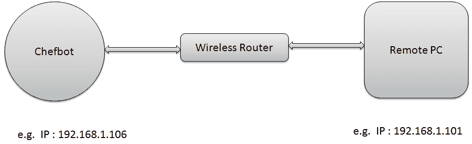

机器人和远程 PC 的无线连接图

上述图假设 ChefBot 的 IP 是`192.168.1.106`，远程 PC 的 IP 是`192.168.1.101`。

我们可以使用以下命令远程访问 ChefBot 终端，用于登录 ChefBot，其中`robot`是 ChefBot PC 的用户名：

```py
    $ ssh robot@192.168.1.106  
```

当您登录 ChefBot PC 时，它会要求输入机器人 PC 密码。输入机器人 PC 密码后，我们可以访问机器人 PC 终端。登录到机器人 PC 后，我们可以开始测试 ChefBot 的 ROS 节点，并测试我们是否从 LaunchPad 板在 ChefBot 内部接收串行值。请注意，如果您使用的是新终端，您必须再次通过 SSH 登录到 ChefBot PC。

如果`ChefBot_bringup`包在 PC 上正确安装，并且如果 LaunchPad 板已连接，那么在运行 ROS 驱动节点之前，我们可以运行`miniterm.py`工具来检查串行值是否通过 USB 正确地到达 PC。我们可以使用`dmesg`命令找到串行设备名称。我们可以使用以下命令运行`miniterm.py`：

```py
    $ miniterm.py /dev/ttyACM0 115200  
```

如果显示权限拒绝的消息，请通过在`udev`文件夹中编写规则来设置 USB 设备的权限，我们已经在第六章“将执行器和传感器连接到机器人控制器”中这样做过，或者我们可以使用以下命令临时更改权限。这里我们假设`ttyACM0`是 LaunchPad 的设备名称。如果您的 PC 上的设备名称不同，那么您必须使用该名称而不是`ttyACM0`：

```py
    $ sudo chmod 777 /dev/ttyACM0  
```

如果一切正常，我们将得到以下截图所示的值：

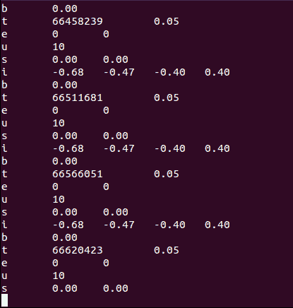

miniterm.py 的输出

字母 `b` 用于表示机器人的电池读数；目前尚未实现。该值现在设置为零。这些值来自 Tiva C Launchpad。使用微控制器板感应电压有不同的方法。其中一种方法如下 ([`www.instructables.com/id/Arduino-Battery-Voltage-Indicator/`](http://www.instructables.com/id/Arduino-Battery-Voltage-Indicator/))。字母 `t` 表示机器人开始运行嵌入式代码后经过的总时间（以微秒为单位）。第二个值是完成整个操作所需的时间（以秒为单位）。如果我们正在执行机器人的参数的实时计算，我们可以使用此值。目前，我们未使用此值，但将来可能会使用。字母 `e` 表示左右编码器的值。这两个值在这里都是零，因为机器人没有移动。字母 `u` 表示超声波距离传感器的值。我们得到的距离值以厘米为单位。字母 `s` 表示机器人的当前轮速。此值用于检查目的。实际上，速度是来自 PC 的控制输出。

为了将此串行数据转换为 ROS 主题，我们必须运行名为 `launchpad_node.py` 的驱动节点。以下代码显示了如何执行此节点。

首先，在启动任何节点之前，我们必须运行 `roscore`：

```py
    $ roscore  
```

使用以下命令运行 `launchpad_node.py`：

```py
    $ rosrun ChefBot_bringup launchpad_node.py  
```

如果一切正常，我们将在运行的终端中看到以下输出：

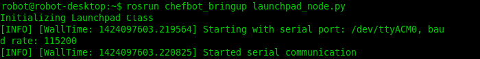

launchpad_node.py 的输出

运行 `launchpad_node.py` 后，我们将看到以下主题生成，如下面的截图所示：

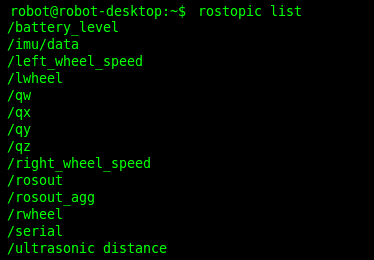

launchpad_node.py 生成的主题

我们可以通过订阅 `/serial` 主题来查看驱动节点接收到的串行数据。我们可以用它进行调试目的。如果串行主题显示的数据与我们看到的 `miniterm.py` 中的数据相同，那么我们可以确认节点运行正常。以下截图是 `/serial` 主题的输出：

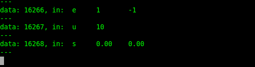

由 LaunchPad 节点发布的 /serial 主题的输出

在设置 `ChefBot_bringup` 软件包后，我们可以开始使用 ChefBot 的自主导航。目前，我们仅访问 ChefBot PC 的终端。为了可视化机器人的模型、传感器数据、地图等，我们必须在用户的 PC 上使用 RViz。我们必须在机器人和用户 PC 上进行一些配置才能执行此操作。需要注意的是，用户的 PC 应该与 ChefBot PC 具有相同的软件设置。

我们必须做的第一件事是将 ChefBot PC 设置为 ROS 主节点。我们可以通过设置`ROS_MASTER_URI`值来将 ChefBot PC 设置为 ROS 主节点。`ROS_MASTER_URI`设置是一个必需的设置；它通知节点关于 ROS 主节点的**统一资源标识符**（**URI**）。当你为 ChefBot PC 和远程 PC 设置相同的`ROS_MASTER_URI`时，我们就可以在远程 PC 上访问 ChefBot PC 的主题。因此，如果我们在本地上运行 RViz，那么它将可视化在 ChefBot PC 上生成的主题。

假设 ChefBot PC 的 IP 地址是`192.168.1.106`，远程 PC 的 IP 地址是`192.168.1.10`。你可以为 Chefbot PC 和远程 PC 设置静态 IP，这样 IP 地址在所有测试中都将保持不变；否则，如果它是自动的，你可能在每个测试中得到不同的 IP 地址。要在每个系统中设置`ROS_MASTER_URI`，以下命令应包含在`home`文件夹中的`.bashrc`文件中。以下图表显示了在每个系统中包含`.bashrc`文件所需的设置：

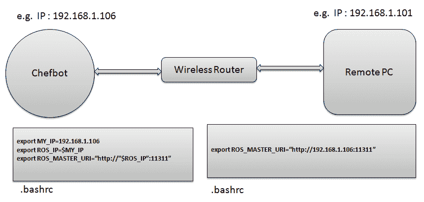

ChefBot 的网络配置

在每个 PC 的`.bashrc`文件底部添加这些行，并根据你的网络更改 IP 地址。

在我们建立这些设置之后，我们只需在 ChefBot PC 终端上启动`roscore`，然后在远程 PC 上执行`rostopic list`命令。

如果你看到任何主题，说明设置已完成。我们可以首先使用键盘遥控运行机器人，以检查机器人的功能并确认我们是否获得了传感器值。

我们可以使用以下命令启动机器人驱动程序和其他节点。请注意，这应该在通过 SSH 登录后，在 ChefBot 终端中执行：

```py
    $ roslaunch ChefBot_bringup robot_standalone.launch  
```

在启动机器人驱动程序和节点后，使用以下命令启动键盘遥控。这也必须在 ChefBot PC 的新终端中完成：

```py
    $ roslaunch ChefBot_bringup keyboard_teleop.launch  
```

要激活 Kinect，请执行以下命令。此命令也应在 ChefBot 终端中执行：

```py
    $roslaunch ChefBot_bringup 3dsensor_kinect.launch  
```

如果你使用 Orbecc Astra，请使用以下启动文件来启动传感器：

```py
    $ roslaunch ChefBot_bringup 3d_sensor_astra.launch  
```

要查看传感器数据，我们可以执行以下命令。这将显示 RViz 中的机器人模型，并且应该在远程 PC 上执行。如果我们已经在远程 PC 上设置了`ChefBot_bringup`包，我们可以访问以下命令并从 ChefBot PC 可视化机器人模型和传感器数据：

```py
    $ roslaunch ChefBot_bringup view_robot.launch
```

以下截图是 RViz 的输出。我们可以看到截图中的激光扫描和点云映射数据：

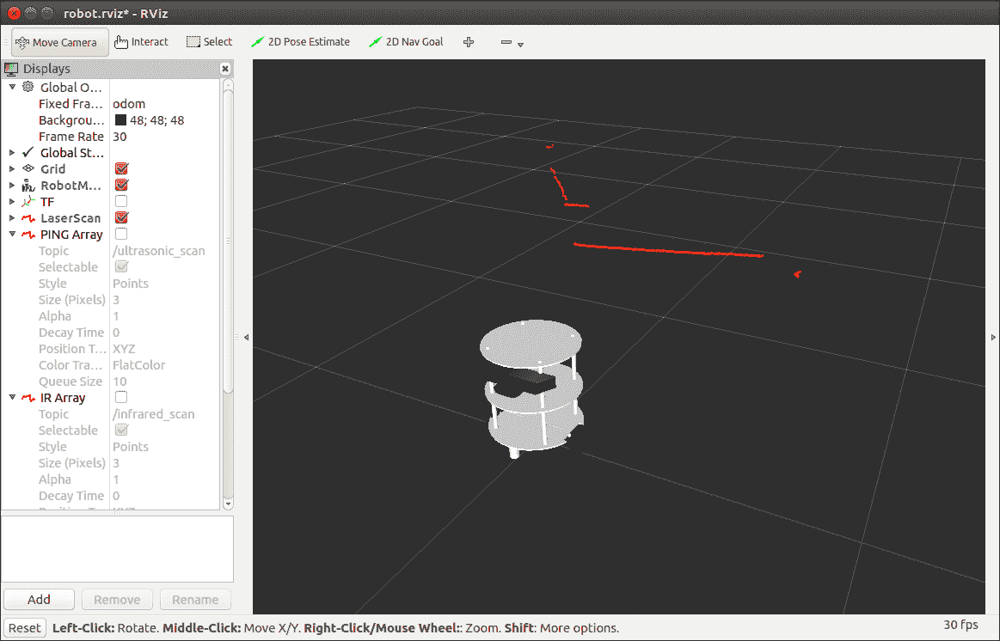

ChefBot 在 RViz 中的激光扫描数据

前面的截图显示了 RViz 中的激光扫描。我们需要从 RViz 的左侧部分勾选激光扫描主题，以显示激光扫描数据。激光扫描数据标在视图中。如果您想查看 Kinect/Astra 的点云数据，请点击 RViz 左侧的添加按钮，并在弹出的窗口中选择 PointCloud2。从列表中选择主题 | `/camera/depth_registered`，您将看到与以下截图类似的一张图片：

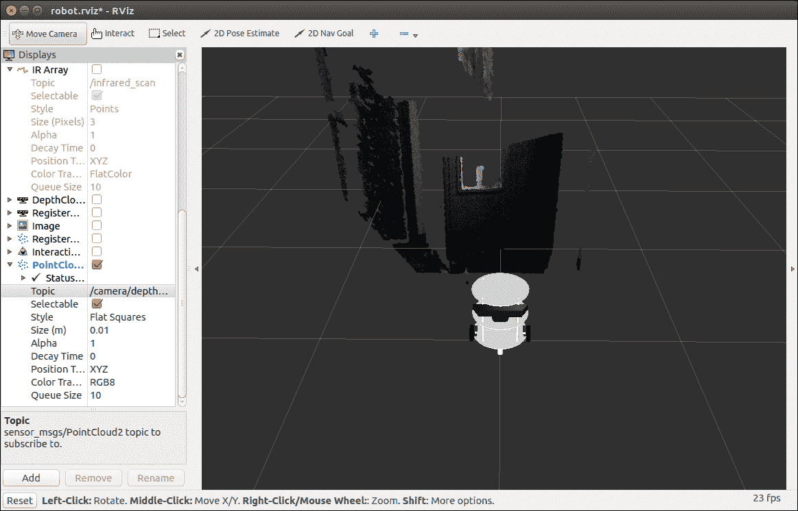

带有点云数据的 ChefBot

在与传感器一起工作后，我们可以执行 SLAM 来绘制房间地图。以下程序帮助我们在此机器人上启动 SLAM。

# 在 ROS 上使用 SLAM 构建房间地图

要执行 gmapping，我们必须执行以下命令。

以下命令在 ChefBot 终端中启动机器人驱动程序：

```py
    $ roslaunch ChefBot_bringup robot_standalone.launch  
```

以下命令启动 gmapping 过程。请注意，它应在 ChefBot 终端上执行：

```py
    $ roslaunch ChefBot_bringup gmapping_demo.launch  
```

如果接收到的里程计值是正确的，Gmapping 才会工作。如果从机器人接收到的里程计值，我们将收到以下消息。如果我们收到此消息，我们可以确认 gmapping 将正常工作：

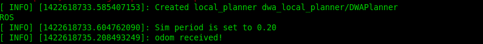

带有点云数据的 ChefBot

要开始键盘遥操作，请使用以下命令：

```py
    $ roslaunch ChefBot_bringup keyboard_teleop.launch  
```

要查看正在创建的地图，我们需要在远程系统上使用以下命令启动 RViz：

```py
    $ roslaunch ChefBot_bringup view_navigation.launch  
```

在 RViz 中查看机器人后，您可以使用键盘移动机器人并查看正在创建的地图。当它已绘制整个区域时，我们可以在 ChefBot PC 终端使用以下命令保存地图：

```py
    $rosrun map_server map_saver -f ~/test_map
```

在前面的代码中，`test_map`是存储在`home`文件夹中的地图名称。以下截图显示了机器人创建的房间地图：

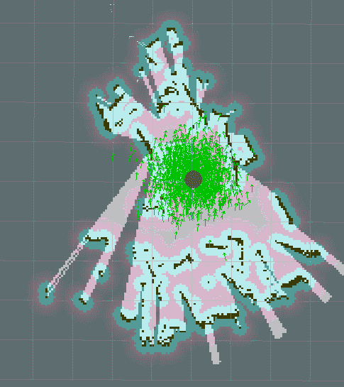

绘制房间地图

在地图存储后，我们可以使用 ROS 进行定位和自主导航功能。

# 使用 ROS 定位和导航

在构建地图后，关闭所有应用程序，并使用以下命令重新运行机器人驱动程序：

```py
    $ roslaunch ChefBot_bringup robot_standalone.launch
```

使用以下命令在存储的地图上启动定位和导航：

```py
    $ roslaunch ChefBot_bringup amcl_demo.launch map_file:=~/test_map.yaml  
```

在远程 PC 上使用以下命令开始查看机器人：

```py
    $ roslaunch ChefBot_bringup view_navigation.launch  
```

在 RViz 中，我们可能需要使用 2D 位姿估计按钮指定机器人的初始位姿。我们可以使用此按钮在地图上更改机器人位姿。如果机器人能够访问地图，则可以使用 2D 导航目标按钮命令机器人移动到期望的位置。当我们开始定位时，我们可以通过使用 AMCL 算法查看机器人周围的粒子云：

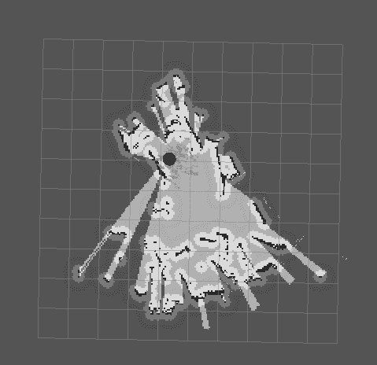

使用 AMCL 定位机器人

以下是从当前位置自主导航到目标位置的机器人的截图。目标位置用黑色点标记：

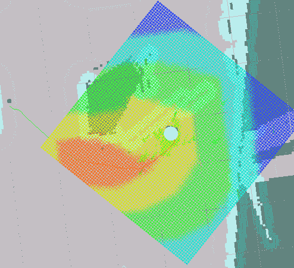

使用地图进行自主导航

从机器人到黑色点的黑色线是机器人计划到达目标位置的路程。如果机器人无法定位地图，我们可能需要微调 `ChefBot_bringup` 文件夹中的参数文件。有关更多微调细节，您可以在 ROS 上的 AMCL 包中查看 [`wiki.ros.org/amcl`](http://wiki.ros.org/amcl)。

# 摘要

本章讲述了 ChefBot 硬件的组装以及将嵌入式和 ROS 代码集成到机器人中以实现自主导航。我们看到了使用 第六章 的设计制造的机器人硬件部件，*将执行器和传感器连接到机器人控制器*。我们组装了机器人的各个部分，并连接了我们为机器人设计的原型 PCB。这包括 LaunchPad 板、电机驱动器、左移位器、超声波传感器和 IMU。LaunchPad 板被刷入了新的嵌入式代码，该代码可以与机器人中的所有传感器接口，并能从 PC 发送或接收数据。

在查看嵌入式代码后，我们配置了 ROS Python 驱动节点以与 LaunchPad 板的串行数据接口。与 LaunchPad 板接口后，我们使用 ROS 仓库中 `differential_drive` 包的节点计算了里程计数据和差速驱动控制。我们将机器人与 ROS 导航堆栈接口。这使得我们可以使用 SLAM 和 AMCL 进行自主导航。我们还研究了 SLAM 和 AMCL，创建了一个地图，并命令机器人自主导航。

# 问题

1.  机器人 ROS 驱动节点有什么用途？

1.  PID 控制器在导航中扮演什么角色？

1.  如何将编码器数据转换为里程计数据？

1.  SLAM 在机器人导航中扮演什么角色？

1.  AMCL 在机器人导航中扮演什么角色？

# 进一步阅读

您可以从以下链接中了解更多关于 ROS 中机器人视觉包的信息：

+   [`wiki.ros.org/gmapping`](http://wiki.ros.org/gmapping)

+   [`wiki.ros.org/amcl`](http://wiki.ros.org/amcl)
