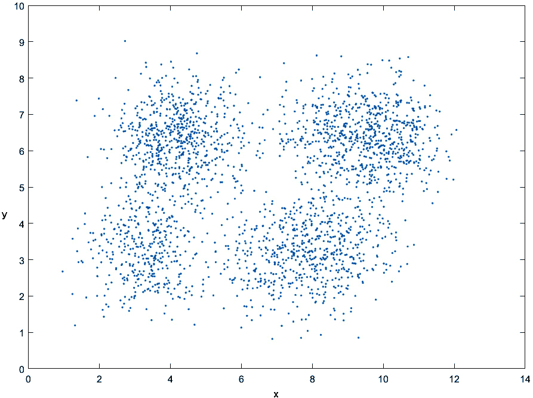

# 4

# 聚类分析和降维

聚类技术旨在揭示数据集中隐藏的模式或分组。这些算法在不需要任何预定义标签的情况下检测分组。相反，它们根据元素之间的相似性选择聚类。另一方面，降维涉及将具有多个变量的数据集转换为具有较少维度的数据集，同时保留相关信息。特征选择方法试图识别原始变量的子集，而特征提取通过将其转换为新的特征来降低数据维度。本章向我们展示了如何将数据划分为聚类，或相似项目的分组。我们还将学习如何选择最能代表数据集的特征。

在本章中，我们将涵盖以下主要内容：

+   理解聚类——基本概念和方法

+   理解层次聚类

+   基于划分的聚类算法使用 MATLAB

+   使用相似度度量分组数据

+   发现降维技术

+   使用 MATLAB 进行特征选择和特征提取

# 技术要求

在本章中，我们将介绍与机器学习相关的基本概念。要理解这些主题，需要具备代数和数学建模的基本知识。您还需要熟悉 MATLAB 环境。

要使用本章中的 MATLAB 代码，您需要以下文件（可在 GitHub 上找到：[`github.com/PacktPublishing/MATLAB-for-Machine-Learning-second-edition`](https://github.com/PacktPublishing/MATLAB-for-Machine-Learning-second-edition))：

+   `Minerals.xls`

+   `PeripheralLocations.xls`

+   `YachtHydrodynamics.xlsx`

+   `SeedsDataset.xlsx`

# 理解聚类——基本概念和方法

**聚类**是数据分析中的一个基本概念，旨在识别数据集中有意义的分组或模式。它涉及根据数据点之间的相似性或彼此的邻近性将数据点划分为不同的聚类。在聚类和分类中，我们的目标都是发现使我们可以将观测值分配到正确类别的潜在规则。然而，聚类与分类不同，因为它还需要识别有意义的类别子集。在分类中，我们受益于目标变量，它在训练集中提供了分类信息。相比之下，聚类缺乏此类附加信息，需要通过分析数据的空间分布来推断类别。数据中的密集区域对应于相似观测值的组。如果我们能识别出彼此相似但与另一个聚类中的观测值不同的观测值，我们可以推断这两个聚类代表不同的条件。在这个阶段，有三个关键方面发挥作用：

+   如何衡量相似度

+   如何找到质心和中心

+   如何定义分组

距离的概念和分组定义是描述聚类算法的基本组成部分。

## 如何测量相似性

聚类涉及根据元素之间的邻近度度量来识别数据分组。邻近度可以指相似性或差异性。因此，数据分组的定义依赖于我们如何定义相似性或差异性。在许多方法中，邻近度是在多维空间内的距离概念化的。聚类算法的有效性在很大程度上取决于指标的选择以及距离的计算方式。

聚类算法根据元素之间的相互距离来分组，一个特定集合的成员资格由一个元素与其他同一集合成员的邻近度决定。因此，当一组观测值相对于其他集合中的观测值更接近时，它们形成了一个簇。那么，我们所说的相似性和差异性是什么意思呢？**相似性**是指两个对象之间相似程度的数值度量。较高的相似性值表示对象之间有更大的相似性。相似性通常是正的，通常从 0（没有相似性）到 1（完全相似性）的范围。在 *图 4*.1 中，展示了聚类间和聚类内距离的差异。


图 4.1 – 聚类间和聚类内距离的差异

相反，**差异性**表示两个对象之间差异的数值度量。较低的差异性值表示对象之间有更大的相似性。差异性有时也被称为距离。与相似性一样，差异性值也可能落在区间 *[0,1]* 内，但它们通常从 0 到 ∞ 范围内。

可以使用距离指标来量化数据对象之间的差异性。距离具有特定的属性，可以用来测量差异性。例如，**欧几里得距离**，用 *d* 表示，可以使用以下公式来测量两点 *x* 和 *y* 之间的距离：

d(x, y) = √(∑(k=1 to n) (x_i - y_i)²)

在二维平面上，欧几里得距离是两点之间的最短距离，由连接它们的直线表示。这个距离是通过取两个向量元素平方差的和的平方根来计算的，如前面的公式所示。

然而，可以使用各种其他指标来测量距离，例如闵可夫斯基距离。**闵可夫斯基距离**指标是欧几里得距离的推广，可以表示如下：

d(x, y) = (∑(k=1 to n) |x_i - y_i|^r)^(1/r)

另一个选项是利用**曼哈顿距离**度量，它是通过将**r = 1**设置在**闵可夫斯基距离**度量上得到的。此外，还有**余弦距离**，它结合了由原点到欧几里得距离的乘积缩放的点积。它量化了两个向量之间的角度距离，同时不考虑它们的规模。一旦我们为我们的特定情况选择了一个合适的度量，我们就可以继续进行。

选择合适的相似性度量对于聚类具有重要意义，因为它直接影响到聚类结果的质量和可理解性。度量选择应与数据的固有特性和聚类分析的目标相协调。大多数聚类工具中使用的默认距离是欧几里得距离。然而，在非常嘈杂的数据或非高斯分布的情况下，这可能是不可取的。在这些情况下，一个稳健的替代方案是曼哈顿距离，尽管需要记住，稳健性涉及至少在一定程度上损失信息。在任何情况下，您可以根据数据类型和研究目标选择不同的相似性度量。

到目前为止，我们已经探讨了计算两个对象之间距离的不同公式。然而，如果分析的对象是名义的而不是数值的，会怎样呢？对于名义数据，它可以表示为简单的序列或字符串，可以采用各种距离度量。两个字符串之间的一种可能的距离是通过计算字符串之间不同的符号数量来确定的。

## 如何找到质心和中心

质心和中心是聚类中的基本概念，它们代表每个簇中的中心点或位置。**质心**是特征空间中的一个点，代表属于相关簇的所有数据点的平均位置。它作为簇的重心，通常不与数据集中的任何特定数据点重合。例如，在**k-means 聚类**中，质心是簇内所有数据点的平均值或平均位置。它作为一个代表点，最小化了数据点与质心之间的平方距离之和。质心是通过计算簇内所有数据点的特征值的平均值来计算的。在 k-means 的迭代过程中，数据点被分配到它们最近的质心所在的簇，并且相应地更新质心，直到收敛。

术语*中心*常用于其他聚类算法中，例如层次聚类或基于密度的聚类。中心可以表示簇内的中心点，但计算方法可能因算法而异。在**层次聚类**中，中心可以计算为每个簇的均值、中位数或其他代表性点。在**基于密度的聚类**中，簇的中心可以定义为密度最高的数据点或中位数，即最中心的位置点。

中心点和中心都为聚类分析中总结和表示簇提供了一种方法。它们揭示了每个簇的特征属性，并可以根据它们与这些中心点的接近程度来对新数据点进行分类。

## 如何定义分组

簇是一组彼此相似但与其他簇中的对象不相似的对象；因此，簇可以定义为内部凝聚力（同质性）和外部凝聚力（分离）。目标是把一组对象分成子集，称为簇，使得同一簇中的对象彼此具有相似的特征，而分配到不同簇的元素则不同。从这个意义上说，必须最小化同一簇中点的距离，同时最大化属于不同簇的点的距离。

在聚类分析中，定义一个量化对象之间相似度程度的度量标准至关重要（参见*图 4**.1*中的度量标准）。这个测量标准的选择极大地影响了对象分区形成的选择。当处理数值数据时，相似度度量被称为距离函数。在这种情况下，目标是使距离函数最小化，因为彼此更接近的对象表现出相似的特征，属于同一簇。另一方面，当处理文本数据时，使用相似度度量。在这些情况下，目标是最大化相似度，因为更相似的文字更接近，属于同一簇。

可视表示可以帮助揭示簇的凝聚力属性，而无需明确和严格地定义它们。重要的是要注意，没有适用于每种情况的通用定义。试图使用显式的数值指标精确量化同质性和分离的努力导致了众多和多样化的标准。

一旦选择了距离度量，下一步就是确定如何形成组或簇。主要有两种聚类算法家族：

+   **层次聚类**：这种方法构建数据的层次结构或分类体系。它涉及创建一个树状结构，通常称为**树状图**，它表示数据点之间的关系。层次聚类可以是聚合的，从单个数据点开始，迭代地将它们合并到聚类中，或者可以是分裂的，从一个大聚类开始，递归地将其分割成更小的聚类。

+   **划分聚类**：在这种方法中，数据空间被划分为非重叠的子区域或分区。每个数据点属于恰好一个分区，所有分区的并集覆盖整个空间。划分算法旨在优化特定的标准，例如最小化聚类内的方差或最大化聚类之间的分离。流行的划分算法包括 k-means，其中数据点被分配到最近的质心所在的聚类，以及**高斯混合模型**（**GMMs**），它将聚类表示为高斯分布的混合。

层次聚类和划分聚类方法都有它们自己的优点和应用。选择哪一种取决于数据的性质、期望的结果解释以及聚类分析的具体目标。

# 理解层次聚类

层次聚类是一种创建聚类层次或树状结构的聚类方法。它根据数据点之间的相似性或不相似性迭代地合并或分割聚类。结果结构通常表示为树状图，它可视化数据点之间的关系和相似性。

层次聚类主要有两种类型：

+   **聚合层次聚类**：这种方法从每个数据点被视为一个单独的聚类开始，并逐步合并相似的聚类，直到所有数据点都属于一个单一的聚类。一开始，每个数据点被视为一个单独的聚类，在每次迭代中，两个最相似的聚类被合并成一个更大的聚类。这个过程一直持续到所有数据点都在一个聚类中。合并过程由距离或相似度度量指导，例如欧几里得距离或相关性。

+   **分裂层次聚类**：这种方法从所有数据点在一个单一的聚类开始，递归地将聚类分割成更小的子聚类，直到每个数据点都在自己的聚类中。在每次迭代中，一个聚类根据差异度度量被分割成两个或更多的子聚类。这个过程一直持续到每个数据点形成自己的聚类或直到满足停止标准。

层次聚类有几个优点。它不需要事先指定聚类数量，因为所需的聚类数量可以通过在特定级别切割树状图来确定。它还提供了聚类结构的可视化表示，允许对数据进行解释和探索。然而，对于大型数据集，层次聚类可能计算密集，距离或相似度量的选择以及合并或拆分聚类的策略可能会影响结果。总的来说，层次聚类是一种灵活且广泛使用的探索和理解数据集潜在结构的技术。

在 MATLAB 中，层次聚类是通过使用几个函数来创建聚类树或树状图来执行的。该过程涉及对数据进行分组并创建一个多级层次结构，其中某一层的聚类在下一层作为聚类连接。*统计与机器学习工具箱*提供了执行凝聚层次聚类的必要函数。

以下是在此过程中常用的函数：

+   `pdist`: 此函数根据选择的距离度量计算数据点之间的成对距离。它接受数据矩阵作为输入，并返回距离矩阵。

+   `linkage`: `linkage`函数用于计算连接矩阵，该矩阵表示聚类之间的距离。它接受距离矩阵作为输入，并根据指定的方法（如`single`、`complete`或`average`）执行连接计算。`single`连接，通常称为最近邻方法，使用两个聚类中对象之间的最小距离。`complete`连接，也称为最远邻方法，使用两个聚类中对象之间的最大距离。最后，`average`连接计算任意两个聚类中所有成对对象之间的平均距离。

+   `cluster`: `cluster`函数负责根据连接矩阵形成聚类。它接受连接矩阵和截止参数作为输入，并返回每个数据点的聚类分配。

+   `dendrogram`: 最后，使用`dendrogram`函数来可视化聚类树或树状图。它接受连接矩阵作为输入，并绘制树状图，显示每个级别的聚类合并。

通过依次利用这些函数，MATLAB 中的`clusterdata`函数执行层次聚类并生成树状图。理解函数调用的顺序对于理解整个过程和层次聚类算法的流程是有益的。

让我们通过使用提供的函数来探索如何在 MATLAB 中执行聚类。聚类涉及根据邻近度度量识别数据集中的组，这些度量可以指相似性或差异性。以下是一个使用 MATLAB 的示例。在 MATLAB 中，`pdist` 函数用于计算数据集中每对对象之间的距离。如果数据集有 *k* 个对象，则总共有 *k*(k – 1)/2* 对。`pdist()` 函数默认计算 *k-by-p* 数据矩阵的欧几里得距离，其中行对应于观测值，列对应于变量。它返回一个长度为 *k(k – 1)/2* 的行向量，表示源矩阵中的观测值对。距离按顺序排列为 *(2,1), (3,1), ..., (k,1), (3,2), ..., (k,2), ..., (k,k–1))*. 要获取距离矩阵，您可以使用我们稍后将要介绍的 `squareform()` 函数。

默认情况下，`pdist()` 计算欧几里得距离，但有多种距离度量可供选择。您可以通过选择函数语法中提供的选项之一来指定不同的度量。一些可用的选择包括 `euclidean`、`squaredeuclidean`、`seuclidean`、`cityblock`、`minkowski`、`chebychev`、`mahalanobis`、`cosine`、`correlation`、`spearman`、`hamming` 和 `jaccard`。此外，您还可以创建一个自定义的距离函数。

然后让我们逐行分析 MATLAB 代码。

1.  作为例子，让我们考虑一个在笛卡尔平面上有六个点的矩阵，这些点由坐标对 (*x*, *y*) 表示：

    ```py
    DataPoints = [100 100;90 90;10 10;10 20;90 70;50 50];
    ```

1.  现在，让我们应用 `pdist` 函数来计算点对之间的距离。`pdist` 函数将返回一个向量，其中每个元素代表一对点之间的距离：

    ```py
    DistanceCalc = pdist(DataPoints);
    DistanceMatrix = squareform(DistanceCalc);
    ```

    下面的矩阵被打印出来：

    ```py
            0   14.1421  127.2792  120.4159   31.6228   70.7107
       14.1421         0  113.1371  106.3015   20.0000   56.5685
      127.2792  113.1371         0   10.0000  100.0000   56.5685
      120.4159  106.3015   10.0000         0   94.3398   50.0000
       31.6228   20.0000  100.0000   94.3398         0   44.7214
       70.7107   56.5685   56.5685   50.0000   44.7214         0
    ```

    值得注意的是，距离矩阵是对称的，表示点 *i* 和点 *j* 之间的距离与点 *j* 和点 *i* 之间的距离相同。在某些情况下，在计算距离信息之前对数据集中的值进行归一化是有益的。这种归一化很重要，因为原始数据中的变量可能是在不同的尺度上测量的。这些测量尺度的变化可能会扭曲邻近度计算。为了解决这个问题，可以使用 `zscore()` 函数将数据集中的所有值标准化到公共尺度。

1.  如前所述，距离的概念以及如何定义组是聚类算法的关键组成部分。在计算数据集中对象之间的邻近度之后，下一步是确定如何将这些对象分组到聚类中。这就是 `linkage` 函数发挥作用的地方。利用 `pdist()` 函数生成的距离度量，`linkage` 函数将邻近的对象配对，形成二元聚类。随着二元聚类与其他对象合并，形成更大的聚类，这个过程持续进行，直到原始数据集中的所有对象都在层次树结构中相互连接：

    ```py
    GroupsMatrix = linkage(DistanceCalc)
    GroupsMatrix =
    3.0000    4.0000   10.0000
    1.0000    2.0000   14.1421
    5.0000    8.0000   20.0000
    6.0000    9.0000   44.7214
    7.0000   10.0000   50.0000
    ```

    使用 `linkage` 函数，我们已经完成了任务的重要部分。此函数基于先前计算的距离度量识别了潜在的分组。为了更深入地了解函数的工作原理，让我们检查 `GroupsMatrix` 中的结果。

    在 `GroupsMatrix` 中，每一行代表一个新形成的聚类。通过分析此图，我们可以了解如何识别点并将它们分组到不同的组中。前两列表示已连接的点，尤其是在早期阶段，而后续的列表示新创建的聚类。需要注意的是，层次聚类（聚合类型）从小的聚类开始，然后逐步合并额外的元素，生成更大的聚类。矩阵的第三列展示了这些点之间的距离，为聚类过程提供了更深入的见解。在 *图 4**.2* 中，我们可以看到聚类方法的树状图。通过分析此图，我们可以了解如何处理点以将它们分组到不同的组中。

    `linkage` 函数负责利用 `pdist()` 函数计算的距离来确定聚类形成的顺序。此外，此函数还可以计算新合并的聚类之间的距离。默认情况下，`linkage` 函数采用单链接方法。然而，还有其他几种方法可供使用，包括 `average`、`centroid`、`complete`、`median`、`single`、`ward` 和 `weighted`。

1.  最后，为了可视化层次二元聚类树，我们可以使用 `dendrogram()` 函数。此函数生成一个树状图，它由连接层次树结构中数据点的 U 形线组成。每条 U 形线的高度代表两个连接数据点之间的距离：

    ```py
    dendrogram(GroupsMatrix)
    ```

    在 *图 4**.2* 中，我们可以看到一个从笛卡尔平面上的一系列点获得的层次聚类的树状图。


图 4.2 – 层次聚类树状图

树状图是一种以分支图形式表示的图形表示，它说明了实体组之间的相似性。树状图的水平轴表示正在分析的项目，而垂直轴表示两个元素融合发生的距离级别。两个元素之间关系的强度通过元素对应垂直线与*x*轴之间的距离来表示。

要了解树状图中两个元素之间的关系，我们可以通过遵循树状图并选择最短路径，从一个元素追踪到另一个元素。路径从起点到路径交叉的最外侧水平线的距离反映了两个元素之间的相似程度。

在构建树状图之后，我们对结构进行水平切割。所有位于水平切割下方的子分支代表系统顶层的一个单独的聚类，并确定每个数据样本的对应聚类成员资格（*图 4.2*）。

1.  最后，我们可以验证层次聚类如何将对象分组。在树状图中，分支之间的差异通过它们各自的高度来反映：分支越高，差异越大。这种垂直测量被称为邻接距离，表示形成聚类的两个对象之间的差异。为了评估和比较两个对象之间的邻接距离，可以使用`cophenet()`函数。通过比较使用不同的距离计算方法或聚类算法对同一数据集进行聚类的结果，可以验证差异度量的有效性。这种方法使我们能够评估和对比不同技术的性能。首先，让我们将这种评估应用于刚刚进行的计算：

    ```py
    DistancesCheck = cophenet(GroupsMatrix, DistanceCalc)
    ```

    以下结果被返回：

    ```py
    DistancesCheck =
        0.8096
    NewDistanceCalc = pdist(DataPoints, 'cosine');
    ```

    现在，利用`pdist()`函数生成的由余弦度量生成的新距离度量，我们将通过连接接近的对象来形成聚类。然而，这次我们将使用不同的算法来计算聚类之间的距离。具体来说，我们将使用加权方法，该方法计算加权平均距离。通过这样做，我们可以根据对象的接近程度以及它们各自的权重来建立聚类：

    ```py
    NewGroupsMatrix = linkage(NewDistanceCalc,'weighted');
    ```

1.  最后，我们可以使用`cophenet()`函数来评估聚类解决方案：

    ```py
    NewDistancesCheck = cophenet(NewGroupsMatrix, NewDistanceCalc)
    ```

    以下结果被打印出来：

    ```py
    NewDistancesCheck =
        0.9302
    ```

    结果表明，通过使用不同的距离指标和链接方法，层次聚类的性能得到了提升。

层次聚类是一种多用途的聚类方法，在各个领域都有广泛的应用。层次聚类被应用于一些典型领域，包括**图像处理**、**文本分析**、**市场研究**、**客户细分**以及**生态和环境科学**。

在介绍了聚类的基礎概念之后，我们现在可以继续到一个实际例子，以了解如何使用 MATLAB 环境中的工具正确执行分区聚类分析。

# 基于分区聚类的 MATLAB 算法

**基于分区聚类**是一种旨在将数据集划分为不同组或分区的聚类算法。在此方法中，每个数据点被分配到恰好一个簇，目标是最小化簇内距离同时最大化簇间距离。最流行的基于分区聚类算法包括 k-medoids、模糊 c-means 和层次 k-means。这些算法在方法和目标上有所不同，但它们都旨在根据某些距离或相似度度量将数据划分为分离良好的簇。

## 介绍 k-means 算法

最著名的基于分区聚类算法之一是 k-means。在 k-means 聚类中，算法试图将数据划分为*k*个聚类，其中*k*是由用户预先指定的一个数。算法通过迭代地将数据点分配到最近的簇质心并重新计算质心位置，直到达到收敛。结果是*k*个簇，每个簇由其质心表示。这个过程涉及通过将数据实例从一个簇转移到另一个簇来迭代地重新定位数据实例，从初始分区开始。

1967 年由詹姆斯·麦克昆（James MacQueen）提出的 k-means 算法（MacQueen, J. (1967) *Some methods for classification and analysis of multivariate observations*, Proceedings of the Fifth Berkeley Symposium On Mathematical Statistics and Probabilities, 1, 281-296.），是一种基于属性将一组对象划分为*k*个聚类的聚类算法。它是**期望最大化**（**EM**）算法的一种变体，目标是确定由高斯分布生成的*k*个数据组。与 EM 不同，k-means 通过计算欧几里得距离来衡量数据项之间的相似度。

在 k-means 中，对象被表示为向量空间中的向量。该算法旨在最小化总簇内方差或标准差。每个簇由一个质心表示。

在一组观测值（*x1, x2, …, xn*）的背景下，其中每个观测值表示为一个 d 维实向量，k-means 聚类的目标是将*n*个观测值划分为*k (≤ n)*个集合，表示为*S = {S1, S2, …, Sk}*，以最小化簇内方差。目标方程如下：

Min S ∑ i=1 k ∑ x∈S i ‖(x − μ i)‖ 2

在前一个方程中，μ i 是 S i 中点的平均值。

算法遵循迭代过程：

1.  选择聚类数量，*k*。选择正确的*k*值是一个关键步骤，因为它直接影响到聚类结果的质量。有许多技术可以用来确定最优的*k*，包括肘部方法、轮廓分数、交叉验证和层次聚类等。

1.  初始化*k*个分区，并随机或使用启发式信息将每个数据点分配给一个分区。

1.  计算每个聚类的质心，它是聚类内所有点的平均值。

1.  计算每个数据点与每个聚类质心之间的距离。

1.  通过将每个数据点分配给最近的质心来创建一个新的分区。

1.  重新计算新聚类的质心。

1.  重复*步骤 4*到*6*，直到算法收敛。

目标是确定*k*个质心的位置，每个质心代表一个聚类。质心的初始位置对结果有显著影响，将它们放置得尽可能远是有益的。然后，每个对象都与最近的质心关联，从而形成一个初始分组。在后续迭代中，根据前一次迭代的结果重新计算新的质心作为聚类质心。数据点被重新分配到新的最近质心。这个过程一直持续到质心不再移动，表明收敛。我们可以看到*图 4**.4*如何说明了*k*个质心在数据分布中的位置。

## 在 MATLAB 中使用 k-means

在 MATLAB 中，使用`kmeans()`函数进行 k 均值聚类。此函数将数据划分为*k*个互斥的聚类，并返回每个对象分配到的聚类索引。聚类由对象及其质心定义。每个聚类的质心是使该聚类中所有对象到质心的距离之和最小的点。聚类质心的计算取决于所选的距离度量，目的是最小化指定度量的总和。可以将不同的距离度量以及最小化距离的方法作为输入参数指定给`kmeans()`函数。以下是一个总结可用距离度量的列表：

+   `sqeuclidean`：**平方欧几里得**距离（默认）。每个质心是该聚类中点的平均值。

+   `cityblock`：绝对差分的总和。每个质心是该聚类中点的分位数中值。

+   `cosine`：1 减去点之间包含角度的余弦值。每个质心是在将点归一化到欧几里得长度单位后，该聚类中点的平均值。

+   `相关系数`：1 减去点之间的样本相关系数。每个质心是中心化并使用均值为 0 和标准差为 1 对点进行归一化后，该簇中点的分量均值。

+   `汉明距离`：仅适用于二进制数据。这衡量了不同位的比例。每个质心是该簇中点的分量中位数。

默认情况下，`kmeans()`函数使用 k-means++算法进行聚类中心初始化，并使用平方欧几里得距离来确定距离。

K-means++通过引入初始化簇质心的更复杂方法来增强 k-means 算法。k-means++的初始化过程包括以下步骤：

1.  首先随机选择一个数据点作为初始质心。

1.  对于每个后续质心（最多*k*个），从数据点中选择下一个质心，其概率与每个数据点与最近现有质心之间的距离的平方成正比。这种概率选择确保初始质心以最佳方式分布，从而减少对初始质心选择的敏感性。

1.  使用 k-means++方法初始化质心后，算法的执行方式与标准 k-means 相同。它通过迭代地将数据点分配给最近的质心，并更新质心，直到达到收敛。

由于其改进的初始化方法，K-means++倾向于更快和更一致的收敛，这减少了陷入局部最优的可能性。因此，它通常通过分散的初始质心，从而产生更高质量的聚类，最终导致更有利的聚类分配。现在让我们分析这个算法的实际应用：

1.  为了说明`kmeans()`函数的用法，让我们考虑一个包含从不同采石场提取的矿物的特定重量和硬度（莫氏硬度）测量的数据集。这些测量值存储在一个名为`Minerals.xls`的`xls`文件中。我们可以首先将数据导入 MATLAB 工作空间：

    ```py
    InputData = readmatrix('Minerals.xls');
    ```

    因此，让我们通过绘制简单的散点图来查看导入的数据：



图 4.3 – 数据集分布（x 是重量，y 是矿物的硬度（莫氏硬度））

通过检查*图 4**.3*，可以看出数据点集中在四个不同的区域，每个区域由两个变量（*x,y*）的不同值所表征。这一观察表明，应该进行具有固定值*k = 4*的聚类分析。为了确保可重复性和获得一致的结果，我们可以相应地设置以下参数。

1.  我们可以设置种子以允许实验的可重复性。`rgn()` 函数负责控制 MATLAB 中随机数的生成。通过使用 `rgn()` 设置种子，`rand()`、`randi()` 和 `randn()` 函数将产生可预测的数字序列：

    ```py
    rng(5);
    [IdCluster,Centroid] = kmeans(InputData,4);
    ```

    已生成两个变量：`IdCluster` 和 `Centroid`。`IdCluster` 是一个向量，用于存储 `InputData` 中每个观察值的预测簇索引。质心是一个 4 行 2 列的矩阵，表示四个簇的最终质心位置。默认情况下，`kmeans()` 函数使用 k-means++ 算法进行质心初始化，并采用平方欧几里得距离度量。

    现在我们已经将原始数据集中的每个数据点分配到四个簇中的某一个，我们可以在散点图中可视化这些簇：

    ```py
    gscatter(InputData(:,1), InputData(:,2), IdCluster,'bgrm','x*o^')
    hold on
    plot(Centroid(:,1),Centroid(:,2),'x','LineWidth',4,'MarkerEdgeColor','k','MarkerSize',25)
    ```

    如 *图 4.4* 所示的图表打印如下：


图 4.4 – 矿物簇的散点图（x 是重量，y 是硬度（莫氏硬度））

分析 *图 4.4* 后，可以明显看出 `kmeans()` 函数已成功识别出具有清晰分离的独立簇。每个簇都自动使用不同的颜色进行可视化，这使得识别它们变得容易，尤其是在数据点可能重叠的边界处。此外，散点图中使用不同的标记有助于区分数据点。

为了突出每个质心的位置，我们特别将标记设置为 `x`，并通过将线粗细设置为 `4`、标记颜色设置为 `black` 和标记大小设置为 `25` 来调整其外观。质心是其各自簇的质量中心，并最小化与其他数据点之间的平方距离，如前所述。

进一步观察图表后，可以明显看出簇边界并不总是定义得很好，尤其是在这种类型的图表中。在边界附近，有一些数据点合并在一起，这使得确定它们属于哪个簇变得具有挑战性。

1.  为了更深入地了解簇的分离和边界，我们可以使用专门设计用于根据 `kmeans()` 函数提供的簇索引生成簇轮廓的 `silhouette()` 函数。此函数接受一个数据矩阵作为输入，其中每一行代表一个数据点，每一列代表其坐标。簇索引可以是分类变量、数值向量、字符矩阵或字符向量的单元数组，其中每个元素代表数据点的簇分配。

    当使用`silhouette()`函数时，任何在簇索引中的`NaN`或空字符向量都被视为缺失值，并且数据矩阵中的对应行将被忽略。默认情况下，`silhouette()`函数计算输入矩阵中数据点之间的平方欧几里得距离。使用轮廓图，我们可以更好地理解数据点在簇内和簇之间的分离和邻近程度，从而为聚类结果的质量提供有价值的见解：

    ```py
    silhouette(InputData, IdCluster)
    ```

    下图显示了 k-means 聚类的轮廓图。


图 4.5 – k-means 聚类的轮廓图

在**图 4**.5 中，*x*轴表示轮廓值，范围从`+1`到`-1`。轮廓值为`+1`表示数据点与邻近簇显著距离，而值为`0`则表明数据点不属于任何特定的簇。轮廓值为`-1`意味着数据点可能被分配到了错误的簇。轮廓图将这些值作为其第一个输出返回。

轮廓图对于评估结果簇之间的分离距离很有用。它提供了每个簇中的每个数据点与邻近簇中的点的接近程度的视觉表示。通过检查轮廓图，我们可以评估聚类解决方案，并确定选择的参数，如簇数量，是否合适。

在一个成功的聚类解决方案中，我们期望看到高轮廓值，这表明点被正确地分配到各自的簇中，并且与邻近簇的连接最小。如果大多数数据点具有高轮廓值，则表明聚类解决方案良好。然而，如果许多点具有低或负的轮廓值，则表明聚类解决方案需要重新审视。

根据**图 4**.5 的分析，我们可以确定选择**k = 4**作为 k-means 算法的参数是否产生了理想的结果。在**图 4**.5 中，没有出现低于平均轮廓分数的簇，这表明簇之间有良好的分离。此外，轮廓图在大小上没有显著波动。轮廓图均匀的厚度表明簇的大小相似。这些观察结果验证了我们选择**k = 4**作为簇数量的决定，并确认这是一个合适的选择。

在详细分析了如何在 MATLAB 中轻松进行 k-means 聚类分析之后，我们现在可以看到一种新的聚类方法：k-medoids 算法。

# 使用相似性度量对数据进行分组

k-medoids 算法是 k-means 算法的一种变体，它使用 medoids（实际数据点）作为每个簇的代表性，而不是质心。与计算每个簇内数据点平均值的不同，k-medoids 算法选择每个簇中位置最中央的数据点作为 medoid。这使得 k-medoids 对异常值更鲁棒，适用于具有非欧几里得距离的数据。

以下是 k-medoids 和 k-means 之间的一些关键区别：

+   **代表性点**：在 k-medoids 中，每个簇的代表性是数据集（medoids）中的实际数据点，而在 k-means 中，代表性是质心，它是通过计算数据点的平均值得到的。

+   **距离度量**：k-means 中使用的距离度量通常是欧几里得距离。另一方面，k-medoids 可以处理各种距离度量，包括非欧几里得距离。这种灵活性使得 k-medoids 能够处理不同类型的数据，例如分类或有序变量。

+   **对异常值的鲁棒性**：k-medoids 算法通常比 k-means 算法对异常值更鲁棒。异常值可以显著影响 k-means 中的质心计算，将质心拉向它们。在 k-medoids 中，medoids 是实际数据点，因此异常值的影响仅限于包含它们的特定簇。

+   **计算复杂度**：与 k-medoids 相比，k-means 的计算复杂度较低。k-medoids 中 medoids 的选择需要评估所有数据点之间的成对距离，这使得它计算上更昂贵，尤其是在大型数据集上。

+   **簇形状**：由于使用了欧几里得距离和计算平均质心，k-means 算法倾向于产生球形簇。另一方面，k-medoids 可以产生任意形状的簇，因为 medoids 可以是簇内的任何数据点。

在决定选择 k-means 还是 k-medoids 时，请考虑数据的性质、对异常值的期望鲁棒性、适当的距离度量的可用性以及计算资源。如果数据包含异常值或非欧几里得距离更合适，k-medoids 可能是一个更好的选择。否则，如果数据表现良好且欧几里得距离是合适的，k-means 可以提供高效的聚类结果。

## 在 MATLAB 中应用 k-medoids

在 MATLAB 中，使用`kmedoids()`函数执行 k-medoids 聚类。它将矩阵中的观测值划分为*k*个簇，并返回一个包含每个观测值的簇索引的向量。输入矩阵的行应对应于点，列应对应于变量。类似于`kmeans()`函数，`kmedoids()`函数默认使用平方欧几里得距离度量，并使用 k-means++算法选择初始簇 medoid 位置。

现在，让我们看看 `kmedoids()` 方法在实际示例中的应用。

假设一家大型分销公司希望优化其办公室的位置，以提高从分拣中心到边缘位置的货物转移效率。该公司已经拥有其边缘位置的地理坐标，并希望确定分拣中心的最佳位置。出于与 `kmedoids()` 函数兼容的原因，地理坐标已被转换为相对坐标。这些信息存储在一个名为 `PeripheralLocations.xls` 的文件中：

1.  让我们从将此数据导入 MATLAB 工作空间开始：

    ```py
    DataKMedoids = readmatrix('PeripheralLocations.xls');
    gscatter(DataKMedoids (:,1), DataKMedoids (:,2));
    ```

    下面的图显示了正在导入的数据集的分布。


图 4.6 – 边缘办公室的位置（办公室的地理坐标：x 是纬度，y 是经度）

根据初步的视觉分析，可以识别出三个主要区域，其中公司的边缘办公室位于这些区域。这意味着需要指定三个现有的办公室作为向这些边缘位置分配货物的中心。为了确定这些未来中心的位置以及每个中心相关的站点，将进行聚类分析。

1.  显然，每个中心的位置应作为其相应聚类的中心。由于这些位置是具体数值，并且必须对应于现有的办公室，因此使用 k-medoids 方法似乎是一个合理的决定。K-means 和 k-medoids 在质心确定和对异常值敏感度方面有所不同。K-means 通过使用均值作为质心，最小化数据点与聚类质心之间的平方距离之和，对于球形、大小相等的聚类来说效率很高。然而，它对异常值敏感，并且受初始化影响。相比之下，k-medoids 通过使用最中心位置的数据点（原型）作为聚类中心，最小化差异之和。这使得 k-medoids 对异常值和噪声更稳健，对于非球形聚类或大小不均匀的聚类提供了更好的性能。k-medoids 对初始化不太敏感，但其计算成本，包括差异计算和原型选择，可能高于 k-means，尤其是对于大型数据集。

    ```py
    [IdCluster,Kmedoid,SumDist,Dist,IdClKm,info] = kmedoids(DataKMedoids,3);
    ```

    在前面的代码中，变量具有以下含义：

    +   `IdCluster` 包含每个观测的聚类索引

    +   `Kmedoid` 包含 *k* 个聚类原型的位置

    +   `SumDist` 包含点到原型距离的聚类内和距离之和

    +   `Dist` 包含每个点到每个原型的距离

    +   `IdClKm` 包含每个原型的聚类索引

    +   `info` 包含关于算法执行时使用的选项的信息

    让我们看看 `kmedoids()` 函数返回的信息：

    ```py
    >> info
    info =
      struct with fields:
            algorithm: 'pam'
                start: 'plus'
             distance: 'sqeuclidean'
           iterations: 3
        bestReplicate: 1
    ```

    该命令提供了有关算法类型、使用的指标以及达到最佳性能所需的迭代次数的信息。所使用的算法称为 **PAM**，代表 **partitioning around medoids**（围绕类核的划分），这是一种解决 k-medoids 问题的经典方法。该算法与 k-means 非常相似；然而，它使用类核（位于簇中心的点）作为簇的代表，而不是质心。PAM 的主要目标是使数据点与其对应类核之间的总差异最小化。

    第二个参数表示用于确定簇类核初始位置的算法。所选指标是平方欧几里得距离。命令还显示了迭代次数并标识了最佳迭代。

    为了可视化结果，我们可以生成聚类及其相应类核的图表：

    ```py
    gscatter(DataKMedoids (:,1), DataKMedoids (:,2), IdCluster,'bgr','xo^')
    hold on
    plot(Kmedoid(:,1),Kmedoid(:,2),'x','LineWidth',4,'MarkerEdgeColor','k','MarkerSize',25)
    ```

    散点图显示了聚类结果以及每个类核的指示位置。我们特别调整了标记以突出显示类核的位置。


图 4.7 – 聚类散点图和每个类核的位置（办公室的地理坐标：x 是纬度，y 是经度）

通过分析 *图 4**.7*，可以明显看出外围站点被 `kmedoids()` 函数组织成三个簇。同样，识别出的枢纽的战略位置也是不言而喻的。为每个簇分配的特定颜色和标记有助于快速识别每个站点与其相应簇的关联。

在充分探索了有趣的聚类世界之后，是时候继续分析如何在具有许多特征的情况下减小数据的大小了。

# 发现降维技术

**降维**是机器学习和数据分析中用于减少数据集中变量或特征数量的技术。降维的目标是在保留重要信息的同时简化数据，从而提高后续分析任务的效率和效果。

由于几个原因，高维数据集可能难以处理：

+   **维度灾难**：随着特征数量的增加，数据变得更加稀疏，难以找到有意义的模式或关系。

+   **计算复杂度**：随着数据维度的增加，许多算法和模型变得计算成本高昂，需要更多的时间和资源进行分析。

+   **过拟合**：高维数据更容易过拟合，此时模型对训练数据过于专门化，无法很好地推广到新数据。

降维方法旨在通过减少特征数量同时保留重要信息来解决这些挑战。降维主要有两种方法：

+   **特征选择**：这种方法根据某些标准选择原始特征的一个子集。它旨在识别对预测或分析任务有显著贡献的最具信息量的特征。特征选择的常见技术包括相关分析、正向/反向选择和正则化方法，如 L1 正则化（Lasso）。

+   **特征提取**：这种方法通过组合或变换原始特征来创建新特征。它旨在捕捉数据中的潜在结构或模式。"主成分分析"（PCA）是一种流行的特征提取技术，它识别数据中的正交轴，这些轴解释了最大的方差。其他方法，如"奇异值分解"（SVD）和"非负矩阵分解"（NMF），也可以用于特征提取。

特征选择和特征提取技术都有其优点和缺点。方法的选择取决于具体问题、数据集特征和分析目标。

通过减少数据的维度，降维方法可以带来诸如计算更快、模型性能改进、更好的可视化和数据解释性增强等好处。然而，需要注意的是，降维并不总是必要或有益的，并且应在考虑具体问题和特性的基础上谨慎应用。

## 介绍特征选择方法

当处理高维数据集时，通常有益于减少特征数量，仅关注最相关的特征，丢弃其余部分。这可能导致更简单的模型，并且能够更有效地泛化。特征选择涉及在处理和分析过程中识别最重要的特征，同时忽略其他特征的过程。对于创建一个保持可管理特征数量的功能模型至关重要。在许多情况下，数据集包含冗余或过多的信息，而在其他情况下，它们可能包含错误信息。因此，特征选择有助于消除这些问题，并提高模型的总体质量。

特征选择通过减少 CPU 的计算负载和训练算法的内存需求，提高了模型创建的效率。特征选择的目的包括：

+   **准备干净且可解释的数据**：特征选择有助于选择最相关的特征，从而得到更干净、更易于理解的数据库。在 MATLAB 中，清理大型数据集涉及各种数据预处理步骤，以解决缺失值、异常值和不一致性。

+   **简化模型并提高可解释性**：通过关注重要特征子集，模型变得简单且易于解释，从而更好地了解变量之间的关系。

+   **减少训练时间**：由于特征数量减少，训练过程变得更快，因为需要处理和分析的数据更少。

+   **减轻过拟合**：当模型过于复杂且与训练数据拟合得太紧密时，就会发生过拟合，导致泛化能力差。特征选择通过减少模型中的方差来帮助减轻过拟合。

特征选择涉及从原始变量中找到子集，通常通过迭代过程实现。通过探索各种变量的组合并比较预测误差，选择产生最小误差的子集作为机器学习算法的输入。

要执行特征选择，需要事先定义适当的准则。这些准则通常涉及最小化针对不同子集拟合的模型的具体预测误差度量。特征选择算法旨在找到一组预测因子，这些因子在考虑约束条件（如所需或排除的特征以及所需的子集大小）的同时，最优地模拟测量的响应。

当目标是识别一个有影响力的子集时，特征选择尤其有价值，尤其是在涉及分类特征且数值转换可能不足的情况下。

特征选择方法可以分为三大类：

+   **过滤方法**：这些方法独立于随后使用的学习模型评估特征。为每个特征计算统计度量，例如与输出的相关性或特征本身的相对重要性。基于这些度量选择特征，而不考虑特定的学习模型。过滤方法的例子包括相关分析、卡方检验、信息增益和互信息。

+   **包装方法**：这些方法使用特定的学习模型来评估不同特征组合的质量。创建了几个特征子集，并为每个子集训练和评估一个学习模型。目标是选择根据指定指标（如准确度或均方误差）产生最佳性能的特征子集。然而，这种方法可能计算成本高昂，需要重复训练和评估许多模型。包装方法的例子包括前向选择、后向选择和双向消除。

+   **嵌入式方法**：这些方法在模型训练过程中本身执行特征选择。使用的学习算法将特征选择机制作为其优化过程的一部分。例如，具有平滑的线性回归算法（如岭回归和 Lasso 回归）倾向于降低不太相关特征的重要性，有助于在训练过程中自动选择更重要的特征。嵌入式方法的例子包括 Lasso、弹性网络和岭回归。

每种特征选择方法类别都有其特定的优点和局限性。方法的选择取决于问题的性质、特征的数量、数据的可用性和所需性能。重要的是要实验和比较不同的方法，以找到最适合特定情况的方案。

## 探索特征提取算法

当处理大量数据集时，通常需要将它们转换成特征的低维表示。这个过程被称为特征提取。如前所述，特征提取包括从一组初始测量数据中提取衍生值，以捕捉关键信息同时消除冗余或不必要的数据。目标是保留原始数据集中包含的相关信息，同时简化数据并降低其维度。通过提取有意义的特征，结果表示可以更易于管理和高效地用于后续的分析或建模任务。

通过执行特征提取，后续的学习和泛化阶段得以简化，在某些情况下，它还可以导致更好的解释。这涉及到从原始特征中推导出新的特征，旨在降低测量成本、提高分类器效率并实现更高的分类准确率。当提取的特征被仔细选择时，预计简化后的表示将有效地完成所需的任务，而不是使用全尺寸的输入。这使处理更加高效和准确，因为重点转向了捕获任务所需的关键信息的特征子集。

特征提取算法用于从原始特征集中推导出新的特征。这些算法旨在捕捉数据中最相关和最有信息量的方面，同时降低维度。以下是一些常用的特征提取算法：

+   **PCA**：PCA 是一种广泛使用的特征提取技术。它识别数据中的正交轴（主成分），这些轴解释了最大的方差。通过将这些数据投影到这些成分上，它降低了维度同时保留了最重要的信息。

+   **线性判别分析（LDA）**: LDA 主要用于分类任务中的特征提取。它的目标是找到一个数据投影，使得不同类之间的分离最大化，同时最小化每个类内的方差。

+   **独立成分分析（ICA）**: ICA 旨在从一组观察到的信号中识别出统计上独立的成分。它假设观察到的信号是隐藏独立成分的线性组合。ICA 在信号处理和盲源分离问题中提取有意义的特征时可能很有用。

+   **NMF**: NMF 将非负矩阵分解为两个低秩矩阵，其中元素被限制为非负。它可以揭示数据的部分表示，通常用于图像和文本分析任务中的特征提取。

+   **自编码器**: 自编码器是神经网络模型，旨在从压缩表示（编码）层重建输入数据。编码层表示提取的特征。通过训练自编码器以最小化重建误差，可以学习到有意义的特征。

+   **小波变换**: 小波变换将数据分解为不同的频带，允许在不同尺度上提取特征。它在信号和图像处理任务中常用。

这些只是特征提取算法的几个例子。算法的选择取决于数据的性质、具体问题和期望的结果。通常，尝试多种算法并比较它们的性能，以选择给定任务中最合适的一个是有益的。

特征提取通过将原始特征集转换为一种新的表示，这种表示捕捉了基本信息同时降低了维度。这个过程通常涉及以下步骤：

1.  **数据预处理**: 输入数据经过预处理以处理缺失值和异常值，并在必要时对特征进行归一化。这确保了数据处于适合特征提取的合适形式。

1.  **降维**: 此步骤旨在减少特征的数量，同时保留最重要的信息。PCA、LDA 或 NMF 等技术常用于降维。这些方法识别出一个低维子空间或特征组合，它保留了数据中最显著的变化。

1.  **特征构造**: 在某些情况下，新特征是从原始特征构造出来的。这可能涉及数学运算、转换或聚合。目标是创建能够捕捉数据中特定模式或关系的特征，这些特征可能对当前任务更有信息量。

1.  **特征选择**：除了降维之外，特征选择方法还可以进一步过滤掉无关或冗余的特征。这有助于关注最有信息量的特征并减少数据中的噪声。特征选择可以使用相关分析、统计测试或评估不同特征子集对特定学习算法影响的外包装方法等技术进行。

1.  **特征表示**：一旦提取并选择了所需的特征集，数据就使用这些特征进行表示。这种转换后的表示通常比原始数据维度更低，并包含后续分析或建模任务中最相关的信息。特征提取技术的选择取决于具体问题、数据的特征和分析目标。以下列表中，你将找到计算机视觉应用中各种特征提取技术的实例：

    +   在人脸识别中，我们使用 PCA 和**局部二值模式（LBP**）来提取面部特征。

    +   目标检测受益于**方向梯度直方图（HOG**），它能捕捉到物体的形状和纹理。

    +   图像分类使用**卷积神经网络（CNNs**）进行层次特征学习。

评估提取的特征并评估它们对下游任务（如分类或回归）性能的影响是很重要的。特征提取是一个迭代过程，可能需要实验和微调以找到给定任务中最有效的技术组合。

在详细分析了所有降维技术之后，现在是时候通过解决 MATLAB 环境中的这些技术示例来转向实践了。

# 使用 MATLAB 进行特征选择和特征提取

在 MATLAB 中，有多个内置函数和工具箱可用于降维。在下一节中，我们将探讨 MATLAB 环境中降维算法的一些实际示例。

## 用于特征选择的逐步回归

回归分析是一种理解独立变量对因变量影响的有价值方法。它允许我们识别对模型响应有更大影响的预测因子。逐步回归是一种变量选择方法，用于选择与因变量关系最强的预测因子子集。有三种常见的变量选择算法：

+   **正向法**：正向法从一个空模型开始，其中最初没有选择任何预测变量。在第一步中，添加显示在统计水平上最显著关联的变量。在后续步骤中，将具有最高统计显著关联的剩余变量添加到模型中。这个过程会持续进行，直到没有更多变量显示出与因变量有统计显著关联。

+   **反向法**：反向法从包含所有变量的模型开始。然后逐步消除变量，从与因变量在统计平面上关联最不显著的变量开始。

+   **逐步法**：逐步法在正向和反向过程之间交替进行。它涉及在模型调整过程中添加和删除变量，包括变量的添加或重新插入。

这些变量选择方法能够识别出最能解释与因变量之间关系的预测变量子集。算法的选择取决于具体情境和研究人员的目标。每种方法都有其自身的优势和局限性，并且必须将选定的变量放在整体回归分析的情境中进行解释。

在 MATLAB 中，您可以使用`stepwiselm()`函数创建逐步回归模型。此函数通过执行逐步回归来返回一个线性模型，其中预测变量根据其显著性被添加或删除。以下是其工作原理：

1.  `stepwiselm()`函数接受一个表或数据集数组作为输入，并在其中的变量上执行逐步回归。

1.  该函数使用正向和反向逐步回归来确定最终模型。它从使用`modelspec`属性指定的初始模型开始。

1.  在每一步中，该函数比较了增量更大和更小的模型的解释力。它根据`Criterion`参数的值搜索要添加或删除的项。

1.  该函数计算 F 统计量的 p 值，以测试包含和不含潜在项的模型。如果一个项目前不在模型中，则零假设是该项如果添加将会有一个零系数。如果证据足够强大以拒绝零假设，则该项将被添加到模型中。

1.  相反，如果一个项已经在模型中，则零假设是该项的系数为零。如果没有足够的证据拒绝零假设，则该项将从模型中删除。

1.  该过程会持续进行，直到没有单个步骤能改进模型。当没有项满足进入或退出标准时，函数终止。

`stepwiselm()`函数允许您根据初始模型和术语添加或删除的顺序，从同一组潜在术语中构建不同的模型。通过在 MATLAB 中使用此函数，您可以执行逐步回归以选择最显著的预测因子，并确定最佳解释变量之间关系的最终模型。

为了获取数据，我们利用 UCI *机器学习仓库*提供的广泛数据集集合([`archive.ics.uci.edu/`](https://archive.ics.uci.edu/))。这个仓库作为获取各种机器学习和数据分析任务所需的大量数据集的有价值资源。通过利用这个仓库，我们可以访问分析或建模所需的数据集。UCI 机器学习仓库提供了由研究人员和实践者贡献的多样化数据集，促进了不同数据驱动应用的探索和实验。

*游艇流体动力学*数据集用于根据游艇的尺寸和速度预测其流体动力学性能。这种预测在评估整体船舶性能和估算初始设计阶段所需的推进功率方面起着至关重要的作用。此预测的关键输入包括基本船体尺寸和游艇的速度。具体来说，输入包括船体几何系数和弗劳德数，而输出是单位重量位移的残余阻力。通过分析这些输入，可以获得有关帆船性能和效率的宝贵见解，有助于设计和优化过程。

让我们看看如何实际使用 MATLAB 进行逐步回归。

1.  首先，我们将使用`readtable()`函数将数据集导入 MATLAB，如下所示：

    ```py
    YHData = readtable('YachtHydrodynamics.xlsx');
    ```

    让我们检查导入的表的大小：

    ```py
    size(YHData)
    ans =
       308     7
    ```

    导入的表包含 7 个特征的 308 条记录。

1.  现在数据以表的形式存在于 MATLAB 工作区中，我们可以继续进行逐步回归：

    ```py
    Model1 = stepwiselm(YHData,'constant');
    1\. Adding FroudeNumber, FStat = 584.1803, pValue = 6.233076e-73
    ```

    MATLAB 中的`stepwiselm()`函数通过逐步回归创建线性模型，从常数模型开始，向表中或数据集数组中添加或删除预测变量。`stepwiselm()`使用的响应变量是表或数据集数组中的最后一个变量。该函数采用前向和后向逐步回归方法来确定最终模型。在每一步中，`stepwiselm()`根据通过`Criterion`参数提供的指定标准值搜索要添加或从模型中删除的项。项根据其对模型性能的显著性和贡献进行评估。该函数迭代地添加或删除预测变量，以根据所选标准改进模型的拟合度。通过利用 MATLAB 中的`stepwiselm()`函数，您可以系统地识别并将最相关的预测变量纳入您的线性回归模型，从而最终完善和优化模型的预测能力。

    逐步回归使我们能够系统地选择最相关的预测变量并构建回归模型。通过在 MATLAB 中执行逐步回归算法，我们可以自动识别与因变量关系最强的显著预测变量。这使我们能够创建一个优化的回归模型，该模型能够从数据集中捕获关键信息。

    让我们打印一些关于模型的信息：

    ```py
    Model1
    Model1 =
    Linear regression model:
        ResResistance ~ 1 + FroudeNumber
    Estimated Coefficients:
                Estimate      SE       tStat       pValue
               ________    ______    _______    __________
    (Intercept)    -24.484    1.5336   -15.965  3.6732e-42
    FroudeNumber   121.67     5.0339    24.17   6.2331e-73
    Number of observations: 308, Error degrees of freedom: 306
    Root Mean Squared Error: 8.9
    R-squared: 0.656,  Adjusted R-Squared: 0.655
    F-statistic vs. constant model: 584, p-value = 6.23e-73
    ```

    我们以常数模型开始逐步回归，函数识别出它认为统计上显著的唯一变量（`x6 = FroudeNumber`），并将其包含在模型中。

1.  现在，让我们尝试一种不同的方法，从包含截距和每个预测变量的线性项的线性模型开始。然后，逐步地，该函数将删除发现统计上不显著的项。这使我们能够迭代地完善模型，仅保留对因变量有显著影响的预测变量：

    ```py
    Model2 = stepwiselm(YHData,'linear');
    ```

    打印的以下文本：

    ```py
    1\. Removing PrismaticCoef, FStat = 0.021132, pValue = 0.88452
    2\. Removing LongPos, FStat = 0.33493, pValue = 0.5632
    3\. Removing LengDispRatio, FStat = 0.63427, pValue = 0.42642
    4\. Removing LengthBeamRatio, FStat = 0.034179, pValue = 0.85345
    5\. Removing BeamDraughtRatio, FStat = 0.13695, pValue = 0.71159
    ```

    以这种方式，我们可以看到模型删除特征的顺序，从与响应变量相关性较低的项开始。

    现在，我们可以打印模型的摘要：

    ```py
    Model2
    Model2 =
    Linear regression model:
        ResResistance ~ 1 + FroudeNumber
    Estimated Coefficients:
                Estimate      SE       tStat       pValue
               ________    ______    _______    __________
    (Intercept)  -24.484   1.5336    -15.965    3.6732e-42
    FroudeNumber  121.67   5.0339      24.17    6.2331e-73
    Number of observations: 308, Error degrees of freedom: 306
    Root Mean Squared Error: 8.9
    R-squared: 0.656,  Adjusted R-Squared: 0.655
    F-statistic vs. constant model: 584, p-value = 6.23e-73
    ```

    结果相同，但遵循的程序不同。

1.  为了探索所有可能性，我们现在将创建一个完整的二次模型作为上限。我们将从一个包含截距、线性项、交互项和每个预测变量的平方项的模型开始。这个综合模型使我们能够捕捉预测变量和因变量之间的更复杂关系。然而，我们仍然将利用逐步回归迭代地删除缺乏统计显著性的项。通过这样做，我们可以完善模型，关注对因变量有重大影响的预测变量，同时忽略那些统计上不显著的变量：

    ```py
    Model3 = stepwiselm(YHData,'quadratic');
    ```

    将打印出大量有关如何删除变量的信息。

    让我们看看得到的模型形式：

    ```py
    Model3
    Model3 =
    Linear regression model:
        ResResistance ~ 1 + PrismaticCoef*FroudeNumber + FroudeNumber²
    Estimated Coefficients:
               Estimate      SE        tStat        pValue
            ________    ______    _________    ___________
    (Intercept) -0.34693    17.184 -0.020188       0.98391
    PrismaticCoef 69.155    30.254    2.2858      0.022958
    FroudeNumber -206.99    58.003   -3.5686    0.00041711
    PrismaticCoef:FroudeNumber
                 -305.22    99.309   -3.0735     0.0023082
    FroudeNumber² 871.03    25.817   33.739   1.2559e-104
    Number of observations: 308, Error degrees of freedom: 303
    Root Mean Squared Error: 4.08
    R-squared: 0.928,  Adjusted R-Squared: 0.927
    F-statistic vs. constant model: 982, p-value = 4.93e-172
    ```

    在这次迭代中，得到的模型更加复杂和全面。它不仅将`FroudeNumber`变量作为平方项，还将其作为与`PrismaticCoef`交互的一部分。这种增加的复杂性更好地捕捉了底层现象，如获得的结果所示：R 平方值为`0.928`，调整后的 R 平方值为`0.927`，以及高度显著的 p 值为`4.93e-172`。

这些指标表明，该模型提供了预测变量和因变量之间关系的非常代表性的表示，解释了数据中观察到的显著部分变异性。

现在我们来看如何通过分析一个实际案例来执行 PCA。

## 执行 PCA

它是一种用于降维和数据分析的统计技术。PCA 旨在将具有可能大量变量的数据集转换成一组较小的、不相关的变量，称为主成分。这些成分是原始变量的线性组合，并按顺序排列，使得第一个成分捕捉数据中的最大方差，第二个成分捕捉下一个最高的方差，依此类推。

PCA 常用于各个领域，如机器学习、数据可视化和探索性数据分析。它有助于识别数据中的模式和关系，减少噪声，简化复杂的数据集。通过降低数据的维度，PCA 可以帮助可视化并解释高维数据，以及在后续分析中提高计算效率。此外，PCA 可用于数据预处理和特征提取，从而更有效地进行建模和预测任务。

多变量统计分析中的一个主要挑战是有效地显示具有许多变量的数据集。幸运的是，在这样的数据集中，某些变量通常是紧密相关的。这些变量本质上包含相同的信息，因为它们测量的是影响系统行为的相同基础量。因此，这些变量是冗余的，对我们旨在构建的模型没有显著的贡献。为了简化问题，我们可以用一个新的变量替换这一组变量，该变量封装了相关信息。以下图示展示了表格中的冗余数据。

PCA 生成了一组新的变量，称为主成分，它们彼此之间不相关。每个主成分都是原始变量的线性组合。主成分之间的正交性确保没有冗余信息（见*图 4*.8）。共同地，主成分构成了数据空间的正交基。PCA 的主要目标是使用尽可能少的几个主成分来解释数据中的最大方差。在许多现实世界的数据集中，尤其是那些具有高维度的数据集中，冗余或噪声经常存在。并非所有维度（特征）在塑造数据内在结构或模式方面都起着同等重要的作用。通过确定数据展示最大方差的方向（主成分），PCA 可以通过选择这些主成分的子集来降低数据的维度。这种简化简化了数据集，同时保留了其基本特征。


图 4.8 – 基于原始特征空间线性组合的 PCA 新特征空间

在 MATLAB 中，您可以使用`pca()`函数执行 PCA。该函数接受一个 n-by-p 的数据矩阵作为输入，其中每一行对应一个观察值，每一列对应一个变量。`pca()`函数返回主成分系数，也称为载荷。系数矩阵的维度为 p-by-p。系数矩阵的每一列包含一个主成分的系数，按成分方差降序排列。默认情况下，`pca()`函数对数据进行中心化并使用 SVD 算法。

在这项研究中，我们使用了一个包含三个不同小麦品种的籽粒几何属性测量的数据集。该数据集包括 Kama、Rosa 和加拿大品种的籽粒，总共随机选择了 70 个样本用于实验。使用软 X 射线技术可视化了籽粒的内部结构，从而在 13x18 厘米的 X 射线柯达板上捕获了高质量的图像。研究中使用的小麦是从实验田中收获的联合收割机收获的。研究在波兰科学院卢布林农业物理学研究所进行。数据是从 UCI 机器学习仓库收集的：

1.  和往常一样，我们首先收集要分析的数据。`SeedsData -数据集`是多变量的，包含 210 个实例。我们使用小麦籽粒的七个几何参数作为实值属性来组织一个实例。我们首先将数据集导入 MATLAB 工作空间：

    ```py
    SeedsData = readtable('SeedsDataset');
    ```

    在应用`pca()`函数到我们的数据之前，让我们先初步查看`SeedsData`表。表的前七列代表测量变量，而第八列表示种子类型。

1.  为了检查这些变量之间的潜在关系，我们可以使用`plotmatrix()`函数：

    ```py
    plotmatrix(SeedsData{:,1:7})
    ```

    `plotmatrix()`函数生成一个子轴矩阵，其中对角线子轴显示每列数据的直方图。其余子轴是散点图，表示矩阵中不同列对之间的关系。在下面的图中，第 i 行第 j 列的每个子图代表第 i 列与第 j 列之间的散点图。*图 4.9*中的可视化提供了数据分布和变量之间潜在相关性的见解。


图 4.9 – 测量变量的散点图矩阵（面积；周长；紧凑度；LengthK；WidthK；不对称系数；LengthKG）

如*图 4.9*所示，散点图矩阵为识别多个变量之间潜在的线性相关性提供了一个有用的视觉工具。这有助于确定可能存在相互相关性的特定变量，表明数据中可能存在冗余。此外，矩阵的对角线显示直方图，为每个测量变量的值分布提供了见解。其余的图表代表矩阵列的散点图，每个图表出现两次：一次在相应的行中，再次在相应的列中作为镜像图像。

在分析**图 4.9**后，几个图表展示了变量之间的线性关系。例如，展示“面积”与“周长”之间关系以及“周长”与`LengthK`之间关系的图表显示出这种相关性。然而，某些变量对之间没有观察到相关性。例如，`LengthKG`变量似乎与任何其他变量都没有相关性，因为其数据在图表区域内散布。

1.  为了进一步验证这种初步的视觉分析，我们可以计算测量变量之间的线性相关系数。可以采用`corr()`函数来完成此目的，该函数返回一个矩阵，包含用户提供的矩阵中每对列之间的成对线性相关系数（r）：

    ```py
    CorrData=corr(SeedsData{:,1:7})
    ```

    有些人可能会质疑分析散点图和相关性系数的必要性。原因是有些情况下，散点图提供的信息是相关性系数本身无法传达的。如果散点图没有表明变量之间存在线性关系，那么相关性计算就变得不那么有意义。在这种情况下，有两种可能性：

    +   如果变量之间根本不存在任何关系，计算相关性是不恰当的，因为相关性专门适用于线性关系。

    +   如果存在强烈的关系，但不是线性的，相关系数可能会误导。在某些情况下，可能存在强烈的曲线关系，这无法被相关系数准确捕捉。

    这强调了检查散点图与相关系数一起的重要性。

1.  通过这种理解，现在进行 PCA 分析是合适的：

    ```py
    [coeff,score,latent,tsquared,explained,mu] = pca(SeedsData{:,1:7});
    ```

    此代码返回以下信息：

    +   `coeff`: 主成分系数

    +   `score`: 主成分得分

    +   `latent`: 主成分方差

    +   `tsquared`: 每个观察值的 Hotelling T 平方统计量

    +   `explained`: 每个主成分解释的总方差的百分比

    +   `mu`: 每个变量的估计均值

    在变量以不同单位测量或列间的方差差异显著的情况下，通常建议对数据进行缩放或应用权重。MATLAB 中的`pca()`函数在执行 SVD 或特征值分解之前，通过减去列均值来对用户提供的矩阵进行中心化，这是其默认行为。

    此外，为了执行 PCA，`pca()`函数提供了三种不同的算法：

    +   SVD (`svd`)

    +   协方差矩阵的特征值分解 (`eig`)

    +   交替最小二乘算法 (`als`)

    默认情况下，`pca()`函数使用 SVD 算法进行分析。

    让我们分析`pca()`函数返回的结果。从 PCA 中获得的特征矩阵`coeff`包含了`SeedsData`表中前七个变量的系数。`coeff`的行代表变量，而列对应主成分。每个列内的系数决定了原始变量在新的维度空间中的线性组合，以表示信息。`coeff`的列根据每个主成分的方差降序排列。

    主成分是原始变量的线性组合，表示为`p`，并乘以一个向量`u`。第一个主成分是通过组合具有最高方差的变量形成的。相反，第二个主成分结合了方差略低的变量，同时确保与前一个成分的正交性。这种模式继续应用于后续的主成分，每个主成分都包含具有递减方差的变量，同时保持与前一个成分的正交性。主成分的数量等于观察到的变量数量。每个主成分都是通过线性组合得到的，以最大化方差，同时保持与前一个成分的非相关性。

    第二个输出，`score`，包含了原始数据在新维度空间中的坐标，该空间由主成分定义。它表示每个观察与主成分的对齐情况，并在变换空间中提供了数据的表示。

1.  我们的目标是在一个新空间中以降低的维度表示数据集。为了实现这一点，我们绘制了`score`矩阵的前两列，它们代表了原始数据在新坐标系中的坐标，该坐标系由主成分定义。为了使图表更易于理解，我们按类别分组数据：

    ```py
    gscatter(score(:,1),score(:,2),SeedsData.Seeds,'brg','xo^')
    ```

    下面的图被打印出来：


图 4.10 – 前两个主成分的散点图

之前的图明显地将种子分为三个不同的类别。数据点在图的单独区域中可见地分布，只在边界区域观察到最小的不确定性。

让我们回顾一下从`pca()`函数获得的结果。第三个输出，`latent`，是一个向量，它代表了每个对应主成分所解释的方差。每个主成分的方差反映在`score`矩阵中列的样本方差中，这与`latent`中的对应行相匹配。正如之前提到的，`latent`的列是根据每个主成分的方差降序排列的。

1.  为了完成分析，我们可以在一个图表中可视化每个变量的主成分系数和每个观察的主成分得分。这种类型的图表通常被称为双图。双图作为探索图，允许同时显示数据矩阵中存在的样本和变量的图形信息。在双图中，样本以点表示，而变量则以向量表示：

    ```py
    biplot(coeff(:,1:2),'scores',score(:,1:2),'varlabels',SeedsData.Properties.VariableNames(1:7));
    ```

    下面的图展示了每个变量的主成分系数：


图 4.11 – 每个变量的主成分系数和每个观察的主成分得分的双图

在双图中，每个变量都由一个向量表示。每个向量的方向和长度表示该变量对图中描绘的两个主成分的贡献。

例如，在第一个主成分（水平轴）中，有四个变量的系数为正，有三个变量的系数为负。这解释了为什么有四个向量指向图的右半部分，而三个向量指向左半部分。第一个主成分中最大的系数对应于`AsymCoef`变量。

类似地，在第二个主成分（垂直轴）中，所有变量都具有正系数。通过检查向量的长度，我们可以清楚地理解每个变量在其各自的主成分中的权重。很明显，`AsymCoef`变量在第一个主成分中相对于其他变量具有显著权重。同样，`LengthK`变量在第二个主成分中扮演着突出的角色。

# 摘要

在本章中，我们获得了在 MATLAB 环境中执行精确聚类分析的知识。我们的探索从理解相似度的测量开始，包括元素邻近度、相似度和不相似度等概念。我们深入研究了分组对象的不同方法，即层次聚类和划分聚类。

关于划分聚类，我们专注于 k-means 方法。我们学习了如何迭代地定位*k*个质心，每个质心代表一个簇。我们还考察了簇分离的有效性以及如何使用从 k-means 获得的簇索引生成轮廓图。每个数据点的轮廓值是其与其簇内其他点的相似性的度量，与簇外点的相似性相比。此外，我们还深入研究了 k-medoids 聚类，它涉及使用中位数而不是质心来识别簇的中心。我们学习了定位这些中位数中心的过程。

接下来，我们探索了选择最能代表给定数据集的特征的过程，这被称为降维。我们理解了降维背后的基本概念以及它是如何通过变量转换来实现的。

为了执行特征提取和降维，我们学习了如何使用`stepwiselm()`函数。这个函数能够创建一个线性模型，并基于变量的显著性自动添加或删除变量。我们还发现了如何从常数模型开始构建小型模型，以及从包含许多项的模型开始构建大型模型。

此外，我们讨论了处理数据集中缺失值的技术，并探索了提取特征的各种方法。在这些方法中，我们特别分析了主成分分析（PCA）。PCA 是一种稳健的定量方法，通过识别最有信息量的成分来简化数据。

在下一章中，我们将深入探讨人工神经网络的基本概念及其在 MATLAB 环境中的实现。我们的重点是理解神经网络的基本原理以及如何有效地应用它们。我们将在 MATLAB 框架内探讨神经网络分析的各个方面，包括数据准备、拟合、模式识别和聚类分析。此外，我们还将深入研究预处理、后处理和网络可视化的技术，这些技术在提高训练效率和评估网络性能方面发挥着至关重要的作用。到本章结束时，你将获得使用 MATLAB 实现和优化人工神经网络的实用知识，这将使你能够应对各种数据分析任务。
