# 第五章：介绍人工神经网络建模

**人工神经网络**（**ANNs**）包括用于学习和分类数据的数据结构和算法。通过神经网络技术，程序可以通过示例学习并创建一个内部规则结构来分类不同的输入。MATLAB 提供了算法、预训练模型和应用程序来创建、训练、可视化和模拟 ANNs。在本章中，我们将了解如何使用 MATLAB 构建基于 ANNs 的模型来预测值和分类数据。

在本章中，我们将涵盖以下主要内容：

+   开始学习 ANNs

+   在 MATLAB 中训练和测试 ANNs 模型

+   使用 ANNs 理解数据拟合

+   使用 ANNs 发现模式识别

+   使用 ANNs 构建聚类应用程序

+   探索高级优化技术

# 技术要求

在本章中，我们将介绍与机器学习相关的基本概念。为了理解这些主题，需要具备代数和数学建模的基本知识。您还需要熟悉 MATLAB 环境。

要使用本章中的 MATLAB 代码，您需要以下文件（可在 GitHub 上找到：[`github.com/PacktPublishing/MATLAB-for-Machine-Learning-second-edition`](https://github.com/PacktPublishing/MATLAB-for-Machine-Learning-second-edition)）：

+   `ANNFitting.m`

+   `ANNPatReg.m`

# 开始学习 ANNs

串行计算机及其程序在执行涉及重复、定义明确的操作的任务时表现出非凡的能力，优先考虑准确性、可靠性和速度。虽然这些信息处理系统非常有价值，但它们缺乏真正的智能。唯一的智能元素在于理解任务并制定程序的程序员。为了实现真正的**人工智能**（**AI**），系统必须具备解决人类认为简单、琐碎和直观的问题的能力。

## 与 ANNs 相关的基本概念

ANNs（人工神经网络）旨在模拟生物神经系统的复杂运作，由大量相互连接的神经元组成，这些神经元在复杂的网络中交织在一起。通常，每个神经元与其他成千上万的神经元建立连接，从而产生数百亿个连接。智能行为的出现源于这些相互连接单元之间无数的交互。

在这个网络中，特定的单元执行不同的功能。一些单元作为从环境中接收信息的接收器，而其他单元则对环境中的刺激做出反应。某些单元被称为隐藏单元，它们仅在网络内部进行通信，不与外部环境直接交互。总体而言，神经网络的结构涉及输入单元、输出单元和隐藏单元协同工作以处理信息和展示智能行为。

神经网络中的每个单元执行一个简单的操作：当累积接收到的信号超过激活阈值时，它会被激活。一旦激活，该单元将通过通信通道向其他连接的单元发送信号。这些连接充当过滤器，将消息转换为兴奋或抑制信号，并根据个体特征调整其强度。值得注意的是，网络的输入-输出链接，或传递函数，不是通过显式编程获得的，而是通过使用经验数据的学习过程获得的，这个过程可以是监督学习、无监督学习或强化学习。

神经网络（ANNs）是一种可以从经验中学习的 AI 类型。这种学习之所以可能，是因为它们的结构类似于人脑。像人脑一样，神经网络由大量节点组成，这些节点通过连接相互连接。节点处理信息，连接决定了信息如何从一个节点传输到另一个节点。神经网络通过称为监督学习的过程从经验中学习。在这个过程中，神经网络被提供了一组期望的输入和输出示例的数据集。然后，神经网络使用这些数据来学习将输入映射到期望的输出。例如，需要学习识别狗的图像的神经网络被提供了一组狗的图像和其他动物的图像数据集。神经网络使用这些图像来学习区分狗和其他动物。

神经网络并行运行，这使得它们能够同时处理多个数据，与逐个且按顺序处理数据的串行计算机相比。尽管单个神经元可能相对较慢，但神经网络的并行特性解释了在处理需要同时处理大量数据点的任务时，如视觉物体识别，大脑的高处理速度。这个非凡的系统表现出强大的抗噪声能力，类似于复杂的统计模型。即使在某些单元出现故障的情况下，整体网络性能可能会下降，但完全的系统关闭不太可能发生。

然而，最新一代的神经网络软件需要具备扎实的统计学知识。尽管它们看起来具有即时的可用性，但用户不应被欺骗，因为它们可以在某些限制内快速做出预测或分类。从工业角度来看，当有历史数据可用并使用神经网络算法进行处理时，这些网络证明是有效的。这种能力在生产环境中尤其有价值，因为它促进了数据提取和模型创建。

必须注意的是，虽然神经网络生成的模型非常高效，但它们缺乏人类符号语言中的解释。结果必须按原样接受，这导致神经网络被描述为黑盒。

与任何建模算法一样，神经网络的效率在很大程度上依赖于预测变量的谨慎选择。这些网络需要一个训练阶段来建立单个神经元的权重，当处理大量记录和变量时，这个过程可能会很耗时。与传统的模型不同，神经网络缺乏定理或明确的指导方针，这使得网络的成功高度依赖于创造者的经验。

神经网络在数据可能部分不准确或分析模型不可用于解决问题的场景中找到其用途。它们通常用于光学字符识别（OCR）软件、面部识别系统和其他处理易出错或噪声数据的应用程序。此外，它们在数据挖掘分析和作为金融和气象领域预测工具的广泛使用。近年来，它们在生物信息学领域的意义显著增加，在那里它们在识别核酸和蛋白质中的功能和结构模式方面发挥着关键作用。通过提供一套全面的输入数据，网络可以产生最可能的输出。

## 理解感知器的工作原理

神经网络的基本单元是**感知器**，它模拟了生物神经的基本功能。它评估每个输入的强度，累积这些输入，然后将总和与一个特定的阈值进行比较。基于这个比较，感知器确定输出值。神经元的基本结构已被充分理解，研究人员已经确定了控制其活动的主要生化反应。因此，神经元可以被视为大脑的基本计算单元。在人类大脑中，已经确定了大约 100 种不同的神经元类别，每种类别都为负责我们认知过程和能力的复杂神经网络做出贡献。

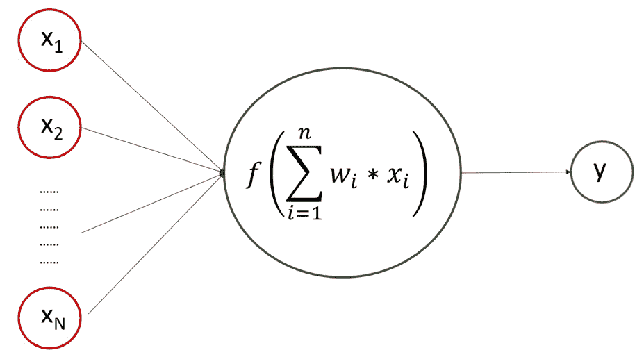

图 5.1 – 理解感知器方案

生物神经元的根本功能是在神经元细胞体的电活动超过特定阈值时，在其**轴突**（神经元输出）上产生一个电势。神经元的输入通过称为**树突**的一组纤维接收，这些树突接触其他神经元的轴突，从它们那里传递电势。一个神经元的轴突与另一个神经元的树突之间的连接点被称为**突触**。

突触具有调节从轴突发出的电脉冲的能力。神经元产生的电势基本上是二元的：开/关状态。如果神经元的电活动超过特定阈值，就会产生一个脉冲；否则，不会产生脉冲。

值得注意的是，生成的脉冲强度在不同神经元之间保持一致。当潜力沿着轴突传播并达到连接到另一个神经元树突的突触时，突触后电位依赖于突触的生化特性。尽管具有相同的突触前电位，两个不同的突触可能会产生不同的突触后电位。换句话说，突触在传输之前调节并权衡输入电位。

突触后电位通过神经元的树突继续传播并在细胞体水平积累。只有当这些潜力的总和超过某个特定阈值时，神经元才会触发潜力通过其轴突传播。生物神经元和人工神经元都通过树突接收多个输入。人工神经元将这些各种输入值聚合并计算结果。

如果计算值超过特定阈值，人工神经元会产生输出信号或潜力；否则，它保持不活跃。

人工神经元最初实现的功能是其输入的代数和，这有助于构建系统的响应。在模拟现象时，系统可能会遇到错误，需要适当的纠正。为了实现这一点，每个输入都被分配了一个权重，这是一个数值，它调节其对总和的影响，从而确定神经元的潜力。

换句话说，每个输入对确定阈值值和触发潜力的贡献各不相同，类似于涉及一个神经元轴突与另一个神经元树突之间突触的生物神经元特性。

从突触后神经元的视角来看，输入包括来自其他神经元的潜力，这些神经元的轴突与它们的树突形成突触，并且这些输入被突触精确调节。一些输入可能对总和产生更强的影响，而其他输入甚至可能是抑制性的，减少总和并因此降低超过阈值并触发潜力的概率。

这种生物系统的基本特性在连接系统中使用权重概念进行数学建模。每个连接都被分配一个数值作为其权重，该数值乘以输入值。因此，输入对总和的影响由其权重的幅度决定。

## 激活函数用于引入非线性

在我们之前的讨论中，我们探讨了通过引入权重概念引入的加权求和函数。现在，让我们深入探讨人工神经元的一个特性，这个特性再次受到了生物神经元行为的启发。如前所述，生物神经元在树突水平上对其突触后电位进行求和。然而，这种求和并不是这些电位的简单代数加和。各种因素，如神经元膜的无被动电阻，都会发挥作用，使得实际的求和通常是非线性的函数。

同样，人工神经元计算加权输入，然后使用一个特定的函数修改结果。这个函数被称为激活函数，它应用于神经元的输出以确定其真实潜力。激活函数在塑造神经元行为和最终影响神经网络计算结果方面起着至关重要的作用。

激活函数对输入的加权总和以及一个额外的偏置项应用特定的数学运算以产生神经元的输出。这个输出，通常被称为激活或后激活值，然后作为输入传递到神经网络后续的层。

神经网络中使用了不同类型的激活函数，每种都有其独特的特性和应用。常见的激活函数包括以下几种：

+   如果输入大于或等于一个阈值，则为 `1`，否则为 `0`：

f(x) = 0 if x < 0, 1 if x ≥ 0

+   `0` 和 `1`。它过去常用，但由于梯度消失问题，在更深层的网络中不再受欢迎：

f(x) = 1 / (1 + e^(-x))

+   `0`。它有助于减轻梯度消失问题，并加速深层网络的收敛：

f(x) = 0 if x < 0, x if x ≥ 0

+   `-1` 和 `1`。它在原点周围是对称的，与 sigmoid 函数相比，提供了更好的梯度范围：

f(x) = tanh(x)

+   `1`：

f(x) = e^(-x_i) * ∑(i=1 to k) e^(-x_i)

+   **指数线性单元（ELU）**：ELU 是一种在人工神经网络中使用的激活函数。它是一个平滑、非饱和函数，可以处理正负输入。ELU 比 ReLU 更晚出现，ReLU 也是一种广泛使用的激活函数：

f(x) = x if x > 0

alpha * (exp(x) - 1) if x < 0

在这里，*x* 是 ELU 函数的输入，*α* 是一个控制负斜率陡度的超参数。*α* 的默认值是 `1.0`。

ELU 函数是一个平滑、非饱和函数，可以处理正负输入。这使得它对于涉及这两种类型输入的任务（如图像识别和自然语言处理）是一个很好的选择。

激活函数的选择会影响神经网络的性能、训练速度以及捕捉数据中复杂关系的能力。根据具体问题和架构考虑，网络的不同层可能会使用不同的激活函数。

## ANN 架构解释

在讨论了人工神经元的特性之后，我们现在将深入研究神经网络的架构。这包括网络结构的物理说明以及确定每个神经元在这个框架中的作用。考虑一个有多个输入和节点的场景，其中每个输入都与每个节点相连。同样，每个输出节点也接收来自所有输入的连接。每个输出节点具有前面描述的特性，并与其他节点一起执行计算。在引入输入模式后，输出值要么受输入值本身的影响，要么受网络权重的影响。在网络中，节点集合通常被称为层。

神经网络被组织成层，每一层在信息处理中都有其特定的作用。神经网络中的主要层类型包括以下几种：

+   **输入层**：接收输入数据并将其传递给后续层的初始层。

+   **隐藏层**：位于输入层和输出层之间的中间层。这些层通过复杂的转换处理数据并提取相关特征。

+   **输出层**：产生网络输出或预测的最终层，基于从隐藏层处理过的信息。

隐藏层的数量以及其中的节点数，以及激活函数和权重的选择，构成了神经网络的架构。架构（*图 5**.2*）显著影响了网络从数据中学习、泛化到新示例以及高效执行特定任务的能力。

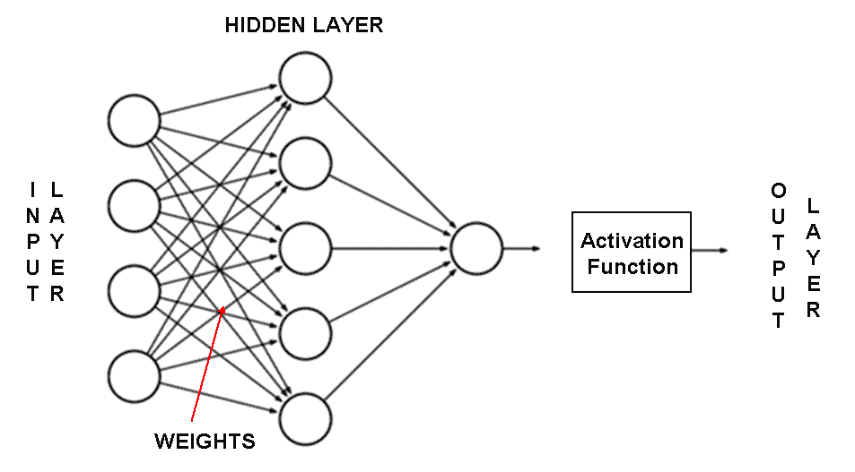

图 5.2 – 带权重和激活函数的 ANN 架构

神经网络可以由多层组成，每增加一层都会增强网络的计算能力。输入是数值，通过与第一层节点（称为隐藏层）的连接权重进行评估。在这个隐藏层中，每个节点按照前面描述的方式进行计算，从而生成潜在的输出，然后传播到输出层的节点。输出节点产生的潜在值共同代表了神经网络计算出的最终输出。

神经网络的架构指的是节点相互连接的具体方式。在前面图表中显示的前馈神经网络的情况下，输入节点的激活通过隐藏层向前传播，进一步传播到输出层。改变节点之间的连接会改变网络的架构。这不仅对网络的计算能力产生实际影响，而且与学习概念相关的理论意义也非常重大。网络中节点的排列会影响其从数据中学习以及执行特定任务的能力，使架构设计成为神经网络开发的一个关键方面。

在分析了 ANN 的基本概念之后，我们现在需要关注这些算法是如何被训练的。

# 在 MATLAB 中训练和测试 ANN 模型

在上一节中，我们看到了 ANN 的架构。它强加了两个层，输入层和输出层，这些层不能改变。因此，关键因素在于我们考虑的隐藏层数量。神经网络的大小由隐藏神经元的数量定义。确定网络的最佳大小仍然是一个持续性的挑战，因为迄今为止还没有发现解析解决方案。解决这个问题的方法之一是采用启发式方法：创建具有递增复杂性的各种网络，使用训练数据的一个子集，并同时在验证子集上监控错误。完成训练过程后，选择具有最低验证错误的网络作为首选。

## 如何训练 ANN

让我们讨论选择层数的过程。输入节点的数量基于输入数据中的特征数量是固定的，而输出节点的数量则由要建模的结果数量或结果中的类别级别决定。真正的挑战在于确定隐藏层中适当神经元数量。不幸的是，没有解析方法来完成这项任务。最佳神经元数量取决于各种因素，例如输入节点的数量、训练数据量以及学习算法的复杂性等。

隐藏层中拥有更多神经元将导致一个更好地拟合训练数据的模型，但这也伴随着过拟合的风险，可能导致对未来数据的泛化能力较差。此外，具有许多节点的神经网络可能在计算上昂贵且训练缓慢。

为了解决这个问题，可以采用启发式方法，通过实验不同的配置来找到最佳平衡。这种试错方法使我们能够在模型复杂性、准确性和计算效率之间取得平衡。

神经网络由简单的元素组成，这些元素并行操作。这些元素之间的连接起着至关重要的作用，因为它们决定了网络的功能。这些连接通过各自的权重影响输出，这些权重在神经网络训练阶段进行调整。

在训练过程中，通过修改连接权重来微调网络，使特定的输入产生期望的输出。例如，可以通过将网络的实际输出与我们要达到的目标输出进行比较来校准网络。这个过程会持续迭代，直到网络的输出与期望的目标相一致。

为了获得可靠的结果，需要大量的输入/目标对来适当地塑造网络。这个过程确保神经网络能够准确地产生各种输入的期望输出，使其成为各种任务的可靠工具。

这些权重的调整取决于我们选择的特定算法。在以下实际示例中，我们将讨论和参考各种控制权重调整过程的算法。

## 介绍 MATLAB 神经网络工具箱

**神经网络工具箱**提供了一系列算法、预训练模型和应用程序，使用户能够创建、训练、可视化和模拟神经网络。它支持浅层神经网络（含一个隐藏层）和深层神经网络（含多个隐藏层）。使用这些工具，可以执行各种任务，如分类、回归、聚类、降维、时间序列预测以及动态系统建模和控制。

利用神经网络工具箱有四种主要方式：

+   `nnstart` 命令，提供对自动任务（如函数拟合 `nftool`）、模式识别 `nprtool`）、数据聚类 `nctool`）和时间序列分析 `ntstool`）的访问。

+   **基本命令行操作**：为了提高灵活性，用户可以利用命令行操作。虽然需要更多的知识，但这种方法允许用户完全控制过程，而无需依赖于 GUI 中通常找到的菜单和图标。

+   **定制工具箱**：用户可以通过创建自己的具有任意连接的神经网络来自定义工具箱。现有的工具箱训练功能在 GUI 中可以使用，以继续训练这些自定义网络。

+   **修改工具箱功能**：工具箱中的所有计算组件都使用 MATLAB 代码编写，并且完全可访问，使用户能够根据特定需求修改和定制它们。

这个工具箱适用于所有级别的用户，从初学者到专家。它提供了简单的工具，引导新用户通过特定应用，以及更复杂的工具，使专家能够自定义网络并尝试新的架构。

无论选择哪种方法，使用神经网络进行适当的分析应包括以下步骤：

1.  数据收集

1.  网络创建

1.  网络配置

1.  权重和偏置初始化

1.  网络训练

1.  网络验证

1.  网络测试

通过遵循这些步骤，用户可以有效地将神经网络应用于各种问题和任务。这些步骤的详细解释如下：

1.  过程的第一步涉及收集要分析的数据，这通常在 MATLAB 环境之外完成。数据收集阶段至关重要，因为数据的质量将显著影响最终结果和提取有意义的见解的能力。

1.  接下来，我们使用工具箱中提供的各种函数来创建神经网络。这些函数允许我们通过选择的算法构建网络，从而创建一个神经网络对象。该对象存储了定义神经网络特性的所有必要信息，例如其架构、子对象结构、函数以及权重和偏置值。

1.  第三步是网络配置，其中我们检查输入和输出数据，设置网络的维度以适应数据，并选择合适的输入和输出处理设置以增强网络性能。此配置步骤通常在调用训练函数时自动执行，但也可以使用配置函数手动完成。

1.  配置之后，第四步涉及初始化权重和偏置。我们设置初始值，网络将从这些值开始其训练过程。这种初始化通常基于选择的训练算法自动完成，但用户如果需要也可以设置自定义值。

1.  第五步是网络训练，这是过程中的关键阶段。在训练过程中，权重和偏置被微调以优化网络性能。这一阶段对于网络能够很好地泛化新、未见数据至关重要。通常，收集到的数据（大约为可用案例的 70%）用于训练。

1.  接下来，在第六步，进行网络验证。在这里，将随机选择的一部分数据（通常为可用案例的约 15%）通过网络来估计模型训练的效果。这一阶段获得的结果有助于确定所选模型是否充分反映了初始期望，或者是否需要调整。

1.  最后，在最后一步，我们利用训练好的网络。收集到的数据的一部分（大约为可用案例的 15%）用于测试网络性能。然后，训练好的神经网络对象可以被保存并多次使用，以便在需要时用新数据进行分析。这允许重复使用网络进行预测或分析各种数据集。

神经网络设计的流程涉及将收集到的数据分为三组：**训练集**、**验证集**和**测试集**。让我们详细描述每一组：

+   **训练集（通常为可用案例的 70%）**：训练集是一组示例，用于训练神经网络并调整其参数。在训练过程中，网络从训练集中的输入-输出对中学习，以优化其内部权重和偏差。目标是找到最佳参数集，以最好地捕捉数据中的潜在模式和关系。神经网络通过训练阶段的迭代调整来提高其性能。

+   **验证集（通常为可用案例的 15%）**：验证集是一组独立的示例，用于微调网络的参数并在训练期间评估其性能。它作为验证机制，防止过拟合，即网络在训练数据上表现良好，但在新的、未见过的数据上表现较差。通过监控网络在验证集上的性能，我们可以做出关于模型复杂性的决定，例如确定隐藏单元的最佳数量或确定训练算法的合适停止点。基于验证集的调整有助于确保网络对新数据具有良好的泛化能力。

+   **测试集（通常为可用案例的 15%）**：测试集是一组独立且独立的示例，仅用于评估完全训练好的神经网络的性能。在训练和验证阶段之后，使用测试集评估最终模型，以估计其错误率并验证其泛化能力。至关重要的一点是，在基于测试集评估的基础上避免对模型进行任何进一步的调整，以避免偏差或过拟合。测试集提供了对神经网络在新、真实世界数据上可能表现如何的无偏度量。

通过将数据分为这三个不同的集合，神经网络设计工作流程确保模型以受控和可靠的方式进行训练、验证和测试，从而允许对其性能和泛化能力进行准确评估。

对这一过程有了清晰的理解后，我们现在可以继续我们的工作，分析 MATLAB 中人工神经网络实现的实际示例。

# 使用人工神经网络理解数据拟合

**数据拟合**是指构建一个曲线或数学函数，使其与给定的数据点集最佳匹配的过程。这种曲线拟合可能涉及插值，其中精确地拟合数据点，或者平滑，其中平滑函数近似数据。在回归分析中，曲线拟合与统计推断密切相关，考虑到来自观察数据随机误差的不确定性。

通过数据拟合获得的大致曲线具有多种应用。它们可以用于可视化并显示数据，预测无可用数据区域中的函数值，以及总结多个变量之间的关系。这个过程对于理解和解释复杂数据集、进行预测以及从收集到的信息中获得见解非常有价值。

使用数学公式预测特定分布的趋势可能具有挑战性，这些公式可能并不总是能准确代表所有数据或涵盖存在的整个范围。为了解决这类情况，机器学习算法应运而生。这些算法可以构建模型，而不依赖于复杂的数学公式。

神经网络非常适合数据拟合和趋势预测任务。它们可以从给定的一组输入及其相关的目标输出中适应和学习。**函数拟合**是通过训练神经网络使用这样的输入-输出对来进行的，使其能够形成底层输入-输出关系的泛化。一旦训练完成，神经网络就可以为它在训练期间未遇到的输入生成输出。

神经网络的灵活性使它们能够捕捉数据中的复杂模式和关系，成为数据拟合和预测任务的有力工具。通过利用如神经网络这样的机器学习算法，我们可以克服传统数学公式的局限性，并在各种数据集和场景中实现准确的预测。

基于机器学习的算法的性能强烈依赖于正在处理的数据质量。数据收集过程通常发生在 MATLAB 环境之外，这意味着您需要准备好一个正确收集的数据文件，以便在 MATLAB 中启动分析。然而，如果您还没有访问数据，并且在这里学习，无需担心，因为 MATLAB 有解决方案。

神经网络工具箱软件提供了几个样本数据集，您可以使用这些数据集来实验工具箱的功能。这些样本数据集随时可用，可以作为您分析的开端。要探索可用的数据集，您可以使用以下命令：

```py
help nndatasets
```

将按应用类型排序的数据集列表将返回。有了这些样本数据集，您就可以开始学习之旅，并在 MATLAB 的神经网络工具箱中获得实践经验。现在，我们将通过 MATLAB 中的数据拟合示例来操作：

1.  让我们集中关注数据拟合的数据集，特别是`abalone_dataset`，它包含*鲍鱼壳环数据集*。要将数据集加载到 MATLAB 工作空间中，让我们使用以下命令：

    ```py
    load abalone_dataset
    [Input,Target] = abalone_dataset;
    ```

    执行此命令将数据加载到名为 `Input` 和 `Target` 的数组中。该模型的目标是估计鲍鱼年龄，通过使用物理测量来实现这一预测。帮助文档：abalone_dataset

    提供了关于数据集的全面描述，包括属性数量、项目总数以及变量列表等详细信息。此外，描述还提供了关于数据集潜在用例的宝贵见解。

1.  现在我们有了数据，我们必须选择训练算法并设置网络架构。在 MATLAB 中，有各种函数可用于训练。要获取可用训练算法的列表，我们可以使用以下命令：

    ```py
    help nntrain
    TFunc = 'trainlm';
    ```

    LM 反向传播是一种用于训练人工神经网络的优化算法。它是标准反向传播算法的扩展，提高了收敛性和鲁棒性，尤其是在非线性和不稳定问题中。在标准反向传播中，算法通过使用权重相对于误差的梯度来调整神经网络的权重。然而，在某些情况下，这个过程可能很慢，算法可能会陷入局部最小值。LM 反向传播通过结合 LM 优化方法来解决此问题，该方法常用于非线性最小二乘拟合问题。LM 算法结合了梯度下降和高斯-牛顿方法的思想。

    下面是 LM 反向传播的基本工作原理概述：

    1.  使用标准反向传播算法计算误差函数相对于权重的梯度

    1.  计算表示误差表面相对于权重的曲率的 Hessian 矩阵

    1.  使用梯度下降和 LM 优化方法的组合来调整权重

    LM 反向传播算法在训练过程中调整学习率。当误差表面陡峭时，它表现得更像梯度下降，这有助于避免过冲。当误差表面相对平坦时，它表现得更像高斯-牛顿方法，这可以加快收敛速度。这种技术的组合使得 LM 反向传播成为训练神经网络的一种高效且有效的算法，尤其是在标准反向传播可能遇到收敛问题或学习率较慢的情况下。它常用于各种应用，包括模式识别、函数逼近和非线性回归任务。

    之后，我们必须设置隐藏层中的节点数：

    ```py
    HLNodesNum =10;
    ```

1.  最后，我们必须使用 `fitnet()` 函数创建我们的 ANN，如下所示：

    ```py
    AbaFitNet = fitnet(HLNodesNum, TFunc);
    ```

    `fitnet()` 函数是一个内置的 MATLAB 函数，用于创建和训练具有单个隐藏层的前馈神经网络，用于函数拟合、模式识别和回归任务。以下参数被传递：

    +   `LnodesNum`：这是一个向量，指定了每个隐藏层中的神经元数量。

    +   `Tfunc`：此参数指定用于训练神经网络的训练函数。它代表在训练过程中更新网络权重的优化算法。一些常用的训练函数包括`trainlm`（LM）、`trainbfg`（BFGS Quasi-Newton）和`traingd`（梯度下降）。

1.  在*探索数据整理*部分，我们在*探索 MATLAB 机器学习*章节中展示了训练算法是必要的，以预处理数据。在这种情况下，我们可以使用神经网络工具箱中可用的神经网络处理函数。要打印所有可用的通用数据预处理函数，我们可以使用以下命令：

    ```py
    help nnprocess
    ```

    以下函数被列出：

    +   `removerows`：根据指定的索引从矩阵中消除行

    +   `mapminmax`：将每个矩阵行的最小值和最大值映射到范围[-1, 1]

    +   `processpca`：对矩阵行执行主成分分析

    +   `mapstd`：将矩阵的行平均值和偏差映射到标准值

    +   `fixunknowns`：使用特定程序处理具有未知值的矩阵行

    前两个代表应用于前馈多层网络的默认函数，因此我们将将其应用于我们的案例：

    ```py
    AbaFitNet.input.processFcns =
                       {'removeconstantrows','mapminmax'};
    AbaFitNet.output.processFcns =
                       {'removeconstantrows','mapminmax'};
    ```

    如前所述，这些是应用于输入和输出的默认处理函数。第一个移除常数记录，因为它们不会为数据适应带来任何内容，而第二个则将矩阵或向量的元素从其原始范围映射到指定的目标范围。

1.  然后需要对数据进行预处理以进行**数据划分**。这是机器学习和数据分析中常用的技术，用于将数据集划分为用于不同目的的单独子集。数据划分的主要原因是为了拥有用于训练、验证和测试的不同数据部分，这允许评估和改进机器学习模型。有几种数据划分技术；在这种情况下，数据集被划分为三个部分：训练集、验证集和测试集。训练集用于模型训练，验证集用于调整超参数和优化模型，测试集用于最终评估：

    ```py
    AbaFitNet.divideFcn = 'dividerand';
    AbaFitNet.divideMode = 'sample';
    ```

    此属性决定了在调用数据划分函数时目标数据的维度。对于静态网络，默认值为`sample`，对于动态网络，默认值为`time`。或者，它可以设置为`sampletime`以根据样本和时间步长划分目标，`all`以在每个标量值处划分目标，或者`none`以保持数据未划分（意味着所有数据用于训练，没有用于验证或测试）。

    让我们现在设置用于不同阶段的数据百分比：

    ```py
    AbaFitNet.divideParam.trainRatio = 70/100;
    AbaFitNet.divideParam.valRatio = 15/100;
    AbaFitNet.divideParam.testRatio = 15/100;
    help nndivision
    ```

    仔细执行数据划分对于避免数据泄露等问题以及确保可靠的模型评估至关重要。

1.  在训练人工神经网络（ANN）之前，选择某些内容是必要的。首先，我们必须选择评估指标来检查我们设置的模型的性能。评估指标是用于评估模型、算法、系统或过程性能和有效性的定量度量。在各个领域，如机器学习、数据科学和信息检索中，评估指标对于比较不同方法、调整参数以及理解特定解决方案的优缺点至关重要。评估指标的选择取决于要解决的问题和分析的目标。适当指标的选择取决于问题的性质和分析的目标。选择与当前任务的具体目标和要求相一致的评估指标是至关重要的。我们可以使用如下命令：

    ```py
    AbaFitNet.performFcn = 'mse';
    help nnperformance
    ```

    将评估指标列表及其简要说明打印出来。

1.  最后，我们必须选择绘图函数以获得结果的视觉表示。为此，我们可以使用`plotFcns()`函数，它包含一个一维字符串单元数组，定义了与网络关联的绘图函数。通过`train()`函数可访问的神经网络训练窗口显示每个绘图函数的按钮。只需在训练过程中或训练过程之后点击相应的按钮即可打开所需的绘图：

    ```py
    AbaFitNet.plotFcns = {'plottrainstate','plotperform',
                       'ploterrhist',   'plotregression'};
    help nnplot
    ```

    将返回一个 ANN 可用绘图列表及其简要说明。

1.  现在，我们可以训练已经设置的 ANN；为此，我们可以使用如下`train()`函数：

    ```py
    [AbaFitNet,Trs] = train(AbaFitNet,Input,Target);
    ```

    此函数训练一个浅层神经网络，并传递三个参数：

    +   `AbaFitNet`：神经网络模型对象。

    +   `Input`：用于训练神经网络的输入数据。它应该是一个矩阵，其中每一行代表一个单独的输入模式。鲍鱼数据集是一组描述鲍鱼物理尺寸的特征集合。此数据集包含八个特征：性别、长度、直径、高度、总重量、去壳重量、内脏重量和壳重量。

    +   `Target`：与输入模式相对应的目标数据。它应该是一个矩阵，行数与输入矩阵相同，其中每一行包含相应的目标值。目标是鲍鱼的年龄，以环数的形式衡量。

    `train()`函数使用指定的输入数据和目标数据执行训练过程。所使用的训练算法类型取决于特定的神经网络模型及其设置。训练完成后，返回的对象将包含训练好的神经网络，可用于使用与训练网络相关的任务对新数据进行预测。

    在训练阶段，将打开一个新窗口（如图*5**.3*所示）。

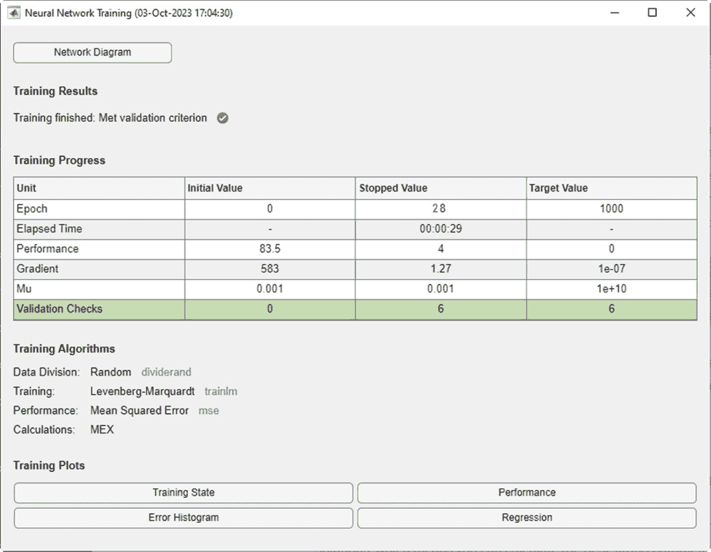

图 5.3 – 训练结果窗口

在*图 5.3*中，我们可以检查训练进度，它显示了诸如**Epoch**、**Elapsed Time**、**Performance**、**Gradient**、**Mu**和**Validation Checks**等信息。此外，总结了之前步骤中设置的属性。最后，有几个与绘图集相关的按钮可用。

通过点击此窗口底部的按钮，我们可以绘制特定的图表。

1.  在训练好 ANN 之后，是时候测试网络了。测试神经网络涉及评估它在训练阶段未见过的一个单独的测试数据集上的性能。这一步骤有助于评估训练网络的泛化能力，并确保它可以在未见过的数据上做出准确的预测。为了测试我们训练的 ANN，我们可以将网络应用于未见过的数据，如下所示：

    ```py
    SimTarget = AbaFitNet(Input);
    Diff = gsubtract(Target, SimTarget);
    Performance = perform(AbaFitNet, Target, SimTarget)
    ```

    在这段代码中，我们开始对所有数据进行网络评估，获得一个性能值以与其他值进行比较。

    以下性能值被返回：

    ```py
    Performance =
        4.1539
    ```

1.  现在，我们必须按照以下方式重新计算训练、验证和测试性能：

    ```py
    trainTargets =Target.* Trs.trainMask{1};
    valTargets =Target.* Trs.valMask{1};
    testTargets =TargetB.* Trs.testMask{1};
    trainPerformance = perform(AbaFitNet,trainTargets, SimTarget)
    valPerformance = perform(AbaFitNet,valTargets, SimTarget)
    testPerformance = perform(AbaFitNet,testTargets, SimTarget)
    ```

    以下性能值被返回：

    ```py
    trainPerformance =     3.9470
    valPerformance =     5.1255
    testPerformance =     4.1468
    view(AbaFitNet)
    ```

    最后，为了展示这些图表，我们可以使用以下命令：

    ```py
    figure,plotperform(Trs)
    figure,plottrainstate(Trs)
    ```

    `plottrainstate()`函数绘制了`train()`函数返回的训练状态。

    ```py
    figure,ploterrhist(Diff)
    figure,plotregression(Target, SimTarget)
    ```

    最后，为了评估网络估计模型目标的能力，我们使用了`plotregression()`函数。此函数绘制了相对于输出的目标线性回归图。

    以下图表将被打印：

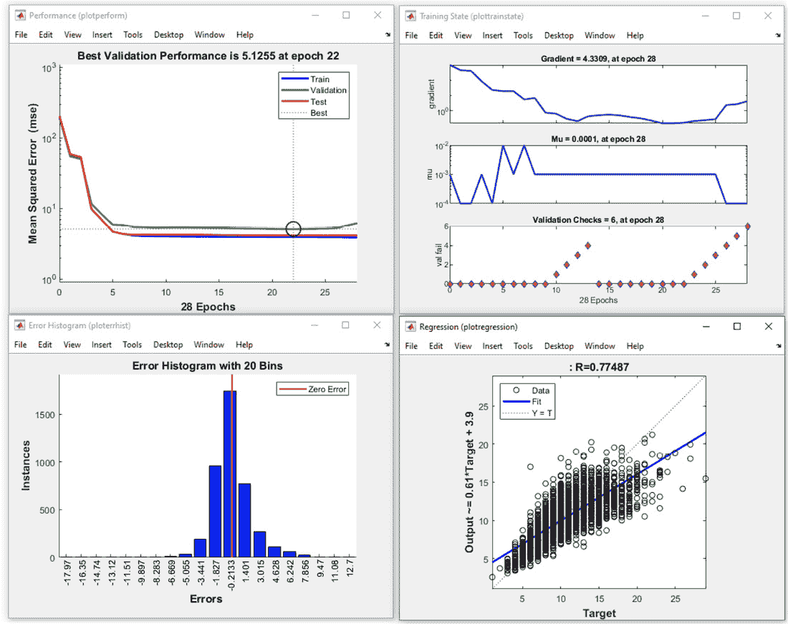

图 5.4 – ANN 图表

这样，我们就能通过逐期评估训练参数的趋势。此外，我们还将有一个误差分布的统计，最后，通过回归图，我们可以得到预测值与真实值位置的指示。

在*图 5.4*中，我们可以分析模型的回归线。回归线是统计数据分析中的一个关键元素，提供了有关模型预测数据能力的宝贵信息。这条直线代表了自变量和因变量之间的数学关系，试图最小化观察值与模型预测值之间的差异。线的斜率反映了自变量每单位变化时因变量的平均变化。如果斜率接近`1`，则模型可以准确地预测数据。此外，截距表示当自变量为 0 时因变量的值。

模型的拟合优度是通过相关系数 *R* 来衡量的，它衡量了两个变量之间关联的强度。高 *R* 值表示良好的预测能力。需要注意的是，如果数据具有复杂或非线性模式，回归线在预测能力上可能存在局限性。在这种情况下，可能需要更高级的模型。

在详细分析了数据拟合的例子之后，我们现在将看到如何处理分类问题。

# 使用人工神经网络发现模式识别

**模式识别**是机器学习和人工智能的一个分支，它专注于识别数据中的模式或规律。它涉及从数据集中自动发现和提取有意义的信息，目的是将数据分类或归类到不同的类别或组中。总的来说，模式识别在自动化识别模式和基于数据做出决策的过程中发挥着至关重要的作用，使其成为许多现代人工智能系统的基本组成部分。

模式识别在自动化决策处理复杂数据方面提供了许多好处。然而，它也带来了与数据质量、可解释性和计算需求相关的挑战。为了有效地利用其优势，从业者需要精心设计和训练模型，同时意识到数据和方法中可能存在的局限性和偏差。

经典的图案识别方法使用传感器收集的数据作为分类系统的输入。这些数据通常代表典型的测量值，如运动分析系统中的运动学和动力学数据。这些测量值通常要经过预处理阶段。这样做是为了改善信号特性。后续的特征提取为后续分类提供特征向量。这个向量描述了特征空间中的输入测量值。在监督分类中，标记的特征向量被呈现给分类器进行训练。用于训练分类器的向量形成训练集。这些标签将特征向量分配给几个可能的类别之一。在识别阶段，训练好的分类器使用这个决策规则并自动将特征向量分配给一个类别。可以使用不同的分类器，使用不同的学习策略。

现在我们将分析一个使用 MATLAB 的图案识别的实际例子。在本节中，我们的目标是开发一个分类模型，可以根据各种患者数据对甲状腺疾病进行分类。涉及的步骤如下：

1.  要启动这个过程，我们首先获取用于分析的数据。对于这项研究，我们将使用一个预装了 MATLAB 的现有数据集。如前所述，MATLAB 提供了几个易于导入工作区的数据库，可以使用`load`命令后跟特定数据库名称来实现。在这个例子中，我们将使用`thyroid_dataset`作为我们的选择数据集：

    ```py
    [Input,Target] = thyroid_dataset;
    ```

    在 MATLAB 工作区中，我们现在有两个变量：

    +   `Target`变量，类别由第一行、第二行或第三行中的`1`表示。第一行中的`1`表示患者被分类为正常（非甲状腺功能亢进），第二行中的`1`表示功能亢进（甲状腺功能亢进），第三行中的`1`表示亚正常功能（甲状腺功能减退）。

    当前具体问题是确定被转诊到诊所的患者是否患有甲状腺功能减退。需要注意的是，由于许多患者并非甲状腺功能亢进（92%），一个成功的分类器必须达到比 92%显著更高的准确率才能被认为是有效的。

1.  现在，是时候选择适合神经网络的适当训练函数了。为了为网络设置特定的训练算法，您可以使用`trainFcn`属性并分配所需函数的名称。在多种可用的算法中，我们将选择**缩放共轭梯度**（**SCG**）反向传播方法。这种方法是一种优化算法，常用于训练人工神经网络，尤其是在解决训练过程中权重更新问题。它是梯度下降、**随机梯度下降**（**SGD**）和各种反向传播变体的替代方案。SCG 以其在收敛到损失函数最小值时的效率和速度而闻名。SCG 算法的优点包括在许多情况下能够快速有效地收敛，使其成为训练相对较小到中等规模数据集的神经网络的不错选择。然而，它可能并不总是优于其他优化方法，尤其是在大型数据集或更复杂的网络架构中。优化算法的选择通常取决于具体问题、数据集大小和可用的计算资源：

    ```py
    trainFcn = 'trainscg'
    ```

1.  在选择训练算法之后，下一步是构建神经网络。为了实现这一点，我们需要确定隐藏层中的节点数。在这种情况下，我们决定构建一个包含 10 个节点的单隐藏层函数拟合神经网络：

    ```py
    hiddenLayerSize = 10;
    ```

1.  我们可以使用`patternnet()`函数构建一个模式识别网络。模式识别网络是设计用于根据目标类别对输入进行分类的前馈网络。这些网络的目标数据应包含所有值为`0`的向量，除了对应于它们所代表的类别的元素为`1`。

    `patternnet()`函数接受以下参数：

    +   `hiddenSizes`：指定一个或多个隐藏层大小的行向量。如果没有提供值，默认为`10`。

    +   `trainFcn`：要使用的训练函数。默认为`trainscg`（SCG 反向传播）。

    +   `performFcn`：训练期间使用的性能函数。默认为`crossentropy`。

    该函数返回具有指定架构和设置的图案识别神经网络：

    ```py
    TyroidPatNet = patternnet(hiddenLayerSize, trainFcn);
    ```

1.  一旦构建了网络并预处理了数据，下一步是将数据划分为单独的训练、验证和测试集。

    为了实现这一点，我们通常将可用的数据集划分为三个不同的子集：

    +   **训练集**：这个子集用于训练神经网络。网络在训练过程中从输入数据和相应的目标输出中学习。

    +   **验证集**：验证集用于微调网络的超参数并防止过拟合。它通过在训练过程中评估其未见过数据上的性能来帮助优化网络性能。

    +   **测试集**：这个集用于评估训练后网络的最终性能。它提供了对网络在未见数据上泛化能力的无偏估计。

    可以使用各种技术来划分数据，例如随机抽样、分层抽样或基于时间的分割，具体取决于数据的性质和特定问题：

    ```py
    TyroidPatNet.divideFcn = 'dividerand';
    TyroidPatNet.divideMode = 'sample';
    TyroidPatNet.divideParam.trainRatio = 70/100;
    TyroidPatNet.divideParam.valRatio = 15/100;
    TyroidPatNet.divideParam.testRatio = 15/100;
    ```

    在网络构建和数据预处理步骤中操作的重要性以及所使用的函数类型之前已经进行了广泛讨论。如果有任何疑问，建议您回顾该段落以获得更详细的理解。

1.  在衡量网络性能方面，我们将选择**交叉熵性能**函数。这个特定的性能函数非常适合分类和模式识别任务。它通过计算交叉熵来量化网络的性能，交叉熵衡量的是估计和实际类别成员之间的差异。

    通过使用交叉熵性能函数，我们可以有效地评估神经网络在分类输入方面的表现，并就其在给定模式识别问题上的有效性做出明智的决策。

    通过将这些数据划分为这些单独的集，我们可以确保神经网络的性能不仅是在训练数据上衡量，而且还在未见数据上验证，从而使评估更加可靠，更能反映网络的真正能力：

    ```py
    TyroidPatNet.performFcn = 'crossentropy';
    ```

1.  最后，我们现在可以设置绘图函数来可视化模拟的结果：

    ```py
    TyroidPatNet.plotFcns = {'plotperform','plottrainstate','ploterrhist', 'plotconfusion', 'plotroc'};
    ```

1.  现在，我们准备使用`train()`函数开始网络的训练过程：

    ```py
    [TyroidPatNet,Trs] = train(TyroidPatNet,Input,Target);
    ```

    在训练神经网络时，将显示**神经网络训练**窗口。这个窗口包含四个部分，每个部分在整个训练过程中都提供有价值的信息：

    +   **神经网络**：本节提供了神经网络架构和配置的摘要，包括层数、每层的节点数以及选择的训练算法。

    +   **算法**：在此区域，展示了正在使用的训练算法的详细信息，例如特定的优化技术和收敛标准。

    +   **进度**：进度部分显示了训练过程的实时更新，例如当前周期、训练错误和验证性能。它允许监控网络在连续周期中的性能改进。

    +   **图表**：本节显示了各种图表，如训练和验证错误随周期的变化，这有助于对网络的学习进度和潜在的过拟合进行视觉评估。

    **神经网络训练**窗口（*图 5**.5*）提供了对训练过程的全面视图，提供了关于网络在不同阶段的运行和行为性能的见解。这些见解有助于微调网络，并做出明智的决定以优化其在当前模式识别任务中的性能。

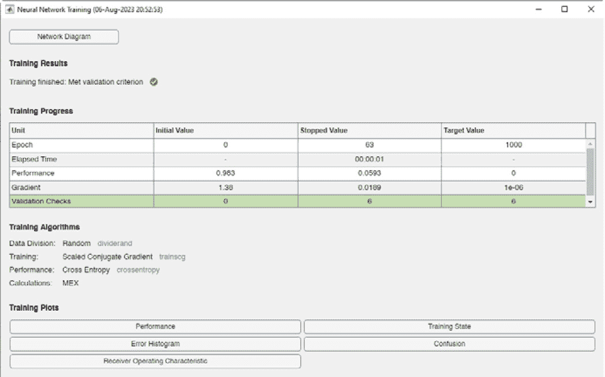

图 5.5 – 用于模式识别的神经网络训练窗口

1.  网络训练完成后，我们可以使用训练好的模型来测试它在训练阶段使用的相同输入数据上的性能。通过这样做，我们可以获得结果并利用它们进行评估。

    在相同的数据上测试网络有助于我们评估模型对熟悉输入的泛化能力，并提供了关于其在处理现实世界场景中的有效性的见解。从这个过程中获得的评价结果有助于理解网络的准确性、精确度、召回率和其他相关指标，使我们能够就其整体性能和适用于预期模式识别任务的可适用性做出明智的决定：

    ```py
    SimData = TyroidPatNet(Input);
    Diff = gsubtract(Target, SimData);
    performance = perform(TyroidPatNet, Target, SimData);
    TargetInd = vec2ind(Target);
    SimDataInd = vec2ind(SimData);
    percentErrors = sum(TargetInd ~=
                          SimDataInd)/numel(TargetInd);
    ```

    `vec2ind()` 函数用于将向量转换为索引。它允许索引直接表示为自身，或者表示为包含一个 `1` 的行，该行对应于它们所代表的索引。在此问题中，`TargetInd` 和 `SimDataInd` 是包含值 `1`、`2` 或 `3` 的向量，代表目标和输出所属的类别。这些向量的最后一行包含错误发生的百分比。

    获得了以下值：

    ```py
    percentErrors = 0.0742
    ```

1.  现在，让我们继续进行网络的评估。以下命令提取了与训练、验证和测试子集相关的输出和目标。这些提取的数据将在后续步骤中用于构建混淆矩阵，这将有助于进一步评估网络在每个子集上的性能：

    ```py
    trOut = SimData(:,Trs.trainInd);
    vOut = SimData (:,Trs.valInd);
    tsOut = SimData (:,Trs.testInd);
    trTarg = Target(:,Trs.trainInd);
    vTarg = Target (:,Trs.valInd);
    tsTarg = Target (:,Trs.testInd);
    figure, plotconfusion(trTarg, trOut, 'Train', vTarg, vOut, 'Validation', tsTarg, tsOut, 'Testing', Target,SimData,'All')
    ```

    **混淆矩阵**是一个有价值的工具，它允许我们比较我们模型的分类结果与真实数据。它提供了对分类错误性质和数量的洞察。矩阵由单元格组成，其中对角线元素表示正确分类的案例数量，而离对角线元素表示错误分类的案例。

    在理想情况下，机器学习算法应该完美地区分两个不重叠（互斥）的群体（例如健康和患病群体）。然而，在现实场景中，这两个群体往往在一定程度上重叠，导致算法产生一些错误阳性和错误阴性预测。

    *图 5.6*显示了训练、测试和验证阶段的混淆矩阵，以及考虑所有三组数据一起的综合矩阵。

    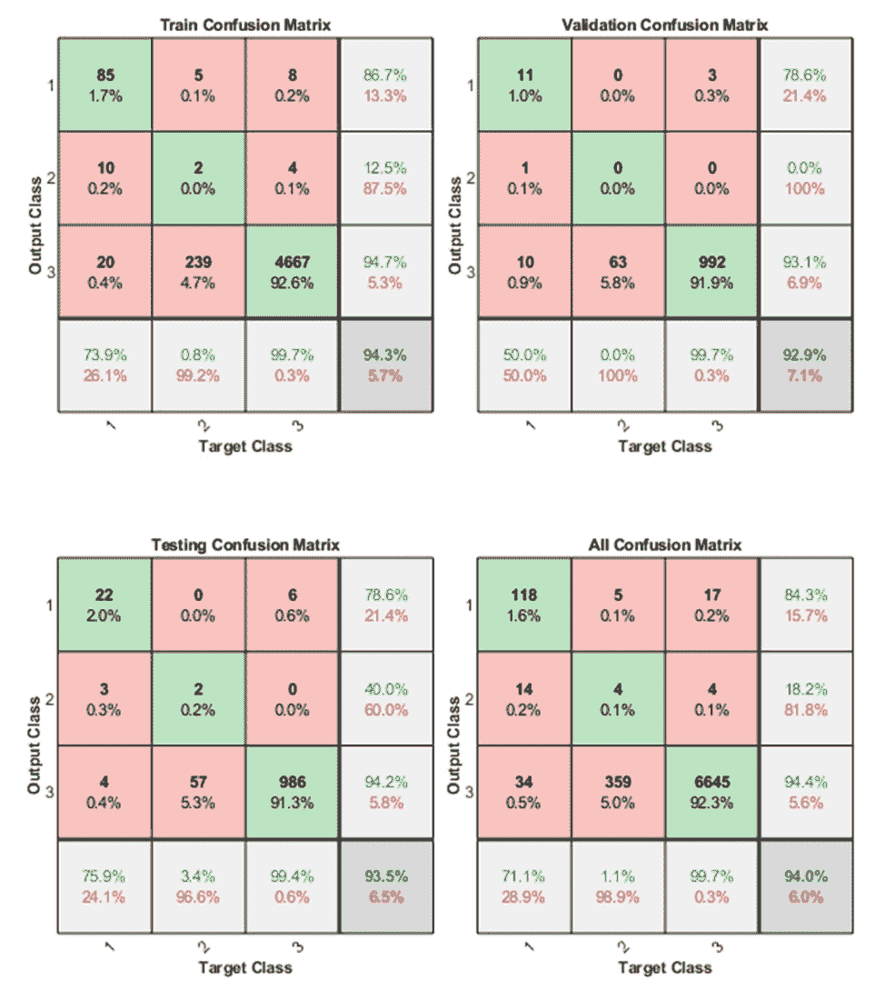

图 5.6 – 训练、测试和验证阶段的混淆矩阵，以及三种数据组合

这种视觉表示将帮助我们了解模型在不同阶段的表现以及考虑所有数据子集的整体分类性能。混淆矩阵已经计算了训练、测试和验证阶段，以及所有三个数据子集的组合。这个综合矩阵提供了模型在各个评估阶段的分类性能的详细概述，并给出了其在处理不同数据集方面的有效性的完整图景。

在*图 5.6*中，位于右下角的蓝色单元格代表正确分类案例的总百分比，这些案例通过位于对角线上的绿色单元格表示。矩阵中的红色单元格表示位于其他单元格中的错误分类案例的总百分比。混淆矩阵通过行表示实际值，列表示预测值来组织数据。例如，在图象的右上角，第一行表示 85 个案例被正确分类为`1`（正常），5 个案例被错误分类为`2`（过度功能），8 个案例被错误分类为`3`（亚正常）。通过观察混淆矩阵中每个图象右下角的蓝色单元格，我们可以推断出分类精度始终很高，超过 92%。这些结果证明了出色的识别能力。如果需要更高的精度，可以考虑重新训练数据。需要注意的是，起始数据集在所有类别之间并不正确平衡。这可能导致一个类别的性能值很高，而另一个类别的性能值很低。因此，始终建议在所有类别都正确平衡的数据集上工作。

评估网络性能的另一种方法是通过**受试者工作特征**（**ROC**）。ROC 曲线是评估模型在各个分类阈值下灵敏度和特异性的宝贵工具。后续命令生成每个评估阶段和整个过程的 ROC 图：

```py
figure, plotroc(trTarg, trOut, 'Train', vTarg, vOut, 'Validation', tsTarg, tsOut, 'Testing', Target,SimData,'All')
```

ROC 是用于评估分类器性能的指标。它通过在区间 `[0, 1]` 上应用阈值值来评估每个类的分类器的质量。

在以下图中，显示了训练、测试和验证阶段的 ROC 图，以及来自所有三个子集的合并数据的 ROC 曲线。这些 ROC 曲线使我们能够分析分类器在不同分类阈值下每个类的灵敏度特异度，从而为它的判别能力和整体性能提供宝贵的见解。

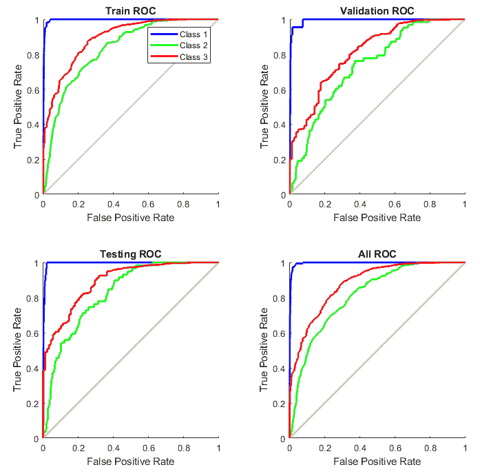

图 5.7 – 训练、测试和验证以及三种数据组合的 ROC 曲线

在图中，每个轴上的彩色线条代表 ROC 曲线。ROC 曲线说明了随着分类阈值的改变，**真正例率**（**TPR，或灵敏度**）和**假正例率**（**FPR**）之间的关系。TPR 衡量的是分类器正确识别为正例的实际正例的比例。

TPR = TP / (TP + FN)

在这里，我们有以下内容：

+   *TP* = 真正例

+   *FN* = 假阴性

换句话说，它计算模型检测数据集中所有正例的能力。FPR 衡量的是分类器错误地将实际负例分类为正例的比例。它量化了模型产生的误报或假正例的比率。

FPR = FP / (FP + TN)

在这里，我们有以下内容：

+   *FP* 是假正例的数量，即被错误地分类为正例的负例数量

+   *TN* 是真负例的数量，即被正确分类为负例的负例数量

一个理想的测试应该显示出位于左上角的数据点，这表明 100%的灵敏度和 100%的特异性。线条越接近左上角，网络的性能就越好，这表明它能够在保持低 FPR 的同时实现更高的灵敏度，从而提高分类的准确性。

在使用 MATLAB 中可用的工具解决模式识别问题之后，在下一个实际例子中，我们将看到如何借助神经网络工具解决聚类问题。

# 使用 ANN 构建聚类应用程序

聚类是一种流行的无监督机器学习技术，用于在数据集中将相似的数据点分组在一起。聚类的目标是将数据划分为簇，使得同一簇内的数据点比其他簇内的数据点更相似。我们在*第四章**，聚类分析和降维*中深入探讨了这一主题。

在本节中，我们将了解如何在 MATLAB 环境中使用 ANN 解决聚类问题。到目前为止，为了在 MATLAB 环境中训练神经网络，我们使用了命令行中可用的命令，或者更简单地说，通过`.m`扩展名的脚本实现，以便我们可以在任何时候重现算法。但是，MATLAB 提供了现成的应用程序，允许我们使用向导来训练 ANN。我们将这样做来解决以下聚类问题：

1.  要了解神经网络工具提供的应用程序概述，我们可以在命令行中键入以下内容：

    ```py
    nnstart
    ```

    将打开以下窗口：

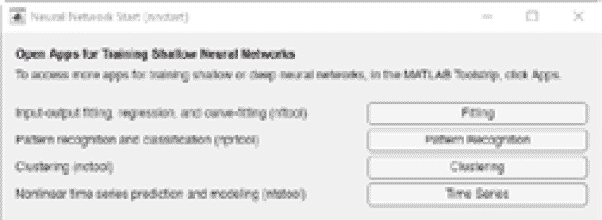

图 5.8 – 神经网络启动窗口

有四个应用程序可供使用：`nftool`命令用于启动`nprtool`命令以打开**模式识别**应用程序。

在本例中，我们将使用**聚类**应用程序，它可以通过以下命令启动：

```py
nctool
```

将打开以下窗口：

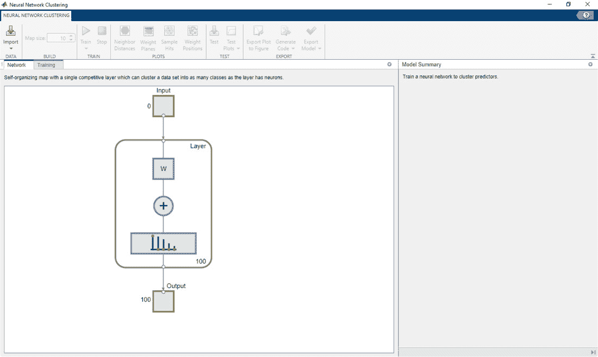

图 5.9 – 使用 ANN 进行聚类的 MATLAB 应用程序

在此应用程序中，我们可以使用向导来训练 ANN。让我们看看如何操作。

1.  要开始，我们必须导入数据。对于本例，我们将使用 MATLAB 环境中已可用的数据集来解释使用 ANN 的聚类应用程序。为了在 MATLAB 工作空间中导入该数据集，我们使用以下命令：

    ```py
     [Input,Target] = simplecluster_dataset;
    ```

    现在，我们在 MATLAB 工作空间中有两个矩阵（`Input`和`Target`）。我们将仅使用第一个（wx1,000 double）进行聚类问题，这是具有两个变量和 1,000 条记录的`Input`矩阵。通过检查`Target`（4x1,000 double）矩阵的结构，我们意识到有四个类别可用，因此数据有`4`组数据，这将有助于证明结果的有效性。

    现在，我们必须在应用程序中导入数据。为此，我们可以在*图 5.9*中显示的窗口中点击**导入**按钮。将打开*图 5.10*中显示的窗口：

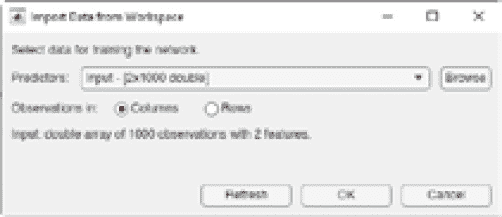

图 5.10 – 在聚类应用程序中导入数据

已经检测到正确的矩阵用于**预测器**；如果您想更改数据，可以使用**预测器**字段旁边的浏览按钮选择正确的矩阵。在这种情况下，我们必须将观测值设置为列，因此我们将有 1,000 个观测值和 2 个特征。让我们点击**确定**按钮来导入数据。

1.  我们已经在应用中设置了 ANN 架构，因此我们可以确定输入的数量和网络拓扑。输出将是一个具有 10x10 节点（100 个节点）的网络。`nctool`通过使用**自组织映射**（SOM）来指导你解决聚类问题。此图创建了对输入空间的浓缩表示，捕捉了该空间中输入向量的密度模式以及输入空间拓扑的压缩、二维表示。

    **SOMs**，也称为**Kohonen 图**，是一种属于无监督学习算法家族的 ANN（人工神经网络）。它们由芬兰教授 Teuvo Kohonen 在 20 世纪 80 年代提出。SOMs 用于诸如降维、数据可视化、聚类和特征提取等任务。

    SOM（自组织映射）背后的主要思想是将高维输入数据映射到一个低维网格或晶格上，使得相似的输入数据点被映射到附近的网格单元。这导致了对输入数据的拓扑表示，在地图上相似的数据点彼此靠近，从而便于可视化和解释。

    SOMs 由两个基本层组成：输入层和输出层，通常被称为特征图。输入层是 SOM 的初始阶段。数据集中的每个数据点都竞争表示以识别其自身特征。过程从权重向量初始化开始，启动 SOM 的映射过程。

    随后仔细检查映射向量，以识别使用随机选择的样本向量最佳代表所选样本的权重向量。考虑每个加权向量的邻近权重，所选权重演变成随机样本的向量，促进地图的增长和新模式的产生。在二维特征空间中，这些模式通常呈六边形或方形。整个过程重复 1000 次。

    从本质上讲，学习过程如下：

    1.  分析每个节点以确定其权重是否与输入向量相似。与输入向量最佳匹配的节点被称为**最佳匹配单元**（BMU）。

    1.  然后确定 BMU 的邻域值，随着时间的推移，邻居的数量往往会减少。

    1.  BMU（最佳匹配单元）的权重向量进一步适应以类似于样本向量，导致周围区域发生相似的变化。节点越接近 BMU，其权重变化越大；越远离邻居，其权重变化越小。

    1.  重复步骤 2 *N* 次迭代。

    这个迭代过程允许 SOM 细化其对输入数据的表示，最终导致一个更有组织和压缩的表示，能够捕捉数据的潜在结构。

    现在，我们只需点击应用中的**训练**按钮就可以训练网络。几秒钟后，ANN 将被训练并准备好使用。

1.  最后，我们可以使用**应用**窗口顶部的图表来查看结果。我们首先使用邻域距离，接下来的图表将绘制：

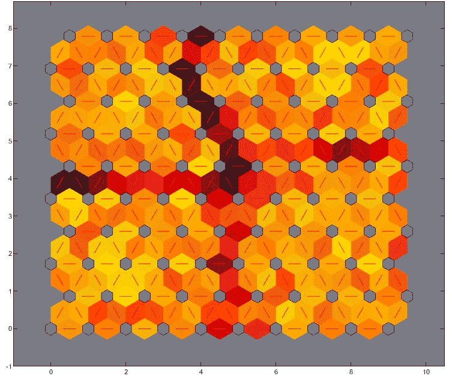

图 5.11 – SOM 邻域权重距离

这是一个图形表示，展示了 SOM（自组织映射）中相邻节点权重向量之间的距离。这个图有助于可视化学习过程中相邻节点权重的变化，从而深入了解 SOM 的拓扑结构和组织方式。我们可以使用`Target`矩阵中可用的类别来识别更多分离四个区域的彩色细胞。

蓝色六边形代表神经元。红色线条连接相邻的神经元。包含红色线条的区域中的颜色表示神经元之间的距离。较深的颜色代表较大的距离，较浅的颜色代表较小的距离。

SOM 的一个可视化工具是权重距离矩阵（也称为 U 矩阵）。要查看 U 矩阵，请在训练窗口中点击**SOM 邻域距离**。

这表明算法正确检测到了数据中的四个潜在簇。为了确认这一指示，我们可以绘制权重位置图：

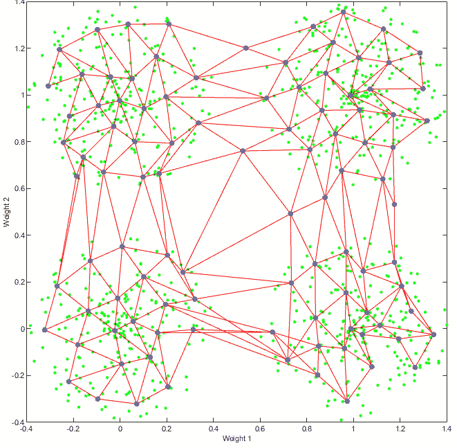

图 5.12 – SOM 权重位置

在**图 5.12**中，四个簇可以很容易地识别。在这个图中，输入向量被描绘为绿色点，它通过显示代表每个神经元权重向量的蓝色灰色点来展示 SOM 对输入空间的分类。此外，相邻的神经元通过红色线条相关联，提供了 SOM 组织结构的视觉表示。

在分析了 ANNs（人工神经网络）的一个聚类案例之后，为了完成这个主题，我们将看到如何优化获得的结果。

# 探索高级优化技术

**高级优化技术**是用于提高优化算法效率和效果的有效方法。这些技术旨在克服传统优化方法的局限性，尤其是在复杂、高维或非凸优化问题中。

在机器学习中，高级优化技术对于有效地训练复杂模型、提高收敛速度、避免过拟合和处理高维数据至关重要。在下一个小节中，将列出机器学习中常用的一些高级优化技术。

## 理解随机梯度下降（SGD）

**SGD** 是一种在机器学习中用于训练模型的基本且流行的优化算法，特别是在大规模和复杂的环境中。它是传统梯度下降方法的一种变体，旨在解决处理大数据集时的效率和收敛问题。SGD 的随机性源于它使用随机的小批量进行每次迭代，这使得优化过程比使用整个数据集进行每次更新的常规梯度下降的确定性性质更加随机（随机化）。这种随机性将噪声引入梯度估计中，这有助于算法逃离局部最小值，更快地收敛，并更好地泛化。

任何优化算法的主要目标是使模型预测值与数据中观察到的实际值之间的差异最小化。观察值与预测值之间的误差越小，算法在模拟现实世界场景方面的效果就越好。最小化这种差异等同于优化基于模型构建的目标函数。

下降法是一种迭代技术，从初始点 x_0 ∈ R^n 开始，根据以下方程生成一系列点 {x_n} ∈ N：

x_{n+1} = x_n + γ_n * g_n

在下降法中，向量 *g_n* 表示搜索方向，标量 *γ_n* 作为步长参数，是一个已知的正参数，它决定了在 *g_n* 方向上的移动距离。这些 *g_n* 和 *γ_n* 的选择是为了确保在每次迭代中减少目标函数 *f*，遵循以下原则：

f(x_{n+1}) < f(x_n) ∀ n ≥ 0

我们选择向量 *g_n* 作为下降方向，确保直线 *x = x_n + γ_n * g_n* 与梯度向量 ∇f(x_n) 形成钝角。只要 *γ_n* 的值足够小，这保证了目标函数 *f* 的减少。这种方法允许有各种下降法，这取决于 *g_n* 的具体选择。

梯度是一个产生向量的函数，表示函数图形切线的斜率。它指向函数增加最快的方向。让我们考察以下图中所示的双曲函数：

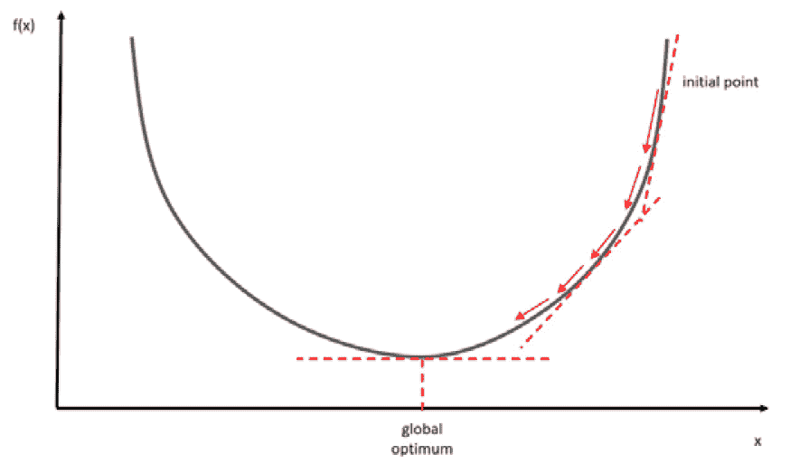

图 5.13 – 梯度下降算法如何搜索全局最优解

梯度下降算法的主要目标是找到函数的谷底，即最低点。更精确地说，梯度充当导数，指示目标函数的倾斜或陡峭程度。

为了提供一个更清晰的类比，让我们想象我们在夜晚在山中迷路，能见度有限。我们的感知仅限于感知脚下地形的坡度。目标是到达山的最底部。实现这一目标涉及在最陡坡度的方向上连续迈步。我们迭代地进行，一步一步前进，直到最终到达山谷。

我们将考察一个有两个变量的函数，记为 *f(x, y)*，其梯度由包含 *f* 的偏导数的向量表示。一阶导数与 *x* 相关，而二阶导数与 *y* 相关。计算这些偏导数后，结果如下：

δf/δx ， δf/δy

初始表达式对应于关于 *x* 的偏导数，而后续表达式对应于关于 *y* 的偏导数。梯度由以下向量表示：

∇ f(x, y) = ⎡⎢⎣ δf/δx   δf/δy ⎤⎥⎦

给定的方程表示二维空间中的一个函数，有效地形成了一个二维向量。这个向量的每个分量都表示相应函数变量的最陡上升方向。因此，梯度指向函数增长最显著的方向。

同样，如果我们考虑一个有五个变量的函数，结果梯度向量将包含五个偏导数。一般来说，一个有 *n* 个变量的函数会产生一个 *n*-维梯度向量，如下所示：

∇ f(x, y, … .z) = ⎡⎢⎣ δf/δx   δf/δy   …   …   δf/δz ⎤⎥⎦

当使用梯度下降时，我们的目标不是尽可能快地最大化 *f*；相反，我们旨在最小化它——具体来说，是要找到使函数最小化的最小点。

考虑一个函数 *y = f(x)*。梯度下降的基础在于观察，当函数 *f* 在 *x* 的邻域内定义良好且可微时，它会在与负梯度相反的方向上经历更快的下降。从初始值 *x* 开始，我们可以表示如下：

*x**n* + 1 = *x**n* - *γ* *∇ *f(*x**n**)*

其中，gamma (*γ*) 是学习率，delta (∇) 是梯度。

在这个背景下，我们有以下内容：

+   *γ* 代表学习率

+   ∇ 表示梯度

当使用足够小的 *γ* 值时，算法在有限次数的迭代中收敛到函数 *f* 的最小值。本质上，当梯度为负时，它表明在该点目标函数在减少，意味着参数应该向更大的值移动以接近最小点。相反，当梯度为正时，参数应该向较小的值移动以达到目标函数的较低值。

## 探索 Adam 优化

**自适应矩估计**（**Adam**）是一种高级优化算法，常用于训练深度学习模型，尤其是在神经网络中。它是 SGD 优化方法的扩展，为每个参数单独调整学习率。

此梯度下降算法旨在通过迭代方法找到目标函数的最小值。在每一步中，计算梯度的近似值以引导下降，朝着有效减少目标函数的方向移动。在这个过程中，学习率参数的选择具有重要意义。此参数控制我们接近最佳目标函数值的速度：

+   如果学习率过小，则需要大量的迭代才能收敛到最佳值

+   相反，过高的学习率可能会导致我们忽略最佳解

Adam 根据梯度的第一阶矩（均值）和第二阶矩（未中心化方差）调整每个参数的学习率。这种适应性有助于算法更有效地收敛，尤其是在梯度幅度变化的高维空间中。

此方法通过纠正矩来解决初始矩偏差的问题。在训练的早期阶段，矩的估计可能偏向于 0，而 Adam 补偿了这种偏差，尤其是在学习率较低时。

Adam 结合了动量（累积过去梯度的部分以增强收敛）和**RMSProp**（根据最近梯度的幅度缩放学习率）的概念，在广泛的优化问题上表现良好。

Adam 优化算法在每次迭代中涉及以下计算：

+   计算损失相对于模型参数的梯度

+   使用移动平均更新梯度的第一和第二矩（均值和未中心化方差）

+   修正矩（尤其是在早期迭代中）的偏差

+   使用修正后的矩和学习率更新参数

总体而言，Adam 在许多深度学习场景中都很有效，通常比手动调整学习率的标准 SGD 收敛得更快。由于其自适应特性和强大的性能，它已成为训练神经网络的热门选择，并在许多深度学习框架中成为标准的优化算法。

## 引入二阶方法

**二阶优化方法**，也称为**牛顿法**，是用于解决优化问题的先进技术。与主要依赖梯度的第一阶方法（如梯度下降）不同，二阶方法利用了目标函数的梯度和二阶导数（Hessian 矩阵）。这些额外的信息可以导致更快收敛和更精确的解，尤其是在复杂和非凸优化景观中。

二阶方法不仅考虑函数的一阶导数（梯度），还考虑其二阶导数（Hessian 矩阵）。Hessian 矩阵捕捉曲率信息，并提供了关于目标函数表面形状的见解。这些方法通常使用目标函数在当前点周围的二次近似。这些近似考虑了一阶和二阶导数，并提供了对函数局部行为的更准确表示。

使用 Hessian 矩阵的曲率信息可以比一阶方法更快地收敛，尤其是在目标函数表现良好且平滑时。二阶方法对学习率或步长选择的选择具有更强的鲁棒性，因为它们本质上会根据函数的曲率调整步长。

二阶方法是优化中的宝贵工具，尤其是在计算资源允许计算二阶导数时。然而，它们的应用可能取决于所解决问题的具体特征。

二阶方法的一个例子是牛顿法。这种方法直接最小化目标函数的二次近似，使用 Hessian 矩阵。牛顿法是一种经典的优化算法，用于寻找函数的最小值或最大值。以艾萨克·牛顿爵士命名，这种方法利用了函数的梯度（一阶导数）和二阶导数（Hessian 矩阵）来迭代地接近最优解。

这种方法采用了牛顿法的结构，牛顿法通常用于找到函数的根，但在此情况下，它应用于函数 *f* 的导数。这样做的原因是，识别函数 f 的最小点等同于找到其第一导数 f′ 的根。在这种情况下，更新后的公式可以表示如下：

x n+1 = x n −  f ′ ( x n) _ f ″  (x n)

在给定的方程中，我们有以下内容：

+   f′ (xn) 表示函数 *f* 的第一导数

+   f″ (xn) 表示函数 *f* 的第二导数

由于一阶和二阶导数的解析表达式都可用，通常优先考虑二阶方法而不是梯度下降，因为它们的收敛速度更快。然而，这些方法无论接近极小值还是极大值都会收敛。存在这种方法的变化形式，可以确保全局收敛，并通过避免使用直接方法求解确定搜索方向的系统来降低计算成本。

# 摘要

在本章中，我们了解了使用人工神经网络模拟典型人类大脑活动的方法。我们掌握了人工神经网络背后的基本概念，深入研究了基本神经网络架构的创建。这次探索包括输入层、隐藏层和输出层、连接权重和激活函数等元素。我们的理解扩展到了关于隐藏层数量、每层节点数量和网络训练算法的关键决策。

然后我们专注于使用神经网络进行数据拟合和模式识别。我们通过脚本分析来掌握通过命令行使用神经网络函数的方法。随后，我们进入了神经网络工具箱，它包含算法、预训练模型和应用程序，用于构建、训练、可视化和模拟浅层和深层神经网络。神经网络工具箱提供了一个易于使用的界面——**神经网络**入门 GUI，它作为神经网络拟合、模式识别、聚类和时间序列分析等任务的启动平台。

最后，我们介绍了一些常用的先进优化技术。这些方法是用来增强优化算法效率和效果的有效技术。它们的目的在于克服传统优化方法提出的限制，特别是在复杂、高维或非凸优化场景中。

在下一章中，我们将了解深度学习的基本概念。我们还将了解不同类型的深度学习，并理解**卷积神经网络**（**CNNs**）。此外，我们将学习如何使用 MATLAB 构建 CNN，并了解循环神经网络、长短期记忆网络和转换器模型。
