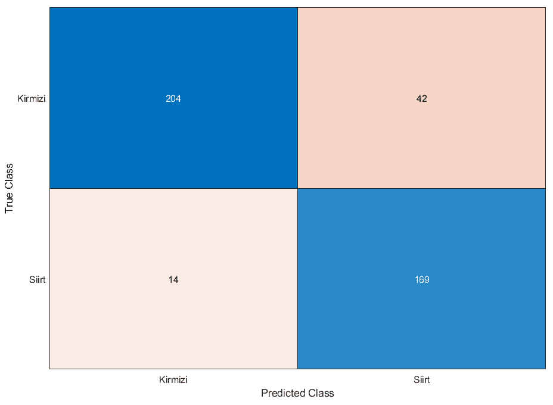
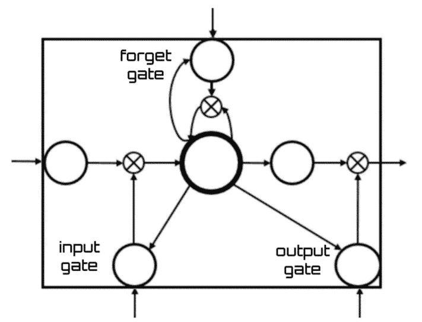

# 6

# 深度学习和卷积神经网络

**深度学习**（**DL**）是一种基于多层**人工神经网络**（**ANNs**）的**机器学习**（**ML**）技术，它使许多应用达到了高精度。**深度神经网络**（**DNNs**）能够建模，并具有捕捉输入和输出信息之间复杂联系的能力。在高度有效的应用中，**计算机视觉**（**CV**）尤为突出，包括分类、图像回归和物体识别等活动。例如，一个高级神经网络可以产生实体的分层描绘，其中每个实体都由一组特征组成，这些特征以视觉基础的形式出现，如特定的轮廓、有向线条、表面细节和重复图案。**卷积****网络**（**CNNs**）的特点是具有卷积层，这些层使用过滤器在局部区域分析数据并生成激活图。然后，这些激活图由池化层处理，池化层将低分辨率数据聚合起来，以降低表示的维度并使处理更加计算高效。卷积层和池化层交替多次，直到图像由低分辨率的激活图表示。在本章中，我们将学习深度学习的基本概念，并了解如何在 MATLAB 环境中实现基于 CNN 的算法。

在本章中，我们将涵盖以下主要主题：

+   理解深度学习基本概念

+   探索深度学习模型

+   接近 CNNs

+   在 MATLAB 中构建 CNN

+   探索模型的结果

+   发现深度学习架构

如往常一样，我要感谢技术审稿人为我章节提供的有益建议。我将尝试按照他们给我的建议来应用。

# 技术要求

在本章中，我们将介绍机器学习的基本概念。要理解这些主题，需要具备代数和数学建模的基本知识。同时，也需要熟悉 MATLAB 环境。

要使用本章中的 MATLAB 代码，您需要以下文件（可在 GitHub 上找到：[`github.com/PacktPublishing/MATLAB-for-Machine-Learning-second-edition`](https://github.com/PacktPublishing/MATLAB-for-Machine-Learning-second-edition)）：

+   `CNNPistachioClassification.m`

+   `PistachioShort.zip`

# 理解深度学习基本概念

**DL**是机器学习的一个分支，它基于使用算法来建模关于数据的高级抽象。这个学科是旨在学习数据表示方法的一系列方法之一。例如，一个观察结果，如图像，可以用不同的方式描述：作为每个像素强度值的向量，或者更抽象地，作为一组具有形状或显著特征的边缘或区域集合。这些可能的表示中，一些可能比其他表示更有效地促进训练另一个机器学习系统的过程。

对于从原始数据自动识别和提取相关特征，我们可以使用自动特征提取来消除手动**特征工程**（**FE**）的需求。这个过程简化了机器学习任务并提高了模型性能。

## 自动特征提取

在这个背景下，深度学习（DL）的一个核心方面是开发专门从数据集中自动提取显著特征的算法，这些特征随后可用于训练机器学习（ML）系统。考虑到如果没有这些技术，这些特征在训练之前必须手动生成并验证，这是一个重要的贡献。深度学习的基本概念是对输入数据进行不同级别的连续处理，其结果是特征的出现。考虑一张猫的图片。自动特征提取可以识别出猫的眼睛、耳朵和胡须等特征。

在神经网络（NN）领域，深度学习的概念随着所谓的**深度神经网络（DNN**）的创建而引入。其工作原理类似于传统的神经网络，但有一个明显的区别：隐藏神经元中间层的数量显著增加。与经典神经网络一样，DNN 能够模拟输入和输出数据之间的复杂关系。

最成功的应用领域之一是计算机视觉（CV），包括分类、图像回归和目标检测等任务。在目标检测任务中，DNN 可以构建一个分层表示对象，其中每个对象由一组以原始视觉元素（如特定边缘、方向线、纹理和重复模式）的形式出现的特征来识别。这种建模能力源于大量隐藏层中的神经元。

## 训练深度神经网络（DNN）

就训练阶段而言，仍然可以使用成熟的反向传播算法。与传统的神经网络一样，DNN 可能会遭受古老的过拟合问题。为了减轻这种情况，通常采用**正则化技术**，这些技术会在训练阶段的优化过程中介入。最常用的方法包括以下几种：

+   **L2 正则化**（**权重衰减**），通过向损失函数中添加网络权重的**L2 范数**（也称为欧几里得范数），乘以一个特定的常数，来影响优化器的操作。L2 范数是一个数学函数，用于衡量向量的长度。它定义为向量各分量平方和的平方根。L2 范数在机器学习和统计学中常用于衡量两个向量之间的距离。

    向量 *x* 的 L2 范数公式如下：

    ||x||2 = sqrt(∑ (x _ i) ^ 2)

    请按以下方式参考：

    +   *||x||_2* 是 *x* 的 L2 范数

    +   *x_i* 是 *x* 的第 i 个分量

+   **L1 正则化**（**稀疏性**），与之前的功能类似，但使用**L1 范数**。L1 范数常用于机器学习和统计学中，用于衡量两个向量之间的距离。它也被称为曼哈顿范数或出租车范数，因为它对应于出租车在城市街道上行驶的距离。向量 *x* 的 L1 范数公式为：

    ||x||1 = ∑ |x _ i|

    这里：

    +   *||x||_1* 是 *x* 的 L1 范数

    +   *x_i* 是 *x* 的第 i 个分量

+   **Dropout**，在每次训练步骤中，隐藏层中随机选择的一组神经元被关闭，防止它们的输出影响后续神经元。

所有这些技术都是为了减少网络和训练数据样本之间的相互依赖性，有效地遏制过拟合。尽管反向传播训练由于其简单性和相对于其他方法更倾向于收敛到更好的局部最小值，提供了一个可靠的解决方案，但它可以在深层网络的实际计算中带来相当大的挑战。实际上，在深度神经网络中必须考虑一系列**超参数**，包括维度（就层计数和每层的单元数而言）、学习率、初始权重以及这些参数的优化——这个过程在时间和计算资源方面可能会变得难以控制。

在这个背景下已经提出了各种解决方案，包括使用数据的小批量来加速训练。然而，近年来 GPU 计算能力的显著提升是一个重大的突破。在网络操作中，主要的计算任务涉及矩阵和向量运算，这非常适合在 GPU 硬件上并行实现。

另一个由基于梯度下降的技术引起的问题，由于深层网络的复杂结构而加剧，是**梯度消失问题**。这个挑战源于链中的梯度计算和网络的大量层。通常使用的激活函数倾向于生成具有微小值的梯度，通常在[-1, 1]的范围内。由于链式计算，当在*n*-级网络的初始层计算梯度时，这会导致许多小值的乘积。因此，梯度随着*n*呈指数级下降，导致初始层的学习速度缓慢。

另一种解决方案是逐级以无监督方式对网络进行初步训练，然后通过反向传播进行最终完整训练。近年来，随着 GPU 的发展，另一种解决方法，即使用更快的硬件来对抗问题的主要症状——即训练过程的缓慢。在**监督学习**（**SL**）的情况下，反对深度神经网络（DNNs）的另一个观点是，网络在训练结束时达到所需结果所需的非常大的样本数据量（包括期望的输出）。这代表了一个重大障碍，因为对于某些任务来说，为每个示例生成期望的输出是一个可能需要非常长时间的操作。

在介绍了深度学习之后，现在让我们看看可用的不同类型的深度学习。

# 探索深度学习模型

为了应对不同的任务和挑战，已经开发出各种类型的深度学习架构和技术。以下是一些例子：

+   **卷积神经网络**（**CNNs**）：主要用于图像和视频分析，CNNs 被设计来自动和自适应地从输入数据中学习特征的空间层次结构。它们在图像分类、目标检测和图像分割等任务中取得了高度成功。

+   **循环神经网络**（**RNNs**）：RNNs 非常适合涉及序列的任务，如**自然语言处理**（**NLP**）和语音识别。它们具有内部记忆，能够保持关于先前输入的信息，这使得它们在处理序列数据时非常有效。

+   **长短期记忆**（**LSTM**）网络：作为一种循环神经网络（RNN），LSTMs 被设计用来克服训练深度网络时的梯度消失问题。它们特别适用于捕捉序列数据中的长距离依赖关系，因此在语言建模和机器翻译等任务中非常受欢迎。

+   **生成对抗网络**（**GANs**）：GANs 由两个神经网络组成——生成器和判别器，它们在一种类似游戏的设置中进行互动。GANs 用于生成与给定数据集类似的新数据样本。它们已被用于图像生成、风格迁移和数据增强。

+   **自编码器**（**AEs**）：AEs 用于**无监督学习**（**UL**）和数据压缩。它们由一个编码器组成，该编码器将输入数据映射到潜在空间，以及一个解码器，该解码器从潜在表示中重建输入。AEs 在降维、去噪和异常检测中找到应用。

+   **Transformer 网络**：Transformer 在自然语言处理任务中获得了流行。它们利用自注意力机制并行处理输入数据，这使得它们在处理序列中的长距离依赖关系时效率很高。**从 Transformer 中获得的双向编码器表示**（**BERT**）模型是一个突出的例子。

+   **胶囊网络**：胶囊网络旨在提高神经网络（NNs）对物体姿态和视角变化的鲁棒性。它们使用**胶囊**来表示物体的不同方面，允许它们捕获特征之间的层次关系。

+   **神经图灵机**（**NTMs**）：这些架构将神经网络与外部内存相结合，使它们能够执行算法任务。它们被设计来学习算法过程，并已被用于排序和关联回忆等任务。

+   **图神经网络**（**GNNs**）：GNNs 在图结构数据上运行，使它们适用于节点分类、链接预测和图级分类等任务。它们在社交网络分析、分子化学和推荐系统中都有应用。

这些只是深度学习（DL）架构和技术的多样性的几个例子，每个都是针对特定任务和数据类型定制的。例如，卷积神经网络（CNNs）旨在通过卷积层自动从图像中学习层次特征和模式，用于图像和空间数据分析。其典型应用包括图像分类、目标检测和图像分割。循环神经网络（RNNs）适用于序列和时间数据分析，通过循环连接保持先前输入的记忆，使它们能够捕获序列模式。典型应用包括自然语言处理（NLP）、语音识别和时间序列预测。长短期记忆网络（LSTM）是 RNNs 的改进版本，用于解决梯度消失问题，通过引入记忆单元在长序列中选择性保留和更新信息。这些技术的应用包括语言建模、机器翻译和**情感分析**（SA）。生成对抗网络（GANs）使用生成器和判别器网络来生成与给定数据集相似的新数据样本，这两个网络在最小-最大游戏中竞争。这种类型的深度学习特别适合图像生成、风格迁移和数据增强。最后，作为数据压缩和特征提取的通用学习（UL）的自动编码器（AEs）包括一个编码器将输入数据映射到低维潜在空间，以及一个解码器来重建输入数据。降维、去噪和异常检测是这些算法的代表性应用。

深度学习领域持续发展，新的架构和方法不断涌现，以解决不同领域中的各种挑战。

在这一点上，我们可以深入探讨深度学习的主要技术——即卷积神经网络（CNNs）。

# 接近 CNNs

如*第五章*中概述的，*介绍人工神经网络建模*，人工神经网络（ANNs）从生物神经网络中汲取灵感。这些 ANN 旨在通过模拟自然神经网络中观察到的机制来复制人类的认知过程。它们旨在估计或近似可能依赖于众多输入的函数，其中许多可能是陌生的。ANNs 通常被构想为相互连接的神经元网络，促进信息的交换。每个连接都有一个相关的权重，其值可以通过从经验中学习进行调整。这种适应性特征使神经网络能够适应不同的输入类型，并促进它们的学习能力（*图 6**.1*）：


图 6.1 – 带有隐藏层的 ANN 架构

ANNs 将神经元定义为执行数学运算以从一组输入值产生单个输出的**中央处理单元**（**CPU**）。神经元的输出由输入的加权和以及一个附加的偏置决定。每个神经元执行一个简单的任务：如果累积信号超过一个指定的激活阈值，则发生激活。前面的图示展示了基本的 ANN 结构，这基本上代表了 CNN。确实，就像后者一样，CNN 由通过加权分支（权重）相互连接的神经元组成；网络的训练参数是权重和偏置。

在 CNN 中，神经元之间的连接模式受到了动物世界视觉皮层中观察到的排列的启发。大脑的这一部分（视觉皮层）中的神经元对称为感受野的有限观察区域内的特定刺激做出反应。这些区域部分重叠，以涵盖整个视野。单个神经元对其感受野内刺激的反应可以通过卷积运算进行数学近似。

所有与 NN 训练相关的内容，包括前向/反向传播和权重更新，在此情况下都适用。此外，整个 CNN 使用一个单一的可微成本函数。然而，CNN 基于一个特定的假设：它们的输入具有特定的数据结构，例如图像。这一特性使它们能够结合定制的架构元素，以增强此类数据的处理。

CNN 采用**全连接**（**FC**）**架构**，其中每一层的每个神经元都与前一层的所有神经元连接（不包括偏置神经元）。通常，当面临输入数据大小的扩展时，这些架构无法有效地进行扩展。

在 CNN 中最常见的层是：

+   卷积层

+   池化层

+   **修正线性** **单元** （**ReLUs**）

+   FC 层

每个层的功能将在以下小节中详细说明。

通常，CNN 由多个连续的卷积和子采样（池化）层组成，随后是 1 个或多个 FC 最终层，特别是在分类任务的情况下。

为了应对现实世界的挑战，这些程序可以根据需要合并和重复。例如，你可以包含两层、三层甚至更多层的卷积。此外，你还可以灵活地多次应用池化操作以减小数据维度。如前所述，CNN 中通常使用多种级别。某些层包含可调整的训练参数（权重和偏差），而其他层则设计为执行预定义的功能。

## 卷积层

在 CNN 中，主要层类型是**卷积层**，在 CNN 中包含一个或多个这些层是必不可少的。从实际的角度来看，卷积层的参数与一系列可适应的滤波器相关联。与 CNN 不同，卷积层在三个维度上结构化，包括宽度、高度和深度。

每个滤波器占据一个小的空间区域（沿宽度和高度维度），同时跨越它所应用的输入体积的完整深度。在正向传播中，每个滤波器在输入体积的宽度和高度上移动——更准确地说，是卷积——生成一个特定于该滤波器的二维激活图（也称为特征图）。当滤波器穿越输入区域时，滤波器值与相应输入部分的值之间发生标量积操作。

从概念上讲，网络的目的是学习激活滤波器，这些滤波器可以检测输入的不同空间区域中的特定功能。将这些特征图（对于每个滤波器）沿深度维度组合形成卷积层的输出体积。这个体积中的每个元素可以解释为观察有限输入区域的神经元的输出，并且它与同一特征图中的其他神经元共享其参数。这种共享源于它们的共同起源——应用相同的滤波器。

过滤的数学步骤如下：

1.  对齐滤波器和图像块。

1.  将每个图像像素乘以相应的特征像素。

1.  求这些乘积的和。

1.  将每个和除以特征中像素的总数。

这里是卷积层输出的公式：

输出 = ∑ F(k, l) * I(i + k, j + l)) / S(k, l)

这里：

+   F(k, l)是(k, l)位置的特征图元素

+   I(i + k, j + l)) ) 是在(i + k, j + l)位置的图像元素

+   S(k, l)是特征像素的和

总结来说，需要强调的关键点包括：

+   **局部感受野**：层中的神经元连接到输入的一个小段，称为局部感受野。每个连接学习一个权重。

+   **共享权重**：由于显著特征（如边缘或块）可以出现在图像的任何位置，同一层的神经元共享权重。这意味着即使它们位于不同的输入点，层中的所有神经元也能识别出相同的特征。

+   **卷积**：在各个位置使用相同的权重模式。卷积的结果被称为**特征图**。

每个过滤器从前一层捕获特定的特征。因此，需要训练多个卷积过滤器来提取不同的特征。每个过滤器生成一个突出显示独特特性的特征图。

## 池化层

这些层系统地集成到网络中，以定期减少网络特定阶段的表示和体积的空间维度（宽度和高度）。这起到了双重作用：最小化参数数量，减少计算时间，并监控过拟合。**池化层**的作用是对输入体积的每个深度切片独立操作，以在空间上调整其大小。

在卷积过程中获得的每个特征，都会构建一个矩阵，并识别每个选定矩阵中的最大值，以压缩整个输入。步骤如下：

1.  选择窗口大小（通常是`2`或`3`）。

1.  选择像素移动的步距（通常是`2`）。在 CNN 中，池化层的步距决定了池化操作在输入特征图上滑动的程度。较大的步距意味着池化操作会跳过更多像素，导致输出特征图更小。较小的步距意味着池化操作会在输入特征图上更仔细地滑动，导致输出特征图更大。

1.  将窗口滑动到过滤后的图像上。

1.  对于每个窗口，确定最大值。

举例来说，这种方法将输入图像分割成方块组，并对每个生成的片段，提取最高值作为输出。CNN 还包含池化层，这些层被巧妙地放置在卷积层之后。池化层将输入分割成部分，并选择一个代表性值，采用最大池化或平均池化等方法。**最大池化层**捕获了先前卷积层检测到的最高特征。输出层评估前一层区域中潜在特征的存在，尽管没有精确的空间坐标。目标是使后续层能够处理更大的数据部分。最大池化加速了收敛速度，从而能够选择高度不变的特征，以增强泛化性能。

池化层的集成提供了以下好处：

+   减少了后续层的计算量

+   增强了关于空间定位的特征鲁棒性

+   在识别特定特征后，其相对于输入的精确位置不如其相对于其他特征的一般位置重要。

平均池化是一种下采样操作，它将特征图中的特征表示在特征图块中整合。通常，它是在 2x2 的特征图块中实现的，步长为(2, 2)。这个过程包括计算特征图每个块的平均值，这意味着特征图中的每个 2x2 正方形都被下采样到其平均值。为了说明，考虑前一小节中讨论的线检测卷积滤波器产生的 6x6 特征图。我们可以手动探索平均池化操作对该特征图第一行的应用。

在典型的 CNN 架构中，卷积层和池化层以重复的模式交替出现。

## ReLUs

**ReLUs**作为神经网络中的关键激活函数，在单个网络中频繁使用，通常在每个卷积层之后出现多次。ReLU 层由执行函数*f(x) = max(0, x)*的神经元组成。引入这些层增强了网络的非线性，同时保持卷积层的感受野不变。

ReLUs 比双曲正切或 Sigmoid 等替代函数更受欢迎，主要是因为它们能够显著加速训练过程，同时不会大幅降低泛化精度。通过使用 ReLU 层，网络训练变得非常快，同时保持相似的性能。

这些层类型没有可调整的参数，因此执行固定函数。此外，它们也不具备任何可适应的参数。没有可调整参数的层简化了反向传播过程：到该点为止计算出的错误，源于后续层，被反向传播到前一层。

## FC 层

这种层类型与具有 FC 架构的传统 ANN 中发现的任何层的结构相似。在**FC 层**中，每个神经元都与前一层的所有神经元建立连接，特别是与它们的激活进行交互。

与迄今为止在 CNN 中观察到的不同，这种层类型不遵循局部连接原则。FC 层建立跨越整个输入体积的连接，这自然导致大量连接。这种层类型中唯一的可调整参数是该层由多少个神经元*K*组成。FC 层的基本特征可以总结如下：将其 K 个神经元与整个输入体积相连接，并计算这些 K 个神经元中的每个神经元的激活。

在实践中，结果将是一个单一的 1 x 1 x K 向量，封装了计算的激活值。从三维组织输入体积到实现 FC 层后的一维单一输出向量（1 x 1 x K），这表明使用额外的卷积层变得不可行。在 CNN 领域，FC 层主要起到整合到目前为止收集到的信息的作用，将其呈现为单一值（其神经元之一的活动）。这个单一值随后成为最终分类过程中后续计算的基础。

在彻底检查了 CNN 的每个元素之后，现在适合深入研究一个完整 CNN 的整体结构。

# 在 MATLAB 中构建 CNN

在本节中，我们将看到如何从图像作为输入层开始训练 CNN 进行图像分类。CNN 的整体架构通常包括一系列卷积层，穿插着 ReLU 层，以及适当的标准化和池化层。最终，网络以一系列 FC 层结束，这些层通向输出层。

CNN 由两种主要类型的神经元组成：

+   **处理神经元**：这些神经元负责通过卷积函数处理输入图像的特定部分。它们的主要作用是从输入数据中提取独特特征。

+   **聚合或池化神经元**：这些神经元通过子采样聚合输入数据并减少其维度，提高了后续层处理效率。

通过组合给定层的输出值，可以重建一个中间图像，该图像作为后续层操作的起点：


图 6.2 – CNN 架构

基本概念涉及从一个大图像开始，通过逐步的增量步骤逐渐压缩数据，直到达到单一的结果。随着卷积通道数量的增加，神经网络理解和处理复杂函数的能力增强。

基本 CNN 的配置可以通过以下组件简要描述：

+   负责获取输入元素（如图像）的输入层

+   一系列卷积层，偶尔被 ReLU 层打断，并在适当的时候使用池化层

+   一系列 FC 层

+   提供最终结果的输出层

最近的研究表明，FC 层的重要性可能较小。然而，在当前背景下，概述的结构代表了 CNN 的典型架构。

**目标识别**指的是在一系列图像或视频中定位特定对象的能力。人类在图像中轻松识别各种对象，即使这些对象以不同的方式出现。此外，即使只看到对象的一部分，也可以区分对象。然而，这仍然是计算机视觉领域的挑战性任务。

在每张图像中，每个对象都拥有许多引人入胜的特征，可以从中提取出来以描绘该对象。这种描绘随后用于在测试图像中的多个对象中识别该对象时进行区分。确保从参考图像中提取的特征不受图像尺度、干扰、光照变化和畸变的影响，对于建立可靠的识别至关重要。

卷积神经网络（CNNs）特别适合这项任务，提供了在对象识别方面表现出色的算法。这是因为它们能够从图像中学习到对平移、尺度和旋转不变的特性。这是由于使用了卷积层，它们将过滤器应用于输入图像的小区域，然后将过滤器在图像上滑动。这使得网络能够学习到特定于图像不同部分的特征，而不管它们位于何处。此外，还使用了池化层来降低特征图的维度，这使得网络在训练和运行时更加高效。

对于 CNN 训练，我们将使用 Pistachio 图像数据集。该数据集提供了一组大量照片，用于分析开心果的品种。

它包含总共 2,148 张图像，分为 2 个类别——`Kirmizi` 和 `Siirt`：

1.  首先，我们必须在 MATLAB 工作空间中加载数据集。数据集以 ZIP 格式存储在“技术要求”部分链接的网站上。为了方便读者工作，图像已根据类别划分到文件夹中，并按类别命名，同时调整大小以减轻数据重量。这些文件夹可在本书的 GitHub 网站上下载。一旦文件下载并解压，只需定义根文件夹的路径即可。此时，就可以按照以下方式将数据上传到 MATLAB 工作空间：

    ```py
    Data = imageDatastore('C:\MatlabScript\PistachioShort', 'IncludeSubfolders',true,'LabelSource','foldernames');
    ```

    为了加载数据，我们使用了 `imageDatastore()` 函数，该函数使用 `ImageDatastore` 实体来管理一系列图像文件，尽管每个单独的图像可以适应内存，但整个图像集合可能不行。构建 `ImageDatastore` 实体涉及使用 `imageDatastore` 函数，其中可以定义其属性。随后，可以使用与实体关联的函数导入和处理数据。使用了三个参数，如下所示：

    +   `Location= 'C:\MatlabScript\PistachioShort'`：这是数据集的位置。为了复制示例，读者只需简单地替换存储数据集的文件夹的路径。

    +   `IncludeSubfolders`：可以通过`IncludeSubfolders`名称-值参数控制子文件夹的包含，该参数接受`true`或`false`。选择`true`以包含每个主文件夹内的所有文件和子文件夹，或选择`false`以仅包含每个主文件夹内的文件。当未明确指定`IncludeSubfolders`时，默认值为`false`。

    +   `LabelSource`：标签数据的来源通过`LabelSource`名称-值参数确定，该参数接受`none`或`foldernames`。通过指定`none`，`Labels`属性将保持无标签状态。另一方面，指定`foldernames`会导致根据文件夹名称分配标签，这些标签随后存储在`Labels`属性中。可以通过直接访问`Labels`属性来对标签进行后续调整。需要注意的是，当`FileSet`对象作为文件或文件夹位置时，不能使用`LabelSource`名称-值参数。

    我们现在可以通过随机过程查看一些加载的图像：

    ```py
    figure;
    RandId = randperm(2148,9);
    for i = 1:9
        subplot(3,3,i);
        imshow(Data.Files{RandId(i)});
    end
    ```

    在这段代码中，我们使用了`randperm()`函数，该函数生成一个包含`9`个从`1`到`2148`范围内选取的不同随机整数的行向量。每个生成的数字都被用作索引，以识别存储在`Data.Files`属性中的图像文件路径。

    以下输出已返回：


图 6.3 – PistachioShort 数据集的图像样本

我们现在能够确定每个类别的图像数量。`ClassItemsNumber`变量代表一个包含标签及其各自相关联的图像数量的表格：

```py
ClassItemsNumber = countEachLabel(Data)
```

我们使用了`countEachLabel()`函数，该函数生成一个汇总表，显示`Data`数据集中的标签及其各自关联文件的计数。

以下表格已打印：

```py
ClassItemsNumber =
  2×2 table
     Label     Count
    _______    _____
    Kirmizi    1232
    Siirt       916
```

如我们所见，有两个类别，并且每个类别中都有足够的图像。

1.  首先，有必要将我们可用的数据分为两个子集；第一个将用于训练，第二个用于算法验证。数据拆分是机器学习和数据分析中的一个关键步骤，其中将数据集分为两个或多个子集，用于模型的训练、验证和测试。我们有`2148`个样本，分为`1232`个 Kirmizi 物种和`916`个 Siirt 物种。通常，数据会被分成 80%用于训练，20%用于验证。为此，我们决定使用 700 个样本进行训练，其余用于验证：

    ```py
    TrainSamples = 0.8;
    [DataTrain,DataValidation] = splitEachLabel(Data,TrainSamples,'randomize');
    ```

    为了做到这一点，使用了 `splitEachLabel()` 函数：这个函数将数据集中的图像文件分为两个不同的数据存储——即 `DataTrain` 和 `DataValidation`。新创建的 `DataTrain` 数据存储包含了每个类别的初始 `TrainSamples` 值，而 `DataValidation` 数据存储则包含了每个类别的剩余文件。`TrainSamples` 可以是一个介于 `0` 和 `1` 之间的分数值，表示分配给 `DataTrain` 的文件比例，或者是一个整数，表示每个类别要放入 `DataTrain` 的确切文件数。

1.  现在，我们可以开始构建我们的 CNN。正如预期的那样，CNN 是由一系列相互连接的层组成的。要开始，你需要使用一个层来导入你的输入数据：

    ```py
    layers = [
        imageInputLayer([64, 64, 3])
    ```

    `layers` 变量是一个包含 CNN 层列表的数组，它定义了用于深度学习的神经网络架构。作为第一层，我们设置了 `imageInputLayer` 层：这个层作为图像输入，将 2D 图像输入到神经网络中，同时实现数据归一化。这个层提供了一个图像输入层，并定义了不可更改的 `InputSize` 属性。

    `InputSize` 属性是输入数据维度的表示，表示为一个整数数组 `[h w c]`，其中 `h`、`w` 和 `c` 分别表示高度、宽度和通道数。在这种情况下，我们有一个高度和宽度均为 64 的 RGB 图像。

    在输入层之后，我们按顺序设置了第一个由三个层组成的块：

    ```py
        convolution2dLayer(3,8,'Padding','same')
        batchNormalizationLayer
        reluLayer
        maxPooling2dLayer(2,'Stride',2)
    ```

    以 2:1 的比例下采样和步长 = 2 表示在池化操作中移动 2 列和 2 行。一个 2D 最大池化层通过将输入划分为矩形池化区域并随后确定每个区域内的最大值来实现下采样。

1.  现在，我们将应用第二个与第一个相似的层块，改变参数：

    ```py
        convolution2dLayer(3,16,'Padding','same')
        batchNormalizationLayer
        reluLayer
    ```

1.  之后，应用了一个新的池化层：

    ```py
        maxPooling2dLayer(2,'Stride',2)
    ```

1.  最后，第三个层块：

    ```py
        convolution2dLayer(3,32,'Padding','same')
        batchNormalizationLayer
        reluLayer
        fullyConnectedLayer(2)
    ```

    在全连接层（FC layer）中，输入被乘以一个权重矩阵，然后通过一个偏置向量进行增强。偏置向量是一组在应用激活函数之前添加到神经元加权输入中的值。它在调整神经元激活阈值和使网络能够表示数据中的复杂关系方面起着至关重要的作用。`Size` 参数输出指定了输出大小；我们正在对两种类型的开心果进行分类，所以大小是 `2`。这个层类别复制了在采用全连接设计的传统人工神经网络中通常存在的层的配置。在全连接层中，每个神经元与前一层的每个神经元建立连接，直接参与它们的激活。

    `softmaxLayer`是神经网络中使用的层类型，专门设计用于对输入应用`softmax`函数。`softmax`函数通常用于分类任务，将原始分数或 logits 转换为多个类别的概率分布。此层通常用作神经网络的多类分类的最终层，其中输出值被转换为概率，这些概率之和为`1`，使得模型的预测更容易解释。classificationLayer];

    分类层计算标准分类任务和涉及互斥类的加权分类任务的交叉熵损失。该层根据前一层的输出维度自动确定类别的数量。

    现在，我们必须设置 CNN 的选项：

    ```py
    options = trainingOptions('sgdm', ...
        'InitialLearnRate',0.01, ...
        'MaxEpochs',50, ...
        'Shuffle','every-epoch', ...
        'ValidationData',imdsValidation, ...
        'ValidationFrequency',30, ...
        'Verbose',false, ...
        'Plots','training-progress');
    ```

    使用了`trainingOptions()`函数来设置与网络训练相关的几个选项。以下选项被设置：

    +   `sdm`: 用于训练神经网络的求解器；我们使用了`InitialLearnRate`：训练中使用的初始学习率是一个正数值。当学习率过低时，训练过程可能会变得漫长。相反，如果学习率过高，训练可能会产生次优结果或发散。

    +   `MaxEpochs`: 最大训练周期的数量定义为正整数。在梯度下降优化中使用小批量时，一个迭代表示旨在最小化损失函数的单步。一个周期是指训练算法在整个训练数据集上的完整迭代。

    +   `Shuffle`: 数据洗牌选项。为此，我们在每个训练周期之前对训练数据进行洗牌，同样，在每次神经网络验证之前对验证数据进行洗牌。

    +   `ValidationData`: 在训练期间要使用的验证数据定义为数据存储、表或包含预测因子和验证响应的单元格数组。

    +   `ValidationFrequency`: 神经网络的验证率用正整数表示，表示交互次数。`ValidationFrequency`表示验证指标评估的迭代间隔。

    +   `Verbose`: 用于显示训练进度信息。

    +   `Plots`: 在配置`trainingOptions`中的`training-progress`训练选项并使用`trainNetwork()`启动网络训练后，将生成一个图表。此图表展示了每个迭代的训练指标。每个迭代涉及梯度的估计和网络参数的调整。如果你在`trainingOptions`中提供了验证数据，图表将还会在`trainNetwork`过程进行网络验证时，额外展示验证指标。

1.  最后，我们必须训练网络：

    ```py
    Cnnet = trainNetwork(DataTrain,layers,options);
    ```

    `trainNetwork()` 函数简化了深度神经网络（DNN）的训练过程。这种训练可以在 CPU 或 GPU 上执行。对于图像分类和图像回归等任务，可以使用多个 GPU 或本地/远程并行池同时训练单个神经网络。然而，使用 GPU 或并行处理需要 Parallel Computing Toolbox。此外，使用 GPU 进行深度学习（DL）需要兼容的 GPU 设备。

    下面的情节被返回到`trainNetwork()`函数：


图 6.4 – 训练过程

*图 6**.4* 中的情节将在整个训练过程中逐步更新。这样，就可以检查算法如何调整权重以达到收敛。*图 6**.4* 中的情节由三条曲线组成：

+   **训练误差**：此曲线显示了网络在训练数据上的平均误差作为训练轮次数量的函数。轮次是网络在整个训练数据集上训练的次数。低训练误差表明网络正在很好地从训练数据中学习。

+   **验证误差**：此曲线显示了网络在验证数据上的平均误差作为训练轮次数量的函数。验证数据是网络未训练过的数据，用于评估网络对未见数据的泛化能力。低验证误差表明网络正在学习很好地泛化到新数据。

+   **网络权重**：此曲线显示了网络权重的大小作为训练轮次数量的函数。权重是网络从训练数据中学习的参数。稳定的权重曲线表明网络没有过度拟合训练数据。

在了解了如何在 MATLAB 中训练 CNN 之后，我们现在需要学习如何解释结果并正确使用验证指标。

# 探索模型的结果

评估结果是任何卷积神经网络（CNN）实现过程中的一个重要部分。当然，这对于任何基于机器学习的算法来说也是正确的。评估指标是用于评估模型、算法或系统在不同任务（如机器学习、数据分析、优化）中的性能和质量的定量度量。这些指标提供了一种客观量化模型表现好坏的方法，并比较不同的模型或方法。

采用的指标类型显然取决于我们正在实现的算法类型；在前一节中，我们实现了一个用于开心果物种分类的 CNN。因此，让我们看看这种类型算法可用的指标。

对于分类任务，我们可以使用以下指标：

+   **准确率**：正确分类的实例占总实例的比例

+   **精确率**：真正阳性预测与总阳性预测数之比，表明阳性预测的准确性

+   **召回率（灵敏度）**：真正阳性预测与实际阳性总数之比，表明模型识别阳性病例的能力

+   **F1 分数**：精确率和召回率的调和平均数，提供两者之间的平衡

+   **接收者操作特征（ROC）曲线**：显示在不同阈值下真正阳性率和假阳性率之间的权衡

+   **ROC 曲线下的面积（AUC-ROC）**：一个量化二元分类模型整体性能的指标

让我们尝试深化准确率的概念。准确率是分类任务中用于衡量数据集中正确预测实例比例的基本评估指标，提供了对分类模型性能的整体看法。准确率公式是：

准确率 = 正确预测数 / 总预测数

例如，如果你有一个包含 100 个实例的二进制分类问题，并且你的模型正确预测了其中的 90 个，那么准确率将是：

准确率 = 90 / 100 = 0.90，或 90%

虽然准确率是一个简单直观的指标，但在类别不平衡的情况下可能不适用，其中一类显著多于另一类。在这种情况下，如果模型在多数类上表现良好而在少数类上表现不佳，高准确率可能会产生误导。在这些情况下，精确率、召回率、F1 分数和其他指标可能更能准确地反映模型的性能。此外，在这种情况下，重要的是指出，当数据集在类别之间不平衡时，分类结果可能不适用于所有类别。

因此，让我们尝试将此指标应用于上一节中分析的案例研究，用于杏仁种类的分类。我们已经训练了网络，在这个阶段，我们可以使用它来对算法从未见过的数据进行分类：

1.  为了进行验证，我们首先对`DataValidation`子集中的收集到的图像进行分类：

    ```py
    CNNPredLabel = classify(CNnet,DataValidation);
    ```

    此函数使用训练好的深度神经网络（DNN）对数据进行分类。可以使用训练好的网络在 CPU 或 GPU 上生成预测。使用 GPU 需要**并行计算工具箱™许可证**和兼容的 GPU 设备。传递了两个参数：训练好的卷积神经网络（`CNnet`）和输入数据集（`DataValidation`）。

1.  之后，我们必须提取输入数据的标签；此信息包含在图像数据存储中。我们只需使用`labels`参数，如下所示：

    ```py
    DataValLabel = DataValidation.Labels;
    ```

1.  让我们使用之前引入的公式来计算准确率：

    ```py
    ACC = sum(CNNPredLabel == DataValLabel)/numel(DataValLabel)
    ```

    返回以下结果：

    ```py
    ACC =
        0.8695
    ```

    获得了 86.95%的准确率；这告诉我们，基于 CNN 的算法可以正确分类我们传递给它的 86.95%的开心果图像。我们还记得这些图像从未被网络训练算法使用过。

1.  为了更好地理解模型的性能，我们可以绘制一个混淆矩阵。混淆矩阵是机器学习和统计学领域中用于评估分类模型性能的表格表示。它提供了一个全面的视角，展示了模型的预测与数据集中实际类别之间的匹配程度。

    混淆矩阵分为四个类别：

    +   **真正例** (**TP**): 被正确预测为正例的实例

    +   **真负例** (**TN**): 被正确预测为负例的实例

    +   **假正例** (**FP**): 实际为负例但被错误预测为正例的实例（**I 型错误**）

    +   **假负例** (**FN**): 实际为正例但被错误预测为负例的实例（**II 型错误**）

    矩阵格式如下所示：

    |  | **预测正例** | **预测负例** |
    | --- | --- | --- |
    | **实际正例** | 真正例 | 假正例 |
    | **实际负例** | 假正例 | 真负例 |

图 6.5 – 混淆矩阵术语的含义

在 MATLAB 中，我们可以使用以下命令：

```py
ConfMatrix=confusionchart((DataValLabel,CNNPredLabel))
```

此函数使用存储在`DataValLabel`中的真实标签和存储在`CNNPredLabel`中的预测标签生成混淆矩阵图表。然后它返回一个`ConfusionMatrixChart`对象。

打印以下结果：

```py
ConfMatrix =
  ConfusionMatrixChart with properties:
    NormalizedValues: [2×2 double]
         ClassLabels: [2×1 categorical]
```

返回以下输出：



图 6.6 – 混淆矩阵

在那个矩阵中，行对应于真实类别，列对应于预测类别。对角线上的单元格代表正确分类的实例，而对角线外的单元格代表被错误分类的实例。

我们还可以从混淆矩阵表中展示准确率的计算如下：

(TP + TN) / (Totalvalidationdata) = (204 + 169) / 916 = 0.8695

在*图 6**.6 中，我们可以注意到假负例的数量大于假正例。在某些应用中，假负例可能比假正例更严重。例如，在医疗诊断的背景下，避免漏诊疾病通常比错误地将健康人标记为患病更重要。然而，在其他应用中，假正例可能更严重。例如，在欺诈检测的背景下，避免错误地将无辜的人指控为欺诈通常比错过欺诈交易更重要。

在了解了如何实现 CNN 和正确解释结果之后，我们现在可以探索许多可用的深度学习架构。

# 发现深度学习架构

DL 模型本质上是由多层神经网络组成的，这指的是由多个隐藏层（至少两层）以层次结构排列的神经网络。这种层次结构安排促进了信息的共享和重用。在这个层次结构中，可以在忽略不必要的复杂性同时定位特征，从而增强不变性。在多级机器学习的领域内，更深层的层级从先前层的输出获取输入，并执行更复杂的转换和抽象。这种学习分层方法是从哺乳动物大脑的信息处理和学习方法中汲取灵感，使它们能够对外部刺激做出反应。

DL 架构是构建深度神经网络的基本蓝图，使它们能够有效地从数据中学习并表示复杂的模式和特征。这些架构定义了网络中的布局、连接和信息流，决定了数据在各个层如何被转换和特征如何被提取。多年来已经开发出几种显著的 DL 架构，每个架构都是为了解决特定类型的任务和数据而设计的。在接下来的章节中，我们将讨论最常用的架构。

## 理解 RNN

**前馈神经网络**（**FNNs**）通过向网络提供输入数据，然后将其转换为输出而运行。在监督学习场景中，输出通常代表与输入相对应的标签。这些算法本质上通过识别潜在模式将原始数据与特定类别相联系。相比之下，循环网络不仅包含被输入到网络中的当前数据，还包括它们随时间积累的信息。

RNN 体现了一个具有双向信息流的神经网络模型。与信号传播仅从输入到输出单向移动的前馈网络不同，RNN 表现出不同的行为。在 RNN 中，信号传播可以在神经网络层之间穿越，从一个先前层到后续层，在同一层内的神经元之间，甚至从一个神经元到它自己。RNN 在某一时刻做出的决策会影响其后续决策。因此，RNN 有两个输入来源——当前和近期过去——结合以确定对新数据的响应，这与人们在日常生活中做出决策的方式相似。

循环网络和前馈网络之间的关键区别在于连接 RNN 到其过去决策的**反馈循环**，暂时利用其输出作为输入。这一点强调了 RNN 的记忆方面。在神经网络中包含记忆有其目的：序列本身具有内在信息，RNN 利用这些信息执行前馈网络无法完成的任务。

访问此内存是基于内容而非特定的地址或位置。一种方法是将内存内容视为 RNN（递归神经网络）中节点上的激活模式。该概念涉及使用部分或噪声地表示所需内存内容的激活模式来初始化网络，从而使网络围绕所需内容稳定。RNN 属于 NNs（神经网络）的范畴，其中至少存在一个神经元之间的反馈连接，在网络的内部结构中形成一个有向循环。

*图 6**.7* 展示了一个标准的 RNN，其中连接将隐藏层与输出层相连：


图 6.7 – RNN 架构

在前面表示循环网络的图中，隐藏层的权重使用输入层和输出层共同定义。本质上，我们可以将 RNN 视为 ANNs 的一种变体，它们在隐藏层的数量和数据模式流动方面有所不同。由于神经元之间的循环连接，RNNs 表现出独特的数据流动模式。与前馈网络不同，RNNs 可以在计算过程中利用内部记忆。RNNs 属于一类 ANNs，它们包含隐藏层之间的连接，这些连接随时间传递以促进序列的学习。

RNNs 从其独特的机制中获得了力量和有效性，该机制可以在不同的时间间隔存储和流动数据。这些网络擅长识别数据序列中的模式，使它们成为预测和预测的有价值工具。它们的适用性跨越多个领域，包括文本、图像、语音和时间序列数据。作为 ANN 家族中强大的成员之一，RNNs 体现了生物大脑的复杂性，包括记忆和计算能力。

## 分析 LSTM 网络

RNN 的一种特定形式是 LSTM（长短期记忆）网络，最初由 Hochreiter 和 Schmidhuber 在 1997 年提出。由于其对梯度消失问题的免疫性以及其在实际结果和性能方面的证明优势，这种架构在深度学习领域重新引起了关注。

梯度消失问题在通过基于梯度的学习技术训练 ANNs（人工神经网络）时提出了挑战。例如，反向传播方法根据误差梯度调整权重。然而，这些梯度在传播到网络深处时会呈指数级减小，有时变得极其微小，从而阻止权重的调整。在极端情况下，这甚至可能完全停止网络训练。

LSTM 网络为预测和分类序列数据提供了一个理想的解决方案，优于许多传统的 ML 方法。一个显著的例子是，谷歌在 2012 年从**隐马尔可夫模型**（**HMMs**）转向 DNN 进行语音识别。到 2015 年，谷歌已经采用了基于 LSTM 的 RNN，并结合**连接主义时序分类**（**CTC**）来提高语音识别。

CTC 作为训练 RNN 的输出和评分函数。LSTM 网络的优势在于其捕捉数据长期依赖关系的能力，增强了其在语音识别等场景中的实用性，在这些场景中理解句子上下文至关重要。

一个 LSTM 网络由相互连接的 LSTM 单元组成，每个单元都有输入、输出和**遗忘门**。这些门使得在单元内存上执行写入、读取和重置功能成为可能。与二进制不同，这些门是模拟的，通常由 sigmoid 激活函数管理，将值映射到范围（0，1）。这种乘性特性使单元能够在较长的时间内保留信息。输入门控制当前状态是否与传入的输入结合，而遗忘门在值降至零时重置单元的状态。输出门确定是否检索单元的内容，影响网络的总体输出。

下图解释了 LSTM 单元：



图 6.8 – LSTM 架构

基于 NN 的方法具有显著的潜力，能够提取内在数据特征和关系。值得注意的是，LSTM 网络已经展示了令人印象深刻的实际效果，拥有显著的识别率。然而，一个缺点是 NNs 作为**黑盒模型**。这意味着它们的行为缺乏可预测性，无法解码它们处理数据的基本逻辑。

## 介绍转换器模型

**转换器模型**是 NLP 领域乃至更广泛的领域的革命性架构。2017 年推出以来，转换器已经成为了从语言翻译到图像生成等一系列任务的基石框架。转换器模型的关键创新是自注意力机制。传统模型以线性方式处理序列，这限制了它们捕捉长距离依赖的能力。相比之下，转换器使用自注意力来衡量序列中不同单词相对于彼此的重要性，使它们能够考虑全局上下文和依赖关系。

转换器架构由一个编码器和一个解码器组成，每个都包含多个层。编码器处理输入数据，而解码器生成输出。这些层中的**注意力机制**允许模型关注输入或输出序列的相关部分。

转换器在各种应用中都可以成功应用：

+   **机器翻译**：例如 *transformers* 和 *BERT* 这样的模型在机器翻译领域设定了新的基准，使得翻译更加准确和具有语境意义

+   **语言理解**：BERT 捕获双向上下文，显著提高了语言理解任务的效果

+   **文本生成**：**生成预训练 Transformer**（**GPT**）模型生成连贯且具有语境相关性的文本，在聊天机器人、内容生成等领域得到应用

+   **图像生成**：**视觉 Transformer**（**ViT**）将 transformers 扩展到图像领域，在图像分类和生成任务中取得了有竞争力的性能

变压器成功的原因之一是其可并行化的结构，这加快了训练速度。此外，注意力机制使得能够捕捉关系，而无需显式地定义序列长度。

尽管变压器具有巨大的能力，但它们也面临一些挑战，例如大型模型的高计算成本以及生成有偏见或不适当内容的潜在可能性。研究人员继续改进和调整变压器架构，以解决这些问题并推动人工智能能力的边界。

# 摘要

在本章中，我们学习了深度学习（DL）的基本概念，并发现了如何在 MATLAB 环境中实现 CNN 算法。首先，我们探讨了深度学习如何实现自动特征提取，然后我们探讨了如何训练深度网络，接着我们体验了最受欢迎的深度学习架构。

然后，我们专注于 CNN 并对其进行了详细分析。我们了解了构成这个网络的不同层以及这些层执行的功能。然后，我们看到了如何在 MATLAB 环境中实现 CNN 以进行开心果的图像分类。我们学习了如何正确导入图像数据库，如何依次绘制网络的不同层架构，以及如何设置网络参数。最后，我们看到了如何使用评估指标来正确解释结果。

在最后一节中，我们介绍了最常用的网络，这些网络将在接下来的章节中更详细地研究和应用。

在下一章中，我们将了解自然语言处理（NLP）的基本概念，如何使用语料库和单词及句子分词，以及如何构建一个用于标注句子的模型，最后，我们将使用 MATLAB 实现梯度提升技术。

# 第三部分：机器学习实践

在本部分，我们将探索 MATLAB 应用领域的专业领域，揭示该软件在各个领域的巨大潜力。

使用 MATLAB 探索自然语言处理的迷人世界，在这里语言的复杂性被解码，使机器能够理解和回应人类的交流。过渡到视觉领域，*第八章*为我们打开了操作和理解视觉数据的大门，通过复杂的算法使像素变得生动。深入*第九章*的复杂模式，历史数据为明智的预测和战略决策铺平了道路。然后，见证*第十章*的力量，其中个性化的建议和推荐从复杂的算法中产生，增强了用户体验。在探索的结尾，沉浸在*第十一章*的领域中，揭示数据模式中的微妙偏差，为识别异常和潜在威胁提供了关键优势。加入我们，我们将导航这些多样化的应用，解锁 MATLAB 在塑造数据分析与决策支持未来中的作用。

本部分包含以下章节：

+   *第七章*, *使用 MATLAB 进行自然语言处理*

+   *第八章*, *MATLAB 图像处理和计算机视觉*

+   *第九章*, *使用 MATLAB 进行时间序列分析和预测*

+   *第十章*, *MATLAB 推荐系统工具*

+   *第十一章*, *MATLAB 中的异常检测*
