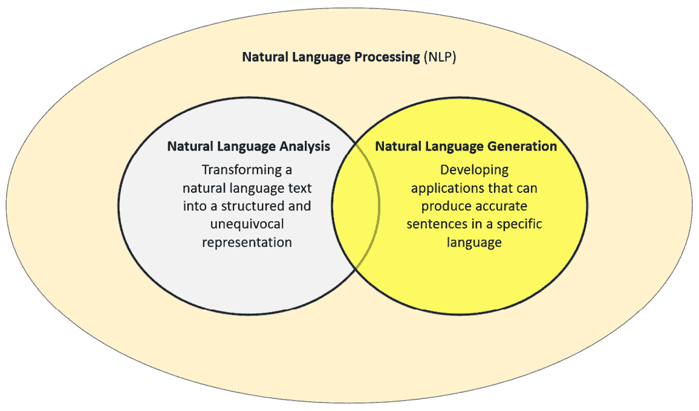
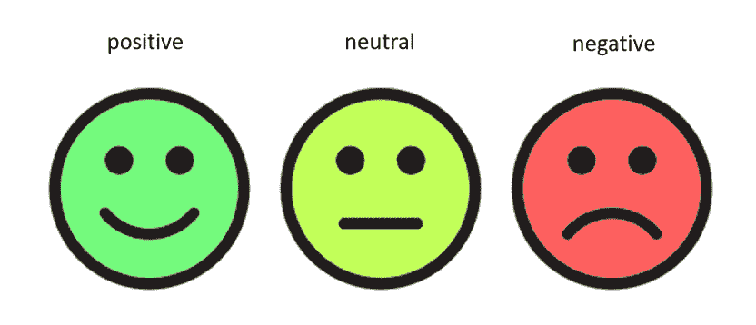
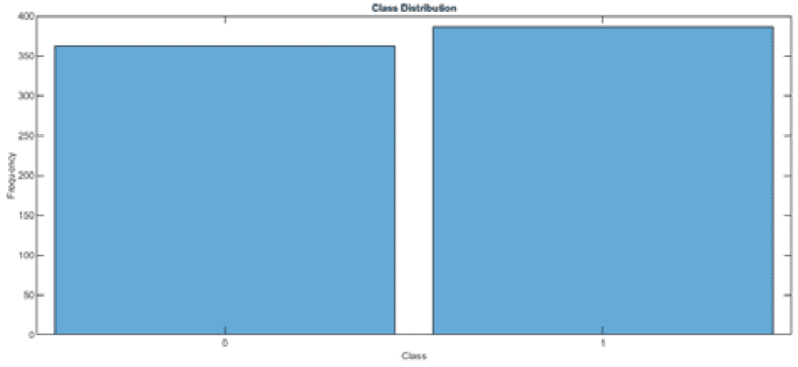
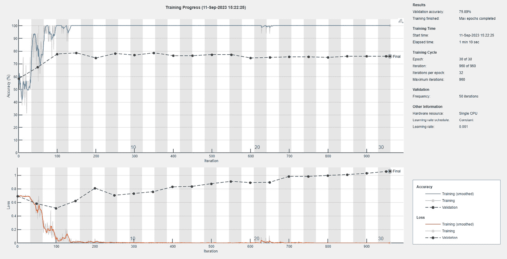

# 7

# 使用 MATLAB 进行自然语言处理

**自然语言处理**（**NLP**）自动处理通过口语或书面语言传达的信息。这项任务充满困难和复杂性，很大程度上是由于人类语言的固有歧义。为了使**机器学习**（**ML**）和以人类典型方式与世界互动，不仅需要存储数据，还需要教会机器如何将数据同时转换为有意义的概念。随着自然语言与环境的互动，它会产生预测性知识。在本章中，我们将学习 NLP 的基本概念以及如何构建一个用于标记句子的模型。

在本章中，我们将介绍以下主要主题：

+   解释 NLP

+   探索语料库和单词及句子分词

+   实现一个用于标记句子的 MATLAB 模型

+   理解梯度提升技术

# 技术要求

在本章中，我们将介绍基本的机器学习概念。为了理解这些主题，需要具备代数和数学建模的基本知识。你还需要熟悉 MATLAB 环境。

要使用本章中的 MATLAB 代码，你需要以下文件（可在 GitHub 上找到：[`github.com/PacktPublishing/MATLAB-for-Machine-Learning-second-edition`](https://github.com/PacktPublishing/MATLAB-for-Machine-Learning-second-edition)）：

+   `IMDBSentimentClassification.m`

+   `ImdbDataset.xlsx`

# 解释 NLP

自然语言处理（NLP）是一个致力于开发使计算机能够以模仿自然人类交流的方式与人类语言进行交互、理解和生成技术的领域。这涉及到各种技术和方法，旨在处理和分析自然语言的复杂性，如英语、中文、阿拉伯语等。目标是弥合人类语言和计算机语言之间的差距，使计算机能够理解并生成文本，就像它们在与人类对话者进行对话一样（**图 7.1**.1*）：


图 7.1 – NLP 任务

NLP 致力于开发分析、理解和创建文本的信息技术工具，这些工具与人类理解产生共鸣，模仿与另一人类的互动，而不是与机器的互动。自然语言，无论是口语还是书面语，都是最本能和最普遍的交流方式。与正式语言相比，它具有更高的复杂性，经常携带隐含意义和不确定性，这使得其处理相当具有挑战性。

NLP 包括一系列任务，包括但不限于以下内容：

+   **文本理解**：这涉及到从文本中提取意义和信息。它包括诸如情感分析（确定文本的情感基调）、命名实体识别（识别人名、地点、组织等名称）和文本分类（将文本分类到预定义的类别）等任务。

+   **语言生成**：这一方面专注于生成连贯且符合上下文的类似人类的文本。它包括诸如机器翻译（将文本从一种语言翻译成另一种语言）、文本摘要（创建较长的文本的简洁摘要）和对话生成（构建自然的对话回应）等任务。

+   **语音识别**：NLP 也扩展到口语领域。语音识别技术将口语转换为文本，使得语音助手和转录服务等应用成为可能。

+   **语言模型**：NLP 的最近进展导致了大型语言模型如 GPT-3 的开发，这些模型可以根据接收到的输入生成非常类似人类的文本。这些模型在大量文本数据上训练，并且可以根据各种 NLP 任务进行微调。

+   **聊天机器人和虚拟助手**：NLP 是聊天机器人和虚拟助手的基础，它们可以与用户进行基于文本或语音的对话，提供信息、协助和回应。

NLP 领域是跨学科的，从计算机科学、语言学、认知心理学等领域汲取知识。它涉及到处理语言结构、统计模型、机器学习算法以及**深度学习**（**DL**）技术来处理、理解和生成人类语言。虽然已经取得了重大进展，但 NLP 仍然面临挑战，如处理上下文、理解细微差别以及真正理解人类交流的复杂性：



图 7.2 – NLP 中的文本分析和文本生成

这个领域的追求包括两个主要目标：文本分析和文本生成。这些原则导致了后续学科的产生，即**自然语言分析**（**NLA**）和**自然语言生成**（**NLG**）。我们将深入探讨这两个领域。

## NLA

这个领域集中在增强机器对自然语言的理解能力。它涉及到将自然语言文本转换成结构化和明确的表现形式。NLA 包括使机器能够理解和解释人类语言的过程。其首要目标是弥合自然语言的无结构性质与计算机可以处理的结构化表示之间的差距。NLA 包括几个任务：

+   **句法分析**：这涉及到解析句子的语法结构，以理解词语之间的关系及其角色（主语、宾语、动词等）。它有助于识别词语是如何组织起来传达意义的。

+   **语义理解**：NLA 旨在理解词语和短语在上下文中的含义。它涉及从文本中使用的词语中提取潜在的概念和意图。

+   **命名实体识别**（NER）：NER 是识别和分类文本中命名实体的过程，例如人名、组织、地点、日期等。

+   **情感分析**：情感分析旨在确定文本中表达的情感基调，将其分类为正面、负面、中性，甚至更细微的情感。

+   **指代消解**：指代是指文本中不同词语或短语指代同一实体的情况。指代消解识别并连接这些引用，以提供对文本的连贯理解。

+   **文本分类**：文本分类是指根据文本内容将其归类到预定义的类别或类别中。这用于诸如垃圾邮件检测、主题分类和内容标记等任务。

+   **信息提取**：这涉及到从非结构化文本中提取特定信息或结构化数据。一个例子是从新闻文章中提取日期、事件、关系或数值数据。

+   **依存句法分析**：依存句法分析分析句子中词语之间的语法关系，通常表示为树状结构，显示词语如何相互依赖。

+   **语言模型**：语言模型通常使用机器学习技术训练，用于根据周围文本的上下文预测词语或短语出现的可能性。这些模型在理解语言的概率和模式方面发挥着关键作用。

+   **解析歧义**：语言往往包含可以以多种方式解释的模糊结构。NLA 旨在解决这些歧义，以达到句子的预期含义。

NLA 从语言学理论、计算语言学和机器学习（ML）中汲取灵感。它是一个复杂的领域，随着技术的进步和对机器在多样化应用中理解和处理人类语言需求的增加而不断发展，包括搜索引擎、聊天机器人、情感分析工具等。

## NLG

在这里，重点是使机器能够用自然语言构造句子。这涉及到开发能够产生特定语言中准确句子的应用程序。NLG 是 NLP 的一个关键方面，围绕计算机创建类似人类的文本。NLG 的主要目标是使机器能够生成连贯、上下文适当和语言准确的文本内容，模仿人类的交流方式。NLG 包含各种技术和过程，将结构化数据或信息转换为可读和可理解的语言。以下是关于 NLG 的几个要点：

+   **机器翻译**：机器翻译是 NLG 的最早形式之一，涉及将文本从一种语言翻译成另一种语言，同时保留其意义和上下文。现代机器翻译系统通常利用基于神经网络的途径以提高准确性。

+   **文本摘要**：NLG 用于总结较长的文本，如文章或文档，通过将主要思想和相关信息压缩成一个简洁且连贯的摘要。

+   **对话生成**：NLG 为聊天机器人、虚拟助手和其他对话代理提供动力。它涉及在对话中构建自然响亮的回应，考虑持续的上下文和用户输入。

+   **数据到文本生成**：NLG 用于将结构化数据，如统计数据或数据库条目，转换为人类可读的叙述。例如，从天气数据生成天气预报。

+   **内容创作**：NLG 系统可以根据预定义的模板或提示创建文章、报告和其他内容。这对于生成常规报告或新闻更新特别有用。

+   **个性化信息**：NLG 可以用于生成针对个人用户的个性化信息或推荐，例如，根据用户的浏览历史创建产品推荐。

+   **故事讲述和创意写作**：一些自然语言生成（NLG）系统可以生成虚构故事、诗歌或创意写作作品。虽然这些可能不如人类生成的内容先进，但它们展示了 NLG 在创意领域的潜力。

+   **自动代码生成**：在编程中，NLG 可以用于根据高级描述或规范生成代码片段或文档。

+   **医疗报告**：NLG 可以根据电子健康记录和医疗数据协助生成医疗报告或患者摘要。

NLG 技术可以从基于规则的途径到更高级的机器学习（ML）方法，如**循环神经网络**（**RNNs**）和**生成预训练转换器**（**GPT**）等转换器模型。这些模型从大量文本数据中学习模式和结构，以产生连贯且上下文相关的语言。

在需要以人类可读格式传达信息的应用中，NLG 是必不可少的，这使得技术更加易于访问和用户友好。尽管 NLG 系统已经取得了重大进展，但仍然存在挑战，包括在较长的文本中保持连贯性、确保准确性和避免生成内容中的偏见。

## 分析 NLP 任务

自然语言处理（NLP）包含一系列文本分析任务，形成一个分层结构。以下概述了句子分析所依赖的基础层：

+   **形态分析**：这一阶段的目标是将输入的语言字符串分解成一系列标记，这些标记对应于离散的单词、子单词和标点符号元素。通过标记化过程，文本被分割，形成一系列标记，每个标记代表文本中的一个单词。在这一阶段，有两个概念具有重要意义：词干和词元。词干是单词的基础形式，通过从其变化形式中去除屈折（如动词变形或名词复数）来获得。相反，词元代表单词的标准形式，通常选择以包含其所有屈折变化。这一阶段涉及识别每个单词的词干和词元，这可以通过两种不同的操作来完成：分别进行词干提取和词元还原。这些信息在后续分析阶段变得非常有用。这种方法的合理性在于对内存的高效利用——基于词成分及其组合形成的特定屈折形式的规则比管理大量库存中的每个单词作为独立元素要资源有效得多。

+   **语法分析**：要理解一个句子的含义，仅仅理解其构成单词的定义是不够的；同样重要的是要辨别这些单词之间的关系。这一阶段涉及对提供的文本进行句法检查。所有语言成分都被识别，包括动词、名词、形容词、副词、介词和代词。将每个单词标注为其相应词性的过程被称为**词性标注**。这个过程分为两个子过程：首先，浅层解析生成一个二叉树，其中识别出基本段——即**名词部分**（**NP**）和**动词部分**（**VP**）。其次，完全解析生成一个句法树，指定句子中每个单词的句法角色。

+   **语义分析**：语义分析阶段利用先前分析阶段获得的见解，包括单个词语的意义及其相互关系，以解释句子的整体意义。该过程使用命名实体识别来检测和分类由多个词语组成的实体组，这些实体可能包括人名、国家、事件等。语义处理旨在推断句子的潜在解释，特别关注句子中被检查的词语之间的意义互动。这种处理水平可能包括对具有多种意义的词语进行语义消歧，类似于对可以采用多种句法角色的词语进行的消歧。可以采用多种方法进行消歧，其中一些方法涉及评估特定语料库中每种意义的频率，而另一些方法则考虑上下文线索。此外，某些方法利用文档领域的语用知识来帮助消歧。

+   **语用分析**：这一阶段围绕识别文本所处的语境及其后续利用。具体来说，语用学深入探讨语境如何影响意义的解释。在这个语境中，“语境”指的是周围的环境，包括一系列非语言因素（如社会动态、环境线索和心理因素），这些因素影响语言表达。确实，人类语言不仅仅根植于其形态学、句法和语义属性；它还与句子嵌入的情境相关的外部知识紧密相连。在语用分析中，通常区分话语的字面意义和说话者的意图意义。字面意义是指对表达的直接解释，而说话者的意图是指说话者旨在传达的潜在概念。为了准确解释交流，可能需要几个因素。以下包括以下内容：

    +   理解对话参与者的角色和地位

    +   识别情境的时空背景

    +   了解所讨论主题的知识

从另一个人说话中理解隐含意义的本领被称为**语用能力**。尽管这种分析很重要，但在文献中仍未得到充分详细地阐述，这主要是因为它所提出的巨大挑战。

## 引入自动处理

从自动处理的角度来看，句法层面呈现的挑战较少。复杂的句子可以被分析，其语法准确性可以被识别，其句法结构可以无缝重建。然而，语义层面则证明要复杂得多。在简单的情况下，以下方法可行：

+   一旦句子的句法结构被识别，句子意义就可以从单个词的意义中推断出来。

+   单个词的意义可以通过自动化手段从易于获取的词典中得出。

然而，出现了许多问题，如下所述：

1.  首先，同一个词在不同的语境中可以有不同的含义。

1.  其次，句子的句法结构可能是模糊的，有时会赋予同一序列的词不同的结构。

1.  最后，某些习语短语具有与从其构成词的意义组合中得出的字面解释不同的含义。

人工智能通过利用语言处理程序可以访问的适当知识库来应对这些挑战。

话语层面引入了一个更加复杂的领域。主要的挑战来自于我们在对话中预测对话者心理状态的能力。本质上，有效的沟通需要表达对话者的意图，而这些意图只在他们的话语中部分显现。

现在我们已经介绍了 NLP 的基本概念，让我们分析一下那些能让我们从实际角度接近问题的具体内容。

# 探索语料库和单词及句子分词器

语料库、单词和句子分词的分析构成了全面语言理解的基础。语料库提供了用于分析的现实世界语言数据，单词构成了表达元素，句子分词将文本结构化为有意义的单元以供进一步研究。这三个概念在推进语言研究和增强 NLP 能力方面发挥着核心作用。

## 语料库

在语言学和 NLP 中，语料库指的是大量书面或口语文本的集合，这些文本是语言学分析和语言相关研究的有价值的数据来源。语料库提供了多样化的语言样本，使研究人员能够检查不同语境和体裁中语言使用、句法和语义的规律、趋势和变化。

语言学语料库代表大量口语或书面文本的集合，通常源自真实的交流语境（包括演讲或报纸文章）。这些集合被数字化，并经常伴随着计算机化工具以便于访问：


图 7.3 – 语料库基本关键概念的词云。单词以不同的大小显示，最频繁的单词最大。词云通常用于识别语料库中的关键概念

语料库的作用是检查语言的实际应用情况，并通过统计分析验证总体趋势。它们在当代词典学中扮演着关键角色，有助于诸如根据使用频率选择词元、识别涉及特定单词的典型语言结构以及理解不同语境中意义的细微差别等任务。

此外，语料库在语言技术（如自动翻译和语音识别）的发展中发挥着重要作用。在这些应用中，语料库被用来构建统计语言模型。它们在语言教育中也很有用，支持教学资源的创建。特别是对于高级学习者来说，通过观察其语境应用，语料库能够帮助他们推导出词的性质和语言结构。

语料库的例子有很多；以下是最常用的几个：

+   **《布朗语料库》**：英语中最早和最著名的语料库之一，它包含来自各种来源的超过一百万个单词的文本

+   **《纽约时报语料库》**：一个包含从 1987 年到 2007 年纽约时报新闻文章的大型语料库

+   **《古腾堡语料库》**：一个包含 60,000 多本公共领域免费电子书的集合

+   **《语言数据联盟》（**LDC**）语料库**：一个包含各种语料库的仓库，包括不同语言和领域的语料库

MATLAB 提供了各种工具来访问和处理语料库。以下是一些最常用的工具：

+   **《文本分析工具箱》**：一个全面的文本处理工具箱，包括分词、词干提取、词形还原和情感分析等功能

+   **《自然语言处理工具箱》**：一个用于自然语言处理任务的工具箱，如命名实体识别、词性标注和依存句法分析

+   **《网络服务工具箱》**：一个用于访问和交互网络服务的工具箱，包括那些提供访问语料库的服务

## 词

词是语言的基础单位，承载着意义并传达思想。对词的分析包括研究它们的形态、意义、关系和用法模式。这种研究可以包括诸如形态结构、词性分类、频率分布和语义关联等方面。研究词可以帮助语言学家理解语言的结构以及如何通过词汇传达意义。

在机器学习（ML）和深度学习（DL）任务中，单词被表示为数字向量。这样做是因为机器学习算法只能处理数值数据。将单词转换为向量的过程称为词嵌入。

存在两种主要的词嵌入类型：

+   **词袋模型**（**BoW**）：在**BoW**中，语料库中的每个唯一单词被分配一个唯一的索引。然后，文档被表示为文档中每个单词计数的向量。假设词汇量大小为 4；在这里，一个表示“我喜欢猫”的样本文档被表示为[1 1 1 0]。在 BoW 中，我们简单地通过每个单词的频率来表示文档。例如，如果我们有一个包含 1,000 个单词的词汇表，那么整个文档由一个 1,000 维向量表示，其中向量的第*i*个条目表示文档中第*i*个词汇词的频率。

+   **Word2vec**：Word2vec 是一种更复杂的词嵌入方法，它考虑了单词出现的环境。Word2vec 学习两种类型的嵌入：词嵌入和上下文嵌入。词嵌入是表示单个单词的向量，而上下文嵌入是表示给定单词周围单词的向量。例如，“猫”的词嵌入可能是[0.1, 0.2, 0.3]，而“猫”的上下文嵌入可能是[0.4, 0.5, 0.6]。

## 句子分词

在**句子分词**过程中，我们在每个句子中识别称为标记的原子元素。这些标记是分析评估句子本身的基础。因此，在分词阶段，我们不仅识别评估这些元素，而且偶尔还会转换否定结构。这导致文本被分割成标记，这些标记可以被视为*不可分割*的单位。对于使用空格分隔单词的语言来说，这项任务相对简单，但对于具有连续拼写系统的语言来说，它变得相当复杂。专注于像英语这样的语言，它属于前者，一个标记可以定义为任何由空格包围的字符序列。然而，值得注意的是，这个定义允许有多个例外。在单词边界在书面文本中未明确表示的语言中，这个过程被称为词分割：


图 7.4 – 单词分词过程

在分词的更广泛背景下，需要解决几个挑战：

+   缺乏分隔单词与前后标点符号的空间

+   字符序列未用空格分隔的实例应被视为两个单独的标记

+   字符序列用空格分隔的场合应被视为一个单独的标记

+   管理大小写变化

+   导航拼写习惯的变化

最终，在这个过程的最后，我们识别出一个具有指定意义的字符串，我们称之为**标记**。每个标记都由一个标记名称和一个可选的标记值组成的对构成。

现在我们已经详细研究了 NLP 的基础知识，我们可以继续分析在 MATLAB 中实现句子分类器的实现。

# 实现 MATLAB 模型以标记句子

在本节中，我们将讨论一个在当今社会非常受欢迎的非常有趣的话题。我指的是评论在影响顾客做出正确决策的兴趣方面的重要性。

## 介绍情感分析

情感分析，一种利用 NLP 的技术，从文本中提取和分析主观信息。分析大量数据集揭示了影响各个领域的集体意见。虽然手动情感分析具有挑战性，但自动方法已经出现。然而，由于人类语言的细微差别，自动化语言建模既复杂又昂贵。此外，方法论在不同语言之间有所不同，增加了复杂性。

一个主要挑战在于确定意见的极性。极性分类是主观的，因为不同的人根据他们的价值观对同一句话有不同的理解。社交媒体的兴起提高了对情感分析的兴趣。随着在线表达的增多，这个领域对商业来说已经成为推广产品、识别机会和保护声誉的有价值工具。情感分析算法中使用简单术语来传达意见引发了挑战。文化影响、语言差异和上下文因素使得将书面文本转换为二元积极或消极情感变得非常复杂：



图 7.5 – 情感分析极性

高级情感分析旨在确定特定的情绪，如快乐、悲伤或愤怒。例如，它可以涉及将歌曲评论不仅分类为正面或负面，还可以预测数值评分，对酒店评论进行全面分析，并为舒适度、噪音水平和设计等方面提供评分。

此外，将给定的文本分类为两类之一：客观或主观是可行的。文本可能包含客观信息，如新闻文章中所示，或者它可以是主观的，例如采访中表达的政治观点。句子的主观性通常取决于其上下文，甚至一份客观文件也可能包含主观短语，如引语。区分主观性和客观性可能比分类极性更具挑战性，因为它在很大程度上依赖于周围的文本上下文。

情感分析提供了几种方法，其中最常用的方法可以分为四个广泛的类别：

+   **基于词典的算法**：这些技术识别文本中的情感关键词，并赋予它们预定的亲和力以代表特定的情感。

+   **基于规则的算法**：这种方法根据明确的情感类别对文本进行分类，依赖于诸如*快乐*、*悲伤*或*无聊*等明确的情感词的存在。

+   **统计方法**：在这个类别中，目标是确定情感来源（主题）和目标（被评估的对象）。为了在上下文中衡量意见并识别被评估的属性，通过广泛分析文本中的词语之间的语法关系。

+   **机器学习算法**：这些方法使用各种学习算法来推断情感，通常利用具有预定义分类的数据集（监督方法）。学习过程是迭代的，需要构建将极性与不同类型的评论关联起来的模型，并在必要时进行主题分析以获得更全面的理解。

表情符号和表情符号的使用正在增加。人们不再仅仅依赖文字，而是经常使用小小的圆形面孔和其他符号来表达他们的情感。这些视觉元素被证明是迅速而愉快地传达信息的宝贵工具。使用 DL 架构，可以学习表情符号和情感之间的关系。例如，一种 DL 方法可能在一个包含大量文本和表情符号的语料库上训练，以学习表情符号的特征，这些特征最能够预测情感。

让我们学习如何应用 DL 提供的工具来解决情感分析的实际案例。

## 电影评论情感分析

评论已成为企业繁荣发展的关键要素，它们提供了来自客户的宝贵反馈，并推动购买决策。评论作为潜在买家可靠的信息来源，为卖家提供改进产品和服务的洞察。此外，评论促进了用户参与度，放大了口碑营销的力量，对公司的在线声誉产生重大影响。对于所有规模的企业来说，确保获得正面评论对于维持盈利至关重要。

社交媒体和互联网的兴起极大地改变了消费者的购买行为。潜在买家现在在做出购买决策之前会积极寻找在线评论和信息，对传统口碑推荐的依赖减少。他们变得更加独立和挑剔，仔细考虑他们的选择。

在过去，影评人在塑造消费者偏好方面扮演着主导角色，影响电影选择并培养批判性思维。然而，随着消费者生成评论的出现，这一范式发生了转变，消费者意见现在在影响购买决策方面具有更大的影响力。这种意见民主化赋予了消费者分享他们的经验和塑造文化景观的权力。

对于将电影评论分类为正面或负面情感的任务，我们将使用 IMDb 电影评论数据集的简短版本。该数据集专门设计用于二元情感分类，并包含 748 条恰当地标记的评论。在这个例子中，数据集仅使用两个特征：评论和类别进行了充分回顾。

让我们学习如何使用 RNN 构建用于分类句子的模型。

## 使用 LSTM 模型进行句子标记

LSTM 模型是**循环神经网络**（RNN）的一种高级形式，能够在序列中学习长期依赖关系，使其成为处理序列数据（如文本、语音和时间序列数据）的强大工具。这使得它在诸如标签句子分类等任务中非常理想，这些任务的目的是根据句子的整体情感为其分配标签。LSTM 已经在包括情感分析、机器翻译、语音识别和自然语言生成在内的各种任务中得到了成功应用。

要学习如何在 MATLAB 中实现用于标记句子的模型，我们将使用大量在线用户制作的电影评论：。

1.  首先，我们需要将数据集导入 MATLAB 工作空间。您可以在项目的 GitHub 页面（`ImdbDataset.xlsx`）上找到`.xlsx`格式的数据集。为了简化此任务，数据集已被适当裁剪。一旦您下载了文件，您只需指定根文件夹的路径。然后，您可以像这样将数据加载到 MATLAB 工作空间中：

    ```py
    ImdbData = readtable("ImdbDataset.xlsx",'TextType','string');
    ImdbData.Class = categorical(ImdbData.Class);
    ```

    在加载数据后，我们需要通过创建直方图来可视化数据集中类别的分布。这将帮助我们评估数据是否均匀分布：

    ```py
    figure
    histogram(ImdbData.Class);
    xlabel("Class")
    ylabel("Frequency")
    title("Class Distribution")
    ```

    将绘制如图*图 7**.6*所示的图表：



图 7.6 – 电影评论的类别分布：0 表示负面，1 表示正面

1.  接下来的步骤是将数据分为训练集和验证集。将数据分为训练集和用于验证和测试的单独保留集：

    ```py
    DataSplitting = cvpartition(ImdbData.Class,'Holdout',0.3);
    ```

1.  `cvpartition()`函数建立了一个随机数据集分区。您可以使用此分区创建用于通过交叉验证评估统计模型的训练集和测试集。将保留百分比设置为 30%；这意味着 70%的数据将用于训练，而剩余的 30%将保留用于验证。

    现在，我们将使用训练选项来获取交叉验证的训练索引，以及测试选项来获取测试索引：

    ```py
    TrainDataset = ImdbData (training(DataSplitting),:);
    TestDataset = ImdbData (test(DataSplitting),:);
    ```

    然后，我们将从分割的表中检索评论数据和相应的类别：

    ```py
    TrainReview = TrainDataset.Review;
    TestReview = TestDataset.Review;
    TrainClass = TrainDataset.Class;
    TestClass = TestDataset.Class;
    ```

1.  到目前为止，我们的数据已经准备好使用，我们可以开始预处理评论数据。我们将使用一个名为`preprocessText`的函数，该函数用于标记化和文本预处理。此函数执行以下任务：

    1.  使用 `tokenizedDocument` 对文本进行标记化。

    1.  使用 `lower` 将文本转换为小写。

    1.  使用 `erasePunctuation` 移除标点符号。

    我们将应用 `preprocessText` 函数对训练数据和验证数据进行预处理：

    ```py
    TrainDoc = preprocessText(TrainReview);
    TestDoc = preprocessText(TestReview);
    ```

    之后，我们必须应用单词编码技术。这种方法涉及将人类语言（如英语）中的单词转换成适合广泛计算任务的数值或符号格式，特别关注在自然语言处理（NLP）和机器学习（ML）中的应用。

1.  为了将文档转换为数值索引序列，我们将使用 `wordEncoding()` 函数，如下所示：

    ```py
    EncText = wordEncoding(TrainDoc);
    ```

    此函数将词汇表中的单词与数值索引关联起来。

    要将评论作为 LSTM 的输入，所有输入必须具有相同的长度。然而，数据集中的评论长度各不相同。一种解决方案是截断较长的评论并填充较短的评论，以确保它们的长度相同。为了截断和填充评论，首先选择一个目标长度。然后，截断较长的文档并填充较短的文档。为了达到最佳效果，目标长度应该足够短，以避免丢弃大量数据。

1.  为了找到一个合适的目标长度，我们可以可视化训练文档长度的直方图：

    ```py
    NumDoc = doclength(TrainDoc);
    figure
    histogram(NumDoc)
    xlabel("Number of tokens")
    ylabel("Number of Reviews")
    ```

    首先，我们计算了每条评论的长度。然后，我们绘制了分布的直方图。以下图表被打印出来：


图 7.7 – 电影评论的标记分布

通过分析电影评论的标记分布，我们会注意到大多数评论在 0 到 30 之间有几个标记。因此，我们可以选择这个数字作为目标长度：

```py
TokNum = 30;
```

1.  现在，我们需要将评论转换为数值索引序列：

    ```py
    RewTrain = doc2sequence(EncText,TrainDoc,'Length',TokNum);
    RewTest = doc2sequence(EncText,TestDoc,'Length',TokNum);
    ```

    为了做到这一点，我们使用了 `doc2sequence()` 函数，该函数将文档转换为适合深度学习的序列。此函数提供了一个包含文档中单词的数值索引的单元格数组，这些索引由提供的单词编码确定。序列数组中的每个元素都是一个向量，由表示相应文档中单词的索引组成。

1.  现在，我们将继续定义 LSTM 网络的架构：

    ```py
    inputSize = 1;
    embeddingDimension = 150;
    numHiddenUnits = 50;
    numWords = EncText.NumWords;
    numClasses = numel(categories(TrainClass));
    layers = [ ...
        sequenceInputLayer(inputSize)
        wordEmbeddingLayer(embeddingDimension,numWords)
        lstmLayer(numHiddenUnits,'OutputMode','last')
        fullyConnectedLayer(numClasses)
        softmaxLayer
        classificationLayer]
    ```

    要将序列数据输入网络，包含一个输入大小为 1 的序列输入层。一个具有 1 维的序列输入意味着每个数值编码的标记由一个 1x1 标量表示。随后，引入一个维度为 150 的词嵌入层，这应该与单词编码中指定的单词数量相匹配。词嵌入层学会将单词映射到向量中，以捕捉单词的意义。随后，包含一个具有 50 个隐藏单元的 LSTM 层。对于使用 LSTM 层的序列到标签分类任务，最后配置`OutputMode`。最后，添加一个与类别数量相同的全连接层，然后是 softmax 层和分类层。

    已定义的 LSTM 架构如下所示：

    ```py
    layers =
    6×1 Layer array with layers:
    1   ''   Sequence Input          Sequence input with 1 dimensions
    2   ''   Word Embedding Layer    Word embedding layer with 150 dimensions and 2410 unique words
    3   ''   LSTM                    LSTM with 50 hidden units
    4   ''   Fully Connected         2 fully connected layer
    5   ''   Softmax                 softmax
    6   ''   Classification Output   crossentropyex
    ```

1.  现在，我们必须指定训练选项：

    ```py
    options = trainingOptions('adam', ...
        'MiniBatchSize',16, ...
        'GradientThreshold',2, ...
        'Shuffle','every-epoch', ...
        'ValidationData',{RewTest,TestClass}, ...
        'Plots','training-progress', ...
        'Verbose',false);
    ```

    设置了以下选项：

    +   `adam solver`: Adam，源于*自适应矩估计*，是机器学习和深度学习领域广泛采用的优化算法。其主要作用是在模型训练过程中调整参数，同时包含权重和偏差。Adam 因其训练神经网络的有效性而特别闻名。

    +   `MiniBatchSize`: 这是一个超参数，决定了在执行 Adam 或类似优化算法的每个训练迭代中使用的示例数量，这些示例是单个数据点或样本。

    +   `GradientThreshold`: 这指定了训练过程中的梯度阈值。它用于使训练模型更加稳定和高效，尤其是在处理 RNN 或深度架构时。

    +   `Shuffle`: 此选项在每个 epoch 中对数据进行洗牌，以增加算法中的随机程度。

    +   `ValidationData`: 此选项指定用于验证过程的数据。

    +   `Plots`: 使用此选项，训练过程将通过一个升级过程进化的图表进行检查。

    +   `Verbose`: 训练过程的输出将被隐藏。

1.  最后，我们可以开始训练过程：

    ```py
    LSTMNet = trainNetwork(RewTrain,TrainClass,layers,options);
    ```

    将打印以下图表：



图 7.8 – LSTM 的训练过程

训练过程通过构建一个能够返回 75.89%验证准确率的网络来处理数据。鉴于可用数据量较小，这个结果可以被认为是令人满意的。

为了提高模型的性能，我们可以尝试使用稍大的 LSTM 单元数量（100 而不是 50）进行模拟。然而，将嵌入维度（从 150 变为 100）可以提高验证准确率至至少 85%。

现在我们已经分析了如何构建用于分类电影评论的 LSTM，让我们学习如何使用集成方法提高预测的准确性。

# 理解梯度提升技术

为了提高算法的性能，我们可以执行一系列步骤并使用不同的技术，具体取决于算法的类型和要解决的问题。第一种方法涉及对数据进行彻底分析，以识别可能的不准确或不足之处。此外，许多算法都有可以调整以实现更好性能的参数——更不用说特征缩放或特征选择等技术。一种流行的技术是结合不同算法提供的功能，以实现更好的整体性能。

## 接近集成学习方法

集成学习的概念涉及使用多个模型以最大化性能的方式组合，通过利用它们的优点并减轻它们的相对弱点。这些集成学习方法基于弱学习模型，这些模型本身不能达到高水平的准确性，但结合在一起可以产生稳健的预测。在集成学习的背景下，**弱学习器**是一个可以产生略好于随机结果的模型，而**强学习器**则接近理想模型，可以克服传统模型典型的问题，如过拟合。

每个使用的模型都会返回可能正确或错误的预测。在监督学习问题中，预测误差的计算如下：

误差 = 偏差² + 方差

误差的两个基本组成部分是精确度和方差。使用集成方法的目标是通过尝试减少**方差**和**偏差**来获得可靠的预测。方差是模型对给定数据点的预测的变异性。具有高方差的模型被称为过拟合，这意味着它在学习训练数据中的噪声而不是潜在的模式。这也可能导致较差的泛化性能。偏差是模型的平均预测值与正确值之间的差异。具有高偏差的模型被称为欠拟合，这意味着它没有学习数据中的潜在模式。这可能导致模型在未见过的数据上表现不佳。这两个组成部分之间通常存在权衡：低精度的分类器往往具有高方差，反之亦然。机器学习的目标是找到一个具有良好偏差和方差平衡的分类器。这被称为偏差-方差权衡。一般来说，很难找到一个既具有低偏差又具有低方差的分类器。然而，可以使用一些技术来减少偏差和方差，例如特征选择、正则化和交叉验证。

为了提高模型的准确性，假设不同的分类器可以在每个样本上犯不同的错误，但会在正确的分类上达成一致。通过平均分类器的输出，通过平均误差成分来降低整体误差。通过模型组合输出并不一定保证比其他模型有显著更好的分类性能，但它有助于降低选择表现不佳的分类器的可能性。

有几种集成方法。它们主要在处理数据的方式上有所不同。最常见的是以下几种：

+   **Bagging**

+   **随机森林**

+   **Boosting**

最早的集成模型是在 1990 年代开发的，但在撰写本文时，没有具体的研究可以帮助用户选择最合适的元分类器。这些方法被广泛用于解决各种学习问题，包括特征选择。在接下来的章节中，我们将分析每种集成技术的基本原理。

## Bagging 定义和意义

**Bagging** 是一种集成学习方法，它收集弱学习器（基本模型）的预测，比较它们，并将它们组合成一个单一预测。bagging 的独特之处在于每个决策树的训练集是如何选择的。

为了创建每个训练集，bagging 使用了原始数据集上的有放回抽样，这被称为 bootstrapping。**Bootstrapping** 是一种统计重抽样技术，用于近似估计量的样本分布。这意味着数据是从原始训练集中随机选择的，有些数据可能会被多次选择。这种程序增加了产生的决策树的多样性。

这种方法的一个特殊之处在于，当基本学习器（弱学习器）不太稳定且因此对训练数据的变动非常敏感时，它效果最好。在存在稳定的基本学习器的情况下，整体性能甚至可能恶化。

bagging 的基本概念是结合多个不稳定但偏差低的模型，以产生一个整体方差低的模型。bagging 的逻辑基于这样一个想法：同分布随机变量的期望值等于单个随机变量的期望值。

bagging 方程如下：

y _ predicted = 1 / T Σ _ t = 1 ^ T f _ t(x)

这里，我们有以下内容：

+   *T* 是集成中的模型数量

+   *f_t(x)* 是第 t 个模型的预测

因此，目标是利用这种平均操作来降低方差。

通常，决策树是这种方法的一个合适选择，因为尽管它很简单，但它可以有效地捕捉变量之间的非线性关系和交互。

调整袋装法的关键参数是树的数量。然而，模拟研究和实证证据表明，该模型的性能并不过度受此参数选择的影响。因此，选择足够多的树以获得满意的结果就足够了。

总结来说，袋装法是一种基于反复采样训练数据并组合弱学习器预测的集成学习方法，当与对数据变化敏感的基本模型一起使用时尤其有效。

## 发现随机森林

**随机森林**是袋装法的一种特殊情况，其基本目的是通过平均多个模型来减少方差。再次强调，基于决策树的模型通常是理想的选择，因为它们可以有效地捕捉数据中的复杂交互结构，这与其他方法难以实现。通过生成大量树，偏差往往较低。

尽管这两种技术的概念基础相似，但通过正确调整模型参数，随机森林可以产生更优的结果。这得益于其集成学习方法以及有效调整超参数的能力。这是因为，尽管树存在误差，但使用袋装法允许从相同的分布中生成树，使得每棵树的期望值等于生成的 *N* 棵树的平均值的期望值。

袋装模型的偏差与单个树相似，因此改进的重点在于降低方差。这是随机森林模型的特点，旨在通过减少树之间的相关性来提高袋装法的方差。

对于 *N* 个具有方差 *σ2* 的相同分布的随机变量，当 *N* 个变量的平均方差等于 *(1/N)*σ2* 时，如果变量是相同分布但不必定独立的，并且假设存在正的成对相关系数 ρ，则平均方差的表示如下：

平均方差 = (1 / N) σ2 + [(N - 1) / N]ρ σ2

在这个公式中，第一项表示单个随机变量的方差除以 *N*，代表当变量独立时的平均方差。第二项考虑了随机变量之间的成对相关性，根据它们的关联程度增加平均方差。

随机森林使用的技术是减少树之间的相关性，因此通过随机选择输入变量来生长树，从而降低方差。与袋装法的主要区别在于，随机森林选择的分区候选变量数量少于可用的变量总数。

随机森林是一种结合一系列决策树以产生更精确结果的方法。在构建这些随机决策树时，考虑了两个关键概念：

+   **训练数据的随机抽样**：在训练阶段，随机森林中的每一棵树都通过仅关注原始数据的一个随机样本来学习。这些样本是通过替换技术提取的，称为重抽样，这意味着某些数据可以在同一棵树中多次使用。虽然从理论上讲，与在特定数据集上训练相比，这会在每棵树中产生较高的方差，但整体森林（即树集）的方差往往较低，而偏差的增加并不显著。

+   **随机特征集用于分区选择**：在随机森林中，仅考虑可用特征的一个子集来对每个决策树中的节点进行分区。通常，这个子集是特征总数的平方根。例如，如果有 16 个特征，每个决策树中的每个节点只考虑四个随机特征来进行分区。当然，也可以通过在每个节点考虑所有特征来训练树，就像在回归中通常所做的那样。

总结来说，随机森林结合了数百或数千棵决策树，每棵树都在略微不同的数据集上训练，并且仅使用有限数量的特征进行细分。随机森林的最终预测是通过平均每棵决策树的预测得到的，这意味着每棵树对最终决策的贡献是相等的。

## 提升算法解释

**提升法**是另一种可以应用于决策树以增强其预测能力的方法。与袋装法类似，提升法可以应用于回归和分类统计模型。

袋装和提升都可以应用于决策树以预测其能力。然而，它们之间有一些差异。在袋装法中，关键要关注的是由子集生成的每棵树与其他树的独立性。

然而，提升法采取了不同的方法。它不是像袋装法那样生成完全独立的树，而是迭代地训练一系列树。每一棵后续的树都试图纠正前一棵树的错误。换句话说，用于训练后续树的子数据集是根据前一棵树的错误预测进行加权的。这个持续的过程旨在逐步提高整体模型的表现。

总结来说，虽然袋装法基于从数据子集中创建独立的树，但提升法侧重于迭代训练的树来纠正其前驱的错误。两者都用于提高决策树的预测能力，但它们采用不同的方法。

提升法的特殊之处在于决策树的顺序构建——也就是说，每一棵树都是基于从上一棵树处理和获得的信息构建的。

与试图在整个数据集或至少是训练集上建模决策树的其他技术不同，提升的目标是获得具有增量学习的预测模型。我们称之为逐步学习，因为第一个模型是基于训练集的数据构建的。然后构建第二个模型，试图纠正第一个模型的错误。而不是基于之前的*Y*预测建立新的模型，方法是通过尽可能好地建模获得的错误来构建下一个树。这个想法是在创建序列弱学习器（弱模型），每个都试图纠正前一个模型的错误。在提升中，集成中的每个后续树都是基于前一个树的残差进行训练的，这些残差是实际值和预测值之间的差异。这种方法允许每棵树专注于纠正前一个树的错误，从而提高整体准确性。

即使初始数据集很大，这些树中的每一个也可能有尽可能少的最终节点。这可能是由于算法的参数，也可能是由于较小的树可能在纠正前一个树的错误方面表现更好。

目标是逐棵树地改进模型在表现不佳的领域的最终模型。

提升提供了三个可以操作的参数，可以用来优化决策树的建模：

+   **树的数量**（**T**）：与袋装技术一样，增加树的数量（*T*）通常会导致更高的预测准确性。然而，需要注意的是，*T*的值过高会增加模型过拟合的风险。例如，与随机森林相比，提升在*T*值较高时更容易过拟合。

+   **学习率**（**λ**）：这个参数表示树的 学习率，通常具有很低的值，通常在 0.01 和 0.001 之间。λ的值对模型的结果有巨大的影响。非常低的λ值需要更多的树（*T*）来获得一个表现良好的模型。λ最佳值的选取可以显著影响模型的行为。

+   **分割数**（**s**）：*s*表示分割数，默认值为 1，这意味着你得到“树桩”或只有一个父节点和两个叶节点的树。虽然通常使用 1 作为*s*的值来加快计算速度，但改变它可以显著影响模型结果。通过改变*s*的值，可以获得具有不同结构和复杂性的树。

有几种提升技术，每种技术都有不同的构建树或加权的变体，以提高整体预测能力。以下是一些主要的提升技术：

+   **自适应提升**（**AdaBoost**）：AdaBoost 是最早的提升算法之一，也是最流行的之一。在这种方法中，每个训练样本被赋予一个初始权重，后续迭代专注于纠正前一次迭代中犯的错误。基于这些权重构建弱学习树，通常是树桩。AdaBoost 给予过去的错误更多的权重，使后续的树能够专注于改进先前错误分类的示例的预测。

+   **梯度提升**：梯度提升是一种通用的提升框架，可以以不同的方式实现。在梯度提升中，树是顺序构建的，但与 AdaBoost 不同，每一棵树都试图减少损失函数的梯度。这意味着每一棵后续的树都专注于模型错误分类或错误预测的示例，逐渐提高性能。

+   **极端梯度提升**（**XGBoost**）：XGBoost 是梯度提升的高级实现，在机器学习竞赛中获得了流行。它引入了几个优化和正则化来提高模型性能和稳定性。XGBoost 以其速度著称，可用于分类和回归问题。

这些提升技术各有其特点，针对不同数据类型和机器学习问题有特定的适应方法。提升算法的选择将取决于你问题的具体需求和期望的性能。

# 摘要

在本章中，我们研究了自然语言处理（NLP），它自动处理通过口语或书面语言传输的信息。首先，我们通过识别可以解决的问题分析了 NLP 的基本概念，然后转向涉及文本分析和文本生成的主要方法。然后，我们转向分析语料库、单词和句子分词。语料库提供了用于检查的真实语言数据，单词作为表达的基本组成部分，句子分词将文本组织成连贯的单位以进行深入分析。

在本章的第二部分，我们分析了使用 NLP 对电影评论进行标注的实际案例。这是一个旨在自动识别文本评论极性的情感分析问题。在这个例子中，我们实际上学习了在 MATLAB 中执行此类分析应使用哪些工具。在本章的最后部分，我们分析了集成学习方法以改进算法的性能。我们理解了提升和袋装之间的差异，并发现了不同的提升技术。

在下一章中，我们将了解图像处理和计算机视觉的基本概念。我们将发现计算机视觉的 MATLAB 工具以及如何实现用于物体识别的 MATLAB 模型。我们还将了解迁移学习、领域自适应、多任务学习和显著性图、特征重要性分数以及基于梯度的归因方法。
